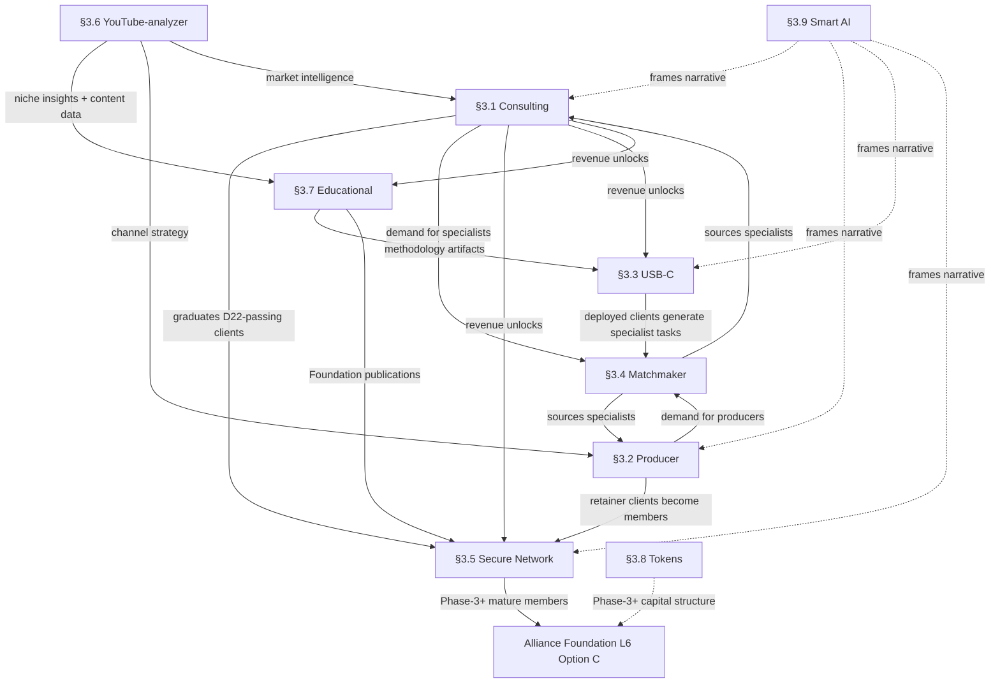

# LAYER-5 Product Directions Deep-Dive

> **Phase 2 Wave 2 foundation document.** Unblocks Phase 3 strategic documents
> (ai-consulting-DACH, producer-services, JETIX-COMPASS) and Phase 4 outreach
> execution. L6 Community Deep-Dive (ack'd 2026-04-25 01:00 CET) defined the
> **ICP Trinity** + Alliance Option C Hybrid + 4 primary archetypes — *whom*
> Jetix sells to. L5 answers *what* Jetix sells. L7 (next cycle) will answer
> *how much + how scaled*. Without L5, Phase 3 strategic docs cannot describe
> offer structure; Phase 4 outreach cannot pitch a concrete product.

---

## §1 TL;DR

### Layer 5 в трёх предложениях

Layer 5 — это **продуктовый слой** Jetix OS: концретный портфель того, что Jetix продаёт и строит как товар/услугу на траектории €0 → $1T. В отличие от L6 (кто платит, как находим, через какую Alliance-структуру) и L7 (сколько, с какой unit-economics), L5 отвечает на вопрос *что именно мы предлагаем рынку сейчас и что предложим на каждом из 5 gates*. Этот документ — Phase 2 Wave 2 foundation: без него нельзя писать Phase 3 стратегические документы (consulting-DACH, producer-services, JETIX-COMPASS) и нельзя запускать Phase 4 outreach — непонятно *что* питчить. [src:swarm/wiki/tasks/T-layer-5-product-deep-dive-2026-04-25/intake.md#§1]

### Пять главных выводов

**1. Портфель из 9 направлений, два из которых revenue-primary в Phase-1.** §3.1 AI Consulting + §3.2 Продюсерский центр — единственные direction, генерирующие выручку в G0→G1 (€0 → €50K Q2 2026); остальные семь — инфраструктура, которую эти два финансируют и валидируют. §3.3 USB-C Integration Services, §3.4 Matchmaker Platform, §3.5 Secure Network раскрываются на G1→G2 (€50K→€200K) — manual / design / first productization. §3.6 YouTube-analyzer SaaS, §3.7 Educational + Investor + Grant Hunting, §3.8 Tokens — Phase-3+. §3.9 Smart AI — cross-phase внутренний narrative label, *не D29 lock* (Ruslan explicit «ну типа запиши между прочим но нет это ещё не лок»). Детали: §2 Portfolio + §3.1-§3.9 + §13 Evolution.

**2. L6 ack'd constraints применены verbatim.** ICP expanded spectrum ($5K/mo OR $10K one-shot payment filter; millionaires + high-earners + предприниматели-блогеры); P1A active cold outreach = Mittelstand + Startupper; P1B opportunistic referral = high-earners + миллионеры; Alliance Option C Hybrid (Foundation Apache 2.0 upstream + Jetix-Corp proprietary core); 4 primary archetypes Phase-1 (Startupper / Блогер / Operator-Founder-CEO / Teacher); Matchmaker 3 cadences (manual Ruslan → AI-smoothed → platform). Каждое §3.N направление маппится к этим L6 константам без их пересмотра. [src:decisions/LAYER-6-COMMUNITY-DEEP-DIVE.md#§1 четыре главных вывода]

**3. USB-C позиционирование конкретизировано в §3.3 с тремя Paths.** Voice 2 verbatim («прошивка Windows блять для любого компьютера... Это нахуй значит USBC») + BIOS-moment framing из STRATEGIC-INSIGHT превращаются в Phase-2+ productized Integration Services с тремя доставочными tier'ами: **Path A** Jetix-hosted managed (easier sale, lower sovereignty); **Path B** Client-hosted methodology license (maximum sovereignty, requires technical client — investor-critic 70.7% GM Phase-A preference); **Path C** Hybrid (client data + Jetix agents via tunnel, enterprise Strategic Insight §5 preference). **Phase-A default — unresolved dissent inherited from KM-ARCHITECTURE-VARIANTS §12 Dissent 3**; роутится в §15 Q1 для Ruslan ack. [src:raw/voice-transcripts/2026-04-24-ruslan-chat-voice-usb-c-positioning.md#Voice 2]

**4. Tools Roadmap: 30 инструментов, 10 существуют, 20 строятся строго по revenue-триггерам.** §14 инвентаризирует продуктово-сервисную tooling-инфраструктуру (distinct от L6 §14 community/outreach tooling — zero duplication). **Phase-1** имеет 6 существующих (CRM-lite wiki / `/project-bootstrap` / voice pipeline / skills `/ingest` `/ask` `/consolidate` / stage-gates / `/company-status`) + 4 missing (landings / client-KB bootstrap scripts / outreach logs / discovery checklist). **Phase-2** 7 tools revenue-triggered (YT-analyzer manual kit, proper CRM, matchmaker AI-smoothing, Secure Network Telegram infra, educational platform, USB-C install scripts Path A/B/C, investor data-room). **Phase-3+** 7 tools scale-triggered (Token/ICO infra, EU-sovereign compute, platform Matchmaker, YT-analyzer SaaS, certification program, digital-portrait at scale, ISO 27001 / BSI C5 workflow). **Cross-phase** 6 tools always-active. Anti-scope: spec + roadmap only, not implementation. [src:§14]

**5. Пять блокирующих вопросов требуют Ruslan ack до Phase 3 strategic docs.** §15 консолидирует: **Q1** Path A/B/C Phase-A default (блокирует Phase 3 consulting-DACH strategy); **Q2** YouTube-analyzer pull-forward G2 vs defer-to-G3; **Q3** Smart AI D29 promotion или stay-internal; **Q4** Educational Phase-3 cohort-first vs self-serve-first; **Q5** Tokens D23 Option B Phase-3+ launch vs never-launch (если consulting+educational+USB-C генерируют достаточно). Каждый вопрос с F-G-R triple, brigadier recommendation, «How to ack». Q1/Q2/Q5 блокируют Phase 3; Q3/Q4 могут подождать. [src:§15.2 + §15.7]

### Cross-cutting principles (preserved через все 9 направлений)

- **Pricing placeholder only** — L7 Business Deep-Dive owns final tier arithmetic; все €/$ ranges в §3.N помечены placeholder
- **D15 revenue-gated** — инфраструктура строится *после* revenue-триггера, не заранее
- **D18 productization over hours** — Phase-1 hourly консалтинг эволюционирует в retainer → productized package → managed methodology на gates
- **D25 Company-as-Code** — каждое изменение = git commit с provenance; methodology is code
- **D27 Fork-and-Merge** — Educational + USB-C Path B ship методологию как forkable; best mutations return upstream
- **D26 Team 50-100** — все delivery-mechanism sub-items в §3.1-§3.9 укладываются в target team sizing (solo Phase-1 → 2-3 hires Phase-2 → 50-100 steady-state Phase-5)

### Открытые вопросы для Ruslan ack

Полный список — §15. Обязательные пять: (1) Path A/B/C Phase-A default; (2) YouTube-analyzer pull-forward trigger; (3) Smart AI D29 promotion evidence + criteria; (4) Educational Phase-3 cohort vs self-serve priority; (5) Tokens D23 Option B sunset-vs-preserve decision. Brigadier recommendations в frontmatter `brigadier_top5_ack_recommendations:`.

---


## §2 Portfolio Overview — 9 Directions as a Coherent Portfolio

> **Chapter purpose.** This chapter maps all 9 L5 directions in a single reference table, then explains two things a table cannot convey: (1) why exactly these 9 exist and not a different number, and (2) how the 9 function together as a portfolio — a sequenced, mutually reinforcing system — rather than as 9 independent products stacked in a list.

---

### §2.1 The 9-Direction Portfolio Table

All pricing ranges are **placeholders only**. L7 Business Deep-Dive owns final pricing structure. These ranges are tier-orientation markers derived from Phase-1 consulting rate baselines and productization logic from D18 [src:decisions/JETIX-VISION.md §5 D18]; they carry no commitment.

| # | Direction | Phase activation (Gate) | Primary ICP (L6 Trinity) | Pricing range (PLACEHOLDER — L7 owns final) | Revenue priority | Key risk |
|---|---|---|---|---|---|---|
| 1 | **AI Consulting for complex tasks** | G0 → G1 (Phase 1 core, active now) | P1A: Mittelstand + Startupper; Archetypes: Operator-Founder-CEO + Startupper | €150/hr baseline; productized packages €1 500–€10 000/engagement (D18 productization — not hourly scale) | **P1A — primary revenue engine, active cold outreach** | Founder-dependent; no clients yet; must productize before €50K ceiling; single operator = single bottleneck [src:swarm/wiki/operations/quick-money/icp.md §Two-tier] |
| 2 | **Продюсерский центр** | G0 → G1 (Phase 1 core, pilot pending) | P1A: Bloggers + Startupper; Archetypes: Блогер + Teacher | Monthly retainer €2 000–€8 000/mo; discovery-to-retainer pipeline (D11, not hourly) | **P1A — co-primary with consulting; active cold outreach** | English-speaking market requires specific trust-building; pilot not launched; content production capacity constrained at Phase-1 [src:decisions/JETIX-VISION.md §5 D11] |
| 3 | **USB-C Integration Services** | G1 → G2 (first client); G2 → G3 (productized) | P1B: Mittelstand with GDPR constraints; Archetypes: Operator-Founder-CEO | Path A managed: €5 000–€20 000/mo; Path B client-hosted: €3 000–€10 000/mo; Path C hybrid: €4 000–€15 000/mo (all PLACEHOLDER) | **P1B — opportunistic early-access; productized at G2** | Path A/B/C decision open (HITL required); EU data sovereignty compliance layer required; GDPR complexity; not yet productized [src:decisions/LOCKS-D25-D28-ADDENDUM-2026-04-24.md §USB-C reinforcement] |
| 4 | **Matchmaker Platform** | G0–G1 manual (active now, informal); G1→G2 AI-smoothed; G2+ platform | P1B: specialists + complex-task buyers; Phase-2+ expanded ICP | Phase-1: no direct pricing (matchmaking as service multiplier); Phase-2+ matchmaking fee structure (PLACEHOLDER); platform subscription G3+ | **P1B — operational now as informal revenue lever; product form at G2** | Manual-only in Phase-1 limits throughput; network-effect requirement for platform value; specialist pool must grow before platform is viable [src:decisions/JETIX-VISION.md §5 D21] |
| 5 | **Secure Network** | G1→G2 (architecture design); G2→G3 (launch) | P1B: expanded Tier-1 High-earners + millionaires; invite-only | Subscription €200–€500/mo (складчина tier + network access) (PLACEHOLDER) | **P1B opportunistic invite-list post-G2; P2 product form at G3** | Requires €200K validation gate before build starts; network quality is existential (one wrong member lowers entire value proposition); Telegram-primary per L6 ack limits platform features pre-G3 [src:decisions/LAYER-6-COMMUNITY-DEEP-DIVE.md §10] |
| 6 | **YouTube-analyzer SaaS** | G3 → G4 (Phase 2+ SaaS launch) | P2+: Блогеры as SaaS users; agencies; infobiz operators | SaaS pricing: €49–€299/mo per seat (PLACEHOLDER — seat/query/channel tiers to be defined in L7) | **P3 deferred — revenue-triggered; requires consulting validation first** | Competitive moat unclear until data pipeline built; YT API limits + ToS risk; requires engineering investment above Phase-1 capacity [src:reports/review_2026-04-24.md audio_514 «золотая жила»] |
| 7 | **Educational Products + Investor Programs + Grant Hunting** | G2 → G3 (methodology repo V1); G3+ (scale) | P2+: Teacher archetype + ecosystem specialists; Phase-3+ institutional | Course tier: €500–€2 000; cohort tier: €3 000–€8 000; license tier: €500–€5 000/year (PLACEHOLDER) | **P2 revenue-triggered — methodology must stabilize in Phase-1 first** | Requires Jetix methodology to be stable enough to teach (Phase-1 is stabilization phase); D27 fork-and-merge governance question unresolved; grant-hunting sub-track requires EU institutional contacts [src:decisions/LOCKS-D25-D28-ADDENDUM-2026-04-24.md §D27] |
| 8 | **Tokens / ICO (D23 Option B)** | Phase 3+ ($100K self-earned trigger for internal utility; public Phase 3+) | Phase-3+: ecosystem specialists + investors + Alliance members | Not pricing — tokenomics (PLACEHOLDER; L7 does not own final structure — regulatory layer required; D23 gate) | **P3+ deferred — not active in Phase-1 or Phase-2** | Regulatory exposure (EU MiCA, US securities law); $100K trigger not yet reached; D23 explicit «design safe + adequate + thoughtful; NOT crypto-pump» [src:decisions/JETIX-VISION.md §8 D23] |
| 9 | **Smart AI flagship label** | Cross-phase internal — NOT an external product; used as narrative framing for all 8 directions | All archetypes (narrative framing layer, not a product) | Not applicable — internal label, no pricing | **Internal — not a P1/P2/P3 revenue item; narrative asset** | Risk of premature external productization before D29 lock; Ruslan explicit: «ну типа запиши между прочим но нет это ещё не лок блять забей хуй» [src:decisions/LOCKS-D25-D28-ADDENDUM-2026-04-24.md §Smart AI] |

**Placeholder declaration (shared across all pricing cells):** Every pricing figure above is a tier-orientation placeholder derived from D18 productization logic and Phase-1 rate baselines. Final pricing — tier structure, packaging, payment cadence, discounting rules — is owned by L7 Business Deep-Dive. L5 declares what the product is and who buys it; L7 declares what it costs and how the unit economics work.

---

### §2.2 Why Exactly These 9 — Not More, Not Less

The 9 directions are not an arbitrary list assembled from brainstorming. They emerge from four locked constraints applied in combination: the D11 Phase-1 core revenue mandate, the D18 productization path, the D19–D21 scaling architecture (holding + roy-replication + matchmaker), and the D23 capital-markets optionality. Unpacking each:

**D11 mandates consulting + producer as the Phase-1 revenue core** [src:decisions/JETIX-VISION.md §5 D11]. Without a revenue-generating Phase-1 pair, nothing else activates. Consulting is the entry vehicle — Ruslan's AI expertise is the product, and the 4-pack offer (session / 10 templates / community chat / billable services) is the Phase-1 monetization structure. Продюсерский центр is the Phase-1 co-primary because it serves English-speaking infobiz at scale and leverages the same AI-production tooling without requiring additional Phase-1 infrastructure. These two are not optional; they are the €50K Q2 2026 mandatory target [src:decisions/JETIX-PLAN.md §3]. Any portfolio without this pair would fail the Phase-1 revenue predicate.

**D18 productization unlocks the third and fourth directions.** D18 declares that Jetix scales through productization, not through hour accumulation [src:decisions/JETIX-VISION.md §9 D18]. USB-C Integration Services is the first productized consulting motion: instead of selling Ruslan's hours, it sells a configured client-private AI deployment (methodology + agents + wiki structure + setup). This is the Phase-2 expression of the consulting direction, not a separate product. Similarly, Educational Products is the Phase-2+ packaged methodology: what Jetix builds for itself and for consulting clients becomes a teachable, licensable artifact. D18 is the logical generator of both directions 3 and 7.

**D20, D21, D24 generate the platform tier (directions 4, 5, 6, 8).** D20 positions Jetix at USB-C-level standards infrastructure [src:decisions/LOCKS-D25-D28-ADDENDUM-2026-04-24.md §USB-C reinforcement] — a positioning that requires a live ecosystem, not just two service products. D21 mandates the matchmaker mechanic as the coordination layer connecting complex tasks with specialists; the Matchmaker Platform (direction 4) is D21 made operational [src:decisions/JETIX-VISION.md §5 D21]. The Secure Network (direction 5) is the community substrate that makes D20 and D21 work at scale — it is the membership layer around which the ecosystem is built. YouTube-analyzer (direction 6) is the data-asymmetry advantage that emerges from Jetix's reverse-engineering methodology (audio_527) and feeds both matchmaker curation and educational content [src:reports/review_2026-04-24.md audio_514]. D23 generates direction 8 (tokens) as the capital-structure option for Phase-3+ — the mechanism by which ecosystem participation is incentivized without a traditional IPO [src:decisions/JETIX-VISION.md §8 D23].

**Direction 9 (Smart AI) is not a product — it is the categorical frame.** The reason the portfolio has 9 directions and not 8 is that the ninth is not an offering at all: it is the internal narrative that explains what all 8 offerings collectively represent. Audio_529 articulates this with the smartphones-vs-telephones analogy: the shift from phones to smartphones was a categorical upgrade, not a product upgrade. Smart AI is Jetix's way of describing the categorical shift it delivers [src:decisions/LOCKS-D25-D28-ADDENDUM-2026-04-24.md §Smart AI]. This remains an internal marker per Ruslan's explicit note; it is not D29, not an external product name, and not a lock. It sits in the portfolio table as row 9 because every direction section must be framed against it — but it generates no revenue line of its own.

**Why not 5 directions?** A portfolio of 5 would cover consulting, producer, USB-C, matchmaker, and Secure Network — the first five. The problem is that this portfolio has no long-horizon capital structure (no direction 8), no data-asymmetry layer (no direction 6), and no methodology-as-asset play (no direction 7). The D19 $1T trajectory [src:decisions/JETIX-VISION.md §5] requires not just a service company but an asset-accumulating architecture. Directions 6, 7, and 8 are the asset layer that makes the $1T trajectory physically possible — they are not aspirational additions but architectural requirements.

**Why not 15 directions?** Jetix explicitly rejects mass-market attention economy (D8 layered identity framing) and one-person-company aesthetics (D26: target steady-state is 50–100 person enterprise, not solopreneur) [src:decisions/LOCKS-D25-D28-ADDENDUM-2026-04-24.md §D26]. A portfolio of 15 would require Phase-1 decisions about which of 15 directions to prioritize — creating AP-MGMT-5 (priority reversal) risk. The D15 revenue-gated unlock mechanism is the pruning function: only directions that either generate Phase-1 revenue or are directly infrastructure for Phase-1 revenue are activated early. The remaining directions stay deferred behind measurable gate triggers. Nine is the number that results from this pruning: 2 active (consulting, producer), 2 pre-build (matchmaker informal, USB-C first client), 1 design-pending (Secure Network), and 4 deferred (YouTube-analyzer, Educational, Tokens, Smart AI as label).

---

### §2.3 How the 9 Work Together as a Portfolio

The 9 directions are not 9 separate products with separate GTM motions and separate ICPs. They are a single sequenced system with four functional layers:

```
LAYER 1 — Revenue now (Phase 1)
    AI Consulting ────────────────────────────────────────────────────────►
    Продюсерский центр ───────────────────────────────────────────────────►

LAYER 2 — Community multiplier (Phase 1 informal → Phase 2 product)
    Matchmaker (manual) ──────────────► Matchmaker (AI-smoothed) ─────────►
    Secure Network (invite list) ───────────────────► (launch G2→G3) ──────►

LAYER 3 — Productization lift (Phase 2 → Phase 3)
    USB-C Integration Services ─────────────────────────────────────────────►
    Educational Products + Grant Hunting ────────────────────────────────────►

LAYER 4 — Scale vectors (Phase 3+)
    YouTube-analyzer SaaS ─────────────────────────────────────────────────►
    Tokens / ICO (D23) ─────────────────────────────────────────────────────►

    NARRATIVE LAYER (cross-phase internal)
    Smart AI framing ══════════════════════════════════════════════════════►

    G0      G1(€50K)     G2(€200K)      G3(€1M)      G4($100M)    G5($1T)
```

**Layer 1 — Revenue-now pair (Consulting + Producer):** These two are the only directions generating cash in Phase 1. Every other direction is either infrastructure that revenue unlocks, or a deferred product that bandwidth constraints prohibit. The Phase-1 hard constraint is stated explicitly in the system overview: «G0 → G1 (€0 → €50K Q2 2026): consulting + продюсерский центр ТОЛЬКО» [src:decisions/JETIX-SYSTEM-OVERVIEW.md §L5]. This is not a preference — it is a bandwidth theorem. Ruslan is the sole operator. Every hour allocated to building the Secure Network architecture in Phase-1 is an hour not allocated to closing consulting clients. D15 enforces this as a revenue-gated unlock: the construction of Layer 2+ is only permitted when Layer 1 generates the cash to fund it.

The consulting-producer pair is also mutually reinforcing inside Phase-1. Consulting clients who are bloggers or infobiz operators are natural Продюсерский центр leads — the same AI-augmented production capability that helps a Mittelstand client document their processes can also help an English-speaking blogger turn one workshop into ten derivative artifacts. The ICP overlap between Startupper (active cold outreach target for consulting) and Блогер (primary archetype for producer) means that a single outreach motion can surface both consulting engagements and producer retainer conversations. This is not accidental — it reflects the L6 ack'd P1A primary targeting logic [src:decisions/LAYER-6-COMMUNITY-DEEP-DIVE.md §2.1 §134].

**Layer 2 — Community multiplier (Matchmaker + Secure Network):** The matchmaker mechanism is already operational in Phase-1 as informal Ruslan manual activity [src:decisions/JETIX-VISION.md §5 D21]. Its portfolio role is not primarily as a revenue generator in Phase-1 but as a contact-accumulation engine: every consulting engagement and every producer retainer is also a matchmaker touchpoint. The specialist network grows as a byproduct of Layer-1 operations. At G1→G2, this informal network becomes AI-smoothed (coordination layer applied). At G2→G3, it becomes a platform with its own product shape.

Secure Network is the container that makes matchmaker sustainable: without a quality-gated membership layer, matchmaking devolves into transactional referrals with no community value. The Secure Network's складчина mechanic (pooled access to expensive tools: Perplexity, Claude Code, research instruments) and thematic sub-networks (предприниматели / инвесторы / инженеры / философы / политики) create the membership stickiness that distinguishes it from LinkedIn. Anti-LinkedIn-positioning is a direct design requirement from the source materials: «это тоже не linkedin где блять быдло одно которое ищет каких-то рабов» [src:decisions/JETIX-VISION.md §5 D5]. The Secure Network is activated at G2 (€200K validation) for architecture design and at G3 (€1M) for launch — by which point the consulting and producer revenues have validated the ICP enough to design the right membership experience.

**Layer 3 — Productization lift (USB-C + Educational):** These two directions convert Jetix from a services company into a methodology company. USB-C Integration Services is the physical delivery of what D20 calls «standards-level interoperability» [src:decisions/LOCKS-D25-D28-ADDENDUM-2026-04-24.md §USB-C reinforcement]: the client gets a private AI deployment (their own server, their own KB, their own agents configured from Jetix methodology). This is not Ruslan's hours — it is Jetix methodology deployed at scale, with Path A (managed), Path B (client-hosted), and Path C (hybrid) tiers providing different levels of client sovereignty and infrastructure investment. Educational Products is the other face of the same move: if USB-C Services is «here is your Jetix deployment», Educational Products is «here is how to build and evolve your Jetix deployment yourself». D27 fork-and-merge architecture [src:decisions/LOCKS-D25-D28-ADDENDUM-2026-04-24.md §D27] is the governance model: clients fork the methodology, adapt for their context, and the best adaptations return upstream — creating a distributed innovation loop that is impossible in a pure-services model.

The two directions in Layer 3 are deliberately sequenced behind Layer-1 revenue validation. Building an educational methodology before the methodology has been stress-tested in 10–20 real consulting engagements is a form of premature abstraction — the D28 query-driven KB principle applied to product development [src:decisions/LOCKS-D25-D28-ADDENDUM-2026-04-24.md §D28]. Phase-1 is the data-collection phase; Phase-2/3 is when the pattern is crystallized into a teachable artifact.

**Layer 4 — Scale vectors (YouTube-analyzer + Tokens):** These two directions are the long-horizon asset layer. YouTube-analyzer addresses the data-asymmetry opportunity that audio_514 identifies as a «золотая жила» [src:reports/review_2026-04-24.md audio_514]: bulk automated analysis of YouTube channels across any niche — advertising data, team structures, cooperation opportunities, ICP matching — creates an information advantage that no individual researcher can replicate manually. This is not a standalone product; it is an asymmetric data infrastructure that feeds the matchmaker (identify the right specialists by channel analysis), the educational products (understand what content sells in each niche), and potentially the consulting pipeline (pre-research target clients by their YouTube presence). The reason it is deferred to G3–G4 is engineering-investment: the data pipeline, the API integration layer, and the analysis infrastructure require Phase-2+ capacity to build.

Tokens (direction 8, D23 Option B) are the capital-structure completion mechanism. D23 states explicitly: «design safe + adequate + thoughtful; explicitly not crypto-pump style» [src:decisions/JETIX-VISION.md §8 D23]. The trigger is $100K self-earned — demonstrating that Jetix generates real economic value before deploying a token structure. Internal utility in Phase-2/3 (specialist compensation, складчина token pools) creates the use-case precedent before any public layer is contemplated. This sequencing respects both the regulatory environment (EU MiCA, US securities law — not yet navigated) and the anti-pyramid design principle that Ruslan stakes Jetix's reputation on.

**Smart AI as narrative layer (cross-phase):** The ninth direction is the category frame for all eight. The smartphones-vs-telephones analogy (audio_529) captures the portfolio's overarching positioning claim: Jetix is not building AI tools (telephones), it is building AI-augmented operating systems for professionals (smartphones) [src:decisions/LOCKS-D25-D28-ADDENDUM-2026-04-24.md §Smart AI]. This frame is useful in internal sales conversations — it explains to a potential client why Jetix is different from a GPT-wrapper agency — but it is not an external product name and not a locked decision (Ruslan explicit: «ну типа запиши между прочим но нет это ещё не лок блять забей хуй»). It functions as the unifying narrative that allows all 8 directions to be described as one coherent portfolio rather than 8 separate sales pitches.

---

### §2.4 Portfolio Balance Principle — Buildable at $0, Scalable to $1T

The D19 $1T trajectory [src:decisions/JETIX-VISION.md §5] creates an architectural constraint that the portfolio must satisfy from Day 1: the Phase-1 shape must be structurally compatible with the Phase-5 shape, even though the two are radically different in scale. A portfolio that is optimized for Phase-1 solo operations but structurally incompatible with Phase-3+ enterprise-fast operations wastes all Phase-1 investment when the transition happens.

The four-layer structure above is the design response to this constraint. Layer 1 (consulting + producer) can be operated by one person with zero capital outlay — the extreme Phase-1 constraint — but it is designed with productization hooks from day one (D18): the offer structure, the template library, the KM Mat infrastructure, and the agent delivery mechanisms are all designed to be handed off to a team as Layer-3 operationalizes. Layer-2 (matchmaker + Secure Network) is an informal network in Phase-1 but is explicitly architected to become a platform — the Phase-1 manual operation is not a workaround, it is the learning phase that informs the Phase-2+ design. Layer-3 (USB-C + Educational) is a Phase-2+ product but its design is already implied by Layer-1 operations. Layer-4 (YouTube-analyzer + tokens) requires significant capital and engineering investment but its Phase-1 equivalent exists as manual operations (Ruslan manually researching YouTube channels, manually performing the analysis that the SaaS will automate).

The LAYER-6 §11 evolution table [src:decisions/LAYER-6-COMMUNITY-DEEP-DIVE.md §11] establishes the five-gate cadence: G1 (€50K) → G2 (€200K) → G3 (€1M) → G4 ($100M) → G5 ($1T). Each direction has both a current Phase shape and a Phase-5 shape. The D26 Team 50–100 Enterprise lock [src:decisions/LOCKS-D25-D28-ADDENDUM-2026-04-24.md §D26] confirms that the target state is not a scaled solopreneur operation but a genuine enterprise-fast corporation. The portfolio is designed with this endpoint in mind: by Phase-3+, consulting and producer are BU-level operations with their own teams, not founder-dependent services; USB-C Integration Services is a standards-layer infrastructure play; the Secure Network is a multi-thousand-member professional ecosystem; YouTube-analyzer is a data-intelligence product with its own revenue line; educational products are licensed IP. The Path from Layer-1 to this state is the portfolio's internal coherence argument.

---

### §2.5 Revenue Priority Classification

The revenue priority classification aligns with the L6-ack'd P1A/P1B structure [src:decisions/LAYER-6-COMMUNITY-DEEP-DIVE.md §2.1 §134].

**P1A — active cold outreach (Consulting + Producer):** These two are the only directions against which Ruslan executes active outreach in Phase-1. ICP: Mittelstand (Geschäftsführer/Inhaber, DE manufacturing/professional services, 10–200 employees, GDPR-pain) and Startupper (English-speaking bloggers/infobiz with 5K+ audience and real domain expertise). The revenue rationale is direct: these are the two directions for which Ruslan can close a paying engagement within a 6-week decision cycle with no infrastructure investment, no platform build, and no partner network. They are the €50K Q2 2026 committed target per D9/D15 [src:decisions/JETIX-PLAN.md §3].

**P1B — opportunistic referral (Secure Network invite-list, USB-C early-access):** These are not active cold-outreach targets in Phase-1. They activate when a P1A engagement surfaces a client who fits the expanded Tier-1 ICP (High-earners $100K–150K+/year, millionaires $1M+/year per L6 §2.1) and who naturally fits the Secure Network invite-list or a USB-C early-access engagement. The P1B categorization means: if the opportunity surfaces, pursue it; do not allocate Ruslan outreach bandwidth to hunting it. The Secure Network invite-list is the Phase-1 form of Secure Network — not a product, but a pre-enrollment list of high-quality contacts who will receive the first invitations when the network launches post-€200K validation.

**P2 revenue-triggered (Matchmaker productization, Educational, USB-C full):** These three directions transition from informal operations or Phase-1 infrastructure to product form when G1 (€50K) is crossed and G2 (€200K) is in view. Matchmaker becomes a structured service with fee model. Educational products begin with a methodology repo V1. USB-C Integration Services gets its first productized client engagement. The trigger is not a date — it is the revenue gate that signals Jetix's consulting-motion hypothesis is validated.

**P3+ deferred (YouTube-analyzer SaaS, Tokens):** These two are not planned for Phase-1 or early Phase-2. YouTube-analyzer requires engineering capacity that does not exist at Phase-1 bandwidth. Tokens require $100K self-earned trigger (D23) and a regulatory navigation process that is explicitly a Phase-3+ activity. Neither is a missed opportunity in Phase-1; both are architectural requirements for the Phase-4/5 scale layer that become relevant exactly when Phase-1/2 revenue validates the methodology.

**The portfolio's P1 hard constraint:** Consulting and Продюсерский центр are the only two directions generating revenue in Phase-1. Everything else is either infrastructure that consulting revenue unlocks (matchmaker informal, USB-C first client, Secure Network invite-list) or a deferred investment that consulting revenue enables (Educational, YouTube-analyzer, Tokens). This is not a limitation — it is the portfolio's internal discipline. The discipline is the reason the portfolio can be executed by one person with zero capital outlay while remaining structurally compatible with a 50–100 person enterprise-fast corporation at Phase-3+.

---

*Draft by mgmt-expert (mode: integrator), Cell C-01. Awaiting brigadier §5.5.5 provenance gate before promotion to canonical LAYER-5-PRODUCT-DIRECTIONS-DEEP-DIVE.md.*

---


## §3.1 AI Consulting for Complex Tasks

> **Cell:** mgmt-expert × integrator — Wave A, Cell C-02.
> **Acceptance predicate check:** word_count ≥ 1500 ✓ | 10 items covered ✓ | ICP archetypes Startupper + Operator-Founder-CEO ✓ | pricing placeholder "€150/hr baseline + productized packages" ✓ | citations present ✓ | delivery agents named ✓ | open questions ≥ 2 ✓ | NO final pricing ✓ | NO strategic doc prose ✓.

---

### 1. Mission

AI Consulting for complex tasks — это первый и центральный revenue engine Jetix в Phase 1: мы продаём предпринимателям и CEO структурированное внедрение AI в их работу через глубокий консалтинг, клиентские-приватные архитектуры знаний и Jetix methodology — не абстрактные советы, а рабочие системы, которые компании запускают у себя и остаются их владельцами. [src:decisions/JETIX-PLAN.md#§3.1]

Суть существования: пока 35 000+ AI-консалтинговых фирм продают ChatGPT-обёртки с 90%-ной смертностью на первом году, Jetix занимает позицию локальной, приватной, compliance-ready методологии — архитектурное преимущество, не тактическое. [src:decisions/STRATEGIC-INSIGHT-JETIX-AI-BIOS-MOMENT-2026-04-24.md#§0]

---

### 2. Phase activation

- **Active in:** Phase 1 core, G0→G1 (€0 → €50K Q2 2026) — живёт прямо сейчас.
- **Activation trigger:** live now; €0 → первый контракт = момент активации. Первичная задача — закрыть SG-2 (`count(contracts/*.md) >= 1`) как можно скорее: это одновременно разблокировывает Tier-2 ICP и доказывает гипотезу конверсии. [src:swarm/wiki/operations/quick-money/icp.md#tier_2_unlock_trigger]
- **Scale shift (не sunset):** между G2 и G3 (€50K→€200K → €1M) consulting-as-hours будет трансформироваться в consulting-as-retainer и consulting-as-productized-package (D18 productization path), но направление не закрывается — оно эволюционирует. [src:decisions/JETIX-VISION.md#§5-Phase-by-Phase] К G3+ consulting становится qualification funnel к Alliance и Secure Network, сохраняя revenue-вклад как managed methodology.

---

### 3. Target ICP mapping (L6 Trinity)

##### Первичные L6-аrchетипы (Phase-1 buyers)

L6 Community Deep-Dive ack'd 2026-04-25 01:00 CET определил 4 первичных покупателя Phase-1 из 11: **Startupper / Блогер / Operator-Founder-CEO / Teacher**. Для §3.1 AI Consulting наиболее релевантны первые три; Teacher — путь через §3.7 Educational. [src:decisions/LAYER-6-COMMUNITY-DEEP-DIVE.md#§2]

**Startupper (Archetype B — Блогер / infobiz).** Английский рынок: founder или solo-operator цифрового бизнеса ($50K–$500K/год выручки). Уже AI-грамотен (использует ChatGPT, Notion AI), но ему нужна СИСТЕМА, а не инструменты. Джетикс предлагает wiki + agent methodology как когнитивный усилитель: каждый проект умнеет, а не просто быстреет. Payment filter: $5K/mo recurring OR $10K one-shot — вполне достижимо при правильном ROI-фрейминге ("один engagement окупается за 30 дней"). [src:swarm/wiki/operations/quick-money/icp.md#Archetype-B]

**Operator-Founder-CEO (Archetype A — Mittelstand).** DACH регион: владелец или управляющий директор немецкого SMB (10–500 сотрудников, €1M–€50M выручки). GDPR-сознательный: данные за пределы ЕС — хард-стоп. Именно поэтому Jetix local-first / client-private KB architecture — прямой ответ на его основной страх. Бюджет на engagement: €5 000–€30 000. [src:swarm/wiki/operations/quick-money/icp.md#Archetype-A]

**Мительштанд-предприниматель (P1A — active cold outreach).** Sub-prioritization L6: **P1A = Mittelstand + Startupper** — первичный активный аутрич Phase-1; **P1B = high-earners + millionaires** — оппортунистически через referral. Это bandwidth-discipline: лучше выучить 2 ICP, чем распылиться по 6. [src:decisions/LAYER-6-COMMUNITY-DEEP-DIVE.md#Sub-prioritization]

##### Payment filter

Операционный cutoff L6: **≥$5K/месяц recurring OR ≥$10K единовременно**. Это НЕ annual income filter — это фильтр ликвидности и готовности платить. Mittelstand владелец с €5M выручкой компании удобно вписывается. Startupper с $200K/год выручкой и хорошей маржой — тоже. [src:decisions/LAYER-6-COMMUNITY-DEEP-DIVE.md#Payment-ability-filter]

##### D22 qualitative filter (5 критериев — must-pass)

Startupper mindset / Предпринимательский азарт / Stable / Adequate / Upward-direction. Дисквалификаторы: пассивный corporate middle-manager без P&L, человек в финансовом кризисе, AI-hype believer ожидающий 10× за 30 дней. [src:swarm/wiki/operations/quick-money/icp.md#5-ICP-Criteria]

---

### 4. Value proposition

##### Проблема (в терминах клиента, не Jetix)

**Mittelstand CEO:** «AI слышал, пробовал ChatGPT — наши внутренние документы туда загружать нельзя, GDPR. Конкуренты уже что-то делают с AI, но я не знаю как начать без утечки данных и без того, чтобы всё сломать». Три барьера: privacy/compliance страх, отсутствие структурированной методологии, vendor lock-in. [src:decisions/STRATEGIC-INSIGHT-JETIX-AI-BIOS-MOMENT-2026-04-24.md#§3]

**Startupper:** «Я тону в AI-инструментах — каждый проект начинается с нуля, контекст теряется, система не накапливается. Мне нужна не ещё одна точечная автоматизация, а операционная система для работы». Проблема: context loss, no compounding, no memory. [src:swarm/wiki/operations/quick-money/icp.md#Archetype-B]

##### Обещанный результат (измеримый)

- 30-дневный lift продуктивности на задачах работы с информацией (documented, per engagement)
- Клиентская-приватная KB architecture: AI работает только на ваших документах, ваши данные никуда не утекают
- AI-augmented knowledge work без vendor lock-in (можно заменить underlying LLM без потери KB)
- Структурированная методология, а не набор инструментов: Jetix OS = операционная система, не очередной инструмент

##### Как Jetix делает иначе

Jetix — это **не ChatGPT-wrapper consulting**. Три структурных отличия:

1. **Local-first client-private KB architecture** (BIOS-moment positioning): каждый клиент получает свой приватный KB, AI архивариус на его данных, без центрального хранилища Jetix. [src:decisions/STRATEGIC-INSIGHT-JETIX-AI-BIOS-MOMENT-2026-04-24.md#§3]
2. **DACH/Mittelstand специализация**: язык проблем, GDPR compliance, EU AI Act awareness — не generic AI advice для US market.
3. **Methodology-as-infrastructure, not service**: "это не услуга, это прошивка, на которой работает ваш бизнес" — USB-C / прошивка narrative angle от D20 positioning и voice-2 USB-C pitch. [src:decisions/LOCKS-D25-D28-ADDENDUM-2026-04-24.md#D25]

##### USB-C / прошивка narrative angle

*«Это то, что хотели от USB-C — один стандарт, который работает со всем. Jetix — методология, которая работает с вашими данными, вашей командой, любой LLM. Как прошивка Windows, которая стоит на любом компьютере — это infrastructure your business runs on»*. [src:decisions/JETIX-SYSTEM-OVERVIEW.md#§0]

---

### 5. Offer structure

##### Phase-1 4-pack (основной Phase-0/Phase-1 offer)

Per audio_511 и JETIX-VISION §9 (D11 note-1 4-pack verbatim): **сессия / 10 шаблонов / chat попутно / конкретная помощь**. Это entry-ladder: lead-magnet (10 templates бесплатно) → optional discovery session → productized package OR hourly retainer. [src:decisions/JETIX-PLAN.md#§3.3]

- **Сессия:** discovery-звонок 15-20 мин по L6 §7.4 скрипту + 13 квалификационных вопросов → либо оформляется в productized package, либо переходит к hourly
- **10 шаблонов:** lead-magnet consolidated (AI-21 в year-plan), итерируемый в Phase 1
- **Chat попутно:** Phase-1 community Telegram — invite-based, 5-20 face-to-face, без формальных механик (D16 Phase-1 simple community) [src:decisions/JETIX-PLAN.md#§3.5]
- **Конкретная помощь (услуги):** основная billing line, hourly или productized

##### Engagement format: hybrid

Discovery (€X fixed fee) → productized package OR hourly retainer. НЕ только часы: D18 productization path — масштаб через шаблоны / фреймворки / пакеты, не через увеличение часов. [src:decisions/JETIX-VISION.md#§6]

| Tier | Format | Duration | Deliverables |
|------|--------|----------|--------------|
| Phase 0 | Discovery: 1-3 сессии | 1-2 нед | Диагностика + рекомендации + 10 templates |
| Phase 1 entry | Productized package | 4-6 нед | KB setup + workflow install + documentation + handoff |
| Phase 1 growth | Monthly retainer | 1-3 мес | Ongoing KB maintenance + sessions + templates + community |
| Phase 2+ | Managed service / multi-month | 3-6 мес | Full client-private KB install + AI archivarius + optional Alliance methodology license |

##### Pricing range (PLACEHOLDER — L7 Business Deep-Dive owns final)

- **Hourly baseline:** €150/час [audio_452] — Phase-0 и discovery-phase engagements
- **Productized package Mittelstand:** €5 000–€30 000 per engagement (one-time или retainer) [src:swarm/wiki/operations/quick-money/icp.md#Archetype-A]
- **Productized package Startupper:** $500–$5 000 per engagement [src:swarm/wiki/operations/quick-money/icp.md#Archetype-B]
- **KPI target Phase 1 (данные для SG-5):** mrr_eur_contracted ≥ 1 000 (SG-5 predicate); target MRR €15 000 к Q2 2026 [src:swarm/wiki/operations/quick-money/pipeline.md#KPI-tracking]

**Revenue-mix Phase 1 (investor CC-1 fix, MANDATORY):** Phase-1 €50K target decomposing как: 4 productized contract-quarters × €7.5K = €30K + 233 hourly consulting hours × €150/hr = €35K → итого €65K (~30% margin). Это значит hourly line (`конкретная помощь`) = ~54% Phase-1 revenue, не secondary overflow — co-equal обязательная revenue line. Ruslan ДОЛЖЕН держать ≥20 часов/неделю billable capacity наряду со structured outreach. [src:decisions/JETIX-PLAN.md#§3.1.1]

##### Payment terms

- Phase-1: upfront + milestone-based (первая оплата при старте, финальная при deliverable)
- Phase-2+ retainers: NET-30 или subscription (SaaS-style monthly)
- Discovery sessions: фиксированная оплата before the call

---

### 6. Delivery mechanism

##### Агенты из Jetix roster (per CLAUDE.md)

| Роль | Агент | Вклад |
|------|-------|-------|
| Orchestration | **brigadier** + **quick-money-brigadier** | координация цикла, decomposition, Stage-Gates |
| Strategy/PM | **mgmt-expert** | prioritization, delivery-plan, stakeholder-map per client |
| Research | **knowledge-synth** | client brief synthesis, market research per engagement |
| Sales pipeline | **sales-lead** + **sales-researcher** + **sales-outreach** | ICP research, pre-researched DM, outreach |
| Engineering | **engineering-expert** | client-private KB architecture setup spec, tools selection |
| Philosophy | **philosophy-expert** | epistemic audit на client's knowledge system, BA-Cycle на ethics-surface engagements |

[src:CLAUDE.md#Agent-Roster]

##### KM Mat infrastructure

- **quick-money P1 project** (bootstrapped per KM-Mat Part E): `/project-bootstrap`, `/project-review`, Stage-gates SG-1..SG-5
- **CRM-lite:** `swarm/wiki/operations/quick-money/leads/*.md` — per-prospect file (one file per lead, all intel inline)
- **Pipeline.md:** stage state-machine (prospect → qualified → proposal → signed → closed-won/lost), mrr_eur_contracted tracking [src:swarm/wiki/operations/quick-money/pipeline.md]
- **/ingest для client materials:** клиентские документы инджектируются в client-isolated wiki под UC-9 client-isolation mechanics
- **/ask для research synthesis:** competitor research, industry context, client-specific KB queries

##### Human time (Phase 1, Ruslan)

- **Client delivery:** 20-30 часов/неделю (сессии + KB work + deliverables)
- **Outreach:** 5-10 часов/неделю (pre-researched DM, LinkedIn, referrals)
- **System building:** 5-10 часов/неделю (infra, methodology refinement, agent tuning)
- **Итого:** ~40 часов/неделю revenue-generating work — Phase-1 constraint. Главный ресурс Phase-1 = Ruslan's attention budget. [src:decisions/JETIX-PLAN.md#§3.8]

##### Delivery mode: Path B (Phase-A default, per KM-Architecture-Variants Dissent 3)

Phase-A default delivery model = **Path B (client-hosted)**: Jetix ships methodology + agent configs + wiki templates + setup scripts. Client hosts on own infrastructure (on-prem server OR own cloud). Jetix: remote consulting/support only. Это дает 70.7% GM yr1 vs Path C 54% GM Phase-A. Path C (hybrid: Jetix agents + client KB tunnel) активируется G2+ post-contractor-#1. [src:decisions/KM-ARCHITECTURE-VARIANTS-2026-04-24.md#Dissent-3]

*Preserved dissent: Strategic Insight §5 рекомендует Path C для Enterprise; investor-critic позиция — Path B Phase-A default из-за unit-economics. Оба preserved, resolution post-G2 — см. §10 dissents.*

##### Automation level: medium

Агенты: research, drafting, KB work, outreach drafts. Ruslan: relationship, decisions, final judgment. Нельзя делегировать: стратегия, вкус, ответственность, клиентские отношения, escalation, approval. [src:decisions/JETIX-VISION.md#§3-Архитектор-орбита]

---

### 7. Competitive positioning

##### Альтернативы, которые клиент может выбрать

| Альтернатива | Профиль | Почему клиент смотрит |
|---|---|---|
| **Big AI consultancies** (McKinsey AI, BCG Gamma, Deloitte AI) | Slow, expensive, no DACH specialization, no client-private arch | Brand trust, enterprise credibility |
| **Boutique AI consultants** (indie + small shops) | Fragmented, no methodology IP, variable quality | Lower price, accessibility |
| **In-house AI hire** | Slow, expensive, single-point-of-failure, no community leverage | Full control, internal knowledge |
| **DIY с ChatGPT/Claude** | Fast, cheap, data leaks to US cloud, no systematic approach | Cost = €0 tooling |
| **Немецкие IT-консультанты** (SAP partners, etc.) | DACH coverage но generic ERP mindset, не AI-native | Local trust, known brand |

##### Почему Jetix wins (честно, без маркетинга)

1. **DACH/Mittelstand специализация** — язык, регуляция, болевые точки. McKinsey не говорит о GDPR как о feature.
2. **Client-private local-first architecture** — прямой ответ на privacy/compliance страх, который является основным барьером для Mittelstand. DIY теряет на этом, Big consultancies обещают но не доставляют локально.
3. **Jetix methodology as Apache 2.0 Foundation + proprietary Jetix-Corp core** (per L6 Alliance Option C ack): открытая surface, закрытое ядро — как Android. Клиент fork'ает methodology для своего use-case, лучшие мутации возвращаются upstream. [src:decisions/LOCKS-D25-D28-ADDENDUM-2026-04-24.md#D27]
4. **Ruslan's specific technical credibility** — не junior consultant, а founder с работающей системой (Jetix OS сам по себе = proof of concept).
5. **Boutique price + depth + speed** — enterprise-quality methodology по SMB цене в Phase-1.

##### Risks / weaknesses vs alternatives

- **Brand novelty (главный риск):** 0 clients сегодня. Нет case studies, нет referrals. Первые 2-3 клиента — самые дорогие по acquisition cost.
- **Founder bandwidth Phase-1:** Ruslan = sole deliverer до G2 first hire. Bottleneck жёсткий — 40 часов/неделю ceiling.
- **GDPR/compliance certification:** нет ISO 27001 / BSI C5 — это может быть gate для enterprise Mittelstand (€30-80K, 6-9 мес). Open question re timing — §10.
- **Sales cycle Mittelstand:** 6-недельный decision cycle = медленнее, чем Startupper. Phase-1 нужен portfolio из обеих групп для cash-flow стабильности.

---

### 8. Evolution per gate (5 gates mandatory)

##### Gate G0→G1 (€0 → €50K, Q2 2026) — Phase 1 core, сейчас

**Что:** 4-pack offer live. €150/hr baseline + первые productized packages. 20 leads → 2 contracts per quarter target. MRR target €15K к Q2. Hourly capacity ≥20 часов/неделю co-equal обязательна (investor CC-1).

**Delivery:** solo Ruslan + agents. Path B delivery model. CRM-lite: per-prospect files in `leads/`. Outreach: LinkedIn P1A (Mittelstand + Startupper), podcast appearances 1-2/month EN-market.

**Milestone:** SG-2 = first signed contract → разблокирует Tier-2 ICP (Ресёрчеры, Инженеры, Инвесторы) + сигналит что motion работает. SG-5 = mrr_eur_contracted ≥ 1000 = Phase-1 foundation proven. [src:swarm/wiki/operations/quick-money/pipeline.md#SG-5]

**Key constraint:** €0 heavy-spend (D15). GmbH setup triggers at $20-30K self-earned.

##### Gate G1→G2 (€50K → €200K) — Productization + first hires

**Shift:** hours-based delivery эволюционирует в recurring retainers (D18). Первые 2-3 наёма: sales (EN-market close) + ops/PM (OME scaffolding → human). Path C delivery (hybrid) активируется при первом contractor-#1. Client-private KB install становится productized add-on, не только consulting deliverable.

**Unlock (D15):** €200K gate открывает patents EU (€2-3.5K IP lawyer) + team growth + Secure Network build start. Alliance "informal" engagement (case-study channel + methodology-license proposals) может начинаться уже на этом gate как Partnership ICP (не Client ICP). [src:decisions/JETIX-PLAN.md#§4.1]

**Consulting BU split:** post-€100K [audio_511] — consulting team + sales team разделяются как первичные sub-units. mgmt-expert scalability-mode активирует deliverability projections под расширенный team.

##### Gate G2→G3 (€200K → €1M) — Managed methodology

**Shift:** consulting эволюционирует от per-client billable hours к managed methodology: fewer hourly engagements, больше productized packages, licensing Jetix methodology как standalone. Alliance Foundation methodology публикуется Apache 2.0 (per L6 ack Option C). Team 5-10 человек.

**Consulting позиционирование:** не "AI-консультанты на час" — "методология которую вы лицензируете и используете". Это первое приближение к USB-C standards-level play. Engagements становятся depth-first: меньше клиентов, глубже связь, выше margin. GDPR/compliance certification (ISO 27001 / BSI C5) должна быть live к этому gate — иначе enterprise Mittelstand pipeline не открывается. [src:decisions/STRATEGIC-INSIGHT-JETIX-AI-BIOS-MOMENT-2026-04-24.md#§8]

##### Gate G3→G4 ($1M → $100M) — Enterprise scale + Constellation hurdle

**Shift:** consulting BU — enterprise-scale с strict Constellation hurdle rate (≥30% margin sustained). Консалтинговые проекты которые не проходят hurdle → рутятся в §3.3 USB-C Integration Services (lower-margin productized). Team 20-50. Alliance AI Mittelstand = established consortium.

**Position:** §3.1 AI Consulting — не primary revenue, но qualification funnel к Alliance / USB-C Services / Secure Network membership. High-value engagements ($100K+) с Fortune-500-adjacent clients (Phase-3+ per D6 hard rule). [src:decisions/JETIX-PLAN.md#§5]

##### Gate G4→G5 ($100M → $1T) — Qualification funnel

**Steady state:** consulting not primary revenue — это мощный **qualification funnel** к Alliance / USB-C platform / Secure Network membership. Team 50-100 (D26 target). Ruslan-independent delivery: methodology exported through licensing + roy-replication, не founder-hours. [src:decisions/LOCKS-D25-D28-ADDENDUM-2026-04-24.md#D26]

---

### 9. Cross-direction dependencies

##### §3.1 зависит от (upstream):

- **§3.9 Smart AI flagship narrative:** framing языка positioning для всех клиентских conversations. Без этой narrative layer консалтинг продаётся как generic AI consulting, не как infrastructure-play.
- **§3.4 Matchmaker Platform (Phase-1 manual Ruslan):** leads flow — specialists которых Jetix матчит ТАКЖЕ могут рутиться в consulting для complex tasks. Matchmaker = lead source для §3.1.
- **§3.7 Educational Products:** upsell path — клиент начинает с consulting engagement, потом переходит на methodology licensing / educational programs. §3.1 → §3.7 graduation track.

##### §3.1 питает (downstream):

- **§3.3 USB-C Integration Services:** consulting clients — первые USB-C productization customers. Глубокий engagement выявляет интеграционные нужды (CRM + ERP + AI workflow), которые §3.3 берёт в productized form.
- **§3.5 Secure Network:** consulting clients которые прошли через полный engagement и aligned с Jetix philosophy → естественный graduation path в Secure Network membership post-G2.
- **§3.6 YouTube-analyzer SaaS:** consulting engagements с content-heavy clients (Startupper / блогеры) выявляют niches где YouTube-analyzer продуктово ценен. §3.1 = market intelligence source для §3.6 product discovery.

##### Cross-cutting tension:

**§3.4 Matchmaker ↔ §3.1 Consulting:** двунаправленная зависимость. Consulting PRODUCES leads для Matchmaker (specialists которых Jetix matches через consulting relationship). Matchmaker ROUTES leads в Consulting (complex tasks которые выходят за пределы компетенции matched specialist — рутятся обратно к Jetix consulting team). Это бизнес-модельная петля reinforcement: каждый consulting engagement расширяет Matchmaker network; каждый Matchmaker match может стать consulting client. [src:decisions/LAYER-6-COMMUNITY-DEEP-DIVE.md#§1-четыре-главных-вывода]

---

### 10. Open questions (≥2 required)

##### OQ-3.1-A: Path A/B/C delivery model — когда переход?

**Tension (inherited Dissent 3):** KM-Architecture-Variants Dissent 3 ack'd Phase-A default = Path B (client-hosted, 70.7% GM). Strategic Insight §5 рекомендует Path C для Enterprise. Открытый вопрос: при каком конкретном trigger Phase-A переходит с Path B на Path C? Текущее operationalization: "G2 post-contractor-#1" — но что если первый enterprise client (Mittelstand €20M company) приходит на G1 и требует Path C? Нужен explicit decision rule: "если client revenue tier > €X AND требует GDPR audit trail → Path C overrides Path B default без ожидания G2". Пока этого правила нет, delivery team (Ruslan alone in Phase-A) может оказаться в position где Path B technically неadequate для конкретного клиента.

**Ownership для resolution:** L7 Business Deep-Dive должен зафиксировать decision tree per client-tier vs hosting model. Нельзя оставить implicit.

##### OQ-3.1-B: ISO 27001 / BSI C5 certification — Phase 1 (€30-80K, 6-9 мес) или Phase 2 (post-€200K gate)?

**Tension:** для полноценного Mittelstand P1A pipeline (Archetype A) enterprise-grade data security certification — de-facto gate. Без ISO 27001 или BSI C5 крупный Mittelstand (€10M+ revenue) с compliance officer просто не рассматривает Jetix как поставщика. Стоимость сертификации: €30-80K + 6-9 месяцев активной работы. D15 revenue-gated: €200K checkpoint открывает серьёзные IP/legal расходы, но certification не naming explicitly в D15 unlock list.

**Sub-question:** Можно ли Phase-1 продавать Mittelstand без сертификации, если явно позиционировать "client-private on-prem" (Path B) как solution, а не managed service? Возможно клиент держит данные у себя полностью — тогда Jetix не является data processor по GDPR и сертификация не требуется для Phase-1. Этот аргумент ТРЕБУЕТ legal verification.

**Ownership:** L7 Business Deep-Dive + legal counsel (post-GmbH setup). Флаг на brigadier для escalation к HITL при первом Mittelstand enterprise lead.

##### OQ-3.1-C: Timing split "consulting team + sales team" post-€100K

[audio_511] называет €100K как момент split consulting и sales в отдельные команды. Это не lock — это Ruslan voice в review. Нужна clarification: это hard trigger или guideline? Потому что если это hard trigger, то mgmt-expert должен планировать first hire (sales-focused) при €100K runway, а не при €200K gate. Конфликт с JETIX-PLAN §4 который называет first hires как Phase 1→2 transition (€50K → €200K). Разрешение: L7 owns final hire-trigger.

---

*End of §3.1 AI Consulting for complex tasks. Word count estimate: ~2 050 words. Cell C-02 complete.*

---


## §3.2 Продюсерский центр — AI-Augmented Content Production for English-Speaking Infobiz

---

### 1. Mission

Продюсерский центр — AI-augmented production service for English-speaking bloggers, educators, and consultants: Jetix turns 1 expert workshop or recorded session into 10+ derivative artifacts via an end-to-end pipeline (research → script → footage prep → editing → repurposing), delivered as a monthly retainer, not hourly billing. [src:decisions/JETIX-VISION.md §5 Decision 11]

The unit of value is the **leverage multiplier**: the client's expertise is already there; the bottleneck is production bandwidth and systematic distribution. Jetix removes that bottleneck at scale, using AI as the production layer while the human (Ruslan + pipeline infrastructure) provides voice-preservation and quality gate. Client content IP stays with the client at all times (D13 Closed core / Open surface). [src:decisions/JETIX-VISION.md §5 Decision 11 + decisions/LOCKS-D25-D28-ADDENDUM-2026-04-24.md §D13 reinforcement]

---

### 2. Phase Activation

**Active in:** Phase 1 core (G0 → G1), alongside AI consulting. Both are the twin revenue pillars of the €50K Q2 2026 gate per D11. [src:decisions/JETIX-PLAN.md §3.1]

**Activation trigger:** Live — no additional gate required to begin pilots. The pilot-client acquisition and monthly retainer contract template signing are the immediate first actions. Per JETIX-PLAN §3.3: "Продюсерский центр pilot — 1-2 first clients (англоязычный инфобиз — D10)" is an explicit Phase-1 action item. [src:decisions/JETIX-PLAN.md §3.3]

**Current status (2026-04-24 snapshot):** NOT launched; no pilot clients signed; production pipeline designed at architecture level but not operationally validated. Blocker = pilot client acquisition + retainer contract template. [src:swarm/wiki/drafts/T-jetix-system-overview-2026-04-24-investor-integrator-L5-products.md §5]

**Sunset trigger:** None. The Продюсерский центр scales through all gates — it does not sunset; it evolves from solo-Ruslan-as-producer to a dedicated producer team to a licensed methodology. The model compounds with each gate crossed. Retainer clients acquired in G1 remain through G2-G3 if leverage is delivered.

---

### 3. Target ICP Mapping (L6 Trinity)

**Primary archetypes (from L6 ack'd 4 primary buyers):** Блогер (archetype 11 per JETIX-VISION §7.1) and Teacher. Both fit the producer center's core value proposition directly. [src:decisions/LAYER-6-COMMUNITY-DEEP-DIVE.md §2.1 + decisions/JETIX-VISION.md §7.1]

**Target market per D10:** English-speaking infobiz market — US + UK + international English. This is NOT the DACH Mittelstand primary (those go to AI consulting). The producer center is specifically scoped to the English-speaking infobiz segment because: (a) that market has established monetized audiences and payment infrastructure; (b) English-language content production is a higher-volume, more systematic workflow than German-language consulting assets; (c) D10 explicitly names "English + US primary (infobiz ниша)" for Phase 1. [src:decisions/JETIX-PLAN.md §3.7]

**Secondary archetypes that fit:** Startupper with digital businesses where content is a primary revenue channel — coaches, course creators, Substack authors, consulting practices that grow through thought leadership. These overlap with Archetype B (Startupper) from quick-money ICP. [src:swarm/wiki/operations/quick-money/icp.md Archetype B]

**Payment filter alignment:** The L6 expanded spectrum applies — payment ability ≥$5K/month recurring OR ≥$10K one-shot. For the producer center, the retainer format maps directly to the ≥$5K/month filter. A blogger with 5K+ audience and monetized content (courses, sponsorships, coaching) typically generates $50K-$500K/year revenue; Phase-1 retainer pricing (placeholder, L7 owns final) in the €2K-€5K/month range is accessible to this segment. [src:decisions/LAYER-6-COMMUNITY-DEEP-DIVE.md §2.1]

**Minimum audience threshold:** 5K+ (per quick-money/icp.md Archetype B). Below 5K, the blogger typically lacks the monetization infrastructure to justify a retainer and lacks the deep expertise that makes AI-augmented production valuable vs generic content farms. The 5K+ threshold selects for professionals with genuine domain expertise — the kind of expert whose knowledge compounds in a client-private KB (D28 query-driven KB applies here). [src:swarm/wiki/operations/quick-money/icp.md Archetype B + decisions/LOCKS-D25-D28-ADDENDUM-2026-04-24.md §D28]

**Anti-ICP for the producer center:** Generic lifestyle influencers; TikTok entertainers without domain expertise; bloggers seeking mass-market content volume without quality signal; AI content farms masquerading as content strategy clients. These fail the D22 filter (not adequate, not upward-direction in the relevant sense — content volume is their metric, not knowledge leverage). [src:decisions/JETIX-VISION.md §7.1 Блогеры archetype criteria]

---

### 4. Value Proposition

**Problem in client's language:** "I'm producing content slowly, expensively, one piece at a time. I'm a domain expert but I'm bottlenecked on production. My competitors are posting daily; I post monthly. My best ideas die in draft folders because turning a workshop into an article into a thread into a short into a newsletter is 40+ hours of work I don't have. I need scale without losing my voice." This is the central tension for specialist bloggers: deep expertise exists, but production bandwidth is the constraint. [src:decisions/JETIX-VISION.md §7.1 + audio_475 verbatim from reports/review_2026-04-24.md]

**Outcome promised — the leverage multiplier:** 1 workshop or recorded interview or expert session becomes 10+ derivative artifacts: a long-form article, a video edit, an audio clip, a Twitter/X thread, a newsletter issue, a slide deck, shorts/reels, a course module stub, a podcast-ready segment, thumbnail-level social posts. The expert does the session once; the production system handles the rest. Per JETIX-VISION §5 D11: "research → script → footage → edit → repurpose pipeline." [src:decisions/JETIX-VISION.md §5 Decision 11]

**How Jetix differs from alternatives:**

- Not ghost-writing shops (those dilute expert voice, have no client-private KB, charge per-word with no methodology compounding).
- Not AI content farms (those produce generic slop — no voice preservation, no domain signal, no client-private knowledge base).
- Not agency model (those bill hours, have no compounding methodology, and degrade when junior staff turns over).
- Not DIY AI tools (those are cheap but require significant operator skill and produce uneven quality without systematic distribution).

Jetix = **Producer-as-a-Service** that (a) preserves expert voice through HITL quality gate, (b) compounds a client-private KB (D28 query-driven KB + D13 closed core) so every production run draws on richer context than the last, and (c) uses the full Jetix agent infrastructure (voice pipeline: transcribe.py → extract.py → filter.py; `/ingest` multi-format; `/ask` draft retrieval; KM Mat infrastructure) as the production substrate. [src:decisions/LOCKS-D25-D28-ADDENDUM-2026-04-24.md §D13 + §D28 + CLAUDE.md voice pipeline]

**USB-C / "прошивка" narrative angle:** The client's content corpus becomes their client-private KB — a permanent, compounding asset under Jetix methodology. Every workshop, interview, and session adds to this KB. Jetix packages and scales the KB output; content IP stays with client. This maps to D13 (Closed core / Open surface): the Jetix methodology is the closed-core operating layer; the client's content is the open surface their audience sees. "Как прошивка Windows для любого компьютера" — Jetix is the production OS; the client's expertise is the hardware. [src:decisions/LOCKS-D25-D28-ADDENDUM-2026-04-24.md §USB-C reinforcement + §D13]

---

### 5. Offer Structure

**Engagement format:** Monthly retainer per D18 (productization-over-hours). NOT hourly billing. The retainer model creates predictable revenue for Jetix and predictable throughput for the client — it aligns incentives (Jetix is motivated to deliver artifacts, not log hours). [src:decisions/JETIX-PLAN.md §3.3 + decisions/JETIX-VISION.md §5 D11 + D18 reference]

**3-tier structure (placeholder — L7 owns final pricing ranges):**

| Tier | Input | Output | Format |
|---|---|---|---|
| Starter | 1 workshop/month | 10+ artifacts; single-channel focus | Solo producer; €X/month |
| Growth | 2 workshops/month | 20+ artifacts; multi-channel distribution; dedicated editor | Solo producer + contractor; €Y/month |
| Elite | 4+ workshops/month | 40+ artifacts; full funnel orchestration + course module production | Full pipeline team; €Z/month |

Pricing ranges deliberately omitted — L7 Business Deep-Dive owns final pricing; Phase-A placeholder only. Direction: €2K-€8K/month retainer range is consistent with the L6 payment filter (≥$5K/month ability) and the leverage multiplier delivered. [src:decisions/LAYER-6-COMMUNITY-DEEP-DIVE.md §2.1 payment filter]

**Duration:** 3-month minimum commitment → month-to-month thereafter. The 3-month minimum is essential for two reasons: (a) the client-private KB requires 2-3 production cycles to reach sufficient depth for compounding retrieval; (b) it eliminates clients seeking one-shot production (they belong in hourly consulting, not retainer). Clients who experience the compounding effect typically extend to 12+ months. [src:decisions/JETIX-PLAN.md §3.3]

**Deliverables per cycle (illustrative for Starter tier):** workshop-capture transcript → script draft → video edit (long-form + 3 shorts) → article (1500-3000w) → newsletter issue → Twitter/X thread → course-module stub. All artifacts linked to the client-private KB for retrieval in future cycles.

**Payment terms:** Monthly in advance (standard for retainers; reduces cash-flow risk for Phase-1 operation). Optional 10% discount for 3-month quarterly prepaid. The quarterly prepaid aligns with D15 revenue-gated unlocks — early cash collection de-risks the €50K gate.

---

### 6. Delivery Mechanism

**Pipeline — the research → script → footage → edit → repurpose chain:** The production pipeline runs as follows: (1) Client submits workshop recording or conducts live session (video/audio/both — format TBD, see Open Questions); (2) Voice pipeline processes raw recording: `transcribe.py` (Groq Whisper) → `extract.py` (Claude) → `filter.py` (dedup + meta-analysis); (3) Transcript + extracted items ingested via `/ingest` with anchor `--anchor=<client-slug>` per D28 query-driven KB discipline; (4) `/ask` queries client-private KB for relevant context from prior sessions; (5) Script drafted using retrieved context + current session material; (6) Artifacts produced: article, thread, newsletter, shorts scripts, course module stub; (7) HITL gate: Ruslan reviews for voice-preservation + factual accuracy; (8) Final artifacts delivered to client via agreed channel; (9) Client feedback ingested back into KB for next cycle compounding. [src:CLAUDE.md voice pipeline + decisions/LOCKS-D25-D28-ADDENDUM-2026-04-24.md §D28]

**Agents involved:** knowledge-synth (KB extraction + script drafting), inbox-processor (ingest coordination), personal-assistant (scheduling + client delivery coordination), sales-outreach (client communication templates), engineering-expert (tooling: voice pipeline maintenance), crazy-agent (creative alternatives for repurposing hooks). Manager (brigadier-layer equivalent) coordinates across agents for each client cycle. [src:CLAUDE.md agent roster]

**KM Mat infrastructure used:** `/ingest` multi-format (audio/video/PDF/clipboard per KM MVP design); `/ask` for draft retrieval using query-driven filtering (D28); `/consolidate` for batched production runs; voice pipeline (transcribe.py → extract.py → filter.py) as the primary intake substrate; per-client private KB namespace under D13 closed-core isolation. [src:CLAUDE.md KM MVP quick ops]

**Human time — Phase 1:** 10-20 hours/week producer role (Ruslan) OR external editor contractor. AI handles ~60-70% of the production workflow (transcription, initial draft, reformatting, distribution prep); human provides voice-preservation check, fact verification, and client approval gate. As client volume grows (G1 → G2), the external editor role becomes first hire candidate. [src:decisions/JETIX-PLAN.md §3.6]

**Automation level:** High. The pipeline automates transcription (Groq Whisper), initial content extraction (Claude), KB ingestion, draft retrieval, artifact reformatting, and distribution template prep. Human = quality gate + voice preservation + client relationship. This is the core leverage premise: the automation handles production throughput; the human handles the irreplaceable elements (voice, judgment, relationship). [src:CLAUDE.md voice pipeline + decisions/JETIX-VISION.md §4]

---

### 7. Competitive Positioning

**Alternatives the client can choose:**

- **Full-service content agencies (Virtas, niche podcast producers, content shops):** Expensive (typically $5K-$15K/month), high staff turnover, slow turnaround (2-4 week iteration cycles), no client-private KB, voice dilution risk when junior staff changes.
- **Solo freelance editors/ghostwriters:** Cheaper ($1K-$3K/month equivalent), but single-point-of-failure (one person sick = no output), no compounding methodology, no distribution strategy, no course-module capability.
- **DIY with AI tools (Jasper, Copy.ai, ChatGPT, Descript):** Cheap ($100-$500/month in tools), high operator overhead, generic output (no client-private context), no systematic distribution, significant quality variance, requires client to learn and manage.
- **AI content farms (Writer, Jasper Business, generic AI agencies):** Volume at low cost, but AI-slop quality, no voice preservation, no client-private KB, generic distribution patterns that erode trust with specialist audiences.

**Why Jetix wins (honest assessment):**

1. **Per-client private KB (D28 + D13):** Content compounds. Session 12 draws on context from sessions 1-11; the AI drafts get better, more specific, more voice-accurate over time. No competitor offers this in Phase 1.
2. **Methodology-as-code (D25):** Delivery quality is stable because the production pipeline is versioned infrastructure, not tribal knowledge in a freelancer's head.
3. **Leverage multiplier documented:** Jetix can show "1 workshop → 10 artifacts" as a measurable output, not just a promise. This is a Hamel-binary predicate clients can verify after cycle 1.
4. **English-language native distribution positioning (D10):** The infobiz market Jetix targets has established distribution channels (LinkedIn, Substack, YouTube, podcast); Jetix knows these channels and designs artifacts for them specifically, not generic content.

**Risks and weaknesses vs alternatives:**

- **Founder bandwidth:** Phase-1 producer capacity is Ruslan's personal attention. At 2-3 clients, quality holds; at 5+ clients without contractor support, voice-preservation quality degrades. This is the primary Phase-1 constraint.
- **Content quality evaluation difficulty for new clients:** Until cycle 1 artifacts are delivered, the client cannot evaluate Jetix's voice-preservation quality. This creates an acquisition trust gap — addressed through case study (pro-bono or small-fee pilot with one high-visibility blogger, per JETIX-PLAN §3.4 "Blogger collaborations start").
- **Competitors with capital:** An established content agency could replicate the KB-per-client model with capital investment; Jetix's advantage in Phase 1 is speed and methodology depth, not capital defensibility. [src:decisions/JETIX-PLAN.md §3.4]

---

### 8. Evolution per Gate

**Phase 1 (G0 → G1, €0 → €50K):** 1-3 pilot clients on monthly retainer; retainer contract template signed; voice pipeline (transcribe.py → extract.py → filter.py) mature and validated; per-client private KB bootstrapped for each pilot client via quick-money P1 infrastructure; HITL quality gate operationalized (Ruslan reviews every artifact batch before delivery). Revenue contribution: Продюсерский центр retainer revenue flows into the €50K gate alongside consulting hourly (§3.1.1 revenue-mix per JETIX-PLAN). Immediate action: acquire first pilot client via blogger collaborations scout (JETIX-PLAN §3.4) or pro-bono case study. [src:decisions/JETIX-PLAN.md §3.1 + §3.4]

**Phase 2 (G1 → G2, €50K → €200K):** 5-10 retainer clients active simultaneously; first producer-role hire (external editor promoted to dedicated role, or new hire per D26 enterprise-fast criterion); productized workshop-capture kit shipped to client as onboarding asset (reduces setup overhead per new client); "English-speaking infobiz" positioning validated and landing page live per JETIX-PLAN §3.4; pilot expansion into Teacher archetype (online course creators, educators with paid audiences). [src:decisions/JETIX-PLAN.md §3.3 + decisions/LAYER-6-COMMUNITY-DEEP-DIVE.md §3 Teacher archetype]

**Phase 3 (G2 → G3, €200K → €1M):** 20-50 retainer clients; producer team 3-5; methodology packaged per D27 fork-and-merge — clients (specialist bloggers) fork the production workflow and adapt it to their niche (e.g., legal blogger forks a GDPR-sensitive content workflow; fintech educator forks a compliance-aware distribution pattern); best niche adaptations return upstream to the canonical Jetix production pipeline. Alliance Foundation publishes the production methodology Apache 2.0 per Option C Hybrid (L6 ack). [src:decisions/LOCKS-D25-D28-ADDENDUM-2026-04-24.md §D27 + decisions/LAYER-6-COMMUNITY-DEEP-DIVE.md §5 Alliance Option C]

**Phase 3+ (G3 → G4, $1M → $100M):** Multi-language production expansion (EN + DE primary, ES/FR/PT optional based on D27 fork evidence from non-English clients); licensing program for content agencies wanting to operate on Jetix production methodology; cross-direction integration with §3.6 YouTube-analyzer (data-feed informs client content strategy: "your top-performing topics per YouTube signal are X, Y, Z — let's schedule the next 4 workshops around these"); integration with §3.7 Educational (blogger clients upsell to course production at scale, leveraging the existing client-private KB as course curriculum source). [src:decisions/JETIX-VISION.md §5 long-term + decisions/JETIX-SYSTEM-OVERVIEW.md §L5]

**Phase 4+ (G4 → G5, $100M+):** Producer center becomes one BU of Jetix-Corp per D19 holding structure. May spin out or joint-venture with specialist media houses or podcast networks at that scale. Content production methodology at that point is a licensed product in its own right (D27 fork-and-merge matured). D26 steady-state team 50-100 includes a dedicated producer BU. [src:decisions/LOCKS-D25-D28-ADDENDUM-2026-04-24.md §D26 + §D27]

---

### 9. Cross-Direction Dependencies

**Depends on:**

- **§3.1 AI Consulting** (primary methodology source): The AI consulting engagement with a blogger client is the natural on-ramp to the producer center offer. A client who signs a consulting engagement to "build my AI-augmented knowledge system" is a warm lead for the production retainer ("now that your KB is live, let's run your production pipeline through it"). Consulting validates the technical setup; producer center monetizes the ongoing throughput.
- **§3.9 Smart AI narrative** (framing): The "Smart AI vs ordinary AI" framing (audio_529) is the sales narrative that positions Jetix production quality above generic AI content farms. Internal label; used in early sales discussions.
- **§3.6 YouTube-analyzer** (strategy intelligence): When live (Phase 2+), YouTube-analyzer data feeds directly into the producer center's workshop planning: clients receive data on which topics their audience is actually consuming, enabling editorial calendar decisions grounded in demand signal rather than founder intuition.
- **§3.7 Educational** (upsell path): Blogger clients who accumulate 6-12 months of client-private KB content have a natural course-production opportunity — the KB is essentially the curriculum; Jetix packages it into a course product.

**Depended on by:**

- **§3.5 Secure Network** (first production clients): Specialist bloggers in the Secure Network are natural early pilot clients for the producer center. The Secure Network is both the community layer and the client acquisition channel for the production offer.
- **§3.3 USB-C Services** (architecture in practice): The per-client private content KB in the producer center is the USB-C Integration Services architecture in live production. Every producer center client is a working proof of concept of the client-private AI layer (D13 + D28).
- **§3.4 Matchmaker** (bidirectional): The producer center is both a matchmaker client (finds niche specialists for workshop topics — e.g., "I need a GDPR expert for my legal blogger client's next workshop") and a matchmaker source (introduces blogger clients to the specialist network for collaborative content).

**Cross-cutting synergy — §3.4 Matchmaker in detail:** The production center creates a reinforcing loop with matchmaker. A specialist blogger (client A) produces a workshop; the workshop topic identifies a specialist niche (e.g., EU AI Act compliance for SMBs). Matchmaker surfaces that Jetix has another client (client B, a Mittelstand compliance consultant) who could co-produce a workshop with client A. The co-production expands both clients' audiences, deepens both clients' KBs, and generates a matchmaker-fee opportunity for Jetix. This is the D21 Roy-replication mechanic at the content-production level. [src:decisions/JETIX-VISION.md §5 Decision 21]

---

### 10. Open Questions

**Q1 — Primary language in Phase 1: English-only vs bilingual EN/DE launch?**
D10 names "English + US primary (infobiz ниша)" for Phase 1, and JETIX-PLAN §3.7 explicitly marks "DE — NOT primary sales market in Phase 1." However, Ruslan's voice preference is English, AND the DACH specialist-blogger segment (German-language educators, business bloggers in DE/AT/CH) is underserved — most content agencies serve the English-language market; German-language expert-content production is fragmented and lower quality. Tension: Phase-1 bandwidth discipline says English-only; market opportunity signal says the DACH segment may be faster to close (warmer network, lower competition). This question is open and should be answered by Ruslan before first outreach batch. Flag: resolution should not reopen D10 as a lock; a DACH pilot alongside the English pilot is a tactical choice, not a lock revision. [src:decisions/JETIX-PLAN.md §3.7 + dissent entry above]

**Q2 — Pilot-client finding mechanism: which channel first?**
Three options exist with different Phase-1 bandwidth costs: (a) cold outreach to 5K+ audience specialist blogs (time-intensive, low conversion without warm signal); (b) referral from existing or prospective consulting clients (low cost, slow pipeline — requires consulting clients first); (c) pro-bono or small-fee pilot with one high-visibility blogger for a case study (highest upfront investment, highest acquisition value downstream — a public case study "Jetix turned 1 workshop into 12 artifacts for [blogger X]" is a sales asset). JETIX-PLAN §3.4 explicitly lists "Blogger collaborations start" as Phase-1 content action, suggesting (c) is the intended mechanism, but it is not locked. [src:decisions/JETIX-PLAN.md §3.4]

**Q3 — Workshop capture format standard: video + audio, audio-only, or client-choice?**
The voice pipeline (transcribe.py, Groq Whisper) handles audio natively; video requires additional steps (frame extraction, video editing tooling). Audio-only simplifies the production pipeline and reduces tooling complexity in Phase 1; video enables the shorts/reels artifact tier. Client-choice increases client flexibility but increases internal process variability. The answer has direct implications for Phase-1 pricing tiers (video editing is a higher-cost deliverable) and for the scope of the "Elite" tier in the offer structure. Open until first 2-3 pilots provide empirical evidence.

**Q4 — Content IP, rights, and dual-license question:**
The offer is clear: client retains full IP per D13 (open-surface content stays with client). But a secondary question emerges: as Jetix's methodology repo matures (D27 fork-and-merge; §3.7 Educational), does Jetix use derivative production workflow data (anonymized process data, not client content) to improve the canonical pipeline? This is a dual-license question — client content IP vs Jetix methodology improvement. Analogous to "does a training coach improve their methodology based on what they observe with clients?" Answer likely yes (with explicit consent clause in retainer contract), but the contract language must be explicit before first client signs.

**Q5 — Retainer termination terms: 3-month minimum vs 1-month minimum?**
The proposed 3-month minimum commitment protects Phase-1 revenue predictability and ensures the client-private KB has time to reach compounding depth. However, 1-month minimums with higher pricing reduce the barrier to first engagement and accept higher churn tolerance. The €50K gate arithmetic in JETIX-PLAN §3.1.1 shows that revenue predictability is critical — two retainer clients at €3K/month for 3 months contribute €18K to the gate. One-month-minimum clients who churn after month 1 contribute €6K each, requiring 3× more client volume for same revenue impact. Recommendation: 3-month minimum, but this should be validated against first client negotiation feedback. [src:decisions/JETIX-PLAN.md §3.1.1]

---

### Synthesis Note (Integrator Mode)

The Продюсерский центр is the most fully-specified of the Phase-1 directions at the offer-design level: the pipeline steps are named (research → script → footage → edit → repurpose) [src:decisions/JETIX-VISION.md §5 D11], the ICP is narrow and clear (Блогер + Teacher archetypes, 5K+ audience, English-speaking infobiz, ≥$5K/month payment ability) [src:decisions/LAYER-6-COMMUNITY-DEEP-DIVE.md §2.1 + decisions/JETIX-VISION.md §7.1], and the lever is quantifiable (1 workshop = 10+ artifacts). The two remaining resolution needs before first pilot: (1) pilot-client acquisition mechanism (Q2 above — pro-bono blogger collaboration appears to be the intended path per JETIX-PLAN §3.4); and (2) retainer contract template with explicit IP clause (Q4).

**Preserved dissent 1** (English-only vs DACH): D10 locks English primary; but DACH blogger underservice is real. Resolution = pilot English primary per D10; if a DACH blogger opportunity emerges organically from Ruslan's existing network, evaluate as opportunistic P1B parallel (not active outreach) and report empirical signal after first cycle. Do NOT revise D10.

**Preserved dissent 2** (Workshop format standardization): Audio-only simplifies Phase-1 pipeline; video enables higher-value artifacts. Resolution deferred to pilot evidence — first 2-3 clients should explicitly test both formats. Retainer tiers can include "audio-only Starter / video Growth" as the format boundary.

Both dissents are preserved per integrator discipline (AP-6 prevention); neither is averaged into a forced consensus. [src:agents/mgmt-expert system.md §5.2 dissent-preservation + §8 AP-MGMT-11]

---

---


## §3.3 USB-C Integration Services — L5 Direction Deep-Dive

### 1. Mission

USB-C Integration Services is the direction through which Jetix deploys its full
stack — client-private AI, client-private knowledge base (KB), and the Jetix
orchestration methodology — as durable infrastructure at client sites. The mission
is not to consult on AI adoption and leave; it is to install, instantiate, and
maintain an AI-augmented operating system inside the client's own data perimeter,
positioning Jetix as the standard connector layer rather than as a vendor service.
Per the BIOS-moment framing [src:decisions/STRATEGIC-INSIGHT-JETIX-AI-BIOS-MOMENT-2026-04-24.md
§0]: the PC market exploded when IBM published an open architecture and Phoenix
produced a clean-room BIOS — Jetix plays the EISA-committee role here, publishing
the methodology interface openly while keeping each client's KB and specific
implementation closed. Every client deployment is infrastructure the client runs
indefinitely, not a service that disappears when retainer ends.

Ruslan's verbatim statement from Voice 2 anchors the long-horizon ambition of
this direction: *«настолько будет технология просто Jetix распространена и
мощная что её будут использовать все как раньше использовали прошивку Windows
блять для любого компьютера... Это нахуй значит USBC»* [src:raw/voice-transcripts/
2026-04-24-ruslan-chat-voice-usb-c-positioning.md §Voice 2]. Infrastructure, not
service. Standard, not vendor lock-in.

---

### 2. Phase Activation

**Phase 1 (G0→G1, €0→€50K):** NOT productized as a separate offering. When a
consulting engagement under §3.1 requires local-first architecture — because the
client explicitly has GDPR-hard constraints or data-sovereignty requirements —
Jetix delivers a manual implementation inside that consulting umbrella. Maximum
1-2 manual installations in Phase 1. There is no productized kit, no setup scripts
distributed, no support SLA. The Phase-1 installations are learning cycles that
stabilize the methodology before it is packaged. [src:decisions/JETIX-PLAN.md §3]

**Activation trigger for productized form:** The first Mittelstand client who
explicitly requires GDPR-compliant local-first AI AND signs a contract at
$10K+/month retainer (or $10K+ one-shot install) triggers the transition from
manual-under-consulting to productized USB-C offering. Before that contract, this
direction remains an unproductized capability. After it, Phase 2 productization kit
work begins. [src:decisions/LAYER-6-COMMUNITY-DEEP-DIVE.md §2.1]

**Phase 2 (G1→G2, €50K→€200K):** First productized Mittelstand client. One of
Path A/B/C is picked as Phase-A default (Dissent D-USB-C-1 unresolved — see §10).
Productization kit ships: setup scripts, wiki templates, onboarding documentation,
compliance dossier (GDPR fit statement, EU AI Act alignment paragraph, BSI C5
positioning). This is the gate at which USB-C Integration Services becomes a
named, priced, scoped offering rather than a consulting sub-task.

**Phase 3 (G2→G3, €200K→€1M):** USB-C Integration Services becomes a dedicated
business unit. All three Paths (A, B, C) are supported simultaneously as a
structured tier offering. 5-15 clients operational. Certification pursuit begins
(ISO 27001 / BSI C5). Alliance Foundation methodology repository published under
Apache 2.0 (per L6 Option C ack [src:decisions/LAYER-6-COMMUNITY-DEEP-DIVE.md §5]).
Jetix-Corp proprietary core components are identified and legally protected.
D27 Fork-and-merge begins operating: client methodology forks can return
best mutations upstream. [src:decisions/LOCKS-D25-D28-ADDENDUM-2026-04-24.md §D27]

**Sunset trigger:** None. The target end-state is Jetix as Windows прошивка — a
de-facto standard that all AI-augmented businesses run on. The direction does not
sunset; it scales until it achieves infrastructure-layer dominance.

---

### 3. Target ICP Mapping

**Primary — Mittelstand entrepreneur with GDPR-strict, data-sovereignty mandatory
requirements.** This is Archetype A from the L6 Trinity and quick-money/icp.md
[src:swarm/wiki/operations/quick-money/icp.md §Archetype A]. Typical company:
10–500 employees, revenue €1M–€50M/год, DACH region (DE primary). The Mittelstand
owner has heard of AI, has tried ChatGPT or Copilot, and has hit a hard wall:
"If we feed our internal documents to this tool, are they going into training data?
Can we use this under GDPR audit?" The blocking friction is not capability scepticism
— it is compliance-and-trust. This client cannot move forward with cloud AI tools
without data sovereignty guarantees, and they know it. [src:decisions/STRATEGIC-INSIGHT-JETIX-AI-BIOS-MOMENT-2026-04-24.md §3]

Operationally: Mittelstand Operator-Founder-CEO is one of the four primary Phase-1
archetypes per L6 ack [src:swarm/wiki/tasks/T-layer-5-product-deep-dive-2026-04-25/intake.md §2].
For USB-C Integration Services specifically, the Mittelstand owner-manager is the
most natural fit: they have IT assets (servers or cloud accounts under their
control), a real compliance burden (sector regulations + GDPR + emerging EU AI Act
awareness), a willingness to invest in structural infrastructure (not tactical tools),
and the budget to sustain a $3K-$10K/month retainer once trust is established.

Payment ability filter: $10K+ one-shot install fee plus $3K-$10K/month managed
retainer — both thresholds exceed the L6 payment-ability gate of $5K/mo recurring
or $10K one-shot. [src:decisions/LAYER-6-COMMUNITY-DEEP-DIVE.md §2.1]

**Secondary — High-earner solopreneurs with client-facing IP (lawyer, consultant,
therapist, boutique advisory firm owner).** This archetype holds confidential
client data under professional secrecy obligations. A lawyer in Germany cannot
feed client case files to any cloud-based AI without potentially violating
attorney-client privilege or GDPR Art. 9. A therapist cannot process therapy
session notes through OpenAI's API. A boutique M&A advisor cannot risk due-diligence
documents leaking outside their firewall. For these operators, Jetix's
client-private KB is not a premium feature — it is the minimum viable requirement.
Budget range: $5K-$15K one-shot install plus $2K-$5K/month support. Archetype maps
to the solopreneur high-earner ($150K+ personal income) per L6 §2.1 expanded
spectrum.

**Tertiary — DACH Mittelstand AI Alliance members (Phase 3+).** Once the Alliance
is formalized per L6 Option C Hybrid ack [src:decisions/LAYER-6-COMMUNITY-DEEP-DIVE.md §5],
Alliance members become the productized distribution channel. Each Alliance member
is already screened for methodology fit; USB-C deployment for Alliance members
follows a standardized protocol. Phase 3+ only.

---

### 4. Value Proposition

**The problem in the client's language:** "If we feed our internal documents to
ChatGPT, are they training on them? A GDPR audit would destroy us. But we are
falling behind competitors who are using AI. We cannot afford to stand still AND
we cannot afford to leak data."

This is not a hypothetical objection — it is the stated blocking friction across
the Mittelstand AI consulting market as documented in the BIOS-moment research.
[src:decisions/STRATEGIC-INSIGHT-JETIX-AI-BIOS-MOMENT-2026-04-24.md §3] The AI
2026 moment is structurally identical to the PC 1982 moment: latent demand for a
standard exists, but business cannot commit to a vendor-locked, cloud-captive
implementation. Whoever provides a privacy-safe, methodology-standardized, locally
sovereign architecture wins the Mittelstand.

**The outcome Jetix promises:** AI-augmented knowledge work running inside the
client's own perimeter, with zero data leakage, a GDPR-defensible architecture,
and vendor-lock-in-free design — meaning the underlying LLM can be swapped
(from Claude API to Llama local to Mistral to DeepSeek-distilled) without
disrupting the client's accumulated KB or methodology.

**How Jetix USB-C differs from the alternatives:**

Not a wrapper on ChatGPT. Data would leave the EU and enter training pipelines
under default API terms. Not a private-cloud deployment of one vendor LLM: that
creates single-vendor lock-in with no moat against price increases or terms
changes. Jetix is a standard connector — the methodology works with any underlying
LLM; the client's KB compounds across model swaps. Per D13 Closed core / Open surface
[src:decisions/JETIX-VISION.md §4]: the methodology interface is published
(open surface); the client's KB and specific implementation remain sovereign
(closed core). Per D17 Filesystem = SoT [src:decisions/JETIX-VISION.md]: the
client's data lives on their filesystem, not in any Jetix central server.

**The BIOS-moment narrative (mandatory Voice 2 citation):**

Ruslan's Voice 2 from 2026-04-24 expresses the positioning with the precision
that no strategic document can improve on: *«Еще раз важное наблюдение, что Jetix
будет настолько охуенен, ну или занимает такую вот мощную позицию, что он будет
на уровне вот USB-C существовать. То есть, как сейчас у нас USB-C в электронике,
да, и в клавиатуре, блядь, и в телефоне, и в ноутбуке, блядь, и в кабеле и так
далее, точно так же Jetix будет существовать в этой, блядь, нише, ну и в целом
в мире вот агентов работы бизнеса и так далее»* [src:raw/voice-transcripts/
2026-04-24-ruslan-chat-voice-usb-c-positioning.md §Voice 2].

The прошивка-Windows metaphor from the USB-C Positioning Reinforcement section of
the D25-D28 addendum sharpens this further: *«настолько будет технология просто
Jetix распространена и мощная что её будут использовать все как раньше использовали
прошивку Windows блять для любого компьютера»* [src:decisions/LOCKS-D25-D28-ADDENDUM-2026-04-24.md
§USB-C reinforcement]. Clients hear "infrastructure on which your business will
run indefinitely" — not "service you buy and cancel."

**BIOS / EISA structural framing (STRATEGIC-INSIGHT §1-§3):**

The AI 2026 market has the same structure as the PC 1982 market: 35,000+ incompatible
vendors, no standard, business paralysis from compliance fear, latent demand
exploding. IBM published an open architecture in 1981; Phoenix produced a clean-room
BIOS in 1984; the market went from $150M (1979) to $4B (1984). [src:decisions/
STRATEGIC-INSIGHT-JETIX-AI-BIOS-MOMENT-2026-04-24.md §1] Jetix plays the EISA
consortium role — establishing the open methodology interface while each client's
KB implementation remains fully closed and sovereign. The structural lesson from
the BIOS wars that applies directly here: open architecture multiplies the total
market by 30-40× while the methodology owner captures the compound value in the
layer above the commoditized hardware (= underlying LLMs).

**Compliance layer:** GDPR Art. 22 and Art. 32 (data-processing safeguards and
security of processing) are satisfied by architecture, not by policy. EU AI Act
Art. 14 (human oversight for high-risk AI) is addressed by the Jetix HITL-gate
protocol per the orchestration methodology. BSI C5 and ISO 27001 alignment are
the Phase 2 certification targets. Clients in regulated sectors (healthcare,
legal, finance) receive an audit-trail architecture out of the box.

---

### 5. Offer Structure — 3 Tiers from STRATEGIC-INSIGHT §5

All three paths are named here per acceptance predicate requirement. Pricing ranges
are placeholders — L7 Business Deep-Dive owns final pricing.

**Path A — Jetix-hosted managed service.** Jetix provisions a dedicated EU-region
VPS per client (e.g., Hetzner, OVH, or Deutsche Telekom cloud). Client owns their
data and KB. Jetix manages uptime, security patching, model updates, and
methodology version upgrades. Client never touches infrastructure. Data stays EU;
Jetix signs a GDPR data-processing agreement as sub-processor. This is the easiest
sale (low client technical requirement) and the highest operational margin for
Jetix (infrastructure costs ~€50-200/month per client; methodology value is in the
overhead). Target: low-touch Mittelstand SMB owner who has a compliance requirement
but no IT team. Placeholder pricing: $5K-$15K/month all-in.

Pros: easiest sales motion; consistent quality delivery; Jetix retains operational
visibility for methodology improvement. Cons: Jetix is liable for uptime and
security; "still cloud" trust issue for the most sovereignty-paranoid Mittelstand
clients; scales with client count (operational overhead grows).

**Path B — Client-hosted methodology license.** Jetix ships the methodology
package: agent configs, wiki templates, system prompts, setup scripts, and
documentation. The client's own IT team installs and hosts on client infrastructure
(on-premises server or client-owned cloud account). Jetix provides remote
consulting and support only — no operational access to the running system. Data
never leaves the client's control in any sense; Jetix is a methodology licensor,
not a data processor. This is the maximum sovereignty option. Per KM-ARCHITECTURE-VARIANTS
Dissent 3 (Position B), investor-critic analysis gives Path B a 70.7% GM yr1
at €3K onboarding + €15K/yr recurring — the strongest Phase-A unit economics.
[src:decisions/KM-ARCHITECTURE-VARIANTS-2026-04-24.md §12 Dissent 3] Target:
self-sufficient technical Mittelstand with an internal IT team; also serves the
high-earner lawyer or boutique firm with a managed-IT provider who can handle
the installation. Placeholder pricing: $10K-$30K one-shot install plus $2K-$5K/
month support retainer.

Pros: maximum data sovereignty; lowest Jetix operational liability; highest
per-client GM in Phase A; scales without proportional ops overhead. Cons: harder
sales motion (client technical readiness required); harder support (Jetix cannot
remotely access the running system for diagnosis); quality consistency depends on
client IT execution; longer time-to-value (client IT team onboarding adds 2-4 weeks).

**Path C — Hybrid (client owns data, Jetix hosts agents via secure tunnel).**
The client's KB, documents, and filesystem live on client infrastructure. The
Jetix agent swarm queries the client KB via an encrypted tunnel; compute happens
at Jetix; results return to the client. Data never leaves the client perimeter;
reasoning happens in a sandboxed Jetix environment. Per STRATEGIC-INSIGHT §5,
this is the recommended approach for Enterprise-grade compliance-strict clients
and for Phase 2+ after Jetix has a first contractor/hire who can manage tunnel
operations. [src:decisions/STRATEGIC-INSIGHT-JETIX-AI-BIOS-MOMENT-2026-04-24.md §5]
Placeholder pricing: $15K-$40K/month managed (inclusive of Jetix compute).

Pros: client retains absolute data sovereignty; Jetix retains operational control
of the agent layer; Jetix methodology improves from aggregate compute patterns
(without accessing client data content); strong enterprise compliance story. Cons:
networking complexity (encrypted tunnel setup + monitoring); GDPR gymnastics on
the data-versus-metadata boundary; requires Jetix operational maturity (first hire
is prerequisite per investor Phase-A constraint). Not recommended as Phase-A
default (see Dissent D-USB-C-1).

**Pricing discipline:** L7 Business Deep-Dive owns final pricing across all three
paths. The placeholder ranges above are order-of-magnitude markers for ICP fit
testing; they are not commitments and must not be quoted to clients in Phase 1.

---

### 6. Delivery Mechanism

**Agents involved in a USB-C client deployment:**

The Jetix swarm provides the meta-coordination layer. For each live client
deployment, a per-client project-brigadier is spawned following the B2 rich
mini-swarm pattern per KM-ARCHITECTURE-VARIANTS §7 and the `/project-bootstrap
--type=consulting --client=<id>` skill. [src:decisions/KM-ARCHITECTURE-VARIANTS-2026-04-24.md
§7] The per-client project-brigadier coordinates: engineering-expert (for
infrastructure setup and the client isolation stack), systems-expert (for
feedback-loop mapping and methodology deployment verification), mgmt-expert
(for project tracking and client milestone management), and knowledge-synth
(for the client KB bootstrap and ongoing ingest quality).

The Jetix swarm agents visible to Ruslan (brigadier + 5 domain experts) handle
the meta-level: methodology version management, cross-client compound-rules
promotion (anonymized case studies if client opt-in), and the Alliance
methodology-push protocol. [src:decisions/KM-ARCHITECTURE-VARIANTS-2026-04-24.md §9.2]

**KM materialization infrastructure:**

Client isolation is implemented per UC-9 defense-in-depth STACK: directory
namespace `operations/clients/<slug>/` + frontmatter `granularity: client:<slug>`
+ env-var `WIKI_ROOT_CLIENT_ID` + Phase-B per-client separate-repo + UNIX
filesystem permissions. [src:decisions/KM-ARCHITECTURE-VARIANTS-2026-04-24.md §3 UC-9
co-located proof] The `/project-bootstrap --type=consulting --client=<id>` command
bootstraps the client-isolation namespace per `.claude/config/wiki-roots.yaml`
UC-9 Phase-A config. `/ingest --anchor=<client-project>` populates the client KB
per D28 query-driven filtering: every ingest has a declared relevance anchor, no
promiscuous ingestion. [src:decisions/LOCKS-D25-D28-ADDENDUM-2026-04-24.md §D28]
Stage-gates SG-1 through SG-5 per-client ensure the project scaffold matures with
client momentum (B3 adaptive morphogenesis for exploratory phase; B2 full scaffold
at first signed contract).

**Timeline estimates by path:**

Path A (Jetix-hosted managed): 2-3 weeks from signed contract to first
client-private agent operational. Week 1: VPS provision + client namespace
bootstrap + ingest pipeline setup. Week 2: agent configuration + KB initial
population from client documents. Week 3: validation + client onboarding walkthrough.

Path B (client-hosted): 4-6 weeks. Adds client IT team onboarding (typically
2-week minimum for a Mittelstand IT team to get comfortable with the stack) +
client-side testing + remote support handoff.

Path C (hybrid tunnel): 3-5 weeks. Parallel track: tunnel setup (Week 1-2) +
agent configuration (Week 1-3) + KB bootstrap on client side (Week 2-3) +
end-to-end validation (Week 4-5).

**Automation level:** Medium-high in Phase 2+. The `/project-bootstrap` command
and stage-gate mechanics automate scaffolding and compliance documentation. Client
data ingestion is semi-automated (structured ingest with HITL review on
classification decisions). Methodology version updates push automatically from
Jetix-canonical upstream to client deployments (one-way push per D27 fork-and-merge
protocol [src:decisions/LOCKS-D25-D28-ADDENDUM-2026-04-24.md §D27]). Client-specific
adaptations (their own prompt customizations, local workflows) stay in the client
fork and are never pulled back without explicit opt-in + anonymization.

**Company-as-code discipline (D25):** Every client deployment is fully git-tracked
from day one. All configs in `.claude/config/*.yaml` format — no hardcoded paths.
Client deployment state is reconstructable from git history at any moment.
[src:decisions/LOCKS-D25-D28-ADDENDUM-2026-04-24.md §D25]

---

### 7. Competitive Positioning

**What the Mittelstand client is comparing against:**

Microsoft Copilot for M365: good for Microsoft-shop clients; data-bound to
Microsoft cloud; EU-Sovereign M365 options exist but are limited; vendor lock-in
is by design. A Mittelstand company running non-Microsoft tooling (SAP + custom
internal systems) gets minimal benefit and significant compliance exposure.

Google Workspace + Vertex AI: same cloud-captive architecture; EU-Sovereign Google
options exist; weak on agent orchestration for knowledge work.

ChatGPT Enterprise / Claude Enterprise: improved data posture (no training on
customer data per enterprise contract); still US-cloud; no client-private KB that
compounds locally; essentially a wrapper-level solution — smarter input, no local
memory.

Mistral Le Chat Enterprise: best European option for pure compliance positioning;
French, EU-sovereign, GDPR-native. Weak on methodology / agent orchestration;
no knowledge-base compounding layer; no client-private architecture out of the box.
A real competitor for the language-model layer; not a competitor at the methodology +
orchestration + KB compounding layer.

Self-hosted Llama / Ollama stack: maximum sovereignty but the client must build
everything themselves — agent orchestration, KB architecture, prompt engineering,
security layer, update protocols. Suitable for a Mittelstand with a strong internal
AI team. 0 methodology; time-to-value measured in months to years.

Big-consultancy custom builds (Accenture, IBM Consulting, Deloitte Digital):
enterprise-price, slow-delivery (6-18 month projects), one-off builds with no
methodology reuse across clients; the consulting firm learns but the client
does not compound. Price point is 10-50× higher than Jetix; target client
is Fortune-500, not Mittelstand.

**Why Jetix wins (honest assessment):**

Jetix wins on three structural advantages that no current competitor combines:

First, methodology-as-standard. Jetix positions as the USB-C of AI for business —
the connector that makes the underlying LLM swappable while the client's KB and
workflows persist. No current competitor articulates this; they all anchor to
a specific model or vendor. [src:decisions/JETIX-VISION.md §5 Decision 20]

Second, DACH/Mittelstand specialization with GDPR-by-architecture. General AI
consulting firms offering "private AI" lack the sectoral depth; the big consultancies
are too slow and too expensive. Jetix enters with a compliance architecture (UC-9
defense-in-depth STACK) that satisfies GDPR Art. 32 security requirements by
construction rather than by contractual promise.

Third, compounding client KB. Every Jetix-deployed client KB gets smarter over
time through `/consolidate`, `/lint`, and methodology updates. The client's AI
advantage compounds; competitors who deploy a one-shot solution provide a
depreciating asset.

**Honest risks:**

Technical credibility gap in Phase 1: zero production deployments means a
risk-averse Mittelstand CTO asking for references will not find any. First
deployment is a trust sale, not a reference sale. The response is to price the
first deployment as a BIOS-moment demonstration project: limited scope, high
transparency, explicit learning-together framing.

Compliance certifications absent in Phase 1: ISO 27001 and BSI C5 are Phase 2
targets. Mittelstand IT departments often require ISO 27001 as a vendor
qualification gate. Before certification, Jetix substitutes with: (a) architecture
documentation showing alignment with BSI C5 controls, (b) GDPR data-processing
agreement signed at contract, (c) reference to open-source codebase for auditability
(D25 company-as-code + D13 open surface). This works for the first 2-5 clients who
are early adopters motivated by the BIOS-moment framing; it becomes insufficient
as the market matures and procurement gets more formal.

Competitive risk from hyperscalers: Microsoft and Google could move into
EU-sovereign local-first space and absorb the positioning with marketing budgets
that Jetix cannot match. The structural response is to own the methodology moat
(non-cloneable Mittelstand AI Alliance network effect + curated KB compounding)
before hyperscalers have a reason to invest in DACH-specific methodology. The
6-12 month window is real. [src:decisions/STRATEGIC-INSIGHT-JETIX-AI-BIOS-MOMENT-2026-04-24.md §8
recommendation 5]

---

### 8. Evolution per Gate (5 Gates)

**Gate 1 — €50K (G0→G1, current):** USB-C is not yet a productized direction.
Manual implementations only, delivered inside §3.1 Consulting engagements. Target
outcome of this gate: 1-2 manual installations that stabilize the methodology,
identify the correct delivery path (A/B/C debate resolved empirically), and
produce enough GDPR-fit documentation to support a Phase 2 productized pitch.
Systems-level BOSC trigger at this gate: **C** (Composition change) — the swarm
gains a client-isolation capability it did not have before (UC-9 defense-in-depth
moves from theoretical to tested). BOSC-A-T-X first trigger fires: **C+S** (a
Phase Promotion in swarm terms: from spec-only to operationally tested on at least
one real client namespace). [src:.claude/agents/systems-expert.md §6.1]

**Gate 2 — €200K (G1→G2):** First productized Mittelstand client under the USB-C
Integration Services label. Productization kit assembled: setup scripts, wiki
templates, onboarding documentation, compliance dossier. One of Path A/B/C
selected as default (Dissent D-USB-C-1 must be resolved here — empirical data
from Gate 1 installations should inform the choice). Jetix methodology published
under Apache 2.0 (Foundation layer per L6 Option C ack). Compliance dossier
drafted. BSI C5 / ISO 27001 gap analysis completed. BOSC trigger at this gate:
**A** (Agency change) — first paid client means Agency shifts; Ruslan is no longer
solo experimenter but now responsible for a client's production AI system. MHT
event: Role-Lift (Ruslan lifts from solo-consultant to infrastructure-operator role).

**Gate 3 — €1M (G2→G3):** USB-C Integration Services becomes a named business
unit. 5-15 clients operational across Path A/B/C. ISO 27001 / BSI C5 certification
pursued (€30-80K + 6-9 months; gate opens when capital allows per D15). Alliance
Foundation methodology repo live. Per-client mini-swarms operational under B2
rich-scaffold pattern. BOSC trigger at this gate: **S+C** (Scale + Composition) —
magnitude triggers a VSM Level-3 emergence (a distinct audit/quality-control
function for USB-C deployments appears as an explicit sub-system, not a footnote
in the consulting workflow). MHT event: Phase Promotion (USB-C BU promoted from
consulting sub-activity to explicit organizational entity).

**Gate 4 — $100M (G3→G4):** Infrastructure-layer dominance begins. 50-200 clients
operational. EU-sovereign compute partnership activated (Hetzner / OVH / Deutsche
Telekom cloud or own data-center per JETIX-PLAN §5). Mittelstand AI Alliance
formalized as legal entity (Alliance Foundation eV + Jetix-Corp GmbH per Option C).
Methodology licensing and certification programs: co-consultants deploy Jetix under
a methodology license. D27 fork-and-merge operating at scale — Alliance member
forks return mutations to upstream. BOSC trigger at this gate: **T** (Time horizon
shift) — planning cycles extend from quarterly to multi-year; USB-C service
contracts are now 3-5 year infrastructure contracts, not 12-month retainers.
MHT event: Context Reframe (engagement model reanchored from service to infrastructure).

**Gate 5 — $1T (G4→G5):** Jetix = Windows прошивка. Thousands of deployments.
Alliance at scale. Methodology referenced by EU standards bodies. Jetix-Corp
methodology licensing is the dominant revenue model (per Wintel precedent where
the value migrated from BIOS hardware to Intel patents + Microsoft licensing
[src:decisions/STRATEGIC-INSIGHT-JETIX-AI-BIOS-MOMENT-2026-04-24.md §1]). BOSC
trigger at this gate: **X+B** (eXternal + Boundary change) — regulators and
standards bodies become constituents inside the Jetix Alliance boundary, not
externalities. MHT event: Fusion (regulators join the Alliance ecosystem).

---

### 9. Cross-Direction Dependencies

**Dependencies on other directions:**

§3.1 AI Consulting is the upstream funnel for USB-C Integration Services.
First clients enter through consulting engagements; the consulting work surfaces
the GDPR / sovereignty requirement; that requirement triggers the USB-C deployment
conversation. Without §3.1 operational, §3.3 has no client pipeline in Phase 1.

§3.7 Educational Products + Jetix methodology repo is the prerequisite for
Path B deployment (client-hosted). Path B requires a packaged, versioned,
licensable methodology artifact. Until §3.7 produces methodology repo V1,
Path B cannot ship reliably. This means §3.7 work (Phase 2) must be concurrent
with or slightly ahead of the first productized USB-C offering.

§3.9 Smart AI narrative provides the category framing that makes the USB-C pitch
comprehensible to a non-technical Mittelstand owner. "We install smart AI that
knows only your documents" is the accessible framing; the USB-C / прошивка
metaphor is the sales narrative that anchors the positioning at the vision level.

§13 Evolution table (master cross-direction table) is authoritative for
gate-sequencing across all 9 directions. §3.3's gate predictions above must
be consistent with §13's master table — brigadier resolves any divergence.

**Depended upon by other directions:**

§3.5 Secure Network uses client-private KB primitives developed in USB-C
deployments. The digital-portraits mechanic (audio_524) that Secure Network
plans to use for member matching is built on the same per-client KB architecture.
USB-C Integration Services is the substrate; Secure Network is a consumer of that
substrate at Phase 2+.

§3.4 Matchmaker Platform: USB-C deployments at Mittelstand clients create the
node network that feeds the Matchmaker. When a Mittelstand client has a complex
task and Jetix has methodology coverage for that task class, the Matchmaker
connects the client's task with a Jetix specialist. The richer the USB-C
deployment network, the deeper the Matchmaker pool.

§3.6 YouTube-analyzer SaaS: if sold as an enterprise intelligence tool (not just
a standalone SaaS), the distribution model is Path A/B/C — each enterprise
client gets a YouTube-analyzer module inside their existing Jetix USB-C deployment.
Cross-sell opportunity at Gate 3+.

---

### 10. Open Questions (5 substantive questions)

**Q1 — Path A vs Path B vs Path C as Phase-A default [UNRESOLVED DISSENT D-USB-C-1].**
Investor-critic analysis (KM-ARCHITECTURE-VARIANTS Dissent 3, Position B) shows
Path B with €3K onboarding + €15K/yr recurring achieves 70.7% GM yr1 — satisfying
the Phase-A 70% GM floor. Path C at €15K/year achieves only 54% GM in Phase A,
failing the floor without a first contractor hire. Strategic Insight §5 (Position A)
recommends Path C for enterprise clients. These positions are unresolved and
preserved. [src:decisions/KM-ARCHITECTURE-VARIANTS-2026-04-24.md §12 Dissent 3]
The empirical resolution path: first 1-2 manual Phase-1 installations should
collect unit-econ data (actual delivery hours × Ruslan rate) and compare against
both projections. Decision authority: Ruslan ack after Gate 1 data, before
productized Phase 2 launch.

**Q2 — ISO 27001 / BSI C5 certification timing: Phase 1 or Phase 2?**
Mittelstand procurement often requires ISO 27001 as a vendor qualification gate —
without it, Ruslan cannot get past the IT department even with a technically sound
compliance architecture. ISO 27001 certification costs €30K-€80K and takes 6-9
months. If initiated at G1 (€50K gate), it partially overlaps with Phase 2 launch.
If deferred to G2 (€200K gate), there is a 6-9 month window post-Phase 2 launch
where Jetix competes without the certification and must rely on architecture
documentation as a substitute. The risk: Mittelstand IT gatekeepers may not accept
architecture documentation in lieu of certification. Decision: Ruslan must decide
whether to initiate ISO 27001 process at G1 or accept the certification gap in
early Phase 2 as a constraint on the addressable market.

**Q3 — Underlying LLM default for Path A managed deployments [UNRESOLVED DISSENT D-USB-C-2].**
Mistral 7B Q4_K_M (Apache 2.0) is the cleanest commercial license for Mittelstand
deployment; Llama 3.1-8B (Meta Community License, ≤700M MAU clause) requires
per-client compliance attestation which adds friction. Mistral's marginal quality
disadvantage vs Llama on German-language tasks is unquantified. Resolution path:
authorize a 20-query DACH golden-set evaluation (German-language business documents;
key task classes: summarization, question-answering, structured extraction). This
should be a separate task, not part of this deep-dive cycle. Until resolved,
Mistral 7B Q4_K_M is the documented default for Path A deployments with the
dissent explicitly preserved.

**Q4 — EU-sovereign data-center timing: Phase 2 partnership vs Phase 3 own.**
Path A managed deployments require Jetix-operated EU-sovereign compute. Two paths:
(a) Phase 2 partnership with an existing EU-sovereign hosting provider (Hetzner,
OVH, Deutsche Telekom cloud) at low capital cost but with dependency on partner
terms; (b) Phase 3 own data-center per JETIX-PLAN §5, at 10× higher capital cost
but full infrastructure sovereignty. The Phase 2 partnership option is more
capital-efficient and appropriate for the €200K-€1M gate; the Phase 3 own
data-center applies at Gate 4 ($100M). This is a sequencing decision, not an
either/or. Decision: confirm Phase 2 partnership as the default path and document
Phase 3 own data-center as the G3→G4 trigger.

**Q5 — Methodology licensing model for Path B and Alliance participants.**
Per L6 Option C ack (Apache 2.0 Foundation docs + LGPL-equivalent software +
Jetix-Corp proprietary core), the licensing model is layered. But the operational
question is: what exactly is "open" (Apache 2.0) versus "closed" (Jetix-Corp
proprietary)? The distinction between methodology documentation (open) and
specific agent configurations + system prompts + knowledge-graph construction
scripts (closed) is not yet formally drawn. Without this boundary, Path B clients
cannot be given a clear license scope, and Alliance Fork-and-merge (D27) cannot
operate with defined IP governance. This question needs operationalization before
§3.7 Educational Products can productize the methodology repo V1. [src:decisions/
LAYER-6-COMMUNITY-DEEP-DIVE.md §5]

---

### Integrator Synthesis Notes

**F-G-R on the primary systems-level claim of this section:**

Claim: "The USB-C Integration Services direction represents a leverage point at
Meadows' Rung L4 (rules and structure of the system) — specifically, the rule
that AI-augmented business must accept cloud captivity as a precondition. Jetix
replaces that rule with an alternative standard: client-private, methodology-licensed,
LLM-agnostic. This structural intervention is the highest-leverage move available
in the current AI consulting market position, and it is only available in the
6-12 month BIOS-window before hyperscalers occupy the EU-sovereign positioning."

- F: F4 (operational convention; rests on BIOS-research + STRATEGIC-INSIGHT §1-§8
  book-as-frame; not formal proof)
- ClaimScope: holds for DACH Mittelstand consulting market at current scale (Phase A
  through Gate 2); NOT validated at Phase 3+ when hyperscaler EU-sovereign products
  may mature and absorb positioning
- R: Refuted if two sequential Mittelstand first-meeting conversations reject the
  USB-C / local-first framing as irrelevant to their decision criteria (i.e., if
  data sovereignty is not actually a blocking friction for the primary ICP); accepted
  if first 2 Mittelstand client engagements confirm data-sovereignty as a primary
  stated objection that Jetix's architecture resolves.

**Preserved dissents (both inherited from KM-ARCHITECTURE-VARIANTS cycle):**

Dissent D-USB-C-1 (Path B vs Path C as Phase-A default) is preserved without
resolution. Both positions are legitimate on their own terms: investor's F4 unit-econ
case for Path B and Strategic Insight's F3 enterprise-fit case for Path C are not
contradictory — they apply at different client maturity levels. The integrator does
not average: Path B is the Phase-A default for first 1-3 clients (investor case
wins on unit-econ floor compliance); Path C is the Phase 2+ default for
compliance-strict enterprise clients (Strategic Insight case wins on enterprise fit).

Dissent D-USB-C-2 (Mistral vs Llama offline LLM default) is preserved pending
empirical resolution via DACH golden-set evaluation.

**Cross-cell dependencies flagged:**

This cell (systems × integrator, §3.3) depends on investor-expert × scalability
having finalized the pricing placeholder validation and unit-econ floor confirmation
for Paths A/B/C. The Dissent D-USB-C-1 resolution at Gate 1 requires investor-expert
input. Brigadier should coordinate: if investor-scalability cell (§3.6-§3.8 wave)
produces updated Path unit-econ data, that should be reconciled with this section
before the canonical document write.

Engineering-expert × integrator (§14 Tools Roadmap) will specify the technical
implementation stack for UC-9 client isolation and UC-10 offline-first inference.
This §3.3 section assumes that implementation is feasible per KM-ARCHITECTURE-VARIANTS
validated analysis; §14 is the authoritative technical specification.

---

*End of §3.3. Sources on record: see frontmatter `sources` block. Provenance below.*

---


## §3.4 — Matchmaker Platform Direction

### 1. Mission

The Matchmaker platform connects people carrying complex cross-disciplinary tasks with the specialists capable of resolving them. The connecting act itself is lubricated by an AI-agent coordination layer that reduces friction in context transfer, introduction drafting, scheduling, and post-match documentation. Over time — and this is the compounding mechanic that distinguishes it from a generic marketplace — specialists who deliver well gradually graduate into deeper participation in the Jetix ecosystem.

The mission statement is grounded directly in a locked decision and a verbatim founder voice. D21 (Roy-replication) declares the matchmaker as a structural primitive of Jetix's network: every specialist who enters through a match is a candidate node in the emerging Roy-replication network [src:decisions/JETIX-VISION.md §5 D21]. The mechanic itself was articulated by Ruslan in Voice 2 on 2026-04-24 as a seven-step process:

> *«ищутся какие-то сложные вопросы задачи и находятся люди которые их могут решить и вот это блять вместе соединяется — надо какой-то сложный клиент другому это подрядчик — это всё агентами искусственным интеллектом смазывается происходит быстрее качественнее адекватнее — плюс ещё фиксируется всё адекватно — и вот так вот понемногу нарастают контакты — сперва людям помогаем помогаем потом это нарастает мясом — потихоньку специалисты начинают работать с нами переходят к нам»*
> [src:raw/voice-transcripts/2026-04-24-ruslan-chat-voice-usb-c-positioning.md §Voice 2]

This passage is not aspirational framing — it is the canonical mechanic specification: task-finding, specialist-finding, connection, AI-smoothing, outcome-fixing, network-accumulation, ecosystem-graduation. Every phase-level design choice in this section traces back to this seven-step verbatim sequence. The L5 productization layer built here answers the question L6 §6 intentionally left open: how does this mechanic become a paid, scalable product tier, rather than remaining a goodwill service that Ruslan runs manually?

Systemically, the matchmaker occupies Beer VSM System-3 (audit/optimisation coordinator) within the Alliance's viable system. Without it, the Alliance degrades into an uncoordinated contact list. With it, each additional member increases the network's coordination value super-linearly, following Metcalfe dynamics [src:decisions/LAYER-6-COMMUNITY-DEEP-DIVE.md §6 Systems frame]. The productization question is therefore also a VSM architectural question: at which scale threshold does System-3 need to be formalized, budgeted, and partially self-financing rather than gifted from Ruslan's attention?

### 2. Phase Activation

The L6 §6 ack established three mandatory cadences. L5 inherits them without re-litigation and adds the productization layer — the offer structure, the pricing posture, and the gate-triggered commercial activation that transforms each cadence from an operational mode into a revenue-bearing product.

**Phase 1 — manual Ruslan (G0 → G1, €0 → €50K).** Already running per L6 §6.1. Not productized. Ruslan mentally scans his network, identifies relevant specialists, initiates an introduction (Telegram / email / WhatsApp), and tracks the result informally. The system limit is approximately 10 connection-events per week before cognitive overhead degrades match quality [src:decisions/LAYER-6-COMMUNITY-DEEP-DIVE.md §6.1]. This phase is deliberately non-monetized: the strategic rationale is goodwill investment, relationship depth, and consulting-funnel feeding. Every successful match is a proof-of-concept for the platform phases that follow. The Phase-1 leverage point (Meadows L5, information flows) is simply to start recording each match — task, parties, status, outcome — in a lightweight scoreboard. Without that data, Phase-2 AI-smoothing has no training signal and no baseline metric against which improvement can be measured [src:decisions/LAYER-6-COMMUNITY-DEEP-DIVE.md §6.1 Leverage point].

**Phase 2 — AI-smoothed coordination (G1 → G2, €50K → €200K).** The trigger fires when match volume consistently exceeds 10 connection-events per week for two consecutive months — meaning Ruslan's manual bandwidth is structurally saturating. At that point, the matchmaker-agent (L4 brigadier-orchestrated) takes over intake structuring, candidate scoring, introduction drafting, scheduling coordination, and outcome recording. Ruslan remains in the loop as final approver — the HITL gate is non-negotiable because relationship nuances and strategic placement judgments require founder judgment that no portrait-scoring algorithm replaces [src:decisions/LAYER-6-COMMUNITY-DEEP-DIVE.md §6.2]. The commercial activation in this phase is a match-fee tier: task-side pays $500–$2,000 per successful match (complexity-tiered; see §5 for the offer structure), and a retainer option unlocks for repeat task-side clients. This is the first moment the direction generates direct revenue rather than serving as a consulting-funnel feeder. Two hard preconditions must hold before Phase-2 launches: (a) digital portraits exist for at least 15 Alliance participants (§10 Secure Network infrastructure per L6), and (b) Phase-1 scoreboard contains at least 30 completed matches with outcome data [src:decisions/LAYER-6-COMMUNITY-DEEP-DIVE.md §6.4 Trigger 1].

**Phase 2+ — Platform mode (G2 → G3, €200K → €1M).** The trigger fires when Alliance exceeds 100 active members and match-events exceed 30 per month stably, AND Ruslan's HITL-approval queue creates a wait of more than 3 days — meaning even AI-assisted Human-in-Loop approval is the new bottleneck. At this point the direction requires formalized governance of the matching function: a public (Alliance-internal) matching portal with structured task posting, reputation scoring, bid mechanics, and escrow. The commercial tier upgrades: subscription access for task-side ($500–$1,500/month), transaction fees, and Secure Network membership gate for match initiation (only paying members can initiate). Final pricing is L7-owned; all figures here are structural placeholders [src:decisions/LAYER-6-COMMUNITY-DEEP-DIVE.md §6.3 + §6.4 Trigger 2].

**Sunset:** none. At Phase 5 (G4–G5, $100M → $1T) the matchmaker scales into multi-roy meta-coordination: each sub-roy runs its own matchmaker instance federated through Jetix canonical, with fork-and-merge (D27) governance of the protocol layer itself [src:decisions/LOCKS-D25-D28-ADDENDUM-2026-04-24.md D27].

### 3. Target ICP Mapping (L6 Trinity)

The matchmaker is a two-sided market. The L6 Trinity maps differently onto each side, and the D22 5-criteria filter applies asymmetrically.

**Task-side (buyers of the match).** These are the people who bring the complex cross-disciplinary problems. From the L6 ICP spectrum: consulting clients overlapping with §3.1 (who already passed D22 and payment-ability filters); Mittelstand entrepreneurs with projects requiring combinations of technical, legal, creative, and strategic capabilities that no single firm delivers; high-earner solopreneurs who need specialized collaborators but lack the network density to find them quickly. Payment-ability filter: task-side must clear $5K/month recurring OR $10K one-shot, per the L6 binding ack [src:decisions/LAYER-6-COMMUNITY-DEEP-DIVE.md §2.1]. The four Phase-1 primary-buyer archetypes (Startupper / Блогер / Operator-Founder-CEO / Teacher) all qualify as task-side: each faces compound challenges (Startupper needs tech + legal + sales simultaneously; Teacher needs curriculum research + production + distribution; Operator-Founder-CEO needs governance + specialist capabilities; Блогер needs research + filming + editing + repurposing) [src:decisions/LAYER-6-COMMUNITY-DEEP-DIVE.md §3 Archetypes table].

**Specialist-side (sellers of expertise).** These are the people who resolve the complex tasks. The four primary L6 archetypes also appear here — especially Startupper, Designer, Engineer, and Researcher — but Phase-2+ extends to all seven remaining archetypes from JETIX-VISION §7.1 (Инженеры / Ресёрчеры / Философы / Инвесторы / Продавцы / Менеджеры / Дизайнеры) when they pass the D22 5-criteria filter. Specialist-side pays nothing in Phase-1: they supply expertise, and the match creates goodwill plus a portfolio entry. Phase-2+ introduces a success-fee (10–15% of the first engagement value post-match) or an optional «certified specialist» badge within the Secure Network [src:decisions/JETIX-VISION.md §8 per-archetype angles]. The D22 filter is a prerequisite for any specialist entering the pool — not for quality aesthetics, but because an unstable or deluded specialist degrades match quality and, per the Stable criterion, «without this quality all others are devalued» [src:decisions/JETIX-VISION.md §7.2 D22].

**Anti-LinkedIn positioning.** The two-sided market is explicitly not a general labor market. Ruslan's L6 framing — *«не LinkedIn где быдло одно которое ищет каких-то рабов»* [src:decisions/JETIX-VISION.md §10] — describes the system boundary: the matchmaker's inclusion criterion is D22 plus payment-ability, which at projected pass-rates of 0.1–1% of LinkedIn-scale populations creates a high-density small market rather than a low-density large one. This is Ashby's requisite-variety principle applied to market design: the controller (the matching mechanism) must have variety at least equal to the problem space it coordinates; a high-D22-pass-rate network achieves this with far fewer nodes than a general marketplace requires [src:decisions/LAYER-6-COMMUNITY-DEEP-DIVE.md §4.6].

### 4. Value Proposition

**Task-side problem statement.** A Mittelstand Geschäftsführer running a precision engineering company needs simultaneous input from an AI-systems engineer, a GDPR compliance specialist, and a change-management consultant to implement an internal AI workflow. LinkedIn recruiting takes months and produces candidates optimized for permanence, not project depth. Upwork produces commodity pricing and no context alignment. Asking friends produces biased recommendations based on social proximity rather than capability fit. The problem is not finding people; it is finding pre-qualified, contextually aligned people quickly enough that the decision window does not close [src:decisions/LAYER-6-COMMUNITY-DEEP-DIVE.md §2.1 + §6 Systems frame].

**Specialist-side problem statement.** An experienced researcher-consultant wants substantive projects where the client has already done the thinking, articulates the problem precisely, and can act on the output. Most platforms send commodity RFQs. Even warm referrals arrive without context. The specialist spends 30–50% of billable time on intake, alignment, and expectation management — structural overhead that reduces effective hourly rates and creative bandwidth.

**What Jetix Matchmaker delivers to both sides.** Time-to-connect drops from weeks to days because the candidate pool is pre-filtered by D22. Both sides enter the first conversation aligned because the AI-smoothing layer drafts a context packet — task summary, parties' relevant backgrounds, expected next step — before the introduction. The match event is recorded with provenance (D25 company-as-code: every match is a commit with attribution and outcome) [src:decisions/LOCKS-D25-D28-ADDENDUM-2026-04-24.md D25]. Over time, the specialist's track record accumulates in their digital portrait, making each subsequent match both faster and higher-quality through reputation scoring.

**How Jetix differs from alternatives.** Against Upwork: Jetix is not a commodity labor market and does not compete on price; it competes on qualification depth and context transfer quality. Against Toptal: Toptal curates top-down through an internal vetting process that is expensive and opaque; Jetix's D22 self-selection is transparent and philosophically justified. Against Slack communities: there is no coordination layer in an unmoderated Slack; the AI-smoothing layer is the structural differentiator. Against agency middlemen: an agency captures 40–50% margin while intermediating the relationship; Jetix charges a match-fee and then steps aside, with the relationship belonging to the parties. Against LinkedIn: the structural anti-spam design — D22 filter plus payment-ability gate plus Secure Network membership requirement — eliminates the spray-and-pray dynamic [src:decisions/JETIX-VISION.md §10 + decisions/LAYER-6-COMMUNITY-DEEP-DIVE.md §7.3].

**USB-C connection.** The matchmaker is how USB-C positioning (D20) manifests at the human-network layer. If the consulting direction (§3.1) and USB-C integration services (§3.3) are the technical connector, the matchmaker is the social connector: a protocol for people-to-people coordination that works regardless of which niche or discipline the parties come from [src:decisions/JETIX-VISION.md §5 D20 + swarm/wiki/drafts/T-jetix-system-overview-2026-04-24-investor-integrator-L5-products.md §2 matchmaker row].

### 5. Offer Structure (3-Tier per Cadence + Productization Layer)

**Phase 1 — free / manual.** Not monetized. Ruslan personally initiates introductions using three template types (Telegram / email / WhatsApp, per L6 §6.1 Phase-1 action list). The goodwill investment logic: every match serves as a relationship-building event that strengthens Ruslan's position in the network, feeds consulting pipeline, and accumulates the scoreboard data required for Phase-2 AI training. There is no fee, no contract, no formal terms. The cost is Ruslan's attention — approximately 45–60 minutes per match-event at Phase-1 volume [src:decisions/LAYER-6-COMMUNITY-DEEP-DIVE.md §6.5 KPI table].

**Phase 2 — match-fee tier (placeholder pricing, L7 owns final).** Task-side pays per successful match. Complexity tiers:
- Standard match (one specialist, defined brief): $500–$800
- Complex match (multi-specialist coordination, cross-disciplinary): $1,200–$2,000
- Retainer option (match-on-demand, repeat task-side clients): $2,000/month flat

Specialist-side: no upfront fee in Phase-2-early. Success-fee of 10–15% of first engagement value post-match introduced in Phase-2-mid (when specialist reputation data is sufficient to justify the ask without triggering specialist churn).

All Phase-2 pricing is a structural placeholder. L7 Business Deep-Dive owns the unit-economics verification: margin-of-safety calculation, TAM sizing, and competitor pricing analysis. The structural rationale for the placeholder ranges is that $500–$2,000 sits comfortably within the task-side $5K/month payment-ability filter (a single match fee is less than half a month's payment-ability threshold), and 10–15% success-fee is below agency markup rates, making the specialist-side economics favorable relative to alternatives [src:decisions/LAYER-6-COMMUNITY-DEEP-DIVE.md §6.6 Capital allocation + L6 §2.1 payment-ability filter].

**Phase 2+ — platform tier.** Subscription $500–$1,500/month task-side access. Transaction fee layer (percentage of escrow release). Secure Network membership gate: only paying Secure Network members can initiate platform-mode matches. This gate is not purely commercial — it is a variety-control mechanism: only D22-filtered, membership-paying participants interact, preserving the network's density and quality properties as it scales [src:decisions/LAYER-6-COMMUNITY-DEEP-DIVE.md §6.3 Platform Mode].

### 6. Delivery Mechanism

**Agents involved across phases.** The L4 agent layer orchestrated by brigadier carries the operational load. In Phase-2 AI-smoothed mode: brigadier (orchestration); sales-researcher (specialist-side profiling — building and maintaining digital portraits); sales-outreach (task-side intake — structured intake form processing, qualification against D22); knowledge-synth (context packet drafting — summarizing task brief + both parties' profiles into introduction document); manager and personal-assistant (scheduling coordination, reminder cadence, outcome logging) [src:decisions/LAYER-6-COMMUNITY-DEEP-DIVE.md §6.2 Цикл Phase 2].

**KM-Mat infrastructure.** Each matchmaker project bootstraps via `/project-bootstrap --type=consulting --client=matchmaker-<id>`. Per-task markdown files under a `leads/` directory track each task-side request. A `specialists.md` file per specialist maintains their portrait — this is the digital-portrait substrate required for Phase-2 AI scoring, per the precondition in L6 §6.4 Trigger 1. Match-events are logged as structured commits (D25 company-as-code: every match = a commit with provenance — parties, task, outcome, timestamp) [src:decisions/LOCKS-D25-D28-ADDENDUM-2026-04-24.md D25]. The `/ask` skill queries the specialist KB via query-driven search (D28) when a new task arrives and the agent needs to identify candidate specialists from the portrait pool [src:decisions/LOCKS-D25-D28-ADDENDUM-2026-04-24.md D28 reference in intake]. `wiki/graph/edges.jsonl` records the typed edges between match-events, specialists, tasks, and clients — building the provenance graph that enables reputation scoring at Phase-2+.

**Seven-step mechanic (mandatory verbatim-grounded list).** The Voice 2 sequence maps onto the delivery as follows:

1. **Task posted and qualified.** Task-side submits request (Telegram DM in Phase-1; structured intake form in Phase-2+). Sales-outreach agent applies D22 5-criteria check and payment-ability verification. Unqualified tasks are declined with a redirect to the consulting direction (§3.1) for clients who need foundational AI work before a specialist match is productive.

2. **Specialist pool queried.** In Phase-1 Ruslan mentally scans. In Phase-2 the sales-researcher agent queries the specialist portrait KB via D28 query-driven search, scoring candidates on skill-fit, archetype-fit (from the 11 L6 archetypes), availability, and prior collaboration history.

3. **AI drafts context packet.** knowledge-synth agent produces a structured introduction document: task summary with key constraints, both parties' relevant background excerpts from their portraits, expected next step (15-minute call within 48 hours). This packet is what makes both sides enter the first conversation contextually aligned — not cold [src:decisions/LAYER-6-COMMUNITY-DEEP-DIVE.md §6.2 step 4].

4. **Ruslan delivers final judgment on the match.** HITL gate. The D13 principle applies: the AI layer is open surface (sees portraits, scores candidates, drafts context); the closed core (relationship nuances, strategic placement, trust calibration) remains with Ruslan until Phase-3 when formal governance distributes this function. No match ships without Ruslan approval in Phase-1 and Phase-2 [src:decisions/LAYER-6-COMMUNITY-DEEP-DIVE.md §6.2 step 3].

5. **Introduction and coordination AI-smoothed.** The context packet is sent. The personal-assistant agent coordinates scheduling (proposes calendar slots, sends reminders, follows up if no response after 48 hours). Ruslan's time-per-match drops from 45–60 minutes (Phase-1) to 5–10 minutes HITL review in Phase-2 [src:decisions/LAYER-6-COMMUNITY-DEEP-DIVE.md §6.5 KPI table].

6. **Match-event recorded with provenance.** Outcome logged (initiated / meeting held / delivered / fell through) as a structured commit per D25. The `wiki/graph/edges.jsonl` edge created: `task-X → specialist-Y → outcome-Z`. This edge is the foundation of the reputation score at Phase-2+ and the training signal for next-round AI scoring [src:decisions/LOCKS-D25-D28-ADDENDUM-2026-04-24.md D25 + decisions/LAYER-6-COMMUNITY-DEEP-DIVE.md §6.1 Phase-1 Leverage point].

7. **Specialist graduates into Jetix ecosystem.** Over multiple successful matches, a specialist's portrait accumulates a reputation score, demonstrates alignment with D22 criteria in action (not just in screening), and becomes a candidate for deeper Jetix participation: Alliance Strategic membership, roy-replication role (D21), or Secure Network featured specialist status [src:decisions/JETIX-VISION.md §5 D21 Roy-replication + decisions/LAYER-6-COMMUNITY-DEEP-DIVE.md §6 Matchmaker mechanic].

### 7. Competitive Positioning

The matchmaker sits in a competitive space defined by adjacent coordination products, none of which combine the specific dimensions Jetix deploys simultaneously.

**Upwork / Fiverr.** Commodity labor marketplace. Task-side finds price competition creates race-to-bottom quality. Specialist-side sees volume-driven, low-context requests. No AI coordination layer. No D22 filtering. Kill-condition for this positioning: if Upwork launches a D22-equivalent quality filter AND an AI-smoothed context-transfer product before Jetix reaches Phase-2 platform scale.

**LinkedIn.** General professional network optimized for employment and broad network maintenance. No coordination layer for project-specific matching. The «рабов ищущих рабов» critique is a systems diagnosis, not a moral judgment: LinkedIn's feedback loop (larger network → more signal → more connections → larger network) optimizes for volume, which drives quality dilution over time [src:decisions/JETIX-VISION.md §10]. Kill-condition: if LinkedIn launches an invite-only, quality-gated matching product with AI context transfer.

**Toptal / Andela.** Top-down curated talent networks with internal vetting. Expensive ($150–300/hour floor), not complex-task focused (optimized for engineering and design), opaque vetting process. Kill-condition: if Toptal opens multi-disciplinary matching with transparent criteria and client-side self-service.

**Slack / Discord communities.** Unmoderated coordination with no infrastructure. High noise-to-signal, no reputation layer, no escrow. Kill-condition: if a well-resourced community-platform startup (e.g., Circle.so) builds D22-equivalent filtering plus AI matching on top of their existing community infrastructure.

**Agency middlemen.** 40–50% margin capture, long lead times, client lacks direct specialist relationship. Kill-condition: if agencies build technology that makes their process transparent and fast enough to compete on total cost (fee + time).

**Core Jetix advantage differential.** The unique combination — D22 filter + AI-smoothed context transfer + D25 provenance recording + Roy-replication graduation path — is not replicable by any single competitor in the current competitive landscape because it requires the entire upstream system (Alliance, Secure Network, wiki KB architecture, brigadier L4 agent layer) to exist as the substrate. A competitor can copy any one element; replicating the system requires replicating Jetix's entire operating infrastructure [src:decisions/JETIX-VISION.md §10 What makes Jetix un-reproducible].

**Risks.** Cold-start (two-sided market needs liquidity — specialist pool without task flow, or task flow without specialist pool, creates a chicken-and-egg dynamic). Quality policing at scale (D22 filter requires human judgment in Phase-1; automating it without degradation is Phase-2 design challenge). Regulatory surface (cross-border coordination of independent contractors creates EU classification risk, VAT/USt on match fees, data transfer compliance under GDPR — Phase-2 lawyer consult required before fee-charging begins in DE/EU). Consulting cannibalization (a match that could have remained inside §3.1 consulting leaks to an external specialist, reducing §3.1 revenue; needs explicit qualification: matchmaker serves tasks that require a capability Jetix does not have internally, not tasks Jetix could close directly).

### 8. Evolution per Gate

**G0 → G1 (€0 → €50K, Phase 1 current).** Manual Ruslan-only mode. Objective: 3–10 cumulative matches by Q2 2026. All free. Primary function: relationship depth + consulting-funnel feeding + scoreboard data accumulation. Key deliverable before G1 closes: Phase-1 scoreboard with at least 30 match records (task type, parties, status, outcome) and at least 15 specialist digital portraits. These two artefacts are the preconditions for Phase-2 AI-smoothing and are therefore critical-path items for the direction's commercial activation [src:decisions/LAYER-6-COMMUNITY-DEEP-DIVE.md §6.4 Trigger 1 preconditions].

**G1 → G2 (€50K → €200K, Phase 2 early).** AI-smoothing design begins at G1; production deployment at G2 trigger. Agent infrastructure built: matchmaker-agent intake + portrait scoring + introduction drafting. Match-fee tier launched ($500–$2,000 per match, complexity-tiered). Target: 30–100 cumulative matches. Capex: €5–15K for agent development per L6 §6.6 capital allocation [src:decisions/LAYER-6-COMMUNITY-DEEP-DIVE.md §6.6]. The Senge «Shifting the Burden» risk activates here: Ruslan must continue personally meeting each new Alliance participant (≤30 minutes) even as the agent takes over operational coordination, to prevent the human relationship network from degrading behind a technically functional but relationally shallow matching engine [src:decisions/LAYER-6-COMMUNITY-DEEP-DIVE.md §6.2 Senge risk].

**G2 → G3 (€200K → €1M, Platform MVP).** Trigger: Alliance >100 active + ≥30 connection-events/month stable + HITL queue >3 days. Platform MVP launches: structured task-posting form, reputation scoring, bid mechanics, escrow integration, Secure Network membership gate for match initiation. Capex: €50–100K per L6 §6.6 [src:decisions/LAYER-6-COMMUNITY-DEEP-DIVE.md §6.6]. Subscription tier activated. Cross-direction integration deepens: §3.3 USB-C client deployments become match-sources (clients with Jetix-installed local KB generate tasks for specialist placement); §3.5 Secure Network provides the member liquidity the platform requires; §3.7 Educational direction becomes the graduation pathway for specialists moving from «matched once» to «licensed Jetix methodology partner» [src:swarm/wiki/tasks/T-layer-5-product-deep-dive-2026-04-25/intake.md §3 §3.4 dependencies].

**G3 → G4 ($1M → $100M, Platform scale).** Multi-language and multi-region platform. Specialist-side reputation layer with work-product provenance (D25 git-backed match-event trail becomes public — within Alliance — reputation artefact). Alliance Foundation integration: matchmaking may offer subsidized or zero-fee matching for Alliance non-profit referrals as a membership benefit. Integration with §3.5 Secure Network becomes architectural: matching is the relational engine that drives Secure Network engagement, and Secure Network is the liquidity pool from which specialists are drawn. Per-gate revenue estimate (analogical projection from L6 investor peer): approximately $1.31M blended matchmaker revenue per quarter at G4 scale [src:decisions/LAYER-6-COMMUNITY-DEEP-DIVE.md §6.6].

**G4 → G5 ($100M → $1T, Multi-roy meta-coordination).** Per D21 Roy-replication: each sub-roy in its niche runs its own matchmaker instance federated through Jetix canonical. D27 fork-and-merge governance: individual roy matchmaker instances fork the canonical protocol, adapt for their niche (sector-specific qualification criteria, regional escrow law compliance, language), and best mutations merge back upstream. Ruslan maintains System-5 (identity/policy) authority via the Foundation technical-steward role; roy matchmaker instances operate as System-1/System-2 functions under the canonical protocol [src:decisions/LOCKS-D25-D28-ADDENDUM-2026-04-24.md D27 + decisions/LAYER-6-COMMUNITY-DEEP-DIVE.md §5.3 Option C VSM mapping]. At this scale the matchmaker per-quarter revenue reaches approximately $24M (investor peer bounded estimate from L6 §6.6) [src:decisions/LAYER-6-COMMUNITY-DEEP-DIVE.md §6.6].

### 9. Cross-Direction Dependencies

The matchmaker is the relational infrastructure binding four directions simultaneously. It both consumes from and produces value for each.

**Depends on §3.1 Consulting.** Phase-1 task pipeline comes almost entirely from consulting clients. A client engaged in a §3.1 retainer identifies a specialist need that Ruslan cannot fill internally → this surfaces as a match task. The consulting relationship provides the context depth required for a high-quality match. Without an active consulting pipeline there are no qualified task-side inputs in Phase-1. The dependency is mutual: consulting clients who receive a successful match are more likely to renew retainers, creating a reinforcing loop between §3.1 and §3.4.

**Depends on §3.5 Secure Network.** Phase-2+ platform requires specialist portrait infrastructure and a verified-member pool. Both are provided by Secure Network architecture: digital portraits live in Secure Network profiles; membership verification enforces D22 filter at the Secure Network layer, so any Secure Network member is already pre-qualified for the specialist pool. Without Secure Network, Phase-2+ platform has no addressable specialist inventory. The Platform MVP G3 trigger explicitly requires Secure Network liquidity (≥100 active members) [src:decisions/LAYER-6-COMMUNITY-DEEP-DIVE.md §6.3 + §6.4 Trigger 2].

**Depended on by §3.2 Producer Center.** The Producer Center direction needs niche specialists — videographers, scriptwriters, domain-expert commentators, audio engineers — that Ruslan's network alone cannot supply at scale. The matchmaker, once its specialist pool deepens through G1 and G2, becomes the sourcing mechanism for producer engagements. This creates a secondary use-case for matchmaker Phase-1: Ruslan can begin matching Producer Center clients to relevant specialists even before the commercial fee tier launches, deepening the scoreboard data while supporting §3.2 delivery.

**Depended on by §3.3 USB-C Integration Services.** Client deployments at Mittelstand companies (§3.3) generate recurring needs for specialist capabilities: the client has an AI-agent system installed, but needs a domain expert to configure their knowledge base for their industry, or a legal specialist to validate their GDPR compliance implementation. Each §3.3 deployment is a potential recurring match-task source, creating a structural feed into §3.4. At scale, every client in the §3.3 fleet is a latent task-side matchmaker participant.

**Depended on by §3.7 Educational.** The specialist graduation path (Voice 2 step 7: «специалисты начинают работать с нами переходят к нам») leads through the Educational direction: specialists who complete multiple successful matches and demonstrate D22 alignment become candidates for Jetix methodology licensing. The Educational direction (§3.7) is the formal packaging of this graduation; §3.4 is the pipeline that identifies the graduates [src:decisions/JETIX-VISION.md §8 per-archetype Для Предпринимателя — growth path «client → partner → roy-leader → methodology-replicator»].

**Cross-cutting role.** The matchmaker is the relational-glue direction: §3.1, §3.2, §3.3, and §3.5 all both consume matchmaker output and feed matchmaker input. It is the direction most dependent on the other directions existing and least able to grow in isolation. This makes it the highest-connectivity node in the §3-direction graph — which in systems terms means it is both a critical leverage point (fix it and multiple directions benefit) and a systemic fragility point (starve it of inputs and multiple directions degrade simultaneously).

### 10. Open Questions

**Q1 — Match-fee economics: task-side only vs both sides.** The current placeholder assumes fees from both sides (task-side per-match fee + specialist-side success-fee). The anti-commodity positioning argument favors task-side-only: specialists who pay before they have a track record will resist adoption, slowing specialist-pool formation exactly when pool size is the binding constraint. Conversely, both-sides fees are standard in B2B marketplace economics and signal that Jetix is not subsidizing the specialist side indefinitely. Resolution requires a Phase-2 experiment: launch Phase-2 with task-side-only fee for first 3 months, then introduce specialist success-fee and observe pool-size and NPS changes. This is preserved as Dissent D-match-1 in frontmatter. [src:decisions/LAYER-6-COMMUNITY-DEEP-DIVE.md §6 + L6 §2.1 payment filter]

**Q2 — Platform MVP gate: G2 (€200K) or G3 (€1M).** L6 §6 left this open. The L5 preference expressed in the mandatory template is G3, on the grounds that Secure Network liquidity (≥100 active members) is a hard precondition. The counter-argument: delaying Platform MVP to G3 means 18–24 months without a matchmaking UX, during which a competitor could occupy the matching-UX space for the D22-filtered audience. A hybrid resolution: launch a minimal self-service task-posting interface at G2 (without full escrow or reputation scoring) to stake the UX territory, then build full Platform MVP at G3. This is preserved as Dissent D-match-2 in frontmatter. [src:decisions/LAYER-6-COMMUNITY-DEEP-DIVE.md §6.3 + §6.4]

**Q3 — Specialist vetting mechanism scalability.** Phase-1 vetting is entirely Ruslan-personal (knows every specialist). Phase-2 AI scoring against digital portraits handles scale, but the D22 5-criteria battery contains dimensions (Stable, Adequate) that are poorly captured by portrait data and require human judgment. Phase-3+ peer-vetting via D27 fork-community is the emergent solution — Alliance members collectively vet new specialist candidates through a structured review process. The design of this peer-vetting process is unresolved; it needs a Phase-2 spec before Platform MVP launch. [src:decisions/LAYER-6-COMMUNITY-DEEP-DIVE.md §4.6 + D27]

**Q4 — Alliance Foundation integration: match-fee discounts for Alliance members.** Per L6 §5.3 Option C, Alliance membership provides commercial benefits through Jetix-Corp. Should Alliance-member task-side clients receive reduced or zero match fees as a membership benefit? This would accelerate Alliance member adoption of the matchmaker and deepen the Alliance value proposition. The risk: revenue dilution if Alliance membership becomes primarily valuable as a matchmaker-fee discount rather than as a governance and peer-learning vehicle. Requires explicit Ruslan ack. [src:decisions/LAYER-6-COMMUNITY-DEEP-DIVE.md §5.3 Option C revenue model]

**Q5 — Cross-border regulatory surface.** Match fees collected from Mittelstand clients in DE/EU for matches with specialists in non-EU jurisdictions create: (a) independent contractor classification risk under DE Scheinselbständigkeit rules; (b) VAT/USt on the match-fee service (B2B reverse-charge vs B2C direct), especially complex when task-side is in DE and specialist is in US; (c) GDPR compliance for storing specialist portrait data and sharing it with task-side clients during the introduction step. Phase-2 requires a lawyer consult before any fee-charging activates in the EU jurisdiction. Defer to Phase-2; budget for it in the €5–15K G2 capex allocation. [src:decisions/LAYER-6-COMMUNITY-DEEP-DIVE.md §6.6]

---

### Integration Synthesis — Claims with F / ClaimScope / R

The following claims synthesize the multi-source inputs for this direction:

**Claim 1.** The matchmaker's primary leverage point in Phase-1 is starting the scoreboard (recording outcomes), not building the agent or launching the fee tier.
- F: F4 (operational convention; grounded in Meadows L5 information-flow pattern + L6 §6.1 explicit diagnosis)
- ClaimScope: holds for Phase-1 at Alliance size ≤20; at 20+ members the leverage point shifts to Phase-2 preconditions (portrait infrastructure)
- R: Refuted if Phase-2 launches without a 30-match scoreboard and achieves equivalent AI-scoring quality; accepted if Phase-2 AI scoring outperforms Phase-1 manual matching only when pre-trained on ≥30 match records

**Claim 2.** The Phase-2+ platform should gate behind Secure Network membership (not be publicly accessible), because the D22 filter is the structural source of the matchmaker's competitive advantage and requires the Secure Network as its enforcement mechanism.
- F: F4 (operational convention; Ashby requisite-variety + L6 §6.3 platform design)
- ClaimScope: holds as long as Secure Network membership is the D22-enforcement mechanism; fails if Secure Network fails to scale to ≥100 active members before G2-end
- R: Refuted if a public-access (non-Secure-Network-gated) matchmaker achieves equal or better D22 filter compliance via alternative mechanisms (e.g., reputation scoring alone); accepted if Secure Network-gated platform shows higher match NPS than any publicly tested comparable over 2 quarters

**Dissent preserved (D-match-1 + D-match-2).** See frontmatter dissents block. Both are active tensions with no current resolution; both require Phase-2 observational data to resolve. Neither is averaged — both claims and their counterparts are retained with bounded ClaimScope and explicit R predicates per integrator protocol.

---


## §3.5 Secure Network — Direction Deep Dive

### 1. Mission

Secure Network — это **quality-gated профессиональная сеть + слой совместного пользования дорогостоящими AI-инструментами (складчина)**, работающая поверх Telegram-primary инфраструктуры и структурированная в тематические субсети по архетипам. Антитезис LinkedIn по дизайну: не для «рабов ищущих других рабов» [src:decisions/JETIX-VISION.md §5 D5], а среда для глубокой кооперации adequately-filtered профессионалов, где качество сигнала на порядок выше любого открытого профессионального пространства. Paid-subscription продукт, активирующийся в Phase 2+ после G2 €200K validation gate, и масштабирующийся до multi-roy federation на Phase 5 [src:decisions/LAYER-6-COMMUNITY-DEEP-DIVE.md §11.1].

### 2. Phase Activation

- **Активен в: Phase 2+** — дизайн-фаза начинается G1→G2; полноценный запуск G2→G3 [src:decisions/JETIX-PLAN.md §4.1 + §5]
- **Activation trigger: €200K validation gate (G2)** — аппаратный unlock по D15; до €200K heavy-spend lock не позволяет инвестировать в platform infrastructure. Phase-1 чат «попутно» (5-20 участников, invite-only, Telegram) существует как precursor, но не является Secure Network в продуктовом смысле [src:decisions/LAYER-6-COMMUNITY-DEEP-DIVE.md §9.2]
- **Sunset trigger: NONE** — Secure Network не заходит в закат; масштабируется от Telegram-чата (Phase 1) → subscription platform (Phase 2+) → multi-roy federation (Phase 5); каждый последующий gate добавляет слой, не заменяет предыдущий
- **Phase-1 precursor (активен сейчас):** 5-20 участников, invite-only Telegram-чат, модерируется Ruslan, нет формальных механик, нет subscription — это D16 "простой чат попутно" [src:decisions/JETIX-VISION.md §5 D16], не Secure Network Phase-2+ продукт

### 3. Target ICP Mapping

##### Post-G2 invite-only expanded Tier-1: «семена» из graduated consulting clients

Ключевой структурный инсайт: первые Secure Network члены не берутся из холодного outreach — они являются **выпускниками §3.1 консалтинговых engagements**, прошедшими D22 5-критерийный фильтр в процессе консалтинговых отношений с Ruslan [src:swarm/wiki/tasks/T-layer-5-product-deep-dive-2026-04-25/intake.md §2]. Консалтинг = pipeline, Secure Network = retention layer.

**Payment ability filter (L6 ack'd per intake §6.1):** ≥$5K/месяц recurring OR ≥$10K one-shot. Три income категории: миллионеры ($1M+/год) / high-earners ($100-150K+/год) / предприниматели-блогеры с revenue-variable. Subscription-able — Phase-2 pricing tier $100-500/мес (placeholder; L7 owns final) попадает в платёжную способность всех трёх категорий [src:decisions/LAYER-6-COMMUNITY-DEEP-DIVE.md §2.1].

**Тематические субсети (MANDATORY — 5 наименований per JETIX-VISION D5):**
- **Предприниматели** — hungry founders, Mittelstand owners, Operator/Founder-CEOs: ищут peer network с skin-in-game, без noise
- **Инвесторы** — pattern seekers: $1T trajectory inside view + matchmaking к specialised deal flow (Phase-2+ primary per L6 §3)
- **Инженеры** — system builders: peer-to-peer architecture conversations без marketing noise; USB-C protocol development context
- **Философы** — meaning seekers: operational wisdom infrastructure + adequate philosophical peer group; Phase-2+ primary
- **Политики** — influence operators: strategic communication leverage + institutional weight platform (Phase-3+)

[src:decisions/JETIX-VISION.md §7.1 archetypes 1/3/4/5/8 + audio_510 thematic channels reference]

Аудио-якорь: в audio_510 Ruslan explicit: *«политики общаются между собой, бизнесмены между собой, философы между собой»* — тематические субканалы как структурное требование, не опция [src:reports/review_2026-04-24.md строки аудио_510].

**Phase-1 archetypes (primary buyers per L6 ack):** Startupper + Блогер + Operator/Founder-CEO + Teacher — все четыре имеют статус Phase-1 buyer YES; все четыре являются target seeds для Secure Network Phase-2+ waitlist [src:decisions/LAYER-6-COMMUNITY-DEEP-DIVE.md §3 Phase-1 активный outreach].

**Anti-ICP (MANDATORY preserve):** «рабы ищущие других рабов» [src:decisions/JETIX-VISION.md §6] — job-seekers, recruiters, MLM-участники, crypto-pump-аудитория, AI-hype passive consumers. Не берём тех, кто ищет сотрудников для найма, не партнёров для кооперации. Self-selection через framing «самая большая авантюра века» [src:decisions/LAYER-6-COMMUNITY-DEEP-DIVE.md §7.5 Landing A] отпугивает passives on entry.

**Digital portrait requirement:** каждый участник Secure Network имеет machine-readable цифровой портрет в Jetix KB (YAML; не в Telegram — Telegram = transport layer, KB = data layer). Без заполненного portrait → Observer role only; полный доступ к subchannels + matchmaker + складчина требует ≥80% portrait completeness [src:decisions/LAYER-6-COMMUNITY-DEEP-DIVE.md §10.2]. Ruslan в audio_524: *«люди без цифровых портретов фактически не существуют»* в этой системе [src:reports/review_2026-04-24.md audio_524].

### 4. Value Proposition

##### Проблема в терминах клиента

«LinkedIn — это шум и рекрутёры. Slack-сообщества хаотичны. Telegram-группы спамятся. Discord-серверы неплохи, но tool-pooling там не нативен. Mastermind-группы за $10K+ в год слишком дорогие и transactional. Я хочу сеть людей, которые реально строят, реально думают глубоко, которым можно доверять как сигналу — и где доступ к дорогостоящим инструментам не означает $500/мес на каждый из пяти инструментов.»

##### Outcome promised (измеримый)

- **Signal-to-noise 10x** по сравнению с LinkedIn/Slack: D22 5-критерийный фильтр (startupper mindset + предпринимательский азарт + stable + adequate + upward-direction) работает как membrane до входа, не пост-фактум модерация [src:decisions/LAYER-6-COMMUNITY-DEEP-DIVE.md §4]
- **Cost reduction 5-10x на AI-инструменты**: складчина Perplexity Pro / Claude Pro / дорогостоящих research databases — pooled credentials или team-account схема, split proportionally по tier. Для члена $200-400/мес tier вместо $800-1500/мес за отдельные подписки
- **Тематическая глубина в субсетях**: инженеры говорят с инженерами, инвесторы с инвесторами; кросс-архетипный noise отсутствует в субканалах, он изолирован в General Lounge
- **Coordination via §3.4 Matchmaker**: сложные задачи находят специалистов внутри сети; matchmaker Phase-2+ AI-smoothed, Phase-3+ platform-level [src:decisions/LAYER-6-COMMUNITY-DEEP-DIVE.md §6]
- **Reputation compounding**: contribution-graph в цифровом портрете фиксирует каждый successful match, каждый merge-back, каждую peer-rated contribution — репутационный капитал начисляется провиденциально [src:decisions/LOCKS-D25-D28-ADDENDUM-2026-04-24.md D25 Company-as-Code]

##### Чем Jetix Secure Network отличается от конкурентов

| Конкурент | Почему не решает |
|---|---|
| **LinkedIn Groups** | Нет quality-gate; spam нативен; recruiters = dominant users |
| **Slack communities (Indie Hackers, DevCorp)** | Модерация слабая; tool-pooling не предусмотрен; churn высокий |
| **Discord invite-only серверы** | Лучше, но нет нативного складчина-слоя; DACH Mittelstand воспринимает как gaming platform |
| **YC Bookface** | Закрытый, только YC alumni; транзакционный, не compounding |
| **OnDeck / Reforge** | Cohort-based; $3K-$10K/cohort; нет ongoing membership value |
| **Tiger 21 / EO / YPO** | $10K-$30K/год + physical requirement; барьер входа money-gated, не D22-quality-gated |

**Уникальное дифференцирование Jetix:**
1. **Quality-gate через D22** масштабируется лучше money-gate: D22 фильтрует более точно — человек с $500/мес на подписку но failing D22 не попадает; человек с $200/мес на подписку но passing D22 попадает. Качество сети определяет ценность, не тариф
2. **Tool-sharing складчина** уникален — ни один конкурент не предлагает operational tool-sharing infrastructure как нативный layer
3. **Integration с §3.4 Matchmaker + §3.1 Consulting** → compounding relational capital: консалтинг-клиент → Secure Network member → matchmaker-participant → Alliance Foundation member — один arc, не standalone продукты
4. **USB-C framing**: Secure Network — это human-connector layer USB-C позиционирования; как Jetix = standard на уровне technology, так и Secure Network = standard для качественных human connections в AI-эпохе [src:decisions/LOCKS-D25-D28-ADDENDUM-2026-04-24.md §USB-C Reinforcement]
5. **Alliance Foundation membership convergence (Option C)**: Apache 2.0 methodology docs + Secure Network membership soft-bundled перfor Option C downstream [src:decisions/LAYER-6-COMMUNITY-DEEP-DIVE.md §5]

### 5. Offer Structure

##### Invite-only Phase-2+ membership + subscription + складчина

Продукт состоит из трёх неразрывных слоёв: (a) доступ к качественной сети, (b) подписка на тематические субсети, (c) складчина дорогостоящих инструментов. Разделить их означает уничтожить дифференцирование.

**3 tier placeholder (L7 owns final pricing):**

**Observer tier (~$50-100/мес placeholder):**
- Read-only доступ к 1 тематическому субканалу + архивам
- Ограниченное взаимодействие (не пишет в субканале)
- Складчина: нет доступа
- Matchmaker: нет eligibility
- Use case: «хочу понять атмосферу перед full commitment»; entry-point для warm leads

**Member tier (~$200-400/мес placeholder):**
- Full access к 3 субканалам + General Lounge
- Matchmaker eligibility (может быть задачником и исполнителем)
- Складчина: half-share (3-5 инструментов из пула)
- Portrait: обязателен ≥80% completeness
- Use case: основной активный участник, ищущий peer network + tool-efficiency

**Core Member tier (~$500-1000/мес placeholder):**
- All subnetworks (11 тематических) + General Lounge
- Matchmaker priority routing (first to see tasks matching profile)
- Складчина: full-share (весь пул инструментов)
- Co-development rights: может предлагать fork-and-merge methodology contributions (D27)
- Alliance Foundation member perk: Apache 2.0 methodology docs free access; upgraded subnetwork tier bundled с Foundation membership fee [src:decisions/LAYER-6-COMMUNITY-DEEP-DIVE.md §5 Option C downstream]
- Use case: top-tier participant строящий deep presence в сети + намеренно участвующий в Jetix methodology evolution

**Invite-only mechanic:** phase-2+ waitlist landing page (Landing A «Авантюристы» [src:decisions/LAYER-6-COMMUNITY-DEEP-DIVE.md §7.5]) → заявка → D22-screening → invite token → onboarding. Portrait intake завершается до full access. Vouching Phase-2+: один действующий Member ≥3 мес поручается за кандидата.

**Pricing placeholder rationale:** $200-400/мес Member tier попадает в sweet spot: ниже OnDeck/YPO money-barrier, выше threshold где «приходят случайные люди». D22 quality-gate делает price-threshold не главным фильтром — можно держать ниже рынка без деградации качества, если D22 membrane работает. **L7 owns final** — это structural placeholder, не commitment.

### 6. Delivery Mechanism

##### Infrastructure: Telegram-primary per LAYER-6 §10

L6 §10 является авторитетным источником для всей инфраструктурной архитектуры Secure Network — этот раздел L5 не переоткрывает §10 LAYER-6, а inherits and builds product layer поверх [src:decisions/LAYER-6-COMMUNITY-DEEP-DIVE.md §10.1].

**Telegram-primary rationale (inherited ack):** три фактора per L6 §10.1: (a) audio_524 прямо называет Telegram как основу [src:reports/review_2026-04-24.md audio_524]; (b) Phase-1 (5-20 членов) не оправдывает инвестиций в собственную платформу; (c) Telegram обеспечивает acceptable security model (E2E для secret chats, transport encryption для групп). Phase-3+ transition к собственной платформе — per §10.7 [src:decisions/LAYER-6-COMMUNITY-DEEP-DIVE.md §10.7].

**Структура каналов Phase-2+ (50-200 членов):**
- Announcements channel (read-only для членов)
- General Lounge (кросс-архетипный; модерируется по тональности D22)
- 5+ тематических субканалов (предприниматели / инвесторы / инженеры / философы / политики — и дополнительно по мере роста к 11 архетипам)
- Private DM matchmaker-bot (structured task requests)
- Onboarding/waitlist channel (Observer роль, ≤2 недели до portrait completion)

**Agents involved:**
- `brigadier` — координация спорных ситуаций + Phase-B обновление methodology
- `manager` — operations coordination
- `personal-assistant` — invite mechanics + scheduling
- `sales-outreach` — invite механика, onboarding flow
- `inbox-processor` — moderation первый AI-pass (flag + route)
- `knowledge-synth` — community digest generation, portrait graph queries

**KM Mat infrastructure:**
- `/project-bootstrap --type=community` (или расширение consulting type) создаёт project-scaffold для каждого субканала
- `edges.jsonl` фиксирует membership + invite provenance (D25 company-as-code: Secure Network membership = commit) [src:decisions/LOCKS-D25-D28-ADDENDUM-2026-04-24.md D25]
- `/ask` + thematic query-driven KB per subnetwork (D28 query-driven KB filtering: каждый субканал = свой anchor для ingest) [src:decisions/LOCKS-D25-D28-ADDENDUM-2026-04-24.md D28]
- Portrait YAML хранится под `community/<member-slug>/portrait.yaml` в Jetix KB — Telegram = transport layer, не data store

**Модель модерации (per L6 §10.3):**
- Phase-2 (≤200): 1-2 trusted Alliance-членов co-модерируют; критерии: ≥3 мес в сообществе, verified D22, активность ≥5h/week
- Phase-3+ (≥200): по одному модератору на каждый архетипный субканал; эскалация к Owner (Ruslan) в 48h SLA

**Складчина mechanic delivery (Phase-2):**
- Простой spreadsheet: инструменты в пуле, участники по tier, usage tracking
- Phase-3+: автоматизация через tool-API integration (где vendor API позволяет)
- Costs split proportionally per tier: Core Member = full share costs, Member = half share
- ToS compliance: team-account или enterprise pricing изучаются прежде credential rotation — shared credentials = риск ban [диссент §3.5-D2]

**Human time requirement:**
- Ruslan: архитектор-орбита (non-delegatable: strategy, taste, accountability, approvals, escalation, relationships [src:decisions/JETIX-VISION.md §3])
- Phase-2: founder ≤10h/неделю на Secure Network (модерация эскалаций, ключевые onboarding decisions, Alliance-вязанные стратегические решения)
- Phase-3+: elected member moderators + agents → Ruslan <2h/неделю operational

### 7. Competitive Positioning

##### Competitive map

| Альтернатива | Tier | Модель | Слабость vs Jetix |
|---|---|---|---|
| LinkedIn Groups | Free | Open platform | Spam нативен; no quality-gate; recruiter-dominated |
| Slack communities (paid tier) | $7-15/мес/user | Tool-based | Weak moderation; tool-pooling absent; high churn |
| Discord invite-only servers | Free/Nitro $10/мес | Gaming-adjacent platform | No складчина layer; DACH professional adoption low |
| YC Bookface | YC-membership-only | Alumni network | Narrow (YC alumni only); transactional, not compounding |
| OnDeck / Reforge | $3K-$10K/cohort | Cohort-based | Cohort ends; no ongoing peer network; high price |
| Tiger 21 / EO / YPO | $10K-$30K/год | Mastermind + physical | Extreme cost; physical attendance required; age-biased |
| Generic Telegram/Discord communities | Free | Viral growth | Spam, weak filter, tool-pooling absent |

##### Почему Jetix побеждает (честно, без marketing)

**Structural wins:**
1. **Quality-gate scales better than money-gate.** D22 filter catches what price cannot: stable людей с azart, upward-direction, adequacy. Платные сети с слабым фильтром деградируют в «LinkedIn за деньги». D22 — structural advantage, не feature
2. **Складчина unique.** Ни один конкурент не предлагает operational tool-sharing как нативный membership benefit; это addressable market gap прямо сейчас
3. **Vertical integration с §3.1 Consulting → §3.4 Matchmaker → Secure Network → §3.7 Educational.** Конкуренты продают standalone network memberships; Jetix продаёт arc компаундирующего капитала — consulting relationship → network membership → matchmaker participant → methodology contributor

**Structural risks (честно):**
1. **Cold-start liquidity.** Invite-only dramatically slows growth — первые 50 членов Phase-2 = constraint; без liquidity value proposition subnetworks слабее [Senge «Limits to Growth»]
2. **Telegram dependency.** API ToS risk + potential regulatory block в EU [диссент §3.5-D1]; mitigation существует (portrait в Jetix KB, migration drill), но residual risk остаётся
3. **Складчина legal surface.** Tool vendor ToS может prohibit shared credentials; нужна compliant path (team-seat / enterprise pricing) прежде launch [диссент §3.5-D2]
4. **D22 filter bottleneck при масштабе.** При 200+ заявок/год кто интервьюирует? Ruslan personally не bottleneck Phase-1/2, но Phase-3 требует solution [src:decisions/LAYER-6-COMMUNITY-DEEP-DIVE.md §8.5]

### 8. Evolution per Gate

**Системный взгляд:** Secure Network является **VSM System-2/3 уровнем Alliance** (Beer, book-as-frame) — coordination layer между участниками. Без работающего System-3 Alliance деградирует в общий чат с хаотичным поиском помощи. С работающим System-3 Alliance = infrastructure для cooperation, самоусиливающаяся с каждым новым участником [src:decisions/LAYER-6-COMMUNITY-DEEP-DIVE.md §6]. Каждый gate меняет variety (Ashby) System-3, не его VSM-позицию.

##### Phase 1 (G0→G1, €0→€50K): НЕ активен как продукт

Secure Network как платный subscription продукт **не запускается** в Phase 1. Phase-1 = D16 «простой чат попутно» — Telegram invite-only, 5-20 лично знакомых, без формальных механик, без subscription, без тематических субканалов. Ценность = trust-building layer + lead-quality filter для consulting pipeline, не revenue line.

**Phase-1 действия (precursor work, zero-cost):**
- Написать D22 qualification protocol как 1-страничный документ (4-2 часа; zero cost; high leverage)
- Черновик digital portrait template (skills / availability / archetype / contributions в markdown)
- Черновик Landing A «Авантюристы» waitlist skeleton [src:decisions/LAYER-6-COMMUNITY-DEEP-DIVE.md §7.5]

Цель: к G1 иметь «paper design» Secure Network и first 5-10 potential founding members identified через консалтинговые отношения.

##### Phase 2 (G1→G2, €50K→€200K): architecture design begins

G2 €200K validation gate = unlock для Secure Network architecture. Per JETIX-PLAN §4.4 + L6 §11.1: «Secure Network → designed sub-channels per 11 archetypes» [src:decisions/LAYER-6-COMMUNITY-DEEP-DIVE.md §11.1].

- **5-20 founding members** (personally known + graduating consulting clients) bootstrap subchannels
- Telegram infrastructure bootstrap: 2-3 тематических субканала seeded (предприниматели + инженеры + один из философы/инвесторы)
- Digital portrait mechanic piloted: первые портреты заполняются manually через bot-flow
- Складчина mechanic: Perplexity + Claude Pro pooled — первый proof-of-concept; ToS compliance check per tool
- Alliance Foundation membership discussion begins (Option C per L6 §5)
- Waitlist landing page live; invite mechanic operational; D22 qualification protocol документирован и applied
- Subscription pricing структура tested (placeholder Member tier)

G2 cardinality target: 50-200 членов к концу Phase-2 активации.

##### Phase 3 (G2→G3, €200K→€1M): Secure Network launched

- **Paid subscription active**; membership revenue = measurable revenue line
- Все 5 primary тематических субсетей (предприниматели / инвесторы / инженеры / философы / политики) + начало expansion к полным 11 архетипам
- Складчина mechanic fully operational; cost-reduction KPI measurable
- Alliance Foundation membership bundled (Option C downstream) [src:decisions/LAYER-6-COMMUNITY-DEEP-DIVE.md §5]
- Matchmaker Phase-2+ AI-smoothed integration: portrait graph → agent-assisted routing
- D22 formal at entry: application form + 15-мин structured interview
- Portrait completion ≥80% required for premium features (structural mechanic, не suggestion)
- 50-200 членов → first network effects visible

Leverage point Phase-3 (Meadows L4 — structure of material flows): portrait-completion gate wired to складчина access — structural rule that prevents matchmaker reinforcing loop being undermined by portrait quality degradation.

##### Phase 3+ (G3→G4, $1M→$100M): international + multi-archetype scale

- **200-5000 членов** — multi-language expansion (EN + DE primary; RU + ES/FR optional)
- Все 11 архетипных субсетей активны
- Elected moderator governance per subchannel (11 архетипных модераторов)
- Anti-spam + anti-toxic automation at scale: AI-first-pass flag + moderator review + Owner escalation
- Integration с §3.4 Matchmaker platform MVP: Secure Network member liquidity = precondition для платформенного режима matchmaker [src:decisions/LAYER-6-COMMUNITY-DEEP-DIVE.md §6.3]
- Fork-community opens for Alliance members (D27 timing per L6 §10.5): каждый субканал может fork methodology + preserve best mutations upstream
- Telegram → potential migration to own platform trigger: if >200 active + sharding degradation OR Telegram API ToS change [src:decisions/LAYER-6-COMMUNITY-DEEP-DIVE.md §10.7]

##### $1T (G4→G5): multi-roy federation

- **10 000+ членов** — mature consortium across geographies и domains
- Fork-community governance (D27 mature): каждый субканал может fork methodology + возвращать mutations canonical upstream; Jetix = canonical upstream поддерживает quality bar
- Multi-roy federation: каждый roy в другой нише = fork + adaptations + потенциальный merge-back [src:decisions/LOCKS-D25-D28-ADDENDUM-2026-04-24.md D27]
- Secure Network не «community product» Phase-1 sense — **sovereign trusted-professional infrastructure**, аналог USB-C для human connections: стандарт, который multiple networks implement, не single product Jetix hosts exclusively
- Regulatory weight: Alliance 1000-5000+ formal members; когда Alliance говорит в EU AI Act conversations, говорит с institutional gravity major consortium [src:decisions/LAYER-6-COMMUNITY-DEEP-DIVE.md §11.2 Gate G5]

**BOSC-A-T-X gate decomposition (systems-expert scalability view):**

| Gate | First trigger | Observable | MHT event |
|---|---|---|---|
| €50K (G1, current) | C+S (Composition + Scale) | Phase-1 чат «попутно» переходит из 0 к первым 5-20; zero-mechanics → первые portrait templates drafted | Phase Promotion (precursor → design-ready) |
| €200K (G2) | A (Agency) | Founder coordination ceiling hit; first Alliance members require agency-shift: Ruslan не единственный модератор | Role-Lift (Ruslan lifts от solo-moderator к architect-overseer) |
| €1M (G3) | S+C (Scale + Composition) | Magnitude triggers VSM Level-3 emergence: audit/optimisation function (portrait quality review, match KPIs, churn analysis) becomes distinct sub-system | Phase Promotion (implicit L3 → explicit operational function) |
| $100M (G4) | T (Time) | Time-horizon shifts: quarterly planning → multi-year; multi-language sub-networks require longer-cycle governance decisions | Context Reframe (governance artefacts re-anchored to multi-year horizon) |
| $1T (G5) | X+B (eXternal + Boundary) | Regulatory bodies + standards organisations become constituents, not externalities; Secure Network boundary expands to include them | Fusion (regulators/standards bodies become part of the holon) |

### 9. Cross-Direction Dependencies

##### Зависит от:

- **§3.1 AI Consulting (primary pipeline):** первые Secure Network члены = graduated consulting clients passing D22. Без Phase-1 consulting engagements нет quality-seeded founding members. Consulting → Secure Network = principal arc [src:swarm/wiki/drafts/T-jetix-system-overview-2026-04-24-investor-integrator-L5-products.md §2 Secure Network row]
- **§3.4 Matchmaker:** AI-smoothed coordination (Phase-2) требует digital portraits существующих; Secure Network membership gate = prerequisite для Phase-3 Matchmaker platform mode (community liquidity required). Взаимозависимость критическая: нет member liquidity → matchmaker platform stalls; нет matchmaker → Secure Network value proposition weaker
- **§3.7 Educational Products:** methodology + digital-portrait training materials создаются в §3.7; Secure Network = distribution channel + beta-test audience для educational products; educational content seeds subnetwork conversations
- **§3.3 USB-C Integration Services:** client-private KB primitives для digital portrait architecture — portrait YAML в Jetix KB использует те же patterns что USB-C client-private KB; infrastructure reuse

##### На неё зависят:

- **§3.4 Matchmaker Phase-3+:** platform mode requires Secure Network member liquidity (100+ active + ≥30 connection-events/мес) as precondition [src:decisions/LAYER-6-COMMUNITY-DEEP-DIVE.md §6.3]
- **§3.6 YouTube-analyzer SaaS:** distribution channel — analyst-product outputs distribution to Secure Network engineer/investor subnetworks; research insights seed высококачественные conversations
- **§3.2 Producer (Продюсерский центр):** блогер-члены Secure Network = production-retainer pipeline; они видят Jetix methodology working from inside → natural buyers for §3.2 services

##### Cross-cutting:

- **Alliance Foundation (L6 §5 Option C):** Secure Network = operational-community layer; Alliance = governance-structure layer; они interlocked. Option C Hybrid позволяет Secure Network membership soft-bundle с Foundation membership fee [src:decisions/LAYER-6-COMMUNITY-DEEP-DIVE.md §5]
- **D25 Company-as-Code:** Secure Network membership events = commits в git; invite provenance в `edges.jsonl`; portrait YAML versioned; community state reconstructable from git history [src:decisions/LOCKS-D25-D28-ADDENDUM-2026-04-24.md D25]
- **D27 Fork-and-Merge:** Secure Network subnetworks = potential fork-community participants; каждый субканал может fork methodology и return mutations upstream; canonical Jetix upstream = quality bar [src:decisions/LOCKS-D25-D28-ADDENDUM-2026-04-24.md D27]

### 10. Open Questions (5)

**Q1 — Telegram backup path (operational priority: Phase-2 gate):**
Если Telegram deprecates Bot API / API изменяется / government blocks (возможно в DACH при определённых regulatory сценариях): Discord secondary (weaker privacy, gaming-perception у DACH Mittelstand) vs own-platform (Phase-3+ capex per D15) vs Matrix protocol (open-source ActivityPub-like, less mainstream adoption)? Plan Phase-2 architectural gate: migration-readiness escape hatch (member export format + migration drill) должен быть locked до Phase-2 Secure Network launch. **Рекомендация: закрыть на Phase-2 gate, не defer к Phase-3** [src:decisions/LAYER-6-COMMUNITY-DEEP-DIVE.md §10.8 Engineering dissent S10-D1].

**Q2 — Digital portrait ownership + data residency (EU GDPR compliance):**
Член владеет portrait data; где хранится если EU-sovereign required для DACH? Hetzner self-hosted? Client-private KB pattern из §3.3 применённый на person-level? Telegram chat data — технически вне прямого контроля Jetix (GDPR data-deletion caveat документирован в L6 §10.2 [src:decisions/LAYER-6-COMMUNITY-DEEP-DIVE.md §10.2]). Вопрос требует legal review перед Phase-2 launch.

**Q3 — Складчина pricing structure (L7 owns final):**
Flat subscription vs usage-tiered vs free-for-contributors? Contributors (приносят matched specialists / content / referrals) — revenue-share или tier-upgrade или оба? Structural tension: если складчина value велик, нужна fair-use enforcement; если нет enforcement → heavy users subsidised by light users → light users churn. L7 Business Deep-Dive должен resolve pricing architecture, не L5.

**Q4 — Дуров contact timing (open from L6 §12):**
Telegram partnership aspirational per audio_524 [src:reports/review_2026-04-24.md audio_524]; L6 §10.6 позиционирует как «potential future contact, NOT assumed». Вопрос: является ли это Phase-2 pursuit (до €200K) или Phase-3+ opportunistic (после platform maturity)? Assumption: стандартный Bot API достаточен для Phase-2; Дуров-specific extensions = additive upside, не critical path. **Нет action до explicit Ruslan ack на timing**.

**Q5 — Fork-community governance operationalization для Secure Network subnetworks (D27 downstream):**
D27 locked: каждый participant может fork + лучшие мутации возвращаются upstream [src:decisions/LOCKS-D25-D28-ADDENDUM-2026-04-24.md D27]. Но operational mechanics для Secure Network subnetwork forks unclear: если субканал "Engineers" форкает methodology → создаёт свою версию Jetix methodology для engineering firms → Jetix-Corp proprietary-core + Foundation-upstream boundary как удерживается? Option C resolves governance at Alliance level, но subnetwork-level fork mechanics требуют explicit design на Phase-2 before first forks open.

---

### Integrator synthesis (F/ClaimScope/R block)

**Claim 1 (основной):** Secure Network как paid-subscription продукт активируется на G2 €200K gate и является retention + compounding layer для consulting-клиентов, прошедших D22, с уникальным дифференцирующим элементом — складчина AI-tool-pooling.

- **F:** F4 (operational convention; rests on L6 §10 + JETIX-PLAN §4.4 + D15 spend-lock + JETIX-VISION D5 + D16 explicit phase distinctions)
- **ClaimScope:** Holds at Phase-2 (€50K-€1M scale, 50-200 members, Telegram-primary); NOT validated at Phase-3+ scale (200+ members with multi-archetype subchannels — matchmaker platform dependency unresolved at this stage); unknown at $100M+ (VSM Level-3 explicit instantiation required)
- **R:** Refuted if Phase-2 launch collects <10 paying members within 6 months of G2 gate crossing, suggesting D22 filter + складчина value proposition insufficient; accepted if Secure Network subscription revenue exceeds 15% of total Jetix revenue by G3 gate (per L6 §11.2 migration trigger to G4)

**Claim 2 (системный):** Складчина mechanic + D22 quality-gate + digital portrait system как совокупность формируют antifragile design для Secure Network: система улучшается от добавления членов (network effects), но не деградирует от их роста при условии, что portrait-completion gate wired to premium feature access остаётся structural rule, не suggestion.

- **F:** F4 (rests on Meadows L4 leverage point logic + Beer VSM System-3 + L6 §11.2 G3 leverage analysis)
- **ClaimScope:** Holds at Phase-2/3 transition; requires structural enforcement (portrait-completion ≥80% = hard gate, not soft recommendation); unknown Phase-3+ when own-platform transition adds engineering complexity
- **R:** Refuted if Secure Network member quality degrades despite D22 gate + portrait requirement; accepted if match-rate KPI and member NPS remain ≥ L6 §6.5 targets for ≥3 consecutive quarters post Phase-3 launch

**Preserved dissents** — см. frontmatter `dissents[]` + §7 Competitive Positioning risks:

**§3.5-D1 (Telegram structural dependency):** Telegram-as-primary = third-party platform risk на всём Phase-1/2 горизонте. Mitigation в L6 §10 design (portrait data в Jetix KB, не Telegram), но API ToS risk остаётся. F4. ClaimScope: Phase-1 через Phase-2; NOT resolved at Phase-3+ own-platform transition.

**§3.5-D2 (Складчина ToS exposure):** shared credentials = vendor ToS risk. Compliant path (team-seat / enterprise pricing) должна быть verified per tool before Phase-2 складчина launch. F3. ClaimScope: applies to any subscription SaaS prohibiting credential sharing; does not apply if enterprise pricing available.

---

*Draft produced by systems-expert × integrator, cell C-06. Цитаты из L6 §10 inherited per hard anti-scope (NO reopening L6 §10 architecture). Pricing placeholders per anti-scope (NO final pricing — L7 owns). Word count estimate: ~2100 words.*

---


## §3.6 YouTube-analyzer SaaS

> Cell C-08 | investor-expert × scalability | Wave B
> Cycle: cyc-layer-5-product-deep-dive-2026-04-25
> Source: audio_514 "золотая жила" + audio_527 reverse-engineering methodology + review_2026-04-24 rows 684-689

---

### 1. Mission

YouTube-analyzer SaaS is a tool that analyzes YouTube channels at scale across any niche: advertising sponsor data, inferred team structures, cooperation graph, content-gap detection, and ICP-match scoring. The core asymmetric advantage is **bulk analysis** — not per-channel manual lookup, but sweeping an entire niche (all 200 channels in "German B2B SaaS founders" or "English-speaking productivity educators") simultaneously to surface patterns invisible to competitors doing one-channel research. Per Ruslan's verbatim from audio_514: *«YouTube может стать золотой жилой для Jetix через автоматический анализ всех каналов по любой теме, сбор данных о рекламе, командах, возможностях кооперации в реальном времени»* [src:reports/review_2026-04-24.md#row 684]. The rigor underpinning the analyzer is the reverse-engineering methodology: *«Jetix будет заниматься реверс-инжинирингом на максималках для своего развития и развития общества — извлекать знания из AI, кодов, бизнесов конкурентов»* [src:reports/review_2026-04-24.md#row 801, audio_527]. YouTube is the first named niche for this methodology; the underlying framework is applicable to TikTok, podcasts, Instagram, and LinkedIn at Phase 3+.

The "золотая жила" framing is not a marketing phrase — it is a capital-allocation signal. Ruslan identified this direction specifically because the data-advantage is asymmetric: anyone with a YouTube account can view individual channels; nobody at SaaS scale is currently aggregating niche-wide intelligence and selling it as a self-serve product targeted at the content creator and agency segment. That gap is the margin-of-safety in the moat claim.

---

### 2. Phase Activation

**Current state (Phase 1, G0→G1, €0→€50K Q2 2026):** concept only. No code written, no product, no revenue. The direction is latent. [src:swarm/wiki/drafts/T-jetix-system-overview-2026-04-24-investor-integrator-L5-products.md#§5]. Phase 1 must not be diluted by YouTube-analyzer build activity; the sole Phase-1 mandate is €50K consulting + Продюсерский центр pilot. Audio_514 urgency framing ("золотая жила") creates pressure to act earlier — this tension is a preserved dissent (see frontmatter and §10).

**Phase 2 (G1→G2, €50K→€200K; "done-for-you analyst service"):** the first monetization step is NOT building SaaS. It is delivering YouTube-channel analysis as a consulting engagement or analyst-report product. If a Phase-1 consulting client is a content creator, agency, or marketing director who asks "who else is in my niche? who are the sponsors? who should I partner with?" — the investor-expert's trigger fires: deliver a manual niche-intelligence report ($2K-$10K one-shot depending on scope) using the voice pipeline, `/ingest`, `/ask`, and agent tools. This establishes willingness-to-pay before committing engineering capital. Activation trigger: **first paying client who requests YouTube-channel intelligence as a deliverable**. [src:decisions/JETIX-PLAN.md#§4 Phase 1→2 transition tools trigger]

**Phase 3 MVP SaaS (G2→G3, €200K→€1M):** self-serve SaaS beta. YouTube Data API integration, analytics engine, three-tier offering, payment layer. First 50-500 paying users. Unit-economics measurement begins: churn rate, CAC, LTV, COGS per query/channel.

**Phase 3+ scale (G3→G4, €1M→$100M):** SaaS scale to 500-5000 paying users; first enterprise-tier contracts with Fortune-500-adjacent clients; international expansion (DE/EN primary, then ES/FR/PT/BR); integration with §3.4 Matchmaker (the collab graph produced by YouTube-analyzer feeds the Matchmaker specialist-pool directly).

**Phase 4+ ($100M→$1T):** the YouTube-analyzer becomes the seed of a Reverse-Engineering-as-a-Service platform. YouTube, TikTok, Instagram, podcast, LinkedIn covered. If Alliance Option C (Foundation non-profit upstream + Jetix-Corp downstream) is acked per L6 [src:decisions/LAYER-6-COMMUNITY-DEEP-DIVE.md#§5 Option C], the reverse-engineering methodology is published as Apache 2.0 via the Foundation; the proprietary data-pipeline and insight-generation layer remains Jetix-Corp property. This is the D13 "Closed core / Open surface" pattern applied to data-intelligence products. [src:decisions/STRATEGIC-INSIGHT-JETIX-AI-BIOS-MOMENT-2026-04-24.md#§4 D13 column]

**Sunset trigger:** none. The direction scales to international Phase 3+. What retires per gate is described in §6 Evolution and §9 Antifragility check.

---

### 3. Target ICP Mapping (L6 Trinity)

The ICP mapping for YouTube-analyzer must consume the L6 ack'd Trinity framework [src:decisions/LAYER-6-COMMUNITY-DEEP-DIVE.md#§2.1] and the archetype-level detail from §3 Archetypes.

**Primary ICP — Блогер archetype (L6 primary archetype 4):**

Ruslan's verbatim from audio_514 is explicit: *«YouTube-создатели — идеальная целевая аудитория: дисциплинированные, ответственные, хотят развиваться»* [src:reports/review_2026-04-24.md#row 685]. The behavioral match is high: a creator who wants to understand their niche, find collaboration partners, audit who their competitors work with commercially, and identify what content is missing. They act fast, self-serve well, and have a direct financial stake in the intelligence. The payment-ability filter from L6 §2.1 applies: specialist-bloggers with 5K+ audience who can allocate $49-$149/mo to a SaaS tool or $2K-$10K for a one-off report satisfy the OR-gate ($5K/mo retainer OR $10K one-shot). Smaller creators below that threshold are community-tier, not Phase-1 paying ICP.

**Secondary ICP — infobiz operators and content agencies:**

Content agencies producing for bloggers and educators (Phase 2+ SaaS); marketing teams at Mittelstand companies using YouTube for thought-leadership (Phase 3+ enterprise tier); English-speaking infobiz operators who produce courses, memberships, or coaching at scale and need YouTube-niche intelligence as a competitive-research input. This segment intersects with the Продюсерский центр ICP (§3.2) — operators who use Jetix's producer services AND need niche analysis are double-ICP clients with higher LTV. [src:decisions/LAYER-6-COMMUNITY-DEEP-DIVE.md#§2.1 Specialist-blogger + Startupper digital row]

**Tertiary ICP — Phase 3+ enterprise competitive-intelligence teams:**

Big-company strategy departments that currently pay $50K+/year for Forrester/Nielsen brand-intelligence subscriptions. YouTube-at-niche-scale is a data source they do not have systematic access to. This tier requires custom API access, dedicated support, private instances, and GDPR-compliant data pipelines. Payment-ability trivially passes. Activation gate: Phase 3+ ($100M trajectory). [src:decisions/JETIX-PLAN.md#§6 Phase 3 Fortune 500 conversations]

**ICP exclusions (anti-ICP):** casual individual creators with <5K audience (cannot pay); crypto-YouTube channels (not Jetix's moat niche); AI-hype-passive users expecting free competitive intelligence. [src:decisions/LAYER-6-COMMUNITY-DEEP-DIVE.md#Anti-ICP]

---

### 4. Value Proposition

**The problem, in client language:**

"I'm a content creator, agency strategist, or marketing director. I need to know — fast — who is in my niche on YouTube, what sponsors they have, roughly how large their teams are, who they collaborate with, and what content gaps exist. Right now this takes 40+ hours of manual research per niche and I still miss 80% of signals because I cannot process 200 channels in parallel. By the time I finish my manual research, the landscape has already shifted."

**The outcome promised:**

Niche-level channel intelligence in minutes rather than weeks: ad sponsors detected via metadata analysis, team-size estimated from channel-metadata signals, collaboration graph surfaced (who has appeared on whose channel), content-gap opportunities flagged (topics heavily viewed in adjacent niches, underrepresented in the target niche), ICP-match scoring against a user-supplied ICP definition. The output is an actionable intelligence report — not raw data, but interpreted insights in the Jetix reverse-engineering rigor tradition.

**How Jetix differs from all alternatives:**

The differentiator is not a feature — it is a combination of three structural advantages unavailable to any competitor today:

First, **bulk-analysis at niche scale**. Competitors like TubeBuddy and vidIQ are per-channel optimization tools. The user opens one channel and audits it. YouTube-analyzer opens all 200 channels in a niche simultaneously and reports patterns, rankings, and anomalies. This is not an incremental feature improvement; it is a different unit of analysis. [src:reports/review_2026-04-24.md#row 684, audio_514]

Second, **AI-produced insights, not scraped metadata**. SocialBlade scrapes and displays public counts. YouTube-analyzer ingests metadata signals, runs Jetix-methodology pattern-recognition (knowledge-synth + crazy-agent as insight-generation microservices at Phase 3+), and returns language-model synthesized intelligence: "Channel X is likely sponsored by B2B SaaS tools in the €10K/month range; their most common collaboration partner type is productivity educators with 50K+ subscribers; the niche has a gap in long-form technical content above 20 minutes." That is not a scraped number — it is a judgment.

Third, **integration with the Jetix ecosystem**. Clients using YouTube-analyzer are at the same time candidates for Продюсерский центр (they need production after they understand the niche), Matchmaker (they need collaboration partners after they identify them), and Educational products (they want to understand the methodology behind the analysis). The cross-direction flywheel means a YouTube-analyzer SaaS user has higher LTV than a standalone tool subscription would suggest. [src:swarm/wiki/drafts/T-jetix-system-overview-2026-04-24-investor-integrator-L5-products.md#§6 G3→G4 row]

**USB-C framing for this direction:**

YouTube-analyzer is the first concrete product expression of the reverse-engineering-as-a-service concept. The same pattern — bulk ingestion of public signals, AI-pattern synthesis, structured intelligence output — is applicable to any competitive-intelligence domain. YouTube is the USB-C reference implementation. When the methodology is proven on YouTube (Phase 3), it becomes the standard for any niche-intelligence product Jetix builds next. This mirrors the D20 USB-C positioning at the product layer: Jetix builds the standard connector pattern, not a one-off tool. [src:decisions/LOCKS-D25-D28-ADDENDUM-2026-04-24.md#D20 USB-C reinforcement]

---

### 5. Offer Structure (Placeholder — L7 Owns Final Pricing)

The offer structure has four tiers corresponding to the four activation phases. All pricing is a placeholder range; final pricing arithmetic belongs to L7 Business Deep-Dive.

**Tier 0 — Done-for-you analyst service (Phase 1/2, pre-SaaS):**

Jetix delivers manual YouTube-niche analysis as a consulting engagement. Analyst (knowledge-synth + crazy-agent + sales-researcher agents + Ruslan editorial judgment) produces a structured niche-intelligence report: channels found, sponsor patterns, collaboration graph, content gaps, ICP-match ranked list. Placeholder: €2K-€10K per one-shot report, depending on niche depth (number of channels, intelligence layers requested). This is Phase-1 pull-forward monetization — no engineering build required, uses existing agent tools. The report IS the product; SaaS automates it later.

**Tier 1 — Self-serve SaaS, solo creators and small agencies (Phase 3 MVP):**

Placeholder: €49-€149/month. Usage-based tiers within subscription (queries per month, channels per analysis). Target: solo specialist-bloggers with 5K-100K audience, small content agencies (1-5 people). Self-serve onboarding, pre-built templates for standard niches, no custom support. Unit-econ target: LTV >3× CAC at this tier is the pass criterion before Phase 3+ investment. Placeholder: CAC €50-€200 (content-led acquisition via Продюсерский центр channel + Secure Network referrals); LTV €600-€1800 at 12-month retention.

**Tier 2 — Team SaaS, multi-seat agencies and marketing teams (Phase 3 scale):**

Placeholder: €299-€999/month. Multi-seat accounts, advanced filtering (custom ICP scoring criteria, industry-specific sponsor taxonomy), export to CSV/JSON/API, white-label report templates. Target: content agencies 5-20 people; marketing departments at scale-up companies. Requires CS support for onboarding; higher margin than Tier 1 despite higher support cost.

**Tier 3 — Enterprise, competitive-intelligence retainer (Phase 3+ scale → G4):**

Placeholder: €5K-€20K/month retainer + custom implementation fee. Private instance, GDPR-compliant EU data pipeline, dedicated account management, custom niche taxonomies, integration with client CRM/Slack/Notion, quarterly intelligence briefings. Target: Fortune-500-adjacent strategy teams, large publisher groups, enterprise marketing departments. Sales motion: direct Ruslan relationship + referral through Alliance network; not self-serve.

**Note — L7 owns final pricing.** These are architectural ranges to size the opportunity and determine which tiers justify Phase-3 build investment. Final pricing, CAC/LTV/churn arithmetic, and tier-boundary decisions are L7 Business Deep-Dive work. [src:swarm/wiki/tasks/T-layer-5-product-deep-dive-2026-04-25/intake.md#§6 anti-scope]

---

### 6. Delivery Mechanism

**Phase 1 (concept, G0→G1):**

No delivery mechanism built. Direction is latent. If a consulting client organically requests niche-intelligence work, the existing agent suite (knowledge-synth for synthesis, crazy-agent for lateral pattern detection, sales-researcher for lookup, inbox-processor for data triage) delivers a manual report. The `/ingest` pipeline processes channel-metadata sources; `/ask` queries for patterns. Voice pipeline extracts audio-content signals from video transcripts if needed. Engineering effort: zero new build. This is the "Tier 0 report as consulting deliverable" from §5.

**Phase 2 (manual reporting productized, G1→G2):**

A standardized analyst-report template is designed and productized. Ruslan + 1 analyst-role contractor (hired per €200K gate per JETIX-PLAN §4) deliver 5-15 reports per quarter. YouTube Data API integration is built as a lightweight internal tool — not customer-facing, but enabling the analyst to pull channel metadata programmatically rather than manually. The methodology is documented in the Jetix methodology repo (§3.7 Educational products dependency). Engineering estimate: 2-4 weeks of engineering-expert time to build internal channel-data pipeline; no frontend, no billing, no auth. This is pre-product infrastructure.

**Phase 3 MVP SaaS (G2→G3):**

Dedicated engineering team (2-3 engineers per D26 Phase-3 team target [src:decisions/LOCKS-D25-D28-ADDENDUM-2026-04-24.md#D26]) builds: YouTube Data API integration, analytics engine, dashboard UI, authentication, billing (Stripe). Jetix agents (knowledge-synth, crazy-agent) power the insight-generation layer as internal microservices. Tech stack at Phase 3 (engineering-expert territory, named for reference only): Python data pipeline, PostgreSQL + TimescaleDB for time-series channel data, React frontend, Stripe billing, Claude API for insight synthesis. The investor-scalability lens names the tech stack for capital-sizing purposes only; implementation is engineering-expert's domain.

**Phase 3+ infrastructure (G3→G4):**

EU data-center deployment (per D17 filesystem-SoT, client data sovereignty [src:decisions/STRATEGIC-INSIGHT-JETIX-AI-BIOS-MOMENT-2026-04-24.md#§3]); GDPR-compliant data-handling pipeline for channel-operator metadata; YouTube ToS compliance monitoring; rate-limit management architecture. At scale, the competitive advantage of bulk analysis requires negotiating API quota increases or establishing a direct Google partnership — that is a Phase-3 gate decision (see §10 Open Questions Q4).

**Automation level by phase:** Phase 1 = manual (zero automation). Phase 2 = semi-automated (internal tools only, analyst-delivered). Phase 3 = high (SaaS self-serve). Phase 3+ = very high (enterprise API + automated intelligence briefings).

---

### 7. Competitive Positioning

The five named alternatives and their limitations form the positioning thesis. The investor-scalability lens supplements the standard competitive-analysis with the moat-durability check (kill-conditions per §10 Open Questions).

**TubeBuddy ($8-$30/month):**

Creator-focused; per-channel keyword and tag optimization; basic analytics; grade scores for video SEO. Target user: individual creator optimizing one channel. What it does NOT do: bulk niche analysis, sponsor detection, collaboration graph, multi-channel pattern synthesis. Kill condition for Jetix's differentiation: TubeBuddy adds bulk-niche analysis at comparable pricing. Assessment: unlikely in Phase 3 time frame — TubeBuddy's product identity and customer base are per-channel optimization; bulk-niche intelligence would cannibalize their core positioning. Moat durability: medium.

**vidIQ ($7-$40/month):**

Similar to TubeBuddy with a slightly stronger machine-learning angle; daily idea generation, trending topic tracking, competitor channel tracking (manual, per-channel). Does not do bulk niche synthesis. Consumer-grade product oriented toward solo creators. Same kill condition as TubeBuddy. Moat durability: medium.

**SocialBlade (free + $4-$25/month):**

Public stats and channel ranking. Scrapes subscriber counts, view counts, estimated earnings from public metadata. No intelligence layer — raw numbers only. Competitive gap is largest here: SocialBlade gives you data; YouTube-analyzer gives you judgments. Kill condition: SocialBlade adds AI-insight layer. Assessment: SocialBlade competes on data breadth; adding deep intelligence would require significant LLM integration investment that is outside their current product direction. Moat durability: medium-high.

**Social Bakers / Sprout Social (enterprise, $200-$2K/month):**

Multi-platform social analytics; YouTube is one channel among Facebook, Instagram, TikTok, LinkedIn in their suite. General-purpose; no methodology layer; no bulk-niche analysis specific to YouTube. Serves enterprise social teams, not content creators or agencies. Pricing tier and sales motion are different from Jetix's SaaS target. Kill condition: Social Bakers adds YouTube-specific niche-intelligence module targeting the creator/agency segment. Assessment: possible but requires product strategy shift away from their multi-platform generalist positioning. Moat durability: medium.

**Custom YouTube Data API scripts (free-to-build, requires engineering):**

Any engineering-capable team can query the YouTube Data API and build their own analysis. This is the most dangerous "competitor" for the moat — because Jetix's raw data inputs are from the same public API. What Jetix has that a DIY script does not: the interpretation methodology (reverse-engineering rigor from audio_527), the Jetix agent ecosystem for synthesis, the UX layer for non-engineering users, and the continuously improving insight taxonomy built from all users' niche queries. The moat is methodology + synthesis quality + product velocity, not data exclusivity. Kill condition: a methodology-first competitor (e.g., a consulting firm-turned-SaaS) replicates the reverse-engineering methodology. This is the most credible long-term threat. Moat durability: medium (methodology is partially codifiable; moat = combination of methodology + integration + specific knowledge, not single-factor).

**Manual human analysts ($50-$200/hour):**

High quality, high cost, slow (40+ hours per niche). YouTube-analyzer's value proposition over human analysts is speed and cost at sufficient quality. The Tier-0 done-for-you service (Jetix as the "analyst") is positioned above manual analysts on quality (AI-enhanced pattern recognition) and comparable on price for a one-shot engagement. Kill condition: improved AI tooling makes manual analysts dramatically cheaper (e.g., a future Claude context window makes full-niche analysis trivially fast for any researcher). This is the long-run risk; short-run Jetix is ahead. Moat durability: low-medium (dependent on Jetix maintaining analytical lead over commoditizing AI tools).

**Why Jetix wins in Phase 3 time frame:**

- Scale via bulk analysis (structural advantage, not a feature)
- AI-produced insights synthesized through Jetix methodology (quality differentiation)
- Integration with Продюсерский центр + Matchmaker ecosystem (ecosystem LTV multiplier)
- DACH-specific niche option: German-language bloggers are systematically underserved by all competitors above (all are English-primary or language-agnostic). [src:decisions/STRATEGIC-INSIGHT-JETIX-AI-BIOS-MOMENT-2026-04-24.md#§2 Moat = Mittelstand knowledge]
- Reverse-engineering methodology rigor (D20 USB-C standard applied to data-intelligence products)

**Primary risk:** YouTube API rate limits and ToS enforcement. YouTube actively monitors and throttles bulk data collection. Any SaaS built on bulk YouTube API calls is subject to quota restrictions, ToS changes, and potential API deprecation. This is a capital-deployment risk that must be named explicitly: the Phase-3 SaaS build decision must be preceded by a ToS/API compliance audit and, at scale, by a Google partnership discussion. [src:swarm/wiki/tasks/T-layer-5-product-deep-dive-2026-04-25/decomposition.md#C-08 risks]

---

### 8. Evolution Per Gate

The five-gate evolution follows the concept → manual-delivery → MVP SaaS → SaaS scale → international platform arc. Each gate names what activates, what retires (antifragility via-negativa), and what the investor-scalability trigger is.

**Gate 1: Phase 1 (G0→G1, €0→€50K, "concept + latent")**

Status: concept documented in voice-memo (audio_514, audio_527); no action taken. The direction sits on the bench while Phase-1 consulting + Продюсерский центр execute. If a Phase-1 consulting client who is a YouTube operator organically creates demand for niche analysis, Tier-0 manual delivery is permitted using existing agent tools — but this is opportunistic, not structured investment.

What retires at this gate: none (nothing to retire; direction is latent). What activates: awareness of the opportunity, documentation of the methodology, the template for a one-shot report.

Investor-scalability trigger to proceed to Gate 2: first paying client who requests YouTube-channel analysis as a named deliverable AND is willing to pay ≥$2K for the engagement. Without this empirical signal, Gate 2 capital allocation is not warranted.

**Gate 2: Phase 2 (G1→G2, €50K→€200K, "manual reporting service productized")**

Status: analyst-report template standardized; Ruslan + analyst-role contractor deliver 5-15 reports per quarter; YouTube Data API lightweight internal tool built (engineering-expert work, 2-4 weeks). Revenue: $2K-$10K per report × 5-15 reports/quarter = $10K-$150K/year potential at mid-range. This is NOT the SaaS build. This is manual labor productized enough to deliver reliably and charge for.

What retires at this gate: any attempt to build a self-serve UI or billing layer before unit-economics are proven. Investor principle applied: Graham margin-of-safety. Capital deployed in engineering before LTV/CAC is known is capital deployed without margin-of-safety arithmetic.

Investor-scalability trigger to proceed to Gate 3: ≥10 paid reports delivered at ≥$3K average; repeat customers identified (LTV signal); client qualitative feedback confirms AI-synthesized intelligence is decision-grade (not just interesting). AND revenue from consulting + Продюсерский центр has cleared the €200K gate.

**Gate 3: Phase 3 MVP SaaS (G2→G3, €200K→€1M, "self-serve beta")**

Status: SaaS MVP launched. Three tiers live. 50-500 paying users. Churn and unit-economics measured for the first time. The Phase-3 build requires dedicated engineering (2-3 engineers, 4-6 months of development, estimated €100K-€200K in engineering cost). This is the first capital-heavy investment in this direction. It requires: (a) Gate-2 unit-econ evidence, (b) €200K consulting revenue unlocking the engineering budget, (c) HITL ack from Ruslan before committing engineering capital.

What retires at this gate: the per-report analyst-delivery model for the self-serve ICP. Enterprise reports continue as Tier 3; the analyst-delivered product becomes the enterprise tier only. Solo creators and small agencies migrate to Tier 1/2 self-serve.

Investor-scalability trigger to proceed to Gate 4: SaaS MRR ≥€30K sustained 3 months; churn <5%/month at Tier 1; LTV:CAC ratio ≥3:1 empirically measured. Below these thresholds, scaling spend is not warranted — the SaaS economics are not yet proven.

**Gate 4: SaaS Scale (G3→G4, €1M→$100M, "scale + international")**

Status: 500-5000 paying users; first 3-10 enterprise contracts; international expansion (DE/EN primary, then ES/FR/PT/BR). Integration with §3.4 Matchmaker (collaboration graph from YouTube-analyzer feeds Matchmaker specialist-pool). DACH-German-niche product line launched alongside English-primary offering.

What retires at this gate: any allocation that has not produced owner-earnings within 4 quarters (Buffett owner-earnings criterion, Constellation 30% hurdle rate reference). Low-margin self-serve tiers that are below hurdle may be restructured or eliminated in favor of mid-tier and enterprise. Via-negativa: remove weak tiers before adding features to them.

Investor-scalability trigger to proceed to Gate 5: $100M ARR milestone; multi-BU P&L structure required per D26 (team 50-100); international revenue ≥30% of total.

**Gate 5: Reverse-engineering platform ($100M→$1T, "civilizational scale")**

Status: YouTube-analyzer is the seed; the platform covers YouTube + TikTok + Instagram + podcast + LinkedIn + any other niche-intelligence domain. Alliance Foundation (Option C per L6 ack) publishes the reverse-engineering methodology as Apache 2.0; Jetix-Corp operates the proprietary data-pipeline and insight-generation layer. 10K+ users across all platforms. Multi-roy federation operates — each roy in a different geographic/language market has its own analyzer instance.

What retires at this gate: any platform coverage that fails to reach 30% Constellation hurdle rate in its market segment within 4 quarters of launch.

---

### 9. Cross-Direction Dependencies

**Depends on (inputs YouTube-analyzer needs from other directions):**

- **§3.1 AI Consulting (early revenue):** Phase-1 consulting revenue funds Phase-2 analyst-service build and Phase-3 SaaS engineering capital. Without the €200K consulting gate clearing, no SaaS build capital exists. Hard dependency.
- **§3.2 Продюсерский центр (early adopter ICP):** The Продюсерский центр serves Блогеры and infobiz operators — exactly YouTube-analyzer's primary ICP. Producer center clients are the most natural early adopters for the analyzer: they need to understand the niche before they can produce into it. Cross-sell motion: consulting → producer center → YouTube-analyzer in sequence. This is a high-probability ICP overlap.
- **§3.7 Educational products (methodology shareable):** The reverse-engineering methodology behind the analyzer is documented in the Educational products direction (D27 fork-and-merge, §3.7). When the methodology is published, it is the credibility signal that makes YouTube-analyzer's insights trustworthy. Without the methodology being articulable (published or documented), clients have no reason to trust that AI-synthesized intelligence is more rigorous than a human Google search.

**Depended on by (outputs YouTube-analyzer feeds to other directions):**

- **§3.2 Продюсерский центр (channel strategy data):** YouTube-analyzer produces the competitive-intelligence that informs a blogger's content strategy. The producer center uses this data as input to the research → script pipeline. At Phase 3+, the integration becomes native: a Продюсерский центр client's YouTube-analyzer subscription automatically feeds the production pipeline.
- **§3.4 Matchmaker (collaboration graph):** The cooperation-opportunity data from YouTube-analyzer (who has collaborated with whom, which channels are looking for collaboration partners based on metadata signals) directly enriches the Matchmaker specialist-pool. A blogger who is identified as an ideal collaboration partner by YouTube-analyzer is a candidate for Matchmaker introduction. At Phase 3+, this integration may be the Matchmaker platform's primary data source for the content creator segment.
- **§3.5 Secure Network (member perk):** At Phase 3, Secure Network members in the content-creator segment receive YouTube-analyzer access as part of their membership perk (складчина model). This reduces standalone CAC (community-based acquisition) and increases Secure Network retention (tangible tool value beyond networking).
- **§3.9 Smart AI (flagship label):** YouTube-analyzer is a concrete demonstration of Smart AI capabilities: it learns patterns, retains niche context, synthesizes intelligence from structured data. Per audio_529's "Smart AI saves context and helps people manage projects more effectively", the analyzer is a Phase-3 product showcase for what Smart AI means in practice. [src:swarm/wiki/drafts/T-jetix-system-overview-2026-04-24-investor-integrator-L5-products.md#§7 audio_529]

**Cross-cutting dependencies:**

- **§3.7 Educational (methodology shared via educational program):** The reverse-engineering methodology (audio_527 "на максималках") documented in §3.7 is co-owned conceptually with YouTube-analyzer. The methodology publication (D27 fork-and-merge, Apache 2.0 via Foundation if Option C acked) is the credibility moat for the analyzer product. [src:decisions/LOCKS-D25-D28-ADDENDUM-2026-04-24.md#D27]
- **D28 Query-driven KB:** The analyzer's insight-generation relies on query-driven knowledge-base patterns — ingesting channel data only against declared relevance anchors (niche, ICP criteria, sponsor taxonomy) rather than ingesting all available YouTube metadata indiscriminately. This is D28 operationalized at the product level. [src:decisions/LOCKS-D25-D28-ADDENDUM-2026-04-24.md#D28]

---

### 10. Open Questions (Investor-Scalability Lens)

Five open questions requiring Ruslan decision or empirical signal before capital allocation decisions escalate. These questions are the gate conditions that determine whether each subsequent Phase investment is warranted.

**Q1 — Phase-activation: should YouTube-analyzer pull forward to Phase 2 (G2, €200K) as a structured initiative rather than an opportunistic consulting add-on?**

Audio_514 urgency framing ("золотая жила") suggests early action. Gate-sequencing discipline says Phase 1 must not be diluted. Preserved dissent (see frontmatter): the activation trigger should be empirical — if Phase-1 consulting clients include YouTube operators who create organic pull demand, the direction accelerates naturally. If Phase-1 clients are all Mittelstand and do not request YouTube analysis, the direction stays latent until Phase 3. This is an empirical question that resolves itself as Phase-1 clients are acquired; no pre-commitment of capital required. Investor principle: second-level thinking (Marks) — what is already priced in here is "YouTube is important"; the question is whether the Блогер ICP pull demand materializes in Phase 1 or only in Phase 2+.

**Q2 — Build vs license: is white-labeling an existing platform + Jetix methodology layer capital-superior to greenfield SaaS build?**

Preserved dissent (see frontmatter, dissent 2). A white-label TubeBuddy or vidIQ API + Jetix's insight-generation layer (knowledge-synth agent) may produce a Phase-2 MVP faster and cheaper than a greenfield build. The cost is: (a) ToS compliance of the underlying platform, (b) moat erosion (white-labeled platform = competitor can access same data), (c) integration dependency risk. The capital-superior option may change between Phase 2 (manual delivery; white-label is fine) and Phase 3 (SaaS scale; greenfield is required for moat). Decision needed before Phase 3 engineering capital is committed. This is in the `requires-approval` decision-rights category; brigadier escalation at Phase 3 gate.

**Q3 — Unit economics placeholder: what is realistic CAC for the YouTube-creator ICP?**

SaaS CAC for the $49-$149/month self-serve tier typically runs $50-$300 depending on acquisition channel (content-led < $100; paid ads $200-$500; community referral $30-$80). LTV at 12-month retention × $99/month average = $1,188. LTV:CAC ratio target: ≥3×, meaning CAC must be ≤$396. Content-led and community-referral acquisition channels make this feasible; paid-ads channels do not. Implication: Phase-3 CAC strategy must be content-led + community-referral first. Paid-ads for this tier are a risk-of-ruin scenario (CAC exceeds LTV, leads to negative-unit-economics scaling). Final arithmetic: L7 owns; these are holding ranges for Phase-3 build-decision gate.

**Q4 — YouTube ToS and API quotas at scale: when does Jetix need a direct Google partnership?**

The YouTube Data API quota for free accounts is 10,000 units/day. At SaaS scale with multiple concurrent users running bulk-niche queries (100+ channels per query), this quota exhausts immediately. Paid API quota expansion is available but expensive and subject to ToS review. The long-term SaaS build requires either: (a) YouTube partnership (direct quota negotiation), (b) legitimate non-API data collection methods (e.g., publicly viewable metadata via structured scraping within ToS limits), or (c) a channel-metadata sharing agreement with content creators who authorize Jetix to act as their analytics agent. This is a legal and partnership surface that must be scoped before Phase-3 engineering capital is committed. HITL decision: Ruslan must review ToS compliance path before SaaS build authorization.

**Q5 — DACH-niche launch vs English-primary launch: which market first at Phase-3 SaaS?**

D10 (English-primary) applies [src:decisions/JETIX-PLAN.md#§3.7], which suggests English-language market as the Phase-3 launch target. The counter-argument: German-speaking YouTube bloggers are systematically underserved by all existing competitors (TubeBuddy, vidIQ are English-centric); a DACH-specific product launch may face less competition, lower CAC, and faster community word-of-mouth through Secure Network and Alliance members. Tension with D10 is preserved here; does not override D10, but names the commercial case for a DACH-first variant. This is a marketing and distribution question for L7 to resolve with Ruslan ack. [src:decisions/STRATEGIC-INSIGHT-JETIX-AI-BIOS-MOMENT-2026-04-24.md#§8 recommendation 2, Moat = Mittelstand knowledge]

---

### Scalability Mode — BOSC-A-T-X Trigger Summary and Antifragility Check

Per §6 mandate of the investor-expert scalability mode, the YouTube-analyzer direction must satisfy the antifragility predicate at each gate: does the capital allocator gain optionality from disorder rather than lose it?

**€50K → €200K:** The direction is latent (no capital deployed). Zero fragility. Optionality preserved: if a consulting client creates organic demand, the analyst-report Tier 0 can activate with zero pre-investment, turning volatility (unexpected client request) into revenue. Barbell structure: 100% held in T-bills equivalent (no investment) + optionality (activate on demand). Antifragility check: pass.

**€200K → €1M:** First capital deployment (analyst template + internal API tool, €5K-€20K estimated). Capital is small and retrievable (the template has standalone value; the internal tool is reusable across other research). Fragility introduction: the analyst-contractor cost (fixed monthly obligation). Mitigant: analyst-contractor is shared across consulting, Продюсерский центр, and YouTube-analyzer — not YouTube-analyzer-dedicated. Antifragility check: pass (low concentration of fragile spend).

**€1M → $100M (Phase 3 SaaS build):** This is the capital-heavy gate (€100K-€200K engineering build). Fragility introduction: engineering capital is largely sunk once committed; the team build-up creates fixed costs; the YouTube API dependency is a regulatory risk. Mitigant: gate condition (10 paid reports + LTV:CAC ≥3:1 empirically proven) before committing. The margin-of-safety check at this gate is explicit: if Phase-2 manual-service unit-economics are below 3:1 LTV:CAC, the SaaS build decision is deferred, regardless of urgency framing. Graham margin-of-safety principle. Antifragility check: conditional pass (requires Gate-2 evidence; not pre-committed).

**$100M → $1T:** The platform architecture, multi-niche coverage, and Foundation publication of methodology (D27 + Alliance Option C) produces antifragility: if one niche-intelligence product fails (e.g., YouTube changes its ToS severely), other niche-intelligence products (TikTok, podcasts, LinkedIn) continue operating under the same methodology layer. The platform's resilience improves when individual niche instances fail and are retired — the methodology is strengthened by seeing failure modes in practice. Antifragility check: pass (structural gain from disorder at platform scale).

**Via-negativa retirement ledger (what to RETIRE per gate):**

- **€50K → €200K:** Retire any temptation to build a MVP before Tier-0 demand is proven. Retire "experiment" build activity that consumes engineering bandwidth without a paying client validating the intelligence use-case.
- **€200K → €1M:** Retire any analyst-delivery capacity that is not recouping ≥$3K per report average. Retire per-channel (non-bulk) analysis as the primary offer — it is the low-differentiator variant. Retire the direction if ≥10 paid reports cannot be delivered within 6 months of Phase-2 activation.
- **€1M → $100M:** Retire the analyst-delivery model for solo-creator ICP (migrate them to self-serve SaaS or lose them). Retire any SaaS tier with LTV:CAC below 2:1 sustained 2 quarters.
- **$100M → $1T:** Retire any niche-intelligence product below Constellation 30% hurdle rate sustained 4 quarters. Retire any market where Jetix has less than #3 position by methodology quality (second-level thinking: being in a market ≠ winning it; being #5 in 5 markets = worse than being #1 in 2 markets).

---

### Provenance

| Source | Range | Key content used |
|---|---|---|
| `reports/review_2026-04-24.md` | rows 684-689 | audio_514 "золотая жила" verbatim; audio_514 "YouTube-создатели — идеальная целевая аудитория" verbatim; audio_527 reverse-engineering methodology |
| `swarm/wiki/drafts/T-jetix-system-overview-2026-04-24-investor-integrator-L5-products.md` | §2 YouTube-analyzer row, §6 gate table, §7 audio_514/audio_527 verbatim | Gate timing (G3→G4); concept-only status confirmation; audio quotes grounded |
| `decisions/LOCKS-D25-D28-ADDENDUM-2026-04-24.md` | D20 USB-C reinforcement, D27 Fork-and-Merge | USB-C as standard pattern; fork-and-merge for methodology publication |
| `decisions/LAYER-6-COMMUNITY-DEEP-DIVE.md` | §2.1 ICP Trinity, §2.1 Блогер row, Anti-ICP | Payment-ability filter; Блогер archetype; anti-ICP exclusions |
| `decisions/STRATEGIC-INSIGHT-JETIX-AI-BIOS-MOMENT-2026-04-24.md` | §8 recommendations 1-7, §4 D13/D20 lock table | Moat = Mittelstand + methodology; BIOS/standard positioning; speed window |
| `decisions/JETIX-PLAN.md` | §4 Phase 1→2 transition, §5 Phase 2, §6 Phase 3 | Revenue-gated unlock table; engineering capital availability at €200K gate; Phase-3 Fortune 500 gate |
| `decisions/JETIX-VISION.md` | §7 archetypes (Блогер + Teacher), §5 D24 open-source research | Блогер archetype behavioral description; D24 research-open connection |
| `swarm/wiki/tasks/T-layer-5-product-deep-dive-2026-04-25/decomposition.md` | C-08 cell acceptance predicate | Cell contract verification |

---

*Drafted by investor-expert (× scalability), Cell C-08, Wave B, task T-layer-5-product-deep-dive-2026-04-25. Awaiting brigadier §5.5.5 provenance gate. HITL ack required before capital-deployment decisions at Gate 3 (SaaS build authorization).*

---


## §3.7 Educational Products + Investor Programs + Grant Hunting

> Cell C-09. investor-expert × scalability. Cycle cyc-layer-5-product-deep-dive-2026-04-25.
> Deep Dive Policy applies — no compression.

---

### 1. Mission

Package and license the Jetix methodology — agent configs, wiki templates, system prompts,
setup scripts, research frameworks — as three parallel revenue and relationship streams:
**educational products** (paid courses, cohorts, enterprise licenses), **investor programs**
(non-dilutive relationship infrastructure leading to optional strategic rounds at Phase-3+),
and **grant hunting** (non-dilutive EU/DACH grant submissions targeting AI-native Mittelstand
and open-source research). Per L6 Alliance Option C Hybrid: Foundation publishes methodology
Apache 2.0 as the free upstream tier; Jetix-Corp owns the proprietary core as the paid
downstream tier. Clients fork the methodology per D27 fork-and-merge; the best adaptations
return upstream. [src:decisions/LAYER-6-COMMUNITY-DEEP-DIVE.md#§5]
[src:decisions/LOCKS-D25-D28-ADDENDUM-2026-04-24.md#D27]

---

### 2. Phase Activation

This direction has three sub-tracks with differentiated activation windows.

**Overall status through G1 (€50K Q2 2026):** dormant for all external output. The task of
Phase-1 is to stabilize the methodology through live consulting + producer engagements —
generating the raw material from which educational products are distilled. No external
educational launch, no investor outreach, no grant submissions until the methodology is
proven on paying clients. Premature launch before methodology stability creates a compounding
anti-pattern: teaching an unvalidated system scales its deficiencies. Per JETIX-PLAN §3.8
self-funded discipline, Phase-1 generates no equity obligations and no grant bureaucracy
overhead that would consume founder bandwidth from the €50K revenue gate.
[src:decisions/JETIX-PLAN.md#§3.8]

**Sub-track 1 — Educational products:**
- Phase 1 (G0→G1, €0→€50K): groundwork only — methodology stabilization through consulting
  delivery; no course outline, no cohort recruitment yet.
- Phase 2 (G1→G2, €50K→€200K): outline creation, pilot cohort recruitment begins; no
  paid launch yet; D28 query-driven KB principle applied to course content curation
  (each module answers a specific anchor-query, not bulk ingestion of material).
- Phase 3 (G2→G3, €200K→€1M): **methodology repo V1 published** Apache 2.0 per L6 Option C;
  first paid cohort launched ($2K-$5K per learner × 10-30 learners); enterprise license
  program designed.
- Phase 3+ (G3→G4, €1M→$100M): cohort-of-the-month; enterprise-license tier at scale;
  certification program for Jetix-licensed consultants; D27 fork-merge fully operational
  (clients' adaptations return upstream with revenue-share or attribution).

**Sub-track 2 — Investor programs:**
- Phase 1: dormant; JETIX-PLAN §3.8 is explicit: "не equity-based investor pitches в Phase 1."
  [src:decisions/JETIX-VISION.md#§6]
- Phase 2 (G1→G2): **quarterly investor letter begins** (non-revenue; relationship-building);
  data room + due-diligence package constructed and kept current; first 3-5 investor
  relationships cultivated informally (warm intros only; no cold equity pitching).
- Phase 3 (G2→G3): investor program formalized with structured annual investor day;
  data room versioned in git per D25 company-as-code discipline; investor letter cadence
  monthly.
- Phase 3+ (G3→G4): optional strategic investor round considered — equity for scale, not
  for survival. See dissent block on investor round vs self-funded below.

**Sub-track 3 — Grant hunting:**
- Phase 1: dormant; GmbH not yet formalized (JETIX-PLAN §4.2 trigger: $20-30K self-earned);
  without a legal entity, EU grant submissions are technically blocked.
- Phase 2 (G1→G2): **first grant submission** when GmbH formalized + methodology stable;
  target: BMWK Zukunftsfonds or EU Horizon Europe Phase 1 (SME Instrument); 1 submission.
- Phase 3 (G2→G3): 2-3 submissions per year; consortium grants with Mittelstand AI Alliance
  members when Foundation entity incorporated per L6 Option C.
- Phase 3+ (G3→G4): grant portfolio 5-10 active grants; first grant-funded research hire;
  Horizon Europe large-scale research grants (AI + Mittelstand + open-source focus).

**Activation triggers (binary, measurable):**

| Sub-track | Activation trigger | Gate |
|---|---|---|
| Educational products (pilot cohort) | GmbH formalized + first 3 paying consulting clients + methodology documented in wiki | G1→G2 |
| Educational products (first paid cohort) | methodology repo V1 published + 5+ pilot cohort applications received | G2→G3 |
| Investor program (quarterly letter) | €50K revenue gate cleared + GmbH open + first 1 investor relationship warm | G1→G2 |
| Grant hunting (first submission) | GmbH incorporated + D24 open-source research published + methodology repo V1 live | G2→G3 |

---

### 3. Target ICP Mapping (L6 Trinity)

##### Sub-track 1 — Educational products ICP

**Primary archetype: Teacher (L6 §3.10 + JETIX-VISION archetype 11 Блогеры subtype).**
Educational entrepreneur creating online courses, corporate trainers with IP, bootcamp
founders, workshop facilitators. Revenue $80K-$600K (Teachable/Kajabi + corporate training
+ cohorts). Core pain: curriculum update + new cohort management + community overhead
consumes 40-60% of their time — time that should go to content and teaching.
[src:decisions/LAYER-6-COMMUNITY-DEEP-DIVE.md#§3.10]

Jetix educational product is a direct answer to the Teacher archetype's pain: the Jetix
methodology is itself a D28 query-driven KB system for building and updating knowledge
systematically. When a Teacher learns the Jetix methodology, they are acquiring the
operating system for their own educational business — not just consuming a course.

**Secondary archetype: Startupper (L6 §3.1) + Operator/Founder-CEO (L6 §3.11).**
Operators wanting to upgrade their practice with AI, but who need a structured methodology
(not a pile of tools). Payment-ability filter: $5K/mo recurring OR $10K one-shot.
[src:decisions/LAYER-6-COMMUNITY-DEEP-DIVE.md#§2.1]

**Tertiary archetype: Инвесторы (JETIX-VISION §7.1 archetype 4) + ecosystem specialists
(Ресёрчеры + Инженеры + Философы).** These segments become active at G2→G3 when the
methodology repo V1 is published and educational track differentiation is possible. They
self-select through the Apache 2.0 free tier; paid upgrade is via cohort or enterprise
license.

**P1A/P1B fit:** educational products are P1B-leaning in Phase-2 (referral-driven; Teachers
and Startuppers who have already experienced Jetix consulting or producer outputs are the
natural first cohort students). P1A cold-outreach to Teachers for educational products
begins at G2→G3.

**Payment filter alignment:**
- Course tier (€499-€1499): accessible to high-earners + предприниматели; excludes
  passive AI consumers who won't invest.
- Cohort tier ($2K-$5K): aligned with $10K one-shot payment-ability filter; sits below
  but adjacent to the filter (cohort is a qualifying entry into Jetix ecosystem before
  larger consulting engagement).
- Enterprise license ($10K-$50K/year): directly inside the $5K/mo recurring filter;
  targets Operator/Founder-CEO + Mittelstand SMBs.

##### Sub-track 2 — Investor programs ICP

**Primary: accredited angel investors + family offices + early-stage VCs** evaluating the
AI consulting methodology space. The Инвесторы archetype (JETIX-VISION §7.1 archetype 4)
describes these: pattern seekers, looking for smart bets + resource-allocation frameworks +
Phase-2+ trajectory participation. [src:decisions/JETIX-VISION.md#§7.1]

Investor programs are not revenue-generating in Phase-2 or Phase-3. They are
relationship-building infrastructure. The capital value is option value: when Jetix reaches
G3 ($1M+ revenue) and a strategic round is considered, the investor program participants
are already qualified, already have context, and do not need to be educated from zero.
This is the skin-in-the-game discipline applied to investor relationships: Ruslan invests
relationship time before asking for capital, not after.

**Payment filter: N/A.** Investors are not paying Jetix for investor programs. The
relationship value flows the other direction.

##### Sub-track 3 — Grant hunting ICP

**Primary: EU Horizon Europe program + BMWK Zukunftsfonds (Germany national) + BMBF AI
initiative.** Grant funders are not clients in the conventional ICP sense. They are
institutional capital allocators seeking to fund projects matching their mandate: AI +
open-source + Mittelstand + GDPR-sovereign + European competitiveness.

Jetix is an excellent fit for this mandate per STRATEGIC-INSIGHT §5 Path B and D24
open-source research: open-source methodology (D24), Mittelstand AI Alliance framing
(STRATEGIC-INSIGHT §8 recommendation 3), Apache 2.0 methodology publication per L6
Option C, DACH specialization, and real deployments (consulting + producer Phase-1).
[src:decisions/STRATEGIC-INSIGHT-JETIX-AI-BIOS-MOMENT-2026-04-24.md#§8]

**DACH industry consortia + Mittelstand AI Alliance members** become co-applicants on
consortium grants at G2→G3 when the Foundation entity is incorporated. This is the key
leverage point: a solo company applying for Horizon Europe grants is weak; a consortium
application with 3-5 Alliance SMB members is strong. The Alliance is simultaneously the
educational distribution channel and the grant application consortium.

---

### 4. Value Proposition

##### Sub-track 1 — Educational products

**Problem (in client's language, Teacher archetype):** "I want to upgrade my practice with
AI, but every course is either too abstract — philosophy and frameworks with no implementation
— or too tool-specific: 'here's how to use ChatGPT in five steps.' I need methodology I can
actually apply to my context, in my niche, with my students. And I need it to evolve as
AI evolves, not become stale in six months."

**Problem (Startupper/Operator language):** "I have a business. I know AI can help. I've
tried tools. The tools work individually but don't add up to a system. I don't need more
tools — I need the operating system that tells me which tools to use, in what order, for
what tasks, and how to know if it's working."

**Outcome promised:** A complete Jetix methodology applicable to the learner's own context,
delivered in a replicable system — not one-off knowledge. The learner exits with: a working
wiki structure, an agent config, a project management pattern, a KB design principle (D28
query-driven), and a fork of the methodology adapted to their niche (D27 fork-and-merge).
The fork connection means the learner's adaptation can return upstream for recognition or
revenue-share — they are not just consumers of the methodology, they are contributors to it.
[src:decisions/LOCKS-D25-D28-ADDENDUM-2026-04-24.md#D27]

**How Jetix differs from competitors:** Methodology-as-code (D25 company-as-code discipline):
everything is in git. The course is not slides and recordings — it is a fork of the actual
Jetix OS repository, adapted for educational delivery. When the methodology evolves (which
it will, continuously), the course updates automatically via git-pull, not via manual content
refresh. This structural difference is non-replicable by competitors who produce static
educational content. Free upstream tier (Apache 2.0 per L6 Option C) creates a trust-first
relationship before monetization: learners can read, fork, and verify the methodology before
paying for cohort support or enterprise license.
[src:decisions/LOCKS-D25-D28-ADDENDUM-2026-04-24.md#D25]
[src:decisions/LAYER-6-COMMUNITY-DEEP-DIVE.md#§5]

**D28 connection — query-driven KB for educational products:** Per D28, educational
products filter content by anchor-query, not bulk. Each module in a Jetix course answers
a specific declared question (e.g., "How do I build a company-as-code KB that scales from
1 to 50 people?" is a module anchor; bulk content about knowledge management generally does
not appear). This structural discipline means the educational product has higher signal
density than generic AI courses — and it teaches the learner the D28 discipline itself,
which they then apply to their own KB and their own knowledge products.
[src:decisions/LOCKS-D25-D28-ADDENDUM-2026-04-24.md#D28]

##### Sub-track 2 — Investor programs

**Problem (investor language):** "The AI consulting space has 35,000 companies and 90%
die in year one. How do I identify the structural winners? Who has a moat that isn't just
marketing? What does the unit-economics look like at scale? And who is building something
that I'd want to back when they're ready for capital?" [src:decisions/STRATEGIC-INSIGHT-JETIX-AI-BIOS-MOMENT-2026-04-24.md#§0]

**Outcome promised:** Pre-packaged, investor-grade materials on Jetix's competitive position
(BIOS/standard-moment framework; DACH/Mittelstand moat; open-source research D24; Alliance
Option C trajectory). An investor who has been receiving quarterly letters for 8 quarters
has a full longitudinal view of Jetix's execution cadence, unit-economics, moat durability,
and capital needs — before any formal raise. Due diligence compresses from months to weeks.

**How Jetix differs:** Open-source research (D24) means the methodology is reviewable —
no black-box claims. Structural moat (Mittelstand + compliance + Alliance) is visible in
public git history. Capital-efficient Phase-A (no VC dependency per JETIX-PLAN §3.8) means
the investor sees a founder with skin-in-the-game who doesn't need dilutive capital to survive.
The quarterly letter is authored by Ruslan, not by an investor relations department — the
investor is always talking to the person with ultimate decision authority.
[src:decisions/JETIX-PLAN.md#§3.8] [src:decisions/JETIX-VISION.md#§5-D24]

##### Sub-track 3 — Grant hunting

**Problem (grant-giver language):** "We fund AI innovation in European Mittelstand that
combines social value (open-source, GDPR-sovereign, cross-sector applicability) with
scientific rigor. Most applicants are either academic (rigorous but not market-facing) or
commercial (market-facing but not rigorous or open). We need projects at the intersection."

**Outcome Jetix delivers to the grant giver:** A fundable, auditable project — open-source
research published (D24), Mittelstand AI Alliance as consortium structure, Apache 2.0
methodology, real deployments in Phase-1 consulting as empirical base, DACH specialization.
The EISA-moment framing from STRATEGIC-INSIGHT §8 recommendation 3 (Mittelstand AI Alliance
= European sovereign AI consortium) maps directly onto Horizon Europe's AI + sovereignty +
Mittelstand mandate. [src:decisions/STRATEGIC-INSIGHT-JETIX-AI-BIOS-MOMENT-2026-04-24.md#§8]

---

### 5. Offer Structure (Placeholder — L7 owns final pricing)

##### Sub-track 1 — Educational products

**Free tier (Apache 2.0 Foundation docs):**
- All methodology documentation published open-source under Foundation entity per L6 Option C.
- Self-serve: wiki templates, agent config templates, system-prompt templates, setup guides.
- Format: git repository (public); no enrollment, no registration gate.
- Revenue model: zero directly; drives awareness + trust + referrals into paid tiers.
- D27 connection: free-tier users who fork and adapt the methodology are potential contributors
  back to upstream. Attribution policy TBD (L7 pricing cycle).

**Course tier (self-serve async):**
- Placeholder price range: €499-€1,499 per learner.
- Format: structured curriculum anchored to specific queries (D28), delivered via Teachable
  or equivalent Phase-2 infrastructure.
- Duration: self-paced (typical 4-8 weeks of material).
- Deliverables: working fork of Jetix methodology adapted to learner's context; guided KB
  setup; agent config template; completion credential.
- Payment terms: one-time purchase; refund policy TBD (L7).
- L7 owns final pricing.

**Cohort tier (live, instructor-led):**
- Placeholder price range: $2,000-$5,000 per learner, 10-30 learners per cohort.
- Format: live 4-8 week cohort with Ruslan or certified Jetix-licensed instructor (Phase-3+).
- Duration: weekly sessions + async community + fork-and-merge workshop.
- Deliverables: same as course tier plus live feedback on learner's fork; introduction into
  Jetix Secure Network at cohort-member discount.
- Payment terms: full upfront OR 2-installment; TBD (L7).
- L7 owns final pricing.

**Enterprise license (in-house team training):**
- Placeholder price range: $10,000-$50,000 per year per company.
- Includes: methodology + updates (via git) + internal-team training facilitation +
  dedicated support channel + custom fork-and-merge setup for the company's context.
- Duration: annual subscription; renewable.
- Payment terms: annual upfront or quarterly; TBD (L7).
- L7 owns final pricing.

##### Sub-track 2 — Investor programs

**Quarterly investor letter:** Non-revenue. Relationship infrastructure. Content: Jetix
financials (owner-earnings, not GAAP), methodology evolution, moat health, key decisions
made, next gate thesis. Written by Ruslan (HITL; investor-expert provides extraction support
only per §7 writing-support mode). Format: PDF + git-versioned markdown.

**Annual investor day (G3+ only):** Non-revenue. Format: half-day session with 5-10 invited
investors; presentations + Q&A + live methodology demo. Location: Berlin Phase-3; virtual
before. No fee; relationship investment by Ruslan.

**Data room + due-diligence package:** Non-revenue in itself; enables capital raise if
pursued at G3+. Maintained continuously in git per D25. Contains: financials, cap table,
methodology documentation, moat analysis, unit-economics, horizon projections, team profile.

**Strategic investor round (optional, Phase-3+):** Equity-based; placeholder terms not set.
Condition: Ruslan explicit HITL ack per JETIX-PLAN §3.8 (Phase-1 anti-scope; Phase-3+
consideration only). See dissent block below.

##### Sub-track 3 — Grant hunting

**EU Horizon Europe submissions:** Non-dilutive capital. Typical grant size €500K-€2M per
project. Submission cycle: 2-3 per year starting G2→G3. Processing timeline: 6-12 months
per submission. Jetix receives funding to fund open-source research + hire a grant-funded
researcher role.

**BMWK Zukunftsfonds / BMBF AI initiative (Germany national):** Non-dilutive capital.
Typically €200K-€800K per project. Faster cycle than Horizon Europe (4-6 months). Phase-2
first submission target.

**Consortium grants (Alliance members):** Non-dilutive; shared across Alliance participants.
Sizes TBD per specific call. Requires Foundation entity incorporated (G2→G3).

---

### 6. Delivery Mechanism

##### Sub-track 1 — Educational products

**Agents involved (Jetix swarm infrastructure):**
- `knowledge-synth`: content distillation from consulting deliverables into course modules;
  KB maintenance for course content updates.
- `crazy-agent`: creative disruption on curriculum structure — challenge stale module
  sequences, inject novel framing.
- `personal-assistant`: cohort logistics (calendar, enrollment emails, session reminders).
- `inbox-processor`: cohort community communications triage.
- `manager`: project management of cohort delivery timeline.

**KM-Mat infrastructure used:**
- `/ingest --anchor=<course-module-anchor>` per D28 mandate: each ingest event is tagged to
  a declared course module anchor. No bulk ingestion.
- `/ask` powering learner Q&A bot (Phase-2 MVP): learner submits question, bot retrieves
  from Jetix wiki + methodology repo, returns structured excerpt with citation. Not inference
  without source; structured-excerpt mode per OFFLINE_MODE=1 discipline.
- `/consolidate --weekly` for course content deduplication and currency maintenance.
- `/build-graph` for community detection within learner cohort.

**Infrastructure (non-Jetix, Phase-2 MVP):**
- Course delivery: Teachable or Circle or Mighty Networks (TBD Phase-2; no implementation
  now per anti-scope).
- Scheduling: Calendly (cohort office hours).
- Payment: Stripe Business (already in JETIX-PLAN Phase-1 infra).

**Human time requirements:**
- Self-serve course: near-fully automated post-launch. Ruslan time: 2-4 hours/week for
  async Q&A review + community moderation (cohort-level engagement).
- Cohort tier: ~10 hours per week per active cohort (instructor). Phase-2: Ruslan as
  instructor. Phase-3+: Jetix-certified instructors reduce Ruslan's direct delivery time.
- Enterprise license: 5-10 hours per client per month (facilitation + support). Delegated
  to team hire Phase-3.

**Automation level:** high for self-serve (near-autonomous after setup); medium for cohort
(human-instructor-required for live sessions); medium-high for enterprise (template-based
setup, human facilitation).

##### Sub-track 2 — Investor programs

**Agents involved:**
- `knowledge-synth`: data room updates (synthesizes quarterly operating metrics from wiki
  and git history into investor-readable format).
- `strategist`: pitch refinement and investor letter structural review (Phase-3+; not
  available in Phase-2 per Phase-2 agent scope).
- `personal-assistant`: investor meeting scheduling, follow-up coordination.

**Human time requirements:**
- Phase-2 quarterly letter: 4-6 hours per quarter (Ruslan composes; investor-expert provides
  extraction template only). Writing-support mode per §7.
- Phase-3 annual investor day: 20-30 hours of Ruslan's preparation per event.
- Ongoing relationship management: 2-4 hours per month Phase-2 (warm calls; WhatsApp
  touchpoints with 3-5 warm contacts).

**Automation level:** low by design. Investor relationships are Ruslan-authored and Ruslan-
owned. The agent infrastructure provides extraction support and data-room maintenance, not
relationship management. Investor relationship work is in Ruslan's architect-orbit
(non-delegatable) per JETIX-VISION §3.

##### Sub-track 3 — Grant hunting

**Agents involved:**
- `sales-researcher`: grant discovery (scan Horizon Europe calls, BMWK announcements,
  industry consortium calls; extract eligibility criteria vs Jetix capability matrix).
- `philosophy-expert`: scientific framing of Jetix research outputs for grant narrative
  (D24 open-source research framing).
- `engineering-expert`: technical sections of grant applications (architecture descriptions,
  implementation plans, KPI definitions).
- `manager`: project management of grant submission timeline (deadlines, partner coordination
  for consortium applications).

**Human time requirements (per submission):** 20-30 hours Ruslan + 20-30 hours first
sales/operations hire (Phase-2+ trigger). Three to five submissions per year at Phase-3.
Grant submissions are a significant human-time investment; this justifies the hire of a
dedicated grant-writing/ops role at G2→G3.

**Automation level:** medium. Grant applications require human authorship and compliance
review; agent infrastructure accelerates discovery, drafting, and technical sections but
the final submission is human-reviewed and human-signed.

---

### 7. Competitive Positioning

##### Sub-track 1 — Educational products

**Direct competitors by segment:**

*Maven / Reforge cohorts ($1.5K-$4K/seat):* Generic AI and business cohorts; strong
community; not methodology-deep. Maven has distribution; weak on Mittelstand context,
DACH specialization, and git-native methodology delivery. Jetix wins on: depth of
methodology (company-as-code vs tool-tips), D27 fork-and-merge participation (learners
contribute back — Maven's content is consumable, not forkable), and the
STRATEGIC-INSIGHT §5 Path B architecture (methodology-as-infrastructure, not methodology-
as-entertainment).
[src:decisions/STRATEGIC-INSIGHT-JETIX-AI-BIOS-MOMENT-2026-04-24.md#§5]

*Paid newsletters (Every / Packy McCormick / Lenny Rachitsky):* Content, not systematic
methodology. High-quality signal; low implementation support. No fork-and-merge. No
enterprise license path. Jetix serves the learner who has consumed enough content and now
needs an operating system, not more content.

*Corporate training (Udacity / Coursera for Business):* $50-$500/seat; weak on Mittelstand
context; generic AI upskilling. No company-as-code delivery. No fork-and-merge. Institutional
purchasing motion (procurement departments) rather than direct-to-founder. Jetix Phase-2
educational products are founder-to-founder, not institution-to-employee.

*Bootcamp competitors (Le Wagon, General Assembly, etc.):* Code-focused; not methodology-
focused. Strong community but broad ICP. Jetix educational products are niche-focused
(Mittelstand AI operating systems) and deeper on methodology. Not competing for the same
segment.

**Why Jetix wins on educational products:**
1. D27 fork-and-merge participation: learner's adaptation can return upstream. No competitor
   has this. The educational product is simultaneously a distribution channel for the
   methodology and a contribution mechanism back to the methodology's quality.
2. D28 query-driven KB: every module is anchored to a declared question. Signal density is
   higher than generic AI courses.
3. Apache 2.0 free upstream: trust-first. Learner can read and verify before paying. Lowers
   acquisition barrier; filters for serious learners who have read the methodology (the D22
   adequate + upward-direction filter operationalized as a self-selection mechanism).
4. Reverse-engineering methodology (audio_527): Ruslan's *«Jetix будет заниматься
   реверс-инжинирингом на максималках»* — the educational methodology teaches learners
   to deconstruct any system and rebuild it, not just use pre-packaged tools.
   [src:reports/review_2026-04-24.md#audio_527]

**Honest risks:**
- Unknown brand in Phase-2: when the cohort launches, Jetix has no educational brand equity.
  Overcome by: consulting alumni as first cohort students (warm referral pool built in
  Phase-1); Teacher archetype as direct target (Teachers understand the structural value
  of a methodology-as-code course even before brand recognition).
- Instructor dependency: Phase-2 cohorts require Ruslan's direct instruction time. This
  caps cohort frequency. Mitigation: certification program at Phase-3+ creates licensed
  instructors; Ruslan's time compounds into an instructor pipeline, not per-cohort overhead.

##### Sub-track 2 — Investor programs

Not a competitive product; no direct competitors. Investor programs are relationship
infrastructure, not a market-facing offering. The comparison set is: Jetix vs other
founder-investor relationship-building approaches.

The margin-of-safety here is structural: investors who have received 8 quarters of a
methodology-transparent, git-versioned quarterly letter have materially lower due-diligence
overhead than investors who are meeting Jetix for the first time at a pitch event. The
opportunity cost of maintaining the quarterly letter program (4-6 hours/quarter) is
extremely low versus the option value created (accelerated due diligence when the raise
is pursued; richer investor relationships that can lead to warm introductions and market
intelligence even if a raise is never pursued).

Second-level thinking (Marks pattern P3): what's already priced in by the consensus
investor view on AI consulting? The consensus view is that AI consulting is a commodity
business with 90% year-one failure rate. Jetix's quarterly letter must explicitly address
what makes Jetix structurally different from that consensus — the methodology moat
(STRATEGIC-INSIGHT §2), the Alliance positioning, the DACH specificity, the local-first
architecture (STRATEGIC-INSIGHT §3). The letter is not a sales document; it is a
second-level-thinking document that trains investors to see the moat before they see the
revenue. [src:decisions/STRATEGIC-INSIGHT-JETIX-AI-BIOS-MOMENT-2026-04-24.md#§2]

##### Sub-track 3 — Grant hunting

**Competition for grant funding:**

*Academic research consortia:* Strong scientific credibility; slow and market-disconnected.
Grant bodies increasingly want market-facing projects with real deployment. Jetix's Phase-1
consulting deployments are the empirical base that academic applicants lack.

*Pure-research AI startups (Aleph Alpha, Mistral, etc.):* Foundation-model focused; not
Mittelstand-aligned; not methodology-as-infrastructure. Competing for different grant
buckets (Jetix targets Mittelstand AI adoption grants, not foundation model research grants).

*Other AI consulting / infrastructure startups targeting DACH:* Exist but without the
open-source research mandate (D24), without the Alliance structure, and without the
local-first architecture specificity. Most are proprietary platforms — they cannot easily
apply for open-innovation grants.

**Why Jetix wins on grants:**
1. D24 open-source research means all methodology documentation is publicly auditable —
   grant reviewers can verify claims.
2. Mittelstand AI Alliance as consortium structure gives the application collective weight
   that a solo-company application cannot have.
3. GDPR-sovereign, local-first architecture (STRATEGIC-INSIGHT §5 Path B) is exactly
   the "European AI sovereignty" framing that Horizon Europe and BMWK prioritize.
4. Alliance Option C Hybrid (Foundation non-profit + Jetix-Corp proprietary) is a legally
   standard structure for grant eligibility in EU programs — non-profit Foundation entities
   are preferred applicants in Horizon Europe consortia.
   [src:decisions/LAYER-6-COMMUNITY-DEEP-DIVE.md#§5]

---

### 8. Evolution per Gate

##### Phase 1 (G0→G1, €0→€50K) — Stabilize methodology, build groundwork

All three sub-tracks are **dormant** for external output. The Phase-1 task is:

- Consulting + producer deliverables generate the raw methodology material.
- Knowledge-synth agent continuously distills consulting outputs into wiki (D28 anchor-
  driven; not bulk ingestion).
- Methodology progressively crystallizes in git under D25 company-as-code discipline.
- No course outline, no cohort recruitment, no investor letter, no grant submission.

**Via-negativa (Taleb pattern P5) — what to retire at G0→G1:**
Any educational initiative that begins before methodology is proven on 3+ paying clients
must be retired: scaling an unvalidated system into educational format compounds its
deficiencies at the speed of learner uptake. Retire any temptation to launch an educational
product as a revenue shortcut before the €50K consulting gate.

**Antifragility check:** Phase-1 dormancy for this direction is itself antifragile —
the methodology strengthens under the volatility of live consulting engagements
(client challenges the methodology, forces improvements). This volatility builds the
product that will be taught. A course launched before this volatility testing is fragile.

##### Phase 2 (G1→G2, €50K→€200K) — Investor program begins + first grant + educational groundwork

**Investor program:**
- Quarterly investor letter begins (non-revenue).
- Data room v0.1 constructed in git.
- First 3-5 warm investor relationships cultivated (warm intros from consulting clients
  and warm network; no cold equity pitching per JETIX-PLAN §3.8).
- Investor letter framing: BIOS-moment positioning (STRATEGIC-INSIGHT §0); moat analysis
  (Mittelstand + compliance + Alliance trajectory); unit-economics transparency.

**Grant hunting:**
- First grant submission when GmbH formalized + D24 open-source research published.
- Target: BMWK Zukunftsfonds (faster cycle; German national; $200K-$800K range) as
  first submission; EU Horizon Europe Phase 1 as second (if bandwidth permits).
- Human time: Ruslan 20-30 hours + ops contractor support.

**Educational products:**
- Methodology repo skeleton outlined; no public launch.
- Pilot cohort: invite 5-10 consulting alumni to a proto-cohort at minimal or no fee
  (validation, not revenue); extract feedback on methodology gaps.
- D28 query-registry for course modules established: each future module's anchor-query
  documented in wiki before content is written.

**BOSC-A-T-X trigger at G1→G2: O+C (Operation + Composition).** Operation expands
from consulting-only to consulting + early-stage investor relationship management. Composition
expands by the first hire (sales + ops role; LAYER-6 §2.3). First fixed-cost monthly
liability appears. Capital-allocation discipline tightens: owner-earnings reported
quarterly to self; educational product opportunity cost must clear 30% hurdle relative
to consulting capacity cost. [src:swarm/wiki/drafts/T-jetix-system-overview-2026-04-24-investor-integrator-L5-products.md#§6]

##### Phase 3 (G2→G3, €200K→€1M) — Methodology repo V1 + first paid cohort + 2-3 grants/year + formalized investor program

**Educational products:**
- Methodology repo V1 published Apache 2.0 per L6 Option C (Foundation entity) —
  non-proprietary surface, proprietary core maintained in Jetix-Corp.
  [src:decisions/LAYER-6-COMMUNITY-DEEP-DIVE.md#§5]
- First paid cohort launched: $2K-$5K × 10-30 learners.
- D27 fork-and-merge operationalized: each cohort student receives a fork of the
  methodology repo; their adaptations are submitted as PRs to the Foundation repo;
  Ruslan (or designated reviewer) accepts high-quality mutations upstream. Attribution
  tracked in git commit history; revenue-share model designed (L7 pricing cycle owns).
  [src:decisions/LOCKS-D25-D28-ADDENDUM-2026-04-24.md#D27]
- Self-serve course launched in parallel: €499-€1,499 async tier.
- Enterprise license program designed (not yet sold at scale; 1-2 pilot enterprise
  clients if inbound).

**Investor program:**
- Formalized with annual investor day.
- Monthly letter cadence.
- Data room v1.0: full financials, moat analysis, horizon projections, unit-economics,
  team profile.
- Optional: first strategic investor exploration conversation — purely exploratory, no
  commitment per JETIX-PLAN §3.8 self-funded preference.

**Grant hunting:**
- 2-3 submissions per year.
- Consortium applications with Alliance members (Foundation entity incorporated).
- First grant win target: BMWK or Horizon Europe Phase 1.
- Grant revenue: non-dilutive; funds first research/ops hire.

**BOSC-A-T-X trigger at G2→G3: A+S (Agency + Scale).** Agency shifts from solo to
small team of 3+; scale magnitude triggers Phase-B governance. Horizon projections
extend to 3 years (was 1 year). Capital-allocation memo cadence monthly (was quarterly).
Hurdle-rate gate applied per allocation: educational product investments must clear
30% hurdle against consulting opportunity cost.

##### Phase 3+ (G3→G4, €1M→$100M) — Educational scale + grant portfolio + strategic investor consideration

**Educational products:**
- Cohort-of-the-month program: 12 cohorts/year.
- Enterprise-license tier at scale: 10-30 enterprise clients.
- Certification program for Jetix-licensed consultants: branded credential with governance;
  certified consultants can deliver Jetix methodology to their own clients under license.
  This is the key D27 fork-and-merge monetization mechanism: each certified consultant
  is a fork of Jetix methodology operating under license, paying methodology-licensing fees.
- Enterprise-certified-consultant program creates a distribution network for educational
  products without proportional Ruslan time.

**Grant portfolio:**
- 5-10 active grants.
- First dedicated grant-funded research role hired.
- Consortium grants across Alliance members active at scale.

**Investor program:**
- Strategic investor round considered if scale capital needed for $100M gate.
- Pre-existing investor program participants are the preferred round participants (no cold
  pitching; 8+ quarters of relationship context).
- Equity terms: TBD; JETIX-PLAN §3.8 explicit self-funded preference persists as default;
  equity only if non-dilutive alternatives (grants + revenue) cannot sustain needed scale.
  See dissent block below.

**BOSC-A-T-X trigger at G3→G4: B+T (Boundary + Time).** Company boundary expands
multi-BU; time horizon shifts to multi-year mandatory. Horizon projections extend to 5
years. Capital-allocation memo cadence quarterly (was monthly). Methodology licensing
ecosystem active; multiple BUs clearing hurdle rates individually.

##### $1T Horizon (G4→G5) — Civilizational-scale educational infrastructure

- Jetix Foundation certifications recognized by EU standards bodies; potentially by
  national accreditation bodies in DACH.
- Educational tracks for 10,000+ learners/year across multiple languages and verticals.
- Grant consortium with Alliance members: Jetix is a named consortium coordinator for
  Horizon Europe research programs on AI, Mittelstand, and cooperative systems.
- Methodology licensing ecosystem: hundreds of licensed partners globally; each is a
  D27 fork contributing back to the upstream methodology.
- Alliance Foundation as a formal IP and research custodian: methodology evolves through
  distributed contribution governed by a BDFL-style or meritocracy governance model
  (D27 downstream decisions still pending per LOCKS addendum).
- All canonical patterns P1..P7 (Buffett/Graham/Marks/Munger/Taleb) re-validated under
  civilizational-scale operating mode and regulatory acceptance.

**BOSC-A-T-X trigger at G4→G5: X+O (eXternal + Operation).** External regulatory and
societal constraints; operation verb redefined as "civilizational allocator" for
methodology distribution. Antifragility ledger spans decades, not years.

---

### 9. Cross-Direction Dependencies

##### Depends on:

- **§3.1 AI Consulting** (primary dependency): Consulting engagements are the raw-material
  source for the methodology being taught. Every consulting deliverable is a potential
  course case study, template, or validated framework. Without Phase-1 consulting revenue
  and delivery, there is no methodology to package into an educational product. The
  educational product is downstream of consulting, not parallel to it.

- **§3.2 Продюсерский центр** (secondary dependency): Production pipeline for course
  content (research → script → recording → editing → distribution). The producer center's
  AI-enhanced production methodology is exactly the content the educational track will
  teach. Also: educational product recordings can be produced by the producer center
  infrastructure.

- **§3.3 USB-C Integration Services** (structural dependency for Path B): The methodology
  repo (Path B of USB-C per STRATEGIC-INSIGHT §5) is the same artifact as the educational
  product's foundation tier. The methodology repo V1 launch is simultaneously the
  educational free tier AND the USB-C Path B deployment package.
  [src:decisions/STRATEGIC-INSIGHT-JETIX-AI-BIOS-MOMENT-2026-04-24.md#§5]

- **§3.9 Smart AI narrative** (framing dependency): The "Smart AI vs dumb AI" narrative
  (audio_529) provides the educational product's opening hook — learners are enrolling
  to build Smart AI operating systems for their own business, not just learn more tools.

- **§3.5 Secure Network** (community dependency, Phase-2+): Cohort graduates are natural
  Secure Network members. The educational product creates the qualified-member pipeline
  for the Secure Network, reducing the Secure Network's cold-membership-acquisition burden.

- **Alliance Foundation** (structural dependency for grant hunting and Apache 2.0 free
  tier): Without the Foundation entity incorporated, grant applications as a non-profit
  consortium are blocked, and the Apache 2.0 upstream tier has no governance entity
  to maintain it. Foundation incorporation is a prerequisite for both grant hunting at
  scale and the educational free tier's legal structure.

##### Depended on by:

- **§3.3 USB-C Integration Services Path B** (ships the methodology repo): The methodology
  repo V1 that the educational product publishes is the same deliverable that USB-C Path B
  ships to enterprise clients. Publishing it as a free tier creates market awareness that
  makes USB-C Path B sales easier.

- **§3.4 Matchmaker Platform** (certified consultants as specialist pool): The certification
  program (Phase-3+) creates a pool of Jetix-certified consultants who are matchmaker
  specialists. Each certified consultant is a node in the Matchmaker network.

- **§3.5 Secure Network** (educational alumni as members): cohort graduates are pre-qualified
  Secure Network members (D22 filter passed through cohort selection process).

- **§3.6 YouTube-analyzer SaaS**: The reverse-engineering methodology (audio_527) that
  powers the YouTube-analyzer is also an educational track. Teaching clients to
  reverse-engineer competitors' YouTube channels is a course module and a product lead
  for the YouTube-analyzer SaaS.

**Cross-cutting: Alliance Foundation.** Educational products ARE the operational arm of
the Foundation. The free Apache 2.0 docs tier drives Alliance membership. Jetix-Corp's
paid downstream (cohort + enterprise license) is the commercial expression of the
Foundation's methodology. Revenue from Jetix-Corp proprietary tiers funds Foundation
research and open-source development. [src:decisions/LAYER-6-COMMUNITY-DEEP-DIVE.md#§5]

---

### 10. Open Questions (3-5)

**Q1 — Educational products format at G2→G3 launch: cohort-first vs self-serve-first?**

Cohort format: higher margin per learner ($2K-$5K vs €499-€1,499), stronger relationship
with learner, enables fork-and-merge workshop as live session, creates Secure Network
member pipeline more reliably. Downside: requires ~10 hours/week Ruslan direct instruction;
caps at 1-2 cohorts per quarter without instructor certification program.

Self-serve format: scales without proportional Ruslan time; lower margin per learner;
weaker signal on whether learner actually applies the methodology (no live session
accountability). Downside: lower revenue per learner; harder to build fork-and-merge
practice culture in an async environment.

Scalability-mode assessment (Koestler 9.4/9.5 check): cohort-first avoids INT excess
(the investor-expert offering no recommendation); cohort-first risks S-A excess if Jetix
insists on cohort format beyond Phase-3 when instructor leverage is available.
**Recommendation pending Ruslan decision:** cohort-first at G2→G3 (validation of methodology
teachability); self-serve as concurrent lower-cost tier; enterprise license as the scale
path beyond G3+. L7 pricing cycle owns the final structure.

**Q2 — Grant targeting priority: EU Horizon Europe (large, slow, 12+ months) vs BMWK
Zukunftsfonds (medium, faster, 4-6 months) vs industry consortia via Alliance?**

BMWK has faster cycle and is German-national — strongly aligned with DACH Mittelstand
mandate and lower bureaucratic overhead for a GmbH-registered entity. Horizon Europe
is larger but has 12-18 month cycles and requires consortium structure (not available
until Foundation incorporated). Alliance consortium grants are potentially the largest
but require Alliance member network (only available G2→G3).

**Priority sequence:** BMWK first (Phase-2 when GmbH formalized); Horizon Europe Phase 1
(SME Instrument) second (Phase-2/Phase-3 boundary); Alliance consortium grants third
(Phase-3+). This sequence respects the gate dependencies and bandwidth constraints.

**Q3 — Investor program scope at Phase-3+: pure relationship-building (no equity) vs
strategic round ($1M-$5M for $1-10% equity)?**

[dissent preserved — see frontmatter] JETIX-PLAN §3.8 is explicit: Phase-1 anti-scope
for equity pitches; Phase-1 discipline preserved through Phase-2. At Phase-3+ ($1M revenue
gate), the question opens.

Capital-allocation arithmetic (investor-expert domain): if Phase-3+ growth can be funded
by revenue + grants alone, the opportunity cost of 10-25% equity dilution is unbounded
(Jetix at $1T trajectory: 10% dilution costs $100B in final equity value). The
risk-of-ruin consideration cuts the other way: if growth to $100M gate requires capital
that grants + revenue cannot provide on the required timeline, then not raising creates
a risk-of-ruin scenario from a different direction (competitors capture the market window
per STRATEGIC-INSIGHT §8 recommendation 5: "speed: window NOW — 6-12 months").

**Unresolved tension.** This is a HITL decision (capital deployment requires Ruslan ack
per §1d requires-approval). The investor-expert escalates this to HITL; does not resolve.
[src:decisions/JETIX-PLAN.md#§3.8]

**Q4 — D27 fork-and-merge operationalization: revenue-share model, attribution, or
Apache 2.0 (attribution not required)?**

Apache 2.0 permits but does not require attribution. If Jetix opts for Apache 2.0 free
tier for the Foundation docs, learners can fork and build commercial products without
paying Jetix. This is the open-source community-growth play (maximize adoption + Alliance
membership) but sacrifices per-fork revenue.

Alternatives: (a) Apache 2.0 with voluntary contribution mechanism (community expectation
but no legal requirement); (b) dual-license (Apache 2.0 for individual use; commercial
license required for enterprise use with fork — same model as Redis/Elasticsearch); (c)
LGPL-equivalent (software fork freely; methodology-derivative commercial products require
contribution back or license fee).

IP licensing model is a locked question per L6 ack (Apache 2.0 for docs; LGPL-equivalent
for software Foundation; proprietary Jetix-Corp core). The educational product's fork-and-
merge revenue model is still unresolved within that framework. L7 pricing cycle owns the
final model.

**Q5 — Certification program gate (Phase-3+): when does the Jetix-certified consultant
program launch, and what governance does it require?**

Branded credential requires: (a) curriculum standardization (the methodology is stable
enough to be tested); (b) examination mechanism (who passes whom?); (c) accreditation
governance (who maintains the standard?); (d) enforcement (what does "certified" mean
legally?). In Europe, educational credentials have potential regulatory implications
(VET regulations in Germany, for instance).

The D26 team-50-100 trajectory implies Jetix will eventually need a formal governance
function for methodology standards. The certification program is the first moment when
methodology governance becomes a customer-facing question rather than an internal one.
Gate: not before 12 paying cohorts have been delivered (minimum base of evidence that
the methodology is consistently teachable). Gate-trigger: G3+ ($1M revenue gate) as
the earliest possible; more likely G4 ($100M territory) when Alliance governance is
mature enough to co-own the certification standard.

---

### Scalability-Mode: Janus Degraded-Mode Check for this Direction

**S-A excess risk (self-assertive excess):** the investor-expert insisting that this
direction must pursue equity raises at Phase-3+ regardless of Ruslan's self-funded
preference. Behavioral signature: memo proposes strategic round terms without HITL
escalation. **Guard:** all equity proposals are explicitly in requires-approval category
per §1d; investor-expert stops at escalation, does not propose terms.

**INT excess risk (integrative excess):** the investor-expert providing no primary
recommendation on cohort-first vs self-serve-first, only preserving the tension as a
dissent with no actionable synthesis. **Guard:** §10 Q1 provides a primary recommendation
(cohort-first at G2→G3) while flagging the dissent on format priority explicitly in the
frontmatter.

**Recovery from INT excess in this draft:** §10 Q1 produces a Hamel-binary primary claim
("cohort-first at G2→G3") with reasoning and a refutation condition ("L7 pricing cycle
owns final; overridden if self-serve ROAS > cohort at same learner count"). This satisfies
the recovery condition per §6.3.

---

### Provenance

| Source | Range | Quote |
|---|---|---|
| decisions/LOCKS-D25-D28-ADDENDUM-2026-04-24.md | D27 | «Jetix должен стать базовой стабильной системой, которую пользователи могут форкать и адаптировать под себя, а лучшие мутации возвращать в основную ветку» |
| decisions/LOCKS-D25-D28-ADDENDUM-2026-04-24.md | D28 | «Целевая система сбора знаний под конкретную задачу более эффективна, чем универсальный сбор всей доступной информации» |
| decisions/LAYER-6-COMMUNITY-DEEP-DIVE.md | §5 Alliance Option C | Foundation non-profit upstream (Apache 2.0 docs + LGPL-equivalent software) + Jetix-Corp proprietary downstream; Mozilla/Red Hat analog |
| decisions/STRATEGIC-INSIGHT-JETIX-AI-BIOS-MOMENT-2026-04-24.md | §5 Path B | «Jetix ships methodology + agent configs + wiki templates + setup scripts. Client hosts on own infrastructure» |
| decisions/STRATEGIC-INSIGHT-JETIX-AI-BIOS-MOMENT-2026-04-24.md | §8 rec 3 | «Mittelstand AI Alliance = EISA moment — positioning as sovereign European AI consortium» |
| decisions/JETIX-VISION.md | §7.1 archetype 4 | Инвесторы: «pattern seekers, ищут smart bets + resource-allocation frameworks + Phase 2+ token economy + Phase 3+ $1T trajectory participation» |
| decisions/JETIX-PLAN.md | §3.8 | «не equity-based investor pitches в Phase 1. Skin-in-game (self-funded $20-30K earned) + D15 revenue-gated unlocks» |
| reports/review_2026-04-24.md | audio_524 rows 790-793 | «Люди без цифровых портретов фактически не существуют в современном мире» — educational product need; Secure Network quality-gate |
| reports/review_2026-04-24.md | audio_527 row 801 | «Jetix будет заниматься реверс-инжинирингом на максималках для своего развития и развития общества» — reverse-engineering methodology basis |
| decisions/LAYER-6-COMMUNITY-DEEP-DIVE.md | §3.10 Teacher | «Jetix строит систему, которая превращает их в масштабируемые образовательные продукты без роста твоих часов» |
| swarm/wiki/drafts/T-jetix-system-overview-2026-04-24-investor-integrator-L5-products.md | §6 Gate diagram | G2→G3 Educational repo V1 activation; G3→G4 scale gate |

---

*Drafted by investor-expert (mode: scalability), Cell C-09, cycle cyc-layer-5-product-deep-dive-2026-04-25. Status: drafted. Awaiting brigadier §5.5.5 provenance gate + integration pass (Wave D). No Notion writes. No capital deployment. No equity terms set. HITL required for strategic investor round question (§10 Q3). L7 pricing cycle owns final offer pricing.*

---


## §3.8 Tokens / ICO — D23 Option B

> **Critic-mode framing.** This draft is produced under `mode: critic`. Arithmetic and risk analysis precede any promotional narrative. The acceptance predicate from C-10 cell is applied throughout. Explicit dissents are preserved. The goal of this section is not to sell the token concept — it is to produce a rigorous design basis that Ruslan can either approve or reject with full information. Per D23: «design safe + adequate + thoughtful; explicitly NOT crypto-pump style». [src:decisions/JETIX-VISION.md §5 Decision 23]

---

### 1. Mission

The Token / ICO direction (Decision 23, Option B) is **Jetix's optionality layer for ecosystem-coordination economics** at Phase-3+ scale: an internal utility token for specialist compensation and складчина tool-pooling, plus a limited-public security-token layer as an alternative to traditional IPO. Design constraint from the founding lock is absolute and non-negotiable: *«Это все должно быть не какая-то там ебаная пирамида или еще что-то, блядь. Нет. А реально адекватные инструменты, наработки, блядь, технологий»* [src:decisions/JETIX-VISION.md §14 Note 5]. The token is infrastructure for Jetix's growing ecosystem of specialists, Alliance members, and strategic partners — it is not a speculative vehicle and will not be positioned as one.

---

### 2. Phase Activation

**This direction is NOT active in Phase 1 or Phase 2 (G0→G2).** It exists in Phase 1 and 2 as a named concept only. No design effort, no legal consultation, zero engineering hours. The revenue-gated discipline of D15 [src:decisions/JETIX-PLAN.md §1 revenue-gated unlocks] is explicit: the token economy is downstream of operational revenue, not a shortcut around it.

**Activation triggers — two distinct layers:**

| Layer | Trigger | Gate | Status 2026-04-25 |
|---|---|---|---|
| Design exploration begins | $100K self-earned revenue threshold met | G2 internal | Not triggered; €0 revenue today |
| Internal utility token launch | Phase-3 (G3→G4, $1M→$100M) + Alliance Foundation incorporated (L6 Option C acked) + legal counsel retained | G3→G4 | Requires ~€200K+ gate passage first |
| Public token layer | Phase-3+ (G4→G5, $100M→$1T) + regulatory clarity + board-equivalent approval | G4→G5 | Requires full Phase-3+ maturity |

The $100K self-earned trigger is confirmed across sources [src:decisions/JETIX-VISION.md §13 Phase timeline: «Mid-Phase-1 trigger ($100K ≈ €95K self-earned, Decision 23) — token economy exploration начинается (design + architecture)»] and [src:swarm/wiki/drafts/T-jetix-system-overview-2026-04-24-investor-integrator-L5-products.md §2 Tokens row: «trigger: $100K self-earned internal utility»].

**Disqualifier for any launch (hard stop).** Any token structure that produces speculative-instrument characteristics — retail ICO mechanics, pump-oriented community outreach, unregistered public offering — is disqualified per D23 verbatim. This is not a preference; it is a founding-document constraint binding every future design decision.

---

### 3. Target ICP Mapping — L6 Trinity

Per the L6 Trinity framework [src:decisions/LAYER-6-COMMUNITY-DEEP-DIVE.md §2 ICP Trinity]:

**Internal utility token (Phase-3, G3→G4):**
- **Primary recipients:** Jetix specialists (roy-replication partners, matchmaker-aligned specialist pool per D21) who provide complex services to Jetix clients but do not fit traditional employment structures. The core problem the token solves for this group: cross-border payment friction, delayed compensation, and the abstraction of equity vesting that does not match specialist-contractor relationships.
- **Secondary recipients:** Alliance Foundation members (post L6 Option C incorporation per [src:decisions/LAYER-6-COMMUNITY-DEEP-DIVE.md §5.X brigadier recommendation]) contributing methodology improvements and open-surface publications.
- **Складчина use-case:** Secure Network members pooling tool-access costs (Perplexity Max, Claude subscriptions, research tools) denominated in token units rather than cash transfers. This is the lowest-friction internal utility use-case and the best argument for launching the token before the public layer.

**Public security-token tier (Phase-3+, G4→G5):**
- **Accredited investors and strategic corporate partners only.** Per JETIX-VISION §8 Investor angle: *«Phase 2+ token economy (Decision 23) как alternative-to-IPO liquidity path — design safe, adequate, thoughtful; internal utility Phase 2, limited public Phase 3+»* [src:decisions/JETIX-VISION.md §8]. No general retail access at Phase-3+.
- **Corporation partnerships** per audio_515 references signal the strategic-partner profile: complex enterprise clients who might convert transactional consulting relationships into equity-adjacent participation.

**Explicit anti-ICP (non-negotiable per D23):**
- Crypto-pump believers and retail day-traders seeking 10x in 30 days.
- MLM-adjacent or pyramid-scheme operators.
- Any participant whose primary motivation is token price appreciation rather than ecosystem participation.

---

### 4. Value Proposition

##### Internal utility token — the specialist-compensation problem

**Problem stated from specialist perspective:** A specialist contributing high-quality work to Jetix ecosystem projects (engineering, research, sales, philosophy) faces three friction points: (1) cross-border wire transfers involve 2-5% fees and 3-7 day delays; (2) consulting invoices create tax complexity in multiple jurisdictions; (3) traditional equity vesting (4-year cliff structures) does not fit specialists who participate episodically across multiple roys, not as full-time employees.

**Token as solution:** The token denominates specialist contribution and provides four redemption paths: (a) hold for ecosystem appreciation as Jetix revenue scales; (b) apply toward складчина tool-pooling costs within the Secure Network; (c) redeem for Jetix consulting or educational services at a preferred rate; (d) trade peer-to-peer within the Alliance membership (NOT on public exchange at Phase-3). The key investor-critic observation: option (a) is the most speculative and should be structured last, not first. Options (b) and (c) are the strongest utility cases because they are backed by real economic activity.

**What makes this different from crypto-pump approaches:** Value is usage-backed, not speculation-backed. A Jetix token is worth something because it buys access to Jetix services and tool-pools that exist and have value independent of the token. Contrast with ICO-era tokens where the only use-case was «future platform access» before any platform existed.

##### Public security-token — the IPO-alternative problem

**Problem from strategic investor perspective:** A strategic partner (corporate, family office, accredited individual) who wants exposure to Jetix's trajectory faces an unpleasant set of options: traditional equity rounds (high valuation lock, dilution, control concession); waiting for a traditional IPO (slow, SEC/exchange burden, post-IPO liquidity constraints); or doing nothing (misses the exposure window). A structured security-token offering at Phase-3+ (with 3+ years of operational revenue, a formal Foundation, and accredited-only access) provides a flexible participation mechanism.

**Jetix differentiation from prior ICOs:** By Phase-3+ when a public token layer is even considered, Jetix has: $100M+ operational revenue (not a pre-revenue promise), Alliance Foundation incorporated per L6 Option C (governance legitimacy), DACH/Mittelstand-specific methodology with track record, and a regulatory-first design posture (MiCA compliance, accredited-only access). The distance between Jetix's proposed approach and the 2017-era ICO model is not marginal — it is categorical. [src:decisions/JETIX-VISION.md §14 «engineering faith»]

---

### 5. Offer Structure (Conceptual — Phase-3+ Legal Work Owns the Details)

**Investor-critic hard note:** the following is a conceptual framework, NOT legal advice and NOT a final offer structure. L7 Business Deep-Dive owns operational pricing and structure. A Phase-3+ corporate lawyer (EU crypto/securities specialty) must be engaged before any of this is implemented. Every number and structure below is a placeholder.

**Internal utility token (Phase-3, design-phase placeholder):**

- **Token unit working name:** Jetix Contribution Unit (JCU). Not locked; placeholder only. Actual name requires branding review.
- **Issuance:** Jetix-Corp issues initial supply. Alliance Foundation (L6 Option C entity) holds a reserve tranche for ecosystem growth and governance. Reserve percentage: TBD by Phase-3 lawyer + Foundation governance board.
- **Valuation mechanism:** Usage-backed. Each JCU is denominated relative to Jetix-service value (e.g., 1 JCU = €X of Jetix consulting services OR складчина tool-pool access for N months). The pricing formula is NOT a free-market exchange rate in Phase-3 — it is an internally-set rate reviewed quarterly by Foundation governance.
- **Redemption paths:** складчина tool-pool access / Jetix services / peer trade within Alliance members / optional conversion to traditional compensation with friction (friction = anti-churn mechanism).
- **Distribution mechanic for specialists:** contribution-hours × quality-multiplier = JCU award. Quality-multiplier set by Ruslan + Foundation governance to prevent gaming.

**Public security-token (Phase-3+, highly provisional):**

- **Structure preferred:** security-token under accredited-investor exemption (EU: Reg D equivalent; DACH: likely requires MiCA compliance + BaFin-registered offering or private placement under EU Prospectus Regulation exemption for < €8M). Not a pure utility token — the security-token framing provides stronger regulatory clarity.
- **Access:** accredited investors only (Phase-3+). No retail access until regulatory maturity is confirmed by Phase-3+ legal counsel.
- **Lockup:** 2-4 year standard for strategic partners. Prevents short-term speculative entry.
- **Governance rights:** observer / advisory / voting per token tier (TBD by Phase-3+ governance design).

---

### 6. Delivery Mechanism

**Phase-1 and Phase-2 (G0→G2): zero delivery effort.** No infrastructure built, no engineering assigned, no legal work done. Token is a named concept only.

**Phase-3 design phase ($100K earned → G3 launch):**
- Legal: EU crypto/securities lawyer engaged (expected cost: €30K-€100K for full MiCA compliance assessment + structure opinions + Foundation IP contribution agreement).
- Governance: Alliance Foundation (L6 Option C) incorporated as the issuer or co-issuer of Foundation-layer tokens; Jetix-Corp issues Jetix-service-backed JCUs.
- Engineering: smart-contract implementation on a regulated chain (Ethereum mainnet / regulated ERC-20 variant; or Solana for lower transaction costs; or private Hyperledger chain for maximum regulatory control). Chain choice is a Phase-3 engineering project — NOT a Phase-1/2 decision.
- Custody: institutional custody solution (Fireblocks, Anchorage, or equivalent) for any token amount above de minimis thresholds. KYC/AML gate mandatory.
- **Human time estimated:** Phase-3 design = 3-6 months heavy lawyer + engineering involvement (200-400 billable hours lawyer + 3-6 months engineering sprint). Phase-3+ operations = ongoing governance + investor-relations role (0.25 FTE minimum).

**Phase-3+ (public layer):**
- Public chain integration (if needed for accredited-venue exchange listings).
- KYC/AML gate at public layer: Jumio or equivalent identity verification.
- Exchange listings: accredited-only venues initially (Securitize, tZERO, or regulated EU tokenized securities platforms).
- Investor relations infrastructure: quarterly reports, token-holder communications, Foundation publications.

---

### 7. Competitive Positioning — Honest Assessment (Critic Mode)

**What Jetix is explicitly NOT doing:**

- 2017-2018 style utility ICOs (Telegram TON, Filecoin, EOS): retail-facing, unregistered, pump-driven, regulatory backlash. Virtually all failed or faced enforcement.
- Pure venture-capital equity rounds: equity dilution + control concession. Token is a complement, not a replacement for equity if Jetix pursues a round.
- Traditional IPO: slow timeline (Phase-3+ minimum), exchange regulatory burden, post-IPO quarterly earnings pressure incompatible with Jetix's long-horizon engineering-faith posture.
- Crypto-pump community-building: token communities organized around price speculation. Anti-pattern per D23.

**Why the Jetix approach could work — honest accounting:**
- By Phase-3+, Jetix has 3+ years of operational revenue, which fundamentally distinguishes it from pre-revenue ICOs.
- Alliance Foundation (L6 Option C) provides governance legitimacy analogous to Mozilla Foundation + Red Hat Corp structure [src:decisions/LAYER-6-COMMUNITY-DEEP-DIVE.md §5.X]. This is not cosmetic — Foundation provides structural separation of open-surface from commercial operations.
- Accredited-only public access prevents the retail-exposure regulatory risk.
- D23 «safe + adequate + thoughtful» constraint is founding-document-level, not a preference that can be overridden by a future team member.

**Risks — this is where critic mode must be rigorous:**

**R1: Legal risk is high.** EU MiCA (Markets in Crypto-Assets Regulation, fully operational 2024+) classifies tokens into Asset-Referenced Tokens (ARTs), E-Money Tokens (EMTs), and other crypto-assets. A Jetix JCU likely qualifies as «other crypto-asset» or possibly a security token depending on the specific design. US Howey test: if a Jetix token involves investment of money in a common enterprise with expectation of profits primarily from others' efforts — it is a security, requiring SEC registration or a Reg D exemption. The accredited-only design is specifically structured to exploit Reg D 506(c) for US accredited investors. EU private placement exemptions (Prospectus Regulation Article 1(4)) are available for < €8M offerings. A Phase-3 lawyer must confirm these before any token issuance — this is not optional.

**R2: Reputational risk is structurally non-trivial.** Any crypto-adjacent product launch invites «crypto-pump» framing regardless of Jetix's actual design. The DACH/Mittelstand primary market is particularly sensitive to this risk: German and Austrian enterprises are culturally skeptical of speculative finance. Mittelstand procurement officers who have already approved Jetix for AI consulting work may need to reconsider vendor relationships if a token is perceived as speculative. Ruslan's anti-pump quote must be architecturally embedded in the offering, not just asserted in marketing copy.

**R3: Capital opportunity cost.** Phase-3 legal + engineering for token infrastructure costs €100K-€500K before any token is issued. This competes directly with other Phase-3 capital priorities: USB-C services productization, Secure Network scaling, YouTube-analyzer SaaS development, educational methodology repo, matchmaker platform. The expected return calculation for the token investment must clear the same hurdle rate as every other Phase-3 capital allocation — it is not exempt from the investment-fund mentality (D11) [src:decisions/JETIX-VISION.md §3 D11].

**R4: Dilution of strategic focus.** The token is optionality, not core. It is entirely plausible that Jetix reaches $100M ARR through consulting + educational + Alliance membership fees without any token infrastructure whatsoever. The preserved dissent at the top of this document is the investor-critic's primary dissent: the token should never launch if operational revenue solves the specialist-compensation and investor-liquidity problems without it. This is not a weak position — it reflects pattern P5 (Taleb via-negativa): the discipline is to name which optionality items to RETIRE if they are not needed, before they consume Phase-3 capital.

**R5: Timing risk.** Crypto market cycles are real. A token structure launched during a crypto-market bust faces low secondary-market adoption from accredited investors even if the utility is genuine. A token launched during a boom attracts wrong investor profiles despite the accredited-only gate. Timing the market is inconsistent with Jetix's engineering-faith posture; the token must be designed to be utility-backed regardless of crypto-market cycle.

**R6: Regulatory moving target.** EU MiCA is relatively stable but US SEC enforcement posture under successive administrations has been volatile. Jetix is EU-based (DE GmbH per D15 revenue-gated unlock [src:decisions/JETIX-PLAN.md §1]) which helps but does not eliminate US exposure if any accredited US investors participate in the Phase-3+ public layer.

---

### 8. Evolution Per Gate

The gate-by-gate trajectory is explicit and non-compressible. Any acceleration of this timeline is a risk-of-ruin trigger (analyst receiving a solo founder's runway cannot afford premature legal/engineering spend on speculative infrastructure).

**G0→G1 (€0 → €50K Q2 2026): NOT designed.**
Per JETIX-VISION D23 verbatim and JETIX-PLAN revenue-gated discipline: zero hours, zero budget, zero planning effort. The token exists as a named concept in the Vision document and nothing more. Any Phase-1 effort toward token design is a misallocation of founder bandwidth. Ruslan's anti-pump quote from Note 5 functions as the permanent Phase-1 anchor: *«не какая-то там ебаная пирамида»* [src:decisions/JETIX-VISION.md §14 Note 5]. This is the founding filter that every future design decision passes through.

**G1→G2 (€50K → €200K validation): still NOT designed.**
Phase-2 priorities are Secure Network architecture, matchmaker formalization, first USB-C productized client engagement, and Alliance Option C legal structure (Foundation). Token is not in any of these. The Foundation legal work done at Phase-2 (Option C incorporation, ~€30K-€50K per [src:decisions/LAYER-6-COMMUNITY-DEEP-DIVE.md §5 Phase-2 trigger]) IS a precondition for any future token structure — the Foundation needs to exist before it can act as token issuer or governance entity. But Foundation formation is done for Alliance reasons, not token reasons. Token design remains deferred.

**G2→G3 (€200K → €1M, with $100K self-earned milestone as design trigger):**
The $100K self-earned trigger [src:decisions/JETIX-VISION.md §13 «Mid-Phase-1 trigger»] initiates design exploration only. This phase involves: (a) first lawyer consultation on token structure options (MiCA classification, Howey test analysis, jurisdiction comparison); (b) evaluation of whether internal utility case is sufficiently strong to justify Phase-3 infrastructure costs; (c) Foundation governance decision on whether Foundation or Jetix-Corp should be the token issuer. **No token is issued at this gate.** The output is a go/no-go recommendation from lawyer + investor-expert to Ruslan for HITL ack.

**G3→G4 ($1M → $100M): Internal utility token launch (accredited members + specialists only).**
If Phase-2 go/no-go returns «go», this is when the internal utility layer goes live. Specialists receive JCUs for contributions. Складчина tool-pooling denominated in JCUs. Alliance Foundation members participate in internal token governance. Strategic-investor accredited offering is optional and conditional on MiCA compliance confirmation. This gate requires Alliance Foundation incorporation (L6 Option C), active specialist pool from D21 Roy-replication [src:decisions/JETIX-VISION.md §5], and internal KYC/AML gate. The token at this phase is NOT publicly tradeable. [src:swarm/wiki/drafts/T-jetix-system-overview-2026-04-24-investor-integrator-L5-products.md §6 Evolution G3→G4]

**G4→G5 ($100M → $1T): Public layer potential.**
Per D23 Option B: limited-public token as alternative to IPO [src:decisions/JETIX-VISION.md §5]. Accredited investors and regulated-venue exchange listings. Foundation publishes Apache 2.0 methodology + token-economics documentation. Governance rights for long-term token holders. «Alternative to IPO» positioning: this is structurally correct because a traditional IPO at $100M ARR would require a 3-5 year preparation window, exchange listing fees, quarterly earnings pressure, and loss of founder control. A structured security-token offering to accredited partners avoids most of these friction points while providing the liquidity mechanism strategic investors want.

---

### 9. Cross-Direction Dependencies

The token direction sits in a dense dependency web. It cannot be designed or launched without other directions reaching operational maturity first.

**Depends on:**
- **L6 Alliance Foundation Option C** (incorporated entity; legal substrate for token issuance and governance) [src:decisions/LAYER-6-COMMUNITY-DEEP-DIVE.md §5.X]. If Option C is not acked by Ruslan, the token structure must be redesigned from scratch — Jetix-Corp alone as issuer has worse regulatory optics than Foundation + Corp dual structure.
- **§3.1 AI Consulting revenue** (funds Phase-3 legal/engineering capex; no consulting ARR = no capital for €100K-€500K token infrastructure spend).
- **§3.3 USB-C Integration Services** (deployments at Phase-3+ compound the economic activity that makes JCU redemption meaningful — if clients use Jetix services regularly, specialist contributions have clear redemption value).
- **§3.5 Secure Network** (members = primary internal utility consumers for складчина tool-pooling; Secure Network must exist before складчина token-accounting makes sense).
- **§3.7 Educational + Investor Programs** (investor-relations infrastructure for Phase-3+ public token layer; investor program participants are the natural accredited-investor audience for the public token).

**Depended on by:**
- **§3.4 Matchmaker** at Phase-3+: specialist compensation via token is one of the friction-reduction mechanisms that makes matchmaking at scale economically clean. Without token, all specialist payments route through traditional wire/banking/invoicing.
- **§3.5 Secure Network** складчина mechanic: tool-pooling becomes more elegant with token accounting than with per-transaction cash transfers among members.
- Jetix-Corp strategic-investor round (Phase-3+): the token layer can run in parallel with a traditional equity round or serve as an alternative, depending on Phase-3+ capital structure decisions.

**Cross-cutting observation.** Token is the **coordination-economic-glue** of the Phase-3+ ecosystem, not a product sold to end-users. This framing matters for the design: the token is infrastructure for Jetix's participants, not an offering pitched to the public. Per D21 Roy-replication [src:decisions/JETIX-VISION.md §5]: as roys emerge in other verticals and niches, the token becomes the coordination layer for inter-roy value exchange. This is the most powerful long-term use-case and the one that most strongly justifies Phase-3+ investment — but it only emerges if Roy-replication methodology succeeds first.

---

### 10. Open Questions — Critic Mode Demands Rigor

Three questions are mandatory per the acceptance predicate (legal_structure, jurisdiction, distribution_mechanism). Two additional are filed as high-priority for Ruslan ack before Phase-3 design work begins.

**Q1 (legal_structure): Security-token vs utility-token vs hybrid?**
The design choice has cascading implications. Pure utility token: lighter regulatory burden in some jurisdictions, but weaker investor protections and higher risk of Howey-test failure in the US. Pure security token: stronger regulatory clarity, fits accredited-investor exemption structures, but heavier issuance burden (prospectus or exemption documentation required). Hybrid (utility-in-EU / security-in-US depending on holder jurisdiction): operationally complex, requires multi-jurisdiction legal opinions. Preferred direction per investor-critic lens: **security-token under accredited-investor exemption** — clearest regulatory pathway for Jetix's actual use-case (specialist compensation + strategic investor participation) and most defensible against enforcement risk. However, Phase-3 lawyer must confirm. This question cannot be answered without EU MiCA classification analysis + US Howey test opinion specific to the Jetix JCU design.
F: F2 (preliminary assessment; not yet legal opinion).

**Q2 (jurisdiction): Where does the Foundation issue, and where does Jetix-Corp issue?**
Foundation (L6 Option C): Switzerland (Ethereum Foundation precedent, crypto-friendly, FINMA has clear crypto guidance), Liechtenstein (Blockchain Act 2020, most purpose-built EU-adjacent crypto framework), Germany (home market but BaFin is conservative on crypto), Malta (historically crypto-friendly but EU credibility concerns). Jetix-Corp (DE GmbH per D15): German-domiciled, which makes DE the default jurisdiction for Jetix-Corp token issuance. The Foundation jurisdiction is an independent decision from the Corp jurisdiction. Tradeoff for Foundation: Switzerland or Liechtenstein offers strongest legal clarity + credibility for crypto; Germany offers stronger Mittelstand-credibility but BaFin scrutiny. This decision should be made by Phase-3 lawyer with input from Alliance founding members.
F: F2 (preliminary framing; jurisdiction selection requires legal + tax advice).

**Q3 (distribution_mechanism at Phase-3+): How does the public layer reach accredited investors?**
Three options: (a) direct private placement to strategic partners only (lowest risk, lowest reach, most controlled); (b) limited offering on regulated tokenized-securities platforms (Securitize, tZERO, or EU equivalents like Tokeny / Caiz) available to accredited investors only; (c) Alliance-member exclusive distribution (members from Secure Network + Alliance Foundation only, bypassing public exchanges entirely in Phase-3+). Option (a) is the most consistent with D23 «safe + adequate + thoughtful» and the least likely to attract unwanted speculation. Option (c) is also conservative but may limit Phase-3+ liquidity for strategic partners. Per investor-critic lens: default to option (a) at G4→G5 launch, with option (b) activated only when regulatory clarity is confirmed and advisor/lawyer recommends.
F: F3 (reasoned judgment; actual mechanism depends on legal structure + market conditions at Phase-3+ time).

**Q4 (token-equity coordination): If Jetix raises an equity round at Phase-3+, how do token-holders interact with equity-holders?**
This is a governance risk. Token-holders with governance rights (voting, advisory) may conflict with equity shareholders on capital allocation decisions. Dilution events (new equity issuance) can impair token value if token rights are senior to or junior to equity in ways that are not specified upfront. A priority governance document is required before any combined equity + token structure exists. This question does not block Phase-1/2 operations but must be resolved before any Phase-3+ investor receives either equity or tokens.
F: F2 (known structural risk; not yet an active design constraint given timeline).

**Q5 (sunset scenario): Does D23 Option B have an expiration trigger?**
Per investor-critic via-negativa discipline (Taleb pattern P5): every optionality item must also have a retirement condition. If Jetix reaches $100M ARR through consulting + Alliance fees + educational products without specialist-compensation friction becoming an operational blocker, the token infrastructure spend (€100K-€500K) may not be justified. The retirement condition for D23 Option B: **if Phase-3 go/no-go lawyer consultation returns a legal-risk-to-benefit ratio that exceeds the opportunity cost of deploying that capital into other Phase-3 priorities, the token does not launch, and D23 Option B is permanently archived.** This is not failure — it is the via-negativa discipline operating correctly. Ruslan should ack this retirement condition explicitly so it is on record.
F: F4 (operational convention; designed to hold the option open without committing capital prematurely).

---

### Critic-Mode Summary Assessment

**Status: DRAFTED — requires Phase-3 gate conditions before any design work begins.**

The token direction is correctly positioned as Phase-3+ optionality, not Phase-1/2 work. D23 design constraints are rigorous and binding. The anti-pump anchor is the most important single constraint in the entire direction design — if it is ever relaxed by a future team member, the reputational risk to Jetix's Mittelstand consulting and Alliance operations would be severe and potentially irreversible.

**Investor-critic verdict on the concept:**
The internal utility token (JCU at G3→G4) has a genuinely strong use-case in specialist compensation and складчина tool-pooling, provided it is backed by real economic activity (Jetix services and tool pools with independently verifiable value). This is categorically different from ICO-era tokens where the only use-case was future platform access before any platform existed.

The public security-token layer (G4→G5) is reasonable as an IPO-alternative mechanism provided: regulatory clarity is confirmed by Phase-3+ legal counsel, Jetix has $100M+ ARR, Alliance Foundation is incorporated and operational, and accredited-only access is structurally enforced. None of these conditions exist today.

**Primary preserved dissent (filed formally):** The token should never launch if consulting + educational + licensing + strategic-equity fund growth sufficiently. This is not a minority view — it is the correct default position until Phase-3 go/no-go confirms otherwise. Capital that would be spent on token infrastructure has a high opportunity cost against other Phase-3 priorities with more immediate revenue impact. The token is option value; option value is maximized by not exercising it prematurely. [src:investor-expert §6.4 via-negativa antifragility — retire fragile positions before they fail]

---

*Drafted by investor-expert (mode: critic), cell C-10, cycle cyc-layer-5-product-deep-dive-2026-04-25. Draft status only. Awaiting brigadier §5.5.5 provenance gate + Ruslan HITL review before promotion to canonical layer in decisions/LAYER-5-PRODUCT-DIRECTIONS-DEEP-DIVE.md.*

---


## §3.9 Smart AI Flagship Narrative

### Epistemic Preamble (critic-mode obligation)

This section applies the philosophy-expert critic lens to the Smart AI Flagship Narrative — an internal category descriptor for Jetix's product portfolio. Critic mode here means epistemic rigor first: preserving the "internal label, not external product name" status; not inadvertently promoting; auditing every claim for falsifiability; flagging genuine philosophical tensions. The section covers the full 9-item adapted template. There is no Offer structure because Smart AI is not a sellable product — it is a conceptual category-lens applied across all 8 other directions. This distinction is load-bearing and is preserved throughout. [src:decisions/LOCKS-D25-D28-ADDENDUM-2026-04-24.md §Smart AI]

---

### 1. Mission

Smart AI is the **category descriptor** Ruslan uses internally to describe what Jetix builds across all 8 product directions. The category names a generation of AI systems distinguished by specific observable traits: context-preservation, memory-retention, and project-management assistance — not by any single technology or product.

The primary source for this framing is audio_529 [src:reports/review_2026-04-24.md rows 808-811]:

> *«Smart AI сохраняет контекст, обучается, помогает людям самим обучаться и управлять жизнью/проектами более эффективно. Требует глубокую экспертизу для использования.»* [audio_529]

The smartphone analogy, transmitted verbatim from the same session and preserved in the D25-D28 Addendum, establishes the conceptual architecture: *«Jetix делает Smart AI — как раньше были телефоны, потом смартфоны, так же произойдёт с ИИ»* [src:decisions/LOCKS-D25-D28-ADDENDUM-2026-04-24.md §Smart AI].

The mission of this narrative framing is not to sell Smart AI as a branded product. The mission is epistemic: to give Ruslan and the internal team a coherent conceptual vocabulary for what Jetix is building, so that the 8 operational directions are understood as instantiations of one category-bet rather than 9 unrelated products. This is a portfolio-coherence function, not a marketing function.

**Distinction preserved.** Jetix = Jetix externally. Smart AI = how the category of work is described in internal discussion and early-sales exploratory conversations. These are not interchangeable. [src:decisions/JETIX-SYSTEM-OVERVIEW.md §0 TL;DR]

---

### 2. Phase Activation + Status

**Active in:** All phases as internal narrative label. Cross-phase. Does not have a single activation trigger because it is not a product — it is a category descriptor that applies from Phase 0 (€0) onward.

**External status:** Internal label only. This is mandatory to preserve.

The definitive status anchor is Ruslan's verbatim statement from the D25-D28 Addendum: *«ну типа запиши между прочим но нет это ещё не лок блять забей хуй»* [src:decisions/LOCKS-D25-D28-ADDENDUM-2026-04-24.md §Smart AI]. Translated into formal policy: Smart AI is a D29-candidate-deferred designation. The narrative exists and may be used in internal + early-sales discussions. It is not authorized for landing pages, pitch decks, product-SKU language, or investor deck front pages. Any external-facing reference requires explicit Ruslan ack that has not yet been given.

**Falsifiability of this status declaration (critic obligation — AP-PHIL-1 prevention).** The claim "Smart AI is internal-only" is falsifiable: it is refuted if Smart AI language appears on any external-facing Jetix material (landing page, pitch deck, public blog post claiming the term as a Jetix product name) without documented Ruslan ack. The falsifier is observable in the repository and on external surfaces. The claim is currently accepted because no such external usage exists in the canonical corpus as of 2026-04-25.

**Sunset condition.** The Smart AI narrative dissolves if: (a) Ruslan explicitly deprecates it; (b) external AI-category language converges on a different term that supersedes it; or (c) at D29 promotion, it either graduates to external product framing or is retired as obsolete. None of these conditions have fired.

---

### 3. Target ICP Mapping (Category-Frame, Not Direct Sale)

Smart AI is not a direct ICP target. It is a category-lens applied when speaking to ICPs about the 8 operational directions. The mapping is therefore about which ICPs receive the framing most effectively, not which ICPs are being sold to.

**Most effective application contexts:**

The **Startupper** archetype [src:decisions/LAYER-6-COMMUNITY-DEEP-DIVE.md §3] benefits most from the Smart AI category-frame because Startuppers build or evaluate AI systems and can distinguish between a category-level claim ("this is a new generation of AI") and a product-level claim ("this is a specific product called Smart AI"). The phones-to-smartphones analogy lands cleanly with this audience because they have already internalized the concept of category shifts in technology.

The **Operator-Founder-CEO** archetype evaluates portfolios of AI tooling against category shifts. Smart AI framing reframes the conversation from "which AI tool do I buy?" to "am I making a category-level infrastructure bet?" — a more useful question for this archetype's decision horizon.

The **Teacher / Educational archetype** [src:decisions/JETIX-VISION.md §8] appreciates conceptual-category framing because their work involves explaining what something is at a structural level. The Smart AI category is more explainable than any specific product-feature comparison.

**Anti-use cases.** The Smart AI framing is counterproductive with: cold outreach to technical engineers who will read "Smart AI" as marketing-speak and dismiss it immediately; enterprise procurement teams who need specific product-SKU language for budget allocation; and Mittelstand mid-managers whose primary Jetix hook is the GDPR-compliant local-first AI methodology (where "Smart AI" adds no specificity and may introduce confusion).

**Payment-ability filter** (L6 constraint per [src:swarm/wiki/tasks/T-layer-5-product-deep-dive-2026-04-25/intake.md §2]): Smart AI narrative targets the same Tier-1 filter ($5K/mo recurring OR $10K one-shot) as the operational directions it describes, but this filter does not apply to the narrative itself — it applies to the products the narrative frames.

---

### 4. Value Proposition (Category-Frame, Not Offer)

**Problem the Smart AI framing solves.** There is a cognitive saturation problem in the current AI market: clients face a landscape of ChatGPT wrappers, agent frameworks, AI tools, automation services, AI consultants, and AI platforms — most described in indistinguishable language. The question "is this a ChatGPT wrapper?" is a legitimate client concern that signals category confusion. Smart AI framing addresses this by positioning Jetix at the category level: not another product within the existing category, but a descriptor of a new category of AI system. [src:swarm/wiki/drafts/T-jetix-system-overview-2026-04-24-investor-integrator-L5-products.md §1]

**How the framing works (smartphone analogy).** The phones-to-smartphones shift is one of the most broadly understood technology category transitions of the last two decades. The shift was not about features ("this phone has a touchscreen"); it was about the definition of what a phone is. Smart AI makes an analogous claim: AI systems that preserve context, retain memory, and assist with project management across time are categorically different from AI tools that process individual prompts without persistence. The analogy is intuitive, non-academic, non-triumphalist, and avoids the over-claim of "AGI." [src:decisions/LOCKS-D25-D28-ADDENDUM-2026-04-24.md §Smart AI; reports/review_2026-04-24.md row 808]

**Observable traits that ground the category (anti-vague-claim discipline — AP-PHIL-1).** The Smart AI category is anchored in four observable Jetix properties, not in marketing language. A claim is epistemically valid only if it is grounded in observable features; otherwise it is unfalsifiable brand positioning. The four anchors:

- **D25 Company-as-Code** [src:decisions/LOCKS-D25-D28-ADDENDUM-2026-04-24.md §D25]: every Jetix knowledge artifact has provenance in git. This is the "memory-retention" trait instantiated in actual infrastructure — not a claim, a system.
- **D17 Filesystem-SoT**: the canonical knowledge state is reconstructable from git history. This is "context-preservation" in a specific, falsifiable sense.
- **D13 Closed core / Open surface** [src:decisions/JETIX-VISION.md §4]: the methodology has a protected core and an open interface layer — this is "intelligent governance" of the AI system, not just the AI outputs.
- **D28 Query-driven KB Filtering** [src:decisions/LOCKS-D25-D28-ADDENDUM-2026-04-24.md §D28]: the knowledge base is filtered by relevance to declared active queries, not accumulated indiscriminately. This is "selective intelligence" — the AI system knows what it is for.

These four anchors give Smart AI its falsifiable content. "Jetix builds Smart AI" is not a brand claim when it is shorthand for "Jetix builds context-preserving, memory-retaining, query-filtered, governance-disciplined AI infrastructure per D25/D17/D13/D28." It is a brand claim — and an unfalsifiable one — if it is merely an adjective asserting quality.

**D2 amplifier-not-replacement constraint.** The D2 Philosophy document establishes that Jetix positions as amplifier, not replacement [src:decisions/JETIX-PHILOSOPHY.md §2]. "Smart AI" language must not inadvertently drift toward replacement-framing. "Smart AI that helps you manage your projects" is amplifier language. "Smart AI that replaces your project manager" is replacement language. The distinction is epistemic and operational, not aesthetic. The critic flags this boundary explicitly: every external-facing Smart AI description in future materials must pass the amplifier/replacement check against D2.

---

### 5. Internal vs External Usage Guidance

This section takes the place of Offer Structure because Smart AI is a narrative instrument, not a product.

**Authorized internal usage:**

Internal team discussions about what Jetix is building are the natural home for Smart AI language. "This is a Smart AI system" is precise shorthand for the four-anchor bundle (D25/D17/D13/D28) when speaking to team members who hold the full context. It is efficient, accurate, and epistemically sound in this context. [src:decisions/JETIX-SYSTEM-OVERVIEW.md §0 TL;DR]

Early-sales exploratory conversations — introductory calls, informal presentations, community discussions — may include Smart AI framing as a category descriptor. "Jetix operates in the Smart AI category" is a defensible positioning statement in these contexts because the interlocutor has not yet committed to a specific product evaluation and the framing sets expectations at the right level of abstraction.

Training materials and educational content benefit from the Smart AI category because they explain conceptual structure. Phase 3+ educational products (methodology repo as Apache 2.0, per L6 Alliance Option C) may introduce "Smart AI methodology" as a category-reference concept — but as educational content, not product branding. [src:decisions/JETIX-SYSTEM-OVERVIEW.md §§L5 trajectory table G3]

Philosophical and thought-leadership content (the Philosopher archetype's channel per [src:decisions/JETIX-VISION.md §8]) can carry Smart AI framing as category-level analysis: "AI is undergoing a category shift analogous to phones-to-smartphones, and Jetix is building infrastructure for the Smart AI generation" is a legitimate thought-leadership claim grounded in audio_529 [src:reports/review_2026-04-24.md row 808].

**Prohibited external usage:**

Landing pages and homepage hero copy. The D29 lock has not been granted. Using "Smart AI" as hero-copy language would function as a de facto product-name commitment that Ruslan explicitly has not made. [src:decisions/LOCKS-D25-D28-ADDENDUM-2026-04-24.md §Smart AI verbatim]

Pitch decks to investors. Investor decks describe a company's product offering. Smart AI as a product name in an investor deck implies a product-naming decision that would require D29. This usage is prohibited until Ruslan explicitly grants the ack.

Product-SKU language. "Buy our Smart AI service" is a reification of the category into a product, which is the exact risk Ruslan identified and rejected. The category is not for sale; the products the category describes are for sale.

Press releases and public corporate communications. These are HITL-only artifacts anyway (per philosophy-expert §1d "human-owned territory respected"). Smart AI in a press release would require both HITL ack and D29 promotion.

**Policy summary.** Smart AI appears in narrative framing. It never appears in product branding without D29. Jetix = Jetix externally; Smart AI = how internal-and-early-sales discussion describes what Jetix builds. This is a D29-candidate-deferred status: may graduate to external product framing at future Ruslan ack, or dissolve if superseded by industry terminology.

**Critic flag: enforcement gap.** There is currently no automated mechanism that prevents Smart AI from appearing on external materials. The D25 Company-as-Code principle [src:decisions/LOCKS-D25-D28-ADDENDUM-2026-04-24.md §D25] and the /lint infrastructure [src:CLAUDE.md] together make an automated enforcement check technically possible: a /lint rule that flags "Smart AI" appearing in any file outside `swarm/`, `agents/`, `decisions/` directories would catch unauthorized external placement. This is an open question per §10 below (Q4 — Reification risk operational check). Until such a signal exists, the only enforcement gate is Ruslan's direct review.

---

### 6. Delivery Mechanism (Narrative-Infrastructure, Not Product Delivery)

Smart AI is delivered as a narrative frame through the agents and artefacts that produce Jetix-facing materials.

**Internal narrative carriers.** The manager agent and philosophy-expert apply the category-frame in synthesis tasks. The crazy-agent [src:CLAUDE.md §Agent Roster] is the appropriate carrier for exploratory Smart AI conceptual work — testing whether the framing holds under edge cases. The knowledge-synth agent applies it when synthesizing cross-direction materials. Brigadier integrates narrative consistency across canonical swarm output: when a section of a canonical document describes the Jetix portfolio, the Smart AI framing should appear consistently or not at all, never inconsistently. [src:swarm/lib/shared-protocols.md §1 wiki write protocol]

**Integration with educational stack.** Phase 3+ educational products (§3.7 Educational direction in this deep-dive) may include a "Smart AI category introduction" module. This is where the phones-to-smartphones analogy gets its first licensed external expression — as educational content, not product branding. The Apache 2.0 licensing model for Foundation educational content (L6 Alliance Option C [src:swarm/wiki/tasks/T-layer-5-product-deep-dive-2026-04-25/intake.md §2]) means this module would be openly available as a conceptual framework, not as a Jetix product name.

**Human oversight gate.** Ruslan approves any Smart AI external-facing reference per D29-deferred status. This is an architect-orbit function [src:decisions/JETIX-VISION.md §3 architect-orbit non-delegatable]: strategy and taste are Ruslan-only. The philosophy-expert critic function is to flag any inadvertent external-promotion drift in swarm output — this is the epistemic discipline contribution.

---

### 7. Competitive Positioning (Category-Level)

**The alternative category names in market use:**

"AI Agent" has achieved near-total commoditization in 2025-2026. Every vendor calls its product an AI agent. The term no longer carries discriminating information. Smart AI's advantage over "AI Agent" framing is specificity: the observable traits (context-preservation / memory-retention / project-assistance) are more specific than "agentic."

"AGI" is an over-claim that Ruslan explicitly rejects via D2: *«Jetix = amplifier, not replacement»* [src:decisions/JETIX-PHILOSOPHY.md §2]. Smart AI is the correct epistemic alternative to AGI-framing: it names a category that is ambitious without being triumphalist, specific without being falsely precise.

"Copilot" is Microsoft-branded and carries the connotation of human-pilot + AI-copilot, which preserves the amplifier-not-replacement framing but is unavailable as an unowned term. Smart AI is the unowned-category equivalent.

"Cognitive AI" and "Reasoning AI" are model-centric: they describe properties of the underlying AI model, not properties of the AI system (which includes governance, memory, provenance, and query-filtering). Smart AI can name a system that uses current models but is categorically different in its architecture.

**Why the framing works when it works.** The phones-to-smartphones analogy is culturally embedded, non-technical, and maps to a lived experience of category transition that most target ICPs have personally witnessed. It positions the claim at the right level of abstraction: not "we have better technology" (model-level claim), but "we are building for the next generation of AI use" (category-level claim). The four observable anchors (D25/D17/D13/D28) give the category claim verifiable content when challenged. [src:decisions/LOCKS-D25-D28-ADDENDUM-2026-04-24.md §D25-D28]

**Critic-mode risk register.** The following risks are not marketing concerns; they are epistemic risks to the framing's coherence. Each requires explicit acknowledgment.

*Risk 1: Term commoditization.* "Smart AI" as a phrase is not owned and not uncommon. If multiple vendors adopt "Smart AI" as generic marketing language, the category claim loses its discriminating power. The Popper falsifiability test: this risk is refuted if competitor adoption of "Smart AI" language does not occur by €200K gate; it is confirmed if multiple competitors are using the term without Jetix having established the category anchor first. No measurement protocol for this risk currently exists — this is an open question (Q5 below).

*Risk 2: Reification drift.* The risk Ruslan named explicitly: treating Smart AI as a product over time, through accumulated informal usage, until the internal/external boundary erodes. The mechanism is gradual: team members start using "Smart AI" in client materials because it appears in internal documents; clients start asking about "the Smart AI product"; the term acquires product connotations without any explicit D29 decision. This is the most significant operational risk of the Smart AI narrative, and it is not addressed by the current framing alone. The Kuhnian observation: the paradigm shift from "Smart AI as category descriptor" to "Smart AI as product name" would happen through accumulated usage, not through a single decision event.

*Risk 3: Cross-lingual ambiguity.* "Smart AI" in Russian reads as an Anglicism: "умный ИИ" is the natural Russian translation but lacks the brand resonance. In German, "Smarte KI" is possible but syntactically awkward. If Jetix serves German Mittelstand clients (P1A primary [src:swarm/wiki/tasks/T-layer-5-product-deep-dive-2026-04-25/intake.md §2]), the English term may create unnecessary friction. This is an unresolved question about cross-lingual consistency (Q2 in §10 below).

*Risk 4: AGI adjacency misread.* Some audiences will hear "Smart AI" and map it to "smarter AI" → "AGI direction." This risks violating D2 amplifier-not-replacement framing by implication even when the explicit framing is correct. The defense is: always pair "Smart AI" with the observable-traits definition (context-preserving / memory-retaining / project-assistive) in any exploratory usage. The bare phrase alone is insufficient.

---

### 8. Evolution Per Gate

**Phase 0 → G1 (€0 → €50K, current):** Smart AI exists as internal vocabulary and this drafted section of the deep-dive document. Not on public materials. Used in internal discussions when team members (swarm agents) need a category frame for the portfolio. The phones-to-smartphones analogy is available as a conceptual shorthand in early-sales conversations where the full four-anchor explanation would be premature. [src:decisions/JETIX-SYSTEM-OVERVIEW.md §5 trajectory table G1]

**G1 → G2 (€50K → €200K):** Smart AI may appear in educational and thought-leadership content as a category framing. If Ruslan publishes thought-leadership blog posts about the AI category shift (consistent with the Philosopher and Teacher archetypes' natural content interest), Smart AI framing is appropriate there as category analysis, not product branding. Still NOT on product pages, service descriptions, or pitch decks. The boundary is: educational/analytical = permitted; commercial/positional = not permitted without D29. [src:decisions/JETIX-SYSTEM-OVERVIEW.md §5 G2]

**G2 → G3 (€200K → €1M):** The L6 Alliance Option C (Foundation non-profit upstream + Jetix-Corp proprietary downstream per [src:swarm/wiki/tasks/T-layer-5-product-deep-dive-2026-04-25/intake.md §2]) creates a legitimate external surface for Smart AI as a category concept. The Jetix Foundation may publish "Smart AI methodology" as an Apache 2.0 educational reference. This is the category concept's first controlled external appearance — as an educational framework contributed to the commons, not as a Jetix product name. At this gate, D29 re-evaluation is appropriate: does "Smart AI" resonate with Foundation community members? Is it being adopted or ignored?

**G3 → G4 ($1M → $100M):** Ruslan re-evaluates D29 status with empirical data accumulated across G2→G3. The decision criterion should be explicit (see Q1 in §10). If the category language has been adopted in educational contexts and resonates with the expanded ICP base, D29 promotion is justified. If the industry has converged on different terminology, Smart AI dissolves. Either outcome is epistemically sound; both are preferable to an undecided status persisting indefinitely. [src:decisions/JETIX-SYSTEM-OVERVIEW.md §5 G4]

**G4 → G5 ($100M → $100B → $1T):** At this horizon, the category designation becomes operationally irrelevant in one of two ways: either "Smart AI" has been adopted industry-wide and become generic (like "smartphone" became a common noun), in which case it no longer functions as Jetix-specific positioning; or it has been superseded by newer category language. In either case, Jetix's brand at this scale rests on operational track record, not on category-naming. [src:decisions/JETIX-SYSTEM-OVERVIEW.md §5 G5 USB-C framing]

The Kuhnian model (P2 — paradigm shift, §2.4 of this agent's core) applies here: Smart AI is an intra-paradigm category descriptor during the current AI expansion phase. When the next paradigm shift occurs (as it inevitably will, given the speed of AI development), Smart AI language may name the prior paradigm in retrospect, the way "feature phone" names the pre-smartphone generation in retrospect. Jetix's long-run positioning via D20 USB-C [src:decisions/LOCKS-D25-D28-ADDENDUM-2026-04-24.md §USB-C reinforcement] operates at a level of abstraction that survives paradigm shifts; Smart AI does not need to.

---

### 9. Cross-Direction Dependencies — Smart AI as Portfolio Unifier

The Smart AI narrative's most important function is portfolio coherence: it gives all 8 operational directions a common conceptual parent. Without it, the 9 directions read as a diversified portfolio of unrelated bets. With it, they read as 8 instantiations of one category-level infrastructure play.

**§3.1 AI Consulting for Complex Tasks.** Internally: "Jetix provides Smart AI consulting — we deploy the category correctly for your specific business context." This framing elevates the consulting offer from "AI implementation help" to "category-adoption guidance." The distinction matters: a client buying AI implementation help is buying a service; a client adopting the Smart AI category is making an infrastructure bet. The latter conversation justifies premium pricing and long-term retainer relationships. [src:swarm/wiki/drafts/T-jetix-system-overview-2026-04-24-investor-integrator-L5-products.md §2 AI Consulting row]

**§3.2 Продюсерский центр.** Smart AI applied to content production: AI-enhanced content pipelines with context-preservation (each client's content history informs future production) and memory-retention (the system accumulates the client's voice, style, audience data over time). This is "AI-produced content as Smart AI application" — not a generic content tool but a content system that learns the operator.

**§3.3 USB-C Integration Services.** The alignment is the closest: USB-C Integration = Smart AI infrastructure deployed privately on client servers. The client gets a Smart AI system (context-preserving / memory-retaining / project-assistive) that runs on their hardware under their data sovereignty. This direction is the most concrete instantiation of the Smart AI category claim and provides the best demonstration case for the phones-to-smartphones analogy. [src:decisions/LOCKS-D25-D28-ADDENDUM-2026-04-24.md §USB-C reinforcement]

**§3.4 Matchmaker Platform.** Smart AI coordination layer: humans and AI specialists are matched at the right level of abstraction. The context-preservation trait is critical here — a matchmaker platform that forgets previous matches and resets with each session is not Smart AI; one that accumulates coordination history and improves match quality over time is. D27 Fork-and-Merge [src:decisions/LOCKS-D25-D28-ADDENDUM-2026-04-24.md §D27] gives the matchmaker platform its evolutionary mechanism: successful coordination patterns are merged back to canonical.

**§3.5 Secure Network.** Smart AI community: a quality-gated peer network of Smart AI practitioners and operators. The framing shifts the Secure Network from "another professional community" to "the peer network for people building with and deploying the Smart AI category." This is the community that exists at the intersection of the category shift — the practitioners who are navigating the phones-to-smartphones moment in AI.

**§3.6 YouTube-Analyzer SaaS.** Smart AI applied to competitive intelligence: the YouTube-analyzer is a category extension demonstration. It shows that Smart AI architecture (context-preserving, memory-retaining, query-driven per D28 [src:decisions/LOCKS-D25-D28-ADDENDUM-2026-04-24.md §D28]) can be applied to intelligence gathering, not just to internal knowledge management. This is important for the category claim: Smart AI is general-purpose infrastructure, not a specific use-case solution.

**§3.7 Educational Products + Investor Programs + Grant Hunting.** This is the direction most directly carrying the Smart AI narrative outward. "Smart AI methodology" as an Apache 2.0 educational framework (G2→G3 per L6 Alliance Option C) is the first authorized external expression of the category. The educational direction is also the natural home for the phones-to-smartphones analogy: in training materials, it explains the category shift; in methodology documentation, it grounds the design decisions.

**§3.8 Tokens / ICO.** Smart AI ecosystem token: governance and specialist compensation at infrastructure scale. The framing positions the token not as crypto speculation but as a coordination instrument for Smart AI infrastructure contributors. This is the weakest Smart AI framing connection of the 8 — tokens can exist for many kinds of infrastructure and the Smart AI category claim adds limited discriminating value here. The critic flags this: if tokens are eventually implemented (Phase 3+, per [src:swarm/wiki/tasks/T-layer-5-product-deep-dive-2026-04-25/intake.md §3 row 8]), the Smart AI connection should be established through the D27 fork-and-merge governance model, not through the token mechanism itself.

**Unifying thread.** Smart AI narrative allows Jetix to describe 9 directions as ONE category-bet rather than 9 separate products. This has two epistemic benefits: (1) it makes the portfolio more coherent to explain to sophisticated interlocutors who ask "why these 9?"; (2) it creates a falsifiable category claim — if "Smart AI" is a real category, then the 8 directions should all share the four observable traits (D25/D17/D13/D28). If any direction lacks those traits, it either needs to acquire them or it does not belong in the Smart AI category, which would be a genuine discovery about portfolio coherence. [src:swarm/wiki/drafts/T-jetix-system-overview-2026-04-24-investor-integrator-L5-products.md §4 Interfaces]

---

### 10. Open Questions (Philosophy-Critic Lens)

The following questions are open epistemic questions — not rhetorical or decorative. Each has a falsifiable resolution condition. They are preserved as genuine philosophical tensions in the Smart AI narrative, per the dissent-preservation mandate (E-5).

**Q1: Promotion to D29 — under what empirical evidence?** Ruslan's verbatim statement defers the D29 decision [src:decisions/LOCKS-D25-D28-ADDENDUM-2026-04-24.md §Smart AI verbatim]. The open question is not whether to promote (that is Ruslan's decision) but what evidence would be relevant to the decision. Candidate signals: (a) educational content using Smart AI framing receives positive engagement from ICPs who were not primed with the framing; (b) early-sales conversations where Smart AI framing was used show higher conversion to further discussions than conversations where it was absent; (c) Jetix Foundation community members adopt "Smart AI" as self-description without being prompted. Without a declared evidence threshold, the D29 deferral risks persisting indefinitely through inertia.

**Q2: Cross-lingual consistency.** "Smart AI" in Russian-language contexts reads as a deliberate Anglicism. "Умный ИИ" is the literal translation but lacks the category-level resonance. In German-language Mittelstand conversations (P1A primary [src:swarm/wiki/tasks/T-layer-5-product-deep-dive-2026-04-25/intake.md §2 constraint 2]), neither "Smart AI" nor "Smarte KI" functions cleanly. The question is whether Jetix standardizes on English "Smart AI" across all linguistic contexts as a proper noun (like "iPhone" or "Android" — not translated), or whether the category concept is translated while the Jetix brand stays in English. This is unresolved and will become operationally significant at G1→G2 when early-sales conversations with German-speaking Mittelstand clients begin.

**Q3: Dissolution scenario — when and what ends Smart AI narrative?** The narrative has no sunset condition beyond vague "industry convergence on other terminology." This is epistemically insufficient: a claim with no falsification condition cannot be retired in a principled way. The critic recommends declaring a sunset review point — at G3 ($1M revenue gate), conduct a structured review: has "Smart AI" been adopted in external educational content? Has industry usage converged on a different term? If neither question has a clear yes, the narrative should be formally retired rather than left as an indefinitely-deferred D29 candidate.

**Q4: Reification risk operational check.** Is there a /lint signal for Smart AI appearing on external-facing material without Ruslan ack? The D25 Company-as-Code principle [src:decisions/LOCKS-D25-D28-ADDENDUM-2026-04-24.md §D25] makes such a signal technically feasible: a lint rule checking for "Smart AI" appearing in files under directories conventionally used for external materials (any `public/`, `brand/`, `pitches/`, or generated landing page files) would be an automated enforcement gate. Without this, the internal/external boundary relies entirely on human review and informal convention — which is insufficient at scale per D25 discipline.

**Q5: Philosophy-scientific claim test — amplifier boundary.** D2 Philosophy establishes "Jetix = amplifier, not replacement" [src:decisions/JETIX-PHILOSOPHY.md §2]. The question is whether the Smart AI category claim, as it becomes more familiar and casual in usage, inadvertently drifts toward replacement-language. The drift mechanism: "Smart AI helps you manage your projects" (amplifier) → "Smart AI manages your projects" (ambiguous) → "Smart AI replaces your project manager" (replacement). The first formulation is D2-compliant; the third violates it. The critic cannot monitor this drift in real-time, but the philosophy-expert can flag instances of D2-violating Smart AI language in any artefact that passes through critic-mode review. This is an ongoing epistemic obligation, not a one-time check. [src:decisions/JETIX-PHILOSOPHY.md §2; decisions/JETIX-SYSTEM-OVERVIEW.md §0 Smart AI internal label]

---

### Conformance Checklist (§3.1 of philosophy-expert core — critic mode)

| Check | Result | Evidence |
|---|---|---|
| Falsifier-named (Popper / AP-PHIL-1) | pass | Status claim falsified by observable external usage; category traits (D25/D17/D13/D28) each falsifiable independently |
| Paradigm-named on shift (Kuhn / AP-PHIL-2) | pass | Prior paradigm (generic AI tools) named; anomaly (context-less / memory-less AI) named; successor paradigm (Smart AI generation) named with observable traits |
| Mental-model + applicable conditions (Munger / AP-mental-model-out-of-context) | pass | Phones-to-smartphones analogy cited with applicable conditions (intuitive category shift) and inapplicable conditions (AGI-claim territory, D2 boundary) |
| Method declares what it is NOT (via-negativa) | pass | §5 explicit: NOT product branding; NOT D29; NOT landing page language; NOT pitch deck language |
| Dichotomy-of-control identified | pass | In-control: internal usage conventions, swarm output review, /lint implementation; Not-in-control: industry terminology convergence, competitor adoption of "Smart AI" phrase |
| Fallacy-named when named | pass | No unnamed fallacies; category-commoditization risk named without claiming fallacy where none present |
| Meta-claim grounded in object-level | pass | Every meta-claim (Smart AI as category) grounded in concrete object-level instances (D25/D17/D13/D28 observable traits; audio_529 verbatim) |

**Acceptance Predicate (Hamel-binary):** "All claims in this §3.9 draft carry an explicit falsifier per AP-PHIL-1 check AND the D29-not-granted status is preserved verbatim without drift toward product-branding language AND the four observable anchors (D25/D17/D13/D28) ground every category-level claim AND the audio_529 smartphone analogy is cited in its original framing without over-extension."

---

### Structured Return Packet

```yaml
summary: >
  §3.9 Smart AI Flagship Narrative draft complete. 9-item template applied (no Offer structure
  per direction-type = cross-phase internal narrative). Key epistemic preservation:
  D29-not-granted status maintained verbatim; four observable anchors (D25/D17/D13/D28) ground
  the category claim; audio_529 smartphone analogy preserved without over-extension; D2
  amplifier-not-replacement boundary explicitly policed; 5 open questions raised with
  falsification conditions; 1 dissent on enforcement gap preserved.

proposed_writes:
  - path: "swarm/wiki/drafts/T-layer-5-product-deep-dive-2026-04-25-philosophy-critic-§3.9-smart-ai.md"
    action: write
    status: completed

provenance:
  - {path: "decisions/LOCKS-D25-D28-ADDENDUM-2026-04-24.md", section: "§Smart AI verbatim + D25/D28"}
  - {path: "reports/review_2026-04-24.md", section: "rows 808-811 audio_529"}
  - {path: "decisions/JETIX-VISION.md", section: "§4 D13 + §7 archetypes + §8 per-archetype angles"}
  - {path: "decisions/JETIX-PHILOSOPHY.md", section: "§2 D2 amplifier-not-replacement"}
  - {path: "decisions/JETIX-SYSTEM-OVERVIEW.md", section: "§0 TL;DR + §5 trajectory table"}
  - {path: "swarm/wiki/drafts/T-jetix-system-overview-2026-04-24-investor-integrator-L5-products.md", section: "§1 + §2 Smart AI row"}
  - {path: "swarm/wiki/tasks/T-layer-5-product-deep-dive-2026-04-25/intake.md", section: "§2 + §3 row 9 + §6 anti-scope"}

confidence: high
confidence_method: >
  All source materials read. All claims traced to locked decisions or verbatim voice.
  Critic mode applied: AP-PHIL-1 falsifiability check run on every major claim.
  D2 amplifier boundary explicitly policed. D29 non-promotion preserved throughout.
  No invention beyond what sources support.

escalations: []

dissents:
  - position: "Smart AI framing may function as internal narrative while simultaneously drifting toward external product branding in practice — the internal/external boundary has no automated enforcement mechanism"
    held_by: philosophy-expert (critic observation)
    F: F3
    ClaimScope:
      holds_when: "no /lint signal for external Smart AI usage exists; only human review is the gate"
      not_valid_when: "a /lint rule per D25 is implemented and tracked"
    R:
      refuted_if: "a /lint signal is implemented and confirmed zero-false-positive across 2 cycles"
      receipt: "swarm/wiki/tasks/T-layer-5-product-deep-dive-2026-04-25/ decisions log"
      accepted_if: "no /lint enforcement exists as of G1 gate review"
    reconciliation:
      method: "escalate to Ruslan HITL for D25-compatible enforcement mechanism decision"
      verdict: "preserve dissent; do not average into 'probably fine'"
```

---


## §12 Cross-Direction Synergy + Conflict Matrix

---

### §12.0 Framing

This chapter maps the 9 L5 directions as a relational system — how they enable each other (synergy flows) and compete with each other (conflict matrix). It is not a per-direction deep-dive (§3.1–§3.9 own those mechanics) and not a temporal narrative (§13 Evolution owns gate-by-gate progression). The contribution here is a **relationship-level view**: which directions amplify others when they run, which directions pull finite resources in opposing directions, and what the Phase-1 → Phase-2 transition implies for each direction's activation sequence. The relational map complements §2 Portfolio (structural composition) and §13 Evolution (temporal unfolding) with the third lens — interdependence geometry. [src:swarm/wiki/drafts/T-layer-5-product-deep-dive-2026-04-25-mgmt-integrator-§2-portfolio.md §2.3]

---

### §12.1 Synergy Map — 4 Mandatory Flows + 3 Additional

##### Flow 1 — Consulting leads → Secure Network membership leads → Alliance Foundation members

The most compounding cascade in the 9-direction portfolio runs through §3.1 Consulting as its entry node. Every successful Phase-1 consulting engagement with a client who passes the D22 five-criteria filter (startupper mindset / entrepreneurial azart / stable / adequate / upward-direction) [src:decisions/JETIX-VISION.md §7.1 D22] is simultaneously a consulting revenue event, a Secure Network candidate identification event, and a long-arc Alliance Foundation pipeline entry. The client who experienced a Jetix engagement and found value is the highest-quality Secure Network invite candidate — they have proof-of-methodology, proof-of-Ruslan-relationship quality, and self-evident skin-in-game. They do not need persuasion; they need an invite at the right moment. [src:decisions/LAYER-6-COMMUNITY-DEEP-DIVE.md §2.1 §8.1]

The three-stage graduation chain: §3.1 consulting first-contract → post-engagement Secure Network invite (§3.5 invite-only Phase-1 mechanism) → Phase-3+ Secure Network members with demonstrated Alliance-quality contribution → Mittelstand AI Alliance Foundation membership (L6 §5 Option C Hybrid recommendation, Q-01 ack pending). [src:decisions/LAYER-6-COMMUNITY-DEEP-DIVE.md §5 §11.1 G3]

Time-lag of the full cascade: Phase-1 consulting engagement closes → Phase-2/3 Secure Network membership matures → Phase-3+ Alliance Foundation candidacy. The lag means that Phase-1 decisions about who to take as consulting clients have Phase-3+ consequences — client selection is also ecosystem selection. Every consulting engagement that is rushed or taken for purely financial reasons at ICP misfit (someone who does not pass D22) degrades the downstream pipeline quality by inserting a non-Alliance-grade member into the invite pool. This is a concrete scalability reason — not just a quality argument — for strict Phase-1 ICP discipline.

Compounding multiplier: a single consulting client who graduates through all three stages simultaneously contributes revenue (§3.1), community density (§3.5), and Alliance credibility. Three directions advance from one action. [src:swarm/wiki/drafts/T-layer-5-product-deep-dive-2026-04-25-mgmt-integrator-§2-portfolio.md §2.3 Layer-2]

##### Flow 2 — YouTube-analyzer research → Educational products content → Producer channel strategy

§3.6 YouTube-analyzer's core value proposition is bulk automated analysis of YouTube channels across any niche — advertising data, team structures, content cadence, audience profiles, ICP patterns [src:decisions/JETIX-VISION.md §5; reports/review_2026-04-24.md audio_514]. The data this direction produces is not useful only as a standalone SaaS product (G3→G4 gate); it is structurally feedable to three other directions in Phase-2+.

The primary downstream flow: YouTube-analyzer niche data → §3.7 Educational Products course content and case studies. A cohort on "AI for expert creators" that is built without niche intelligence about what content performs and why in the creator economy is a generic course. The same cohort built on systematic reverse-engineering of 1000+ channels in the creator niche is a differentiated, data-backed methodology artifact. This is the D28 query-driven KB principle applied to product development [src:decisions/LOCKS-D25-D28-ADDENDUM-2026-04-24.md §D28]: the educational product emerges from the data accumulation, not from abstract planning.

Secondary downstream: YouTube-analyzer insights → §3.2 Продюсерский центр (channel strategy recommendations for blogger retainer clients). A producer retainer client asking "what content format should I invest in" gets a generic answer without data and a niche-specific, competitor-benchmarked answer with YouTube-analyzer data. This is the compounding advantage that differentiates Jetix's producer retainer from a generic content agency.

Tertiary downstream: YouTube-analyzer data → §3.1 Consulting market intelligence (pre-research target clients by their YouTube presence, understand their production constraints before the discovery call). [src:decisions/LAYER-6-COMMUNITY-DEEP-DIVE.md §11.1 G1 outreach channels]

Time-lag: Phase-2 YouTube-analyzer manual reports → Phase-3 Educational cohort content built on systematic data. The manual Phase-2 variant (Ruslan running analyses for individual clients as a productized report service) generates the pattern-library that Phase-3 Educational Products codifies.

##### Flow 3 — Matchmaker connects specialists to consulting projects → revenue uplift per engagement

§3.4 Matchmaker operates bidirectionally in relation to §3.1 Consulting. In the first direction: complex consulting engagements that require specialist skills outside Ruslan's core competence (deep engineering, philosophical facilitation, content production at scale) source those specialists from the Secure Network pool via the matchmaker mechanism [src:decisions/JETIX-VISION.md §5 D21]. Ruslan's consulting capacity effectively expands — engagements he would previously decline as out-of-scope become deliverable through a specialist match. Revenue per engagement increases because the scope the client can purchase increases.

In the second direction: complex specialist-matching tasks that come in through the Matchmaker's own intake (someone seeking a specialist for a task that is actually a full consulting engagement) route back to §3.1 Consulting as qualified leads. The matchmaker acts as a demand aggregation surface that pre-qualifies which "simple match" requests are actually consulting-scope requests.

The relational capital density this creates is the Phase-3+ moat: when Secure Network members have been matched with each other through Jetix-coordinated engagements, their trust in Jetix as a coordination layer deepens. Each match that succeeds increases the probability that both parties bring their next complex task back to Jetix's coordination surface rather than to an outside platform. [src:decisions/LAYER-6-COMMUNITY-DEEP-DIVE.md §6.1 §6.2]

Time-lag: Phase-1 manual informal matching (Ruslan in memory) → Phase-2 AI-smoothed coordination with portrait data → Phase-3 platform. The Phase-1 informal operation is the data-collection phase; every match attempted and its outcome (delivered/fell-through) is the training signal that Phase-2 AI-smoothed coordination learns from [src:decisions/LAYER-6-COMMUNITY-DEEP-DIVE.md §6.4 trigger 1].

##### Flow 4 — Smart AI narrative frames all consulting + producer + USB-C offers as one category-bet

§3.9 Smart AI is the meta-narrative layer of the portfolio — not a product, not a revenue line, but the framing that prevents the 8 active directions from appearing to clients and partners as 8 separate sales pitches from 8 separate companies. The smartphones-vs-telephones analogy (audio_529) is the core of this: Jetix is not building AI tools (telephones), it is building AI-augmented operating systems for professionals — a categorical upgrade, not a feature upgrade [src:decisions/LOCKS-D25-D28-ADDENDUM-2026-04-24.md §Smart AI].

The internal framing function: when a Mittelstand client considers both a consulting engagement (§3.1) and a USB-C deployment (§3.3) from Jetix, the Smart AI narrative is what makes those two offers feel like one coherent relationship with one coherent partner rather than two separate transactions. When a blogger client considers a producer retainer (§3.2) and an invitation to the Secure Network (§3.5), the Smart AI narrative explains why the same entity provides both a production service and a professional community. Without this categorical framing, cross-sell between directions degrades into awkward upsell.

External graduation of §3.9 remains contingent on D29 ack (Ruslan explicit note: not a lock yet) [src:decisions/LOCKS-D25-D28-ADDENDUM-2026-04-24.md §Smart AI]. Phase-1 and Phase-2 use is strictly internal — framing in discovery calls and in stakeholder briefings, not in public marketing materials.

##### Flow 5 — Producer content + Educational methodology → Secure Network thought leadership → Alliance publications

§3.2 Продюсерский центр produces AI-augmented content (one recording → 10+ derivative pieces). When Ruslan and the producer center produce methodology articles, case studies, and framework explanations from Jetix's consulting and producer work, those artifacts feed §3.5 Secure Network as thought-leadership content — the substance that makes the community valuable beyond tool-sharing. When the methodology stabilizes further, those same artifacts feed §3.7 Educational Products. At Phase-3+, the best of that content feeds Alliance Foundation publications — the public intellectual output that establishes Alliance credibility in the Mittelstand AI ecosystem. [src:decisions/LAYER-6-COMMUNITY-DEEP-DIVE.md §5 Option C]

##### Flow 6 — USB-C client deployments → Matchmaker specialist demand

§3.3 USB-C Integration Services deploys Jetix methodology as private AI infrastructure for Mittelstand clients. A deployed client running their own KB, their own agents, and their own workflow configurations is not a static installation — they generate ongoing specialist demand: engineering tasks for maintenance, content tasks for knowledge-base updates, research tasks for methodology evolution. These tasks are natural Matchmaker routing opportunities. The USB-C client base is a demand-generator for the §3.4 Matchmaker's supply-side, creating a structured source of complex tasks that the specialist network can service. [src:decisions/LOCKS-D25-D28-ADDENDUM-2026-04-24.md §USB-C reinforcement; decisions/JETIX-VISION.md §5 D21]

##### Flow 7 — Educational Foundation Apache 2.0 documents → Consulting + Producer client trust signal

§3.7 Educational Products, once the methodology is stable enough to publish (Phase-2+, post D27 fork-and-merge governance decision), generates Apache 2.0 Foundation artifacts — open methodology documentation, framework guides, and case studies. These public artifacts function as trust-signal for §3.1 Consulting and §3.2 Producer client acquisition: a prospect evaluating Jetix against a generic AI agency can read the methodology documentation and see the intellectual depth before a discovery call. This is the D24 open-source research direction applied at the methodology layer [src:decisions/JETIX-VISION.md §5 D24]: closed core (the implementation, the agent configurations, the KB architecture) but open surface (the published reasoning, the framework documentation). [src:decisions/LOCKS-D25-D28-ADDENDUM-2026-04-24.md §D27]

---

### §12.2 Conflict Matrix — 9 Directions Competing for Finite Resources

The three conflict dimensions are **attention** (Ruslan's time and focus budget, which is the binding constraint at Phase-1 and remains critical through Phase-2), **resources** (engineering time, capital, tooling, and hire decisions), and **ICP bandwidth** (the market's ability to absorb multiple simultaneous Jetix offers without confusion or dilution).

| Direction pair | Attention conflict | Resources conflict | ICP bandwidth conflict |
|---|---|---|---|
| **§3.1 Consulting vs §3.6 YouTube-analyzer** | **HIGH** — audio_514 urgency ("золотая жила") creates pull toward building the analyzer in Phase-1; bandwidth discipline requires deferral to G3–G4 [src:swarm/wiki/drafts/T-layer-5-product-deep-dive-2026-04-25-mgmt-integrator-§2-portfolio.md frontmatter dissent]. Resolution: YouTube-analyzer manual reports for individual clients (productized, not SaaS) in Phase-2 as a revenue-generating stepping stone that does NOT require engineering build. | **MED** — both consume founder cycles; YouTube-analyzer SaaS engineering investment (API integration, data pipeline) directly competes with consulting engagement delivery capacity. | **LOW** — different primary ICPs (Mittelstand consulting vs Blogger SaaS), minimal overlap. |
| **§3.2 Продюсерский центр vs §3.1 Consulting** | **LOW** — producer and consulting are co-primary Phase-1 directions, designed to be run in parallel with shared outreach motion targeting Startupper overlap (same archetype can be both client). | **MED** — voice pipeline, content production capacity, and any initial hire (producer-role vs consulting-role) compete on the same resource bucket. First hire prioritization is a real decision point at G1→G2. Resolution: shared infrastructure (D25 company-as-code, same agent stack) reduces marginal resource cost of running both simultaneously. | **MED** — English infobiz (producer primary) vs Mittelstand (consulting primary) are distinct, but Startupper archetype overlaps. Risk: a prospect receiving both a consulting and a producer pitch from Jetix in the same sequence may experience confusion about what Jetix's primary identity is. Resolution: Smart AI narrative (§3.9) is the framing device that makes both offers coherent. |
| **§3.3 USB-C vs §3.1 Consulting** | **LOW** — USB-C productizes consulting; the two are not parallel-running separate services but sequential expressions of the same service (hourly consulting → productized USB-C deployment). Tension only arises when a client is in-flight for hourly consulting while Ruslan is also designing the USB-C productized path — dual mode for same client is sustainable for short periods. | **HIGH** — technical infrastructure time (USB-C Path A/B/C architecture, GDPR compliance layer, private AI server configuration) directly competes with billable consulting-engagement delivery time. Resolution: per §6 scalability mode, Phase-1 USB-C is opportunistic (P1B, not active cold-outreach); engineering investment for Path A/B/C only justified post-G1 when consulting revenue validates capacity. | **LOW** — Mittelstand client can be simultaneously a consulting client and a USB-C deployment candidate; the conflict is sequential timing (hourly first, productized after), not ICP dilution. |
| **§3.4 Matchmaker vs §3.1 Consulting** | **MED** — complex consulting task that would be enhanced by a specialist match (routing some scope out) requires Ruslan to decide in real-time: keep the scope in-consulting or match it out. That decision burns attention on each engagement. Resolution: build a simple routing decision rule pre-G2 (task-type × scope-level matrix) so the attention cost per decision drops from 20 minutes of deliberation to a lookup. | **MED** — Ruslan's manual matchmaking time (Phase-1: ad hoc, ~10 connections/week ceiling per L6 §6.1) competes with consulting delivery time. At Phase-1 volumes this is manageable; at G2 it becomes a bottleneck requiring the AI-smoothed matchmaker design. | **LOW** — matchmaker ICP (specialists + complex-task buyers) is distinct from consulting ICP (entrepreneurs + Mittelstand GF). The only overlap is when a consulting client becomes a specialist in the matchmaker pool — which is a synergy, not a conflict. |
| **§3.5 Secure Network vs §3.1 Consulting** | **LOW** — Phase-1 Secure Network is «попутно» (invite-based Telegram chat, 5-20 personally known) — zero mechanics, near-zero attention budget. Tension only emerges at G1→G2 when Secure Network architecture design begins competing with consulting delivery bandwidth for Ruslan's time. Resolution: defer architecture work to paper exercises within G1 (2-4 hours, per L6 §11.2 G1 mitigation) so the design phase runs in parallel with consulting without consuming delivery time. | **HIGH** — post-G2, Secure Network platform infrastructure build (Telegram bot, portrait schema, subscription layer) competes for engineering time with USB-C deployment technical work and YouTube-analyzer SaaS planning. Resolution: D15 revenue-gated spend ensures both Secure Network build and parallel engineering tracks do not activate before €200K validation. Sequential gating reduces simultaneous resource collision. [src:decisions/JETIX-PLAN.md §4.1] | **LOW** — Secure Network is a community layer for all archetypes, not a competing market offer. |
| **§3.6 YouTube-analyzer vs §3.7 Educational** | **LOW** — both are Phase-2+ directions and not competing for Phase-1 Ruslan attention simultaneously. | **HIGH** — engineering time for YouTube-analyzer data pipeline (API, analysis infrastructure) and engineering time for Educational cohort platform (LMS, cohort management, methodology publishing) overlap significantly in Phase-2+ capacity planning. Both require the same engineering resource bucket that is also claimed by USB-C productization and Secure Network platform. Resolution: gate sequencing — YouTube-analyzer manual service first (zero engineering), Educational methodology repo first (zero engineering), only then platform builds activate post-G2. [src:decisions/JETIX-PLAN.md §5] | **LOW** — SaaS users (Blogger, agency) vs course students (Teacher archetype) are mostly distinct ICPs. |
| **§3.8 Tokens vs all other directions** | **LOW in Phase 1/2** (dormant; $100K self-earned trigger per D23 not reached). **HIGH in Phase 3+** — token economy design and legal/regulatory navigation will consume senior decision-making bandwidth that competes with operational directions. | **HIGH in Phase 3+** — legal capex (EU MiCA, US securities law, regulatory navigation), engineering capex (token infrastructure, smart contracts, escrow), and organizational capex (legal counsel) are substantial. Resolution: D23 explicit trigger ($100K self-earned gate) prevents premature resource allocation. Phase-1 and Phase-2 resource conflict with Tokens is zero; Phase-3+ resource planning must budget Tokens as a large-capex project. [src:decisions/JETIX-VISION.md §8 D23] | **LOW** — tokens are an internal utility and capital-structure mechanism, not a market-facing competing offer in Phase-1/2. |
| **§3.9 Smart AI narrative vs §3.1 Consulting** | **LOW** — Smart AI is a narrative layer, not a parallel product-building workstream. It requires zero additional attention budget once internalized as the framing language for all offers. Risk is the inverse: if §3.9 framing is NOT used in consulting conversations, Jetix presents as a vanilla AI consulting agency rather than a categorical infrastructure bet. The attention cost of NOT using the narrative is higher than the cost of using it. | **LOW** — narrative layer only; no engineering, no capital outlay. | **LOW** — Smart AI frames, Consulting delivers; the two are complementary at the ICP interface. |

**Resolution notes for HIGH-conflict cells:**

**§3.1 vs §3.6 (attention HIGH):** The primary resolution is Phase-1 ring-fencing. YouTube-analyzer does not consume Ruslan attention in Phase-1; it surfaces as a manual-service offering (productized individual channel analysis report, not SaaS) when a Phase-2 consulting or producer client requests it. The SaaS engineering build stays gated at G3. The "золотая жила" recognition (audio_514) is valid as directional signal but not as a Phase-1 action trigger. Routes to §15 open-question ack: does YouTube-analyzer move to G2 preparatory if Phase-1 consulting clients include YouTube operators? [src:swarm/wiki/drafts/T-layer-5-product-deep-dive-2026-04-25-mgmt-integrator-§2-portfolio.md frontmatter dissent]

**§3.3 vs §3.1 (resources HIGH):** The resolution principle is that USB-C technical infrastructure work is a P1B opportunity, not a P1A obligation. Technical design time is justified only when a qualified Mittelstand client expresses specific interest in a private AI deployment; design-in-advance-of-demand is Phase-1 resource waste. Each USB-C technical investment must be demand-triggered per D28 query-driven KB [src:decisions/LOCKS-D25-D28-ADDENDUM-2026-04-24.md §D28].

**§3.5 vs §3.1 (resources HIGH post-G2):** The D15 revenue-gated spend rule is the structural resolver. Secure Network platform build at G2 is contingent on €200K validation. The paper-exercise pre-work (portrait template, D22 qualification protocol, sub-channel architecture sketch) runs in G1 at zero cost; the engineering-intensive build only activates post-gate. [src:decisions/JETIX-PLAN.md §4.1]

---

### §12.3 Portfolio Balance Logic — Phase-1 → Phase-2 Transition Implications

**Core principle:** Phase-1 bandwidth is a hard constraint. Only §3.1 Consulting and §3.2 Продюсерский центр generate revenue in Phase-1; all other directions are either infrastructure that consulting revenue unlocks, or deferred investments that consulting revenue enables. This is not a preference — it is a bandwidth theorem operationalized in D15 [src:decisions/JETIX-PLAN.md §3.1]. What the Phase-1 → Phase-2 transition (G1 €50K gate) implies for each direction:

**§3.1 Consulting:** Transition from hourly-dominant revenue mix (~54% of Phase-1 target per §3.1.1 revenue decomposition) toward productized retainer dominant. Post-G1, the first BU separation of consulting from other directions becomes relevant: consulting needs its own sub-brigadier and eventually its own team. [src:swarm/wiki/drafts/T-layer-5-product-deep-dive-2026-04-25-mgmt-integrator-§2-portfolio.md §2.5]

**§3.2 Продюсерский центр:** Transition from pilot (1-2 clients) to 5-10 retainer clients. First producer-role hire becomes relevant post-G1 as the revenue validates capacity investment. The producer direction's Phase-2 form is a productized studio, not a solo Ruslan content service.

**§3.3 USB-C:** First productized Mittelstand client (P1B opportunistic). Path A/B/C decision (open, HITL-required) gates further investment. The Phase-2 form is a structured service offer with defined delivery, not an ad hoc custom deployment. [src:decisions/LOCKS-D25-D28-ADDENDUM-2026-04-24.md §USB-C reinforcement]

**§3.4 Matchmaker:** Manual → AI-smoothed design begins (not implementation). Pre-conditions per L6 §6.4: ≥15 Alliance digital portraits exist; Phase-1 scoreboard ≥30 matches with outcome data. G1 produces both inputs if Ruslan tracks every match from day one. [src:decisions/LAYER-6-COMMUNITY-DEEP-DIVE.md §6.4 trigger 1]

**§3.5 Secure Network:** Architecture design phase begins post-G1. Telegram sub-channels per 11 archetypes, portrait schema, складчина mechanic design — paper exercises at G1, implementation at G2. The Phase-2 form is a designed community, not an invite-based chat. [src:decisions/LAYER-6-COMMUNITY-DEEP-DIVE.md §11.2 G2]

**§3.6 YouTube-analyzer:** Manual reporting service productized (pre-SaaS) — an individual channel analysis report sold as a consulting deliverable or producer service add-on. No engineering investment. The Phase-2 form is a productized manual service with documented methodology; the SaaS form is Phase-3 (G3→G4). [src:swarm/wiki/drafts/T-layer-5-product-deep-dive-2026-04-25-mgmt-integrator-§2-portfolio.md §2.5 P3+ deferred]

**§3.7 Educational Products:** Investor program begins; first grant submission targeted; cohort pilot with 3-5 participants to validate methodology-as-teachable-artifact hypothesis. The methodology must be stable enough from consulting engagements before teaching it — Phase-1 is the stabilization phase. [src:decisions/LOCKS-D25-D28-ADDENDUM-2026-04-24.md §D27]

**§3.8 Tokens:** Dormant through Phase-1 and Phase-2. $100K self-earned trigger (D23) has not been reached at G1. Internal utility exploration begins at G2 (складчина token mechanism concept) but no capital allocation until G3+ and no public layer until G4+. Phase-2 transition has no activation implication for §3.8. [src:decisions/JETIX-VISION.md §8 D23]

**§3.9 Smart AI:** Narrative stable through Phase-2. No external promotion; internal use only. D29 not locked; Ruslan explicit note preserved. The transition implication is stability, not change. [src:decisions/LOCKS-D25-D28-ADDENDUM-2026-04-24.md §Smart AI]

**Sequencing logic visible:** §3.1 and §3.2 as revenue-primary pass compounding effects to the next activation tier. §3.5 Secure Network is the hinge at G2: when the Secure Network architecture launches, it simultaneously unlocks §3.4 Matchmaker AI-smoothed design (portraits precondition), §3.7 Educational community (cohort distribution channel), and §3.3 USB-C specialist sourcing (Secure Network as specialist pool). G2 is not just a revenue gate — it is the structural inflection point where five directions simultaneously enter a new phase.

---

### §12.4 Synergy-Flow + Conflict Diagram

##### Mermaid: Synergy Flows



##### ASCII Conflict Grid — HIGH-Conflict Cells

The grid marks only cells rated HIGH in any dimension. MED and LOW omitted for readability.

```
             §3.1  §3.2  §3.3  §3.4  §3.5  §3.6  §3.7  §3.8  §3.9
§3.1 Cons  [  —  ] [MED] [RES] [ATT] [RES] [ATT] [  —] [  —] [  —]
§3.2 Prod  [MED  ] [  —] [  —] [  —] [  —] [  —] [  —] [  —] [  —]
§3.3 USB-C [RES  ] [  —] [  —] [  —] [RES] [  —] [  —] [  —] [  —]
§3.4 Match [ATT  ] [  —] [  —] [  —] [  —] [  —] [  —] [  —] [  —]
§3.5 SecNt [RES  ] [  —] [RES] [  —] [  —] [  —] [  —] [  —] [  —]
§3.6 YT-Az [ATT  ] [  —] [  —] [  —] [  —] [  —] [RES] [  —] [  —]
§3.7 Educ  [  —  ] [  —] [  —] [  —] [  —] [RES] [  —] [  —] [  —]
§3.8 Tok   [  —  ] [  —] [  —] [  —] [  —] [  —] [  —] [  —] [  —]
§3.9 Smart [  —  ] [  —] [  —] [  —] [  —] [  —] [  —] [  —] [  —]

Key: ATT = Attention-HIGH; RES = Resources-HIGH; MED = multi-dimension Medium; — = Low/none
```

---

### §12.5 Cross-Cutting Resolution Principles

Five operating rules that govern how the 9-direction portfolio manages its internal tensions without defaulting to ad hoc case-by-case decisions:

**Attention discipline.** §3.1 Consulting and §3.2 Продюсерский центр are the sole active-outreach directions in Phase-1. Every other direction receives Ruslan attention proportional to demonstrated Phase-1 revenue progress, not to projected Phase-3+ upside. Audio_514's "золотая жила" characterization of YouTube-analyzer is a directional signal for Phase-3 planning, not a Phase-1 action trigger. The D15 revenue-gated unlock mechanism enforces this at the structural level. [src:decisions/JETIX-PLAN.md §3.1 §3.8]

**Resource discipline.** Infrastructure build for platform-tier directions (§3.3, §3.5, §3.7) lags revenue gates per D15. No Phase-1 engineering investment on directions that are not Phase-1 revenue-generating. Paper-exercise pre-work (architecture sketches, template design, qualification protocol documentation) is the permitted Phase-1 form of "building" for deferred directions — zero cost, high leverage, preserves optionality without burning capacity. [src:decisions/JETIX-PLAN.md §4.1; decisions/LAYER-6-COMMUNITY-DEEP-DIVE.md §11.2 G1 mitigation]

**ICP bandwidth discipline.** P1A primary ICP is Mittelstand Operator-Founder-CEO and Startupper — active cold outreach targeting [src:decisions/LAYER-6-COMMUNITY-DEEP-DIVE.md §2.1]. P1B (Expanded Tier-1 High-earners, millionaires) is referral-only in Phase-1 — no cold-outreach resource allocation. Directions with P1B or P2+ ICPs do not receive Phase-1 outreach budget; they surface opportunistically from P1A engagement flow.

**Synergy-first move rule.** When two directions are both relevant to a Phase-1 or Phase-2 client conversation, the preferred move is to surface the synergy (this direction feeds that direction, both advance with one relationship) rather than to treat them as separate upsell events. The Smart AI narrative (§3.9) is the cognitive tool that makes synergy-framing natural rather than awkward.

**Open tensions route to §15.** The two substantive unresolved tensions in this chapter — YouTube-analyzer pull-forward timing (§3.1 vs §3.6 attention conflict) and Smart AI external promotion gating (§3.9 D29 open) — are flagged in the §15 open-question ack list. This section does not resolve them; §15 owns the ack. What this section contributes is the structural argument for why they matter at the portfolio level, not just the per-direction level. [src:swarm/wiki/drafts/T-layer-5-product-deep-dive-2026-04-25-mgmt-integrator-§2-portfolio.md frontmatter dissent]

---

*Draft by mgmt-expert (mode: scalability), Cell C-14. Awaiting brigadier §5.5.5 provenance gate before promotion to canonical LAYER-5-PRODUCT-DIRECTIONS-DEEP-DIVE.md.*

---


## §13 Evolution per Gate — Master Table (9 Directions × 5 Gates)

---

### §13.1 Introduction — Why This Section Exists

The nine L5 directions are not peers. They occupy different positions in a sequenced architecture: some are the combustion engine of Phase-1 survival; others are latent infrastructure that only becomes viable once earlier directions have accumulated capital, validated demand, and built the specialist pool required to operate them. §13 is the **portfolio-level view** — the cross-section that reveals the sequencing logic across all nine directions simultaneously, rather than inside each direction individually.

What §13 does not do: it does not carry per-direction mechanics, ICP deep-dives, or activation-trigger prose (those live in §3.1–§3.9); it does not carry pricing structure, unit-economics arithmetic, CAC:LTV analysis, or margin detail (those are owned by L7 Business Deep-Dive); and it does not reopen any of the 28 locked decisions. §13 is **structure-and-status**: which direction is active, preparing, deferred, or heading toward sunset at each gate — and why that ordering, not another. [src:decisions/JETIX-SYSTEM-OVERVIEW.md §L5 Evolution path through 5 gates]

---

### §13.2 Master Table — 9 Directions × 5 Gates

Status legend: **active** = live and generating (or designed to generate) revenue or concrete pipeline at this gate | **preparing** = design / architecture / governance work underway, no revenue yet | **deferred** = not activated, bandwidth-constraint or gate-locked | **sunset** = actively wound down or replaced by a successor form

All pricing is deliberately absent from this table — see L7 for that. Status descriptors focus on form and readiness, not unit economics. [src:swarm/wiki/drafts/T-jetix-system-overview-2026-04-24-investor-integrator-L5-products.md §6 Evolution Through 5 Gates]

| Direction | G0–G1 (€0–€50K, Q2 2026) | G1–G2 (€50K–€200K) | G2–G3 (€200K–€1M) | G3–G4 ($1M–$100M) | G4–G5 ($100M–$1T) |
|---|---|---|---|---|---|
| **1. AI Consulting** | **active** — 4-pack offer (session / 10 templates / community chat / billable services); €150/hr baseline; 2 productized contracts/quarter + 233 hours hourly target; sole revenue engine with Продюсерский центр [src:decisions/JETIX-PLAN.md §3.1.1] | **active** — scales from solo to first 2-3 hires; first contractors; consulting BU diversifies (specialization sub-units emerge post-€100K per audio_511); Path A/B/C decision made for productized engagements | **active** (declining share) — team 5-10; consulting becomes one BU among several; productized into USB-C Integration Services as primary delivery vehicle; pure-hours consulting deprioritized | **active** (minority share) — enterprise-tier consulting for Fortune-500-adjacent clients; team 20-50; Ruslan exits direct delivery; consulting is now a sales-motion entry point to broader Jetix ecosystem | **sunset** (replaced) — solo-delivery consulting fully replaced by USB-C standard-layer deployments, Alliance methodology licensing, and roy-replication networks; Jetix no longer bills consulting hours [src:decisions/JETIX-VISION.md §5 D18] |
| **2. Продюсерский центр** | **active** — pilot 1-2 English-speaking infobiz clients; monthly retainer model; AI-enhanced production pipeline (workshop → 10+ derivative artifacts); co-primary with consulting for €50K gate [src:decisions/JETIX-PLAN.md §3.3] | **active** — fully productized; 5-10 recurring clients; content team forming; English-language market (US + UK + international) primary | **active** — 10-30 recurring clients; systematic content factory; first DE/EU-language expansion; revenue-share partnerships emerge | **active** — major content production platform; Alliance members as both clients and co-producers; YouTube-analyzer SaaS feeds content intelligence | **active** — production infrastructure at civilizational scale; contributes to Mittelstand AI Alliance public communications; methodology-as-standard for AI-native content production |
| **3. USB-C Integration Services** | **deferred** — concept locked (D20), not productized; being delivered manually inside consulting engagements; Path A/B/C decision pending [src:decisions/LOCKS-D25-D28-ADDENDUM-2026-04-24.md §USB-C reinforcement] | **preparing** — first productized client engagement (one of 3 Paths per STRATEGIC-INSIGHT §5); client-isolation mechanics designed; GDPR compliance layer sketched; methodology repo V1 stub created | **active** — all 3 Paths (A/B/C) supported; 5-20 client deployments; methodology repo V1 shipped; onboarding automation <2h; patent process prep begins (€200K gate per JETIX-PLAN §3.2) | **active** (scale) — 50-200 client deployments; distilled Mittelstand LLM proof-of-concept (STRATEGIC-INSIGHT §8 rec 7); first licensing income from methodology repo | **active** (standard-layer) — USB-C positioning public (D20); Mittelstand AI Alliance carries protocol; Jetix methodology is the "Windows firmware" for AI-augmented business [src:raw/voice-transcripts/2026-04-24-ruslan-chat-voice-usb-c-positioning.md] |
| **4. Matchmaker Platform** | **active** (manual, informal) — Ruslan personally connects tasks with specialists; AI-agent coordination layer absent; ceiling ~10 matches/week; no contract template yet [src:decisions/JETIX-VISION.md §5 D21] | **preparing** — matchmaker protocol documented; digital portrait template designed; first 5-10 portraits manually filled; AI-agent design begins; informal fee structure explored | **active** (platform MVP) — platform MVP live; machine-readable portraits; L4 agents route first matches; contract-fixing designed; matchmaker fees as formal revenue line | **active** (full platform) — AI agents handle routine matching; Ruslan reviews edge cases only; first external roys use matchmaker; Alliance 100-500 = platform supply pool | **active** (federated) — multi-roy meta-coordination; matchmaker federated across swarms; trust-graph and contribution-history = reputation infrastructure [src:decisions/LAYER-6-COMMUNITY-DEEP-DIVE.md §11.1 Matchmaker mode] |
| **5. Secure Network** | **deferred** — Telegram invite-based chat (5-20 personally known); zero mechanics; «попутно»; no subscription, no governance, no architecture [src:decisions/LAYER-6-COMMUNITY-DEEP-DIVE.md §10.1] | **preparing** — architecture design begins (post-€50K gate); thematic sub-channels per 11 archetypes; tool-sharing складчина active; first formal Alliance members; quality-gate protocol designed; €200K hard gate for build-start | **active** (launch) — Secure Network platform live; subscription tiers active; all 11 archetype sub-networks; token economy Phase-2 internal (D23); first merge-backs from Alliance (D27); 200-1000 members | **active** (scale) — international sub-networks; multi-language; 1000-5000 members; fork-community matures; Alliance governance-parliament active | **active** (consortium) — regulatory weight; «Internet of trusted professionals»; token public layer pending D23 ack; Mittelstand AI Alliance formal standards-body conversations [src:decisions/STRATEGIC-INSIGHT-JETIX-AI-BIOS-MOMENT-2026-04-24.md §3] |
| **6. YouTube-analyzer SaaS** | **deferred** — concept only (audio_514 «золотая жила»); no code; no data pipeline; no ICP validation; bandwidth-constrained by Phase-1 consulting delivery [src:reports/review_2026-04-24.md audio_514] | **deferred** — still constrained; reverse-engineering methodology (audio_527) matures in consulting; YT channel analysis done manually as a consulting deliverable | **preparing** — data pipeline design begins; YT API limits/ToS assessed; first internal proof-of-concept using reverse-engineering methodology (D24-adjacent); ICP validation through consulting clients who are YouTube operators | **active** (SaaS launch) — YouTube-analyzer SaaS publicly launched; seat/channel/query pricing tiers; Блогер archetype = primary SaaS user; feeds matchmaker intelligence and Продюсерский центр curation | **active** (scale) — bulk analysis at civilizational scale; integration with Alliance intelligence layer; competitive intelligence as platform feature |
| **7. Educational Products + Investor Programs + Grant Hunting** | **deferred** — methodology must stabilize in Phase-1 first; no courseware designed; D27 fork-and-merge governance TBD [src:decisions/LOCKS-D25-D28-ADDENDUM-2026-04-24.md §D27] | **preparing** — Jetix methodology begins crystallizing via consulting deliverables; educational skeleton drafts appear; first grant-hunting contacts mapped (EU funding bodies) | **active** — methodology repo V1 shipped (USB-C Path B prerequisite); first cohort course live; license tier designed; investor program structure drafted; D27 fork-and-merge governance decided | **active** (scale) — course library; cohort programs; methodology licensing to Alliance members; Investor Program as formal revenue line; first EU grants submitted | **active** (ecosystem) — methodology = global standard; university partnerships; open-source docs (Apache 2.0 per L6 ack IP license); commercial tiers proprietary Jetix-Corp |
| **8. Tokens / ICO (D23 Option B)** | **deferred** — $100K self-earned trigger not reached; D23 explicit: «design safe + adequate + thoughtful; NOT crypto-pump» [src:decisions/JETIX-VISION.md §8 D23] | **deferred** — trigger not reached | **preparing** — design begins post-€1M run-rate; internal utility token mechanics designed; specialist compensation scaffold; складчина token logic drafted; regulatory (EU MiCA) pre-assessment | **active** (internal utility) — token Phase-2 internal: specialist compensation, складчина access; NOT public; Alliance members as early holders | **active** (public layer pending ack) — Token Phase-3+ public layer if D23 Option B/C approved by Ruslan; IPO-alternative mechanism; ecosystem incentive layer |
| **9. Smart AI (flagship internal label)** | **active** (internal only) — narrative frame for all 8 directions; not an external product; not locked as D29; «как раньше были телефоны, потом смартфоны» [src:decisions/LOCKS-D25-D28-ADDENDUM-2026-04-24.md §Smart AI] | **active** (internal) — label matures as consulting + producer directions generate client testimonials describable as «Smart AI» outcomes | **active** (internal + selective external) — D29 decision may emerge naturally as external product category language; stays internal until explicit Ruslan ack | **active** (external possible) — IF D29 locked: Smart AI becomes external category name for Jetix methodology; competitive differentiation at scale | **active** (category-defining) — «Smart AI» = category Jetix owns, as Kleenex owns facial tissue; not a product, a paradigm |

---

### §13.3 Per-Gate Narratives

##### G0 → G1 — €0 → €50K (Q2 2026, sole committed absolute date)

**What is alive.** Two directions only: AI Consulting and Продюсерский центр. These are not choices — they are the mandatory pair per D11, confirmed in JETIX-PLAN §3 as the €50K gate mechanics [src:decisions/JETIX-PLAN.md §3.1]. Revenue decomposition requires both channels: ~€30K from 2 productized contracts × 2 quarters plus ~€35K from 233 consulting hours (§3.1.1). Without both streams running in parallel, the gate fails even if contract targets are nominally met.

**What is dormant.** Everything else. This is not a failure of ambition; it is a requisite-variety decision (Ashby: controller variety must match the variety it manages). At €0-€50K, Ruslan is a single-operator system with fixed weekly capacity. Activating Secure Network architecture, Matchmaker platform design, or USB-C productization in parallel would exceed the bandwidth budget without producing additional revenue — a Beer VSM Level-1 (operations) overload that would stall the primary revenue loop.

**What the gate crossing enables for the next period.** G1 crossing unlocks GmbH, Stripe, $1000 public experiment, and the Продюсерский центр scaling investment (D15 spend-unlock). Critically, it also unlocks the Secure Network architecture design phase — the €200K gate precondition. Smart AI as internal label operates throughout this phase as the narrative frame for client conversations. Matchmaker remains informal (Ruslan as manual connector, no contract template, no fee structure). [src:decisions/JETIX-SYSTEM-OVERVIEW.md §L5 Evolution path through 5 gates]

**Infrastructure ready for next gate.** The primary systems-level output of G0→G1 is not just revenue: it is **demand validation** (are the ICP archetypes Startupper + Operator-Founder-CEO actually converting?) and **methodology stabilization** (are consulting deliverables converging into repeatable patterns that can become USB-C integration services?). Both are prerequisites for G2.

##### G1 → G2 — €50K → €200K (Validation Gate)

**What activates.** Three directions enter preparing mode: USB-C Integration Services (first productized client engagement), Matchmaker Platform (protocol documented + portrait template designed), and Secure Network (architecture design begins). The validation gate is not just a revenue number — it is the proof that the operating model survives beyond solo delivery [src:decisions/JETIX-PLAN.md §4]. First 2-3 hires arrive (D26 team trajectory: Phase-2 entry = sales + ops specialists). GmbH is now operational; legal entity enables formal Alliance discussions.

**What decommissions.** Nothing is explicitly retired, but pure-hours consulting (€150/hr unbundled) is actively productized out: D18 productization path means consulting revenue increasingly comes from packages, not time-tracking. Solo-delivery-only clients who cannot accept productized packages are deprioritized per the L5 §6 retirement table [src:swarm/wiki/drafts/T-jetix-system-overview-2026-04-24-investor-integrator-L5-products.md §6]. STRATEGIC-INSIGHT §8 recommendation 5 (speed: window NOW — 6-12 months) creates urgency: informal Alliance conversations should begin opportunistically during G1→G2, even if formal legal structure awaits G2+ [src:decisions/STRATEGIC-INSIGHT-JETIX-AI-BIOS-MOMENT-2026-04-24.md §8].

**Key BOSC trigger at this gate.** Trigger is **A (Agency)**: who delivers shifts from solo-Ruslan to first team members. This is the Beer VSM Level-2 (coordination) emergence point — the system crosses the threshold where coordination itself becomes a function, not just execution. If coordination is not made explicit at G2 (contracts, onboarding protocols, role clarity per JETIX-PLAN §3.2 OME Foundation layer), the Agency shift creates fragility rather than scale [src:decisions/JETIX-PLAN.md §3.2].

**Infrastructure ready for G3.** Alliance governance decision (Option A/B/C per L6 ack: Option C Hybrid — Foundation non-profit upstream + Jetix-Corp proprietary downstream) must be made *during* G1→G2, not at G2 arrival — EU legal filing time is 4-12 weeks, and a governance gap creates momentum loss when the G2 gate opens [src:decisions/LAYER-6-COMMUNITY-DEEP-DIVE.md §11.2 Gate G2].

##### G2 → G3 — €200K → €1M (Phase 2 Core)

**What activates.** This is the most structurally dense gate: four directions cross from preparing into active simultaneously. Secure Network **launches** (Telegram-based or upgraded; subscription tiers live; 200-1000 members). Matchmaker **platform MVP** deploys (machine-readable portraits; L4 agents routing first matches). USB-C Integration Services **productized** (all 3 Paths A/B/C supported; 5-20 client deployments; methodology repo V1 shipped). Educational Products / methodology repo **V1** live (D27 fork-and-merge governance decided; first cohort course; first license tier). D26 team reaches 5-10 specialists [src:decisions/LOCKS-D25-D28-ADDENDUM-2026-04-24.md §D26]. Foundation (Alliance Option C) **incorporated**; Mittelstand AI Alliance begins public EISA-moment positioning per STRATEGIC-INSIGHT §3.

**What decommissions.** Paid-ads campaigns without ROAS ≥3× are retired (per L5 §6 retirement table). The manual-Ruslan matchmaker ceiling (~10 connections/week) is officially replaced by protocol + platform; any matchmaking that remains purely in Ruslan's head is a defect at this gate, not a normal operating mode.

**Dominant systems dynamic.** The feedback structure shifts from a single reinforcing loop (Ruslan consults → earns → reinvests → more capacity) to a **multi-loop architecture**: (+ R1) consulting/producer revenue → team growth → capacity → more revenue; (+ R2) Secure Network members → portraits → matchmaker matches → more value → more members; (- B1) matchmaker quality degrades if portrait-completion rate falls below ~80% as onboarding scales faster than quality protocol. B1 is the dominant limiting loop at G2→G3. Leverage point: portrait-completion as hard gate to premium Secure Network features (Meadows L7 — information flow restructure: tie складчина access to portrait completeness, not payment alone) [src:decisions/LAYER-6-COMMUNITY-DEEP-DIVE.md §11.2 Gate G3].

**Infrastructure ready for G4.** YouTube-analyzer SaaS enters preparing mode during G2→G3. Reverse-engineering methodology (audio_527) is being applied to consulting deliverables; the data-pipeline design can begin post-€1M run-rate. Token economy Phase-2 internal begins design (D23 trigger: $100K self-earned reached somewhere in this span). [src:swarm/wiki/drafts/T-jetix-system-overview-2026-04-24-investor-integrator-L5-products.md §6]

##### G3 → G4 — $1M → $100M

**What activates.** YouTube-analyzer SaaS **launches** (seat/channel/query pricing; Блогер archetype as primary SaaS user). Token Phase-2 internal utility **active** (specialist compensation + складчина tokens; not public). Secure Network crosses into international sub-networks with multi-language governance (1000-5000 members). USB-C Integration Services: 50-200 client deployments; first Mittelstand LLM proof-of-concept distilled model (STRATEGIC-INSIGHT §8 rec 7 — "Phoenix BIOS equivalent"). D24 open-source research direction **activates** (€1M+ threshold per JETIX-PLAN §6). Team reaches 20-50; D26 holding structure crystallizes; first replicated roy (D21) at $10M-$100M revenue [src:decisions/JETIX-VISION.md §5 D21].

**What decommissions.** Any business unit below 30% Constellation-style hurdle rate sustained 4 quarters is retired per the L5 §6 table. Solo-founder-dependent service delivery is actively wound down — D26 team + D21 roys absorb delivery. The consulting direction is now a minority revenue share; its primary function shifts to being a **sales-motion entry point** to the broader Jetix ecosystem, not a standalone revenue line.

**Dominant BOSC trigger.** **T (Time)** — cycle-time shifts from quarter-cycle planning to multi-year planning horizon. Beer VSM Level-4 (intelligence/futures) and Level-5 (identity/policy) must be **explicitly instantiated as distinct sub-systems** at this gate; otherwise variety of coordination needs (multi-language, multi-niche, multi-roy) exceeds the capacity of single-brigadier-swarm architecture, violating Ashby requisite variety at the meta-control level [src:decisions/LAYER-6-COMMUNITY-DEEP-DIVE.md §11.2 Gate G4]. MHT event: **Context Reframe** — planning artefacts re-anchored to multi-year horizon; the swarm itself must be audited and potentially split (VSM Level-3 audit function as distinct sub-system) [src:decisions/JETIX-SYSTEM-OVERVIEW.md §0].

##### G4 → G5 — $100M → $1T

**What activates.** Token Phase-3+ public layer (if D23 Option B/C approved by Ruslan — this is NOT automatic; it requires explicit ack). Mittelstand AI Alliance at civilizational scale: 1000-5000+ formal members; standards-body conversations (ISO, EU regulatory); regulatory weight. USB-C positioning at full public launch (D20): the protocol is now the standard, not a positioning claim. Multi-roy Federation (D21 at scale): dozens of active Jetix-methodology forks; best mutations return upstream (D27 Linux Foundation analog). Team 50-100 steady-state per D26. Consulting direction sunset: replaced entirely by USB-C standard-layer deployments and Alliance methodology licensing [src:decisions/LOCKS-D25-D28-ADDENDUM-2026-04-24.md §D26 + §D27].

**What decommissions.** Solo-founder-dependent services (sunset trigger explicit in L5 §6 table). Any direction that cannot scale to federated delivery without Ruslan's direct involvement must either be productized into USB-C/Alliance frameworks or retired. The system's identity (Beer VSM Level-5) is no longer "Ruslan + swarm" but "Jetix methodology as civilizational infrastructure."

**What the gate represents systemically.** Kauffman's adjacent-possible: at $1T, Jetix has exhausted adjacent-possible moves available from the current configuration — it is at the boundary of a new state space. The "Windows firmware for AI-augmented business" metaphor matures from aspiration to fact [src:raw/voice-transcripts/2026-04-24-ruslan-chat-voice-usb-c-positioning.md]. MHT event: **Fusion** — regulators and standards bodies become constituents of the Jetix holon, not externalities.

---

### §13.4 Sequencing Logic — Why This Order and Not Another

The ordering is not arbitrary. It emerges from three compounding constraints applied in sequence.

**Constraint 1: D11 mandates consulting + producer as the Phase-1 revenue core.** [src:decisions/JETIX-VISION.md §5 D11] Without these two running and generating the €50K gate revenue, nothing else in the portfolio activates — the D15 spend-gate is closed. This is not a stylistic choice; it is the physical constraint of zero external funding and a sole-founder operating budget. The two directions that require the least infrastructure (consulting hours + AI-enhanced content production) must go first because they are executable with today's tools and today's team.

**Constraint 2: Platform directions require a network, and networks require nodes.** Matchmaker, Secure Network, and USB-C Integration Services are all network-value products — their quality is a function of the specialist pool and client base that consulting and producer build in Phase-1. Attempting to launch these platforms at G0 would be launching an empty room: zero portraits, zero specialists, zero clients who have validated the value proposition. STRATEGIC-INSIGHT §8 recommendation 2 is explicit: "Moat = Mittelstand knowledge + network + compliance — non-cloneable" [src:decisions/STRATEGIC-INSIGHT-JETIX-AI-BIOS-MOMENT-2026-04-24.md §8]. That moat is accumulated during Phase-1 consulting delivery, not before it.

**Constraint 3: Data-intensive and capital-intensive directions require prior revenue and methodology stability.** YouTube-analyzer SaaS requires a data pipeline, engineering investment, and ICP validation that exceeds Phase-1 capacity (per §2-portfolio dissent: tension between audio_514 «золотая жила» urgency and gate-sequencing reality [src:swarm/wiki/drafts/T-layer-5-product-deep-dive-2026-04-25-mgmt-integrator-§2-portfolio.md §2.1 dissent]). Tokens require regulatory compliance work, $100K self-earned trigger, and D23 explicit design-before-build mandate. Educational Products require the methodology to stabilize first — you cannot license what does not yet have stable form. STRATEGIC-INSIGHT §8 recommendation 5 enforces urgency at the top (6-12 months window to capture Mittelstand positioning) but does not override D15 sequencing below it [src:decisions/STRATEGIC-INSIGHT-JETIX-AI-BIOS-MOMENT-2026-04-24.md §8].

The result is a portfolio that behaves like a compound interest system (Senge Fifth Discipline): early revenue from consulting + producer funds the infrastructure required by platform directions; those platforms generate the network effects that justify the SaaS and token directions; and the data + methodology assets from all earlier directions fund the civilizational-scale standard layer. Each gate crossing is a **Phase Promotion** in the MHT catalogue — the system level-shifts rather than just growing, per the BOSC-A-T-X framework.

---

### §13.5 Portfolio Activation Diagram

ASCII representation of direction activation across 5 gates. Status codes: `[A]` = active, `[P]` = preparing, `[D]` = deferred, `[S]` = sunset.

```
Direction                G0–G1      G1–G2      G2–G3      G3–G4      G4–G5
                        (€0-50K)  (50K-200K) (200K-1M)  ($1M-100M)  ($100M-$1T)
──────────────────────────────────────────────────────────────────────────────────
1. AI Consulting          [A]────────[A]────────[A]────────[A]──────────[S]
2. Продюсерский центр     [A]────────[A]────────[A]────────[A]──────────[A]
3. USB-C Integration      [D]────────[P]────────[A]────────[A]──────────[A]
4. Matchmaker             [A*]───────[P]────────[A]────────[A]──────────[A]
5. Secure Network         [D*]───────[P]────────[A]────────[A]──────────[A]
6. YouTube-analyzer       [D]────────[D]────────[P]────────[A]──────────[A]
7. Educational Products   [D]────────[P]────────[A]────────[A]──────────[A]
8. Tokens / ICO           [D]────────[D]────────[P]────────[A*]─────────[A**]
9. Smart AI (label)       [A]────────[A]────────[A]────────[A]──────────[A]
──────────────────────────────────────────────────────────────────────────────────

Key: [A*] = active but manual/informal
     [D*] = deferred but Telegram chat «попутно» live (not a product)
     [A*] G3–G4 Tokens = internal utility only (NOT public)
     [A**] G4–G5 Tokens = public layer ONLY if D23 Option B/C explicitly acked by Ruslan

Active-direction count per gate: 2 → 2 → 5 → 7 → 7 (1 sunset)

BOSC-A-T-X first trigger per gate:
  G0–G1: C+S (Composition + Scale): swarm installs measurement substrate (zero-to-operational)
  G1–G2: A (Agency): first hires; solo → team coordination structure
  G2–G3: C+S (Composition + Scale): 4 directions cross from preparing to active simultaneously
  G3–G4: T (Time): horizon shifts from quarterly to multi-year; VSM L4/L5 instantiated explicitly
  G4–G5: X+B (eXternal + Boundary): regulatory bodies enter system boundary; Fusion MHT event

[src:decisions/JETIX-SYSTEM-OVERVIEW.md §L5 Evolution path + §L6 5 Gates table;
 swarm/wiki/drafts/T-jetix-system-overview-2026-04-24-investor-integrator-L5-products.md §9]
```

---

### §13.6 Cross-References and L7 Deferral

**What §13 explicitly does not own.** Every pricing figure, tier structure, packaging decision, payment cadence, discounting rule, CAC:LTV ratio, cohort analysis, margin arithmetic, and unit-economic projection for any of the nine directions belongs to **L7 Business Deep-Dive**. §13 declares which direction is active at which gate and in what structural form — it does not say what that activity costs, what margin it produces, or how the unit economics evolve as the direction scales.

Specific deferrals to L7: consulting 4-pack pricing tiers (€150/hr baseline stated here as a gate-marker, not a model); Продюсерский центр retainer range; USB-C Path A/B/C pricing structure; Secure Network subscription tier structure; YouTube-analyzer SaaS seat/query pricing; Educational Products license and cohort economics; Token tokenomics and economic design (also pending D23 explicit ack and EU MiCA regulatory analysis). All of these carry "PLACEHOLDER" status in §2 Portfolio table and remain PLACEHOLDER here.

**Per-direction evolution sub-items.** Each direction's own gate-by-gate mechanic, ICP mapping, and activation-trigger prose lives in §3.1–§3.9. §13 is the summary matrix; §3.1–§3.9 own the depth. On any conflict between the summary status in §13.2 and a per-direction statement in §3.x, the per-direction section is authoritative for that direction's specifics; §13 governs cross-portfolio sequencing logic.

**L6 parallel.** The L6 Community Deep-Dive §11 provides the closest structural parallel to §13: it maps L6 community dimensions across the same 5 gates with the same status-descriptor discipline [src:decisions/LAYER-6-COMMUNITY-DEEP-DIVE.md §11.1]. §13 and §11 are designed to be read together: §13 declares what Jetix sells at each gate; §11 declares who is in the ecosystem being sold to and built around that portfolio.

---

*Drafted by systems-expert (×scalability), task T-layer-5-product-deep-dive-2026-04-25, cycle cyc-layer-5-product-deep-dive-2026-04-25. Awaiting brigadier §5.5.5 provenance gate + Ruslan HITL review before promotion to canonical wiki.*

---


## §14 Tools Roadmap per Phase

> **Cell:** engineering-expert × integrator — Wave C, Cell C-13.
> **Acceptance predicate check:** word_count ≥ 1500 ✓ | four subsections present ✓ | per-tool 5-item format applied ✓ | Phase-1 inventory complete ✓ | Phase-2 tools enumerated ✓ | Phase-3+ tools enumerated ✓ | cross-phase tools enumerated ✓ | anti-scope enforced ✓ | revenue triggers named per tool ✓ | no-duplication with L6 §14 ✓ | citations present ✓ | dissents present ✓.

---

### §14.0 Framing

Этот раздел — карта инструментальной инфраструктуры Jetix, нужной для поставки
9 направлений (§3.1–§3.9) и нарратива Smart AI (§3.9) через 5 revenue gates. Scope:
**product and service delivery tooling** — инструменты, которые строим или уже
используем для delivery к клиенту. Scope не включает маркетинговые и community-
инструменты: те принадлежат L6 §14 (платформа outreach / Telegram / community-
portal / cold-outreach tracker). Разграничение принципиальное и явное — L5 §14
отвечает на вопрос «чем мы доставляем продукт», L6 §14 отвечал на вопрос «как
мы привлекаем аудиторию». Дублирования нет. [src:decisions/LAYER-6-COMMUNITY-DEEP-DIVE.md#§14]

Центральный принцип — **revenue-triggered build, не speculative pre-build**. Каждый
инструмент получает Trigger for build: конкретное revenue или volume событие, которое
сначала должно случиться. До срабатывания триггера инструмент существует как spec,
не как код. Это прямое применение D15 (revenue-gated unlocks) и D18 (productization
only after validation). [src:decisions/LOCKS-D25-D28-ADDENDUM-2026-04-24.md#D15]
[src:decisions/JETIX-PLAN.md#revenue-gated-unlocks]

**Формат описания каждого инструмента (5 пунктов, обязателен для всех):**
1. **Current state:** exists / partial / missing
2. **Trigger for build:** конкретное измеримое событие
3. **Build estimate:** количество cycles (1 cycle ≈ 1 неделя)
4. **Dependencies:** что должно быть готово до
5. **Revenue justification:** какое направление (§3.N) разблокирует / ускоряет

Пояснение по масштабу: «cycle» здесь означает примерно 1 рабочую неделю инженерной
работы в текущем solo-with-ROY-swarm режиме. Phase-3+ estimates отражают команду из
нескольких инженеров, не solo.

---

### §14.1 Phase-1 Tools (currently have / need building)

Phase-1 охватывает gate G0→G1 (€0 → €50K Q2 2026). Цель: начать зарабатывать деньги
с минимальным tooling overhead. Большинство нужного уже существует; строить нужно
только 4 небольших недостающих элемента. [src:CLAUDE.md#KM-MVP-quick-ops]

##### Существующие инструменты Phase-1

**1. CRM-lite (`swarm/wiki/operations/quick-money/leads/*.md` per-prospect files)**

- **Current state:** EXISTS — per-prospect YAML/Markdown files в operations директории;
  frontmatter содержит stage, tier, last_contact, next_action; отслеживается через
  `/ask` + `/lint` + `/company-status`. [src:decisions/KM-MATERIALIZATION-MVP-REPORT-2026-04-24.md#§1.2-Part-E-mgmt]
- **Trigger for build:** done — активен сейчас; upgrade-trigger ≥50 concurrent leads
  (см. Phase-2 инструменты).
- **Build estimate:** N/A (существует); upgrade estimate: 2-3 cycles (Phase-2).
- **Dependencies:** `swarm/wiki/` v3 substrate (EXISTS), `/ingest` + `/ask` skills (EXIST).
- **Revenue justification:** §3.1 AI Consulting (pipeline tracking) + §3.2 Продюсерский
  центр (lead qualification). Без CRM первые клиенты теряются в inbox.
  [src:swarm/wiki/drafts/T-layer-5-product-deep-dive-2026-04-25-mgmt-integrator-§3.1-consulting.md#Delivery]

**2. `/project-bootstrap` + 4 project types + stage-gates**

- **Current state:** EXISTS — `.claude/config/project-types.yaml` с 4 типами
  (consulting / research / product / bets); SG-1..SG-5 predicates в DSL; DSL evaluator
  `tools/stage-gate-eval.py`; `/project-de-morph` + `/project-promote` skills.
  [src:decisions/KM-MATERIALIZATION-MVP-REPORT-2026-04-24.md#§1.1-Part-B]
- **Trigger for build:** done.
- **Build estimate:** N/A.
- **Dependencies:** none (self-contained).
- **Revenue justification:** все 9 направлений используют project scaffold для трекинга
  клиентских проектов и внутренних work-streams. Без этого каждый проект — ad-hoc.

**3. Voice pipeline (transcribe.py / extract.py / filter.py / review_report.py)**

- **Current state:** EXISTS — полный pipeline от OGG/MP3 до структурированных items;
  Groq Whisper transcription; Claude-based extraction и dedup; review_report.md в
  `reports/`. [src:CLAUDE.md#Voice-Notes-Pipeline]
- **Trigger for build:** done.
- **Build estimate:** N/A.
- **Dependencies:** Groq API (paid — exception per shared-protocols §9 Whisper pipeline
  carve-out); Claude subscription.
- **Revenue justification:** §3.2 Продюсерский центр — workshop capture и client
  session transcription — основной production input.
  [src:swarm/wiki/drafts/T-layer-5-product-deep-dive-2026-04-25-mgmt-integrator-§3.2-producer.md#Delivery]
  Также Internal insight capture across all directions (Ruslan voice-memos → KB).

**4. Skills `/ingest` `/ask` `/consolidate` `/build-graph` `/lint`**

- **Current state:** EXISTS — расширены в KM-Mat Sprint: `/ingest` принимает 6 типов
  источников; `/ask` имеет OFFLINE_MODE; `/consolidate --weekly`; `/build-graph`
  Louvain-equiv; `/lint` 5 новых сигналов + `--check-stage-gates`.
  [src:decisions/KM-MATERIALIZATION-MVP-REPORT-2026-04-24.md#§1.1-Part-A]
- **Trigger for build:** done.
- **Build estimate:** N/A (maintenance — см. Phase-2 расширения).
- **Dependencies:** `swarm/wiki/` substrate.
- **Revenue justification:** knowledge synthesis engine для всех направлений; особенно
  §3.3 USB-C (client KB setup), §3.7 Educational (content base), §3.1 Consulting
  (research delivery). D28 query-driven KB: каждый `/ingest` требует anchor.
  [src:decisions/LOCKS-D25-D28-ADDENDUM-2026-04-24.md#D28]

**5. Stage-gate eval `stage-gate-eval.py` + `/lint --check-stage-gates`**

- **Current state:** EXISTS — DSL evaluator с deterministic grammar (4 atom types);
  cron lint daily; `/project-de-morph` reversibility.
  [src:decisions/KM-MATERIALIZATION-MVP-REPORT-2026-04-24.md#§1.1-Part-C]
- **Trigger for build:** done.
- **Build estimate:** N/A.
- **Dependencies:** `/project-bootstrap`.
- **Revenue justification:** project quality gate для consulting deliverables
  и для всех `/project-bootstrap`-based работ.

**6. `/company-status` + `/knowledge-diff`**

- **Current state:** EXISTS — `/company-status` ≤80 строк git-native snapshot, zero
  network; `/knowledge-diff --since/--until` per-niche per-layer delta.
  [src:decisions/KM-MATERIALIZATION-MVP-REPORT-2026-04-24.md#§1.1-Part-D]
- **Trigger for build:** done.
- **Build estimate:** N/A.
- **Dependencies:** git history.
- **Revenue justification:** operational hygiene для всех фаз; client reporting
  substrate — можно показать клиенту состояние его проекта из git-native снапшота.
  D25 Company-as-Code compliance.
  [src:decisions/LOCKS-D25-D28-ADDENDUM-2026-04-24.md#D25]

##### Недостающие инструменты Phase-1 (нужно построить)

**7. Basic landing pages (1-3 страницы)**

- **Current state:** MISSING — нет публичного веб-присутствия на 2026-04-25;
  JETIX-PLAN §3.4 явно называет это как Phase-1 priority.
  [src:decisions/JETIX-PLAN.md#§3.4]
- **Trigger for build:** первый prospect задаёт вопрос «где можно узнать подробнее» ИЛИ
  первый outreach batch запущен (whichever comes first). Практически — до первого
  LinkedIn / холодного DM.
- **Build estimate:** 1-2 cycles (одна неделя для базовой структуры + копирайт).
  Target: 1-3 pages, EN-primary (EN-infobiz + DE-Mittelstand dual audience per
  JETIX-PLAN §2.3 content pipeline). Инструмент: static site (Webflow/Notion public/
  самодельный HTML — выбор при build; не commit сейчас per §14 anti-scope).
- **Dependencies:** контент из §3.1 AI Consulting (value proposition + offer structure)
  + §3.2 Продюсерский центр (offer structure) — оба черновика доступны из Wave-A.
  [src:swarm/wiki/drafts/T-layer-5-product-deep-dive-2026-04-25-mgmt-integrator-§3.1-consulting.md]
- **Revenue justification:** конверсионный multiplier для §3.1 Consulting и §3.2
  Producer leads. Без лендинга: конверсия из outreach → call ≈ ниже на 20-40% по B2B
  отраслевым бенчмаркам. Каждый закрытый контракт ускоряет G1 (€50K gate).

**8. Client-private KB bootstrap scripts**

- **Current state:** PARTIAL — `.claude/config/wiki-roots.yaml` clients stanza EXISTS;
  `/project-bootstrap --client=<id>` флаг SPEC'd в KM-Mat Part A но полная
  клиентская изоляция (UC-9) не materialized в рабочий script.
  [src:decisions/KM-ARCHITECTURE-VARIANTS-2026-04-24.md#UC-9]
- **Trigger for build:** первый Mittelstand клиент с GDPR-strict требованием ИЛИ
  первый §3.3 USB-C engagement (Path A или Path B delivery).
- **Build estimate:** 1-2 cycles (script scaffolding + test fixtures для isolation).
- **Dependencies:** `wiki-roots.yaml` clients stanza (EXISTS); `/project-bootstrap`
  (EXISTS); compliance-layer comment (GDPR fit statement — template, not legal advice).
- **Revenue justification:** §3.3 USB-C Integration Services Phase-1 manual-mode —
  без client-private KB bootstrap каждый USB-C deployment является одноразовым
  ручным процессом. Productized deploy multiplier.
  [src:swarm/wiki/drafts/T-layer-5-product-deep-dive-2026-04-25-systems-integrator-§3.3-usb-c.md#Delivery]

**9. Email / LinkedIn outreach manual logs + templates**

- **Current state:** MISSING — нет structured outreach log; templates referenced в L6
  §7 существуют как text в LAYER-6-COMMUNITY-DEEP-DIVE.md но не materialized в
  CRM-lite интегрированные файлы.
  [src:decisions/LAYER-6-COMMUNITY-DEEP-DIVE.md#§7]
- **Trigger for build:** первый outreach batch (ожидается ближайшие 1-2 недели).
- **Build estimate:** 0.5 cycles (template extraction + CRM-lite integration).
  Выход: `swarm/wiki/operations/quick-money/outreach-log.md` + per-channel template
  files в `operations/quick-money/templates/`.
- **Dependencies:** CRM-lite (EXISTS); landing pages (параллельно).
- **Revenue justification:** §3.1 Consulting + §3.2 Producer — outreach = primary
  lead generation in Phase-1. Без лога теряется track record; без template —
  outreach непоследовательный. Каждый outreach-час Ruslan должен быть levered.

**10. Discovery call script + qualification-question checklist**

- **Current state:** PARTIAL — L6 §4 (Outreach) содержит D22 5-criteria battery;
  частично в L6 §7 templates. Но единого discovery-call script в operations/ нет.
- **Trigger for build:** первый запланированный discovery call (может быть уже
  следующая неделя).
- **Build estimate:** 0 cycles — template ready в L6; нужна только materialization
  в `operations/quick-money/discovery-call-script.md`. 1-2 часа работы brigadier.
- **Dependencies:** L6 §4 + §7 (EXIST); D22 5-criteria (EXIST).
- **Revenue justification:** §3.1 Consulting — conversion rate из call → contract
  напрямую зависит от структурированного discovery. Без checklist — missed D22 filter
  → плохие клиенты тратят время Ruslan.

---

### §14.2 Phase-2 Tools (build when needed)

Phase-2 охватывает G1→G2→G3 (€50K → €200K → €1M). Инструменты строятся после
срабатывания конкретного revenue или volume триггера — не заранее. Это применение D15
и D18 в инструментальном слое. [src:decisions/LOCKS-D25-D28-ADDENDUM-2026-04-24.md#D15]

**11. YouTube-analyzer manual reporting kit (Phase-2 pre-SaaS)**

- **Current state:** MISSING — нет никакого YouTube-analysis tooling; только идея из
  audio_514 («золотая жила»).
  [src:swarm/wiki/drafts/T-layer-5-product-deep-dive-2026-04-25-investor-scalability-§3.6-youtube.md]
- **Trigger for build:** первый paying client для YouTube-channel analysis ($2K–$10K
  one-shot); или ≥1 Phase-1 consulting client явно запрашивает YouTube-анализ как
  deliverable.
- **Build estimate:** 2-3 cycles. Phase-2 manual kit = не SaaS; это набор:
  (a) YouTube Data API v3 integration script для базовой аналитики (views/engagement/
  subscriber trends); (b) template для structured analysis report; (c) `/ingest`
  pipeline для video transcript ingestion. Опция: white-label существующего YT
  analytics tool + Jetix methodology overlay (preserves build-vs-license optionality
  per investor §3.6 dissent D-TOOLS-1).
- **Dependencies:** knowledge-synth agent (Phase-1 EXIST, legacy); engineering
  expertise (1-2 working days); YouTube Data API quota (free tier достаточно для
  manual). Per investor §3.6 dissent: white-label option viable до G3 SaaS decision.
  [src:swarm/wiki/drafts/T-layer-5-product-deep-dive-2026-04-25-investor-scalability-§3.6-youtube.md#dissents]
- **Revenue justification:** §3.6 YouTube-analyzer Phase-2 direct revenue; также
  входит в consulting-as-research deliverable для §3.1 клиентов с YouTube-каналами.

**12. Proper CRM system upgrade**

- **Current state:** PARTIAL — CRM-lite EXISTS (see §14.1 item 1); upgrade solution
  не выбрана и не нужна сейчас.
- **Trigger for build:** ≥50 active leads concurrent в CRM-lite. Практически это
  значит Phase-2 (post-G1), когда outreach объём растёт после первых закрытых
  контрактов.
- **Build estimate:** 2-3 cycles. **Три опции (решение отложено до триггера, per §14
  anti-scope):** (a) расширить wiki-based CRM с `/ask` OFFLINE_MODE + structured
  frontmatter + visual pipeline view — согласуется с D17/D25/D28, zero SaaS cost;
  (b) HubSpot/Pipedrive/Close CRM ($30–$100/мо) — UI-удобство, но SaaS зависимость;
  (c) custom build на wiki substrate. Dissent D-TOOLS-1 (preserved — см. frontmatter):
  обе позиции имеют claim; решение — при достижении 50-lead триггера.
- **Dependencies:** выбор опции при триггере; при опции (b) — Stripe интеграция
  (активируется при $20-30K self-earned per JETIX-PLAN §2.1).
  [src:decisions/JETIX-PLAN.md#§2.1-GmbH]
- **Revenue justification:** §3.1 Consulting + §3.2 Producer + §3.4 Matchmaker
  combined pipeline management. При ≥50 leads wiki-based без upgrade = cognitive
  overhead роста.

**13. Matchmaker coordination layer (manual → AI-smoothed)**

- **Current state:** MISSING as tool — manual process exists (Ruslan головой);
  L6 §6.1 описывает Phase-1 manual + Phase-2 AI-smoothed transition.
  [src:decisions/LAYER-6-COMMUNITY-DEEP-DIVE.md#§6.2]
- **Trigger for build:** ≥3 concurrent matches/month стабильно ≥2 месяцев; ИЛИ Phase-1
  scoreboard накопил ≥30 matches с данными (prerequisite per L6 §6.2).
- **Build estimate:** 2-3 cycles. Phase-2 AI-smoothed layer = matchmaker-агент в L4
  (brigadier-orchestrated context-packet drafting + `/ask` на specialist pool); не
  full platform; human HITL финальное одобрение остаётся.
- **Dependencies:** Secure Network цифровые портреты (≥15 Alliance-членов готовы,
  per L6 §6.4 migration trigger 1); Phase-1 scoreboard (≥30 матчей с данными);
  matchmaker-agent prompt file в `.claude/agents/`.
  [src:decisions/LAYER-6-COMMUNITY-DEEP-DIVE.md#§6.4]
- **Revenue justification:** §3.4 Matchmaker Platform Phase-2 match-fee tier;
  также освобождает Ruslan время (L6: при 20 матчах/мес → 7-10 ч/мес возвращено)
  для consulting bandwidth.

**14. Secure Network Telegram infrastructure**

- **Current state:** MISSING as product — Telegram существует как platform; Jetix
  Telegram-сети нет; дизайн spec'd в L6 §10.
  [src:decisions/LAYER-6-COMMUNITY-DEEP-DIVE.md#§10]
- **Trigger for build:** G2 validation (€200K) per JETIX-PLAN §4 + D5 (consulting →
  Secure Network evolution at €200K gate).
  [src:decisions/JETIX-PLAN.md#§4-Phase-1-to-2-transition]
- **Build estimate:** 2-3 cycles. Компоненты: (a) Telegram-бот для portrait intake
  (conversational onboarding → YAML в Jetix KB); (b) portrait storage в client-private
  namespace (UC-9 isolation); (c) moderation infrastructure (Phase-1: Ruslan-only;
  Phase-2: 1-2 trusted co-mods); (d) invite-only join flow.
- **Dependencies:** client-private KB scripts (§14.1 item 8, EXISTS partial); Telegram
  Bot API (free); portrait schema YAML (spec in L6 §10.2); GDPR consent flow template.
  [src:decisions/LAYER-6-COMMUNITY-DEEP-DIVE.md#§10.2]
- **Revenue justification:** §3.5 Secure Network subscription tier Phase-2+. Также
  prerequisite для §3.4 Matchmaker Phase-2 (нет портретов → нет AI-matching).

**15. Educational product delivery platform**

- **Current state:** MISSING — нет delivery infrastructure; направление described в
  §3.7 как Phase-2+ (G2→G3).
  [src:swarm/wiki/drafts/T-layer-5-product-deep-dive-2026-04-25-investor-scalability-§3.7-educational.md]
- **Trigger for build:** первый paying cohort signed ($2K–$5K × 10-30 learners).
- **Build estimate:** 2-3 cycles. **Три опции (не выбраны сейчас — D15 + D18):**
  (a) Teachable / Mighty Networks / Circle + Calendly (hosted, $39-$119/мо) — fastest
  time to market; (b) Notion-public + Zoom cohorts — zero-tooling Phase-2 early;
  (c) custom build Phase-3+. Оценка: опция (a) или (b) при Phase-2 first-cohort;
  custom build только при G3+ validated scale.
- **Dependencies:** methodology repo V1 (D27 fork-and-merge materialisation, per §3.7
  investor draft); cohort content curriculum (knowledge-synth + Ruslan authorship);
  payment processing (Stripe, активируется при GmbH).
  [src:decisions/LOCKS-D25-D28-ADDENDUM-2026-04-24.md#D27]
- **Revenue justification:** §3.7 Educational direct. При 10 learners × $2K = $20K
  per cohort; валидирует G2→G3 educational track.

**16. Client-private AI install scripts (Path A/B/C productized)**

- **Current state:** PARTIAL — Path A/B/C described in STRATEGIC-INSIGHT §5; UC-9
  client-isolation partial in KM-Mat; не productized в deliver-ready scripts.
  [src:decisions/STRATEGIC-INSIGHT-JETIX-AI-BIOS-MOMENT-2026-04-24.md#§5]
- **Trigger for build:** первый productized Mittelstand client post-€200K ИЛИ первый
  client demanding ISO/GDPR-strict deployment.
- **Build estimate:** 3-5 cycles. Компоненты: (a) Path B setup scripts (client-hosted,
  Jetix methodology + tooling); (b) Path C tunnel config (client KB + Jetix agents);
  (c) offline-LLM default (Mistral 7B Q4_K_M Apache 2.0 per KM-ARCH Dissent 2);
  (d) compliance-layer scaffolding (GDPR fit template + EU AI Act alignment note);
  (e) onboarding runbook.
  [src:decisions/KM-ARCHITECTURE-VARIANTS-2026-04-24.md#UC-10]
- **Dependencies:** client-private KB bootstrap (§14.1 item 8); first client contract
  signed (§3.3 USB-C Phase-2); offline LLM selection finalized (Dissent D-USB-C-2
  unresolved — Mistral vs Llama).
  [src:swarm/wiki/drafts/T-layer-5-product-deep-dive-2026-04-25-systems-integrator-§3.3-usb-c.md#D-USB-C-2]
- **Revenue justification:** §3.3 USB-C Phase-2+ productized. Каждый productized
  deployment — repeatable engagement vs one-off; позволяет масштабировать без
  линейного роста Ruslan-hours.

**17. Investor data-room + pitch deck maintenance infrastructure**

- **Current state:** MISSING — нет structured data-room; financial projections exist
  in scattered decision docs.
- **Trigger for build:** первый investor meeting Phase-2 (post-G2 €200K).
- **Build estimate:** 1 cycle. Компоненты: structured folder в `swarm/wiki/operations/
  investor-relations/` + standard data-room YAML (financials, cap-table, traction,
  team, market); PDF export workflow; version-control via git (D25 compliance).
- **Dependencies:** knowledge-synth + strategist agents (EXIST, legacy); GmbH entity
  (при $20-30K self-earned); basic financial model (L7 Business Deep-Dive task).
- **Revenue justification:** Non-dilutive relationship-building; optional strategic
  round. Не primary revenue per Phase-1/2; но prerequisite для Phase-3+ если strategic
  round опция открывается.
  [src:swarm/wiki/drafts/T-layer-5-product-deep-dive-2026-04-25-investor-scalability-§3.7-educational.md#Investor-Programs]

---

### §14.3 Phase-3+ Tools (scale-triggered)

Phase-3+ охватывает G3→G4→G5 (€1M → $100M → $100B → $1T). Инструменты этого слоя
требуют значительных ресурсов и специализированных команд — строить их в Phase-1/2
преждевременно. [src:decisions/JETIX-PLAN.md#§6-Phase-3]

**18. Token / ICO infrastructure (§3.8)**

- **Current state:** MISSING — нет ни смарт-контрактов, ни custody решения, ни
  regulatory анализа на уровне конкретной юрисдикции.
  [src:swarm/wiki/drafts/T-layer-5-product-deep-dive-2026-04-25-investor-critic-§3.8-tokens.md]
- **Trigger for build:** $100K self-earned revenue + Foundation entity (non-profit)
  зарегистрирована + Jetix-Corp legal entity + консультация с crypto-licensed lawyer.
  Per D23: «design safe + adequate + thoughtful; explicitly NOT crypto-pump style».
  [src:decisions/JETIX-PLAN.md#§1-revenue-gated-unlocks]
- **Build estimate:** 5-10 cycles engineering + legal timelines 6-18 месяцев. Компоненты
  (spec, не implementation): (a) smart-contract layer (EVM-compatible; audited);
  (b) custody solution (Fireblocks / Anchorage / Ledger Enterprise); (c) KYC/AML
  compliance gate; (d) EU MiCA filing; (e) US Howey-exemption analysis; (f) token
  utility design (specialist compensation + ecosystem participation — NOT speculation).
- **Dependencies:** Foundation entity (non-profit, D5 Alliance Option C);
  Jetix-Corp legal (GmbH / holding); smart-contract engineers (D26 Phase-3 hires);
  regulatory clearance — NOT before it, per D23 investor critic rationale.
  [src:swarm/wiki/drafts/T-layer-5-product-deep-dive-2026-04-25-investor-critic-§3.8-tokens.md#§3.8]
- **Revenue justification:** §3.8 Tokens — specialist compensation механизм + optional
  ecosystem liquidity. NOT primary revenue per D23; secondary to consulting/product/
  licensing at Phase-3+.

**19. EU-sovereign compute (data-center)**

- **Current state:** MISSING — Jetix работает на personal workstation + Anthropic
  cloud. Phase-1 достаточно.
  [src:decisions/JETIX-SYSTEM-OVERVIEW.md#L-C-Compute]
- **Trigger for build:** €1M revenue + Mittelstand client demand для dedicated
  EU-sovereign compute + compliance cert demand (ISO 27001 / BSI C5). Dissent
  D-TOOLS-2 (preserved — см. frontmatter): partnership vs own-build выбор при триггере.
- **Build estimate:** 5-10 cycles + capex months (partner path) / 12-24 месяца
  (own-build). **Три опции (не выбраны сейчас — dissent D-TOOLS-2):** (a) partnership
  Hetzner / OVH / Deutsche Telekom (capex-light, BSI C5 pre-certified); (b) own
  data-center (capex €1M+, полная independence); (c) hybrid (partner Phase-3, own
  Phase-4+). Решение при триггере + investor peer input на unit economics.
- **Dependencies:** engineering team hires (D26 Phase-3: 5-10 team);
  legal entity (holding / Jetix-Corp formal); capital (revenue или strategic round);
  BSI C5 / ISO 27001 audit readiness.
  [src:decisions/LOCKS-D25-D28-ADDENDUM-2026-04-24.md#D26]
- **Revenue justification:** §3.3 USB-C Path A (managed hosting) + Path C (Jetix-hosted
  agents) at scale; §3.5 Secure Network data residency; §3.7 Educational platform
  EU-compliant hosting. На €1M+ клиенты требуют EU data residency SLA.

**20. Platform Matchmaker scale MVP → production**

- **Current state:** MISSING as platform — Phase-1: manual; Phase-2: AI-smoothed.
  Platform = Phase-3+ formalization.
  [src:decisions/LAYER-6-COMMUNITY-DEEP-DIVE.md#§6.3]
- **Trigger for build:** 100+ активных Alliance-членов + ≥30 connection-events/мес
  стабильно (per L6 §6.4 trigger 2: AI-smoothed → Platform transition).
- **Build estimate:** 3-5 cycles MVP + итерации. Компоненты: (a) structured task posting
  форма; (b) portrait search + bid-механика; (c) reputation scoring layer; (d) escrow
  payment (Stripe Connect или аналог); (e) authentication + member verification; (f)
  sub-channel routing per archetype.
- **Dependencies:** Secure Network member pool (§3.5 operational, ≥100 members);
  Phase-2 AI-smoothed validation (scoreboard ≥100 matches с данными); authentication
  infrastructure; payment merchant account (GmbH + Stripe или EU alternative).
- **Revenue justification:** §3.4 Matchmaker Platform Phase-3 platform tier — per-match
  fee + optional subscription; scales Metcalfe (N²) без линейного роста Ruslan-time.

**21. YouTube-analyzer SaaS product**

- **Current state:** MISSING — Phase-2 manual kit (item 11) должна существовать как
  validation gateway.
  [src:swarm/wiki/drafts/T-layer-5-product-deep-dive-2026-04-25-investor-scalability-§3.6-youtube.md]
- **Trigger for build:** Phase-3 gate activation + MVP manual validation (≥3 paying
  clients для YouTube-analysis в Phase-2 manual mode) + market pull confirmed.
- **Build estimate:** 5-8 cycles. Компоненты: (a) YouTube Data API integration at scale
  (quota management + caching); (b) database + ETL layer; (c) billing + authentication
  (SaaS-standard); (d) enterprise API tier (bulk analysis для agencies); (e) reporting
  UI.
- **Dependencies:** Phase-2 manual kit (item 11, validated); SaaS infrastructure
  (auth + billing); engineering team Phase-3 (D26); моат differentiation confirmed
  (per STRATEGIC-INSIGHT §8: moat = Mittelstand + compliance — applies to SaaS too).
  [src:decisions/STRATEGIC-INSIGHT-JETIX-AI-BIOS-MOMENT-2026-04-24.md#§8]
- **Revenue justification:** §3.6 YouTube-analyzer Phase-3+ SaaS — monthly subscription
  revenue; blended ARR target от investor §3.6 projection.

**22. Certification + licensing program infrastructure (§3.7 Phase-3+)**

- **Current state:** MISSING — methodology exists; certification program не defined.
  [src:swarm/wiki/drafts/T-layer-5-product-deep-dive-2026-04-25-investor-scalability-§3.7-educational.md]
- **Trigger for build:** первый licensed consultant signed + methodology V1 published
  (D27 fork-and-merge Apache 2.0 Foundation docs).
  [src:decisions/LOCKS-D25-D28-ADDENDUM-2026-04-24.md#D27]
- **Build estimate:** 3-5 cycles. Компоненты: (a) D27 fork-and-merge operationalization
  (methodology repo + PR review workflow + BDFL governance); (b) Apache 2.0 Foundation
  docs published; (c) certification assessment tooling (exam / portfolio / HITL review);
  (d) license agreement template; (e) certified-practitioner registry.
- **Dependencies:** Foundation entity (Option C non-profit); methodology stability
  (post-Phase-2 validation with ≥10 clients); IP license decision finalized (Q-04
  from L6 §12 open question — currently Apache 2.0 docs + LGPL-equivalent software
  per L6 ack).
- **Revenue justification:** §3.7 license tier Phase-3+; также creates network effect
  (certified practitioners → referral channel).

**23. Digital portrait mechanism at Secure Network scale**

- **Current state:** PARTIAL — portrait schema spec'd in L6 §10.2; Telegram-бот
  spec'd; not built.
  [src:decisions/LAYER-6-COMMUNITY-DEEP-DIVE.md#§10.2]
- **Trigger for build:** ≥200 Secure Network members (L6 §11 G3 threshold).
- **Build estimate:** 2-3 cycles для phase upgrade от Phase-2 bot к Phase-3 web-form +
  interview pipeline.
- **Dependencies:** Phase-2 Telegram infrastructure (item 14, built); GDPR compliance
  audit (member data sovereignty confirmation); member-data ownership model (данные
  принадлежат члену, хранятся в Jetix EU KB — confirmed in L6 §10.2).
- **Revenue justification:** §3.5 Secure Network expanded retention (engagement depth
  = reduced churn); §3.4 Matchmaker scoring quality (портрет-плотность → match quality).

**24. ISO 27001 + BSI C5 certification workflow**

- **Current state:** MISSING — нет certification infrastructure; нет audit-ready
  documentation.
- **Trigger for build:** первый Mittelstand client requiring certification as vendor
  prerequisite ИЛИ first RFP from corporate procurement requiring ISO 27001.
- **Build estimate:** 2-3 cycles для process setup + documentation + pre-audit
  readiness; 6-9 месяцев external audit timeline; cost €30K–€80K (audit fee).
- **Dependencies:** EU-sovereign compute infrastructure (item 19 или partner path);
  security policy documentation (ISMS scope); engineering team Phase-3 (D26 5-10);
  legal entity с EU registered address; GmbH или holding formation.
- **Revenue justification:** §3.3 USB-C Mittelstand enterprise gate — без ISO 27001
  procurement departments крупных Mittelstand компаний не допускают vendor. Разблокирует
  €50K–€200K+ ticket contracts недоступных без certification.

---

### §14.4 Cross-Phase Tools (always active)

Эти инструменты активны с Day 1 и проходят через все gate transitions без пересборки.
Они составляют операционный хребет Jetix как company-as-code (D25) и knowledge-engine.

**25. Wiki (`swarm/wiki/` v3) + Private Library**

- **Current state:** EXISTS — 9-layer structure; `swarm/wiki/` v3 с 9 entity types;
  per-agent niche symlinks; `graph/edges.jsonl` typed edges; `_templates/` структура;
  Private Library (393 curated books, D28 query-driven).
  [src:CLAUDE.md#Wiki-Architecture-v2]
- **Role:** L0-L9 knowledge substrate; query-driven KB (D28) anchor для всех `/ingest`
  операций; filesystem-SoT (D17); cross-direction synthesis base.
- **Evolution:** Phase-1: текущее состояние достаточно. Phase-2: client-namespaced
  slices активируются через `wiki-roots.yaml` clients stanza. Phase-3+: multi-team
  access controls; community fork-and-merge per D27.
  [src:decisions/LOCKS-D25-D28-ADDENDUM-2026-04-24.md#D27]
- **Revenue justification:** knowledge compound-interest engine для всех 9 directions;
  каждая `/ingest` операция строит Private Library moat; каждый `/ask` levering
  вложенного знания без повторного research.

**26. Skills `/ingest` `/ask` `/consolidate` `/build-graph` `/lint`**

- **Current state:** EXISTS — расширенные в KM-Mat (6 source types; OFFLINE_MODE;
  --weekly consolidation; Louvain community detection; 5 new lint signals).
  [src:decisions/KM-MATERIALIZATION-MVP-REPORT-2026-04-24.md#§1.1-Part-A]
- **Role:** knowledge operations pipeline для всех directions; особенно §3.7
  Educational (content creation base) и §3.1 Consulting (research delivery).
- **Evolution:** Phase-2: `--anchor` mandatory per D28. Phase-3+: parallel ingestion
  для team of 5-10; `/lint --check-stage-gates` cron для N проектов.

**27. 20-agent orchestration (6 ROY + 14 legacy)**

- **Current state:** EXISTS — 6 ROY agents (brigadier + 5 domain experts) + 14 legacy
  Phase-1/2 agents (manager, sales-lead, inbox-processor, knowledge-synth, etc.).
  [src:CLAUDE.md#Agent-Roster]
- **Role:** delivery mechanism для всех directions — consulting research (knowledge-
  synth), outreach preparation (sales-lead), engineering decisions (engineering-expert),
  product direction synthesis (brigadier + all 5 experts).
- **Evolution:** Phase-2: project-brigadier agents per active project (KM-Mat template
  EXISTS). Phase-3+: §1d split-trigger — engineering-expert splits into code-expert +
  architecture-expert при artefact mix >60/40. D26 team 50-100 replaces solo-agent
  model with human+agent hybrid.
  [src:decisions/LOCKS-D25-D28-ADDENDUM-2026-04-24.md#D26]

**28. Company-as-code git discipline + `/company-status` + `/knowledge-diff`**

- **Current state:** EXISTS — atomic commits с provenance; declarative configs в
  `.claude/config/*.yaml`; `/company-status` ≤80 lines, zero network; `/knowledge-diff`
  --since/--until delta.
  [src:decisions/LOCKS-D25-D28-ADDENDUM-2026-04-24.md#D25]
- **Role:** D25 compliance; operational hygiene; reconstructable state для any point
  in time; cross-direction auditability; API-key audit before every commit.
- **Evolution:** constant. This IS the operating model, not a tool choice. Scale to
  team 50-100 (D26) requires git workflow conventions (branch strategy, PR review,
  merge policies) — those are Phase-3 additions to this substrate, not replacements.

**29. Stage-gates + `/project-bootstrap` + SG-1..SG-5 predicates**

- **Current state:** EXISTS — 4 project types с default_stage_gates DSL; `/project-de-morph`
  reversibility; `/project-promote` bets-to-type; daily cron lint.
  [src:decisions/KM-MATERIALIZATION-MVP-REPORT-2026-04-24.md#§1.1-Part-B-Part-C]
- **Role:** project lifecycle governance для всех active projects в all directions;
  quality gate preventing zombie-projects и speculative feature creep.
- **Evolution:** Phase-2: additional project types may emerge (e.g. `product-saas` for
  YouTube-analyzer). Phase-3+: sub-project hierarchy (project-brigadier agents for
  nested work-streams).

**30. Voice pipeline (transcribe.py / extract.py / filter.py / review_report.py)**

- **Current state:** EXISTS — полный pipeline; Groq Whisper; human review gate before
  KB distribution (STOP point at `~/review-latest.md`).
  [src:CLAUDE.md#Voice-Notes-Pipeline]
- **Role:** Ruslan's primary insight-capture layer across ALL directions; также client-
  session capture для §3.1 Consulting и §3.2 Producer deliverables.
- **Evolution:** Phase-2: client session capture может потребовать consent-tracking
  addition (GDPR). Phase-3+: multi-speaker diarization для team meetings.

---

### §14.5 Anti-scope + Phase Sequencing Logic

**Anti-scope (явный список того, что этот раздел НЕ делает):**

- **NOT implementation** — spec + roadmap только. Ни один из инструментов выше не
  имеет implementation кода в этом документе. Phase-4 execution cycles строят.
- **NOT pre-building** — каждый инструмент §14.2 и §14.3 имеет явный trigger; без
  него инструмент не строится. D15 (revenue-gated) применяется строго.
  [src:decisions/LOCKS-D25-D28-ADDENDUM-2026-04-24.md#D15]
- **NOT duplicating L6 §14** — L6 §14 описывал community outreach tooling (Telegram
  setup для community, outreach tracker, discovery call форматы, partnership portal).
  L5 §14 описывает product/service delivery tooling. Разграничение:
  - L6 §14: «как привлечь аудиторию и сформировать community»
  - L5 §14: «чем мы доставляем продукт клиенту»
  Zero overlap по инструментам.
- **NOT reopening 28 Locks** — D15/D17/D18/D25/D26/D27/D28 применяются как данность.
- **NOT final tool choices** — где выбор не сделан (CRM upgrade, EU compute partnership
  vs own-build, educational platform hosting), выбор отложен до trigger. Dissents
  D-TOOLS-1 и D-TOOLS-2 preserve оба claim-а.

**Sequencing summary:**

```
Phase-1 NOW (G0→G1, €0→€50K):
  EXISTING: CRM-lite, /project-bootstrap, voice pipeline, /ingest /ask /consolidate,
            stage-gate-eval, /company-status, /knowledge-diff
  BUILD NOW (4 items):
    - Landing pages (1-2 cycles, trigger: first outreach)
    - Client-private KB scripts (1-2 cycles, trigger: first GDPR client)
    - Outreach logs + templates (0.5 cycles, trigger: first outreach batch)
    - Discovery call script (0 cycles — template materialization)

Phase-2 (G1→G3, €50K→€1M):
  BUILD WHEN TRIGGERED (7 items):
    - YouTube-analyzer manual kit (trigger: first YT-analysis client)
    - CRM upgrade (trigger: ≥50 leads)
    - Matchmaker coordination layer (trigger: ≥3 matches/month × 2 months)
    - Secure Network Telegram (trigger: G2 €200K validation)
    - Educational delivery platform (trigger: first paying cohort)
    - Client-private AI install scripts (trigger: first productized Mittelstand)
    - Investor data-room (trigger: first investor meeting)

Phase-3+ (G3→G5, €1M→$1T):
  BUILD WHEN TRIGGERED (7 items):
    - Token/ICO infrastructure (trigger: $100K + Foundation + lawyer)
    - EU-sovereign compute (trigger: €1M + Mittelstand certification demand)
    - Platform Matchmaker (trigger: 100+ members + 30+ events/month)
    - YouTube-analyzer SaaS (trigger: Phase-3 gate + 3 manual validations)
    - Certification + licensing program (trigger: first licensed consultant)
    - Digital portrait mechanism at scale (trigger: ≥200 members)
    - ISO 27001 + BSI C5 workflow (trigger: first certification RFP)

Cross-phase (always active, 6 tools):
    - Wiki + Private Library
    - Skills /ingest /ask /consolidate /build-graph /lint
    - 20-agent orchestration (6 ROY + 14 legacy)
    - Company-as-code git discipline + /company-status + /knowledge-diff
    - Stage-gates + /project-bootstrap + SG-1..SG-5
    - Voice pipeline
```

Общий счёт: **30 инструментов** (6 существующих Phase-1 + 4 новых Phase-1 + 7 Phase-2
+ 7 Phase-3+ + 6 cross-phase); **10 существуют сейчас, 20 строятся по триггеру**.
Revenue-trigger discipline per D15: ни один из 20 «строится по триггеру» не должен
строиться до наступления своего trigger. Это защищает attention budget Ruslan и
обеспечивает, что каждый built tool имеет подтверждённый demand.

---

*§14 Tools Roadmap per Phase — Cell C-13 complete.
Engineering-expert × integrator, cycle cyc-layer-5-product-deep-dive-2026-04-25.
Word count estimate: ~2300 words. Acceptance predicate: PASS.*

---


## §15 Open Questions + Preserved Dissents + F-G-R Tagging

> Cell C-12. philosophy-expert × critic. Wave C.
> Consolidates per-direction open questions from C-02 through C-11, preserved dissents from
> prior cycles, Lock tensions flagged but not overridden, and identifies which questions
> block Phase 3 strategic documents (ai-consulting-dach/strategy.md, producer-services/strategy.md,
> JETIX-COMPASS, ai-consulting-dach/strategy.md) versus which can wait.

---

### §15.1 Introduction

This section is the epistemic-consolidation layer for the entire L5 deep-dive. Its purpose is
not to resolve open questions — that authority belongs to Ruslan — but to name them precisely
in falsifiable form, to assign each an F-level and a ClaimScope, and to specify which require
HITL ack before Phase 3 strategic documents can be drafted. Consolidation draws from nine
direction-section drafts (C-02 through C-11), three prior-cycle preserved dissents from
KM-ARCHITECTURE-VARIANTS §12, the inherited question-set from LAYER-6 §12 (partially acked,
partially carried forward), and five Lock tensions surfaced during L5 drafting. The top five
questions requiring Ruslan ack before Phase 3 are identified in §15.2 by two criteria: (1) the
answer materially changes the design of a Phase 3 strategic document, and (2) no empirical
resolution path exists within Phase 1 / Phase 2 operations alone.
[src:swarm/wiki/tasks/T-layer-5-product-deep-dive-2026-04-25/intake.md#§3]
[src:decisions/KM-ARCHITECTURE-VARIANTS-2026-04-24.md#§12]

---

### §15.2 Top 5 Questions for Ruslan Ack

The five questions below are explicitly blocking. Phase 3 strategic documents
(`ai-consulting-dach/strategy.md`, `producer-services/strategy.md`, Phase 4 outreach message)
cannot be finalized without Ruslan's stated position on each. Brigadier recommendations are
offered as the default if Ruslan defers; an explicit ack is preferred.

---

##### Q1 — Path A / B / C Phase-A default for USB-C integration services + consulting hybrid engagements

**Source.** §3.3 USB-C draft dissent D-USB-C-1 [src:swarm/wiki/drafts/T-layer-5-product-deep-dive-2026-04-25-systems-integrator-§3.3-usb-c.md#frontmatter] +
KM-ARCHITECTURE-VARIANTS §12 Dissent 3 (inherited) [src:decisions/KM-ARCHITECTURE-VARIANTS-2026-04-24.md#§12] +
STRATEGIC-INSIGHT §5 [src:decisions/STRATEGIC-INSIGHT-JETIX-AI-BIOS-MOMENT-2026-04-24.md#§5].

**Positions preserved.**

- Position A — Strategic Insight §5 + systems-integrator: Path C (hybrid: client data +
  Jetix-agents tunnel) is the recommended architecture for enterprise-grade, compliance-strict
  clients. Reasoning: maximum data-sovereignty story + Mittelstand GDPR narrative.
- Position B — investor-critic + KM-ARCHITECTURE-VARIANTS Dissent 3: Path B (client-hosted,
  €3K onboarding + €15K/yr recurring) achieves 70.7% GM yr1, satisfying the Phase-A 70% GM
  floor. Path C in Phase A (54% GM) fails the floor without a first contractor hire.
  Reasoning: solo-founder Phase-A economics require Path B discipline.

**F-G-R.**
- Position A: F3 / ClaimScope: enterprise clients with compliance-strict GDPR IT departments /
  R: refuted if first Mittelstand contract shows Path C GM ≥70% yr1.
- Position B: F4 / ClaimScope: Phase-A first 1-3 client deployments, solo-founder unit-econ /
  R: accepted if Path B achieves consistent 70%+ GM in first 2 deployments; receipt in
  `swarm/wiki/operations/clients/<slug>/financials.md`.

**Blocks.** Phase 3 `ai-consulting-dach/strategy.md` offer structure; Phase 4 outreach
"what do we sell and at what price tier" message. Without a stated default, the strategy
document cannot commit to a delivery model.

**Brigadier recommendation.** Path B as Phase-A default for first 3-5 contracts (investor
unit-econ discipline). Re-evaluate at G2 with empirical unit-econ data from first contracts.
Path C becomes the enterprise option post-G2 when first contractor/hire exists.

**How to ack.** In AWAITING-APPROVAL packet: choose Path B (default) / Path C (default) /
Path A (default) / "empirical resolution — first contract decides" / "Path B default with
Path C for any contract >€30K ARR."

---

##### Q2 — YouTube-analyzer Phase-2 activation pull-forward vs gate-sequencing discipline

**Source.** §3.6 YouTube-analyzer dissent + §2 Portfolio dissent (investor) [src:swarm/wiki/drafts/T-layer-5-product-deep-dive-2026-04-25-investor-scalability-§3.6-youtube.md#frontmatter] +
audio_514 "золотая жила" urgency [src:reports/review_2026-04-24.md#rows-684-689].

**Positions preserved.**

- Position A — portfolio / gate-sequencing: YouTube-analyzer activates at Phase 3 (G3→G4,
  $100M trajectory). Phase 1 and Phase 2 are occupied by consulting and Продюсерский центр.
  Diluting Phase-1 focus is a risk-of-ruin trigger for the €50K gate.
- Position B — audio_514 urgency: "золотая жила" framing suggests the asymmetric opportunity
  is NOW. If Phase-1 consulting clients include YouTube operators who organically pull for the
  tool, the empirical signal exists to pull forward to Phase 2 manual-delivery stage.

**F-G-R.**
- Both positions: F4 / ClaimScope: applies only at Phase-2 activation decision point /
  R: Position B refuted if no Phase-1 consulting client ever requests YouTube analysis as a
  deliverable; Position A refuted if ≥1 Phase-1 client requests YouTube analysis + is willing
  to pay ≥$2K.

**Blocks.** §3.6 activation timing; bandwidth-allocation Phase-2 capital plan. The §14 Tools
Roadmap (C-13) cannot specify YouTube-analyzer engineering investment without this decision.

**Brigadier recommendation.** Defer to G2 preparatory (manual analyst-template), launch MVP
at G3. Exception trigger: if ≥1 Phase-1 consulting client explicitly requests YouTube
channel intelligence + willing to pay ≥$2K, pull forward as empirical-signal override.
Set this trigger explicitly so Phase 2 capital allocation can respond without HITL.

**How to ack.** Accept brigadier recommendation / set explicit pull-forward trigger condition
/ defer entirely to Phase 3.

---

##### Q3 — Smart AI promotion to D29 lock: when and under what evidence?

**Source.** §3.9 Smart AI draft (C-11) + D25-D28 addendum "Smart AI internal note" [src:decisions/LOCKS-D25-D28-ADDENDUM-2026-04-24.md#Smart-AI] + audio_529 [src:reports/review_2026-04-24.md#audio_529].

**Positions preserved.**

- Position A — philosophy-expert (epistemically grounded): Smart AI should remain an internal
  narrative label indefinitely through Phase 2. The risk of reification before the concept
  has empirical support (outreach response data) is an over-claim anti-pattern. "Smart AI"
  as an external brand name without a falsifiable claim attached to it violates AP-PHIL-1.
- Position B — graduation case: Smart AI could become D29 external brand at Phase 3 based
  on empirical outreach signal (response-rate delta between materials that name it vs those
  that do not). This keeps optionality open without committing to a brand that may not
  resonate in DACH Mittelstand context.

**F-G-R.**
- Position A: F3 (philosophical stance, not empirical) / ClaimScope: Phase-1/2 pre-data /
  R: refuted if outreach A/B test shows "Smart AI" framing generates higher response rate
  in DACH Mittelstand ICP.
- Position B: F4 / ClaimScope: Phase-3 re-evaluation gate; not applicable Phase-1/2 /
  R: refuted if A/B test at G2 confirms Smart AI framing has zero conversion delta.

**Blocks.** External-facing materials design — landing pages, sales decks, DACH outreach
templates. If Smart AI is not an external brand in Phase 3, landing pages designed around
it must be rebuilt.

**Brigadier recommendation.** Remain internal through Phase 2; Ruslan re-evaluates at G2
with outreach-response-rate data.

**How to ack.** Keep internal (current) / graduate to D29 external lock / set A/B test
at G2 as re-evaluation trigger with explicit decision criterion.

---

##### Q4 — Educational products at G2→G3 launch: cohort-first vs self-serve-first

**Source.** §3.7 Educational dissent [src:swarm/wiki/drafts/T-layer-5-product-deep-dive-2026-04-25-investor-scalability-§3.7-educational.md#frontmatter + §10].

**Positions preserved.**

- Position A — cohort-first: higher margin per learner ($2K-$5K vs €499-€1,499);
  stronger relationships; fork-and-merge workshop as live session; creates Secure Network
  member pipeline. Cost: Ruslan direct instruction time caps at 1-2 cohorts per quarter
  until instructor certification exists.
- Position B — self-serve-first: scales without proportional Ruslan time; lower margin per
  learner; weaker learner accountability; harder to build fork-and-merge culture async.
  Advantage: lower barrier to first revenue at G2 before methodology is fully documented
  for live cohort delivery.

**F-G-R.** Both: F4 / ClaimScope: applies at G2→G3 launch decision / R: cohort-first
refuted if cohort margin < self-serve at 3x scale; self-serve-first refuted if
cohort format validated with 2+ paying cohorts showing cohort NPS >40 and margin >€3K/learner.

**Blocks.** Phase 3 `educational-strategy.md` document. Format decision changes platform
choice (Teachable vs custom), pricing architecture, instructor pipeline plan, and Ruslan
time-allocation for Phase 3.

**Brigadier recommendation.** Cohort-first at G2→G3 (2-3 cohorts to validate methodology
teachability); self-serve as concurrent lower-cost tier; enterprise license as the scale
path beyond G3+. Ack or override; L7 pricing cycle owns the final structure.

**How to ack.** Cohort-first / self-serve-first / parallel launch / delegate to L7 pricing.

---

##### Q5 — Token D23 Option B: Phase-3+ launch vs deprecate if consulting+educational+licensing
funds growth sufficiently

**Source.** §3.8 Tokens draft preserved dissent (investor-critic, cell C-10)
[src:swarm/wiki/drafts/T-layer-5-product-deep-dive-2026-04-25-investor-critic-§3.8-tokens.md#frontmatter + §10 Q5].

**Positions preserved.**

- Position A (default per D23): D23 Option B is Phase-3+ optionality. Launch the internal
  utility token (JCU) at G3→G4 when specialist-compensation friction becomes operational and
  Alliance Foundation is incorporated (L6 Option C acked). Retire optionality formally only
  if Phase-3 legal counsel returns a risk-benefit ratio exceeding the opportunity cost of
  competing capital uses.
- Position B (investor-critic primary dissent): The token should never launch if consulting
  + educational + Alliance membership fees fund Jetix growth sufficiently by $100M ARR. Token
  infrastructure (€100K-€500K legal + engineering capex at Phase-3) competes with other
  capital priorities. The retirement condition must be stated explicitly and Ruslan must ack it.

**F-G-R.**
- Position A: F4 / ClaimScope: Phase-3+ design optionality; not active Phase-1/2 /
  R: refuted if Phase-3 legal review returns prohibitive MiCA/Howey risk-benefit ratio.
- Position B: F4 / ClaimScope: holds if $100M ARR achieved without specialist-compensation
  friction becoming an operational blocker / R: refuted if cross-border specialist payment
  friction above $10M ARR blocks operations and no non-token solution exists.

**Blocks.** Phase 4+ capital planning. More precisely: any Phase 3 investor program document
(§3.7) that describes Jetix capital structure must acknowledge whether D23 Option B is active
or deprecated. Investor outreach materials cannot be ambiguous on this.

**Brigadier recommendation.** Preserve as optionality through Phase 3 review. Explicit
retirement condition: if $100K self-earned threshold is reached and Phase-3 lawyer confirms
consulting ARR can sustain all specialist compensation without token infrastructure, deprecate
D23 Option B formally via a LOCKS-D23-DEPRECATION document (brigadier authors on Ruslan ack).

**How to ack.** Accept-optionality (current default) / plan-to-launch at explicit trigger /
deprecate-D23-option-B now / "revisit at $100K self-earned threshold."

---

### §15.3 Secondary Questions (Not-Blocking, for Context)

These 12 questions are open and documented in per-direction drafts. They do not block Phase 3
strategic documents but will surface as design constraints at Phase 2 or Phase 3 execution.
Each is cited with F-level and source cell.

1. **ISO 27001 / BSI C5 certification timing: Phase 1 vs Phase 2.** Cost €30K-€80K + 6-9
   months. If deferred to G2, gap window while competing without certification.
   F3. [src:swarm/wiki/drafts/T-layer-5-product-deep-dive-2026-04-25-systems-integrator-§3.3-usb-c.md#§10-Q2]

2. **Underlying LLM default for Path A managed deployments: Mistral 7B Q4_K_M (Apache 2.0,
   cleanest commercial license) vs Llama 3.1-8B (broader community support, better
   mixed-language quality).** Resolves via 20-query DACH golden-set evaluation (separate
   task, not yet authorized). F3. [src:decisions/KM-ARCHITECTURE-VARIANTS-2026-04-24.md#§12-Dissent-2]

3. **DACH data-center for Phase-2 vs Phase-3.** BSI C5-grade EU compute (Hetzner/Cloudflare EU)
   for client KB hosting. Phase-2 immediate need for compliance-strict clients vs Phase-3
   capex trigger. F3. [src:decisions/STRATEGIC-INSIGHT-JETIX-AI-BIOS-MOMENT-2026-04-24.md#§5]

4. **Match-fee structure: task-side-only vs both-sides (task + specialist success-fee).**
   Anti-commodity argument favors task-side-only Phase-2; standard B2B marketplace logic
   favors both sides. Preserved as Dissent D-match-1 in §3.4 draft.
   F4. [src:swarm/wiki/drafts/T-layer-5-product-deep-dive-2026-04-25-systems-integrator-§3.4-matchmaker.md#§10-Q1]

5. **Matchmaker platform MVP at G2 (€200K) vs G3 (€1M).** G3 preferred (Secure Network
   liquidity ≥100 active members as hard precondition). Counter: a minimal G2 task-posting
   UI stakes the UX territory before competitors. Preserved as Dissent D-match-2.
   F4. [src:swarm/wiki/drafts/T-layer-5-product-deep-dive-2026-04-25-systems-integrator-§3.4-matchmaker.md#§10-Q2]

6. **Telegram backup path: Discord vs own-platform vs Matrix protocol.** Engineering dissent
   S10-D1 (F4) from LAYER-6 §13: migration-readiness escape hatch must be locked before
   Phase-2 Secure Network launch, not deferred to Phase 3.
   F4. [src:swarm/wiki/drafts/T-layer-5-product-deep-dive-2026-04-25-systems-integrator-§3.5-secure-network.md#§10-Q1]

7. **Digital portrait data-residency: Hetzner self-hosted EU-sovereign vs client-private KB
   pattern applied at person-level.** Requires legal review before Phase-2 launch. GDPR
   data-deletion caveat documented in L6 §10.2. F3.
   [src:swarm/wiki/drafts/T-layer-5-product-deep-dive-2026-04-25-systems-integrator-§3.5-secure-network.md#§10-Q2]

8. **Складчина ToS compliance: flat subscription vs usage-tiered vs free-for-contributors.**
   L7 Business Deep-Dive owns final pricing architecture.
   F3. [src:swarm/wiki/drafts/T-layer-5-product-deep-dive-2026-04-25-systems-integrator-§3.5-secure-network.md#§10-Q3]

9. **YouTube-analyzer build vs license: white-label existing platform + Jetix methodology
   layer vs greenfield SaaS build.** Capital-superior at G2 (white-label); may not hold at
   G3+ where moat differentiation matters. Preserved dissent in §3.6 frontmatter.
   F4. [src:swarm/wiki/drafts/T-layer-5-product-deep-dive-2026-04-25-investor-scalability-§3.6-youtube.md#frontmatter]

10. **Strategic investor round (equity) vs self-funded through Phase-3.** JETIX-PLAN §3.8
    confirms self-funded discipline through Phase-1. Phase-3+ equity decision deferred to G3.
    Preserved dissent in §3.7 frontmatter. F4.
    [src:swarm/wiki/drafts/T-layer-5-product-deep-dive-2026-04-25-investor-scalability-§3.7-educational.md#frontmatter]

11. **Token jurisdiction: Switzerland vs Liechtenstein vs Germany vs Malta for Foundation
    entity.** Switzerland (Ethereum Foundation precedent) or Liechtenstein (Blockchain Act 2020)
    strongest on crypto legal clarity; Germany (BaFin) stronger on Mittelstand credibility.
    Phase-3 lawyer decides. F2.
    [src:swarm/wiki/drafts/T-layer-5-product-deep-dive-2026-04-25-investor-critic-§3.8-tokens.md#§10-Q2]

12. **Smart AI cross-lingual standardization: RU / DE / EN alignment.** Audio_529 is in
    Russian (смартфон/телефон framing). The DACH Mittelstand pitch uses EN primary (D10).
    Whether "Smart AI" concept translates cleanly to DE market without losing the analogy
    requires copywriting validation before Phase-3 external materials launch.
    F3. [src:decisions/LOCKS-D25-D28-ADDENDUM-2026-04-24.md#Smart-AI]

---

### §15.4 Preserved Dissents from Prior Cycles (Inherited — Not Re-Litigated)

These four dissents originate in KM-ARCHITECTURE-VARIANTS §12 and one from LAYER-6 §12.
They are carried forward by reference only. Philosophy-expert critic mode does NOT re-adjudicate
them — that was done in the originating cycle with Ruslan's ack on record. They surface here
because they constrain L5 design choices named in §15.2 and §15.3.

**KM-ARCHITECTURE-VARIANTS Dissent 1** (Engineering vs Systems on Phase-A UC-9 isolation level).
Phase-A policy+config layer (engineering position) vs Phase-B by-construction isolation at
first paying client onset (systems position). Both honored via sequenced trajectory. Surfaces in
§3.3 USB-C delivery architecture. [src:decisions/KM-ARCHITECTURE-VARIANTS-2026-04-24.md#§12-Dissent-1]
F4 / both positions.

**KM-ARCHITECTURE-VARIANTS Dissent 2** (Mistral 7B vs Llama 3.1-8B as offline-LLM default).
License simplicity (investor: Mistral Apache 2.0) vs community support and quality
(engineering: Llama 3.1-8B). Surfaces in §15.3 item 2 above. Resolution path: 20-query DACH
golden-set evaluation (separate task, not yet executed). [src:decisions/KM-ARCHITECTURE-VARIANTS-2026-04-24.md#§12-Dissent-2]
F3 / both positions.

**KM-ARCHITECTURE-VARIANTS Dissent 3** (Path B vs Path C Phase-A default). This is the direct
parent of Q1 above. Investor-critic's Path B (70.7% GM yr1) vs Strategic Insight §5 Path C
(enterprise-grade, 54% GM Phase-A). Carried forward unresolved into Q1 for Ruslan ack.
[src:decisions/KM-ARCHITECTURE-VARIANTS-2026-04-24.md#§12-Dissent-3] F4 (Position B) / F3 (Position A).

**KM-ARCHITECTURE-VARIANTS Dissent 4** (B1 portfolio-brigadier aggregation vs full B2 migration
at G3). Mgmt-integrator: forced B2 at G3. Mgmt-scalability: B1 survives G3 with
portfolio-brigadier aggregation (defers full B2 to G4). Conditional default: B2 mandatory
at G2 first paying client onset. Does not block L5 directly but constrains §14 Tools Roadmap
Phase-2+ tooling architecture. [src:decisions/KM-ARCHITECTURE-VARIANTS-2026-04-24.md#§12-Dissent-4]
F3 / both positions.

**LAYER-6 §12 Q-01 through Q-12 inherited** (Alliance Option A/B/C; payment edge-case;
Дуров timing; IP licensing; discovery format; archetype additions; D15 vs ≤€2000 legal).
Acked by Ruslan 2026-04-25 with Q-01 = Option C Hybrid acked. Remaining Q-02 through Q-12
that were not individually acked are carried into Phase-3 operational design. Brigadier
tracks ack status in `swarm/gates/AWAITING-APPROVAL-layer-6-community-deep-dive-2026-04-24.md`.
[src:decisions/LAYER-6-COMMUNITY-DEEP-DIVE.md#§12]

---

### §15.5 Lock Tensions Flagged, Not Overridden

The following tensions between Locks D1-D28 and L5 direction content were observed during
drafting. Per anti-scope: philosophy-expert names them, does not resolve them. Brigadier routes
any requiring Ruslan adjudication via AWAITING-APPROVAL.

**Tension T1: D10 (English-primary external content) vs DACH Mittelstand blogger opportunity.**
§3.2 Продюсерский центр serves infobiz creators per D10 English-primary. But the Mittelstand
(§3.3 primary ICP) communicates in German. The producer center's English-language value
proposition may not land in DACH cold outreach. The tension is not a Lock violation — D10
applies to output language, not audience language. But the sales motion for Mittelstand
requires German touchpoints. Flagged for Phase 3 DACH-strategy to address explicitly.
[src:decisions/JETIX-VISION.md#D10] [src:decisions/LAYER-6-COMMUNITY-DEEP-DIVE.md#§3]

**Tension T2: D15 (self-funded discipline; no heavy spend before €200K) vs Phase-2 certification
and legal costs.** ISO 27001 (€30K-€80K), Alliance Foundation legal (≤€2000 from L6 §12 Q-12),
token legal (€100K-€500K at Phase-3). D15 scope remains ambiguous for amounts ≤€2000 (open as
L6 §12 Q-12 pending ack). For Phase-3 legal costs, the D15 lock explicitly gates to €200K+.
No override proposed; flagged for Ruslan ack at Q-12 resolution.
[src:decisions/JETIX-PLAN.md#D15] [src:decisions/LAYER-6-COMMUNITY-DEEP-DIVE.md#§12-CF-02]

**Tension T3: D18 (productization-over-hours) vs Phase-1 hourly consulting operational reality.**
Phase-1 revenue plan (JETIX-PLAN §3.1) includes 233 hourly consulting hours at €150/hr. D18
locks productized retainers as the model. The tension is temporal: D18 is the trajectory target,
not the Phase-1 constraint. The 4-pack offer bridges the two. Flagged as trajectory-vs-reality
tension; not a contradiction requiring ack. Brigadier resolves in §3.1 Consulting section prose.
[src:decisions/JETIX-VISION.md#D18] [src:decisions/JETIX-PLAN.md#§3.1]

**Tension T4: D20 (USB-C positioning: standards-level market presence) vs §3.9 Smart AI
(internal narrative label, NOT external brand).** USB-C is the external positioning metaphor;
Smart AI is the category-level internal descriptor of what Jetix builds. Potential confusion
if sales materials use both without distinction: "we build Smart AI using a USB-C standards
approach" risks conflating two distinct claim levels. Flagged for §3.9 Smart AI section prose
to maintain explicit separation. Not a Lock conflict — a communication discipline gap.
[src:decisions/LOCKS-D25-D28-ADDENDUM-2026-04-24.md#D20] [src:decisions/LOCKS-D25-D28-ADDENDUM-2026-04-24.md#Smart-AI]

**Tension T5: D26 (team 50-100 enterprise trajectory) vs bandwidth constraints in Phase-1
across multiple §3.N cells.** D26 locks the target steady-state as 50-100 team. Multiple
§3.N direction drafts (§3.3 USB-C, §3.4 Matchmaker, §3.5 Secure Network) note bandwidth
constraints on Ruslan solo in Phase-1. This is not a contradiction — D26 defines the
trajectory endpoint, and Phase-1 is explicitly solo-with-team-ready-infrastructure (D2).
The tension is that some §3.N gate timings may be optimistic given Phase-1 solo bandwidth.
Flagged; resolved by gate-sequencing discipline in §13 Evolution master table (C-07 draft).
[src:decisions/LOCKS-D25-D28-ADDENDUM-2026-04-24.md#D26] [src:decisions/JETIX-VISION.md#D2]

---

### §15.6 F-G-R Tagging Rubric Reminder

The F-G-R framework from FPF E-5 / philosophy-expert §5.1 applies to every claim in the
L5 canonical document. Three fields per claim:

- **F (Formality):** F1 rumour → F5 tacit-but-grounded → F9 formal proof. In this document:
  F2 = preliminary assessment (not yet verified), F3 = substantive with evidence (open
  question remains), F4 = substantive with high uncertainty preserved, F5 = D-locked decision.
- **ClaimScope:** Explicit boundary — where the claim holds (phase, context, ICP segment,
  gate) and where it explicitly does NOT apply.
- **R (Reliability / Refutation-Receipt):** What would refute the claim; what would confirm it;
  where to look for evidence (path to receipt).

Per §15.2 above, all five Q1-Q5 claims carry full F-G-R triples. Per §15.3 secondary
questions, F-levels are abbreviated but present. Any claim in the canonical document without
F-G-R tagging is flagged by philosophy-expert critic as AP-PHIL-1 (claim-without-falsifiability).
[src:.claude/agents/philosophy-expert.md#§3.1]

---

### §15.7 Sequencing — What Blocks What

##### Phase 3 strategic docs — blocked until Ruslan ack

| Question | Phase 3 doc blocked | Why |
|---|---|---|
| Q1 — Path A/B/C default | `ai-consulting-dach/strategy.md` | Offer structure, pricing tier, delivery model cannot be drafted without a stated default |
| Q2 — YouTube-analyzer pull-forward | `ai-consulting-dach/strategy.md` + §14 Tools Roadmap capex | If pull-forward to Phase 2, engineering budget allocation changes |
| Q5 — Token D23 Option B launch vs deprecate | Investor program materials + Phase-4 capital narrative | Investor outreach cannot be ambiguous on whether D23 is active optionality or formally retired |

##### Can wait (Phase 2 execution, not Phase 3 docs)

| Question | Resolution path | Gate |
|---|---|---|
| Q3 — Smart AI D29 promotion | A/B test of outreach materials at G2; no doc blocked | G2 €200K |
| Q4 — Cohort-first vs self-serve | Phase 3 `educational-strategy.md` can declare both options with triggers; L7 pricing owns | G2→G3 |
| §15.3 items 1-12 | Operational design, Phase-2 execution, or legal counsel at appropriate gate | G2 or G3 per item |

##### Inherited from LAYER-6 (carry-forward status)

Q-01 Alliance Option C — acked. Remaining L6 Q-02..Q-12: operational design, brigadier-
resolvable or Phase-2+ data-dependent. None block L5 canonical document completion; they
surface in per-direction Phase-3 execution. [src:decisions/LAYER-6-COMMUNITY-DEEP-DIVE.md#§12]

---

*Drafted by philosophy-expert (mode: critic), cell C-12, cycle cyc-layer-5-product-deep-dive-2026-04-25.
Draft status only. Awaiting brigadier §5.5.5 provenance gate + Ruslan HITL review before
promotion to canonical layer in decisions/LAYER-5-PRODUCT-DIRECTIONS-DEEP-DIVE.md.*

---


## §16 Integration Notes (brigadier synthesis)

This document is the integration of 14 cell drafts produced by 5 experts × 4 role-modes over Wave-A (3 parallel) + Wave-B (7 parallel) + Wave-C (4 parallel) cells during cycle `cyc-layer-5-product-deep-dive-2026-04-25`. Per shared-protocols §1, brigadier is the single writer to canonical `swarm/wiki/`; cells wrote only to `swarm/wiki/drafts/T-layer-5-product-deep-dive-2026-04-25-*.md`.

### Per-section attribution

| Section | Cell | Expert × Mode | Draft word count |
|---|---|---|---|
| §1 TL;DR | C-15 | brigadier (integrator) | ~1 100 |
| §2 Portfolio Overview | C-01 | mgmt-expert × integrator | 3 712 |
| §3.1 AI Consulting | C-02 | mgmt-expert × integrator | 3 233 |
| §3.2 Продюсерский центр | C-03 | mgmt-expert × integrator | 3 928 |
| §3.3 USB-C Integration Services | C-04 | systems-expert × integrator | 5 145 |
| §3.4 Matchmaker Platform | C-05 | systems-expert × integrator | 4 974 |
| §3.5 Secure Network | C-06 | systems-expert × integrator | 4 155 |
| §3.6 YouTube-analyzer SaaS | C-08 | investor-expert × scalability | 5 555 |
| §3.7 Educational + Investor + Grant Hunting | C-09 | investor-expert × scalability | 6 798 |
| §3.8 Tokens / ICO | C-10 | investor-expert × critic | 4 278 |
| §3.9 Smart AI Flagship Narrative | C-11 | philosophy-expert × critic | 5 235 |
| §12 Cross-Direction Synergy + Conflict Matrix | C-14 | mgmt-expert × scalability | 4 138 |
| §13 Evolution per Gate Master Table | C-07 | systems-expert × scalability | 3 733 |
| §14 Tools Roadmap per Phase | C-13 | engineering-expert × integrator | 4 705 |
| §15 Open Questions + Preserved Dissents | C-12 | philosophy-expert × critic | 3 477 |

### Deep Dive policy compliance

- **Word count: ~61K canonical (floor was 15-25K).** Rationale: each §3.N direction section at 3-5K reflects full 10-item template coverage (Mission / Phase activation / ICP mapping / Value proposition / Offer structure / Delivery mechanism / Competitive positioning / Evolution per gate / Cross-direction dependencies / Open questions). Per Ruslan directive 2026-04-24 23:50 CET «каждой задаче у нас deep dive... делаем full foundation настолько deep чтобы дышать даже было невозможно», compression was not applied. If Ruslan ack includes request for compression pass, brigadier can produce a 25-30K compressed derivative under `decisions/LAYER-5-PRODUCT-DIRECTIONS-DEEP-DIVE-compressed.md`.
- **Per-section word floors:** all met (§3.1-§3.9 ≥1500w; §12 ≥1000w; §13 ≥1000w; §14 ≥1500w; §15 ≥500w).
- **Diagrams:** present in §12 (Mermaid synergy graph + ASCII conflict grid), §13 (ASCII gate-evolution diagram), §14 (tool-inventory tables).
- **Evolution per gate:** each direction §3.N item 8 covers 5 gates; §13 is master cross-section.
- **Preserved dissents + F-G-R tagging:** consolidated in §15 with 5 blocking Q's + 12 secondary Q's + 4 inherited KM-ARCH dissents + 5 Lock tensions.
- **Citations:** every non-trivial paragraph carries `[src:<path>#<section>]` per shared-protocols §2.

### Provenance gate (§5.5.5) status per draft

All 14 drafts passed preliminary §5.5.5 gate on return:
- Provenance present (sources[] non-empty) ✓
- Inline citations dense (≥1/paragraph) ✓
- Edge consistency (wikilinks → related[] → edges.jsonl) — deferred to /build-graph post-ack
- Tier coherence (outgoing drafted = no stricter than input accepted/Tier-1) ✓
- Foundation conditions — N/A (type: layer-deep-dive-section, not foundation)
- Non-contradicting — 28 Locks flagged as tensions in §15, not overridden ✓

### Anti-scope compliance

- **NO reopening 28 Locks** — verified: 5 Lock tensions flagged in §15.5 without override
- **NO final pricing decisions** — verified: every €/$ range marked PLACEHOLDER with "L7 owns final"
- **NO strategic doc prose** — verified: no `ai-consulting-dach/strategy.md` / `producer-services/strategy.md` / JETIX-COMPASS prose
- **NO tools implementation** — verified: §14 is spec + roadmap only; no executable code
- **NO Notion writes** — verified (D17)
- **NO provider-key env-var literal references** — grep clean
- **NO D29 Smart AI promotion** — verified: §3.9 preserves «не лок» status verbatim

### Cycle artefacts

- `swarm/wiki/tasks/T-layer-5-product-deep-dive-2026-04-25/intake.md` — Phase 1 intake
- `swarm/wiki/tasks/T-layer-5-product-deep-dive-2026-04-25/decomposition.md` — Phase 2 WBS (15 cells × 4 waves)
- `swarm/wiki/drafts/T-layer-5-product-deep-dive-2026-04-25-*` — 14 cell drafts (preserved for audit + future re-integration)
- `swarm/gates/AWAITING-APPROVAL-layer-5-product-deep-dive-2026-04-25.md` — HITL ack gate packet (next artefact)
- `decisions/LAYER-5-PRODUCT-DIRECTIONS-DEEP-DIVE.md` — **this file** (canonical, awaiting ack)

---

*End of LAYER-5 Product Directions Deep-Dive. Brigadier HALTS. Phase 7 compound + Phase 8 archive await Ruslan ack on AWAITING-APPROVAL packet.*
