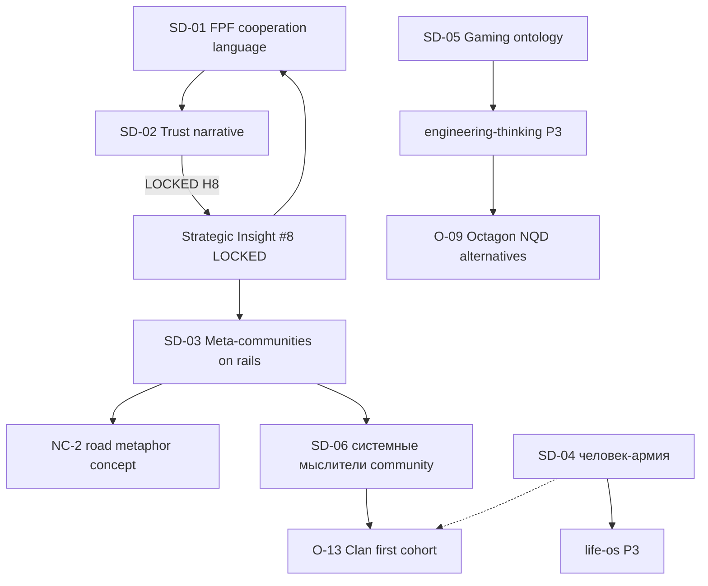

# Strategic Directions captured — voice batch 17.05

> **Purpose.** Capture 6 strategic-direction candidates surface'нутые во voice batch 17.05 чтобы НЕ потерялись. R1 surface only — Ruslan decides priority / promotion timing / Phase C work scheduling.
>
> **Status field convention.** All SD entries = `surfaced-pending-Ruslan-priority`. Promotion to LOCKED Octagon insight OR project assignment OR Phase C plan requires separate Ruslan ack.
>
> **Phase association.** Each SD tagged с predicted Phase C/D + dependencies. Tagging = brigadier suggestion, не Ruslan commitment.

---

## §0 Index

| SD | Title | Verbatim source | Phase | Dependencies | Status |
|---|---|---|---|---|---|
| **SD-01** | «FPF как язык кооперации» позиционирование Jetix | audio_673:end | Phase C | O-05 distributable + L1 partnerships | surfaced |
| **SD-02** | Trust-mechanism shift strategic narrative | text_001:§2 | Strategic insight (LOCKED H8 этого batch) → Phase C articulation | O-09 H8 LOCK (DONE этого batch); O-11 R12; O-13 Clan | LOCKED → narrative remit |
| **SD-03** | Мета-сообщества на «рельсах» Jetix | audio_670:end | Phase D | O-13 Clan activation first | surfaced |
| **SD-04** | «Человек-армия» — self-managing system | audio_669:mid | Phase B internal | life-os project (P3) | surfaced |
| **SD-05** | Gaming team ontology research | audio_671 | Research task | engineering-thinking P3 | surfaced + scoped |
| **SD-06** | «Новый порядок системных мыслителей / Jetix users» | text_001:§2 p.4 | Phase C+ | O-13 Clan activation first | surfaced |

---

## §1 SD-01 — «FPF как язык кооперации» позиционирование Jetix

### §1.1 Verbatim

> «Мы нанимаем звезд, но при этом даем им **язык кооперации, вот этот FPF**, плюс еще у каждого там усиление, ну просто ебейший усилитель есть, плюс переводчик. И соответственно все работают над одной базой, которая вот по fpf написано каждый переводит себе на свой язык который ему нужен который ему удобен и потом ну и потом это должно все привести к такой вот синергии.» [src: audio_673 §end]

### §1.2 Direction frame

Jetix positions externally not как methodology или AI consulting, but как **cooperation-language-substrate** для top-tier specialists. Hire stars; give them FPF as shared substrate + AI translator per individual + collaborate over one FPF source-of-truth → emergent synergy.

### §1.3 Cross-refs

- **Builds on:** H1 Foundation Model (substrate); H2 Partnership Model (partnership scaling)
- **Requires:** O-05 Methodology distributable format (forkable Pack); O-06b ROY swarm operational
- **Implements:** H8 Trust Infrastructure (mechanism FPF SoT eliminates negotiation)

### §1.4 Phase / dependencies

**Phase:** C (cooperation infrastructure realisation; not Phase 1 commercial Mittelstand).
**Dependencies:** O-05 distributable format + active L1 partnerships (Левенчук / Цэрэн first cohort) + Clan first signatories.
**Blocker:** L1 partnerships not yet acked externally (IA-03 outreach 7d elapsed).

### §1.5 Stage gate

Не lockable as Octagon insight без empirical L1 cooperation evidence. Requires first cohort demonstrating cooperation-via-FPF working (Mondragón-style proof-of-concept).

---

## §2 SD-02 — Trust-mechanism shift strategic narrative

### §2.1 Verbatim

> «Деньги как бы вообще не так сильно вызывают доверие, как другие методы — например, хорошо поговорить, или донести суть, или просто показать, что у тебя есть какие-то результаты ... То есть вот это может вызывать больше доверия, чем деньги.» [src: text_001 §3]

### §2.2 Direction frame

Public-facing narrative articulating trust-mechanism shift: money historically primary trust signal; FPF + open data + role-attestation = thicker substrate с лучшим economic + relational outcome. Surface к L1 / Octagon / Phase C audiences.

### §2.3 Status — LOCKED этого batch

**Promoted к H8 Strategic Insight LOCK.** См. `decisions/STRATEGIC-INSIGHT-JETIX-TRUST-INFRASTRUCTURE-2026-05-17.md`. NC-1 concept entry. SD-02 remit = **narrative articulation for external audiences** (this is downstream task — formalised insight → public artefact).

### §2.4 Cross-refs

- **LOCKED via:** `decisions/STRATEGIC-INSIGHT-JETIX-TRUST-INFRASTRUCTURE-2026-05-17.md` (H8 Octagon 8th)
- **Implements:** R12 Anti-extraction (positive face)
- **Connects к:** Clan Charter v0 (member trust substrate); People-NS (H7)

### §2.5 Phase / dependencies

**Phase:** Strategic insight LOCKED (this batch); narrative articulation = Phase C remit.
**Dependencies:** First Clan member cooperation demonstrating mechanism в action; L1 acceptance.

---

## §3 SD-03 — Мета-сообщества на «рельсах» Jetix

### §3.1 Verbatim

> «Jetix будет как такая дорога для этих сообществ. Соответственно всех их под одни рельсы ставить и потом просто рано или поздно эту всю залупу тоже подтянуть.» [src: audio_670 §end]

### §3.2 Direction frame

Jetix-as-infrastructure (NC-2 road metaphor) для multiple communities / professional networks / эventually государства. Pattern: «начинать сообщества адекватные с Jetix» — first Clan = first community; затем другие communities (medical / educational / civic) onto same rails.

### §3.3 Cross-refs

- **Implements:** NC-2 road metaphor (`wiki/concepts/jetix-as-road-protocol-infrastructure.md`)
- **Cross-refs:** H4 Balaji Network State; H7 People-NS
- **Requires:** O-13 Clan activation first (≥5 signatories); proof of concept что rails work для one community

### §3.4 Phase / dependencies

**Phase:** D (vision; Phase C+ activation horizon).
**Dependencies:** Clan activation; multi-community recruitment protocol; legal / governance substrate design.

### §3.5 Risk markers

Affect-mode rhetoric stripped (per audio_670 «намордник на государства» = НЕ literal claim). NC-2 retains coordination-substrate insight; не state-replacement program.

---

## §4 SD-04 — «Человек-армия» — self-managing system

### §4.1 Verbatim

> «Человек = разраб + потребитель своей жизни.» [src: audio_669 §mid; Тарасов «человек-армия» pattern reference]

### §4.2 Direction frame

Individual = self-system executing both builder-role (designing life / habits / projects) и consumer-role (живущий результаты дизайна). Self-management = first-class organising principle для individual operations. Connects к life-os project (P3) + SELF-MANAGEMENT-SYSTEM-SPEC-v0.

### §4.3 Cross-refs

- **Concept:** `wiki/concepts/human-as-developer-and-consumer-2026-05-17.md`
- **Project:** life-os P3
- **Bridge:** Jetix substrate principles applied к individual scope
- **Connects:** Clan onboarding (members должны first self-manage)

### §4.4 Phase / dependencies

**Phase:** B internal (life-os project P3 scope).
**Dependencies:** SELF-MANAGEMENT-SYSTEM-SPEC-v0 design + Ruslan personal practice evidence (eat-own-dogfood).

---

## §5 SD-05 — Gaming team ontology research

### §5.1 Verbatim

> «изучить и закинуть в систему» [src: audio_671; vague phrasing per NEW-K-03 flag]

### §5.2 Direction frame

Existing gaming team ontologies (tank / DPS / healer / support, modern MMO compositions) представляют highly-evolved role decomposition patterns evolved через decades of multiplayer iteration. Candidate source domain для O-09 NQD-CAL alternatives portfolio в engineering-thinking P3 scope.

### §5.3 Cross-refs

- **Idea entry:** `wiki/ideas/gaming-team-ontology-source-domain-2026-05-17.md`
- **Cross-refs:** O-09 Octagon (Hexagon evolved) NQD alternatives gap
- **Project:** engineering-thinking P3

### §5.4 Phase / dependencies

**Phase:** Research task — scoped to engineering-thinking P3.
**Dependencies:** Concrete'ization («закинуть» = vague; what gaming designs specifically; per NEW-K-03).
**Stage:** Phase B+ engineering remit; not Phase 1 commercial.

---

## §6 SD-06 — «Новый порядок системных мыслителей / Jetix users»

### §6.1 Verbatim

> «Эту новый возможный порядок системных мыслителей — ну или же вот пользователей Jetix — тоже можно будет потом использовать и описать.» [src: text_001 §2 p.4]

### §6.2 Direction frame

Community category candidate: «системные мыслители Jetix users» как emergent grouping вокруг trust infrastructure substrate. Possibly distinct identity / archetype within Clan taxonomy (6 archetypes existing: Hunter/Guardian/Scholar/Creator/Architect/Merchant).

### §6.3 Cross-refs

- **Connects к:** O-13 Clan archetypes (potential expansion); H7 People-NS
- **Builds on:** H8 Trust Infrastructure (members already share substrate)
- **Possible promotion:** new archetype OR sub-category within Architect/Scholar

### §6.4 Phase / dependencies

**Phase:** C+ — deferred until O-13 Clan activation (≥5 signatories evidenced).
**Dependencies:** Clan first cohort showing systemic-thinker behavior cluster.

### §6.5 Decision boundary

Surface only этого batch. Not promoted к Clan archetype addition без empirical evidence of distinct behavior pattern.

---

## §7 Cross-SD relationships

**Reading:** SD-02 LOCKED as H8 этого batch. SD-01 / SD-03 / SD-06 depend on H8 + Clan activation. SD-04 / SD-05 = internal / research scope, не Phase D vision.

---

## §8 Decision boundaries (R1 surface only)

Brigadier surface only. Following decisions require Ruslan ack separately:

- **DD-1.** SD-01 promotion to Phase C action plan timing
- **DD-2.** SD-03 / SD-06 Clan activation precondition treatment — wait OR seed parallel
- **DD-3.** SD-04 inclusion в life-os P3 active scope OR defer
- **DD-5.** SD-05 inclusion в engineering-thinking P3 active scope OR defer
- **DD-6.** SD-02 narrative articulation timing (when к external audiences?)

---

## §9 Filing

| Where | Why |
|---|---|
| `decisions/STRATEGIC-DIRECTIONS-VOICE-17-2026-05-17.md` (this file) | Capture record per Ruslan ack §0.5 |
| `wiki/ideas/` (5 entries) | Light idea entries для discoverability — done batch T1 |
| `decisions/STRATEGIC-INSIGHT-JETIX-TRUST-INFRASTRUCTURE-2026-05-17.md` | H8 LOCK promoted via SD-02 |
| `reports/phase-0-fpf-scope/01-jetix-objects-inventory.md` | APPEND O-21 candidate (NC-1) — done T10 |

---

## §10 What this capture is NOT

- ❌ NOT prioritization — Ruslan decides
- ❌ NOT commitment to pursue any SD beyond H8 LOCK
- ❌ NOT new Octagon insights — H8 уже promoted, others surface only
- ❌ NOT contradicting deprecation decisions §0.3 (IA-02 ICP / IA-04 EP-5 / ST-04 Aisystant / ST-05 Council CLOSED)

---

*Brigadier scribe capture. §5.5.5 gate: verbatim provenance ✓ (audio_NNN:section per SD) / cross-refs ✓ / phase tagging ≠ commitment ✓ / R1 surface-only ✓ / dissents preserved AP-6 (SD-3 carried from work plan §9 D-MGMT-VOICE-1) ✓. Word count: ~1500.*
