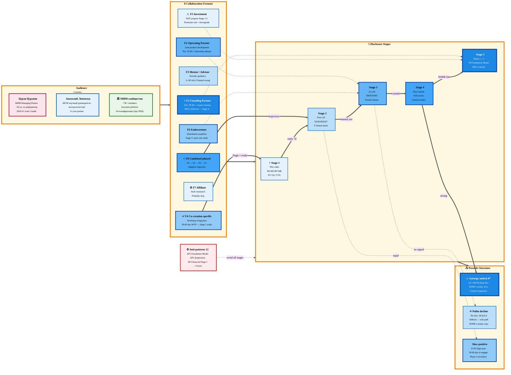

# Video Proposal Options — Цэрэн + Левенчук + ШСМ/МИМ

> **Что это.** Comprehensive brainstorm всех возможных angles для proposal Цэрэн + Анатолий Левенчук + МИМ.
> **Options paper** — Ruslan picks paths, AI structures + provenance-tags. **НЕ video script** (separate task
> after Ruslan ack picks). **НЕ authoritative recommendation** — multiple paths offered где relevant.
> **Constitutional posture:** Tier 2 R1 — AI brainstorm + structures, Ruslan = sole decider what to use.

---

## §0 Что это (purpose)

После ack Action Plan (`ACTION-PLAN-PHASE-1-NEAR-FUTURE-2026-05-10.md`), critical-path action **A1.1
запись видео Цэрэну** — но перед записью нужны explicit picks: что давать, что хотеть, какой формат
collaboration предлагать, какие messages нести, что спрашивать, чего избегать, что когда раскрывать,
что показывать, как навигировать tensions.

**Document delivers:** 8 numbered option arrays + 5-stage disclosure mapping + Mermaid + 13 open
questions для Ruslan ack. Output is a **decision-ready menu**, не recommendation.

---

## §1 Audience profile (3 entities)

> Sources: TG analysis report (618 posts, 5 years) + YouTube analysis report (127 videos, 26 months) +
> CRM record + voice memos.

### §1.1 Цэрэн Цэрэнов

| Атрибут | Detail | Source |
|---|---|---|
| Identity | Сооснователь и управляющий партнёр **МИМ** (Мастерская инженеров-менеджеров — новая структура с 2026, spin-off / sister entity to ШСМ); инициатор «сообщества инженеров личности» | TG §2.2 id=2; YT §1 finding 10 |
| Возраст / стадия | ~54 года (43 в марте 2015 + 11 = 54 в 2026); дед с 02.09.2025; женат, взрослые дети + зять | TG §10.1 |
| Локация | Кипр с сентября 2022; регулярные европейские поездки + Куала-Лумпур 5× | TG §2.1 |
| Background | Реформатор федерального уровня; экс-Минэкономики; проектировщик «Электронной России» 20 лет назад с Левенчуком + Виктором Агроскиным; **11-летний партнёр Левенчука с марта 2015** | TG §2.3 |
| Self-frame | «сооснователь / управляющий партнёр / фаундер / инженер-менеджер / инициатор сообщества». НЕ «гуру», НЕ «коуч», НЕ «учитель» | TG §2.4 |
| Канон | Системное мышление + жизненное мастерство + интеллект-стек + личное стратегирование + мышление-письмом + экзокортекс; **2026 operational pivot — Claude / multi-agent / IWE** | TG §3, §4, §9 |
| 2026 #1 word | **`claude`** — operational shift «системное мышление как теория» → «как практика с AI-агентами» | TG §3.3 |
| Topic 2026 evolution | id=624: «освоил GitHub, Claude Code, Codex, n8n»; id=625 «Claude Code — фантастика»; id=628 «считаю себя ИТ-шником, в продакшн моя первая ИТ-система»; id=635 «Claude Code — мой рабочий партнёр»; id=666 разбор «3 слоёв ИИ-агента» | TG §9.3 |
| Бэндвидь | 25-30 час/неделю инвестированного времени; 205 час/мес «осознанного действия»; 3 поста/неделю long-form; **высокая нагрузка → cold-DM медленно** | TG §10.3 |
| Style | Long-form (85% >1000 chars); structured (нумерованные списки, разделители); cited (55% постов с ссылками); professional-personal; analytical-personal hybrid; **не provocative, не ironic** | TG §5 |
| Audience | ~7K сообщество в 2023 (вероятно больше); reactions mean=13.5, max=55; top emoji 👍🔥❤=94%; **engaged-reflective**, не trolling-prone | TG §8 |
| Channels | Telegram @TserenTserenov + канал @systemsthinkinglife; YouTube @tserentserenov77 (127 видео, ~155 mean views — niche); FB `facebook.com/tseren.tserenov`; IG `instagram.com/tseren.tserenov`; **НЕ active LinkedIn visible** | CRM + YT §0 + §3 |
| Personality signals | Дисциплина (системность 25-30h/нед); Anti-self-deprecation («хвалю себя ежедневно»); Pragmatic («фаундерство от безысходности»); Любит свои AI-системы; Anti-pretension | TG §5.3 |
| Status outreach (2026-05-10) | Previous video sent 04.05; response status unknown (assume not yet) | CRM + Action Plan §1 |

### §1.2 Анатолий Левенчук

| Атрибут | Detail | Source |
|---|---|---|
| Role | Научный руководитель ШСМ; co-founder МИМ с Цэрэном (2015 origin); системный мыслитель | TG §6.1; YT §1 finding 10 |
| Релационная структура с Цэрэном | **Equal-partner**, не teacher-student. Цэрэн называет «Толя». Split: Левенчук = methodology, Цэрэн = business-modeling / operations | TG §6.1 (id=127, 213) |
| Status | «лучший методолог в стране по части преобразований, инженерии и менеджменту» (Цэрэн id=213) | TG §6.1 |
| Audience | Thousands students / followers через ШСМ; FPF (Foundations of Practice Framework) author | Levenchuk research |
| Reach | Через club МИМ + ШСМ выпускники; speaks at 10-я конференция МИМ (April 2026) | YT §1 finding 11 |
| Outreach mode | Через Цэрэн (warm intro) OR direct (separate parallel) — **see decision Q.A2** | Open question |

### §1.3 МИМ как organization / community

| Атрибут | Detail | Source |
|---|---|---|
| Имя | **Мастерская инженеров-менеджеров (МИМ)** — новая структура с 2026; ранее ШСМ (Школа системного менеджмента) | TG §2.2; YT §1 finding 10 |
| Status | Spin-off / sister entity to ШСМ; Цэрэн = Managing Partner МИМ; Левенчук = научный руководитель ШСМ (parent entity) | YT §1 finding 10 |
| Platform | Aisystant (экзокортекс / IT-platform): руководства публичные с янв. 2026 (id=626); paid subscription = доступ к ДЗ + LLM-чекер + сообщество | TG §10.2 |
| Conferences | 10-я конференция МИМ — 18-19 апреля 2026 (regular event) | YT §1 finding 9 |
| Distribution channels | TG: t.me/system_school (closed materials); event-platform `events.system-school.ru` (Tinkoff TPRODUCT widget); club МИМ membership | YT §0 + §1 |
| Audience overlap с Jetix Phase 1 ICP (online verticals per Insight Partnership §4.2) | Strong — founders / educators / coaches / specialists; pre-vetted «инженеры личности» = exact pattern Manifest-style progressive practitioners | RES.1 + Insight Partnership |

### §1.4 Critical pre-context (что Tseren УЖЕ знает после первого видео 04.05)

> Если first video reached him — он знает Ruslan + видел some Jetix material.
> Status unknown как of 2026-05-10.

**Working assumption** для Stage 2 video planning:
- Если **получил + посмотрел** → Stage 2 = follow-up с deeper material
- Если **получил + НЕ посмотрел** → этот video = re-engagement, нужен smart hook
- Если **НЕ получил** → этот video = first contact (но через CRM сказано «video sent 04.05» — likely received)

**Default working assumption:** received but no response yet — этот video = **deeper follow-up** или
**re-engagement** depending on Ruslan signal. **Decision Q.A.4 below.**

---

## §2 Что мы можем им дать (D# — comprehensive list)

> Each item: ID / description / source / who resonates (T=Цэрэн / L=Левенчук / M=МИМ-community) / why valuable.

### D1 — Workshop substrate (architecture v4 diagram + 1A foundation)

- **Что:** LOCKED Workshop concept (мастерская для работы с информацией, 7 элементов) + visual artifact `swarm/wiki/synthesis/diagrams-2026-05-07/workshop-deep/v4-system-boundary.md`
- **Source:** `decisions/JETIX-WORKSHOP-CONCEPT-2026-04-30.md`; `BASE-MANAGEMENT-SYSTEM-2026-05-04.md`
- **Resonates:** **T+L+M.** Tseren explicitly использует «инженер-менеджер / мастерство» vocabulary; Levenchuk methodology = Workshop = direct lineage; МИМ — буквально «Мастерская инженеров-менеджеров»
- **Why valuable:** **Word-mapping: Jetix мастерская + МИМ мастерская = same vocabulary, parallel architecture.** Tseren visually видит, что Jetix = same category, не competing concept

### D2 — 12-agent AI infrastructure (Manager + agents architecture)

- **Что:** Full agent roster — 12 agents × 6 departments × 4 phases (per CLAUDE.md). Manager / strategist / sales-lead / sales-researcher / sales-outreach / inbox-processor / crazy-agent / knowledge-synth / personal-assistant / system-admin / life-coach / meta-agent
- **Source:** `CLAUDE.md` Agent Roster section
- **Resonates:** **T strongly.** Tseren id=635 «Стратег, Ассистент ученика, Системный аналитик» — он сам строит multi-agent setup; id=666 «3 слоя ИИ-агента» — он understands deeply
- **Why valuable:** Concrete demonstration parallel to его IWE / multi-agent build; peer-builder frame validation

### D3 — Compound learning discipline (12 months track record, voice batch как evidence)

- **Что:** 47-memo voice pipeline batch (1627 items, 8 deliverables); Toggl entries; 12 months disciplined tracking
- **Source:** `reports/voice-pipeline-2026-05-10/`; CLAUDE.md «Voice-Notes Pipeline»
- **Resonates:** **T strongly.** Tseren сам инвестирует 25-30h/нед в self-development (id=228); ценит дисциплину outsized
- **Why valuable:** Proves Ruslan = «серьёзный operator» (per Action Plan M5), не «один из тысячи»

### D4 — Foundation v1.0 LOCKED — 11 Parts + Pillar C (governance / provenance / etc.)

- **Что:** `swarm/wiki/foundations/part-{1..11}/architecture.md` (LOCKED 2026-04-28); 8 RUSLAN-ACK records; Pillar C Tier 2 11 hard rules; Default-Deny Table; Provenance Officer + Human Gate patterns
- **Source:** CLAUDE.md «Foundation Architecture v1.0 (LOCKED)»
- **Resonates:** **T strongly.** Tseren id=665 (2026-04-09) свежо сформулировал «триаду учёт-доступ-аудит» для ИИ-сред — Foundation v1.0 = **operational instantiation** этой идеи (Provenance Officer + Default-Deny + Human Gate)
- **Why valuable:** Direct artefact-match к его недавнему theoretical formulation; «вы think this; we already built it»

### D5 — Visualization tooling (Mermaid pipeline + canonical operations + workshop diagrams series)

- **Что:** `swarm/wiki/operations/mermaid-style-guide-2026-05-07.md` v1.0 canonical; Workshop deep diagrams series v1-v6 (2026-05-08); D2 / Mermaid skills
- **Source:** `swarm/wiki/synthesis/diagrams-2026-05-07/`
- **Resonates:** **T+M.** Tseren регулярно использует визуальные схемы в постах; его сообщество ценит structured visual thinking
- **Why valuable:** Common language tooling — they can immediately use в МИМ образовательных продуктах

### D6 — Voice pipeline canonical (47-memo batch capability + reusable lens-based workflow)

- **Что:** `swarm/wiki/operations/voice-pipeline-canonical-2026-05-10.md` v1.0 + 8 deliverables `reports/voice-pipeline-2026-05-10/` + lens config approach (per-run customization)
- **Source:** Same paths
- **Resonates:** **T strongly.** Tseren sees AI как extension of mind; voice→structured insights workflow = direct parallel его экзокортекс concept
- **Why valuable:** Concrete tool he could use / adapt; «I built this — let me show you the architecture»

### D7 — Document 1A/1B (universal base + applied use case)

- **Что:** `decisions/BASE-MANAGEMENT-SYSTEM-2026-05-04.md` + `decisions/JETIX-CORPORATION-2026-05-05.md` (Document 1B — 283KB applied use case)
- **Source:** Same paths
- **Resonates:** **L strongly + T.** Левенчук = methodology rigor — 1A formality / 35 UC / 12 categories matches that level; 1B = applied use case parallels МИМ as «applied системного мышления»
- **Why valuable:** Demonstrates rigor + scale of thinking; не «pitch deck», а «substantial corpus»

### D8 — TRM model (6 ресурсов × L0-L5 ladder × 3 фазы)

- **Что:** `decisions/JETIX-TRM-MODEL-2026-04-30.md` LOCKED — 6 resources management (financial / time / audience / knowledge / compute / team); land-and-expand L0-L5 (€3K → €40-60K/мес); 3 фазы (сервис → mgmt → платформа)
- **Source:** Same path
- **Resonates:** **T+M strongly.** Tseren framework «жизненное мастерство = собранность + интеллект + профессия» (id=130) ↔ TRM 6 resources as expansion same logic; «инвестировать время, не тратить» (id=228) ↔ TRM time-resource
- **Why valuable:** Parallel methodology — they see Jetix как extension/evolution их framework, не competing one

### D9 — First-mover position в Founder-OS / Foundation Model category

- **Что:** Implicit positioning, **NOT communicated** в этом video (per Foundation Model Insight §5)
- **Source:** `decisions/STRATEGIC-INSIGHT-JETIX-AS-FOUNDATION-MODEL-2026-05-10.md`
- **Resonates:** Internal only; informs Ruslan's positioning confidence
- **Why valuable:** Internal-only frame — keeps from desperation tone; Phase 2 disclosure consideration

### D10 — R&D Flywheel commitment (RES.2 — 90% reinvest target)

- **Что:** Manifest+Amazon flywheel posture; жёсткий reinvest profits в R&D; founder lives lean
- **Source:** `decisions/STRATEGIC-INSIGHT-JETIX-PARTNERSHIP-MODEL-2026-05-10.md` §13 + RES.2
- **Resonates:** **T+L.** Tseren «не лежит в тихой гавани» (id=563); long-term mindset; serious operators ценят this signal
- **Why valuable:** Demonstrates serious commitment, не cash-grab; aligns с их multi-decade horizon

### D11 — Manifest-pattern partnership offer (online-first, NOT sell to legacy)

- **Что:** Insight Partnership Model §3 Manifest pattern; «не продаём ещё один tool, partner с прогрессивными лидерами»
- **Source:** `STRATEGIC-INSIGHT-JETIX-PARTNERSHIP-MODEL-2026-05-10.md` §3, §6
- **Resonates:** **T strongly.** Tseren id=664 «конкуренция между специалистами вместе с их ИИ-помощниками»; identity as builder fits «progressive leader» pattern explicitly
- **Why valuable:** Frames their position correctly — they = leader (с domain), Jetix = substrate (с infrastructure); both grow

### D12 — 12-month retrospective + open canon access

- **Что:** Full repo access — `decisions/`, `swarm/wiki/`, `swarm/wiki/foundations/`, `decisions/strategic/`, all canonical docs
- **Source:** GitHub repo / public-company-style transparency
- **Resonates:** **T strongly.** Tseren himself opened все МИМ руководства публично (id=626); transparency-mode = их culture; reciprocal openness signal
- **Why valuable:** Trust-building через radical transparency — match their move

### D13 — Strategic Council expansion vector

- **Что:** Action Plan A2.1 — формирование Strategic Council 7-8 топ-стратегов (Оскар, Федорев, Олег и др.); Tseren + Левенчук = potential founding members
- **Source:** Action Plan §2.3 Cluster 3; voice audio_629
- **Resonates:** **T+L.** Они знают других strategists/engineers; warm intros possible; collective project amplifies
- **Why valuable:** Network amplification; не just bilateral relationship — multilateral substrate

### D14 — Online-first vertical access (RES.1) and Phase 2 client base

- **Что:** Per RES.1 — 7 online verticals (founders / educators / bloggers / coaches / devs / producers / community managers); МИМ-сообщество = pre-qualified pool
- **Source:** Insight Partnership §4.2; RES.1
- **Resonates:** **M strongly.** МИМ has direct access to «инженеров личности» — exactly the population Insight Partnership identifies
- **Why valuable:** МИМ becomes channel + first-clients pool; symbiotic growth

### D15 — «Документ Truth» co-creation infrastructure

- **Что:** Capacity для совместной работы над strategic documents (Document 1B §10 Step 3 paths); Plan Mode sessions + Voice pipeline + Mermaid + Foundation provenance
- **Source:** Action Plan A3.2
- **Resonates:** **T+L.** Tseren id=604 voice — «совместное создание fundamental docs» уже на повестке
- **Why valuable:** Direct «what» of Action Plan A3.2 / Document 1B §10 Step 3; concrete deliverable proposed

---

## §3 Что хотим получить (R# — comprehensive list)

> Each item: ID / description / source / from whom (T/L/M) / why valuable.

### R1 — ШСМ/МИМ methodologies integration в Jetix substrate

- **Что:** Per Document 1B §10 Step 2 — глубокий разбор системного мышления ШСМ + внедрение в Jetix instance (2-3 weeks intensive)
- **Source:** Document 1B §10.2 Step 2 verbatim
- **From:** **L primary, T secondary.** Methodology source = Левенчук; operational application = Цэрэн
- **Why valuable:** Action Plan A3.1 critical-path output; «synergy unlock» binary trigger per Document 1B §10.4

### R2 — Audience access (МИМ-community + ШСМ-followers)

- **Что:** Access to MID-community channels (TG channel @systemsthinkinglife, club, конференция attendance, t.me/system_school)
- **Source:** Insight Partnership §6.1 «Цэрэн validates pattern»; voice top-20 #20 «FOMO via scale»
- **From:** **T+M.** Цэрэн controls direct audience; МИМ = institutional channel
- **Why valuable:** First 5-10 Phase 1 clients likely come from this pool (RES.1 online-first, МИМ = exact match population)

### R3 — Co-creation fundamental docs

- **Что:** Совместная работа над strategic documents (Tseren / Левенчук / Ruslan); fixation «одного документа правды» per Document 1B §10.3
- **Source:** voice audio_604 «совместное создание fundamental docs»; Document 1B §10 Step 3
- **From:** **T+L.** Both bring methodology + experience; Ruslan brings architecture + scale ambition
- **Why valuable:** Long-term alignment substrate; reduces re-negotiation friction; credible joint output

### R4 — Strategic guidance / mentorship (informal, not paid)

- **Что:** Periodic strategic conversations; questions answering; pattern recognition feedback
- **Source:** voice top-20 #15, #16 «фрейм партнёра, а не соискателя» — НО guidance OK if reciprocal
- **From:** **L primary** (methodology depth), **T secondary** (operational + ШСМ history)
- **Why valuable:** Ruslan's blind spots in системном мышлении surfaced; faster learning than solo
- **Caveat:** ⚠ AVOID positioning as «mentor-pitch» (TG §15.2 anti-pattern) — needs reciprocal frame

### R5 — Network multiplier (intros to Strategic Council кандидаты)

- **Что:** Warm intros через их networks — possibly Иван Метелкин / Антон Буйнов / Виктор Агроскин / Юлия Чайковская (TG §7); или из Strategic Council shortlist (Action Plan A2.1)
- **Source:** Action Plan A2.1; TG §7 Persons map
- **From:** **T+L.** Both have decade+ networks
- **Why valuable:** Strategic Council scaling; reduces cold-outreach effort

### R6 — Endorsement signal (community mark of approval)

- **Что:** Implicit endorsement — Tseren forwarding / mentioning Jetix в его TG channel; OR explicit mention в МИМ материалах
- **Source:** Implicit value; TG §7.2 only 13/19 forwards from own ecosystem (extrinsic mentions rare = signal weight high)
- **From:** **T+L+M.**
- **Why valuable:** Signal-of-quality для Phase 1 leads; reduces sales friction in МИМ-adjacent verticals

### R7 — First instantiation Manifest-pattern partnership (Цэрэн = test case)

- **Что:** Per Insight Partnership §6.1 — Tseren = first concrete partnership instance; learn what works / doesn't для replication к остальным 6-7 стратегам
- **Source:** Insight Partnership §6.1
- **From:** **T primary.**
- **Why valuable:** Pattern validation для §10 Step 4 продаж + Strategic Council expansion (R5 + Action Plan A2.1)

### R8 — Possible equity / financial backing (deferred Phase 1→2 transition)

- **Что:** Per RES.3 — Document 1B §9 partnership terms (variants A-E) deferred; не push сейчас
- **Source:** RES.3
- **From:** **T+L.** Both могут consider financial participation если pattern valides
- **Why valuable:** R&D Flywheel substrate (RES.2) — early capital accelerates flywheel
- **Caveat:** ⚠ AP — НЕ пropose в Stage 1-2 (anti-pattern AP3 below); reserve для Stage 3+

### R9 — Joint product development (Workshop infrastructure × МИМ methodology)

- **Что:** Specific co-product — например, Workshop Substrate edition for МИМ educational programs; OR МИМ methodology integration в Jetix lens config; OR совместный course «AI-augmented системное мышление»
- **Source:** Action Plan §2.1 Cluster 1 Workshop disambiguation
- **From:** **T+M.** МИМ has methodology + audience; Jetix has substrate + AI infrastructure
- **Why valuable:** Concrete revenue mechanism; demonstrates joint capability; portfolio piece

### R10 — Левенчук's strategic perspective on Jetix architecture

- **Что:** Honest critical feedback от «лучшего методолога в стране» (Tseren id=213) на Foundation v1.0 architecture, Pillar C, F-G-R schema, Workshop concept
- **Source:** Direct Левенчук value (per Tseren framing)
- **From:** **L primary.**
- **Why valuable:** Highest-leverage feedback Ruslan could get на architectural decisions; Phase 2 substrate quality bet
- **Caveat:** ⚠ Левенчук attention scarce — bilateral arrangement needs care

### R11 — МИМ-conference 10-я (April 2026) backsignal + 11-я (likely 2027) opportunity

- **Что:** What was discussed; recordings if available; possibly speaker invitation for 11-я конференция
- **Source:** YT §1 finding 9
- **From:** **T+M.**
- **Why valuable:** Concrete touchpoint; «I followed your conference» = signal of seriousness; 11-я speaker slot = audience access amplifier

### R12 — Validation что R&D Flywheel posture (RES.2 90% reinvest) sound

- **Что:** Sanity check от experienced operators what works / doesn't in long-term reinvest model
- **Source:** RES.2; §13 R&D Flywheel
- **From:** **T+L.** Both operated multi-decade institutions
- **Why valuable:** Avoid blind RES.2 commitment if domain experience says specific adjustments needed

### R13 — Honest assessment: «do we have something here, or self-deception?»

- **Что:** Direct request for honest critique — does Jetix actually solve real problem at scale? Or just well-architected demo?
- **Source:** Tseren's anti-self-deception culture (id=485 «не корю себя» but also pragmatic)
- **From:** **T+L.**
- **Why valuable:** Highest-impact reality check; better to know early
- **Caveat:** ⚠ Requires courage to ask + accept answer

### R14 — Test case structure для Phase 2 partnership pattern replication

- **Что:** Concrete contract/agreement template (whatever format ends up working for Tseren+Levenchuk) reusable для next 6-7 strategists
- **Source:** Action Plan A4.3 Document 1B §9 partnership terms revision
- **From:** Pattern emerges from T+L engagement
- **Why valuable:** Phase 2 scale operational template — saves cycles on each next partnership

---

## §4 Возможные форматы collaboration (F# — 8 formats)

> Each format: ID / name / participants / pros for Jetix / pros for them / cons / Document 1B §9 mapping / suggested terms / proposed first step.

### F1 — Strategic Partner / Founding Partner (full equity-leaning)

- **Participants:** Tseren + Левенчук (oба) → as Founding Partners в Jetix
- **Document 1B §9 mapping:** Уровень 1 — Партнёр / Founding Partner subtype
- **Pros for Jetix:** Maximum integration / strategic voice / methodology depth / network full access; aligns с RES.2/RES.3 long-term vision
- **Pros for them:** Strategic role в emerging substrate; equity upside (long-horizon); methodology amplification at scale
- **Cons / risks:** Highest commitment ask; «у нас уже МИМ» possible objection; 2-way trust + multi-year horizon
- **Suggested terms (variant on Doc 1B §9.1 A-E):** Initial contribution €X (could be time/methodology, not cash) + equity 1-3% per partner + revenue share 10-15% on co-projects + Strategic voice; **TBD per RES.3 deferred — Stage 4+ disclosure**
- **Proposed first step:** Stage 1 video — surface possibility («могут быть founding partners») without specific terms; explore их appetite

### F2 — Operating Partner — joint product development

- **Participants:** Tseren as primary (Левенчук advisory); МИМ resource integration
- **Document 1B §9 mapping:** Уровень 1 — Партнёр / Operating Partner subtype
- **Pros for Jetix:** Concrete deliverable focus; risk-bounded; **clearer scope than F1**
- **Pros for them:** Specific output ownership; less commitment than F1; concrete value generation
- **Cons / risks:** Lower strategic alignment than F1; lower long-term lock-in; «just another collab» risk
- **Suggested terms:** Per-project revenue share 20-30% to МИМ; equity-light (5-10% on co-product если standalone)
- **Proposed first step:** Identify ONE specific co-product candidate (D9 — например, Jetix-MIM Workshop edition; OR co-course); MVP в 30-60 days

### F3 — Mentor / Advisor (lighter touch, periodic guidance)

- **Participants:** Tseren OR Левенчук (separate arrangements); periodic 1-2h sessions
- **Document 1B §9 mapping:** Уровень 1 — Партнёр / closer to «Strategic Partner» subtype but lighter
- **Pros for Jetix:** Low-friction entry; specific guidance valuable per R4/R10; reduces objection «too much commitment»
- **Pros for them:** Minimum bandwidth ask; preserves their МИМ focus; intellectual contribution мerit only
- **Cons / risks:** Tseren may NOT be in mentor mode (TG §11 — он не broadcast'ит «ищу учеников»); could feel patronizing; **AP1 risk if framed как «студент-учитель»**
- **Suggested terms:** Quarterly 2-hour sessions; modest equity (0.25-0.5%) OR just intellectual recognition; possibly «Advisor» listed на Jetix branding
- **Proposed first step:** Stage 2 — explicit «I'd value your perspective on X specific question» (NOT «become my mentor»); see if conversation deepens organically

### F4 — Co-creation на specific project (Workshop integration / методология embedding)

- **Participants:** Tseren + maybe Иван Метелкин / Антон Буйнов (МИМ team)
- **Document 1B §9 mapping:** Уровень 1 — Партнёр / Operating Partner на specific project basis
- **Pros for Jetix:** Most concrete near-term action; clear deliverable; tests collaboration low-risk
- **Pros for them:** Specific output они can publish / use в МИМ; intellectual portfolio piece
- **Cons / risks:** Could be one-off (no Phase 2 path); requires identifying right project upfront
- **Suggested terms:** Project-scoped fee or revenue share; clearly bounded
- **Proposed first step:** Propose 1 specific candidate (e.g., «integrate FPF concepts в Jetix Foundation Part 11 Strategic Direction»; OR «build МИМ lens для voice-pipeline»)

### F5 — Investment partnership — financial backing

- **Participants:** Tseren or Левенчук as small investors (либо МИМ as institutional)
- **Document 1B §9 mapping:** Уровень 1 — Партнёр / Investor Partner subtype (least preferred per Document 1B §7.7 «knowledge & skills > просто финансы»)
- **Pros for Jetix:** Capital для R&D Flywheel acceleration (per RES.2); **commitment signal** financial
- **Pros for them:** Financial upside; minimum operational burden
- **Cons / risks:** **AP9 — НЕ propose в Stage 1-2** (TG §15.2: «не offer money/investment first message»; Tseren historically obsуждал филантропов 2022 для ШСМ but не активно сейчас); possible patronizing inverse signal
- **Suggested terms:** SAFE / convertible note; €X seed; standard valuation TBD
- **Proposed first step:** Reserve для Stage 3+; **do NOT raise in this video**

### F6 — Endorsement / community partnership — distribution support

- **Participants:** Tseren + МИМ-channel access
- **Document 1B §9 mapping:** Network Partner subtype — leverage = audience / influence / reputation
- **Pros for Jetix:** Distribution amplifier; signal-of-quality для Phase 1 leads; matches MID audience overlap (R2)
- **Pros for them:** «Showcase what works in их domain»; intellectual signal; possible affiliate revenue
- **Cons / risks:** Endorsement = реputation risk for them (if Jetix fails publicly); needs trust-build first
- **Suggested terms:** Affiliate-style 15-25% revenue share on conversions; OR pure endorsement (no payment) если they pure goodwill mode
- **Proposed first step:** Stage 3+ after demonstrated case study; не push в early stages

### F7 — Affiliate / referral arrangement (lightest possible)

- **Participants:** Tseren / МИМ channels — referrals to Jetix L0-L1 services
- **Document 1B §9 mapping:** Может не fit Уровень 1 — closer to Уровень 3 «Работник» (entry path) или standalone affiliate
- **Pros for Jetix:** Lowest-friction; channel access; clear economics
- **Pros for them:** Passive income stream; minimal commitment
- **Cons / risks:** **Too transactional** for Tseren's identity (он не sales-affiliate type); could feel cheapening
- **Suggested terms:** 20% revenue share on referred clients; standard affiliate
- **Proposed first step:** **Probably skip this format** unless explicit interest signal; doesn't fit Tseren's style

### F8 — Combined — multiple tiers parallel (e.g., F2 + F4 + F6)

- **Participants:** Phased — start Co-creation (F4) → Operating Partner (F2) → Endorsement (F6) when value proven
- **Document 1B §9 mapping:** Hybrid (per Document 1B §9.1 «Гибридная модель»)
- **Pros for Jetix:** Adaptive trajectory; risk-bounded; can escalate as trust grows
- **Pros for them:** Optionality; can step back if не working; не over-commit upfront
- **Cons / risks:** Complexity to navigate; needs clear stage-gates («when do we move from F4 to F2?»)
- **Suggested terms:** Stage 1: F4 specific co-project; if successful → Stage 2: F2 operating engagement; if validated → Stage 3: F6 endorsement; **F1 / F5 reserved для Phase 1→2 transition (RES.3)**
- **Proposed first step:** Stage 1 video offers F4 as concrete action ; surfaces F2 / F6 / F1 as «directions, not asks»

### §4.1 Format selection matrix (compact)

| Format | Risk | Commitment ask | Phase 1 readiness | Tseren fit | Левенчук fit |
|---|---|---|---|---|---|
| F1 Founding Partner | High | Highest | NO (RES.3 defer) | Medium-High | High (если methodology integrated) |
| F2 Operating Partner | Medium | Medium-High | Maybe (post-synergy) | High | Medium |
| F3 Mentor / Advisor | Low-Medium | Low | Medium | Low (anti-pattern risk) | Medium-High |
| F4 Co-creation specific | Low | Medium | **HIGH** ✅ | High | Medium |
| F5 Investment | Medium-High | Variable | NO (premature) | Low | Low |
| F6 Endorsement | Medium | Low | Maybe (post-case-study) | Medium | Low |
| F7 Affiliate | Low | Lowest | NO (style mismatch) | Low | Low |
| **F8 Combined (F4→F2→F6→F1)** | Adaptive | Phased | **HIGHEST recommended** | High | Medium-High |

**Note:** AI = scribe — selection = Ruslan decision. Default if not picked: **F8 Combined trajectory starting с F4**.

---

## §5 Key messages (M# — 8 messages)

> Each: statement / source / why audience needs hear / strength of evidence (artefact to show).

### M1 — «Сегодня уже есть substrate, не идея в голове»

- **Statement:** «Я строю Jetix 12+ months disciplined; Foundation v1.0 LOCKED; Workshop concept LOCKED; Document 1B 283KB — это не pitch deck, это substrate.»
- **Source:** CLAUDE.md «Foundation Architecture v1.0 (LOCKED)»; voice top-20 #16 «правильно упакованное позиционирование (профессионал + видение Jetix + ресурсы, не просьба)»
- **Why audience needs hear:** Tseren TG §15.2 explicit anti-pattern «не student-frame, не «прошу совета новичок»»; this message frames Ruslan as peer-builder
- **Strength of evidence:** **Highest.** Show D1 (Workshop v4 diagram) + D4 (Foundation Parts list) + D7 (Document 1B size); concrete artefacts, не slogans

### M2 — «Мы партнёрим, не продаём»

- **Statement:** «Я не предлагаю вам ещё один tool купить. Я предлагаю partner — Jetix substrate × МИМ methodology = leverage обеим сторонам.»
- **Source:** Insight Partnership §3 Manifest pattern; §6.2 optional video line; voice audio_602 «фрейм партнёра, а не соискателя»
- **Why audience needs hear:** Tseren explicitly опубликовал руководства free (id=626) — он anti-«tool sales» philosophy; partnership frame matches его identity
- **Strength of evidence:** Direct quote from Insight Partnership §6.2 if Ruslan picks; OR demonstrated through F4 Co-creation specific proposal

### M3 — «Reinvest 90% в R&D — long-term play, не short-term cash»

- **Statement:** «Я думаю long horizon — RES.2 90% reinvest target; flywheel substrate, не кашgrab. Это означает партнёры ждут upside в equity / value appreciation, не quarterly dividends.»
- **Source:** Insight Partnership §13 R&D Flywheel + RES.2
- **Why audience needs hear:** Signals serious operator commitment; aligns с их multi-decade horizon (МИМ 11+ years); filters out short-term-money-seekers
- **Strength of evidence:** Explicit Insight Partnership §13 reference; RES.2 binding statement
- **Caveat:** ⚠ Может быть premature for Stage 1 — see §8 Order of Disclosure

### M4 — «Synergy unlock = critical path для $100K к концу лета 2026»

- **Statement:** «Согласно Document 1B §10 — synergy с мастерской инженеров-менеджеров = главный stopper; всё дальше после этой точки разговоров.»
- **Source:** `decisions/JETIX-CORPORATION-2026-05-05.md` §10.1 verbatim
- **Why audience needs hear:** Honest framing — Ruslan не маскирует, что они = critical для его plan; respect their bandwidth + creates urgency
- **Strength of evidence:** Direct Document 1B §10.1 reference; Action Plan §2.2 Cluster 2 cross-reference
- **Caveat:** ⚠ Could feel too direct / pressuring; Ruslan-decided framing

### M5 — «Ruslan = серьёзный operator (12 months disciplined tracking + voice batch)»

- **Statement:** «47 voice memos в одном batch / 1627 items / 8 deliverables — это пример как я работаю; Toggl + Daily Log дисциплина 12 months.»
- **Source:** `reports/voice-pipeline-2026-05-10/`; Toggl entries; CLAUDE.md
- **Why audience needs hear:** Tseren himself ценит дисциплину 25-30h/нед инвестированного времени (id=228); peer-builder validation
- **Strength of evidence:** Concrete artefacts — voice pipeline report visible; commit history visible

### M6 — «Готовы serious commitments сразу — не ради valuation, ради scale»

- **Statement:** «Trajectory baseline preserved — $1T horizon, не "exit к $5M в 5 лет". Это означает партнёры тоже готовы long horizon.»
- **Source:** FUNDAMENTAL §1; Document 1B §8.3 «10y styдно даже думать»; voice top-20 #11 «$1 трлн capитализация»
- **Why audience needs hear:** Filters out small-thinkers; matches Tseren's «не тихая гавань» identity (id=563)
- **Strength of evidence:** Document 1B §8 vision; Foundation infrastructure built FOR scale, не demo
- **Caveat:** ⚠ Could feel grandiose if не grounded в substrate evidence (use M1 + M5 paired)

### M7 — «Параллельная territory, complementary skills»

- **Statement:** «Мы не competing — вы строите methodology + audience side; я строю architecture + agent infrastructure side. Workshop = same vocabulary, parallel architecture.»
- **Source:** TG §15.1 pitch angle 1 (AI-augmented systems-thinking infrastructure); D1 Workshop substrate vocabulary match
- **Why audience needs hear:** Tseren id=664 «конкуренция между специалистами + ИИ-помощниками» — he sees collaboration > competition; explicit complementarity = peer-frame
- **Strength of evidence:** Both МИМ + Jetix called «Мастерская» = direct word-mapping; show Workshop v4 diagram side-by-side с МИМ name

### M8 — «Open Jetix — любая форма помощи welcome»

- **Statement:** «Я открыт к любой форме помощи: советы / связи / видео / инструменты / время / финансы — что вы готовы дать. Не предопределяю формат.»
- **Source:** voice audio_604 «Открыть Jetix к любой форме помощи»; Action Plan D.3 outreach posture default
- **Why audience needs hear:** Removes pressure of single specific ask; gives them choice; matches Tseren's deliberate-choice style (TG §13.1)
- **Strength of evidence:** Action Plan D.3 default decision; Open framing reduces friction

### §5.1 Message priorities — Stage 1 vs later

- **Stage 1 (this video) HIGH priority:** M1 / M5 / M7 / M8 (substrate + serious + parallel + open)
- **Stage 1 LOW priority OR omit:** M3 (90% reinvest could feel premature); M6 ($1T frame — risk grandiose); M4 (could feel pressuring без context)
- **Stage 2+ disclosure:** M3 / M4 / M6 land naturally after substrate established

---

## §6 Questions to ask (Q# — 8 questions)

> Each: question / why ask / expected answer ranges + interpretation.

### Q1 — «Какой главный resource gap в МИМ системе сейчас?»

- **Why ask:** Surfaces concrete pain point Jetix может address; demonstrates listening orientation
- **Expected answers + interpretation:**
  - «Audience reach / scaling» → R2/R6/F6 path strong
  - «Operations / time» → F2/F4 Workshop substrate path
  - «Technical infrastructure» → D2/D6 12-agent / voice pipeline value
  - «Methodology development» → R4/R10 mentor mode (reverse — Ruslan asks them)
  - «Nothing — мы fine» → important honest signal; might mean no urgency match

### Q2 — «Что в МИМ роадмапе на ближайшие 6-12 месяцев?»

- **Why ask:** Aligns Jetix calendar to their; finds overlap zones; respects their plan
- **Expected answers + interpretation:**
  - «11-я конференция / new course / международный» → F4 / F6 collaboration timing
  - «Sustaining current» → less urgent collaboration; might defer F2/F4
  - «Pivot / new direction» → opens F1/F2 strategic discussion

### Q3 — «Какая скорость движения комфортна для совместной работы?»

- **Why ask:** Calibrates their bandwidth; sets realistic expectations; respects их existing commitments
- **Expected answers + interpretation:**
  - «Quick iteration weekly» → F4 sprint mode possible
  - «Monthly synthesis» → F3 advisor mode fit
  - «Quarterly strategic» → F1 long-term; не F2 operating
  - «Now, not slowly» → unusual signal; explore

### Q4 — «Кто в вашем network может быть relevant для расширенной collaboration?»

- **Why ask:** R5 network multiplier; Strategic Council expansion
- **Expected answers + interpretation:**
  - Specific names → warm intros possible (Action Plan A2.1 acceleration)
  - «Vague — давайте сначала validate parties» → reasonable; defer
  - «Никого, мы closed» → important boundary signal

### Q5 — «Готовы ли вы long-term partnership (3-5+ year horizon vs short engagement 6 months)?»

- **Why ask:** Tests RES.2/RES.3 alignment; filters short-term-thinkers; sets stage F1/F8 vs F4/F3
- **Expected answers + interpretation:**
  - «Long-term только если совпадение пройдёт validation» → reasonable; F8 phased trajectory
  - «We prefer specific projects» → F2/F4 mode; F1 deferred
  - «Готов к long-term, нужны конкретные details» → strong signal; advance F1 discussion

### Q6 — «Что у вас УЖЕ работает с AI-augmented setup? Что не работает?»

- **Why ask:** Direct from his recent Claude / IWE work (TG §9.3); peer-builder demonstration; lessons exchange
- **Expected answers + interpretation:**
  - Detailed answer → high alignment; D2/D6 collaboration path strong
  - «Нерешённая проблема X» → concrete solution opportunity; possibly D4/D6 direct fit
  - «Слишком рано говорить» → defer technical depth Stage 2

### Q7 — «Какой формат communication / cadence для вас работает?»

- **Why ask:** Practical operational; reduces friction; respects их preferences
- **Expected answers + interpretation:**
  - «TG DM async» → matches preferred channel
  - «Periodic 1:1 video calls» → schedule rhythm clear
  - «Email digests + monthly call» → structured async
  - «Whatever works for you» → Ruslan-pick

### Q8 — «Что вы хотели бы получить от потенциальной collaboration с Jetix?»

- **Why ask:** Direct ask of их value-getting; demonstrates symmetric thinking; surfaces unspoken motivations
- **Expected answers + interpretation:**
  - «Honest answer» (any specific) → strong signal; align proposal to that
  - «Не уверены» → exploratory mode; F4 small project as test
  - «Nothing specific, just curious» → low engagement; respect; не push

### §6.1 Question priorities — Stage 1 vs later

- **Stage 1 (this video) HIGH priority:** Q1 / Q6 / Q7 (concrete operational; respect bandwidth)
- **Stage 1 OR Stage 2:** Q2 / Q8 (medium-priority; could go either)
- **Stage 2+ disclosure:** Q3 / Q4 / Q5 (require established context)

---

## §7 Anti-patterns — что НЕ говорить (AP# — 10 anti-patterns)

### AP1 — НЕ упоминать Foundation Model insight

- **Why:** Per Foundation Model Insight §5 explicit «Не рассказывать Цэрэну об этой мысли в текущем outreach»; распыляет focus, premature category framing
- **Source:** `STRATEGIC-INSIGHT-JETIX-AS-FOUNDATION-MODEL-2026-05-10.md` §5

### AP2 — НЕ транслировать desperation / «прошу помощи»

- **Why:** voice top-20 #15, #16 «фрейм партнёра, а не соискателя»; Tseren TG §15.2 explicit anti-pattern «не student-of-Levenchuk frame»; пeer-builder frame primary
- **Source:** voice audio_602; TG §15.2

### AP3 — НЕ propose specific financial terms / equity / cash в Stage 1

- **Why:** TG §15.2 «не offer money/investment первое сообщение»; RES.3 partnership terms deferred; premature ask = downgrade signal
- **Source:** TG §15.2; RES.3

### AP4 — НЕ продавать «ещё один tool»

- **Why:** Tseren himself opened все МИМ руководства публично (id=626); anti-«tool sales» philosophy explicit; positions Jetix wrongly
- **Source:** TG §15.2; Insight Partnership §3

### AP5 — НЕ generic AI-revolution rhetoric («AI трансформирует / disruption / 10x»)

- **Why:** Tseren «точный и tactical, обобщения вызовут раздражение» (TG §13.2); он сам пишет precise long-form, шаблоны spotting instantly
- **Source:** TG §13.2

### AP6 — НЕ упоминать Mittelstand DACH

- **Why:** RES.1 — Mittelstand ABANDONED; не его территория; не его audience; could confuse
- **Source:** RES.1

### AP7 — НЕ извиняться за scale ambition ($1T trajectory baseline preserved)

- **Why:** Tseren himself anti-«тихая гавань» (id=563); downgrade «solo founder» downplays Jetix amplitude; matches их 11+ year build mindset
- **Source:** Insight Partnership; TG §10.1

### AP8 — НЕ ссылаться на agile / scrum / PMP / MBA / Acatech / Aalen

- **Why:** TG §6.3 — Tseren НЕ работает в этих экосистемах (0 hits Acatech / Aalen / OKR / MBA / PMP; 1 scrum, 3 agile only); ссылки = patrons of «not his world»
- **Source:** TG §6.3, §13.2

### AP9 — НЕ template / массовый-стиль outreach

- **Why:** TG §13.2 «Tseren сам пишет всё personalized; spot template instantly»; уже sent personal video 04.05; second one должен deepen, не reset к template
- **Source:** TG §13.2

### AP10 — НЕ предлагать «помощь Jetix-командой ему»

- **Why:** Tseren сам строитель IWE / multi-agent; «помощь» = patronizing; reverse — show what Jetix built, ask його critique
- **Source:** TG §15.2

### AP11 — НЕ позиционировать как «студент-учитель» относительно Левенчука

- **Why:** TG §15.1 explicit; Tseren сам equal-partner ↔ Левенчук; «студент Левенчука» frame = downgrade signal
- **Source:** TG §15.1, §6.1

### AP12 — НЕ delivery без specific reference to их recent work

- **Why:** TG §15.4 «Reference обязательна — конкретный его пост или конкретное руководство»; generic = «cold spam» signal
- **Source:** TG §15.3, §15.4

### §7.1 Anti-pattern severity ranking

| Severity | Anti-patterns |
|---|---|
| **CRITICAL — instant trust loss** | AP1, AP2, AP3, AP9, AP11, AP12 |
| **HIGH — significant friction** | AP4, AP5, AP10 |
| **MEDIUM — unclear signal** | AP6, AP7, AP8 |

---

## §8 Order of disclosure (5 stages)

> Stage-gated revelation — what to reveal at each touch point. **Include / Exclude** lists explicit per stage.

### Stage 1 — This video (next 24-48h)

**Goal:** Re-engage; surface partnership possibility; ask for first call.

**Include:**
- M1 «Substrate, не идея» — show D1 Workshop v4 diagram screenshare
- M5 «Серьёзный operator» — reference voice batch (47 memos / 8 deliverables)
- M7 «Параллельная territory, complementary» — both Workshop vocabulary
- M8 «Open к любой форме» — soft frame
- D1 (Workshop v4 visual) + D2 reference (12 agents — verbal mention) + D7 mention (Document 1B existence)
- Q1 question (resource gap) — verbal ask in video
- Reference specific Tseren post (e.g., id=665 «учёт-доступ-аудит» OR id=664 «конкуренция между специалистами + ИИ» OR id=666 «3 слоя ИИ-агента») — choose 1
- Brief mention of Action Plan §10.1 synergy importance (M4 light version)
- Concrete CTA — «predлагаю созвониться 30-60 min, обсудить возможности»

**Exclude:**
- AP1-AP12 (all)
- D8 (TRM detail — too much Stage 1)
- D9 (Foundation Model insight — explicit AP1)
- D10 (R&D Flywheel — defer Stage 3)
- D13 (Strategic Council names — premature)
- F5 (Investment) F1 (Founding Partner specifics) — too direct
- M3 / M6 (R&D 90% / $1T frame — could derail Stage 1)
- Specific financial terms / equity / cash mentions
- Pressure / deadlines / «нужно решение к X»
- Левенчук-specific ask if separate-parallel approach chosen (Q.A2)

### Stage 2 — First call (post Stage 1 reply)

**Goal:** Establish substantive understanding; surface F-format menu; explore fit.

**Include:**
- D3 (12 month track record + voice pipeline deep dive)
- D4 (Foundation v1.0 11 Parts — высокое-уровневый walkthrough)
- D6 (Voice pipeline canon — show actual workflow)
- D7 (Document 1B excerpts — § 1, §3 TRM, §10 Roadmap)
- D11 (Manifest-pattern partnership reference)
- M2 «Мы партнёрим, не продаём» (explicit verbal)
- M4 (synergy importance — full context)
- F8 phased trajectory framing (F4 → F2 → F6 → F1)
- F4 specific candidate — Co-creation project proposal
- Q2, Q6, Q8 questions (full answers expected)
- D12 reference (open repo access offer)
- Action Plan A3.2 mention — «Document of Truth» co-creation possibility
- Левенчук status conversation (если через Tseren)

**Exclude:**
- D9 (Foundation Model — still defer)
- Specific equity / financial terms (still RES.3 deferred)
- Strategic Council shortlist names (privacy)
- M3 (R&D 90%) — surface but не press
- M6 ($1T) — surface only if their ambition matches first

### Stage 3 — 2-я call OR substantive письмо (post mutual interest signal)

**Goal:** Refine F-format choice; discuss financial structure лоосе; map next 30-60 days.

**Include:**
- D8 (TRM model detail — 6 resources / L0-L5 ladder)
- D10 (R&D Flywheel — RES.2 explicit)
- D14 (Online verticals + МИМ-community as channel offer)
- D15 (Document Truth co-creation infrastructure)
- M3 (90% reinvest — full context)
- M6 ($1T trajectory — within substantive context)
- F-format chosen — terms outlined (loose, not binding)
- Q3, Q4, Q5 questions (deeper answers)
- R3, R5, R9, R12, R13 explicit asks
- Action Plan §10.2 Step 3 reference («Document of Truth»)

**Exclude:**
- D9 (Foundation Model — still Phase 2 reserve)
- F5 financial investment terms (binding) — RES.3 deferred Phase 1→2
- Strategic Council expansion shortlist names (privacy until they engage actively)

### Stage 4 — After first commitment / signed-off Document of Truth

**Goal:** Full canonical access; joint planning; governance model.

**Include:**
- All D1-D15 except D9 (Foundation Model still careful — may surface here if context fits)
- All M1-M8
- All R1-R14 explicit
- Strategic Council shortlist names + warm-intro requests (Action Plan A2.1)
- Document 1B §10 8-step roadmap full disclosure
- Budget / capital deployment plans
- Joint product MVP scoping

**Exclude:**
- Untested hypotheses (deferred Phase 2+)
- Future direction backlog items не yet validated

### Stage 5 — Phase 1→2 transition (post-$100K achievement, ~60-90 days)

**Goal:** Phase 2 strategic alignment; long-term structure formalize.

**Include:**
- D9 (Foundation Model insight — context-aware framing OK now)
- All Strategic Insights дня full sharing
- R&D allocation matrix (HR.3 hypothesis или alternative — RES.2 implementation detail)
- Document 1B §9 partnership terms revision (RES.3 unlock per Action Plan A4.3)
- F1 / F5 explicit terms если pattern proved
- Future direction backlog (M&A / Arbitrage Traffic / Top Lists Partner Factory / Foundation Model)

**Exclude (по-прежнему):**
- Anything Ruslan still considers half-baked (F-G-R F2/F4 grade)
- Internal-only memory entries (privacy)

### §8.1 Stage gates — explicit triggers

| Stage | Trigger to advance | Trigger to retreat / pause |
|---|---|---|
| 1 → 2 | Reply within 7 days OR active engagement signal | No reply 14 days → re-engagement message OR fall back to Action Plan §10.4 fallback |
| 2 → 3 | Mutual «yes, let's continue» + concrete next step proposed | Tepid response → maintain F3 advisor / F4 small-project mode только |
| 3 → 4 | Verbal/written commit к specific format + first deliverable agreed | «Let's wait» → respect, не push, re-engage in 30-60 days |
| 4 → 5 | $100K Phase 1 hit OR significant validation event | Phase 1 misses → adjust Phase 2 trigger, не abandon |

---

## §9 Materials to show / share (MAT# — 12 materials)

> Each: ID / item / format / when / source path.

### MAT1 — Workshop v4 diagram (system boundary)

- **Format:** Screenshare during video OR linked image
- **When:** **Stage 1**
- **Source:** `swarm/wiki/synthesis/diagrams-2026-05-07/workshop-deep/v4-system-boundary.md`
- **Why:** Visual evidence of substrate; «word-mapping» message M7 reinforced

### MAT2 — Document 1B excerpts (§3 TRM, §9 Partnership, §10 Roadmap)

- **Format:** Link to specific sections
- **When:** **Stage 2**
- **Source:** `decisions/JETIX-CORPORATION-2026-05-05.md`
- **Why:** Evidence of applied substrate; their ability to assess depth

### MAT3 — Foundation overview (workshop variant)

- **Format:** Link
- **When:** **Stage 2**
- **Source:** `swarm/wiki/synthesis/foundation-master-overview-human-workshop-2026-05-06.md`
- **Why:** Comprehensive walkthrough — single-click depth assessment

### MAT4 — Voice pipeline 8 deliverables (47-memo batch evidence)

- **Format:** Link to `reports/voice-pipeline-2026-05-10/00-MASTER-INDEX.md`
- **When:** **Stage 2**
- **Source:** Same path
- **Why:** Concrete operational evidence M5; tools they can adapt

### MAT5 — Action Plan tiers (without internal D.1-D.5 personal decisions)

- **Format:** Link или PDF excerpt
- **When:** **Stage 3**
- **Source:** `decisions/ACTION-PLAN-PHASE-1-NEAR-FUTURE-2026-05-10.md`
- **Why:** Demonstrates structured thinking; integrates them into specific actions (A1.1 видео = this video; A3.1 = ШСМ deep dive)
- **Caveat:** Filter out internal D.1-D.5 personal decisions (cash runway / posture / etc.) — those private

### MAT6 — Mermaid style guide canonical

- **Format:** Link
- **When:** Stage 2 если technical interest signaled (Q6 deep)
- **Source:** `swarm/wiki/operations/mermaid-style-guide-2026-05-07.md`
- **Why:** Tool craft demonstration; potentially useful for МИМ visual education

### MAT7 — Voice pipeline canonical (lens-based reusable workflow)

- **Format:** Link
- **When:** Stage 2 если AI-build interest signaled (Q6)
- **Source:** `swarm/wiki/operations/voice-pipeline-canonical-2026-05-10.md`
- **Why:** Direct fit к их IWE / multi-agent setup; co-build potential

### MAT8 — Document 1A (universal base — generic systems)

- **Format:** Link
- **When:** Stage 2 if methodology interest deep
- **Source:** `decisions/BASE-MANAGEMENT-SYSTEM-2026-05-04.md`
- **Why:** Higher abstraction than Document 1B — Левенчук-friendly methodology layer

### MAT9 — Workshop concept LOCKED

- **Format:** Link
- **When:** Stage 2
- **Source:** `decisions/JETIX-WORKSHOP-CONCEPT-2026-04-30.md`
- **Why:** Word-mapping reinforcement; their МИМ name = same vocabulary

### MAT10 — TRM model

- **Format:** Link
- **When:** Stage 3 (when L0-L5 ladder discussion arises)
- **Source:** `decisions/JETIX-TRM-MODEL-2026-04-30.md`
- **Why:** Business model concrete; demonstrate financial sophistication

### MAT11 — FUNDAMENTAL vision

- **Format:** Link
- **When:** Stage 4 (after engagement deepens)
- **Source:** `decisions/JETIX-VISION-FUNDAMENTAL-2026-04-27.md`
- **Why:** 35 UC × 12 categories = vision scope evidence; multi-decade horizon

### MAT12 — Strategic Insights дня (Foundation Model + Partnership Model)

- **Format:** Link
- **When:** **Stage 5** только (Phase 1→2 transition); Foundation Model needs context
- **Source:** `decisions/STRATEGIC-INSIGHT-JETIX-*-2026-05-10.md`
- **Why:** Phase 2 alignment; sharing internal thinking = trust signal

### §9.1 Materials priority compact table

| Material | Stage 1 | Stage 2 | Stage 3 | Stage 4 | Stage 5 |
|---|---|---|---|---|---|
| MAT1 Workshop v4 visual | ✅ Show | — | — | — | — |
| MAT2 Doc 1B excerpts | — | ✅ | — | — | — |
| MAT3 Foundation overview | — | ✅ | — | — | — |
| MAT4 Voice pipeline batch | — | ✅ | — | — | — |
| MAT5 Action Plan tiers | — | — | ✅ | — | — |
| MAT6 Mermaid guide | — | maybe | — | — | — |
| MAT7 Voice pipeline canon | — | maybe | — | — | — |
| MAT8 Document 1A | — | ✅ | — | — | — |
| MAT9 Workshop concept | — | ✅ | — | — | — |
| MAT10 TRM model | — | — | ✅ | — | — |
| MAT11 FUNDAMENTAL | — | — | — | ✅ | — |
| MAT12 Strategic Insights | — | — | — | — | ✅ |

---

## §10 Key tensions / decisions during call (T# — 7 tensions)

> Specific scenarios + suggested moves. AI = options, не recommendation.

### T1 — Если они скептичны / критичны

- **Possible signals:** «Why is this different from existing platforms?», «What's the moat?», «I've seen many such pitches»
- **Sub-tactic options:**
  - **Option A — Ask their critique vs defend** («Какая часть Jetix architecture would you push back on?»); turn it into R10/R13 (honest assessment)
  - **Option B — Concrete artefact demo** (open repo / show specific solved problem) — proof over assertion
  - **Option C — Acknowledge + redirect** («Validation that это different IS the question — let's explore one specific element»)
- **Default:** Option A — позиционирует как peer-builder seeking critique, не sales-pitch

### T2 — Если они нет времени / high-bandwidth-warning

- **Possible signals:** «Сейчас МИМ конференция / launch / sprint», «времени нет», «может позже»
- **Sub-tactic options:**
  - **Option A — Fall back to F3 (Mentor / Advisor)** — quarterly 1-2h, минимальный ask
  - **Option B — Stage 1 only — observe response** — let intent re-emerge; don't push; re-engage in 30-60 days (per stage gate)
  - **Option C — F4 specific small co-project** — concrete bounded ask, easier to fit
- **Default:** Option B — respect their bandwidth; signal patience

### T3 — Если они want $$$ / financial commitments upfront

- **Possible signals:** «Сколько вы готовы вложить?», «Нам нужны upfront для МИМ initiatives»
- **Sub-tactic options:**
  - **Option A — Navigate RES.2 90% reinvest** explicitly («R&D Flywheel posture — equity-leaning, не cash-heavy»)
  - **Option B — F5 reserve discussion для Stage 3+** («Сначала validate fit, потом structure financial details — RES.3 разумно»)
  - **Option C — Hybrid offer** — small contribution в МИМ R&D specific projects (modest cash, modest equity-back)
- **Default:** Option A + B combined — honest about reinvest posture; specific terms deferred

### T4 — Если они хотят ducked / non-committal

- **Possible signals:** «Интересно, но давайте подумаем», «вернёмся через несколько месяцев»
- **Sub-tactic options:**
  - **Option A — Do NOT push** — observe → re-engage in 30-60 days с concrete update
  - **Option B — Specific small action proposal** — F4 micro-project (e.g., «один созвон обменом feedback на конкретный документ») as low-friction test
  - **Option C — Map possibilities, leave it open** («Понимаю; вот 3 directions если/когда время появится — выбирайте если/что захотите»)
- **Default:** Option A с Option C light frame; respect Tseren's deliberate-choice style (TG §13.1)

### T5 — Если они подключают других людей (Левенчук / МИМ team / другие)

- **Possible signals:** «Дайте Анатолий тоже посмотрит», «вот наш team member хочет видеть»
- **Sub-tactic options:**
  - **Option A — Welcome (Strategic Council expansion vector)** — это R5 in action; respond с warmth + materials access
  - **Option B — Ask кто эти люди** + how they relate — informs Strategic Council shortlist (A2.1)
  - **Option C — Provide them отдельный onboarding pack** — respect that each member needs context
- **Default:** Option A + Option B — warm welcome + understand expansion

### T6 — Если они задают «What's в it для нас now?» (immediate value)

- **Possible signals:** «Что вы конкретно даёте СЕЙЧАС МИМ?», «Не теoretically — practically?»
- **Sub-tactic options:**
  - **Option A — D1/D6 immediate technical value** (Workshop v4 visual; voice pipeline tooling — they could adapt)
  - **Option B — F4 specific co-project** with immediate output (e.g., «Jetix-MIM Workshop edition» 30-60 day MVP)
  - **Option C — Honest «long-term substrate, не short-term gain» framing** — RES.2 long-horizon explicit
- **Default:** Option B — concrete near-term + Option C honest long-horizon

### T7 — Если они hit на specific pain point Jetix НЕ solves

- **Possible signals:** «У нас проблема X — может Jetix?», where X is genuinely outside Jetix scope
- **Sub-tactic options:**
  - **Option A — Honest «не сейчас, но возможно Phase 2»** — credibility through honesty
  - **Option B — Suggest other solution / referral** — generosity signal, не sales-attempt
  - **Option C — «Let's think together — could Jetix evolve to solve this?»** — collaboration invitation
- **Default:** Option A первое + Option C secondary — honest current + open future

---

## §11 Mermaid diagram — collaboration possibilities flow

> Variant A cool blues palette per `swarm/wiki/operations/mermaid-style-guide-2026-05-07.md` §1.3 ladder
> gradient + §1.4 collaboration triple. Center = Цэрэн / Левенчук / МИМ; forks = 8 collaboration formats;
> stage gates explicit.

### Diagram legend

| Element | Function |
|---|---|
| **Audience** (left) | 3 entities — colors per Mermaid Style Guide §1.4 collaboration triple |
| **Formats** (center) | 8 collaboration formats; ⭐ = high-priority, ✅ = Stage 1 ready, ⚠ = caution, ⛔ = skip |
| **Stages** (bottom) | 5-stage disclosure progression; blue gradient = revelation depth |
| **Outcomes** (right) | 3 possible scenarios — synergy / cold / slow |
| **AP guard** (above) | 12 anti-patterns watchdog — apply across all stages |
| **`==>` thick edges** | Critical-path flow (recommended trajectory) |
| **`-.->` dashed edges** | Conditional / alternative paths |

### Recommended trajectory (default if Ruslan не picks alternative)

`AUDIENCE → F4 (Stage 1 video) → S2 (first call after reply) → F8 phased (F4+F2 → F6 → F1) → S3-4-5 progressive disclosure → O_HOT synergy unlock OR O_SLOW with re-engagement`

---

## §12 Cross-references

### §12.1 Action Plan ↔ this document mapping

| Action Plan item | This doc reference |
|---|---|
| A1.1 Цэрэн video (CRITICAL PATH) | §1 audience profile → §5 messages → §8 Stage 1 → §11 diagram trajectory |
| A1.2 Levenchuk message | §1.2 + §13 Q.A2 (separate or via Tseren) |
| A2.1 Strategic Council shortlist | R5 + D13; Stage 4 disclosure |
| A3.1 ШСМ deep dive | R1 (synergy unlock); contingent on Stage 2-3 success |
| A3.2 Document of Truth | R3 + D15; Stage 3+ co-creation |
| §2.2 Cluster 2 Levenchuk-Tseren | All §1-§11 directly |
| §3.2 Insight Partnership applied | §5 M2 + D11 + AP10 + RES.1 honored |

### §12.2 Strategic Insights ↔ this document mapping

| Insight | This doc reference |
|---|---|
| Foundation Model Insight §5 «не упоминать Цэрэну» | AP1 + Stage 5 only |
| Partnership Model §3 Manifest pattern | M2 + D11 + F1-F4 framing |
| Partnership Model §4.2 7 verticals | D14 МИМ-community as channel |
| Partnership Model §6.1 Цэрэн first instantiation | R7 + framing throughout |
| Partnership Model §6.2 optional video line | M2 explicit option |
| RES.1 (Mittelstand abandoned) | AP6 |
| RES.2 (90% reinvest) | M3 + D10 + Stage 3 disclosure |
| RES.3 (partnership terms deferred) | F1/F5 Stage 4-5 only; AP3 |
| §13 R&D Flywheel | M3 + D10 + T3 navigation |

### §12.3 Canonical ↔ this document mapping

| Canonical doc | This doc reference |
|---|---|
| Document 1B §10.1 (главный stopper) | M4 + R1 + Stage 1 light + Stage 2 full |
| Document 1B §10 Roadmap 8 steps | A3.1-A4.2 progression structure |
| Document 1B §9 Партнёр variants A-E | F1-F8 mapping; RES.3 defer |
| Document 1B §3 TRM | D8 + MAT10 + Stage 3 |
| Document 1B §7 ICP (Mittelstand) | AP6 (don't mention; RES.1) |
| Workshop concept §3 роль владельца | D1 + M7 word-mapping |
| Workshop concept §6 Phase эволюция | M6 grounding |
| TRM L0-L5 ladder | D8 + Stage 3 |
| FUNDAMENTAL §1 (35 UC) | M6 + MAT11 + Stage 4 |
| FUNDAMENTAL §6.1 Tier 2 Rules | Constitutional posture throughout |
| Foundation v1.0 11 Parts | D4 + MAT3 + Stage 2 |

### §12.4 Voice items provenance (per option / message / question)

| Option/Msg/Q | Voice item ID + memo |
|---|---|
| M1 substrate | voice top-20 #16 (audio_602@06-05-2026_05-19-22) |
| M2 партнёрим, не продаём | voice audio_602; Insight Partnership §6.2 |
| M4 synergy critical | Document 1B §10.1; voice top-20 #6, #8 |
| M5 серьёзный operator | Action Plan; voice batch evidence |
| M7 параллельная territory | TG §15.1 pitch angle 1; voice top-20 #14 |
| M8 open к любой помощи | voice audio_604@07-05-2026_02-54-25 |
| AP2 не desperation | voice top-20 #15 (audio_602); TG §15.2 |
| AP6 не Mittelstand | RES.1 (Insight Partnership §10.1) |
| AP12 specific reference required | TG §15.4 |
| D11 Manifest pattern | Insight Partnership §3 |
| D13 Strategic Council | voice top-20 #4, #5; audio_629 |
| F4 Co-creation specific | voice top-20 #14 (Jetix Masterskaya: Мастерская менеджеров candidate) |
| Q1 resource gap | TG §10.3 bandwidth signal; Q2 typical pre-call frame |

---

## §13 Open questions для Ruslan ack перед video recording (Q.A# — 13 questions)

> Each: Q for Ruslan / default if not answered / why this matters.

### Q.A1 — Который из F1-F8 collaboration formats — default proposal в video?

- **Default if not answered:** F8 phased trajectory starting с F4 (Co-creation specific) — surfaces F2/F6/F1 как «directions» без commit
- **Why this matters:** Determines tone — single-format vs menu; affects Stage 1 disclosure scope
- **Source:** §4 + §11 diagram trajectory

### Q.A2 — Tseren ⊃ Левенчук approach (через Tseren) ИЛИ separate parallel approach?

- **Default if not answered:** Through Tseren (warm intro at his discretion)
- **Why this matters:** Action Plan A1.2 timing depends; Левенчук busy / hard to reach directly
- **Source:** §1.2 audience profile

### Q.A3 — Pricing reveal — at Stage 1, Stage 2, или Stage 3+?

- **Default if not answered:** Stage 3 (per §8 disclosure mapping; AP3 anti-pattern protects)
- **Why this matters:** Tseren's reaction sensitivity per TG §15.2

### Q.A4 — Show full Workshop v4 diagram or only top-3 elements?

- **Default if not answered:** Full diagram (D1 / MAT1) — visual evidence M7 strongest
- **Why this matters:** Stage 1 visual impact vs cognitive overload tradeoff

### Q.A5 — Length target — 5 min / 7 min / 10 min?

- **Default if not answered:** 5-7 min (CRM record «4-6 min» previous video baseline)
- **Why this matters:** Tseren's bandwidth + attention; Long-form OK in письме but не video

### Q.A6 — Reference one specific Tseren post — which one?

- **Options (Tseren TG IDs):** id=665 «триада учёт-доступ-аудит» (best fit с Foundation v1.0); id=664 «конкуренция между специалистами + ИИ»; id=666 «3 слоя ИИ-агента»; id=635 «Claude Code — мой рабочий партнёр»
- **Default if not answered:** id=665 (highest substantive parallel Foundation v1.0)
- **Why this matters:** AP12 — generic = «cold spam» signal; specific reference = signal of seriousness

### Q.A7 — Channel for video delivery — same TG @TserenTserenov или другой?

- **Default if not answered:** Same channel as previous (TG DM @TserenTserenov per CRM)
- **Why this matters:** Consistency; per CRM «Telegram DM @TserenTserenov» primary channel

### Q.A8 — Reference previous video sent 04.05 or treat as fresh?

- **Default if not answered:** Acknowledge briefly («сделал ещё одно видео — продолжение мысли»); не реset; не treat fresh
- **Why this matters:** Continuity vs fresh signal; Tseren's mental model matters

### Q.A9 — Include Action Plan reference (M5 evidence) или keep internal?

- **Options:** Mention voice batch + 12 month track record without exposing Action Plan internal decisions; OR no operational mention
- **Default if not answered:** Mention voice batch generally («у меня есть pipeline для voice memos which produces structured deliverables — example: 47 memos last batch»); Action Plan internal stays private
- **Why this matters:** M5 strength; D3 evidence; respect privacy of internal Action Plan personal decisions

### Q.A10 — RU language only (default) или RU + EN version?

- **Options:** RU only (Tseren native + primary content language) OR RU + EN parallel for Левенчук's broader reach OR EN if аудиtория expands beyond RU
- **Default if not answered:** RU only (CRM «RU primary, English только для technical terms»)
- **Why this matters:** Resource allocation; EN dilutes если не needed

### Q.A11 — Address — «Вы» / «Ты» / mixed?

- **Default if not answered:** «Вы» (CRM record + TG §15.3 explicit recommendation)
- **Why this matters:** Tone calibration; «Ты» = patronizing risk

### Q.A12 — Include MIM-conference 10-я acknowledgment («I followed your conference»)?

- **Options:** Yes if Ruslan actually followed; OR skip if not
- **Default if not answered:** Skip (don't fake; would be patronizing if false)
- **Why this matters:** TG §15.1 pitch angle 3 — but only authentic; AP12 spirit

### Q.A13 — End with one specific ask (созвониться) или multiple options ladder?

- **Options:** Single CTA «созвон 30-60 min» OR ladder («вот 3 directions — выбирайте»)
- **Default if not answered:** Single CTA (cleaner; respects bandwidth; matches T1 default Option A direct)
- **Why this matters:** Decision friction для Tseren; clear ask vs paralysing menu

---

## §14 What this document does NOT do

> Constitutional discipline — explicit boundaries.

- ❌ **NOT** video script (separate task after Ruslan picks Q.A1-Q.A13)
- ❌ **NOT** authoritative recommendation — multiple options offered где relevant; defaults marked but choices preserved
- ❌ **NOT** canonical update (LOCKED documents 1A / 1B / Workshop / TRM / FUNDAMENTAL untouched)
- ❌ **NOT** wiki integration / promotion (parallel session handling)
- ❌ **NOT** action plan modification (Action Plan acked baseline стays)
- ❌ **NOT** Strategic Insights revision (RES.1-3 binding)
- ❌ **NOT** communication channel decision (Q.A7 surfaced but Ruslan picks)
- ❌ **NOT** Phase 2 planning (Stage 5 disclosure note only)
- ❌ **NOT** Strategic Council shortlist creation (Action Plan A2.1 separate)
- ❌ **NOT** Document 1B §9 partnership terms revision (RES.3 deferred A4.3)
- ❌ **NOT** «AI = co-strategist» framing — pure scribe / brainstorm posture per Tier 2 R1
- ❌ **NOT** Foundation Model insight communicated externally (per AP1)
- ❌ **NOT** auto-merge anything в `canonical/` или `swarm/wiki/` — `decisions/` filing only

---

## §15 Related artefacts

- **Action Plan (acked baseline)** — `decisions/ACTION-PLAN-PHASE-1-NEAR-FUTURE-2026-05-10.md`
- **Strategic Insights (binding guidance)** — Foundation Model + Partnership Model (2 files)
- **Canonical (5 LOCKED docs)** — Document 1B / Document 1A / Workshop / TRM / FUNDAMENTAL
- **Foundation v1.0 (LOCKED)** — `swarm/wiki/foundations/part-{1..11}/architecture.md`
- **Voice pipeline 8 deliverables** — `reports/voice-pipeline-2026-05-10/`
- **Tseren research** — `raw/research/2026-04-28-tseren-tg-export/analysis-report.md` + `raw/research/2026-04-28-tseren-yt-export/analysis-report.md` + `crm/people/tseren-tserenov.md`
- **Workshop v4 diagram** — `swarm/wiki/synthesis/diagrams-2026-05-07/workshop-deep/v4-system-boundary.md`
- **Mermaid style guide** — `swarm/wiki/operations/mermaid-style-guide-2026-05-07.md`
- **Notion `🎯 29-04-2026 Outreach Tseren hub`** (frame + 10 Q&A locked) — id 3512496333bf81029b5ec89628fcdcc8
- **Notion `📅 2026-05-08 → 🎬 Tseren Video Recording`** subpage — existing structure 3 blocks (Hook/Main/CTA)

---

## §16 Constitutional cross-check

| Rule | Application | Compliance |
|---|---|---|
| Tier 2 R1 | All 8 option arrays = brainstorm; Ruslan picks via Q.A1-Q.A13 | ✅ |
| Tier 2 R2 | Draft only; canonical untouched; promotion ack-gated | ✅ |
| Tier 2 R6 | Each option has source/provenance reference (path / memo / insight ref) | ✅ |
| Append-only | New doc only; existing untouched | ✅ |
| Default-Deny | Draft → ack → only then video script generation as separate task | ✅ |
| Foundation Model insight contained | AP1 + Stage 5 only — multiple references protect | ✅ |
| RES.1 honored | AP6 (no Mittelstand mention) | ✅ |
| RES.2 honored | M3 + D10 disclosure timing per §8 | ✅ |
| RES.3 honored | F1/F5 reserved Stage 4-5 only | ✅ |

---

## §17 Final signal к Ruslan

- **Branch:** `claude/voice-pipeline-2026-05-10` (existing, draft commit pending)
- **Doc path:** `decisions/VIDEO-PROPOSAL-OPTIONS-TSEREN-LEVENCHUK-2026-05-10.md`
- **15 sections completed:** §0 purpose / §1 audience profile / §2 D# 15 / §3 R# 14 / §4 F# 8 / §5 M# 8 / §6 Q# 8 / §7 AP# 12 / §8 5-stage disclosure / §9 MAT# 12 / §10 T# 7 / §11 Mermaid / §12 cross-refs / §13 Q.A# 13 / §14 NOT do / §15 related / §16 constitutional / §17 final signal
- **Options counts:**
  - **D# (что давать):** 15
  - **R# (что получать):** 14
  - **F# (collaboration formats):** 8
  - **M# (key messages):** 8
  - **Q# (questions to ask Tseren):** 8
  - **AP# (anti-patterns):** 12
  - **MAT# (materials to show):** 12
  - **T# (tensions during call):** 7
- **Stage 1-5 disclosure breakdown:** Stage 1 (this video) = M1/M5/M7/M8 + D1+Q1+CTA; Stage 2 (first call) = D3/D4/D6/D7 + F-format menu + M2+M4; Stage 3 (2-я call) = D8/D10 + format chosen + M3; Stage 4 (post commit) = full canonical + Council names; Stage 5 (Phase 1→2) = D9 Foundation Model + RES.3 unlock + Strategic Insights full
- **Mermaid included:** ✅ Variant A cool blues palette per style guide (8 formats × 5 stages × 3 outcomes + AP guard)
- **Open questions (Q.A#) для Ruslan:** **13** (Q.A1-Q.A13)
- **Constitutional posture:** ✅ Tier 2 R1/R2/R6 + append-only + Default-Deny + Foundation Model contained + RES.1/2/3 honored

> **Brigadier signature.** Acting_as `proposal-options-brainstorm-orchestration-role`. Comprehensive list mode.
> Ruslan = sole picker (Q.A1-Q.A13). NEXT phase (after picks) = video script generation as separate task.
> Constitutional posture verified. Awaiting Ruslan ack или iterate.
