# 🎯 Action Plan Outreach Focus — 2026-05-28

> **Что это.** Главный документ ответа на голосовую batch-17 (3 заметки 28.05 15:43). Делает четыре
> вещи: (1) **описывает ситуацию нормальным русским** (state / target / 16 directions × состояние /
> что изменилось batch-17); (2) **фильтрует документы** в три кучи (CRITICAL для outreach 7 дней /
> Wave-1 enable 30 дней / DEFER substrate); (3) **формирует очередь действий**, отсортированную по
> скорости разблокировки outreach; (4) **outreach plan** — контакты + message frames + блокеры.
> Закрывает explicit Ruslan ask: «уже быстрее делали то что нужно, шли аутричили людей, нехуй
> дрочиться с документами».
>
> **R1 surface.** Все strategic-prose claims флагнуты R1 для Ruslan-authoring. **R2 STRICT:**
> Foundation + 4 LOCKED не тронуты. **R12 paired-frame SATISFIED.** **IP-1 STRICT:** имена
> (Tseren / Дмитрий / Кайзер / Егор / Левенчук / Прапион) = role-type instances. **voice DRAFT-only.**
> **Append-only.** **Pool result — NO auto-launch.**

---

## §0 TL;DR (60 секунд)

**Один абзац.** Substrate готов (Foundation v1.0 LOCKED + 4 LOCKED canonical + V4 16 directions +
Notion LIVE + 17 ROY + 2 research DONE + 120+ docs); наружу почти ничего не вышло. batch-17 даёт
конкретный переход: документы перестаём дрочить (good-enough для outreach), пакуем essence-set
(Video A «грубо» + Onboarding 1-pager + Charter floor + R12 1-pager) к выходным, send'аем по 4-5
контактов (Tseren — единственное existing-ready; Дмитрий-humanitarian; Дмитрий-Кайзер; Егор
Гиренко; potentially Прапион после CRM add). Цель = собрать обратную связь от умных людей, не sale.
**Top action прямо сейчас:** A-1 Tseren letter polish + send (1-2h Ruslan) → разблокирует
external-zero streak. **Top blocker:** Video A не записан (SPOF для 4 sends качества); mitigation —
«грубо, не идеально» discipline + Loom fallback. **R12 SATISFIED** (no new CRITICAL; 1 NEW
PRIMARY-proxy = own-awards/gamification gated through existing V4 #15 Anti-Dark-Patterns audit).
**Sustainability flag** (O-236 honest hunger-coping acknowledgement) → sleep recovery mandatory
before video day.

---

## §1 Ситуация ещё раз (factual, плоский русский)

> Полная версия — `reports/voice-batch-17-action-plan-2026-05-28/03-situation-re-description.md`.

### §1.1 Что у нас есть СЕЙЧАС

**Фундамент системы (LOCKED, не трогаем):** Foundation v1.0 (11 Parts + Pillar A/C + 8 RUSLAN-ACK,
зафиксирован 2026-04-28); 4 LOCKED canonical (Method V2 65K, Strategic Plan 28K, Economic Model V10
25K, AI Market PLAN); R2 STRICT.

**Главная структура:** V4 MetaPlan FINAL — 16 направлений вокруг метафоры «мега-мастерская» (5
центров связей: #8 R12 / #14 Сеть+Кланы / #16 Хакатоны / #15 Геймификация / #12 Мастерская; 3 хаба
навигации; 2 движка #15 engagement + #16 revenue).

**Foundation метафора:** Workshop+Mastery+Network (мега-мастерская + сеть кооперативных кланов;
Jetix = «качалка/склад», не контролёр; 8 зон; online→offline дуга).

**Инфраструктура:** Notion LIVE (35 страниц / 36 БД / 235 полей / 44 связи); ROY swarm 17 агентов;
CRM 180+ контактов; ~64 wiki concepts; ~120+ strategic docs; voice batches 1-17 обработаны; 1509+
git commits.

**Research DONE (Sprint 25-27.05):** Founder-Role Research (46K, 9 phases, 15 R1; ответы: держи
5-6 функций из 13, делегируй 7; очередь найма #0 advisor → Steuerberater → #1 PM → #2 EA → #3 Dev;
не нанимать до cashflow); Info-Security Research (51K, 8 phases, 11 R1; реальные угрозы скучные;
Build-P0 sprint ~€20-30/мес закрывает A1 self-inflicted #1 risk).

**Strategic Re-Plan 2026-05-28 (overnight):** re-audit ~29 docs + 16 directions × 4 cols + 22
strategic sessions queue с data-needs + 10 mermaid; verdict tally: KEEP 16 / REFINE 5 / MERGE 3 /
DEFER 1 / ARCHIVE 4 / KEEP-LOCKED 4.

**Готовые но не отправленные артефакты:** Tseren letter draft READY (`LETTER-TO-TSEREN-RESPONSE-
2026-05-26.md`); Method-Mastery public description; Voice-pipeline public v2 main.

### §1.2 Что НЕ готово (gap до outreach)

**Внешние артефакты:** Video A не записан (главный SPOF); Video B/C — зависят от A; лендинг live ❌;
презентация deck ❌; Onboarding 1-pager packaged ❌; Charter floor 1-pager packaged ❌; R12 публичное
explanation 1-pager ❌.

**Fundament 6 components** (batch-17 O-230): юридический (нет entity, нет Steuerberater) /
финансовый (модель ✅ LOCKED, операционка ❌) / документальный (Charter v1 text ❌) / команда (0
людей) / роли (taxonomy ✅, executor binding ❌) / обмен платежных средств (Programmable Ethereum
substrate ✅, operational multisig wallets ❌). Per O-231: за 1 неделю если люди с опытом подключены;
без — 2-3 недели.

**R1 decisions backlog 80+:** из V4 §14 (25 R1) + Founder-Role (15) + Info-Security (11) +
batch-15 carryover P1 + batch-16 sessions queue (22 SQ → 6 cluster-сессий ~13.5h) + batch-17 NEW (6).

### §1.3 Где мы сейчас по 16 directions (кратко)

**Можем сейчас (solo + AI):** 8 направлений — #1 Метод (substrate готов, public DRAFT) / #2
Платформа (Notion LIVE) / #4 Заработок (7 моделей + doc) / #5 Партнёры (4 типа + CRM 180+) / #8
R12 (LOCKED + spec) / #15 (= материализовать audit) / #16 (playbook draft) / #17 (Build-P0 sprint).

**Blocked на людях (Wave 3):** #7 cohort / #14 first clan / #16 first event Q3.

**Blocked на R1 Ruslan-prose:** #6 Core / #10 триада финал / #11 Master Plan / #15 meaning /
#8 ФРАЗА-якорь.

### §1.4 Что изменилось после batch-17 (vs batch-16)

**5 главных сдвигов:**

1. **Outreach calendar конкретный** (O-221) — было «следующая неделя execute» (b16 O-207); стало
   «завтра 29.05 пакуем info → послезавтра 30.05 видео → выходные 31.05-01.06 плотный outreach».

2. **Outreach контакты названы** (O-222 + O-235) — было «Kaiser-first + mentor-ask» (b16 O-213);
   стало Дмитрий ×2 + Егор + 5-10 «довольно мощных».

3. **Документы deprioritized** (O-220) — было «docs-as-essence-transfer» deep (b16 O-208); стало
   «нехуй дрочиться» = good-enough essence-set для outreach; deep polish отложен («более умные
   люди потом переделают»). Это снимает Forte CODE «Express отстаёт».

4. **Фундамент гранулирован** (O-230 + O-233) — было «legal entity тип + когда?» (b16 SQ-14); стало
   6 components + explicit Q для разговора с Дмитрием.

5. **Energy frame re-stoked** (O-219) — было cooled planning (b16); стало hunger daily filter
   (НЕ panic; structured). Plus sustainability flag (O-236).

**Cross-batch arc — 6-й батч founder design→execution:** b12 O-160 → b13 O-174 → b14 O-186-190 →
b15 O-201-202 (panic) → b16 O-207-209 (cooled) → b17 O-219-221 (re-mobilize WITH structure) =
**stable structural signal**, Strategic Reflection trigger reinforced.

---

## §2 Документы filtered — CRITICAL / Wave-1 / DEFER

> Полная версия — `reports/.../04-documents-needed-filtered.md`. Filter principle: документ нужен
> только если разблокирует outreach (7 дней) OR Wave-1 launch (30 дней). Per batch-17 O-220:
> polish-level = good-enough, NOT deep.

### §2.1 CRITICAL — для outreach СЕЙЧАС (7 дней, до 04.06)

| # | Doc | Что | Размер | Writer | Unlock | Time | Substrate |
|---|---|---|---|---|---|---|---|
| **C-1** | **Tseren letter polish + send** | Response на cold reject 26.05 + voice-pipeline 1-2 страницы; Telegram-ready | ≤2 страницы | R prose finalize | First external send ✅ | 1-2h | ✅ draft ready |
| **C-2** | **Video A «грубо»** | Method V2 §J prep-stage + 8-step + AI-augmentation; one-take | 10-15 мин | R face-to-camera | Essence-set asset ✅ unlocks #1/#4/#5/#6 | Half-day | ✅ спека + Method-Mastery public |
| **C-3** | **Onboarding 1-pager** | Workshop+Mastery+Network + Method-Mastery + R12 floor; что мы предлагаем | ~400-600 слов | CC draft + R pass | Outreach message frame ✅ | 2-3h | ✅ substrate |
| **C-4** | **Charter floor 1-pager** | Триада + R12 4 rules + уважение + fork-and-leave | ~300-500 слов | CC draft + R pass | Trust frame ✅ | 2-3h | ✅ substrate |
| **C-5** | **R12 публичное 1-pager** | Why R12 (anti-extraction + 5:1 + 4 action classes) на простом русском | ~400 слов | CC draft + R pass | R12-bridge frame ✅ | 2-3h | ✅ substrate |

**Subtotal CRITICAL:** 5 docs · ~1-1.5 рабочих дней (R + CC parallel) · все substrate готовы.

### §2.2 WAVE-1 enable — для первых платных клиентов / партнёров (30 дней, до 28.06)

8 items: W-1 #4 Заработок polish (3-4h) · W-2 #5 Партнёры spec (3-4h) · W-3 #16 Хакатоны playbook
draft (1d SCC) · W-4 Klan Charter template (1d SCC) · W-5 Anti-Dark-Patterns audit MATERIALIZED
(0.5d, R12 gate для game-mechanics + own-awards) · W-6 Build-P0 security sprint (3-5d, ~€20-30/мес)
· W-7 doctrine O-193 → Charter (1-2h) · W-8 Steuerberater outreach 1-2 vendors (2-3h).

### §2.3 DEFER — substrate parked (20 items)

D-1 Master Plan Part 3/4 ($1T / NS Phase 2+) · D-2 #15 game-mechanics implementation (gated #15
audit + R1) · D-3 Network State integration · D-4 Foundation supplements (R2 STRICT) · D-5
Internal SOPs · D-6 Legal entity registration (post-cashflow Q3+) · D-7 #7 cohort curriculum
(Wave 3) · D-8 First клан (Wave 3-4) · D-9 On-chain R12 (Phase 2+) · D-10 AI-Market Stage 2 (R1) ·
D-11 Doc cleanup ARCHIVE/MERGE · D-12 Strategic Reflection prose (recovery window) · D-13 Core
Vision finalize + Триада финал (R1 Ruslan) · D-14 Master Plan Part 1-2 skeleton (sessions-dep) ·
D-15 AI Tools Lifehacks polish · D-16 Notion 3-layer polish (после trial) · D-17 Video B/C (после
A) · D-18 V4 #17 supplement (post-R1) · D-19 Voice-pipeline orchestrator polish · D-20 192 (16×12)
filling-задачи (Wave 2+).

### §2.4 Filter summary

```
CRITICAL :  5 docs    · ~1-1.5 days · все substrate ✅
WAVE-1   :  8 items   · ~3-5 days   · drafts + R pass + execution
DEFER    : 20 items   · parked       · не блокируют outreach
```

Per O-220 discipline: CRITICAL = good-enough polish (один проход); deep полировка для всех = deferred.

---

## §3 Action queue (top 15, ordered by outreach unlock speed)

> Полная версия 24 actions — `reports/.../05-action-queue-outreach-first.md`. Ordering principle:
> action which fastest unlocks first outreach conversation = TOP.

| # | Action | Owner | Time | Unlocks | Dep |
|---|---|---|---|---|---|
| **A-1** | Tseren letter polish + send | R | 1-2h | First external send ✅ ломает external-zero | None |
| **A-2** | Video A script finalize | R+CC | 1-2h | A-3 | None |
| **A-3** | Video A record + upload (one-take) | R | half-day | Essence-set asset ✅ | A-2 |
| **A-4** | CRM Wave-1 review + Egor/Igor disambig + Прапион add | CC+R | 1-2h | Outreach list ready ✅ | None |
| **A-5** | Onboarding 1-pager draft + R pass | CC+R | 2-3h | Outreach message frame ✅ | None |
| **A-6** | Charter floor 1-pager draft + R pass | CC+R | 2-3h | Trust frame ✅ | None |
| **A-7** | R12 1-pager draft + R pass | CC+R | 2-3h | R12-bridge frame ✅ | None |
| **A-8** | Send Дмитрий-humanitarian (video + onboarding + ask) | R | 1h | 2nd external touch ✅ | A-3+A-5 |
| **A-9** | Send Дмитрий-Кайзер (dual ask: advisor OR referral per b16 O-213) | R | 1h | Mentor surface ✅ | A-3+A-5 (+A-6 ideal) |
| **A-10** | Send Егор Гиренко (Strategy Club host, strategic consulting frame) | R | 1h | Strategic advisor surface ✅ | A-3+A-5 + A-4 disambig |
| **A-12** | Дмитрий-talk prep (fundament 6 Q doc) | CC+R | 1h | Structured meeting | None |
| **A-13** | Anti-Dark-Patterns audit MATERIALIZED | CC swarm | half-day | #15 R12 gate ✅ + own-awards path | None |
| **A-15** | #4 Заработок polish | CC+R | 3-4h | First proposal material | A-5 |
| **A-17** | Steuerberater outreach 1-2 Berlin vendors | R | 2-3h | Legal fundament #1 | None |
| **A-14** | Build-P0 security sprint start (gitleaks + Restic + Vaultwarden + whisper.cpp) | R+CC | 3-5d | Safety floor + defensive claim | None |

**Cumulative time top-15:** ~25-35h spread 7-14 days (R + CC parallel + SCC for W-3/W-4 alternative).

**Critical path (cannot parallelize within):** A-1 → A-2 → A-3 → A-5/A-6/A-7 parallel → A-8/A-9/A-10
parallel → feedback received. **Duration: 2-3 actual days** (R ~6h/day focused + CC parallel).

**Parallelizable along critical path:** A-4 (CRM) / A-12 (talk prep) / A-13 (audit, CC swarm) /
A-14 (security, low-intensity background) / A-17 (Steuerberater) / W-3 #16 playbook SCC autonomous /
W-4 Klan template SCC autonomous.

**Single-point-of-failure:** Video A recording (A-3). Если не done — fallback Loom 3-5 мин OR
text-only first sends. **Sustainability prerequisite:** mandatory sleep recovery (7+h) before
video day per O-236 + handoff §9.7.

---

## §4 Outreach plan

> Полная версия — `reports/.../06-outreach-plan.md`.

### §4.1 Wave-1 контакты (4-6 first sends, 29.05-01.06)

| # | Contact | Status | Priority | Frame |
|---|---|---|---|---|
| 1 | **Tseren Tserenov** (МИМ Managing Partner) | Cold reject 26.05 + invitation для voice-pipeline 1-2 страницы; letter draft READY | 🔴 P0 first send | Methodology — Method-Mastery extension + voice-pipeline; ≤2 pages; free goodbye preserved |
| 2 | **Дмитрий-humanitarian** | Созвон 22.05 done; substrate готов | 🔴 P0 second send | Tester / Practitioner — Notion trial offer + feedback ask; LOW commitment |
| 3 | **Дмитрий Кайзер** (`dmitriy-kaiser-DRAFT`) | Call 25.05 (per CRM); pending detail | 🔴 P0 third send (mentor surface) | Sponsor/Advisor — dual ask: «помоги fundament-вопросы зафиксировать» OR «дай человека под крылышко» (per b16 O-213); cash-not-equity |
| 4 | **Егор Гиренко** (Strategy Club host) | EXISTING in CRM (`egor-girenko.md`); Telegram available | 🔴 P0 fourth send | Strategic consulting — short strategic conversation appropriate? (R12-clean cash) |
| 5 | **Игорь Котенков** (separate) OR alias Егор — disambig | `igor-kotenkov.md` (separate) | 🟡 needs Ruslan disambig | TBD per disambig |
| 6 | **Левенчук Анатолий** | l1 + 6 drafts; MIM canonical | 🟠 P1 slow path | Defer until Tseren response received + Aisystant corpus deeper (handoff §9.8) |

**Wave 1.5 defer (no immediate channel OR low utility):** Прапион Медведева ❌ **GAP — NOT in CRM**
(A-4 add first; P1) · Ilshat Gabdulin / Ivan Podobed (after first feedback loop active) · Karpathy /
Buterin / Olah / Kaplan / Markov / Sapunov (no personal channel; defer post-Video A traction).

**Wave 2 (cherry-pick после first wave feedback, 5-7 more):** Ruslan picks based on signal direction
(R12-bridge / engineering / sponsor candidates / cooperative scholars).

### §4.2 Message frames per archetype

**Methodology people** (Левенчук / Tseren / MIM-ecosystem): «Method-Mastery + Method V2 substrate +
voice-pipeline practice — что-то может быть полезно МИМ/IWE; substrate open repo; не push.» Humble
acknowledgment of canonical depth gap; substantive transparency; free goodbye.

**R12-bridge people** (Прапион / Кочерга / cooperative scholars): «R12 LOCKED — anti-extraction +
fork-and-leave + Mondragón 5:1; programmable enforcement Phase 2+ Ethereum; structurally different
from MLM patterns; интересно ваше rationality perspective.» Rationality-community lingua franca;
specifics.

**Engineering / multi-agent** (Karpathy-tier / Ilshat / Ivan / Sapunov): «17 ROY swarm + FPF +
voice-pipeline + Programmable Ethereum R12 overlay; open source pattern; интересно для multi-agent
practice exchange.» Technical specifics; key file refs.

**Sponsors / advisors** (Kaiser-tier / Егор / sponsor candidates): «Mega-Workshop + Cooperative
Clans + Hackathon platform revenue engine; substrate ready; ищу advisor «под крылышко» OR sponsorship
для #16 first event Q3; cash-not-equity discussion; scoped; fork-and-leave обе стороны.»
**R12 mitigation MANDATORY:** written advisory scope + cash retainer (NOT equity), BEFORE capital.

**Дмитрий-humanitarian** (Tester / Practitioner): «Notion trial ready + Workshop substrate; first
user-feedback loop critical для Build→Run gate; собираю feedback, не sale.» Continuation 22.05;
concrete trial offer; LOW commitment.

**Universal cross-cutting:** NO «семья / захват / голод» recruitment framing · NO «самая безопасная
сеть в мире» superlative · NO push / FOMO · Free goodbye preserved («интересно — отвечу; нет —
успехов») · Substance > marketing · Founder-as-Exhibit pattern.

### §4.3 Outreach blockers

**P0 critical (must-have для send):** Video A recorded ❌ (A-2+A-3) → mitigation: Loom 3-5 мин phone
fallback OR text-only first send (Tseren can go text-only); Tseren letter polished+sent ✅ draft ready
(A-1); Onboarding 1-pager ❌ (A-5).

**P1 high-value (для first wave week):** Charter floor 1-pager (A-6); R12 1-pager (A-7); CRM disambig
+ Прапион add (A-4).

**P2 nice-to-have:** #4 polish (A-15); #5 spec (A-16); Anti-Dark-Patterns audit (A-13); Steuerberater
(A-17); Build-P0 security (A-14); Дмитрий-talk prep (A-12).

### §4.4 Sequence (Day 1-Day 7)

- **Day 1 (29.05 Fri):** A-1 Tseren send (P0 ship) · A-2 Video script · A-4 CRM review · A-5/A-6/A-7
  1-pagers drafts CC parallel
- **Day 2 (30.05 Sat):** A-3 Video A record + upload · A-5/A-6/A-7 Ruslan-prose pass · optional A-12
- **Day 3 (31.05 Sun):** A-8 Дмитрий-humanitarian · A-9 Дмитрий-Кайзер · A-10 Егор · handle inbounds
- **Day 4 (01.06 Mon):** process replies · optional Прапион+R12-bridge (P1) · background A-13/A-14/A-17
- **Day 5-7:** continue conversations · Wave-1.5 sends based on signal · A-15/A-16 polish based on
  feedback patterns

---

## §5 Mermaid suite (AP-1..AP-6)

Полная сюита `.mmd` файлов: `reports/voice-batch-17-action-plan-2026-05-28/diagrams/`. 6 диаграмм, ≥10
nodes каждая, light theme (per `swarm/wiki/operations/mermaid-style-guide-2026-05-07.md`).

### AP-1 — Current situation (3-column: есть / в работе / нет)

```mermaid
%%{init: {'theme':'base','themeVariables':{'primaryTextColor':'#000','textColor':'#000','lineColor':'#333','primaryBorderColor':'#333','primaryColor':'#fafafa','noteBkgColor':'#fff8d5'}}}%%
graph TB
    subgraph READY["✅ ЕСТЬ (ready substrate)"]
        R1["Foundation v1.0 LOCKED"]
        R2["4 LOCKED canonical"]
        R3["V4 16 directions"]
        R4["Workshop+Mastery+Network"]
        R5["Notion LIVE 35p/36DB"]
        R6["ROY swarm 17 agents"]
        R7["CRM 180+ contacts"]
        R8["Voice batches 1-17"]
        R9["2 research DONE"]
        R10["Strategic Re-Plan 28.05"]
    end
    subgraph WORK["🛠️ В РАБОТЕ"]
        W1["Tseren letter draft"]
        W2["Video A spec"]
        W3["Onboarding 1-pager"]
        W4["Charter floor 1-pager"]
        W5["R12 1-pager"]
        W6["doctrine O-193 → Charter"]
        W7["Anti-Dark-Patterns audit"]
        W8["#16 playbook"]
    end
    subgraph GAP["❌ НЕТ (gap)"]
        G1["Video A запись"]
        G2["Лендинг live"]
        G3["Презентация deck"]
        G4["Steuerberater"]
        G5["Legal entity"]
        G6["Mentor #0"]
        G7["First клан"]
        G8["First hackathon"]
        G9["First customer"]
        G10["Прапион в CRM"]
    end
    READY -.substrate.-> WORK
    WORK -.выпускать.-> GAP
    GAP -.после outreach.-> NEXT["📤 OUTREACH unlock"]
    style READY fill:#d6f0d6,color:#000
    style WORK fill:#ffe0a0,color:#000
    style GAP fill:#ffd6d6,color:#000
    style NEXT fill:#cce6ff,color:#000
```



### AP-2 — 16 directions priority sort для outreach

(See `diagrams/AP-2-directions-priority.mmd` — 5 CRITICAL #1/#4/#5/#6/#8 · 8 WAVE-1
#2/#3/#9/#10/#14/#15/#16/#17 · 4 DEFER #7/#11/#12/#13.)

### AP-3 — Outreach flow (Tseren / Дмитрий ×2 / Егор + Wave 1.5 → response → conversion)

(See `diagrams/AP-3-outreach-flow.mmd` — pack essence-set → 4 first sends → reply branches → adjust →
Wave-2 picks.)

### AP-4 — Blockers chain (dependency graph)

(See `diagrams/AP-4-blockers-chain.mmd` — CRITICAL Video A SPOF + Ruslan bottleneck → MAJOR Tseren +
1-pagers + Egor disambig + sustainability → MINOR entity + Steuerberater + audit + Прапион + security.)

### AP-5 — 7-day action timeline (Gantt 28.05 → 04.06)

(See `diagrams/AP-5-7day-timeline.mmd` — P0 critical path + P0 parallel + P1 Wave-1 enable + feedback
milestones.)

### AP-6 — Docs filter breakdown (CRITICAL / Wave-1 / DEFER)

(See `diagrams/AP-6-docs-filter.mmd` — 5 CRITICAL C-1..C-5 / 8 Wave-1 W-1..W-8 / 20 DEFER summary.)

---

## §6 R1 decisions surface (≤10, must-ack для unblock)

> R1 surface: рой surface'ит, ты решаешь. Pool result — NO auto-promotion. Это **минимум**
> decisions для unblock 7-day outreach, не V4 §14 25 R1 carryover.

1. **Outreach send today/tomorrow?** Tseren letter SHIP first (A-1, 1-2h) OR ждать Video A first?
   [Recommend: ship per O-220; existing-ready; bottleneck = external-zero streak]
2. **Egor vs Igor disambig** — Egor Girenko (existing CRM) как target = O-222; Igor Kotenkov
   separately? [A-4 surfaces both]
3. **Прапион CRM add** — find contact info first OR defer Wave-1.5 P1? [Recommend: defer P1 — нет
   ready R12 1-pager до A-7]
4. **Левенчук timing** — touch first wave OR defer? [Recommend: defer until Tseren responds OR
   Aisystant subscribed — MIM-context Tseren-bridge sensitive]
5. **Outreach mode** — fully solo Ruslan-send (он составляет сам) OR Cloud Cowork drafts → Ruslan
   paste? [Recommend: CC drafts + R prose-pass-final = faster]
6. **Cash-not-equity advisory budget** — €X reasonable для first 1-2 advisor engagements per b16
   O-218 «time-buying»? (€500-2000/мес range surface)
7. **Video A fallback acceptable?** Если recording не получается — Loom 3-5 мин fallback OR text-only
   sends? [Recommend: Loom fallback OK per «грубо» discipline]
8. **Sustainability gate** — mandatory 7+h sleep before video day (per O-236 + handoff §9.7) — ack?
9. **Documents-deprioritized scope** — все? OR keep CRITICAL polish? [Recommend: CRITICAL 5 polish
   one-pass; everything else parked per O-220]
10. **Anti-Dark-Patterns audit** — materialize this week (A-13) OR after first outreach feedback?
    [Recommend: parallel SCC run; gate для own-awards O-228 + game-mechanics; cost low half-day]

---

## §7 Cross-refs

| Документ | Зачем |
|---|---|
| `reports/voice-batch-17-action-plan-2026-05-28/00-SUMMARY-FOR-RUSLAN.md` | ≤1200w human Russian summary |
| `reports/voice-batch-17-action-plan-2026-05-28/01-08*.md` | 8 phase reports (drill-down) |
| `reports/voice-batch-17-action-plan-2026-05-28/diagrams/AP-1..AP-6.mmd` | mermaid suite |
| `decisions/strategic/VOICE-BATCH-17-INSIGHTS-2026-05-28.md` | voice insights doc (parallel) |
| `decisions/strategic/VOICE-BATCH-16-INSIGHTS-2026-05-28.md` | predecessor batch-16 |
| `decisions/strategic/STRATEGIC-REPLAN-2026-05-28.md` | Strategic Re-Plan substrate |
| `decisions/strategic/SITUATION-REPORT-2026-05-27.md` | Sprint inventory |
| `decisions/strategic/JETIX-METAPLAN-V4-FINAL-2026-05-26.md` | 16 directions canonical |
| `decisions/strategic/JETIX-WORKSHOP-MASTERY-NETWORK-CONCEPT-2026-05-26.md` | Foundation metaphor |
| `decisions/strategic/FOUNDER-ROLE-RESEARCH-2026-05-27.md` | founder operating model + first team |
| `decisions/strategic/INFO-SECURITY-OWN-INFRA-RESEARCH-2026-05-27.md` | security pillar + Build-P0 substrate |
| `decisions/strategic/LETTER-TO-TSEREN-RESPONSE-2026-05-26.md` | C-1 ready draft |
| `decisions/strategic/VOICE-PIPELINE-PUBLIC-V2-2026-05-26.md` | Tseren response material |
| 4 LOCKED canonical | substrate ONLY (R2 STRICT) |
| `_HANDOFF_to_next_cowork_session_2026-05-27.md` | Sprint 25-27.05 handoff |
| `principles/tier-2-system/foundation-generic/` | R1-R12 constitutional |
| `swarm/wiki/operations/mermaid-style-guide-2026-05-07.md` | mermaid style |

---

## §8 К чему ведёт (что разблокирует)

После Phase 9 push + Ruslan ack:
1. **Cloud Cowork pull** → surface SUMMARY + key findings
2. **Ruslan reads SUMMARY ≤1200 слов** (15-20 мин) → R1 decisions ack
3. **Top action picked from §3 action queue** → immediate execution (A-1 Tseren letter polish+send OR
   A-2 Video A script start OR A-5 Onboarding draft start)
4. **Outreach launch sequence** starts: first contact (Tseren) within 24-48h post-ack
5. **Foundation substrate untouched** (R2 LOCK preserved)
6. **Pool result discipline** (CRITICAL / Wave-1 / DEFER lists) = Ruslan picks per direction
   filling-задачи когда готов

---

*Action Plan Outreach Focus closure 2026-05-28. voice-batch-17 (O-219..O-236, 13 NEW + 2 REFINE + 4
CONVERGENT, 6-й батч founder-transition arc, R12 SATISFIED) + filtered documents (5 CRITICAL / 8
Wave-1 / 20 DEFER) + action queue (24 ordered, top 15 by outreach unlock speed, critical path 2-3
actual days) + outreach plan (4-6 first contacts: Tseren / Дмитрий ×2 / Егор + Wave 1.5 defer +
Wave-2 feedback-driven) + 6 mermaid AP-1..AP-6 + R1 decisions (10 must-ack). Absorbs voice-batch-16
+ Strategic Re-Plan + Sprint 25-27.05. R1 surface (strategic prose flagged Ruslan-authoring). R2
STRICT (Foundation + 4 LOCKED untouched). R6 per-claim. R11 (specs, no sample content). R12
paired-frame SATISFIED. IP-1 STRICT. Append-only. voice DRAFT-only. Pool result — NO auto-launch.
Ruslan reads → R1 ack → top action picked → outreach launch sequence starts.*
