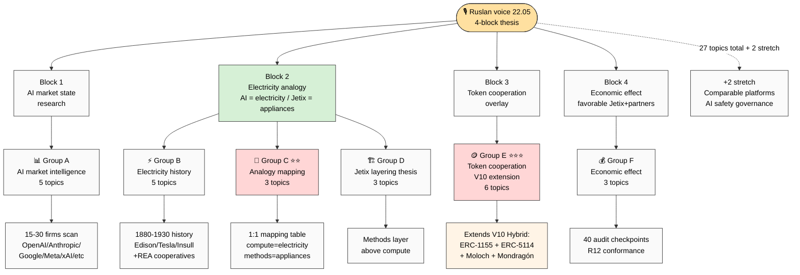
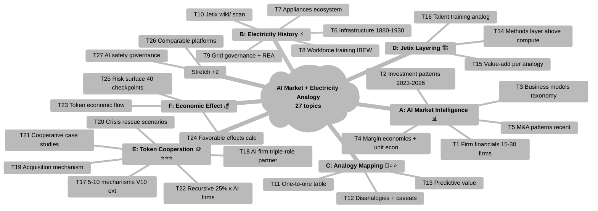
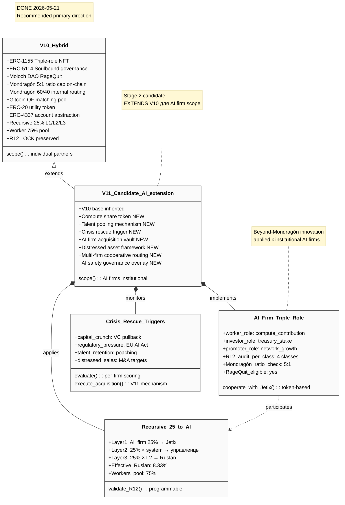

# AI MARKET + ELECTRICITY ANALOGY — Research Plan (Stage 1)

> **Stage 1 PLAN deliverable.** Consolidated PLAN ~2-3K words. Stage 2 (full research) = separate prompt after Ruslan PLAN review + prompt update.

---

## §0 TL;DR (≤200w)

Ruslan voice 22.05 early morning сформулировал 4-block thesis: **(1) AI market state research** (кто зарабатывает, business models, capital flows, major firms economics); **(2) Electricity analogy** (AI compute = electricity raw utility; AI firms = utility generators; Jetix = appliances + lines layer + electrician training); **(3) Token cooperation overlay** (Jetix platform tokens manage AI firms, governance, acquisition mechanism, crisis rescue scenarios); **(4) Economic effect** (new dynamic favorable Jetix + partners; token-credit flow; variants + risks).

Этот PLAN proposes Stage 2 research scope: **27 topics в 6 groups** (A AI market / B Electricity history / C Analogy mapping / D Jetix layering / E Token cooperation extending V10 Hybrid / F Economic effect), **18-phase Stage 2 structure** (~21-26h runtime / <€7 / 95-145K words artifact volume), **37 mermaid diagram ideas**, **8 clarifying questions** для Ruslan to answer before Stage 2 launch.

**Critical cross-link:** Stage 2 token cooperation mechanics (Group E) extends V10 Hybrid composition из Economic Model + Tokenomics deliverable (DONE 2026-05-21) — ERC-1155 triple-role NFT + ERC-5114 soulbound + Moloch RageQuit + Mondragón 5:1 + QF + ERC-20 + ERC-4337 + Triple-Role partner + Recursive 25%.

**Stage 1 ≠ Stage 2.** Этот PLAN не выполняет full research. Stage 2 launch = pending Ruslan ack.

---

## §1 Ruslan voice 4-block thesis (verbatim + decode)

> Source: `daily-logs/_DAILY-LOG-2026-05-22.md` §APPEND-AI-market-electricity-analogy-dictation. Voice = canonical R1; decode = brigadier mechanical mapping only.

### §1.A Voice verbatim (4 layers)

**Layer 1 — AI market study scope.** Ruslan хочет understand: кто зарабатывает / business models / revenue / investment requirements / capital flows / major AI firms operations / per-firm economic state.

**Layer 2 — Electricity analogy.** «AI = новое электричество / Jetix = electrical appliances + lines layer». Compute leverage thesis: «компьют уже дешевый и мы его используем». Jetix не competes с compute, а builds methods + infrastructure layer над ним (analog 1880s electrification). Jetix trains «electricians» = AI-using professionals.

**Layer 3 — Token cooperation overlay.** Jetix platform tokens manage AI firms (governance). Closed-loop self-sustaining. Acquisition mechanism (buy AI firm parts через token). Crisis rescue scenarios. Talent + наработки pooling.

**Layer 4 — Economic effect.** New economic dynamic favorable для Jetix + partners. Token-credit flow. Variants + risks.

### §1.B Brigadier-scribe structural decode

Voice maps 1:1 к **6 Topic groups** (see §2):
- Layer 1 → **Topic Group A** (AI market intelligence)
- Layer 2 → **Topic Groups B + C + D** (Electricity history + Analogy mapping + Jetix layering)
- Layer 3 → **Topic Group E** (Token cooperation; extends V10 Hybrid)
- Layer 4 → **Topic Group F** (Economic effect)

---

## §2 Stage 2 research scope (27 topics в 6 groups)

Full breakdown: `reports/ai-market-analogy-PLAN-2026-05-22/02-scope-proposal.md`.

### Group A — AI market intelligence (5 topics)
1. AI firm financials deep scan (15-30 firms: OpenAI / Anthropic / Google DeepMind / Meta / xAI / Cohere / Mistral / Stability / Hugging Face / Scale AI / Databricks / Microsoft AI / Amazon AWS AI / Inflection / Adept / Character / Perplexity)
2. AI investment patterns 2023-2026 (capital deployed / round sizes / valuation curves / VC concentration)
3. AI business models taxonomy (B2B SaaS / API / compute infra / data / agents / consumer / vertical)
4. AI margin economics + unit econ (gross / contribution / inference cost trends)
5. AI consolidation / M&A patterns recent

### Group B — Electricity history (5 topics)
6. Electricity infrastructure history 1880-1930 (Edison / Tesla / Westinghouse / Insull / electrification waves)
7. Electric appliances ecosystem (motors / lighting / heating / cooling / industrial / domestic)
8. Electrical workforce training (electricians as profession; IBEW; certification; apprenticeship)
9. Electric grid governance structures (IOUs / municipal / cooperatives / federal / **REA cooperatives critical для R12 parallel**)
10. Jetix wiki substrate scan (existing electricity analogies in `wiki/`)

### Group C — Analogy mapping (3 topics) ⭐⭐
11. One-to-one mapping table (compute = electricity / models = utilities / methods = appliances / users = electricians / etc.)
12. Where mapping breaks (disanalogies — fungibility, marginal cost, standards, capital intensity, regulatory asymmetry)
13. Predictive value (electricity precedent → AI evolution predictions)

### Group D — Jetix layering thesis (3 topics)
14. Jetix as «methods layer» above compute (specific positioning)
15. Jetix value-add per analogy (standardization + safety + cooperative governance)
16. Jetix talent training (electricians = AI-using professionals; 8-tier progression analog)

### Group E — Token cooperation mechanics (6 topics — V10 Hybrid extension) ⭐⭐⭐
17. Token-based AI firm cooperation variants (5-10 mechanisms ALL extending V10 Hybrid)
18. AI firm onboarding as triple-role institutional partner (worker + investor + promoter simultaneously)
19. Acquisition through token mechanism (legal + financial + technical layers)
20. Crisis rescue scenarios (capital crunch / regulatory pressure / talent retention / distressed sales)
21. Cooperative crisis-rescue case studies (Mondragón 68y + Caja Laboral + DAO precedents)
22. Recursive 3-layer cooperation extending к AI firm scope (25% recursive)

### Group F — Economic effect (3 topics)
23. Token economic flow modeling (V10 Hybrid composition applied)
24. Favorable economic effects calculation (using 8-tier 1M user trajectory)
25. Risk surface comprehensive (40 audit checkpoints reused; regulatory / antitrust / sovereignty / R12)

### Stretch (2 topics — optional)
26. Comparable layered platforms (Stripe / Shopify / Vercel / WordPress)
27. AI safety + governance overlap с Jetix layered approach (EU AI Act + RSP + Preparedness Framework)

**≥12 topics target: ✅ 27 surfaced. Ruslan prunes/expands during review.**

---

## §3 Stage 2 structure proposal (18-phase sketch)

Full table: `reports/ai-market-analogy-PLAN-2026-05-22/03-structure-proposal.md`.

| Phase | Time | Deliverable | Topic group |
|---|---|---|---|
| 0 | 30m | FPF lens + 30+ substrate inventory | meta |
| 1 | 30m | Voice decode + scope confirmation | meta |
| 2-6 | 6h | AI market block (5 phases × 1-1.5h) | A |
| 7-10 | 4.25h | Electricity history block (4 phases) | B |
| 11-12 | 2h | ⭐⭐ Analogy mapping + disanalogies | C |
| 13 | 1.5h | Jetix layering thesis | D |
| 14-15 | 3.5h | Token cooperation + acquisition | E |
| 16 | 1h | Risk surface (40 checkpoints) | F |
| 17 | 1h | Recommendation memo (V11 candidate or V10-extension) | synthesis |
| 18 | 2h | Mermaid pass (37 diagrams) | all |
| 19 | 1h | Main deliverable + Summary + push | all |

**Sub-documents (5 candidate):** AI-MARKET-FINANCIALS / ELECTRICITY-HISTORY / ANALOGY-MAPPING ⭐⭐ / LAYERING-THESIS / TOKEN-COOPERATION-VARIANTS.

---

## §4 Mermaid diagrams ideas (37 в 6 groups)

Full list: `reports/ai-market-analogy-PLAN-2026-05-22/04-mermaid-ideas.md`.

| Group | Count | Critical diagrams |
|---|---|---|
| A AI market | 8 | A1 quadrantChart (Revenue × Margin) / A2 sankey (VC flow) / A4 xychart (inference cost trends) |
| B Electricity history | 6 | B1 timeline (1880-1930) / B3 stateDiagram (AC/DC Edison vs Tesla) / B6 graph TD (governance evolution) |
| C Analogy mapping | 6 | **⭐⭐ C1 graph LR (AI ↔ electricity one-to-one) — most important** / C2 block-beta (layer comparison) / C5 gantt (predictive timeline) |
| D Jetix layering | 5 | D1 block-beta (stack) / D4 journey (training pipeline) / D5 xychart (leverage thesis) |
| E Token cooperation | 8 | E5 sankey (recursive 25% Closed-loop) / E7 quadrantChart (R12 conformance) / E8 quadrantChart (Risk × Reward) |
| F Master synthesis | 4 | F1 graph TD (master) / F4 graph TD (recommendation decision tree) |

**Balanced mermaid type distribution:** `graph TD` × 5, `quadrantChart` × 4, `xychart-beta` × 5, `sankey-beta` × 3, `block-beta` × 3, `mindmap` × 3, plus 14 other diverse types.

---

## §5 Stage 2 scope estimates

Full details: `reports/ai-market-analogy-PLAN-2026-05-22/05-stage-2-estimates.md`.

**Calibration basis:** Economic Model + Tokenomics Stage 2 actual (14 phases / ~18-20h / <€6 / ~80K words). This Stage 2 extends к 18-19 phases с wider scope.

| Metric | Estimate |
|---|---|
| Total artifact volume | **95-145K words** |
| Server CC autonomous runtime | **21-26h** |
| Cost | **<€7** (built-in tools only; no external API per `feedback_no_api_keys.md`) |
| Mermaid diagrams | **30-40** (37 proposed) |
| External substrate sources | **30+** (~40-48 likely) |
| Sub-documents | **5** |
| Phases | **18 + 1 closure = 19 total** |
| Stretch (if Ruslan expands per Q1) | 27-32h / 6 sub-docs / 40+ diagrams |

---

## §6 8 clarifying questions для Ruslan (before Stage 2 launch)

Full details + tradeoffs: `reports/ai-market-analogy-PLAN-2026-05-22/06-unknowns-questions.md`.

| # | Question | Suggested default | Runtime if all defaults | Runtime if all stretch |
|---|---|---|---|---|
| Q1 | AI firm selection scope (Top 15 / 30+ / Top 10)? | Top 15 (A) | baseline | +4-6h |
| Q2 | Electricity history depth (Surface / Deep Wiki / Extra-deep)? | Deep Wiki (A) | baseline | +4-6h |
| Q3 | Acquisition variants quantity (5 / 7 / 10)? | 7 (A) | baseline | +2h |
| Q4 | Crisis-rescue framing (Conservative / Active rescuer / Mixed)? | Conservative (A) или Mixed (C) | n/a runtime | R1+AP-6 implication |
| Q5 | Token integration depth (Extend V10 / New V11 / Hybrid)? | Extend V10 (A) or Hybrid (C) | baseline | +1-2h B |
| Q6 | Geographic scope (Global / US / US+EU / DACH)? | US+EU (C) | baseline | +1-2h global |
| Q7 | Stage 2 timing (After PLAN review / Sequence after X / Defer)? | After PLAN review (A) | n/a | n/a |
| Q8 | Mermaid count (30 min / 35 target / 37 proposal / 40 stretch)? | 37 (D) or 35 (A) | baseline | +0.5h |

**If all defaults adopted: 21-26h runtime. If all stretch adopted: ~33-40h runtime.**

---

## §7 Recommended Stage 2 launch sequence

> R1 note — sequence proposed мechanically. Final adoption = Ruslan ack per AP-6.

**Step 1.** Ruslan reads this PLAN deliverable (~15-20 min).

**Step 2.** Ruslan answers 8 clarifying questions (Q1-Q8) — can be voice-dictated or written ack.

**Step 3.** Brigadier updates Stage 2 prompt (`prompts/ai-market-electricity-analogy-RESEARCH-2026-05-XX.md`) reflecting answers — generates EXPLAIN parallel.

**Step 4.** Ruslan reviews updated Stage 2 prompt (~5-10 min ack).

**Step 5.** Stage 2 launch — server CC autonomous ~21-26h (or per Q8 stretch).

**Estimated total elapsed:** Step 1-4 ~30-45 min Ruslan time; Step 5 ~1-2 days server runtime.

---

## §8 Cross-refs

### Stage 1 (this PLAN) artifacts
- Phase 0 FPF + substrate: `reports/ai-market-analogy-PLAN-2026-05-22/phase-0-fpf-lens-scope.md`
- Phase 1 thesis decode: `reports/ai-market-analogy-PLAN-2026-05-22/01-thesis-decode.md`
- Phase 2 scope proposal (27 topics): `reports/ai-market-analogy-PLAN-2026-05-22/02-scope-proposal.md`
- Phase 3 structure proposal (18 phases): `reports/ai-market-analogy-PLAN-2026-05-22/03-structure-proposal.md`
- Phase 4 mermaid ideas (37): `reports/ai-market-analogy-PLAN-2026-05-22/04-mermaid-ideas.md`
- Phase 5 estimates: `reports/ai-market-analogy-PLAN-2026-05-22/05-stage-2-estimates.md`
- Phase 6 unknowns + 8 questions: `reports/ai-market-analogy-PLAN-2026-05-22/06-unknowns-questions.md`
- Summary: `reports/ai-market-analogy-PLAN-2026-05-22/00-SUMMARY-FOR-RUSLAN.md`

### Substrate (critical cross-link для Stage 2)
- ⭐⭐ Economic Model + Tokenomics main: `decisions/strategic/ECONOMIC-MODEL-TOKENOMICS-2026-05-21.md`
- ⭐⭐ V10 Hybrid recommendation memo: `reports/economic-model-tokenomics-2026-05-21/_RECOMMENDATION-MEMO.md`
- ⭐ Triple-role partner: `decisions/strategic/TRIPLE-ROLE-PARTNER-2026-05-21.md`
- Strategic Plan Phase 8 (1M users 8-tier): `decisions/strategic/STRATEGIC-PLAN-NEAR-FUTURE-2026-05-21.md`
- Method V2 Phase 6 §H (exocortex era): `decisions/strategic/METHOD-LIFE-DEVELOPMENT-V2-2026-05-21.md`
- DR-26 unit econ: `research/unit-econ-deep-dive-2026-05-21/_RECOMMENDATION-MEMO.md`
- H8 Ethereum substrate: `swarm/awaiting-approval/h8-ethereum-substrate-extension-2026-05-18.md`
- R12 anti-extraction: `swarm/awaiting-approval/r12-anti-extraction-2026-05-12.md`
- R12 programmable Option D Hybrid: `swarm/awaiting-approval/r12-programmable-ethereum-2026-05-18.md`

### Voice + prompt sources
- Voice anchor: `daily-logs/_DAILY-LOG-2026-05-22.md` §APPEND-AI-market-electricity-analogy-dictation
- Stage 1 prompt: `prompts/ai-market-electricity-analogy-PLAN-2026-05-22.md`
- Stage 1 EXPLAIN: `prompts/explanations/_EXPLAIN-ai-market-electricity-analogy-PLAN-2026-05-22.md`

---

## §9 Constitutional posture preserved

| Rule | Posture | Evidence |
|---|---|---|
| R1 (AI не strategize) | ✅ | Brigadier-scribe; voice verbatim §1; selection = Ruslan |
| R2 (no architectural exec без gate) | ✅ | LOCK / Foundation untouched |
| R6 (provenance per claim) | ✅ | `[src: ...]` inline; cross-refs §8 |
| R11 (Default-Deny novel actions) | n/a | Planning artifact only |
| R12 (anti-extraction) | ✅ | AI firm cooperation framing R12-conformant |
| IP-1 STRICT (Role≠Executor) | ✅ | Abstract role-types only |
| EP-5 (no fabrication) | ✅ | Substrate paths verified |
| AP-6 (no autonomous strategic decision) | ✅ | Stage 2 launch deferred к Ruslan ack |
| Append-only | ✅ | New files only |
| SKIP-list integrity | ✅ | O-62/O-66/O-67/O-68 NOT surfaced |

---

*PLAN deliverable closure 2026-05-22. Stage 1 complete. Stage 2 = pending Ruslan PLAN review + 8-question ack + prompt update + launch.*

---

## §10 ⭐ Visual overview — 6 mermaid диаграмм (added per Ruslan voice 22.05)

### §10.1 Diagram M1 — 4-block thesis → 6 topic groups → 27 research topics (`graph TD`)



### §10.2 Diagram M2 — 27 topics organized в 6 groups (`mindmap`)



### §10.3 Diagram M3 — 18-phase Stage 2 timeline (`gantt`)

```mermaid
%%{init: {'theme':'base', 'themeVariables': {'primaryTextColor':'#000000','textColor':'#000000','lineColor':'#333333','primaryBorderColor':'#333333','primaryColor':'#fafafa','sectionBkgColor':'#f0f0f0','sectionBkgColor2':'#e0e0e0','altSectionBkgColor':'#e8e8e8','gridColor':'#cccccc','titleColor':'#000000'}}}%%
gantt
    title Stage 2 Full Research — 18-phase ~21-26h timeline (or 33-40h stretch)
    dateFormat HH:mm
    axisFormat %H:%M

    section Meta (1h)
    Phase 0 FPF + 30+ substrate           :p0, 00:00, 30m
    Phase 1 Voice decode + scope          :p1, after p0, 30m

    section Group A AI Market (6h)
    Phase 2 Firm financials 15-30         :crit, p2, after p1, 2h
    Phase 3 Investment patterns           :p3, after p2, 1h
    Phase 4 Business models taxonomy      :p4, after p3, 1h
    Phase 5 Margin + unit econ            :p5, after p4, 1h
    Phase 6 M&A patterns                  :p6, after p5, 1h

    section Group B Electricity (4.25h)
    Phase 7 History 1880-1930             :p7, after p6, 1.5h
    Phase 8 Appliances ecosystem          :p8, after p7, 1h
    Phase 9 Workforce training            :p9, after p8, 45m
    Phase 10 Grid governance + REA        :p10, after p9, 1h

    section Group C Mapping ⭐⭐ (2h)
    Phase 11 ⭐⭐ 1:1 analogy mapping       :crit, p11, after p10, 1.5h
    Phase 12 Disanalogies + caveats       :p12, after p11, 30m

    section Group D Layering (1.5h)
    Phase 13 Jetix layering thesis        :p13, after p12, 1.5h

    section Group E Token Coop ⭐⭐⭐ (3.5h)
    Phase 14 Token cooperation variants   :crit, p14, after p13, 2h
    Phase 15 Acquisition mechanism        :crit, p15, after p14, 1.5h

    section Group F + Synthesis (2h)
    Phase 16 Risk surface 40 checkpoints  :p16, after p15, 1h
    Phase 17 Recommendation V11 candidate :crit, p17, after p16, 1h

    section Closure (3h)
    Phase 18 Mermaid pass 37-40 diagrams  :p18, after p17, 2h
    Phase 19 Main deliverable + Summary   :crit, p19, after p18, 1h
```

### §10.4 Diagram M4 — 8 clarifying questions decision tree (`graph TD`)

```mermaid
%%{init: {'theme':'base', 'themeVariables': {'primaryTextColor':'#000000','textColor':'#000000','lineColor':'#333333','primaryBorderColor':'#333333','primaryColor':'#fafafa','noteTextColor':'#000000','noteBkgColor':'#fff8d5','edgeLabelBackground':'#ffffff'}}}%%
graph TD
    Start([🎯 Stage 2 launch<br/>requires 8 acks])

    Start --> Q1{Q1<br/>AI firms<br/>scope?}
    Q1 -- "Top 15 ⚡fast" --> Q1A[~21-26h baseline]
    Q1 -- "30+ deep ⭐" --> Q1B[+4-6h]

    Start --> Q2{Q2<br/>Electricity<br/>depth?}
    Q2 -- "Surface" --> Q2A[baseline -2h]
    Q2 -- "Deep Wiki ⚡default" --> Q2B[baseline]
    Q2 -- "Extra-deep ⭐" --> Q2C[+4-6h]

    Start --> Q3{Q3<br/>Acquisition<br/>variants?}
    Q3 -- "5" --> Q3A[baseline -1h]
    Q3 -- "7 default" --> Q3B[baseline]
    Q3 -- "10 ⭐" --> Q3C[+2h]

    Start --> Q4{Q4<br/>Crisis-rescue<br/>framing?}
    Q4 -- "Conservative" --> Q4A[R12 cleanest]
    Q4 -- "Mixed ⭐rec" --> Q4B[balanced]
    Q4 -- "Active rescuer" --> Q4C[AP-6 implication]

    Start --> Q5{Q5<br/>Token<br/>integration?}
    Q5 -- "Extend V10" --> Q5A[clean continuity]
    Q5 -- "Hybrid V10+V11 ⭐" --> Q5B[+1-2h | depth]
    Q5 -- "New V11 only" --> Q5C[isolated]

    Start --> Q6{Q6<br/>Geographic<br/>scope?}
    Q6 -- "DACH only" --> Q6A[narrow]
    Q6 -- "US+EU" --> Q6B[default]
    Q6 -- "Global ⭐" --> Q6C[+1-2h]

    Start --> Q7{Q7<br/>Timing?}
    Q7 -- "Immediately" --> Q7A[launch ASAP]
    Q7 -- "After Wave 1 fb" --> Q7B[defer 3-7d]

    Start --> Q8{Q8<br/>Mermaid<br/>count?}
    Q8 -- "30 min" --> Q8A[baseline -0.5h]
    Q8 -- "35 default" --> Q8B[baseline]
    Q8 -- "37-40 ⭐" --> Q8C[+0.5h]

    Q1A & Q1B & Q2A & Q2B & Q2C & Q3A & Q3B & Q3C & Q4A & Q4B & Q4C & Q5A & Q5B & Q5C & Q6A & Q6B & Q6C & Q7A & Q7B & Q8A & Q8B & Q8C --> Launch([🚀 Stage 2 prompt<br/>update + launch])

    Launch -- "All stretch ⭐" --> Stretch[~33-40h / <€10]
    Launch -- "All defaults" --> Default[~21-26h / <€7]

    style Start fill:#ffe0a0,color:#000
    style Launch fill:#d6f0d6,color:#000
    style Stretch fill:#ffd6d6,color:#000
    style Default fill:#d6e0f0,color:#000
```

### §10.5 Diagram M5 — Two-stage process flow с положением на critical path (`sequenceDiagram`)

```mermaid
%%{init: {'theme':'base', 'themeVariables': {'primaryTextColor':'#000000','textColor':'#000000','lineColor':'#333333','primaryBorderColor':'#333333','primaryColor':'#fafafa','noteTextColor':'#000000','noteBkgColor':'#fff8d5','edgeLabelBackground':'#ffffff'}}}%%
sequenceDiagram
    participant R as Ruslan
    participant CC as Cloud Cowork<br/>(brigadier-scribe)
    participant SCC as Server CC<br/>(autonomous)
    participant Out as Deliverables

    Note over R,Out: Stage 1 PLAN (DONE 22.05; 10m runtime)
    R->>CC: voice dictation 4-block thesis (22.05 утро)
    CC->>SCC: launch prompts/ai-market-electricity-analogy-PLAN
    SCC->>SCC: 8 phases execute autonomous
    SCC->>Out: PLAN deliverable + 7 phase files + Summary
    Out->>R: 27 topics / 18-phase / 37 diagrams / 8 questions

    Note over R,Out: NOW — Ruslan review window (~15-30 min)
    R->>R: read PLAN deliverable
    R->>R: ack 8 clarifying questions (Q1-Q8)
    R->>CC: voice/text answers → prompt update

    Note over R,Out: Stage 2 prompt build (~10-20 min Cloud Cowork)
    CC->>CC: update prompt + EXPLAIN с answers
    CC->>CC: push to main
    CC->>R: surface launch command

    Note over R,Out: Stage 2 Full Research (~21-40h depending on stretch)
    R->>SCC: tmux session launch (paste prompt)
    SCC->>SCC: 18-phase autonomous execution
    SCC->>Out: Main deliverable ~30-50K words<br/>+ 5 sub-docs<br/>+ 37-40 mermaid<br/>+ 30-48 substrate sources
    Out->>R: AI-MARKET-ELECTRICITY-ANALOGY consolidated

    Note over R,Out: Critical path — НЕ блокирует Wave 1 outreach
    R->>R: Wave 1 outreach launches 22.05 (parallel)
    R->>R: One-pager R1 prose (24-26.05)
    R->>R: Stage 2 results read когда done
```

### §10.6 Diagram M6 — V10 Hybrid → V11 candidate extension для AI firms (`classDiagram`)



---

*6 mermaid diagrams added 2026-05-22 per Ruslan voice request. Visual overview позволяет grasp Stage 2 scope без full reading. Stage 2 launch pending 8-question ack.*
