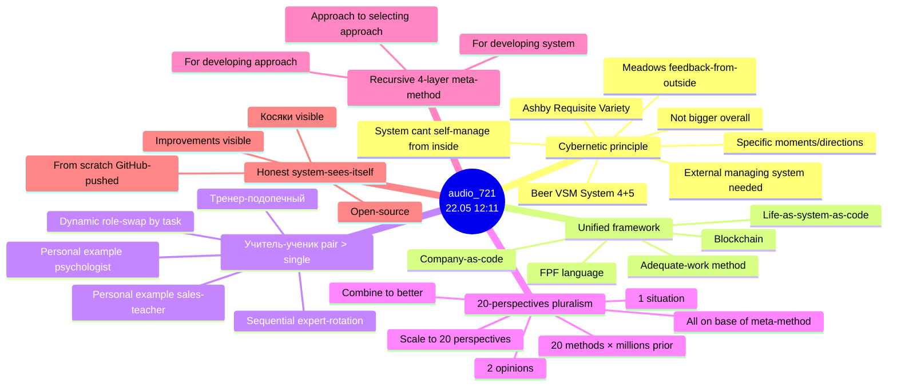
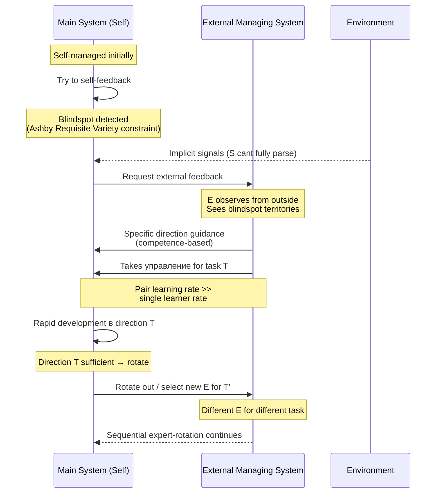
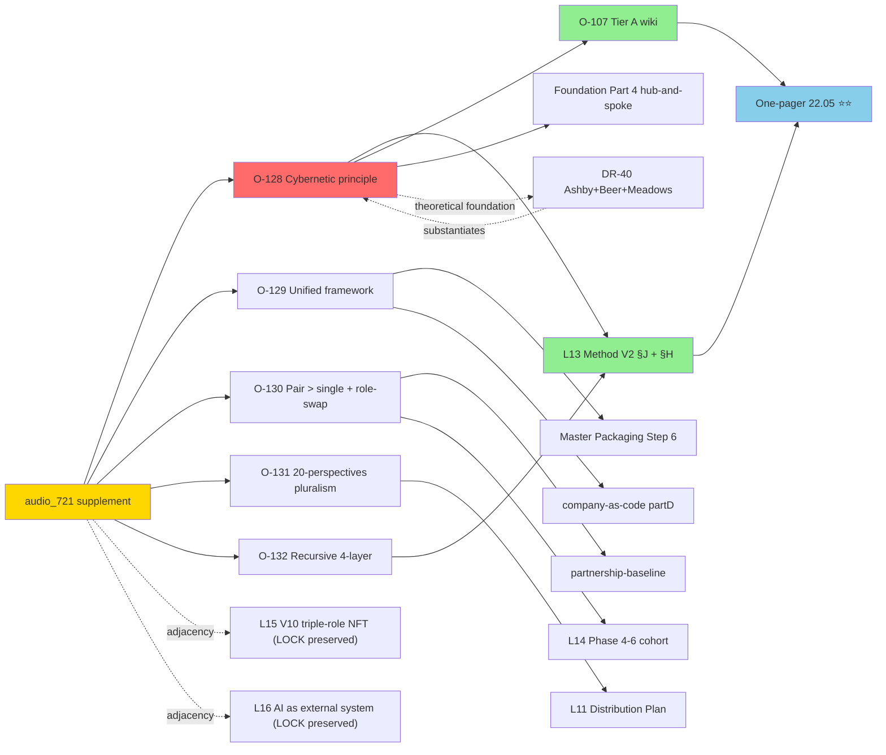
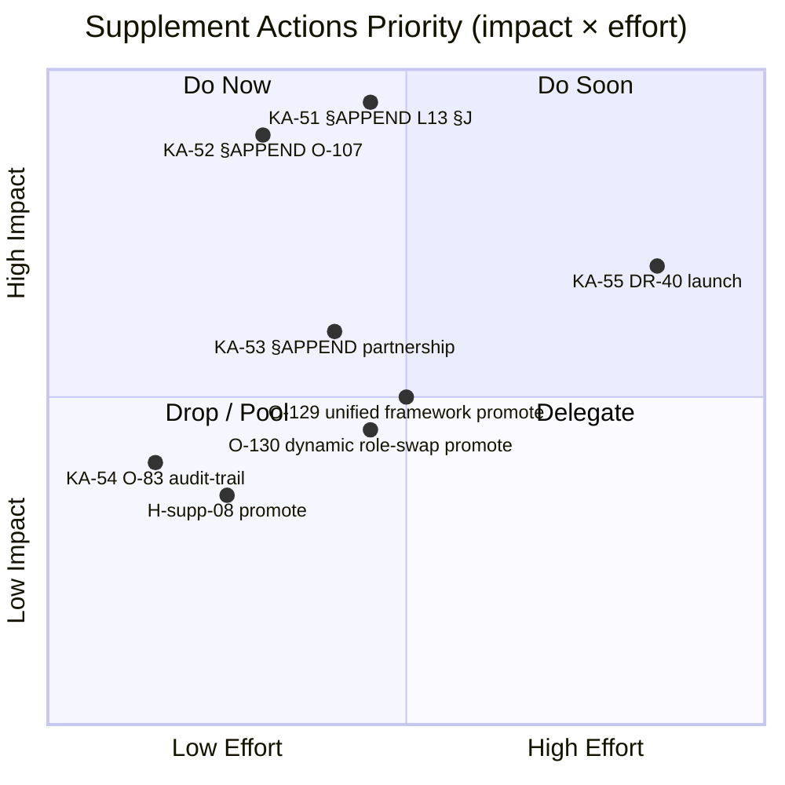

# AUDIO-721 INSIGHTS REPORT — Standalone Deliverable

> Per supplement prompt §6 Phase 4. Standalone analysis of single audio (audio_721@22-05-2026_12-11-58, 22.05 12:11 ~6-8 min ~1.84 MB). Companion: 5-cell analysis в `raw/voice-memos-2026-05-22-batch/audio_721@22-05-2026_12-11-58.md` + 16-lens cross-analysis в `reports/voice-pipeline-2026-05-22-batch-10/03-16-lenses-cross-analysis.md` §APPEND-supplement.

---

## §0 TL;DR (≤200w)

Audio_721 articulates **6 substrate clusters** post-meta-method articulation cluster (audio_717-720 batch-10):

1. **⭐⭐⭐ External-system-required-for-self-management** — cybernetic principle: «система не может сама себя адекватно управлять; нужна другая управляющая система». Direct Ashby Requisite Variety + Beer VSM analogue.
2. **⭐⭐ Unified framework** — FPF + meta-method + blockchain + company-as-code + life-as-system-as-code объединяются в один framework.
3. **⭐ Ученик-учитель / тренер-подопечный pair > single** + dynamic role-swap by task-context (sequential expert-rotation life-example: psychologist → sales-teacher).
4. **⭐ 20-perspectives pluralism on meta-method base** — 1 ситуация → 2 мнения → combine → better; scale 20 × 20 methods × millions prior на base of meta-method.
5. **⭐ Recursive 4-layer meta-method** — «подход к выбору подхода для разработки подхода» (deeper than batch-10 3-layer cluster).
6. **⚠️ «Читерство по управлению»** = 3rd batch-10 cheat-code-related metaphor recurrence; context-DISTINCT from O-83 dropped Jetix-positioning; preserve verbatim NOT revive.

**Primary §APPEND target:** L13 Method V2 §J + O-107 Tier A wiki — augmented with cybernetic foundation layer (Ashby/Beer/Meadows) + 4-layer recursive depth + 20-perspectives pluralism. **5 NEW Tier B candidates O-128..132**, **2 NEW DR DR-40..41**, **2 NEW H-batch-10-supp-08..09**, **5 NEW KA-51..55**.

**R12 paired-frame discipline flagged** (HR-1-supp claim 8 «партнёры берут управление»). **R12 LOCK + 11 acked-LOCKs preserved ✅ PASS**.

---

## §1 Voice anchor (verbatim key claims)

Full verbatim в `raw/voice-transcripts/audio_721@22-05-2026_12-11-58.txt` (preserved). Per-claim references (numbered) — see `raw/voice-memos-2026-05-22-batch/audio_721@22-05-2026_12-11-58.md` §1 (15 claims).

**Top 5 verbatim quotes (essential):**

1. *[claim 5]* «как бы система не может сама себя со стороны изнутри... должна быть другая управляющая система которая вот видит возможно больше ну или чуть в другом направлении»
2. *[claim 6]* «эта управляющая система... в какой-то конкретный момент она должна знать и управлять этой системой в тех местах и в тех направлениях, где основная система не сильно шарит, или где она не может дать себе адекватную обратную связь»
3. *[claim 13]* «об одной ситуации. Два мнения, два метода ее решения. И потом если посмотреть вот эти два метода решения, их можно соединить и можно получить вариант получше. Или же можно даже еще больше сделать, чтобы посмотрели на эту систему с 20 разных сторон, соответственно 20 разных методов предложили, а этих 20 разных методов предложили на основе просто еще миллионов методов, которые использовались»
4. *[claim 14]* «адекватным подходом даже к выбору подхода, по которому будет создан подход для разработки этой системы»
5. *[claim 2]* «вот для честности с самим собой и вот как раз это будет объединено и получается и fpf язык и вот этот метод адекватной работы и блокчейн и непосредственно вот это компания с и код и потом в целом подход к своей жизни тоже вот как к системе и как к коду»

---

## §2 Что нового vs existing substrate

### vs L13 Method V2 (PRIMARY EXTENSION)

| Section | What audio_721 extends | Treatment |
|---|---|---|
| §A Phase 1 ontology | (minimal — voice already extends §A в batch-10 audio_720) | preserve |
| §J meta-method | ⭐⭐⭐ adds **external-system-required-for-self-management** as required layer; **4-layer recursive depth** (vs prior 3-layer); **20-perspectives pluralism scaling** thesis | PRIMARY §APPEND target |
| §H meta-control + exocortex era | ⭐⭐ adds external system = exocortex-extension articulation; AI = «more knowledgeable external system» = exocortex realised | EXTENSION |
| §I Distribution mechanisms | ⭐ adds dynamic role-swap by task-context + competence-based partner-management | EXTENSION |
| §K partner-method-selection | ⭐ adds sequential expert-rotation life-example (psychologist→sales-teacher) substrate | EXTENSION |
| §M Wikipedia-deep | (minimal — primarily corroboration via Левенчук Гл.7 «студия инженера» + Ashby + Beer) | preserve |

### vs L14 Strategic Plan Near-Future

| Phase | What audio_721 extends |
|---|---|
| Phase 4 cohort cadence | Sequential expert-rotation pattern operational |
| Phase 5 MVP Sprint | (no direct content; substrate adjacency only) |
| Phase 6 partner-vetting | ⭐ dynamic role-swap + competence-based partner-management protocol |
| Phase 7 first-customer | Sequential expert-rotation life-example substrate для narrative |

### vs L15 Economic Model V10 Hybrid (LOCK preserved)

- V10 triple-role NFT (ERC-1155 worker/manager/holder) = **structural analog к dynamic role mechanism**; «партнёры берут управление в areas more knowledgeable» = competence-based role-rotation pattern *[claim 8]*
- **Treatment: adjacency cross-link ONLY; NOT challenge V10 LOCK**
- ✅ V10 LOCK preserved

### vs L16 AI Market PLAN Stage 1 (LOCK preserved)

- AI as **«more knowledgeable external system»** — explicitly aligns с electricity analogy thesis *[claim 5-9 indirect]*
- AI commoditisation = many cheap external-management options = electricity analogy substrate strengthened
- **Treatment: substrate adjacency strengthens L16 Stage 1 thesis; Stage 2 LOCK FIXED-DEFERRED preserved**

### vs 13 Tier A wikis

| Wiki | Audio_721 extension |
|---|---|
| `method-method-one-liner.md` (O-107 Tier A) | ⭐⭐⭐ PRIMARY §APPEND: cybernetic principle + 4-layer + pluralism + dynamic role-swap |
| `method-systems-thinking.md` | ⭐⭐ external-management cybernetic principle + system-sees-itself + honesty discipline |
| `jetix-as-exokortex.md` | ⭐ external system = exocortex extension articulation |
| `mastery-formula.md` | (minimal) |
| `all-is-information.md` | (minimal; batch-10 already extended) |

### vs Hypothesis arch (7-layer)

- ⭐ H-batch-10-supp-08 NEW «system effectiveness ∝ external-feedback-system diversity × meta-method depth» — testable
- ⭐ H-batch-10-supp-09 NEW «pair (учитель-ученик) learning rate > single learner rate AND > pure executor rate» — falsifiable

---

## §3 Что можем добавить (concrete additions)

### Wiki §APPEND candidates (specific files + content sketches)

1. **`wiki/concepts/method-method-one-liner.md` (O-107 Tier A) §APPEND-supplement** — add «External system as required meta-management layer» subsection citing Ashby/Beer/Meadows + 4-layer recursion + 20-perspectives pluralism + dynamic role-swap. *[Gated by D10-supp-2 + D10-3 batch-10 compound]*

2. **`wiki/concepts/method-systems-thinking.md` §APPEND-supplement** — add «System cannot adequately self-manage from inside» principle + «honesty discipline visible косяки + улучшения» substrate.

3. **`wiki/concepts/jetix-as-exokortex.md` §APPEND-supplement** — add «External system = exocortex extension» framing; AI as one of many exocortex realisations.

### New concept proposals (Tier B → Tier A trajectory)

| Tier B candidate | Promotion trigger |
|---|---|
| **O-128** ⭐⭐⭐ External-system-required cybernetic principle | DR-40 done OR Ruslan ack «promote» |
| **O-129** Unified framework FPF+meta-method+blockchain+company-as-code+life-as-code | Ruslan ack «promote North Star fragment» |
| **O-130** Ученик-учитель pair + dynamic role-swap | Ruslan ack «promote relational learning frame» |
| **O-131** 20-perspectives pluralism on meta-method base | Ruslan ack «promote pluralism scaling principle» |
| **O-132** Recursive 4-layer meta-method | Ruslan ack «promote 4-layer recursion» (likely compound с O-128) |

### New DR research candidates

- **DR-40 ⭐** External-system-required cybernetic principle benchmarks (Ashby + Beer VSM + Senge + Meadows + Sutton-Barto + Karpathy + Polanyi) — substantiates O-128
- **DR-41** Dynamic expert-rotation by task-context benchmarks (Vygotsky ZPD + agile + Holacracy + Spotify squads + situational-leadership)

### New KA action items

5 NEW KA-51..55 в `reports/voice-pipeline-2026-05-22-batch-10/06-key-actions-list.md` §APPEND-supplement:
- KA-51 ⭐⭐⭐ §APPEND L13 §J cybernetic principle
- KA-52 ⭐⭐⭐ §APPEND O-107 Tier A wiki cybernetic + 4-layer + pluralism
- KA-53 §APPEND partnership-baseline dynamic role-swap
- KA-54 O-83 context-distinction audit-trail note (3-instance pattern)
- KA-55 DR-40 launch if Ruslan acks

### Hypothesis migration candidates

- H-batch-10-supp-08 «system effectiveness ∝ external-feedback-system diversity × meta-method depth» → hypotheses/ canonical если Ruslan acks
- H-batch-10-supp-09 «pair learning rate > single learner rate AND > pure executor rate» → hypotheses/ canonical если Ruslan acks

---

## §4 Как работает (mechanism explanation)

Audio_721 раскрывает **3 interlocking mechanisms**:

### Mechanism 1: External-system-required cybernetic feedback loop

**Step-by-step:**
1. Main system (S) executes/perceives/decides.
2. S has blindspots — places/directions где S cannot give itself adequate feedback (Ashby Requisite Variety constraint).
3. External system (E) observes S от outside; sees blindspot territories.
4. E provides feedback или takes управление в specific moments/directions где S unable.
5. S develops faster (psychologist example: Ruslan вошёл в management Psychologist; speedup achieved).
6. Once S develops sufficient в that direction → E rotates out / Ruslan moves к next E (sales-teacher).
7. **Key:** E не bigger overall, just sees more в specific direction at specific moment.

### Mechanism 2: Dynamic role-swap by task-context

**Step-by-step:**
1. Different tasks require different expertise / perspective.
2. For task T, the system identifies «who/which-system is most knowledgeable / most responsible для T».
3. That entity takes управление over the main system for T's duration.
4. When T resolves OR new T' emerges → entity rotates out / new entity rotates in.
5. **Operational requirement:** continuous identification + matching protocol.
6. **Partnership example:** partners watch Jetix; identify weak spots; take управление в areas they're more knowledgeable.

### Mechanism 3: 20-perspectives pluralism on meta-method base

**Step-by-step:**
1. Given ONE situation.
2. Apply 20 different perspectives (different external systems / partners / methods).
3. Each generates a method-proposal (based on millions of prior methods studied).
4. Combine 20 method-proposals → richer composite method.
5. **CRITICAL:** all 20 proposals are formed ON THE BASE of meta-method (method-of-method-selection).
6. Result: «адекватный подход к выбору подхода для разработки подхода к разработке системы» (4-layer recursion).

---

## §5 Что нового можем сделать (variants / new actions)

5 NEW concrete actions surfaced:

| Action | Time | Dependency | Impact | Priority |
|---|---|---|---|---|
| **KA-51** §APPEND L13 §J cybernetic principle | 1.5h | D10-supp-1 ack | ⭐⭐⭐ Substantive depth-add to PRIMARY substrate doc | P1 |
| **KA-52** §APPEND O-107 Tier A wiki | 1h | D10-supp-2 ack | ⭐⭐⭐ Canonical concept-doc extension | P1 |
| **KA-53** §APPEND partnership-baseline | 1h | Ruslan ack | ⭐⭐ Operational substrate для L14 Phase 4-6 | P2 |
| **KA-54** O-83 context-distinction audit-trail | 30m | Ruslan clarity ack | ⭐ Discipline maintenance | P2 |
| **KA-55** Launch DR-40 cybernetic benchmarks | ~8-12h research run | Ruslan ack | ⭐⭐ Substantiates O-128 ⭐⭐⭐ strongest candidate | P2 |

---

## §6 ⭐ Mermaid schemes (4)

### Diagram 1: Main idea visualization (mindmap)

### Diagram 2: External-system mechanism (sequenceDiagram)

### Diagram 3: Cross-link map к existing substrate (graph LR)

### Diagram 4: Action priority quadrant (quadrantChart)

---

## §7 Risk / caveat surface

### AP-6 dissent atoms

- **O-83 RECURRENT context-distinction pattern** *[3 batch-10 instances]* — audio_720 «intellect-cheat-code» + audio_721 «management-cheat-code» + future-instances likely. Ruslan free voice-use в substrate vs DROPPED public-positioning for Jetix. **Surface для Ruslan clarity:** «cheat-code metaphor freely в substrate ≠ Jetix-as-cheat-code marketing». Brigadier surfaces; Ruslan picks discipline shape.

### R12 conformance check

- **HR-1-supp** *[audio_721 claim 8]* «партнёры берут управление основной системой» — paired-frame partial («competence-based selection» PRESENT but не explicit voluntary opt-in clause). **Soften для public-facing**: «partners with relevant expertise are invited to lead in their domain».
- **HR-2-supp** *[audio_721 claim 5]* «не может сама себя адекватно управлять» universal-claim — potentially condescending toward solo-operators. **Soften**: «systems benefit from external feedback layers».
- **HR-3-supp** *[audio_721 claim 15]* «читерство по управлению» — 3rd batch-10 cheat-code instance; preservation discipline + non-revival O-83.

### V10 + 11 acked-LOCKs preservation

✅ ALL preserved. Voice silent on tokenomics; adjacency cross-link к V10 triple-role NFT competence-based pattern only (NOT challenge).

---

## §8 Recommendation (R1 surface only)

### Top 3 immediate-actionable items

1. **KA-54** O-83 context-distinction audit-trail note (30m; needs Ruslan clarity)
2. **D10-supp-7** Read этот Insights Report → ack D10-supp-1..D10-supp-6 (~10 min Ruslan)
3. **Continue day-goal-22.05:** one-pager + Дмитрий созвон (audio_721 substrate enriches narrative w/ external-system + dynamic role-swap dimensions)

### Top 3 backlog-ack items

1. **D10-supp-1 / KA-51** §APPEND L13 §J w/ cybernetic principle (compound с D10-1 batch-10) — ⭐⭐⭐ PRIMARY
2. **D10-supp-2 / KA-52** §APPEND O-107 Tier A wiki w/ cybernetic + 4-layer + pluralism (compound с D10-3 batch-10) — ⭐⭐⭐ PRIMARY
3. **D10-supp-3 / KA-53** §APPEND partnership-baseline w/ dynamic role-swap

### Top 3 pool-extension items

1. **O-128** Tier B ⭐⭐⭐ cybernetic principle (strongest supplement candidate; gates DR-40)
2. **DR-40** research-pool ⭐ Ashby+Beer+Meadows benchmarks (substantiates O-128)
3. **H-batch-10-supp-08** hypothesis-pool «system effectiveness ∝ external-feedback diversity × meta-method depth»

### R1 decision points (Ruslan acks для unlock)

- **D10-supp-1** unlocks KA-51 + O-132 promotion path
- **D10-supp-2** unlocks KA-52 + O-128 promotion path
- **D10-supp-3** unlocks KA-53 + O-130 promotion path
- **D10-supp-4** clarifies O-83 RECURRENT context-distinction discipline (3-instance pattern)
- **D10-supp-5** launches DR-40 (substantiates O-128)

---

## §9 Cross-refs

- **batch-10 substrate:** `reports/voice-pipeline-2026-05-22-batch-10/` (9 phases + 9 commits batch-10 + supplement appends)
- **4 NEW substrate (L13/L14/L15/L16):** all unchanged; adjacency cross-link only
  - `decisions/strategic/METHOD-LIFE-DEVELOPMENT-V2-2026-05-21.md` (L13) — primary §APPEND target via KA-51
  - `decisions/strategic/STRATEGIC-PLAN-NEAR-FUTURE-2026-05-21.md` (L14)
  - `decisions/strategic/ECONOMIC-MODEL-TOKENOMICS-2026-05-22.md` (L15 LOCK)
  - `decisions/strategic/AI-MARKET-ELECTRICITY-ANALOGY-PLAN-2026-05-22.md` (L16 LOCK)
- **13 Tier A wikis:** O-107 primary §APPEND target via KA-52 + cross-link к method-systems-thinking + jetix-as-exokortex
- **Pool docs:** `reports/voice-pipeline-2026-05-20-batch-7/_TIER-B-CANDIDATES-POOL-2026-05-20.md` (Tier B) + `reports/voice-pipeline-2026-05-20-batch-7/_RESEARCH-CANDIDATES-POOL-2026-05-20.md` (DR)
- **Hypothesis arch:** `hypotheses/_BUILD-LOG/00-SUMMARY-FOR-RUSLAN.md` — H-batch-10-supp-08 + 09 candidates
- **5-cell:** `raw/voice-memos-2026-05-22-batch/audio_721@22-05-2026_12-11-58.md`
- **16-lens:** `reports/voice-pipeline-2026-05-22-batch-10/03-16-lenses-cross-analysis.md` §APPEND-supplement
- **Foundation Part 4 hub-and-spoke + Pillar C principles:** preserved untouched; cross-cite только
- **Updated Plan 22.05:** `daily-logs/_UPDATED-EXECUTION-PLAN-2026-05-22.md` — §APPEND-supplement in Phase 5 supplement

---

*Phase 4 supplement closure 2026-05-22. ~2200w + 4 mermaid. Per `feedback_constitutional.md` R1 — brigadier surfaces, Ruslan decides. Per `feedback_max_density_max_tokens.md` — standalone deliverable максимальной density для read-time efficiency.*
