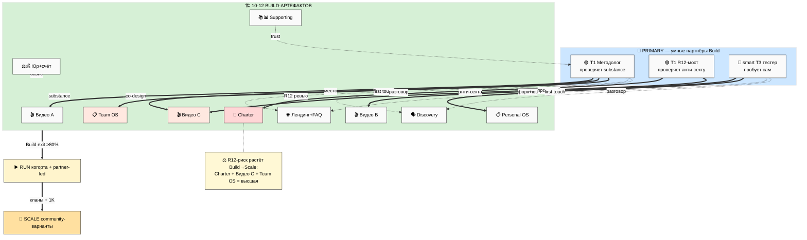
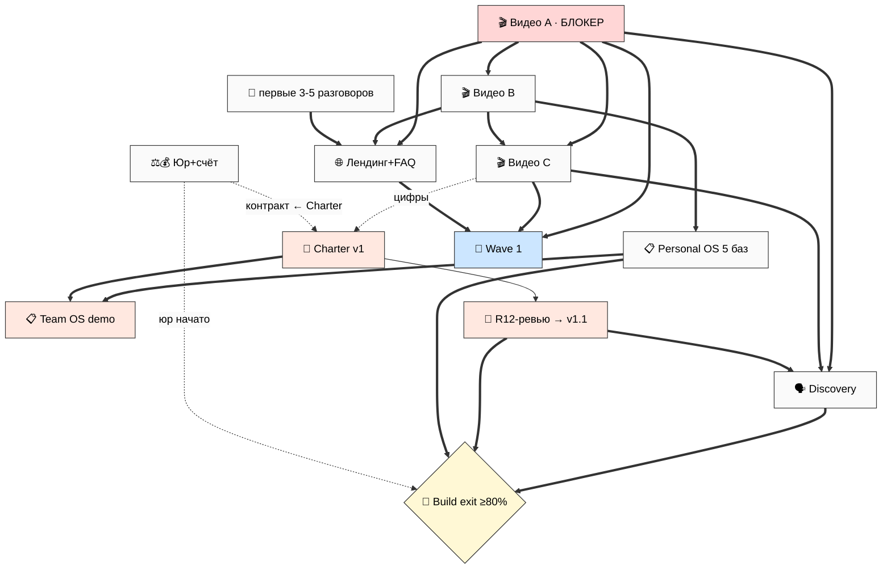
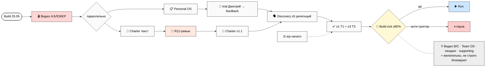
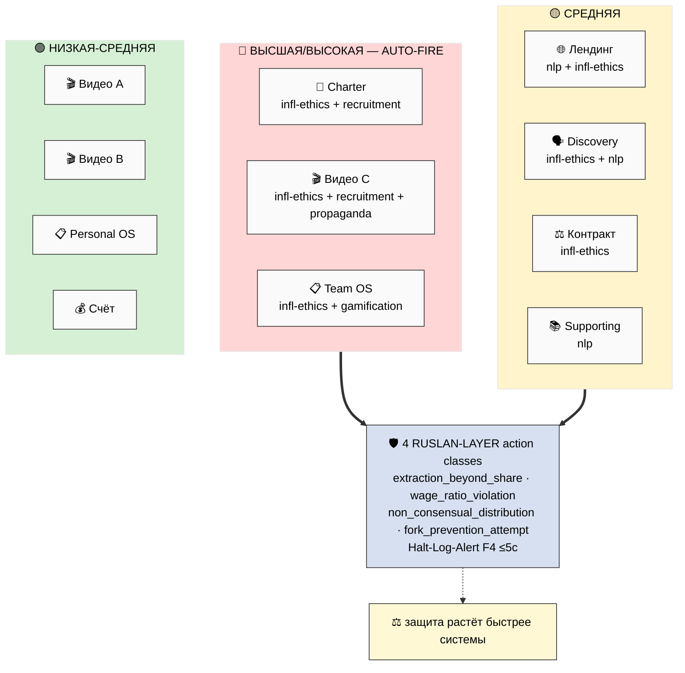
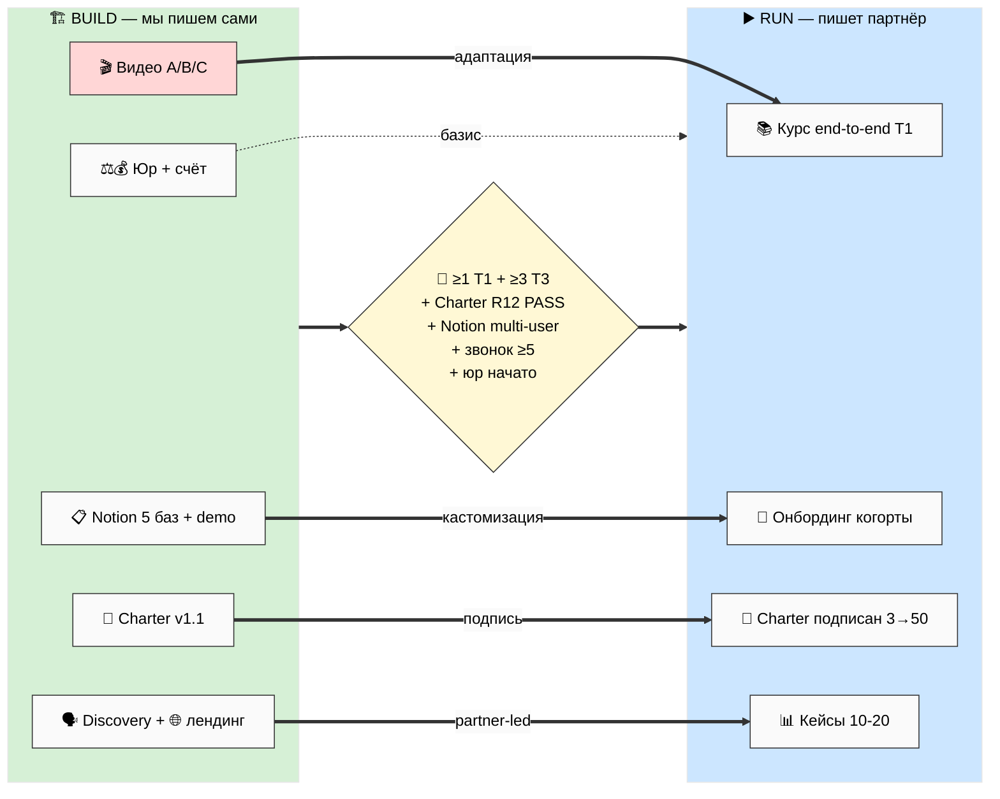
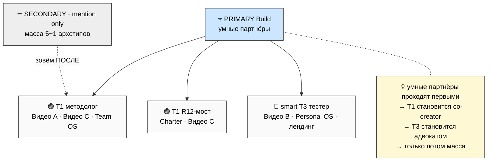
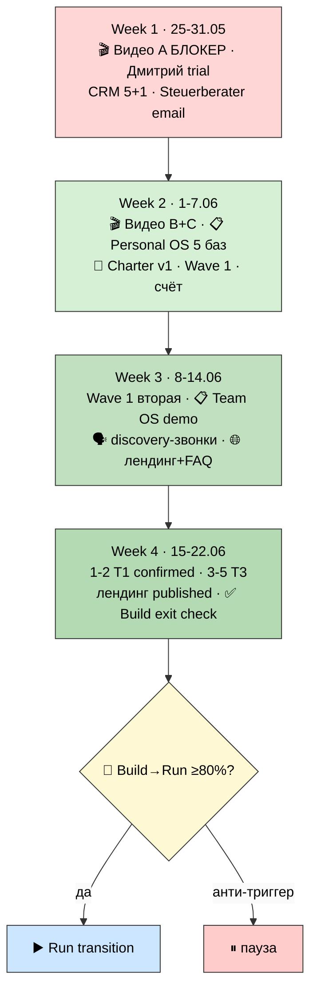

# 🏗️ Build Artefacts Specs — спеки 10-12 артефактов перед сборкой

> **Что это.** Один документ, который берёт 10-12 Build-артефактов (видео A/B/C, Notion-
> шаблоны, Charter, лендинг, discovery-звонок, юр+счёт, supporting) и **разворачивает каждый в
> детальную спеку**: что делает / на кого нацелен / как устроен / откуда тянем substrate / как
> поймём, что готов. Простым языком, с семью схемами.
>
> **Это НЕ сами артефакты.** Тут спеки — чертежи, по которым ты потом садишься и собираешь
> каждый целенаправленно. Никакого текста видео, реальных полей Notion, готового Charter.
>
> **Audience focus сквозной — умные партнёры.** Каждый артефакт заточен под critical-thinking
> аудиторию (T1 методологи + R12-мост + smart T3 тестеры), не под массу. Финальные решения
> (тон / акценты / приоритеты) — за тобой (10-15 штук в §16).

---

## 📍 §0 Если есть 90 секунд (TL;DR)

- **Главное.** До этого у тебя была общая карта (три этапа платформы) и список «надо сделать
  видео, Notion, Charter…». Теперь у **каждого** Build-артефакта есть свой чертёж: цель,
  аудитория, структура, hook, CTA, откуда substrate, R12-чек, критерии готовности. Меньше
  «что-то надо делать» → больше «делаю X по спеке».
- **Сколько артефактов.** 12 артефактов = 10 спек (юр+счёт объединены, supporting+brand
  объединены). Полный per-artefact deep spec — в `reports/build-artefacts-specs-2026-05-25/`.
- **На кого всё заточено.** Умный партнёр: открыл, за 2-5 минут поймал substance, решил —
  тестировать или нет, без ощущения, что его обрабатывают. Масса — secondary, после.
- **Где растёт опасность.** R12-риск не равномерен: **Charter + Видео C + Team OS = высшая
  R12-поверхность** (тут соблазн mass-movement / lock-in / fudge долей максимален). Там
  AUTO-FIRE R12-экспертов.
- **Что блокер.** Видео A — единственный артефакт без зависимостей, и от него зависит почти
  всё. Пока его нет — остальное буксует.
- **Что дальше.** Читаешь → picks 10-15 R1-решений (§16) → садишься собирать сами артефакты по
  спекам (видео A, Notion 5 баз, Charter draft, Steuerberater email — Week 1). Это **не
  запускается авто** — каждый запускаешь сам, когда готов.

---

## 🎯 §1 Главная мысль в одной строке

**У нас накопилось всё, чтобы выйти наружу, но «выйти» — это 10-12 конкретных артефактов, и
каждый буксовал из-за каши «а что говорить в видео? какие базы в Notion? что в Charter?». Этот
документ закрывает кашу: даёт каждому артефакту спеку — чертёж, по которому умный партнёр потом
тоже сможет работать. Все спеки заточены под одного типа человека — умного партнёра с
критическим мышлением, а не под массу.**

И отдельно: **спека — не артефакт.** Мы пишем чертёж дома, не дом. Сам текст видео, реальные
поля Notion, готовый Charter — пишешь ты, садясь за конкретную работу. Спека убирает вопрос «с
чего начать и что туда класть».

Почему это важно именно сейчас, а не «когда дойдут руки». Мы в Build, в средней части: substrate
готов, но наружу не вышел. Накопить ещё одну вики — это **не прогресс внутри Build**, это топтание
на входе; прогресс — выход наружу к первым людям. А выход буксовал не из-за нехватки знаний, а
из-за того, что каждый артефакт упирался в «а что конкретно туда?». Видео не записывалось, потому
что неясно, что говорить методологу. Notion не собирался, потому что неясно, какие 5 баз из 14.
Charter не писался, потому что неясно, как сделать так, чтобы R12-мост не нашёл в нём секту. Спека
снимает ровно этот блок: на каждый артефакт — чертёж, по которому можно сесть и сделать
целенаправленно, и по которому **умный партнёр потом сам сможет его взять и продвигать.**

---

## 📦 §2 Список 10-12 артефактов + кросс-карта

| # | Артефакт | Phase-spec | Primary audience | R12-поверхность |
|---|---|---|---|---|
| 1 | 🎬 Видео A — методология / прошивка / база | 2 | T1 методолог | низкая |
| 2 | 🎬 Видео B — видение обучения / 7 ступеней / парадигма | 3 | smart T3 тестер | низкая-средняя |
| 3 | 🎬 Видео C — экосистема / Charter / R12 / 4 типа | 4 | T1 + R12-мост | **ВЫСОКАЯ** ⚠️ |
| 4 | 📋 Notion Personal OS — 5 баз core | 5 | smart T3 | низкая-средняя |
| 5 | 📋 Notion Team OS — Layer 3 demo | 6 | T1 партнёр | **ВЫСОКАЯ** ⚠️ |
| 6 | 📜 Charter v1 — текст + структура + R12 | 7 | R12-мост + T1 | **ВЫСШАЯ** ⚠️⚠️ |
| 7 | 🌐 Лендинг + FAQ 10 | 8 | T1 + smart T3 | средняя |
| 8 | 🗣️ Discovery call script | 9 | T1 + T3 первый контакт | средняя-высокая |
| 9 | ⚖️ Юр package (Steuerberater/формы/контракт) | 10 | Self (foundational) | низкая (контракт средняя) |
| 10 | 💰 Бизнес-счёт + invoice | 10 | Self (foundational) | низкая |
| 11 | 📚 Supporting (курс/TG/sales-min) | 11 | T1 + smart T3 | средняя (TG/sales) |
| 12 | 📊 Brand-minimum | 11 | T1 + T3 + visual | низкая |

Видно главное: **в Build почти все артефакты сходятся на T1 (методолог) и smart T3 (тестер)** —
это и есть «умные партнёры». T2 (ресурсы) и T4 (консультанты) вторичны до Run/Scale.

### BS-1 — Кросс-карта артефактов (умные партнёры × Build → Run → Scale)

### Портрет умного партнёра (сквозной фильтр)

- **Знает:** системное мышление, базовый AI, fluent в 1-2 методологиях, отличает substance от
  маркетинга.
- **НЕ знает:** наш Jetix-жаргон (FPF / R12 / Pillar C), нашу философию развития метода, наши
  инструменты.
- **Хочет:** проверить метод на substance, понять чем отличаемся от Левенчука/МИМ, попробовать
  сам, увидеть anti-extraction.
- **Отпугнёт:** манипулятивный язык, жаргон без перевода, «жизнь изменится», вода, lock-in.
- *Примеры роли (IP-1, не назначения):* Maxim / Oleg / Левенчук-tier (методологи); Прапион-tier
  (R12-мост); Дмитрий / Сева (тестеры).

**Operational-тест каждой спеки:** «Открыл бы такой человек артефакт, за 2-5 мин поймал
substance, решил — копать дальше или нет — без ощущения обработки?» Нет → переписать.

---

## 🎬 §3 Видео A — методология / прошивка / база

**Назначение.** Короткое видео (talking-head + схемы), дающее умному методологу суть нашей
методологии за один просмотр — не маркетинг, а substance.

**Цель (поведенческая).** Методолог может пересказать 3-5 тезисов своими словами и сравнить с
тем, что знает; принимает осознанное «копать дальше / нет». Оба исхода = успех.

**Primary audience.** T1-методолог (Bloom 1→2). Знает системное мышление и метод-как-объект;
не знает нашу композицию meta-method; хочет понять, есть ли оригинальный вклад; отпугнёт
разжёвывание базы и обещания.

**Ключевые сообщения.** (1) Всё = информация + методы; качество жизни = качество методов × их
выбора. (2) Навык ≠ cross-skill (молоток vs мастер). (3) **Метод выбора методов (уровень 3) —
ключевой рычаг и главное отличие.** (4) Прошивка (системное+ответственность+инженерный+вопрос+
честность) — база до инструментов. (5) AI = внешний усилитель, не замена; адекватный интеллект
не «читерит жизнь». [src: Method V2 §1/§5/§6/§J/§H + Consolidated HL §3/§5 — F8/F2-F3, R-high/R-med]

**Структура (5 сцен).** Hook-контраст → онтология → ⭐ meta-method (схема) → прошивка + AI →
честная рамка + CTA. Schema-record сильнее всего на сцене meta-method.

**Hook.** Контраст, не представление себя: появился AI, делающий рутину в сотни тысяч раз
дешевле → учиться по-старому теряет смысл. [src: Ruslan Notes O-176/O-177 — F2, R-med]

**CTA.** Bloom 1-2: free explore / subscribe / comment / NULL. Запрещены partner/trial/course.

**R12 (главная зона — вопрос 7).** Соблазн подать как «революцию». Защита — явная атрибуция
предшественников (FPF, Левенчук, МИМ/MMK, Polya, Schön): «мы integrator традиций + добавляем
meta-method», не «изобрели».

**Acceptance.** Пересказ 3-5 тезисов; ≥1 отличие от существующих методологий; разница «прошивка
vs накопление»; нет давления; есть атрибуция предшественников.

**Анти-паттерны (почему важны).** Главный убийца видео A — перфекционизм: методолог простит
непрофессиональный свет, но не простит потраченных впустую 16 минут на разжёвывание системного
мышления, которое он и так знает. Второй убийца — маркетинговый налёт: одна фраза «это изменит
твою жизнь» — и methodology-savvy зритель закрывает вкладку, потому что считал тебя за инфоцыгана.
Третий — присвоение чужого: если ты говоришь о «методе выбора методов», не упомянув, что стоишь
на плечах FPF, Левенчука, СМД/MMK и Polya, ты теряешь именно ту аудиторию, ради которой видео и
снято.

**Концретный пример (RUSLAN-LAYER, IP-1).** Методолог уровня Maxim получает ссылку и открывает с
установкой «ещё один AI-курс, посмотрю 2 минуты». Первые 30 секунд — не «привет, я Руслан», а
контраст: AI обнулил ценность накопления функций. Он остаётся. На сцене meta-method видит схему
4 уровней и ловит себя на мысли: «я сам работаю на уровне 2 — выбираю между методами, но не
дизайню свою мета-стратегию явно». Это и есть момент, ради которого видео существует: не
«понравилось», а узнавание зазора в собственном мышлении. В конце слышит честное «мы integrator
традиций, вот на чём стоим» — и пишет, потому что увидел substance, а не претензию на революцию.

**Варианты (R1).** Длительность 5/10/15; стиль talking-head/screen/mix; глубина entry/deep;
язык; включать ли §H meta-control + exocortex здесь или в C. *[Полная спека: `03-video-A-spec.md`]*

---

## 🎬 §4 Видео B — видение обучения / 7 ступеней / парадигма

**Назначение.** Видео, показывающее умному тестеру новую парадигму обучения («прошивка вместо
накопления» + AI-стратификация + «от вопроса, не от функции») + лестницу из 7 ступеней.

**Цель.** smart T3 понимает «его это или нет», и если да — знает где попробовать. Формулирует 3
отличия от стандартного обучения + чувствует «меня не затягивают, могу уйти».

**Primary audience.** smart T3 (Bloom 1→2-3). Гуманитарий/curious; устал от «курсов, что не
работают»; хочет понять новое и не попасть в секту; отпугнёт жаргон и over-promising.

**Ключевые сообщения.** Парадигма сменилась (O-176/O-177); учимся от вопроса (O-185); адекватный
интеллект выбирает развивающие методы (O-180/181); 7 ступеней с выходом на любой; кого берём
честно; бесплатно 1-4; fork-and-leave. [src: Ruslan Notes O-176..O-185 + Consolidated HL §2/§4/§7
+ Outreach Content Bloom — F2-F3, R-med]

**Структура (5 сцен).** Hook-узнавание (30 курсов vs 5 методов) → смена парадигмы → 7 ступеней
(схема) → кого берём/не берём + деньги → где попробовать + CTA.

**R12 (вопрос 7).** «Когорта-основатель» как признание — ок; как «клуб избранных» — семя секты.
Защита: признание ≠ превосходство; «уйти можно» звучит первым; fork-and-leave вслух.

**Acceptance.** 3 отличия от стандартного обучения; «прошивка vs накопление»; знает где
попробовать; чувствует «не затягивают»; «это не моё» без раздражения = тоже успех.

**Концретный пример (RUSLAN-LAYER, IP-1).** Тестер уровня Дмитрия (гуманитарий) смотрит и в первые
секунды узнаёт себя в картинке «прошёл кучу курсов, а в голове каша». Дальше видит лестницу 7
ступеней — и ключевое для него не «как круто», а маленькая подпись «уйти можно на любой без
штрафа». Это снимает defensive-режим человека, который боится, что его сейчас затянут. К концу он
может сказать тремя фразами, чем это отличается от обычного обучения, и — что важнее — идёт
форкать Personal OS, потому что почувствовал приглашение, а не воронку. Если бы видео начиналось с
«сегодня расскажу про образование будущего», Дмитрий бы не досмотрел.

**Варианты (R1).** Длительность; акцент (критика старого vs новое); AI-angle сильно/слабо; язык;
глубина 7 ступеней. *[Полная спека: `04-video-B-spec.md`]*

---

## 🎬 §5 Видео C — экосистема / Charter / R12 / 4 типа партнёров

**Назначение.** Видео про устройство партнёрской экосистемы: 4 функции партнёрства, обмен,
кооперативные защиты (Charter, Mondragón 5:1, fork-and-leave) — так, чтобы умный партнёр оценил
«есть моё место» и ясно увидел, почему это НЕ секта и НЕ пирамида.

**⚠️ Самое опасное видео.** Соблазн mass-movement language максимален. R12 AUTO-FIRE трёх
экспертов (influence-ethics + recruitment-dynamics + propaganda). Закон: защита показывается так
же явно, как возможность.

**Цель.** Партнёр формулирует (1) 4 типа и в каком он, (2) что просят/дают, (3) как уйти, (4)
почему не секта/пирамида. Вывод «не по пути» = тоже успех.

**Primary audience.** T1 методолог + R12-мост + опытные T3 (Bloom 4-6). Знает, как выглядят
пирамиды/секты; хочет реальный обмен, не лозунги; отпугнёт «семья/племя», размытые доли,
умолчание про выход.

**Ключевые сообщения.** 4 функции (T1-T4); обмен честный и разный по этапу; 75-90% человеку +
triple-role; Mondragón 5:1; fork-and-leave 30-day (constitutional LOCK); почему не секта/пирамида;
*опц.* смарт-контракты как направление Scale. [src: Execution Plan §5 + PARTNER-OFFERING + Economic
V10 §11 + Consolidated HL §9 — F8/F2-F3, R-high/R-med]

**Hook.** Фильтрующий, не вербующий: «это не для всех, и сразу скажу, как можно уйти». Анти-hook:
«присоединяйся к движению».

**R12 (вопрос 7 — высшая зона, STRICT).** Нет mass-movement, нет «семьи/племени», нет спасителя,
нет фейк-growth. 4 action classes ловятся: extraction_beyond_share / wage_ratio_violation /
non_consensual_distribution / fork_prevention_attempt.

**Acceptance.** 4 типа + своё место; что просят/дают; как уйти; ≥3 анти-паттерна, которые НЕ
делаем; R12-мост ревьюит до публикации; fork-and-leave до «присоединяйся»; цифры совпадают с
Charter.

**Концретный пример (RUSLAN-LAYER, IP-1).** R12-мост уровня Прапион смотрит видео C с
профессиональной подозрительностью — он специально умеет ловить вербовку. И первое, что слышит, —
не «присоединяйся», а «это не для всех, и сразу скажу, как можно уйти». Дальше видит worked example
с потолком 5:1 и fork-and-leave 30-day, показанный *до* любого приглашения. Его внутренний
детектор секты молчит, потому что нет ни одного триггера: ни «семьи», ни спасителя, ни growth-
metrics как аргумента. Вердикт — «это не секта и не пирамида, можно браться ревьюить Charter». А
вот если бы в сцене мелькнуло «нас уже 1000, не упусти» — он бы закрыл и больше не вернулся, и
заодно предупредил бы свой круг. Именно поэтому здесь AUTO-FIRE трёх R12-экспертов.

**Варианты (R1).** Economic V10 deep/abstract; смарт-контракты упомянуть/skip; длительность;
Y1-trajectory показывать/нет; язык. *[Полная спека: `05-video-C-spec.md`]*

---

## 📋 §6 Notion Personal OS — 5 баз core

**Назначение.** Рабочий (не макет) личный Notion-шаблон из 5 баз + хаб, который smart T3
форкает за ≤30 мин, настраивает под себя и реально использует неделю.

**Цель.** Тестер форкнул → прожил неделю → вернул structured feedback (5-7 точек). Первый proof
point «философия работает на personal level».

**Primary audience.** smart T3, Notion-comfortable, не developer (Bloom 3→5). Хочет инструмент,
что реально помогает жить; отпугнёт 50 баз, формулы для технаря, Jetix-жаргон в полях.

**Структура (Build-scope = 5 баз core, НЕ полный 8/11/14).** Daily Log + Projects + Hypotheses +
CRM People + Strategic + Command Center хаб. Knowledge/Reviews/Life Pulse/Ideas — Week 2+ или для
глубоких ниш. [src: Personal OS Plan §10 Week 1 — F3, R-med]

**Ключевые сообщения.** Философия ужимается в лёгкий инструмент; файлы = правда, Notion =
витрина; голос → только черновик; гипотезы в центре; форкается за час под нишу.

**R12 (главная зона — вопрос 6).** Lock-in через данные. Защита: форк = отдельный workspace,
Jetix НЕ получает данные форка, экспорт в файлы всегда, нет FOMO/«закрытого клуба».

**Acceptance.** Форк ≤30 мин; использует ≥1 неделю; feedback 5-7 точек; нет Jetix-жаргона в
полях; форк = изолированный workspace; голос пишет только черновики.

**Концретный пример (RUSLAN-LAYER, IP-1).** Тестер уровня Дмитрия открывает demo, видит Command
Center — не пугающую стену из 14 баз, а «вот сегодня, вот проекты, вот что хочу узнать». Дублирует
workspace в один клик, за 25 минут переименовывает под себя, заводит свой POINT A одним абзацем.
Неделю надиктовывает в Daily Log голосом — заметки ложатся черновиками, ничего не теряется и не
перезаписывается. Возвращает feedback из 6 точек: «база гипотез сначала непонятна — зачем она,
если я не учёный; Life Pulse — лучшее, веду каждый день; формула "застрял" в Projects сработала,
напомнила про заброшенный проект». Это и есть цель: не «красиво», а живые точки, где шаблон
ломается на не-инженере — ровно то, что нельзя узнать из дизайна на бумаге.

**Варианты (R1).** Какие 5 баз (Strategic vs Life Pulse для гуманитария); уровень формул
lite/medium; AI-helpers вкл/нет; канал раздачи форка; автоматизация Claude Code A/B/C.
*[Полная спека: `06-notion-personal-os-spec.md`]*

---

## 📋 §7 Notion Team OS — Layer 3 demo

**Назначение.** Demo-overlay поверх Personal OS, показывающий T1-партнёру, как из личной системы
вырастает кооперативная команда — 10 ролей, каталог проектов, биржа, Charter slot, R12-чек-лист
в полях — на минимуме (1 mock-проект).

**⚠️ Highest R12-risk среди Notion.** R12 AUTO-FIRE influence-ethics + gamification. Все 4 шаблона
монетизации проходят 8-Q чек; Mondragón 5:1 — в полях; fork-and-leave — буквальная кнопка.

**Цель.** Партнёр за 30-60 мин понимает мульти-роль архитектуру, симулирует участие в одной из 10
ролей, даёт feedback на R12-механики (не на UI).

**Структура (demo-scope, НЕ полный multi-tenant).** 10 ролей (карточки) + 1 mock Project Catalog
+ 2-3 Skills/Needs строки + Charter synced block + поле «R12 audit status» + Mondragón 5:1
индикатор + буквальный раздел «как уйти со своей долей». Worked example €10K. [src: Team OS Plan
§4/§6 — F2-F3, R-med]

**R12 (вопрос 7 + gamification).** Нет «успешного клана» fait accompli; gamification-механики НЕ
для удержания (нет очков/streak/leaderboard ради статуса); Schelling-подсветка = помощь, не
насильная группировка. 4 action classes = поля-детекторы HALT.

**Acceptance.** Понимает архитектуру за 30-60 мин; симулирует роль; feedback на R12; R12-мост не
находит обхода 4 action classes; 5:1 в полях; fork-кнопка; нет lock-in полей.

**Концретный пример (RUSLAN-LAYER, IP-1).** Методолог уровня Oleg заходит в demo, чтобы понять,
есть ли смысл со-вести когорту здесь. Симулирует роль Инвестора времени в mock-проекте: видит
потолок ≤50 ч/нед (его сразу успокаивает — не выгорит), видит свою строку в прозрачном ledger и
worked example, как €10K делятся с проверкой 5:1. Жмёт буквальную кнопку «как уйти со своей долей»
— и она ведёт к реальному разделу, не к заглушке. Feedback на R12-механики: «fork-кнопка
убедительна; но покажи, что происходит, если сам Steward нарушит 5:1 — кто сторожит сторожа?». Это
именно тот уровень критики, ради которого demo нацелено на T1 + R12-моста, а не на массу: они
проверяют механику на излом, а не дизайн на красоту.

**Варианты (R1).** Demo 1 vs 3 проекта; монетизация стандарт vs когорта €1500; Ethereum overlay
показать/skip; когда строить (Build Week 2-3 vs Run Week 5); число ролей 5-7 vs 10.
*[Полная спека: `07-notion-team-os-spec.md`]*

---

## 📜 §8 Charter v1 — текст + структура + R12 чек

**Назначение.** Текст-договор кооператива из 6 секций, который R12-мост читает за ≤2 ч и даёт
feedback на анти-секта механики, а T1 — понимает «здесь я не в кабале». **НЕ готовый текст
подписи** — структура.

**⚠️ Самая critical R12-поверхность из всех 12.** R12 AUTO-FIRE influence-ethics + recruitment-
dynamics. Charter — место, где «не доим / не запираем» либо имеет зубы, либо остаётся словами.

**Цель.** R12-мост даёт 5-10 точек feedback, ≥90% R12-чеков PASS → v1.1 для T1. T1 понимает «не
заперт», готов подписать когда придёт время (Run, не сейчас).

**Структура (6 секций).** Преамбула / Ценности (fork-and-leave №1) / Роли (10 + multi-hat +
ротация) / **Деньги (центральная — 75-90/10-25 + Mondragón 5:1 с числовым примером €10K + 4
revenue-шаблона)** / Управление (Stage Gates + Steward) / **Выход (30-day notice ПЕРВЫМ пунктом +
non-punitive + asset retrieval)**. [src: Team OS Plan §6 + Economic V10 §11 — F8/F2-F3, R-high/R-med]

**Hook.** Сразу выход и потолок, не «настоящим договором стороны обязуются». Противоположность
кабального договора, где выход мелким шрифтом.

**R12 (вопрос 7 — высшая зона, STRICT).** 4 RUSLAN-LAYER action classes явно перечислены в §4/§6
+ механизм HALT. recruitment-dynamics ловит cult-паттерны (нет клятв, нет «докажи что свой», нет
спасителя).

**Acceptance.** R12-мост читает ≤2ч → 5-10 точек; ≥90% PASS → v1.1; T1 видит «не кабала»;
Mondragón с числовым примером; выход первым пунктом §6; 4 action classes явно; plain-language
версия рядом с юр-языком.

**Концретный пример (RUSLAN-LAYER, IP-1).** R12-мост уровня Прапион садится читать Charter v1 с
секундомером — у него ≤2 часа. Открывает и сразу видит секцию «Выход» первым пунктом: 30-day
notice, забор доли, никаких штрафов. Это редкость — обычно выход прячут в конце мелким шрифтом, и
он отмечает плюс. В секции «Деньги» находит числовой пример (€10K → проверка ratio 2.25 ≤ 5 →
PASS) — зубы есть. Но в «Ценностях» спотыкается: «звучит красиво, но это декларация без механизма —
дай ссылку на конкретный детектор». Возвращает 8 точек, из них 7 — PASS, одна — на доработку. 9/10
R12-чеков прошли → правка → v1.1 готов показывать методологу. Без этого ревью Charter ушёл бы к T1
с дырой, которую методолог заметил бы сам — и доверие бы просело.

**Варианты (R1).** Формат подписи (текст-согласие/юр-документ/смарт-контракт); длина 3 vs 10 page;
Ethereum overlay §6-bis/footnote; ratio 5:1 STRICT vs 3:1/7:1; Charter обязателен/опционален.
*[Полная спека: `08-charter-spec.md`]*

---

## 🌐 §9 Лендинг + FAQ 10 вопросов

**Назначение.** Веб-страница, где умный методолог/тестер за 2-5 мин понимает substance — что
делаем и чего НЕ делаем — и решает: попробовать / написать / уйти без раздражения.

**R12 AUTO-FIRE nlp + influence-ethics.** Каждая фраза проверена на манипуляцию: «купи сейчас» =
FAIL; «попробуй и решай сам» = PASS.

**Цель.** Умный партнёр за 2-5 мин: суть + 2-3 отличия от «AI курсов» + не чувствует давления +
осознанный выбор (попробовать / написать / уйти спокойно).

**Структура (7 секций).** Hero (1-liner + что/НЕ что) → For whom (4 типа + 5+1 абстрактно) → What
we offer (L1-L7 + 75/25 + 5:1) → How to start (3-step low-friction) → FAQ (10 типов) → R12 honesty
(что НЕ обещаем) → Signup minimal (email + 1 вопрос, не принудительно).

**FAQ 10 типов (ответы — после первых разговоров, Build exit checkpoint).** Сравнение с
Левенчуком/МИМ · цена · обязательства · выход · AI-replacement fear · time commitment · для кого ·
не секта/пирамида · что получу · как начать без риска.

**R12 (вопрос 7 — высшая зона, STRICT).** Нет scarcity/FOMO/fake testimonials/forced signup. nlp
проверяет каждую фразу с abuse-flag (embedded commands, presupposition).

**Acceptance.** 5 мин → пересказ сути + 2-3 отличия; не чувствует давления; «для кого/не для
кого» работает; уход без раздражения; контент без signup-стены; nlp-ревью PASS; FAQ-каркас готов.

**Концретный пример (RUSLAN-LAYER, IP-1).** Тестер уровня Севы (крипто-домен) заходит по ссылке из
письма, готовый закрыть через 5 секунд, если увидит инфоцыганщину. Hero сразу говорит «не очередной
AI-курс» — он остаётся. Скроллит: нет «осталось 3 места», нет фейк-отзывов, контент доступен без
обязательной регистрации. За 3 минуты понимает суть и видит секцию «что мы НЕ обещаем» — это его
цепляет больше, чем любое обещание. Вместо того чтобы уйти, пишет конкретный вопрос: «а как ваш
метод ложится на крипто-аналитику?». Это идеальный исход лендинга — не «купил», а «написал
осознанно». Если бы стояла стена «оставь email, чтобы посмотреть видео», Сева бы просто ушёл.

**Варианты (R1).** Одностраничный/multi-page; video embed; язык; хостинг (Notion/Webflow/HTML);
какие 2-3 CTA из 13. *[Полная спека: `09-landing-faq-spec.md`]*

---

## 🗣️ §10 Discovery call script

**Назначение.** Скрипт ≤45-мин звонка: понять нужды партнёра + донести substance + честно решить
go/no-go без давления. **НЕ готовые реплики** — фазы и типы вопросов.

**Главная рамка:** диагностика дыр, не продажа. R12 AUTO-FIRE influence-ethics + nlp.

**Цель.** Взаимный честный fit-check: партнёр формулирует «что Jetix делает» + «что от меня
хотят» + «как уйти». No-go без обиды = успех.

**Структура (5 фаз).** Opening ≤3 мин (кто я + цель + time-check + **разрешение на «нет»**) → их
контекст 10-15 мин (СЛУШАЕМ) → наш substance 10-15 мин → mutual fit check 5-10 мин → next steps
≤5 мин (explicit опции + no-pressure exit). Правило: их-контекст ≥ наш-substance.

**R12 (вопрос 7 — STRICT).** Нет leading questions, нет pressure, нет «закрываем сделку». nlp
проверяет каждый question-template с abuse-flag. Обязательно «можно сейчас сказать нет — спасибо».

**Acceptance.** Ruslan репетирует ≥5 раз → mid-track comfort; партнёр формулирует 3 вещи; баланс
времени; есть «нет — спасибо»; no-go без обиды; nlp — ни одного leading question.

**Концретный пример (RUSLAN-LAYER, IP-1).** Ruslan репетирует скрипт 5 раз — сначала один, потом с
другом в роли скептичного методолога. К пятому разу пропадает соблазн «продавать»: он научается
первые 15 минут просто слушать. Реальный звонок с методологом уровня Maxim: тот в конце говорит
«интересно, но не сейчас — у меня свой проект». И вместо того чтобы дожимать, Ruslan отвечает «понял,
спасибо за время, дверь открыта». Maxim остаётся в тёплом контакте и через месяц сам возвращается с
вопросом. Это и есть успех discovery — не «закрыл сделку», а сохранил отношения честным no-go.
Leading question «ты ведь хочешь развиваться?» убил бы именно это.

**Варианты (R1).** Длина 30/45/60; audio/video; preparation expected; один скрипт vs 2 (T1/T3);
запись для само-аудита. *[Полная спека: `10-discovery-call-spec.md`]*

---

## ⚖️💰 §11 Юр + Бизнес-счёт + invoice (foundational)

**Назначение.** Foundational-комплект: email Steuerberater'у + матрица Einzel/GmbH/UG + контракт-
template + invoice SEPA + bookkeeping-минимум. Выводит в состояние «есть легальный базис».

**F3 STRICT.** НЕ добываем юр-research — специфицируем **вопросы и каркас матрицы**, значения
заполняются после Steuerberater (R-low до консультации).

**Цель.** К Build exit: email готов отправить + матрица позволяет prep-решение до консультации +
контракт adapt за ≤30 мин + invoice генерирует валидный EU SEPA.

**4 под-артефакта.** (4.1) Steuerberater email — что спрашиваем (форма/кооператив/налоги 75/25/
costs). (4.2) Матрица 3 формы × 6 dimensions (startup/ongoing cost/liability/tax/cooperative-
compat/optimal-stage) — каркас, значения после консультации. (4.3) Контракт-template — обязанности
+ доли + **fork-and-leave + 30-day + asset retrieval (R12 MUST)** + IP + cooperative-compat. (4.4)
Invoice SEPA + bookkeeping (FastBill/lexoffice/sevDesk).

**R12 (главная зона — вопрос 6).** Контракт = место, где lock-in прячут юридически. Защита:
fork-and-leave + 30-day + asset retrieval — обязательные пункты, не опции.

**Acceptance.** Email готов; матрица-каркас готов (значения после Steuerberater); контракт adapt
≤30 мин; invoice валидный EU SEPA; контракт содержит R12 MUST; значения НЕ выдуманы.

**Концретный пример (RUSLAN-LAYER, IP-1).** Ruslan приходит на консультацию к Steuerberater не с
пустого листа, а с готовой матрицей-каркасом (3 формы × 6 dimensions с пустыми ячейками) и списком
вопросов про cohort-revenue 75/25. За одну встречу ячейки заполняются реальными цифрами, и решение
по форме принимается на фактах, а не на «GmbH вроде солиднее». Позже первый партнёр (методолог
уровня Maxim) просит контракт — Ruslan берёт template и за 20 минут адаптирует под него, при этом
fork-and-leave + 30-day + asset retrieval уже внутри, не надо изобретать. Партнёр читает и видит «не
кабала» — тот же сигнал, что и в Charter. Без матрицы консультация ушла бы в общие разговоры; без
template каждый контракт писался бы с нуля и рисковал бы lock-in-формулировками.

**Варианты (R1).** Форма default (Einzel/UG/GmbH); cooperative-hosting (Genossenschaft/
international); bookkeeping инструмент; когда отправлять email; контракт универсальный/per-тип.
*[Полная спека: `11-legal-finance-spec.md`]*

---

## 📚📊 §12 Supporting materials + brand-minimum

**Назначение.** 4 вспомогательных под-артефакта (скелет курса + Telegram-позиционирование +
sales-минимум + brand-минимум) — minimum credible baseline «эти ребята настоящие, есть
substance». НЕ финальный контент.

**R12 AUTO-FIRE nlp** на Telegram + sales-min: нет vanity metrics, нет fluff, нет cadence-pressure.

**Цель.** smart T3 после consuming любого из 4 получает consistent picture, не противоречащий
видео A/B/C / лендингу / Charter. Доверие, не конверсия.

**4 под-артефакта.** (11.1) Course skeleton — ToC + Bloom 1-7 + 7 принципов, **только skeleton**
(контент в Run с партнёром). (11.2) Telegram — description + 5-7 постов outline, НЕ calendar.
(11.3) Sales-min — one-pager (почти готов) + pitch deck ≤10 slides. (11.4) Brand-min — logo/
typography/2-3 colors/template, НЕ полный redesign.

**R12 (вопрос 7).** nlp проверяет Telegram + sales-min: нет fake-urgency, нет vanity metrics, нет
fluff-прилагательных.

**Acceptance.** Consistent picture от любого из 4; не противоречит видео/лендингу/Charter; skeleton
= структура (не контент); Telegram 5-7 постов; pitch ≤10 slides без vanity; brand = минимум.

**Концретный пример (RUSLAN-LAYER, IP-1).** Методолог уровня Oleg, посмотрев видео A, хочет копнуть
глубже и натыкается на skeleton курса. Видит не громкое «лучший курс», а честную структуру: 7
ступеней Bloom × 7 принципов, с пометкой «контент со-создаётся с партнёром в Run». Это сигнал «тут
думали, не на коленке, и не врут, что всё готово». Заходит в Telegram — 5-7 постов про суть, без
«подпишись, не пропусти». Открывает one-pager — одна страница без vanity metrics. Всё это
складывается в consistent picture, не противоречащую видео и Charter. Доверие растёт не от
обещаний, а от того, что мелочи согласованы. Полный logo-redesign или fake «1000 учеников» здесь бы
только насторожили — поэтому brand держим на минимуме до Build exit.

**Варианты (R1).** Skeleton глубина (sections/+lessons); Telegram язык; pitch deck DIY Canva/
designer; brand scope; Telegram в Build/Run. *[Полная спека: `12-supporting-materials-spec.md`]*

---

## 🔗 §13 Зависимости + порядок (BS-2, BS-3)

**Принцип:** всё держится на видео A (единственный без зависимостей). Строго последовательно:
Charter текст → R12-ревью → v1.1 → подписи; Steuerberater email → консультация → форма → счёт;
Personal OS → trial → feedback → Сева. Параллельно: видео A ‖ Steuerberater email ‖ CRM-разметка
‖ Personal OS (Week 1).

### BS-2 — Граф зависимостей

### BS-3 — Критический путь к Build exit

*Полные зависимости + risk map per артефакт + timeline overlay §8 — `13-dependencies-risks.md`.*

---

## ⚖️ §14 R12 sweep — какие артефакты highest-risk surface (BS-4)

R12-риск не равномерен. Три артефакта несут высшую поверхность (там AUTO-FIRE R12-экспертов):

| Артефакт | R12-уровень | AUTO-FIRE эксперты | Главная зона |
|---|---|---|---|
| 📜 Charter | **ВЫСШАЯ** | influence-ethics + recruitment-dynamics | gotcha-clauses, cult-паттерны, выход прячут |
| 🎬 Видео C | **ВЫСОКАЯ** | influence-ethics + recruitment-dynamics + propaganda | mass-movement, «семья», fudge долей |
| 📋 Team OS | **ВЫСОКАЯ** | influence-ethics + gamification | lock-in поля, gamification на удержание |
| 🌐 Лендинг | средняя | nlp + influence-ethics | scarcity/FOMO/fake |
| 🗣️ Discovery | средняя-высокая | influence-ethics + nlp | leading questions, pressure |
| ⚖️ Контракт | средняя | influence-ethics | lock-in clauses |
| 📚 Supporting | средняя | nlp | vanity/fluff/cadence |
| 🎬 Видео A/B · 📋 Personal OS · 💰 счёт | низкая-средняя | — | стандартный 8-Q чек |

### BS-4 — R12-риск по артефактам (overlay)

**Сквозной закон (Platform Lifecycle §7):** защита растёт быстрее системы. На Charter / Видео C /
Team OS — R12-эксперты включаются автоматически; пропущенная пара = Halt-Log-Alert F4 ≤5 сек.

**Почему именно эти три — высшая поверхность.** Charter — потому что это договор: место, где
обещание «не доим / не запираем» превращается в обязывающий текст, и где lock-in исторически
прячут юридически. Видео C — потому что это единственный артефакт, где мы прямо зовём в
партнёрство, а зов в партнёрство в одном шаге от вербовки: соблазн сказать «присоединяйся к
движению» здесь максимален. Team OS — потому что там живут деньги, роли и власть, плюс механики
вовлечения (биржа, Daily Brief), которые легко скатываются в удержание. Остальные артефакты
несут риск ниже: видео A/B и Personal OS ничего не просят и ничего не запирают, поэтому им хватает
стандартного 8-вопросного чека без авто-подключения R12-экспертов.

**Что общего у всех трёх в защите.** Везде fork-and-leave показан *до* любого приглашения; везде
Mondragón 5:1 — с числом, не абстрактно; везде работают одни и те же 4 детектора (action classes),
которые при срабатывании дают HALT. Это не «доверие на словах» — это одинаковая механика поверх
трёх разных артефактов.

---

## ✅ §15 Build exit checkpoint per артефакт (BS-5, BS-6)

Что каждый артефакт «сдаёт» в Run и что он должен покрыть, чтобы умный партнёр потом продвигал
его сам:

| Артефакт | Build exit готовность | Handoff в Run |
|---|---|---|
| Видео A | методолог пересказывает 3-5 тезисов | партнёры адаптируют |
| Видео B | T3 формулирует 3 отличия | cohort onboarding |
| Видео C | партнёр формулирует 4 пункта; R12-мост PASS | community-варианты |
| Personal OS | Дмитрий форкнул + неделя + feedback | юзер кастомизирует |
| Team OS | T1 симулировал роль + R12 feedback | clan-niche overlays |
| Charter | R12-мост ≥90% PASS → v1.1 | подписан 3→50+ |
| Лендинг + FAQ | published; tester пересказал суть | растёт многоязычно |
| Discovery | отрепетирован ≥5; ≥1 T1 confirmed | partner-led звонки |
| Юр + счёт | email отправлен; форма выбрана; счёт открыт | + treasurer + аудит |
| Supporting | consistent picture | T1 создаёт end-to-end |

### BS-5 — Build → Run handoff

### BS-6 — Приоритет аудитории в Build

---

## 🎯 §16 R1-решения для тебя (variants + facts, не «рекомендую»)

Я даю варианты и факты — выбираешь ты. 13 решений (плюс по 5 per-артефакт вариантов в spec-файлах
§15). Под каждым — факт, который помогает решить, но **не «рекомендую X»**:

1. **R1-A Critical vs nice-to-have для Build exit** — минимальный набор (Видео A + Personal OS +
   Charter + Discovery) vs расширенный (+ Видео B + лендинг)? *Факт:* триггеры перехода §8 требуют
   только ≥1 T1 + ≥3 T3 + Charter проверен + Notion multi-user + звонок ≥5 + юр начато; всё
   остальное формально «желательно». [Phase 1]
2. **R1-DEP2 Когда запускать Notion implementation** — Week 1 или Week 2? *Факт:* звонок Дмитрия
   уже Week 1, а ему на trial нужен рабочий шаблон, значит de-facto шаблон тянет на Week 1.
3. **R1-A2 Порядок видео** — A→B→C строго или A‖B параллельно? *Факт:* B и C наследуют тон/схемы
   A, поэтому A первым в любом случае; вопрос только про B относительно A.
4. **R1-T4 Team OS demo timing** — Build Week 2-3 (под T1) или Run Week 5? *Факт:* по плану Team OS
   = Week 5 (после Personal OS), но если T1-партнёр готов к co-design раньше, нужна урезанная demo-
   версия в Build.
5. **R1-C2 Видео C: смарт-контракты** — упомянуть как «направление» или skip? *Факт:* это Scale-
   механика, аудитория Build увидит её ~через 2 года; вариант — одна фраза, чтобы не перегрузить.
6. **R1-CH1 Формат подписи Charter** — текст-согласие / юр-документ / смарт-контракт? *Факт:* текст-
   согласие достаточно для Run; legal — для Scale; смарт-контракт = Phase 2+ overlay.
7. **R1-CH4 Mondragón ratio** — 5:1 STRICT или 3:1 / 7:1? *Факт:* 5:1 = канон Mondragón; жёстче
   (3:1) сильнее анти-extraction, но труднее привлекать капитальных инвесторов.
8. **R1-LF1 Юр-форма default** — Einzel / UG / GmbH? *Факт:* решение строго после Steuerberater;
   влияет на Build exit и на приём денег; матрица-каркас готова для prep-решения.
9. **R1-N1 Какие 5 баз Personal OS** — default (Daily Log+Projects+Hypotheses+CRM+Strategic) или
   Life Pulse вместо Strategic для гуманитария? *Факт:* Дмитрий-ниша центрирует Life Pulse + Daily
   Log, а не Strategic.
10. **R1-L1 Лендинг** — одностраничный / multi-page; русский / + английский? *Факт:* одностраничный
    быстрее читается; multi-page лучше под разные архетипы; английский открывает cross-market T1.
11. **R1-D1 Discovery** — длина 30/45/60; один скрипт vs 2 (T1/T3)? *Факт:* у методолога и тестера
    разные нужды (substance vs «как попробовать»), но 2 скрипта = вдвое больше репетиций.
12. **R1-DEP7 Темп Build** — push 4 недели или растянуть? *Факт:* выгорание = анти-триггер §8;
    push имеет смысл только пока нет признаков выгорания.
13. **R1-13th-artefact** — оставить «R12 honesty» в составе лендинга+Charter или вынести в
    standalone one-pager? *Факт:* сквозной аудит 10 спек показал — новый обязательный артефакт НЕ
    всплыл; R12-honesty уже покрыт секцией 6 лендинга + Charter. [Phase 12 §9]

*Полные per-артефакт варианты (5 на каждый) — в spec-файлах §15.*

---

## 🔗 §17 Cross-refs к substrate (footnotes, не повторяем content)

| Документ | Зачем |
|---|---|
| `PLATFORM-LIFECYCLE-STAGES-PLAN-2026-05-25.md` | **Parent** — §6 documents matrix + §8 Build 4 недели |
| `EXECUTION-PLAN-FIXATION-2026-05-24.md` | 4 типа партнёров + 8 R12-вопросов + видео каркас |
| `CONSOLIDATED-HUMAN-LANGUAGE-PLAN-2026-05-24.md` | 7 ступеней Bloom + 7 принципов + прошивка + деньги |
| `PERSONAL-OS-NOTION-TEMPLATE-PLAN-2026-05-24.md` | 5 баз core + fork Layer 1/2 + voice + 5 ниш |
| `TEAM-OS-NOTION-TEMPLATE-PLAN-2026-05-24.md` | 10 ролей + multi-tenant + Charter 6 секций + 8-Q R12 |
| `OUTREACH-CONTENT-OUTCOMES-CTAS-2026-05-24.md` | 13 CTA + Bloom + 6 архетипов + 5 анти-CTA |
| `RUSLAN-NOTES-EDUCATION-PARADIGM-2026-05-24.md` | O-176..O-185 verbatim (парадигма) |
| `PARTNER-OFFERING-HUMAN-LANG-2026-05-22.md` | цены L1-L7 + 75/25 + triple-role + Mondragón 5:1 |
| Method V2 / Economic V10 / Strategic Plan / AI Market | 🔒 LOCKED — только ссылки |
| `reports/build-artefacts-specs-2026-05-25/` | 13 фазовых отчётов (full per-artefact specs) |

---

## 🎯 §18 К чему это ведёт (BS-7)

После прочтения у тебя — спека на каждый Build-артефакт. Дальше:

1. Читаешь 00-SUMMARY (5 мин) → этот Main (20-30 мин) → 1-2 deep spec'а, что хочешь глубже.
2. Picks 10-15 R1-решений (§16).
3. → Следующая неделя (Platform Lifecycle §8 Week 1): Видео A запись (по §3), Notion Personal OS
   (по §6, для Дмитрий trial), Steuerberater email (по §11), CRM-разметка 5+1.
4. **Это НЕ запускается авто** — pool result. Каждый launch'аешь сам, когда готов.

### BS-7 — Порядок 4 недель (sequencing)

---

*Document closure 2026-05-25. Build Artefacts Specs — F3 derivative per Platform Lifecycle Plan
§6+§8. 12 артефактов = 10 deep spec'ов (15-точечный template, full в reports/). Audience focus =
умные партнёры sweeping. 7 mermaid BS-1..BS-7. R1 surface only — Ruslan picks 10-15 решений §16 +
5 per-артефакт. R12 paired-frame STRICT (AUTO-FIRE на Charter/Видео C/Team OS/лендинг/discovery/
supporting). IP-1 STRICT (имена = примеры). NO sample artefact content (specs only). NO LOCK
modifications. NO new research. Pool result — NO auto-launch consequent. Per-phase commits
[build-specs] Phase 0-13.*
