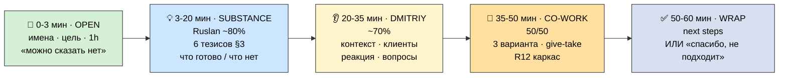
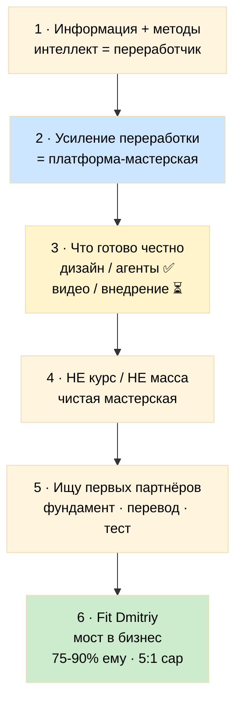
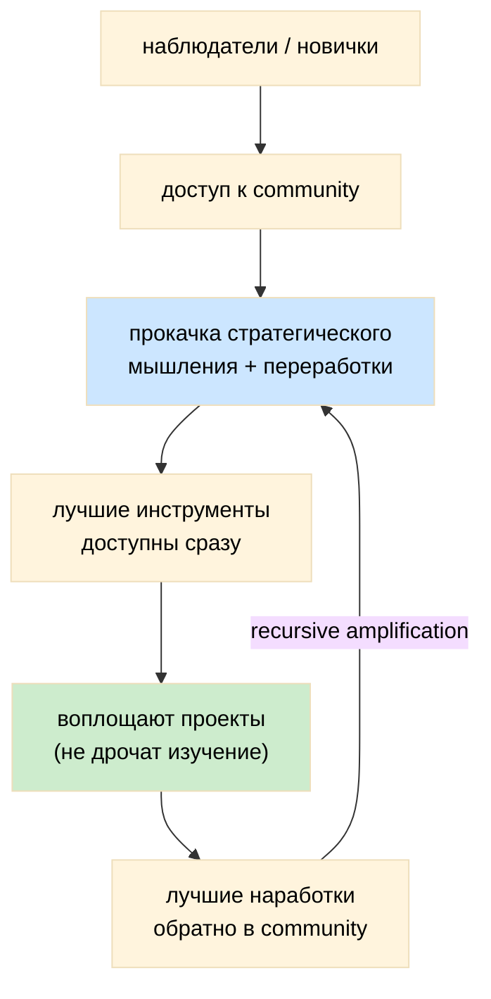
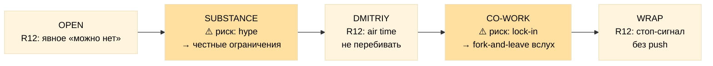

# 📞 Call Plan — Dmitriy Kaiser (звонок ~1h, 25.05.2026)

> **Цель:** познакомиться, поделиться идеей, получить feedback, нащупать как можем работать вместе. **НЕ** продать, **НЕ** закрыть сделку, **НЕ** выбить commitment в звонке.
>
> **Тон:** прямо, без воды, без маркетинга. Честно про то что готово и что нет. Спокойный «нет» с любой стороны — нормальный исход.

---

## §0 Кто Dmitriy Kaiser

- **Не путать** с Дмитрием-гуманитарием из прошлых брифов — это **другой человек**.
- **Что делает:** корпоративная культура / бизнес-консалтинг.
- **Background:** инженерное образование.
- **Своя клиентская база:** есть (консультант со своими клиентами).
- **Как партнёр (по матрице Platform Lifecycle §4):** гибрид — **T1 методолог** (проверить метод, со-создать) + **T1 R12-мост** (работа с корп-культурой = R12-aware территория) + **T4 консультант** (готовый канал доставки на реальных клиентах). [src: PLATFORM-LIFECYCLE §4]
- **Почему ценен именно сейчас (Build-фаза):** мост между нашим подходом и языком бизнес-клиентов + sanity-check на анти-секту + реальные клиенты для теста.

---

## §1 Цель звонка (one-liner)

**Познакомиться + поделиться идеей + получить feedback + обсудить как можем совместно работать (give-take map).**

**Что считаем успехом после звонка:**
1. Dmitriy понимает что строит Jetix (ядро + что готово + куда идём).
2. Ruslan понимает что делает Dmitriy / кто его клиенты / какие у них нужды / где может быть synergy.
3. Оба видят 2-3 конкретные опции совместной работы — **или** честно говорят «не сейчас».
4. Есть конкретный next step (или явное «спасибо, не подходит» — это тоже ок).

---

## §2 Структура звонка (1h)

| # | Секция | Минуты | Кто говорит | Цель |
|---|---|---|---|---|
| 1 | **Open — сразу к делу** | 0-3 | Ruslan | имена, цель, time-box, явное «можно сказать нет» |
| 2 | **Substance — делюсь идеей** | 3-20 | Ruslan ~80% | 6 тезисов (§3) + что готово / что нет |
| 3 | **Dmitriy реагирует** | 20-35 | Dmitriy ~70% | его контекст / клиенты / реакция / вопросы |
| 4 | **Совместная работа** | 35-50 | 50/50 | 3 варианта + give-take + R12 каркас |
| 5 | **Wrap + next steps** | 50-60 | Ruslan | опции, без давления, спокойный exit ок |

**Правило:** не уходить в монолог >25 мин. В секции 3 — слушать, не перебивать, дать air time.

---

## §3 Шесть тезисов substance (готовые формулировки — произносить голосом)

**Тезис 1 — Ядро.**
«Всё, что мы делаем — это информация и методы её переработки. Интеллект — это переработчик информации. Сейчас появились инструменты, которые усиливают эту переработку в разы. Но подход к работе с информацией, подход к жизни у большинства не позволяет этим реально воспользоваться.» [src: Method V2 §H/§J]

**Тезис 2 — Что строю.**
«Я строю систему усиления интеллекта. Не курс, не шаблон — **платформу-мастерскую**: лучшие инструменты + наработки + эксперты в одном месте. Человек прокачивает стратегическое мышление и переработку информации — и сразу применяет лучшие инструменты, а не тратит год на изучение очередной отдельной программы.»

**Тезис 3 — Что уже готово (честно).**
«Методология описана детально. Notion-шаблоны для управления жизнью → проектами → бизнесом готовы **на уровне дизайна**. Экосистема из 4 типов партнёров + Charter + R12-защиты прописаны. 17 AI-агентов работают.»
⚠️ Не преувеличивать: дизайн готов ≠ внедрено; видео ещё не записаны; Wave 1 ещё не отправлен; мы в **середине Build-фазы**.

**Тезис 4 — Чего НЕ хочу / чего хочу.**
«Цель — **не** продать шаблон, **не** сделать ещё один курс, **не** быстро собрать массу платящих. Цель — построить лучшую в мире чистую мастерскую: не информационный мусор, а реально лучшие наработки, с адекватными людьми, где каждый прокачивается через обмен и сразу воплощает проекты, а не дрочит бесконечное изучение.»

**Тезис 5 — Кого ищу сейчас.**
«Сейчас ищу первых партнёров на проработку фундамента: методология + Charter + базовая платформа; со-сборку концепций с разных сторон; перевод на язык широкой аудитории (умных, но не наших); тестирование на реальных клиентах. После Build → продвижение через блогеров → люди обучаются и одновременно становятся участниками экосистемы.»

**Тезис 6 — Как Dmitriy мог бы вписаться (как пример, не предложение).**
«Например, как один из основных партнёров: переводишь подход на язык бизнес-клиентов — corporate culture + инженерия идеальный мост. Твои клиенты пользуются → их эффективность растёт → они больше платят тебе → доход делится: основная часть тебе (≈75-90%), остаток платформе, с потолком разрыва 5:1 по Мондрагону. Долгосрочно — строишь свою когорту внутри Jetix.» [src: PARTNER-OFFERING-HUMAN-LANG; PLATFORM-LIFECYCLE §4 T4]

> **R12 при тезисах:** ни одной фразы вида «у нас секрет / только избранные / надо закрепиться сейчас». Fork-and-leave проговорить прямо: «попробуешь, не пошло — спокойно уходишь, никому ничего не должен».

---

## §4 Вопросы Ruslan → Dmitriy (по фазам)

**После substance (фаза 3 — чтобы Dmitriy раскрылся):**
- Что зацепило, а что вообще не зашло из того, что я рассказал?
- Какая у тебя сейчас клиентская база — типы, размер, запросы?
- Что они на самом деле просят поверх «корпоративной культуры»?
- Какие методологии используешь сейчас? Где не хватает?

**При обсуждении co-work (фаза 4):**
- Если бы адаптировал наш подход под своих клиентов — что критично должно быть готово с нашей стороны?
- Что для тебя must-have в партнёрстве (доход / автономия / IP / своя identity)?
- Что deal-breaker — чего не примешь ни при каких условиях?
- Видишь ли в своей сети других людей, кому бы это легло?

**Честная разведка:**
- Где я как новичок в твоём поле могу не видеть подвоха?
- Где, по твоей оценке, основной риск что всё это не взлетит?

---

## §5 Что Dmitriy скорее всего спросит — готовые честные ответы

**«Это очередной курс / инфопродукт?»**
→ «Нет. Курс учит методам. Мы строим уровень выше — мастерскую, где ты прокачиваешь сам способ выбирать и объединять методы, и сразу применяешь инструменты на своих проектах. Контент — побочный продукт, не товар.»

**«А что у вас реально готово, а не на бумаге?»**
→ «Честно: методология описана, шаблоны и экосистема — на уровне дизайна, агенты работают. Видео не записаны, Wave 1 не отправлен, внедрений ещё нет. Мы в середине Build. Я не продаю готовое — зову строить фундамент.»

**«Что мне с этого / как я зарабатываю?»**
→ «Основная доля дохода от твоих клиентов остаётся у тебя (≈75-90%), платформе — остаток, с потолком разрыва 5:1. Плюс новый угол для твоих клиентов и возможность построить свою когорту внутри.»

**«Я привязываюсь / теряю автономию / отдаю свой IP?»**
→ «Нет lock-in. Fork-and-leave: попробовал, не пошло — уходишь со своим, без штрафов. Твоя клиентская база и identity остаются твоими.»

**«Почему ты, почему сейчас?»**
→ «Foundation-работа уже сделана: за ~38 дней с AI-усилением накоплен большой проработанный substrate. Это не идея на салфетке — работающий движок в середине сборки. Сейчас момент звать тех, с кем строить фундамент.»

---

## §6 Анти-паттерны (чего НЕ делаем)

- ❌ Монолог >25 мин / pitch-deck говорильня.
- ❌ Маркетинг-buzzwords: «революция», «прорыв», «жизнь изменится».
- ❌ Закрытие сделки / commitment-request / «давай к среде решим».
- ❌ Vesting / lock-in / эксклюзив как условие.
- ❌ Преувеличение готовности (дизайн ≠ внедрено; видео ≠ записаны).
- ❌ Fake-метрики («у нас уже когорта 50 человек»).
- ❌ Принижать Dmitriy («ты пока не понимаешь нашу терминологию»).
- ❌ Перебивать, когда он реагирует.
- ❌ Скрывать, что мы в середине Build и Wave 1 ещё не ушёл.

---

## §7 R12 paired-frame sweep (8 вопросов — прогнать перед звонком)

| # | Вопрос | Как держим в звонке |
|---|---|---|
| 1 | **Цена ≤ польза?** | 1h симметрично: мне — learning + потенциал co-work; ему — новый угол + потенциальный revenue channel |
| 2 | **Конкретно?** | 6 тезисов §3 + конкретные вопросы §4, не «расскажи о себе в общем» |
| 3 | **Соразмерно отношениям?** | Первый контакт → exploration, не формальное предложение партнёрства |
| 4 | **По ступени?** | Bloom Stage 2-3 (awareness → interest), не Stage 5+ (trial / partner) |
| 5 | **Канал уместен?** | 1:1 звонок 1h — уместно для substance + реакции, не массовый email |
| 6 | **Не доим / не запираем?** | Никакого commitment до конца; явное «можешь сейчас сказать нет»; fork-and-leave |
| 7 | **Нет манипуляции?** | Прямые тезисы + честные ограничения; без scarcity / FOMO / authority bias |
| 8 | **Стоп-сигнал готов?** | Если «не подходит» — благодарим, закрываем, без push на «подумай ещё» |

**Все 8 должны pass. Хоть один fail → переформулировать или пропустить тему.**
*nlp-нота:* reframing только как прояснение (3 уровня метода), не pacing-and-leading к «да».
*influence-ethics-нота:* offer-first / exit-всегда-открыт — проходит extraction-boundary audit; highest-risk зоны = секция substance (соблазн hype) и co-work (соблазн lock-in).

---

## §8 Mermaid CK-1..CK-5

### CK-1 — Структура звонка 1h

### CK-2 — Поток 6 тезисов (логика в голове Ruslan)

### CK-3 — Партнёрская модель Dmitriy (как пример)

```mermaid
%%{init: {'theme':'base', 'themeVariables': {'primaryTextColor':'#000','textColor':'#000','lineColor':'#333'}}}%%
graph LR
    D0["Dmitriy сейчас<br/>консультант + клиенты"] --> J["входит в Jetix<br/>T1 методолог + T4 консультант"]
    J --> AD["адаптирует метод<br/>под своих клиентов"]
    AD --> PAY["клиенты эффективнее<br/>→ платят больше"]
    PAY --> RS["доход: ≈75-90% Dmitriy<br/>остаток платформе<br/>Мондрагон 5:1 cap"]
    RS --> COH["строит свою когорту<br/>внутри Jetix"]
    COH -.->|fork-and-leave сохранён| EXIT["уход без штрафов<br/>со своим"]
    style J fill:#e0d0ff,color:#000
    style RS fill:#cdeccd,color:#000
    style EXIT fill:#ffd6d6,color:#000
```

### CK-4 — Платформа как мастерская (workshop frame)

### CK-5 — R12 overlay по секциям звонка

---

## §9 Pre-call checklist (за 10 мин до звонка)

- [ ] Перечитать §3 (6 тезисов) — держать в голове, не читать с листа.
- [ ] Открыть CK-1 (структура 1h) — следить за временем по секциям.
- [ ] Напомнить себе: слушать > говорить в фазе 3; не перебивать.
- [ ] Помнить честные границы: дизайн ≠ внедрено, Wave 1 не ушёл, середина Build.
- [ ] Настрой: «нет» — нормальный исход; не давить.
- [ ] Вода / тихое место / 60 мин без прерываний.

## §10 Post-call checklist (после звонка)

- [ ] Завести/обновить CRM-запись Dmitriy Kaiser (роль: partner_prospect; T1+T4 hybrid).
- [ ] Зафиксировать: его клиенты / запросы / методологии / must-have / deal-breaker.
- [ ] Что зацепило / что не зашло (его feedback на substance).
- [ ] 2-3 варианта co-work, которые проговорили (или «не сейчас»).
- [ ] Concrete next step + дата (если есть).
- [ ] R11 Default-Deny: никаких авто-действий (CRM API / follow-up email) без отдельного решения Ruslan.

---

## §11 Cross-refs (substrate, не дублируем content)

- `prompts/call-plan-dmitriy-kaiser-2026-05-25.md` — исходный prompt.
- `decisions/strategic/PLATFORM-LIFECYCLE-STAGES-PLAN-2026-05-25.md` — §4 4 типа партнёров, §5 R12, §6 documents matrix.
- `decisions/strategic/EXECUTION-PLAN-FIXATION-2026-05-24.md` — §4 партнёры + R12 canonical.
- `decisions/strategic/METHOD-LIFE-DEVELOPMENT-V2-2026-05-21.md` — §H/§J meta-method (тезис 1).
- PARTNER-OFFERING-HUMAN-LANG-2026-05-22 — style anchor + revenue model (75/25 + Мондрагон 5:1).

---

*Quick single-doc call plan для Dmitriy Kaiser (corporate culture / бизнес-консультант / инженерный bg). ~1h звонок: знакомство + substance share + feedback + co-work options + R12-чистый exit ок. F3 derivative, без §17.0 MAX-density (quick override). Plain Russian. 5 mermaid CK-1..CK-5. R1 surface — Ruslan adapts live.*
