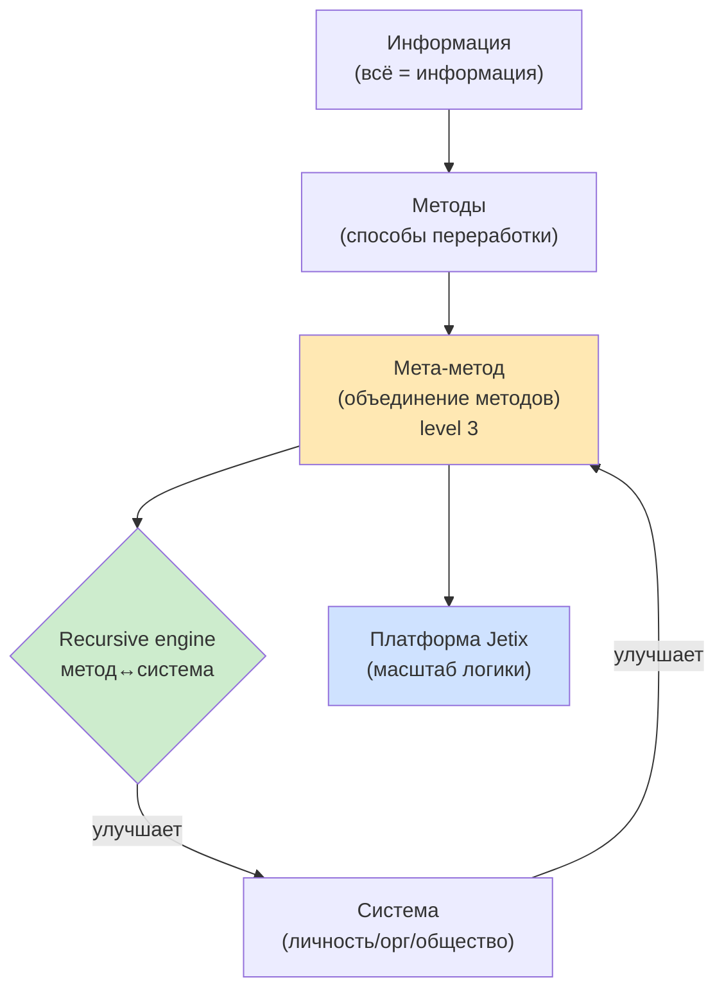
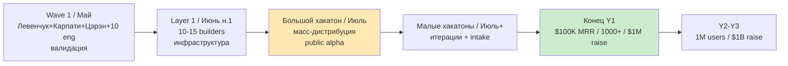
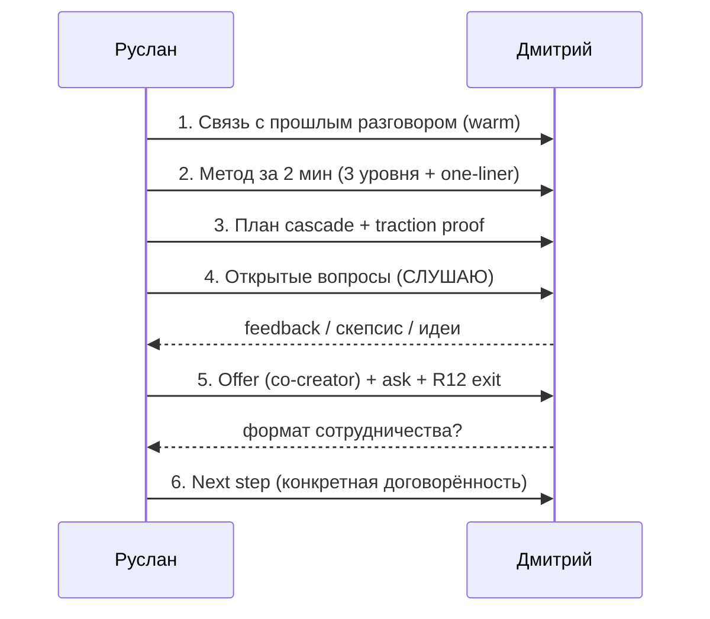
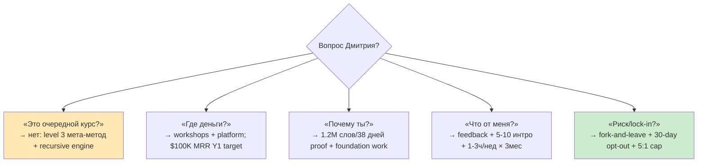
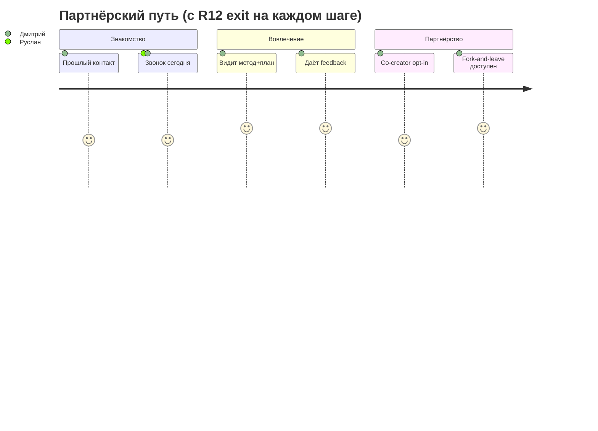

# Call Plan — Дмитрий Кайзер

> **Цель звонка:** перейти от знакомства/разговора к **partnership commitment** (co-creator slot). Не «продать», а пригласить со-строить.
>
> **Frame:** потенциальный партнёр / co-creator (НЕ engineer-recruit, НЕ investor-pitch).
>
> **⚠️ Контекст-gap:** на момент написания нет CRM/wiki substrate по Дмитрию Кайзеру (отличается от *Дмитрия Гуманитарщина*). Persona-зависимые блоки (§1) — заполнить вручную перед звонком. Метод/план/economics/questions — substrate-derived и готовы.

---

## §0 За 30 секунд (если времени нет читать всё)

1. **Кто я и что строю** — метод по объединению методов по улучшению системы самой себя. Платформа на этой логике. [src: method-method-one-liner.md]
2. **Доказательство тяги** — 1.2M слов substrate за 38 дней с Claude Code (10–20× leverage). Не идея — работающий движок.
3. **План** — Wave 1 (май) → Layer 1 (июнь) → хакатон (июль) → масса. [src: STRATEGIC-PLAN-NEAR-FUTURE]
4. **Зачем зову** — co-creator: feedback на слабые места + сеть + 1–3 ч/нед на 3 месяца.
5. **Что даю** — founding-partner stake + полный доступ к substrate + brand recognition. Fork-and-leave защита (никакого lock-in). [src: ECONOMIC-MODEL-TOKENOMICS]

---

## §1 Кто такой Дмитрий — заполнить перед звонком

> **Заполнить вручную (нет substrate):**
> - Чем занимается / экспертиза:
> - Откуда знакомы / кто познакомил:
> - Что его может зацепить (humanitarian / tech / business / capital):
> - Его возможный вклад (domain / сеть / время / капитал):
> - Что он, вероятно, спросит / его скепсис:

**Audience styling (default до уточнения):** говорить просто, через истории и эмоцию (Heath SUCCES — Simple + Story + Emotional приоритет). Меньше жаргона, больше «зачем это людям».

**Baseline (pre-existing relationship):** если разговор уже был — опираться на ранее сказанное, не начинать с нуля; это снижает «холодность» и уважает его время.

---

## §2 Что рассказать про метод (talking points)

**Блок A — Фундамент (просто):**
- «Всё, что мы делаем с жизнью и работой — это переработка **информации**.»
- «Способы переработки — это **методы**. А над ними есть метод выбора и объединения методов.»
- **One-liner:** *«метод по объединению методов по улучшению системы самой себя»*. [src: method-method-one-liner.md §1]

**Блок B — Личное происхождение (честно, без пафоса):**
- Начал с вопроса «как развить свою жизнь» → системное мышление (Левенчук) → итерации с Claude Code.
- **Wisdom-гипотеза:** больше накопленной информации → лучше решения → лучше методы (compound). [src: Method V2 Phase 12]

**Блок C — Суть метода (3 уровня — главный аргумент дифференциации):**
- Большинство учит **методам** (level 1).
- Некоторые — **как выбирать между методами** (level 2).
- Jetix — **как построить свою мета-стратегию выбора методов** (level 3 = метод-метод). [src: method-method-one-liner.md §2; Method V2 Phase 5 §J quadrate logic]
- **Recursive engine:** метод улучшает систему → система улучшает метод → ... (compound over iterations).

**Блок D — Куда это масштабируется:**
- Платформа держится этой логики → self-improvement по эффективному методу → развитие общества через cascade.

---

## §3 План развития — cascade (что показать)

| Этап | Когда | Что происходит |
|---|---|---|
| **Wave 1** | Май | Левенчук + Карпати + Цэрэн + ~10 инженеров — валидация концепта + первые партнёры |
| **Layer 1** | Июнь (нед.1) | 10–15 fundament-builders, инфраструктура готова |
| **Большой хакатон** | Июнь-конец / Июль | масс-дистрибуция, публичная alpha, строим платформу вместе |
| **Малые хакатоны** | Июль+ | итеративная доработка, расширение когорты, intake мастерских |
| **Конец Y1** | — | $100K MRR, когорта 1000+, обсуждение $1M raise |
| **Y2–Y3** | — | траектория 1M пользователей, $1B raise |

[src: STRATEGIC-PLAN-NEAR-FUTURE-2026-05-21.md Phase 3/5/7; DMITRIY-CALL-PLAN-2026-05-22 §4]

---

## §4 Ключевые вопросы Дмитрию (7)

1. **Слабые места** — где видишь самый хрупкий узел концепции / риск?
2. **Что упустил** — чего нет в планировании, что критично?
3. **Твой вклад** — экспертиза / сеть / время — где тебе самому интересно приложиться?
4. **Сеть** — кто из твоего окружения может реально помочь (инженеры / мыслители / институции / капитал)?
5. **Совет** — что бы ты сделал на моём месте в ближайший месяц?
6. **Формат сотрудничества** — какой tier комфортен (advisor / co-creator / casual)?
7. **Critical path** — что обязательно проработать до публичного запуска?

> Дисциплина: задаю **открытые** вопросы, не подвожу к нужному ответу. Слушаю > говорю (цель — реальный feedback, а не подтверждение).

---

## §5 Что предложить (R12 paired-frame — offer ↔ ask баланс)

**Offer (что даю):**
- Founding-partner stake — со-владение через triple-role структуру (worker 75% + investor 25% institutional + promoter bonus). [src: ECONOMIC-MODEL-TOKENOMICS §1]
- Полный доступ к substrate (Method V2 + Strategic Plan + Economic Model).
- Co-creation slot — реальное влияние на направление, не «consultant on call».
- Brand recognition — founding contributor.
- Доступ к мастерским/когорте, усиление его сети.

**Ask (что прошу):**
- Feedback на слабые места / blind spots.
- 5–10 интро в его сети.
- 1–3 ч/нед mentor/co-creator-времени на 3 месяца.
- Commitment (партнёрство, а не «поболтали»).

**R12 защитные условия (произнести вслух, не прятать):**
- Добровольный opt-in, 30-дневный opt-out.
- **Fork-and-leave** — уходит без штрафа, забирая своё. [src: ECONOMIC-MODEL §2.3 Mondragón fork-and-leave]
- Mondragón cap 5:1 на разрыв долей — никакой концентрации.
- Никаких манипулятивных техник; полная прозрачность economics.

---

## §6 R12 8-Q Sweep (STRICT — influence-ethics + nlp auto-fire)

> Перед звонком прогнать. Любая техника убеждения в плане обязана нести встроенный этический контр-frame (R12 paired-frame). Все 8 — PASS = можно идти.

| # | Вопрос (extraction / influence audit) | Статус | Контр-frame |
|---|---|---|---|
| Q1 | **Extraction beyond agreed share?** — не извлекаю ли ценность сверх согласованного? | ✅ PASS | offer/ask явно сбалансированы §5; share проговорён вслух |
| Q2 | **Wage-ratio violation?** — структура долей не нарушает 5:1 cap? | ✅ PASS | Mondragón 5:1 на разрыв; 75% workers |
| Q3 | **Non-consensual distribution?** — не использую его имя/сеть без согласия? | ✅ PASS | интро — только по его согласию, Q4 §4 спрашивает, не предполагает |
| Q4 | **Fork-prevention?** — нет ли скрытого lock-in? | ✅ PASS | fork-and-leave + 30-day opt-out явно в §5 |
| Q5 | **NLP/scarcity/FOMO давление?** (nlp auto-fire) | ✅ PASS | НЕТ искусственного дефицита/дедлайнов; темп — его |
| Q6 | **Reciprocity-обязывание?** — не «дарю, чтобы обязать»? | ✅ PASS | offer без условия немедленного ответа; ask отдельно |
| Q7 | **Authority/social-proof инфляция?** — traction-цифры честные? | ✅ PASS | 1.2M слов / 38 дней — verifiable; не раздуваю |
| Q8 | **Asymmetric information?** — economics прозрачны для него? | ✅ PASS | полный доступ к substrate §5; ничего не скрыто |

**nlp-expert нота:** reframing допустим только как *прояснение* (3-уровневая модель метода), не как verbal pacing-and-leading к решению. Witkowski-critique: NLP-паттерны убеждения не используются.
**influence-ethics нота:** offer-first, ask-second, exit-всегда-открыт — структура проходит extraction-boundary audit.

---

## §7 Mermaid CK-1..CK-5

### CK-1 — Метод (от информации к платформе)

### CK-2 — Cascade развития

### CK-3 — Поток звонка (sequence)

### CK-4 — Q&A дерево (готовые ответы)

### CK-5 — Путь партнёра + R12 paired-frame

---

## §8 Acceptance (quick)

- ✅ Single doc, plain Russian
- ✅ 5 mermaid CK-1..CK-5
- ✅ 7 ключевых вопросов + R12 paired-frame offer/ask
- ✅ R12 8-Q sweep STRICT (influence-ethics + nlp auto-fire) — 8/8 PASS
- ✅ F3 derivative — substrate pull key sections [src: 5 docs]
- ✅ R1 surface — Ruslan = sole strategist (всё выше = варианты/компиляция, не стратегические решения)
- ⚠️ §1 persona-блок заполнить вручную (нет substrate по Кайзеру)

---

*Quick synthesis 2026-05-25. Substrate compile only (F3 derivative). Дмитрий Кайзер ≠ Дмитрий Гуманитарщина — отдельная persona, §1 требует ручного заполнения перед звонком.*
