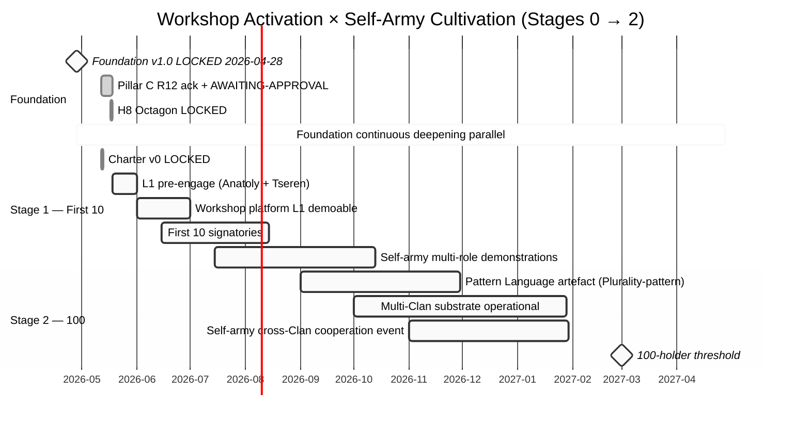

# Concept — Man-as-Army × Jetix integration

> **R1 surface.** brigadier organizes Ruslan's voiced Tarasov-derived concept (text_006 18.05 morning) applied к Jetix Workshop / Clan / Self-OS substrate via cross-precedent triangulation. **Not a strategic decision — concept artefact for Ruslan ack.**

> **EP-5 disclosure.** F3 grade = single-voice (Ruslan text_006 verbatim) + brigadier-scribe + 3-cell triangulation (mgmt/sys/phil) + 3 cross-domain precedents (Mondragón / EVE / TPS). **NOT** FPF B.3 F8 independent verification.

---

## §0 TL;DR (≤200 слов)

text_006 ¶1-8 (18.05 morning Berlin Ruslan dictation): **Тарасов «человек-армия»** — всё что может армия = может один человек (разведчик / стратег / воин / дипломат); inverse = «честность с собой + культовая дисциплина + повиновение собственному указу» (что **не может вся армия**); applied к Jetix = self-army member; «армия таких воинов» = exponentially capable + distributed resilience (broken parts → other regenerates / survives / propagates).

**Integration claims (3):**
1. **Clan member model = self-army** (each member carries 4+ роли + self-discipline + mission alignment)
2. **Workshop = host of self-armies** (мастерская = where self-armies cooperate via FPF substrate)
3. **Distributed Resilience Architecture (NC-B2-2 candidate)** = aggregate property of self-army composition (regeneration через mission-alignment, NOT через central command)

**Sequencing model:** 10 → 100 → 1000 → 100k progression (text_006 ¶7 «снежный ком») with parallel Foundation deepening (text_006 ¶8 «фундамент строится мощный — сейчас как раз кидаем снежный ком на развитие фундамента»).

**Cross-precedent triangulation:** Mondragón (68 years; ratio 5:1 cap; cooperative resilience); EVE Online (23 years; Alliance/Corporation/Executor pattern; B-R5RB stress test survived); TPS (70 years; mentor-pairing for tacit→explicit transfer).

---

## §1 Verbatim source (text_006 18.05 morning)

> «человек-армия — соответственно нету вообще ничего такого, чего не мог бы сделать человек, что может сделать армия. Всё то, что может сделать армия — может сделать и один человек. Это раз. И быть, блядь, и разведчиком, и стратегом, и воином, и дипломатом, ну и так далее. Всё человек это может, вопрос насколько хорошо.» [text_006 ¶2]

> «Есть такое что может один человек, но не может вся армия — до полностью там быть честным самим собой, держать там культа максимальную дисциплину, своим своим указом полностью повиноваться и так далее.» [text_006 ¶3]

> «ты сам вообще как армия — с ну соответственно работой соответствующей. Ну и вот а если будет ещё армия из таких вот воинов — что это армия сможет вообще сделать? Но это же целое войско.» [text_006 ¶3-4]

> «И если соответственно сейчас там часть армии как-то вот ломается, ну или там как-то я не знаю отпадает и так далее — то остаётся другая часть армии, которая снова-таки отработает над собой, регенерируется, выживает, распространяется и так далее.» [text_006 ¶4]

> «вот как бы новое описание армии — соответственно такой вот интеллектуальной. Соответственно надо сделать в таком вот безопасным для общества ключи, но и полезным.» [text_006 ¶5]

> «лично каждому донести, пояснить. Особенно да вот этих таких на первых 10. До первых сука 10000 — это минимум.» [text_006 ¶5]

> «10 партнёров — этого уже будет достаточно вот там запустить первых 100, потом тысячу, потом 100000. А вот эти 100000 — она уже дальше идёт просто как снежный ком.» [text_006 ¶7]

> «фундамент построить — вот как раз он уже строится довольно мощный... Сейчас как раз кидаем этот снежный ком дальше на развитие этого же фундамента, ну и потом уже на запускаем.» [text_006 ¶8]

---

## §2 Tarasov origin reference

**«Человек-армия» (man-as-army)** — pattern originating in writings by **Геннадий Тарасов** (Russian-language pedagogical / military-strategic / self-development corpus). Concept articulates: single person can cultivate full repertoire of military / strategic / interpersonal capabilities (scout + strategist + warrior + diplomat) at sufficient skill to substitute for collective army on specific missions.

**Modal claim:** what an army does **collectively** through specialization + coordination, a sufficiently-developed individual can do **internally** through cross-role competence + self-coordination.

**Inverse claim (text_006 ¶3):** what one person can do that no army can — full self-honesty, cultivated discipline, self-obedience. Army is structurally external-command-bound; individual is structurally self-command-capable.

**Tarasov tradition** lineage cross-link: closer reference in Ruslan's reading per Self-OS / engineering-thinking project tracks. **Brigadier note:** specific Tarasov source citation not in current Jetix wiki — surface as TODO для wiki-source attribution Phase 2+.

---

## §3 FPF primitive mapping (mgmt × integrator + sys × integrator + phil × critic cell convergence)

### §3.1 Individual self-army FPF decomposition

| Tarasov claim | FPF primitive | F-G-R |
|---|---|---|
| One person carries multi-role repertoire (разведчик / стратег / воин / дипломат) | `U.Role` multi-instantiation per holder (A.2) — same holder, multiple role-types; `U.Capability` (A.2.2) composition | F3 · multi-role-holder · refuted_if_no_human_demonstrably_carries_all_4_roles |
| Cross-role competence cultivated through self-development | `B.4 Canonical Evolution Loop` (individual-scope) + `A.15.1 U.Work` × N roles | F3 · self-cultivation-pattern |
| Self-honesty / discipline / obedience (man > army on these) | `U.Commitment` (A.2.8) **self-directed** + `E.5 Guard-Rails` interior (not external command) + `A.13 Agential Role` (autonomous agent) | F3 · self-discipline-superiority |
| Self-system architecture (developer + consumer) | `B.2 MHT` (Meta-Holon Transition: self emergence within individual scope) — cross-link wiki/concepts/human-as-developer-and-consumer | F3 · self-as-system |
| Quality threshold («вопрос насколько хорошо») | `B.3 F-G-R` reliability — self-army value-add scales with quality not just role-coverage | F4 · quality-conditional |

### §3.2 Self-army composition → army-of-armies FPF decomposition

| Composition claim | FPF primitive | F-G-R |
|---|---|---|
| Self-armies aggregate into «войско» | `B.2 MHT` (individual holons → supersystem holon emergence) | F4 · composition-pattern |
| Aggregate capability > sum of parts | `B.1.6 Γ_work` (capability composition with emergent gains) + `A.5 Kernel Modularity` (independent units) | F3 · emergent-capability |
| Mission alignment as composition glue («все на одну миссию нацелены — развиваться, жить, захватывать») | `U.Episteme` (A.16) shared + `A.15.2 U.WorkPlan` shared | F3 · mission-alignment · refuted_if_misaligned_subgroups_persist_indefinitely |
| Distributed resilience (broken parts → regenerate / survive / propagate) | `A.5 Kernel Modularity` (independent regenerable units) + `B.4 Canonical Evolution Loop` (regeneration cycle per holon) + `A.10 Evidence Graph` (mission-aligned persistence trace) | **F3 · distributed-resilience-pattern** · refuted_if_clan_member_attrition_causes_propagation_collapse |
| Anti-feudal positioning («безопасным для общества + полезным + интеллектуальной») | `A.7 Strict Distinction` (anti-conquest framing) + `U.PromiseContent` (A.2.3) к society + Pillar C R12 anti-extraction | F4 · anti-feudal-positioning |

### §3.3 Sequencing model (10 → 100 → 1000 → 100k snowball)

| Stage | FPF primitive | F-G-R |
|---|---|---|
| Foundation-build phase | `B.4 Canonical Evolution Loop` (Foundation Architecture v1.0 LOCKED 2026-04-28) | F8 (artefact) / F4 (operational) |
| First-clan activation (10) | `B.5.1 Explore→Operate` + `U.RoleAssignment` cardinality cap (vision/04 Charter v0) | F5 (charter text) / F2 (realisation; 0 signatories) |
| Composition emergence (100) | `B.2 MHT` (clan-of-clans aggregation) | F2 · aspirational-target |
| Mass activation (1000 → 100k) | `B.5.1 Explore→Operate` sequenced | F1 · vision-target |
| Parallel Foundation deepening | `B.4 Canonical Evolution Loop` (continuous Foundation evolution **during** expansion, not sequential) | F4 · parallel-build-pattern |

---

## §4 Object mapping (Phase 0 14 objects)

| Object | Impact | Cross-link |
|---|---|---|
| **O-04 Self-OS substrate** | direct extension — «человек-армия» = self-management substrate model + multi-role holder pattern | wiki/concepts/human-as-developer-and-consumer-2026-05-17 |
| **O-13 Clan / People-NS** | «армия воинов» = first-clan composition pattern; each member = self-army | vision/04; Charter v0 |
| **O-14 Meta-workshop** | Workshop = where self-armies cooperate via FPF substrate | vision/03; Workshop Concept v2 |
| **O-11 R12 anti-extraction** | «не всё сразу отдали — часть» = R12-aligned contribution model + voluntary mission-aligned engagement | R12 packet 2026-05-12; Pillar C Tier 2 rule 12 |
| **O-09 H8 LOCKED Octagon (Trust Infrastructure)** | Distributed resilience as trust-mechanism: self-army cooperation = role-attestation in action | H8 LOCK 2026-05-17 |
| **NC-1 Trust Infrastructure (capability cluster)** | Distributed resilience через trust + honesty = positive-signaling mechanism | reports/voice-pipeline-2026-05-17-batch §03 NC-1 |
| **NEW NC-B2-2 Man-as-Army × Distributed Resilience** | This concept (new pattern surfacing) | NC-B2-2 (this doc) |

---

## §5 Cross-domain precedent triangulation

### §5.1 Mondragón (research-deepening direction 06) — 68 years cooperative resilience

**Pattern match:**
- **Distributed ownership** = each member as full participant (analog: self-army cardinality)
- **5:1 wage ratio cap** = anti-extraction enforcement (analog: R12 Tier 2 rule 12)
- **Voluntary engagement** = members can fork-and-leave (analog: R12 fork-and-leave clause)
- **Resilience through education + cooperation** = aggregate property of mission-aligned distributed members
- **68-year persistence** = empirical evidence distributed cooperative resilience is sustainable at scale

**Differences:**
- Mondragón = single-jurisdiction industrial cooperative; Jetix = multi-jurisdiction methodology-substrate network
- Mondragón = capital-cooperative substrate; Jetix = knowledge-substrate
- Mondragón = explicit voting governance; Jetix Clan governance = TBD (Charter v0)

[src: research/deepening-2026-05-18/06-success-mondragon-68yr-mechanism.md]

### §5.2 EVE Online (research-deepening direction 13) — 23 years virtual tribe

**Pattern match:**
- **Alliance / Corporation / Executor governance** structure analog к Clan / multi-Clan / brigadier role
- **B-R5RB Battle stress test (2014)** — 21h single battle, 7548 players, $300K USD equivalent loss, community persisted → **distributed resilience demonstrated empirically**
- **Voluntary executor support (≥50% CEO consent)** = analog к Pillar C consent mechanism

**Differences:**
- EVE = MMO virtual substrate (low real-world stakes); Jetix = real-economy + reputation substrate
- EVE = anonymous-allowed; Jetix = role-attestation + transparency

[src: research/deepening-2026-05-18/13-tribe-eve-online-20yr.md]

### §5.3 TPS Toyota Production System (research-deepening direction 14) — 70 years tacit→explicit mechanism

**Pattern match:**
- **Mentor-pairing for tacit transfer** = self-army cross-role competence cultivated через high-touch teaching (text_006 ¶5 «лично каждому донести»)
- **Andon cord empowerment** = individual stops production for quality (analog: self-discipline at line-worker scale)
- **Kaizen continuous improvement** = each operator empowered to evolve process (analog: each self-army member improves system)

**Differences:**
- TPS = manufacturing context with tangible quality artefacts; Jetix = methodology + knowledge artefacts
- TPS = embedded Toyota corporate substrate; Jetix = bootstrap pattern

[src: research/deepening-2026-05-18/14-tacit-explicit-tps-mechanism.md]

### §5.4 Triangulation conclusion

3 independent 60+-year-substrate precedents (industrial cooperative / virtual tribe / manufacturing methodology) converge on: **distributed resilience through mission-aligned + capability-distributed + voluntarily-engaged self-managing members IS empirically sustainable at multi-decade scale.** Man-as-Army × Jetix integration pattern = **not novel claim** — it is articulation of empirically-tested pattern from cross-domain precedents applied к methodology-substrate domain.

---

## §6 Distributed Resilience Architecture pattern formalization

### §6.1 Structural definition (sys × integrator cell)

**Architecture = N independently-functional + mission-aligned + role-flexible holons** composing into supersystem via FPF substrate (`B.2 MHT`). Properties:

| Property | Mechanism | Failure mode |
|---|---|---|
| **Independence** | each holon = self-army (self-managing) | broken holon → other holons continue |
| **Mission alignment** | shared `U.Episteme` (A.16) + shared `U.WorkPlan` (A.15.2) | misaligned subgroup → resilient if minority; collapse if mission drift majority |
| **Role flexibility** | `U.Role` multi-instantiation per holder | role-rigidity → composition brittleness |
| **Regeneration** | `B.4 Canonical Evolution Loop` per holon | regeneration-disabled → attrition leads to collapse |
| **Voluntary engagement** | R12 fork-and-leave preserved + Mondragón voluntary participation | coerced engagement → R12 violation + perception risk |
| **Substrate-mediated cooperation** | FPF as shared language (audio_672-673 articulation) | substrate failure → coordination collapse (cf. direction 02 Cybersyn) |

### §6.2 Failure modes (phil × critic cell — preserve dissent)

**Counter 1.** «Армия» metaphor carries military-affect risk in some audiences (peace-aligned methodology community). **Mitigation:** «intellectual army» framing + anti-feudal positioning per text_006 ¶5 + anti-conquest clause carried.

**Counter 2.** Mass-scale snowball (10→100→1000→100k) = compounding aspiration; empirically rare in non-religious / non-state movements. Cross-domain precedents are 100-1000 scale (Mondragón ~80K workers; EVE ~7500 peak battle); 100K = high-end ambition. **Mitigation:** 10 + 100 milestones empirically achievable; 1000+ surface as aspiration.

**Counter 3.** Self-army claim assumes high-capability individual baseline. Population distribution = most individuals carry 1-2 strong roles, not 4. **Mitigation:** «вопрос насколько хорошо» (text_006 ¶2) — self-army quality varies; aggregate compensates for individual incompleteness.

**Counter 4.** Distributed resilience claim untested at Jetix scale (Charter v0 = 0 signatories). Cross-domain precedents = different domains. **Mitigation:** F3 grade preserved; refutation conditions explicit (90-day multi-role demonstration test).

### §6.3 Phase 1 falsifiable test surface

| Test | Refutation horizon |
|---|---|
| **DRA-T1** | First 10 Clan signatories demonstrate ≥3-role competence each within 90 days | Phase 1 close |
| **DRA-T2** | First simulated member-attrition event (1 of 10 leaves) — other 9 maintain Clan operation 30+ days post-event | Phase 1 stress test |
| **DRA-T3** | Mission-alignment measured via FPF shared-vision artefact co-authorship rate ≥80% | Continuous |
| **DRA-T4** | R12 fork-and-leave clause exercised at least once — substrate continues without retaliation | Phase 1-2 |
| **DRA-T5** | Workshop hosts simultaneous multi-self-army cooperation event (≥3 partners cooperating without central coordinator) | Phase 1 Workshop launch |

---

## §7 10 → 100 → 1000 → 100k progression model

### §7.1 Stage-by-stage definition

| Stage | Holder count | Foundation state | Self-army profile | Workshop state |
|---|---|---|---|---|
| **Stage 0 (now)** | 1 (Ruslan) | Foundation v1.0 LOCKED + Pillar C R12 (ack 2026-05-12 + AWAITING-APPROVAL packet) + H8 Octagon LOCKED 2026-05-17 | Ruslan as proto-self-army (multi-role: founder + methodologist + scribe + outreach) | Workshop Concept v2 LOCKED 2026-04-30; platform implementation Phase 1 |
| **Stage 1 (Phase 1 — first 10)** | 10 (Charter v0 target) | Foundation continues operational deepening parallel к activation | Each signatory = self-army candidate; mentor-paired (TPS pattern) by Ruslan + L1 cores | Workshop platform L1 demoable (text_003 sequencing) |
| **Stage 2 (Phase 2 — 100)** | 100 | Pattern Language artefact + Plurality-pattern open-source authoring | Self-armies trained + role-attested + cross-cooperating | Multi-Clan substrate operational |
| **Stage 3 (Phase 3 — 1000)** | 1000 | Multi-Clan governance pattern stable | Mass self-army cultivation through Workshop + materials | Methodology distribution at scale |
| **Stage 4 (long-horizon — 100k+)** | 100k+ | Open ecosystem | Aspiration: methodology mastery scales beyond entrenched certification economies (per direction 10 m/acc framing surface) | Workshop = network exit substrate |

### §7.2 «Foundation builds parallel to snowball» mechanism (text_006 ¶8)

**Critical pattern (text_006 ¶8):** «как раз кидаем этот снежный ком дальше на развитие этого же фундамента, ну и потом уже на запускаем».

**Decoded:** Foundation Architecture v1.0 LOCKED 2026-04-28 = artefact-level state; operational state evolves continuously per `B.4 Canonical Evolution Loop`. Stages 1-4 expansion is **simultaneous with** Foundation deepening — NOT sequential «freeze Foundation, then expand».

**Engineering analog:** Foundation = trunk; expansion = branches; both continue developing. Stage 1 activation provides feedback loop that informs Foundation evolution (e.g., Phase B drafts becoming Foundation extensions per AWAITING-APPROVAL discipline).

---

## §8 Workshop activation Gantt candidate (sequencing)

> **R1 surface only.** Gantt = aspirational sequencing; Ruslan adjusts dates per actual execution.

---

## §9 AWAITING-APPROVAL packet surface — Pillar C extension consideration

**Question for Ruslan ack:** Does «Distributed Resilience Architecture (NC-B2-2)» rise to Pillar C extension, or remain wiki-concept-level integration claim?

### Posture options:
- **Option A (wiki-concept only):** Concept lives in wiki/concepts/man-as-army-jetix.md + this strategic concept doc. Pillar C unchanged. Operational learnings inform Foundation evolution per existing `B.4` loop.
- **Option B (Pillar C extension candidate):** Surface AWAITING-APPROVAL packet «Distributed Resilience as architectural principle» — Pillar C extension would formalize composition / regeneration / voluntary-engagement / mission-alignment requirements for Clan-level structures.

### Brigadier inference (F2):
**Option A recommended** for Phase 1. Concept is artefact-level structural; not yet operationally validated (DRA-T1..T5 untested). Promotion к Pillar C = premature for Phase 1; revisit Phase 2 post-empirical-tests.

**Packet not surfaced this run.** If Ruslan prefers Option B → packet drafted Phase 1+.

---

## §10 Open questions surface (для Ruslan ack)

| OQ | Question |
|---|---|
| **OQ-MAA-1** | Tarasov specific citation — which work / lecture? (concept doc surfaces TODO для wiki-source attribution) |
| **OQ-MAA-2** | Concept wiki promotion — Tier A acked? `wiki/concepts/man-as-army-jetix.md` (Phase 5) |
| **OQ-MAA-3** | Phase 1 «first-10» mentor-pairing model — Ruslan as primary mentor? (text_006 ¶5 «лично каждому донести») resource implications |
| **OQ-MAA-4** | Distributed Resilience Architecture = wiki-concept level or Pillar C extension candidate? (per §9) |
| **OQ-MAA-5** | «Армия» metaphor positioning risk — keep or replace («Команда» / «Гильдия» / «Мастерская» alternatives)? |
| **OQ-MAA-6** | 100k aspiration target — F1 vision / F2 falsifiable / F3 commitment? |

---

## §11 Counter-positions preserved (AP-6 dissent)

[Carry-forward from §6.2 phil × critic counters 1-4; expanded:]

- **Counter 5 (sys × integrator).** Mass-scale distributed resilience demonstrated in cross-precedent domains; novelty = applying to methodology-substrate domain (not industrial / virtual / manufacturing). Pattern transfer probability medium-confidence. **Surface:** valid; F3 grade preserves uncertainty.
- **Counter 6 (sys × integrator).** Self-army claim presumes psychological / capability prerequisites uncommon at population scale. Mondragón works because individuals are average-skilled but mission-aligned; self-army elevates capability bar. **Surface:** valid; Stage 1 first-10 ≠ general population; selection criteria implicit per Charter v0.
- **Counter 7 (phil × critic).** «снежный ком» metaphor implies inevitability; empirically most movement-bootstraps fail to compound past initial stage. Stage 1 → Stage 2 transition is exit ramp where most movements die. **Surface:** valid; refutation conditions explicit (DRA-T1..T5).
- **Counter 8 (mgmt × integrator).** Resource-intensity of «лично каждому донести» high-touch model (text_006 ¶5) does NOT scale past first 100. Stage 3+ requires different transfer mechanism (Workshop platform + Pattern Language artefact + open-source authoring per Plurality precedent). **Surface:** valid; Stage 1 high-touch; Stage 2+ medium-touch; Stage 3+ low-touch + platform-amplified.

---

## §12 Cross-refs

| Doc | Relationship |
|---|---|
| `wiki/concepts/human-as-developer-and-consumer-2026-05-17.md` | Precursor concept (audio_669 16.05); this doc extends к composition level |
| `decisions/JETIX-WORKSHOP-CONCEPT-2026-04-30.md` | Workshop LOCKED — host substrate for self-armies |
| `decisions/JETIX-FIRST-CLAN-CHARTER-2026-05-12.md` | Charter v0 — Clan composition target (5 base / 10 target) |
| `decisions/STRATEGIC-INSIGHT-JETIX-AS-PEOPLE-NETWORK-STATE-2026-05-12.md` | H7 People-NS — distributed substrate framing |
| `decisions/STRATEGIC-INSIGHT-JETIX-TRUST-INFRASTRUCTURE-2026-05-17.md` | H8 LOCKED Octagon — trust mechanism for self-army cooperation |
| `swarm/awaiting-approval/r12-anti-extraction-2026-05-12.md` | R12 Tier 2 rule 12 — anti-extraction + voluntary engagement |
| `research/deepening-2026-05-18/06-success-mondragon-68yr-mechanism.md` | 68-year precedent |
| `research/deepening-2026-05-18/13-tribe-eve-online-20yr.md` | 23-year precedent |
| `research/deepening-2026-05-18/14-tacit-explicit-tps-mechanism.md` | 70-year precedent |
| `vision/03-jetix-as-masterskaya-platform.md` | Workshop platform vision |
| `vision/04-first-clan-10-people.md` | First-clan activation vision |

---

## §13 What this concept is NOT

- ❌ NOT a strategic decision (Ruslan ack required)
- ❌ NOT a Pillar C extension auto-promote (surface only — see §9)
- ❌ NOT a Strategic Insight LOCK candidate (H9+ deferred per prompt §4)
- ❌ NOT a commitment to 100k holder scale (F1 vision)
- ❌ NOT a replacement for Charter v0 / Workshop Concept (extensions only)
- ❌ NOT autonomous «армия»-metaphor positioning adoption (Ruslan picks per §10 OQ-MAA-5)

---

**Word count:** ~2900.

**Constitutional posture summary:** R1 surface + R2 Foundation read-only + R6 provenance per claim + append-only + EP-5 F-grade disclosed. NO autonomous Pillar C / Foundation / LOCK edits.
