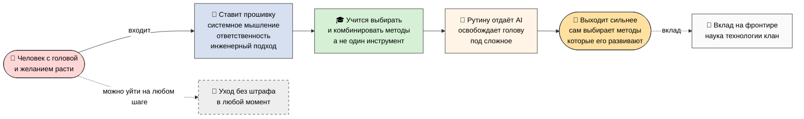
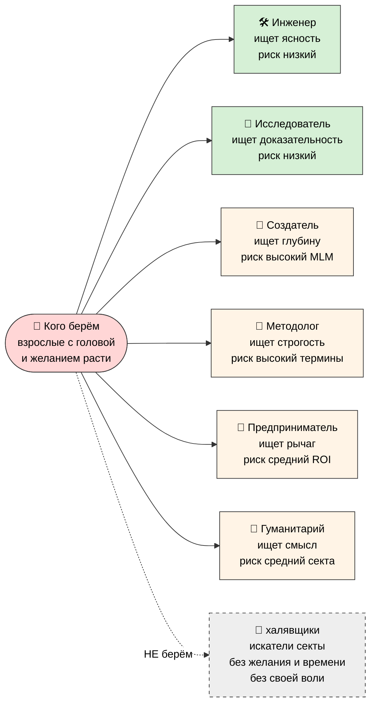
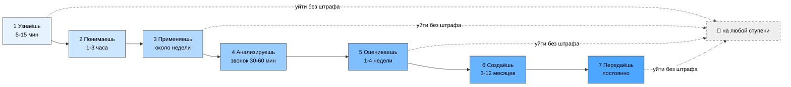
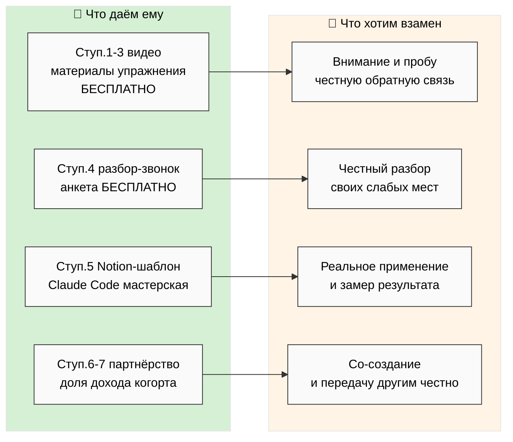
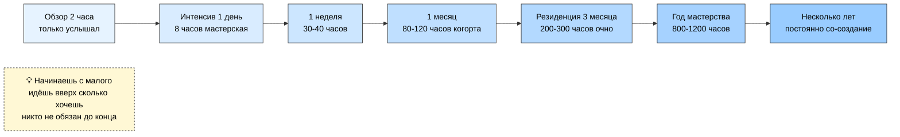

# 📖 Всё в кучу — на человеческом языке

> **Что это.** Один документ, который собирает весь последний ресёрч (образование,
> аудитория, контент, варианты программ, деньги, этапы) в простой человеческий текст.
> Без жаргона. С пятью понятными схемами. Чтобы прочитать, понять всю картину и решить,
> что делаем дальше.
>
> **Это НЕ новый ресёрч и НЕ план «делаем вот так».** Это сборка того, что уже есть.
> Рамку и приоритеты выбираешь ты.

---

## §0 Если есть 60 секунд (TL;DR)

- **Кого берём:** взрослых с головой и желанием расти. 6 типов (инженер, исследователь,
  создатель, методолог, предприниматель, гуманитарий). НЕ берём халявщиков, искателей
  секты и людей без своей воли.
- **Чему учим:** не конкретному инструменту, а **способу думать** — выбирать и
  комбинировать методы под задачу, отдавать рутину AI, спрашивать «зачем» прежде «как».
- **Как ведём:** 7 ступеней от «впервые услышал» (5 минут) до «учит других» (постоянно).
  Уйти можно на любой без штрафа.
- **Деньги:** учиться и пробовать — бесплатно. Деньги только в партнёрстве, и основная
  доля (75-90%) — человеку.
- **Этапы Jetix:** сейчас собираем 5-10 партнёров-основателей → июль MVP → конец 2026
  когорта 50-100 → 2028+ массовая платформа.

---

## §1 🎯 Главная мысль в одной строке

**Появился AI, который делает рутину в сотни раз быстрее человека. Поэтому учиться
по-старому — напихивать в себя знания и функции — больше нет смысла. Имеет смысл
ставить себе «прошивку» (способ думать) и учиться выбирать методы под задачу, а рутину
отдавать AI. Мы учим именно этому и собираем вокруг этого людей, которые хотят стать
сильнее, а не «по-быстрому срубить».**

И отдельно важно: сильный, прокачанный человек **сам выбирает методы, которые его же
развивают** — не самые лёгкие, а самые развивающие. Мы за это, а не за то, чтобы
зачитерить жизнь.

---

## §2 👥 Кого берём

Берём **взрослых людей с головой и желанием расти.** Не элиту, отгородившуюся от мира —
наоборот, AI как раз позволяет подтянуть многих до уровня системного мышления.

Шесть типов (это не жёсткие коробки, человек может быть смесью):

| Тип | Что ищет | Что его бесит | Риск для нас |
|---|---|---|---|
| 🛠️ **Инженер** | ясность, применимость | вода, мотивационная херня | низкий |
| 🔬 **Исследователь** | доказательность, источники | голословность, поверхностность | низкий |
| 🎥 **Создатель / блогер** | глубину, которой делятся | пустые инфоцыганские схемы | высокий (соблазн МЛМ) |
| 📐 **Методолог** | строгость, точные понятия | размытость, неуважение к традиции | высокий (споры о терминах) |
| 💼 **Предприниматель** | рычаг, отдачу | теория без применения | средне-высокий (давление ROI) |
| 🤝 **Гуманитарий** | связь, смысл | сухая техничность | средне-высокий (секта, личные истории) |

**На пальцах:** инженеров и исследователей берём смело. С остальными — берём, но
следим, чтобы не скатиться в МЛМ, секту или «выжимание». На это есть жёсткие правила
(см. §7 про деньги и §9 про то, чего не делаем).

**Кого НЕ берём:** тех, кто «умный на вид + популярный, но без времени и желания»;
любителей халявы и shortcut'ов; искателей секты («хочу принадлежать к крутым» вместо
работы); людей без своей воли (школьники, те, кем легко манипулировать). Последнее —
красная линия: работаем только со взрослыми, которые сами за себя отвечают.

*Детально: `reports/consolidated-human-language-plan-2026-05-24/01-kogo-beryom.md`*

---

## §3 🎓 Чему обучаем

**Главное: мы не учим конкретному инструменту.** Не «как пользоваться Notion» и не
«как строить воронку». Мы учим способу думать и работать, который потом прикладывается
к любому инструменту.

### Что такое «cross-skill» (на пальцах)

- **Навык (skill)** — конкретное умение: как пользоваться молотком, как настроить
  рекламу.
- **Cross-skill** — умение **выбирать правильный инструмент под задачу и комбинировать**
  инструменты между собой.

Аналогия: навык — это «знать молоток». Cross-skill — это «быть мастером, который сам
видит, чем работать». Перед тобой шуруп — ты не лупишь по нему молотком, ты берёшь
отвёртку. Конкретные навыки устаревают и многие из них AI делает за тебя. А умение
выбирать — не устаревает и AI его за тебя не сделает. Это и есть рычаг.

### Семь принципов нашего подхода

1. **Всё = информация + методы её переработки.** Твой день — поток информации + методы
   обработки. Качество жизни = качество методов. *(Пример: 60 сообщений утром — один
   тонет, читая всё; другой сортирует и отвечает на 5.)*

2. **Метод выбора методов = главный рычаг.** Учись не 100 методов по отдельности, а
   выбирать между ними. *(Один прошёл 30 курсов и тупит; другой знает 5, но точно знает
   когда что — и обгоняет.)*

3. **AI = внешний усилитель, а не замена головы.** AI берёт рутину, ты освобождаешь
   голову под сложное. *(50 страниц отчёта: AI делает выжимку за минуту, ты тратишь
   время на решение.)*

4. **Сначала вопрос, потом функция.** Не «учу продажи на всякий случай», а «у меня
   задача X — какой метод её решит». *(Не «выучу весь маркетинг», а «как проверить,
   купят ли продукт».)*

5. **Адекватный интеллект выбирает методы, которые его развивают** — не самые лёгкие,
   а самые развивающие. *(Заработал быстрым методом — не проел, а вложил в рост.)* Это
   анти-читинг: AI не для того, чтобы зачитерить жизнь и деградировать.

6. **Системное мышление + ответственность + инженерный подход = базовая прошивка.** Это
   фундамент, который ставишь себе сам. Без него обучение не работает — копишь факты, но
   не применяешь.

7. **Вклад на фронтире.** Освободил время → вложи туда, где двигается граница: наука,
   технологии, клан, сообщество.

И три принципа поверх, чтобы не сломаться: **знание копится с умножением** (фундамент
важнее количества); **достаточно, а не идеально** (перфекционизм тормозит); **честный
само-аудит регулярно** (без него незаметно скатываешься в удобное и врёшь себе, что
растёшь).

### Что человек умеет в результате

Видеть свой день как переработку информации; выбирать метод под ситуацию; использовать
AI стратегически; спрашивать «зачем» прежде «как»; честно оценивать свой рычаг;
прикладывать системное мышление к любой задаче. Главное — **сам выбирает методы,
делающие его сильнее.**

*Детально: `reports/consolidated-human-language-plan-2026-05-24/02-chemu-obuchaem.md`*

---

## §4 📚 Что даём на каждой ступени

Семь ступеней — лесенка от «впервые услышал» до «учит других». На каждой человек
получает ровно то, что нужно сейчас.

| Ступень | Что это | Время | Что даём |
|---|---|---|---|
| **1 Узнаёшь** | впервые услышал главную мысль | 5-15 мин | видео + 1 страница + приветствие |
| **2 Понимаешь** | переводишь на свой контекст | 1-3 часа | путеводитель + сжатый метод + FAQ |
| **3 Применяешь** | первый реальный опыт | ~неделя | упражнения + пауза-перед-задачей + чек-лист |
| **4 Анализируешь** | видишь свои дыры в методах | звонок 30-60 мин + 2-5 ч | разбор-звонок + анкета + список слабых мест |
| **5 Оцениваешь** | пробуешь по-настоящему | 1-4 недели | Notion-шаблон + Claude Code + замер + мастерская |
| **6 Создаёшь** | со-создаёшь с нами | 3-12 месяцев | соглашение + набор для входа + когорта |
| **7 Передаёшь** | учишь других | постоянно | материалы для распространения + этика |

**Можно остановиться на любой ступени без штрафа.** Хочешь — берёшь только 1-2
(бесплатно) и уходишь. Хочешь — идёшь до 7. Твой выбор на каждом шаге. Ушёл —
сохранил наработанное, забрал свою долю (если был партнёром), без штрафов.

*Детально: `reports/consolidated-human-language-plan-2026-05-24/03-informatsia-poryadok.md`*

---

## §5 🔧 Прошивка (что человек ставит себе сам)

«Прошивка» — это базовые установки, которые человек ставит себе **сам, до изучения
конкретных инструментов.** Как операционная система в телефоне: без неё ни одно
приложение не запустится.

Пять элементов:

1. **Системное мышление** — видеть систему, связи, контекст. Всё со всем связано.
2. **Ответственность** — за свой интеллект, свою жизнь, свои методы выбора.
3. **Инженерный подход** — дисциплина, проверяемость, итерации.
4. **Сначала вопрос** — спрашивать «зачем» прежде «как».
5. **Честность** — аудитить себя без иллюзий.

Без прошивки обучение не работает: человек собирает факты и функции в кучу, но не
применяет. Прошивка превращает кучу знаний в работающую голову.

*Детально: `reports/consolidated-human-language-plan-2026-05-24/04-proshivka-etapy-varianty.md` §1*

---

## §6 📅 Варианты программ (по времени)

У разных людей разное время и готовность. Поэтому лесенка форматов:

| Вариант | Время | Кому |
|---|---|---|
| **Обзор за 2 часа** | 2 ч | только услышал — видео + страница |
| **Интенсив 1 день** | 8 ч | мастерская — база + первое применение |
| **1 неделя** | 30-40 ч | онлайн + 2 живые сессии, полный метод |
| **1 месяц** | 80-120 ч | гибрид + когорта + первая проверка гипотезы |
| **Резиденция 3 месяца** | 200-300 ч | очно, глубокое погружение, мастер-трек |
| **Год мастерства** | 800-1200 ч | резиденции + проекты + соглашение |
| **Несколько лет** | постоянно | со-создание + когорта + путь к мастерству |

**Как читать:** человек обычно начинает с малого и движется вверх ровно настолько,
насколько хочет. Никто не обязан до конца.

---

## §7 💰 Сколько денег / как монетизируем

Главный принцип: **пока человек учится и пробует — бесплатно. Деньги появляются только
когда мы реально вместе зарабатываем как партнёры.**

| Ступень | Деньги |
|---|---|
| 1-2 Узнаёшь / Понимаешь | **бесплатно** — видео, репозиторий, материалы, вики |
| 3 Применяешь | **бесплатно** или донат по желанию |
| 4 Анализируешь | **бесплатно** — разбор-звонок |
| 5 Оцениваешь | пробно / мастерская ≈ **€1500/мес** |
| 6-7 Создаёшь / Передаёшь | **партнёрство: 75-90% тебе, 10-25% Foundation** |

**Партнёрская доля коротко:** из каждого рубля от твоей работы большая часть (75-90%)
идёт тебе напрямую, меньшая — в Foundation на развитие и поддержку всех. Плюс ты
получаешь долю в общем котле через токен — участвуешь и как работник, и как совладелец.

**Жёсткие правила про деньги (на человеческом):**
- Никаких lock-in — уйти можно в любой момент.
- Уходишь — забираешь свою долю (пропорционально вкладу), без штрафов.
- 30 дней на выход при любом изменении правил.
- Потолок неравенства 5:1 (как в кооперативе Mondragón) — никаких «директор в 350 раз
  больше».

Всё это значит одно: **система не может тебя обобрать сверх договорённого и не может
тебя запереть.**

*Детально: `PARTNER-OFFERING-HUMAN-LANG-2026-05-22.md` (75/25, тиры L1-L7) + Economic Model V10 (LOCKED — ссылка)*

---

## §8 🚀 Этапы Jetix системы (2026-2028)

| Когда | Что появляется |
|---|---|
| **Сейчас (май-июнь 2026)** | Есть фундамент — метод, материалы, вики. Собираем 5-10 партнёров-основателей. |
| **Июль 2026** | Запуск MVP-платформы: Notion-шаблоны + настройка Claude Code + вводная мастерская. |
| **Конец 2026** | Распространение шире + подписанная когорта 50-100 человек. |
| **2027** | Масштабирование когорты до 1000-10000. |
| **2028+** | Массовая платформа: 100 тысяч — 1 миллион пользователей. |

**Как читать:** это направление, не обещание. Сейчас главная задача — собрать первых
партнёров-основателей и запустить MVP. Всё остальное — следствие.

---

## §9 🚫 Что мы НЕ делаем

Честно и прямо — границы, которые держим намеренно:

**Кого не берём:** халявщиков, искателей секты, «умных на вид без времени и желания»,
людей без своей воли.

**Чего не делаем в общении и продажах:**
- Не пихаем партнёрство на 1-й ступени (человек только услышал — рано).
- Не превращаем разбор-звонок в продажу (это разбор дыр, а не «купи курс»).
- Не давим на пробном периоде.
- Не торопим вверх по лесенке ради продажи.

**Чего не делаем никогда (анти-паттерны):**
- **МЛМ** — «приведи друга, получи процент с его процента», вербовочные планки,
  статус за привлечение. Делиться — да, втягивать ради процента — нет.
- **Манипуляции** — фейковая срочность, искусственный дефицит, давление, тёмные
  паттерны, авто-продление без согласия.
- **Lock-in** — штрафы за выход, удержание данных, невозможность забрать свою долю.
- **Культ / секта** — спаситель-фигура, ритуалы преданности, «мы против них»,
  проверки жертвенностью, поклонение основателю.

На внутреннем языке это «R12 anti-extraction». На человеческом: **мы предлагаем путь,
но не запираем дверь и не доим людей.**

---

## §10 🎨 Пять схем — понятные с одного взгляда

### HL-1 — Вся картина целиком

### HL-2 — Шесть типов людей, кого берём

### HL-3 — Семь ступеней обучения (с временем)

### HL-4 — Что человек получает и что мы хотим взамен

### HL-5 — Варианты программ (время × кому)

*Схемы отдельно: `reports/consolidated-human-language-plan-2026-05-24/05-mermaid-schemes.md`*

---

## §11 🔗 Cross-refs — глубокие документы (для тех, кто хочет глубже)

> Здесь — куда смотреть за деталями. Сам этот документ их не повторяет, чтобы остаться
> человеческим и читаемым.

| Документ | Зачем |
|---|---|
| `reports/consolidated-human-language-plan-2026-05-24/01-kogo-beryom.md` | Кого берём — детально, 6 типов + анти-таргеты |
| `reports/.../02-chemu-obuchaem.md` | Чему обучаем — 7 принципов с примерами + cross-skill |
| `reports/.../03-informatsia-poryadok.md` | 7 ступеней — что даём на каждой |
| `reports/.../04-proshivka-etapy-varianty.md` | Прошивка + 7 вариантов + деньги + этапы |
| `reports/.../05-mermaid-schemes.md` + `diagrams/_INDEX.md` | 5 схем + каталог |
| `OUTREACH-CONTENT-OUTCOMES-CTAS-2026-05-24.md` | 7+3 принципа + Bloom + 13 CTA + анти-паттерны (источник) |
| `RUSLAN-NOTES-EDUCATION-PARADIGM-2026-05-24.md` | Голос Руслана verbatim + 10 идей O-176..O-185 |
| `RESEARCH-EDUCATION-2026-05-24.md` | Образовательная парадигма детально |
| `LEVENCHUK-MASTER-QUALIFICATION-RESEARCH-2026-05-23.md` | 7 вариантов программ / уровни мастерства / резиденция |
| `PARTNER-OFFERING-HUMAN-LANG-2026-05-22.md` | Деньги, тиры L1-L7, токеномика (на человеческом) |
| `METHOD-LIFE-DEVELOPMENT-V2` / `STRATEGIC-PLAN-NEAR-FUTURE-2026-05-21` / `ECONOMIC-MODEL-TOKENOMICS-2026-05-22` / `AI Market PLAN` | LOCKED-фундамент — только ссылки, не трогаем |

---

## §12 К чему это ведёт (что дальше)

После прочтения ты:
1. Понимаешь всю картину, что есть сейчас (~30-45 минут чтения).
2. Можешь **диктовать правки** до того, как мы что-то запустим.
3. Выбираешь приоритеты: какие варианты программ первыми, кого зовём в первую когорту,
   как формулируем деньги.
4. → Только после этого — реальное исполнение (доки / видео / онбординг).

**Это сборка, не решение.** Решение — за тобой.

---

*Document closure 2026-05-24 evening. Human-language synthesis. Собрано из существующего
ресёрча, без нового. R1 surface only — Руслан читает + выбирает рамку. NO LOCK
modifications. Pool result. Per Ruslan voice ack «собери всё в кучу на человеческом
языке + понятные mermaid + попроще».*
