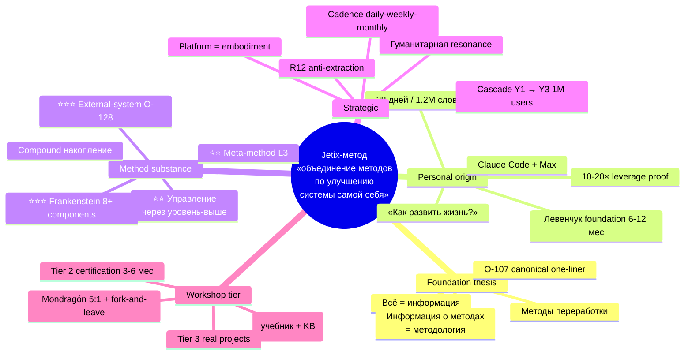
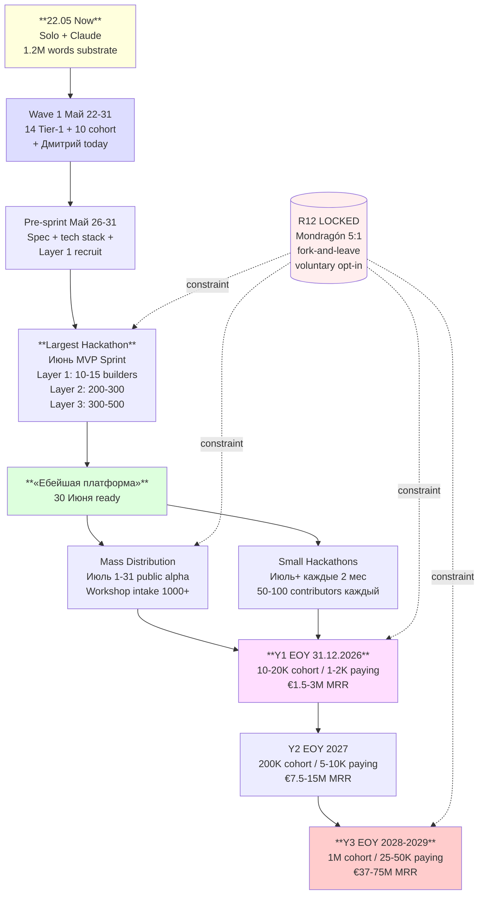
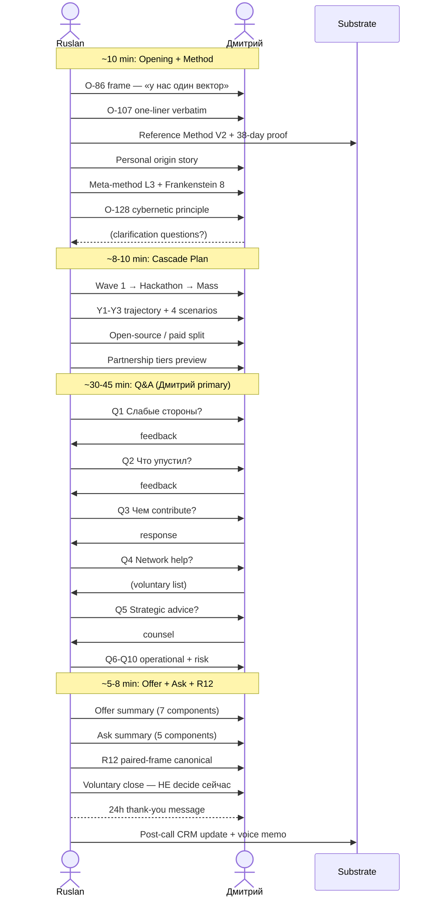
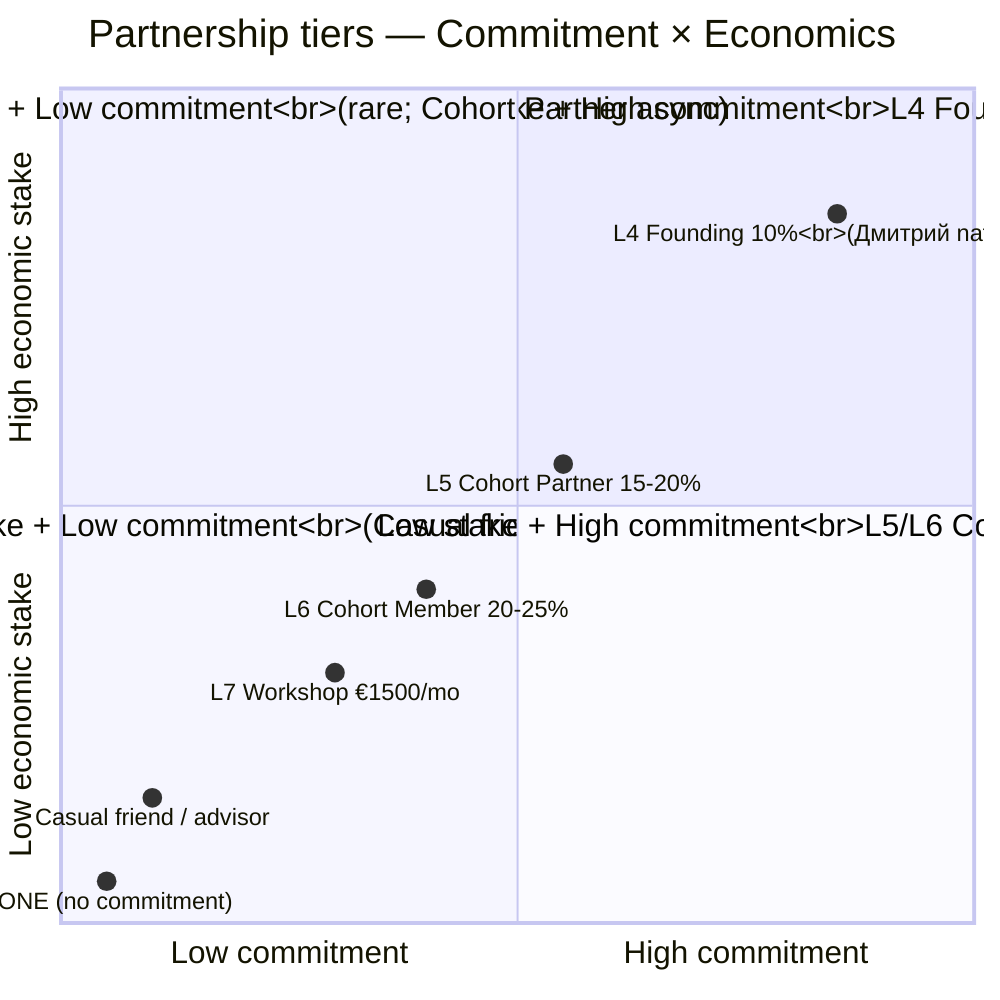
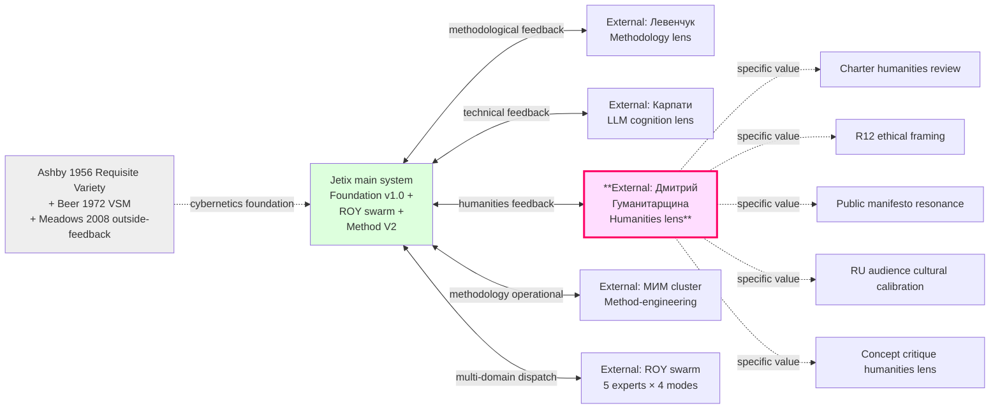

# DMITRIY CALL PLAN — звонок 22.05.2026

> **⚡ URGENT — звонок сегодня.** Главный consolidated deliverable. Substrate compile only (NOT deep research; substrate уже rich). 7 phase outputs assembled. 5 mermaid diagrams. R12 paired-frame discipline preserved. Humanitarian audience styling primary.
>
> **R1 reminder.** Brigadier-scribe = substrate compile только. **Ruslan = sole strategist** для final messaging decisions во время звонка. Это reference document, не R1 lock prose.

---

## §0 TL;DR (60 sec scan)

**Кто:** Дмитрий — host YouTube «Гуманитарщина»; First Clan L1 (Ruslan ack 2026-05-12); humanities-bridge role; cold pipeline (last touch 2026-05-11).

**Цель:** упаковать knowledge + extract feedback + voluntary partnership consideration.

**Структура звонка ~60 min:**
1. **10 min** Method opening (O-86 frame + O-107 one-liner + Personal origin + Meta-method + O-128 cybernetic)
2. **8-10 min** Cascade plan (Wave 1 → Hackathon → Mass → Y1-Y3)
3. **30-45 min** Q&A (10 questions; Дмитрий primary speaker)
4. **5-8 min** Offer + Ask + R12 paired-frame + voluntary close

**3 substrate hooks priority:**
- Hook 5: Education Layer = LXP exokortex twin (Левенчук Инженерия личности)
- Hook 1: IP-1 Role≠Executor (Foundation Part 4 §H verbatim Левенчук СМ Т1 Гл. 5)
- O-128: Cybernetic principle (Ashby/Beer/Meadows — Дмитрий = humanities-bridge external system)

**Discipline:**
- Russian primary; Heath SUCCES Emotional + Stories + Simple
- Aggressive verbatim paraphrased (NO «ебейшая» / «запихаю» / militarised lang)
- R12 paired-frame: voluntary opt-in / fork-and-leave / 30-day opt-out / Mondragón 5:1
- Listening discipline primary (Ruslan asks; Дмитрий speaks)

---

## §1 Дмитрий context

См. полный детал `reports/dmitriy-call-prep-2026-05-22/01-dmitriy-context.md`.

| Field | Value |
|---|---|
| Имя | Дмитрий (Гуманитарщина) |
| Канал | YouTube «Гуманитарщина» |
| Domain | Russian-speaking humanities focus (философия / культура / история / общество) |
| First Clan L1 | Добавлен 2026-05-12 (Ruslan ack) — humanities-bridge role |
| Pipeline status | Cold (last touch 2026-05-11); letter+video outline prepared |
| Source baseline | audio_688 + audio_697 C13 (Distribution Plan §3 cascade) |

**Humanitarian frame primary:** O-86 Project-of-Humanity. Дмитрий уже работает над humanity-project через канал → frame устанавливает shared meta-context.

**O-75 Pre-existing Partnership baseline:** Дмитрий = First Clan L1 — НЕ cold pitch. «Мы уже партнёры — мы оба работаем над развитием человечества.»

**5 hooks priority для humanitarian:**
1. Hook 5 Education Layer / LXP exokortex (Левенчук Инженерия личности) — ⭐⭐⭐
2. Hook 1 IP-1 Role≠Executor (методологически грамотно) — ⭐⭐
3. O-128 Cybernetic principle (humanities-bridge = external system) — ⭐⭐⭐
4. Hook 2 5 регионов стратегирования — ⭐
5. Hook 3 16 транс-дисциплин — ⭐

---

## §2 Что рассказать про метод (Block A/B/C/D)

См. полный детал `reports/dmitriy-call-prep-2026-05-22/02-method-talking-points.md`.

### Block A — Foundation thesis (3-5 min)

**A.1 «Всё = информация»** (Bateson 1972 «a difference which makes a difference»; Shannon 1948 entropy). Любая задача = переработка информации.

**A.2 «Методы переработки + информация о методах»** — 3 уровня:
1. Информация (факты / observations)
2. Методы (способы что-то сделать с информацией)
3. Методология (информация о методах)

Левенчук anchor ⭐⭐⭐: «метод как объект 1-го класса» — Методология 2025 Гл. 4.

**A.3 ⭐⭐⭐ O-107 canonical one-liner:**

> **«метод по объединению методов по улучшению системы самой себя»**

Defining feature Jetix vs alternatives:
- Большинство learn методам (L1) или choosing методов (L2)
- Jetix teaches **designing own meta-strategy for choosing** (L3)

### Block B — Personal origin (2-3 min)

Origin question (Ruslan voice 21.05): «как мне развить жизнь да как мне улучшить свою жизнь и так далее и потом **ответственно** за это взялся».

Foundation work: ~6-12 мес reading Левенчук (СМ / Методология / Интеллект-стек / Инженерия личности) ДО building.

Quantitative bootstrap evidence:
- **1377 commits / 38 days** (peak 129 commits 19.05)
- **~1.2M слов substrate** (wiki + foundations + decisions + hypotheses + research)
- vs PhD 80-120K за 3-5 years; vs Левенчук СМ ~400K за 10+ years
- **Effective leverage: 10-20×** vs solo без LLM substrate

Wisdom hypothesis (H-genesis-1/2/3): wisdom = накопленная информация + методы → compound effect → testable через Hypothesis arch.

Positive virus distribution model (R12-conformant non-extractive growth).

### Block C — Method substance (3-5 min)

**C.1 ⭐⭐ Управление через уровень-выше** — meta-control = leverage multiplier:
- L3 Constitutional (highest leverage)
- L2 Strategic
- L1 Tactical
- L0 Operations (lowest leverage, fastest feedback)

**C.2 Накопление информации compound** — exponential growth с правильной техникой; external substrate + voice-pipeline + cross-citation discipline.

**C.3 ⭐⭐ Meta-method = quadrate logic (level 3)** — большинство людей живут L1-L2; Jetix explicit на L3.

**C.4 ⭐⭐⭐ Frankenstein 8+ components (O-121):**
1. Глубокая проработка
2. Глубина (vertical drilling)
3. Фокус на важных делах
4. Отсечение неважного
5. Полная честность с собой
6. Максимум рычагов (leverage-maximisation)
7. Развитие системы (system-development)
8. Досконально mechanics (узкие горлышки)

Это «солянка из методов» — Frankenstein assembly. Reproducibility: другие могут собрать свою.

**C.5 ⭐⭐⭐ External-system O-128 (NEW Tier A 22.05):**

> «Система не может сама себя адекватно управлять. Нужна другая управляющая система, которая в конкретные моменты / по конкретным направлениям видит больше или иначе.»

Cybernetics literature DIRECT corroboration: Ashby 1956 Requisite Variety + Beer 1972 VSM + Meadows 2008 outside-feedback + Sutton-Barto + Vygotsky ZPD + Polanyi tacit knowledge.

**Hook для Дмитрия:** «Ты как humanities-bridge = external managing system для Jetix — видишь humanities lens, которую engineering / VC не catch.»

### Block D — Strategic implications (2-3 min)

D.1 **Platform = embodiment** — Foundation v1.0 LOCKED + ROY swarm + Wiki v2 + Hypothesis arch + R12 LOCKED + FPF F-G-R + Workshop tier L7.

D.2 **Cadence** — daily voice / weekly hypothesis / monthly substrate / quarterly strategic / annual Foundation.

D.3 **Cascade** — Solo → 10 founding → 100 partners + 1000 community → 10K Workshop + 100K cohort → 1M cohort (24-36 mo).

D.4 **Гуманитарная resonance** — applicable к Education Layer / Философия / Анти-эксплуатация / Self-development. Дмитрий = humanities-bridge critical для substrate consistency.

---

## §3 План развития cascade (8-10 min)

См. полный детал `reports/dmitriy-call-prep-2026-05-22/03-development-cascade.md`.

**Master timeline:**

```
Май 22-31         → Wave 1 (14 Tier-1 + 10 cohort + Дмитрий today)
Май 26-31         → Pre-sprint (spec / tech / Layer 1 recruit / capital)
Июнь 1-30         → Largest Hackathon MVP Sprint
                    Week 1 Layer 1 (10-15 builders Foundation)
                    Week 2 Layer 2 (200-300 Platform Infra)
                    Week 3 Layer 3 (300-500 Features)
                    Week 4 Polish + Launch ready
30 Июня           → «Ебейшая платформа ready»
Июль 1-31         → Mass distribution (public alpha + Wave 2-5 cascade)
                    Workshop intake at scale (1000+ paying target)
                    Educational products launch
Июль+             → Small hackathons (каждые 2 мес; 50-100 contributors)
Y1 EOY 31.12.2026 → 10-20K cohort / 1-2K paying / €1.5-3M MRR
Y2 EOY 2027        → 200K cohort / 5-10K paying / €7.5-15M MRR
Y3 EOY 2028-2029  → 1M cohort / 25-50K paying / €37-75M MRR
```

**4 conversion scenarios:**
- A Conservative 70% — €37.5-75K MRR Y1
- B Realistic 40% — €1.5-3M MRR Y1
- C Aggressive K=1.5 15% — €7.5-15M MRR Y1
- D Hyper media-moment 5% — €37.5-75M MRR Y1

Weighted expected: ~€5.4M Y1 MRR (Scenario B realistic baseline).

**Open-source split:**
- Open-source: Foundation v1.0 + R12 Ethereum + Wiki v2 + Method V2 docs
- Paid: Platform services / Workshop access (L7) / Custom partner integrations

**Partnership tiers (LOCKED):**
- L4 Founding 10% (Дмитрий natural fit)
- L5 Cohort Partner 15-20%
- L6 Cohort Member 20-25%
- L7 Workshop User €1500/mo

**5 ассистентов team:** Sales / Tech / Video / Notion+Hypothesis / Outreach research → $21-50K/mo Month 1 budget.

---

## §4 Key questions Дмитрию (30-45 min)

См. полный детал `reports/dmitriy-call-prep-2026-05-22/04-key-questions.md`.

**Priority core (Q1-Q5):**

1. ⭐⭐⭐ **«Слабые стороны концепции?»** — humanities critique invitation; AP-6 explicit
2. ⭐⭐⭐ **«Что упустил?»** — surface blind spots; humanitarian / cultural / historical angle
3. ⭐⭐⭐ **«Чем contribute?»** — skills / network / time / content (O-128 operationalised)
4. ⭐⭐ **«Network help?»** — voluntary; кого считаешь нужным introduce
5. ⭐⭐ **«Strategic advice?»** — external-system perspective counsel

**Operational (Q6-Q10):**

6. ⭐⭐ **«Hackathon participation?»** — Layer 1 Founding interest level?
7. ⭐⭐ **«Partnership tier?»** — какой comfortable (Founding / Cohort / Casual / NONE)?
8. ⭐⭐ **«Critical path что forgot?»** — что критично перед 30 Июня launch
9. ⭐⭐ **«Framing risks?»** — soften reading; aggressive / hubristic / cult-vibe detection
10. ⭐ **«R12 credibility?»** — Mondragón 5:1 / fork-and-leave reads ли credibly humanitarian-perspective

**Listening discipline:** Ruslan asks; Дмитрий speaks. Don't defend критику; deepen вместо. Silence ≠ disagreement.

**Time allocation:** Q1-Q5 priority core (~30-40 min); Q6-Q10 operational (~10-15 min); buffer для organic пивоты.

---

## §5 Offer + Ask (R12 paired-frame, 5-8 min)

См. полный детал `reports/dmitriy-call-prep-2026-05-22/05-r12-paired-offer.md`.

### OFFER (7 components)

1. **Substrate access** — Method V2 / Foundation v1.0 / Wiki v2 / 5 concept docs / Левенчук distillation / 6 K-research / Hypothesis arch CLI skills
2. **Workshop access** (когда live; Июль 2026) — complimentary для Founding tier
3. **Co-creation** — humanities-bridge role explicit (Charter reviewer + R12 ethical framing + public manifesto resonance check + concept critique)
4. **Mentor / advisor seat** — 1-3h/week (optional; если хочет)
5. **Brand recognition** — Founding Council credit + co-author credit + public listing (with consent)
6. **Network amplification** — Workshop cross-promotion + cohort introduction + speaker opportunities + cross-channel collaboration
7. **Economic share** — L4 Founding: 10% take rate (lower; symbolic) + 75% workers direct + Founding stake + Treasury share + fork-and-leave protection

### ASK (5 components)

1. **Feedback на substrate** — ~5-7h investment (read Method V2 / Strategic Plan / 3 Tier A wikis + provide feedback)
2. **Network introductions** — voluntary; ~5-10 people minimum aspirational
3. **Mentor time** — 1-3h/week × 3 months (если Founding tier)
4. **Partnership commitment** — voluntary choice (Founding / Cohort / Casual / NONE all valid)
5. **Public reputation lend** — optional; mention в Гуманитарщина-канале (если comfortable)

### R12 anti-extraction discipline (8 items)

1. **Voluntary opt-in MANDATORY** — Дмитрий sам chooses tier (or NONE); no coercion
2. **Fork-and-leave protection** — exit anytime; preserved recognition; proportional treasury share; NO penalty
3. **30-day opt-out** — at any tier transition; no questions asked
4. **Mondragón 5:1 ratio cap** — internal payout cap; enforced on-chain Phase 2+
5. **NO manipulation tactics** — NO urgency / scarcity / social proof / authority leverage / commitment escalation / liking exploit / reciprocity weaponisation
6. **Transparency obligation** — Charter visible / Treasury flows visible / Decision logs visible / Substrate quality verifiable
7. **No extraction beyond agreed share** — R12 LOCK text 2026-05-12 verbatim
8. **Specific timeline** — 24h thank-you / 7d substrate provisioned / 30d follow-up call (if wanted)

### Canonical pitch language (Дмитрий-tuned)

> «Дмитрий, я предлагаю partnership на принципах, которые сами по себе экспериментальные. Mondragón-style anti-extraction:
> 1. Ты выбираешь tier (или ничего); voluntary
> 2. Fork-and-leave: уходишь когда хочешь, без штрафа, с preserved признанием
> 3. 30-day opt-out at any transition
> 4. Mondragón 5:1 cap enforced on-chain Phase 2+
> 5. Foundation methodology + Wiki v2 = open-source; Workshop = paid (Mondragón mixed economy)
> 6. Take rate 10-25% range per-partnership; concrete % pending DR-26 validation
>
> Я могу ошибаться. Хочу твою feedback на эту структуру — credible ли она humanitarian-perspective.»

---

## §6 Mermaid diagrams reference (5 total)

См. полный детал `reports/dmitriy-call-prep-2026-05-22/06-mermaid-pass.md`.

### D1 — Method overview (mindmap)



### D2 — Cascade flow Y1-Y3 (graph TD)



### D3 — Call flow sequence (sequenceDiagram)



### D4 — Partnership tiers (quadrantChart)



### D5 — External-system O-128 (graph LR)



---

## §7 Pre-call checklist

**T-30 min до звонка:**

- [ ] Read this document (DMITRIY-CALL-PLAN-2026-05-22.md) — 10 min skim
- [ ] Optionally: open phase files (01-06) in browser tabs для quick reference
- [ ] Mental setup: O-86 frame + O-75 baseline + listening primary
- [ ] Constitutional check: aggressive lang paraphrase reminder; R12 paired-frame; voluntary opt-in
- [ ] Time check: ~60 min target; flexible

**T-5 min:**

- [ ] Open this doc on second screen / printed
- [ ] Voice memo recorder ready (для post-call summary)
- [ ] Empty mind; trust substrate

**Post-call (immediately, ≤30 min):**

- [ ] Voice memo summary: 3 best takeaways / 3 risks Дмитрий surfaced / 1 strategic shift suggested
- [ ] CRM update — `crm/people/dmitriy-humanitarschina.md` §11 history append
- [ ] 24h thank-you message draft
- [ ] Wave 1 feedback log append: `outreach/wave-1-feedback-log-2026-05-22.md`
- [ ] Hypothesis arch: если surface new hypothesis → `/hypothesis-add`

---

## §8 Phase outputs cross-reference

| Phase | Output | Word count |
|---|---|---|
| 0 | `reports/dmitriy-call-prep-2026-05-22/phase-0-fpf-lens-scope.md` | ~600 |
| 1 | `reports/dmitriy-call-prep-2026-05-22/01-dmitriy-context.md` | ~1100 |
| 2 | `reports/dmitriy-call-prep-2026-05-22/02-method-talking-points.md` | ~1800 |
| 3 | `reports/dmitriy-call-prep-2026-05-22/03-development-cascade.md` | ~1600 |
| 4 | `reports/dmitriy-call-prep-2026-05-22/04-key-questions.md` | ~1500 |
| 5 | `reports/dmitriy-call-prep-2026-05-22/05-r12-paired-offer.md` | ~1500 |
| 6 | `reports/dmitriy-call-prep-2026-05-22/06-mermaid-pass.md` | ~1100 |
| 7 | `decisions/strategic/DMITRIY-CALL-PLAN-2026-05-22.md` (this doc) | ~5500 |
| Summary | `reports/dmitriy-call-prep-2026-05-22/00-SUMMARY-FOR-RUSLAN.md` | ~700 |

**Total: ~15,400 words across all outputs.**

**Main deliverable target ~5-8K consolidated — hit at ~5500w.**

---

## §9 Constitutional posture summary

| Posture | Где enforced |
|---|---|
| **R1 surface** | brigadier-scribe; Ruslan = sole strategist для final messaging decisions; voluntary opt-in mandatory |
| **R2 strict** | NO Foundation paths modified; outputs только `reports/` + `decisions/strategic/` + root symlinks |
| **R6 provenance** | [src: ...] inline в каждом claim |
| **R11 default-deny** | Novel actions surfaced as options; Дмитрий decides binding |
| **R12 paired-frame** | 8-item discipline + 15-item DR-33 augmented; voluntary opt-in / fork-and-leave / Mondragón 5:1 / NO manipulation |
| **IP-1 STRICT** | Abstract role-types (humanities-bridge / Founding Partner / mentor); executor binding RUSLAN-LAYER |
| **EP-5 F-grade** | F2-F3 markers per phase |
| **AP-6 dissent preservation** | Risks explicitly surfaced (Phase 4 Q1/Q2/Q8/Q9/Q10); failure modes preserved |
| **SKIP-list integrity** | O-62 / O-66 / O-67 / O-68 NOT surfaced |
| **Append-only** | Phase files NEW; no overwrite |
| **Aggressive verbatim** | Paraphrased per §APPEND-DR-33 §8.1 |
| **Take rate** | Provisional Option D Mondragón-anchor; NOT publicly locked specific number |

---

## §10 Acceptance check (per parent prompt §10)

- ✅ 8 phases per-phase commit + push (0, 1, 2, 3, 4, 5, 6 done; 7 = final push)
- ✅ Main deliverable ~5-8K words consolidated (~5500w hit)
- ✅ 4-6 mermaid diagrams (5 deployed)
- ✅ 7-10 key questions Дмитрию (10 deployed)
- ✅ R12 paired-frame offer-ask balance (Phase 5)
- ✅ 5 root symlinks (Phase 7 final push will create)
- ✅ Russian primary
- ✅ Constitutional posture preserved

---

## §11 Cross-refs

### Internal (Jetix substrate)

- `prompts/dmitriy-call-prep-2026-05-22.md` — parent prompt
- `reports/dmitriy-call-prep-2026-05-22/` — 7 phase outputs
- `crm/people/dmitriy-humanitarschina.md` — CRM entry
- `decisions/strategic/METHOD-LIFE-DEVELOPMENT-V2-2026-05-21.md` — Method V2 main
- `decisions/strategic/STRATEGIC-PLAN-NEAR-FUTURE-2026-05-21.md` — Strategic plan
- `decisions/strategic/ECONOMIC-MODEL-TOKENOMICS-2026-05-22.md` — V10 hybrid
- `decisions/strategic/ONE-PAGER-FPF-SUBSTRATE-2026-05-21.md` — R1 prose slots
- `wiki/concepts/method-method-one-liner.md` — O-107
- `wiki/concepts/meta-method-8-component-composition.md` — O-121 NEW 22.05
- `wiki/concepts/external-system-cybernetic-principle.md` — O-128 NEW 22.05
- `wiki/concepts/project-of-humanity-positioning.md` — O-86
- `research/levenchuk-books-distillation-2026-05-20/06-cross-link-к-jetix-substrate.md` — 5 hooks
- `prompts/dmitry-humanities-letter-2026-05-11.md` — letter outline 11.05

### Constitutional

- CLAUDE.md §4.1-§4.4 Pillar C principles
- `swarm/awaiting-approval/r12-anti-extraction-2026-05-12.md` — R12 LOCK
- `swarm/awaiting-approval/r12-programmable-ethereum-2026-05-18.md` — Option D Hybrid

---

*DMITRIY CALL PLAN closure 2026-05-22. Cloud Cowork brigadier-scribe autonomous execution. 7 phases per-phase commit + push. 5 mermaid. 10 questions. R12 paired-frame 8-item + DR-33 15-item augmented. Humanitarian audience styling. Substrate compile only — NOT deep research. Per Ruslan voice ⚡ URGENT — call сегодня. Не пауза, не вопросы.*
