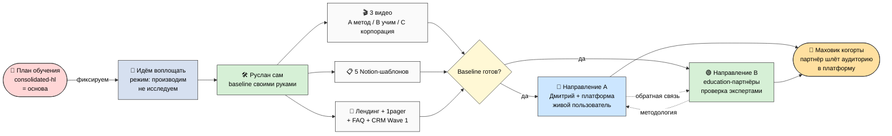
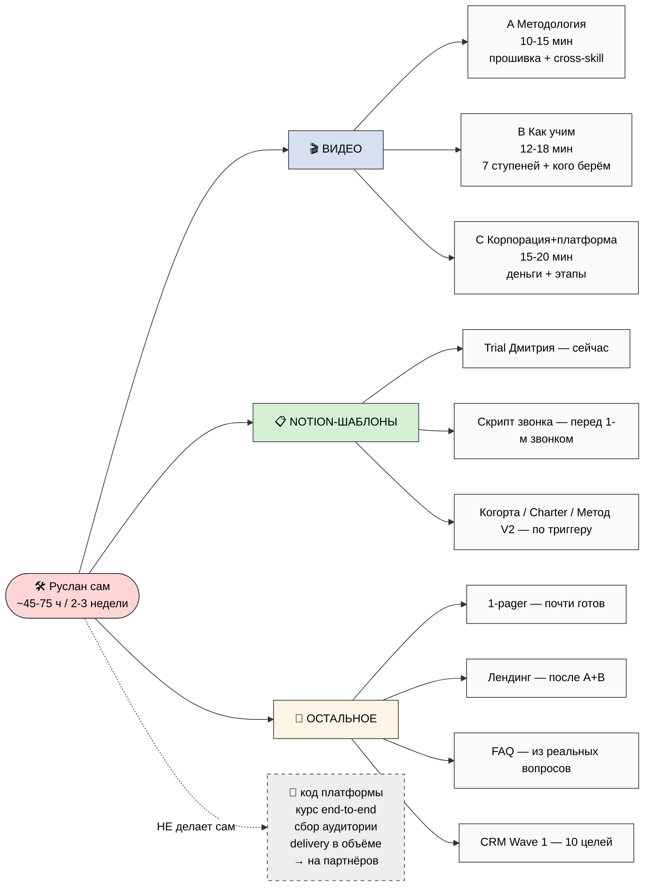
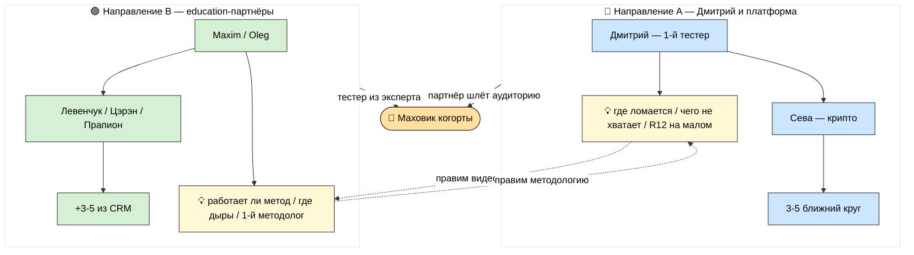
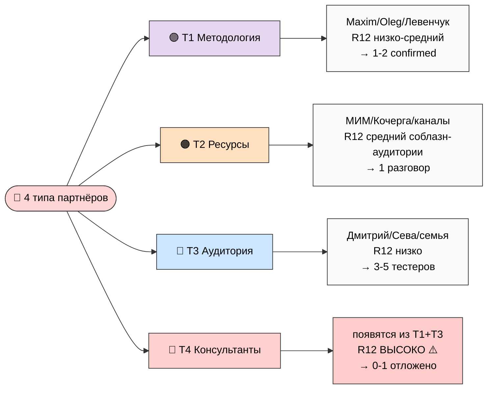
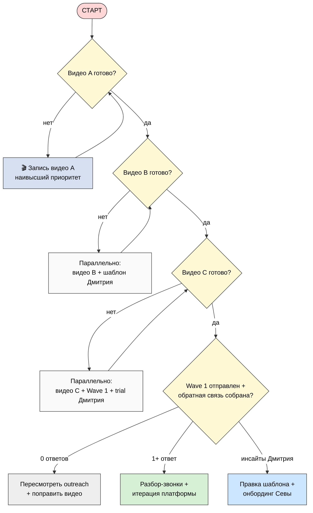
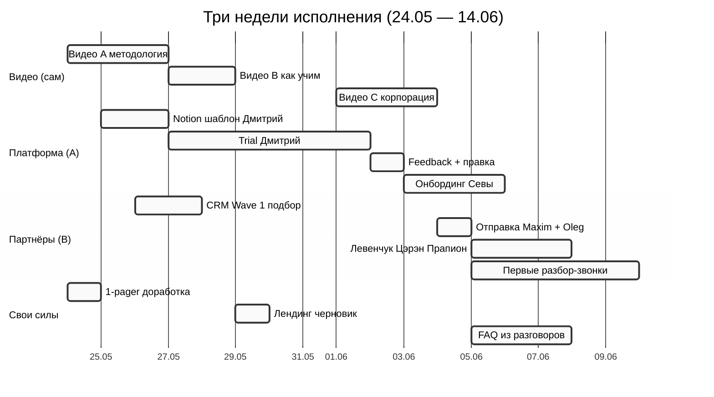

# 🎯 План исполнения — что воплощаем, что делаю сам, что от партнёров

> **Что это.** Один документ, который превращает план обучения (consolidated-hl) из
> «мы поняли картину» в «мы идём это делать». Здесь — что ты делаешь своими руками сейчас,
> два параллельных направления, четыре типа партнёров, порядок работы на 2-3 недели и
> шесть схем. Простым языком, без жаргона.
>
> **Это НЕ новый ресёрч.** Это карта исполнения поверх уже принятого плана обучения.
> Финальные формулировки, список партнёров и порядок видео — за тобой.

---

## §0 Если есть 90 секунд (TL;DR)

- **Что фиксируем:** берём план обучения как основу и **идём воплощать.** Режим
  переключился: с «исследуем» на «производим и раздаём».
- **Что делаю сам:** 3 видео (методология / как учим / корпорация) + 5 Notion-шаблонов +
  лендинг, 1-pager, FAQ, разметка контактов. ~45-75 часов за 2-3 недели.
- **Чего НЕ делаю сам:** код платформы, курс от начала до конца, сбор аудитории,
  консультации в объёме — это на партнёров.
- **2 направления параллельно:** (A) Дмитрий пробует инструмент — живая обратная связь;
  (B) пишу education-партнёрам (Maxim, Oleg, Левенчук…) — проверка методологии экспертами.
- **4 типа партнёров:** методология (создают курс) / ресурсы (аудитория, капитал) /
  аудитория (тестеры, первая когорта) / консультанты (масштаб доставки). У каждого свой
  запрос, своя отдача, свой риск.
- **Узкое горлышко:** всё держится на видео A. Пока его нет — остальное буксует.
- **Главная защита:** перед каждым касанием партнёра — 8 вопросов «не доим / не запираем /
  не манипулируем». Если хоть один не проходит — не отправляем.

---

## §1 🎯 Главная мысль в одной строке

**План обучения у нас есть и он принят. Хватит копать вглубь — пора выносить наружу к
первым людям. Этот документ говорит ровно одно: вот что ты делаешь своими руками, вот что
ждём от партнёров, вот в каком порядке. Берёмся и воплощаем.**

И отдельно важно: воплощаем **аккуратно.** Каждое касание человека — это приглашение, а
не втягивание. Мы предлагаем путь и не запираем дверь. Это держим намеренно с первого дня,
а не «потом наведём порядок».

---

## §2 📍 Что мы фиксируем

**Что фиксируем.** Берём план обучения (consolidated-hl) как основу и фиксируем: **мы идём
это воплощать.** Не «думать дальше», не «ещё поресёрчить» — а записывать материалы,
собирать первых людей, пробовать с реальными людьми. Этот документ — карта исполнения на
следующие 2-4 недели.

**Откуда пришли.** За последний спринт накопилось много: десятки часов работы, четыре
замороженных фундаментальных документа (метод, стратегия, экономика, карта AI-рынка),
больше сотни стратегических документов, 17 агентов-экспертов, 62 вики-страницы, 80+
разобранных книг и — главное на сегодня — consolidated-hl, где весь ресёрч про образование,
аудиторию, деньги и этапы собран в один человеческий текст. То есть **материала достаточно.**
Проблема больше не в знании, а в том, что всё это лежит и не выходит к людям.

**Что меняется.** Сдвиг режима: с «исследуем» на «производим и распространяем». Раньше
каждый цикл добавлял ещё слой понимания. Сейчас — стоп добавлять, начинаем выпускать.
Записать видео. Сделать шаблоны. Дать Дмитрию попробовать. Написать первым партнёрам.
Посмотреть, что отзовётся, и поправить по живой обратной связи — а не по ещё одному кругу
размышлений.

---

## §3 🛠️ Что Руслан делает сам сейчас

Прежде чем звать партнёров — надо своими руками донести идею и суть. Партнёр не
подключится к пустоте: ему нужно увидеть видео, страницу с предложением, рабочий шаблон,
который можно пощупать. Поэтому baseline своими руками = **минимальный комплект, который
не стыдно показать.** Не идеальный — а достаточный, чтобы человек понял суть и сказал «да»
или «нет».

### Три видео

Три видео — три уровня глубины. Содержание ниже — **каркас, не сценарий.** Финальную рамку
и слова выбираешь ты сам.

- **🎬 Видео A — Методология (база, прошивка), ~10-15 мин.** Для незнакомца (ступень 1).
  О чём: что такое cross-skill и чем отличается от обычного навыка (навык — «знать
  молоток»; cross-skill — «быть мастером, который сам видит, чем работать»); 7 принципов
  подхода; пять элементов прошивки (системное мышление, ответственность, инженерный
  подход, «сначала вопрос», честность); адекватный интеллект (выбираешь методы, которые
  тебя развивают, а не самые лёгкие; AI не для того, чтобы зачитерить жизнь). В конце мягко:
  «откликнулось → напиши». Формат: экран + голос + минимальный монтаж.

- **🎬 Видео B — Как мы учим людей, ~12-18 мин.** Для заинтересованного (ступень 1-2). О
  чём: 7 ступеней простым языком (Узнаёшь → … → Передаёшь, уйти можно на любой без штрафа);
  6 типов людей, кого берём + честно кого не берём; 7 вариантов программ по времени; что
  человек получает и что мы хотим взамен. В конце: «давай разбор-звонок» (CTA-05) — это
  диагностика, не продажа.

- **🎬 Видео C — Корпорация + платформа + деньги, ~15-20 мин.** Для того, кто думает о
  серьёзном (потенциальный партнёр L4-L6). О чём: как устроено партнёрство (кооператив,
  75-90% человеку, потолок 5:1, уйти можно с долей); 4 типа партнёров обзором; деньги по
  ступеням (1-4 бесплатно → ступень 5 ≈ €1500/мес → 6-7 партнёрство); этапы системы
  (сейчас 5-10 основателей → июль MVP → конец 2026 когорта 50-100 → 2027 1K-10K → 2028+
  массовая платформа). Опционально — упоминание, что правила «не доим / не запираем» в
  будущем будут зашиты механически (смарт-контракты); включать это сейчас или рано — **твоё
  решение** (см. §9).

- **🎬 (Опционально) Видео D — сводное Welcome, 3-5 мин.** Короткое intro для лендинга.
  Записывается в последнюю очередь, если выяснится, что нужна короткая точка входа.

### Пять Notion-шаблонов

Шаблоны — то, что даёшь человеку пощупать. Порядок привязан к триггерам, не «всё сразу».

| Шаблон | Зачем | Время | Когда |
|---|---|---|---|
| **Trial для Дмитрия** | Первый тестер запускает у себя | 2-4 ч | **Сейчас** — как видео A готово |
| **Скрипт разбор-звонка** | Ступень 4 — диагностика дыр | 2-3 ч | Перед первым звонком |
| **Набор онбординга когорты** | Trial-когорта ступень 5-6 | 4-8 ч | После 2-3 тестеров |
| **Черновик Charter** | Партнёрство L4-L6 | 4-8 ч | Когда появится 1-й кандидат |
| **Метод V2 сжато** | Для самостоятельных (ступень 2) | 8-12 ч | После видео B |

**На пальцах:** не делай все пять сразу. Сделай первый (Дмитрию) и скрипт звонка — этого
хватит, чтобы начать. Остальные — по мере того, как живые люди упираются в реальные
ситуации.

### Что ещё своими силами

Лендинг (черновик, после A+B), 1-pager (почти готов — доработка), FAQ (после первых 3-5
разговоров — собрать **реальные** вопросы, не выдуманные из головы), разметка контактов по
6 архетипам, подбор первых 10 целей Wave 1 из CRM. На всё ~7-12 ч + 3-5 ч на CRM.

### Чего Руслан НЕ делает сам

Это важно так же, как «что делаю» — без него ты утонешь:

- ❌ Платформа на уровне кода → методолог-партнёр, умеющий в код, или консультант (T1/T4).
- ❌ Образовательный курс от начала до конца → методолог-партнёр уровня Maxim/Oleg/Левенчук (T1).
- ❌ Сбор аудитории → партнёр с ресурсом (T2).
- ❌ Консультации в объёме → консультанты (T4).

**Принцип:** твоя зона — суть, каркас, первые касания. Масштаб и специализированный
продакшн — на партнёрах. Иначе ты — узкое горлышко всей системы.

**Бюджет:** ~45-75 ч своими руками = 2-3 недели при ~3-4 ч в день.

---

## §4 🚀 Два параллельных направления

Когда baseline готов — запускаем **два направления одновременно**, не по очереди. Так
больше площадь касания и быстрее учимся с обеих сторон. Они друг друга усиливают: одно
даёт живую обратную связь от пользователя, другое — проверку методологии экспертами.

### 🔵 Направление A — Дмитрий и платформа

Дмитрий — первый тестер (связь с 22.05), из гуманитарного сообщества (то есть проверяем
инструмент на не-инженере — если работает для него, работает для многих). Даём ему
Notion-шаблон + настройку Claude Code + доступ к материалам ступеней 1-2. Разбор-звонок
30-60 мин — не продажа, а диагностика дыр. Trial 1-2 недели → сессия обратной связи →
правим шаблон. Дальше: Сева (крипто-домен, другой взгляд) → 3-5 человек из ближнего круга.

**Что узнаём:** где шаблон ломается на живом пользователе; каких подсказок не хватает; где
затык между «применяешь» и «анализируешь»; работает ли «не доим / не запираем» в реале на
масштабе 1-на-1.

**Время:** ~10-20 ч, 1-2 недели. **R12-риск: низкий** — Дмитрий получает всё бесплатно,
никакого давления, уйдёт — заберёт свои наработки.

**Риски:** только Дмитрий = нельзя обобщать (→ добавляем Севу + ближний круг); обратная
связь искажена личными отношениями (→ добавляем 1-2 незнакомцев из целевой когорты).

### 🟢 Направление B — Education-партнёры

Отправляем видео A+B+C людям, которые **уже делают** курсы и методологию. Цель — не
продать, а проверить подход и, может, найти со-создателя. **Финальный список — за тобой**
(R1); ниже — кандидаты-примеры (это примеры ролей-типов, не назначенные исполнители):

| Кандидат | Кто | Почему |
|---|---|---|
| **Maxim** | джедайские практики | Образец методолога-партнёра — уже делает практики |
| **Oleg** | trouble-shooters | Методология решения проблем |
| **Левенчук** | FPF + МИМ | Канонический источник метода; substrate подготовлен |
| **Цэрэн** | МИМ Managing Partner | 11-летнее партнёрство с Левенчуком; e-government |
| **Прапион Медведева** | Reformer + Кочерга | Критичный мост: applied rationality + R12 (понимает анти-секту) |
| **Ilshat Gabdulin** | AI-агенты | Прямая синергия с роем |
| **Ivan Podobed** | method engineering | Якорь DR-38 |

**Двойной запрос:** (1) «помогите сделать курс правильно» — методологическая обратная
связь, мягкий вход; (2) «помогите развить систему» — партнёрство L4-L6, серьёзный запрос,
только когда человек прогрелся. **Не путать порядок.**

**Что узнаём:** работает ли метод у тех, кто уже делает курсы; где дыры, которых ты не
видишь; первый партнёр-методолог (1-2 из 7-10); усиление охвата через аудиторию партнёра.

**Время:** ~12-30 ч, 2-3 недели. **R12-риск: средний** — здесь взрослые эксперты и есть
соблазн с обеих сторон. Не присваиваем чужой методологический вклад (явные credits); не
запираем; не доим аудиторию партнёра; письма проходят 8 вопросов перед отправкой.

### Как A и B усиливают друг друга

Обратная связь из A → правка видео → обновление в B. Проверка из B → правка шаблона в A.
Перекрёстное опыление: эксперт-методолог из B может стать тестером в A. **Момент первого
слияния** — когда хотя бы один партнёр из B соглашается прислать своих студентов в
платформу A: тогда запускается **маховик когорты.**

### ⚖️ 8 вопросов перед любым касанием партнёра

Перед тем как отправить **любое** письмо партнёру — прогоняем через 8 вопросов. Это
встроенная этическая проверка: на каждый шаг убеждения — встроенная защита.

| # | Вопрос | На человеческом |
|---|---|---|
| 1 | Цена ≤ польза? | Ему это стоит меньше, чем даёт? |
| 2 | Конкретно? | Понятно, что предлагаем? |
| 3 | Соразмерно отношениям? | Не просим много у малознакомого? |
| 4 | По ступени? | Не пихаем партнёрство тому, кто только услышал? |
| 5 | Канал уместен? | Пишем туда, где нормально получить? |
| 6 | Не доим / не запираем? | Нет извлечения сверх договорённого / lock-in / нарушения потолка? |
| 7 | Нет манипуляции? | Нет фейк-срочности / MLM / культа / нарушения порядка ступеней? |
| 8 | Стоп-сигнал готов? | Если что-то нарушено — стоп + лог + сигнал? |

**Если хоть один пункт не проходит — письмо не отправляется, переписывается.**

---

## §5 🤝 Четыре типа партнёров

Партнёрство — это **не один тип отношений, а четыре разные функции.** Главная ошибка —
звать всех «в партнёры» одинаково. Методологу неинтересна доля выручки так, как интересна
возможность со-создать метод. Человеку с аудиторией — наоборот. Поэтому **4 типа — 4
разговора.** Имена ниже — примеры, финальный выбор за тобой.

### 🟣 T1 — Методология

**Хотим:** методический вклад, со-создание курсов, со-дизайн программы, перекрёстную
проверку подхода. **Даём:** признание в substrate (для методолога часто важнее денег);
право со-создания (Charter L5-L6); встречу с другими методологическими школами; доступ к
substrate. **Кандидаты:** Maxim, Oleg, Левенчук, Прапион, Ilshat, Ivan. **CTA:** CTA-05
разбор-звонок → CTA-11 со-создание пилота → CTA-NULL «только обучение» (если методология
подходит, а партнёрство нет — без давления). **R12-риск: низко-средний** (зона внимания —
споры о терминах + соблазн присвоить вклад; лечится явными credits). **Результат: 1-2
подтверждённых за цикл.**

### 🟠 T2 — Ресурсы (аудитория / капитал / каналы)

**Хотим:** доступ к аудитории, каналам, капиталу, площадкам, охвату бренда. **Даём:** долю
выручки L4 Founding; совместный бренд; доступ к substrate для их клиентов; выравнивание
интересов. **Кандидаты:** МИМ как институт (через Цэрэн/Левенчук), Кочерга (через Прапион),
существующие держатели аудитории, дальний выстрел — Karpathy. **CTA:** CTA-09 L5 → CTA-10
L4 Founding. **R12-риск: средний** — главный соблазн «выжать» аудиторию партнёра. **Нельзя:**
каждый человек из его аудитории сам решает, идти ли к нам; никакой автоматической «передачи
базы». Перед предложением T2 — обязательная проверка «делим выручку или выжимаем чужую
базу?». **Результат: 1 начатый разговор** (сделку НЕ дожимаем в этом цикле).

### 🔵 T3 — Аудитория (тестеры / первая когорта)

**Хотим:** обратную связь от реального пользователя, пробное использование, первую когорту
5-10 основателей. **Даём:** бесплатный доступ к ступеням 1-4; пробный доступ к мастерской
(ступень 5, €1500/мес — но первые 5-10 могут получить субсидию / пилотные условия, это
**твоё решение**); участие в trial-когорте; признание «когорта-основатель 2026».
**Кандидаты:** Дмитрий, Сева, семья/близкие, подписчики своих каналов, само-отобравшиеся
кандидаты. **CTA:** CTA-01 бесплатно → CTA-04 комментарий → CTA-05 звонок → CTA-08
trial-когорта. **R12-риск: низко** — всё бесплатно, fork-and-leave на каждом шаге. Тонкая
грань: «когорта-основатель» как признание — хорошо; как «элитарный клуб избранных» — семя
секты. Признание ≠ превосходство. **Результат: 3-5 активных тестеров.**

### 🔴 T4 — Консультанты (масштаб доставки)

**Хотим:** масштаб доставки — проводить консультации с другими, вести сессии мастерской,
менторить когорту. **Даём:** долю выручки L4-L6; обучение + материалы + поддержку;
признание; карьерную траекторию. **Кандидаты:** появятся из T1+T3 (методолог с мощностью
доставки; продвинутый тестер ступени 6-7). **CTA:** CTA-09/CTA-10 + Charter + соглашение
консультанта. **R12-риск: высоко ⚠️** — самый чувствительный тип, слой доставки ближе всего
к соблазнам: извлечение сверх договорённого, нарушение потолка 5:1, динамика культа при
масштабе. Перед любым касанием T4 — обязательная этическая проверка + R12 8-вопросов перед
Charter. **Результат: 0-1 в этом цикле** (появляется на 2-4 недели позже, после T1+T3;
сейчас отложено).

### Сводная таблица

| Тип | Что хотим | Что даём | Примеры | CTA | R12-риск | Результат |
|---|---|---|---|---|---|---|
| **T1 Методология** | Создание курсов | Признание + Charter + substrate | Maxim / Oleg / Левенчук | CTA-05 → 11 | НИЗКО-СРЕДНИЙ | 1-2 confirmed |
| **T2 Ресурсы** | Аудитория / капитал | Charter L4-L5 + бренд | МИМ / Кочерга | CTA-09 → 10 | СРЕДНИЙ | 1 разговор |
| **T3 Аудитория** | Обратная связь | Бесплатно 1-4 + субсидия | Дмитрий / Сева | CTA-01 → 08 | НИЗКО | 3-5 тестеров |
| **T4 Консультанты** | Масштаб доставки | Charter L4-L6 + обучение | из T1+T3 | CTA-09 → 10 | ВЫСОКО ⚠️ | 0-1 отложено |

Типы перетекают друг в друга: T3→T4 (тестер становится консультантом), T1→T4 (методолог
ведёт группы), T1→T2 (методолог с аудиторией). Первый разговор под тип, но дверь открыта.

---

## §6 📅 Порядок: что делаем когда

План без порядка — список желаний. Конкретная последовательность ниже. Один принцип над
всем: **всё держится на видео A.** Пока его нет — остальное буксует.

### Обязательно на этой неделе (24.05 — 31.05)

1. Запись **видео A** (наивысший приоритет — всё ждёт его).
2. Запись **видео B** (после A).
3. **Notion-шаблон для Дмитрия** (можно параллельно).
4. **Разбор-звонок с Дмитрием** + передача шаблона.
5. **CRM Wave 1 — первые 10 целей** (независимо, когда есть силы).
6. **Черновик лендинга** (после A+B).

Пункты 1, 3, 5 можно начинать параллельно — они не зависят друг от друга.

### Обязательно на следующей неделе (1.06 — 7.06)

7. Запись **видео C** (после A+B).
8. **Отправка Maxim / Oleg** (видео A+B+C) — после видео C + CRM.
9. **Сессия обратной связи с Дмитрием #1** + правка (после trial 5-7 дней).
10. **Онбординг Севы** (после правки шаблона).
11. **Отправка Левенчук / Цэрэн / Прапион** — только после реакции Maxim/Oleg.
12. **FAQ — первые 10 вопросов** из реальных разговоров.

### По триггеру (когда случилось событие)

| Если случилось | То делаем |
|---|---|
| 1+ партнёр T1 откликнулся | Разбор-звонок → 8 вопросов → предложение методологического пилота |
| Trial Дмитрия выявил крупный изъян | Правим шаблон (1-2 ч) + перетест перед Севой |
| Видео «выстрелило» | План быстрой реакции + воронка лендинг → звонок |
| Maxim/Oleg отказались | Фиксируем обратную связь + к следующему кандидату; НЕ давим |
| Появились само-отобравшиеся кандидаты 5-10 | Запускаем последовательность trial-когорты L6 |
| Готов механический слой правил (фаза 2+) | Включаем механическую защиту R12 |

### Дерево решений

**Время:** неделя 1 ~25-35 ч, неделя 2 ~20-30 ч, неделя 3 ~15-25 ч — итого ~60-90 ч за 3
недели при ~3-4 ч в день.

---

## §7 ⚠️ Что НЕ делаем (границы намеренно)

- ❌ **Не рассылаем Wave 1 без готовых видео** — outreach без материала сжигает контакты.
- ❌ **Не застреваем в перфекционизме видео C** — потолок 14 дней, «достаточно хорошо» > блеска.
- ❌ **Не обещаем партнёрам золотые горы по ROI** — честные цифры, не завышенные.
- ❌ **Не пропускаем 8 вопросов** перед каждым касанием партнёра — ни разу.
- ❌ **Не ждём «идеального шаблона»** для сессии с Дмитрием — итерируем на черновом.
- ❌ **Не зовём T4 (консультантов) сейчас** — слой доставки рано.
- ❌ **Не дожимаем T2 до сделки** в этом цикле — строим отношения.
- ❌ **Не продаём T3 (тестерам)** — они на бесплатных ступенях.
- ❌ **Не путаем типы** в первом разговоре — методологу не суём долю выручки первым делом.
- ❌ **Не переоткрываем** план обучения и **не трогаем** замороженные документы.

И никогда — те самые анти-паттерны из плана обучения: MLM, манипуляции (фейк-срочность,
дефицит, давление), lock-in, культ. На внутреннем языке «R12 anti-extraction». На
человеческом: **предлагаем путь, но не запираем дверь и не доим людей.**

---

## §8 🎨 Шесть схем

Шесть схем встроены выше по тексту (§2 EX-1, §3 EX-2, §4 EX-3, §5 EX-4, §6 EX-5 + gantt
EX-6). Отдельно — `reports/execution-plan-fixation-2026-05-24/06-mermaid-schemes.md` +
каталог `diagrams/_INDEX.md`:

- **EX-1** — вся картина исполнения (baseline → фиксация → сам → 2 направления → маховик).
- **EX-2** — что Руслан делает сам (3 видео + 5 шаблонов + остальное + чего НЕ делает).
- **EX-3** — два направления и их взаимная подпитка.
- **EX-4** — 4 типа партнёров (хотим × даём × риск × результат).
- **EX-5** — дерево решений (порядок исполнения).
- **EX-6** — таймлайн трёх недель.

---

## §9 ✅ Семь решений, которые за тобой (R1)

Я даю каркас и варианты — выбираешь ты:

1. **Финальные 7-10 целей Wave 1** (из ~12-15 кандидатов) — кого пишем?
2. **Порядок видео** — все 3 строго последовательно или A+B параллельно?
3. **Дмитрий** — видео A первым, Notion-шаблон первым, или оба параллельно?
4. **Maxim vs Oleg** — кому первому (или обоим сразу)?
5. **T4 консультанты** — отложить (по умолчанию) или начать присматривать кандидатов сейчас?
6. **Механический слой правил (смарт-контракты)** — упомянуть в видео C или рано?
7. **Само-отобравшиеся кандидаты когорты** — активно набирать или только органически?

---

## §10 🔗 Cross-refs — глубокие документы (для тех, кто хочет глубже)

> Сам этот документ деталей не повторяет, чтобы остаться человеческим. Куда смотреть:

| Документ | Зачем |
|---|---|
| `reports/execution-plan-fixation-2026-05-24/01-anchor-fixation.md` | Якорь — что фиксируем |
| `reports/.../02-ruslan-solo-work.md` | Что делаю сам — детально (видео + шаблоны) |
| `reports/.../03-two-parallel-directions.md` | 2 направления — детально + R12 |
| `reports/.../04-four-partner-types.md` | 4 типа партнёров — детально + R12 per type |
| `reports/.../05-sequencing-decision-tree.md` | Порядок + дерево решений + зависимости |
| `reports/.../06-mermaid-schemes.md` + `diagrams/_INDEX.md` | 6 схем + каталог |
| `CONSOLIDATED-HUMAN-LANGUAGE-PLAN-2026-05-24.md` | **Baseline** — план обучения (что воплощаем) |
| `OUTREACH-CONTENT-OUTCOMES-CTAS-2026-05-24.md` | 13 CTA + Bloom + анти-паттерны (источник CTA) |
| `POINT-B-FOCUSED-WEEK-1-2026-05-23.md` | 8 шагов Week-1 (источник sequencing) |
| `LEVENCHUK-MASTER-QUALIFICATION-RESEARCH-2026-05-23.md` | МИМ 12 figures + 5 Wave-1 кандидатов + 7 программ |
| `PARTNER-OFFERING-HUMAN-LANG-2026-05-22.md` | Деньги, тиры L1-L7 (стиль-якорь) |
| Method V2 / Strategic Plan / Economic V10 / AI Market PLAN | LOCKED-фундамент — только ссылки, не трогаем |

---

## §11 К чему это ведёт

После прочтения ты:
1. Понимаешь весь план исполнения на 2-4 недели (~30-40 минут).
2. Picks **7 решений** из §9 → порядок финализируется.
3. → Дальше реальное исполнение: запись видео (сам) → создание Notion-шаблонов → trial
   Дмитрия → Wave 1 первые 5-7 писем (Maxim/Oleg/Левенчук/Цэрэн/Прапион) → обработка
   ответов → первый методологический пилот.

**Это карта, не решение.** По ней ты идёшь сам, когда решишь. И идёшь аккуратно — каждое
касание человека через 8 вопросов «не доим / не запираем / не манипулируем».

---

*Document closure 2026-05-24 evening. Execution-plan synthesis в стиле PARTNER-OFFERING-
HUMAN-LANG. Собрано из существующего substrate, без нового ресёрча. R1 surface only —
Руслан picks 7 решений + финальную рамку видео + список партнёров. R12 paired-frame STRICT
(8 вопросов per касание). IP-1 STRICT (имена = примеры, не bindings). NO LOCK modifications.
NO auto-launch — видео не записываются, outreach не отправляется. Pool result. Per Ruslan
voice ack «фиксируем что воплощаем + что делаю сам vs партнёрам + 2 направления + 4 типа
партнёров + mermaid».*
