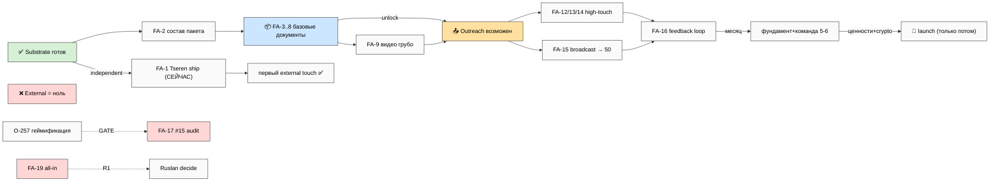

# 🎯 Forward Action Plan — 2026-05-29

> **Что это.** Ответ на голосовую batch-18 (3 заметки 29.05 16:03). Делает три вещи: (1) **вытягивает
> все инсайты** из 3 заметок (O-237..O-263) и показывает что нового они дали к плану; (2) **строит
> forward action sequence** — что РУКАМИ делать дальше, по порядку, unlock-first (FA-1..FA-19);
> (3) **упаковывает структуру базовых документов для партнёров** (сегодняшняя цель). Закрывает explicit
> Ruslan ask: «на основе них нам уже дальнейший план составил действия, и дальше мы уже пойдём всё
> выполнять адекватно».
>
> **R1 surface.** Strategic-prose claims флагнуты R1 для Ruslan-authoring. **R2 STRICT:** Foundation +
> 4 LOCKED не тронуты. **R12 paired-frame SATISFIED** (influence-ethics RECEIVER auto-fired; 2 active
> mitigations). **IP-1 STRICT:** Дмитрий ×2 / Егор / Mastrik = role-type instances. **voice DRAFT-only.**
> **Append-only. Pool result — NO auto-launch.** **Mode: substantive, executable не volume.**

---

## §0 TL;DR (60 секунд)

**Один абзац.** За ночь закрыт ACTION-PLAN-OUTREACH-FOCUS (situation + docs filtered + outreach plan).
batch-18 даёт 6 сдвигов: **3P-призма** (продукты/процессы/проекты — линза для Overview); партнёрский
pitch кристаллизован (что говорить Дмитрию ×2: «вот система, надо построить фундамент, помоги»);
**«50 сообщений до конца недели»** (escalation → решается tiered: 4-6 high-touch + broadcast video/
Mastrik); **all-in / можно не работать** (R1 + sustainability gate); **месяц + команда 5-6 + делегировать
всю рутину**; **геймификация конкретные механики** (кубки/NFT → GATE через #15 audit). **Главный вывод:**
сегодняшняя цель (упаковка базовых документов) = правильный unlock — нельзя идти к 50 людям без пакета.
**Top-3 actions:** (1) **FA-1 Tseren letter send** — готов, independent, ломает external-zero сейчас;
(2) **FA-2→FA-8 упаковать пакет** (5 базовых документов, today's goal, unlock outreach); (3) **FA-9 видео
1-2 «грубо»** → разблокирует broadcast-tier 50-msgs. **Что делаем сегодня:** упаковываем 5 базовых
документов (Overview через 3P / Метод / 16 directions / Ценности+R12 / Как участвовать) + Tseren ship.
**R12 SATISFIED** — 2 active mitigations: O-244 monetization-promise (REFRAME-STRICT: no «миллионер» в
материалах) + O-257 геймификация (GATE #15 audit). **Sustainability:** mandatory сон перед video-day.

---

## §1 Что дали 3 заметки (insights delta)

> Полный список 27 items (O-237..O-263) — `reports/.../01-extracted-items.md`. Voice insights doc —
> `VOICE-BATCH-18-INSIGHTS-2026-05-29.md`. R12 анализ — `reports/.../02-dedup-r12-integrated.md` §2.

Три заметки 16:03 (~13 мин) дали **6 сдвигов** vs вчерашний ACTION-PLAN:

### Сдвиг 1 — 3P-призма (NEW framework) [O-237..O-241]

«**Продукты / процессы / проекты** — призма, через которую можно смотреть на мир и описывать что угодно».
Управление = люди + системы (ответственные) + процессы + технологии. Жизнь каждого = его главный продукт
(+ проект + процессы). Большинство — «жизнь с ними просто случается», управлять не могут; меньшинство —
ставят цели → проектами достигают → хорошие продукты + учатся → self-improving система. Ключ: «ты
управляющий своей жизнью; но другие люди/системы/идеи тоже хотят твоей жизнью управлять» (O-240). →
**3P становится framing-устройством для Jetix Overview** (entry lens — «вот через какую призму смотреть»).

### Сдвиг 2 — партнёрский pitch кристаллизован [O-242..O-249]

Что именно говорить Дмитрию-гуманитарщине + Дмитрий Кайзер (O-249): «вот вся система, что с ней дальше
делается; надо построить хороший фундамент — технические + финансовые + юридические моменты; помоги
проработать как можно быстрее + опиши кто именно нужен». Блогеры/партнёры → их аудитория использует
инструменты (O-242). ⚠️ **R12 caution:** «станешь миллионером, построишь корпорацию» (O-244) =
**REFRAME-STRICT** — wealth-promise чтобы recruit партнёра = extraction-chain risk; в материалах НЕ
используем. «Всемирный проект» (O-246) подаётся humble («я занимаюсь основами, смотрю даже ниже»).

### Сдвиг 3 — 50 сообщений до конца недели [O-251]

Было «4-6 first sends» (вчера O-221) → стало **«минимум 50 сообщений до конца недели»** + записать 1-2
общих видео (не каждому персонально — нет времени) → люди посмотрели → созвон. **Escalation ×8-12.**
→ Решается **tiered**: 4-6 high-touch personalized (Tseren / Дмитрий ×2 / Егор) + broadcast-appropriate
volume (общее видео + Mastrik club post + 5-10 «довольно мощных»). НЕ spray-and-pray 50 одинаковых DM
(R12 + reputational risk). **R1 quality-vs-volume.**

### Сдвиг 4 — all-in / можно не работать [O-255]

NEW personal-financial решение: «можно вообще не работать (job) следующую неделю; Jobcenter/Debon не
смотрим — нет времени; деньги получим от партнёров/помощи; 100% люди найдутся за месяц». Extends hunger
(b17 O-219) + coping-flag (b17 O-236 «уже не помогает»). → **R1 + sustainability gate** (runway-проверка
first; hunger-driven desperation не должна leak в outreach — держать «discovery/feedback» frame).

### Сдвиг 5 — месяц + команда 5-6 + делегировать всю рутину [O-252..O-254, O-260]

«Всю систему можно собрать за месяц — дайте деньги + умного человека который понимает (5-6 команда) +
поиск профессионалов; даже меньше понадобится». «Лучший метод = стратегический; строить стратегическую
компанию из стратегических людей» (O-254). «**Всё что можно рутинизировать или отдать — на хуй всё**»
(O-253) — фиксировать что делегировать. → Refines fundament timeline (b17 1-3wk → месяц с командой) +
Founder-Role delegation.

### Сдвиг 6 — геймификация конкретные механики [O-257]

«Как соцсети/Strava/игры — люди показывают достижения, собирают монетки/кубки → так же в Jetix: лучшие
наработки запихнуты; показывают над чем работали; собирают достижения; получают **реальные кубки + NFT**,
очень охуенно задизайнено». Continuation own-awards (b17 O-228). Counter-signal: «в уважающей друг друга
обстановке» (O-261). → **GATE через V4 #15 Anti-Dark-Patterns audit** перед любым build (R12 MED-HIGH:
status-engagement loop / vanity-metrics / NFT speculation).

**Главный вывод delta:** сегодняшняя цель (упаковка) прямо требуется O-248 «надо доупаковать информацию»
+ O-256 «презентацию делаю». Packaging first, outreach second.

---

## §2 Forward action sequence (executable, ordered, unlock-first)

> Полная версия — `reports/.../03-forward-action-plan.md`. Owner: **R** = Ruslan руками · **CCW** = Cloud
> Cowork (drafts/Notion/упаковка) · **SCC** = Server CC (swarm). Порядок = что ПЕРВЫМ чтобы двигаться.

### STAGE A — Ship что уже готово (сегодня, independent)

| # | Действие | Owner | Time | Разблокирует | Dep |
|---|---|---|---|---|---|
| **FA-1** ⭐ | **Tseren letter polish + send** (draft READY) | R | 1-2h | First external send — ломает external-zero СЕЙЧАС | None |

### STAGE B — Упаковать базовые документы (today's goal; unlock для outreach)

| # | Действие | Owner | Time | Разблокирует | Dep |
|---|---|---|---|---|---|
| **FA-2** ⭐ | Определить состав пакета + reading path (§3 готов) | CCW+R | 1h | FA-3..8 | None |
| **FA-3** ⭐ | Jetix Overview 1-pager — через 3P-призму | CCW→R pass | 2-3h | Pitch frame ✅ | FA-2 |
| **FA-4** | Метод public 1-pager (Method V2 + 3P) | CCW→R pass | 2-3h | Methodology frame | FA-2 |
| **FA-5** | 16 directions карта (из V4) | CCW | 1-2h | Scope frame | FA-2 |
| **FA-6** | Ценности + R12 обещание 1-pager | CCW→R pass | 2-3h | Trust frame ✅ | FA-2 |
| **FA-7** | «Как участвовать» 1-pager | CCW→R pass | 2h | Participation frame | FA-2 |
| **FA-8** ⭐ | Собрать пакет (repo + Notion + reading path) | CCW | 1-2h | **Partner-ready пакет ✅** | FA-3..7 |

### STAGE C — Подготовка outreach-контента (параллельно)

| # | Действие | Owner | Time | Разблокирует | Dep |
|---|---|---|---|---|---|
| **FA-9** ⭐ | Записать 1-2 общих видео «грубо» one-take | R | half-day | Broadcast-tier 50-msgs | FA-3 min / FA-8 ideal |
| **FA-10** | Partner-talk prep (fundament tech/fin/legal + «кто нужен») | CCW+R | 1h | Structured Дмитрий talks | FA-2 |
| **FA-11** | CRM Wave-1 review + Mastrik PM-pool + Егор/Игорь disambig | CCW+R | 1-2h | Outreach list ✅ | None |

### STAGE D — Outreach execution (эта неделя; tiered 50-msgs)

| # | Действие | Owner | Time | Разблокирует | Dep |
|---|---|---|---|---|---|
| **FA-12** ⭐ | High-touch: Дмитрий-humanitarian (пакет+видео+feedback ask) | R | 1h | 2nd external touch | FA-8+FA-9 |
| **FA-13** ⭐ | High-touch: Дмитрий Кайзер (fundament talk + advisor dual-ask, cash-not-equity) | R | 1h | Mentor/advisor surface | FA-8+FA-10 |
| **FA-14** | High-touch: Егор (стратегическое управление) | R | 1h | Strategic advisor surface | FA-8+FA-11 |
| **FA-15** | Broadcast: Mastrik post + видео + 5-10 «мощных» → 50-target | R | 1-2h | Volume tier ✅ | FA-9+FA-11 |
| **FA-16** | Process replies → созвоны | R | ongoing | Feedback loop ✅ | FA-12..15 |

### STAGE E — Gates + background (параллельно, low-intensity)

| # | Действие | Owner | Time | Разблокирует | Dep |
|---|---|---|---|---|---|
| **FA-17** | Anti-Dark-Patterns audit MATERIALIZED (gate геймификации O-257) | SCC swarm | half-day | #15 R12 gate ✅ | None |
| **FA-18** | Delegation map — «что делегировать/отдать» (O-253) + hiring queue | CCW+R | 1h | Founder-time freed | None |
| **FA-19** ⚠️ | All-in / drop-job DECISION + sustainability gate (O-255) — surface, не auto | R (DECISION) | — | Runway clarity | None |

**Critical path:** FA-2 → FA-3 → FA-8 → FA-9 → FA-12/13/14 → FA-16 (~2-3 фактических дня).
**Параллельно:** FA-1 (Tseren independent) · FA-10/FA-11 (prep) · FA-17 (SCC) · FA-18.
**SPOF:** FA-9 видео (fallback: Loom 3-5 мин OR text+пакет). **Sustainability:** 7+h сон перед FA-9.

### Интеграция с сегодняшней целью

- 📦 **PACKAGING (today):** FA-2 → FA-8 (это и есть unlock)
- 📤 **OUTREACH:** FA-1, FA-9..16
- ⚙️ **ОСТАЛЬНОЕ (gates/bg):** FA-17, FA-18, FA-19

### Что НЕ делаем сейчас (defer)

Deep polish документов · 50 персональных one-by-one (tiered вместо) · геймификация build (gate #15) ·
legal entity (post-cashflow) · Левенчук (до Tseren response) · Master Plan 3-4 · найм до cashflow ·
drop-job без runway-проверки (FA-19 = surface не исполнять auto).

---

## §3 Базовые документы для партнёров (структура пакета)

> Полная версия — `reports/.../04-partner-base-documents.md`. Сегодняшняя цель: «вот что строю, вот как
> устроено» — НЕ продажа, НЕ launch. R12 floor: NO superlatives, value-first, humble scale-frame.

### Core 5 (первый показ)

| # | Документ | Что показывает | Формат | Substrate | Writer | Time |
|---|---|---|---|---|---|---|
| **P-1** ⭐ | **Jetix Overview** (через 3P-призму) | «Что это»: мастерская + сеть + метод | 1-pager + Notion | ✅ Workshop + voice-public + 3P | CCW→**R pass** | 2-3h |
| **P-2** | **Метод** | «Как работаем» с инфо/методами/AI | 1-2 pager | ✅ Method V2 (нужна public) | CCW→R pass | 2-3h |
| **P-3** | **16 directions карта** | «Масштаб + структура» | Diagram+page | ✅ V4 | CCW | 1-2h |
| **P-4** | **Ценности + R12 обещание** | «Что гарантирую» (anti-extraction + fork-and-leave + уважение) | 1-pager | ⚠️ нужна упаковка | CCW→**R pass** | 2-3h |
| **P-5** | **Как участвовать** | «Твоя роль» + extension protocol | Page | ⚠️ нужна упаковка | CCW→R pass | 2h |

### Supporting 2 (углубление / partner-talk)

- **P-6 Видео-обзор (1-2 «грубо»)** — async pitch (= FA-9; R face-to-camera; half-day)
- **P-7 Fundament status** — что есть/строим/где нужна помощь tech/fin/legal (= FA-10; CCW+R; 1h)

### Reading path (~15 мин)

```
P-1 Overview (60с «что») → P-2 Метод (5м «как») → P-3 16dir (5м «масштаб»)
→ P-4 Ценности+R12 (3м «доверие») → P-5 Как участвовать (3м «роль»)
  └─ углубление: P-6 видео (10м) / P-7 fundament (talk) → созвон  OR  free goodbye
```

### Где живёт (3 слоя)

repo `partner-package/` (source of truth) + Notion partner-facing collection (view) + external video link.
DRAFT-only до R prose-pass на P-1/P-2/P-4.

### НЕ в пакете (defer)

Геймификация mechanics (gate #15) · financial deep · Master Plan 3-4 · wealth-promise (R12 strict) ·
crypto/Ethereum деталь.

---

## §4 Mermaid suite (FP-1..FP-5)

Полная сюита — `reports/voice-batch-18-forward-plan-2026-05-29/diagrams/`. 5 диаграмм, ≥10 nodes, light
theme. Две ключевые inline ниже.

### FP-1 — Insights map (27 items → 5 кластеров → directions)

```mermaid
%%{init: {'theme':'base','themeVariables':{'primaryTextColor':'#000','textColor':'#000','lineColor':'#333','primaryBorderColor':'#333','primaryColor':'#fafafa','noteBkgColor':'#fff8d5'}}}%%
graph TB
    subgraph T1["T1 — 3P / жизнь-как-продукт (#1)"]
        O237["O-237 ⭐ 3P-призма"]
        O240["O-240 ты управляющий жизнью"]
        O241["O-241 зафиксировать подход"]
    end
    subgraph T2["T2 — Партнёр-amplification (#5/#14) 🔶"]
        O242["O-242 🔶 blogger amplification"]
        O244["O-244 🔶 monetization-promise"]
        O246["O-246 ⭐ всемирный проект"]
    end
    subgraph T3["T3 — Фундамент + упаковка (today)"]
        O247["O-247 ⭐ фундамент-до-запуска"]
        O248["O-248 доупаковать инфо"]
        O249["O-249 ⭐ Дмитрий ×2 talk"]
    end
    subgraph T4["T4 — Execution (R1)"]
        O251["O-251 🔶⭐ 50 msgs EOW"]
        O252["O-252 месяц+команда 5-6"]
        O255["O-255 🔶⭐ all-in drop-job"]
    end
    subgraph T5["T5 — Геймификация (#15/#2) 🔶"]
        O257["O-257 🔶⭐ NFT/кубки"]
        O261["O-261 второй мозг+уважение"]
        O262["O-262 миллиарды отв-но"]
    end
    T1 --> DIR1["#1 Метод"]
    T2 --> DIR5["#5/#14"]
    T3 --> GOAL["🎯 упаковка пакета"]
    T4 --> EXEC["⚙️ execution"]
    T5 --> DIR15["#15/#2"]
    O257 -.GATE.-> AUDIT["#15 audit"]
    O244 -.REFRAME-STRICT.-> R12G["R12 floor"]
    O255 -.R1.-> RUSLAN["Ruslan decide"]
    style T1 fill:#d6f0d6,color:#000
    style T2 fill:#ffd6d6,color:#000
    style T3 fill:#cce6ff,color:#000
    style T4 fill:#ffe0a0,color:#000
    style T5 fill:#ffd6d6,color:#000
    style GOAL fill:#fff8d5,color:#000
```



### FP-5 — What unlocks what (packaging = unlock; Tseren independent)



Остальные: **FP-2** forward action sequence (FA-1..19 + deps) · **FP-3** partner package + reading path ·
**FP-4** Gantt 7 days (29.05→04.06).

---

## §5 R1 decisions surface (≤8, must-ack для unblock)

> R1 surface: рой surface'ит, ты решаешь. Pool result — NO auto-promotion. Минимум decisions для движения.

1. **Tseren ship сегодня (FA-1)?** Independent от пакета; ready draft; ломает external-zero. [Recommend: ship сегодня per «грубо»]
2. **50-msgs target — tiered OR full?** [Recommend: tiered — 4-6 high-touch personalized + broadcast video/Mastrik; НЕ 50 одинаковых DM (R12 + reputation)]
3. **All-in / drop-job (O-255)?** [Surface + sustainability gate — runway-проверка first; держать «discovery» frame, не «спаси деньгами»]
4. **Partner-package scope — 5 core достаточно?** [Recommend: 5 core good-enough один проход; deep polish defer per O-220/O-253]
5. **3P-призма как Overview entry-lens (P-1) OR отдельный Method doc?** [Recommend: entry-lens в P-1 + essence в P-2]
6. **Monetization-promise REFRAME-STRICT** — confirm «миллионер/корпорация» НЕ в материалах (O-244 R12)? [Recommend: confirm — value-first вместо]
7. **Геймификация (O-257)** — materialize #15 Anti-Dark-Patterns audit (FA-17) before any build — ack gate? [Recommend: SCC parallel; mechanics не в пакете до audit]
8. **Дмитрий-Кайзер advisor budget** — €X cash-not-equity для первого engagement (carryover b17 O-218)? [€500-2000/мес range surface]

---

## §6 Cross-refs

| Документ | Зачем |
|---|---|
| `reports/voice-batch-18-forward-plan-2026-05-29/00-SUMMARY-FOR-RUSLAN.md` | ≤1000w human Russian summary |
| `reports/voice-batch-18-forward-plan-2026-05-29/01-04*.md` | phase reports (drill-down) |
| `reports/voice-batch-18-forward-plan-2026-05-29/diagrams/FP-1..FP-5.mmd` | mermaid suite |
| `decisions/strategic/VOICE-BATCH-18-INSIGHTS-2026-05-29.md` | voice insights doc (parallel) |
| `decisions/strategic/ACTION-PLAN-OUTREACH-FOCUS-2026-05-28.md` | KEY predecessor (situation + docs filtered + outreach) |
| `decisions/strategic/STRATEGIC-REPLAN-2026-05-28.md` | Strategic Re-Plan substrate |
| `decisions/strategic/JETIX-METAPLAN-V4-FINAL-2026-05-26.md` | 16 directions canonical |
| `decisions/strategic/JETIX-WORKSHOP-MASTERY-NETWORK-CONCEPT-2026-05-26.md` | Foundation metaphor (P-1 substrate) |
| `decisions/strategic/LETTER-TO-TSEREN-RESPONSE-2026-05-26.md` | FA-1 ready draft |
| `daily-logs/_PLAN-OF-DAY-2026-05-29.md` | сегодняшняя цель (packaging) |
| 4 LOCKED canonical | substrate ONLY (R2 STRICT) |
| `principles/tier-2-system/foundation-generic/` | R1-R12 constitutional |
| `swarm/wiki/operations/mermaid-style-guide-2026-05-07.md` | mermaid style |

---

## §7 К чему ведёт

После push:
1. **Cloud Cowork pull** → surface SUMMARY ≤1000w + top-3 actions.
2. **Ruslan reads** → R1 decisions ack (8 surface).
3. **Top action picked** → idёт ВЫПОЛНЯТЬ: FA-1 Tseren send OR FA-2 начать упаковку пакета OR FA-9 видео.
4. **Forward план** = executable roadmap на ~2-3 дня (packaging → outreach → feedback).
5. **Foundation substrate untouched** (R2 LOCK).
6. **Pool result** — NO auto-launch consequent.

---

*Forward Action Plan closure 2026-05-29. voice-batch-18 (O-237..O-263, 19 NEW + 5 REFINE + 3 CONVERGENT,
6 сдвигов) → forward action sequence (FA-1..FA-19, 5 stages, ordered unlock-first, critical path ~2-3
дня) + partner base documents (5 core P-1..P-5 + 2 supporting + reading path ~15 мин) + 5 mermaid
FP-1..FP-5 + R1 decisions (8 must-ack). Absorbs ACTION-PLAN-OUTREACH-FOCUS + plan-of-day-29.05. Packaging
= primary thread + unlock для outreach; Tseren ship-now independent; 50-msgs → tiered; all-in (FA-19) +
gamification (FA-17 gate) = R1/gate. R1 surface. R2 STRICT (Foundation + 4 LOCKED untouched). R6
per-claim. R11. R12 paired-frame SATISFIED (2 active mitigations: O-244 monetization-promise + O-257
gamification). IP-1 STRICT. Append-only. voice DRAFT-only. Pool result — NO auto-launch. Mode:
substantive не MAX-density. Ruslan reads → R1 ack → top action picked → идёт ВЫПОЛНЯТЬ.*
