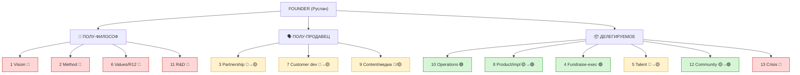
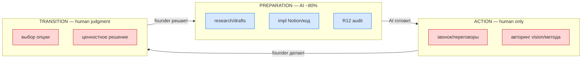
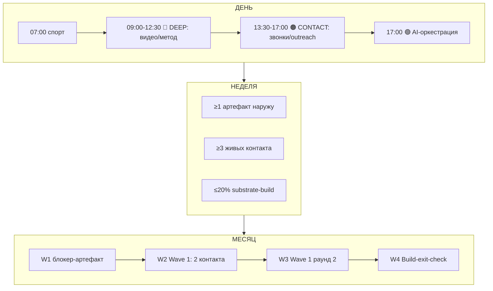
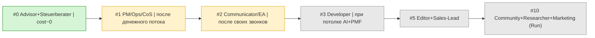
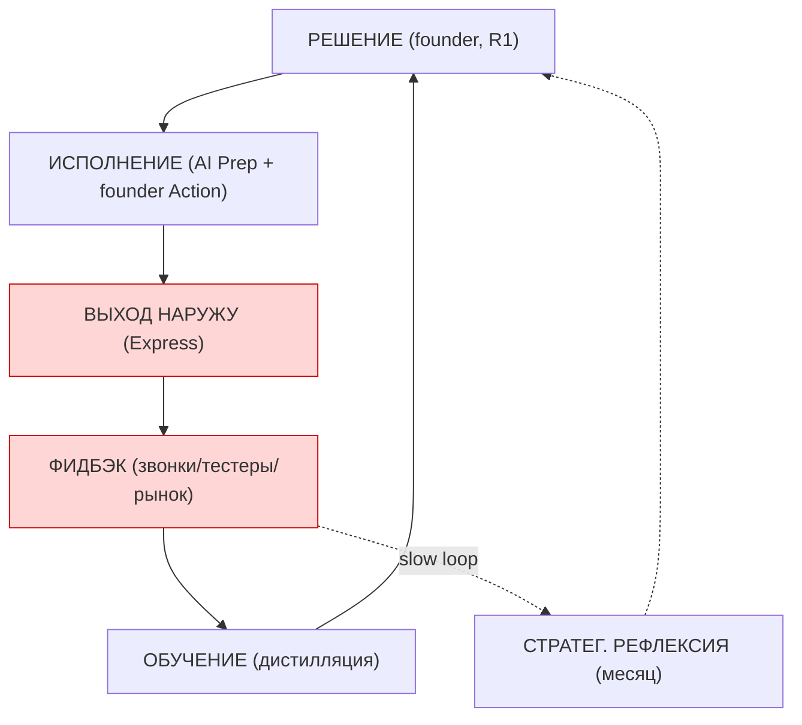
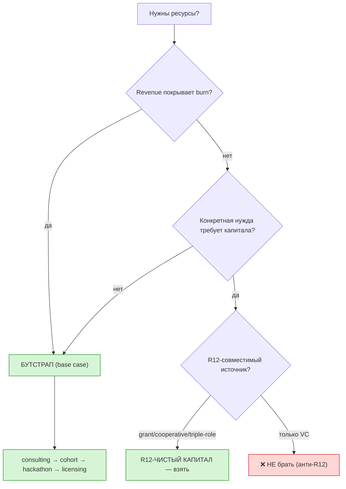
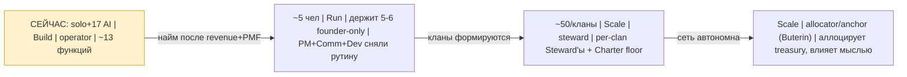

# Founder Role Research — чем заниматься founder'у при 0 человек + кого в первую команду

> **Что это.** Operating manual для тебя на ближайшие 6-12 месяцев (solo-период)
> + blueprint первой команды + паттерн AI-усиления. Ответ на твой голос 27.05:
> «чем мне нужно заниматься в основном… что делать когда 0 человек… кого в
> первую команду брать».
>
> **Статус (конституция).** Это **surface опций (R1)** — я раскладываю варианты,
> функции, паттерны, очередь решений. **Финальный выбор и стратегическую прозу
> авторишь ты.** Никакого авто-найма / авто-fundraise / авто-отправки (R11).
> Разделы про найм и деньги прошли двойную R12-рамку (non-coercive, fork-and-
> leave, Mondragón 5:1). Конкретные люди (Максим/Дмитрий/Левенчук) — примеры
> (IP-1 RUSLAN-LAYER), не Foundation-обязательства.

---

## §0 TL;DR (если читаешь только это)

**Где ты.** Не на старте. В редкой и важной точке: фундамент построен (1 год+,
1509 коммитов, Foundation v1.0 LOCKED, 17 AI-агентов, 16 направлений), но ещё
**не обёрнут наружу и не монетизирован**. Ты сам это зафиксировал тремя
голосовыми батчами подряд (O-160 → O-174 → O-186): **переход из режима
«стройка фундамента» (development) в режим «продвижение» (promotion)**.

**Кто ты в роли.** «Полу-философ, полу-продавец» (твои слова, O-188).
- **Полу-философ** = vision, методология, ценности/R12, новые направления.
- **Полу-продавец** = партнёрства/продажи, customer discovery, медиа/публичность.
- **Всё остальное** (operations, имплементация, fundraising-исполнение,
  community-ops) = делегировать на AI и будущую команду.

**Чем заниматься (одной фразой).** Из 13 функций founder'а держать **5-6
founder-only** (vision / метод / ценности / R&D-направления / discovery / crisis),
а **7 сбросить**. Главное прямо сейчас — **начать выпускать наружу (Express:
Video A, Wave 1) и говорить с людьми**, а НЕ копить субстрат дальше (это твоя
ловушка #1, O-163 accumulation trap).

**Кого в первую команду (очередь усиления).**
0. **Сейчас (не найм):** Advisor (Левенчук-tier, ~0 cost — лечит одиночество +
   челлендж) + Steuerberater (Берлин, юр/налоги — вендор).
1. **#1 PM / Operations / Chief of Staff** — снять рутину (ты сам назвал первым).
2. **#2 Communicator / EA** — усиление по общению (ты назвал; но ПОСЛЕ того, как
   сам провёл достаточно звонков).
3. **#3 Разработчик платформы** — когда упрёшься в потолок AI+ты (production/
   on-chain), не раньше.
4. Дальше: #5 Editor + Sales-Lead → #10 Community/Researcher/Marketing/Finance.

**Критично:** **не нанимать до денежного потока + до PMF** (premature scaling =
#1 убийца ресурсов). Пока соло+AI: burn≈0, runway растягивается, AI несёт ~80%
подготовки во всех функциях за стоимость подписки.

**Как AI помогает.** AI берёт **Preparation (~80%)** в каждой функции; ты держишь
**Action (моменты мастерства: звонок, выступление, авторинг) + Transition
(суждение: что выбрать, когда стоп)**. Граница священна — отдашь AI момент
мастерства = Mastery-эрозия.

**Деньги.** Кооператив структурно несовместим с VC (extraction+lock-in = анти-
R12). Base case = **бутстрап** (низкий burn) + revenue-портфель (consulting →
cohort → hackathon ≤90д → licensing) + точечный R12-чистый капитал (grants/
cooperative/triple-role investor) под конкретные нужды.

**Что делать на след. неделе** → §9. **Решения, которые на тебе (R1)** → §10.

---

## §1 Reference solo founders — что работает (и чему НЕ подражать)

Я просканировал 10 референсов. Не «как они велики», а **что делают / чего НЕ
делают / какую первую команду берут → урок тебе**. Полный разбор —
`reports/.../02-reference-founders.md`. Здесь — суть и 7 кросс-паттернов.

### Кратко по каждому

- **Naval Ravikant** — формула: *specific knowledge × leverage × accountability*.
  4 рычага: labour, capital, **code, media** (последние два — permissionless,
  без разрешения/денег/найма). **Урок:** у тебя specific knowledge уже есть
  (метод), но ты **недоинвестируешь в медиа (Video A простаивает!) и в продукт-
  код, работающий без тебя**. Выжимай permissionless рычаг ПЕРВЫМ.

- **Paul Graham / YC** — три якоря: *Do Things That Don't Scale* (первые 10-100
  контактов руками лично), *Maker's Schedule* (защищай блоки 3-4ч без прерываний),
  *Founder Mode 2024* (не прячься за менеджерами от продукта/клиентов). **Урок:**
  discovery-звонки и онбординг тестеров = ЛИЧНО ты сейчас; защищай maker-блок;
  опасность — сползти в manager-mode (доделывать системы) вместо founder-mode
  (говорить с людьми).

- **Pieter Levels** — 0 сотрудников, ~10 продуктов, $3M+/год; *ship fast, build
  in public, automate everything*. **Урок:** 1 человек + автоматизация + AI тянет
  многое (ты уже близок). НО Levels = self-service продукты, а Jetix = high-touch
  (мастерская/кланы). Урок не «не нанимай», а **«автоматизируй рутину ДО найма,
  чтобы первый человек закрывал high-touch, не то, что закрыл бы скрипт»** +
  build in public (твой медиа-рычаг простаивает).

- **Daniel Vassallo** — портфель маленьких ставок вместо one-big-bet; антихрупко.
  **Урок:** твой «Китай как ресурс / варианты заработка подкидываю» = ровно этот
  паттерн. Founder = куратор портфеля источников. НО под R12: ставки кормят ОДНУ
  миссию (Workshop), не расфокус.

- **Tiago Forte** — Second Brain: CODE (Capture→Organize→Distill→**Express**).
  Знание должно ЗАКАНЧИВАТЬСЯ выходом, не копиться. **Урок (бьёт точно):** Jetix
  = гипер-Second-Brain, но у тебя **Capture/Organize гипертрофированы, Express
  отстаёт**. 1100 заметок, 1509 коммитов — наружу почти ничего. Переход O-160 =
  именно «из Distill в Express».

- **37signals (DHH/Fried)** — calm company, *profit from day one*, маленькая
  async-команда, *say no by default*. **Урок:** foundation-first (не спешить) =
  легитимно (calm). НО profit-from-day-one напоминает: foundation-first ≠
  no-revenue-forever — нужен ранний кэш. И **async/письменная культура** критична
  для тебя как voice-first founder'а (чтобы не стать горлышком на синхронах).

- **Andrew Wilkinson (Tiny)** — founder-аллокатор капитала (Berkshire для
  интернета): не оперирует, ставит операторов. **Урок:** дальний горизонт — куда
  эволюционирует твоя роль (operator → allocator), когда кланы заработают. Не
  сейчас.

- **Andrej Karpathy** — Software 2.0, 1-person company через AI + качество
  мышления + обучающий контент. **Урок:** доказательство тезиса research'а —
  AI-augmented solo делает работу команды. Инвестируй в обучающий контент (твоя
  «полу-философ» часть — Method V2 как педагогика).

- **Vitalik Buterin** — founder-якорь протокола: намеренно децентрализовал власть
  от себя, влияет эссе/мыслью, Foundation координирует (не контролирует), не
  извлекает ренту. **Урок:** это **прямая модель кланов Jetix** («качалка/склад,
  не контролёр», V4 #14). Твой телос (Scale) = Buterin-mode: anchor + Charter
  floor + North Star, кланы автономны.

- **Mondragón (Арисмендиаррьета)** — начал не с компании, а со **школы/метода**
  (1943) → кооперативы выросли из обученных людей. 68 лет, 80K, 5:1 cap, 60/40.
  **Урок:** экономический скелет Jetix (Economic V10 наследует) + главное:
  **начни с метода/ценностей, бизнес вырастет из людей**. Это и есть твой
  foundation-first. Твоя инновация поверх — triple-role partner.

### 7 кросс-паттернов успешных solo/мало-команд

1. **Permissionless leverage первым** (code+media до найма и денег). → ты
   недоинвестируешь в медиа и продукт-без-тебя.
2. **Ручное немасштабируемое лично на старте** (первые контакты руками). →
   discovery + онбординг тестеров = лично ты.
3. **Express > Capture** (знание выходит наружу, не копится). → это и есть O-160.
4. **Найм ПОСЛЕ product/PMF, не вместо** (команда масштабирует работающее). →
   не нанимай, чтобы спрятаться от продвижения.
5. **Маленькая async письменная команда** (качество+дисциплина, не headcount). →
   критично для voice-first founder'а.
6. **Портфель под одной миссией** (диверсификация источников, когерентность
   смысла). → «Китай»-ставки кормят Workshop.
7. **Founder как steward/anchor, не директор** (влияние через метод/ценности). →
   твой телос в R12-кооперативе.

---

## §2 Таксономия роли — 13 функций founder'а

Роль founder = НЕ «делать всё». Роль = **держать то, что нельзя делегировать без
потери/искажения компании, и быстро сбрасывать остальное** (specialization by
subtraction, O-186). Ключевой вопрос к каждой функции: *«если это сделает не
Руслан — компания умрёт/исказится?»* Полный разбор — `reports/.../03-role-
taxonomy.md`.

Три зоны: 🔴 **founder-only** (суть роли) / 🟡 **hybrid** (founder курирует, AI/
человек исполняет) / 🟢 **delegable** (рутина, убрать с founder'а скорее).

| # | Функция | Зона | Делегировать СЕЙЧАС | Кому первым |
|---|---|---|---|---|
| 1 | Vision / Strategy | 🔴 | нет (конституция R1) | — (AI раскладывает опции) |
| 2 | Methodology / IP | 🔴/🟡 | разработку — да | T1 партнёры (AI structures) |
| 3 | Partnership / Sales | 🔴→🟡 | пока нет (сам звони) | Communicator (#2) позже |
| 4 | Resources / Fundraising | 🔴/🟢 | исполнение — да | Steuerberater (сразу) |
| 5 | Talent acquisition | 🔴→🟡 | нет (первые лично) | — |
| 6 | Culture / Values (R12) | 🔴 | enforcement — AI+Прапион | influence-ethics + Прапион |
| 7 | Customer / Cohort dev | 🔴→🟡 | нет (сам слушай) | — |
| 8 | Product / Platform | 🟡→🟢 | имплементацию — AI | разработчик (#3) при потолке |
| 9 | Content / Marketing | 🔴/🟡 | производство — после Video A | editor (#4) |
| 10 | **Operations** | 🟢 | **ДА, первым делом** | **PM/CoS (#1) + Steuerberater** |
| 11 | R&D / новые направления | 🔴/🟡 | углубление — AI | analyst (позже) |
| 12 | Community / Cohort | 🟡→🟢 | N/A (нет сообщества) | community mgr (Run) |
| 13 | Crisis management | 🔴 | нет | advisor совет |

**Свёртка в «полу-философ, полу-продавец»:**
- **ПОЛУ-ФИЛОСОФ** = 1 (Vision) + 2 (Methodology) + 6 (Values/R12) + 11 (R&D) +
  частично 9 (нарратив). = specific knowledge + смысл + метод.
- **ПОЛУ-ПРОДАВЕЦ** = 3 (Partnership) + 7 (Customer dev) + 9 (медиа) + частично 5
  (привлечение людей). = общение + открытие направлений + убеждение.
- **ДЕЛЕГИРУЕМОЕ** = 4-exec + 8-impl + 10-ops + 12-ops + частично 13. Порядок
  сброса: operations (сразу) → product-имплементация (AI сейчас, человек при
  потолке) → sales-исполнение → content-производство.

**Главный вывод:** твоё founder-only ядро = **5-6 функций**. Сейчас ты, вероятно,
тащишь почти все 13 — отсюда ощущение «чем заниматься». Ответ: **сбросить 7,
сфокусироваться на 5-6.**

---

## §3 Solo operating model — что делать СЕЙЧАС (0 hires + 17 ROY + Build середина)

Конкретный manual под текущее состояние. Полностью — `reports/.../04-solo-
operating-model.md` (KEY-файл).

### Главный принцип момента

> **«Хватит строить субстрат. Начни обёртывать его наружу и показывать людям.
> Защити 1-2 блока в день на глубокую работу (метод/видео), остальное — на
> общение и продвижение, рутину сбрось на AI.»**

Это не 100% maker-режим (фундамент построен — O-163 saturation). Это **гибрид
maker (утро) + seller (день)**.

### Time allocation недели (целевая)

| Блок | % | Функции | Режим |
|---|---|---|---|
| Promotion / Express (видео, контент, публичность) | **25%** | 9 | maker, deep |
| Partnership / Sales / Discovery | **25%** | 3, 7 | seller, контакт |
| Methodology / Strategy (дистилляция, не стройка) | **20%** | 1, 2, 11 | maker, deep |
| AI-оркестрация | **15%** | все | hybrid |
| Operations / admin | **10%** | 10, 4 | сбрасывать |
| R&D / новые направления | **5%** | 11 | seller |

**Сдвиг:** раньше ~60-70% на substrate-build → теперь ≤20% (только дистилляция),
высвобождённое → **50% наружу (Express+Contact)**. **Если по факту substrate-
build+ops >30% недели — ты не переключился, ты ещё в development.**

### Дневной ритм (Maker/Seller schedule)

```
07:00–08:30  Спорт, recovery, без экранов
08:30–09:00  Voice-dump (capture) + top-3 дня (НЕ почта/Telegram первым делом)
09:00–12:30  🔵 DEEP BLOCK (maker): видео/контент ИЛИ метод-дистилляция. Защищать жёстко.
12:30–13:30  Обед + прогулка (energy recovery)
13:30–17:00  🟠 CONTACT BLOCK (seller): discovery-звонки, outreach, фидбэк, partner-диалоги
17:00–18:00  🟢 AI-оркестрация: промптинг ROY/Claude, review, /ingest, разбор звонков
18:00–18:30  /close-day, лог, top-3 завтра, git commit
```
Правила: maker утром / contact днём (не наоборот); почту батчить в contact-блок;
ни одна встреча не залезает в 09:00–12:30 (исключения редки).

### Недельные обязательные ритуалы
1. **≥1 артефакт наружу/неделя** (Express-метрика — главный анти-accumulation
   предохранитель). Сейчас = Video A → Video B → лендинг → FAQ.
2. **≥3 живых контакта/неделя** (цель O-160 — ежедневно).
3. **Weekly review** (Пт, шаблон в §3.8 отчёта).
4. **Гигиена субстрата** (/company-status, /lint) — НЕ стройка.

### Месячный ритм (синхрон с Execution Plan)
- W1 главный блокер-артефакт (Video A) + первый тестер.
- W2 следующий артефакт + **Wave 1: 2 контакта** (Максим+Олег, НЕ 7).
- W3 Wave 1 раунд 2 (Левенчук/Цэрэн/Прапион — после реакции) + демо.
- W4 **Build-exit-check (≥80%?)** + месячная стратегическая рефлексия (R1).

### Self-care (энергия = единая точка отказа соло)
Сон №1; спорт утром; **правило 3 дней** (3+ дня интенсива → recovery-день);
energy-matching (deep на пике, admin на спаде); **1 думающий контакт/неделю**
против эхо-камеры.

### Decision velocity (управление R1-очередью, иногда 80+)
Батчить (не решать в потоке); классификация по обратимости (two-way door =
быстро); AI готовит опции, ты выбираешь за минуты; Default-Deny снимает тревогу
за AI-действия; **«не решать/убить» — тоже решение** (не держать петлю открытой).

---

## §4 First team hiring — кого брать (R12 STRICT)

Полностью — `reports/.../05-first-team-hiring.md` (KEY + R12-критичный).

### Главный сдвиг рамки
В Jetix **найм ≠ покупка времени, найм = приглашение в со-собственники**
(triple-role partner: worker + investor + promoter, Economic V10). R12 STRICT:
- **R12-1:** компенсация = согласованная доля (75/25), 5:1 wage cap. Нельзя
  выкачать сверх доли.
- **R12-2:** fork-and-leave — уходит когда хочет, без штрафа, забирая своё
  (никаких vesting cliffs / golden handcuffs / NDA-замков).
- **R12-3:** non-coercive — без манипуляции/давления/асимметрии; прозрачные
  условия ДО подписания.

### First-hire матрица (Criticality × Leverage × Cost × Time-to-impact)

| Роль | Crit | Lev | Cost | ToI | Приоритет |
|---|---|---|---|---|---|
| PM / Ops / Chief of Staff | 4 | 5 | 2 | 5 | **высокий (#1)** |
| Communicator / EA | 3 | 5 | 2 | 4 | **высокий (#2)** |
| Developer / Engineer | 3 | 4 | 4 | 3 | средний (#3) |
| Content / Editor | 2 | 4 | 2 | 3 | средний (#5) |
| Sales / Partnership Lead | 3 | 4 | 3 | 3 | средний (#5) |
| Advisor (informal) | 3 | 4 | **1** | 4 | **высокий ROI (#0)** |
| Co-founder | 5 | 5 | 5 | 5 | **особое решение** |

### Очередь усиления 0→1→2→3→5→10
- **#0 (сейчас, не найм):** Advisor (Левенчук-tier, ~0 cost) + Steuerberater
  (вендор, Берлин).
- **#1 PM / Ops / CoS** — снять operations (🟢 максимально делегируемо; ты назвал
  первым; leverage 5, эффект сразу).
- **#2 Communicator / EA** — усиление общения; **только после того, как сам провёл
  достаточно звонков** (передать скрипт, не «иди продавай непонятно что»).
  ⚠️ R10: «общается за тебя» ≠ выдаёт себя за тебя (disclosure обязателен).
- **#3 Developer** — при упоре в потолок AI+ты (production-платформа, on-chain
  Economic V10), + валидированный спрос. Не раньше.
- **#5 Editor + Sales-Lead** → **#10 Community/Researcher/Marketing/Finance (Run).**

### Компенсация (R12-совместимая)
Три опции (Economic V10): A — кэш/стейбл; B — locked worker-NFT + Mondragón 60/40;
C (default) — микс 40% кэш / 60% locked. Поверх — triple-role. Жёсткие границы:
**5:1 wage cap** (on-chain), **75/25**, **fork-and-leave (RageQuit 90%, 30-дн
notice)**.
⚠️ Предупреждение: пока revenue мал — честнее **микс с реальным кэшем**, а не
чистая доля («equity instead of salary» под давлением = скрытая extraction).

### Sourcing (R12-чисто = alignment > навык)
1. **Wave 1 партнёры / CRM (180 контактов) → команда** (уже alignment).
2. Первые члены когорты → команда (Mondragón-паттерн).
3. Ilshat Gabdulin (AI-агенты) — кандидат на dev-усиление (RUSLAN-LAYER пример).
4. Внешние пулы — последний резерв (риск культурного fit).

### Co-founder vs первый сотрудник (R1, необратимо)
Surface: для foundation-first + «полу-философ» идентичности (где vision/метод =
founder-only ядро) **co-founder скорее НЕ нужен сейчас**. Усиление через partner-
сотрудников (fork-and-leave обратим) + advisors + AI безопаснее. Co-founder —
только если найдётся человек, кто закрывает то, что ты реально не можешь (напр.
сильный operator/CEO-mode) + прошёл долгий alignment + R12 до костей. Иначе
co-founder-развод = #1 убийца (необратимо).

### Onboarding 30/60/90 + cultural fit
День 0: прозрачный Charter (роль/share/exit/R12) — R12-гейт. 30д контекст+
shadowing; 60д владеет функцией (Founder Mode: не микроменеджишь); 90д автономия +
взаимная оценка fit (выход без штрафа, если не работает). Fit-чек: Workshop+
Mastery+Network+R12 на практике + async/письменная дисциплина.

**⚠️ Главное:** **не нанимать раньше денежного потока + до PMF.** Сейчас Build без
revenue — найм #1 разумен после первого устойчивого дохода ИЛИ если partner
входит на долю осознанно (informed). До этого усиление: AI ($0 на Max) +
advisors (бесплатно) + Steuerberater (дёшево, необходимо).

---

## §5 AI-augmentation pattern

Полностью — `reports/.../06-ai-augmentation-pattern.md`.

### Стратификация Preparation / Action / Transition
Любая founder-задача = 3 слоя с разной делегируемостью:
- **Preparation** (сбор, research, drafts, варианты, prep) → 🟢 **AI heavy ~80%**.
- **Action** (момент мастерства: звонок, выступление, авторинг) → 🔴 **human only**.
- **Transition** (суждение: что выбрать, куда дальше, когда стоп) → 🔴 **human**.

**Инсайт:** AI не «заменяет функцию» — AI **снимает Preparation ВНУТРИ каждой
функции**, оставляя тебе Action+Transition. Это и есть «80% AI / 20% ты».

### Инструментарий (сейчас, $0 предельно на Max)
- **17 ROY** — стратегический research-слой («виртуальный совет»); paired-frame
  R12 auto-fire.
- **Claude Code (54+ skills)** — операционный + имплементационный (Notion/скрипты/
  drafts/research). ⚠️ Использовать встроенное, НЕ прямые API-вызовы (реальные
  деньги).
- **voice-pipeline** — capture (диктовка → структура), founder-native.
- Кандидаты-skills: `/founder-week`, `/discovery-prep`, `/express-check`.

### Worked example (Partnership, функция 3)
1. Ты (voice): «готовь контакт с Максимом». 2. AI (Prep): research + draft письма
+ prep-вопросы + 8-вопросный R12-чек. 3. **Ты (Action):** правишь голос, ОТПРАВ-
ЛЯЕШЬ сам (R11), звонишь сам. 4. AI (Prep): разбор записи → CRM → follow-up.
5. **Ты (Transition):** T1 ли партнёр, двигать ли.

### ROI
До найма дорогих людей AI закрывает ~80% Preparation во всех 13 функциях за
стоимость **одной подписки**. Поэтому найм #1 может ждать денежного потока.

### Anti-patterns
Не отдавать AI Action-моменты (Mastery-эрозия); не терять Transition-суждение
(«AI сказал» ≠ решение); hallucination-trap (F-G-R/cross-cite); substrate-
accumulation через AI (служи Express, не вечному capture); AI как эхо-камера
(нужен AI-критик + живой peer); конституция (AI не стратегизирует/не исполняет
архитектуру/не самомодифицируется).

---

## §6 Resources / Fundraising / Capital strategy

Полностью — `reports/.../07-resources-fundraising.md`.

### Развилка: кооператив меняет правила
Традиционный VC требует extraction (LP хотят 10x exit) + lock-in — структурно
несовместимо с R12-1 и fork-and-leave. Значит твоя функция «находить ресурсы/
инвесторов» = **R12-совместимый капитал + revenue-first runway**, НЕ классический
fundraising.

**Иерархия источников (R12-чисто → опасно):**
`revenue > grants/fellowships > cooperative pre-seed / triple-role investor >
friends&family (осторожно) >>> VC (анти-R12, нет)`.

### Первые revenue-потоки (sequencing)
**consulting / quick-money (сейчас, быстрый кэш, P1)** → **cohort €1500/мес
(из тестеров, Q3)** → **hackathon (#16, ≥$30K/событие, ≤90 дней, масштабируемый
revenue-engine)** → IP-licensing (позже). Ты = генератор/куратор revenue-портфеля
(Vassallo), не исполнитель каждого.

### «Китай»-паттерн (founder-сканер рынков-ресурсов)
Формализация твоего «Китай варианты подкидываю»: 1) генерация (ты, Action —
интуиция на возможности); 2) сканирование (AI, Prep — размер/доступность/R12/
unit-econ); 3) фильтр R12+миссия (кормит Workshop или расфокус?); 4) выбор (ты,
Transition). ⚠️ Держи Китай двояко: как **ресурс** (рынок) И как **анти-урок**
(TikTok-addiction = A-3/A-7, чего НЕ копировать).

### Runway
Bridge Y1-4 ≈ €245K, self-sustain ≈ 100 платящих L7 (Y5). Burn сейчас минимален
(0 зарплат) — огромное преимущество. Cost-opt: Max вместо API, self-host (O-194),
кооперативный/grant-капитал. **Главный рычаг runway — не нанимать до денежного
потока.**

### Бутстрап vs fundraise (R1)
**Base case = бутстрап** (низкий burn + foundation-first + R12-несовместимость с
VC). R12-чистый капитал (grant/cooperative/triple-role) — точечно под конкретную
нужду (on-chain аудит $75-150K, платформа, масштабное событие). Не брать VC
«потому что доступно».

---

## §7 Founder pitfalls (специфично под тебя + Build)

Полностью — `reports/.../08-founder-pitfalls.md`. Топ по риску СЕЙЧАС:

| Риск | Ловушка | Главный сигнал | Mitigation |
|---|---|---|---|
| 🔴 #1 | **Substrate-accumulation (O-163)** | 0 артефактов наружу/неделю | Express-метрика; «отправлено > отполировано» |
| 🔴 | **Прятки в maker-режиме** | <3 контактов/неделю | 50% времени наружу; contact-блок в календаре |
| 🔴 | **Premature optimization** | Wave 1 «не готов» | deadline на артефакт; good-enough-for-feedback |
| 🟠 | Decision overload (R1) | очередь растёт | батчить; обратимость; AI готовит опции |
| 🟠 | Burnout | 3+ дня без recovery | правило 3 дней; сон/спорт |
| 🟠 | Loneliness / эхо-камера | никто не челленджит | advisor-челлендж/неделю; AI-критик |
| 🟡 | R12-violation под давлением | мысли об extraction-механиках | 8-вопросный чек; Anti-Dark-Patterns audit |
| 🟡 | Premature scaling | хочется нанять «спрятаться» | найм после revenue+PMF |
| 🟢 | Manager-mode дрейф (позже) | оторвался от клиентов | Founder Mode skip-level |
| 🟢 | Co-founder pitfall | loneliness → спешка | advisor сначала (обратимо) |

**Топ-3 СЕЙЧАС (7.1/7.3/7.2) = всё про ОДНО: не сделать переход O-160.** Это
главная founder-ловушка момента.

---

## §8 Mermaid FR-1..FR-7

> 7 диаграмм, кодирующих модели research'а. Синтез под каждой — в `reports/.../
> 09-mermaid-synthesis.md`.

### FR-1 — Founder: 13 функций по зонам



### FR-2 — AI-делегирование (Preparation/Action/Transition)



### FR-3 — Solo operating model (день/неделя/месяц)



### FR-4 — Очередь усиления команды



### FR-5 — Founder cybernetic cycle



### FR-6 — Resources / fundraising decision tree



### FR-7 — Founder development arc



---

## §9 Что делать на следующей неделе (конкретный actionable)

Привязка к Execution Plan W1-W2 + operating model. Это **surface предложение
(R1)** — ты приоритизируешь.

1. **Express #1 — добить Video A** (главный блокер per voice-batch-14 Note 1).
   Снять грубо, не ждать студийного качества (анти-premature-optimization). AI
   готовит сценарий/структуру; ты — лицо/голос; AI — транскрипт/нарезка.
2. **Контакт — провести 1-2 discovery-звонка** (Дмитрий — тестер; слушать
   фидбэк лично). Цель недели ≥3 контакта.
3. **Defer Wave 1 mass-отправку** до готовности материалов, НО подготовить
   drafts писем Максиму+Олегу (2, не 7) — AI делает research+draft+8-вопросный
   R12-чек; ты правишь и держишь на старте W2.
4. **Steuerberater — начать поиск** (юр/налоги Берлин; снять функцию 10-юр сразу;
   это вендор, не найм — дёшево и нужно).
5. **Advisor — наметить 1 разговор** с Левенчук-tier как informal-челлендж
   (лечит loneliness + peer-челлендж; ~0 cost).
6. **Режим-дисциплина:** maker-блок утром защищён; ≥1 contact-блок/день; в
   пятницу — weekly review по шаблону (§3.8 отчёта). Метрика недели: артефактов
   наружу ___ / контактов ___ / % на substrate-build ___ (цель ≤20%).
7. **R1-разгрузка:** один слот «разгрести очередь решений» — обратимые решить
   быстро, необратимые в стратегический слот, устаревшие убить.

---

## §10 R1 decisions queue (на тебя — surface, я не решаю)

> Это решения, которые конституционально твои (R1). Я раскладываю, ты выбираешь.

1. **[Режим]** Подтверждаешь ли переход O-160 как операционную истину — т.е.
   ≤20% времени на substrate-build с этой недели? (главное решение research'а)
2. **[Команда #1]** PM/Ops/CoS — нанимать после первого денежного потока, или
   раньше из сети на partner-share? Что для тебя триггер «пора»?
3. **[Команда #2]** Communicator/EA — согласен, что только ПОСЛЕ N собственных
   discovery-звонков? Какое N (сколько звонков сам, прежде чем передать)?
4. **[Команда #3]** Разработчик — какой конкретный продуктовый потолок = триггер
   найма (production web / on-chain Economic V10 / непрерывная поддержка)?
5. **[Co-founder]** Рассматриваешь ли co-founder вообще, или усиление через
   partner-сотрудников+advisors+AI? (необратимое решение — §4.6)
6. **[Advisor]** Кого из Wave 1 (Левенчук/Цэрэн/Прапион/Karpathy-tier) звать как
   informal advisor для регулярного челленджа?
7. **[Компенсация]** Дефолт компенсации первых партнёров — Option C (40/60 микс)
   или больше кэша на старте, пока revenue мал? (R12: избегать скрытой extraction)
8. **[Деньги]** Подтверждаешь бутстрап как base case? Какие конкретные нужды
   оправдают R12-чистый капитал (on-chain аудит / платформа / событие)?
9. **[Revenue]** Какой первый поток запускать активно — consulting (быстрый кэш)
   сейчас, или сразу готовить hackathon (≤90 дней)?
10. **[«Китай»]** Формализовать founder-сканер рынков-ресурсов как регулярный
    ритуал (генерация→AI-скан→R12-фильтр→выбор)? Какие рынки в очереди кроме Китая?
11. **[Skills]** Создавать ли founder-workflow skills (`/founder-week`,
    `/discovery-prep`, `/express-check`) — отдельный мелкий cycle?
12. **[Express-метрика]** Принимаешь «≥1 артефакт наружу/неделя» как жёсткий KPI
    себе на solo-период?
13. **[Build-exit]** Какой чеклист = «Build на ≥80%, пора в Run» (Video A+B +
    Notion OS + Charter v1 + 1-2 T1 + 3-5 T3)? Зафиксировать порог?
14. **[Security-pillar]** O-194 own-infra (свои серверы/агенты) — влияет на dev-
    найм #3 (нужен infra-навык)? Учитывать при выборе разработчика?
15. **[Рефлексия]** Месячная стратегическая рефлексия (Part 9) — ставим в
    календарь как обязательный ритуал founder-only?

---

## §11 Cross-refs

**Phase-отчёты:** `reports/founder-role-research-2026-05-27/01..09` +
`00-SUMMARY-FOR-RUSLAN.md` + `diagrams/_INDEX.md`.

**Субстрат (прочитано):**
- `wiki/concepts/founder-role-specialization.md` (O-186/188/190 — «полу-философ
  полу-продавец», foundation-first)
- `wiki/concepts/development-promotion-mode-transition.md` (O-160)
- `decisions/strategic/VOICE-BATCH-14-INSIGHTS-2026-05-27.md` (Note 1: 2-day sprint)
- `decisions/RUSLAN-ACK-VOICE-BATCH-14-2026-05-27.md`
- `decisions/strategic/JETIX-METAPLAN-V4-FINAL-2026-05-26.md` (16 направлений)
- `decisions/strategic/PLATFORM-LIFECYCLE-STAGES-PLAN-2026-05-25.md` (Build, actor matrix)
- `decisions/strategic/EXECUTION-PLAN-FIXATION-2026-05-24.md` (4 типа партнёров, Wave 1)
- `decisions/strategic/ECONOMIC-MODEL-TOKENOMICS-2026-05-22.md` (Economic V10, 5:1, triple-role)
- `decisions/JETIX-WORKSHOP-CONCEPT-2026-04-30.md` (Workshop+Mastery+Network)
- `swarm/awaiting-approval/r12-anti-extraction-2026-05-12.md` (R12 constitutional)

**Reference founders (F2 general knowledge):** Naval / Paul Graham (YC) / Pieter
Levels / Daniel Vassallo / Tiago Forte / 37signals (DHH/Fried) / Andrew Wilkinson
(Tiny) / Andrej Karpathy / Vitalik Buterin / Mondragón.

---

> **Финальная рамка (конституция).** Это draft + surface (R1). Стратегическую
> прозу (что из этого = твоя зафиксированная стратегия) авторишь ты. Найм/
> fundraise/отправка наружу — твоё действие (R11). R12-разделы прошли paired-
> frame. Pool result — никаких авто-запусков следствий.
