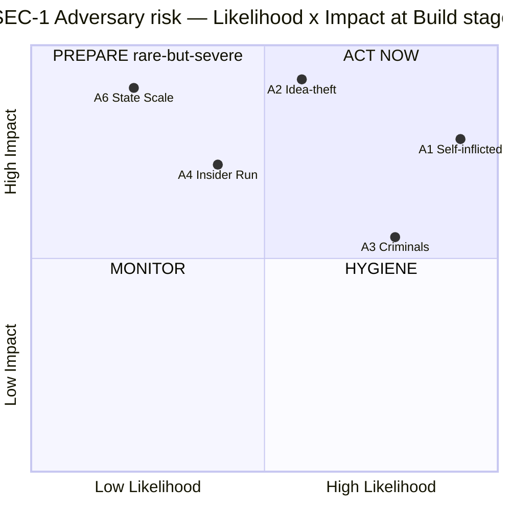
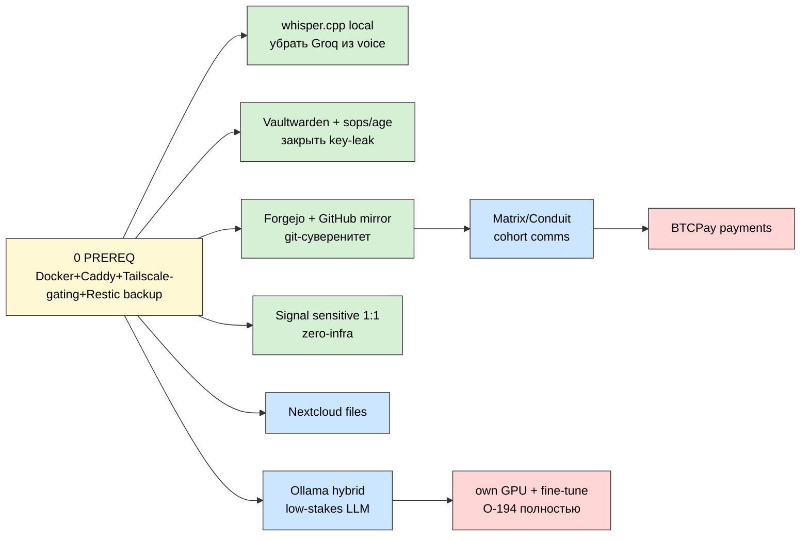
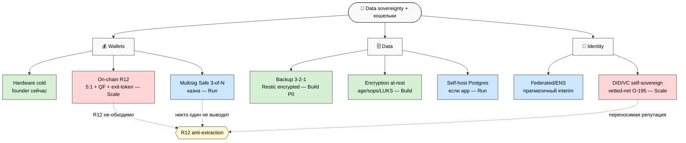
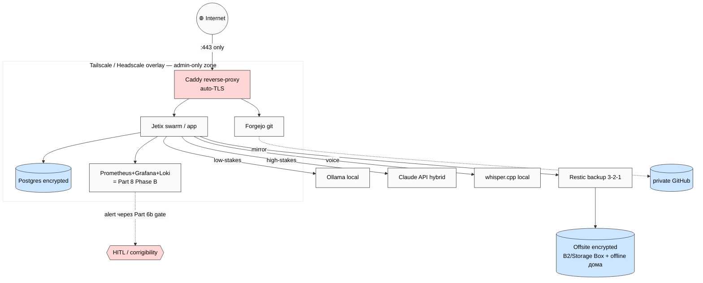
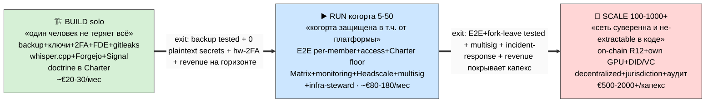
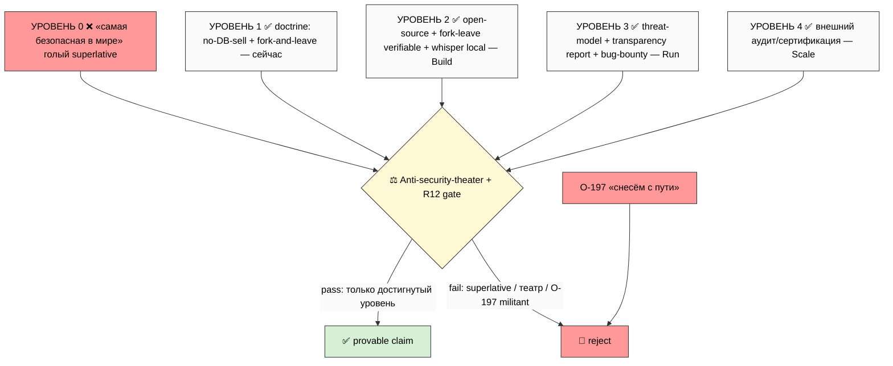

# 🔐 Info-Security + Own-Infrastructure Research

> **Что это.** Deep research substrate под голосовую заметку Руслана 27.05 (batch-14, O-192..195):
> «Jetix = самая безопасная сеть в мире / конфиденциальность / без продажи баз / путь к своей
> инфраструктуре (серверы / агенты / вычисление)». Документ отвечает на 4 вопроса: **(1)** от
> чего реально защищаемся (threat models), **(2)** чем заменить внешние сервисы (self-hosted),
> **(3)** как устроить свою инфру/кошельки/данные, **(4)** как это маркетировать честно (R12).
>
> **Как читать.** TL;DR — §0 (5 мин). Быстрее — `reports/.../00-SUMMARY-FOR-RUSLAN.md` (≤800 слов).
> Глубже — 7 phase-report + 6 схем SEC-1..SEC-6. Самое практичное — **§9 семь honest-выводов** +
> **§10 R1-decisions queue**.
>
> **R1 surface.** Всё — surface/draft. Стратегические формулировки + direction-status #17 +
> темп стадий = **решение Руслана** (sole strategist). Ничего не auto-promoted. **R2 STRICT:**
> Foundation (Parts 1-11), 4 LOCKED, principles/, schemas/ — НЕ тронуты, только читаются.
> **R12 paired-frame STRICT** на §8 (security-маркетинг). **IP-1:** роли = role-types.
> **Pool result — NO auto-launch.**

---

## §0 TL;DR (5 минут)

**Один факт.** Безопасность Jetix сегодня держится не на том, что звучит страшно (хакеры, государства), а на скучных дырах: **нет offsite-бэкапа единственного VPS, ключи в plaintext-риске, вся стратегия открытым текстом, голос уходит в Groq API**. Это и есть #1-#2 угрозы (self-inflicted Risk 20, idea-theft Risk 15). Их закрытие стоит **~€20-30/мес и несколько дней** — и НЕ конфликтует с foundation-first.

**Пять вещей, которые стоит знать:**

1. **Jetix уже суверенен сильнее, чем кажется.** Filesystem = source of truth, git = authoritative, CRM = markdown, Notion = всего лишь *view*. «Self-hosting» = не болезненная миграция, а две узкие задачи: сократить утечки в внешние API + убрать single-points-of-dependency.

2. **Уникальный R12-узел — платформа как противник (A5).** Обещание O-193 «не использовать против людей» означает: безопасность участника = **в том числе от самого Jetix**. Это не паранойя — это техническая суть «самой безопасной сети». «Качалка/склад, не контролёр» (metaplan §4) на security-языке = платформа держит минимум данных участника в plaintext и минимум может с ними сделать против его воли.

3. **Два слоя нельзя смешивать.** *Doctrine-слой* (O-193: «не продаём базы / fork-and-leave») — дёшево, в Charter, **сейчас**. *Infra-слой* (O-194: «свои серверы / агенты / вычисление») — дорого, **Scale-горизонт**, не обещать как готовое (Q14-2 pre-revenue tension).

4. **Крипто/кошельки = технический энфорсмент R12**, не крипто ради крипто. Multisig (никто один не выводит) + fork-and-leave exit-token (anti-lock-in в коде) + Mondragón 5:1 on-chain = делают anti-extraction **не-обходимым**, а не обещанным. Но казны на Phase A нет → это Run/Scale.

5. **«Самая безопасная» — это траектория, не факт.** Заявить superlative сегодня = security theater + R12-нарушение (over-promise = extraction-of-trust). Маркетируем provable-now + roadmap. O-197 «перелопатим, снесём с пути» = **HARD REJECT** (defensive щит, не offensive меч).

**Что разблокирует.** §10 — 11 R1-решений (от «approve дешёвый Build-спринт» до «direction-status #17»).

---

## §1 Контекст и voice anchor

### §1.1 Источник задачи (F2 verbatim)

> «К документам добавить, что Jetix будет работать на собственной сети безопасности, самую безопасную в мире делать… по конфиденциальности информации — самую защищённую, без продаж каких-то баз данных… компании с уважением к информации, не продавать, не использовать против людей… в планах — собственные серверы, своих агентов тренировать, собственное вычисление… либо собственное иметь, либо партнёриться… чтобы данные могли адекватно передвигаться, с проверенными бизнесами сотрудничать, и были защищены против атак и обесценивания информации.»
> [src:VOICE-BATCH-14-INSIGHTS-2026-05-27.md §1 Note 2; audio_2026-05-27_01-55-37]

### §1.2 Извлечение последних заметок (last notes — cross-batch генезис)

Six идей из batch-14 Note 2 + их происхождение:

| ID | Тезис | Слой | R12 | Новизна |
|---|---|---|---|---|
| O-192 | Security-network «самая безопасная в мире» | positioning | — | **новое** |
| O-193 | No-DB-selling, «не против людей» | doctrine | ✅ R12-positive | **новое** |
| O-194 | Infra-sovereignty (серверы/агенты/вычисление) | infra | ⚠️ pre-revenue cost | **новое** |
| O-195 | Vetted-network data mobility | network | — | **новое** |
| O-196 | Aggregation-strength «в кучу → мощнее» | community | ⚠️ | эскалация O-172 |
| O-197 | Family-cohort + «снесём с пути» | recruitment | ⚠️ **CRITICAL POOL-LOCKED** | эскалация O-172 |

**Извлечённый факт о новизне:** grep по batch-11 (deep) и batch-12 показал **ноль** упоминаний security/собственных серверов/инфраструктуры — то есть O-192..195 = **генуинно новая ось**, не рефайнмент. А «семья/племя» (O-196/197) = эскалация O-172 (batch-13) с ужесточением R12-статуса (deferred → CRITICAL). Старый пред-substrate: `b2g-ai-security-germany` (16.04) — security как товар для немецкого Mittelstand (AI Act/NIS2) = рыночное приложение принципа O-192. [src:Phase 0 §0.3]

### §1.3 Структурный вопрос (OPEN, R1)

Pillar безопасности **не имеет дома** среди 16 направлений V4 MetaPlan — пересекает #2 Платформа (infra) + #8 R12 (data-confidentiality) + #3 Бизнес (vetted-net). Три варианта (решает Руслан):
- **α** — новое **#17 🔐 Безопасность/Privacy**;
- **β** — sub-pillar внутри #2 Платформа + cross-link #8;
- **γ** — оставить концептом, отложить direction-status.
Этот документ совместим со всеми тремя (он = substrate, не решение). [src:jetix-security-privacy-pillar.md §структурный вопрос]

---

## §2 Tech-stack reality (grounded — замерено, не предположено)

Чтобы threat-model и self-hosting были не абстрактными, я замерил фактическое состояние на `jetix-vps` 2026-05-27:

**Железо:** Hetzner CPX-класс — 4 vCPU · 7.6 GiB RAM (free 4.5) · 150 GB диск (занято 24 GB / 17 %). Запас по диску есть; RAM скромная. **Docker — НЕ установлен. Ollama — НЕ установлен.** Tailscale — установлен. [src:bash nproc/free/df/which]

**Внешние сервисы с данными:**

| Сервис | Роль | Чувствительность | Замечание |
|---|---|---|---|
| Anthropic Claude | основной AI (этот CC + extract/filter/synth) | **HIGH** | вся стратегия/KB проходит через API |
| Notion | KB-view, collaboration | **HIGH** | но НЕ authoritative (fs wins) |
| Groq Whisper | voice → транскрипт | **HIGH** | весь личный голос Руслана |
| Telegram | messaging/voice-ingest | MEDIUM | не-E2E по умолчанию |
| Tailscale | VPN overlay | LOW | control-plane у вендора |

**Главный вывод §2:** поверхность утечки сегодня = **3 внешних API с HIGH-данными** (Claude/Notion/Groq) + **один VPS без offsite-бэкапа** = source of truth на SPOF. Две gating-зависимости для всего self-hosting: **(1)** установить Docker+reverse-proxy+Tailscale-gating, **(2)** настроить backup ДО размещения данных в новых сервисах.

---

## §3 Threat models (Phase 1 synthesis)

### §3.1 Метод и активы

Оценка **Likelihood × Impact** (1-5 каждый) → Risk = L×I. Привязка к языку системы: blast-radius Tier 0-3 + F-грейд (Part 8). Главные активы: вся стратегия Jetix (plaintext markdown — first-mover-ценность, класс **C**), CRM реальных людей (Kaiser/Tseren — GDPR personal data, **C**), голос Руслана (**C**), секреты/ключи (**C+I**), jetix-vps сам (SPOF — **A+I**), целостность KB (**I**, покрыто Part 8), будущая казна (**C+I+A**).

**CIA-картина:** Part 8 Foundation уже покрывает **Integrity** (Halt-Log-Alert, fail-loud, fsck, Default-Deny). Этот документ добавляет недостающие **Confidentiality + Availability**. То есть security-материал O-192..195 = технически = **C+A слой к существующему I-слою Part 8**. [src:Phase 0 §0.6]

### §3.2 Adversary taxonomy (6 типов) + SEC-1

*(SEC-1 — A5 «оператор-как-противник» вне L×I: это constitutional-узел, не вероятностный — см. §3.3.)*

| # | Противник | Risk сейчас | Тренд |
|---|---|---|---|
| **A1** | Self-inflicted (key-leak, device-loss, no-backup SPOF) | **20 🔴** | хронический |
| **A2** | Competitors / idea-theft (стратегия в plaintext) | **15 🔴** | растёт с известностью |
| **A3** | Opportunistic criminals (phishing, SIM-swap, ransomware) | 12 🟡 | хронический |
| **A4** | Insider (cohort/clan/contractor) | 8 → **16** (Run) | растёт с когортой |
| **A5** | **Platform operator сам (R12-модель)** | constitutional | уникальный узел |
| **A6** | State / regulator | 5 → **15** (Scale) | растёт с NS-нарративом + crypto |

### §3.3 A5 — платформа как противник (уникальный R12-узел)

Это сердце «самой безопасной сети». Обещание O-193 «не использовать против людей» = моделирование **самого оператора как полу-доверенной стороны**, конституционно ограниченной R12. На Run-стадии участник делится данными → платформа становится частью его threat-surface. Технический ответ:
- **Per-member encryption / E2E** — данные участника шифруются так, что платформа не может читать против воли;
- **Fork-and-leave забирает данные** — выход без потери = R12-ядро, реализованное технически;
- **Минимизация** — платформа держит как можно меньше в plaintext.

Это и есть «качалка/склад, не контролёр» переведённое на security-язык. [src:Phase 1 §1.2/§1.4]

### §3.4 Три уровня модели (founder / cohort / platform) — сводка митигаций

**Founder (сейчас):** key-leak (gitleaks+ротация), device-loss (FDE), SIM-swap (hardware-2FA, убрать SMS), SSH/VPS (ключ-only+Tailscale-only+fail2ban), phishing (password-manager+WebAuthn). OPSEC-доктрина (Naval/Antonopoulos): **скучные основы бьют экзотику** + минимизация поверхности + компартментализация + assume-breach + «not your keys, not your data».

**Cohort (Run):** operator-extraction (E2E+fork-and-leave), insider (per-clan access+Charter R12-floor+audit-log), breach-blast-radius (per-member encryption → один участник, не вся сеть), lock-in (export = first-class).

**Platform:** CRM-утечка (encryption at-rest+GDPR-минимизация), партнёрские разговоры (E2E Matrix/Signal), **prompt-injection в агентов** (ingest = data not instructions; Default-Deny novel actions; HITL на external; voice DRAFT-only — уже правило), treasury-theft (multisig+hardware — Scale), VPS-SPOF (offsite backup — P0).

### §3.5 Приоритизированная сводка threat → mitigation

| P | Угроза (Risk) | Митигация | Стадия | F/Tier |
|---|---|---|---|---|
| P0 | API-key leak (20) | gitleaks pre-commit + sops/age + ротация | Build | F8/Tier0 |
| P0 | Single-VPS no-backup (15) | Restic 3-2-1 encrypted offsite | Build | F4/Tier1 |
| P0 | Idea-theft plaintext (15) | private repo + age для чувствительного | Build | F4/Tier1 |
| P1 | SIM-swap (12) | hardware-2FA, убрать SMS | Build | F4 |
| P1 | SSH/VPS (12) | ключ-only + Tailscale-only + fail2ban | Build | F4 |
| P1 | Device-loss (12) | FDE везде | Build | F4 |
| P2 | Insider (16, Run) | per-clan access + Charter floor + audit | Run | F4 |
| P2 | Operator-extraction (constitutional) | E2E per-member + fork-and-leave | Run | F8 |
| P3 | Treasury-theft (20, Scale) | multisig + hardware + cold | Scale | F8 |
| P3 | State actor (15, Scale) | jurisdiction-diversity + decentralized | Scale | F8 |

---

## §4 Self-hosted alternatives (Phase 2 synthesis)

### §4.1 Honest reframe

Jetix **уже суверенен** (fs = source). Поэтому self-hosting ≠ миграция данных, а: **(1)** сократить, какие чувствительные данные касаются Claude/Notion/Groq; **(2)** убрать single-points-of-dependency. Это меняет приоритет: не «всё мигрировать», а «закрыть утечки дёшево + добавить опции».

### §4.2 Per-tool verdict + SEC-2

*(SEC-2 — migration dependency-chain. 🟢 Build · 🔵 Run · 🔴 Scale.)*

| Инструмент | Self-hosted | Стадия | Приоритет | Honest-нюанс |
|---|---|---|---|---|
| Groq Whisper | **whisper.cpp local** | Build | **P0** | реально на CPU; убирает голос из API |
| Secrets/passwords | **Vaultwarden + sops/age** | Build | **P0** | закрывает A1 системно |
| GitHub | **Forgejo + private mirror** | Build | P1 | hybrid (mirror = offsite); fork-friendly governance ≈ Jetix |
| Sensitive 1:1 | **Signal** | Build | P1 | zero-infra, сейчас |
| Email | **Proton/Mailbox.org** (НЕ self-host) | Build | P1 | self-host email = ops-кошмар, deliverability-риск |
| Cohort comms | **Matrix/Conduit** | Run | P2 | E2E, федерация ≈ mesh; Telegram-bridge |
| Files/calendar | **Nextcloud** | Run | P2 | storage-hungry |
| Notion | Anytype/Outline/AppFlowy | Run+ | P3 | **не срочно** (Notion = view) |
| Claude (low-stakes) | **Ollama hybrid** | Run+ | P2 | frontier для high-stakes остаётся |
| Stripe | **BTCPay** (+ fiat) | Scale | P3 | crypto-flows; fiat всё равно нужен |
| Claude (full)/агенты | local GPU + fine-tune | Scale | P3 | **O-194 полностью** — дорого, после revenue |
| CRM | — уже суверенен | done | — | образец суверенитета |

**Ключевой honest-вывод:** «собственное вычисление» (O-194) материализуется **поэтапно**: whisper.cpp (Build, дёшево) → Ollama-hybrid (Run) → GPU+fine-tune «свои агенты» (Scale, дорого). Полная замена Claude = серьёзный регресс качества на текущем железе (4 vCPU/8GB без GPU тянет только маленькие модели). Frontier-качество (Claude) — вероятно **hybrid навсегда** для high-stakes синтеза. [src:Phase 2 §2.1-4]

---

## §5 Wallets / data sovereignty (Phase 3 synthesis)

### §5.1 Контекст и honest-вывод

«Валеты» = wallets, привязанные к уже-acked **V10 Programmable Ethereum** (R12-enforcement: Mondragón 5:1 + QF + fork-and-leave exit-tokens в смарт-контрактах) [src:CLAUDE.md §4.2]. **Но на Phase A казны нет → wallets НЕ срочны.** Сейчас актуально: personal-hardware-wallet гигиена (если Руслан держит крипту) + **data-sovereignty основы** (encryption at-rest, backup 3-2-1), потому что данные есть уже.

### §5.2 SEC-5 — wallet / identity / data sovereignty

*(SEC-5 — кошельки/идентичность/данные = техническая реализация R12.)*

### §5.3 Компоненты

- **Wallet taxonomy:** custodial ❌ (против суверенитета); non-custodial EOA (личный hot); **hardware cold** (founder сейчас для значимых сумм); **smart-contract/Safe** (казна, Run). Дисциплина (Antonopoulos): seed офлайн на металле, passphrase, multisig поверх hardware, verify-on-device.
- **Multisig (Safe):** 3-of-N → ни один человек (включая founder'а) не выводит в одиночку = техническая реализация O-193 на уровне казны. Модули под Mondragón 5:1 + QF (V10).
- **Self-hosted node:** full Ethereum = 1.2 TB+ → 150GB VPS НЕ тянет; своя нода = Scale (dedicated NVMe); interim = rented RPC / partner-node; работать на **L2** (Base/Arbitrum/OP) для дешёвых комиссий.
- **Data sovereignty:** git/markdown уже достаточно (CRM/KB); реальная app-БД → self-hosted Postgres (или self-host Supabase, т.к. open-source); encryption at-rest (LUKS + pgcrypto).
- **Backup 3-2-1 (КРИТИЧНО — закрывает Phase 1 gap):** ≥3 копии · ≥2 места · ≥1 offsite; Restic → B2/Storage Box зашифровано + private GitHub mirror + offline-копия дома; **restore-тест обязателен**. FUNDAMENTAL §5 уже называет 3-2-1 [src:part-8 sources].
- **Identity:** federated/ENS (interim) → DID/VC self-sovereign (Scale) = переносимая репутация = vetted-network O-195 без lock-in (= fork-and-leave для идентичности).
- **Encryption toolkit:** age (новое), GPG (legacy), **sops+age (секреты в git — закрывает A1 системно)**, Cryptomator (cloud-папки), LUKS/FileVault (FDE).

### §5.4 R12 в коде

| Jetix-механизм | Crypto-реализация | R12-роль |
|---|---|---|
| Mondragón 5:1 | контракт-инвариант на payout | не дать extraction через разрыв |
| QF distribution (#16) | QF-контракт L2 | прозрачное распределение |
| **Fork-and-leave** | exit-token (ERC-20/NFT) | **anti-lock-in в коде** |
| vetted-network O-195 | DID/VC trust-граф | переносимая репутация |
| казна O-193 | 3-of-N multisig | оператор не «доит» один |

**Суть:** wallets/identity для Jetix = технический способ сделать R12 **не-обходимым** (нельзя нарушить anti-extraction, если оно в смарт-контракте, а не в обещании). Сильнейший R12-positive аргумент — но Run/Scale, после того как есть что распределять.

---

## §6 Own infrastructure stack (Phase 4 synthesis)

### §6.1 Принцип и SEC-3

Первый шаг масштабирования — **резервирование + бэкап**, не кластеризация. Один VPS без offsite-копии опаснее, чем отсутствие кластера.

*(SEC-3 — целевая архитектура. Публично только :443; всё админ за Tailscale; backup до сервисов.)*

### §6.2 Слои

- **Compute (4 опции):** A. vertical (bigger Hetzner); B. horizontal (2-3 box, k3s/Nomad/Compose); **C. edge-nodes (участники хостят части)** — резонирует с mesh-кланы + Mondragón distributed; D. bare-metal/colo (GPU для O-194). Build = 1 VPS + 2-й дешёвый под бэкап; Run = разнести роли; Scale = dedicated/own + edge.
- **Network:** Tailscale (Build) → **Headscale** (Run — забрать control-plane). Security-win сейчас: все админ-порты только через Tailscale, публично только :443 → резко режет A3.
- **Storage:** local NVMe + MinIO/Storage Box; distributed (Garage/SeaweedFS/IPFS) на edge = Scale.
- **Monitoring = материализация Part 8 Phase B!** Part 8 специфицировал WHAT (SLI/SLO/health-signals/alert-routing) и отложил live-метрики на Phase B. **Prometheus+Grafana+Loki+Alertmanager = именно это.** Дисциплина (Part 8 L-1/L-8): monitoring **наблюдает**, не энфорсит; алерт через Part 6b gate + owner override (corrigibility), не авто-доставка. Security-SLI (failed-SSH, backup-age, cert-expiry, gitleaks-hits) — в тот же стек.
- **DNS:** hybrid — чувствительное не в публичном DNS вообще (Tailscale-имена); публичный сайт за Cloudflare (DDoS), осознавая, что CF видит трафик; Scale = own DNS + DDoS-партнёр.
- **Hardening:** Caddy/Traefik (auto-TLS, один :443); ufw/nftables deny-default; fail2ban; unattended-upgrades; SSH ключ-only+Tailscale; Podman rootless; Trivy-скан образов.

### §6.3 Cost projection — ключевой honest-вывод

| Стадия | $/мес (порядок) | Что входит |
|---|---|---|
| **Build (solo)** | **~€20-30** | 1 VPS + дешёвый backup-box + B2 + всё OSS-софт |
| **Run (5-50)** | **~€80-180** | 2-3 box + storage + monitoring (self) |
| **Scale (100-1000+)** | **€500-2000+/капекс** | dedicated + GPU (LLM) + edge + аудиты |

**Build-безопасность тривиально дёшева** (~€20-30/мес — почти всё OSS на существующем железе) → «foundation-first» и «security сейчас» **НЕ конфликтуют** на Build. Конфликт (Q14-2) только если пытаться строить Scale-инфру (own LLM-compute O-194) на pre-revenue. **Делать дешёвую Build-безопасность сейчас; дорогой суверенитет — после revenue.**

---

## §7 Roadmap Build / Run / Scale (Phase 5 synthesis)

### §7.1 SEC-4 — security-maturity прогрессия

*(SEC-4 — каждый переход с явным exit-критерием.)*

### §7.2 Per-stage

**BUILD (сейчас) — P0:** gitleaks pre-commit + ротация; backup 3-2-1 Restic + restore-тест; password-manager; hardware-2FA (убрать SMS); FDE; SSH ключ-only+Tailscale-only+fail2ban; private repo + age для чувствительного; Signal для sensitive. **P1:** Docker/Caddy/Tailscale-gating; whisper.cpp local; Forgejo+mirror; Email→Proton; **doctrine O-193 в Charter/landing (бесплатно, сейчас — это и есть «добавить в документы» из voice)**; uptime-чек. *$: ~€20-30/мес · ~3-5 дней · solo · dep: Docker first.* **Exit→Run:** бэкап restore-протестирован · 0 plaintext-секретов · hardware-2FA · doctrine-копия · revenue на горизонте.

**RUN (когорта 5-50):** E2E per-member + fork-and-leave экспорт (закрывает A5); per-clan access + audit-log; Charter security-clauses (floor R12); Matrix/Conduit; monitoring (Part 8 Phase B) + security-SLI; Headscale; multisig Safe на казну; incident-response plan. +Nextcloud/Cal.com/Ollama-hybrid; GDPR-комплаенс. *$: ~€80-180/мес · недели · +`infra-steward` (role-type, может быть участник) · dep: Build-exit + revenue.* **Exit→Scale:** E2E+fork-leave tested · multisig ≥3 подписанта · incident-response отрепетирован · ≥2-3 клана стабильны · revenue покрывает капекс.

**SCALE (100-1000+):** on-chain R12 (V10 Mondragón/QF/exit-token); own GPU + fine-tuned «свои агенты» (O-194 полностью); decentralized/edge infra; DID/VC; jurisdiction-diversity + legal; own DNS+DDoS; **внешний аудит/сертификация** (для provable claim). +distributed storage; BTCPay; SOC-функция; bug-bounty. *$: €500-2000+/капекс · месяцы-годы · security-функция · dep: Run проверен + revenue + клан-база.*

### §7.3 R11 Default-Deny gating

Каждое «купить железо / развернуть сервис / мигрировать данные / создать кошелёк» = novel action → blast-radius + AWAITING-APPROVAL (Part 6b). **Tier 0** (constitutional): кошелёк-казна, on-chain R12, single-человек-вывод → stop_gate + Halt-Log-Alert. **Tier 1** (ack same-session): новый stateful-сервис, миграция данных, смена VPN control-plane. **Tier 2** (batch): stateless-сервис, новая метрика. **Инвариант:** нет backup → нет stateful-сервиса.

---

## §8 R12-aligned security marketing (Phase 6 — influence-ethics AUTO-FIRE)

### §8.1 Центральная R12-напряжённость

Voice (O-192) «самую безопасную в мире» vs Reality (один VPS, нет бэкапа, данные в 3 API). Заявить superlative **сегодня как факт** = ложь + security theater + **R12-нарушение** (over-promise извлекает доверие на ложном основании). Тот же принцип O-193, что запрещает «продавать базы», запрещает «продавать безопасность, которой нет». **Honest security marketing = R12-compliant по построению.**

### §8.2 SEC-6 — claim-ladder + gate

*(SEC-6 — заявлять можно только достигнутый уровень; superlative + O-197 militant = reject.)*

### §8.3 Дисциплина

- **Provable-now инвентарь (✅):** fs=your source; no-DB-selling (бизнес-модель не из данных); fork-and-leave; open-source; voice локально (whisper.cpp). **НЕ заявлять как готовое (⚠️):** E2E per-member (Run), собственное вычисление (Scale), «самая безопасная» (никогда как голый superlative).
- **Anti-security-theater (paired):** «military-grade» buzzword → «AES-256/age, вот ключи у кого»; иконка замка → опубликованный threat-model; «100% защищено» → «вот наши ограничения + roadmap»; закрытый код → open-source «не доверяйте, проверьте». Security theater = propaganda-приём «symbolic substitution» (символ вместо сути) → R12-extraction.
- **Honest disclosure строит БОЛЬШЕ доверия** (pratfall + калибровка): «сейчас используем Claude/Notion — эти данные покидают инфру, честно говорим; вот что УЖЕ делаем; вот roadmap». Anti-manipulation by design — даёт партнёру правду для информированного решения (= R12 «agreed share» на правде).
- **Open-source = «don't trust, verify»** (Antonopoulos) = anti-lock-in доказан кодом (можешь форкнуть → не заперт).
- **Partner-facing (Tseren/Kaiser):** никаких superlatives; specific+provable; under-promise; письменно = только ✅-колонка; R12-trail (обещание исполнимо на стадии или явно «план»).
- **Competitor comparison честно:** не «безопаснее всех» (недоказуемо) → «другая модель доверия»: безопасность участника **в т.ч. от платформы** (A5/R12) — этого у extraction-based платформ нет **по бизнес-модели**. Это provable и уникально.

### §8.4 O-197 HARD REJECT

«Перелопатим, снесём с пути» в security-маркетинге = HARD REJECT. Influence-ethics: militant framing = offensive-security-импликация (звучит как угроза — юр/этич-опасно) + in/out-group loyalty-for-protection = exit-cost = R12-tension (fork-prevention-by-deterrence, Layer-4). **Security-нарратив Jetix = строго defensive щит** («защищаем тебя и твои данные, в т.ч. от нас самих»), **никогда** offensive меч. Reframe: «сеть защищает участников; уходишь когда хочешь с данными; конкурируем ценностью, не подавлением». Любой внешний security-copy → через influence-ethics paired-frame перед публикацией (Default-Deny, как O-197). [src:Phase 6 + voice-batch-14 §5]

---

## §9 Семь honest-выводов (through-lines)

1. **Реальные угрозы — скучные, не экзотические.** Self-inflicted (Risk 20) + idea-theft (15) доминируют; их закрытие дёшево. Не строить бункер от государств, пока нет бэкапа.
2. **Jetix уже суверенен** (fs = source). Задача = сократить утечки + убрать SPOF, не «мигрировать всё».
3. **A5 — платформа как противник — уникальный R12-узел.** «Самая безопасная» = безопасность участника в т.ч. от Jetix. Это технически = E2E + fork-and-leave + минимизация.
4. **Два слоя не смешивать:** doctrine (O-193, дёшево, сейчас) vs infra (O-194, дорого, Scale).
5. **Build-безопасность не конфликтует с foundation-first** (~€20-30/мес). Конфликт только на Scale-инфре pre-revenue.
6. **Крипто = технический энфорсмент R12** (multisig + exit-token + on-chain 5:1/QF), не крипто ради крипто. Но Run/Scale.
7. **«Самая безопасная» = траектория, не superlative.** Over-promise = R12-extraction-of-trust. Monitoring self-host = материализация отложенного Part 8 Phase B. O-197 militant = HARD REJECT.

---

## §10 R1 decisions queue — что ждёт Руслана (11 решений)

> R1 surface: рой surface'ит варианты + arithmetic + exit-критерии; **решает Руслан** (sole strategist). Ничего не auto-promoted.

**Структура:**
1. **Direction-status security-pillar:** α новое #17 / β sub-pillar #2+#8 / γ концепт-отложить? (§1.3)
2. **CIA-рамка:** security = C+A слой к Part 8 (= I)? Расширять Part 8 или отдельный pillar? (§3.1)

**Build (дёшево, сейчас):**
3. **Approve Build-P0 security-спринт** (gitleaks+backup 3-2-1+hardware-2FA+FDE+Tailscale-gating+age)? ~€20-30/мес, ~3-5 дней. (§7.2)
4. **whisper.cpp local** как первое «собственное вычисление» (O-194 entry, убирает голос из Groq)? (§4.2)
5. **Forgejo + private GitHub mirror** (git-суверенитет + offsite)? (§4.2)
6. **Doctrine-копия O-193 в Charter/landing сейчас** («не продаём базы / fork-and-leave») — это и есть «добавить в документы» из voice? Формулировка = твоя (R1). (§7.2)

**Тайминг (Q14-2):**
7. **O-194 infra-sovereignty (свои серверы/агенты/compute)** = подтверждаешь Scale-горизонт, НЕ pre-revenue? (§4.2/§6.3)
8. **On-chain R12 (V10)** — когда (Run multisig → Scale on-chain)? (§5.4)

**Run/Scale:**
9. **`infra-steward` role-type** на Run — когда / кто (участник клана)? (§7.2)

**Маркетинг (R12):**
10. **Security claim-ceiling:** подтверждаешь «траектория, не superlative» + **O-197 militant = reject**, defensive-only нарратив? (§8)
11. **B2G-Germany security** (AI Act/NIS2 Mittelstand) как монетизация принципа — surface для отдельного разбора? (§1.2)

---

## §11 Cross-refs

| Документ | Зачем |
|---|---|
| `wiki/concepts/jetix-security-privacy-pillar.md` | Tier A pillar (O-192..195) + структурный вопрос |
| `wiki/ideas/vetted-network-data-mobility.md` | O-195 trust-граф |
| `decisions/strategic/VOICE-BATCH-14-INSIGHTS-2026-05-27.md` | verbatim + R12 paired-frame (O-197) |
| `decisions/strategic/JETIX-METAPLAN-V4-FINAL-2026-05-26.md` | 16 directions + Кланы + Mondragón 5:1 + fork-and-leave |
| `swarm/wiki/foundations/part-8-...architecture.md` | Integrity-слой (C+A добавляет этот док); monitoring = Phase B |
| `wiki/concepts/digital-sovereignty.md` + `ideas/b2g-ai-security-germany.md` | anti-lock-in + B2G-Germany монетизация |
| `CLAUDE.md §4.2` (V10 Ethereum Option D) | on-chain R12 substrate |
| 7 phase-report `reports/info-security-own-infra-research-2026-05-27/` | drill-down фаз 0-6 |
| `diagrams/_INDEX.md` | 6 схем SEC-1..SEC-6 |
| memory `project_workshop_metaphor_concept` + `feedback_no_api_keys` | Foundation + no-API-cost дисциплина |

---

## §12 Closure

### §12.1 Appendix A — Build-P0 runbook (конкретные шаги, можно делегировать)

> Это actionable-перевод §7.2 Build-P0. Команды иллюстративны (под Ubuntu/Debian VPS);
> исполнять — после R1-ack #3 (Default-Deny: каждый шаг = Tier 1+ novel-action). НИКАКИЕ
> ключи/секреты не печатать в логи/историю.

| # | Шаг | Инструмент | Проверка-результата |
|---|---|---|---|
| 1 | Pre-commit secret-scan | `gitleaks` / `git-secrets` как git-hook | коммит с ключом-паттерном блокируется |
| 2 | Audit истории на утёкшие ключи | `gitleaks detect --source . --log-opts="--all"` | 0 hits; всё найденное — **ротировать** |
| 3 | Секреты в репо — зашифровать | `sops` + `age` (`.sops.yaml` + `age-keygen`) | секреты в git = шифротекст |
| 4 | Backup 3-2-1 | `restic` → Backblaze B2 / Hetzner Storage Box (encrypted) | `restic snapshots` + **restore-тест в /tmp** |
| 5 | Backup-cron + проверка свежести | `restic backup` daily + healthcheck | алерт если snapshot старше 48ч |
| 6 | Менеджер паролей | Bitwarden / self-host Vaultwarden | уникальный пароль на каждый сервис |
| 7 | Hardware-2FA | YubiKey/SoloKey (WebAuthn) на GitHub/Google/email; убрать SMS-2FA | вход требует ключ; SMS-fallback отключён |
| 8 | Full-disk encryption | LUKS (Linux) / FileVault (Mac) на всех устройствах | диск зашифрован, auto-lock |
| 9 | SSH hardening | ключ-only (`PasswordAuthentication no`), root-login off, FIDO2-ssh-key | пароль-вход невозможен |
| 10 | Закрыть порты | `ufw`/nftables deny-default; :22 и админки — только Tailscale; публично :443 | nmap снаружи видит только :443 |
| 11 | fail2ban + auto-patch | `fail2ban` + `unattended-upgrades` | бан брутфорса; security-патчи авто |
| 12 | Приватность репо | private GitHub/Forgejo; чувствительное под `age` | стратегия не публична |
| 13 | Sensitive 1:1 | Signal | важные переписки E2E |
| 14 | whisper.cpp local | заменить Groq в voice-pipeline | голос не покидает машину |
| 15 | Doctrine O-193 в Charter | текст «не продаём базы / fork-and-leave» | формулировка — Руслан (R1) |

**Порядок:** 1-5 (key-leak + backup) → 6-13 (гигиена + hardening) → 14-15 (суверенитет + doctrine). Шаги 1-13 закрывают ~95 % реалистичных атак (A1+A3). Оценка: 1 focused-день на 1-11, ещё 1-2 дня на 12-15.

### §12.2 Appendix B — что я НЕ покрыл (honest gaps)

R12-честность требует назвать границы этого ресёрча:
- **Не делал live-аудит конфигов** (sshd_config, .gitignore, текущие 2FA-настройки) — это runbook §12.1 шаг-0 (требует доступа + ack). Выводы основаны на отсутствии backup-следов в репо, не на полном аудите.
- **Не считал точные €** провайдеров (B2 vs Storage Box vs Wasabi) — порядок-величины, не котировки.
- **Не проектировал E2E-схему per-member** (Run) — назвал требование (A5), не криптопротокол. Это отдельный design-cycle.
- **Не разбирал legal/GDPR детально** (DPA-шаблоны, юрисдикции) — назвал как Run/Scale-item; требует юриста, не агента.
- **Не оценивал конкретные модели** для Ollama-hybrid (какая 7B/13B под какую задачу) — отдельный ml-ai-foundations прогон.
- **On-chain R12 механика** (контракт-код Safe-модулей под 5:1/QF/exit-token) — V10-substrate существует, но реализация = отдельный engineering+R12-design cycle.
- **B2G-Germany** (R1-вопрос #11) — назвал как монетизацию, не разбирал sales-цикл (это sales-researcher domain).

Эти gaps — кандидаты на follow-up prompts (R1: Руслан решает, что из них поднимать).

---

Document closure 2026-05-27. Info-Security + Own-Infrastructure Research: substrate под voice-batch-14 O-192..195. Threat models (6 adversary-типов; A5 operator-as-adversary = R12-узел) + self-hosted alternatives (8 инструментов; fs уже суверенен) + wallets/data-sovereignty (multisig/hardware/backup 3-2-1/DID-VC; crypto = R12-энфорсмент) + own-infra stack (Tailscale→Headscale; monitoring = Part 8 Phase B; Build ~€20-30/мес) + roadmap Build/Run/Scale (per-stage cost/team/deps/exit) + R12 security-marketing (claim-ladder; «траектория не superlative»; O-197 HARD REJECT). 6 mermaid SEC-1..SEC-6. 7 honest-выводов (§9) + 11 R1-решений (§10). F2 voice anchor + F3 synthesis. R1 surface (Руслан = sole strategist; direction-status #17 = его). R2 STRICT (Foundation/LOCKED untouched). R6 (artefact-пути). R11 Default-Deny gating. R12 paired-frame STRICT (influence-ethics auto-fire §8). IP-1 (role-types). Append-only. **Pool result — NO auto-launch consequent.**
