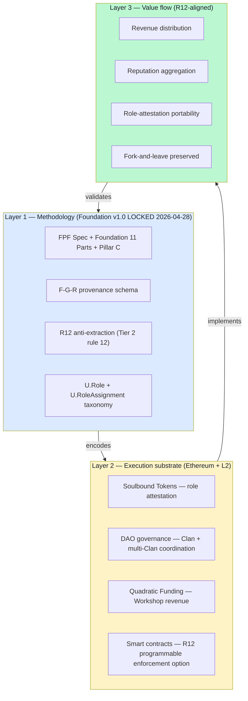

# Jetix on Ethereum — Master Architecture

> **R1 surface-only.** Architectural concept в response к text_007 Ruslan dictation 18.05 morning. **NOT** a committed Foundation-level substrate decision — surface for Ruslan ack + AWAITING-APPROVAL packet review process.

> **F2 surface grade.** EP-5: single-voice trigger + brigadier-scribe + cross-direction triangulation (07/10/11). LOCK requires Ruslan reflection + AWAITING-APPROVAL ack + Phase 3 architecture review + crypto-tribe perception mitigation testing.

> **Constitutional integrity preserved.** H8 LOCKED 2026-05-17 substrate-agnostic principle = **NOT overwritten**. Ethereum option introduced as `RUSLAN-LAYER overlay` (per IP-1) — Foundation requires `F-G-R + role-attestation shape`; specific substrate = layered option. Pillar C R12 substrate-agnostic foundation_generic = **NOT modified**; programmable enforcement = RUSLAN-LAYER overlay candidate via AWAITING-APPROVAL packet.

---

## §0 TL;DR (≤300 слов)

text_007 ¶2-3 (18.05 morning): «Jetix работает с эфиром, конечно... как именно вот Jetix на вот этот FPF и в целом всю децентрализацию и крипту короче вместе соединить».

**Architectural thesis (3-layer composition):**
- **Layer 1 — Methodology:** FPF (Foundation Principles + Pattern Language + 11 Parts + Pillar C)
- **Layer 2 — Execution substrate:** Ethereum + L2 (smart contracts + SBT + DAO + QF)
- **Layer 3 — Value flow:** R12-aligned distribution (programmable enforcement option; revenue + reputation + role-attestation)

**Substrate decision posture (per H8 LOCKED preservation):**
- **Ethereum = primary RUSLAN-LAYER overlay option** for Phase 2+ execution substrate
- **Layered approach preserved** (per direction 07 §3): Phase 1 PGP + Karpathy-wiki-sigs (off-chain free); Phase 2 + W3C VC v2.0; Phase 2+ Ethereum primary; SBT optional crypto-native Clans
- **Substrate-agnostic principle Foundation-level intact** — Ethereum = overlay, not Foundation default

**3 critical decision-blockers surface (AWAITING-APPROVAL packets required):**
1. H8 LOCK §extension append (add Ethereum option to substrate matrix)
2. R12 programmable enforcement (RUSLAN-LAYER overlay candidate — preserves Tier 2 substrate-agnostic foundation_generic)
3. Phase 0 inventory O-23 candidate «Jetix Ethereum architecture»

**5 critical option surfaces (Ruslan picks — surface only):**
- L2 selection (Optimism / Arbitrum / Base / Polygon — §07)
- DAO framework (Aragon / Moloch / Coordinape / custom — §05)
- Token economics (no-token / SBT-only / native-token — §04 + §06)
- Legal entity ↔ DAO interaction (O-02 Corp + on-chain — §08)
- KYC / privacy / regulatory posture (Russian-jurisdiction crypto constraints — §10)

**Buterin outreach Phase 1 acceleration ack** (text_007 ¶1): Ruslan personal action; **NOT brigadier-automated**. Phase 3 doc = substantive material to carry into conversation if outreach occurs.

---

## §1 3-layer architectural stack overview



**Full diagram:** `diagrams/01-jetix-ethereum-stack.md`.

---

## §2 FPF primitive composition

**Architectural decision = `B.2 MHT` (Meta-Holon Transition):** individual layer holons (FPF / Ethereum substrate / value flow) compose into supersystem holon (Jetix-on-Ethereum integrated architecture).

| Composition step | FPF primitive | F-G-R |
|---|---|---|
| FPF Methodology layer | `U.System` (A.1) + `A.3.1 U.Method` + `A.3.2 U.MethodDescription` | F8 (artefact) / F4 (operational) |
| Ethereum substrate layer | `A.6.1 U.Mechanism` (execution substrate) | F4 (Ethereum operational since 2015) |
| Value flow layer | `U.PromiseContent` (A.2.3) + `U.Commitment` (A.2.8) + R12 anti-extraction | F4 (R12 ack'd) / F2 (programmable enforcement candidate) |
| 3-layer composition | `B.2 MHT` (supersystem emergence) | **F2** · jetix-on-ethereum-architecture-composition · surface only |
| Cross-layer consistency | `A.6.B Boundary Norm Square` (substrate boundary decision) + `A.7 Strict Distinction` | F3 · cross-layer-consistency |
| R12 enforcement option | `E.5 Guard-Rails` + Pillar C Tier 2 R12 + smart-contract programmable | F2 · r12-programmable-candidate |

---

## §3 Why Ethereum specifically (text_007 «не уровнем ниже»)

**text_007 ¶2:** «работали бы с биткойном, в душе не ебем, кто это будем работать с биткойном тоже. Ну так пока с Виталиком вот всё».

**text_007 ¶2 (substrate rationale fragment):** «как раз вот именно там это децентрализация и так далее. И как раз вот эфир — как раз эфир, гениально — как раз вот Jetix работает с эфиром, конечно. Ну и не уровнем ниже».

**Decoded:**
- **Bitcoin = value-store layer (L0/L1) without native smart-contract layer** — substrate insufficient для programmable governance + role-attestation + QF
- **Ethereum = programmable substrate** with mature smart-contract VM + L2 scaling ecosystem + DAO tooling + SBT lineage (Buterin/Weyl/Ohlhaver 2022)
- **«Не уровнем ниже»** = not at Bitcoin abstraction level (transactional); at Ethereum abstraction level (programmable governance)

**Detail rationale:** `01-substrate-selection-rationale.md`.

---

## §4 Critical constitutional preservation

### §4.1 H8 LOCKED Octagon (Trust Infrastructure) preservation

H8 LOCKED 2026-05-17 substrate-agnostic positioning (§positioning §4 «substrate-agnostic role-attestation») **NOT overwritten** by this architecture per **append-only discipline**. Resolution: Ethereum option **added** to substrate matrix per direction 07 §3 layered approach.

**Layered substrate stack (extends direction 07 §3):**
```
Phase 1 (immediate, free):    PGP + Karpathy-wiki-sigs (off-chain)
Phase 2 (production):         + W3C VC v2.0 (off-chain selective disclosure)
Phase 2+ (Ethereum overlay):  Ethereum primary RUSLAN-LAYER overlay (substrate for DAO + SBT + QF + programmable R12)
Phase 3+ (optional):          SBT only for crypto-native partner Clans, NOT Foundation default
```

**Critical:** Foundation requires `F-G-R + role-attestation shape`; Ethereum substrate = **specific overlay binding**; Foundation principle preserved.

### §4.2 Pillar C Tier 2 R12 preservation

**Tier 2 rule 12 (R12) text 2026-05-12:** «No extraction beyond agreed share — AI/substrate cannot extract value from members beyond agreed share; members can fork-and-leave without penalty.» — **substrate-agnostic foundation_generic.**

**Architecture extension:** Smart contracts on Ethereum can **programmably-enforce** R12 (revenue distribution per Mondragón 5:1 ratio, Coordinape epoch peer-reward, etc.). Programmable enforcement = **RUSLAN-LAYER overlay implementation**, NOT amendment to Tier 2 foundation_generic.

**AWAITING-APPROVAL packet surfaced (Phase 4 deliverable):** `swarm/awaiting-approval/r12-programmable-ethereum-2026-05-18.md` — for Ruslan ack on RUSLAN-LAYER overlay introduction. **NO autonomous Pillar C amendment.**

### §4.3 IP-1 Role≠Executor preservation

Foundation roles (manager / strategist / etc.) = `U.Episteme` abstract role-types (`U.Role`). Ethereum smart-contract addresses = specific RUSLAN-LAYER executor bindings (per `shared/schemas/executor-binding.yaml.template`). Architecture preserves IP-1: Foundation Parts MUST NOT name specific Ethereum contract addresses; addresses = RUSLAN-LAYER per executor-binding template.

### §4.4 R11 + Default-Deny preservation

Novel-action classes introduced by Ethereum integration (smart-contract deployment / DAO vote / SBT minting / QF allocation) require classification at `.claude/config/default-deny-table.yaml`. Uncategorized = deny-and-escalate per Part 6b §I.2.

---

## §5 Substrate matrix update (Phase 2+ Ethereum primary overlay)

Extends direction 07 §1 9-dimension matrix with Ethereum-layer-2 primary column:

| Dimension | W3C VC v2.0 | SBT | PGP WoT | Karpathy-wiki-sigs | Coordinape | **Ethereum L2 (NEW Phase 2+)** |
|---|---|---|---|---|---|---|
| Maturity | Rec 2025-05-15 | Paper 2022 | 1992+ mature | 2026 emerging | 2021+ production | **2020+ L2 production (OP / ARB / Base)** |
| Substrate | JSON-LD + cryptosuites | Blockchain | OpenPGP | Git + Markdown | Ethereum SC | **Ethereum + L2 rollups** |
| Transferability | Non-transferable | Soul-bound | Identity-bound | Commit-bound | Non-transferable | **Configurable per token type** |
| Privacy | Selective disclosure | Public | Public | Public | Public | **Configurable (ZK or public)** |
| Anti-Sybil | Issuer-anchored | Soul-anchored | WoT degrees | Commit-history | Circle NFT | **Configurable; SBT layer** |
| Revocation | Status registry | Burn | Key revocation | Git revert | Reputation aging | **Smart-contract governance** |
| Cost per attestation | Free | Gas (1-10 USD L1) | Free | Free | Gas + epoch ops | **L2 gas ~$0.01-0.10** |
| Production deployments | TruAge / CA DMV / SpruceID | Limited | ~57.5K strong set | Karpathy LLM Wiki + Jetix | Yearn / Bankless / Gitcoin | **Optimism Gov + Arbitrum DAO + Base ecosystem + Gitcoin Grants** |
| Lock-in risk | Low | HIGH | Medium | Low | HIGH | **Medium (L2 ↔ L1 ↔ cross-L2 migration tooling exists)** |

[src: extension to research/deepening-2026-05-18/07-substrate-matrix-vc-sbt-pgp-coordinape.md §1]

---

## §6 Critical option matrix (decisions surface для Ruslan)

| Option category | Surface options | Decision blocker | Reference |
|---|---|---|---|
| **L2 selection** | Optimism / Arbitrum / Base / Polygon / multi-L2 | Cost + governance + ecosystem fit | §07 |
| **DAO framework** | Aragon OSx / Moloch v3 / Coordinape Circles / custom Solidity | Governance pattern fit + lock-in risk | §05 |
| **Token economics** | (a) No native token (SBT + ETH only) / (b) SBT-only Jetix attestation / (c) Native governance token + SBT | Revenue + governance + crypto-tribe perception risk | §04 + §06 |
| **Legal entity ↔ DAO** | O-02 Corporation registered → DAO holds treasury / DAO-only / hybrid Foundation+DAO | Jurisdiction (German GmbH? Liechtenstein? Cayman?) + tax + compliance | §08 |
| **Privacy posture** | ZK-default (Buterin-aligned d/acc) / public-default / hybrid configurable | KYC + Russian-jurisdiction crypto constraints + user UX | §10 |
| **Revenue distribution mechanism** | Quadratic Funding (Tang+Weyl) / Coordinape epoch / Mondragón 5:1 / hybrid | Workshop revenue + R12 alignment + perceived fairness | §06 |
| **R12 enforcement mode** | Text-only (Tier 2 R12 ack) / smart-contract programmable / hybrid | Pillar C extension + RUSLAN-LAYER overlay scope | §03 + Phase 4 packet |
| **Substrate posture** | Ethereum-primary / multi-substrate-layered (direction 07 §3) / substrate-agnostic with Ethereum-option | H8 LOCKED preservation + flexibility | §01 + Phase 4 packet |

**Brigadier inference (F2 surface):**
- **L2:** Base (Coinbase L2; Ethereum-aligned; lowest gas; rapidly growing ecosystem; mainstream onboarding bridge) **as Phase 2+ default; surface alternatives**
- **DAO:** Aragon OSx (modular Solidity; production maturity; not locked-in) **as default; surface Moloch v3 alternative**
- **Token:** SBT-only Jetix attestation (no native fungible token Phase 2+; financial neutrality preserved; reduces crypto-tribe perception risk; preserves R12)
- **Legal:** Foundation+DAO hybrid (German UG / GmbH per O-02; DAO holds operational treasury; Phase 3+ revisit per scale)
- **Privacy:** ZK-default for sensitive attestations + public-default for governance votes (d/acc-aligned)
- **Revenue:** Quadratic Funding для Workshop revenue + Mondragón 5:1 ratio as floor/ceiling (hybrid; R12-aligned)
- **R12:** RUSLAN-LAYER overlay programmable enforcement (preserves Tier 2 substrate-agnostic foundation_generic)
- **Substrate posture:** Multi-substrate-layered per direction 07 §3 + Ethereum overlay added Phase 2+ (preserves H8 LOCKED + adds Ethereum option)

**All inferences = F2 surface only.** Ruslan picks.

---

## §7 Implementation roadmap (Phase 1 → Phase 3 — high-level)

```
Phase 1 (Q3 2026 — current quarter through first-clan activation)
├── Foundation continues evolution per B.4 loop
├── Off-chain substrate (PGP + Karpathy-wiki-sigs) per direction 07 §3
├── Workshop platform L1 prototype (text_003 sequencing)
├── Charter v0 → first 10 signatories
├── Buterin outreach attempt (Ruslan personal — substance: this Phase 3 doc)
├── AWAITING-APPROVAL packets resolution (H8 extension + R12 programmable)
└── Phase 0 inventory O-23 candidate appended

Phase 2 (Q4 2026 — Q2 2027)
├── W3C VC v2.0 layer over PGP (production substrate)
├── Pattern Language artefact open-source authored
├── First Workshop revenue event (off-chain — Mondragón pattern, NOT yet Ethereum)
├── Crypto-tribe perception monitoring
├── Decision-checkpoint: Ethereum overlay introduction Phase 2+?
└── If Ruslan ack proceed → Ethereum prep

Phase 2+ (Q2 2027+) — Ethereum overlay introduction
├── L2 selection (Base default per §07; Ruslan picks)
├── DAO framework deployment (Aragon OSx default; Ruslan picks)
├── SBT role-attestation pilot (Workshop graduates SBT)
├── QF Workshop revenue pilot (first-clan internal)
├── R12 programmable enforcement smart-contract pilot
└── Legal entity ↔ DAO integration (O-02 + on-chain treasury)

Phase 3 (2027+)
├── Multi-Clan DAO governance operational
├── Cross-Clan SBT portability (fork-and-leave preserved)
├── Public DAO (if appropriate; perception-risk monitored)
└── 100-holder threshold → Stage 2 per CONCEPT-MAN-AS-ARMY §7.1
```

**Detail:** `09-implementation-roadmap.md`.

---

## §8 Risks + mitigations summary

**Top 5 risks (per phil × critic + investor × scalability cell):**

| Risk | Mitigation | Detail |
|---|---|---|
| **Crypto-tribe perception alienates methodology community (ШСМ + SEMAT + INCOSE)** | «Ethereum as substrate ≠ crypto-tribe positioning» framing; substrate-utilization, not identity; Ethereum overlay introduced Phase 2+ AFTER off-chain Phase 1 community established | §10 |
| **Russian-jurisdiction crypto regulatory barriers** | Treat Ethereum as Phase 2+ option for non-Russian holders; Russian holders use Phase 1 off-chain substrate; OR: residency-based opt-in | §10 |
| **R12 lock-in via Ethereum substrate (paradox)** | Fork-and-leave preserved through SBT portability + cross-L2 bridges + non-custodial wallet design + Foundation-level substrate-agnostic principle intact | §10 |
| **Friend.tech-style financialization attractor** | NO native fungible token Phase 2+; SBT-only attestation; QF revenue distribution (anti-financialization mechanism) | §04 + §10 |
| **Gas cost burden on Workshop participants** | L2 selection (Base / Optimism) reduces gas to ~$0.01-0.10; gas sponsorship via DAO treasury optional | §07 + §10 |

**Detail:** `10-risks-mitigations.md`.

---

## §9 Reading paths

| Path | Read | Why |
|---|---|---|
| **5-min skim** | This master doc §0-§5 + §6 option matrix | Architecture overview + critical decision points |
| **30-min review** | + `01-substrate-selection-rationale.md` + `02-fpf-on-ethereum-mapping.md` + `10-risks-mitigations.md` | Architectural logic + FPF mapping + risk picture |
| **2-hour deep** | All 10 docs + 5 mermaid diagrams | Full architectural understanding |
| **Buterin outreach prep** | This master + `02-fpf-on-ethereum-mapping.md` + `04-sbt-role-attestation.md` + `06-quadratic-funding-workshop-revenue.md` | Substance carrying d/acc + Plurality alignment |

---

## §10 Cross-refs

| Doc | Relationship |
|---|---|
| `decisions/STRATEGIC-INSIGHT-JETIX-TRUST-INFRASTRUCTURE-2026-05-17.md` | H8 LOCKED Octagon — substrate-agnostic preserved; §extension pending Phase 4 packet |
| `swarm/awaiting-approval/r12-anti-extraction-2026-05-12.md` | R12 Tier 2 rule 12 — foundation_generic preserved; programmable enforcement = RUSLAN-LAYER overlay |
| `research/deepening-2026-05-18/07-substrate-matrix-vc-sbt-pgp-coordinape.md` | Direction 07 §3 layered approach extended; §9 append (Phase 4) |
| `research/deepening-2026-05-18/10-people-buterin-dacc-trajectory.md` | Buterin d/acc baseline — Ethereum substrate philosophical compass |
| `research/deepening-2026-05-18/11-people-tang-weyl-plurality-2024.md` | QV/QF + SBT baseline — Layer 2 mechanism source |
| `decisions/strategic/CONCEPT-MAN-AS-ARMY-JETIX-INTEGRATION-2026-05-18.md` | Concept doc — Ethereum substrate hosts self-army composition; «100-holder threshold» = Phase 2 transition |
| `vision/08-l1-collaboration-roadmap.md` | Buterin outreach Phase 1 acceleration |
| `reports/phase-0-fpf-scope/01-jetix-objects-inventory.md` | O-23 candidate row (Phase 5 append) |

---

## §11 What this architecture is NOT

- ❌ NOT a committed Foundation-level substrate decision (F2 surface; Ruslan ack required for LOCK)
- ❌ NOT an H8 LOCK overwrite (extension via AWAITING-APPROVAL packet only)
- ❌ NOT a Pillar C Tier 2 R12 amendment (RUSLAN-LAYER overlay candidate only — packet)
- ❌ NOT an H9 Strategic Insight LOCK (deferred per prompt §4)
- ❌ NOT a Buterin outreach commitment (Ruslan personal action; success ≠ guaranteed)
- ❌ NOT an L2 / DAO / token economics decision (options surface only; Ruslan picks)
- ❌ NOT a crypto-tribe positioning adoption (Ethereum-as-substrate ≠ identity)
- ❌ NOT a substrate-agnostic principle abandonment (Ethereum = overlay)

---

**Word count:** ~2400.
