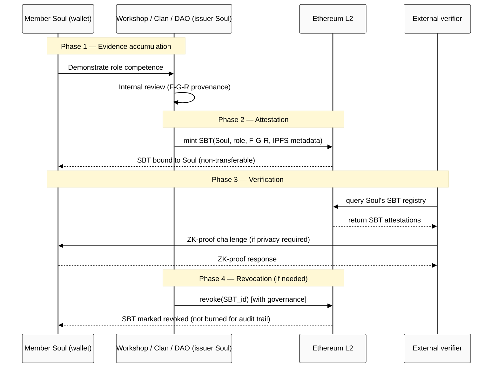

# 04 — Soulbound Tokens (SBT) для H8 role-attestation

> ⚠️ **R2 LIVE-FLAG.** SBT introduction touches H8 LOCKED 2026-05-17 substrate-agnostic principle. AWAITING-APPROVAL packet `swarm/awaiting-approval/h8-ethereum-substrate-extension-2026-05-18.md` (Phase 4) — Ruslan ack required.

## §FPF primitives

| Decision | FPF primitive | F-G-R |
|---|---|---|
| Role attestation through SBT | `U.RoleAssignment` (A.2.1) — Holder#Role:Context on-chain | F3 · sbt-role-attestation-pattern |
| SBT non-transferability | `A.7 Strict Distinction` (binding vs sale-prevention) | F4 · sbt-non-transferable |
| Cross-Clan portability | `U.System.compose` (B.2 MHT) + R12 fork-and-leave | F3 · sbt-portability |
| Privacy via ZK | `E.17 MVPK` (multi-view package — public proof + private detail) + Buterin d/acc Jan 2025 | F3 · sbt-zk-privacy |

## §1 What SBTs are (Buterin/Weyl/Ohlhaver 2022 DeSoc paper)

[src: SSRN 4105763 «Decentralized Society: Finding Web3's Soul», May 2022]

**Definition:** Non-transferable tokens (NFTs that cannot be sold/transferred) attached to a wallet («Soul»). Each SBT represents an attestation of role / credential / membership / achievement.

**Key properties (per DeSoc paper):**
- Non-transferable (cannot be sold)
- Issued by other Souls or institutions
- Aggregate of SBTs = Soul's reputation graph
- Anti-Sybil via SBT-density requirements
- Plurality + Quadratic Voting integration native

**Production status:** Limited (paper 2022; spec EIP-5114 draft; EAS production-ready; some pilots).

## §2 Jetix application

| Jetix object | SBT pattern | F-G-R |
|---|---|---|
| **O-13 Clan membership** | Clan-membership SBT (revokable on exit) | F3 · clan-sbt |
| **O-14 Workshop graduation** | Workshop-graduate SBT (permanent attestation) | F3 · workshop-grad-sbt |
| **Role-type attestation (per O-06a)** | Multiple SBTs per holder (each = role+context binding) | F3 · multi-role-sbt |
| **F-G-R provenance trace** | Each SBT carries F-G-R hash + IPFS rationale pointer | F4 · sbt-fgr-binding |
| **Methodology mastery levels** | Tiered SBTs (apprentice / journeyman / master) | F2 · tiered-mastery-sbt |
| **R12 anti-extraction proof** | Issuer-Soul commits на R12 via SBT issuance protocol | F2 · r12-issuer-attestation |

## §3 SBT vs alternative role-attestation substrates

Per direction 07 §1 9-dimension matrix, SBT is **one option among 6**:

| Substrate | Off/On chain | Cost | Privacy | Maturity | Jetix Phase fit |
|---|---|---|---|---|---|
| **PGP WoT** | Off-chain | Free | Public keys | 1992+ mature | Phase 1 |
| **Karpathy-wiki-sig** | Off-chain | Free | Public commits | 2026 emerging | Phase 1 |
| **W3C VC v2.0** | Off-chain default | Free | Selective disclosure | Rec 2025-05-15 | Phase 2 |
| **SBT** | On-chain (Ethereum) | Gas L1 $1-10 / L2 $0.01-0.10 | Public default (ZK-extensible) | Limited prod | Phase 2+ (overlay option) |
| **Coordinape** | On-chain | Gas + epoch ops | Public | 2021+ production | Phase 2+ (pattern adopt) |

**Brigadier recommendation (F2 surface):** **SBT as Phase 2+ overlay option, NOT Phase 1 baseline.** Phase 1 baseline = PGP + Karpathy-wiki-sigs per direction 07 §3.

**Rationale:**
1. Phase 1 = free + immediate (no Ethereum dependency)
2. Phase 2+ Ethereum overlay adds SBT as **complementary** substrate (not replacement)
3. Substrate-agnostic H8 principle preserved (multi-substrate stack)
4. Crypto-tribe perception risk mitigated (Phase 1 community established off-chain first)

## §4 SBT-specific risks (per direction 07 §2.2)

| Risk | Mitigation |
|---|---|
| **On-chain identifiability** (DeSoc paper flags discrimination risk) | ZK-SBT (zero-knowledge SBT — prove role without revealing identity); Buterin Jan 2025 retrospective notes ZK-SNARKs in government IDs deployed |
| **Friend.tech-style financialization** (direction 03 pre-mortem) | SBT non-transferable by design = no secondary market; mitigates friend.tech vulnerability |
| **Russian-jurisdiction crypto barriers** | Russian holders use off-chain Phase 1 substrate; SBT optional Phase 2+ |
| **Gas cost burden** | L2 deployment (Base / Optimism) reduces gas to $0.01-0.10; gas sponsorship via account abstraction ERC-4337 |
| **Spec immaturity (EIP-5114 draft)** | Use mature EAS (Ethereum Attestation Service) as production substrate; migrate to ratified spec when stable |
| **Issuer-Soul corruption** (DeSoc paper) | Multi-issuer attestations + revocation governance + F-G-R provenance |

## §5 ZK-SBT for privacy

**ZK (Zero-Knowledge) extensions enable:**
- **Selective disclosure:** prove «I am Workshop graduate» without revealing which Workshop / when / cohort
- **Aggregation proofs:** prove «I have ≥5 master-level SBTs» without revealing which 5
- **Anti-discrimination:** prove role-qualification without revealing personal identifiers

**Buterin d/acc Jan 2025 retrospective:** «ZK-SNARKs deployed in government ID + social media» — production-ready substrate for SBT privacy.

**Jetix application:** ZK-SBT for sensitive attestations (mastery level, financial history); public SBT for governance attestations (Clan membership, DAO delegate role). Hybrid per attestation type.

## §6 SBT lifecycle

**Full diagram:** `diagrams/02-sbt-role-flow.md`.

## §7 Plain English

**Что такое SBT (Soulbound Token)?**

Простыми словами — **«electronic badge которое нельзя продать»**. Например:
- Завершил Workshop → получаешь SBT «Workshop Graduate 2027 Q3» в свой кошелёк
- Этот SBT **всегда с тобой**, его нельзя продать на NFT marketplace
- Любой может verify on-chain что у тебя есть этот SBT (proof of role)
- При выходе из Clan твой Clan-membership SBT revokes; но Workshop-Graduate SBT остаётся (portable)

Аналогия:
- **NFT** = «билет на концерт» (можно продать, передать)
- **SBT** = «diploma об образовании» (привязан к тебе, не продаваемый)

**Зачем SBT в Jetix?**

H8 LOCKED 2026-05-17 описывает «trust infrastructure = role-attestation вместо money как сигнал доверия». SBT = **on-chain implementation** role-attestation:
- Auditable (любой может verify в blockchain)
- Non-transferable (нельзя купить чужую репутацию)
- Portable (выходишь из Clan — SBTs с тобой)
- Composable (multiple SBTs = твой reputation graph)

**Сохраняется ли H8 substrate-agnostic principle?**

**ДА.** H8 LOCKED описывает «substrate-agnostic role-attestation **shape**». SBT = **один substrate option** среди 6 (PGP / Karpathy-wiki-sig / VC v2.0 / SBT / Coordinape / Custom).

Phase 1 baseline = PGP + Karpathy-wiki-sig (off-chain, free, immediate).
Phase 2+ overlay = SBT через Ethereum (production-ready cost-effective L2).

**Phase 1 → Phase 2+ migration:** PGP signature → W3C VC v2.0 credential (Phase 2) → SBT (Phase 2+ if Ruslan picks). Each layer **adds to** previous, не заменяет.

## §8 AWAITING-APPROVAL packet content surface (Phase 4 deliverable)

**Packet:** `swarm/awaiting-approval/h8-ethereum-substrate-extension-2026-05-18.md`

**Packet sections (preview):**
1. H8 LOCKED 2026-05-17 substrate-agnostic principle reaffirmed
2. Ethereum/SBT substrate as Phase 2+ overlay option introduction
3. Substrate matrix extension (direction 07 §1 column added)
4. SBT-specific risks + mitigations (§4 from this doc)
5. ZK-SBT privacy posture
6. Phase 2+ pilot scope (Workshop graduates first)
7. Constitutional preservation analysis (substrate-agnostic principle intact)
8. Ruslan ack matrix — H8 doc §extension append

## §9 Open questions

| OQ | Question |
|---|---|
| **OQ-04-1** | EIP-5114 vs ERC-5484 vs custom — pick which standard? |
| **OQ-04-2** | EAS vs custom SBT registry — production maturity vs control trade-off |
| **OQ-04-3** | ZK-SBT — which library (Semaphore / Polygon ID / custom Circom)? |
| **OQ-04-4** | Multi-issuer attestation — single Workshop OR multi-Clan issuers? |
| **OQ-04-5** | Revocation governance — Issuer-only OR DAO vote required? |
| **OQ-04-6** | SBT metadata storage — fully on-chain (expensive) OR IPFS pointer (typical) OR Arweave (permanent)? |

## §10 Counter-positions

- **Counter 1 (phil critic — direction 07 §2.2 carry):** «SBT identifiability = discrimination risk» — Mitigation: ZK-SBT for sensitive attestations.
- **Counter 2 (direction 07 §2.2 carry):** «Blockchain lock-in violates substrate-agnostic principle» — Mitigation: SBT = overlay, not Foundation default; multi-substrate stack preserved.
- **Counter 3 (direction 07 §2.2 carry):** «Friend.tech financialization attractor» — Mitigation: SBT non-transferable + no native fungible token Phase 2+.
- **Counter 4 (eng critic):** «EIP-5114 still draft; production deployment uses what spec?» — Mitigation: EAS production-ready as bridge; migrate to ratified spec post-stabilization.
- **Counter 5 (investor scalability):** «Gas costs even on L2 add friction for low-income holders» — Mitigation: ERC-4337 account abstraction + DAO treasury gas sponsorship; or near-zero-gas L2 (zkSync Era).

## §11 Sources

- DeSoc paper (Weyl+Buterin+Ohlhaver 2022): papers.ssrn.com/sol3/papers.cfm?abstract_id=4105763
- Buterin Jan 2025 retrospective: vitalik.eth.limo/general/2025/01/05/dacc2.html
- Direction 07 substrate matrix: `research/deepening-2026-05-18/07-substrate-matrix-vc-sbt-pgp-coordinape.md`
- Direction 10 Buterin d/acc: `research/deepening-2026-05-18/10-people-buterin-dacc-trajectory.md`
- Direction 11 Tang+Weyl Plurality: `research/deepening-2026-05-18/11-people-tang-weyl-plurality-2024.md`
- H8 LOCK: `decisions/STRATEGIC-INSIGHT-JETIX-TRUST-INFRASTRUCTURE-2026-05-17.md`
- EIP-5114 (draft): eips.ethereum.org/EIPS/eip-5114
- EAS (Ethereum Attestation Service): attest.org
- Semaphore (ZK identity): semaphore.appliedzkp.org

**Word count:** ~1620.
