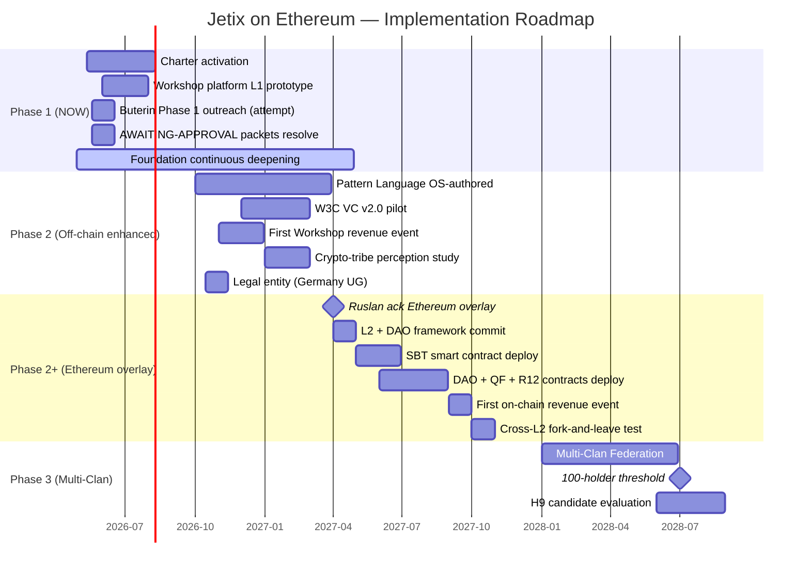

# 09 — Implementation roadmap

## §FPF primitives

| Decision | FPF primitive | F-G-R |
|---|---|---|
| Phased deployment sequencing | `B.5.1 Explore→Operate` + `A.4 Temporal Duality` | F3 · phased-deployment |
| Stage-gate discipline | `E.5 Guard-Rails` + `B.3 F-G-R` | F4 · stage-gates |
| Foundation continuous evolution | `B.4 Canonical Evolution Loop` parallel to expansion (text_006 ¶8) | F4 · parallel-foundation-build |

## §1 Phase mapping summary

| Phase | Timing | Substrate state | Key deliverables | Gating |
|---|---|---|---|---|
| **Phase 1** | NOW (Q2-Q3 2026) | Off-chain (PGP + Karpathy-wiki-sigs) | Charter v0 activation; first 10 signatories; Workshop platform L1 prototype | Charter signatories ≥5; Workshop L1 demoable |
| **Phase 2** | Q4 2026 - Q2 2027 | + W3C VC v2.0 (off-chain) | Pattern Language artefact OS-authored; First Workshop revenue event; AWAITING-APPROVAL packets resolved | Pattern Language v0; Workshop revenue ≥€10K; H8 §extension acked |
| **Phase 2+ Ethereum overlay** | Q2-Q4 2027 | + Ethereum L2 (Base default) | DAO deployed; SBT pilot; QF pilot; R12 programmable enforcement pilot | Phase 2 milestones + Ruslan packet ack + legal advisor consult |
| **Phase 3** | 2028+ | Multi-Clan DAO Federation | 100-holder Clan substrate; multi-Clan governance; cross-Clan SBT recognition; possible Liechtenstein Stiftung revisit | Phase 2+ stability ≥6 months; 100 active holders |

---

## §2 Phase 1 (NOW — through Q3 2026)

**Substrate stack (off-chain only):**
- PGP + Karpathy-wiki-sigs per direction 07 §3
- Charter v0 LOCKED 2026-05-12

**Critical deliverables:**

| # | Deliverable | Owner | Status |
|---|---|---|---|
| **P1-D1** | First 10 Charter signatories | Ruslan + L1 pre-engage | In progress (0 signatories; outreach pending) |
| **P1-D2** | Workshop platform L1 prototype (text_003) | Ruslan + brigadier draft | Spec exists; implementation pending |
| **P1-D3** | Buterin Phase 1 outreach attempt | Ruslan personal action | Pending (Phase 3 architecture doc = substance carrier) |
| **P1-D4** | AWAITING-APPROVAL packets (H8 substrate + R12 programmable) — drafts | Brigadier | Phase 4 (this run) |
| **P1-D5** | AWAITING-APPROVAL packets — Ruslan ack | Ruslan | Pending |
| **P1-D6** | Direction 07 §9 + direction 10 §11 appends | Brigadier | Phase 4 (this run) |
| **P1-D7** | Phase 0 inventory O-23 candidate | Brigadier | Phase 5 (this run) |
| **P1-D8** | Foundation evolution per B.4 loop | Continuous | Active |

**Phase 1 → Phase 2 gating:**
- Charter signatories ≥5
- Workshop L1 demoable (text_003)
- AWAITING-APPROVAL packets acked
- Foundation deepening continues (per text_006 ¶8 «снежный ком на развитие фундамента»)

---

## §3 Phase 2 (Q4 2026 - Q2 2027)

**Substrate stack (off-chain enhanced):**
- + W3C VC v2.0 (selective disclosure)
- Workshop revenue mechanism = off-chain Mondragón ratio (NOT yet Ethereum)
- Crypto-tribe perception monitoring active

**Critical deliverables:**

| # | Deliverable | Owner | Notes |
|---|---|---|---|
| **P2-D1** | Pattern Language artefact OS-authored (per Plurality precedent) | Ruslan + community | GitHub + CC-BY-4.0; Russian + English bilingual |
| **P2-D2** | W3C VC v2.0 pilot (Workshop graduate VC) | Brigadier + tech-implementation | SpruceID / TruAge reference |
| **P2-D3** | First Workshop revenue event | Clan + Workshop | Off-chain Mondragón ratio distribution |
| **P2-D4** | Crypto-tribe perception study | Brigadier survey + community feedback | Phase 2+ decision input |
| **P2-D5** | Decision checkpoint — Phase 2+ Ethereum overlay? | Ruslan ack | Gate to Phase 2+ |
| **P2-D6** | Legal entity registered (Germany UG) | Ruslan + legal advisor | O-02 materialization |

**Phase 2 → Phase 2+ gating:**
- P2-D5 Ruslan ack (Ethereum overlay introduction)
- Legal advisor consult complete
- Phase 2 milestones stable ≥6 months
- Crypto-tribe perception study results acceptable

---

## §4 Phase 2+ Ethereum overlay (Q2-Q4 2027)

**Substrate stack (full):**
- Off-chain (PGP + wiki-sig + VC v2.0) — preserved
- + Ethereum L2 (Base default; Optimism fallback) — overlay
- SBT role-attestation
- DAO governance (Aragon OSx)
- QF Workshop revenue
- R12 programmable enforcement

**Critical deliverables:**

| # | Deliverable | Owner | Notes |
|---|---|---|---|
| **P2P-D1** | L2 selection commit (Base / Optimism / multi-L2) | Ruslan ack | Per `07-cost-economy-l2-selection.md` |
| **P2P-D2** | DAO framework selection commit (Aragon OSx / Moloch v3) | Ruslan ack | Per `05-dao-governance-multi-clan.md` |
| **P2P-D3** | SBT smart contract deployment (Workshop graduate SBT) | Tech-implementation + audit | EAS or custom |
| **P2P-D4** | DAO smart contract deployment | Tech-implementation + audit | Aragon OSx default |
| **P2P-D5** | QF revenue distribution smart contract | Tech-implementation + audit | Mondragón ratio cap + QF formula |
| **P2P-D6** | R12 programmable enforcement contract | Tech-implementation + audit | Per `03-r12-programmable-enforcement.md` |
| **P2P-D7** | Legal-DAO bridge (Pattern C) | Legal advisor + tech | Per `08-legal-entity-dao-interaction.md` |
| **P2P-D8** | First on-chain Workshop revenue event | Clan + Workshop | Pilot |
| **P2P-D9** | First cross-L2 bridge test (R12 fork-and-leave preserved) | Tech-implementation | DRA-T4 from CONCEPT-MAN-AS-ARMY §6.3 |
| **P2P-D10** | ZK-SBT integration for sensitive attestations | Tech-implementation | Buterin d/acc-aligned |

**Phase 2+ → Phase 3 gating:**
- All P2P deliverables stable ≥6 months
- 100 active holders threshold approached
- No critical Pillar C violations observed
- Crypto-tribe perception manageable

---

## §5 Phase 3 (2028+)

**Substrate stack (mature):**
- Multi-Clan DAO Federation operational
- Cross-Clan SBT recognition (per Federation governance)
- Full QF + Coordinape supplement
- ZK-SBT mainstream
- Legal-DAO hybrid mature

**Critical deliverables:**

| # | Deliverable | Notes |
|---|---|---|
| **P3-D1** | Multi-Clan Federation DAO | 3+ Clans federated |
| **P3-D2** | Pattern Language v1 (refined) | Community-authored extensions |
| **P3-D3** | 100-holder threshold | Stage 2 per CONCEPT-MAN-AS-ARMY §7.1 |
| **P3-D4** | Liechtenstein Stiftung revisit | If methodology-distribution non-profit |
| **P3-D5** | H9 Strategic Insight LOCK (if appropriate) | Possibly «Jetix on Ethereum substrate» |

---

## §6 Gantt overview

---

## §7 Plain English

**Roadmap в трёх предложениях:**

1. **Phase 1 (now → Q3 2026):** off-chain only (PGP / wiki-sig); Charter v0 → first 10 signatories; Workshop platform prototype; Buterin outreach attempt; AWAITING-APPROVAL packets resolve.

2. **Phase 2 (Q4 2026 → Q2 2027):** + W3C VC v2.0; Pattern Language OS-authored; first Workshop revenue event off-chain (Mondragón ratio); decision checkpoint: Ethereum overlay yes/no.

3. **Phase 2+ Ethereum overlay (Q2-Q4 2027):** L2 commit (Base default); DAO (Aragon); SBT pilot; QF Workshop revenue; R12 programmable enforcement; legal-DAO hybrid (Pattern C with Germany UG/GmbH).

**Phase 3 (2028+):** multi-Clan Federation; 100-holder threshold; possible H9 LOCK consideration.

**Key principle (text_006 ¶8):** «фундамент строится довольно мощный... кидаем снежный ком на развитие фундамента» — **Foundation deepening parallel к expansion**, не sequential. Phase 2 + Phase 2+ overlap; Phase 1 → 2 + 2+ not freeze-then-expand.

**Critical:** Phase 2 → Phase 2+ has **decision checkpoint** (P2-D5). Ethereum overlay = **option**, не committed inevitability. If Phase 2 milestones reveal off-chain substrate sufficient (no Workshop scaling pressure / crypto-tribe perception too negative / legal complications) → defer Phase 2+ indefinitely; preserve off-chain stack.

---

## §8 Risk-adjusted sequencing

**Critical path risks:**

| Risk | Mitigation in sequencing |
|---|---|
| Phase 1 Charter activation fails (0 signatories) | Phase 2+ deferred indefinitely; restart Phase 1 with different outreach |
| Buterin outreach fails (likely) | Phase 2+ proceeds without Buterin involvement; substance carries regardless |
| Crypto-tribe perception risk materializes (Phase 2 study negative) | Phase 2+ deferred; possibly cancelled; off-chain stack preserves H8 |
| AWAITING-APPROVAL packets rejected | Phase 2+ deferred; revisit architecture |
| Legal/regulatory blockers | Phase 2+ jurisdiction switch; or defer; or Pattern A/B fallback |
| Workshop revenue insufficient Phase 2 | Phase 2+ DAO unjustified; defer |
| Foundation evolution conflicts с Ethereum overlay | Foundation principle wins; Ethereum overlay adapted or deferred |

**Net:** Phase 2+ Ethereum overlay = optional. Foundation principle + Phase 1 off-chain stack = mandatory minimum.

## §9 Open questions

| OQ | Question |
|---|---|
| **OQ-09-1** | Phase 1 → 2 timing — too aggressive? Too conservative? |
| **OQ-09-2** | Phase 2+ Ethereum commitment — necessary for Workshop scale or optional? |
| **OQ-09-3** | Phase 3 H9 LOCK preparation — when to start ceremony? |
| **OQ-09-4** | Parallel-track Phase 2 + Phase 2+ vs sequential — risk vs speed trade-off |

## §10 Counter-positions

- **Counter 1 (mgmt critic):** «Phase 2+ Ethereum deployment too aggressive timing (2027); Workshop revenue may not justify cost» — Mitigation: Phase 2+ is **option** gated по P2-D5 ack; defer if revenue insufficient.
- **Counter 2 (phil critic):** «Roadmap assumes Ethereum substrate; if architectural decision is wrong, full roadmap is wrong» — Mitigation: substrate-agnostic Foundation principle preserved; off-chain stack mandatory minimum; Ethereum overlay optional.
- **Counter 3 (sys integrator):** «100-holder threshold (Phase 3 gate) may be premature for governance complexity» — Mitigation: gating threshold = surface candidate; Ruslan adjusts; smaller Federation possible.

## §11 Sources

- text_006 ¶8 verbatim «фундамент + снежный ком»
- Charter v0 LOCKED 2026-05-12
- `00-MASTER-ARCHITECTURE.md` §7 roadmap summary
- Phase 0 inventory (objects O-04, O-13, O-14, O-23 candidate)
- Direction 07 §3 layered approach
- CONCEPT-MAN-AS-ARMY §7.1 progression model

**Word count:** ~1450.
