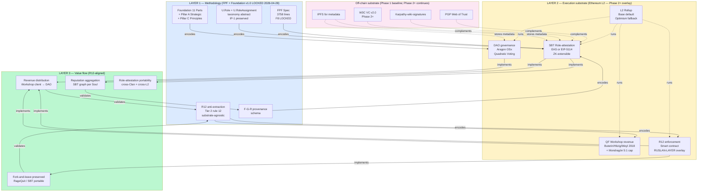

# Diagram 01 — Jetix-on-Ethereum 3-layer stack

## §1 Full stack diagram

## §2 Reading guide

**3 horizontal layers + off-chain substrate:**

1. **Layer 1 (blue) — Methodology**: FPF + Foundation + Pillar C + Role taxonomy + F-G-R. **Substrate-agnostic principle preserved**. This layer is **canonical source-of-truth**.

2. **Layer 2 (yellow) — Execution**: Ethereum L2 rollup (Base default). SBT for role-attestation, DAO for governance, QF for Workshop revenue, smart contract for R12 enforcement. **RUSLAN-LAYER overlay** — specific bindings (contract addresses, L2 choice) live here.

3. **Layer 3 (green) — Value flow**: Revenue distribution, reputation aggregation, role-attestation portability, fork-and-leave. **All R12-aligned outcomes**.

4. **Off-chain substrate (pink) — Phase 1 baseline + Phase 2+ continuation**: PGP, Karpathy-wiki-sig, W3C VC v2.0, IPFS. **NOT replaced by Ethereum overlay** — complements.

## §3 Constitutional preservation visualization

- **Layer 1 → Layer 2**: «encodes» (arrow) — Foundation principles encoded INTO smart contracts; Foundation principle reigns
- **Layer 2 → Layer 3**: «implements» — Ethereum substrate implements value flow
- **Layer 3 → Layer 1**: «validates» — value flow outcomes validate Foundation principles (R12 satisfied, F-G-R provenance preserved)

If Layer 3 outcomes **violate** Layer 1 principles → Foundation principle wins (Layer 2 implementation revised).

## §4 Source

`../00-MASTER-ARCHITECTURE.md` §1 + §4 constitutional preservation
