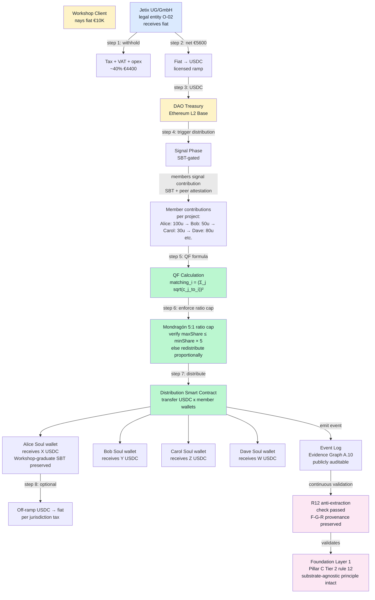

# Diagram 03 — Workshop revenue → Quadratic Funding distribution flow

## §1 Full flow diagram

## §2 Step-by-step

| Step | Action | Constitutional check |
|---|---|---|
| **1** | Client pays €10K fiat to Jetix UG/GmbH | Legal entity O-02 |
| **2** | Corp withholds tax (VAT 19% + corporate ~10-15% + opex); net €5600 | Legal compliance discipline |
| **3** | Corp converts net → USDC via licensed ramp | KYC at Corp boundary (not member boundary) |
| **4** | USDC transferred to DAO Treasury (Ethereum L2 Base) | RUSLAN-LAYER overlay — Corp directors required to transfer per Articles of Association |
| **5** | Distribution trigger: members signal contributions per project (SBT-gated; peer-attested) | SBT-gated = anti-Sybil; peer attestation = F-G-R provenance |
| **6** | QF formula calculates proposed distribution: `matching_i = (Σ sqrt(c_j_to_i))²` | Anti-concentration mathematical property |
| **7** | Mondragón 5:1 ratio cap enforced (max/min ≤ 5:1; else redistribute) | R12 Tier 2 hard cap |
| **8** | Distribution smart contract transfers USDC to member wallets | Immutable contract; auditable |
| **9** | Event log emits → publicly auditable; Evidence Graph A.10 trace | Transparency + audit |
| **10** | Member off-ramps USDC → fiat per jurisdiction (optional) | Per-member jurisdiction tax |
| **continuous** | R12 anti-extraction validation continuous; Foundation Layer 1 intact | Pillar C preservation |

## §3 QF formula worked example

**Scenario:** Workshop project «Open-Source Pattern Language v1» (Phase 2 deliverable).
**Matching pool:** €5600 (from DAO treasury, one Workshop event)
**4 contributors signal contributions** (peer-attested, F-G-R verified):

| Contributor | Contribution magnitude | sqrt(c) |
|---|---|---|
| Alice (founder lineage) | 200 units | 14.14 |
| Bob (Workshop graduate) | 100 units | 10.00 |
| Carol (mentor) | 50 units | 7.07 |
| Dave (newcomer) | 30 units | 5.48 |
| **Σ** | **380** | **36.69** |

**QF matching:** Σ² = 36.69² = **1346**
**Distribute matching pool by sqrt-weighted share:**

| Contributor | sqrt(c) / Σ | Share |
|---|---|---|
| Alice | 14.14 / 36.69 = 38.5% | €2156 |
| Bob | 10.00 / 36.69 = 27.3% | €1529 |
| Carol | 7.07 / 36.69 = 19.3% | €1081 |
| Dave | 5.48 / 36.69 = 14.9% | €834 |

**Mondragón 5:1 cap check:** Max (Alice 2156) / Min (Dave 834) = 2.58:1. **Within 5:1 cap.** ✅

**Distribute** as calculated.

**Alternative scenario:** If Alice contributed 1000 instead of 200 → Alice share = 73% €4088; Dave share = 7% €392. Ratio 10.4:1. **Exceeds 5:1 cap.** Redistribute: Alice capped at Dave×5 = 1960; excess €2128 redistributed proportionally к Bob+Carol+Dave.

## §4 Anti-Sybil layer

Pre-QF gating:
1. **SBT-gated participation** — only Clan-SBT holders can signal
2. **Peer co-sign required** — each signal needs ≥1 attestation from established Soul
3. **F-G-R reliability factor** — new Souls (R-low) signal weight × 0.5; established (R-high) × 1.0
4. **Stake bond** — signaler posts small SBT-bond; lost if peer-reviewed as Sybil

## §5 Source

`../06-quadratic-funding-workshop-revenue.md` §2-§3 + `../03-r12-programmable-enforcement.md` §2.4 hybrid pattern
