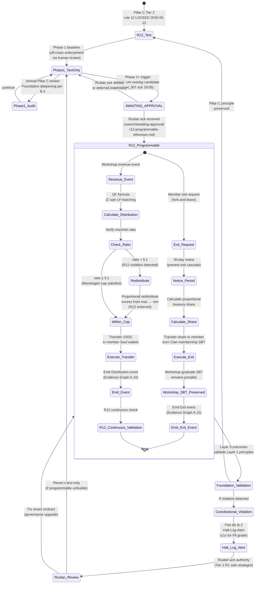

# Diagram 05 — Smart contract R12 enforcement flow

## §1 R12 programmable enforcement state diagram



## §2 Reading guide

**State machine с 3 main states + escalation paths:**

1. **Phase1_TextOnly (current state — Phase 1 baseline)** — R12 enforcement via human review. Pillar C Tier 2 rule 12 LOCKED 2026-05-12 ack'd. Annual audit cycle per B.4 Foundation evolution loop.

2. **AWAITING_APPROVAL (transition state)** — Phase 2+ Ethereum overlay candidate. Packet `swarm/awaiting-approval/r12-programmable-ethereum-2026-05-18.md` surfaced. Ruslan ack required:
   - Acked → transition to R12_Programmable state
   - Denied / deferred → stay in Phase1_TextOnly state

3. **R12_Programmable (Phase 2+ state)** — Two sub-flows:
   - **Revenue distribution flow** (top sub-state): QF formula → ratio check → redistribute if needed → execute → emit event
   - **Fork-and-leave flow** (bottom sub-state): Exit request → notice period → calculate share → execute exit → preserve Workshop-graduate SBT → emit exit event

4. **Foundation_Validation (continuous)** — Layer 3 outcomes continuously validate Layer 1 principles. If violation detected → **Halt-Log-Alert** (Part 6b §I.2; ≤1s for F8 grade) → Ruslan ack-authority review → either fix smart contract OR revert к text-only.

## §3 Critical invariants enforced

| Invariant | Enforcement mechanism |
|---|---|
| **R12 «no extraction beyond agreed share»** | Mondragón 5:1 ratio cap (revenue distribution sub-state) |
| **R12 «fork-and-leave without penalty»** | Exit flow preserves Workshop-graduate SBT + proportional treasury share |
| **Substrate-agnostic principle** | Foundation Layer 1 R12 text unchanged; programmable enforcement = RUSLAN-LAYER overlay |
| **Pillar C R7 (no autonomous arbitration)** | Constitutional violation → Halt-Log-Alert → Ruslan ack (NOT autonomous resolution) |
| **A.10 Evidence Graph** | All distributions + exits emit events; auditable history preserved |
| **F-G-R provenance** | Each distribution event carries F-G-R triple from contribution signals |
| **No exit cascade** | 30-day notice period + circuit-breaker if exit >50% in 30 days |

## §4 Pseudocode trace (one distribution event)

```
[ENTRY] Workshop revenue event: 5600 USDC enters DAO treasury

[STEP 1] Members signal contributions per project (SBT-gated; peer-attested):
  Alice → 200u, Bob → 100u, Carol → 50u, Dave → 30u
  Σ_sqrt = 14.14 + 10.00 + 7.07 + 5.48 = 36.69

[STEP 2] QF formula computes proposed distribution:
  Alice = 5600 × (14.14/36.69) = 2156 USDC
  Bob = 5600 × (10.00/36.69) = 1526 USDC
  Carol = 5600 × (7.07/36.69) = 1079 USDC
  Dave = 5600 × (5.48/36.69) = 836 USDC

[STEP 3] Mondragón 5:1 ratio check:
  max/min = 2156/836 = 2.58 ≤ 5.0 ✅
  
[STEP 4] Execute transfers:
  Alice.wallet += 2156 USDC
  Bob.wallet += 1526 USDC
  Carol.wallet += 1079 USDC
  Dave.wallet += 836 USDC
  
[STEP 5] Emit Distribution event:
  event Distribution(
    blockNumber,
    contributors[],
    contributions[],
    sharesUSDC[],
    fgrHashes[],
    timestamp
  )

[STEP 6] R12 continuous validation (off-chain monitor):
  Check distribution sum == treasury inflow ✓
  Check no contribution missing peer-attestation ✓
  Check ratio ≤ 5:1 ✓
  R12 satisfied ✓

[STEP 7] Layer 1 Foundation principle validated; loop closes
```

## §5 Source

`../03-r12-programmable-enforcement.md` §2-§4 + `../06-quadratic-funding-workshop-revenue.md` §2.3 + Part 6b §I.2 Halt-Log-Alert
