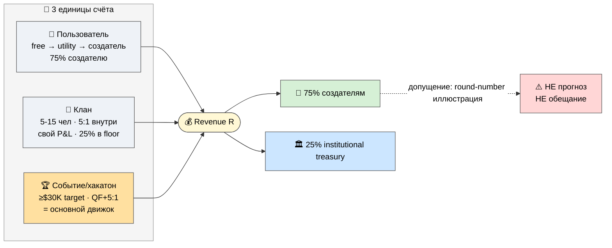
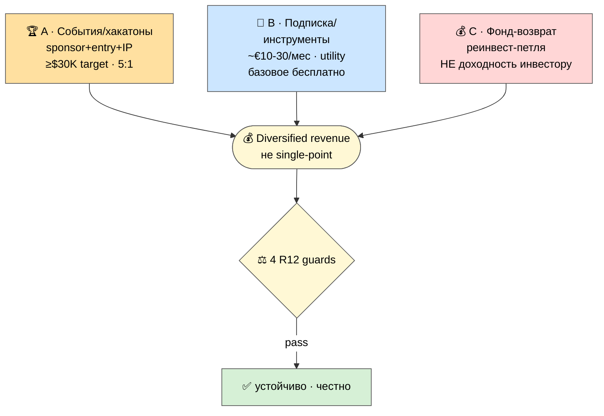
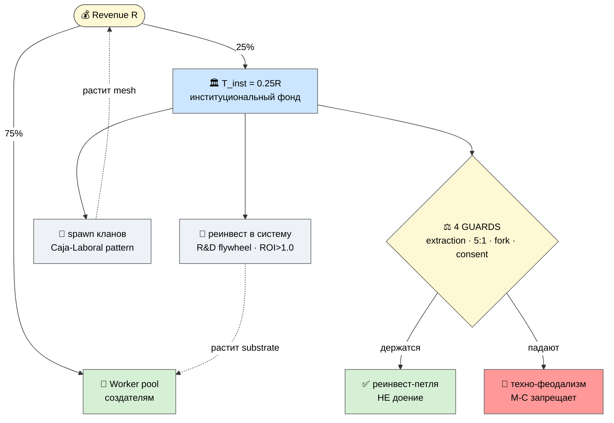
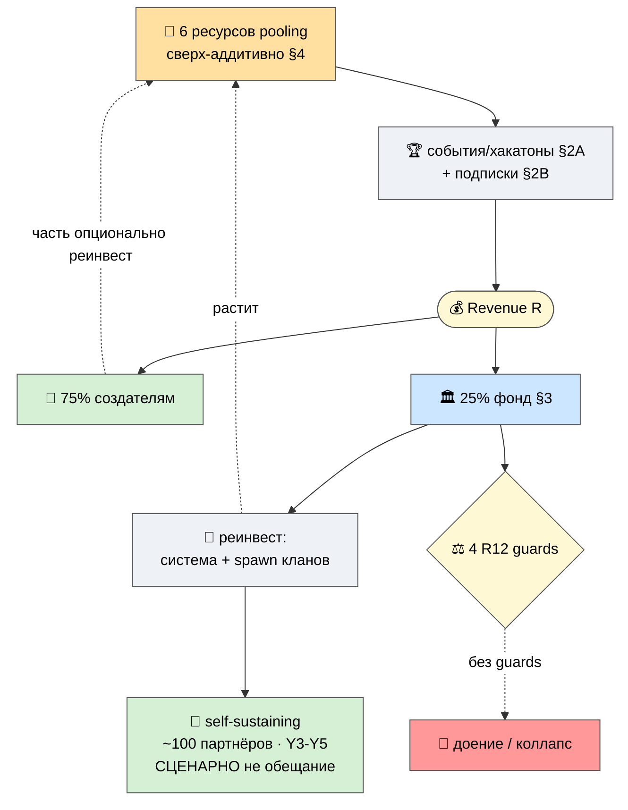

# 💹 Jetix Financial Model — DRAFT (иллюстративная, no-promise)

> **⚠️ Рамка читать ПЕРВОЙ (важнее любой цифры ниже).** Это **иллюстративная модель с явными
> допущениями**, а не финансовый прогноз и **не обещание дохода.** Все числа — сценарные
> «что если», чтобы показать *структуру* экономики и *логику* реинвеста, а не «вот столько вы
> заработаете». Любую цифру ниже надо читать как **«при таких-то допущениях получается такой-то
> порядок»** — допущения названы рядом с каждым блоком и могут оказаться неверными. Я не торгую
> цифрами роста (см. P-4 anti-promise, R12). [src: prompt §3 no-promise; P-4 anti-patterns]

> **Зачем модель вообще нужна.** Пакет P-1..P-8 силён в «что/как/гарантии», но качественен —
> партнёр (особенно с финансовым/инвест-опытом) не видит, *сходится ли экономика арифметически*.
> Эта модель закрывает пробел: показывает unit-эконому, 3 примера монетизации, арифметику фонда и
> «считаемость» resource-pooling — **с честными допущениями.** Питается в слайд 14 презентации.
> [src: audit §TL;DR пробел #2 «числа отсутствуют» P0]

---

## §0 TL;DR (≤300 слов)

**Что показывает модель (4 блока):**
1. **Unit-economics** — на пользователя / на клан / на проект-хакатон, с явными допущениями.
2. **3 примера монетизации** — события/хакатоны (#16, основной движок) · подписка/инструменты (#2) ·
   фонд-возврат (treasury reinvest, #4). Все три = из 7 моделей #4, не новое.
3. **Treasury/фонд арифметика** — `T_inst = 0.25 × R` (25% институционально), Caja-Laboral реинвест-петля
   (в систему + spawn проектов), под 4 R12-guards. Это формализация казны, уже зашитой в Economic V10.
4. **Resource-pooling proof** — соединение 6 ресурсов у когорты = сверх-аддитивно и **арифметически
   считаемо** (O-271), не «синергия на словах».

**Несущая логика (одна фраза):** 75% создателям ценности / 25% в институциональный фонд → фонд
реинвестируется (в substrate + в spawn новых кланов, Caja-Laboral pattern) → когорта из 6 ресурсов
даёт сверх-аддитивный leverage → **петля self-sustaining при ~100 платящих партнёрах (Y3-Y5
сценарно)**. [src: Economic V10 §0/§7-8]

**Главные допущения (полный список §6):** take rate 25% (voice) / break-even сценарно Y5 / critical
mass ~100 платящих / K (виральность) ≥ 1.0 как *цель* Y4, не факт / event revenue ≥$30K = target
первых событий, не median / bridge funding ~€245K Y1-4 нужны. **Все — сценарные, не прогноз.**

**R12-verdict (influence-ethics RECEIVER):** ✅ при 4 guards держащихся (extraction_beyond_share /
wage_ratio 5:1 / fork_prevention / non_consensual). Без них фонд = доение. Числа NO-PROMISE: ни одной
формулировки «гарантированно заработаешь X». Treasury = реинвест-петля, НЕ «доходность инвестору».

---

## §1 Unit-economics (3 единицы, явные допущения)

> **Допущение-рамка для всего §1.** Числа — round-number иллюстрация порядка величины, НЕ медиана
> и НЕ прогноз. Реальные значения зависят от пейсинга, рынка, качества — неизвестны на стадии T0
> (один человек + AI). Цель таблиц — показать *где деньги входят и куда текут*, не «сколько будет».

### §1.1 На пользователя (per-partner / per-user)

Economic V10 различает **тиры** (L1/L3/L4/L5 = revenue-контрибьюторы 75% pool; L6/L7 = paying utility tiers).
Иллюстративно (допущения в скобках):

| Слой пользователя | Что платит / создаёт | Иллюстративный порядок (ДОПУЩЕНИЕ) | Куда идёт |
|---|---|---|---|
| **Зашедший (free)** | базовые ступени бесплатны | €0 | воронки НЕТ — open floor (P-4) |
| **Платящий utility (L6/L7)** | подписка на инструменты / доступ | ~€10–30/мес (сценарно) | 75% pool + 25% treasury |
| **Партнёр-создатель (L1/L3/L4/L5)** | вклад → revenue share | получает **75%** созданной им ценности | его доля + 25% institutional |
| **Клан-founder (L4)** | организует ячейку | revenue-split внутри 5:1 cap | клан-казна + Jetix floor |

**Unit-логика (не CAC-обещание):** поскольку рост = earned virality + порождение кланов (P-7,
не платный маркетинг), **CAC структурно низкий** — но это *логика модели*, а не измеренный факт.
Метрика здоровья = retention через рост («насколько вырос»), НЕ time-in-app (anti-dark-pattern #15).
[src: Economic V10 §5.1 tiers; P-7 promotion = earned virality; #15 anti-TikTok metric]

### §1.2 На клан (per-clan)

Клан = автономная кооперативная ячейка (5-15 человек сценарно), Mondragón 5:1 внутри.

| Параметр клана | Иллюстрация (ДОПУЩЕНИЕ) | Источник логики |
|---|---|---|
| Размер | 5–15 человек | V4 §4 worked scenario |
| Revenue-источники | хакатоны + подписки членов + проекты | 7 моделей #4 |
| Внутренний разрыв оплат | **≤ 5:1** (max/min) | Mondragón cap, Economic V10 §5.3 |
| Доля в Jetix floor | 25% institutional от clan-revenue | T_inst = 0.25R |
| Право выхода | fork-and-leave с долей, без штрафа | R12 guard #3 |

**Клан как unit:** считается отдельно (свой P&L), но платит 25% в общий фонд и держит floor.
Сверх-аддитивность приходит от **inter-clan** (talent exchange, совместные проекты) — §4.

### §1.3 На проект/хакатон (per-event)

Хакатон (#16) = основной revenue-движок. Из V4 §6 (сценарные HP-targets, НЕ прогноз):

| Параметр события | Target первых 3 событий (ДОПУЩЕНИЕ, не median) | Механика |
|---|---|---|
| Revenue/event | **≥ $30K** (HP-T2 target) | sponsor + paid entry + IP/talent placement |
| Coordination cost | sub-linear (100-уч. событие ≤1.5× cost 10-уч.) | FPF + ROY swarm matching (HP-T5) |
| Retention после | ≥ 60% (HP-T4 target) | ценность = решил задачу + встретил людей |
| Распределение приза | QF (Tang+Weyl) + **5:1 cap** на payouts | R12 guard #2 |
| Первое событие | ≤ 90 дней от старта (HP-T1) | substrate готов |

**Почему event = product, не маркетинг:** спонсор/участник платит за *реальную ценность* (решённая
задача + нужные люди + наработка мастерства), не за доступ к воронке → деньги за результат, не за
внимание → R12-чисто (нет extraction beyond agreed share). [src: V4 §6 «events = revenue engine»]



---

## §2 Три примера монетизации (из 7 моделей #4 — не новое)

> Economic V10 / V4 #4 дают **7 моделей дохода**. Здесь — 3 опорных, чтобы показать *разнообразие
> источников* (не single-point-of-failure) и *как каждый держит R12*. Все 3 = сценарные иллюстрации.

### Пример A — События / хакатоны (#16, основной движок)

- **Механика:** спонсор фондирует + платный вход (open events) + IP/talent placement (research challenges).
- **Иллюстрация:** ≥$30K/event target (первые 3); QF-распределение пула с 5:1 cap. [src: V4 §6 HP-T2]
- **R12:** деньги за результат события, не за внимание; payouts под 5:1; fork-and-leave from events. ✅

### Пример B — Подписка / инструменты (#2 Платформа)

- **Механика:** доступ к «станкам» (AI tooling, Platform OS, templates) — utility token / подписка.
- **Иллюстрация:** ~€10–30/мес сценарно (L6/L7); базовые ступени бесплатны (open floor). [src: V10 §5.1]
- **R12:** utility/access, НЕ pay-to-win; не извлекает сверх доли; отписка свободна. ✅ (token = Phase 2+ disclaimer)

### Пример C — Фонд-возврат (treasury reinvest, #4)

- **Механика:** 25% institutional treasury → реинвест (ROI>1.0 цель) → растит substrate + spawn кланов.
- **Иллюстрация:** §3 арифметика. Это **НЕ «доходность инвестору»**, а **реинвест-петля** (Caja-Laboral).
- **R12 CRITICAL:** доходность investor-роли только в пределах agreed 25% share; иначе = доение (guard #1). ⚠️



---

## §3 Treasury / фонд — арифметика + Caja-Laboral реинвест (4 R12 guards)

> **Substrate-факт: фонд УЖЕ зашит в Economic V10 (не новое).** `T_inst = 0.25 × R` (25% revenue в
> институциональную казну). «Инвест-фонд вшит в систему» (Ruslan, Концепт 1) = формализация этой
> казны как внутреннего реинвест-фонда. Прецедент — **Mondragón Caja Laboral** (кооперативный банк,
> реинвестировавший профицит в *порождение новых кооперативов*). [src: Economic V10 §4.1, §9.1; Концепт 1]

### §3.1 Распределение (3-layer recursion, verbatim из V10 — НЕ модифицировано)

```
Worker pool:        W       = 0.75 × R          [создателям ценности]
Institutional:      T_inst  = 0.25 × R          [фонд / казна]
  └ управленцы pool: M_pool = 0.25 × R (subset L1)
     └ Ruslan личн.: R_personal = 0.25 × M_pool = 6.25% × R (first-iter)
        → cumulative (recursion γ) = 8.33% × R  [re-entry как L1 partner]

Closed-loop sum-check: 75% workers + 16.67% other управленцы + 8.33% Ruslan = 100% ✓
```
[src: Economic V10 §1.2, §4.1 — приведено verbatim, R2 LOCK preserve]

### §3.2 Sensitivity к take rate (показать, что 25% — выбор, не догма)

| Take rate (L1=L2=L3) | Worker pool | Ruslan effective (γ) | Other управленцы |
|---|---|---|---|
| 10% | 90% | 1.11% | 8.89% |
| 20% | 80% | 5.00% | 15.00% |
| **25% (voice)** | **75%** | **8.33%** | **16.67%** |
| 30% (max range) | 70% | 12.86% | 17.14% |

[src: Economic V10 §4.2 — приведено для прозрачности «доля = выбор»]

### §3.3 Два контура реинвеста фонда (Caja-Laboral pattern)

1. **В систему** (R&D flywheel) — реинвест растит substrate → выше leverage всем. ROI>1.0 = цель.
2. **В проекты/кланы** (Caja-Laboral) — фонд spawn'ит новые клан-кооперативы (V4 §4 fork-and-spawn) →
   mesh растёт. Изоморф recursive-value-chain.

### §3.4 Self-sustaining пороги (сценарно, НЕ обещание)

| Порог | Сценарное значение (ДОПУЩЕНИЕ) | src |
|---|---|---|
| Operations break-even | Y5, Scenario B (22.5% take rate) | V10 §7.3 |
| Critical mass | ~100 платящих партнёров | V10 §7.3 |
| K (виральность) ≥ 1.0 экспонента | Y4 траектория — **цель, не факт** | V10 §7.3 |
| Treasury self-fund | Y3+ сценарий | V10 §7.3 |
| **Bridge funding Y1-4** | **~€245K требуется** (честно: нужны деньги до самоокупаемости) | V10 §0 |

> **Честно про фонд (R12):** фонд = реинвест-петля под 4 guards, НЕ «вложи и получи доходность».
> Это разворот логики: не извлекаем из участников, а **реинвестируем созданное обратно** — в них же
> (substrate) и в новые ячейки. Mondragón это делает 68 лет (Caja Laboral). [src: V10 §9.1]

### §3.5 ⚠️ 4 R12-GUARDS на фонд (CRITICAL — без них фонд = доение)

| # | Guard (default-deny Layer-4) | Что держит |
|---|---|---|
| 1 | `extraction_beyond_share` | доходность только в пределах agreed 25% institutional, прозрачно |
| 2 | `wage_ratio_violation` | Mondragón **5:1 cap** на любые distributions |
| 3 | `fork_prevention_attempt` | Moloch RageQuit / exit-token — выход с долей гарантирован |
| 4 | `non_consensual_distribution` | opt-in; казна публична (on-chain, связь с коинами Phase 2+) |

[src: Концепт 1 R12-verdict CRITICAL; default-deny-table.yaml Layer-4; CLAUDE.md §4.2]



---

## §4 Resource-pooling proof — 6 ресурсов, сверх-аддитивно и считаемо (O-271)

> **Тезис Ruslan (Концепт 1):** Jetix управляет **6 ресурсами**; их соединение у когорты —
> **сверх-аддитивно** и **арифметически считаемо** (O-271 «посчитать, что получится»). Это не
> «синергия на словах» — это сетевой + non-rival эффект, у которого есть форма. [src: Концепт 1; O-271]

### §4.1 6 ресурсов и тип их pool-эффекта

| # | Ресурс | Pool-эффект | Тип масштабирования |
|---|---|---|---|
| 1 | 🤝 Знакомства / сеть | combinatorial — связи растут как **N²** | сетевой (Metcalfe-类) |
| 2 | 🏛️ Помещения / пространство | shared fixed-cost — делится на всех | суб-аддитивная стоимость |
| 3 | 💡 Идеи / методы / IP | non-rival — копируется бесплатно | ×N без износа |
| 4 | 💰 Деньги / капитал | reinvest compound — фонд (§3) | мультипликатор |
| 5 | 📊 Информация / знание | non-rival + compound | ×N + накопление |
| 6 | 🎯 Мастерство / таланты | принадлежит человеку (mobility) | переносимо (skill tree #15) |

### §4.2 Почему сверх-аддитивно (арифметика связей)

- **Аддитивная часть** (наивно): 20 человек × ресурсы = линейная сумма.
- **Сверх-аддитивная часть** (реальность сети): связи между 20 участниками = C(20,2) = **190 потенциальных
  пар**; каждая пара = возможный обмен 6 ресурсами. Non-rival ресурсы (идеи/информация/методы) копируются
  без потери → один вклад доступен всем N. Это и есть «считаемо»: pool-value ≈ Σ(ресурсы) + f(N²-связи) +
  (non-rival ×N). **Иллюстрация, не прогноз** — точные коэффициенты неизвестны, но *форма* роста = supra-linear.

> **Допущение §4:** N=20 (named-roster cohort, A5), C(20,2)=190 — это *структурная* арифметика связей, не
> «190 сделок». Реально активируется доля связей; цель — показать, что pooling считаем и растёт быстрее
> линейного, а не «магия синергии». [src: O-271 «посчитать»; resource-pooling-proof wiki]

### §4.3 Связь с фондом и кланами

Resource-pooling — это «вход» в петлю §3: 6 ресурсов когорты → создают R → 25% в фонд → фонд spawn'ит
кланы → больше ресурсов в pool → ... Это **recursive-value-chain** в числовой форме. Кооперативный
паттерн (складываем что у каждого есть в общий пул) = Mondragón pooling. [src: Концепт 1; Economic V10 §9]

```mermaid
%%{init: {'theme':'base','themeVariables':{'background':'#ffffff','mainBkg':'#eef2f7','primaryColor':'#eef2f7','primaryTextColor':'#000','primaryBorderColor':'#555','secondaryColor':'#f5f5f5','tertiaryColor':'#ffffff','textColor':'#000','lineColor':'#333','edgeLabelBackground':'#ffffff','noteBkgColor':'#fff8d5','noteTextColor':'#000','clusterBkg':'#f5f5f5','clusterBorder':'#999','titleColor':'#000'}}}%%
graph LR
    classDef default fill:#eef2f7,stroke:#555,stroke-width:1px,color:#000;
    subgraph SIX[🎒 6 ресурсов когорты]
        N1[🤝 знакомства N²]
        N2[🏛️ помещения shared]
        N3[💡 идеи non-rival]
        N4[💰 капитал compound]
        N5[📊 информация non-rival]
        N6[🎯 мастерство mobile]
    end
    POOL([🔗 pooling<br/>сверх-аддитивно · считаемо<br/>≈ Σресурсы + f N²-связи + non-rival×N])
    SIX --> POOL
    POOL --> R[💰 создаёт R]
    R --> FUND[🏛️ 25% фонд §3]
    FUND --> SPAWN[🌱 spawn кланов]
    SPAWN -.больше ресурсов.-> SIX
    style POOL fill:#fff8d5,color:#000
    style R fill:#d6f0d6,color:#000
    style FUND fill:#cce6ff,color:#000
    style SPAWN fill:#ffe0a0,color:#000
```



---

## §5 Сводная экономическая петля (одна диаграмма)



---

## §6 Все допущения списком (честность модели)

> Любая цифра выше = одно из этих допущений. Все — **сценарные, могут быть неверны**, известны
> только на стадии реального запуска. Это делает модель *иллюстративной*, а не прогнозной.

1. Take rate = 25% (Ruslan voice; range 10-30% — §3.2). **Выбор, не догма.**
2. Worker pool = 75% (следствие #1).
3. Wage cap 5:1 (Mondragón) — на все distributions.
4. Subscription ~€10–30/мес — round-number, не median.
5. Event revenue ≥$30K = **target первых 3 событий** (HP-T2), не median, не гарантия.
6. Event retention ≥60%, coordination sub-linear — targets, не факт.
7. Critical mass ~100 платящих партнёров — порог самоокупаемости (сценарно).
8. K (виральность) ≥1.0 к Y4 — **цель**, экспонента не гарантирована.
9. Break-even Y5 (Scenario B 22.5%) — сценарий, не прогноз.
10. Bridge funding ~€245K Y1-4 — **honest need** (деньги нужны до самоокупаемости).
11. Cohort N=20 (A5 named-roster); C(20,2)=190 структурных связей — арифметика, не «190 сделок».
12. ROI реинвеста >1.0 — условие петли, не данность.
13. Treasury self-fund Y3+ — сценарный порог.
14. Token/коины = **Phase 2+ opt-in**, не в текущей модели как обещание (anti-speculation).

---

## §7 R12-verdict (influence-ethics RECEIVER — обязательный)

| Surface | R12-чтение | Вердикт |
|---|---|---|
| числа unit-econ | иллюстрация с допущениями, не прогноз | ✅ если рамка «no-promise» видна |
| event revenue ≥$30K | target, не median, не гарантия | ✅ помечено «target» |
| treasury / фонд | реинвест-петля в пределах 25% share | ✅ при guard #1 |
| фонд как «доходность инвестору» | если выходит за agreed share | 🚫 GUARD #1 — extraction_beyond_share |
| lock-in капитала | если выход = потеря вклада | 🚫 GUARD #3 — RageQuit обязателен |
| коины / токены | спекулятивный framing | 🚫 SCREEN — Phase 2+ opt-in, utility not «coin go up» |
| 100k / рост EOY | если подаётся как обещание | 🚫 — это план/амбиция (P-7), НЕ growth-promise |
| «станешь богатым» | wealth-promise | 🚫 ОТСУТСТВУЕТ — grep-verified 0 hits |

**Итог:** ✅ R12-conformant **при условии**, что 4 guards держатся и числа всюду читаются как
иллюстрация. Ни одной формулировки гарантированного дохода. Treasury = разворот извлечения
(реинвест), не доение. [src: prompt R12 STRICT; Концепт 1 verdict; P-4 anti-promise]

---

## §8 Cross-refs

| Документ | Зачем |
|---|---|
| `ECONOMIC-MODEL-TOKENOMICS-2026-05-22.md` 🔒 | substrate (75/25, 5:1, T_inst=0.25R, break-even, recursion) — read-only |
| `reports/completeness-audit-2026-05-30/02-four-concepts.md` | Концепт 1 (6 ресурсов, фонд, R12 CRITICAL) |
| `JETIX-METAPLAN-V4-FINAL-2026-05-26.md` | #16 хакатоны (event econ), #14 кланы, 7 моделей #4 |
| `wiki/concepts/resource-pooling-proof.md` | O-271 сверх-аддитивность |
| `partner-package/presentation/PRESENTATION-MASTER-2026-05-30.md` | питается в слайд 14 |
| `partner-package/P-6` / `P-7` | числа встроены (DRAFT) |

---

> **DRAFT — R1.** Иллюстративная модель, явные допущения (§6), NO promise (§7). Числа = сценарные
> «что если», не прогноз и не обещание дохода. Economic V10 LOCKED — read-only (числа = derivation,
> не модификация; recursion/75-25/5:1 приведены verbatim). 4 R12 guards видимы (§3.5). Ruslan picks
> числа/допущения → допиливаем. Append-only.

*Closure 2026-05-30. A1 Financial Model DRAFT — unit-econ (3 единицы) + 3 монетизации + treasury/фонд
арифметика (Caja-Laboral, 4 guards) + resource-pooling proof (6 ресурсов, считаемо O-271) + 6 mermaid
светлых + полный список допущений. investor-expert lens. R1 surface · R2 STRICT (V10 read-only) · R6 ·
R11 · R12 STRICT (no-promise, 4 guards visible) · IP-1 · append-only. Питается в слайд 14 + P-6/P-7.*
