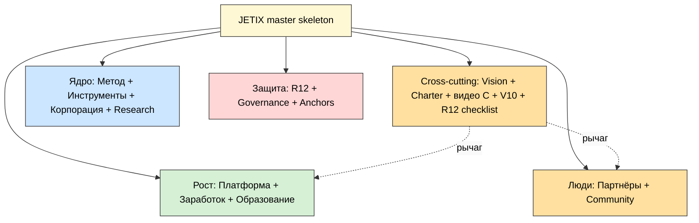

# 🗺️ Jetix Full Map + Documents Skeleton — master consolidated (25.05.2026)

> **Два задания в одном.** **Task A** — «Что Jetix есть на 25.05?» (все сущности +
> направления + статус + устаревшее). **Task B** — «Какие документы ДОЛЖНЫ быть у нормальной
> корпорации?» (скелет всех документов + GAP vs существующего + приоритеты). **Финал** —
> master skeleton: одна структура, которую ты фиксируешь как THE primary, и дальше «не
> добавляем новое — подтягиваем под скелет».
>
> **Как читать:** этот main = deep reference (45-60 мин). Для быстрого обзора —
> `reports/.../00-SUMMARY-FOR-RUSLAN.md` (10 мин). Для drill-down — 14 phase-report'ов.
>
> **R1 surface only.** Здесь факты + варианты + структура. Финальная фиксация и приоритеты —
> твои (§12 — очередь решений). IP-1: имена = примеры ролей, не назначения.

---

## §0 TL;DR (90 секунд)

- **Что Jetix есть:** зрелый методологический + архитектурный substrate **без выхода
  наружу**. Внутри построено всё (метод V2, корпорация-как-код, R12-защита, экономика V10,
  5 research-deep'ов, 750 wiki-сущностей, 80+ книг — saturation подтверждён). Снаружи —
  недостроено: видео нет, Notion-базы на дизайне, Charter-текста нет, юрлица нет, Wave 1 не
  отправлен.
- **Где стоим:** Build, середина. Build readiness ≈ **70%**. Маховик пока крутится руками
  основателя.
- **12 сущностей:** Метод 🔒 / Инструменты 🟢 / Корпорация 🔒 / Заработок 🔒+🟢 / Платформа 🟡 /
  Образование 🟡 / Партнёры 🟡 / Community 🟡 / R12 🔒 / Governance 🟢 / Research 🟡 / Anchors 🟡.
- **Куда идём:** 6 векторов (Платформа · Кооп-экономика · Дистрибуция · AI-электрификация ·
  Tier-1 outreach · Network State/кланы). Все активные упираются в **видео A**.
- **Документы:** **94 описано** по 12 категориям — **36 ✅ / 25 ⚠️ / 33 ❌**. Дыры
  кластеризованы: Brand (25%), Financial (38%), HR (43%), Legal (44%), Community (56%).
  Глубина (Research 100%) и защита (Risk 86%) — закрыты.
- **Build-критичные дыры (P0):** видео A · Charter v1 текст · Notion implement · legal старт ·
  discovery script универсальный.
- **Master skeleton:** 4 super-кластера (Ядро / Рост / Люди / Защита+координаты) × 12
  сущностей + 5 cross-cutting docs (Vision · **Charter** · видео C · Economic V10 · R12
  checklist). Charter и видео C — самые рычажные (Charter закрывает 8 сущностей).
- **10-15 решений ждут тебя в §12.**

---

## §1 Jetix entities — что есть (12 сущностей)

> Полная версия: `reports/.../02-entities-full.md`. Здесь — сжатая карта.

### 🔵 Ядро (что знаем и чем делаем)

**1. 🟦 Метод** — способ объединять методы для улучшения системы самой себя (O-107). Внутри:
мета-метод из 8 компонент, мета-контроль (управляю не X, а Y что управляет X), принцип
внешней системы (управляемая система имеет слепые зоны — независимая внешняя добавляет
разнообразие, кибернетически доказуемо). Родословная: Щедровицкий → Левенчук → Руслан.
🔒 **Method V2 LOCKED** (21.05).

**2. 🛠️ Инструменты** — рабочий слой: 54 skills + 17 ROY-агентов + голосовой конвейер
(диктовка→транскрипт→пункты→ревью, DRAFT-only) + CRM (180 контактов) + Mistral OCR + Toggl.
Принцип: filesystem = источник правды, Notion = витрина. 🟢 active.

**3. 🏛️ Корпорация** — конституционная архитектура (не юрлицо): 11 Foundation Parts +
Pillar A/C + FPF + 12 конституционных правил. Компания-как-код: каждое изменение —
структурированный коммит, откат через `git revert`, архитектура только через гейт. 🔒
LOCKED 28.04, 8 RUSLAN-ACK.

**4. 📚 Research substrate** — глубина: 5 research-deep'ов (methodology / sota /
propaganda-recruitment / nlp / levenchuk-master) + 80+ книг + 750 wiki-сущностей (909 edges).
Saturation подтверждён (O-163) — **накопление останавливаем**. 🟡 5 deeps complete, R1 ack
pending.

### 🟢 Рост (как масштабируемся и зарабатываем)

**5. 🚀 Платформа** — три режима одной системы: Build / Run / Scale. Переключатель — «кто
крутит маховик», не «сколько людей». Слои: Personal OS (L1-2) → Team OS (L3) → кланы (Scale).
Cohort target ontology O-161/O-162. 🟡 **Build, середина**. Блокер: видео A + Notion implement.

**6. 💰 Заработок** — 8 моделей дохода на 3 принципах (рекурсивные 25% / тройная роль /
замкнутый контур). Worker share 75/25 · Workshop €1500/мес · quick-money consulting (active) ·
IP licensing · Tokenomics V10 (Phase 2+) · QF. Потолок 5:1 (Mondragón). 🔒 Economic V10 +
🟢 quick-money. Break-even Y5 при ~100 партнёрах.

**7. 🎓 Образование** — не «напихивать знания», а ставить **прошивку** (системное мышление +
ответственность + инженерный подход + «сначала вопрос» + честность). AI делает рутину в
100-1000× дешевле → ценность ушла на cross-skill (O-176). 7 ступеней × Bloom × 7-variant
catalog (Free…€50K). 🟡 pool, R1 picks pending. Блокер: видео B + курс.

### 🟠 Люди (с кем и для кого)

**8. 👥 Партнёры** — 4 типа (T1 методолог ⭐⭐⭐ / T2 ресурсы / T3 аудитория-тестеры /
T4 консультанты) + 6 архетипов + Wave 1. Каждый партнёр в трёх ролях (воркер 75% + инвестор +
промоутер). 🟡 substrate ready, видео A блокирует рассылку. *(Maxim/Oleg/Левенчук/Дмитрий/
Сева/Прапион/Цэрэн = примеры ролей, IP-1.)*

**9. 🌐 Community / Cohort** — учебно-производственная единица с Charter (права/обязанности/
выход/доля/потолок). O-161 первичная когорта (5-10 основателей), O-162 маховик. Mondragón
governance (1-член-1-голос, 10% соц-фонд) + anti-cult дисциплина. 🟡 O-161 инициируется,
Charter текст ❌.

### 🔴 Защита + координаты

**10. ⚖️ R12 anti-extraction** — 12-е конституционное правило: «не извлекать сверх
согласованной доли; уход без штрафа» (LOCKED 12.05). 4 action classes + потолок 5:1 +
8 paired-frame вопросов + influence-ethics auto-fire + Halt-Log-Alert. Защита от двух
сценариев Scale: секта / корпорация-с-диктатором. 🔒 + ⚪ smart-contract Phase 2+.

**11. 🎛️ Governance** — Stage Gates SG-1..SG-4 + Steward + brigadier hub-and-spoke + DAO
multi-clan (Phase 2+) + SBT + Руслан = единственный R1-стратег (corrigibility: никто не
запирает владельца вне контроля). 🟢 SG active / ⚪ DAO Phase 2+.

**12. 🎯 Strategic anchors** — конституционные координаты: 29 D-LOCK + 7 инсайтов + O-числа
(O-107/O-128/O-160/O-176..185) + JETIX-AS-X хабы (D-08 layered identity: Jetix = методология +
компания + сеть + клуб + корпорация + цивилизационная инфраструктура одновременно). 🟡 29
D-LOCK scaffold-pending.

→ Схема: **JE-1** (дерево сущностей, 37 узлов) — см. `diagrams/_INDEX.md`.

---

## §2 Directions — куда идём (6 векторов)

> Полная версия с горизонтами/вехами/блокерами: `reports/.../03-directions.md`.

| # | Направление | Статус | Горизонт-якорь |
|---|---|---|---|
| 1 | 🚀 Платформа «метод-метод» (AI-OS) | активно (Build) | 1M cohort к 2029, MRR €37-75M/мес |
| 2 | ⚖️ Кооперативная экономика (R12+Mondragón+Ethereum) | активно / Phase 2+ | Ethereum on-chain в Scale |
| 3 | 📡 Массовая дистрибуция (каскадные волны) | активно (Build→Run) | 100K cumulative Y1 |
| 4 | ⚡ AI-электрификация («appliances + electricians») | Phase 2+ (research-pending) | V11 token cooperation |
| 5 | 🤝 Tier-1 outreach (Layer 1 Foundation) | активно (Wave 1) | 10-15 builders, вторичный охват 10M |
| 6 | 🌐 Network State / кланы (рекурсивный спавн) | дальний (2027-2028+) | 10+ кланов, кооператив legal |

**Единая критическая зависимость:** три активных вектора (1/3/5) упираются в **видео A**.
Без него Wave 1 нельзя отправить — отправка без видео «сжигает контакты». *(Факт зависимости,
не приоритет — выбираешь ты.)*

→ Схема: **JE-2** (направления × горизонты).

---

## §3 Status snapshot — где стоим

> Полная версия: `reports/.../04-status-snapshot.md`.

**Build readiness ≈ 70%** (сверено с DOCS-CLASSIFICATION §10). Но это вводит в заблуждение:
внутренние сущности ~93%, outward-сущности ~48%.

```
🟦 Метод 95  🛠️ Инструменты 85  🏛️ Корпорация 95  💰 Заработок 70
🚀 Платформа 45  🎓 Образование 55  👥 Партнёры 60  🌐 Community 40
⚖️ R12 90  🎛️ Governance 75  📚 Research 95  🎯 Anchors 75
```

**По слоям:** 🟢 пояснительные 60% · 🛠️ шаблоны 40% · 📚 substrate 95% · ⚙️ system 95%.

**Блокеры:** видео A (#1, держит 4 сущности) · Notion Personal OS implement · Charter v1 текст ·
юр+финансы · discovery script универсальный · лендинг+FAQ.

**Quick wins:** Steuerberater email (~30 мин) · discovery script (~1-2ч) · JETIX-NAVIGATION
polish · 29 D-LOCK promotion (батч) · FAQ structure.

→ Схема: **JE-3** (тепловая карта готовности).

---

## §4 Outdated — что устарело (drop ≠ delete)

> Полная версия: `reports/.../05-outdated.md`. Append-only — ничего не удаляем, только из
> активного фокуса.

- 🗑️ **Legacy 12-агентный roster** → ROY swarm (DEPRECATED-2026-05-17, архив `_archived/`)
- 🗑️ **Method V1** → V2 · старые tokenomics → V10 · старый call-plan → 25.05 версия
- 🗑️ **`distribute.py`** → заархивирован осознанно (DRAFT-only, чтобы AI-выводы не попадали в KB)
- 🗑️ `knowledge-base/` → Wiki v2 (миграция, см. MIGRATION.md)
- ⏳ **Scaffold-pending (висит, не устарело):** 29 D-LOCK + 7 insights (Wave 1.4)

**НЕ устарело (anti-confusion):** 80+ книг, 5 research-deep'ов, Ethereum bundle (Phase 2+),
POINT-A/B, JETIX-AS-X hubs, wiki. Дата ≠ устаревание; устарело = *заменено новее версией*.

---

## §5 Reference corporations — какие документы у нормальных корпораций

> Полная версия: `reports/.../08-reference-corps.md`. F3 general knowledge, без нового research.

7 референсов и чему учат:
- **Apple** → строгий brand book + публичный design/method guideline + API/template docs
- **Tesla** → публичный «Master Plan» + открытость части IP
- **Mondragón** ⭐ (наш главный) → Charter/statutes + wage-ratio 5:1 + social fund 10% + 1-член-1-голос + education arm — **почти всё уже в нашем Economic V10 / R12 / Education**
- **Berkshire** → plain-language annual letter (стилистический референс PARTNER-OFFERING) + owner's manual (= наш Pillar C + Charter)
- **Equal Exchange + John Lewis** → публичная Constitution + mission-lock (= fork-and-leave + R12) + patronage policy
- **OpenAI + Anthropic** → публичный Charter с миссией + safety framework по уровням (= наш Halt-Log-Alert F2/F4/F8 + Stage Gates) + research papers + «core views» документ

**Вывод:** Jetix = кооператив (Mondragón) + deep-tech (Anthropic) + методологический IP
(уникально) одновременно (D-08). Значит skeleton = универсальный минимум + кооперативная
надстройка + deep-tech надстройка + IP-слой. Бóльшая часть «правильных» документов **уже
спроектирована в substrate** — но не оформлена в нужном жанре/аудитории.

---

## §6 Doc categories — 12 категорий

> Полная версия: `reports/.../09-doc-categories.md`.

| # | Категория | Аудитория | Формат | R12 STRICT |
|---|---|---|---|---|
| 1 | 📜 Executive | Руслан + T1/T2 | MD+PDF | — |
| 2 | 🧪 Methodology/IP | T1 + cohort | MD+видео | — |
| 3 | 🏗️ Platform/Product | T3 + T1 | Notion+MD | — |
| 4 | 👥 Community/Cohort | cohort | Charter+Notion | ⚠️ |
| 5 | 💰 Financial | Руслан + T2 | MD+sheet+PDF | косв. |
| 6 | ⚖️ Legal/Governance | Руслан + Steward | PDF+MD+chain | косв. |
| 7 | 🎨 Brand/Marketing | mass + T2 | brand book+лендинг | ⚠️ |
| 8 | 🔬 Research/Knowledge | internal | MD+wiki | — |
| 9 | 🤝 Partner-facing | T1-T4 | MD+PDF+видео | ⚠️ |
| 10 | 📊 Operational | internal+sales | Notion+sheet | косв. |
| 11 | 🎯 HR/People | Руслан+hires | MD+Notion | ⚠️ |
| 12 | 🚨 Risk/Compliance | Steward+audit | MD+JSONL | ⚠️ сама R12 |

**R12 STRICT** на 4 категориях (Community/Brand/Partner-facing/HR) — там динамика влияния/
вербовки. influence-ethics + recruitment-dynamics + propaganda + nlp auto-fire.

---

## §7 Per-category docs — 94 документа (сжато)

> Полная версия с per-doc скелетами: `reports/.../10-per-category-docs.md`. Per-category
> matrix — `reports/.../diagrams/_INDEX.md` §matrix. **NO sample content** — только скелеты.

| Категория | Docs | ✅ | ⚠️ | ❌ | Ключевые ❌ |
|---|---|---|---|---|---|
| 📜 Executive | 8 | 4 | 2 | 2 | Master Plan public, OKR |
| 🧪 Methodology/IP | 7 | 3 | 3 | 1 | IP licensing terms |
| 🏗️ Platform/Product | 8 | 2 | 4 | 2 | Personal OS implement, feature specs |
| 👥 Community/Cohort | 9 | 1 | 4 | 4 | **Charter текст**, CoC, onboarding, mentor matrix |
| 💰 Financial | 8 | 2 | 1 | 5 | budget sheet, invoice, contract, bookkeeping |
| ⚖️ Legal/Governance | 9 | 2 | 2 | 5 | legal entity, Charter legal, agreements, privacy |
| 🎨 Brand/Marketing | 8 | 0 | 2 | 6 | **brand book, лендинг, FAQ, pitch, Telegram** |
| 🔬 Research/Knowledge | 7 | 5 | 2 | 0 | — |
| 🤝 Partner-facing | 9 | 6 | 1 | 2 | **discovery script универс.**, видео C, onboarding |
| 📊 Operational | 7 | 4 | 2 | 1 | customer success/support |
| 🎯 HR/People | 7 | 2 | 1 | 4 | hiring, performance, comp 5:1, handbook |
| 🚨 Risk/Compliance | 7 | 5 | 1 | 1 | privacy/data policy |
| **ИТОГО** | **94** | **36** | **25** | **33** | |

→ Схемы: **JE-4** (таксономия 12 кат + типы), **JE-5** (категории с overlay есть-нет).

---

## §8 GAP summary — где дыры

> Полная версия: `reports/.../11-gap-mapping.md`.

```
📜 Executive 75   🧪 Methodology 86   🏗️ Platform 75   👥 Community 56 ←
💰 Financial 38 ← ⚖️ Legal 44 ←       🎨 Brand 25 ←←   🔬 Research 100
🤝 Partner 78     📊 Operational 86   🎯 HR 43 ←        🚨 Risk 86
```

**5 категорий-дыр:** Brand (25%, главная) · Financial (38%) · HR (43%) · Legal (44%) ·
Community (56%). Остальное ≥75%.

**Сверка с DOCS-CLASSIFICATION 19-GAP:** их 19 = подмножество наших 33 ❌ + 25 ⚠️. Наша
карта **шире** — добавила «вторую волну» дыр (HR/Legal entity/Financial ops), невидимую в
текущем DOCS-CLASSIFICATION, но критичную при Build→Run переходе (найм 5 ассистентов требует
compensation structure).

**Главный вывод:** мы **не недоинвестировали в понимание** (глубина закрыта) — мы
недоинвестировали в **упаковку наружу** (Brand/Partner-facing) и **operational-инфраструктуру
роста** (HR/Legal/Financial-ops).

→ Схема: **JE-6** (тепловая карта GAP по приоритету × этап).

---

## §9 Prioritization — очередь приоритетов

> Полная версия: `reports/.../12-prioritization.md`.

**Build stage (выход ≈15-22.06):**
- **P0 (5):** видео A · Charter v1 текст · Personal OS implement · legal entity старт · discovery script универсальный
- **P1 (6):** лендинг+FAQ · видео B/C · invoice/contract · partner agreement
- **P2-P4:** one-pager · Master Plan public · brand-minimum · Telegram · D-LOCK promotion · (откладываем: курс end-to-end, HR docs, DAO, IP licensing)

**Run stage (после Build exit):** P0 = CoC + onboarding cohort + compensation 5:1 + budget.
**Scale stage (2027-2028+):** P0 = кооператив legal + Charter 50+ overlay + R12 smart-contract.

**3 факта (R1):**
1. Build exit держится на ~5 P0; видео A — единственный, блокирующий 4 сущности сразу.
2. ⅔ missing-docs (Run/Scale) **намеренно** P2-P4 сейчас — рано (ловушка «накопить ещё»).
3. «Вторая волна» дыр (HR/Legal/Financial-ops) критична при Build→Run, невидима сейчас.

**3 варианта sequencing:** (A) sequential, видео A первым · (B) parallel tracks (видео ∥
Charter ∥ legal) · (C) quick-wins first (discovery+Steuerberater+D-LOCK → видео A). *Выбор твой.*

→ Схема: **JE-7** (таймлайн Build-Run-Scale с очередью).

---

## §10 Master skeleton — THE primary structure (центральный раздел)

> Полная версия: `reports/.../14-master-skeleton.md`.

**Принцип.** 12 сущностей = «ЧТО есть»; 12 категорий = «КАК задокументировано»; master
skeleton = сетка, где ячейка = «эта сущность, описанная в этом жанре». Для фиксации —
сгруппированное дерево (не дробный 12×12 grid):

### 🔵 КЛАСТЕР 1 — Ядро
- Метод → Method V2 ✅ + meta-method ✅ + FPF ✅ + **видео A ❌**
- Инструменты → skills/agents ✅ + Personal/Team OS spec ⚠️ + CRM ✅
- Корпорация → Foundation 11 Parts ✅ + Pillar A/C ✅ + **legal entity ❌**
- Research → 5 deeps ✅ + wiki ✅ + books ✅

### 🟢 КЛАСТЕР 2 — Рост
- Платформа → Platform Lifecycle ✅ + **Personal OS implement ❌** + roadmap ⚠️
- Заработок → Economic V10 ✅ + pricing ⚠️ + **invoice/contract ❌**
- Образование → 7 ступеней ✅ + course skeleton ⚠️ + **видео B ❌**

### 🟠 КЛАСТЕР 3 — Люди
- Партнёры → offering ✅ + **discovery script ⚠️→❌** + **agreement ❌**
- Community → cohort ontology ✅ + **Charter текст ❌** + **onboarding ❌**

### 🔴 КЛАСТЕР 4 — Защита + координаты
- R12 → default-deny ✅ + R12 log ✅ + checklist template ⚠️
- Governance → Stage Gates ✅ + DAO docs ⚠️ + Steward log ⚠️
- Anchors → 29 D-LOCK ⚠️ + O-числа ✅ + JETIX-AS-X ✅

### ⭐ Cross-cutting слой (поверх всех 4 кластеров)
**Vision/FUNDAMENTAL** (12/12) · **Charter** (8/12) · **видео C** (6/12) · **Economic V10**
(5/12) · **R12 8-item checklist** (5/12).

**3 insight'а синтеза:**
1. Документы организуются **ПОД сущности**, не наоборот. Один документ может покрывать
   сущность в нескольких жанрах (Charter = Community + Legal + Financial).
2. **Charter и видео C — самые рычажные** (Charter закрывает фрагменты 8 сущностей). Их
   написание двигает карту сильнее точечного документа.
3. Дыры **кластеризованы** в «Рост» + «Люди» (outward). После фиксации скелета: заполняем
   кластеры 2-3, не трогаем 1 и 4.

→ Схемы: **JE-8** (мастер-дерево, 23 узла), **JE-9** (матрица сущность×категория), **JE-10**
(overlay готовности к Build).

---

## §11 Mermaid INDEX (JE-1..JE-10)

Все 10 схем собраны в `reports/jetix-full-map-and-docs-skeleton-2026-05-25/diagrams/_INDEX.md`.
Здесь — два якорных встроены inline; остальные 8 — по ссылке в INDEX.

**Якорь Task A — JE-1 дерево сущностей:**

```mermaid
%%{init: {'theme':'base','themeVariables':{'primaryTextColor':'#000','textColor':'#000','lineColor':'#333','primaryBorderColor':'#333','primaryColor':'#fafafa'}}}%%
graph TB
    JETIX[JETIX OS 25.05.2026]
    JETIX --> CORE[Ядро: Метод + Инструменты + Корпорация + Research]
    JETIX --> GROWTH[Рост: Платформа + Заработок + Образование]
    JETIX --> PEOPLE[Люди: Партнёры + Community]
    JETIX --> GUARD[Защита: R12 + Governance + Anchors]
    CORE --> C1[Метод V2 LOCKED]
    CORE --> C2[17 ROY + 54 skills]
    CORE --> C3[Foundation 11 Parts]
    CORE --> C4[5 deeps + 750 wiki]
    GROWTH --> G1[Build Run Scale]
    GROWTH --> G2[8 моделей дохода]
    GROWTH --> G3[7 ступеней Bloom]
    PEOPLE --> P1[T1-T4 + Wave 1]
    PEOPLE --> P2[Cohort O-161/162 + Charter]
    GUARD --> R1[R12 4 action classes]
    GUARD --> R2[Stage Gates + DAO]
    GUARD --> R3[29 D-LOCK + O-числа]
    style JETIX fill:#fff8d5,color:#000
    style CORE fill:#cce6ff,color:#000
    style GROWTH fill:#d6f0d6,color:#000
    style PEOPLE fill:#ffe0a0,color:#000
    style GUARD fill:#ffd6d6,color:#000
```



**Якорь синтеза — JE-8 мастер-дерево:**



**Полный список (10 схем) в INDEX:** JE-1 дерево сущностей · JE-2 направления×горизонты ·
JE-3 готовность · JE-4 таксономия docs · JE-5 категории overlay · JE-6 GAP heat · JE-7
таймлайн · JE-8 мастер-дерево · JE-9 матрица сущность×категория · JE-10 Build overlay.

---

## §12 R1 decisions queue — 15 решений для тебя

> R1 surface: рой surface'ит варианты, ты решаешь. Ничего не auto-promoted.

**Про сущности (Task A):**
1. **Master skeleton ОК?** 4 кластера × 12 сущностей + cross-cutting слой — фиксируем как THE primary structure, или правки?
2. **Консолидировать/split сущности?** Например: Governance ⊂ Корпорация? Anchors ⊂ Research? Или оставить 12?
3. **Outdated drop** — `git mv` superseded версий (Method V1 / старый call-plan / monetization v0) в archive? Или держать DEPRECATED-маркеры?
4. **29 D-LOCK Wave 1.4** — батч-promote до F4 сейчас (quick win), или отдельной итерацией?

**Про документы (Task B):**
5. **12 категорий ОК?** Add / remove / merge? (например HR ⊂ Operational? Risk ⊂ Legal?)
6. **94 документа** — список полный, или есть жанры, которые упустили / лишние?
7. **Cross-cutting docs первыми?** Charter + видео C = максимальный рычаг — согласен фокус на них?

**Про приоритеты:**
8. **Build P0 sequencing** — Вариант A (видео A первым) / B (parallel tracks) / C (quick-wins first)?
9. **Видео A first vs Notion Personal OS first** — что раньше? (оба P0)
10. **«Вторая волна» дыр (HR/Legal/Financial-ops)** — готовим заранее или строго после Build exit?

**Про формат/каналы:**
11. **Charter формат для Run** — text-consent или legal документ? (влияет на Charter v1 жанр)
12. **Лендинг hosting** — Notion public / Webflow / static HTML?
13. **Course** — Build = только skeleton, end-to-end = Run partner-driven? (solidify)
14. **JETIX-NAVIGATION-GUIDE polish** — кто и когда (DRAFT → ready)?

**Про следующий шаг:**
15. **После фиксации** — какой первый prompt? (заполнение видео A spec / Charter текст / discovery script универсальный / запрос для партнёров)?

---

## §13 Cross-refs (substrate)

| Документ | Зачем |
|---|---|
| `TASK-A-EXISTING-DOCS-INVENTORY-2026-05-24.md` | inventory baseline (счёт substrate сошёлся) |
| `DOCS-CLASSIFICATION-2026-05-25.md` | 4 категории + 19-GAP baseline для Task B |
| `PLATFORM-LIFECYCLE-STAGES-PLAN-2026-05-25.md` | Build/Run/Scale + актёры + документы matrix |
| `EXECUTION-PLAN-FIXATION-2026-05-24.md` | 4 типа партнёров + Wave 1 + 8 вопросов R12 |
| `METHOD-LIFE-DEVELOPMENT-V2-2026-05-21.md` 🔒 | Метод canonical |
| `ECONOMIC-MODEL-TOKENOMICS-2026-05-22.md` 🔒 | Заработок V10 |
| `STRATEGIC-PLAN-NEAR-FUTURE-2026-05-21.md` 🔒 | направления + путь к 1M |
| `AI-MARKET-ELECTRICITY-ANALOGY-PLAN-2026-05-22.md` 🔒 | вектор AI-электрификации |
| `CONSOLIDATED-HUMAN-LANGUAGE-PLAN-2026-05-24.md` | 7 ступеней Образования |
| `JETIX-ETHEREUM-ARCHITECTURE-2026-05-18/` (13 docs) | governance + R12 programmable Phase 2+ |
| 14 phase-report'ов `reports/jetix-full-map-and-docs-skeleton-2026-05-25/` | drill-down |

---

## §14 К чему ведёт (что разблокирует)

После того как ты прочитаешь + acked:
1. **Единая картина «Что Jetix есть»** — 12 сущностей по зрелости, больше не каша.
2. **Skeleton 94 документов** — baseline: каждый новый документ имеет **место** (сущность ×
   категория), любая дыра видна как пустая клетка.
3. **GAP-roadmap** — 33 ❌ разложены по P0-P4 × Build/Run/Scale.
4. **Master skeleton** — THE primary structure: «не добавляем новое — подтягиваем под скелет +
   заполняем дыры» (режим O-160).
5. **Следующие итерации** (каждую запускаешь ты сам — pool result, НЕ auto):
   - заполнение skeleton-документов (видео A spec / Charter текст / discovery script) — следующие prompt'ы
   - запрос для партнёров — на следующей итерации, base уже зафиксирован

**Это финальная organize-итерация перед фиксацией baseline. Каша заканчивается здесь.**

---

*Document closure 2026-05-25. Jetix Full Map (Task A: 12 сущностей + 6 направлений + status
70% + outdated) + Documents Skeleton (Task B: 7 референсов + 12 категорий + 94 документа +
GAP 36✅/25⚠️/33❌ + P0-P4 priorities) + Master skeleton (4 кластера × 12 сущностей + 5
cross-cutting docs). 10 mermaid JE-1..JE-10. 14 phase-report'ов. F2-F3 derivative, NO new
external research. NO sample doc content (skeleton only). R1 surface — 15 решений ждут тебя
(§12). IP-1 STRICT (имена = примеры). Pool result — NO auto-launch consequent. NO LOCK
modifications.*
