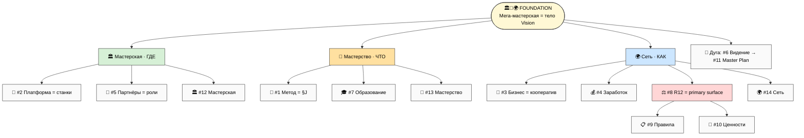
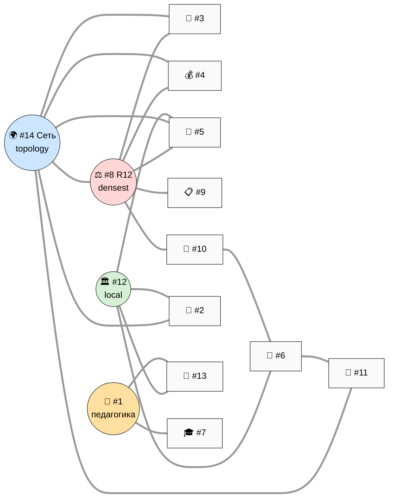
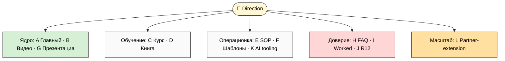
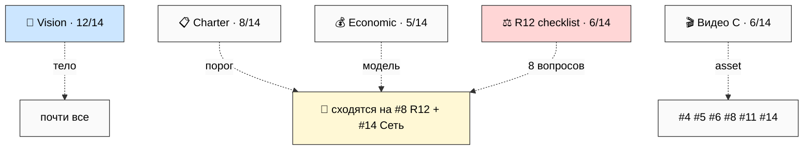
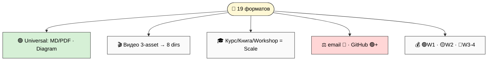
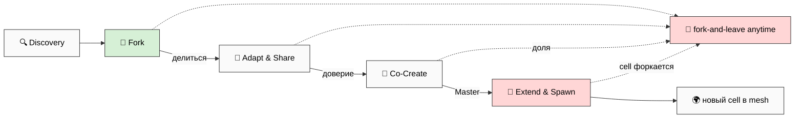
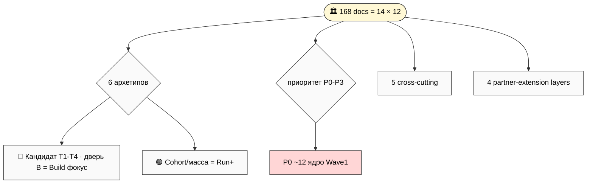
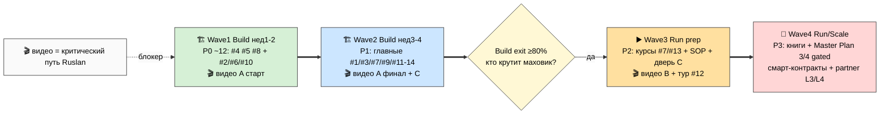

# 🎯 Jetix MetaPlan V3 — FINAL integration

> **Что это.** Не сами документы — **финальная интегрированная карта** всего публичного набора Jetix,
> собранная вокруг одной метафоры (мега-мастерская) с полным портфелем документов под каждое из 14
> направлений. Это **последняя organize-итерация перед фазой наполнения**: после твоего ack THE primary
> structure фиксируется, и дальше идут отдельные prompt'ы наполнения per direction × per artefact (168
> потенциальных задач — очередь в §7/§8).
>
> **Главный сдвиг vs v2.** v2 дал 11 направлений-полок × 3 двери × маршрут. **v3 ставит под них тело** —
> Workshop+Mastery+Network как Foundation (root frame, не направление) — расширяет до 14 направлений и
> даёт каждому **полный портфель из 12 типов документов** (главный / видео / курс / книга / SOP / шаблоны
> / презентация / FAQ / worked examples / R12 / AI tooling / partner-extension). Плюс 5 cross-cutting
> docs + format taxonomy (19 форматов) + **partner-extension protocol (4 layers fork-friendly)** + master
> matrix + roadmap.
>
> **Как читать.** Этот main = обзор (90-120 мин). Быстрее — `reports/.../00-SUMMARY-FOR-RUSLAN.md` (20
> мин). Глубже — 21 phase-report (каждое направление = 3-6K слов полного портфеля) + 12 схем V3-1..V3-12.
> Самое практичное для тебя — **§10 per-direction matrix** (быстрый reference) + **§11 R1-решения**.
>
> **R1 surface.** 14 directions + portfolios = специфицированы; внутри 20 R1-решений ждут тебя (§11).
> **R11:** только specs + скелеты, **NO sample doc content** (реальные тексты документов пишутся отдельными
> prompt'ами). **R2 STRICT:** Foundation + 4 LOCKED не тронуты. **IP-1:** имена партнёров = примеры ролей.
> **R12 STRICT:** AUTO-FIRE на R12/Партнёры/Community/Brand/Образование + всю partner-extension protocol.
> **Append-only:** v2 superseded, не изменён; новый v3 file. **Pool result — NO auto-launch consequent.**

---

## §0 TL;DR (90 секунд) + что изменилось vs v2

**Главный факт.** До сих пор Jetix описывался абстрактно (мульти-агентная система, кооператив, R12,
метод-метод) — скелет без тела. Голосовой дамп 26.05 дал телу форму: **мега-мастерская мирового уровня**.
Место (сначала виртуальное, потом сеть физических), где мастера собираются, получают лучшие инструменты,
нарабатывают мастерство на реальных задачах, встречают нужных людей и двигают фронтир — а рутину делает
AI. Это **Foundation** — корень, через который все 14 направлений обретают связность.

**Что изменилось v2 → v3 (5 пунктов):**
1. **Workshop+Mastery+Network = FOUNDATION** (не одно из направлений; root frame). 3 грани: 🏛️ Мастерская
   (ГДЕ) · 🎯 Мастерство (ЧТО прокачивают) · 🌍 Сеть (КАК распределено).
2. **14 направлений** (11 из v2 + 3 новых: #12 Мастерская / #13 Мастерство / #14 Сеть).
3. **Per direction — полный портфель из 12 типов документов** (а не один skeleton). 14 × 12 = 168
   потенциальных артефактов, каждый специфицирован (НЕ написан — это следующая фаза).
4. **Partner-extension protocol (4 layers fork-friendly)** — как партнёры добавляют свои документы под
   skeleton без потери R12. «Масштабируется бесконечно» (Ruslan 26.05).
5. **Format taxonomy (19 форматов)** + cross-cutting docs (5) + master matrix (14×12×6×3) + roadmap (4 волны).

**Что входит наружу:** 14 направлений × портфели + 5 cross-cutting docs. **Что НЕ входит / gated:**
$1T · Network State · Master Plan Part 3/4 · Foundation/System инфраструктура · financial reporting ·
research raw (anti-hype, partner-only/internal).

**20 решений ждут тебя в §11.** Это **концепт-фиксация структуры, не сбор документов** — после ack отдельные
prompt'ы наполнения per direction × per artefact. **Pool result — NO auto-launch.**

---

## §1 Foundation — Workshop+Mastery+Network как root frame

**Foundation ≠ направление.** Это не 12-е/13-е/14-е в одном ряду с остальными — это **тело**, через которое
все 14 directions обретают смысл. Различие: *направление* = полка с документами под тему; *Foundation* =
метафора, объясняющая, зачем существует каждая полка и как они складываются в один объект — мега-мастерскую.

Тонкость: #12 Мастерская / #13 Мастерство / #14 Сеть существуют **одновременно** и как Foundation-грани
(метафоры), и как directions (полки с портфелями). Это не противоречие — как Tesla одновременно «electric
future» (frame) и Model S/3/X/Y (продукты).

**Core statement (R1 — твоя формулировка):** *«Jetix — мега-мастерская мирового уровня: место, где люди
становятся мастерами в эпоху AI, вместе двигают фронтир и не дают системе доить или запирать себя.»*

**Три грани = три ответа:**
- 🏛️ **Мастерская (ГДЕ)** — пространство: 8 зон (стена инструментов / исследовательский центр / зона
  мастерства / зона встреч / тренировочный + спортзал / медитация / отдых). Корни: цех/гильдия, bottega,
  atelier, makerspace. Tacit knowledge (Полани) передаётся через apprenticeship — мастерская = единственная
  форма передачи.
- 🎯 **Мастерство (ЧТО прокачивают)** — накопление методов + выбор нужного в момент + создание/изобретение
  нового + решение уникальных задач. Meta-method уровень 3 (дизайн своей стратегии выбора). Этап подготовки
  (prep-gate → картина → уникальный метод). Шаблоны × уникальное; 3 оси (знания × навыки × люди); темы vs
  уровни (нелинейность, anti-ranking). Вечная тренировка (curiosity-driven).
- 🌍 **Сеть (КАК распределено)** — mesh из локальных cells (не star); ресурсы в opt-in пул; передвижение
  людей; 8 ролей; одна сеть с лучшими наработками. Primary R12 surface.

**3 хаба навигации наружу:** #1 Метод (педагогика) · #8 R12 (этика) · **#12 Мастерская (тело — новый хаб)**.

*(V3-1 — Foundation embedding. Полная сюита: `reports/.../21-mermaid-suite-v3.md`. См. также V3-11 triad embedding.)*

---

## §2 14 directions overview + cross-direction relations

| # | Направление | Грань Foundation | Substrate | GAP | Wave | R12 |
|---|---|---|---|---|---|---|
| 1 | 🧪 Метод | Мастерство (педагогика §J) | METHOD-V2 §J + Extended 8-step + prep | ⚠️ | 2 | мягкий |
| 2 | 🚀 Платформа | Мастерская (станки) | PLATFORM-LIFECYCLE + AI Tools + ROY | ⚠️ | 2 | fork |
| 3 | 💼 Бизнес | Сеть (кооператив) | FULL-MAP §1 + Stage Gates | ❌ | 3 | govern |
| 4 | 💰 Заработок | Сеть (экономика) | ECONOMIC V10 + PARTNER-OFFERING ✅ | ✅ | 1 | STRICT |
| 5 | 👥 Партнёры | Мастерская/Сеть (роли) | EXECUTION §5 ✅ | ✅ | 1 | STRICT |
| 6 | 📜 Видение | тело Vision | FULL-MAP §2 + workshop §4 | ⚠️ | 1 | мягкий |
| 7 | 🎓 Образование | Мастерство (прогрессия) | METHOD 7 ступ + O-176..185 | ⚠️ | 3 | uplift |
| 8 | ⚖️ R12/Обещание | Сеть (primary surface) | EXECUTION §4 + Mondragón | ⚠️ | 1 | объект |
| 9 | 📋 Правила | операционка всех граней | Pillar C + CLAUDE | ⚠️ | 3 | углы 3/4 |
| 10 | 💎 Ценности | направление Сети + триада | O-числа + триада O-138 | ⚠️ | 1→3 | A1-3/7 |
| 11 | 📜 Master Plan | дуга Сети online→offline | STRATEGIC-PLAN + Tesla | ❌ | 2→4 | won't |
| **12** | 🏛️ **Мастерская** | **Foundation: место** | Phase 1 spec + Method §4 tacit | ❌ | 2 | fork |
| **13** | 🎯 **Мастерство** | **Foundation: прокачка** | O-176..185 + §J + prep | ⚠️ | 3 | uplift |
| **14** | 🌍 **Сеть** | **Foundation: распределение** | Phase 3 spec + экономика | ❌ | 3→4 | PRIMARY |

**4 hub'а связей** (из relations matrix 14×14, Phase 1): **#8 R12** (densest — 8 сильных связей) · **#14
Сеть** (topology hub — 9 исходящих) · **#12 Мастерская** (local hub — 6) · **#1 Метод** (педагогический
треугольник #1↔#13↔#7). Терминальная дуга: #6 Видение → #11 Master Plan.

*(V3-2 — relations heat map. Полная матрица 14×14 — Phase 1 (`02-...`) §3.)*

---

## §3 Per-direction portfolios (компрессия Phases 2-15)

Каждое из 14 направлений получило **полный портфель из 12 типов документов** (§A Главный · §B Видео ·
§C Курс · §D Книга · §E Инструкции/SOP · §F Шаблоны · §G Презентация · §H FAQ · §I Worked examples ·
§J R12 paired-frame · §K AI tooling · §L Partner-extension hook). Полные specs — в 14 phase-report'ах
(3.5-5.9K слов каждый, **65.5K слов суммарно**). Ниже — компрессия: ядро + что в портфеле особенного.

*(V3-5 — portfolio template 12 artefacts в 5 кластеров.)*

**#1 🧪 Метод** (грань Мастерство). Ядро: метод-метод 4 уровня (§J), Jetix учит уровню 3 (дизайн своей
стратегии выбора). Портфель особенного: Extended Meta-Method 8 шагов с этапом подготовки (prep-gate → картина
→ уникальный метод); meta-method composition («все лучшие методы собраны в один + перемножены»). Видео A =
блокер. Книга-кандидат (long-arc). [reports `03-...`]

**#2 🚀 Платформа** (грань Мастерская). Ядро: Personal/Team/Universal Business OS (3 слоя) + AI Tools mega
(voice pipeline, OCR, CRM, Wiki, Claude Code, FPF) + ROY swarm. Портфель: «станки на стене» — инструмент
можно улучшить, можно поставить новый («предложил → сообщество оценило → встал на полку с твоим именем»).
Notion DB шаблоны = P0. Fork-friendly не lock-in. [reports `04-...`]

**#3 💼 Бизнес** (грань Сеть). Ядро: как Jetix работает как компания-кооператив. Портфель: Stage Gates +
governance (Ruslan = sole strategist + AWAITING-APPROVAL + corrigibility) + Operational + Steward role.
GAP ❌ create (жанр с нуля; риск Foundation-жаргона). Презентация для инвесторов/партнёров. [reports `05-...`]

**#4 💰 Заработок** (грань Сеть). Ядро: 6 моделей (consulting / cohort / partner revenue-share / IP
licensing / fund / Programmable Ethereum Phase 2+) + Mondragón 5:1. ✅ most ready (PARTNER-OFFERING готов).
R12 STRICT — каждая цифра + «как уйти»; цифры сценарные (Scenario A/B/C/D), не обещания. [reports `06-...`]

**#5 👥 Партнёры** (грань Мастерская/Сеть). Ядро: 4 типа T1-T4 + 5+1 архетипов + Wave 1/2/3 + discovery
(8 вопросов R12) + Charter. ✅ ready. R12 STRICT — «кого зовём» + «кого НЕ берём»; приглашаем не вербуем
(anti-Pinduoduo). [reports `07-...`]

**#6 📜 Видение** (грань: тело Vision). Ядро: куда идёт Jetix (витрина ≤2K; глубокая дуга = #11). Портфель:
3-25y horizons + триада O-138 + Workshop embedded + Founder-as-Exhibit («вот система, сам делаю, результаты
видите; хотите — пользуйтесь, нет — удачи, чус») + authenticity-tension (рост = следствие качества, не hooks).
[reports `08-...`]

**#7 🎓 Образование** (грань Мастерство). Ядро: 7 ступеней Bloom + paradigm shift O-176..O-185 + прошивка
(системное мышление + инженерный подход + методология + ответственность). Портфель: курс = CENTRAL (cohort
delivery + continuous measurement не экзамены) + Preparation Stage как teachable. R12 — education≠recruitment;
ступени 1-4 free. [reports `09-...`]

**#8 ⚖️ R12 / Обещание** (грань Сеть, primary surface — densest hub). Ядро: «Наше обещание» = anti-extraction
(75/25 + 5:1 + fork-and-leave). Портфель: Charter R12-clause + анти-секта чек-лист + 4 action classes +
escalation (Build🟢→Run🟡→Scale🔴→Mature🔴+) + China anti-reference. R12 STRICT — все 5 influence experts
AUTO-FIRE. on-chain Phase 2+ не как готовое. [reports `10-...`]

**#9 📋 Правила** (операционка всех граней). Ядро: свод 10 углов (~61 правило), формат «Утверждение → Зачем →
Enforcement → Нарушение → Источник». Мета-правило: правило без enforcement = пожелание. Портфель: public
(~25-30: methodological/R12/ethical/financial-модель) vs internal (~30). Углы 3/4 = R12-несущие. [reports `11-...`]

**#10 💎 Ценности** (направление Сети + триада). Ядро: триада O-138 (жить чтобы жить / не умереть /
развиваться) + 6 operational values + 7 beliefs + 7 anti-beliefs. Портфель: ценности → решения (фальсифицируемые
worked examples: «Wave 1 2 не 7» / distribute.py архивирован). anti-beliefs = R12-несущие. Тон = R1
(Anthropic Core-Views vs Berkshire). [reports `12-...`]

**#11 📜 Master Plan** (дуга Сети). Ядро: Tesla-style 4 части — Part 1 Build (PUBLIC) → Part 2 Run (PUBLIC)
→ Part 3 Scale (🔒 GATED) → Part 4 Mature (🔒 GATED/internal). Портфель: public/gated split = anti-hype;
$1T + Network State = gated (trigger $100K + 20+ мастерских). Книга-кандидат. Жанр с нуля (❌). [reports `13-...`]

**#12 🏛️ Мастерская** (Foundation грань: место). Ядро: 8 зон + активности + роли (вертикаль Visitor→Master
of Masters; горизонталь Investor/Partner/Consultant/Researcher/Steward — не пожизненные, не взаимоисключающие).
Портфель: Founder-as-Resident-Master + online→offline (первое физ. место = арендованное, anti-WeWork, только
при Run-петле) + видео-тур + чем НЕ является. ❌ create. [reports `14-...`]

**#13 🎯 Мастерство** (Foundation грань: прокачка). Ядро: определение refined (выбрать + создать + решать
уникальные задачи) + meta-method 4 уровня + Preparation Stage embedded. Портфель: шаблоны × уникальное +
3 оси (перемножаются) + темы vs уровни (anti-ranking) + curiosity-driven (∞) + measurable proxy (portfolio
> diploma). Курс CENTRAL. substrate готов. [reports `15-...`]

**#14 🌍 Сеть** (Foundation грань: распределение, PRIMARY R12 surface). Ядро: mesh не star (R12-требование) +
9 типов ресурсов pooling (opt-in + consent) + 8 ролей (нет «вербовщика» — есть Connector) + мульти-язык +
cross-cell movement. Портфель: анти-секта чек-лист + cell Charter + Mondragón spawn (Layer 4) + смарт-контракты
(Scale). R12 STRICT AUTO-FIRE. ❌ create. [reports `16-...`]

> **R12-интенсивность per direction** (V3-9): 🔴 STRICT AUTO-FIRE — #4/#5/#7/#8/#14 + partner-extension ·
> 🟡 mid — #9/#10/#12/#13 · 🟢 soft — #1/#2/#3/#6/#11.

---

## §4 5 cross-cutting documents

Пять документов касаются нескольких directions сразу — пишутся **один раз** (home direction), проявляются
проекцией в guests (single-source-of-truth, не копии).

| Doc | Home | Touch | Тип проекции |
|---|---|---|---|
| **Vision** | #6/#11 | 12/14 | frame (тело) |
| **Charter** (членский) | #8/#3 | 8/14 | gate (порог) |
| **Видео C** (экосистема) | #5 | 6/14 | reuse-asset |
| **Economic V10** | #4 | 5/14 | модель-отсылка |
| **R12 checklist** (8 вопросов) | #8 | 6/14 + partner-ext | gate-процедура |

Четыре из пяти сходятся на **#8 R12** и **#14 Сеть** — cross-cutting layer = этико-экономический клей +
один production-asset (Видео C). Полные specs + embed maps — Phase 16 (`17-...`).

*(V3-8 — cross-cutting embed.)*

---

## §5 Format taxonomy (19 форматов)

Один artefact реализуется в нескольких форматах. **19 форматов** × 5 осей (когда / когда НЕ / стоимость /
охват / R12). Полная таксономия + матрица — Phase 17 (`18-...`).

**Ключевые правила выбора:**
- **audience → artefact → format** (формат — последний выбор, не первый).
- **Universal:** MD/PDF (canonical) + Diagram/Mermaid — fit почти везде, 🟢 стоимость.
- **Видео = 3 reuse-asset** (A Метод · B Образование/Мастерство · C Партнёры/Сеть) покрывают 8 directions;
  🔴 стоимость (блокер Ruslan, критический путь).
- **Курс/Книга/Workshop** = прогрессия (#7/#13/#12) — 🔴 стоимость → Run/Scale.
- **R12-sensitive:** 📧 email drip = 🔴 риск (anti-marketing запрет для cold; только honest onboarding) ·
  🐙 GitHub/open-source = 🟢 R12-positive (fork-friendly proof).
- **Production-cost → Wave:** 🟢 Wave 1 (MD/диаграмма/FAQ) · 🟡 Wave 2 · 🔴 Wave 3-4.

*(V3-4 — format × direction matrix.)*

---

## §6 Partner-extension protocol (4 layers fork-friendly)

Чтобы система **масштабировалась бесконечно** (Ruslan 26.05), партнёры добавляют свои документы под skeleton.
4 уровня вовлечения — каждый **сохраняет fork-and-leave** (extension делает выход ЛЕГЧЕ, не сложнее = ядро R12).

| Layer | Что | Обязательство | R12-gate | Recognition |
|---|---|---|---|---|
| 🍴 **L1 Fork** | взял direction + адаптировал полностью | ❌ нет | минимальный (атрибуция) | private |
| 🔄 **L2 Adapt & Share** | вернул в community library | ✅ добровольно | Charter-lite + R12-check | контрибьютор |
| 🤝 **L3 Co-Create** | со-разработка с командой | ✅ совместно | Charter L4-L6 + 8 вопросов | Founding Council |
| 🌱 **L4 Extend & Spawn** | свой clan/cell (Mondragón) | ✅ Charter-binding | полный R12 + 5:1 + смарт-контракт | clan founder |

**8 anti-patterns ↔ 4 R12 action classes:** lock-in clause → `fork_prevention_attempt` · выжимание аудитории
→ `extraction_beyond_share` · recursive recruiting → `non_consensual_distribution` · нарушение 5:1 →
`wage_ratio_violation`. Защита partner-extension растёт быстрее партнёрской базы (Build ручной R12-check →
Scale смарт-контракт). Полный протокол — Phase 18 (`19-...`).

*(V3-10 — partner-extension lifecycle. См. также V3-3 4 layers.)*

---

## §7 Master matrix synthesis (14 × 12 × 6 × 3)

168 потенциальных документов (14 directions × 12 artefacts) приоритезированы по 4 измерениям (direction ×
artefact × 6 архетипов аудитории × 3 stage Build/Run/Scale) → сжаты до **~12 P0-ядра** (Wave 1). Полная
priority matrix 14×12 + audience×stage filter — Phase 19 (`20-...`).

**P0-ядро (Wave 1, ~12 артефактов):** #4 Заработок (A+H+J) · #5 Партнёры (A+E+F+H+J) · #8 R12 (A+H+J) ·
#2 Платформа (A+F) · #6 Видение (A) · #10 Ценности (A) · #14 Сеть (J).

*(V3-6 — master synthesis tree.)*

---

## §8 Implementation roadmap (4 волны Build/Run/Scale)

*(V3-7 — roadmap timeline. См. V3-12 build readiness.)*

**Build readiness (V3-12):** ✅ quick win — #4 Заработок (polish готового ~3-5ч) + #5 Партнёры (~5-8ч) ·
⚠️ partial (8 directions, средне) · ❌ рычажное тело — #3 Бизнес / #11 Master Plan / #12 Мастерская / #14
Сеть (дорого, но без них Foundation не материализуется). Видео A/B/C = блокер Ruslan.

**Build exit gate (≥80%):** Wave 1+2 P0/P1 + видео A/C + Notion внедрён → Run. Переключатель = «кто крутит
маховик», не объём контента (Platform Lifecycle).

---

## §9 Mermaid V3-1..V3-12 (inline references)

7 схем встроены выше: V3-1 §1 · V3-2 §2 · V3-5 §3 · V3-8 §4 · V3-4 §5 · V3-10 §6 · V3-6 §7 · V3-7 §8.
Остальные (V3-3 partner-extension 4 layers · V3-9 R12 heat map · V3-11 triad embedding · V3-12 build
readiness) — полная сюита `reports/.../21-mermaid-suite-v3.md` + каталог `diagrams/_INDEX.md`.

| # | Показывает | Inline § |
|---|---|---|
| V3-1 | Foundation embedding | §1 |
| V3-2 | Cross-direction relations | §2 |
| V3-3 | 4 layers partner-extension | (suite/§6) |
| V3-4 | Format × direction matrix | §5 |
| V3-5 | Portfolio template 12 artefacts | §3 |
| V3-6 | Master synthesis tree | §7 |
| V3-7 | Roadmap timeline 4 волны | §8 |
| V3-8 | Cross-cutting docs embed | §4 |
| V3-9 | R12 paired-frame heat map | §3 |
| V3-10 | Partner-extension lifecycle | §6 |
| V3-11 | Foundation triad embedding | §1 |
| V3-12 | Build readiness assessment | §8 |

---

## §10 Per-direction matrix (quick reference — 14 × 12 artefacts)

Приоритет primary-артефакта (P0-P3; «—» = не applicable). Полная матрица — Phase 19.

| # Dir | A | B | C | D | E | F | G | H | I | J | K | L | Wave | GAP |
|---|---|---|---|---|---|---|---|---|---|---|---|---|---|---|
| 1 Метод | P0 | P1🎬 | P2 | P3 | P1 | P1 | P2 | P1 | P1 | P1 | P1 | P2 | 2 | ⚠️ |
| 2 Платформа | P0 | P2 | P3 | — | P1 | P0 | P2 | P1 | P1 | P1 | P1 | P2 | 2 | ⚠️ |
| 3 Бизнес | P1 | P3 | — | P3 | P2 | P2 | P1 | P1 | P2 | P1 | P2 | P3 | 3 | ❌ |
| 4 Заработок | **P0** | P1 | P3 | — | P2 | P1 | P1 | P0 | P1 | **P0** | P2 | P2 | 1 | ✅ |
| 5 Партнёры | **P0** | P1🎬 | — | — | P0 | P0 | P1 | P0 | P1 | **P0** | P2 | P2 | 1 | ✅ |
| 6 Видение | P0 | P1 | — | P3 | — | P2 | P1 | P1 | P1 | P1 | P3 | P3 | 1 | ⚠️ |
| 7 Образование | P1 | P2🎬 | P1 | P3 | P2 | P2 | P2 | P1 | P2 | P1 | P2 | P2 | 3 | ⚠️ |
| 8 R12 | **P0** | P2 | P3 | — | P1 | P1 | P2 | P0 | P1 | **P0** | P2 | P1 | 1 | ⚠️ |
| 9 Правила | P1 | — | P3 | — | P1 | P1 | P2 | P2 | P2 | P1 | P2 | P2 | 3 | ⚠️ |
| 10 Ценности | P0 | P2 | — | P3 | — | P2 | P2 | P1 | P1 | P1 | P3 | P3 | 1→3 | ⚠️ |
| 11 Master Plan | P1 | P2 | — | P3 | — | P2 | P1 | P1 | P2 | P1 | P3 | P3 | 2→4 | ❌ |
| 12 Мастерская | P1 | P2🎬 | P3 | — | P2 | P2 | P1 | P1 | P1 | P1 | P2 | P2 | 2 | ❌ |
| 13 Мастерство | P1 | P2🎬 | P2 | P3 | P2 | P2 | P2 | P1 | P1 | P1 | P1 | P2 | 3 | ⚠️ |
| 14 Сеть | P1 | P2🎬 | P3 | — | P2 | P2 | P2 | P1 | P2 | **P0** | P2 | P1 | 3→4 | ❌ |

*Легенда artefacts: A Главный · B Видео · C Курс · D Книга · E SOP · F Шаблоны · G Презентация · H FAQ ·
I Worked examples · J R12 · K AI tooling · L Partner-extension.*

---

## §11 R1 decisions queue — что ждёт тебя (20 решений)

> R1 surface: рой surface'ит, ты решаешь. Ничего не auto-promoted (FUNDAMENTAL rule 1 — ты sole strategist).

**Структура (фундамент):**
1. **Workshop+Mastery+Network = Foundation** — фиксируем как root frame (не одно из направлений)?
2. **14 направлений финальны?** — #12 Мастерская + #14 Сеть держим раздельно (рекоменд) или слить?
3. **Core statement Vision** (§1) — твоя формулировка? «Мега-мастерская мирового уровня...» ок?
4. **Триада O-138** — формулировки финальны (жить чтобы жить / не умереть / развиваться)?
5. **ФРАЗА-якорь R12** (#8 «Наше обещание») — твоя формулировка?

**Структура портфелей:**
6. **12 типов артефактов per direction** — состав финальный, добавить/убрать тип?
7. **Per-direction матрица приоритетов** (§10) — P0-ядро Wave 1 (#4/#5/#8 + #2/#6/#10/#14) согласен?
8. **Видео A/B/C** — записываешь ты (блокер) — когда? (критический путь Wave 1).

**Cross-cutting + format:**
9. **5 cross-cutting docs** — Vision/Charter/Видео C/Economic/R12-checklist — состав ок?
10. **Format taxonomy** — email drip = 🔴 R12-риск (anti-marketing запрет для cold) — согласен?
11. **GitHub/open-source как R12-positive** — публикуем skeleton open (fork-friendly proof)?

**Partner-extension (fundamental для scaling):**
12. **4 layers fork-friendly** (Fork / Adapt&Share / Co-Create / Extend&Spawn) — структура ок?
13. **L1 Fork = open MIT-style** (no obligation) — согласен (это anti-lock-in доказательство)?
14. **L4 Extend&Spawn = Mondragón clan** — cell Charter R12-clause обязателен — ок?

**Контент-решения (из supplement'ов):**
15. **Authenticity-tension** (Founder-as-Exhibit) — «громко/масштабно» vs «чус» — рекоменд: B доминанта (рост = следствие качества). Твоё разрешение?
16. **Anti-marketing как сквозной принцип** на все 14 + 4 части Master Plan?
17. **Этап подготовки** (Extended Meta-Method 8 шагов) — интегрируем в #1 Метод + #13 Мастерство?
18. **Темы vs уровни** (anti-ranking culture) — принимаем нелинейную модель в #13/#14?

**Запуск:**
19. **Первый prompt наполнения** — какой direction × artefact? (рекоменд: #4 Заработок A polish ✅ ИЛИ #5 Партнёры A+E quick win, ИЛИ #8 R12 якорь).
20. **Темп online→offline** (#11/#14) — осторожно (рекоменд, anti-WeWork, арендованное при Run-петле) ИЛИ быстро?

---

## §12 Cross-refs

| Документ | Зачем |
|---|---|
| `JETIX-WORKSHOP-MASTERY-NETWORK-CONCEPT-2026-05-26.md` | **Foundation** (THE root metaphor; 8 mermaid WK-1..8) |
| `WORKSHOP-CONCEPT-SUPPLEMENT-2026-05-26.md` | Founder-as-Exhibit + anti-marketing + Mastery deepening |
| `PREPARATION-STAGE-CONCEPT-SUPPLEMENT-2026-05-26.md` | этап подготовки + Extended Meta-Method 8 шагов |
| `JETIX-PUBLIC-DOCS-METAPLAN-V2-2026-05-25.md` | предшественник (11 directions baseline; superseded, не изменён) |
| `JETIX-FULL-MAP-AND-DOCS-SKELETON-2026-05-25.md` | 12 сущностей + 94 docs + cross-cutting skeleton |
| `DOCS-CLASSIFICATION-2026-05-25.md` | 4 категории + анти-паттерны фильтра |
| `PLATFORM-LIFECYCLE-STAGES-PLAN-2026-05-25.md` | Build/Run/Scale маховик + защита растёт быстрее |
| `EXECUTION-PLAN-FIXATION-2026-05-24.md` | 4 типа партнёров + 8 вопросов R12 + discovery |
| `METHOD-LIFE-DEVELOPMENT-V2-2026-05-21.md` 🔒 | метод-канон §J + 7 ступеней + Polanyi tacit |
| `ECONOMIC-MODEL-TOKENOMICS-2026-05-22.md` 🔒 | 75/25 + 5:1 + recursion + 8 моделей |
| `STRATEGIC-PLAN-NEAR-FUTURE-2026-05-21.md` 🔒 | горизонты + Point A/B/C/D + сценарии |
| `PARTNER-OFFERING-HUMAN-LANG-2026-05-22.md` | стиль-якорь + готовый doc #4 |
| 21 phase-report `reports/jetix-metaplan-v3-final-2026-05-26/` | drill-down фазы 0-20 (65.5K слов портфелей) |
| `diagrams/_INDEX.md` | 12 схем V3-1..V3-12 |
| memory `project_workshop_metaphor_concept` + `project_balaji_outreach_target` | Foundation concept + Network State gated trigger |

---

## §13 К чему ведёт (что разблокирует)

После того как ты прочитаешь + acked:
1. **THE primary structure ФИКСИРУЕТСЯ** — Foundation (мега-мастерская) + 14 directions × 12 artefacts +
   cross-cutting + format taxonomy + partner-extension. Любой новый документ имеет место.
2. **Per direction × per artefact filling prompts** — 14 × 12 = **168 потенциальных задач наполнения**;
   приоритет через master matrix (§7) — Wave 1 P0 первыми.
3. **Quick wins готовы к запуску:** #4 Заработок (polish ✅) · #5 Партнёры (✅) — это первые filling-prompts.
4. **Partner-extension protocol готов** — после ack первые partner contributions (L1-L2) могут начаться.
5. **Параллельно (ты — блокеры):** видео A/B/C (критический путь) · notion-build · Brand-сессия.

**Это финальная integrated metaplan-фиксация перед фазой наполнения. После ack — отдельные prompt'ы
наполнения per direction × per artefact. Pool result — NO auto-launch consequent.**

---

*Document closure 2026-05-26. Jetix MetaPlan V3 FINAL — workshop-concept Foundation embedded (мега-мастерская
= root frame: Мастерская/Мастерство/Сеть) + 14 directions × full document portfolio (12 artefact specs per
direction, 65.5K слов в 14 phase-report'ах) + 5 cross-cutting docs + format taxonomy (19 форматов) +
partner-extension protocol (4 layers fork-friendly) + master matrix (14×12×6×3) + implementation roadmap
(4 волны Build/Run/Scale). 12 mermaid V3-1..V3-12. 21 phase-report + SUMMARY. F2-F3 derivative, NO new
external research. R1 surface (20 решений §11; one-liner/триада/ФРАЗА = Ruslan-authored). R2 STRICT
(Foundation + 4 LOCKED untouched). R11 (specs + скелеты, NO sample doc content). R12 paired-frame STRICT
(AUTO-FIRE R12/Партнёры/Community/Brand/Образование + partner-extension; primary surface Сеть). IP-1 STRICT
(имена = примеры ролей). Append-only (v2 superseded, не изменён). Pool result — NO auto-launch consequent.
Supersedes v2. После ack → per-direction × per-artefact filling iterations (168 potential).*
