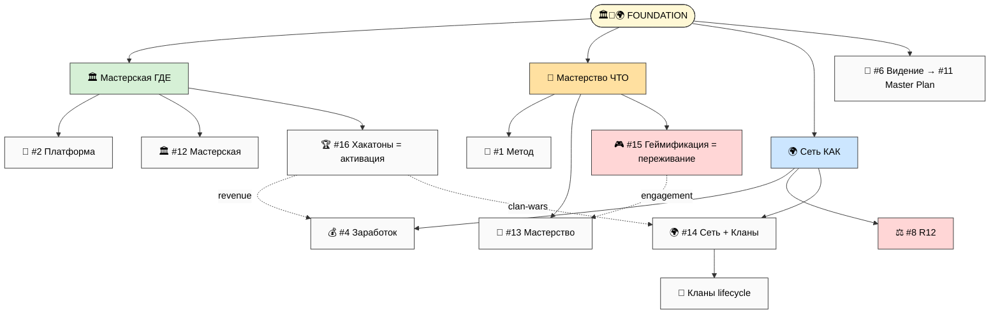
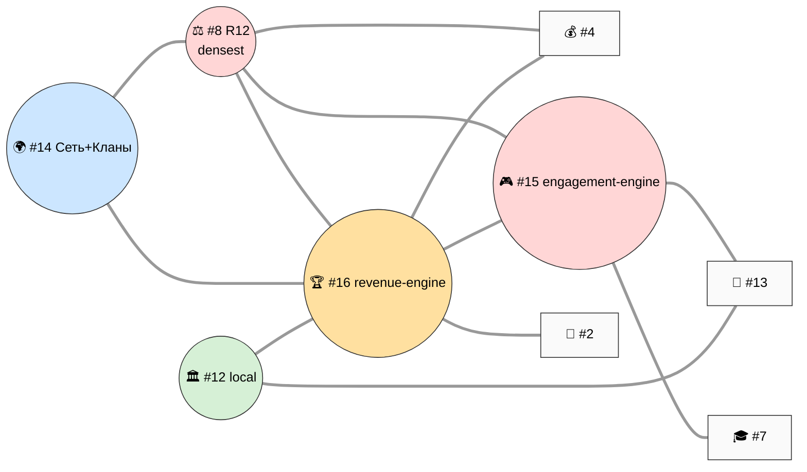
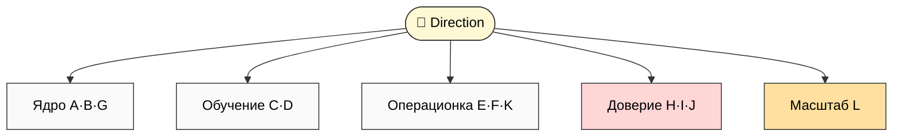
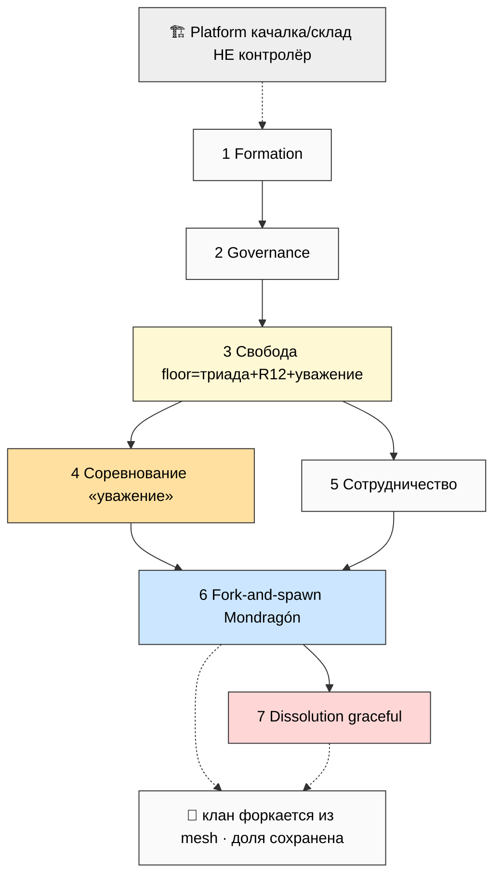
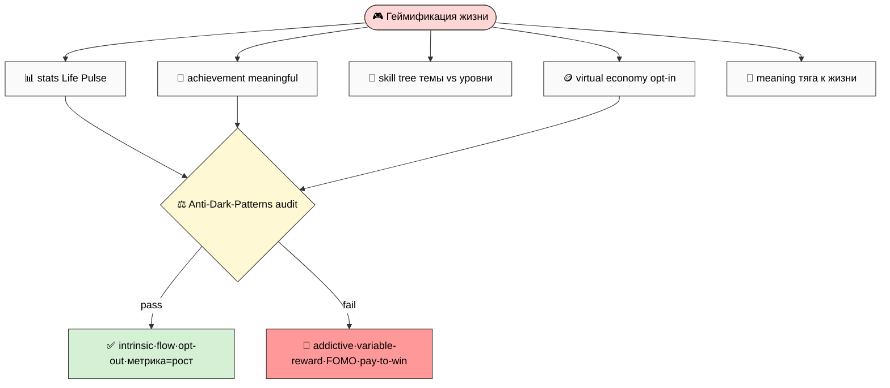
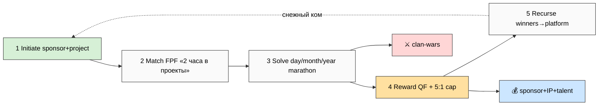
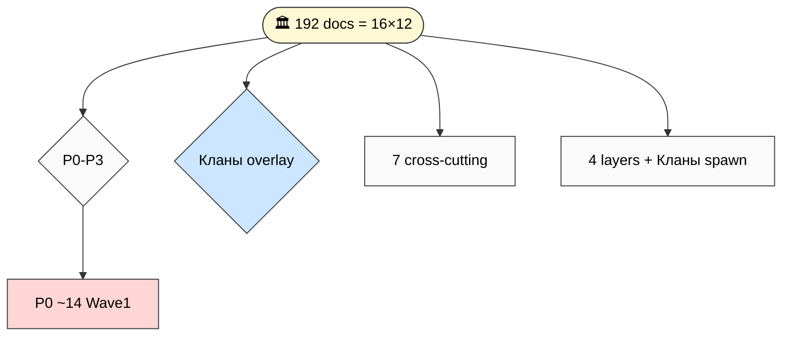
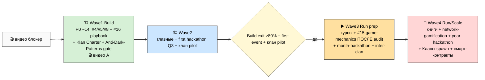

# 🎯 Jetix MetaPlan V4 FINAL — 16 directions + Геймификация + Хакатоны + Кланы expansion

> **Что это.** Финальная (v4) интегрированная карта всего публичного набора Jetix — **16 направлений**
> вокруг одной метафоры (мега-мастерская), с полным портфелем из 12 типов документов под каждое. v4 =
> superset v3: те же 14 направлений + **2 NEW** (🎮 Геймификация жизни · 🏆 Хакатоны/Соревнования/
> Экспедиции) + **Кланы lifecycle EXPANDED** в Network. Это последняя organize-итерация перед фазой
> наполнения: после ack THE primary structure фиксируется → 192 (16×12) filling-задачи.
>
> **Главный сдвиг vs v3.** v3 дал *структуру* (14 directions × портфели + Foundation). v4 добавляет
> **2 движка** — **#16 Хакатоны** (events = revenue + community engine, где экономика Foundation
> материализуется) и **#15 Геймификация** (engagement-слой, где «прокачка» становится ощутимой каждый
> день) — плюс раскрывает **Кланы как living entities** (formation → governance → соревнование/
> сотрудничество → fork-spawn → dissolution; Jetix = «качалка/склад», не контролёр).
>
> **R12-сдвиг.** Primary R12 surface в v4 = **#15 Геймификация** (highest manipulation risk — gamification
> = dark-pattern temptation max). Это меняет конституциональный центр тяжести: NEW **Anti-Dark-Patterns
> audit** (cross-cutting doc) + heavy R12-discipline на каждом game-mechanic (intrinsic motivation primacy /
> meaningful progression only / opt-out always / metric=рост не время).
>
> **Как читать.** Main = обзор (90-150 мин). Быстрее — `reports/.../00-SUMMARY-FOR-RUSLAN.md` (20-25 мин).
> Глубже — 23 phase-report (16 direction-портфелей по 5-8K слов = **~110K слов**) + 14 схем V4-1..V4-14.
> Самое практичное — §13 per-direction matrix + §14 (25 R1-решений). Особое внимание — §4 Кланы / §5
> Геймификация (R12) / §6 Хакатоны (revenue).
>
> **R1 surface.** 16 directions + portfolios специфицированы; 25 R1-решений (§14). **R11:** только specs,
> **NO sample doc content**. **R2 STRICT:** Foundation + 4 LOCKED не тронуты. **IP-1:** имена = примеры
> ролей. **R12 STRICT:** Direction 15 = PRIMARY surface (gamification-engagement + all influence experts
> AUTO-FIRE). **Append-only:** v3 superseded, не изменён. **Pool result — NO auto-launch.**

---

## §0 TL;DR (90 секунд) + что изменилось vs v3

**Один факт.** Jetix = мега-мастерская (Foundation). v3 дал её *скелет* (14 направлений). v4 добавляет
**движок и переживание**: события (хакатоны = как зарабатываем и растём) + геймификация (как чувствуем
прогресс каждый день) + кланы (как люди группируются и соревнуются с уважением).

**Что изменилось v3 → v4 (3 пункта):**
1. **NEW #15 🎮 Геймификация жизни** — vызов интереса + статистика прокачки + достижения + meaning
   embedding («наполнить жизнь смыслом, чувствовать тягу к жизни» — Ruslan). **R12 STRICT HIGHEST surface.**
2. **NEW #16 🏆 Хакатоны/Соревнования/Экспедиции** — events = основной revenue engine + community engine
   (multi-rhythm day/month/year + QF revenue + clan-wars). Leverages JETIX-AS-HACKATHON-PLATFORM substrate.
3. **Кланы lifecycle EXPANDED** в Network #14 — кланы как living entities (7 фаз: formation/governance/
   соревнование/сотрудничество/fork-spawn/dissolution). Jetix = «качалка/склад»; внутри клана почти полная
   свобода при ценностном floor (триада + R12 + уважение).

**Что входит наружу:** 16 направлений × портфели + 7 cross-cutting docs. **Что НЕ входит / gated:** $1T ·
Network State · Master Plan Part 3/4 · Foundation/System инфраструктура · financial reporting · full
network-wide gamification (R12-gated до automated audit).

**25 решений ждут тебя в §14.** Концепт-фиксация структуры, не сбор документов. **Pool result — NO auto-launch.**

---

## §1 Foundation — Workshop+Mastery+Network как root frame (16 directions)

**Foundation ≠ направление.** Мега-мастерская = тело Vision'а. 3 грани: 🏛️ Мастерская (ГДЕ) · 🎯
Мастерство (ЧТО прокачивают) · 🌍 Сеть (КАК распределено). Все 16 directions resonate вокруг.

**Core statement (R1):** *«Jetix — мега-мастерская мирового уровня: место, где люди становятся мастерами
в эпоху AI, вместе двигают фронтир и не дают системе доить или запирать себя.»*

**Что добавляют 2 новых направления к метафоре (НЕ просто «ещё 2 темы»):**
- 🎮 **#15 Геймификация** = **engagement-обёртка грани Мастерство** — делает «стать мастером естественно»
  ощутимым каждый день (статистика, skill trees, прогрессия). + грань Сеть (Schelling coordination).
- 🏆 **#16 Хакатоны** = **активация грани Мастерская** (Workshop = static substrate; hackathon = operational
  pattern, что приводит пространство в движение). + грань Сеть (clan-wars).

**3 хаба навигации (preserved):** #1 Метод · #8 R12 · #12 Мастерская. **+ 2 движка (v4):** #16 Хакатоны
(revenue+community engine) + #15 Геймификация (engagement engine). Хабы = навигация; движки = что приводит
в движение.

*(V4-1 — 16 directions × Foundation embedding. Полная сюита: `reports/.../23-mermaid-suite-v4.md`.)*

---

## §2 16 directions overview + cross-direction relations

| # | Direction | Грань Foundation | GAP | Wave | R12 |
|---|---|---|---|---|---|
| 1 | 🧪 Метод | Мастерство (§J) | ⚠️ | 2 | мягкий |
| 2 | 🚀 Платформа | Мастерская (станки) | ⚠️ | 2 | fork |
| 3 | 💼 Бизнес | Сеть (кооператив) | ❌ | 3 | govern |
| 4 | 💰 Заработок | Сеть (экономика) | ✅ | 1 | STRICT |
| 5 | 👥 Партнёры | Мастерская/Сеть (роли) | ✅ | 1 | STRICT |
| 6 | 📜 Видение | тело Vision | ⚠️ | 1 | мягкий |
| 7 | 🎓 Образование | Мастерство (прогрессия) | ⚠️ | 3 | uplift |
| 8 | ⚖️ R12/Обещание | Сеть (R12 surface) | ⚠️ | 1 | объект |
| 9 | 📋 Правила | операционка | ⚠️ | 3 | углы 3/4 |
| 10 | 💎 Ценности | триада | ⚠️ | 1→3 | A1-3/7 |
| 11 | 📜 Master Plan | дуга Сети | ❌ | 2→4 | won't |
| 12 | 🏛️ Мастерская | Foundation: место | ❌ | 2 | fork |
| 13 | 🎯 Мастерство | Foundation: прокачка | ⚠️ | 3 | uplift |
| 14 | 🌍 Сеть **+ Кланы** | Foundation: распределение | ❌ | 3→4 | PRIMARY |
| **15** | 🎮 **Геймификация** | Мастерство engagement + Сеть | ❌ | 2→3 | **HIGHEST** |
| **16** | 🏆 **Хакатоны/Events** | Мастерская активация + Сеть | ⚠️ | 1→2 | STRICT |

**5 центров связей** (relations matrix 16×16, Phase 1): **#8 R12** (densest, 10 сильных) · **#14 Сеть+Кланы**
(topology, 10) · **#16 Хакатоны** (revenue-engine hub, 8) · **#15 Геймификация** (engagement-engine,
R12-чувствительный) · **#12 Мастерская** (local). Педагогический треугольник #1↔#13↔#7 усилен #15 (гейм.
обучения) + #16 (хакатоны = deep learning sprints).

*(V4-2 — relations heat map. Полная матрица 16×16 — Phase 1 (`02-...`) §3.)*

---

## §3 Per-direction portfolios (компрессия Phases 2-17)

Каждое из 16 направлений = полный портфель **12 типов документов** (§A Главный · §B Видео · §C Курс · §D
Книга · §E SOP · §F Шаблоны · §G Презентация · §H FAQ · §I Worked examples · §J R12 · §K AI tooling · §L
Partner-extension). Полные specs — 16 phase-report'ах (**~110K слов суммарно**). Компрессия (только v4-дельты
для 14 shared directions; full для 2 new — §5/§6):

- **#1 Метод** — метод-метод уровня 3 + Extended 8-step + prep-stage. **V4-дельта:** метод-метод как
  skill tree (#15); хакатон = arena тренировки meta-method (#16); клан может иметь свой method-канон.
- **#2 Платформа** — Personal/Team/Universal OS + AI Tools + ROY. **V4-дельта:** хостит геймификацию
  (Life Pulse dashboard/skill-tree/achievement — #15); = stack хакатонов (#16); клан получает Platform-инстанс.
- **#3 Бизнес** — кооператив + Stage Gates + governance. **V4-дельта:** хакатоны = revenue engine; кланы =
  организационные под-единицы (Mondragón cooperatives spawning); Platform = «качалка/склад» не rent-extractor.
- **#4 Заработок** — теперь **7 моделей** (+ events/hackathon revenue: sponsor + QF + IP/talent placement).
  Mondragón 5:1; цифры сценарные. R12 STRICT.
- **#5 Партнёры** — 4 типа T1-T4. **V4-дельта:** T2 sponsors хостят events; sponsor-mentor-participant
  triangle (MLH); клан-founder = новый archetype; inter-clan talent exchange. R12 STRICT.
- **#6 Видение** — тело Vision. **V4-дельта:** «смысл каждый день» (#15 = триада ощутима); events-driven
  world (#16); кланы = пути. Authenticity-tension обострён (gamified growth ≠ manufactured hype).
- **#7 Образование** — 7 ступеней Bloom + O-176..185. **V4-дельта:** gamified learning progression (Bloom =
  skill tree, achievement = mastery markers НЕ vanity); хакатоны = learning sprints; клан-curriculum.
- **#8 R12** — densest hub. **V4-дельта (EXPANDED):** anti-dark-patterns sub-list для #15 (PRIMARY surface);
  events R12 (5:1 payouts + QF + transparency); inter-clan R12 (no poaching/sabotage/extraction).
- **#9 Правила** — 10 углов. **V4-дельта:** anti-dark-pattern правила + event conduct + inter-clan
  competition + **клан governance (floor enforced vs inner-clan freedom)** = ключевое v4-различие.
- **#10 Ценности** — триада O-138. **V4-дельта:** «тяга к жизни» ↔ #15 (meaning не engagement); NEW value
  «уважение к соревнующимся» (inter-clan); NEW anti-beliefs (anti-dark-pattern, anti-addictive-design).
- **#11 Master Plan** — Tesla 4 части. **V4-дельта:** hackathon activation Gantt (Q3 2026 first event) +
  клан spawn timeline + gamification phased rollout (R12-gated).
- **#12 Мастерская** — 8 зон + роли. **V4-дельта:** хакатоны = activation mode; gamified зоны (skill trees
  per зона); кланы базируются в cell-мастерских.
- **#13 Мастерство** — определение refined + темы vs уровни. **V4-дельта (CENTRAL):** #15 = engagement-
  обёртка именно Мастерства (skill trees визуализируют темы vs уровни; achievement = meaningful markers) —
  R12 CRITICAL: motivate без manipulate, curiosity-loop НЕ addictive dopamine-loop; хакатоны = mastery arena.

> #14 Сеть+Кланы → **§4** · #15 Геймификация → **§5** · #16 Хакатоны → **§6** (раскрыты отдельно).

*(V4-5 — portfolio template.)*

---

## §4 Кланы lifecycle deep (компрессия Phase 15)

Кланы = **основная часть платформы** (Ruslan). В v3 = mesh cells; v4 раскрывает как living entities.
**Jetix = «качалка/склад»** (infrastructure + Charter floor + events), НЕ контролёр. Ценностной floor
(единственное enforced platform-wide): триада O-138 + R12 + уважение к соревнующимся. Всё остальное —
свобода клана («внутри клана можно делать почти всё что хочешь»).

**7 фаз жизни клана:** (1) **Formation** — founding + Klan Charter + Mondragón alloc + first project ·
(2) **Governance** — Steward + consensus/RACI (inner-clan) · (3) **Свобода** — methods/topics/style =
inner-clan; floor enforced · (4) **Соревнование** — inter-clan хакатоны/tournaments; «уважение между
соревнующимися»; R12 STRICT (no poaching/sabotage/extraction) · (5) **Сотрудничество** — cross-clan
projects/expeditions/talent exchange · (6) **Fork-and-spawn** — split / sub-clan (Mondragón cooperatives
spawning cooperatives) · (7) **Dissolution** — graceful unwind (asset distribution + member migration).
**+ Inter-clan governance:** Stewards peer-check + Foundation dispute resolution.

*(V4-13 — Кланы lifecycle. Full §K — Phase 15 (`16-...`).)*

**Почему кланы — не просто «команды».** Команда = группа под общей задачей внутри одной иерархии. Клан =
**автономная кооперативная единица** со своей культурой, методами, экономикой (Mondragón 5:1 внутри) и
правом форкнуться. Разница принципиальная для R12: команду можно «доить» сверху (центр контролирует);
клан — нельзя (mesh, не star; клан забирает долю и уходит). Кланы дают то, что Ruslan назвал «разные
направления выбирать пробовать» — **множество путей под одним ценностным floor**, а не один навязанный путь.

**Worked scenario (R11 — сценарный, IP-1 role-types):** клан методологов (Maxim-тип Local Master + 3-5
Practitioner) формируется вокруг темы «AI-консалтинг для SMB»; подписывает Klan Charter (floor: триада +
R12 + уважение; inner: свои методы продаж, свой ритм, свой revenue-split в рамках 5:1). Через 3 месяца
участвует в inter-clan хакатоне (#16) против клана «образование» — соревнование поднимает планку, без
poaching. Один Practitioner мигрирует в другой клан (его skill tree #15 + доля идут с ним — мастерство
принадлежит человеку). Через год клан spawn'ит sub-clan «AI для юристов» (Mondragón pattern). Платформа на
всём пути = «качалка/склад» (Notion templates + AI tooling + Workshop space + events), НЕ диктовала ни
методы, ни темы — только держала floor.

**Граница свободы и floor (ключевое v4-различие, §9 Правила):** enforced platform-wide = триада O-138 +
R12 (anti-extraction + fork-and-leave + 5:1) + уважение к соревнующимся. Inner-clan freedom = методы /
темы / management style / internal governance / ритм / sub-revenue-split (в рамках 5:1). Если клан нарушает
floor (например, пытается lock-in членов или нарушает 5:1) → inter-clan governance escalation (Stewards
peer-check) → Foundation dispute resolution → в пределе клан теряет доступ к платформе (но члены сохраняют
fork-and-leave). Это единственный «контроль» — и он про защиту членов, не про подчинение клана.

---

## §5 Геймификация direction (компрессия Phase 16) — R12 STRICT central

**#15 = PRIMARY R12 surface v4** (highest manipulation risk). Core thesis (Ruslan): жизнь интересно жить
когда есть vызов/прогрессия/measurable mastery growth/достижения; Jetix даёт инструменты gamify жизни
(привычки/навыки/health/contributions) — «наполнить жизнь смыслом, чувствовать тягу к жизни» (= триада
«жить чтобы жить» ощутима).

**Sub-areas:** personal stats dashboard (Life Pulse) · achievement (meaningful markers НЕ vanity) · skill
trees (темы vs уровни) · quests (project-as-quest) · Schelling coordination · virtual economy (tokens/credits
opt-in) · meaning embedding.

**R12 — THE central discipline (Anti-Dark-Patterns audit gate):**
- ❌ **Запрет:** addictive loops · variable-reward exploitation (slot-machine) · sunk-cost · manufactured
  FOMO/urgency · social-pressure streaks · pay-to-win · vanity metrics as goals · dopamine-not-flow.
- ✅ **Дисциплина:** intrinsic motivation primacy (SDT) · meaningful progression only (mastery markers) ·
  opt-out always / no lock-in · flow not dopamine · **metric = «насколько ты вырос» НЕ «время в приложении»**
  (anti-TikTok). Различие: gamification-for-**meaning** vs gamification-for-**retention**.

*(V4-11 — gamification dynamics. Full портфель — Phase 16 (`17-...`).)*

**Почему это самый опасный direction (и почему его нельзя пропустить).** Геймификация — единственное
направление, где **инструмент мотивации = инструмент манипуляции**, разница только в намерении и дизайне.
Те же механики (прогресс-бары, streaks, достижения, лидерборды), которые помогают мастеру видеть рост,
TikTok/Pinduoduo используют для удержания-любой-ценой. Поэтому #15 — primary R12 surface v4: нельзя
«сделать геймификацию, а R12 прикрутить потом». R12 здесь = **дизайн-ограничение с первой строки**.

**Операциональный тест (gamification-for-meaning vs -for-retention):** *убери метрику «время в системе» —
механика всё ещё ценна для пользователя?* Skill tree, показывающий рост мастерства → да (ценен сам по
себе). Streak, который «сгорает» если пропустил день → нет (ценность держится на страхе потери = sunk-cost
+ social-pressure). Первое проходит Anti-Dark-Patterns audit, второе — reject. Это не «меньше геймификации»
— это **геймификация, которая служит триаде O-138** («жить чтобы жить»), а не engagement-метрикам.

**Связь с Мастерством (#13):** геймификация — engagement-обёртка именно прокачки. skill tree визуализирует
«темы vs уровни» (нелинейная развитость — дерево тем, не лестница; anti-ranking); achievement = реальный
mastery marker (решил N уникальных задач тяжести X — portfolio>diploma, S-15), не vanity badge. Curiosity-
driven loop (новая задача → интересно → прокачался → сложнее → ∞) геймифицируется **без превращения в
dopamine-loop** — intrinsic motivation (SDT: autonomy/competence/relatedness) primacy. Это самый тонкий
R12-баланс всей системы: motivate без manipulate.

**Что defer (R1 §14 п.8):** virtual economy (tokens/credits) несёт максимальный R12-риск (pay-to-win,
extraction) → рекомендация роя: defer до отдельной R12-design session (§14 п.25), не Wave 1.

---

## §6 Хакатоны direction (компрессия Phase 17) — revenue + community engine

**#16 = primary revenue engine + community engine.** Substrate: JETIX-AS-HACKATHON-PLATFORM (F2). Core
thesis (Ruslan): events = основной заработок; люди сами создают хакатоны, ищут исследования, решают задачи,
ездят на экскурсии — всё через Jetix.

**Sub-areas:** хакатоны (24-72h research-and-build) · соревнования (inter-clan/cohort) · экспедиции (deep
learning travel) · research challenges (sponsorship/IP/talent placement) · экскурсии/поездки · retreats ·
public talks. **Multi-rhythm:** day (bloggers+general) / month (sponsor projects, engineers) / year (Master
Workshop apprenticeship).

**Event orchestration cycle:** Initiate (sponsor+project+strategy file) → Match (participants+mentors+tools
via FPF, «за 2 часа в лица в проекты») → Solve (marathon) → **Reward (QF distribution + 5:1 cap)** → Recurse
(winners → platform improvement). **R12:** Mondragón 5:1 на payouts + sponsorship transparency + no
anti-competitive + fork-and-leave from events. **Falsifiable:** first event ≤90d · revenue ≥$30K/event ·
retention ≥60% · sub-linear coordination. **Progression:** 10→100→1000→100k.

*(V4-12 — hackathon engine. Full портфель — Phase 17 (`18-...`).)*

**Почему events = revenue engine (а не «маркетинг»).** Обычная платформа делает события маркетингом
(привлечь → конвертировать → удержать). Jetix делает событие **самим продуктом**: участник платит/спонсор
фондирует за реальную ценность (решил свою задачу + встретил нужных людей + наработал мастерство), а не за
доступ к воронке. Dual-sided value (Ruslan substrate): «решить свои проблемы» + «куча возможностей». Деньги
приходят за результат события, не за внимание — поэтому R12-чисто (нет extraction beyond agreed share).

**Events-экономика (сценарно, R11):** sponsor commitments + paid entry (open events) + IP rights / talent
placement (research challenges) → QF distribution (Tang+Weyl) призового пула с Mondragón 5:1 cap на payouts.
Target (HP-T2, сценарный): ≥$30K revenue per event первые 3 события. Coordination cost sub-linear (HP-T5:
100-participant event ≤1.5× cost @ 10-participant) — потому что FPF + ROY swarm + mentor-pairing
автоматизируют matching. Это и делает events масштабируемым revenue-движком, а не разовыми мероприятиями.

**Clan-wars (связь с #14):** inter-clan хакатоны = операциональная форма соревнования между кланами. Multi-
rhythm (day/month/year по сложности проекта). Spirit = «дух соревнования + уважение между соревнующимися»
(Ruslan); R12 STRICT — no resource sabotage, no member poaching через event, fair judging. Победа клана
поднимает планку сети, не «уничтожает» проигравших (workshop-concept §B — соревнования развивающие).

**Экспедиции и экскурсии** (Ruslan: «ездить на экскурсии… через Jetix») = small-group deep-learning travel
(workshop-concept Phase 7) + cross-clan expeditions + поездки в города (network member movement). R12:
добровольно, гостеприимство = gift, не отработка лояльности.

---

## §7 7 cross-cutting documents

Single-source-of-truth + per-direction projection (home + guests). v3 имел 5; v4 += 2 NEW (оба R12-несущие):

| Doc | Home | Touch | Тип | v3/v4 |
|---|---|---|---|---|
| **Vision** | #6/#11 | 16/16 | frame (тело + смысл-каждый-день + events-world) | v3 |
| **Charter** (2-level) | #8/#3 | ~10/16 | gate (floor + Klan Charter) | v3 |
| **Видео C** | #5 | ~8/16 | reuse-asset (+кланы +хакатоны) | v3 |
| **Economic V10** | #4 | ~7/16 | model (+events revenue) | v3 |
| **R12 checklist** | #8 | ~9/16 | gate (+Геймификация PRIMARY) | v3 |
| **NEW: Klan Charter template** | #14 Кланы §K | #12/#14/#16 | per-клан shell (floor-mandatory + inner-freedom) | **v4** |
| **NEW: Anti-Dark-Patterns audit** | #15/#8 | #5/#7/#15/#16+Brand | R12 enforcement-чеклист | **v4** |

5 из 7 сходятся на #8 R12 + #14 Сеть/Кланы. → V4-8 (Phase 22). Full — Phase 18 (`19-...`).

---

## §8 Format taxonomy (26 форматов)

19 base (v3) + **7 NEW** (v4). Правило: audience → artefact → format.
- **NEW для #15:** 📊 Interactive dashboard (⚠️HIGH R12) · 🏅 Achievement system (⚠️HIGH) · 🌳 Skill-tree (⚠️).
- **NEW для #16:** 📕 Event playbook · 🧭 Expedition template · ⚔️ Inter-clan rules (⚠️STRICT) · 💼 Sponsorship deck.
- **Universal** (MD/PDF/Diagram) + **3 видео-asset** (A/B/C → 8 dirs) — как v3.
- **Game-mechanic форматы gated** за Anti-Dark-Patterns audit (не Wave 1 — нужен R12-дизайн).
- **Production-cost → Wave:** 🟢 Wave1 · 🟡 Wave2 · 🔴 Wave3-4. Full — Phase 19 (`20-...`), → V4-4.

---

## §9 Partner-extension protocol (4 layers + Кланы spawn)

4 fork-friendly layers (extension делает выход ЛЕГЧЕ, не сложнее = ядро R12):
- 🍴 **L1 Fork** (open, no obligation = anti-lock-in proof) · 🔄 **L2 Adapt&Share** (community library +
  R12-check + Anti-Dark-Patterns для game-mechanic) · 🤝 **L3 Co-Create** (Founding Council) · 🌱 **L4
  Extend&Spawn = полный Кланы lifecycle** (formation/spawn/split/dissolution + member migration).

**Inter-clan protocols:** сотрудничество (opt-in revenue-share) · соревнование (STRICT: no poaching/sabotage/
extraction; «уважение») · governance (Stewards peer-check + Foundation dispute). **8 anti-patterns ↔ 4 R12
action classes.** Защита растёт быстрее клан-базы. → V4-3 (Phase 22). Full — Phase 20 (`21-...`).

---

## §10 Master matrix synthesis (16 × 12 × 6 × 3 + Кланы overlay)

192 потенциальных документа (16×12) приоритезированы по 4 измерениям + **Кланы overlay** (per artefact
relevance к clan-formation/internal/inter-clan/dissolution) → **~14 P0-ядро (Wave 1)**.

**P0-ядро Wave 1:** #4 Заработок (A+H+J) · #5 Партнёры (A+E+F+H+J) · #8 R12 (A+H+J) · #2/#6/#10 (A) ·
**#16 Хакатоны (A+playbook+templates+J — revenue engine, first event ≤90d)** · **#14 Кланы (Klan Charter
template+J — first pilot)** · **#15 Геймификация (Anti-Dark-Patterns audit J — R12 gate первым)**.

*(V4-6 — master synthesis tree. Full — Phase 21 (`22-...`).)*

---

## §11 Implementation roadmap (4 волны)

*(V4-7 — roadmap. Build readiness V4-14: ✅ #4/#5/#16 quick win · ⚠️ partial · ❌ #3/#11/#12/#14 тело;
#15 game-mechanics R12-gated. Full — Phase 21.)*

---

## §12 Mermaid V4-1..V4-14 (inline references)

8 встроены выше: V4-1 §1 · V4-2 §2 · V4-5 §3 · V4-13 §4 · V4-11 §5 · V4-12 §6 · V4-6 §10 · V4-7 §11.
Остальные (V4-3 partner-extension · V4-4 format matrix · V4-8 cross-cutting · V4-9 R12 heat map · V4-10
triad · V4-14 build readiness) — полная сюита `reports/.../23-mermaid-suite-v4.md` + `diagrams/_INDEX.md`.
**3 NEW v4:** V4-11 (gamification dynamics) · V4-12 (hackathon engine) · V4-13 (Кланы lifecycle).

---

## §13 Per-direction matrix (quick reference — 16 × 12 artefacts)

Приоритет primary-артефакта (P0-P3; «—» не applicable). Full — Phase 21.

| # Dir | A | B | C | D | E | F | G | H | I | J | K | L | Wave | GAP |
|---|---|---|---|---|---|---|---|---|---|---|---|---|---|---|
| 1 Метод | P0 | P1🎬 | P2 | P3 | P1 | P1 | P2 | P1 | P1 | P1 | P1 | P2 | 2 | ⚠️ |
| 2 Платформа | P0 | P2 | P3 | — | P1 | P0 | P2 | P1 | P1 | P1 | P1 | P2 | 2 | ⚠️ |
| 3 Бизнес | P1 | P3 | — | P3 | P2 | P2 | P1 | P1 | P2 | P1 | P2 | P3 | 3 | ❌ |
| 4 Заработок | P0 | P1 | P3 | — | P2 | P1 | P1 | P0 | P1 | P0 | P2 | P2 | 1 | ✅ |
| 5 Партнёры | P0 | P1🎬 | — | — | P0 | P0 | P1 | P0 | P1 | P0 | P2 | P2 | 1 | ✅ |
| 6 Видение | P0 | P1 | — | P3 | — | P2 | P1 | P1 | P1 | P1 | P3 | P3 | 1 | ⚠️ |
| 7 Образование | P1 | P2🎬 | P1 | P3 | P2 | P2 | P2 | P1 | P2 | P1 | P2 | P2 | 3 | ⚠️ |
| 8 R12 | P0 | P2 | P3 | — | P1 | P1 | P2 | P0 | P1 | P0 | P2 | P1 | 1 | ⚠️ |
| 9 Правила | P1 | — | P3 | — | P1 | P1 | P2 | P2 | P2 | P1 | P2 | P2 | 3 | ⚠️ |
| 10 Ценности | P0 | P2 | — | P3 | — | P2 | P2 | P1 | P1 | P1 | P3 | P3 | 1→3 | ⚠️ |
| 11 Master Plan | P1 | P2 | — | P3 | — | P2 | P1 | P1 | P2 | P1 | P3 | P3 | 2→4 | ❌ |
| 12 Мастерская | P1 | P2🎬 | P3 | — | P2 | P2 | P1 | P1 | P1 | P1 | P2 | P2 | 2 | ❌ |
| 13 Мастерство | P1 | P2🎬 | P2 | P3 | P2 | P2 | P2 | P1 | P1 | P1 | P1 | P2 | 3 | ⚠️ |
| 14 Сеть+Кланы | P1 | P2🎬 | P3 | — | P1 | **P0** | P2 | P1 | P2 | **P0** | P2 | P1 | 3→4 | ❌ |
| 15 Геймификация | P1 | P2 | P3 | — | P2 | P1ᵍ | P2 | P1 | P1 | **P0** | P2 | P2 | 2→3 | ❌ |
| 16 Хакатоны | **P0** | P1🎬 | P2 | — | **P0** | P0 | P1 | P1 | P1 | **P0** | P2 | P1 | 1→2 | ⚠️ |

*Легенда: A Главный · B Видео · C Курс · D Книга · E SOP · F Шаблоны · G Презентация · H FAQ · I Worked ·
J R12 · K AI tooling · L Partner-extension. ᵍ = gated за Anti-Dark-Patterns audit. #14 F=Klan Charter template.*

---

## §14 R1 decisions queue — что ждёт тебя (25 решений)

> R1 surface: рой surface'ит, ты решаешь. Ничего не auto-promoted (ты sole strategist).

**Фундамент:**
1. Workshop+Mastery+Network = Foundation (root frame)?
2. **16 направлений финальны?** — #15 Геймификация / #13 Мастерство держим раздельно (рекоменд)? #16 Хакатоны / #14 Сеть раздельно?
3. Core statement Vision (§1) — твоя формулировка?
4. Триада O-138 финальна?
5. ФРАЗА-якорь R12 (#8)?

**NEW directions:**
6. **#15 Геймификация — meaning-statement** (как сформулировать «наполнить жизнь смыслом» без manufactured-engagement)? Твоя формулировка.
7. **#15 R12 PRIMARY surface** — Anti-Dark-Patterns audit как обязательный gate для каждого game-mechanic — согласен?
8. **Virtual economy (#15)** — tokens/credits сейчас или defer (R12 риск)? (рекоменд: defer до R12-дизайна).
9. **#16 Хакатоны = primary revenue engine** — подтверждаешь? first event Q3 2026 (HP-T1 ≤90d)?
10. **Multi-rhythm** (day/month/year) — стартуем с day-rhythm (bloggers+sponsor) per substrate?
11. **QF distribution + 5:1** на event payouts — подтверждаешь механику?

**Кланы:**
12. **Кланы = «основная часть»** — подтверждаешь lifecycle 7 фаз?
13. **Ценностной floor** (триада + R12 + уважение) = единственное enforced platform-wide — согласен (остальное inner-clan freedom)?
14. **Jetix = «качалка/склад»** (не контролёр) — подтверждаешь роль платформы?
15. **Klan Charter template** (2-level: floor-mandatory + inner-freedom) — структура ок?
16. **Inter-clan competition** — «дух соревнования + уважение»; no poaching/sabotage — формулировка ок?
17. **first клан formation pilot** — когда / кто founding members?

**Структура портфелей + cross-cutting:**
18. 12 типов артефактов per direction — состав финальный?
19. **7 cross-cutting docs** (+Klan Charter +Anti-Dark-Patterns) — ок?
20. Format taxonomy — game-mechanic форматы gated за audit — согласен?

**Запуск:**
21. **P0-ядро Wave 1** (#4/#5/#8 + #16 хакатоны + Klan Charter + Anti-Dark-Patterns gate) — согласен?
22. **Первый prompt наполнения** — какой? (рекоменд: #16 Хакатоны A+playbook ИЛИ #4 polish ИЛИ #15 Anti-Dark-Patterns audit первым как R12-gate).
23. Видео A/B/C — когда (блокер)?
24. Темп online→offline (#11/#14) — осторожно (рекоменд) ИЛИ быстро?
25. **Геймификация R12 design session** — отдельная сессия до любой game-mechanic реализации — назначить?

---

## §15 Cross-refs

| Документ | Зачем |
|---|---|
| `JETIX-METAPLAN-V3-FINAL-2026-05-26.md` | предшественник (14 directions; superseded, не изменён) |
| `JETIX-WORKSHOP-MASTERY-NETWORK-CONCEPT-2026-05-26.md` | **Foundation** (root metaphor) |
| `WORKSHOP-CONCEPT-SUPPLEMENT` + `PREPARATION-STAGE-SUPPLEMENT` | Founder-as-Exhibit / Mastery deepening / prep-stage |
| `JETIX-AS-HACKATHON-PLATFORM-2026-05-18.md` | **Direction 16 substrate** (multi-rhythm / QF / clan-wars / MLH-Devpost-Kaggle) |
| `JETIX-PUBLIC-DOCS-METAPLAN-V2-2026-05-25.md` | 11 directions baseline |
| `PLATFORM-LIFECYCLE-STAGES-PLAN-2026-05-25.md` | Build/Run/Scale маховик |
| `EXECUTION-PLAN-FIXATION-2026-05-24.md` | 4 типа партнёров + 8 вопросов R12 |
| `METHOD-LIFE-DEVELOPMENT-V2` 🔒 + `ECONOMIC-MODEL-TOKENOMICS` 🔒 + `STRATEGIC-PLAN` 🔒 | метод-канон / 75-25-5:1 / горизонты |
| `PARTNER-OFFERING-HUMAN-LANG-2026-05-22.md` | стиль-якорь + готовый doc #4 |
| 23 phase-report `reports/jetix-metaplan-v4-final-2026-05-26/` | drill-down фазы 0-22 (~110K слов портфелей) |
| `diagrams/_INDEX.md` | 14 схем V4-1..V4-14 |
| memory `project_workshop_metaphor_concept` + `project_balaji_outreach_target` | Foundation + Network State gated |

---

## §16 К чему ведёт (что разблокирует)

После ack:
1. **THE primary structure ФИКСИРУЕТСЯ v4** — Foundation + 16 directions × 12 artefacts + Кланы lifecycle +
   2 движка (events + gamification) + 7 cross-cutting + partner-extension. Любой документ имеет место.
2. **192 (16×12) filling-задачи** с приоритетом (master matrix §10) — Wave 1 P0 первыми.
3. **Quick wins готовы:** #4 Заработок (polish ✅) · #5 Партнёры (✅) · **#16 Хакатоны** (substrate ✅ — first event ≤90d).
4. **Геймификация R12 design session** (§14 п.25) — до любой game-mechanic (Anti-Dark-Patterns first).
5. **Hackathon platform activation** per existing substrate (Q3 2026 first event).
6. **Кланы Charter template + first клан pilot.**
7. **Параллельно (ты):** видео A/B/C · notion-build · Brand.

**Это финальная (v4) integrated metaplan-фиксация перед фазой наполнения. После ack — отдельные prompt'ы
per direction × per artefact (192 potential). Pool result — NO auto-launch consequent.**

---

*Document closure 2026-05-26. Jetix MetaPlan V4 FINAL — workshop-concept Foundation + 16 directions (v3 14 +
🎮 Геймификация #15 R12-HIGHEST + 🏆 Хакатоны #16 revenue-engine) + Кланы lifecycle EXPANSION (7 фаз; Jetix =
«качалка/склад»; ценностной floor) + full document portfolio (12 artefacts per direction, ~110K слов в 16
phase-report'ах) + 7 cross-cutting docs (+Klan Charter template +Anti-Dark-Patterns audit) + format taxonomy
(26 форматов) + partner-extension protocol (4 layers + Кланы spawn/dissolution) + master matrix (16×12×6×3 +
Кланы overlay) + roadmap (4 волны + hackathon Gantt + gamification R12-gated). 14 mermaid V4-1..V4-14 (3 NEW:
gamification dynamics / hackathon engine / Кланы lifecycle). 23 phase-report + SUMMARY. F2-F3 derivative.
R1 surface (25 решений §14). R2 STRICT (Foundation + 4 LOCKED untouched). R11 (specs, NO sample content).
R12 paired-frame STRICT (#15 Геймификация = PRIMARY surface; gamification-engagement + all influence experts
AUTO-FIRE). IP-1 STRICT. Append-only (v3 superseded). Pool result — NO auto-launch. Supersedes v3. После ack
→ per-direction × per-artefact filling (192 potential).*
