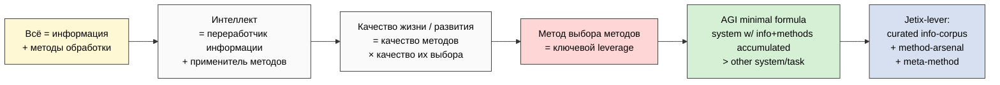
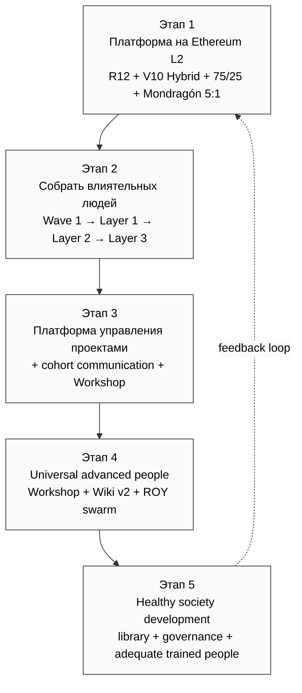
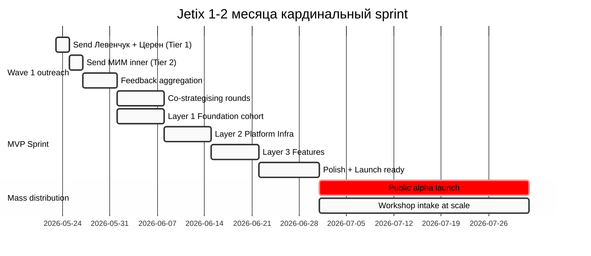
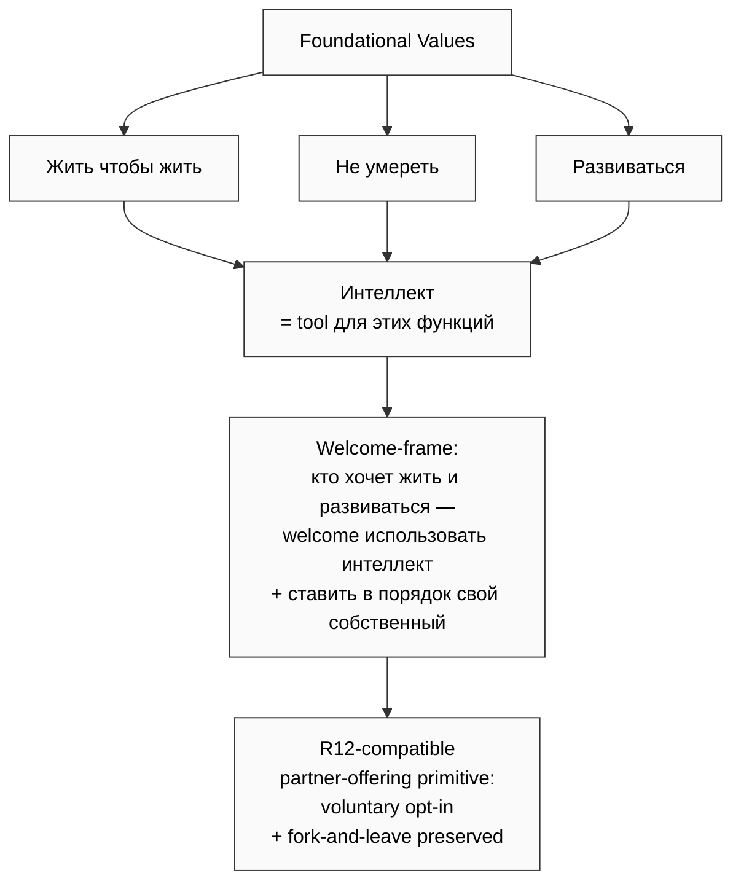
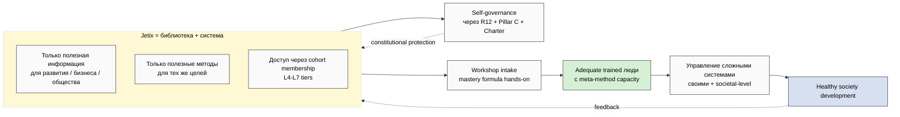
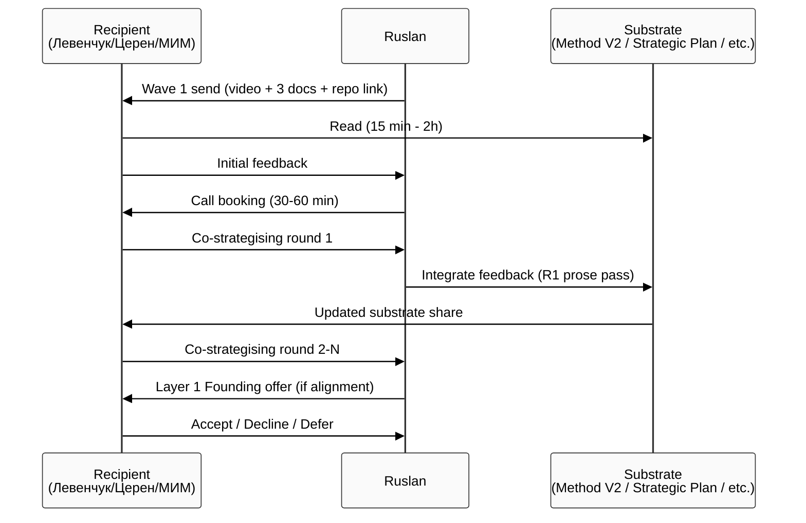

# 🧭 Jetix Navigation Guide

> **Кому:** Левенчук, Церен, МИМ inner cluster (первые получатели). После — другим recipients Wave 1.5+.
>
> **Что это:** orientation document для понимания Jetix как системы — история / основная гипотеза / план / срочность / запрос / навигация по документам.
>
> **Время на read:** ~10-15 мин для baseline picture; полный repo deep ~10-20 hours по интересу.

---

## §1 История — когда началась, что есть

### Старт + scale

- **Старт активной разработки:** ~38 дней до 22.05.2026 (~14.04.2026)
- **Substrate накоплено:** ~1.2M слов / 1377 git commits / ~4004 markdown файлов
- **Sprint 21-22.05 (последние 2 дня):** 4 LOCKED canonical документа (Method V2 65K + Strategic Plan 28K + Economic Model V10 25K + AI Market PLAN Stage 1 3K) + 8 voice batches (4-11 + supplement) + 13 Tier A wiki concepts + Partner Offering Human-Lang
- **Команда сейчас:** Ruslan (sole founder + strategist) + ROY swarm (5 AI experts + 4 sub-brigadiers через Claude Code Max sub)

### Foundation базовое

- **Foundation v1.0 LOCKED 2026-04-28** — 11 Parts + Pillar A (Strategic Direction) + Pillar C (Principles)
- **12 constitutional rules Tier 2** включая **R12 anti-extraction LOCKED 2026-05-12** (нельзя извлекать ценность сверх согласованного; fork-and-leave protection)
- **Programmable Ethereum substrate Phase 2+** acked 2026-05-18 — Option D Hybrid (Mondragón cap + QF revenue distribution + fork-and-leave exit tokens)
- **Filesystem authoritative; Notion = view** (вся source of truth в git)

### Leverage proof (Method V2 §12)

10-20× leverage solo с AI substrate vs solo без — quantitative proof через personal git scan:
- 1377 commits / 4004 .md / 1.2M words за 38 дней
- Это substrate density которая невозможна для solo без AI; и при этом — НЕ team output (один человек + ROY swarm)

---

## §2 Core thesis — всё = информация + методы

### Базовая онтология

**Гипотеза:** всё, чем мы оперируем — это **информация** (любая разница, которая что-то значит для системы; Bateson 1972; Shannon 1948) и **методы** её переработки (способы что-то сделать с информацией; Левенчук MG4 — метод как объект 1-го класса).

### Интеллект как переработчик

Интеллект = система которая занимается **переработкой информации с использованием методов**. Качество жизни / развития / результата = качество методов × качество их выбора (**метод выбора методов** = ключевой leverage; Method V2 §5 §J).

### Что следует

Если хорошо работаешь с информацией → можешь выбирать **наилучшие методы** для каждой задачи → можешь **хорошо развиваться** (и развивать системы вокруг себя).

Это **claim на AGI minimal formula** (audio_726 batch-11; O-133 candidate): «system с info+methods accumulated > other system/task на этом domain». То есть AGI определяется **relatively к задаче**, не abstractly — Jetix-lever это curated info-corpus + method-arsenal + meta-method = AGI-equivalent на chosen domains.

### Foundational values

- **Жить чтобы жить**
- **Не умереть**
- **Развиваться**

Интеллект = tool создан для этих функций. **Welcome-frame:** «кто хочет жить и развиваться — welcome использовать интеллект + поставить в порядок свой собственный».

---

## §3 Основной план — платформа + сообщество + общество

### Этап 1: Платформа на blockchain

**Цель:** построить cooperative platform на blockchain substrate (Ethereum L2 Optimism baseline) с:
- **R12 anti-extraction discipline** запрограммированной on-chain
- **Triple-role partner** structure (worker + investor + promoter unified в одном лице — beyond-Mondragón innovation)
- **75/25 split** (75% partner direct / 25% Foundation institutional)
- **Mondragón ratio cap 5:1** enforced programmatically
- **Fork-and-leave protection** + 30-day opt-out
- **V10 Hybrid token form** — ERC-1155 + ERC-5114 (soulbound) + Moloch RageQuit + Mondragón cap + QF matching + ERC-20 + ERC-4337 account abstraction

### Этап 2: Собрать влиятельных людей

**Wave 1 (текущий):** Левенчук + Церен + МИМ inner cluster (Gabdulin / Batyrshin / Podobed).
**Wave 1.5-2:** Karpathy + Buterin + Anthropic (Olah / Kaplan) + RU AI (Markov / Sapunov).
**Layer 1 Foundation cohort:** 10-15 builders (Июнь 1-7) — constitutional finalize + R12 Ethereum spec + ROY swarm packaging.
**Layer 2 Platform Infra:** 200-300 contributors (Июнь 8-14).
**Layer 3 Features:** 300-500 contributors (Июнь 15-21).
**Mass distribution:** 1000+ Workshop intake (Июль 1-31).

### Этап 3: Платформа для управления проектами + cohort communication

**Что:** платформа на которой люди:
- **Управляют проектами** (project lifecycle substrate — Foundation Part 7)
- **Коммуницируют между собой** (cohort + community layer)
- **Учатся** методу работы с информацией + методу развития (Workshop intake)

### Этап 4: Создание universal advanced people

**Что:** через Workshop + Wiki v2 substrate + ROY swarm tools → создаются **universal прокаченные люди** способные:
- Управлять **сложными системами**
- Применять meta-method (метод выбора методов) к новым domains
- Распространять metод дальше (positive virus model)

### Этап 5: Движение в направлении healthy society development

**Что:** **library + system** где только **полезная нужная информация для развития / бизнеса / общества** находится. Эта же система:
- **Управляет обществом** (через governance + R12 anti-extraction discipline)
- **Создаёт adequate trained людей** для управления сложными системами
- **Двигает общество** в направлении healthy development

---

## §4 Мастерская инженеров-менеджеров — frame

**«Мастерская инженеров-менеджеров»** = primary positioning Workshop:
- Не courses → hands-on practice
- Не lectures → методы applied to реальные partner problems
- ROY swarm 5 experts available as teaching aids
- 3-tier funnel: продвинутые обучают новичков (Feynman test of understanding)

**Левенчук + Церен = одни из первых** кому показываем full picture. Reason: deepest substrate alignment (методология ШСМ + МИМ ecosystem — closest to Jetix synthesis).

### §4.1 Расширенная концепция Мастерской (Sprint 26.05 expansion)

**Мега-мастерская** — это **foundational metaphor Jetix как пространства**, не просто positioning:

- **Все мастера собираются** в одном месте (виртуально → оффлайн физические места)
- **Разные инструменты** доступны — можно улучшать, ставить новый «станок» (member proposes → community evaluates)
- **Исследовательский центр** — создаются новые методы / открытые проекты
- **Зона мастерства** + зона встреч + тренировочный зал + спортивный + место для медитации / йоги + место совместного отдыха
- **Можно встретить любого человека / попасть в мега-клуб / побыть в роли инвестора / партнёра / консультанта / исследователя** (role experimentation)
- **Online → Offline transition**: virtuаль (now) → Берлин permanent (year 2) → 3-10 cities (year 3-5) → 30-100+ network (year 5+)
- **Multi-language** (English lingua franca + local) + **multi-location member movement** (travel program / cross-cell projects / sabbaticals)
- **Resources pooling**: знакомства / помещения / хаты / машины / бизнес-идеи / деньги / информация / навыки — всё в кучу (Mondragón pattern)
- **Activities**: походы в ниши / поездки в города / соревнования / школа / совместный отдых / путешествия / создание новых сообществ

**Концепция Мастерства**: накопление методов + **выбор в нужный момент нужного навыка** + вечная тренировка. AI делает рутину → человек занимается **mastery moments**, решением сложных задач, frontier-работой. **Темы vs уровни** — мастерство не линейно, а в разных топиках; сравнение мастеров между топиками бессмысленно.

**Этап подготовки** = неотъемлемая часть результата (mastery видно на переходах prep→action / study→action / action→feedback). Method V2 §J 6-step meta-method расширен до 8 шагов с explicit preparation stage.

**Полный спек** — см. §11.5 ниже (3 NEW concept docs Sprint 26.05).

---

## §5 Запрос к recipients

**Что хочется получить:**

1. **Обратная связь** на substrate + thesis (что resonates / что не работает / что не хватает)
2. **Создав застратегировать вместе** — несколько iterations стратегирования фундамента (не одноразовый ack, а итеративная co-strategy)
3. **Потом — launch** — после нескольких rounds co-strategising → execute (Layer 1 Foundation cohort intake)

**Что предлагается на стол:**
- L4 Founding Partner tier (10% take rate; 6+ mo hands-on commitment; founding stake; Founding Council voting)
- Substrate access (Method V2 + всё что есть)
- ROY swarm collaboration
- Brand recognition (founding contributor)
- Programmable Ethereum substrate participation Phase 2+

---

## §6 Срочность — 1-2 месяца кардинально

**Why urgent:**

- AI commoditisation accelerating (DR-34 thesis)
- 38 days substrate proves leverage works → window для public-launch optimal сейчас
- Mass-distribution-ready target: **30 Июня 2026**
- После этого → mass distribution phase Июль → cohort scaling

**Что значит «не остановить»:**
- Open-source mandate для Foundation + Wiki v2 + Method V2 + R12 programmable Ethereum → может быть forked любым моментом (anti-vendor-lock)
- Distributed substrate (1.2M слов в git history) → не существует kill-switch
- Cohort-driven governance → не зависит от Ruslan личной availability после Phase 5

---

## §7 AGI claim (O-133 — будет substantiated через DR-43)

**Working definition (pragmatic, не philosophical):**

> «System with info+methods accumulated + environment-leverage > other system/task = AGI relative to that task»

**Implication для Jetix:**

Curated info-corpus + curated method-arsenal + meta-method (метод выбора методов) = **AGI-equivalent на chosen domains** (business automation / methodology consulting / cooperative governance / etc).

То есть: AGI это не «one universal model», а **system которая в своём domain превосходит другие** через info-density + method-density + selection-quality.

**Note:** этот claim deferred к DR-43 deep research для validation/refinement (Goertzel / Hutter / Legg / Karpathy / OpenAI working defs comparative).

---

## §8 Library + system + society management thesis

**Vision:**

Jetix = библиотека + система где:

1. **Только полезная информация** для развития / бизнеса / общества (curation discipline)
2. **Только полезные методы** для тех же целей (meta-method selection)
3. **Доступ через cohort membership** (L4-L7 tiers per Partner Offering)
4. **Self-governance через R12 + Pillar C + Charter** (constitutional discipline)
5. **Создаёт adequate trained людей** через Workshop (не certificate mill — hands-on mastery formula)
6. **Эти люди потом управляют сложными системами** (своими + societal-level через cohort networks)

**Telos:** healthy society development driven by people с adequate cognitive / methodological capacity + Foundation-grade constitutional protection против extraction.

---

## §9 NAVIGATION — какие документы в каком порядке

### Quick scan (15-20 мин — для baseline picture)

| # | Doc | Time | Что внутри |
|---|---|---|---|
| 1 | [Video walkthrough] (Июнь 23-24 запись) | 12 min | Anchor + tone + основные тезисы |
| 2 | `PARTNER-OFFERING-HUMAN-LANG-2026-05-22.md` | 10 min | Partnership offering на пальцах (3 роли + 75/25 + 5:1 + fork-and-leave + 2 mermaid) |
| 3 | Этот навигационный guide | 10 min | Orientation (вы здесь) |

### Substantive (1-2 hours — для understanding на depth)

| # | Doc | Time | Зачем |
|---|---|---|---|
| 4 | `decisions/strategic/METHOD-LIFE-DEVELOPMENT-V2-2026-05-21.md` §0 TL;DR + §5 «метод выбора методов» + §J meta-method | 30-45 min | Methodology core |
| 5 | `decisions/strategic/STRATEGIC-PLAN-NEAR-FUTURE-2026-05-21.md` §0-§5 | 20 min | May-Jul roadmap + Wave 1 outreach + MVP Sprint |
| 6 | `decisions/strategic/ECONOMIC-MODEL-TOKENOMICS-2026-05-22.md` §0-§6 | 20-30 min | V10 Hybrid tokenomics + triple-role partner |

### Deep dive (по интересу — 10-20+ hours)

| # | Doc | Time | Когда |
|---|---|---|---|
| 7 | Method V2 full (17 phases + 40 mermaid + 47 external sources) | 2-3h | Если methodology резонирует |
| 8 | Foundation v1.0 (Parts 1-11 + Pillar A/C) — `swarm/wiki/foundations/` | 4-8h | Если architecture интересна |
| 9 | Pillar C Tier 2 (12 constitutional rules incl R12) — `principles/tier-2-system/foundation-generic/` | 1-2h | Если governance/constitutional интересен |
| 10 | 13 Tier A wikis — `wiki/concepts/` | 2-4h | Concept anchors (включая O-107 method-method-one-liner / O-121 8-component meta-method / O-128 external-system cybernetic principle) |
| 11 | AI Market PLAN Stage 1 — `decisions/strategic/AI-MARKET-ELECTRICITY-ANALOGY-PLAN-2026-05-22.md` | 10 min | Electricity analogy thesis (Stage 2 DEFERRED) |
| 12 | DR-26 unit-econ memo — `research/unit-econ-deep-dive-2026-05-21/_RECOMMENDATION-MEMO.md` | 20 min | Если financial / unit-economics |
| 13 | Hypothesis Architecture — `decisions/JETIX-HYPOTHESIS-ARCHITECTURE-*.md` | 30 min | Operational discipline |
| 14 | Sub-deliverables Economic Model: TRIPLE-ROLE-PARTNER / RECURSIVE-PARTNERSHIP-MECHANICS / TOKENOMICS-VARIANTS | 30 min each | Если partnership детали |
| 15 | AUDIO-721-INSIGHTS-REPORT | 10 min | Cybernetic principle deep |

### Repo structure overview

```
~/jetix-os/
├── CLAUDE.md                          # Master config + Foundation cross-refs
├── README.md / HOME.md                # Repo entry points
├── PARTNER-OFFERING-HUMAN-LANG-2026-05-22.md  # ⭐ partner-facing
├── decisions/                         # All strategic + R1 decisions
│   ├── strategic/                     # Strategic Layer (Pillar A)
│   │   ├── METHOD-LIFE-DEVELOPMENT-V2-*.md  # ⭐⭐⭐ methodology
│   │   ├── STRATEGIC-PLAN-NEAR-FUTURE-*.md  # ⭐⭐ roadmap
│   │   ├── ECONOMIC-MODEL-TOKENOMICS-*.md   # ⭐⭐ tokenomics
│   │   ├── AI-MARKET-ELECTRICITY-*.md       # ⭐ AI thesis
│   │   ├── JETIX-NAVIGATION-GUIDE-*.md      # ⭐ этот файл
│   │   └── WAVE-1-OUTREACH-PACKAGE-*.md     # Outreach substrate
│   ├── RUSLAN-ACK-*.md                # All R1 ack records
│   └── REFLECTION-INBOX-*.md          # Decision queues
├── swarm/wiki/                        # Wiki v2 architecture
│   ├── foundations/                   # ⭐ Foundation v1.0 (11 Parts + Pillar A/C)
│   ├── concepts/                      # Tier A wikis
│   ├── designs/                       # Design records
│   └── cycles/                        # Build cycles (e.g. cyc-foundation-build)
├── wiki/                              # Karpathy LLM Wiki + concept hub
│   ├── concepts/                      # ⭐ 13 Tier A concept pages
│   ├── index.md                       # Catalogue
│   └── log.md                         # Append-only chronology
├── principles/                        # Tier 1 + Tier 2 principles
│   └── tier-2-system/foundation-generic/  # ⭐ 12 constitutional rules incl R12
├── shared/schemas/                    # F-G-R / Default-Deny / Halt-Log-Alert / etc.
├── reports/                           # Phase reports (voice batches / DRs / etc.)
├── research/                          # Deep research outputs (DR-26 etc.)
├── prompts/                           # Server CC autonomous execution prompts
├── daily-logs/                        # Daily execution + plan refreshes
├── raw/                               # Raw inputs (voice transcripts / external corpora)
├── crm/                               # Multi-purpose contact network (people + orgs)
├── .claude/                           # Claude Code config + ROY swarm agents
│   ├── agents/                        # ROY swarm 9 agents
│   └── config/                        # Default-Deny table + routing
└── tools/                             # Pipelines (transcribe / extract / Toggl / etc.)
```

---

## §10 Mermaid diagrams

### Diagram 1 — Navigation tree (где что лежит)

```mermaid
%%{init: {'theme':'base','themeVariables':{'primaryTextColor':'#000','textColor':'#000','lineColor':'#333','primaryBorderColor':'#333','primaryColor':'#fafafa'}}}%%
graph TD
    Repo[jetix-os repo]
    Repo --> Entry[Entry points]
    Repo --> Strategic[Strategic substrate]
    Repo --> Foundation[Foundation v1.0]
    Repo --> Wiki[Wiki concepts]
    Repo --> Operational[Operational]

    Entry --> E1[Video walkthrough]
    Entry --> E2[Partner Offering Human-Lang]
    Entry --> E3[Этот Navigation Guide]

    Strategic --> S1[Method V2 ⭐⭐⭐]
    Strategic --> S2[Strategic Plan ⭐⭐]
    Strategic --> S3[Economic Model V10 ⭐⭐]
    Strategic --> S4[AI Market PLAN Stage 1]

    Foundation --> F1[11 Parts F5 LOCKED]
    Foundation --> F2[Pillar A Strategic Direction]
    Foundation --> F3[Pillar C Principles + R12 LOCK]

    Wiki --> W1[13 Tier A concepts]
    Wiki --> W2[Method-method one-liner O-107]
    Wiki --> W3[8-component meta-method O-121]
    Wiki --> W4[External-system cybernetic O-128]

    Operational --> O1[Daily Logs]
    Operational --> O2[Reports voice batches]
    Operational --> O3[Research DR-26+]
    Operational --> O4[Prompts server CC]

    style E1 fill:#ffe0a0
    style E2 fill:#ffe0a0
    style E3 fill:#ffe0a0
    style S1 fill:#ff9999
    style S2 fill:#ffcc99
    style S3 fill:#ffcc99
    style F1 fill:#99ccff
    style F3 fill:#99ccff
```



### Diagram 2 — Core thesis flow



### Diagram 3 — План cascade (Этапы 1-5)



### Diagram 4 — Wave 1 + cohort cascade timeline



### Diagram 5 — Foundational values + Welcome-frame



### Diagram 6 — Library + system + society management thesis



### Diagram 7 — Co-strategising iteration (запрос к Wave 1)



---

## §10.5 Sprint 23-26.05 expansion — NEW documents (architecture foundation)

> За 4 дня (23-26.05) substrate expanded massively. 15+ NEW strategic documents + полная Notion workspace built live. Все sterile, fork-friendly, READY для partner-facing использования (после R1 ack полировки).

### §10.5.A Architecture / Master skeleton (4 docs)

| # | Doc | Что внутри | Time read |
|---|---|---|---|
| 16 | `decisions/strategic/JETIX-FULL-MAP-AND-DOCS-SKELETON-2026-05-25.md` | **Master skeleton** — 12 entities (метод/инструменты/корпорация/4+заработковых моделей/платформа/образование/партнёры/community/R12/governance/research/strategic anchors) + 6 directions + 94 documents skeleton (36✅/25⚠️/33❌) + reference corporations (Apple/Tesla/Mondragón/Berkshire) + 4 super-кластера + 5 cross-cutting | 45-60 min |
| 17 | `decisions/strategic/JETIX-PUBLIC-DOCS-METAPLAN-V2-2026-05-25.md` | **MAX-DEPTH metaplan** — variant D Hybrid expanded + 11 directions × 3 doors × narrative routes + Rules document (10 angles) + Values + Beliefs document + Vision standalone + per-direction skeletons. Reference corps Western+Chinese (Alibaba/Tencent/ByteDance/Huawei/DJI/Xiaomi/Pinduoduo/Baidu) + cooperative + research | 60-90 min |
| 18 | `decisions/strategic/DOCS-CLASSIFICATION-2026-05-25.md` | **4 категории mapping** — 🟢 пояснительные / 🛠️ шаблоны / 📚 substrate / ⚙️ system + 19 GAPs + audience matrix per partner type | 20 min |
| 19 | `decisions/strategic/PLATFORM-LIFECYCLE-STAGES-PLAN-2026-05-25.md` | **3 этапа платформы** — Build / Run / Scale + per-stage actors + что просим/даём + R12 защита растёт быстрее системы + 4-недельный Build план (videos + Notion + Charter + Wave 1) | 30-45 min |

### §10.5.B Workshop + Mastery + Network concept (3 NEW frame docs)

| # | Doc | Что внутри | Time read |
|---|---|---|---|
| 20 | `decisions/strategic/JETIX-WORKSHOP-MASTERY-NETWORK-CONCEPT-2026-05-26.md` | **Foundational metaphor** Jetix = мега-мастерская + 3 NEW directions: 🏛️ Workshop Concept (физическое+виртуальное пространство, online→offline transition) / 🎯 Mastery Concept (накопление методов + выбор в нужный момент + AI стратификация + темы vs уровни) / 🌍 Network of Workshops (multi-location + multi-language + resources pooling + cross-cell movement) + 5 vivid worked examples (типичный день/месяц/год/expedition/cross-cell project) | 60-90 min |
| 21 | `decisions/strategic/WORKSHOP-CONCEPT-SUPPLEMENT-2026-05-26.md` | **Founder-as-Exhibit narrative** (я первый пользователь системы которую сам построил; продвижение через демонстрацию результатов) + **anti-marketing stance** (никакой рекламы / hooks; observation через Instagram/works/partners) + **Mastery deepening** (templates × unique tasks dualism + 3 axes accumulation: знания+навыки+люди + темы vs уровни) | 25 min |
| 22 | `decisions/strategic/PREPARATION-STAGE-CONCEPT-SUPPLEMENT-2026-05-26.md` | **Этап подготовки** explicit — неотъемлемая часть результата (не pre-work) + **Extended Meta-Method 8 steps** (Method V2 §J 6-step → 8 steps with preparation explicit) + THE TRICK (unique custom method born из preparation, не из repertoire) + Mastery at transitions (prep→action / study→action / action→feedback) + AI stratification mapping | 25 min |

### §10.5.C Notion templates architecture + LIVE workspace (2 docs + real Notion)

| # | Doc | Что внутри | Time read |
|---|---|---|---|
| 23 | `decisions/strategic/NOTION-TEMPLATES-3-LAYERS-ARCHITECTURE-V2-2026-05-25.md` | **3 layers Notion архитектура** — Layer 1 Personal Core (Daily Log с цель дня/реально сделано/deep work min/day type + Projects/Tasks/Ideas/Strategic Layer/Contacts/Knowledge/Hypotheses/Life Pulse/Finances + Habits + Философский лист) / Layer 2 Team Collaboration (Generic baseline + Jetix overlay + Brand adaptation pattern) / Layer 3 Universal Business Foundation (15 generic DBs fork-able для любого бизнеса) + AI Tools mega-page | 60 min |
| 24 | `decisions/strategic/NOTION-BUILD-REPORT-2026-05-25.md` + **LIVE Notion workspace** | **35 pages + 36 DBs + 44 relations + 20 AI tools + Master Dashboard + Onboarding & Help** реально построены на Notion. Sterile shell preserved (zero migration существующих данных Ruslan) + idempotent + R12-audited. Markdown mirror parallel в `reports/notion-build-2026-05-25/notion-mirror/` = filesystem source of truth | 30 min + walk через UI |

### §10.5.D Build artefacts + operational supplements (5 docs)

| # | Doc | Что внутри | Time read |
|---|---|---|---|
| 25 | `reports/build-artefacts-specs-2026-05-25/` (13 phase reports) | **10-12 Build артефактов deep specs** (15-point template per артефакт): Видео A/B/C / Notion Personal+Team OS / Charter / Лендинг+FAQ / Discovery call script / Юр+финансы / Supporting (course skeleton+Telegram+sales-minimum+brand-minimum) | per артефакт 15-20 min |
| 26 | `decisions/strategic/CALL-PLAN-DMITRIY-KAISER-2026-05-25.md` | **1h discovery call script** — Dmitriy Kaiser (corporate culture / business consultant / engineering bg) — 6 substance тезисов + 5 вопросов + 3-5 anticipated Q+A + R12 8-Q sweep + pre/post checklists | 15 min |
| 27 | `decisions/strategic/EXECUTION-PLAN-FIXATION-2026-05-24.md` | **4 типа партнёров (T1-T4) + 2 направления A/B + sequencing 3 недели** — baseline для всех partner outreach decisions | 30 min |
| 28 | `decisions/strategic/CONSOLIDATED-HUMAN-LANGUAGE-PLAN-2026-05-24.md` | **План обучения на человеческом** — 5+1 архетипов + 7 принципов + 7 ступеней Bloom + что даём на каждой ступени | 20 min |
| 29 | `decisions/strategic/OUTREACH-CONTENT-OUTCOMES-CTAS-2026-05-24.md` | **38K substrate** — 7+3 универсальных принципов + 13 CTAs + 31 анти-паттерн + 5+1 архетипов + 18 P0-P6 артефактов | 30-45 min |

### §10.5.E Подытог Sprint 23-26.05

- **15+ NEW strategic docs** (~150K+ plain Russian)
- **80+ phase reports** (server CC autonomous runs)
- **50+ mermaid diagrams**
- **LIVE Notion workspace** (35 pages + 36 DBs + 44 relations)
- **Substrate saturation подтверждён** (O-163) — mode shift: development → fixation → filling per direction → outreach
- **Workshop metaphor crystallized** как primary frame для outreach
- **Preparation Stage explicit** + Extended 8-step meta-method
- **~80+ R1 decisions** ждут Ruslan ack — priority session needed

---

## §11 GitHub access + links

### Repo access mode для Wave 1

**[Ruslan ack required §11.Q1]** Какой режим access:
- (a) **Private repo + collaborator read-invite** для каждого recipient (safer; реверсивно)
- (b) **Public repo + GitHub link** (commit ко полной open-source; faster spread; harder reverse)
- (c) **Selective branch public** (только Strategic + Wiki public; private остальное)

**Default proposal:** (a) private + read-invite — preserves option (b) later; даёт recipients sense of access без irreversible decision.

### Links blueprint (Wave 1 message)

**Core (читать первым делом):**
```
GitHub: https://github.com/Bogersebekov/jetix-os
  (после ack — invite на read access; на bogersebekov username)
Этот Navigation Guide: github.com/Bogersebekov/jetix-os/blob/main/decisions/strategic/JETIX-NAVIGATION-GUIDE-2026-05-22-DRAFT.md
Partner Offering: github.com/Bogersebekov/jetix-os/blob/main/PARTNER-OFFERING-HUMAN-LANG-2026-05-22.md
Method V2: github.com/Bogersebekov/jetix-os/blob/main/decisions/strategic/METHOD-LIFE-DEVELOPMENT-V2-2026-05-21.md
Strategic Plan: github.com/Bogersebekov/jetix-os/blob/main/decisions/strategic/STRATEGIC-PLAN-NEAR-FUTURE-2026-05-21.md
Economic Model: github.com/Bogersebekov/jetix-os/blob/main/decisions/strategic/ECONOMIC-MODEL-TOKENOMICS-2026-05-22.md
Video: [YouTube unlisted link — запись pending Sprint 26-27.05]
```

**Sprint 23-26.05 expansion — Architecture foundation (если хочет глубже):**
```
Master Skeleton (12 entities + 94 docs + reference corps):
  github.com/Bogersebekov/jetix-os/blob/main/decisions/strategic/JETIX-FULL-MAP-AND-DOCS-SKELETON-2026-05-25.md

Public Docs MetaPlan V2 (11 directions × 3 doors × routes):
  github.com/Bogersebekov/jetix-os/blob/main/decisions/strategic/JETIX-PUBLIC-DOCS-METAPLAN-V2-2026-05-25.md

Platform Lifecycle (Build/Run/Scale + actor matrix + 4-week plan):
  github.com/Bogersebekov/jetix-os/blob/main/decisions/strategic/PLATFORM-LIFECYCLE-STAGES-PLAN-2026-05-25.md

Docs Classification (4 категории + GAP):
  github.com/Bogersebekov/jetix-os/blob/main/decisions/strategic/DOCS-CLASSIFICATION-2026-05-25.md
```

**Sprint 26.05 — Workshop+Mastery+Network concept (foundational metaphor):**
```
Workshop+Mastery+Network Concept (мега-мастерская + 3 NEW directions + 5 vivid scenarios):
  github.com/Bogersebekov/jetix-os/blob/main/decisions/strategic/JETIX-WORKSHOP-MASTERY-NETWORK-CONCEPT-2026-05-26.md

Workshop Concept Supplement (Founder-as-Exhibit + anti-marketing + Mastery deepening):
  github.com/Bogersebekov/jetix-os/blob/main/decisions/strategic/WORKSHOP-CONCEPT-SUPPLEMENT-2026-05-26.md

Preparation Stage Concept Supplement (этап подготовки + Extended 8-step meta-method):
  github.com/Bogersebekov/jetix-os/blob/main/decisions/strategic/PREPARATION-STAGE-CONCEPT-SUPPLEMENT-2026-05-26.md
```

**Notion templates + LIVE workspace (что собираем для fork):**
```
Notion Templates 3-Layers Architecture V2:
  github.com/Bogersebekov/jetix-os/blob/main/decisions/strategic/NOTION-TEMPLATES-3-LAYERS-ARCHITECTURE-V2-2026-05-25.md

Notion Build Report (35 pages + 36 DBs + 44 relations live):
  github.com/Bogersebekov/jetix-os/blob/main/decisions/strategic/NOTION-BUILD-REPORT-2026-05-25.md

LIVE Notion workspace (после ack share — share read-link к sterile templates):
  [Notion link — share через UI после Wave 1 ack per recipient]
```

**Operational substrate (для T1 партнёров глубокий dive):**
```
Execution Plan Fixation (4 типа партнёров + sequencing):
  github.com/Bogersebekov/jetix-os/blob/main/decisions/strategic/EXECUTION-PLAN-FIXATION-2026-05-24.md

Consolidated Human-Language Plan (план обучения):
  github.com/Bogersebekov/jetix-os/blob/main/decisions/strategic/CONSOLIDATED-HUMAN-LANGUAGE-PLAN-2026-05-24.md

Outreach Content + CTAs (7+3 принципов + 13 CTAs + 18 артефактов):
  github.com/Bogersebekov/jetix-os/blob/main/decisions/strategic/OUTREACH-CONTENT-OUTCOMES-CTAS-2026-05-24.md

Build Artefacts Specs (10-12 артефактов deep specs):
  github.com/Bogersebekov/jetix-os/tree/main/reports/build-artefacts-specs-2026-05-25
```

---

## §12 Pending — будет добавлено

| Item | Source | ETA |
|---|---|---|
| 3 NEW Tier A wikis (Frankenstein O-122 / student-teacher O-130 / unified-framework O-129) | wiki-promo server CC | ~1-2h |
| DR-38 deep (~20-30K) — substantiates O-121 8-component meta-method | DR-38 server CC | ~9-13h |
| DR-40 deep (~18-25K) — substantiates O-128 external-system cybernetic | DR-40 server CC | ~10-14h |
| DR-43 (AGI minimal formula benchmarks) — substantiates §7 claim | TBD (prompt не создан) | ~3-4h после launch |
| Video walkthrough (12 min) | Ruslan record | Май 23-24 |
| Server CC deep navigation guide (через `prompts/navigation-guide-deep-2026-05-23.md`) | Cloud Cowork prompt → server CC | ~3-5h после launch |

---

## §13 R12 paired-frame discipline note

Этот navigation guide + Wave 1 sends соблюдают R12 anti-extraction:

1. **Welcome-frame voluntary opt-in** — recipients invited, не coerced
2. **Fork-and-leave preserved** — open-source mandate + no commitments в first send
3. **Mondragón ratio cap explicit** в Partner Offering (5:1)
4. **30-day opt-out window** при any Charter change
5. **Cooperative share framing** (75/25 split visible)
6. **No manipulation** (no fake urgency / scarcity / social proof)
7. **Specific contact + timeline** (Ruslan + Berlin + this week)
8. **Programmable enforcement** Phase 2+ (Option D Hybrid acked)

---

## §14 Constitutional posture

- **R1 surface only:** этот doc = substrate compile; **Ruslan R1 prose pass требуется** для finalisation
- **R2 LOCK preserved:** все cited docs read-only references
- **R6 provenance:** cross-cites к parent docs
- **R11 Default-Deny:** ничего auto-sent; Wave 1 send требует explicit Ruslan ack
- **R12 paired-frame:** §13 discipline note
- **IP-1 strict:** Ruslan = sole strategist + sender; brigadier = substrate compile
- **EP-5 F2-F3:** verbatim F2 + structural synthesis F3
- **AP-6 dissent preserved:** all voice ambiguity preserved (e.g. AGI formula simplification vs deep AGI debates flagged в R-batch-11 N5)
- **Append-only:** new namespace JETIX-NAVIGATION-GUIDE
- **Filesystem-authoritative:** этот doc primary; Notion = view

---

## §15 Open questions для Ruslan ack

| # | Question | Default proposal |
|---|---|---|
| **Q1 §11** | GitHub access mode: private+invite / public / selective branch? | (a) private + collaborator read-invite |
| **Q2** | Send Navigation Guide как 4-th document (вместе с Method V2 + Partner Offering + Video)? | Y — strong orientation primer |
| **Q3** | Деeper version навigation guide через server CC (`prompts/navigation-guide-deep-2026-05-23.md`) — запускать ПОСЛЕ wiki-promo (~1-2h), или сейчас 4-м (OOM risk)? | После wiki-promo finishes |
| **Q4** | Ruslan R1 prose pass на §2-§8 thesis sections (make it punchy) — когда? | После Q1-3 ack |
| **Q5** | Этот guide replace или augment Partner Offering как first-read? | Augment (Navigation = orientation; Partner Offering = offer detail) |

---

*Doc closure DRAFT 2026-05-22 evening. Per `feedback_prompt_explanation_required.md` — sibling prompt + EXPLAIN files создаются параллельно. Per `feedback_max_density_max_tokens.md` — DRAFT density максимальная; server CC deep version применит MAX-density mandate full. Per `feedback_no_unsolicited_alternatives.md` — surface options, Ruslan picks. Per `feedback_constitutional.md` R1 — brigadier substrate-only.*
