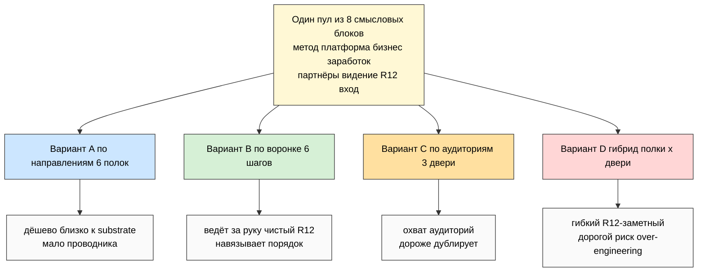
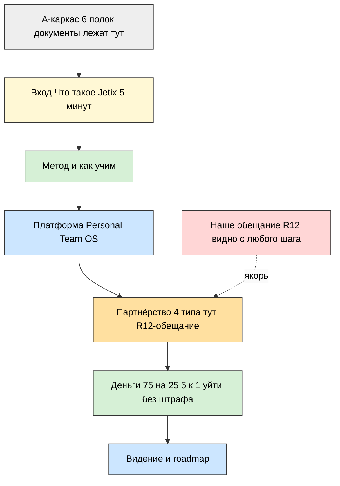
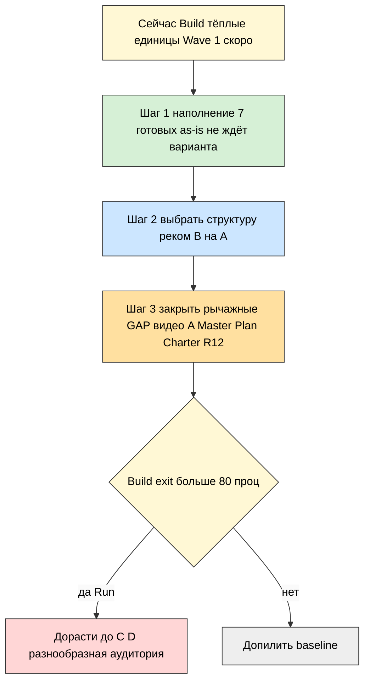

# 🗂️ Jetix Public Docs MetaPlan — 3 варианта структуры публичных документов

> **Что это.** Не сами документы — а **карта, по какой логике их резать**. У Jetix накоплен
> зрелый substrate (94 документа в 12 категориях), но он **не упакован наружу**. Этот метаплан
> отвечает на один вопрос: **как разбить накопленное на публичный набор**, чтобы умный партнёр
> с нуля понял Jetix за 5-15 минут. Три варианта (по направлениям / по воронке / по аудиториям)
> + гибрид. Сравнение. Рекомендация.
>
> **Как читать:** этот main = обзор (15-20 мин). Быстрее — `reports/.../00-SUMMARY-FOR-RUSLAN.md`
> (5 мин). Глубже — 7 phase-report'ов + 5 схем в `diagrams/_INDEX.md`.
>
> **R1 surface only.** Здесь варианты + рекомендация. Финальный выбор и приоритеты — твои
> (§5 — очередь решений). IP-1: имена партнёров = примеры ролей. Это **метаплан, не сбор
> документов** — после твоего ack отдельный prompt на наполнение выбранного варианта.

---

## §0 TL;DR (90 секунд)

- **Главный факт.** Состав публичного набора **почти не зависит от варианта** — это один пул
  из ~8 смысловых блоков (вход / метод / платформа / бизнес / заработок / партнёры / видение /
  R12-обещание). Вариант меняет **группировку и порядок**, не состав. Значит выбор структуры
  **не сжигает работу по наполнению** — он только задаёт рамку.
- **Что входит наружу:** Метод · Платформа · Бизнес · Заработок (модели на пальцах) · Партнёры ·
  Видение · R12-обещание. **Что НЕ входит:** Legal · Financial reporting · Research raw ·
  Brand book · Foundation-инфраструктура (всё это defer/internal).
- **3 варианта + гибрид:**
  - **A — по направлениям** (6 полок): дёшево, близко к substrate, но нет проводника.
  - **B — по воронке** (6 шагов): ведёт за руку, чистый R12, но навязывает порядок.
  - **C — по аудиториям** (3 двери глубины): охват разных читателей, но дороже и дублирует.
  - **D — гибрид** (полки × двери × маршрут): снимает минусы, но дорог → over-engineering на Build.
- **Матрица:** B=24, A=23, C=21, D=21 (из 30). A и B почти равны.
- **Рекомендация (R1 surface):** для текущего Build-этапа — **B-воронка как публичное лицо,
  A-полки как бэкенд хранения** (по сути lite-гибрид), полный C/D **отложить до Run**, когда
  аудитория станет разнообразнее. Параллельно — **запустить наполнение 7 готовых документов
  уже сейчас**, не дожидаясь выбора (они одинаковы во всех вариантах).
- **Рычажные дыры (одни во всех вариантах):** видео A · публичный Master Plan · «Как устроен
  Jetix» · Charter текст · R12-обещание-страница · discovery script универсальный.
- **5-8 решений ждут тебя в §5.**

---

## §1 Фильтр — что выходит наружу, что нет

Без фильтра любой вариант = «свалим всё, что есть». Фильтр и делает метаплан метапланом.
Беру 4 категории из DOCS-CLASSIFICATION и накладываю на 12 сущностей.

### ✅ Входит в публичный скоп
| Тема | Почему публичное |
|---|---|
| 🧪 Метод / Образование | главный оффер: cross-skill, прошивка, 7 ступеней |
| 🚀 Платформа | что получаешь руками: Personal/Team OS + Workshop |
| 💼 Бизнес | как устроена компания-кооператив |
| 💰 Заработок | модели дохода на пальцах (75/25, 5:1, fork-and-leave) — **не отчётность** |
| 👥 Партнёры | 4 типа, что просим / даём |
| 🎯 Видение | куда идём + зачем |
| ⚖️ R12-обещание | «не доим / не запираем / уйти без штрафа» — публичное обязательство |

### ⛔ НЕ входит (defer / internal)
**Legal documents** (defer — специалисты) · **Financial reporting** (defer — модели ≠ отчётность) ·
**Research raw** (5 deeps / 80+ книг / wiki — internal, максимум 1-2 curated ссылки) · **Brand book /
pitch / one-pager** (отдельная сессия) · **Foundation-инфраструктура** (11 Parts / Pillar C / FPF /
Halt-Log-Alert — показать = выглядеть как «закрытый клуб со своим жаргоном»).

**Правило фильтра.** 📚 substrate и ⚙️ system не идут наружу напрямую — из них берётся суть и
переписывается в человеческий жанр. Глубина остаётся доступной footnote-ссылкой, но не как
стартовый материал.

**Главный вывод substrate-чтения:** у Jetix **глубина закрыта, упаковка — нет**. Внутренние
сущности (Метод/Корпорация/R12/Research) задокументированы почти полностью; outward (Платформа/
Образование/Партнёры/Community) — дырявые. Значит публичный набор не пишется с нуля — он
**переупаковывает готовый substrate** в человеческий жанр под конкретную аудиторию.

---

## §2 Три варианта обзором + сравнение

Три варианта — **не выдуманы**, а сняты с трёх реальных способов, которыми зрелые компании
организуют публичную информацию (Phase 1):
- **по сущностям/направлениям** — Apple (по продуктам), Mondragón (по кооп-сущностям) → **A**;
- **по воронке/пути** — Anthropic/OpenAI (research→продукт→safety→company), John Lewis → **B**;
- **по аудитории/задаче** — Stripe Solutions, Apple витрина-vs-developer → **C**;
- гибрид — Stripe (Products + Solutions сразу) → **D**.

**Матрица сравнения (1-5, где 5 = лучше):**

| Критерий | A | B | C | D |
|---|---|---|---|---|
| Audience clarity (понятно, куда идти) | 3 | 5 | 4 | 4 |
| Substrate reuse (мало переупаковки) | 5 | 4 | 3 | 3 |
| Implementation ease (легко собрать) | 5 | 4 | 3 | 2 |
| Public-readiness (быстро наружу) | 4 | 4 | 3 | 2 |
| Flexibility (легко менять/расти) | 4 | 2 | 4 | 5 |
| R12-заметность обещания | 2 | 5 | 4 | 5 |
| **ИТОГО (из 30)** | **23** | **24** | **21** | **21** |

**Что решает выбор A vs B:** «партнёр уже знает, что ищет» (A — полки) vs «партнёр впервые
слышит и нужен проводник» (B — дорожка). **Что решает A/B vs C/D:** этап — Build (партнёров
единицы, тёплые) выигрывают A/B; Run/Scale (масштаб, разброс аудитории) выигрывают C/D.

---

## §3 Три варианта подробнее

### 🔵 Вариант A — по направлениям (6 полок)
Каждое направление = свой раздел = свой главный документ: **Метод · Платформа · Бизнес ·
Заработок · Партнёры · Видение**. Партнёр сам выбирает, с чего начать (как плитки на главной
Apple). R12-обещание — сквозная нить внутри «Заработок» и «Партнёры».
- **Плюсы:** прямая 1:1 проекция на master skeleton (минимум переупаковки); каждое направление
  растёт независимо; высокая автономия читателя; дешевле всех; быстрый старт наполнения.
- **Минусы:** нет проводника (любопытный не знает, с чего начать); партнёр сам собирает картину;
  R12 размазан; нет нарратива; риск неравномерного роста разделов.
- **Идеален когда:** аудитория уже знает Jetix и приходит с конкретным вопросом.

### 🟢 Вариант B — по воронке (6 шагов)
Структура = порядок знакомства: **Старт → Метод → Платформа → Партнёрство → Деньги → Видение**.
Каждый шаг готовит к следующему, R12-обещание появляется в «Партнёрстве» органично, выход
встроен в каждый шаг.
- **Плюсы:** ведёт за руку с нуля; к «деньгам» партнёр прогрет; чистый R12 (выход на каждом шаге);
  естественные CTA к discovery-звонку.
- **Минусы:** навязывает один порядок (методологу нужна сразу глубина); трудно «зайти сбоку»;
  ошибка в sequence ломает воронку; линейность (не зацепил шаг 2 → не дошёл до 5).
- **Идеален когда:** холодный outreach, Wave 1, лендинг — человек впервые слышит.

### 🟠 Вариант C — по аудиториям (3 двери глубины)
Один контент на трёх глубинах: **👁️ Любопытный (5 мин) · 🤔 Серьёзный кандидат (30-60 мин) ·
🔬 Methodology-savvy / R12-мост (deep dive)**. R12 виден на всех уровнях (фраза → раздел →
механика).
- **Плюсы:** каждый получает свою глубину; проекция на 3 персоны; C3 даёт честную глубину для
  T1/R12-моста; совпадает с тем, как делят референсы (Apple/Stripe/Mondragón).
- **Минусы:** дублирование между слоями (риск рассинхрона); человек должен сам оценить «кто я»;
  дороже в поддержке; граница C2/C3 размыта.
- **Идеален когда:** аудитории очень разные по уровню (масса + T1 одновременно) — ближе к Run/Scale.

### 🔴 Вариант D — гибрид (полки × двери × маршрут)
Каркас хранения по направлениям (A) + вход по слоям аудитории (C) + воронка (B) как
рекомендованный маршрут внутри C2. R12-якорь «Наше обещание» вынесен в топ (как safety у
Anthropic).
- **Плюсы:** снимает минус каждого; один источник на документ + разные входы (нет дублей);
  R12 всегда на виду; масштабируется.
- **Минусы:** дороже всех; навигатор сам становится трением; на Build — почти наверняка
  over-engineering; больше движущихся частей; соблазн полировать навигацию вместо наполнения.
- **Идеален когда:** набор документов уже зрелый, партнёров достаточно — Run/Scale, не Build.

---

## §4 Рекомендованный путь (R1 surface — не решение)

Рекомендация = surface для твоего решения, не указание. С учётом того, что мы **в Build,
средняя часть**, партнёров единицы (тёплые: Дмитрий, Maxim, Oleg), а **холодный Wave 1 скоро**:

**Рекомендую: B-воронка как публичное лицо + A-полки как бэкенд хранения (= lite-гибрид).
Полный C/D — отложить до Run.**

**Почему так (rationale):**
1. **B даёт проводника холодному Wave 1** — где A оставит незнакомца перед 6 плитками без иерархии.
2. **B чище всех по R12** (выход на каждом шаге) — а публичный набор = partner-facing = R12 STRICT.
3. **A-полки как бэкенд** дают дешевизну и 1:1 проекцию на master skeleton — документ пишется
   один раз, лежит на полке, а воронка лишь задаёт порядок показа.
4. **C/D отложить** — на Build партнёров единицы, три двери и навигатор не окупятся и грозят
   over-engineering (прямой R-refute триггер промпта).
5. **Эволюция естественна:** B-на-A → дорастает до C/D на Run, когда аудитория станет
   разнообразнее (масса + T1 одновременно). Структуру не придётся ломать — двери C добавляются
   поверх готовых полок.

**Параллельный шаг, не ждущий выбора:** **запустить наполнение 7 готовых документов уже
сейчас** (они одинаковы во всех вариантах): Partner Offering (готов AS-IS) · 7 ступеней ·
ценообразование · Y1-траектория · 4 типа партнёров · Build/Run/Scale на пальцах · 6 направлений+этапы.

**Рычажные GAP (создавать с нуля, одни во всех вариантах):** видео A (блокер 4 сущностей) ·
публичный Master Plan · «Как устроен Jetix» (вырезать ⚙️-жаргон) · Charter текст (закрывает 8
сущностей) · R12-обещание-страница · discovery script универсальный.

---

## §5 R1 decisions queue — что ждёт тебя (8 решений)

> R1 surface: рой surface'ит варианты, ты решаешь. Ничего не auto-promoted.

1. **Какой вариант?** A (полки) / B (воронка) / C (двери) / D (гибрид) / **рекоменд: B-на-A
   lite-гибрид**? Или правки рекомендации?
2. **6 направлений ОК** (Метод/Платформа/Бизнес/Заработок/Партнёры/Видение) — добавить/убрать?
   (например, выделить Образование из Метода? R12-обещание — отдельным разделом или нитью?)
3. **Формат per направление** — Markdown / PDF / лендинг-секция / видео? (по умолчанию: MD +
   лендинг-секция, видео для метода/видения).
4. **Quick wins сейчас** — какие 1-2 из 7 готовых документов закрываем prompt'ом первыми?
   (рекоменд: Partner Offering уже готов → «Кого ищем» 4 типа → видение/Master Plan).
5. **R12-обещание** — отдельная заметная страница «Наше обещание» (как safety у Anthropic) или
   сквозная нить внутри партнёрства/денег?
6. **Глубина для C3 / методологов** — делаем «глубокую навигацию» с curated refs в substrate
   сейчас или откладываем до первого T1-методолога в воронке?
7. **Sequencing публичного релиза** — что первым наружу: лендинг-вход (B1) / Partner Offering /
   видео A? (видео A = блокер по Platform Lifecycle).
8. **Следующий prompt после ack** — наполнение какого документа первым? (рекоменд: «Как устроен
   Jetix» как самый рычажный CREATE-GAP, или сразу лендинг-вход для Wave 1).

---

## §6 К чему ведёт (что разблокирует)

После того как ты прочитаешь + acked:
1. **Рамка для публичного набора** — любой новый публичный документ имеет место (направление +
   слой), не плодим кашу.
2. **Выбор структуры сделан спокойно** — он не блокирует наполнение (7 документов готовы AS-IS).
3. **Очередь рычажных GAP** — видео A / Master Plan / «Как устроен Jetix» / Charter / R12-страница
   = следующие prompt'ы наполнения.
4. **Следующая итерация** (запускаешь ты сам — pool result, НЕ auto): отдельный prompt на
   наполнение одного выбранного документа первым (быстрый win).
5. **Параллельно** — Brand-сессия (отдельно, не в этом скопе).

**Это финальная organize-итерация по публичным документам. Структура есть — дальше наполнение.**

---

## §7 Cross-refs (substrate + phase reports)

| Документ | Зачем |
|---|---|
| `JETIX-FULL-MAP-AND-DOCS-SKELETON-2026-05-25.md` | 12 сущностей + 94 документа + master skeleton (база) |
| `DOCS-CLASSIFICATION-2026-05-25.md` | 4 категории + audience×category matrix + анти-паттерны |
| `PLATFORM-LIFECYCLE-STAGES-PLAN-2026-05-25.md` | Build/Run/Scale + кого зовём когда |
| `EXECUTION-PLAN-FIXATION-2026-05-24.md` | 4 типа партнёров + 8 вопросов R12 |
| `PARTNER-OFFERING-HUMAN-LANG-2026-05-22.md` | стиль-якорь + готовый документ заработка |
| 7 phase-report'ов `reports/jetix-public-docs-metaplan-2026-05-25/` | drill-down по фазам 0-6 |
| `diagrams/_INDEX.md` | 5 схем META-1..META-5 |

---

*Document closure 2026-05-25. Jetix Public Docs MetaPlan — 3 варианта (A по направлениям / B по
воронке / C по аудиториям) + D гибрид. Фильтр: ✅ Метод/Платформа/Бизнес/Заработок-модели/
Партнёры/Видение/R12; ⛔ Legal/Financial-reporting/Research-raw/Brand/Foundation-infra.
Матрица B=24/A=23/C=21/D=21. Рекомендация (R1 surface): B-воронка на A-каркасе для Build,
C/D отложить до Run, наполнение 7 готовых стартовать сейчас. 5 mermaid META-1..META-5 (2 inline).
7 phase-report'ов. F2-F3 derivative, NO new external research. NO sample doc content (только
структура). R1 surface — 8 решений ждут тебя (§5). IP-1 STRICT (имена = примеры). R12 paired-frame
STRICT (публичное = partner-facing). Pool result — NO auto-launch consequent. NO LOCK modifications.*
