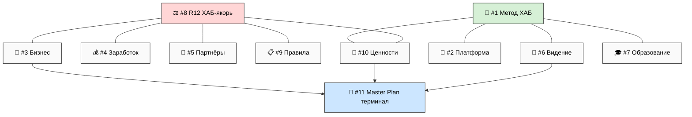
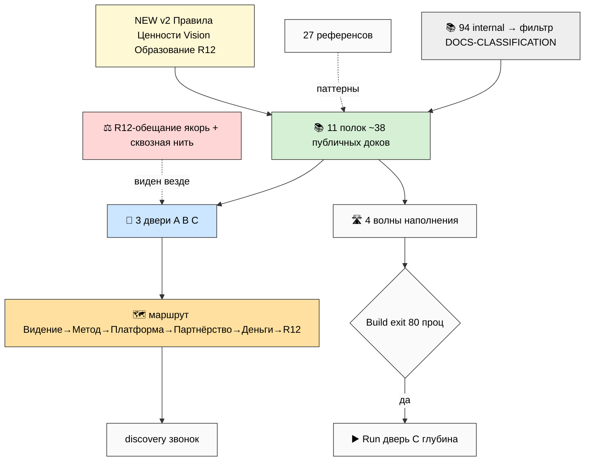
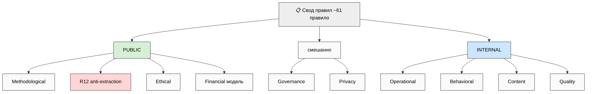
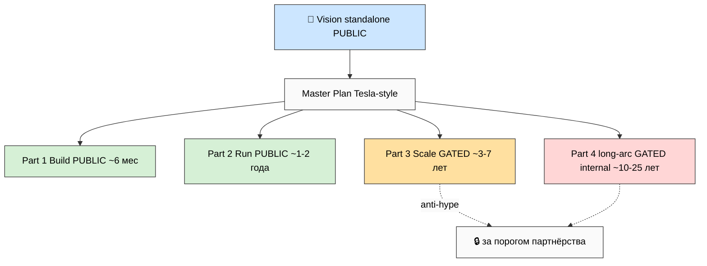
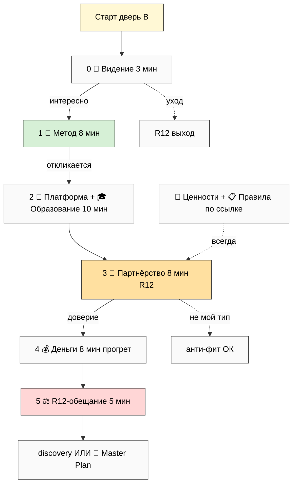
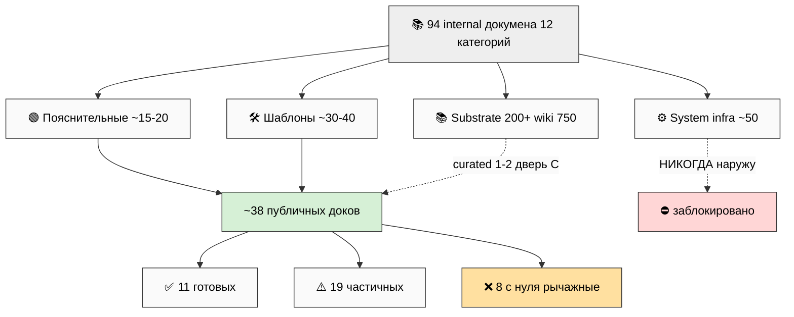
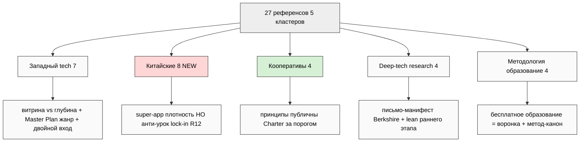
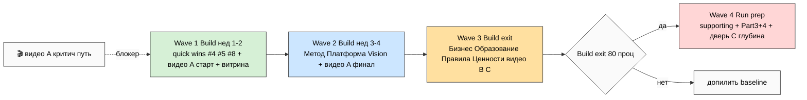

# 🗂️ Jetix Public Docs MetaPlan V2 — MAX-DEPTH

> **Что это.** Не сами документы — **полная карта**, по какой логике резать публичный набор. v1
> surface'нул 3 варианта структуры и рекомендовал. **v2 берёт вариант D (гибрид) как выбранный**
> (твой голос 25.05: «выбираю самый глубокий лучший проработанный») и **разворачивает его на
> максимум**: 11 направлений-полок × 3 двери-аудитории × 1 маршрут, плюс 5 новых направлений
> (Правила / Ценности / Vision standalone / Образование / R12-обещание), плюс полные скелеты по
> каждому, плюс расширенный reference-scan (вкл. китайские гиганты).
>
> **Как читать.** Этот main = обзор (60-90 мин). Быстрее — `reports/.../00-SUMMARY-FOR-RUSLAN.md`
> (15 мин). Глубже — 11 phase-report'ов + 10 схем META-V2-1..10. Самое практичное для тебя —
> **Phase 6 скелеты** (`07-per-direction-skeletons.md`, «плюс-минус по каждому»).
>
> **R1 surface.** D = выбран; внутри 13 R1-решений ждут тебя (§13). **Это метаплан, не сбор
> документов** — после ack отдельные prompt'ы наполнения per direction. **R11:** только структура
> и скелеты, NO sample doc content. **IP-1:** имена партнёров = примеры ролей. **Pool result —
> NO auto-launch.** **Supersedes v1** (v1 не изменён, помечен superseded — append-only).

---

## §0 TL;DR (90 секунд) + что изменилось vs v1

**Главный факт (как и в v1):** состав публичного набора почти не зависит от группировки — это
один пул смысловых блоков. Вариант D = способ собрать их в **полную карту**: полки (хранилище) ×
двери (витрина) × маршрут (проводник) + R12-якорь. v2 расширяет пул с 6 до **11 направлений**.

**Что изменилось v1 → v2:**
1. **D = выбран, не сравнивается** (v1 рекомендовал «B на A», v2 берёт самый глубокий D и
   разворачивает на максимум — твой осознанный выбор глубины как карты).
2. **+5 новых направлений:** 🎓 Образование (отделено от Метода) · ⚖️ R12/Обещание (отдельная
   полка + сквозная нить) · 📋 Правила (10 углов) · 💎 Ценности/Верования · 📜 Vision standalone +
   Master Plan (Tesla-style).
3. **+полные скелеты** по всем 11 направлениям (8-элементный шаблон каждый).
4. **+китайские гиганты** в reference-scan (Alibaba/Tencent/ByteDance/Huawei/Xiaomi/DJI/Pinduoduo/
   Baidu) — с anti-уроками R12 (lock-in / манипуляция / тёмные реферал-паттерны).

**Ключевая разгрузка над v1-страхом «D дорог, over-engineering на Build»:** D = **карта, не
стройка**. Карта полная; что строить первым — Wave-sequencing (§10). Over-engineering-риск снят:
карта ≠ обязательство строить всё сразу.

**Что входит наружу:** Метод · Платформа · Бизнес · Заработок (модели) · Партнёры · Видение ·
Образование · R12-обещание · Правила · Ценности · Master Plan. **Что НЕ входит:** Legal ·
Financial reporting · Research raw · Brand book · Foundation-инфраструктура (System) — defer/internal.

**13 решений ждут тебя в §13.**

---

## §1 11 направлений — обзор

| # | Направление | Что внутри (primary) | GAP | Дверь A | NEW в v2 |
|---|---|---|---|---|---|
| 1 | 🧪 Метод | метод-метод, прошивка, question-first | ⚠️ | тизер | — |
| 2 | 🚀 Платформа | Personal/Team OS → кланы | ⚠️ | 1 экран | — |
| 3 | 💼 Бизнес | компания-кооператив, governance | ❌ | 1 абзац | — |
| 4 | 💰 Заработок | 75/25, triple-role, 5:1, fork-and-leave | ✅ | 1 цифра | — |
| 5 | 👥 Партнёры | 4 типа, что просим/даём | ✅ | «кого зовём» | — |
| 6 | 🎯 Видение | 6 направлений обзором | ⚠️ | 1-liner | — |
| 7 | 🎓 Образование | 7 ступеней × Bloom, прошивка | ⚠️ | «учим прошивке» | **NEW** (отделено от #1) |
| 8 | ⚖️ R12/Обещание | не доим/не запираем, 8 вопросов | ⚠️ | ФРАЗА якорь | **NEW** полка |
| 9 | 📋 Правила | 10 углов, ~61 правило | ⚠️ | 🚫 | **NEW** |
| 10 | 💎 Ценности | триада + beliefs + anti-beliefs | ⚠️ | триада | **NEW** |
| 11 | 📜 Master Plan | Vision long-form + 4 части Tesla | ❌ | one-liner | **NEW** standalone |

**Хабы связей:** #8 R12 (якорь, связан с #3/#4/#5/#9/#10) и #1 Метод (#2/#6/#7/#10). #11 = терминал глубины.

*(META-V2-6 — cross-direction хабы. Полная suite — §11.)*

> Детально: `reports/.../03-variant-d-max-depth.md` §1 (11 полок) + `07-per-direction-skeletons.md`.

---

## §2 Variant D Hybrid MAX-DEPTH (ядро архитектуры)

**Три измерения пересекаются:**
- **Полки (11)** — хранилище по направлениям. Документ лежит на своей полке, пишется один раз.
- **Двери (3)** — витрина по аудитории. Один документ показывается под нужным углом.
- **Маршрут (1)** — проводник. Рекомендованная тропа для того, кто не знает, с чего начать.
- **R12-якорь** — «Наше обещание» видно из любой двери (как Anthropic safety в топе).

*(META-V2-10 — master synthesis. Вся архитектура одной схемой.)*

**Три двери:**
- **👁️ Любопытный (5 мин):** одностраничник — что/для кого/зачем + триада + R12-фраза + 1 цифра + CTA.
- **🤔 Кандидат (30-60 мин):** полный маршрут (см. §7) + 6 ядровых полок + видео + FAQ + discovery.
- **🔬 Методолог (deep):** глубокая навигация — Метод §J, recursion math, R12-механика, governance,
  Master Plan все части, curated refs. **Скрыто даже здесь:** System infra (анти-паттерн «секта-жаргон»).

**Матрица 33 ячеек (полка × дверь)** — состояние каждой (видно/по-ссылке/скрыто) — в
`03-variant-d-max-depth.md` §4. Ключ: **#8 R12** — единственная полка ✅ во всех трёх дверях (якорь).

**R12 в двух режимах одновременно** (это и есть суть гибрида D): (1) отдельная полка #8 «Наше
обещание» + (2) сквозная нить в каждой полке (R12-paired-frame: #4 каждая цифра + «как уйти»; #5
«кого зовём» + «кого НЕ берём»; #7 ступени бесплатны + выход; #2 fork-friendly не lock-in).

> Полностью: `reports/.../03-variant-d-max-depth.md` (11 полок + 3 двери + маршрут + матрица + 3
> worked-examples партнёров через двери + cross-direction rationale).

---

## §3 Свод правил (полка #9) — 10 углов

NEW в v2 (твой голос: «правила надо устанавливать»). Правила сейчас разбросаны (Pillar C + CLAUDE.md +
Global Rules) — свод = человеческая проекция в один документ. **Мета-правило:** правило без
enforcement и процедуры нарушения = пожелание, не правило.

**Формат каждого правила:** Утверждение → Зачем → Enforcement → Нарушение → Источник.

| Угол | Кол-во | Public/Internal | Главное |
|---|---|---|---|
| 1 Operational | 7 | internal | frontmatter / append-only / commit / API-key audit |
| 2 Methodological | 6 | **public** | question-first / гипотезы / мета-метод / адекватный интеллект |
| 3 R12 anti-extraction | 6 | **public целиком** | 8 вопросов + 5:1 + fork-and-leave + 30-day |
| 4 Ethical | 6 | **public** | AI disclosure / нет манипуляции / consent / приглашаем не вербуем |
| 5 Governance | 7 | смешанно | Руслан=стратег / AWAITING-APPROVAL / Stage Gates / 1-голос |
| 6 Behavioral | 6 | internal (+B-4 public) | прямой стиль / конфликт→gate / ротация анти-культ |
| 7 Content | 6 | internal | substrate не raw наружу / R12-check / не 5 ссылок |
| 8 Financial | 6 | модель public / отчётность ⛔ | 75/25 split / 5:1 / opt-in / QF / revenue-gated |
| 9 Privacy | ~5 | смешанно | private/ / данные члена=его / voice DRAFT-only |
| 10 Quality | 6 | internal (+принцип public) | F-G-R / cross-cite / нет fake metrics / fail-loud |

**~61 правило.** Естественно делится: ~25-30 публичных (→ полки #8/#9/#10/#1) + ~30 внутренних
(cohort onboarding / partner fork). Жанр-референс: Apple HIG + John Lewis Constitution + OpenAI Charter.

*(META-V2-9 — 10 углов правил tree.)*

> Полностью: `reports/.../04-rules-document-spec.md` (все 10 углов, каждое правило в шаблоне).

---

## §4 Ценности + Верования (полка #10)

NEW в v2 (твой голос: «отдельно файл ценностей верования»). Отличие от Правил: Правила = «что
делаем + enforcement»; Ценности = «во что верим + почему». Каждое правило — это ценность, ставшая
операцией.

**Триада (ядро, O-138):**
- 🌱 **Жить чтобы жить** — жизнь самоцель, не средство (пол: настоящее/полнота).
- 🛡️ **Не умереть** — устойчивость, viability (пол: сохранность как предусловие).
- 📈 **Развиваться** — рост как вектор, не накопление (вектор: будущее).
- *Проекции (для двери C): кибернетика VSM + SDT/flow + стоики prokopē — триада защищаема перед критиком.*

**6 operational values:** адекватный интеллект (O-180) · question-first (O-185) · frontier
contribution (O-183) · mass uplifment (O-184) · anti-cheating (O-181) · system+engineering baseline (O-176).

**7 beliefs:** AI=усилитель не замена (O-128) · метод-метод=рычаг (O-107) · cooperative>extractive ·
fork-and-leave=свобода · openness>closed (D-13) · $1T non-pyramidal (gated) · mass-shift возможен.

**7 anti-beliefs (границы — что НЕ делаем даже если выгодно):** extraction сверх доли · пирамиды/
MLM/lock-in · массовая манипуляция · «накопить ещё substrate» trap · технократ без этики · дамп=
образование · удержание-любой-ценой (engagement-trap).

**Ценности → решения (5 worked, делают ценности фальсифицируемыми):** Wave 1 «2 не 7» · 75/25
публично · ступени бесплатно · AI-рутина/человек-фронтир · distribute.py архивирован.

> Полностью: `reports/.../05-values-beliefs-document-spec.md` (триада углублённо + tension resolution).

---

## §5 Vision standalone + Master Plan (полка #11)

NEW в v2 (твой голос: «вижен отдельно его»). **Разведено с полкой #6 «Видение»:** #6 = короткий
витринный обзор (≤2K, в маршруте); #11 = long-form манифест + Master Plan (для тех, кто хочет всю
дугу). Tesla-паттерн: страница-обзор → отдельный Master Plan.

**Vision document:** Core statement (3 уровня) · 3 горизонта (1y/5y/25y) · gap-analysis · 5+1
архетипов · 4 механизма · **success-метрики НЕ только revenue** (paradigm-shift / R12-целостность /
frontier-contribution) · won't-compromise (R12/5:1/fork/триада).

**Master Plan (Tesla-style, 4 части):**

*(META-V2-8 — Vision + Master Plan структура.)*

**Public/gated split (anti-hype, Mondragón/Tesla урок):** Vision + Part 1+2 (Build+Run, контролируемо) —
public; Part 3+4 (Scale+long-arc, high uncertainty) — gated/partner-only; $1T + Network State —
gated/internal. Цифры остаются **сценарными** (Scenario A/B/C/D), не обещаниями — R-refute «sample
real data» не нарушается.

> Полностью: `reports/.../06-vision-master-plan-spec.md` (Tesla + OpenAI Charter + Berkshire-тон).

---

## §6 Per-direction skeletons (Phase 6 — «плюс-минус по каждому»)

Это то, что ты просил отдельно. Для каждого из 11 направлений — полный скелет primary main doc по
**единому 8-элементному шаблону:** Title+tagline / Hero (30-сек value prop) / TOC+Navigation /
§1 Intro / §2-N Content sections (placeholder-заголовки + bullet-подсказки) / Closing+CTA /
Appendix (cross-refs) / Metadata.

**R11 STRICT:** скелеты = заголовки + `[подсказка:…]` (инструкция автору), **НЕ сам публичный
текст**. Финал пишется отдельными prompt'ами (§10 Wave-sequencing).

**Сводка скелетов (плюсы-минусы):**

| # | GAP | Длина | Главный риск (минус) |
|---|---|---|---|
| 1 Метод | ⚠️ | ≤2K | видео A блокер; риск звучать эзотерично |
| 2 Платформа | ⚠️ | ≤2K | implement ❌ (базы пока дизайн) |
| 3 Бизнес | ❌ | ≤2K | нет жанра + риск Foundation-жаргона |
| 4 Заработок | ✅ | ≤2K | Y1 цифры сценарны (не обещание) |
| 5 Партнёры | ✅ | ≤2K | discovery script ❌ |
| 6 Видение | ⚠️ | ≤2K | дубль с #11 (разводится глубиной) |
| 7 Образование | ⚠️ | ≤2K | видео B ❌; грань education/recruitment |
| 8 R12 | ⚠️ | ≤1.5K | on-chain Phase 2+ (не обещать готовым) |
| 9 Правила | ⚠️ | ≤4K | public/internal граница = R1 |
| 10 Ценности | ⚠️ | ≤3K | триада = твоя формулировка |
| 11 Master Plan | ❌ | ~4K | жанр с нуля + anti-hype |

**Самые готовые (✅):** #4 Заработок (PARTNER-OFFERING AS-IS) · #5 Партнёры (EXECUTION-PLAN §5).
**Рычажные CREATE-GAP (❌):** #3 Бизнес · #11 Master Plan + видео A/B + discovery script.

> Полностью (50KB, heaviest report): `reports/.../07-per-direction-skeletons.md` — все 11 скелетов.

---

## §7 Audience × Direction matrix + мастер-маршрут

**5+1 архетипов:** T1 методолог (дверь C) · T2 ресурс (B→C) · T3 тестер (B) · T4 консультант
(B→C, отложен) · cohort/масса (A→B) · +1 R12-критик (C, валидатор). На **Build** активны T1+T3;
масса/T4 — позже. Значит **двери наполняются по этапам** (C+B сначала, A полнее к Run/Scale).

**Мастер-маршрут (дверь B, ~42 мин, выход на каждом шаге = R12):**

*(META-V2-2 — маршрут с decision-точками.)*

**Reading-time per путь:** витрина (дверь A) 5 мин · маршрут (B) ~42 мин · маршрут+ответвления 60-75
мин · deep dive (C) 2-4 часа. **Урок Wave 1:** холодный outreach = витрина→CTA 5 мин (не 42).

**6 decision-точек** = честные off-ramps. Партнёр, ушедший на «не мой тип» — успех фильтра, не
провал воронки. Cross-direction matrix 11×11 + хабы (#8/#1) — в отчёте.

> Полностью: `reports/.../08-audience-direction-matrix.md`.

---

## §8 Substrate mapping (откуда что тянем)

11 направлений × ~38 публичных доков, каждый с точным substrate-path + GAP + translation note.

*(META-V2-4 — substrate фильтр.)*

**Сводная GAP:** 11 ✅ / 19 ⚠️ / 8 ❌ (из ~38). **8 рычажных CREATE-GAP:** видео A · видео B ·
«Как устроен Jetix» (#3) · Master Plan (#11) · принципы/FAQ-юрлицо (#3) · discovery script (#5) ·
Vision long-form (#11) · «кого НЕ берём» (#5).

**Translation discipline (3 уровня):** 🟢 пояснительный жанр (двери A/B, plain-Russian) · 🛠️
шаблоны (Notion/Charter/discovery) · 📚 curated footnote (дверь C, 1-2 ссылки). **Запрещено:**
Foundation/System наружу · research raw · financial reporting (только модель) · legal · DRAFT-as-final.

> Полностью: `reports/.../09-substrate-mapping-v2.md`.

---

## §9 Reference corps patterns (27 референсов, 5 кластеров)

*(META-V2-7 — 5 кластеров референсов.)*

**Главные уроки (украсть):** Tesla Master Plan жанр (→#11) · Anthropic safety-в-топе (→#8 R12) ·
Stripe двойной вход (=гибрид D) · Apple витрина-vs-глубина (=3 двери) · Mondragón принципы-публичны/
Charter-за-порогом (→#8 vs членский Charter) · YC бесплатное-образование-воронка (→#7 ступени 1-4
free) · Berkshire письмо-манифест (→#11 тон) · Xiaomi ecosystem-chain (→AI-электрификация #6) ·
ByteDance невидимая-корпорация/видимые-бренды (→Network State #11).

**Anti-уроки (China, R12 paired-frame):** WeChat/Alipay тотальный lock-in → наш fork-and-leave ·
TikTok-движок удержание-любой-ценой → engagement + обещание не манипулировать (R12-7) · Pinduoduo
тёмные реферал-паттерны → promoter-bonus за качество не объём.

> Полностью: `reports/.../02-reference-corps-expanded.md` (все 27 + 10 паттернов + 3 anti-урока).

---

## §10 Implementation roadmap (4 волны)

**Принцип:** D = карта, не стройка. Quick wins сначала, блокеры параллельно. Видео A = критический путь.

*(META-V2-5 — 4 волны timeline.)*

- **Wave 1** (Build нед.1-2): quick wins #4 Заработок + #5 Партнёры + #8 R12 + видео A старт + витрина (#6/#10 one-liner).
- **Wave 2** (нед.3-4): #1 Метод текст + #2 Платформа + #11 Vision старт + видео A финал.
- **Wave 3** (Build exit): #3 Бизнес + #7 Образование + #9 Правила + #10 Ценности + видео B/C + #4 8-моделей.
- **Wave 4** (Run prep): supporting + Master Plan Part 3+4 + дверь C глубина (по запросу).

**Расхождение с промптом (surface R1):** промпт предлагал Wave 1 = Vision/Master Plan/Метод (тяжёлые ❌).
GAP-оптимальный порядок: Wave 1 = ✅ готовые (#4/#5) первыми, тяжёлые манифесты параллельно. **Выбор твой (§13.1).**

> Полностью: `reports/.../10-implementation-roadmap-v2.md` (усилие + зависимости per док + привязка к PLATFORM-LIFECYCLE 4-week).

---

## §11 Mermaid suite META-V2-1..10

10 схем (3 встроены выше inline: META-V2-6 §1 · META-V2-10 §2 · META-V2-9 §3 · META-V2-8 §5 ·
META-V2-2 §7 · META-V2-4 §8 · META-V2-7 §9 · META-V2-5 §10). Все light bg, ≥10 узлов.

| # | Показывает | Inline § |
|---|---|---|
| META-V2-1 | 11 полок × 3 двери (каркас D) | (suite) |
| META-V2-2 | мастер-маршрут + R12-выходы | §7 |
| META-V2-3 | этап-приоритет heat | (suite) |
| META-V2-4 | 94 → 38 substrate фильтр | §8 |
| META-V2-5 | 4 волны timeline | §10 |
| META-V2-6 | cross-direction хабы | §1 |
| META-V2-7 | 5 кластеров референсов | §9 |
| META-V2-8 | Vision + Master Plan 4 части | §5 |
| META-V2-9 | 10 углов правил | §3 |
| META-V2-10 | master synthesis | §2 |

> Полные исходники: `reports/.../11-mermaid-suite-v2.md` + каталог `diagrams/_INDEX.md`.

---

## §12 Per-direction matrix (quick reference)

| # | Направление | Primary doc | Substrate | GAP | Формат | Дл. | Двери (A/B/C) | R12-paired | Wave |
|---|---|---|---|---|---|---|---|---|---|
| 1 | 🧪 Метод | Метод на пальцах | METHOD-V2 §J | ⚠️ | MD+видео A | ≤2K | тизер/полн/§J | мягкий | 2 |
| 2 | 🚀 Платформа | Personal/Team OS | PLATFORM-LIFECYCLE | ⚠️ | MD+Notion | ≤2K | экран/обзор/3слоя | fork | 2 |
| 3 | 💼 Бизнес | Как устроен Jetix | FULL-MAP §1 | ❌ | MD+PDF | ≤2K | абзац/устроен/D-LOCK | govern | 3 |
| 4 | 💰 Заработок | Partner Offering | PARTNER-OFFERING ✅ | ✅ | MD+лендинг | ≤2K | цифра/offer/recursion | **STRICT** | 1 |
| 5 | 👥 Партнёры | Кого ищем 4 типа | EXECUTION §5 ✅ | ✅ | MD+PDF+видео C | ≤2K | зовём/4типа/8вопр | **STRICT** | 1 |
| 6 | 🎯 Видение | Куда идёт Jetix | FULL-MAP §2 | ⚠️ | MD+видео | ≤2K | liner/6напр/→#11 | мягкий | 1 |
| 7 | 🎓 Образование | Чему/как учим | METHOD-V2 7ступ | ⚠️ | MD+видео B | ≤2K | прошивка/7ступ/Bloom | uplift | 3 |
| 8 | ⚖️ R12 | Наше обещание | EXECUTION §4 | ⚠️ | MD+sworn | ≤1.5K | ФРАЗА/обещ/4класса | **объект** | 1 |
| 9 | 📋 Правила | Свод 10 углов | Pillar C+CLAUDE | ⚠️ | MD split | ≤4K | 🚫/свод/10углов | углы3/4 | 3 |
| 10 | 💎 Ценности | Во что верим | O-числа+триада | ⚠️ | MD Core-Views | ≤3K | триада/values/anti | A1-3/7 | 1→3 |
| 11 | 📜 Master Plan | Vision+4 части | STRATEGIC-PLAN | ❌ | MD+Tesla | ~4K | liner/Part1-2/все | won't | 2→4 |

---

## §13 R1 decisions queue — что ждёт тебя (13 решений)

> R1 surface: рой surface'ит, ты решаешь. Ничего не auto-promoted.

1. **Wave 1 порядок** — GAP-оптимальный (✅ #4/#5 первыми + видео A, тяжёлое параллельно) ИЛИ
   промпт-порядок (Vision/Master Plan/Метод первыми)? (рекоменд: GAP-оптимальный).
2. **11 направлений финальны?** — добавить/убрать/слить? (например, #6 Видение + #11 Master Plan —
   точно держим раздельно, или слить?).
3. **#8 R12 как полка + сквозная нить** — оба режима ОК, или только один?
4. **public/internal граница Правил** (§3) — согласна разметка (Method/R12/Ethical/Financial-модель
   = public; Operational/Content/Quality = internal)?
5. **Триада ценностей** — «жить чтобы жить / не умереть / развиваться» формулировки финальны? (это
   prose_authored_by: ruslan — твоя формулировка).
6. **Vision one-liner** — твоя формулировка (R1)? Какая?
7. **Master Plan публичная граница** — Part 1+2 public / 3+4 gated ОК, или сдвинуть (Part 3 тоже
   public как Tesla смело)?
8. **$1T наружу** — публично (Tesla-смелость) или gated (anti-hype)?
9. **Формат свода правил** — единый документ (John Lewis) ИЛИ 10 страниц per угол (Apple HIG)?
10. **Тон Vision/Values** — Anthropic Core-Views (сдержанно) ИЛИ Berkshire (лично, признаём ошибки)?
11. **Первый prompt наполнения** — какой док? (рекоменд: «Наше обещание» #8 якорь ИЛИ Partner
    Offering polish #4 самый готовый).
12. **Видео A/B** — записываешь ты (блокер, вне scope роя) — когда?
13. **Worked examples с именами** (в Ценностях/Партнёрах) — обобщать наружу (IP-1+privacy) или анонимно?

---

## §14 Cross-refs

| Документ | Зачем |
|---|---|
| `JETIX-PUBLIC-DOCS-METAPLAN-2026-05-25.md` (v1) | предшественник (superseded, не изменён) |
| `JETIX-FULL-MAP-AND-DOCS-SKELETON-2026-05-25.md` | 12 сущностей + 94 дока + 6 направлений видения |
| `DOCS-CLASSIFICATION-2026-05-25.md` | 4 категории + 3 персоны + анти-паттерны фильтра |
| `PLATFORM-LIFECYCLE-STAGES-PLAN-2026-05-25.md` | Build/Run/Scale + actor matrix + 4-week + видео A/B/C |
| `EXECUTION-PLAN-FIXATION-2026-05-24.md` | 4 типа партнёров + 8 вопросов R12 + discovery |
| `METHOD-LIFE-DEVELOPMENT-V2-2026-05-21.md` 🔒 | метод-канон §J + 7 ступеней + прошивка |
| `ECONOMIC-MODEL-TOKENOMICS-2026-05-22.md` 🔒 | 75/25 + 5:1 + recursion + 8 моделей |
| `STRATEGIC-PLAN-NEAR-FUTURE-2026-05-21.md` 🔒 | горизонты + Point A/B/C/D + сценарии |
| `PARTNER-OFFERING-HUMAN-LANG-2026-05-22.md` | стиль-якорь + готовый док #4 |
| 11 phase-report'ов `reports/jetix-public-docs-metaplan-v2-2026-05-25/` | drill-down по фазам 0-10 |
| `diagrams/_INDEX.md` | 10 схем META-V2-1..10 |

---

## §15 К чему ведёт (что разблокирует)

После того как ты прочитаешь + acked:
1. **Полная карта публичного набора** — любой новый документ имеет место (направление + дверь +
   wave), не плодим кашу. THE primary structure зафиксирована.
2. **Скелеты готовы** — каждое из 11 направлений имеет болванку (Phase 6), в которую ляжет текст.
3. **Очередь наполнения** — Wave 1 quick wins (#4/#5/#8) + рычажные CREATE-GAP (видео A/B / #3 / #11).
4. **Следующая итерация** (запускаешь ты — pool result, НЕ auto): отдельный prompt на наполнение
   первого дока (Wave 1).
5. **Параллельно:** видео A (ты) · notion-build (структура в Notion, running) · Brand-сессия (отдельно).

**Это финальная organize-итерация по публичным документам v2. Карта полная — дальше наполнение per direction.**

---

*Document closure 2026-05-25. Jetix Public Docs MetaPlan V2 — MAX-DEPTH Variant D Hybrid (11
направлений-полок × 3 двери-аудитории × 1 маршрут + R12-якорь). +5 NEW v2: Образование / R12-обещание /
Правила (10 углов ~61 правило) / Ценности+Верования (триада+beliefs+anti-beliefs) / Vision standalone +
Master Plan (Tesla-style 4 части). Per-direction скелеты (8-элементный шаблон). Reference-scan 27
референсов 5 кластеров (вкл. китайские 8 + anti-уроки R12). 10 mermaid META-V2-1..10 (8 inline). 11
phase-report'ов. Substrate: v1 + 8 core-доков + 29 D-LOCK + 8 O-чисел. GAP 11✅/19⚠️/8❌. Roadmap 4
волны. 13 R1-решений (§13). F2-F3 derivative, NO new external research. R11 — только структура+скелеты,
NO sample doc content. R2 STRICT (Foundation untouched). IP-1 STRICT (имена = примеры). R12 paired-frame
STRICT. Append-only (v1 superseded, не изменён). Pool result — NO auto-launch consequent. Supersedes v1.*
