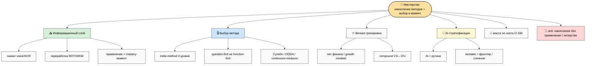
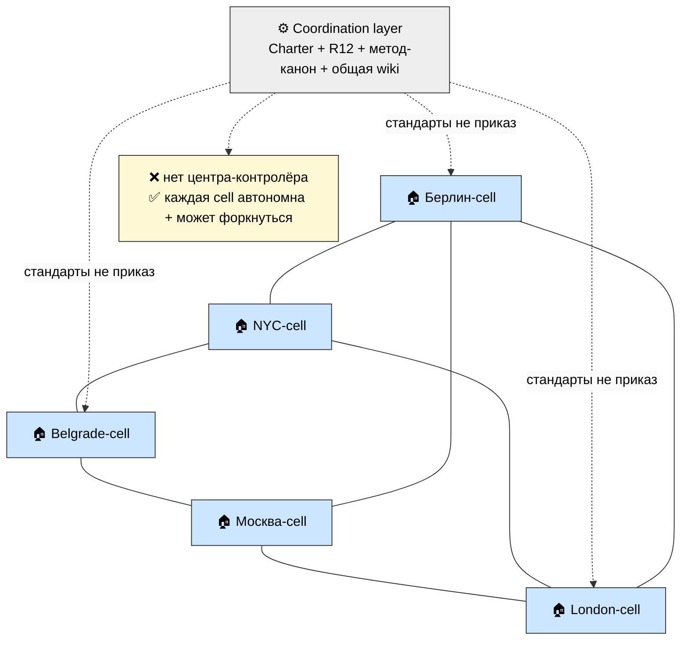
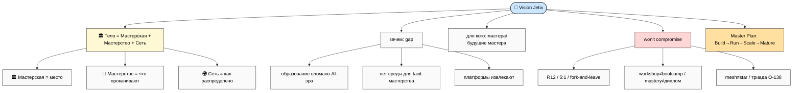
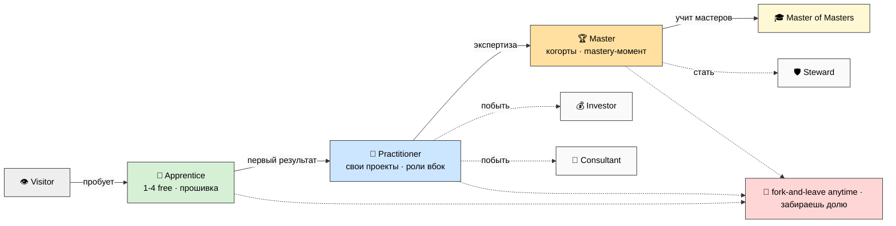
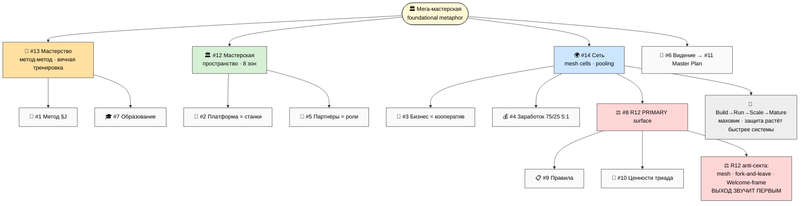

# 🏛️ Workshop + Mastery + Network Concept — мега-мастерская как foundational metaphor

> **Что это.** Не очередная стратегия — это **тело** для всего, что Jetix уже накопил. До сих пор
> Jetix описывался абстрактно: мульти-агентная система, кооперативное управление, R12, метод-метод.
> Это правда, но это **скелет без тела**. Голосовой дамп 26.05 дал телу форму: **мега-мастерская**.
> Место (сначала виртуальное, потом сеть физических), где мастера собираются, получают лучшие
> инструменты, нарабатывают мастерство на реальных задачах, встречают нужных людей и двигают
> фронтир — а рутину за них делает AI.
>
> Документ разворачивает **3 новых направления** поверх 11 из метаплана-v2 (итого **14**):
> #12 🏛️ Мастерская · #13 🎯 Мастерство · #14 🌍 Сеть мастерских — плюс переписывает **Vision**
> с мастерской как центральной метафорой.
>
> **Как читать.** Этот main = обзор (45-60 мин). Быстрее — `reports/.../00-SUMMARY-FOR-RUSLAN.md`
> (10 мин). Глубже — 10 phase-report'ов + 8 схем WK-1..WK-8. Самое живое для тебя — **§7 Worked
> examples** (типичный день / месяц / путь / expedition / cross-cell проект).
>
> **R1 surface.** Workshop-метафора предложена как primary frame; внутри 14 R1-решений ждут тебя
> (§11). **R11:** только концепт-spec + скелеты, NO sample doc content, цифры сценарные.
> **R2 STRICT:** Foundation не тронут. **IP-1:** имена партнёров = примеры ролей. **R12 STRICT:**
> Сеть = primary R12 surface (paired-frame AUTO-FIRE). **Append-only:** метаплан-v2 расширен, не
> изменён. **Pool result — NO auto-launch.**

---

## §0 TL;DR (90 секунд) + почему workshop metaphor critical

**Главный сдвиг.** Перестань описывать Jetix как «систему» / «платформу» / «кооператив». Это всё
правда, но это слова инженера про инфраструктуру. Начни описывать его как **мастерскую** — место,
куда ты приходишь утром и выходишь вечером немного бо́льшим мастером, чем был. Это перевод
абстракции в человеческий опыт. Мастерская = **тело Vision'а**.

**Три новых направления — три грани одного объекта:**
- **#12 🏛️ Мастерская** — *пространство*: где. 8+ зон (стена инструментов / исследовательский
  центр / зона мастерства / зона встреч / тренировочный + спортзал / медитация / отдых).
- **#13 🎯 Мастерство** — *что прокачивают*: накопление методов + выбор нужного в нужный момент;
  вечная тренировка; AI делает рутину, человек идёт на фронтир.
- **#14 🌍 Сеть** — *как распределено*: mesh из локальных cells, ресурсы в общий пул, передвижение
  людей, одна сеть с лучшими наработками.

**Почему это critical (а не «ещё один документ»):**
1. **Vision получает тело.** Был абстрактным — стал местом с запахом, людьми, прогрессией.
2. **Workshop = primary frame наружу.** После фиксации «мастерская» = первое, что встречает
   партнёр (не абстрактное «видение»). Снимает риск «звучит эзотерично».
3. **14 направлений вместо 11**, но не каша: 3 новых = тело, 11 старых встраиваются как детали
   внутри (Метод/Платформа/Заработок/...) и дуга (Видение/Master Plan).
4. **Сеть = primary R12 surface.** Здесь масса+рост+рекрутинг = максимальный соблазн
   extraction/секты → здесь максимальная защита (paired-frame на каждом механизме).

**Что входит:** место (зоны) · прокачка (метод-метод) · сеть (mesh + pooling) · online→offline
дуга · роли+прогрессия · Vision с телом. **Что НЕ входит / gated:** $1T · Network State · Part 3/4
Master Plan (anti-hype, partner-only/internal).

**14 решений ждут тебя в §11.** **Это концепт-фиксация, не сбор документов** — после ack отдельные
prompt'ы наполнения per direction + интеграция в metaplan-v3. **Pool result — NO auto-launch.**

---

## §1 🏛️ Мастерская (Workshop Concept)

> Полностью: `reports/.../02-workshop-concept-spec.md` (≥5K). Здесь сжато.

### Что это

**Мастерская — это место (сначала виртуальное, потом и физическое), где мастера и будущие мастера
собираются, получают лучшие инструменты, нарабатывают мастерство на реальных задачах, встречают
нужных людей и вместе двигают фронтир — а рутину за них делает AI.** *(one-liner — R1, финал за тобой)*

Представь пять вещей, обычно разбросанных по жизни, соединённых в одном пространстве: **цех** (все
инструменты под рукой, плохой можно улучшить, нужного нет — поставить новый «станок»),
**исследовательский центр** (не повторяют чужое, изобретают), **клуб** (за соседним верстаком —
человек, с которым иначе не познакомился бы; можно побыть инвестором/партнёром/консультантом),
**тренировочный зал** (осознанно прокачиваешь навык, а не «просто работаешь») и **место для тела и
тишины** (спорт, медитация, отдых — мастер это человек целиком). Мастерская не продаёт курс и не
выдаёт диплом. Она даёт **среду**, в которой стать мастером — естественно, а не героически.

**Корни метафоры** не выдуманы: ремесленный цех/гильдия (подмастерье→мастер), bottega Возрождения
(обучение = участие в реальном деле), atelier (продуктивный беспорядок), makerspace («приноси свой
проект»). И ключевое: **tacit knowledge (Полани)** — «мы знаем больше, чем можем рассказать» —
большая часть мастерства передаётся через apprenticeship + действие, не через тексты. Это **уже
зафиксировано в Method V2 §4** как обоснование «Jetix Workshop = hands-on, не лекции». Мастерская —
единственная форма, в которой tacit knowledge вообще передаётся.

### Что внутри (зоны) — WK-1

```mermaid
%%{init: {'theme':'base','themeVariables':{'primaryTextColor':'#000','textColor':'#000','lineColor':'#333','primaryBorderColor':'#333','primaryColor':'#fafafa','noteBkgColor':'#fff8d5'}}}%%
graph TB
    WS([🏛️ Мастерская])
    WS --> ZONES[Зоны]
    WS --> ACTS[Активности]
    WS --> ROLES[Роли]
    ZONES --> Z1[🛠️ Стена инструментов<br/>улучшай / ставь станок]
    ZONES --> Z2[🔬 Исследовательский центр]
    ZONES --> Z3[🎯 Зона мастерства]
    ZONES --> Z4[🤝 Зона встреч / клуб]
    ZONES --> Z5[🏋️ Тренировочный + 💪 спортзал]
    ZONES --> Z6[🧘 Медитация + 🌴 отдых]
    ACTS --> A1[нарабатывать / создавать / изобретать]
    ACTS --> A2[встречать людей / побыть в роли]
    ACTS --> A3[соревнования / учить / создавать сообщества]
    ROLES --> R1[вертикаль: Visitor→Master of Masters]
    ROLES --> R2[горизонталь: Investor/Partner/Consultant/Researcher/Steward]
    style WS fill:#fff8d5,color:#000
    style ZONES fill:#d6f0d6,color:#000
    style ACTS fill:#cce6ff,color:#000
    style ROLES fill:#ffe0a0,color:#000
```

*(WK-1 — Мастерская overview.)*

**8 зон** (принцип «всё что только можно натянуть»): 🛠️ **Стена инструментов** — существующие
(Notion-шаблоны, ROY-агенты, voice pipeline, OCR, CRM, Wiki, Claude Code, FPF), можно улучшать,
можно поставить новый станок (предложил → сообщество оценило → встал на полку с твоим именем) ·
🔬 **Исследовательский центр** (frontier work) · 🎯 **Зона мастерства** (deliberate practice) ·
🤝 **Зона встреч / клуб** (network + ролевое экспериментирование) · 🏋️ **Тренировочный зал**
(skill-drills / спарринги / разборы) · 💪 **Спортзал** (тело — триада «не умереть») · 🧘
**Медитация/йога** (стоическая дисциплина, ритм, уважение к периодам низкой энергии — AP-6) ·
🌴 **Отдых** (community bonding, Esalen). Список открыт.

### Что делаешь (активности)

Нарабатывать мастерство · создавать · изобретать · встречать интересных людей / попасть в мега-клуб
· **побыть в роли инвестора/партнёра/консультанта** (примерить роль без перестройки жизни) ·
соревнования (развивающие, не токсичные) · решать сложное · **учить других** (Feynman — лучший
способ выучить, двигатель mass upliftment) · создавать сообщества/города/страны (амбициозный край).

### Кем становишься (роли + прогрессия)

**Вертикаль:** 👁️ Visitor → 🌱 Apprentice (ступени 1-4 free) → 🔧 Practitioner → 🏆 Master →
🎓 Master of Masters. **Горизонталь:** 💰 Investor · 🤝 Partner · 🧭 Consultant · 🔬 Researcher ·
🛡️ Steward. **Ключевая механика:** роли **не пожизненные и не взаимоисключающие** — можно расти
вверх и пробовать функции вбок одновременно. Прогрессия не навязана (Welcome-frame), среда
поддерживает движение. *(IP-1 примеры: Maxim-тип = методолог/Master; Дмитрий-тип = тестер/Apprentice→
Practitioner; Прапион-тип = Steward; Левенчук-тип = Master of Masters; Сева-тип = Researcher.)*

### Чем НЕ является

❌ не co-working с кофе · ❌ не bootcamp с дипломами (мастерство ≠ диплом) · ❌ не закрытый элитный
клуб (fork-and-leave + Welcome-frame) · ❌ не школа с одним преподавателем (peer-mastery, нет
гуру) · ❌ не WeWork (не недвижимость как бизнес) · ❌ не фабрика продуктивности (спорт/медитация/
отдых равноправны) · ❌ не engagement-trap (метрика = «насколько ты вырос», не «время в приложении»).

---

## §2 🎯 Мастерство (Mastery Concept)

> Полностью: `reports/.../03-mastery-concept-spec.md` (≥5K). Ядро = voice Руслана 24.05 (O-176..O-185).

### Что это

**Мастерство = накопление методов + правильное использование нужного метода в нужный момент.**
(Voice 26.05: «выбирать в нужный момент нужный навык».) Не «много знаю» и не «долго делаю» — а
способность вытащить из накопленного именно тот метод, который сейчас сработает, и применить чисто.
Amateur знает 1-2 метода и лупит ими по всему; профессионал знает много; **мастер знает много И
выбирает правильный** — а иногда понимает, что нужного нет, и изобретает. Корни: Эрикссон
(deliberate practice — не «10 000 часов», а 10 000 часов **с правильной структурой**), восточные
традиции (путь, не пункт), инженерная виртуозность, Полани (tacit).

### Мастерство = информация (WK-2)

*(WK-2 — Мастерство tree.)*

«Всё = информация + методы переработки» (voice 26.05). Цикл: **захват** (быстро сохранять — voice/
OCR/clipper) → **переработка** (ROY-swarm / DIKW Акоффа / meta-method) → **применение в нужный
момент** (mastery-момент). Compound interest: связанные единицы растут экспоненциально. Большинство
живут без compound (поверхностно, без связывания, без внешней памяти, без рефлексии) — мастерство =
борьба с этим. Hand-off: рутина переработки → AI; выбор+применение в сложном → человек.

### Выбор нужного метода в нужный момент (сердце)

**Meta-method, 4 уровня** (Method V2 §J): 0 raw action → 1 метод применён → 2 выбор между методами
→ **3 дизайн своей стратегии выбора** ⭐. Большинство education учит уровню 1; некоторые — уровню 2;
**Jetix учит уровню 3**. **6-шаговая процедура:** identify системы влияния → целесообразно собрать
инфо (gradient достаточности, satisficing Саймона) → целесообразно обработать → поставить цель
целесообразно → выбрать лучший метод → apply+measure+adjust. **Question-first** (O-185): «зачем /
что мне даст / какая гипотеза», не «учу X функцию». **Cynefin/OODA** для доменов и скорости.
**Continuous measurement** (Левенчук МИМ — не экзамены).

### Вечная тренировка · читерство · AI-стратификация · масса

- **Вечная** (voice: «вечно прокачиваешь»): нет финала; growth mindset (Dweck — пререквизит, не
  добавка); plateau breaking; compound 1%→37x; уважение к ритму (AP-6).
- **Мастерство vs читерство** (O-180/O-181): adequate intellect выбирает **развивающие** методы,
  не shortcuts. AI ≠ зачитерить жизнь. Деньги = ресурс для развития, не цель. Долгосрочное >
  краткосрочное. Frontier mandate (O-183).
- **AI-стратификация** (O-182): AI на максимум для рутины («зачитерить эту хуйню, где не нужен
  интеллект»); человек на сложное+непонятное+фронтир. AI освобождает время **для глубины**. NOT
  замена — leverage.
- **Масса, не элита** (O-184): не «нас 10 умных» — ВСЕ подтягиваются (Welcome-frame O-144); AI =
  leveler если правильно framed (anti-extraction). *R12 paired-frame: mass upliftment ≠ вербовка
  в секту (нет клятв, нет спасителя, выход звучит первым; ступени 1-4 free).*

**Anti-patterns:** накопление без применения (читал 100 книг — не прокачался) · cargo-cult ·
shortcut addiction · solo grinding без feedback · fixed mindset · метод-фетишизм · вечный энтузиазм
как требование.

---

## §3 🌍 Сеть Мастерских (Network) — primary R12 surface

> Полностью: `reports/.../04-network-of-workshops-spec.md` (≥6K, R12 AUTO-FIRE). Здесь сжато.

### Топология: mesh, не star (WK-3)

*(WK-3 — топология сети.)*

**Mesh** (равноправные cells), **не star** (звезда с центром) — это R12-требование, не эстетика:
star → центр контролирует периферию → extraction/диктатура; mesh → каждая cell автономна,
координация через **общие стандарты** (Charter + R12 + метод-канон + общая wiki), не через приказ.
Cell может форкнуться. **Founder = первый член, не глава вечно** (топология не зависит от него —
проверка на анти-культ). Mondragón-паттерн (81 кооператив связаны принципами + внутр. банк, каждый
автономен).

### Мульти-язык · передвижение · роли · ресурсы · активности · направление

- **Мульти-язык:** английский primary (cross-cell) + локальный per cell; per-cell автономия
  культуры. *R12: английский ≠ доминирование.*
- **Передвижение:** travel program (приехал → есть где jam'нуть) · cross-cell projects ·
  sabbaticals · Demo Days · expeditions. *R12: добровольно, не отработка лояльности.*
- **8 ролей:** Local Master · Network Steward · Connector · Investor · Consultant · Researcher ·
  Master Mentor · Visiting Practitioner. *R12: нет роли «вербовщик» — есть Connector (соединяет
  согласных); Steward сам под R12.*
- **Ресурсы pooling (WK-6, voice-список «всё в кучу»):** знакомства · склады/помещения · хаты/
  гаражи · машины · бизнес-идеи · деньги (internal pool) · информация · инструменты · skills.
  **Ключ:** ресурс **предлагается** добровольно (opt-in) и **остаётся под контролем владельца** —
  не «всё общее по умолчанию». Пул = **gift + согласие**, не сбор дани. *R12: opt-in + consent +
  5:1 cap + fork забирает долю + RUSLAN-LAYER `non_consensual_distribution`.*
- **9 активностей:** походы в ниши · поездки в города · на учёбу · соревнования · школа · отдых ·
  путешествия · создание сообществ · open-source. *R12: развивают, не удерживают (anti-TikTok).*
- **Направление:** триада O-138 + «голодные/натренированные/дисциплинированные» = **вектор НЕ
  enforced**, поддерживается средой. *R12 (тонкая зона — где культы ломаются): нельзя выгнать за
  «недостаточную дисциплину»; уважение к ритму; нет давления «настоящий мастер всегда голоден»;
  выход без стыда. Граница между культурой развития и сектой держится явно.*

### Anti-patterns сети (R12 STRICT — ядро)

❌ central authority (star) → *защита: mesh* · ❌ founder cult → *founder=1 из многих, выход звучит
первым* · ❌ extraction beyond share → *5:1 + 75/25 + смарт-контракт* · ❌ fork-prevention →
*fork-and-leave + 30-day opt-out* · ❌ closed gates → *Welcome-frame + free 1-4* · ❌ uniformity →
*локальная автономия* · ❌ engagement-trap → *метрика=рост* · ❌ non-consensual distribution →
*opt-in + consent* · ❌ манипулятивный рекрутинг (anti-Pinduoduo) → *promoter-бонус за качество не
объём + 8 вопросов*.

**Анти-секта чек-лист** (всё ДА = здоровая сеть): mesh не star · founder уход не ломает · split
публичен 5:1 · fork-and-leave забираешь долю · вход открыт 1-4 free · локальная автономия · метрика
рост не время · pooling opt-in+consent · рекрутинг=приглашение, **ВЫХОД ЗВУЧИТ ПЕРВЫМ**.

> **Сквозной закон (lifecycle):** защита должна расти **БЫСТРЕЕ** системы. Иначе на Scale — секта
> или корпорация-диктатура.

---

## §4 📜 Vision Expansion (workshop = тело Vision'а)

> Полностью: `reports/.../05-vision-expansion-with-workshop.md` (≥4K). Расширяет метаплан-v2 §5
> (НЕ модифицирует).

*(WK-7 — Vision expansion.)*

**Core statement (R1 — твоя формулировка):** *«Jetix — это мега-мастерская мирового уровня: место,
где люди становятся мастерами в эпоху AI, вместе двигают фронтир и не дают системе доить или
запирать себя.»*

**Зачем (gap):** (1) образование сломано в AI-эру — люди учат то, что AI делает в сотни тысяч раз
лучше, по цене электричества (O-176/O-177); нужна смена парадигмы — ставить прошивку (системное
мышление + инженерный подход + методология + ответственность), рутину отдать AI; (2) нет среды для
мастерства — tacit knowledge передаётся только через apprenticeship, а bottega/гильдий не осталось
и они не соединены с AI-leverage; (3) платформы извлекают — co-working=аренда, bootcamp=диплом,
соцсети=engagement-trap, super-apps=lock-in. **Почему сейчас:** AI/Notion (технический leverage) +
кооператив/R12 (этический фундамент) + метод-метод (педагогика) впервые сходятся в одном месте.

**Master Plan (4 части):** Part 1 Build (виртуальная мастерская, ~6 мес, **public**) → Part 2 Run
(hybrid + первое арендованное место, ~1-2 года, **public**) → Part 3 Scale (3-10 мастерских + mesh
+ кооператив, ~3-7 лет, 🔒 **gated**) → Part 4 Mature (30-100+ network, member-owned, фронтир-
импакт, ~5-25 лет, 🔒 **gated/internal**; Network State кандидат). Public/gated split = anti-hype
(Tesla/Mondragón). $1T + Network State — gated (memory `project_balaji_outreach_target`: trigger
$100K + 20+ мастерских + published artifact).

---

## §5 Скелеты 3 новых направлений

> Полностью: `reports/.../06-per-new-direction-skeletons.md` (≥4K). 8-элементный шаблон метаплана-v2.
> **R11 STRICT:** скелеты = заголовки + `[подсказки]`, НЕ публичный текст.

| # | Скелет | Секции | Формат | GAP | Длина |
|---|---|---|---|---|---|
| 12 | 🏛️ Мастерская | Что это / Что внутри / Что делаешь / Кем становишься / Online→Offline / Чем НЕ является | MD + визуальные mockups + (Scale) видео-тур | ❌ create | ≤3K |
| 13 | 🎯 Мастерство | Что это / Информация / Выбор метода / Вечная тренировка / Vs читерство / AI-страт. / Масса / Активности / Anti | MD + видео B (reuse) | ⚠️ partial | ≤3K |
| 14 | 🌍 Сеть | Топология / Online→Offline / Мульти-язык / Передвижение / Роли / Ресурсы / Активности / Направление / Anti(R12) | MD + interactive map (future) + видео C (reuse) | ❌ create | ≤4K |

Самый готовый substrate — #13 (O-числа + Method V2 §J). Рычажные CREATE-GAP — #12 (нет физ. места
→ видео-тур позже) + #14 (R12-плотность + смарт-контракты gated).

---

## §6 Интеграция с 11 направлениями (11 → 14)

> Полностью: `reports/.../07-integration-with-11-directions.md`.

3 новых направления — не «добавка сбоку», а **тело**, в которое встраиваются 11 существующих:

| # существ. | Где workshop добавляет |
|---|---|
| 1 🧪 Метод | метод-метод (§J) = педагогика Мастерства #13 |
| 2 🚀 Платформа | tools = станки на стене Мастерской #12 |
| 3 💼 Бизнес | «как устроен» = кооператив Сети #14 |
| 4 💰 Заработок | 75/25/5:1/fork = экономика Сети; L7 = Workshop users |
| 5 👥 Партнёры | 4 типа = роли в Мастерской/Сети |
| 6 🎯 Видение | Workshop = тело Видения (Phase 4) |
| 7 🎓 Образование | 7 ступеней Bloom = прогрессия Мастерства |
| 8 ⚖️ R12 | primary surface = Сеть #14 anti-patterns |
| 9 📋 Правила | операционка (как ставить станок / пулить / форкнуть) |
| 10 💎 Ценности | триада = направление Сети + спорт/медитация Мастерской; adequate intellect = anti-cheating |
| 11 📜 Master Plan | дуга Сети online→offline (4 части) |

**3 хаба** (было 2): #1 Метод (педагогика) · #8 R12 (этика) · **#12 Мастерская (тело — новый)**.
**Master narrative:** маршрут двери B теперь начинается с **конкретного места** («вот мастерская»),
не с абстрактного «Видения» — снимает риск «эзотерично». Финальная интеграция в metaplan-v3 = R1.

---

## §7 Worked examples (5 vivid сценариев)

> Полностью: `reports/.../08-worked-examples-scenarios.md`. **R11: role-types (IP-1), цифры
> сценарные, NO real data.**

**§A Типичный день** (Practitioner-тип, виртуальная мастерская): 08:40 deliberate-practice drill
(30 мин — формулировать гипотезу за 5 мин, 10 заходов) → 09:15 deep-work фронтир (90 мин, рутину
уже отдал AI) → 10:45 пара с тестером (25 мин ловят tacit blind spot) → обед/спорт/тишина → 13:00
ролевой блок (сегодня консультант) → 14:30 улучшил станок, выложил на полку (через час берут из
NYC) → 16:00 учит новичка (Feynman-эффект) → 17:30 wrap. Проверка: **немного больший мастер, чем
утром** — прокачался, не «отсидел».

**§B Типичный месяц:** 3 недели deep work + неделя retreat/expedition; еженедельные mastery-
соревнования (поднимают планку, проигравших нет); месячный Demo Day (рождаются cross-cell проекты);
петля обратной связи (Run). Денежно (сценарно): ступень 5 ≈ €1500/мес; партнёр 75% + treasury stake.

**§C Типичный путь (12 мес):** Visitor (мес 0) → Apprentice (мес 1, ставит прошивку) → Practitioner
(мес 3-6, пробует роли вбок) → первый mastery-момент (мес 6-12, репутация не диплом) → Master/роль
(год 2+). На любом шаге — fork-and-leave без клейма.

**§D Типичная expedition:** 5-7 из разных cells, 1-2 недели, глубоко в нишу, deep learning sprint,
документация + sharing back → знание из одной точки обогащает всю сеть. *R12: добровольно,
гостеприимство = gift.*

**§E Типичный cross-cell проект:** методолог(Берлин) + исследователь(NYC) + тестер(Belgrade), 3
мес, mesh-координация (никто не начальник), ресурсы из пула (opt-in+consent), frontier outcome →
общий капитал; revenue-share per Mondragón (75/25, 5:1); кто хочет — fork с атрибуцией. Показывает:
сеть = fabric, рождает то, что в одиночку не родится; R12 на каждом шаге.

---

## §8 Online → Offline roadmap (WK-4)

> Полностью: `reports/.../09-online-to-offline-roadmap.md`. **Цифры сценарные (R11).**

```mermaid
%%{init: {'theme':'base','themeVariables':{'primaryTextColor':'#000','textColor':'#000','lineColor':'#333','primaryBorderColor':'#333','primaryColor':'#fafafa'}}}%%
graph LR
    Y1[🏗️ Year 1 Build<br/>виртуальная · 5-15 · 0 физ.<br/>маховик: основатель]
    Y2[▶️ Year 2 Run<br/>hybrid · 1 арендованное Берлин<br/>15-50 · €1.5-15K/мес<br/>+партнёры+петля]
    Y3[📡 Year 3-5 Scale<br/>3-10 мастерских · mesh<br/>100-1000 · смарт-контракты<br/>founder=1 из многих]
    Y4[🌐 Year 5+ Mature<br/>30-100+ · member-owned<br/>1K-10K+ · кооператив legal<br/>сеть сама]
    Y1 ==>|Build exit ≥80%| Y2
    Y2 ==>|1K+ 3 когорты €10K| Y3
    Y3 ==>|cells автономны| Y4
    R[⚖️ R12-риск 🟢→🟡→🔴→🔴+<br/>защита растёт БЫСТРЕЕ системы]
    Y4 -.-> R
    style Y1 fill:#d6f0d6,color:#000
    style Y2 fill:#cce6ff,color:#000
    style Y3 fill:#ffe0a0,color:#000
    style Y4 fill:#ffd6d6,color:#000
    style R fill:#fff8d5,color:#000
```

*(WK-4 — online→offline timeline.)*

Переключатель этапа = **«кто крутит маховик»**, не «сколько людей». «Быстро оффлайн» (voice)
ограничено: первое физ. место = **арендованное** (не купленное — anti-WeWork), **только при
подтверждённой Run-петле**. **Ключевые переходы** с триггерами+анти-триггерами (Build→Run /
первое место / Run→Scale / кооператив legal / worker-owner) — в Phase 8. **R12-escalation:** Build
🟢 (8 вопросов вручную) → Run 🟡 (Steward ≤5 сек + 5:1 на каждом сплите) → Scale 🔴 (смарт-
контракты 4 класса) → Mature 🔴+ (механический + внешний аудит). Member journey:

*(WK-5 — member journey.)*

---

## §9 Master synthesis (WK-8) + suite

*(WK-8 — master synthesis. Вся концепция: мега-мастерская = тело, 14 направлений встроены, 3 хаба
#1/#8/#12, lifecycle-дуга, R12 = primary surface Сети.)*

**8 схем WK-1..WK-8:** WK-1 Мастерская overview (§1) · WK-2 Мастерство tree (§2) · WK-3 топология
(§3) · WK-4 online→offline (§8) · WK-5 member journey (§8) · WK-6 resources pooling (suite) · WK-7
Vision (§4) · WK-8 synthesis (§9). Полные — `reports/.../10-mermaid-additions.md` + `diagrams/_INDEX.md`.

---

## §9.5 Reference orgs — что украдено, где anti-урок (сжато)

> Полностью: Phase 1 §G (Workshop) + Phase 3 §K/§L (Network). General-knowledge синтез (F2-F3, БЕЗ
> нового ресёрча). Мастерская — не один из этих форматов, а их **R12-чистый синтез**.

| Орг | Что украдено | Anti-урок (→ защита) |
|---|---|---|
| **Makerspaces / Fab Labs** | цех со станками + «приноси проект» + peer-teaching + Maker Faire→Demo Day | hobbyist-болото без вертикали → mastery-прогрессия + frontier |
| **Bottega Возрождения** | обучение = участие в реальном заказе | иерархия+extraction → peer-mastery + 75/25 |
| **Y Combinator** | founding-cohort бренд + Demo Day + Bookface (внутр. сеть) | gate-keeping элитарность → Welcome-frame + mass upliftment |
| **Reforge** | mastery-cohorts + «трансформация не контент» | подписка-lock + дорого → ступени 1-4 free + fork |
| **Esalen / монастыри** | ритм созерцания + retreat + годы практики | гуру + клятвы → нет спасителя, выход звучит первым |
| **Co-working (WeWork→boutique)** | community-programming + «платят за сообщество» | недвижимость-как-бизнес → место = инструмент, не доход |
| **Mondragón (81 кооп.)** | mesh-сеть + внутр. банк + 5:1 + worker-owner + education-first | управленческая бюрократия → mesh + локальная автономия |
| **Левенчук МИМ/ШСМ** | прошивка (системное мышление) + continuous measurement + Master Mentor | догматизация школы → мульти-метод + meta-method уровень 3 |
| **Burning Man** | decommodification/gifting + radical participation + temp. autonomous zone | festival tourism → метрика = рост участника |

**Anti-reference (China super-apps — R12 contrast, primary):** WeChat/Alipay тотальный lock-in →
наш fork-and-leave (`fork_prevention_attempt`); TikTok-движок удержание-любой-ценой → метрика=рост +
flow не dopamine (R12-7); Pinduoduo тёмные рефералы → promoter-бонус за качество не объём
(`non_consensual_distribution`); ByteDance невидимый центр → координация прозрачна (Charter публичен).
**Принцип:** всё, что extractive-сети делают для роста, сеть мастерских делает **наоборот** — и это
дизайн-выбор устойчивости (Mondragón пережил, WeWork схлопнулся), не жертва ради этики.

**Жанровые reference (из метаплана-v2 §9):** Tesla Master Plan (→ #11 жанр) · Anthropic safety-в-топе
(→ #8 R12-якорь) · Stripe двойной вход (→ 3 двери) · Apple витрина-vs-глубина (→ дверь A/B/C).

---

## §10 Per-direction matrix (14 направлений)

| # | Направление | Primary doc | Substrate | GAP | Формат | Дл. | Двери A/B/C | R12 | Wave |
|---|---|---|---|---|---|---|---|---|---|
| 1 | 🧪 Метод | Метод на пальцах | METHOD-V2 §J | ⚠️ | MD+видео A | ≤2K | тизер/полн/§J | мягкий | 2 |
| 2 | 🚀 Платформа | Personal/Team OS | PLATFORM-LIFECYCLE | ⚠️ | MD+Notion | ≤2K | экран/обзор/3слоя | fork | 2 |
| 3 | 💼 Бизнес | Как устроен Jetix | FULL-MAP §1 | ❌ | MD+PDF | ≤2K | абзац/устроен/D-LOCK | govern | 3 |
| 4 | 💰 Заработок | Partner Offering | PARTNER-OFFERING ✅ | ✅ | MD+лендинг | ≤2K | цифра/offer/recursion | STRICT | 1 |
| 5 | 👥 Партнёры | Кого ищем 4 типа | EXECUTION §5 ✅ | ✅ | MD+PDF+видео C | ≤2K | зовём/4типа/8вопр | STRICT | 1 |
| 6 | 🎯 Видение | Куда идёт Jetix | FULL-MAP §2 + Phase 4 | ⚠️ | MD+видео | ≤2K | liner/6напр/→#11 | мягкий | 1 |
| 7 | 🎓 Образование | Чему/как учим | METHOD-V2 7ступ | ⚠️ | MD+видео B | ≤2K | прошивка/7ступ/Bloom | uplift | 3 |
| 8 | ⚖️ R12 | Наше обещание | EXECUTION §4 | ⚠️ | MD+sworn | ≤1.5K | ФРАЗА/обещ/4класса | объект | 1 |
| 9 | 📋 Правила | Свод 10 углов | Pillar C+CLAUDE | ⚠️ | MD split | ≤4K | 🚫/свод/10углов | углы3/4 | 3 |
| 10 | 💎 Ценности | Во что верим | O-числа+триада | ⚠️ | MD Core-Views | ≤3K | триада/values/anti | A1-3/7 | 1→3 |
| 11 | 📜 Master Plan | Vision+4 части | STRATEGIC-PLAN + Phase 4 §8 | ❌ | MD+Tesla | ~4K | liner/Part1-2/все | won't | 2→4 |
| **12** | 🏛️ **Мастерская** | **Мастерская Jetix** | **Phase 1 spec + Method §4 tacit** | **❌** | **MD+mockup+видео-тур** | **≤3K** | **место/полн/зоны** | **fork** | **2** |
| **13** | 🎯 **Мастерство** | **Мастерство** | **O-176..O-185 + Method §J** | **⚠️** | **MD+видео B** | **≤3K** | **выбор/полн/meta-method** | **uplift** | **3** |
| **14** | 🌍 **Сеть** | **Сеть мастерских** | **Phase 3 spec + экономика** | **❌** | **MD+map+видео C** | **≤4K** | **карта/полн/смарт-контракты** | **PRIMARY** | **3→4** |

3 новых (жирным) = тело. Самые готовые: #4/#5/#13(substrate). Рычажные CREATE-GAP: #3/#11/#12/#14
+ видео A/B/C.

---

## §11 R1 decisions queue — что ждёт тебя (14 решений)

> R1 surface: рой surface'ит, ты решаешь. Ничего не auto-promoted (FUNDAMENTAL rule 1 — ты sole strategist).

1. **Workshop metaphor as primary frame** — фиксируем «мастерская» как center of gravity всей
   коммуникации? (это главный ack документа).
2. **14 направлений финальны?** — 3 новых (#12/#13/#14) держим раздельно или слить (например
   #12+#14 «Мастерская и сеть»)?
3. **One-liner Vision** (§4) — твоя формулировка? «Мега-мастерская мирового уровня...» ок или иначе?
4. **Триада O-138** как направление Сети — формулировки финальны (жить/не умереть/развиваться)?
5. **«Голодные/натренированные/дисциплинированные»** — оставляем как культурный вектор (не enforced),
   или это слишком близко к секте даже как вектор? (R12 тонкая зона §3).
6. **Темп online→offline** — «быстро оффлайн» (voice) ИЛИ «осторожно, только при Run-петле,
   арендованное»? (рекоменд: осторожно — anti-WeWork).
7. **Первое физическое место** — Берлин (home base) подтверждаешь как первый cell?
8. **Master Plan public граница** — Part 1+2 public / 3+4 gated ОК, или сдвинуть?
9. **$1T + Network State** — gated (anti-hype) подтверждаешь, или публично смелее?
10. **Роли вертикаль+горизонталь** (§1 §D) — состав финальный, добавить/убрать роль?
11. **9 типов ресурсов pooling** (§3) — все наружу как offer, или часть (деньги/данные) только
    internal на старте?
12. **RUSLAN-LAYER примеры** (Maxim/Дмитрий/Прапион/Левенчук/Сева) — обобщать наружу анонимно
    (IP-1+privacy) или ок как иллюстрация ролей?
13. **Первый prompt наполнения** — какое из 3 новых? (рекоменд: #12 Мастерская — тело Vision'а, или
    #13 Мастерство — substrate готов).
14. **Интеграция в metaplan-v3** — запускать сводную итерацию (11→14 финальная карта) сейчас или
    после наполнения первого нового направления?

---

## §12 Cross-refs

| Документ | Зачем |
|---|---|
| `JETIX-PUBLIC-DOCS-METAPLAN-V2-2026-05-25.md` | предшественник (11 направлений; extended не modified) |
| `RUSLAN-NOTES-EDUCATION-PARADIGM-2026-05-24.md` | O-176..O-185 — ядро Мастерства |
| `METHOD-LIFE-DEVELOPMENT-V2-2026-05-21.md` 🔒 | meta-method §J + Polanyi tacit + Ericsson |
| `PARTNER-OFFERING-HUMAN-LANG-2026-05-22.md` | стиль + 75/25/5:1/triple-role/L1-L7 |
| `PLATFORM-LIFECYCLE-STAGES-PLAN-2026-05-25.md` | Build/Run/Scale маховик + защита растёт быстрее |
| `ECONOMIC-MODEL-TOKENOMICS-2026-05-22.md` 🔒 | cooperative pooling (via Partner Offering) |
| 10 phase-report'ов `reports/jetix-workshop-mastery-network-concept-2026-05-26/` | drill-down фазы 0-9 |
| `diagrams/_INDEX.md` | 8 схем WK-1..WK-8 |
| memory `project_balaji_outreach_target` | Network State gated trigger |

---

## §13 К чему ведёт (что разблокирует)

После того как ты прочитаешь + acked:
1. **Workshop = primary frame.** Vision получает тело; «мастерская» = первое, что встречает партнёр.
2. **14 направлений** вместо 11 — полная карта с телом (3 новых) + дугой + деталями.
3. **3 хаба** (#1 Метод / #8 R12 / #12 Мастерская) — навигация наружу.
4. **Следующие итерации** (запускаешь ты — pool result, НЕ auto): интеграция в metaplan-v3 (11→14
   финальная карта) · наполнение Vision с workshop-нарративом · наполнение #12/#13/#14.
5. **Параллельно:** видео A (блокер, ты) · notion-build · Brand-сессия.

**Это концепт-фиксация foundational metaphor. После ack — наполнение per direction + metaplan-v3.**

---

*Document closure 2026-05-26. Jetix Workshop + Mastery + Network Concept — мега-мастерская как
foundational metaphor + Vision expansion. 3 NEW направления (#12 Мастерская / #13 Мастерство / #14
Сеть) поверх 11 метаплана-v2 → 14 total. 8 mermaid WK-1..WK-8 (7 inline). 10 phase-report'ов. Vivid
worked examples (день/месяц/путь/expedition/cross-cell). Substrate: метаплан-v2 + O-176..O-185 +
Method V2 §J + Partner Offering + lifecycle + economic. F2-F3 derivative, NO new external research.
R1 surface (14 решений §11; one-liner/триада/формулировки = Ruslan-authored). R2 STRICT (Foundation
untouched). R11 (концепт+скелеты, NO sample doc content, цифры сценарные). R12 paired-frame STRICT
(Сеть = primary surface AUTO-FIRE). IP-1 STRICT (имена = примеры ролей). Append-only (метаплан-v2
extended, не modified). Pool result — NO auto-launch consequent.*
