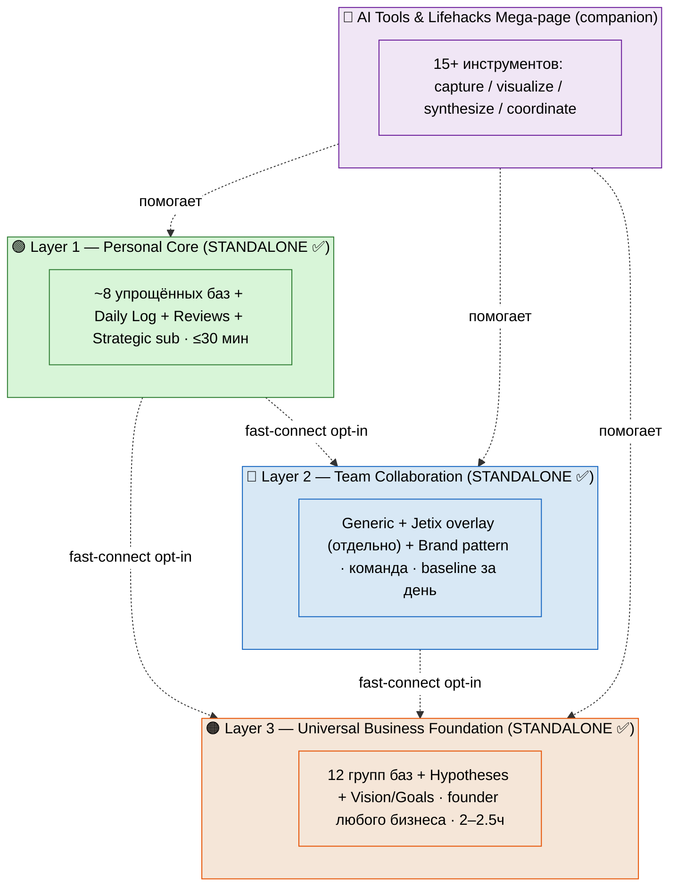
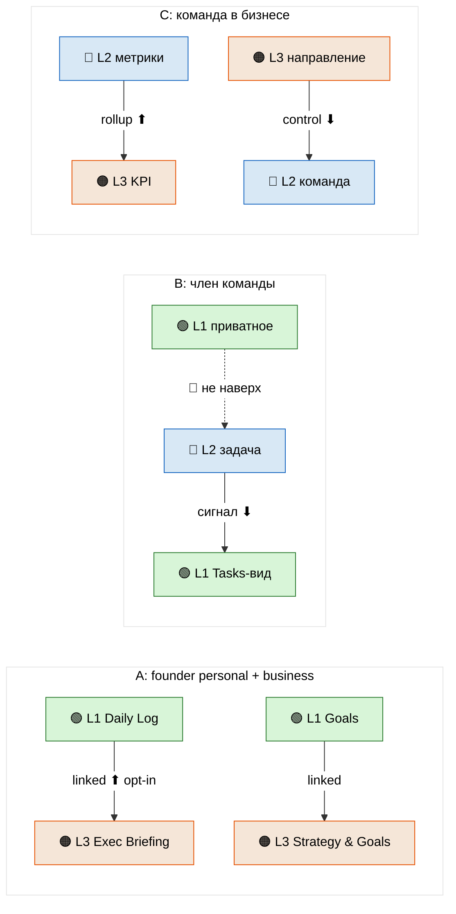
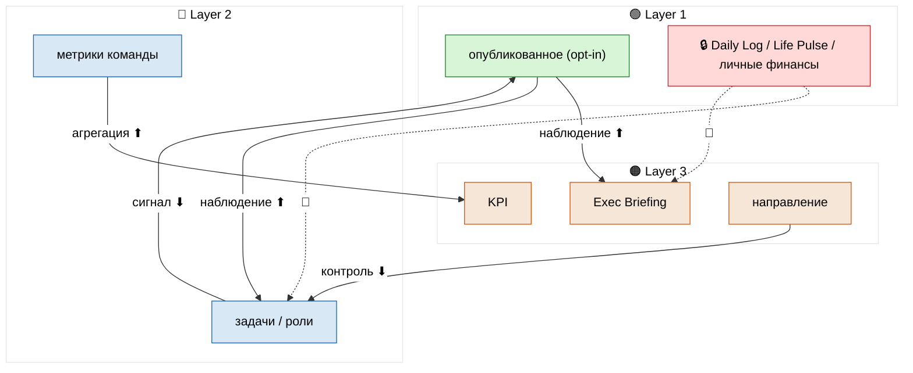
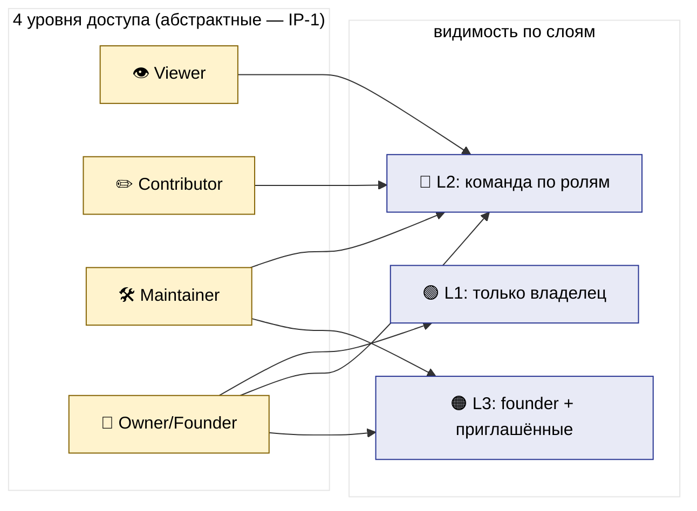
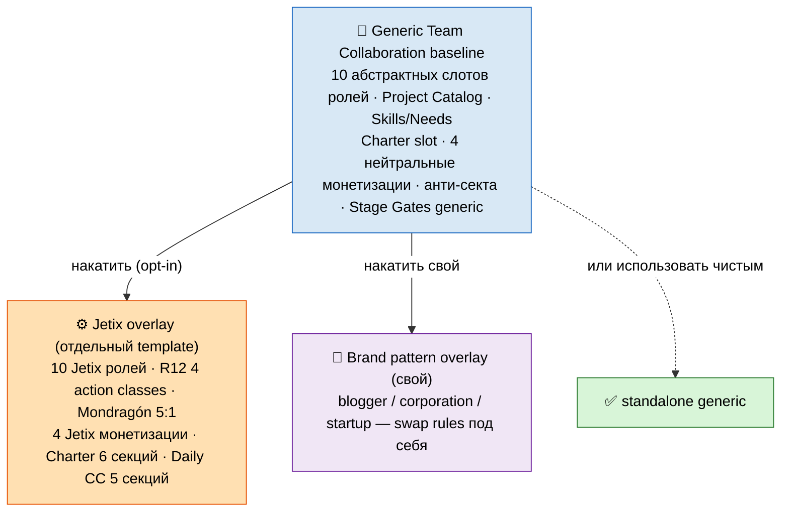
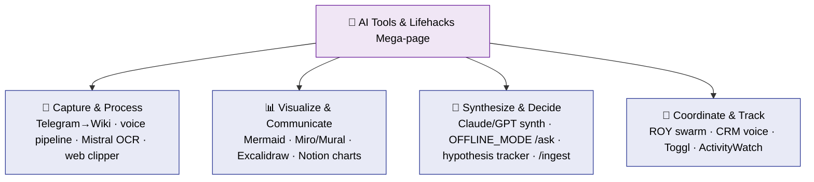
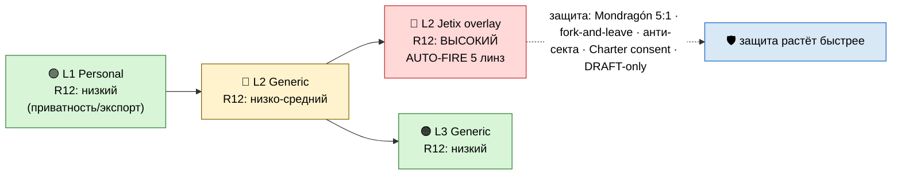
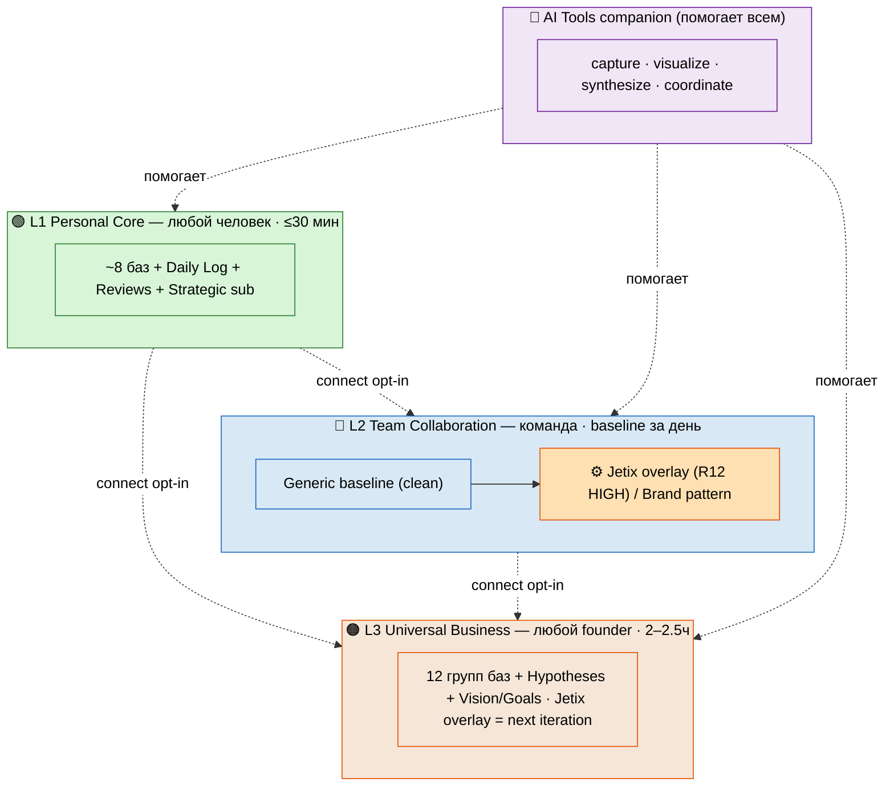

# Notion Templates — 3-Layers Architecture v2

> Это главный консолидированный документ. Он собирает 12 фазовых отчётов в одну
> картину: три слоя Notion-шаблонов, каждый из которых работает **сам по себе**,
> упрощённый до минимума, плюс отдельная companion-страница с AI-инструментами.
> Тон — на пальцах, без жаргона. В конце (§11) — список решений, которые принимаешь ты.
>
> **Кто это писал.** Бригадир-скрайб через ROY-рой. Стратегию (что выбрать) AI не
> решает — он раскладывает варианты, ты выбираешь. Это правило конституции №1.

---

## §0 TL;DR + что изменилось vs v1

**Если в двух абзацах.** Раньше (v1) была архитектура из 4 слоёв, выстроенных лестницей:
сначала разверни личное ядро, потом расширенное личное, потом командное, и наконец —
бизнес. Каждый слой требовал предыдущего. И внутри каждого шаблона было «задрочено» — по
50 полей в базе, формулы, аналитика, всё сразу. Человек открывал такой шаблон и закрывал
от страха.

v2 — это **упрощение и переструктура**. Слоёв стало **три**, и каждый из них **standalone**:
работает один, без остальных. Поля внутри баз срезаны до минимума, который заполняется за
минуту; всё продвинутое вынесено в боковую инструкцию «🔧 что можно добавить, когда дорастёшь».
Плюс добавлена отдельная companion-страница с 20 AI-инструментами. Это прямой ответ на твой
голосовой фидбэк 25 мая: *«слои интересно, а внутри шаблоны так вообще пиздец настолько
задрочено… Максимально просто для первых этапов, потом можно усложнять»*.

### Таблица DELTA (что именно поменялось)

| Что | v1 (4 слоя) | v2 (3 слоя) |
|---|---|---|
| Число слоёв | 4 | **3** — Layer «Personal Expanded» удалён (станет отдельным «инструменты + skills» слоем в другой итерации) |
| Layer 1 | Personal Core | Personal Core **REVISED** — усиленный Daily Log + 2 шаблона ревью + Strategic под-раздел |
| Layer 2 | Personal Expanded | стал **Team Collaboration**: Generic baseline + **Jetix overlay отдельным template** + Brand pattern |
| Layer 3 | Team Collaboration | стал **Universal Business Foundation**: упрощённый + Hypotheses + Vision/Goals страницы; Jetix overlay **deferred** |
| Layer 4 | Universal Business + Jetix overlay внутри | удалён как отдельный слой; Jetix overlay **вынесен** из base |
| Шаблоны внутри | «задрочено», 50+ полей на базу | **SIMPLIFICATION**: минимум baseline + sidebar «🔧 что можно добавить» |
| Связь слоёв | строгая лестница L1→L2→L3 + L4 standalone | **каждый STANDALONE** + fast-connect opt-in |
| AI Tools | — | **NEW отдельный companion mega-page** (20 инструментов в 4 кластерах) |

### Шесть вещей, которые надо запомнить

1. **Три слоя, не четыре.** Personal Core / Team Collaboration / Universal Business.
2. **Каждый работает один (STANDALONE).** Не нужно разворачивать всё, чтобы начать.
3. **Соединение — опция (fast-connect opt-in), не дефолт.** По умолчанию слои не связаны.
4. **Минимум полей + sidebar.** Baseline заполняется за минуту; сложное ждёт в инструкции.
5. **AI Tools — companion, не слой.** Помогает любому слою, собирается параллельно.
6. **R12-дисциплина живёт только в Jetix overlay** (Layer 2 Part B). Generic-части нейтральны.

---

## §1 Три слоя + STANDALONE (обзор)

### Три слоя в двух словах

| Слой | Что это | Для кого | Старт | Standalone? |
|---|---|---|---|---|
| 🟢 **Layer 1 Personal Core** | личная система: дневник, проекты, идеи, люди, гипотезы, цели, финансы | любой человек | ≤30 мин | ✅ да |
| 🔵 **Layer 2 Team Collaboration** | команда в общем workspace: роли, биржа навыков, Charter, честное деление, брифинг | команда из N человек | baseline за день / онбординг 1 неделя | ✅ да |
| 🟠 **Layer 3 Universal Business Foundation** | исполнительный взгляд: 12 групп баз (стратегия / финансы / люди / проекты / ...) + Vision/Goals | **любой founder любого бизнеса** | 2–2.5 часа | ✅ да |

Плюс **companion-документ:** 🤖 **AI Tools & Lifehacks Mega-page** — 20 инструментов для
быстрой работы с информацией. Не слой, а спутник: полезен с любым слоем (см. §5).

### Что значит STANDALONE — по слоям

Это центральный мандат v2. По умолчанию **три слоя не связаны**, и каждый — законченный
продукт.

- **Layer 1 один.** Человек форкает Personal Core, заполняет Daily Log, ведёт проекты и
  идеи. Ему не нужны ни команда, ни бизнес. Аудитория: фрилансер, студент, любой, кто хочет
  порядок. (Пример: Дмитрий-trial стартует именно с Layer 1.)
- **Layer 2 один.** Команда (3–10 человек) форкает Team Collaboration, заводит роли и общий
  workspace, координируется через брифинг и биржу навыков. Им **не нужен** Personal OS под
  капотом — у каждого может быть свой Notion, свой Obsidian, вообще ничего. Layer 2 = «как нам
  работать вместе честно».
- **Layer 3 один.** Founder форкает Universal Business Foundation, разворачивает minimum
  (стратегия + финансы + проекты + брифинг) за пару часов, видит весь бизнес с одной страницы.
  Ему **не нужны** ни Layer 1, ни Layer 2 — это executive-взгляд сам по себе.

**Следствие для дизайна:** ни один слой в baseline-схеме не *ссылается* на существование
другого. Связи (relations к чужим базам) появляются **только** если человек включил
fast-connect. По умолчанию каждый слой — замкнутый граф внутри себя.

**Почему так правильно (philosophy + systems линза):** требовать «сначала разверни всё» =
высокий порог входа + хрупкость (одна точка отказа). Standalone = низкий порог +
композируемость. Это Unix-философия: маленькие самодостаточные части, соединяемые трубой
только когда нужно.

### Fast-connect: опциональное соединение (3 сценария)

Standalone не значит «изолированы навсегда». Если человеку нужно — слои соединяются. Но это
**opt-in feature**, не дефолт. Три осмысленных сценария:

- **Сценарий A — founder personal + business (L1 + L3).** Самый частый. Founder ведёт и личную
  жизнь (Layer 1), и бизнес (Layer 3). Хочет, чтобы личный Daily Log подтягивал executive-брифинг
  бизнеса (одна утренняя рутина), личные и бизнес-Goals были рядом, личные и бизнес-Projects были
  видны вместе. Механика — linked database views (окно, не копия). Сотрудники видят только Layer 3.
- **Сценарий B — член команды (L1 + L2).** Назначенные командные задачи появляются в личном
  Tasks-виде (signal вниз). Личное наверх **не** течёт (изоляция).
- **Сценарий C — команда внутри бизнеса (L2 + L3).** Метрики команд сворачиваются (rollup) в KPI
  бизнеса. Поднимается *производное* (суммы, статусы), не сырые данные.

**Правило для всех трёх:** вверх поднимается только **opt-in / производное**, вниз — **сигнал /
контроль**. Приватное (личный дневник, здоровье, личные финансы) не течёт никуда.

### SIMPLIFICATION (второй мандат v2)

Каждая база = **минимум полей baseline** + отдельный sidebar «🔧 Что можно ещё добавить» (как
инструкция, не как живые поля). НЕ 50+ полей. Baseline = столько, сколько нужно, чтобы база
заработала сегодня. Density мы вкладываем в **объяснения / примеры / схемы / cross-layer
механику / AI tools**, а не в количество полей. Логика проста: over-engineered шаблон с 50
полями → никто не заполняет → база мёртвая. Минимальный baseline → привычка закрепляется →
потом наращиваешь. Прогрессивное раскрытие сложности бьёт «всё сразу» на порядок по adoption.

### FPF-линза (для строгости — что есть что)

На языке конституции (FPF) каждый слой = **система** (замкнутый контур, держит состояние); база
Notion = **контейнер артефактов** (строка = артефакт, поле = атрибут); роль = **контейнер роли**
(абстрактный тип, не конкретный человек). Это снимает путаницу «слой = таблица»: слой — это
система целиком. Главный вывод (IP-1): описываем **роли-типы**, не людей. «PM» = контейнер роли;
«Ruslan, действующий как PM» = binding исполнителя к роли в RUSLAN-LAYER, не в generic-схеме.

---

## §2 Layer 1 — Personal Core (REVISED)

> 🟢 Полностью самостоятельная личная система. Форкнул один, заполнил за полчаса, пользуешься
> каждый день. Не нужны ни команда, ни бизнес.

### Минимальный состав (9 баз + Strategic + Reviews)

| # | База | Статус | Назначение в одну строку |
|---|---|---|---|
| 1 | 📅 **Daily Log** | core | день = одна запись: цель, что сделал, энергия, связи |
| 2 | 🚀 **Projects** | core | личные проекты с детектом застрявших |
| 3 | ✅ **Tasks** | core | действия (в простом варианте — чек-лист внутри Projects) |
| 4 | 💡 **Ideas** | core | банк идей / inbox для сырых мыслей |
| 5 | 🤝 **Contacts** | core | личные люди — облегчённый CRM |
| 6 | 📚 **Knowledge** | core | источники + факты + «посмотреть позже» |
| 7 | ❓ **Hypotheses** | core-lite | «что хочу проверить» (нужен не всем) |
| 8 | ❤️ **Life Pulse** | core-lite | энергия / сон / настроение (мини-замер) |
| 9 | 💰 **Финансы** | opt-in | личный учёт денег (по желанию, приватно) |

Плюс **Strategic под-раздел** (пара страниц-документов — §2.4) и **2 шаблона ревью** (неделя +
месяц — §2.5).

### §2.1 Daily Log (главная база, усилена)

День = одна запись. Утром поставил цель, в течение дня дописываешь (в том числе голосом),
вечером — что реально сделал. Это главная точка входа во всю систему. В v1 тут было 16 полей с
формулами дней недели — **срезали**. День недели Notion посчитает сам. Зато добавили то, чего
не хватало: цель дня, что вышло на самом деле, сколько было глубокой работы, тип дня.

**Baseline-поля:** Date (Title) · Цель дня (Text) · Реально сделано за день (Text) · Energy
(1–5) · Deep work minutes (Number) · Day type (Select: production / development / recovery /
orientation) · Linked Project / People / Hypothesis / Ideas (Relations).

**Про Day type.** Не каждый день должен быть «продакшн». Бывают дни разработки, восстановления
(и это нормально), ориентации. В конце месяца видно сразу: одни production без recovery = путь
к выгоранию. Связка с Life Pulse и кирпичом «здоровье человека».

**Шаблон страницы дня.** Каждый день — полноценная страница с готовой структурой: Цель дня →
**Точка А → Точка Б по шагам** (микро-стратегия: куда иду к вечеру и какими шагами) → Записи дня
→ Черновики и заметки (нативные Notion-подстраницы: набросок письма, схема на салфетке — живут
внутри дня, не засоряют другие базы) → Реально сделано за день (вечером сравниваешь с целью).

**Wrap-of-day через Claude Code (новое в v2).** В конце дня Claude Code читает запись дня и
помогает осмыслить — но **ничего не решает сам**. Шаги: (1) говоришь «заверши день»; (2) CC
читает цель утра, записи, что сделано, упомянутые проекты/людей; (3) CC **предлагает черновики**
(«ты ставил цель X, сделал Y — разрыв тут…», «проект W не трогал 12 дней — скоро всплывёт
застрявшим», «из записей вытащил идею — занести в Ideas?»); (4) **СТОП** — ждёт твоего ack; (5)
только после ack изменения попадают в боевые записи. Это та же DRAFT-only дисциплина, что в
голосовом пайплайне: CC **никогда не перезаписывает прод автоматически**. Прямое следствие правил
конституции: AI не пишет стратегию, по умолчанию не действует сам, анализ → только черновик.

### §2.2 Projects / Tasks / Ideas / Contacts (упрощённые)

- **Projects** — Name · Type (consulting / research / product / bets / personal) · Status · Checkpoint
  (start / in-progress / done — 3 чекпоинта вместо 4 строгих гейтов) · Priority · Last touched ·
  Linked goals · Notes. **Детект застрявших** оставлен: active + Last touched >14 дней → подсветка.
- **Tasks** — в простейшем варианте отдельной базы **нет вообще**, задачи живут чек-листом внутри
  страницы проекта. Заводишь Tasks, только когда реально упрёшься. Поля: Name · Project · Status
  (todo / doing / done) · Priority (now / next / later) · Due.
- **Ideas** — банк идей и inbox. Name · Maturity (C-raw / B-shaping / A-ready) · Domain · Promote to
  (— / project / hypothesis) · Note. Сюда же падают «непонятные» голосовые заметки.
- **Contacts** — облегчённый CRM. Name · Type (family / friend / colleague / mentor / client) ·
  Status · Last touch · What I offer · What I ask. **Детект «пора связаться»** при Last touch >30 дней.

### §2.3 Knowledge (добавлен «посмотреть позже»)

Личная вики в одной базе: Name · Kind (source / claim / concept) · Status (queued / reading /
read) · **Saved-for-later** (Checkbox) · Key takeaway · Domain. **Новое — поле «Saved-for-later».**
Когда листаешь ленту/ютуб, постоянно натыкаешься на «о, посмотрю потом». Раньше терялось. Теперь
галочка + вид-фильтр «Посмотреть позже». Раз в неделю заходишь и разбираешь: что-то читаешь,
что-то честно выкидываешь. Анти-свалка: отложенное не пропадает, но и не висит вечным грузом.

### §2.3b Hypotheses / Life Pulse / Финансы

- **Hypotheses** (core-lite, для методологов) — Statement · Confirm criterion · Refute criterion ·
  Status · Confidence (low / mid / high) · Linked projects. **Bayesian-lite:** не нужно процентов,
  хватает поля Confidence — появилось доказательство, подвинул уверенность. Если не методолог —
  можешь не заводить на старте.
- **Life Pulse** — мини-замер: Date · Energy (1–5) · Sleep hours · Mood · Movement. Красная зона при
  энергии ≤2 или сне <5ч несколько дней. **Приватность:** Life Pulse **никогда не уходит наверх**.
- **Финансы** (opt-in) — личный кошелёк, строго приватно. Name · Type (income / expense) · Amount ·
  Date · Category. Не путать с бизнес-финансами (Layer 3). Многим на старте не нужно.

### §2.4 Strategic под-раздел (новое в v2 — страницы, не база)

В v1 цели были «просто базой Goals». В v2 стратегия поднята на уровень выше — это **набор
страниц-документов**:

1. **📜 Vision (страница).** Один текст «куда я иду»: каким человеком хочу стать, что важно, куда
   движусь в горизонте лет. Якорь, к которому возвращаешься.
2. **🎯 Goals strategic document (страница + linked view базы Goals).** Самое интересное изменение.
   Цель — это **не только метрика, это смысл**. Почему я этого хочу? Что изменится? От чего откажусь
   ради этого? На это таблица не отвечает — нужна проза. Поэтому: проза (документ, пишет человек) +
   данные (база с метриками и сроками, её CC может предзаполнять) вместе.
3. **🧭 Точка А → Точка Б (отдельная страница на текущее направление).** Та же «точка А → точка Б»,
   что в шаблоне дня, но на большом горизонте — к концу квартала/года. Сменилось направление —
   новая страница (старая остаётся историей, append-only).

**Важно:** всю стратегическую прозу (Vision, смысл целей, точку Б) **пишет человек**. CC только
предзаполняет данные в базе Goals. «Куда я иду» решает только человек — правило конституции №1.

### §2.5 Weekly + Monthly шаблоны ревью (новое в v2)

Два готовых шаблона. Не надо придумывать вопросы — бери и заполняй.

- **🗓️ Weekly review (воскресенье, ~20 мин):** Что сделал за неделю (топ-5, CC предзаполняет из
  Daily Log) → Что зависло → Проекты: движение → Гипотезы: обновления → Топ-3 на следующую неделю.
- **📆 Monthly review (конец месяца, ~45 мин):** Проекты обзор → Цели: прогресс → Финансовый пульс →
  Контакты: аудит касаний → Паттерны и уроки.

**Авто-подтягивание — механика linked views.** Шаблон ревью — не пустая страница: внутри встроены
linked views существующих баз (Daily Log за неделю, застрявшие Projects, Contacts с давними
касаниями). Открыл ревью — данные уже там. CC может накидать черновик саммари, но (как в
wrap-of-day) это **черновик**, ты подтверждаешь. Ты не собираешь цифры руками — отвечаешь на
смысловые вопросы поверх готовых данных. **Каскад:** день сворачивается в неделю, неделя — в
месяц. Это «система учится на себе» в личной версии.

### §2.6 Sidebar «🔧 Что можно ещё добавить»

Всё, что вырезано из baseline ради простоты — ждёт здесь как инструкция «добавь, когда дорастёшь».
Sidebar — это не живые поля, а текст-инструкция сбоку. Сюда же переехала вся substance бывшего Layer
2 «Personal Expanded» из v1. Разложу по группам, чтобы было понятно, что именно можно нарастить:

- **📊 Дополнительные analytics views.** Дашборд «из чего состоял месяц» — группировка Daily Log по
  Day type (сколько было production / recovery / development дней; одни production без recovery — путь
  к выгоранию, и это видно на одной картинке). Тренд deep work — график минут глубокой работы по
  неделям. Streak-counter — сколько дней подряд заполняешь рефлексию. *Добавь, когда захочешь видеть
  себя в цифрах, а не только в тексте.*
- **❓ Продвинутый трекинг гипотез (бывший Layer 2 Personal Expanded).** Confidence в числах +
  обновление по Байесу (P(до) → P(после доказательства)). Поле «бюджет времени на проверку» + «метод
  проверки». Связь гипотез с источниками-доказательствами (Evidence) и rollup средней уверенности.
  Falsifiability-lint: проверка, что у гипотезы реально есть refute-критерий. *Добавь, когда гипотезы
  станут рабочим инструментом, а не редким экспериментом.*
- **🤖 AI integration helpers.** Авто-классификация голосовых заметок по базам (полная матрица «что
  куда»). Авто-детект кандидатов на промоушен (идея → проект). Авто-связи между записями (CC предлагает
  relations). Двусторонний синк файлы ↔ Notion через скрипты. *Добавь, когда ручной режим начнёт тормозить.*
- **📚 Расширение личной вики.** Разделить Knowledge на три базы (Sources / Claims / Concepts). Поле
  «уверенность» у фактов + stale-claim детект (факт не проверялся >180 дней). Glossary понятий A-Z.
  *Добавь, если ты методолог и точные определения — ядро твоей работы.*
- **🧮 Формульные дашборды.** Формула застрявших проектов (вместо ручной пометки). Формула «пора
  связаться» у контактов. Формула красной зоны в Life Pulse. Progress % проекта (rollup задач).
  *Добавь, когда захочешь, чтобы система подсвечивала сама, а не ты глазами.*
- **🗓️ Дополнительные ревью.** Квартальное (~1.5 ч) + годовое (~полдня, новый Vision/Точка Б). Шаблон
  ревью проекта + шаблон подготовки к звонку (с этическим чеком). *Добавь, когда недели и месяца станет
  мало для горизонта.*

**Принцип sidebar:** baseline должен быть таким, чтобы новичок собрал и начал за полчаса. Всё остальное —
добровольный апгрейд по мере роста. Никто не заставляет; система растёт вместе с тобой.

### §2.7 Как это выглядит на практике (обычный день — иллюстративно)

Без реальных данных — просто как это работает в жизни. Утром человек открывает **Today** в Daily Log —
создаётся сегодняшняя страница с шаблоном. В «Цель дня» пишет: *«закончить черновик коммерческого
предложения»*. В блоке «Точка А → Точка Б» отмечает: точка А — «есть структура, нет текста», точка Б —
«готов первый драфт», шаги — «1. вступление, 2. оффер, 3. цена». Ставит `Day type = production`.

В течение дня он что-то надиктовывает голосом — заметки падают в «Записи дня» как черновики. Набросок
самого предложения создаёт как **подстраницу** прямо внутри дня (в разделе «Черновики»). Заодно
упоминает в записях контакт — CC предлагает черновик в Contacts, но человек решит позже.

Вечером он открывает день и в «Реально сделано» пишет: *«вступление и оффер готовы, цену не доделал»*.
Ставит `Deep work minutes = 90`, `Energy = 3`. Видит разрыв между целью (весь драфт) и фактом (две
трети) — это нормальный материал для размышления, а не повод себя ругать.

Затем — **wrap-of-day**: просит CC завершить день. CC читает запись и предлагает черновики: *«ты
упоминал контакт — занести в Contacts? из записей вытащил идею про шаблон предложения — в Ideas? проект
двигался — отметить Last touched сегодня?»*. Человек принимает первые два, третье отклоняет. **Ничего не
записалось без ack.** День закрыт за пять минут осмысления, а не получаса ручной возни. В воскресенье он
откроет Weekly review — «реально сделано» за все дни уже собрано в топ-5, проекты с движением подтянуты,
останется ответить на «что главное на следующую неделю».

**Сквозное правило для всех баз.** Каждая строка = один `.md` файл на диске (это правда), свойства Notion
= поля шапки. При конфликте — прав файл. Голос → только черновик. CC предлагает, ты решаешь. Это пять
правил конституции, которые выживают в личной версии.

---

## §3 Layer 2 — Team Collaboration (REVISED)

> 🔵 Слой совместной работы. Главное изменение v2: **generic baseline отдельно от Jetix overlay**.
> Раньше шаблон шёл сразу с Jetix-терминами (Mondragón 5:1, €1500-когорта, Steward) — человек,
> форкающий под свой блог или фирму, получал кучу чужих правил. Теперь это разнесено на 3 части.
> **STANDALONE:** Layer 2 работает сам — Personal OS под ним необязателен.

| Часть | Что внутри | Кому |
|---|---|---|
| **A. Generic baseline** | абстрактные слоты ролей, минимум полей, 4 универсальных монетизации, анти-секта-принципы | любой — форкает за день |
| **B. Jetix overlay** | 10 конкретных ролей, R12 4 action classes, Mondragón 5:1, 4 шаблона монетизации, Charter 6 секций, Steward | пример применения; берёшь целиком ИЛИ как образец |
| **C. Brand pattern** | «как заменить Jetix-правила своими» (блогер / корпорация / стартап) | другие способы обтянуть скелет |

Generic — это **скелет**. Overlay — это **один конкретный способ его обтянуть**. Часть C показывает
другие способы.

**Зачем разнесли generic и Jetix (логика v2).** Когда мы смешиваем «как устроена любая команда» и «как
устроена команда Jetix» в одном шаблоне — человек, который форкает под свой блог или фирму, получает
кучу чужих правил: непонятный «Mondragón 5:1», «когорта €1500», роль «Steward». Он либо тащит это всё,
не понимая, либо тратит час на чистку. Поэтому делим на два слоя. Что общего у всех (наследуется в любом
форке): личное приватно, общее видно по правам — наверх только opt-in publish; каждый DB = минимум полей
+ заметка «🔧 что можно добавить»; Notion-native механики (минимум кода); анти-секта-принципы как
универсальная гигиена честности.

### §3.A Часть A — Generic Team Collaboration baseline

**Топология: личное приватно, общее по правам.** У каждого участника — своё приватное пространство.
Есть одно общее (Teamspace). Правило: **наверх (личное → общее) только по решению человека (opt-in
publish)**; вниз (общее → личное) — уведомления и ссылки, не копирование чужих данных. Notion-native
механики (минимум кода): **Teamspace** (общее пространство, Team/Business plan), **Linked databases**
(общая запись видна, но живёт у владельца), **Synced blocks** (общий договор синхронизирован во все
воркспейсы), **права по роли** (из матрицы ниже), **Guest access** (внешние люди), **Comments +
@mentions** (координация без правки чужого). **Красная линия:** личные данные участника (его дневник,
личные заметки, личные финансы) **никогда** не уходят в команду без явного действия. Это инвариант
любого форка.

**Роль отвечает на 4 вопроса:** что человек **делает**, что **видит и меняет**, как считается его
**вклад**, какую **долю** получает. В generic-версии мы даём слоты-категории, а не готовые названия —
ты переименовываешь под свою команду.

**10 generic слотов ролей (категории, не названия — ты переименовываешь):** Leader / координатор ·
Contributor / исполнитель · Financial / вкладывает капитал · Time-skill / вкладывает труд · Network /
вкладывает связи · Advisor / советник · Facilitator / ведущий · Customer-facing / лицо вовне ·
Observer / наблюдатель · Integrity / следит за честностью. IP-1: один человек может занимать разные
слоты в разных проектах; власть привязана к функции, не к личности.

**Базы (минимум полей):**
- **Roles** — Role name · What it does · Contribution metric · Default share · Permission profile.
- **Project Catalog** — Title · Status (open / active / paused / closed) · Lead · Team · Open roles ·
  Description. Язык не «доска вакансий», а «открытые роли / вписаться» — рамка «дать/нужно» держит
  равенство сторон.
- **Skills/Needs marketplace** — User · Can offer · Needs · Project interest. Подбор пар — как
  **подсказка, не приказ**.
- **Charter slot** (synced block + запись) — 6 пустых секций: Ценности · Управление · Деньги · Вход
  и выход (право выхода называем вслух) · Разрешение споров · (опц.) что угодно ещё.
- **Stage Gates** SG-1..SG-4 (Propose / Active / Deliver / Promote-Close) — пустые ворота, критерии
  задаёшь сам.
- **External people slot** — Guest (read-only, отзывается в 1 клик) + Observer (член, ещё не в
  деньгах/решениях). Любая внешняя запись требует зафиксированного согласия.
- **Permissions matrix** (упрощённая) — значения EDIT / COMMENT / VIEW / NONE / «(own)». Три правила:
  Leader силён только в **своём** проекте; деньги видны только свои (полная картина у Integrity);
  Integrity-роль не берёт проектную долю и не голосует (анти конфликт интересов).

**4 универсальных монетизации (NO Mondragón hardcoded).** Когда команда зарабатывает вместе, заранее
договариваются: как делим. Generic даёт 4 универсальных способа без захардкоженного Mondragón и без
конкретных процентов:
- **M1 Revenue share** — делим доход проекта по вкладу (большинство команд; ставишь свои %).
- **M2 Capital partnership** — кто-то даёт деньги → получает долю (старт с инвестицией; условия капитала
  + exit).
- **M3 Membership / subscription** — участники платят за доступ/программу (сообщества, когорты, клубы;
  цена + что входит).
- **M4 IP / licensing** — кто-то даёт метод/контент/бренд → ретейнер или лицензия (франшиза, методология).

База Revenue Accounting: Project / Total revenue / Splits (кому сколько) / Distribution status. База
Contribution Ledger: Member / Project / Contribution units / Share % — прозрачно для участников проекта.
**В generic нет навязанного потолка 5:1** — это Jetix-выбор. Любая команда вправе задать свой потолок,
exit terms, формулу проверки сплита — или не задавать вовсе.

**⛔ Анти-секта-принципы (универсальная гигиена честности — KEEP в generic).** Это лучшая практика
для **любой** команды, не Jetix-специфика. Каждый пункт — известный паттерн формирования секты;
защита = его явное отсутствие: ❌ клятвы верности на входе · ❌ эскалация преданности («докажи, что
свой») · ❌ спаситель-фигура / поклонение основателю · ❌ «мы против них» / элитарный клуб · ❌ не
упомянут выход (опция уйти звучит **первой**, до подписи) · ❌ удержание данных при выходе · ❌
штраф/стыд за выход. Применимо везде, где есть деньги и эмоциональная вовлечённость: блогер с
фан-клубом, корпоративный отдел, стартап.

**Онбординг 1 неделя (generic):** День 1 знакомство → 2 тур по проектам и бирже → 3 тень проекта
без обязательств → 4 «что могу дать / что надо» → 5 чтение Charter включая «как уйти» → 6 первый
маленький вклад → 7 разбор + согласие на роль.

### §3.B Часть B — Jetix-specific overlay (R12 PAIRED-FRAME AUTO-FIRE)

> Отдельный fork-able overlay поверх generic. Это **пример RUSLAN-LAYER применения** (IP-1: роли
> абстрактны на уровне Foundation; имена/тиры здесь = примеры). Берёшь целиком ИЛИ как образец.
> **R12 paired-frame STRICT auto-fires:** монетизация + роли + когорта = высокая
> influence/extraction-поверхность.

**10 Jetix ролей (RUSLAN-LAYER пример):** PM (Управляющий, Leader, ротация) · Inv-Cap (Инвестор
капитала, Financial, **ВЫСОКИЙ риск** → Mondragón 5:1 + fork-leave + 30-day) · Inv-Time (Инвестор
времени, потолок ≤50 ч/нед анти-выгорание) · Inv-Net (Инвестор сети, анти-audience-extraction) ·
Contributor · Advisor · Facilitator (анти-культ + Schelling-чек) · Mentor (**ВЫСОКИЙ риск** → нет
эксклюзивности + потолок 12 мес) · Observer · Steward (Integrity, плоский ретейнер НЕ проектная доля,
ротация + peer-проверка). Три инварианта здоровья: роль ≠ человек (IP-1); высокий риск → больше
защиты; власть ротируется.

**R12 — 4 RUSLAN-LAYER action classes (детекторы жадности и принуждения).** Сердце Jetix-overlay.
Каждый при срабатывании → **HALT** + лог + Steward. Источник: `.claude/config/default-deny-table.yaml`
(R2 STRICT — только ссылаемся):
- `extraction_beyond_share` — забрать сверх договорённого → HALT.
- `wage_ratio_violation` — сделать одного в >5× богаче минимального → HALT (проверка **перед**
  распределением).
- `non_consensual_distribution` — опубликовать/распределить чужое без согласия → HALT.
- `fork_prevention_attempt` — язык/механика «теперь не уйдёшь» → HALT.

**Mondragón 5:1.** Самая большая выплата не может быть >5× самой маленькой. Formula pattern:
`if( max(payouts) / min(payouts) > 5, "🛑 HALT", "✅ pass" )`. Нарушение → Steward HALT F4 ≤5с per
Part 6b §I.2. (Каноническая модель V10: каждый отдаёт 25% → институциональный пул, оставляет 75%;
в замкнутом цикле = 75% workers / 16.67% управленцы / 8.33% Ruslan cumulative. «75-90%» — обёртка.
Источник — Economic Model V10, R2 STRICT.)

**4 Jetix шаблона монетизации:** T1 Стандартный проект (M1, 75-90% контрибьюторам / 10-25%
Foundation) · T2 С капитальным инвестором (M2, + капчасть 20-40% + exit terms) · T3 Когортная
программа (M3, мастерская ≈€1500/мес, ценность > €1500, 5:1 между тирами + анти-культ) · T4 Вклад
знанием/IP (M4, ретейнер за фреймворк + анти-fork-prevention). Каждый шаблон проходит **8-пунктовый
R12-чек** перед применением: (1) стоимость ≤ выгода; (2) предложение конкретно; (3) пропорционально
отношениям; (4) уместно по стадии (только SG-2+); (5) уместно по каналу; (6) R12 paired-frame PASS;
(7) анти-CTA (нет MLM/культа); (8) Halt-Log-Alert готов ≤5с.

**Charter 6 секций:** Ценности · Управление (+ Stage Gates) · Монетизация (revenue split + **Mondragón
5:1 явно** + exit terms) · **R12-комплаенс (центральная секция)** · Разрешение споров (Steward →
peer-Steward → внешний медиатор) · Ethereum overlay (опц. Phase 2+). R12 чек-лист fields (checkbox):
`no_extraction` / `fork_and_leave_enabled` / `30day_window` / `mondragon_5to1_strict` /
`halt_on_wage_ratio` / `no_nonconsensual_dist` / `no_fork_prevention` — все ✅ перед SG-2.

**Daily CC pass — 5 секций брифинга (~300-500 слов, всегда черновик):** (1) 3-5 знакомств; (2) 2-3
пробела в навыках; (3) 3-5 находок на бирже; (4) 1-3 новых проекта; (5) 1-3 из интернета (opt-in) +
чек-лист действий. **DRAFT-only железно:** CC не пишет сообщения, не записывает в проекты, не
отправляет наружу. Лимит 3-5 на секцию = анти пере-матчинг и анти-FOMO.

**🛡️ R12 paired-frame annotation (5 пунктов × 5 линз — обязательный enforcement cell).** Каждая
persuasion/recruitment-механика оформлена **вместе с её этическим контр-механизмом**:
1. **Anti-extraction** — концентрация 25% в Foundation pool + Inv-Cap 20-40% → контр: `extraction_beyond_share` HALT, Charter печатает split публично, изменение → re-ack + 30-day opt-out.
2. **Fork-and-leave** — накопленная доля + эмоциональная вовлечённость создают инерцию → контр: право выхода названо первым (День 5 до подписи), выход = забираешь proportional treasury share + history без штрафа, `fork_prevention_attempt` → HALT.
3. **Mondragón 5:1** — PM/Inv-Cap/Mentor концентрируют доход → контр: `wage_ratio_violation` HALT перед распределением, формула блокирует, власть ротируется.
4. **Анти-секта** — когорта €1500 + Facilitator + «founding status» = belonging-механики → контр: каждый cult-паттерн запрещён явно, T3 проходит чек «нет культа», тиры = прозрачные условия, не лестница лояльности.
5. **Consent в онбординге** — 7-дневная воронка → контр: явное информированное согласие на каждом шаге, День 3 тень без обязательств, Mentor → Personal OS менти только с согласия. **NLP-линза на язык:** «открытая роль / вписаться» не «вакансия / наняться»; «что можешь дать» не «продай навыки».

**Gamification-линза (сквозная):** Schelling-подсветка точек схождения без FOMO, без «успей
вписаться». **Steward = enforcement cell:** ловит все 4 action classes, останавливает ≤5с (F4)/≤1с
(F8), пишет в R12 Audit Log, эскалирует; сам ротируется + не берёт проектную долю.

### §3.C Часть C — Brand / Blogger / Corporation adaptation

Паттерн замены (3 шага): берёшь generic baseline → переименовываешь слоты под свою команду →
выбираешь монетизацию и ставишь свои числа. **Оставляешь всегда** (универсальная гигиена):
приватность, анти-секта, право выхода вслух, прозрачный ledger. Три worked examples:
- **Blogger team** — Leader → Креатор, Contributor → монтажёр/сценарист, Network → коллаборатор.
  Монетизация: M1 Revenue share + M3 Membership. **Mondragón не нужен** — креатор держит больший %,
  это норма; вместо потолка — прозрачный ledger + право коллаборатора уйти со своей долей.
- **Corporate department** — Leader → руководитель, Integrity → HR/комплаенс. Revenue share обычно
  не применяется (зарплаты) → бонусная система или вообще убираешь монетизацию. Анти-секта =
  защита от токсичной культуры («докажи преданность овертаймом» = эскалация преданности).
- **Startup co-founders** — Financial → ангел, Time/skill → технический co-founder (vesting). M2
  Capital → equity/cap table. Обычно **не ставят Mondragón** (early-stage equity неравна по
  дизайну) → vesting + exit terms + право выхода с vested-долей.

**Где Jetix overlay полезен как есть vs где fork полностью:** кооператив / справедливое деление /
когортная программа / сеть партнёров с общим treasury → **overlay полезен**. Авторский проект /
корпорация с зарплатами / стартап с equity → **fork полностью** (generic + своя монетизация).
Правило большого пальца: общий котёл + ценность равенства + желание защитить людей → Jetix overlay
даёт готовый набор. **Анти-секта оставляй всегда.**

---

## §4 Layer 3 — Universal Business Foundation (REVISED)

> 🟠 Готовый **нейтральный** шаблон для управления любым бизнесом: консалтинг, агентство, продукт,
> студия. Берёшь, копируешь, переименовываешь — и у тебя «пульт управления»: цели, деньги, проекты,
> люди, решения, брифинг. Всё на одной странице. Тон — **не «вот корпорация Jetix»**, а «вот чистый
> каркас, разворачивай свой бизнес». **STANDALONE.** Jetix overlay **deferred** (следующая итерация).

### Обзор: 12 баз + 3 новых элемента

| # | База | Зачем (одной строкой) | Ядро / опц |
|---|---|---|---|
| §3.1 | 🎯 Strategy & Goals | куда идём + по какой метрике мерим | ядро |
| §3.2 | 💰 Financial Overview | сколько денег / сколько горим / runway | ядро |
| §3.3 | 👥 Team / People | кто в команде + кто за что отвечает | ядро |
| §3.4 | 🚀 Projects Portfolio | что делается + на какой стадии | ядро |
| §3.5 | 🤝 Stakeholders / CRM lite | клиенты / партнёры / инвесторы | ядро |
| §3.6 | ⚖️ Decisions Log | что решили + почему + чем кончилось | опц |
| §3.7 | 🛡️ Risks Register | что может пойти не так + что делаем | опц |
| §3.8 | 📜 Compliance & Legal | юр / договоры / комплаенс | опц |
| §3.9 | 🧰 Tools Inventory | чем работаем + сколько стоит | опц |
| §3.10 | 📚 Documents / Knowledge Hub | где что лежит | опц |
| §3.11 | 📊 Executive Briefing | ежедневный/недельный обзор для founder | ядро |
| §3.12 | 🚨 Crisis Mode Playbook | что делать, когда всё горит | опц |

Плюс три новых элемента: 🧪 **Hypotheses DB** (§4.2) · 📖 **Vision/Mission/Goals страницы** (§4.3) ·
🔗 **L1↔L3 fast-connect** (§4.4).

**Минимум для старта** (founder за 2-2.5 часа): Strategy + Financial + Projects + Briefing.
Остальное наслаивается по мере роста. **Принцип «🔧 что можно добавить»:** каждая база — простой
скелет + заметка сбоку. Построй минимум, поживи неделю, добавь то, чего реально не хватает.

### §4.1 12 баз — суть и упрощённый baseline

Layer 3 — это **операционка для founder'а**: ты видишь весь бизнес с одной страницы. Раньше всё
держалось в голове, в заметках, в десяти разных табличках — теперь в одном месте, где всё связано.
Каждая база описана как простой скелет + заметка «🔧 что можно добавить».

- **🎯 Strategy & Goals.** Куда идёт бизнес и по какой метрике мерим. База **не навязывает фреймворк** —
  ты выбираешь сам: OKR, V2MOM, EOS Rocks или просто «3 цели на квартал». Universal slot: цель →
  метрика → ответственный → срок → статус. Это специально: разные founder'ы любят разные системы, и
  шаблон не должен заставлять жить по чужой методологии. Поля: Title · Type (annual/quarterly/monthly)
  · Target · Current · Progress % (formula `prop("Current")/prop("Target")*100`) · Owner · Horizon ·
  Status. 🔧 добавить: KR1-KR3 для OKR; Values/Methods/Obstacles/Measures для V2MOM; Rocks для EOS;
  светофор-формула Health.
- **💰 Financial Overview.** Денежная картина, и главное — **на сколько месяцев хватит денег** (runway).
  Это самая важная цифра для молодого бизнеса: не знаешь runway — управляешь с закрытыми глазами.
  `Runway months = Current cash / Monthly burn` → 🔴 если меньше 3. Базы Revenue (Stream / Amount /
  Period / Status / Customer) + Expenses (Name / Category / Amount / Recurring?) минимальные. Всё
  остальное в финансах вторично, пока runway под контролем. 🔧 добавить: Invoices с «просрочен»-формулой,
  pricing tiers, cap table при инвестициях, multi-currency.
- **👥 Team / People.** Кто в команде и кто за что отвечает. **Роль ≠ человек:** Roles (контейнеры:
  Role title / Responsibilities / Decision rights) и Members (люди: Name / Role / Status /
  Responsibilities / Reports to) разнесены. Это снимает проблему «незаменимости человека X»: передать
  обязанности другому = сменить relation, а не переписывать всё с нуля. Полезно даже в команде из двух.
- **🚀 Projects Portfolio.** Что делается и на какой стадии — **высокоуровневый портфельный взгляд**, не
  детальный трекинг задач (это уровень команды, Layer 2). Name · Status (proposed/active/paused/done/
  killed) · Stage (early/mid/late/wrap) · Owner · Target end · Linked goals. 🔧 добавить: health-формула,
  project value + margin (сумма течёт в §3.2), sprint/velocity, Stage Gates.
- **🤝 Stakeholders / CRM lite.** Лёгкий CRM: клиенты, партнёры, инвесторы, советники, вендоры. Не
  полноценная sales-CRM, а «список важных людей + когда я последний раз с ними говорил». Главная польза —
  поле **«Days since touch»** (`dateBetween(now(), prop("Last touch"), "days")`): отношения «протухают»
  молча, поле делает молчание видимым. View «Нужен follow-up» (`Days since touch > N`) = еженедельный
  напоминальник. 🔧 добавить: deal stage + amount + probability (forecast), engagement health.
- **⚖️ Decisions Log.** Что решили, почему, и чем кончилось — **институциональная память бизнеса**.
  Через полгода не вспомнишь, почему выбрал поставщика A, а не B — а здесь записано. Поля Rationale
  (почему) + **Outcome + Review date** = встроенная петля обучения: View «На ревью» (Review date ≤
  сегодня, Outcome пустой) напоминает вернуться и честно записать, сработало или нет. Большинство людей
  решают и никогда не оглядываются — база делает оглядку механической. 🔧 добавить: impact assessment,
  RACI, linked projects/stakeholders (трассируемость), board vote tracking.
- **🛡️ Risks Register.** Что может пойти не так и что мы делаем. Severity (1-5) × Likelihood (1-5) =
  Score (formula). Риск, записанный и с назначенным владельцем, — управляемый; риск в голове — нет. 🔧
  добавить: priority-формула с цветом, review date, sub-категории под индустрию.
- **📜 Compliance & Legal.** Юр-статус, договоры, комплаенс, налоговые дедлайны. Скучно, но именно здесь
  бизнесы получают неожиданные штрафы. Базы Contracts (Title / Party / Type / Renewal date / Status) +
  Compliance checklist. View «Скоро истекают» (Renewal ≤ сегодня + 30д). 🔧 добавить: legal entity,
  contract value, локальная специфика (для DE — Steuerberater + форма юрлица).
- **🧰 Tools Inventory.** Чем работаем и сколько стоит. Подписки накапливаются незаметно и тихо съедают
  бюджет. Name · Category · Status · Cost/period · Usage. View «Недоиспользуемые» (`Usage = rare & Cost
  > 0`) = кандидаты на отмену. Сумма cost → кормит §3.2 Expenses.
- **📚 Documents / Knowledge Hub.** Где что лежит — **карта** документов (не сами документы). **4
  категории:** 🟢 Пояснительные (то, что можно показать наружу: офферы, презентации) · 🛠️ Шаблоны
  (договоры-шаблоны, чек-листы) · 📚 Substrate (внутренний research, методология) · ⚙️ System (конфиги,
  доступы, регламенты — никогда наружу). Эти 4 категории решают «что показать человеку наружу?» за 2
  секунды: берёшь только 🟢 (и при нужде релевантный 🛠️), никогда не отдаёшь 📚 или ⚙️. Спасает от
  типичной ошибки — вывалить на клиента внутренние документы, после чего он тонет и закрывается.
- **📊 Executive Briefing.** «Весь бизнес на одной странице» — **главный артефакт Layer 3**: превращает
  12 баз в один управляемый поток внимания. Ты не открываешь 12 таблиц каждое утро — смотришь один
  брифинг. **DRAFT-only:** ассистент (человек или AI) готовит черновик (собирает цифры из баз), решения
  принимаешь ты. 5 секций: 🚨 Critical attention (≤5 пунктов — лимит намеренный: если каждое утро 20
  «срочных», ты не управляешь, а тушишь пожары; пять — столько, сколько человек реально удержит) · 📊
  Health snapshot (runway / выручка / здоровье проектов) · 🎯 Progress (закрыто / стартует / заблокировано)
  · 🤝 People/Stakeholders movement · 💡 Strategic threads (новые идеи, решения awaiting).
- **🚨 Crisis Mode Playbook.** Что делать, когда всё горит. Кризис — худшее время думать «а что теперь?».
  Заранее прописанные процедуры экономят критические часы и нервы. 5 категорий: финансовый шок / уход
  ключевого человека / публичный инцидент (репутация) / юр-триггер / операционный сбой. Crisis type ·
  Category · Trigger · Immediate actions (чек-лист) · Escalation.

### §4.2 Hypotheses DB (новое — baseline)

Бизнес = набор предположений («клиенты заплатят за X», «канал Y приведёт лидов»). Большинство держат
их в голове как факты. База заставляет **записать предположение явно** и проверить. Превращает «мне
кажется» в «мы проверили». Поля: Hypothesis · Type (market / product / pricing / channel /
operational) · Status (proposed / testing / confirmed / refuted) · Metric · Horizon · Outcome. View
«На проверке» напоминает закрыть гипотезу честно. Опровергнутые особенно ценны — это то, во что ты
больше не веришь зря. 🔧 для продвинутых (Method V2 §J): prior/posterior confidence (Bayesian-lite).

### §4.3 Vision / Mission / Goals страницы (новое — текстовые, не базы)

**Не всё должно быть таблицей.** Базы хороши для того, что считается и фильтруется. Но «зачем
существует бизнес» нельзя засунуть в ячейку. Ответ на «зачем» удерживает тебя (и команду) в трудные
месяцы, помогает говорить «нет» хорошим, но не-твоим возможностям:
- **📄 Vision** — 1-2 абзаца: каким ты видишь мир, если бизнес преуспеет. Обновлять редко (раз в год).
- **📄 Mission** — чем именно занимаешься сейчас, чтобы двигаться к Vision. Конкретнее Vision.
- **📄 Goals strategic narrative** — словами про цели: почему именно эти, что важнее. Прозаическое
  дополнение к таблице §3.1. На странице вставляешь linked view базы Goals — сверху проза «почему
  эти цели», ниже живая таблица с прогрессом. Слова и числа в одном месте.

### §4.4 L1↔L3 fast-connect (новое — opt-in)

Некоторые founder'ы хотят держать личную систему (L1) и бизнес (L3) в одном воркспейсе. **Это опция,
не требование.** По умолчанию слои не сливаются. Если хочешь — четыре linked view: Daily Log (L1) →
Briefing (L3); Goals (L1 личные) → Strategy & Goals (L3); Projects (L1) → Projects Portfolio (L3).
**Permissions:** Founder видит оба слоя; остальные — только Layer 3 (личный L1 закрыт). Если не
хочешь — просто не делаешь linked views; Layer 3 полноценен сам.

### §4.5 Jetix overlay — ОТЛОЖЕНО (только упоминание)

Существует Jetix-специфичный overlay для Layer 3 (R12, Mondragón 5:1, 10 ролей, Ethereum-слой,
Charter). **Это следующая итерация, отдельным документом.** Здесь намеренно **не строится**. Base
остаётся нейтральным: любой бизнес форкает чистый foundation и при желании пишет свой overlay —
VC-overlay, agency-overlay, cooperative-overlay (Jetix-style) или никакой. Jetix-overlay — **один
пример из многих возможных**, не часть базового шаблона.

**Worked example — solo founder за 2-2.5 часа** (описание пути, не данные): дублирует template (20
мин) → пишет Vision + Mission + 3 цели (30 мин) → вносит кэш + расходы, runway считается сам (40 мин)
→ заносит активные проекты (30 мин) → настраивает weekly briefing (15 мин) → собирает dashboard (15
мин). Итого ~2.5 часа → рабочий пульт управления бизнесом.

---

## §5 AI Tools mega-page (companion reference)

Это **не слой, а спутник** — живой каталог инструментов и лайфхаков, которые превращают сырьё (голос,
PDF, ссылку, мысль на бегу) в structured-запись за минуты. Ты не «садишься писать» — ты говоришь,
кидаешь ссылку, фоткаешь страницу книги, и система раскладывает по полочкам. Почти всё **уже работает
внутри Jetix OS** (54 skill-команды, реальные Python-пайплайны в `tools/`, рой из 17 ROY-экспертов).
Страница — **reference, не кнопка**: ничего не запускается автоматически, никаких API-ключей, никаких
автозаписей в прод без ревью.

**20 инструментов в 4 кластерах** (по жизненному циклу информации: захватил → визуализировал →
синтезировал → скоординировал):
- 🟦 **Capture & Process:** Telegram processor · Voice pipeline (сердце захвата) · Mistral OCR (PDF/скан
  → Markdown) · Web clipper.
- 🟩 **Visualize & Communicate:** Mermaid quick setup · Miro/Mural · Excalidraw · Notion native charts.
- 🟨 **Synthesize & Decide:** Claude/GPT synthesis (готовые промпты review/decision/brainstorm) ·
  OFFLINE_MODE /ask (structured-excerpt без галлюцинаций) · Hypothesis tracker (Bayesian-lite) · Wiki
  ingest.
- 🟥 **Coordinate & Track:** ROY swarm (multi-perspective, мини-совет директоров) · CRM voice
  integration (DRAFT-only) · Toggl pipeline · ActivityWatch.
- ➕ **Bonus:** Mistral OCR для книг · Schema validation/lint · Mermaid validation · AI-augmented
  review (plan-day/close-day/wrap-of-day).

Плюс **§3 Discovery** (как находить новое: Twitter / HN / Reddit / community + правило фильтра через
hypothesis tracker — не внедряй сразу, сначала гипотеза «X сократит время на Y», тест 1-2 недели) и
**§4 стыковка с 3 слоями** (таблица «★★★ ядро / ★★ полезно / ★ опционально» по каждому слою).
**Принцип companion'а:** инструменты переносимы; слой определяет только приоритет.

> **Полный документ (≥3000 слов, 20 инструментов с разбивкой «Что делает / Как использовать / Когда /
> Где живёт в Jetix») — отдельный companion:**
> `decisions/strategic/AI-TOOLS-LIFEHACKS-MEGA-PAGE-2026-05-25.md`. Здесь — только саммари; полный
> контент не дублируется намеренно.

---

## §6 Cross-layer mechanics + STANDALONE emphasis

### STANDALONE — дефолт (read first)

**По умолчанию три слоя НЕ связаны.** Каждый слой = отдельный Notion workspace (или корневая
страница). Внутри слоя relations замкнуты на свои базы. Ни одна baseline-схема не имеет relation к
базе другого слоя «из коробки». Соединение (fast-connect) — **отдельное действие пользователя**: он
сам создаёт linked view или synced block. Это нельзя «случайно включить». Связанность по умолчанию =
скрытая зависимость + хрупкость (изменил базу в одном слое → сломал другой). Несвязанность по
умолчанию = композируемость по требованию.

### Потоки данных (все opt-in)

| Поток | Откуда → Куда | Что течёт | Foundation ref |
|---|---|---|---|
| **Наблюдение ⬆** | L1 → L2 / L1 → L3 / L2 → L3 | выбранное человеком (опубликованное) | Part 2 |
| **Агрегация ⬆** | L2 → L3 | производное (суммы, статусы) | Part 2 |
| **Сигнал ⬇** | L2 → L1 / L3 → L2 | уведомления, назначения, @упоминания | Part 2 |
| **Контроль ⬇** | L3 → L2 | стратегич. направление, аудит | Part 11 |
| **Изоляция 🚫** | приватное никуда | личный дневник, здоровье, личные финансы | Pillar C |

**Красная линия:** вверх — **только** opt-in / производное; вниз — сигнал / контроль как приглашение,
не приказ; приватное (Daily Log, Life Pulse, личные финансы) **физически** не подключено к верхним
слоям. Утечка архитектурно невозможна (раздельные workspace), а не «по правилу».

**Конкретные fast-connect маршруты (если включить):** L1 Daily Log → L3 Executive Briefing (founder
ведёт одну утреннюю рутину) · L1 Goals → L3 Strategy & Goals (личные + бизнес-цели рядом) · L1 Projects
(личный scope) → L3 Projects Portfolio (бизнес scope) · L2 назначенная задача → L1 личный Tasks-вид
(член команды видит своё) · L2 метрики команды → L3 KPI бизнеса (rollup). На языке FPF + кибернетики это
типы связи, которые нельзя путать, иначе ломается приватность: наблюдение (сенсор без управления) ·
сигнал (вход в Part 2) · агрегация (сумматор наблюдений) · контроль (управляющий сигнал Part 11) ·
изоляция (разрыв контура).

### Права — 4 абстрактных уровня (IP-1, не 10 ролей)

В base — 4 уровня доступа: 👁 Viewer / ✏️ Contributor / 🛠 Maintainer / 👑 Owner-Founder. User мапит
свои роли на категории. Конкретная матрица 10×10 ролей = Jetix overlay, не base (SIMPLIFICATION — не
заставляем разворачивать 100 ячеек на старте). L1 личное видит только владелец; Owner/Founder —
единственный, кто включает cross-layer connect.

### Синхронизация (Notion-native, без кода)

Linked database view («окно» в базу, не копия) · Synced block (один блок, синхронный везде) · Rollup
/ relation (сворачивает значения) · Shared view с фильтром. **Важно:** linked view ≠ копирование.
Данные живут в одном месте; окна показывают их. Убрал доступ к источнику → окно гаснет, копии не
остаётся. R11 Default-Deny: только Notion-native механизмы, никакого API, никаких автоматизаций сверх
Notion.

---

## §7 Onboarding + fork-friendly + implementation roadmap

### Три самостоятельных онбординга

Три слоя — три разные ситуации, а не ступени одной лестницы. Тон: приглашение, не вербовка; базовое
сначала, сложное потом.

- **Layer 1 (≤30 мин):** Дублировать (1 клик) → переименовать → адаптировать (типы проектов, роли
  контактов, темы Knowledge) → Точка А (один абзац «где я сейчас») → первые записи (1 день в Daily
  Log + 2-3 проекта + 2-3 контакта). Техника (Claude Code, скрипты) — **опционально и потом**.
  Анти-паттерны: заставлять заполнить все базы сразу; требовать технику на входе; туториал >7-10 мин.
- **Layer 2 (1 неделя):** День 1 своя система → 2 тур по пространству → 3 тень проекта (Observer, без
  обязательств — самый важный день) → 4 обмен offer/need → 5 первый Daily Brief review → 6 документы +
  Charter (раздел «как выйти» **до** подписи) → 7 первый маленький вклад (Observer → Contributor).
  Generic vs Jetix-overlay: для generic фокус на процессе; для Jetix-overlay + контекст методологии и
  ролей на День 6. Анти-паттерны: подписание Charter в День 1; «докажи, что свой»; не упомянуть выход.
- **Layer 3 (2-2.5 часа):** 4 ядерных раздела (Strategy / Financial / Projects / Briefing). Дублировать
  → Strategy (vision + 3-5 целей + точка А) → Financial (revenue + расходы + runway) → Projects (3-7
  активных) → подключить существующие базы (опц.) → первый executive briefing. Анти-паттерны:
  разворачивать все 12 разделов сразу; переносить все задачи; пропустить Financial.

**Helpers per layer (сводно).** Layer 1: видео 3-5 мин (welcome + базовый walkthrough) + 1-страничный
гайд «с чего начать» + buddy опционально (отвечает на вопросы, не куратор). Layer 2: тур делает buddy
лично (обязательно — проводник, не надзиратель) + гайды по ролям (abstract) + Charter + R12-doc
(~1000-1500 слов тоном «как мы тебя защищаем») + опц. групповая сессия раз в 2 недели. Layer 3: видео
10-15 мин (executive dashboard setup, только 4 ядерных раздела) + чеклист 6 шагов + extension points по
типу бизнеса + buddy опционально (консультация по setup).

**Сквозной принцип всех трёх (одна логика, три двери):**
- **Выход называется до входа.** На каждом слое звучит: уйти можно в любой момент. L1: удалишь шаблон —
  данные твои. L2: покинешь команду — история вклада остаётся с тобой. L3: откажешься от шаблона — ничего
  не потеряешь. Это инверсия cult-pattern, где выход намеренно замалчивается.
- **Базовое первым, сложное потом.** Анти-burnout вход — это не снисхождение, это уважение к реальному
  темпу освоения.
- **Buddy — проводник, не надзиратель.** Отвечает на вопросы и делится опытом; не контролирует, не
  проверяет, не оценивает.
- **Документы тоном «как мы тебя защищаем»** — не «обязательства, которые ты берёшь», а «вот что мы
  гарантируем тебе». Разница в одном слове, но меняет всё восприятие.
- **Каждый онбординг самостоятелен** — не нужно проходить L1, чтобы попасть в L3; не нужно иметь L3,
  чтобы работать в L2.

### Fork-friendly: грамматика vs словарь

Любой шаблон = **грамматика** (часть A — структура, типы связей, базовые поля; не трогается при форке)
+ **словарь** (часть B — названия ролей, ниши, overlay). Форкать = взять грамматику как есть +
адаптировать словарь. Анти-паттерн: вписать личные имена в Layer A («Дневник Васи» в заголовке ломает
форк для всех, кто не Вася; «Daily Log» — fork-friendly).

Форк по слоям: **L1** — полная свобода, скопировал → адаптировал → используешь без связи с апстримом.
**L2** — три пути: (1) swap overlay (свой вместо Jetix), (2) generic baseline clean (без overlay), (3)
Brand pattern (готовый под blogger/corporate/startup). **L3** — ANY founder форкает generic, опционально
overlay (Jetix / VC / agency / SaaS / solo / никакой). Jetix = **ОДИН пример**, не лучший, не
единственный.

### Implementation roadmap (Build / Run / Scale)

Сейчас (25.05.2026) — **Build, средняя часть.** Каждый слой можно начать независимо; порядок ниже —
рекомендация под конкретный контекст (Дмитрий-trial + Ruslan как founder + первый партнёр), не закон.

| Очередь | Слой | Когда | Notion-план |
|---|---|---|---|
| 1 | **Layer 1 Personal Core** | Build w1-2 (Дмитрий-trial + Ruslan self) | Free |
| 2 | **Layer 3 minimum** | Build w3 (executive-вид для Ruslan; standalone) | Free / Plus |
| 3 | **Layer 2 demo** (Generic + Jetix overlay) | Build w2-3 (co-design с партнёром) | Free/Plus → Business |
| — | **AI Tools mega-page** | параллельно в любой момент | — |

**Run (w4-8):** L1 тестеры → когорта; L3 full (детальная P&L, партнёрский трекер); L2 настоящий
multi-tenant, Charter подписан, первые деньги → Mondragón 5:1 на каждом сплите. Notion Business
необходим. **Scale (~2027):** L3 Jetix overlay; L2 multi-cohort; Enterprise (SSO/аудит); Ethereum
overlay — текстовый принцип в Build/Run, смарт-контракт только на Scale.

**Нет циклических зависимостей:** L1 → L2 → L3 (опционально). L3 standalone. L1 standalone. Можно
начать с любого слоя и не сломать остальные. **Анти-паттерны roadmap:** собирать все три слоя
одновременно (паралич); перфекционировать шаблон до первого trial; апгрейдить Business до реального
multi-user; путать Generic и Jetix overlay в первом показе партнёру.

---

## §8 R12 sweep summary

8 paired-frame вопросов применены к каждому слою отдельно. Вопросы (canonical из R12-фреймворка): (1)
Цена ≤ польза? (2) Конкретно? (3) Соразмерно отношениям? (4) По стадии (не раньше SG-2+)? (5) Канал
уместен (биржа, не найм)? (6) Не доим / не запираем (fork-and-leave)? (7) Нет манипуляции (FOMO,
культ)? (8) Стоп-сигнал готов (Steward HALT)?

### R12-риск по слоям

| Слой | Риск | Главная зона | Защита | Enforcement |
|---|---|---|---|---|
| **L1 Personal Core** | НИЗКИЙ | privacy / data lock-in | файлы = правда + export + нет имён в грамматике | сам человек |
| **L2 Generic baseline** | НИЗ-СРЕДНИЙ | иерархия ролей / язык / документация ухода | Charter + ротация Steward + append-only Log | Steward |
| **L2 Jetix overlay** | **ВЫСОКИЙ (AUTO-FIRE)** | монетизация + cohort + рекрутинг + gamification | 8-Q + 4 classes + Mondragón 5:1 + анти-секта + fork-leave | Steward HALT ≤5с + R12 Audit Log |
| **L3 Generic Business** | НИЗКИЙ | концентрация контроля у топа | VOTE guard + Steward-auditor + Scale-тезис | overlay-conditional |

**Сквозной закон: защита растёт быстрее системы.** Layer 1 — почти нечего защищать. Layer 2 Jetix
overlay — максимум живых механик. Layer 3 generic — нейтральный исполнительный инструмент; если поверх
него ложится монетизационный overlay, он наследует R12-защиту снизу. Разберём живые риски по слоям:

- **Layer 1 (НИЗКИЙ).** Два живых риска. Первый — **data lock-in**: если шаблон хранит данные только
  внутри Notion без выгрузки, человек в ловушке (хочешь уйти — теряешь историю). Mitigation встроен в
  архитектурный принцип: файловая система = источник правды, Notion = вид; любой шаблон L1 поддерживает
  экспорт в markdown/CSV без потерь. Второй — **тон аналитики как самобичевание**: еженедельные Reviews
  с красными зонами могут превратиться в самосуд. Mitigation: тон Reviews как «уроки, не суд» — описание
  паттернов без морального вердикта.
- **Layer 2 Generic (НИЗ-СРЕДНИЙ).** Без монетизации R12 живёт в зоне структурных паттернов. Три риска:
  (1) **роль Steward как постоянная власть** → mitigation: ротация Steward раз в квартал рекомендована в
  шаблоне Charter; (2) **язык «вакансия vs вписаться»** (язык найма создаёт асимметрию ожиданий) →
  mitigation: grammar bias в сторону «дать проекту», не «занять место»; (3) **документация вклада при
  выходе** → mitigation: Team Log append-only, записи не редактируются после ухода. Митигации несложны и
  встраиваются в сам шаблон.
- **Layer 3 Generic (НИЗКИЙ при нейтральном использовании).** Риски conditional — активируются только
  если кто-то намеренно убирает guardrails. (1) **Authoritarian drift у founder**: убирает VOTE /
  OVERSIGHT, концентрирует все Edit-права, делает бизнес непрозрачным для Steward → generic рекомендует
  VOTE у Executive, убирание VOTE = red flag для Steward-auditor. (2) **founder = вечная власть** против
  Scale-тезиса (маховик бизнеса крутится без основателя) → mitigation: разделение ролей (founder vs
  executive vs Steward-auditor — три функции, не одна должность). Generic base их не убирает.

### AUTO-FIRE на L2 Jetix overlay (единственная точка)

Это единственный слой, где одновременно встречаются монетизация (75/25 split) + роли с денежными
последствиями + когортная динамика (тиры) + рекрутинговый механизм (promoter bonus) + геймификация
(stake, NFT, treasury). Именно здесь включаются **5 экспертных линз**, каждая с defensive-counter и
abuse-flag:
- **influence-ethics** — Mondragón 5:1 обрезает power concentration; 12-мес потолок promoter bonus
  снимает «вечный доход»; abuse-flag: убрали ratio cap / продлили bonus → дрейф к MLM.
- **recruitment-dynamics** — выход озвучен до входа; ротация ролей; нет founder-поклонения в
  грамматике; abuse-flag: «крещение»/клятва на входе, выход как предательство.
- **nlp** — grammar bias «дать команде» не «наняться»; Welcome-frame «все подтягиваются» не «избранные»;
  abuse-flag: дефицитный фрейм («осталось 3 места»), язык избранности.
- **propaganda** — Hypothesis Architecture (фальсифицируемые критерии) + F-G-R schema + Dissent
  Protocol; abuse-flag: unfalsifiable claims, критика как атака.
- **gamification** — лимит matching 3-5; stake = финансовый инструмент, не prestige metric; Schelling
  на равных, не давление; abuse-flag: scarcity pressure на дорогой тир, stake-size как ранкинг.

### Мета-R12 insight

**Навязывать R12 всем = само по себе анти-R12.** R12 rule запрещает идеологический lock-in. Если
generic «по умолчанию» встраивает Mondragón и кооперативные роли — основатель капиталистического
стартапа не может «уйти» от кооперативной грамматики без переработки. Это именно то, с чем борется
R12. Поэтому: **generic = нейтральный, R12 = opt-in через overlay.** Свобода форкнуть generic без R12
= высшая форма anti-extraction. AUTO-FIRE включается только на L2 Jetix overlay — там ценности уже
выбраны и задокументированы в Charter, enforcement уместен; на generic baselines enforcement =
избыточная интервенция. **Fork-and-leave preserved архитектурно через все слои:** раздельные
воркспейсы делают `fork_prevention_attempt` технически невозможным — R12 на уровне физической
архитектуры, а не правил.

---

## §9 Mermaid suite (9 схем)

> Все 9 схем используют единый theme-init (чёрный текст — читается в Notion light и в GitHub).
> Палитра: 🟢 зелёный L1 / 🔵 синий L2 / 🟠 оранжевый L3 / 🟣 фиолетовый companion / 🔴 красный =
> приватность/R12-high.

### ARCH-V2-1 — стек 3 слоёв (standalone-capable)

> 3 независимых блока (НЕ вложены — не требуют друг друга); пунктир = fast-connect opt-in; companion сверху.

**Чтение:** три слоя нарисованы как независимые блоки (не вложены — они НЕ требуют друг друга);
пунктирные стрелки = fast-connect opt-in; companion сверху помогает любому слою, но не является слоем.

### ARCH-V2-2 — fast-connect механика (3 сценария)

> Вверх ⬆ = opt-in/производное; вниз ⬇ = сигнал/контроль; приватное 🚫 не подключено.

**Чтение:** вверх (⬆) поднимается только opt-in/производное; вниз (⬇) — сигнал/контроль как
приглашение; приватное (🚫) физически не подключено.

### ARCH-V2-3 — потоки данных (3 слоя, opt-in)

> Сплошные = opt-in потоки; красный 🔒 + 🚫 = приватное, физически не подключено.

**Чтение:** сплошные стрелки = opt-in потоки (включаются по желанию); красный блок 🔒 + пунктир 🚫 =
приватное, физически не подключено; вверх — производное/opt-in, вниз — сигнал/контроль.

### ARCH-V2-4 — матрица прав (упрощённая, 4 уровня, IP-1)

> 4 абстрактных уровня доступа → видимость по слоям; Owner/Founder — единственный включает connect.

**Чтение:** 4 абстрактных уровня доступа (слева) проецируются на видимость по слоям (справа);
Owner/Founder — единственный, кто может включить cross-layer соединение; L1 личное видит только сам владелец.

### ARCH-V2-5 — Layer 2: Generic baseline vs Jetix overlay (split)

> Generic = чистый (абстрактные роли, нейтральная монетизация); Jetix overlay = отдельный fork-able template поверх; Brand pattern = свой overlay.

**Чтение:** generic baseline — нейтральный скелет, который можно использовать чистым (standalone); поверх
него опционально накатывается Jetix overlay (R12) или свой Brand pattern overlay (блогер/корпорация/стартап).

### ARCH-V2-6 — implementation timeline (Build/Run/Scale)

> L1 first → L3 minimum → L2 demo; AI Tools companion параллельно; standalone = можно начать с любого.

```mermaid
%%{init: {'theme':'base', 'themeVariables': {'primaryTextColor':'#000000','textColor':'#000000','lineColor':'#333333','primaryBorderColor':'#333333','primaryColor':'#fafafa','noteTextColor':'#000000','noteBkgColor':'#fff8d5','edgeLabelBackground':'#ffffff'}}}%%
flowchart LR
    subgraph BUILD["🏗️ Build (w1-3)"]
        B1["🟢 L1 core (Дмитрий-trial)"]
        B3["🟠 L3 minimum (founder self)"]
        BAI["🤖 AI Tools companion"]
    end
    subgraph RUN["▶️ Run (w4-8)"]
        R2["🔵 L2 demo overlay (1 партнёр co-design)"]
        RC["первая когорта"]
    end
    subgraph SCALE["📡 Scale (~2027)"]
        SC["L3 Jetix overlay · multi-cohort · Ethereum overlay"]
    end
    B1 --> B3 --> R2 --> RC --> SC
    BAI -. параллельно .-> B1
    classDef build fill:#d8f5d8,stroke:#2e7d32,color:#000;
    classDef run fill:#fff3cd,stroke:#856404,color:#000;
    classDef scale fill:#f5e6d8,stroke:#e65100,color:#000;
    class B1,B3,BAI build;
    class R2,RC run;
    class SC scale;
```

**Чтение:** рекомендованный порядок Build → Run → Scale (L1 first → L3 minimum → L2 demo → когорта →
Scale); AI Tools companion собирается параллельно; благодаря standalone можно начать с любого слоя.

### ARCH-V2-7 — AI Tools mega-page hub (4 кластера)

> Companion-документ: 4 кластера инструментов, помогает любому слою.

**Чтение:** companion-страница разбита на 4 кластера по жизненному циклу информации (захватил →
визуализировал → синтезировал → скоординировал); подключается рядом с любым слоем.

### ARCH-V2-8 — R12 risk overlay (растёт со слоем; AUTO-FIRE на Jetix overlay)

> Риск: L1 низкий → L2 generic низко-средний → L2 Jetix overlay ВЫСОКИЙ (AUTO-FIRE 5 линз) → L3 generic низкий.

**Чтение:** R12-риск растёт со слоем, пик — на L2 Jetix overlay (единственная точка AUTO-FIRE 5 линз);
защита (Mondragón / fork-and-leave / анти-секта / Charter consent / DRAFT-only) растёт быстрее системы.

### ARCH-V2-9 — master synthesis (3 слоя + AI Tools companion)

> Всё в одном кадре: 3 standalone-слоя, companion, fast-connect opt-in, R12 scope, audience.

**Чтение:** мастер-синтез — 3 standalone-слоя (со своей аудиторией и временем старта), companion сверху
помогает всем, fast-connect opt-in между слоями, R12 HIGH только на Jetix overlay внутри L2, L3 Jetix
overlay = next iteration.

---

## §10 Per-layer matrix (quick-reference)

| Аспект ↓ \ Слой → | 🟢 Layer 1 Personal Core | 🔵 Layer 2 Team Collaboration | 🟠 Layer 3 Universal Business |
|---|---|---|---|
| **Аудитория** | любой человек (фрилансер / студент / founder для личного) | команда из N человек (стартап / кооператив / creator+ассистенты) | любой founder / executive любого бизнеса |
| **Время на старт** | ≤30 мин | baseline за день / онбординг 1 неделя | 2–2.5 часа |
| **# баз (baseline)** | 9 (+ Strategic под-раздел + 2 ревью) | Generic: ~7 баз/слотов; Jetix overlay поверх | 12 групп баз (4 ядро) + Hypotheses + Vision/Goals |
| **Standalone?** | ✅ да | ✅ да (Personal OS под ним необязателен) | ✅ да (не нужны L1/L2) |
| **R12-риск** | НИЗКИЙ (privacy / data lock-in) | Generic: НИЗ-СРЕДНИЙ; **Jetix overlay: ВЫСОКИЙ (AUTO-FIRE)** | НИЗКИЙ (concentration; overlay-conditional) |
| **Fork-пути** | полная свобода (скопировал → адаптировал) | 3 пути: swap overlay / generic clean / Brand pattern | ANY founder forks generic + опц. overlay (Jetix/VC/agency/none) |
| **Jetix-специфика** | нет (нейтральный) | **отдельным overlay** (Part B), не в base | **deferred** (next iteration), не в base |
| **Notion-план** | Free | Free/Plus → Business (multi-tenant) | Free/Plus (solo) → Business (команда) |
| **Главный артефакт** | Daily Log + wrap-of-day | Charter + Daily CC брифинг + биржа | Executive Briefing (12 баз → один поток) |
| **Новое в v2** | усиленный Daily Log + Strategic + 2 ревью + «посмотреть позже» | Generic/Jetix split + Brand pattern | Hypotheses + Vision/Goals страницы + L1↔L3 connect |

---

## §11 R1 decisions queue (что выбирает Ruslan)

> **R1 surface only.** Ниже — варианты, НЕ рекомендации. AI раскладывает выбор, решаешь ты. Каждое
> решение = вопрос + 2-3 варианта.

1. **Состав baseline Layer 1.** Какой минимальный набор баз для первого форка?
   - (a) LITE — только Daily Log + Projects + Contacts (3 базы, форк за 15 мин).
   - (b) STANDARD — + Ideas + Knowledge + Goals (6 баз, форк за 30 мин).
   - (c) FULL baseline — все 9 + Strategic + 2 ревью (как описано в §2).

2. **Wrap-of-day CC-команда — когда строить.**
   - (a) Сейчас (отдельная skill-команда «заверши день» в Build week 1-2).
   - (b) Позже (сначала ручной Daily Log, wrap-of-day добавить после первого фидбэка).

3. **Layer 2 — что ship'ить первым.**
   - (a) Generic-first (чистый baseline без Jetix-специфики — показываем любому партнёру).
   - (b) Jetix-overlay-first (сразу с R12/Mondragón — для co-design с партнёром, разделяющим ценности).

4. **Mondragón 5:1 — strict или гибко.**
   - (a) STRICT — формула HALT блокирует распределение жёстко.
   - (b) Flexible — потолок как рекомендация в Charter, без авто-HALT (но fork-and-leave остаётся).
   - (c) Параметризуемый — ratio cap как поле, команда задаёт своё число (5:1 по умолчанию).

5. **Какие из 12 L3 баз = core minimum.**
   - (a) 4 как сейчас (Strategy + Financial + Projects + Briefing).
   - (b) +1 Decisions Log (сразу строить институциональную память).
   - (c) +1 Stakeholders (если клиенты появляются рано).

6. **L1↔L3 fast-connect — строить сейчас или позже.**
   - (a) Сейчас (механика linked views описана в onboarding, готова к первому founder-кейсу).
   - (b) Позже (Run, когда у founder реально работают оба слоя).

7. **Notion-план — тайминг апгрейда до Business.**
   - (a) Build week 2-3 (под Team OS demo — показать Teamspace партнёру).
   - (b) Run week 4-5 (когда multi-tenant реально нужен).

8. **AI Tools mega-page — Notion-страница сейчас или doc-only.**
   - (a) Собрать Notion-страницу параллельно Layer 1 (Build).
   - (b) Оставить doc-only (companion-документ в `decisions/strategic/`), Notion позже.

9. **Jetix L3 overlay — когда следующая итерация.**
   - (a) Сразу после ack этого документа (отдельный prompt на L3 Jetix overlay).
   - (b) На Scale (~2027, когда L3 Jetix реально нужен в проде).

10. **Дмитрий-trial — Layer 1 LITE: какие базы.**
    - (a) Daily Log + Projects + Contacts (минимальный, чтобы не отпугнуть).
    - (b) + Goals (чтобы сразу была «Точка А → Точка Б»).
    - (c) + Ideas (чтобы был inbox для голоса).

11. **Buddy для онбординга Layer 1 — обязателен или опционален.**
    - (a) Опционален (как сейчас — отвечает на вопросы, не куратор).
    - (b) Не нужен на Build (только видео + 1-страничный гайд).

12. **Reviews в Layer 1 — в baseline или add-on Week 2.**
    - (a) В baseline (Weekly + Monthly шаблоны сразу при форке).
    - (b) Add-on Week 2 (сначала засев Daily Log, ревью добавить когда есть что ревьюить).

13. **Hypotheses DB в L1 и L3 — core или opt-in.**
    - (a) Opt-in в обоих (как сейчас — для методологов / системных founder'ов).
    - (b) Core в L3 (бизнес = набор гипотез), opt-in в L1.

14. **Brand pattern Part C — сколько worked examples ship'ить.**
    - (a) Все 3 (blogger / corporate / startup) как в §3.C.
    - (b) Только 1 под ближайший реальный кейс партнёра.

15. **Companion AI Tools — 20 инструментов или сокращённый daily-use набор.**
    - (a) Все 20 в 4 кластерах (полный каталог).
    - (b) Сокращённый «daily-use» набор (voice + ingest + plan/close-day + ROY) + ссылка на полный.

---

## §12 Cross-refs + к чему ведёт

### Фазовые отчёты (этот документ = их INDEX)

Каталог: `reports/notion-templates-3-layers-architecture-v2-2026-05-25/`
- `00-SUMMARY-FOR-RUSLAN.md` — короткое саммари для Ruslan (companion к этому документу)
- `01-fpf-lens-scope.md` (Phase 0) — FPF-линза + scope + DELTA vs v1 + 2 новых мандата
- `02-overview-3-layers-standalone.md` (Phase 1) — обзор 3 слоёв + STANDALONE + fast-connect (ARCH-V2-1,2)
- `03-layer-1-personal-core-revised.md` (Phase 2) — Layer 1 REVISED
- `04-layer-2-team-collaboration-revised.md` (Phase 3) — Layer 2 REVISED (Part A/B/C + R12 paired-frame)
- `05-layer-3-universal-business-foundation-revised.md` (Phase 4) — Layer 3 REVISED
- `06-ai-tools-lifehacks-mega-page.md` (Phase 5 archive ref) — указатель на companion
- `07-cross-layer-mechanics.md` (Phase 6) — cross-layer + STANDALONE (ARCH-V2-3,4)
- `08-per-layer-onboarding.md` (Phase 7) — 3 онбординга
- `09-fork-friendly-R12.md` (Phase 8) — форк + R12 scope + мета-R12
- `10-implementation-roadmap.md` (Phase 9) — roadmap Build/Run/Scale + Notion-план
- `11-r12-sweep.md` (Phase 10) — R12 sweep + AUTO-FIRE 5 линз
- `12-mermaid-suite.md` (Phase 11) — все 9 схем ARCH-V2-1..9

### Companion + предшественники

- **Companion mega-page:** `decisions/strategic/AI-TOOLS-LIFEHACKS-MEGA-PAGE-2026-05-25.md` (≥3000 слов, 20 инструментов)
- **v1 (deprecated):** `decisions/strategic/NOTION-TEMPLATES-4-LAYERS-ARCHITECTURE-2026-05-25.md` + `reports/notion-templates-4-layers-architecture-2026-05-25/` (14 отчётов + 10 схем) — DELTA-база v2
- **Источники baseline:** `PERSONAL-OS-NOTION-TEMPLATE-PLAN-2026-05-24.md` · `TEAM-OS-NOTION-TEMPLATE-PLAN-2026-05-24.md` · `PLATFORM-LIFECYCLE-STAGES-PLAN-2026-05-25.md` · `DOCS-CLASSIFICATION-2026-05-25.md` · `PARTNER-OFFERING-HUMAN-LANG-2026-05-22.md`

### Foundation refs (R2 STRICT — только ссылки, не тронуты)

- Part 2 (Signal Ingestion) — потоки наблюдение/сигнал; Part 4 (Role Taxonomy) — роли-контейнеры;
  Part 9 (Owner Interaction) — ревью владельцу; Part 10 (External Touchpoints) — гости; Part 11
  (Strategic Direction) — стратегия surface, не authored; Part 6b §I.2 — HALT-Log-Alert F2/F4/F8.
- Pillar C Tier 2 R12 + `.claude/config/default-deny-table.yaml` — 4 RUSLAN-LAYER action classes.
- Economic Model V10 (`ECONOMIC-MODEL-TOKENOMICS-2026-05-22.md` LOCKED) — 75/25 + Mondragón 5:1.

### К чему ведёт (после ack)

Этот документ — **Pool result**, R1 surface only. **Автоматической реализации НЕ происходит.** После
того как Ruslan прочитает и решит §11:
- каждый выбранный слой получает **отдельный per-layer implementation prompt** (Layer 1 baseline →
  Layer 3 minimum → Layer 2 demo, по roadmap §7);
- Jetix L3 overlay — отдельная следующая итерация (решение §11 #9);
- AI Tools — Notion-страница или doc-only (решение §11 #8).

Ни одна Notion-база не создаётся этим документом (R11 Default-Deny — NO Notion API, NO sample data).
Это спека и меню вариантов, не реализация.

---

*Main consolidated closure (v2). 3 слоя standalone-capable (Personal Core / Team Collaboration /
Universal Business) + AI Tools companion; упрощение (baseline минимум + sidebar) + STANDALONE (каждый
работает один, fast-connect opt-in); Jetix overlay split в L2 Part B (R12 AUTO-FIRE) + deferred в L3;
9 схем ARCH-V2-1..9 встроены §9; per-layer matrix §10; 15 R1-решений §11; INDEX фазовых отчётов §12.
Стратегию пишет человек (правило конституции №1). NO sample data. Append-only. Pool result — нет
авто-реализации.*
