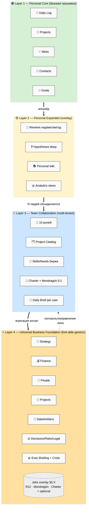
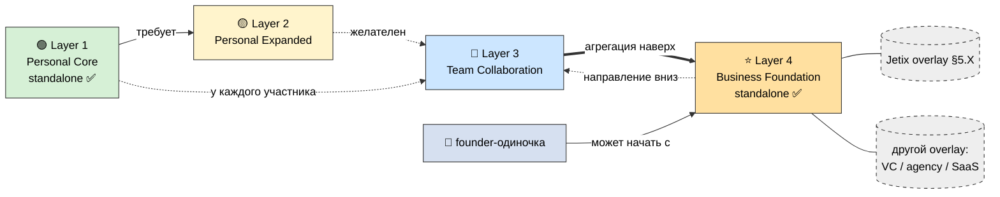
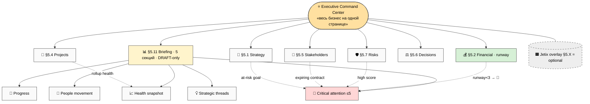
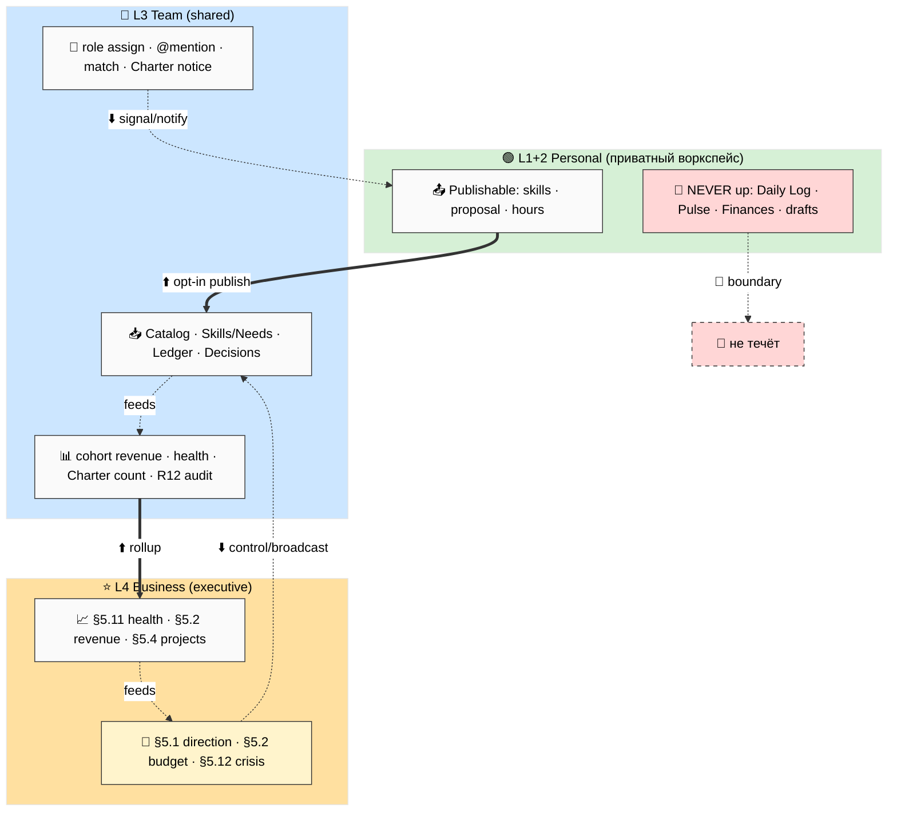
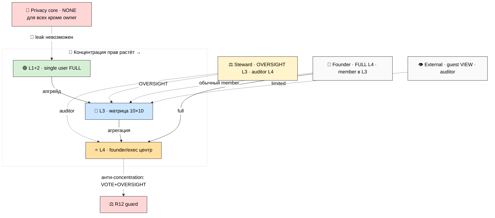
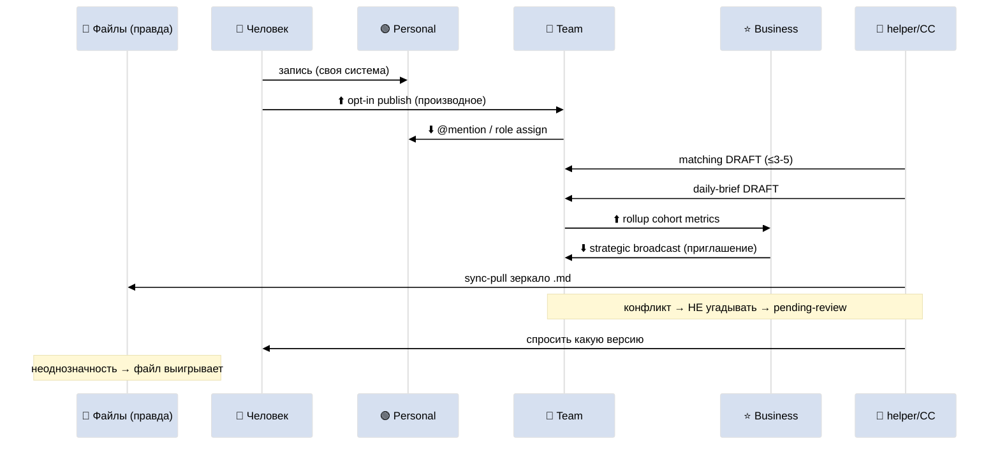
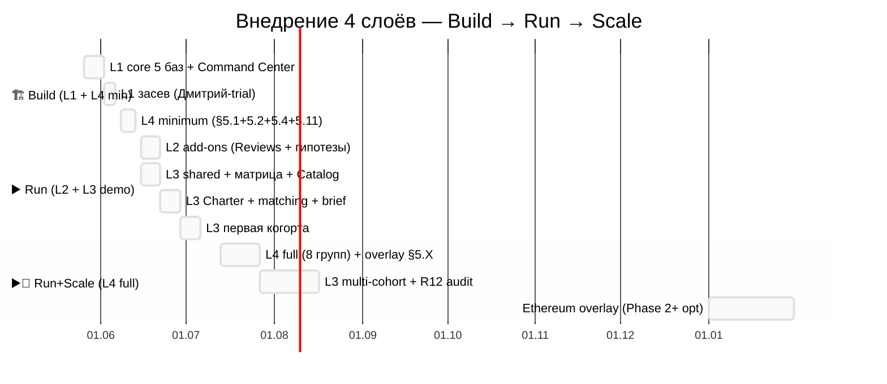
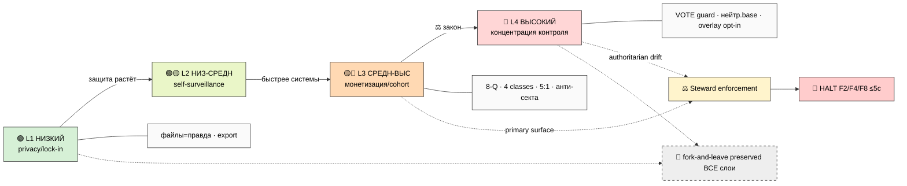
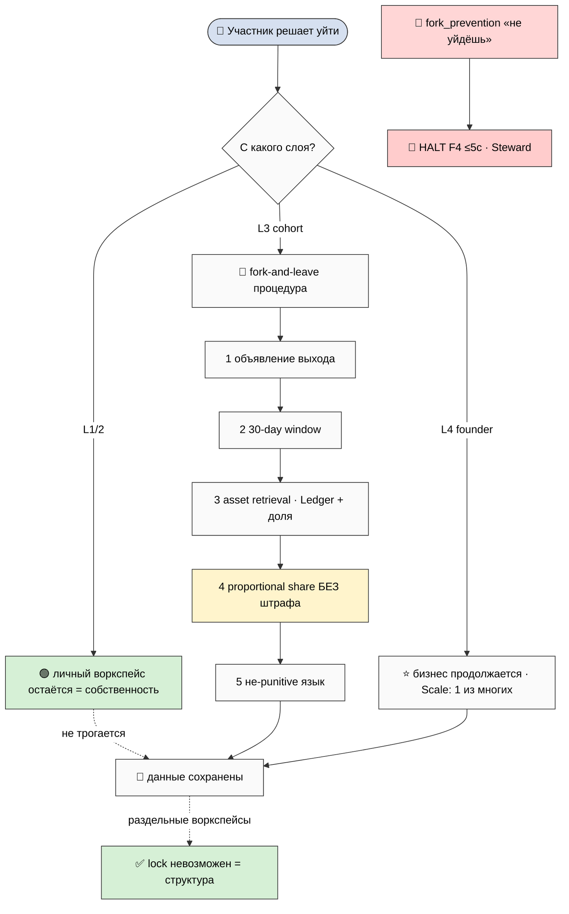
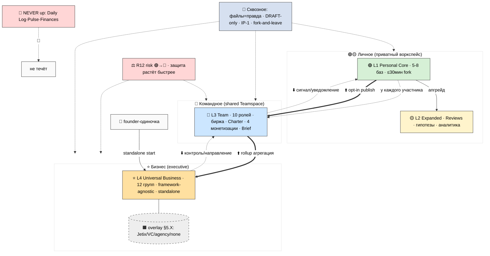

# 🏛️ Notion Templates 4-Layers Architecture — полная архитектура

> **Что это.** Единый спецификационный документ, который собирает всё, что мы спроектировали для
> Notion, в **одну архитектуру из 4 уровней**: личный (Layer 1+2) + командный (Layer 3) +
> **универсальный бизнес-управленческий (Layer 4)**. Для каждого уровня — готовая к сборке схема
> (базы / поля / формулы-паттерны / виды / связи / права / шаблоны). Плюс механика между слоями
> (потоки данных / права / синк / онбординг / форк) и дорожная карта.
>
> **⭐ Layer 4 — главное новое.** Это **универсальный fork-able фундамент для управления ЛЮБЫМ
> бизнесом** (консалтинг / SaaS / продукт / агентство / кооператив — любой). Базовый skeleton,
> который любой founder копирует → адаптирует. Jetix-специфика (R12 / Mondragón / Charter) =
> **отдельный optional overlay**, а не часть base. Jetix = один пример из применений.
>
> **Это план, а не реализация.** Ничего в Notion не создаётся, API не зовётся. В конце — **15-20
> решений (§11)**, которые выбираешь ты. Это пул вариантов, не приказ.

---

## §0 Если есть 90 секунд (TL;DR)

- **Что собрали:** 4 уровня Notion в одну архитектуру. **Layer 1 Personal Core** (личная система,
  форк за час) → **Layer 2 Personal Expanded** (аналитика + ревью + гипотезы) → **Layer 3 Team
  Collaboration** (команда, роли, биржа, честное деление денег) → **Layer 4 Universal Business
  Foundation** (исполнительный взгляд на бизнес целиком).
- **Layer 4 = универсальный.** Не «дашборд Jetix», а **fork-able фундамент для любого бизнеса**:
  12 групп баз (стратегия / финансы / люди / проекты / стейкхолдеры / решения / риски / комплаенс
  / инструменты / документы / брифинг / кризис), каждая с **extension points** («если у тебя
  X-бизнес → добавь поля Y»). Jetix-стиль (R12 / Mondragón 5:1 / Charter / 10 ролей) = **отдельный
  optional overlay §5.X**, наслаивается сверху. Любой бизнес может написать свой overlay.
- **Почему 4, а не 3/5:** две оси × два масштаба — личное/командное × оперативное/управленческое.
  Лестница L1→L2→L3 строгая; **Layer 4 standalone-capable** (founder может стартовать прямо с него).
- **Потоки между слоями:** вверх — только opt-in (человек публикует) + rollup (агрегация когорт в
  KPI); вниз — сигнал/контроль (приглашение, не приказ); **личное (дневник / здоровье / финансы)
  не течёт никуда** — приватность архитектурна.
- **Этика встроена (R12):** риск растёт со слоем (L1🟢→L4🔴); защита растёт быстрее; fork-and-leave
  работает на всех 4 слоях; generic base **нейтрален** (R12 = opt-in, не навязан).
- **Порядок:** Build — Layer 1 core (Дмитрий-trial) + Layer 4 minimum (Ruslan exec) → Run — Layer 2
  + Layer 3 demo → Run+Scale — Layer 4 full + overlay + multi-cohort. Затраты минимальны до Scale.
- **10 схем** ARCH-1..ARCH-10. **14 фазовых отчётов** с детальной Notion-схемой. **15-20 решений** §11.

---

## §1 🎯 Главная мысль

**Раньше у нас были три отдельных плана: личная система (Personal OS), командная (Team OS) и
наброски бизнес-управления. Этот документ сшивает их в ОДНУ архитектуру из 4 уровней — и добавляет
четвёртый, самый новый и самый важный: универсальный fork-able фундамент для управления любым
бизнесом. Теперь это не три продукта, а один стек: от «навести порядок в своей жизни» до «видеть и
управлять целой компанией с одной страницы».**

Ключевых идей три:

1. **Один стек, четыре масштаба.** Layer 1 делает сильным одного человека; Layer 2 даёт ему
   аналитику; Layer 3 соединяет N сильных людей в честную команду; Layer 4 даёт founder'у
   исполнительный взгляд на бизнес целиком. Каждый слой достраивается над предыдущим, не ломая его.

2. **Layer 4 — универсальный, не наш.** Самое важное решение архитектуры: Layer 4 base **не привязан
   к Jetix**. Это generic skeleton, который форкает любой founder любого бизнеса. Jetix
   (anti-extraction / Mondragón / Charter / 10 ролей) = **один из возможных overlay'ев** поверх
   нейтрального base. Это и делает Layer 4 по-настоящему fork-able — и заодно проверяет нашу
   философию: если наш фундамент можно ужать в нейтральный business template, которым воспользуется
   и капиталистический стартап, и кооператив, — значит он действительно универсален.

3. **Этика — это структура, а не обещание.** Право уйти со своими данными (fork-and-leave),
   приватность личного, потолок неравенства — встроены в **раздельные воркспейсы и права**, а не в
   правила, которые можно нарушить. R12-защита растёт быстрее системы на каждом слое.

**Сквозной словарь (наследуется всеми 4 слоями):** файлы = источник истины (Notion = витрина);
AI предлагает черновики, человек решает (DRAFT-only); роль ≠ человек (IP-1, multi-hat возможен);
уйти можно в любой момент со своим (fork-and-leave); 2-слойный форк (универсальная «грамматика» +
надстройка-«словарь» под себя).

**ARCH-1 — стек 4 слоёв.** Каждый шире и достраивается над предыдущим; Jetix-overlay (пунктир) опционален.

**Почему именно 4 (не 3, не 5):**
- **Не 3** (нельзя слить L1+L2): порог входа. Новичок копирует лёгкую версию за 30 минут, не тонет
  в аналитике; Expanded — апгрейд, когда базовое работает.
- **Не 3** (нельзя слить L3+L4): разные оси. Team = горизонталь (N равных координируются и делят);
  Business = вертикаль (один founder видит и управляет сверху). Разные базы, роли, права.
- **Не 5** (массовое сообщество не отдельный слой): масса (Scale) = Layer 3 ×N когорт + Layer 4,
  агрегирующий их. Отдельный 5-й слой плодил бы дубли.

**ARCH-2 — зависимости + наследование + overlay.** Лестница L1→L2→L3 строгая; L4 standalone; overlay ≠ слой.

---

## §2 🟢 Layer 1 — Personal Core (compressed; детально — Phase 2)

**Что это.** Личная система одного человека: дневник, проекты, идеи, люди, цели. Форк за час. Базовая
прошивка. **7 core баз + 3 add-on:**

| База | Назначение | Ключевое |
|---|---|---|
| 📅 Daily Log | день = одна запись, главный голосовой вход | append-only, связан с проектами/людьми |
| 🚀 Projects | тип + чекпоинт + детект застрявших | формула «застрял?» (>14д без касания → 🔴) |
| ✅ Tasks | атомарные действия | в LITE сливается в Projects |
| 💡 Ideas | банк идей + inbox-корзина | уровень зрелости C→A, промоушен в проект/гипотезу |
| 🎯 Goals | POINT A → POINT B | прозу пишет человек, AI предзаполняет |
| 🤝 Contacts | личные люди (упрощённый CRM) | роли/статусы, «что предлагаю/прошу», reconnect-флаг |
| 📚 Knowledge | источники + факты + понятия | поле «уверенность» (low/mid/high) |
| ❓ Hypotheses (add-on→core L2) | «что хочу узнать» | фальсифицируемая фраза + confirm/refute criterion |
| ❤️ Life Pulse (add-on) | энергия/сон/настроение/деньги | red-zone формула (анти-выгорание); **не течёт наверх** |
| 💰 Finances (add-on, opt-in) | личный кошелёк | строго приватно, не путать с бизнес-финансами L4 |

**Три варианта сборки (R1):** LITE 8 баз (новичкам) / STANDARD 11 (опытным) / FULL 14 (инженерам).

**Каждая база — готовая схема** (поля с типами, виды с фильтрами, связи, шаблоны, паттерны формул,
права). Детально — `reports/.../03-layer-1-personal-core.md`. Пример паттернов формул: stuck-detection
(`if(Status=active & Days since touch>14, "🔴", "")`); streak-counter; reconnect-флаг; red-zone.

**Onboarding ≤30 мин:** Command Center хаб (или 5 баз) → Daily Log (первая запись) → 3 проекта → 5
контактов → POINT A. **Права:** single user = full access (нет ролей — снижает порог форка).

**5 ниш форка** (меняется только «что в центре»): инженер (Projects+Tasks) / исследователь
(Hypotheses+Sources) / предприниматель (CRM+Projects) / методолог (Concepts+Reviews) / гуманитарий
(Life Pulse+Daily Log — Дмитрий-стиль).

**Две ключевые схемы inline (для самодостаточности; полный набор — Phase 2):**

📅 **Daily Log** — поля: Date (title-date, обяз.) / Morning intention / Day entries (long, append) /
Evening reflection / Gratitude / Day pulse (low-mid-high) / Tomorrow trigger / Energy (1-5) / Linked
projects/people/hypotheses/ideas (relations) / Source mode (manual/voice-draft/cc-draft) / Draft?
(checkbox) / Day-of-week + Week-number (формулы для каскада ревью). **Views:** Today / This week /
Drafts to review / Digest. **Onboarding:** первая запись = «hello world» системы.

🚀 **Projects** — поля: Name / Type (consulting/research/product/bets/personal) / Priority (P1-P4) /
Status (idea/active/paused/done/archived) / Checkpoint (start→in-progress→done, 3 чекпоинта вместо
4 SG) / Owner / Collaborators (→Contacts) / Linked hypotheses+goals / Last touched (rollup из Daily
Log) / **Days since touch** (`dateBetween(now(), Last touched, "days")`) / **Stuck?**
(`if(and(Status=="active", Days since touch>14), "🔴 stuck", "")`) / Start+Target end / Progress%
(rollup tasks). **Views:** Active / Stuck / Board by checkpoint / By type / Timeline.

**Дисциплина зеркала (наследуется всеми базами):** каждая строка любой базы = один `.md` на диске;
свойства Notion = поля YAML-шапки; при конфликте — прав файл; голос → только черновик с флагом.

---

## §3 🟡 Layer 2 — Personal Expanded (compressed; детально — Phase 3)

**Что это.** Не новая система — **надстройка наблюдательных контуров над Layer 1** (схемы L1 не
трогаются). 7 добавок:

1. **Аналитика cross-DB** — rollup-виды (скорость проектов по типам, конверсия гипотез, тренд
   энергии) ± база Metrics Snapshot для трендов во времени.
2. **8 шаблонов ревью каскадом** (база Reviews): день → неделя → месяц → квартал → год + проект +
   гипотеза + звонок. AI предзаполняет цифры, человек пишет «почему». День сворачивается в год.
3. **Hypotheses deep** — этапы (formulate→test→evidence→conclude), evidence chain, confidence trail,
   falsifiability score, дерево гипотез.
4. **Расщепление вики** — Knowledge (LITE) → Sources + Claims + Concepts + bi-directional links
   (граф понятий).
5. **Продвинутые связи** — Concept↔Concept, Claim→Source→Hypothesis, rollup-колонки.
6. **AI-хелперы (DRAFT-only)** — 5 промпт-паттернов: review pre-fill / synthesis / weekly digest /
   hypothesis suggest / connection find. Пишут черновик, человек промоутит.
7. **Промоушен add-on → core** — Hypotheses, Life Pulse, Knowledge становятся первоклассными.

**Шаблон звонка** идёт в паре с **8-пунктовым этическим чеком** (мост к Layer 3 монетизации): иду
помочь или впарить? не присваиваю чужое? можно уйти без штрафа? **Onboarding L1→L2:** 1 неделя
add-ons. **Анти-паттерн:** аналитика поверх пустого L1 бесполезна.

---

## §4 🔵 Layer 3 — Team Collaboration (compressed; детально — Phase 4)

**Что это.** Слой совместной работы поверх личных систем. N Personal OS ↔ одно общее пространство.
Это **кооператив, не корпорация**: большая часть дохода — человеку (75-90%), потолок неравенства
5:1, уйти можно с долей. **Топология:** у каждого приватное пространство (его Layer 1+2), есть общее
(Teamspace); наверх — только opt-in publish; вниз — уведомления/ссылки, не копирование. Личное
(Daily Log / Life Pulse / Finances) **никогда** не синкается.

**10 общих баз:** Project Catalog (14 полей) / Skills-Needs (биржа) / Project Workspaces / Charter /
Revenue Accounting / Contribution Ledger / Decisions Queue / R12 Audit Log / Daily Brief /
Onboarding-Guides.

**10 ролей (роль ≠ человек, IP-1):**

| Роль | В двух словах | Доля | R12-риск | Защита |
|---|---|---|---|---|
| PM | координатор одного проекта | 10-20%/проект | СРЕДН | ротация |
| Inv-Cap | вкладывает деньги | 20-40% капчасти | **ВЫС** | Mondragón 5:1 + fork-leave |
| Inv-Time | вкладывает часы/навык | трудовая часть | НИЗ-СРЕДН | ≤50ч/нед |
| Inv-Net | вкладывает сеть/аудиторию | 3-10% за интро | СРЕДН | анти-audience-extraction |
| Contributor | делает задачи | почасовка/доля | НИЗК | самый частый вход |
| Advisor | лёгкий совет 1-2ч/мес | 0.5-2%/ретейнер | НИЗК | советует≠управляет |
| Facilitator | ведёт сессии/когорту | за сессию + бонус | СРЕДН | анти-культ |
| Mentor | долгосроч. сопровождение | ретейнер | **ВЫС** | потолок 12 мес, нет lock-in |
| Observer | смотрит, не участвует | — | НИЗК | безопасная прихожая |
| Steward | следит за честностью (R12) | плоский ретейнер | МЕТА | ротация + peer-проверка |

**Биржа (язык равенства, не «доска вакансий»):** Project Catalog + Skills/Needs + ежедневный
подбор пар (DRAFT). **Деньги:** 4 шаблона монетизации (стандарт / капитал / когорта €1500 / знание-IP),
каждый через **8-пунктовый R12-чек**; Mondragón 5:1 (`max/min>5 → HALT F4 ≤5с`); прозрачный ledger.
**Charter** (6 секций, центральная — R12-комплаенс) + 4 action classes (extraction / wage-ratio /
non-consensual / fork-prevention → HALT). **Daily Brief** (5 секций, DRAFT-only). **Stage Gates**
SG-1..SG-4 + Steward escalation feed. **Матрица прав** 10 баз × 10 ролей (PM силён только в своём
проекте; деньги видны только свои; Steward сквозной OVERSIGHT). **Онбординг** 7 дней
(observation→contribution, анти-секта: выход озвучен до входа). **Fork-and-leave** литеральная
кнопка (30-day notice + asset retrieval + доля + не-punitive).

**Матрица прав inline (10 баз × 10 ролей; EDIT/COMMENT/VIEW/VOTE/OVERSIGHT/NONE/own):**

| База \ Роль | PM | Inv-Cap | Inv-Time | Inv-Net | Contrib | Advisor | Facilit | Mentor | Observ | Steward |
|---|---|---|---|---|---|---|---|---|---|---|
| Project Catalog | EDIT(own) | V+C | V+C | VIEW | VIEW | VIEW | VIEW | VIEW | VIEW | EDIT |
| Skills/Needs | EDIT(own) | EDIT(own) | EDIT(own) | EDIT(own) | EDIT(own) | EDIT(own) | EDIT(own) | EDIT(own) | VIEW | VIEW |
| Project Workspaces | EDIT(own) | VIEW | EDIT(asgn) | VIEW | EDIT(asgn) | COMMENT | EDIT(sess) | COMMENT | VIEW | VIEW |
| Charter | VIEW | VIEW | VIEW | VIEW | VIEW | VIEW | VIEW | VIEW | VIEW | EDIT |
| Revenue Accounting | EDIT(own) | VIEW(own) | VIEW(own) | VIEW(own) | VIEW(own) | NONE | NONE | NONE | NONE | OVERSIGHT |
| Contribution Ledger | EDIT(own) | VIEW(own) | EDIT(own) | VIEW(own) | EDIT(own) | VIEW(own) | EDIT(own) | VIEW(own) | NONE | OVERSIGHT |
| Decisions Queue | EDIT(own) | VOTE | VOTE | VOTE | COMMENT | COMMENT | COMMENT | COMMENT | NONE | OVERSIGHT |
| R12 Audit Log | VIEW(own) | VIEW(own) | VIEW(own) | VIEW(own) | VIEW(own) | VIEW(own) | VIEW(own) | VIEW(own) | NONE | EDIT |
| Daily Brief | own | own | own | own | own | own | own | own | own | own |
| Onboarding/Guides | VIEW | VIEW | VIEW | VIEW | VIEW | VIEW | VIEW | VIEW | VIEW | EDIT |

**8-пунктовый R12-чек (на КАЖДЫЙ денежный шаблон, перед применением):** (1) стоимость ≤ выгода;
(2) предложение конкретно; (3) соразмерно отношениям; (4) уместно по стадии (SG-2+); (5) уместно по
каналу; (6) R12 paired-frame PASS (нет извлечения/lock-in/нарушения 5:1/fork-prevention); (7) анти-CTA
(нет MLM/культа); (8) Halt-Log-Alert готов (≤5с). Хоть один FAIL → не применяется / HALT.

**4 монетизации:** T1 стандарт (75-90% человеку) / T2 капитал (+ капчасть 20-40%) / T3 когорта
≈€1500/мес / T4 знание-IP (ретейнер). **4 action classes (детекторы):** extraction_beyond_share /
wage_ratio_violation / non_consensual_distribution / fork_prevention_attempt → каждый HALT.

**Worked example команды (на пальцах):** Аня видит запрос клиента, который одной не вытянуть →
создаёт проект в каталоге (SG-1) → отмечает «нужны навык X, Y». Брифинг Бориса утром: «твой навык X
подходит проекту Ани» → Борис вписывается Contributor'ом. Вера даёт €2K → Inv-Cap. Подписывают
Charter (доли + 5:1 + право выхода) → Steward проверяет R12 → SG-2 active. Каждый живёт в **своей**
личной системе; в общее ушли только проект, роли, ledger. Заработали — поделили прозрачно; кто
захотел — ушёл с долей.

---

## §5 ⭐ Layer 4 — Universal Business Foundation Template (главная секция; детально — Phase 5)

> **🚨 Scope — прочитай внимательно.** Layer 4 = **универсальный fork-able фундамент для управления
> ЛЮБЫМ бизнесом** (консалтинг / SaaS / продукт / агентство / кооператив / любой). Это **базовый
> skeleton**, который любой founder/executive копирует → адаптирует под свой бизнес. Generic, **НЕ
> Jetix-specific**. У каждой базы — **extension points** (что добавить под конкретный кейс).
>
> Jetix-специфика (R12 / Mondragón 5:1 / 4 LOCKED / Charter / 10 ролей / 4 монетизации / Stage
> Gates / Ethereum) = **СЕПАРАТНЫЙ OPTIONAL OVERLAY** (§5.X в конце этой секции). Не часть base.
> Один пример из многих возможных overlay'ев. Тон base — «вот универсальный business template»,
> а не «вот наша корпорация Jetix».

### §5.0 Что это и зачем

Layer 4 — это **executive operating system**: founder видит весь бизнес с одной страницы и
управляет им. Боль, которую он решает: founder держит компанию «в голове и в 15 разрозненных
табличках/чатах» — стратегия отдельно, деньги отдельно, люди отдельно, и ничего не связано. Layer 4
сшивает 12 функциональных групп в один связанный граф, где rollup'ы текут в ежедневный брифинг.

**Standalone-capable:** founder может развернуть Layer 4 minimum (стратегия + финансы + проекты +
брифинг) за **2-3 часа** без Layer 1-3. Когда появляется команда — добавляет Layer 3 снизу, и
Layer 4 начинает агрегировать когорты.

**12 групп баз:**

| # | Группа | Решает боль | Ядро/опц |
|---|---|---|---|
| §5.1 | 🎯 Strategy & Goals | «куда идём + по какой метрике мерим» | ядро |
| §5.2 | 💰 Financial Overview | «сколько денег / сколько горим / сколько осталось» | ядро |
| §5.3 | 👥 Team / People | «кто в команде + кто за что отвечает» | ядро |
| §5.4 | 🚀 Projects Portfolio | «что делается + на какой стадии» | ядро |
| §5.5 | 🤝 Stakeholders / CRM lite | «клиенты / партнёры / инвесторы» | ядро |
| §5.6 | ⚖️ Decisions Log | «что решили + почему + чем кончилось» | ядро |
| §5.7 | 🛡️ Risks Register | «что может пойти не так + что делаем» | опц |
| §5.8 | 📜 Compliance & Legal | «юр / договоры / комплаенс» | опц |
| §5.9 | 🧰 Tools / Resources | «чем работаем + сколько стоит» | опц |
| §5.10 | 📚 Documents / Knowledge Hub | «где что лежит» | опц |
| §5.11 | 📊 Executive Briefing | «весь бизнес на одной странице» | ядро |
| §5.12 | 🚨 Crisis Mode Playbook | «что делать, когда всё горит» | опц |

**Минимум для старта:** §5.1 + §5.2 + §5.4 + §5.11. Остальное наслаивается по мере роста.

### §5.1 🎯 Strategy & Goals (generic, framework-agnostic)

База **не навязывает OKR** — каждый бизнес выбирает свой фреймворк. Универсальный слот: «цель →
метрика → owner → горизонт». Базы: **Vision/Mission** (statement / kind / last revised / owner /
review cadence) + **Goals** (title / type annual-quarterly-monthly / target metric / current state /
progress% формула / owner / horizon / status / health-формула / linked projects).
**Views:** current quarter / by owner / at-risk / annual roadmap timeline.
**Extension points:** *OKR* → Objectives + Key Results (KR1-3, confidence 0-1); *V2MOM* → Values /
Methods / Obstacles / Measures; *EOS* → Rocks + scorecard; *industry* → категории целей.

### §5.2 💰 Financial Overview (generic)

Денежная картина: доход / расход / runway / прайсинг / счета. Базы: **Revenue** (per income stream:
category / amount / period / status / customer) + **Expenses** (per category: operating/hr/tools/
marketing / amount / recurring? / vendor) + **Pricing tiers** (опц) + **Invoices** (number / customer
/ amount / due / status / overdue-формула). **Dashboard формулы:** runway months =
`Current cash / Monthly burn` → 🔴 если <3; budget vs actuals; variance.
**Views:** P&L this month / runway dashboard / outstanding invoices / revenue by stream.
**Extension points:** *cooperative* → Mondragón ratio check (highest/lowest comp); *VC-funded* →
cap table (round/investor/equity%/valuation); *multi-currency* → currency + conversion;
*crypto* → wallet tracking. *(investor-lens: runway<6мес = критический сигнал в брифинг; unit-econ
CAC/LTV — extension под sales-heavy.)*

### §5.3 👥 Team / People (generic, governance-agnostic)

Кто в команде + кто за что отвечает. Структура (иерархия/плоская/матрица) — выбор бизнеса. Базы:
**Members** (name / role / start / status / contact / responsibilities / reports-to) + **Roles**
(role title / responsibilities / KPIs / decision rights / reports-to / comp band — **универсальная
библиотека, НЕ 10 Jetix ролей**). **Org viz:** через reports-to (hierarchical / flat / matrix).
**Extension points:** *cooperative* → ratio enforcement + Steward + ротация; *hierarchy* → reporting
chains + spans of control; *multi-hat (IP-1)* → role-vs-person matrix (один человек = несколько
ролей). *Даже в generic полезно различать Roles (контейнеры) и Members (исполнители) — снимает
«незаменимость человека X».*

### §5.4 🚀 Projects Portfolio (generic)

Что делается + стадия. Высокоуровневый портфель (отделён от детального трекинга Layer 3). Базы:
**Projects** (name / type / status / stage early-mid-late-wrap / owner / team / start / target end /
actual end / health-формула / linked goals) + **Project Types** (user defines). **Views:** portfolio
timeline / board by stage / by owner / at-risk. **Extension points:** *Stage Gates* → SG-1..SG-4 +
predicate fields; *Agile* → sprint/velocity/backlog; *project-based revenue* → project value/margin/
billed → rollup в §5.2.

### §5.5 🤝 Stakeholders / Customers / Partners (generic CRM lite)

Универсальный CRM lite (отделён от deep CRM L1/2). База **Contacts** (name / kind person-org / type
customer-partner-investor-advisor-vendor / status / engagement health / last touch / days-since
формула / next action / owner / linked projects). **Pipeline view** (discovery→qualification→proposal
→closed). **Extension points:** *Jetix-style* → T1/T2/T3/T4 classification; *sales-heavy* → deal
stage + amount + probability → forecast; *cohort* → Charter signed flag + Mondragón role.

### §5.6 ⚖️ Decisions Log (generic)

Институциональная память: что решили / почему / чем кончилось. База **Decisions** (title / date /
category / owner / status proposed-approved-executed-rejected-reversed / rationale / linked
stakeholders+projects / impact / outcome / review date). **Views:** recent / by category / awaiting
review / reversed (учимся на откатах). **Extension points:** *AWAITING-APPROVAL Jetix* → packet +
Ack + F-G-R triple; *RACI* → Responsible/Accountable/Consulted/Informed; *board* → vote tracking.
*(philosophy-lens: Outcome + Review date = встроенный epistemic feedback — бизнес учится, не повторяет ошибки.)*

### §5.7 🛡️ Risks Register (generic)

Что может пойти не так. База **Risks** (title / category financial-operational-legal-market-
reputational-technical-people / severity 1-5 / likelihood 1-5 / score формула / priority bucket /
mitigation / owner / status / review date). **Views:** top risks / by category / due for review.
**Extension points:** *R12-aware* → R12 category + 8 paired-frame check; *ISO* → ISO mapping;
*industry* → sub-categories + regulator mapping.

### §5.8 📜 Compliance & Legal (generic)

База **Legal Entity** (type / jurisdiction / registration / tax ID) + **Contracts** (party / type /
start-end / value / status / renewal date / expiring-soon формула) + **Compliance checklist**
(item / category privacy-GDPR-tax-insurance-licenses / due / status / overdue). **Extension points:**
*Berlin/DE* → Steuerberater + Einzel/GmbH/UG decision; *cooperative* → Charter compliance + Mondragón
audit; *public* → SOX/SEC.

### §5.9 🧰 Tools / Resources Inventory (generic)

База **Tools** (name / purpose / category / status active-trial-deprecated / cost-per-period / owner /
usage frequency / renewal). **Views:** active / by category / cost rollup → §5.2 / underused (`rare &
cost>0` → кандидат на отмену). **Extension points:** *AI-heavy* → AI tools + agent inventory +
model/version; *remote-first* → collaboration stack + seat count.

### §5.10 📚 Documents / Knowledge Hub (generic)

Индекс документов. База **Document Index** (title / category executive-methodology-financial-legal-
brand-operational / status / owner / last updated / link / access public-internal-restricted).
**Views:** by category / recently updated / restricted / stale (>180д). **Extension points:**
*wiki-based* → concepts/sources/claims linking; *SOPs* → version control; *client-facing* →
public/private + sharing tracking.

### §5.11 📊 Executive Daily/Weekly Briefing (generic, DRAFT-only)

«Весь бизнес на одной странице». Ассистент/CC предлагает, founder reviews. База **Briefing** (period /
cadence daily-weekly-monthly / critical attention ≤5 / health snapshot / progress / people movement /
strategic threads / reviewed?). **5 секций:** 🚨 Critical attention (≤5 требующих решения) / 📊 Health
snapshot (runway / revenue / project health / risk score — настраиваемые) / 🎯 Progress (закрыто/
стартует/блок) / 🤝 People movement / 💡 Strategic threads. **DRAFT-only:** ассистент собирает rollup'ы
§5.1-§5.10 → черновик; founder правит → решает. **Extension points:** *AI-assistant* → auto-generated
pipeline; *team-based* → distribution rules. *(mgmt-lens: брифинг = главный артефакт L4; ≤5 critical
items = anti-overload, наследие «attention budget».)*

### §5.12 🚨 Crisis Mode Playbook (generic)

Заранее прописанные процедуры. База **Crisis Playbooks** (crisis type / category financial-shock-
keyperson-public-incident-legal-operational / trigger conditions / immediate actions чек-лист /
escalation chain / communication template / debrief checklist). **Extension points:** *R12-governed*
→ R12 violation procedure + Steward escalation; *regulated* → regulator notification + timelines.

### §5.13 Executive Command Center + relations graph

**Хаб Layer 4:** одна страница со встроенными linked views всех 12 групп (Goals health / Runway /
Active projects / Pipeline / Decisions awaiting / Top risks / Expiring contracts / Today's briefing).

**Layer 4 — связанный граф, не 12 изолированных баз.** Сила founder'а — в relations: Goals→Projects→
People; Tools→Expenses; Contracts→Stakeholders; Risks→People; ВСЕ→Briefing (rollup'ы в 5 секций);
Decisions→Projects/Stakeholders (трассируемость). Rollup'ы идут только снизу вверх в брифинг (нет
циклов пересчёта). **Formula cookbook** (Phase 5 §5.15): runway / goal-health / project-health / risk
score / days-since-touch / contract-expiring / invoice-overdue / tool-underused / people-overload /
budget-variance — generic паттерны, founder адаптирует под свои числа. **View cookbook** (§5.16):
расслоено по каденсу внимания — daily (critical / runway / projects board) / weekly (P&L / goals /
pipeline / decisions) / monthly (risk heat / team load / tool spend / doc freshness).

**ARCH-7 — Executive Dashboard.** 6 групп + брифинг; критичные сигналы текут в Critical attention; overlay опционален.

### §5.14 Worked examples — 4 разных бизнеса форкают Layer 4

> Описания применения generic base (НЕ sample records).

- **🔹 Консалтинг-бутик (2 чел):** §5.1 + §5.2 (invoices+runway, project-based revenue ext) + §5.4
  (проекты-клиенты с value) + §5.5 (pipeline, deal-stage ext) + §5.11. Без Jetix-overlay. Польза:
  runway gauge + forecast в одном месте.
- **🔹 SaaS-стартап (15 чел, VC):** §5.1 OKR ext + §5.2 subscription + cap table + §5.3 hierarchy +
  §5.4 sprint ext + §5.7 + §5.9 seat tracking. **VC-overlay** (board votes в §5.6), не Jetix. Польза:
  board deck из rollups.
- **🔹 Кооператив:** generic base + **Jetix-overlay §5.X** (Mondragón + R12 + Charter + 10 ролей +
  Steward). Ближайший к Jetix кейс — но это **выбор бизнеса**, не часть base.
- **🔹 Агентство (8 чел):** §5.4 кампании + §5.5 клиенты + §5.2 margin + §5.3 matrix (IP-1 role-vs-
  person) + §5.10 brand assets. **agency-overlay** (utilization rate). Польза: people-overload formula.

**Вывод:** один generic skeleton → 4 разных бизнеса; различие только в (а) включённых extension
points и (б) наслоенном overlay (Jetix / VC / agency / none). Это операционное доказательство fork-ability.

---

## §5.X 🟧 Jetix-specific OPTIONAL OVERLAY (один пример из применений)

> **OPTIONAL overlay** — если кто-то форкает Layer 4 base **именно для Jetix-стиля кооперативного
> бизнеса** (anti-extraction + Mondragón + R12 + cohort + Charter). **Не часть base.** Один пример
> конкретного бизнеса. Любой бизнес может написать свой (VC / agency / SaaS / что угодно).

**Что Jetix добавляет к каждой generic базе:**

| Generic база | Jetix-overlay добавляет |
|---|---|
| §5.1 Strategy | POINT A → POINT B + Build/Run/Scale stage field + 4 LOCKED reference |
| §5.2 Finance | Mondragón 5:1 ratio check + 75/25 split + 3-layer recursive 25% (V10) + treasury pool |
| §5.3 People | 10 Jetix ролей (PM / Inv-Cap×3 / Contributor / Advisor / Facilitator / Mentor / Observer / Steward) + ротация + IP-1 binding table |
| §5.4 Projects | Stage Gates SG-1..SG-4 + predicate + R12 audit status |
| §5.5 Stakeholders | T1-T4 partner classification + Charter signed flag |
| §5.6 Decisions | AWAITING-APPROVAL packet + Ack records + F-G-R triple + Default-Deny |
| §5.7 Risks | R12 category + 8 paired-frame questions + 4 action classes |
| §5.8 Legal | Charter compliance + Mondragón audit + Berlin Steuerberater + Einzel/GmbH/UG |
| §5.11 Briefing | Jetix-specific 5 секций Daily CC pass + DRAFT-only enforcement |
| §5.12 Crisis | R12 violation procedure + Steward escalation + анти-секта kit |

**Конкретные механики overlay:**
- **R12 8 paired-frame questions** — каждая монетизация/касание: цена≤польза? · конкретно? ·
  соразмерно отношениям? · по стадии? · канал? · не доим/не запираем? · нет манипуляции? ·
  стоп-сигнал готов? → хоть один FAIL → HALT.
- **Mondragón 5:1** — `if(max(comp)/min(comp)>5, "🛑 HALT F4 ≤5с", "✅")` перед распределением.
- **Charter slot** (6 секций, Layer 3 §6) как governance-документ всего бизнеса + 4 action classes
  (extraction_beyond_share / wage_ratio_violation / non_consensual_distribution / fork_prevention_attempt).
- **10 Jetix ролей** заполняют generic Roles library; executor binding (Ruslan founder / Maxim PM /
  Прапион Steward / Цэрэн Inv-Net) = RUSLAN-LAYER, отдельная binding-table (IP-1).
- **4 монетизации** (T1 стандарт / T2 капитал / T3 когорта €1500 / T4 знание-IP) как типы income
  stream с R12-чеком.
- **Stage Gates** SG-1..SG-4 + 4 LOCKED (Метод V2 / Strategic Plan / Economic V10 / AI Market) +
  Foundation = reference в §5.10 (read-only).
- **Programmable Ethereum** Phase 2+ флаг в Charter (per-Clan opt-in: Mondragón cap on-chain + QF +
  RageQuit). Phase 1 текстовая (Steward) = baseline.
- **Daily CC pass** Jetix 5 секций (знакомства / пробелы / биржа / проекты / интернет), DRAFT-only.
- **Build/Run/Scale alignment** — stage-field; R12-защита растёт с этапом.

**Worked example деления €10 000 (иллюстративный one-liner, не запись):** проект заработал €10K;
Charter 85% контрибьюторам / 10% Foundation / 5% капиталу → Foundation €1000, капитал €500,
контрибьюторам €8500 (PM 20%=€1700, Исп.A 45%=€3825, Исп.B 35%=€2975). Mondragón check: max €3825 /
min €1700 = 2.25 ≤ 5 → **PASS**. Если бы PM выбил €7000, а Исп.B €500 → ratio 14 → **HALT**. Уход
Исп.A → забирает €3825 + долю, без штрафа.

**Тон критично:** generic base звучит как универсальный business template; Jetix overlay = вежливо
упомянут как «один пример». Навязывать R12 всем = само по себе анти-R12 (см. §8 мета-R12).

---

## §6 🔄 Cross-layer механика (потоки / права / синк / онбординг / форк)

### §6.1 Потоки данных (детально — Phase 6)

Три типа: **наблюдение/агрегация** вверх (opt-in publish + rollup) · **сигнал/контроль** вниз
(уведомление + broadcast) · **изоляция** (личное не течёт). Закон асимметрии: вверх — только по
решению человека; вниз — приглашение, не приказ.

- **Вверх:** Personal → Team (opt-in publish: skills / proposal / hours — **производное**, не сырое)
  → Business (rollup: cohort revenue / health / Charter count → §5.2/§5.4/§5.11).
- **Вниз:** Business → Team (strategic direction broadcast / R12 audit / budget) → Personal
  (role assign / @mention / match suggestion — ссылка, не копия).
- **Не течёт:** Daily Log / Life Pulse / Finances / drafts — приватный воркспейс физически не
  подключён к Teamspace. Leak архитектурно невозможен.

**ARCH-3 — потоки.** ⬆️ opt-in/rollup; ⬇️ сигнал/контроль; 🚫 privacy boundary.

### §6.2 Права (детально — Phase 7)

L1/2 = single user full (нет ролей, снижает порог форка). L3 = матрица 10 баз × 10 ролей (PM силён
только в своём проекте; деньги видны только свои; Steward сквозной OVERSIGHT). L4 = founder/exec
центр (Founder/Executive/Manager/Member/External) с **анти-concentration guard** (VOTE у Executive +
Steward auditor даже в generic — против authoritarian drift). **Privacy core** (Finances/Pulse/Daily
Log) недостижим для всех кроме owner. **fork-and-leave preserved** во всех слоях (права не могут
отключить выход). **IP-1:** Founder в L4 ≠ авто-PM в каждом проекте L3.

**ARCH-4 — heat matrix прав.** Концентрация растёт L1→L4; Steward сквозной; privacy недостижим; R12 guard.

### §6.3 Синк (детально — Phase 8)

Максимум родного Notion (Teamspaces / linked DB / synced blocks / rollup / mentions) + **5 helper'ов
(спека R11, НЕ код):** sync-pull (файловое зеркало двусторонний) / invite-flow (онбординг+права) /
matching-suggest (биржа DRAFT ≤3-5) / daily-brief-generator (DRAFT) / r12-audit-runner (только при
overlay). 4 направления синка. **Файлы = правда; конфликт → не угадывать → pending-review.** Режим
A ручной / B скрипты / C гибрид (рекомендуемый старт).

**ARCH-5 — синк.** Родной Notion + 5 helper'ов; файлы=правда; конфликт→спросить.

### §6.4 Онбординг (детально — Phase 9)

L1 ≤30 мин (fork→adapt→use, Дмитрий-стиль) · L2 1 неделя add-ons · L3 1 неделя (observation→
contribution, анти-секта: выход озвучен до входа) · L4 2-3 часа standalone (founder). Сквозной
принцип: **приглашение, не втягивание** — выход озвучен до входа, от малого к большому,
buddy-проводник (не надзиратель).

### §6.5 Форк (детально — Phase 10)

2 слоя форка на каждом уровне: универсальная «грамматика» (не трогают) + «словарь» под себя. L1
полная свобода; L3 fork-and-leave (30-day + asset + доля + не-punitive); **L4 = ANY founder forks
generic → adapts → optionally overlays** (Jetix = ОДИН пример; VC/agency/none — другие). R12 enforced
**только** при cooperative-overlay; generic base нейтрален.

---

## §7 📅 Implementation roadmap + Build/Run/Scale (детально — Phase 11)

Сейчас (25.05) = **Build, средняя часть.** Порядок: L1 core + L4 minimum (Build) → L2 + L3 demo
(Run) → L4 full + overlay + multi-cohort (Run+Scale).

| Этап | Окно | Слои | Кто |
|---|---|---|---|
| 🏗️ Build w1-2 | ~26.05-07.06 | L1 core 5 баз | Дмитрий-trial |
| 🏗️ Build w3 | ~08-14.06 | L4 executive minimum | Ruslan personal |
| ▶️ Run w4-8 | ~15.06-июль | L3 demo overlay | 1 партнёр co-design |
| ▶️📡 Run+Scale | авг+ | L2 expanded + L4 full + L3 multi-cohort | когорта + multi-clan |

**Зависимости:** L1→{L2,L3}; L3→L4 (агрегация, опц.); **L4 standalone-capable** (founder может
первым). Generic base FIRST → Jetix overlay SECOND. **Notion план:** Free/Plus (L1+2+L4 standalone,
1 человек) → Business (L3 multi-tenant, ~$15-18/user) → Enterprise (Scale). **Затраты минимальны до
Scale** (Ethereum audit $75-150K — только Scale, ~2027). R12-защита растёт с этапом.

**ARCH-6 — таймлайн.** Build: L1+L4min; Run: L2+L3 demo; Run+Scale: L4 full+overlay; Ethereum только Scale.

---

## §8 ⚖️ R12 sweep всех 4 слоёв (детально — Phase 12)

R12-риск растёт со слоем; защита растёт быстрее (сквозной закон).

| Слой | Риск | Surface | Защита | Enforcement |
|---|---|---|---|---|
| L1 | 🟢 | privacy/lock-in | файлы=правда + export + нет имён | сам человек |
| L2 | 🟢🟡 | self-surveillance | тон «уроки не суд» + DRAFT-only + не наверх | сам человек |
| L3 | 🟡🔴 | монетизация/роли/cohort | 8-Q + 4 classes + Mondragón 5:1 + анти-секта + fork-leave | Steward HALT ≤5с |
| L4 | 🔴 | концентрация контроля | VOTE guard + auditor + нейтр.base + overlay opt-in | Steward + R12 Audit |

**Мета-R12 (ключевой инсайт):** навязывать R12 всем бизнесам = само по себе анти-R12 (идеологический
lock-in). Поэтому **generic Layer 4 base нейтрален**; R12 = **opt-in overlay**. Свобода форкнуть base
без R12 = высшая форма anti-extraction. **fork-and-leave preserved архитектурно** все 4 слоя
(раздельные воркспейсы → `fork_prevention_attempt` технически невозможен).

**ARCH-8 — R12 risk heat.** Риск растёт L1→L4; защита быстрее; L3+L4 primary → Steward HALT; fork-leave сквозной.

**ARCH-9 — fork-and-leave preservation.** L1/2 данные остаются; L3 = 5 шагов; L4 founder exit = бизнес продолжается; gualtee архитектурна.

---

## §9 📐 Mermaid ARCH-1..ARCH-10 (каталог; тела inline + Phase 13)

| # | Схема | Где в этом доке |
|---|---|---|
| ARCH-1 | 4 layers stack | §1 |
| ARCH-2 | dependencies + inheritance | §1 |
| ARCH-3 | cross-layer data flows | §6.1 |
| ARCH-4 | permissions heat matrix | §6.2 |
| ARCH-5 | sync mechanics | §6.3 |
| ARCH-6 | implementation timeline | §7 |
| ARCH-7 | Layer 4 executive dashboard | §5.13 |
| ARCH-8 | R12 risk heat per layer | §8 |
| ARCH-9 | fork-and-leave preservation | §8 |
| ARCH-10 | master synthesis | §9 (ниже) |

**ARCH-10 — master synthesis.** 4 слоя × 2 оси; потоки ⬆️opt-in/rollup ⬇️контроль/сигнал; privacy не течёт; сквозные дисциплины; R12 растёт; overlay опционален; founder может с L4.

---

## §10 📋 Per-layer matrix — quick reference

| Слой | Базы (ядро) | Роли | R12-риск | Standalone | Notion план | Build/Run/Scale | Детально |
|---|---|---|---|---|---|---|---|
| 🟢 **L1 Personal Core** | 7 core (Daily Log/Projects/Tasks/Ideas/Goals/Contacts/Knowledge) + 3 add-on | 1 (владелец) | 🟢 низкий | ✅ да | Free/Plus | Build w1-2 | Phase 2 |
| 🟡 **L2 Personal Expanded** | + Reviews / Analytics / AI Helpers + расщепл. вики | 1 (владелец) | 🟢🟡 низ-средн | ❌ (нужен L1) | Free/Plus | Run w4-5 | Phase 3 |
| 🔵 **L3 Team Collaboration** | 10 shared (Catalog/Skills/Charter/Revenue/Ledger/Decisions/R12 Audit/Brief/Workspaces/Guides) | 10 (PM/Inv×3/Contrib/Advisor/Facil/Mentor/Observer/Steward) | 🟡🔴 средн-выс | ❌ (нужны N×L1) | Business | Run w4-8 | Phase 4 |
| ⭐ **L4 Universal Business** | 12 групп (§5.1-§5.12) generic + overlay opt | generic (Founder/Exec/Manager/Member/External) или 10 Jetix (overlay) | 🔴 высокий | ✅ **да** | Plus→Business→Enterprise | Build w3 (min) → Run+Scale (full) | Phase 5 |

---

## §11 ✅ R1 решения — выбираешь ты (15-20; surface, не приказ)

> Пул вариантов. Финальный выбор за тобой.

**Layer 1+2:**
1. **Состав L1** — LITE 8 / STANDARD 11 / FULL 14 баз? *(вариант: STANDARD для себя)*
2. **Tasks** — отдельная база или сливать в Projects?
3. **Hypotheses** — в core (Method-практик) или add-on (новичок)?
4. **L2 аналитика** — только виды (опция A) или база Metrics Snapshot (опция B, тренды)?
5. **Какие ниши форка раздавать** — все 5 / начать с 1-2 (гуманитарий для Дмитрия) / только грамматика?

**Layer 3:**
6. **Число ролей** — 7 baseline / 10 полный?
7. **Mondragón ratio** — 5:1 STRICT или гибко (3:1 / 7:1)?
8. **Charter** — жёсткое требование подписи или опционально сначала?
9. **Видимость каталога проектов** — публичный / по приглашению / гибрид?
10. **Первая когорта** — 5 / 10 / больше?

**Layer 4 (центральные):**
11. **Какие из 12 групп — ядро vs опц для твоего старта?** *(вариант: §5.1+5.2+5.4+5.11 minimum)*
12. **Приоритет Layer 4 features** — executive dashboard first / financial first / projects first?
13. **Jetix-overlay** — включать §5.X сразу или сначала generic base для себя?
14. **Какие extension points** под Jetix включить (Stage Gates / Mondragón / T1-T4 / AWAITING-APPROVAL)?
15. **Layer 4 standalone vs full stack** — собрать L4 minimum для себя первым (Build w3) или после L1?

**Cross-layer / roadmap:**
16. **Notion Team plan upgrade — когда?** Build w2-3 (под L3 demo) или Run (real multi-tenant)?
17. **Степень автоматизации синка** — A ручной / B скрипты / C гибрид (рекоменд.)?
18. **Programmable Ethereum overlay** — упомянуть как Phase 2+ или пропустить в baseline?
19. **Порядок реализации** — L1 first строго, или L4 minimum параллельно с L1 (founder use)?
20. **Канал раздачи форка L4** — публичный Notion template / приватные инвайты / git scaffold?

---

## §12 🔗 Cross-refs — субстрат

| Документ | Зачем |
|---|---|
| `reports/notion-templates-4-layers-architecture-2026-05-25/01..14-*.md` | 14 фазовых отчётов (детальные Notion-схемы per layer + cross-layer) |
| `reports/.../06-layer-4-universal-business-foundation.md` | **Layer 4 deep** (12 групп + extension points + formula/view cookbook + overlay §5.X) |
| `PERSONAL-OS-NOTION-TEMPLATE-PLAN-2026-05-24.md` | Layer 1+2 baseline |
| `TEAM-OS-NOTION-TEMPLATE-PLAN-2026-05-24.md` | Layer 3 baseline (10 ролей / биржа / Charter / монетизация) |
| `PLATFORM-LIFECYCLE-STAGES-PLAN-2026-05-25.md` | Build/Run/Scale + 4 типа партнёров + R12 растёт с этапом |
| `PARTNER-OFFERING-HUMAN-LANG-2026-05-22.md` | 75/25 + тиры L1-L7 + Mondragón 5:1 + triple-role (стиль) |
| `ECONOMIC-MODEL-TOKENOMICS-2026-05-22.md` (V10) | 3-layer recursive 25% + 4 монетизации + Ethereum (Jetix-overlay §5.X) |
| `EXECUTION-PLAN-FIXATION-2026-05-24.md` | T1-T4 партнёры + 8 R12 questions canonical |
| `RUSLAN-NOTES-EDUCATION-PARADIGM-2026-05-24.md` | hypothesis-driven learning (L1/2 Hypotheses) |
| Foundation Part 2/4/9/10/11 + Pillar C (LOCKED) | signal / роли / owner interaction / external / strategic direction / R12 — reference only |
| `diagrams/_INDEX.md` | 10 схем ARCH-1..ARCH-10 каталог |

---

## §13 🌱 К чему это ведёт

После прочтения ты:
1. Читаешь **00-SUMMARY** (15 мин) → main (~60-90 мин, Layer 4 deep) → Phase 5 report для детали L4.
2. Picks **15-20 R1 решений** (§11) → архитектура зафиксирована.
3. → Дальше (после твоего ack) — **отдельные** prompts реализации:
   - Per-layer Notion implementation prompts (каждый слой отдельным прогоном).
   - Actual Notion templates building (вручную или helper-скрипты).
   - Дмитрий-trial с Layer 1 + Layer 2 minimum.
   - Layer 4 minimum для тебя (Build w3).
4. **Pool result** — НЕ запускает auto-implementation; ты launches каждый layer отдельно, когда решишь.

**Это архитектурный baseline, не реализация.** После твоего ack — implementation goes. Каждое
касание партнёра (Layer 3+) — через 8 вопросов «не доим / не запираем / не манипулируем».

---

*Document closure 2026-05-25. Notion Templates 4-Layers Architecture — Personal Core + Personal
Expanded + Team Collaboration + Universal Business Foundation = единая архитектура. F2-F3 derivative
(без нового ресёрча). R1 surface only — Ruslan picks 15-20 решений §11. R2 STRICT (4 LOCKED +
Foundation reference only). R6 (cross-refs §12). R11 (no Notion API, pool result). R12 paired-frame
STRICT (риск растёт L1→L4; защита быстрее; fork-and-leave сквозной; generic base нейтрален = мета-R12).
IP-1 STRICT (роли абстрактны; Ruslan/Дмитрий/Maxim/Прапион/Цэрэн = примеры). 15 фаз / 14 фазовых
отчётов / 10 mermaid ARCH-1..ARCH-10. Layer 4 = центральная новая (universal fork-able foundation +
Jetix optional overlay §5.X). NO sample data content. NO auto Notion API. NO auto-launch. Awaiting
Ruslan ack.*

