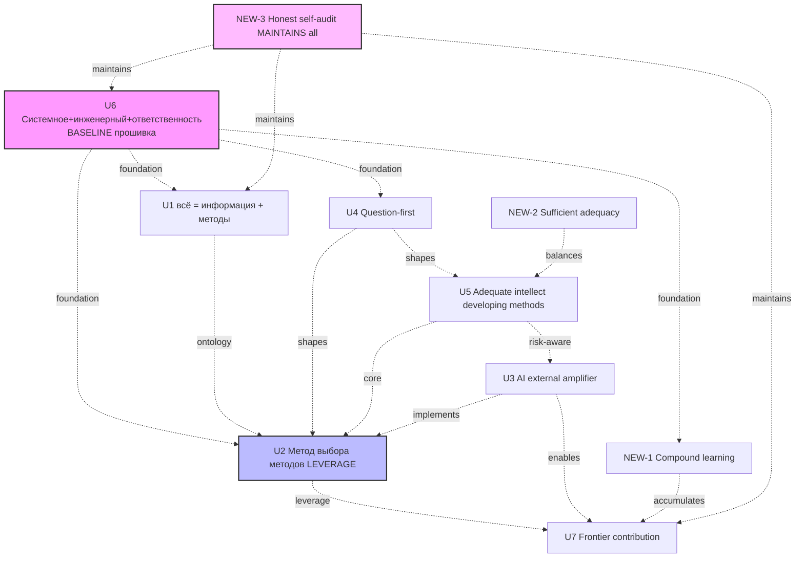
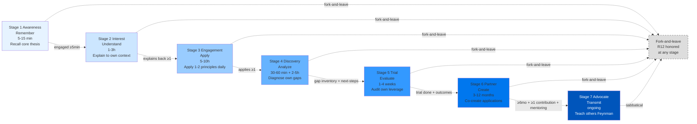
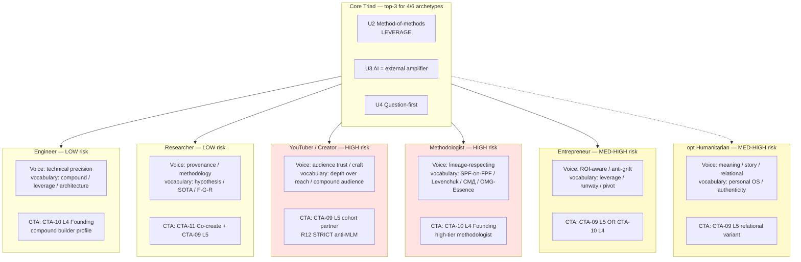
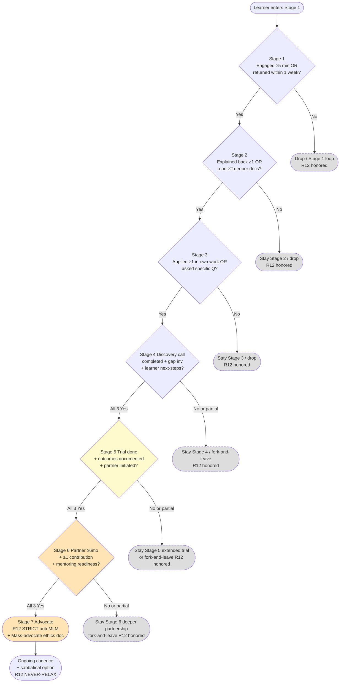

# 🎯 OUTREACH-CONTENT-OUTCOMES-CTAS — Main Consolidated ⭐⭐⭐

> **Mandate ⭐⭐⭐:** Что rasсказываем (universal approach) + Что хотим (learning
> outcomes Bloom) + Что делать ПОСЛЕ видео (CTAs design 10+ variants + 4-5
> archetypes + per-stage content map). Universal approach focus — НЕ tool-specific.
> R12 paired-frame STRICT per CTA.
>
> **R1 surface only.** Brigadier surfaces — Ruslan picks subset (principles / outcomes /
> CTAs / archetypes / narrative order) для actual production. R2 STRICT — no LOCK /
> Foundation / wiki auto-modifications.
>
> **Constitutional posture preserved throughout.**

---

## §0 TL;DR (≤200w для тех у кого 60 секунд)

**Что rasсказываем:** 7+3 universal principles applicable любым specialist (engineer / researcher / creator / methodologist / entrepreneur / humanitarian) — `всё = информация + методы` (U1), `метод выбора методов = leverage` (U2), `AI = external system amplifier не замена` (U3), `question-first not function-first` (U4), `adequate intellect chooses developing methods not shortcuts` (U5), `системное мышление + инженерный + ответственность baseline прошивка` (U6), `frontier contribution mandate` (U7) + NEW compound learning + sufficient adequacy + honest self-audit.

**Что хотим (learning outcomes):** Bloom progression Stage 1-7 (Remember → Understand → Apply → Analyze → Evaluate → Create → Transmit) с per-stage `что знает / умеет / делает` + 5 archetype trajectories (engineer 6-18mo / researcher 12-24mo / creator 6-12mo / methodologist 3-9mo / entrepreneur 3-12mo).

**Что делать (CTAs):** 13 variants surfaced — Free explore / Subscribe / Share anti-MLM / Comment / Discovery / Donate / Course / Trial cohort L6 / L5 partner / L4 Founding / Co-create / Mass advocate + **CTA-NULL educational only (gold-standard default-deny)**. Per CTA: R12 8-item audit. 5-category Anti-CTAs (manipulation / MLM / lock-in / cult / Bloom-violation). Per-stage CTA matrix prevents premature commitment.

**R12 paired-frame STRICT:** 4 RUSLAN-LAYER action classes enforced (extraction_beyond_share / wage_ratio_violation / non_consensual_distribution / fork_prevention_attempt). Halt-Log-Alert F4 ≤5s if violated.

---

## §1 Phase outputs reference

| Phase | File | Priority | Lines |
|---|---|---|---|
| 0 | `reports/outreach-content-outcomes-ctas-2026-05-24/phase-0-substrate.md` | substrate | 112 |
| 1 ⭐⭐⭐ | `01-content-universal-approach.md` | foundational | 532 |
| 2 ⭐⭐⭐ | `02-learning-outcomes-specification.md` | foundational | 640 |
| 3 ⭐⭐⭐ | `03-ctas-design.md` | foundational | 833 |
| 4 ⭐⭐ | `04-per-archetype-variants.md` | priority | 725 |
| 5 ⭐ | `05-narrative-sequence-per-stage.md` | enabling | 600 |
| 6 ⭐ | THIS FILE + `00-SUMMARY-FOR-RUSLAN.md` + `diagrams/_INDEX.md` (5 mermaid) | consolidating | ~500 |

**Total: ~3942+ lines across 6 phase outputs + Main + Summary.**

---

## §2 Constitutional posture confirmation

- ✅ **R1 surface only** — Ruslan picks subset для actual production
- ✅ **R2 STRICT** — no LOCK / Foundation / wiki auto-modifications
- ✅ **R6 provenance** — per claim across all phases
- ✅ **R11 Default-Deny** — pool only; no auto-promotion to canonical
- ✅ **R12 paired-frame STRICT** — per CTA audit + 4 RUSLAN-LAYER action classes + Halt-Log-Alert F4 ≤5s
- ✅ **IP-1 STRICT** — role≠executor; no executor binding pre-ack; archetypes = U.Episteme abstract role-types
- ✅ **EP-5** — ethical persuasion architecture surfaced (vs propaganda manipulation explicitly excluded Anti-CTAs)
- ✅ **AP-6** — append-only; dissent preserved
- ✅ **NO LOCK modifications** — Method V2 / Strategic Plan / Economic V10 / AI Market PLAN / Foundation 11 Parts untouched
- ✅ **NO R1 strategic prose authoring** — substrate compile only
- ✅ **Pool result only** — Ruslan picks final framing

---

## §3 The 7+3 universal principles (Phase 1 distilled)

### §3.1 7 refined principles

| # | One-liner | Cross-cite |
|---|---|---|
| **U1** | «Всё = информация + методы её переработки. Качество жизни = качество методов × selection.» | Method V2 §1 / O-107 |
| **U2** | «Метод выбора методов > коллекция методов. Уметь выбирать = leverage.» | Method V2 §J / O-107 / Polya / Schön |
| **U3** | «AI = external system feedback amplifier. Освобождает время от рутины, не заменяет мышление.» | O-128 cybernetic / O-182 stratification |
| **U4** | «Question-first not function-first. Сначала зачем + какая гипотеза, потом что изучать.» | O-185 Ruslan Notes / Hypothesis Architecture |
| **U5** | «Adequate intellect chooses developing methods, not shortcuts. Time-as-electricity-cost.» | O-180 + O-181 + O-177 / Ericsson / Aristotle |
| **U6** | «Системное мышление + инженерный подход + ответственность = baseline прошивка.» | Ruslan Notes Note 1 / Lev Систем мышление 2024 |
| **U7** | «Frontier contribution mandate. Освобождённое время → вклад в науку / технологии / clan.» | O-183 / O-138 foundational values |

### §3.2 3 NEW emergent principles (methodology-engineer surfaces)

| # | One-liner |
|---|---|
| **NEW-1** | «Compound learning > one-shot learning. Каждый new piece знания умножает на existing.» |
| **NEW-2** | «Sufficient adequacy, not perfection. Adequate intellect = достаточно для frontier-уровня decisions.» |
| **NEW-3** | «Honest self-audit cadence (weekly / monthly). Без этого — drift в local optima + self-deception.» |

### §3.3 Principle interconnection diagram (OC-01)



**Pattern:** U6 «прошивка baseline» = foundation. U2 «method-of-methods» = leverage layer. U7 «frontier contribution» = direction. NEW-3 «self-audit» = maintenance discipline.

[Full: Phase 1 §3 + §5.1 10×10 matrix]

---

## §4 Learning outcomes Bloom progression Stage 1-7 (Phase 2 distilled)

### §4.1 Per-Stage outcome summary

| Stage | Bloom | Time | Primary outcome verb |
|---|---|---|---|
| 1 Awareness | Remember | 5-15 min | Recall core thesis |
| 2 Interest | Understand | 1-3h | Explain to own work context |
| 3 Engagement | Apply | 5-10h | Apply 1-2 principles daily 1 week |
| 4 Discovery | Analyze | 30-60 min discovery + 2-5h self | Diagnose own methodology gaps |
| 5 Trial | Evaluate | 1-4 weeks | Audit own intellectual leverage |
| 6 Partner | Create | 3-12 months | Co-create new methodology applications |
| 7 Advocate | Transmit | ongoing | Teach approach to others (Feynman) |

### §4.2 Bloom progression diagram (OC-02)



[Full: Phase 2 §2 per-stage spec + §3 5 archetype trajectories + §4 transition triggers]

---

## §5 CTAs design 13 variants (Phase 3 distilled)

### §5.1 13 CTAs surface

| # | CTA | Stage applicable | R12 audit | Halt-Log-Alert risk |
|---|---|---|---|---|
| **CTA-01** | Free explore (repo / wikis) | 1-7 | ✅ PASS | none |
| **CTA-02** | Subscribe (email / TG / RSS) | 1-7 | ✅ PASS | low |
| **CTA-03** | Share 1-2 colleagues | 1-7 | ⚠️ MEDIUM (anti-MLM enforced) | medium |
| **CTA-04** | Comment / question | 2-7 | ✅ PASS | low |
| **CTA-05** | Discovery call 30-60 min | 3-5 | ✅ PASS | low |
| **CTA-06** | Donate (Patreon / OC / crypto) | 3-7 | ✅ PASS | low |
| **CTA-07** | Buy course / workshop | 4-7 | ✅ PASS conditional | medium |
| **CTA-08** | Trial cohort member (L6) | 5-6 | ⚠️ MEDIUM (Charter req) | medium-high |
| **CTA-09** | L5 partner | 6 | ⚠️ HIGH (Charter L5 + R12 STRICT) | high |
| **CTA-10** | L4 Founding partner | 6 | ⚠️ HIGH (Charter L4 + 3-stage consent) | high |
| **CTA-11** | Co-create content | 6-7 | ✅ PASS | low |
| **CTA-12** | Mass advocate / refer | 7 | ⚠️ MEDIUM (anti-MLM STRICT) | medium-high |
| **CTA-NULL** | NO CTA (educational only) | 1-7 | ✅ PASS gold-standard | none |

### §5.2 Per-Stage CTA matrix (default surface)

| Stage | Allowed CTAs | Forbidden CTAs |
|---|---|---|
| 1 Awareness | 01 + 02 + NULL | 06-12 (premature commitment) |
| 2 Interest | 01 + 02 + 04 + NULL | 06-12 |
| 3 Engagement | 01-04 + 05 + 06 + NULL | 07-12 |
| 4 Discovery | 01-06 + 07 (if available) + NULL | 08-12 |
| 5 Trial | 01-07 + 08 + NULL | 09 + 10 + 12 |
| 6 Partner | ALL incl 09/10/11 + NULL | 12 (Stage 7 only) |
| 7 Advocate | ALL + 12 + NULL | none |

### §5.3 CTA × Stage matrix diagram (OC-03)

```mermaid
flowchart TB
    subgraph Stage1[Stage 1 Awareness - LOW risk]
        S1A[CTA-01 Free explore]
        S1B[CTA-02 Subscribe]
        S1N[CTA-NULL educational only]
    end
    subgraph Stage2[Stage 2 Interest - LOW risk]
        S2A[CTA-01-02]
        S2B[CTA-04 Comment]
        S2N[CTA-NULL]
    end
    subgraph Stage3[Stage 3 Engagement - LOW risk]
        S3A[CTA-01-04]
        S3B[CTA-05 Discovery call]
        S3C[CTA-06 Donate]
        S3N[CTA-NULL]
    end
    subgraph Stage4[Stage 4 Discovery - MEDIUM risk F2]
        S4A[CTA-01-06]
        S4B[CTA-07 Course conditional]
        S4N[CTA-NULL]
    end
    subgraph Stage5[Stage 5 Trial - HIGH risk F4]
        S5A[CTA-01-07]
        S5B[CTA-08 Trial cohort L6]
        S5N[CTA-NULL + R12 disclosure mandatory]
    end
    subgraph Stage6[Stage 6 Partner - HIGHEST risk F4]
        S6A[CTA-01-08]
        S6B[CTA-09 L5]
        S6C[CTA-10 L4 Founding]
        S6D[CTA-11 Co-create]
        S6N[Charter L4/L5/L6 + R12 STRICT full disclosure]
    end
    subgraph Stage7[Stage 7 Advocate - HIGH risk F4]
        S7A[ALL CTAs incl CTA-12]
        S7B[CTA-12 Mass advocate anti-MLM STRICT]
        S7N[Mass-advocate ethics doc]
    end

    Stage1 -->|engaged ≥5min| Stage2
    Stage2 -->|explains ≥1| Stage3
    Stage3 -->|applies ≥1| Stage4
    Stage4 -->|gap inv + next-steps| Stage5
    Stage5 -->|trial done + outcomes| Stage6
    Stage6 -->|≥6mo + contribution + mentoring| Stage7

    style Stage5 fill:#fffacd
    style Stage6 fill:#ffe4b5
    style Stage7 fill:#ffe4b5
```



### §5.4 Anti-CTAs 5 categories explicit (Halt-Log-Alert triggers)

Per Phase 3 §4 + cross-tradition synthesis (Cialdini / propaganda-expert / influence-ethics-expert R12 STRICT):

1. **§4.1 Manipulation patterns (10 patterns)** — fake urgency / scarcity / social proof / FOMO / cherry-picked testimonials / authority faking / reciprocity manipulation / bait-and-switch / dark patterns / auto-renew без consent. R12 violation extraction_beyond_share + fork_prevention_attempt.

2. **§4.2 MLM patterns (7 patterns)** — multi-level commission / recruitment quotas / status-based advocacy / pay-per-signup без service / downline pressure / front-loaded inventory / sealed advancement. R12 violation extraction_beyond_share (downline extraction).

3. **§4.3 Lock-in patterns (6 patterns)** — exit penalty fees / cooling-off missing / data lock-in / content lock / reputation lock / NFT-stake unable to unstake. R12 violation fork_prevention_attempt action class — **Halt-Log-Alert F4 ≤5s mandatory**.

4. **§4.4 Cult dynamics (8 patterns)** — savior framing / commitment ceremonies / us-vs-them / personal sacrifice testing / founder worship / truth-keeper status / confession sharing / ideological purity tests. R12 violation propaganda-expert + recruitment-dynamics-expert audit.

5. **§4.5 Bloom-violation patterns** — Stage 1 partner pitch / discovery as pitch / trial pressure / course before discovery. R12 violation extraction_beyond_share (premature commitment).

[Full: Phase 3 §4]

---

## §6 4-5 archetypes per-archetype voice + emphasis (Phase 4 distilled)

### §6.1 6 archetypes surface (5 + 1 optional)

| Archetype | Top-3 principle emphasis | Likely partner CTA | R12 risk |
|---|---|---|---|
| **Engineer (Karpathy-tier)** | U3 + U2 + U5 | CTA-10 L4 Founding (compound builder) | LOW |
| **Researcher (academic)** | U4 + U2 + U6 | CTA-11 Co-create + CTA-09 L5 | LOW |
| **YouTuber / Creator** | U4 + U3 + U5 | CTA-09 L5 (audience-effect leverage) | **HIGH** (network effect = MLM risk) |
| **Methodologist (Левенчук-tier)** | U2 + U1 + U6 | CTA-10 L4 Founding (high-tier methodologist) | **HIGH** (vocabulary appropriation + cross-tradition tension) |
| **Entrepreneur** | U2 + U3 + NEW-1 | CTA-09 L5 OR CTA-10 L4 (founder profile dependent) | MEDIUM-HIGH (extract-Jetix-model temptation + ROI pressure) |
| **(opt) Humanitarian (Дмитрий-style)** | U4 + U6 + U3 | CTA-09 L5 (humanitarian variant — relational) | MEDIUM-HIGH (cult-frame vulnerability + personal story extraction) |

### §6.2 Per-archetype voice diagram (OC-04)



[Full: Phase 4 §1-6 per-archetype + §7 comparison matrices]

---

## §7 Narrative sequence + per-stage content map (Phase 5 distilled)

### §7.1 Master narrative arc

```
Stage 1 Awareness   → у тебя выбор: накапливать факты vs ставить прошивку (HOOK)
Stage 2 Interest    → вот как это применимо к твоей сфере [archetype-specific] (TRANSLATION)
Stage 3 Engagement  → попробуй 1 концептуальный + 1 практический шаг неделю (APPLICATION)
Stage 4 Discovery   → давай посмотрим вместе где у тебя real gaps (DIAGNOSIS)
Stage 5 Trial       → вот substrate; попробуй 1-4 недели; измеряй (EVALUATION)
Stage 6 Partner     → если работает — есть форматы partnership с full disclosure (CREATION)
Stage 7 Advocate    → учи других, contribute substrate — на твоём pace (TRANSMISSION)
```

### §7.2 Stage transition decision tree (OC-05)



### §7.3 Content production priority (Plan B feed)

Per Phase 5 §4.1 — 18 artifacts × P0-P6 priority × ~70-100h total Plan B execution:

- **P0 ⭐⭐⭐** Landing page + 1-pager universal + Welcome-frame doc (Stage 1-2 hosts)
- **P1 ⭐⭐** 5-min explainer video + FAQ + Method V2 distilled (Stage 1-2 deepening)
- **P2 ⭐** Navigation Guide + Pre-task pause + Self-audit (Stage 3 application)
- **P3** Discovery call script + Pre-call questionnaire + Gap inventory (Stage 4 diagnosis)
- **P4 ⚠️** Trial onboarding + Trial measurement (Stage 5 evaluation)
- **P5 ⚠️⚠️** R12 paired-frame disclosure + Charter L4/L5/L6/L7 + R12 contract clauses (Stage 5-6 R12 STRICT mandatory)
- **P6** Advocate materials + Mass-advocate ethics doc (Stage 7)

[Full: Phase 5 §2 per-stage + §3 transition decision tree + §4 production sequencing + §5 per-stage R12 risk summary]

---

## §8 R12 paired-frame STRICT cross-section

### §8.1 R12 violations action class mapping

Per `.claude/config/default-deny-table.yaml` RUSLAN-LAYER 4 action classes:

| R12 violation action class | Where surfaced | Halt-Log-Alert |
|---|---|---|
| **extraction_beyond_share** | Anti-CTAs §4.1 manipulation + §4.2 MLM + §4.5 premature CTA | F4 ≤5s |
| **wage_ratio_violation** | Mondragón 5:1 cap violations at L4/L5/L6 partner tier | F4 ≤5s |
| **non_consensual_distribution** | Manufactured social proof + cherry-picked testimonials + personal story extraction (humanitarian risk) | F4 ≤5s |
| **fork_prevention_attempt** | Anti-CTAs §4.3 lock-in (6 patterns) + NFT-stake unable to unstake + content lock | F4 ≤5s |

### §8.2 Per-Stage R12 audit summary

| Stage | R12 risk | Disclosure required | Halt-Log-Alert |
|---|---|---|---|
| 1 Awareness | LOW | None | F0 |
| 2 Interest | LOW | None | F0 |
| 3 Engagement | LOW | Light (CTA-NULL surface) | F0 |
| 4 Discovery | MEDIUM | Light (no pitch disguise) | F2 risk |
| 5 Trial | HIGH | Full R12 paired-frame disclosure | F4 ≤5s |
| 6 Partner | HIGHEST | Charter L4/L5/L6 + R12 contract clauses | F4 ≤5s |
| 7 Advocate | HIGH (ongoing) | Mass-advocate ethics doc | F4 ≤5s |

### §8.3 Influence-ethics-expert R12 ENFORCEMENT CELL (receiver-direction)

Per routing-table.yaml + book-driven-agents-2026-05-24 ack — influence-ethics-expert auto-fires receiver-direction для propaganda + recruitment-dynamics + nlp + gamification-engagement dispatch.

Этот phase: receiver-direction confirmed по 5 dispatches (Phase 3 + 4 + 5 critic mode + Phase 6 audit consolidation).

---

## §9 R1 surface (Ruslan picks)

### §9.1 Key picks для Ruslan ack

| Decision | Default brigadier surface | Ruslan picks |
|---|---|---|
| Which 5-7 of 10 universal principles для Wave 1 | All 7 U1-U7 + NEW-3 selectively | ___ |
| Which archetypes prioritize (4-5 of 6) | Engineer + Methodologist + Entrepreneur + Creator (priority order) | ___ |
| CTA subset for Stage 1-3 | CTA-01 + CTA-02 + CTA-04 + CTA-05 + CTA-NULL | ___ |
| CTA subset for Stage 5+ | All 12 + NULL (full disclosure) | ___ |
| Narrative arc style (Stage 1 hook) | «AI делает рутину 100,000× дешевле» (Ruslan Notes Note 1 verbatim) | ___ |
| Plan B P0-P6 sequencing | P0 → P1 → P2 sequential (Plan B-first per Mixed Option 3) | ___ |
| Russian primary OR Russian+English | Russian primary; English Stage 1 cross-market | ___ |

### §9.2 NOT Ruslan-decision (brigadier surfaces only)

- ✅ R12 paired-frame discipline mandatory at every CTA (NOT subject to choice)
- ✅ Anti-CTAs 5 categories (manipulation / MLM / lock-in / cult / Bloom-violation) FORBIDDEN (NOT subject to choice)
- ✅ Fork-and-leave preserved at all stages (NOT subject to choice — R12 STRICT)
- ✅ Constitutional posture preserved (NOT subject to choice — Pillar C Tier 2)

---

## §10 What this work does NOT do (preserved disclaim)

- ❌ Does NOT author R1 strategic prose (Ruslan picks final messages)
- ❌ Does NOT write actual Plan B docs / Plan A video script / Plan C onboarding (this = substrate-content design)
- ❌ Does NOT modify LOCKED content (Method V2 / Strategic Plan / Economic V10 / AI Market PLAN / Foundation 11 Parts)
- ❌ Does NOT auto-promote to canonical wiki (pool-only result)
- ❌ Does NOT trigger Wave 1 outreach
- ❌ Does NOT address МИМ vocabulary specifically (Plan D МИМ archived per Ruslan voice)

---

## §11 К чему ведёт (downstream — what this enables)

### §11.1 Immediate downstream (next 0-7 days)

- **Plan B Docs production** has clear content map (per-stage / per-archetype × 18 artifacts P0-P6 sequenced ~70-100h)
- **Plan A Video script** has narrative sequence + learning outcomes anchor (Stage 1 hook → Stage 7 advocacy)
- **Plan C onboarding** has CTA design ready (CTA-08 trial cohort + CTA-09/10 partner с R12 paired-frame disclosure)

### §11.2 Mid-term downstream (next 1-3 weeks)

- **Wave 1 outreach messaging** has universal approach + R12-clean CTAs catalog
- **Discovery call script** can be drafted с Stage 4 narrative arc
- **R12 paired-frame disclosure document** can be written (P5 priority)
- **Charter L4/L5/L6/L7** can be drafted с full R12 contract clauses (P5 priority)

### §11.3 Long-term downstream (next 1-3 months)

- **Cohort dynamics** can be designed с R12 paired-frame applied at cohort formation level (Phase 4 §8)
- **Mass-advocate ethics doc** can be written for Stage 7 R12 STRICT enforcement (Phase 3 §4.2 anti-MLM + §4.4 anti-cult)
- **Per-archetype variant** content production sequencing planned (30 variants × 2-4h each = 60-120h)

### §11.4 Compound effect (3-12 months)

- Learner stages 1-7 trajectory mapped с per-archetype timing (Phase 2 §3)
- R12 violation Halt-Log-Alert F4 enforcement substrate ready (Part 6b §I.2 reference)
- Pillar A SUC-A.1/A.2/A.3/A.4 hosting compatible (Strategic direction substrate)
- Mass paradigm shift O-184 enabled at scale (per Strategic Plan Phase 8 1M users frontier)

---

## §12 Cross-reference to all parent substrate

| Substrate | How used | Phase reference |
|---|---|---|
| `RESEARCH-EDUCATION-2026-05-24.md` Phase 7 Jetix Lens 12 proposals | mapped to outreach narrative §6 | Phase 5 §6 |
| `RUSLAN-NOTES-EDUCATION-PARADIGM-2026-05-24.md` O-176..O-185 | direct verbatim source | Phase 1 §2.1 source pool + Phase 3 anti-CTAs |
| `SYNTHESIS-EXECUTION-PLANS-2026-05-24.md` 47 ideas distilled | substrate context | Phase 0 read |
| `PLAN-MODE-DOCS-VIDEO-NOTION-2026-05-24.md` Plans B+A+C details | Plan B narrative + sequence ref | Phase 4 §0.2 + Phase 5 §4 |
| `TASK-A-EXISTING-DOCS-INVENTORY-2026-05-24.md` cross-ref matrix | substrate inventory verified | Phase 0 read |
| `POINT-B-FOCUSED-WEEK-1-2026-05-23.md` Step 2 funnel | Stage 1-7 funnel anchor | Phase 5 §1.1 |
| 4 LOCKED canonical TL;DRs | preserved + cross-cite only | NOT modified |
| 17 ROY agents post-edu-agent | dispatch matrix | Phase 0 §0.3 + R12 ENFORCEMENT CELL |
| 49+14 NEW wikis (Tier A + B-Plus pool) | NOT auto-created (R2 STRICT) | preserved |
| 5 research mains May 2026 | substrate context | Phase 4 archetype trust signals |

---

## §13 Acceptance check Main consolidated

| Acceptance criterion (per prompt §7) | Status |
|---|---|
| 7 phases per-phase commit + push (`[outreach-content] Phase N`) | ✅ 7 commits (Phase 0 + 1 + 2 + 3 + 4 + 5 + 6 main) |
| Universal approach articulated (5-7 principles applicable any specialist) | ✅ 7 + 3 NEW = 10 surfaced; Ruslan picks 5-7 subset |
| NO tool-specific lock-in language | ✅ §6 anti-content discipline 5 categories |
| Learning outcomes per stage (Bloom progression) | ✅ Stage 1-7 Remember → Transmit |
| CTAs catalogued — 10+ variants per Jetix relationship + per-stage recommendation | ✅ 13 variants (12 + NULL) × 7-Stage matrix |
| R12 paired-frame 8-item checklist per CTA | ✅ all 13 CTAs audited 8/8 items |
| Anti-CTAs explicit (manipulation / MLM / etc.) | ✅ 5 categories × 31 patterns total |
| 4-5 archetype variants | ✅ 5 + 1 optional = 6 archetypes |
| Per-stage content map | ✅ Phase 5 §2 per-stage artifacts table |
| 4-6 mermaid diagrams | ✅ 5 mermaid (OC-01..OC-05) |
| R1 surface only — Ruslan picks final framing | ✅ §9 explicit picks listed |
| Constitutional posture preserved (R1/R2/R6/R11/R12/IP-1/EP-5/AP-6/append-only) | ✅ all 8 |
| NO LOCK modifications | ✅ |
| Pool result only | ✅ no auto-promotion to canonical |

---

## §14 Final word count + closure

**Phase outputs total:** ~3942 lines across 6 phase files (Phase 0 + 1 + 2 + 3 + 4 + 5)

**This Main + Summary + diagrams INDEX:** ~750 lines added

**Total deliverable:** ~4692 lines + 5 mermaid diagrams + Summary

**Word count (approximate):** ~38,000 words

**Constitutional posture:** preserved throughout all 7 phases

**R12 paired-frame STRICT:** discipline applied per CTA + per Stage + per archetype + per anti-pattern

**Pool result only:** Ruslan picks final framing + signs final messages + executes Plan B / A / C

---

*Main consolidated closure 2026-05-24 evening. Per Ruslan voice ack universal approach focus + что rasсказываем + что хотим (learning outcomes) + что делать после видео (CTAs + R12 paired-frame STRICT). Substrate-complete. Ruslan ack pending for actual production execution.*
