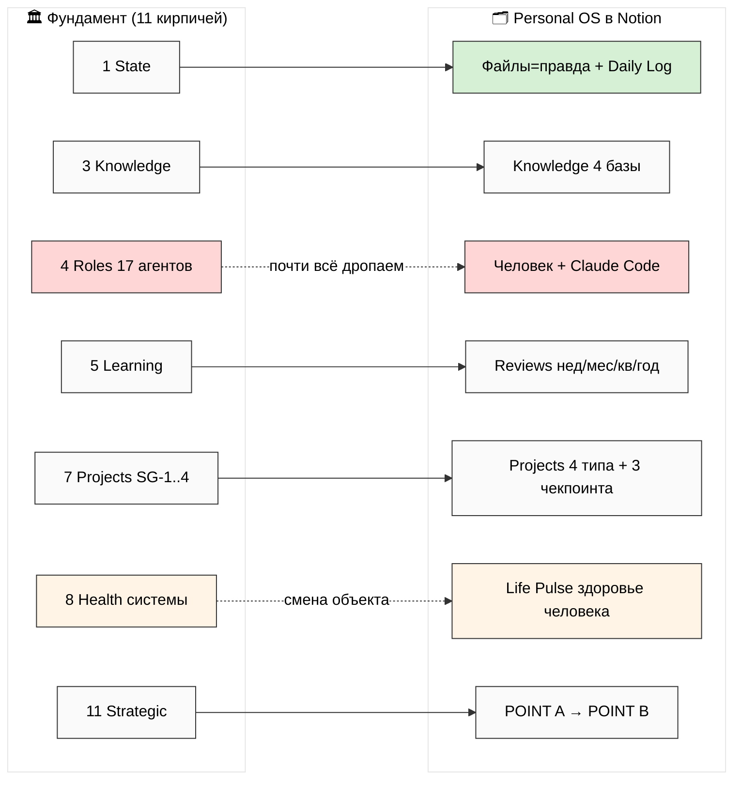
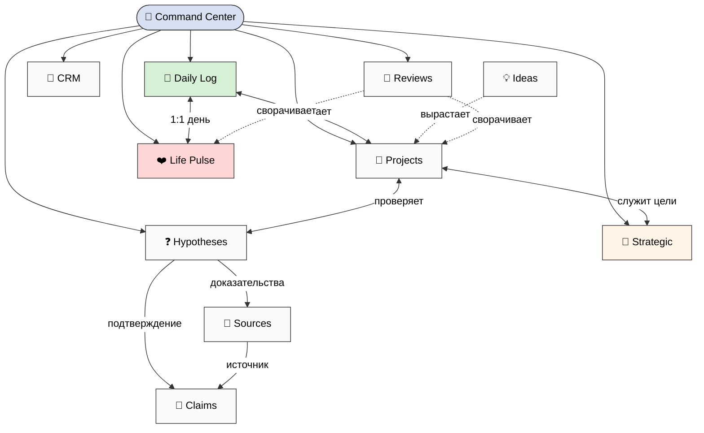
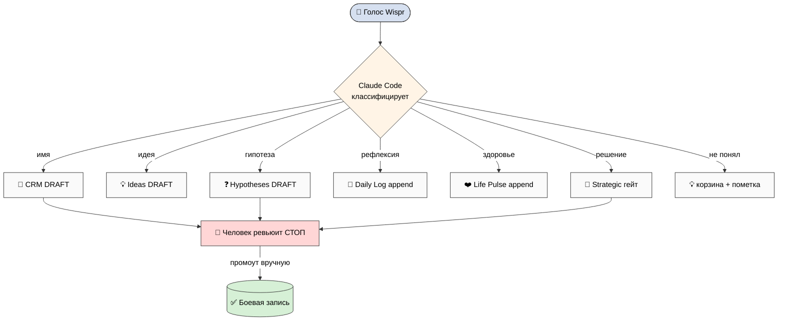
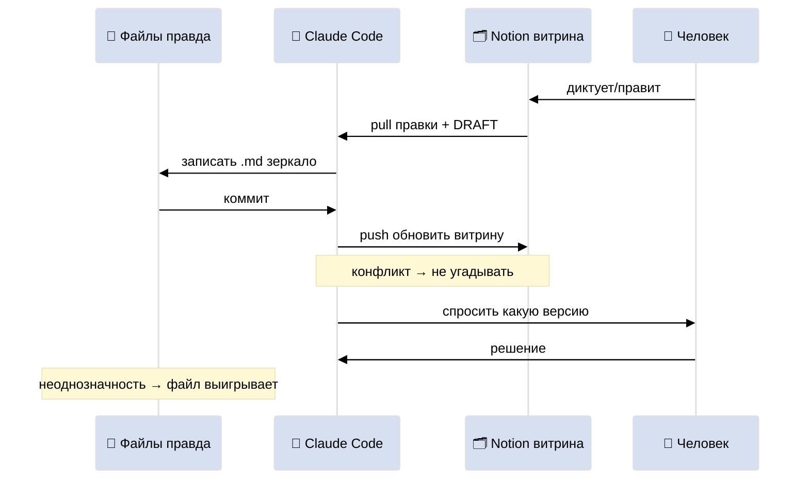
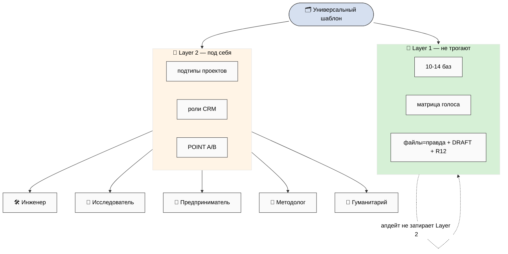
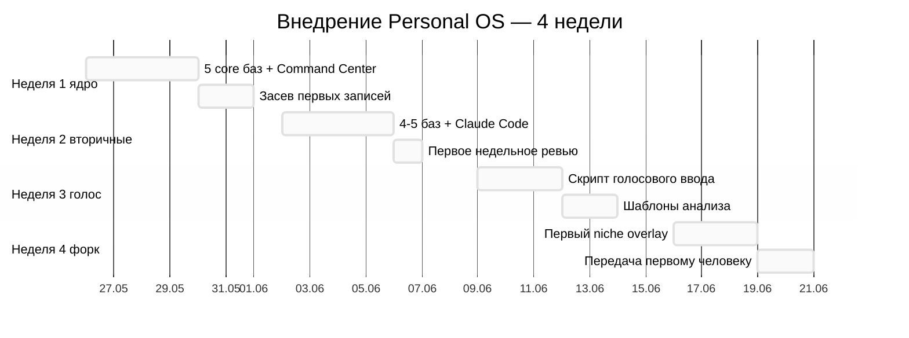
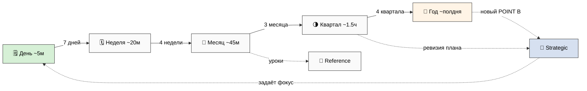

# 🗂️ Personal OS в Notion — на пальцах

> **Что это.** План универсального Notion-шаблона, который превращает большую систему
> Jetix (11 кирпичей фундамента + философию) в **лёгкую личную версию для повседневной
> жизни**. Голосом надиктовал — разложилось по базам. Раз в неделю/месяц — готовый
> шаблон ревью. Claude Code подключён как помощник. И главное — **любой человек может
> скопировать его к себе за час и настроить под свою нишу**.
>
> **Это план, а не готовый продукт.** Я ничего не создаю в Notion и не зову API — я
> проектирую. Финальные решения (сколько баз, какие ниши, в каком порядке строить) —
> за тобой. Это пул вариантов, не приказ.

---

## §0 Если есть 90 секунд (TL;DR)

- **Что строим:** облегчённую Notion-версию Jetix для ежедневной жизни. Файлы на диске
  = правда, Notion = красивая витрина + голосовой ввод + подключённый Claude Code.
- **Сколько баз:** 8 (lite) / 11 (стандарт) / 14 (full) — на выбор. Ядро: Daily Log,
  Projects, Hypotheses («что хочу узнать»), CRM, Reviews, Strategic, Life Pulse, Knowledge.
- **Голос:** диктуешь на ходу → Claude Code раскладывает по базам как **черновики** →
  утром/вечером смотришь и подтверждаешь. Никогда не перезаписывает само.
- **Ревью:** 8 готовых шаблонов — день / неделя / месяц / квартал / год / проект /
  гипотеза / звонок. Бери и заполняй, Claude Code подтягивает цифры.
- **Fork-friendly:** два слоя — универсальный фундамент (не трогают) + надстройка под
  нишу (под себя). 5 примеров ниш: инженер / исследователь / предприниматель /
  методолог / гуманитарий. Форк за 30-60 минут.
- **Этика встроена:** твои данные — твои, уйти можно в любой момент со всем, никаких
  замков. Голос → только черновик. Claude Code предлагает, решаешь ты.
- **Порядок:** Неделя 1 — 5 баз + хаб. Неделя 2 — вторичные базы + первое ревью.
  Неделя 3 — голос. Неделя 4 — первый форк (Дмитрий?).

---

## §1 🎯 Главная мысль в одной строке

**Большая система Jetix умеет всё, но она тяжёлая — спроектирована для роя из 17
агентов. Personal OS — это её лёгкая версия для одного человека: то, что в большой
системе делают агенты и протоколы, тут делаешь ты сам руками + Claude Code как один
помощник. Берём из фундамента только то, что реально помогает жить и работать, а
тяжёлую машинерию выкидываем. И делаем так, чтобы это мог взять любой — не только
Руслан.**

Это и есть proof point из голоса 24.05: «философия работает на personal level». Если
наш фундамент можно ужать в красивый личный шаблон, которым легко пользоваться каждый
день — значит он не просто красивая теория.

---

## §2 📌 Что такое Personal OS — простыми словами

Представь три вещи:

1. **Сейф (файлы на диске).** Тут лежит правда. Markdown-файлы, которые читаются чем
   угодно, лежат в git с историей всех версий, и никуда не денутся, даже если Notion
   завтра закроется или подорожает.
2. **Витрина (Notion).** Красивая, удобная для глаз и телефона. Сюда удобно надиктовать
   голосом, оставить комментарий, посмотреть дашборд. Но это **отражение сейфа**, не
   сам сейф. Если витрина и сейф разошлись — прав сейф.
3. **Помощник (Claude Code).** Читает витрину, предлагает записи, подтягивает цифры в
   ревью, держит сейф и витрину синхронными. Но **ничего не решает сам** — предлагает,
   ты подтверждаешь.

Personal OS = эти три вещи, настроенные так, чтобы:
- голосом надиктовал — разложилось по правильным местам (как черновики);
- раз в период — готовый шаблон анализа, не надо придумывать вопросы;
- всё видно с одной страницы (Command Center);
- любой человек мог скопировать и настроить под себя.

**Почему именно Notion, а не сразу платформа.** Это тактика «Notion-bypass»: не строить
полноценную платформу до того, как первый человек получит рабочий инструмент. Notion-
шаблон = MVP, который можно отдать Дмитрию уже сейчас, получить фидбэк, и только потом
(если надо) строить платформу. [подробнее — §14, Notion-bypass pattern]

---

## §3 🧱 11 кирпичей фундамента — что переживает упрощение

Большая система стоит на 11 «кирпичах» + конституции из 12 правил. При переводе в
лёгкую версию каждый кирпич раскладываю на три части: **что остаётся** (без этого
система — свалка), **что выбрасываем** (нужно только для роя агентов), **что упрощаем**.

См. схему **NT-1** (§12). А вот суть по каждому кирпичу на человеческом:

| Кирпич | Что от него остаётся в личной версии |
|---|---|
| **1. Хранение состояния** | Файлы = правда. Frontmatter (шапка) обязателен. Логи дописываем, не стираем. |
| **2. Приём входящего** | Голос → только черновик. Единая точка входа. |
| **3. Знания** | 4 базы: понятия / источники / проверенные факты / гипотезы. |
| **4. Роли (17 агентов)** | **Почти всё выбрасываем** — нет агентов, есть человек + Claude Code. |
| **5. Обучение на себе** | Ревью: неделя / месяц / квартал / год. |
| **6. Источники + подтверждение** | У важного факта есть источник + поле «уверенность». Человек подтверждает важное. |
| **7. Проекты** | 4 типа + 3 чекпоинта (вместо 4 строгих гейтов) + детект застрявших. |
| **8. Здоровье системы** | **Меняем объект:** мониторим не систему, а человека (Life Pulse). |
| **9. Точка входа** | Command Center — одна страница-хаб. |
| **10. Внешний мир** | CRM (люди + организации), наследуется почти как есть. |
| **11. Направление** | POINT A (где я) → POINT B (куда хочу). Стратегию пишет человек. |
| **C. Конституция (12 правил)** | 5 правил выживают (см. ниже), 7 про агентов — неактуальны. |

**Самый интересный переход — кирпич 8.** В большой системе это мониторинг здоровья
СИСТЕМЫ (метрики, алерты). В личной версии меняется сам объект: следим за здоровьем
ЧЕЛОВЕКА — энергия, сон, отношения, деньги. Выгорание = «нарушение целостности» на
личном уровне. Красиво, что машинный мониторинг превращается в заботу о себе.

**Самый облегчённый кирпич — 4 (роли).** Это главное место, где личное ≠ компанейское.
Большая система — про координацию 17 агентов через протокол. Личная — про одного
человека. Тащить сюда роевой протокол = утопить шаблон. Поэтому почти всё убираем.

**5 правил конституции, которые остаются** (короткая памятка Personal OS):
1. **Стратегию и цели пишешь ты** — Claude Code только предлагает варианты.
2. **Claude Code по умолчанию НЕ делает действий сам** — предлагает, ты подтверждаешь.
3. **Голос → только черновик**, не перезаписывает боевые записи.
4. **Файлы = твоя правда**, ты владеешь данными, уйти можно в любой момент.
5. **Ключи API только в `.env`**, никогда в Notion.

*Детально по каждому кирпичу — `reports/personal-os-notion-template-plan-2026-05-24/01-foundation-lighter-mapping.md`*

---

## §4 🗂️ Базы данных — обзор структуры

Из кирпичей собираем конкретные базы. Полный пул — 14 баз-кандидатов. Но не обязательно
все: есть три варианта сборки.

См. схему **NT-2** (§12) — как базы связаны и где Command Center.

### Три варианта (это твоё решение)

| Вариант | Баз | Кому | Главный трейдофф |
|---|---|---|---|
| **LITE** | 8 | новичкам, гуманитариям | проще форкать, но задачи теряются внутри проектов, знания в одной перегруженной базе |
| **STANDARD** | 11 | Руслану, опытным | золотая середина: чистые связи, но надо привыкнуть к навигации |
| **FULL** | 14 | инженерам, методологам | максимум контроля, но риск over-engineering для одного человека |

**LITE** сливает: Projects+Tasks, всю Knowledge в одну базу, CRM People+Orgs.
**STANDARD** разделяет основное, но без Tasks-как-базы и Concepts на старте.
**FULL** — всё раздельно.

### Ядро (есть во всех вариантах)

- 📅 **Daily Log** — дневник, главный голосовой ввод, append-only.
- 🚀 **Projects** — проекты: 4 типа (consulting/research/product/bets) + 3 чекпоинта.
- ❓ **Hypotheses** — «что хочу узнать». Прямой запрос Руслана. Сердце познания.
- 🤝 **CRM** — люди и организации (24 роли, 13 статусов, история касаний).
- 🔄 **Reviews** — ревью недели/месяца/квартала/года в одной базе.
- 🧭 **Strategic** — POINT A → POINT B + план + очередь решений.
- ❤️ **Life Pulse** — энергия/сон/здоровье/отношения/деньги.
- 📚 **Knowledge** — источники / проверенные факты / понятия.

### Что уже есть в Notion (не строим с нуля)

У Руслана уже работают 8 страниц. 6 из них напрямую переходят в новый шаблон (Command
Center, Daily Log, Projects, Банк идей, Life OS → Life Pulse, Research Hub → Knowledge),
2 растворяются в более общих базах (Журнал чатов, ICP). Так что это **реорганизация
существующего**, а не стройка на пустыре.

*Детально — `02-top-level-structure.md`*

---

## §5 📝 Что в каждой базе (коротко)

Полная схема каждой базы (поля с типами, виды, связи) — в Phase 3. Здесь — суть на
человеческом.

- **📅 Daily Log.** День = одна запись. Утреннее намерение, записи дня (дописываются, в
  т.ч. голосом), вечерняя рефлексия, благодарность, пульс дня, триггер на завтра.
  Связан с проектами/людьми/гипотезами, которых касался сегодня. 16 полей, 4 вида
  (сегодня / неделя / черновики на разбор / дайджест).

- **🚀 Projects.** Тип + приоритет + статус + чекпоинт (старт → в-работе → готово/архив)
  + владелец + коллабораторы + связанные гипотезы. Формула «застрял?»: активный проект
  без касания >14 дней всплывает красным. 19 полей.

- **❓ Hypotheses.** Гипотеза одной фальсифицируемой фразой + «как пойму, что
  подтвердилась» + «что докажет, что неверна» + метод проверки + бюджет времени.
  Связана с проектами (где проверяю), источниками (доказательства), фактами (что
  подтвердилось). 14 полей.

- **📖 Sources / 🔬 Claims.** Источники — книги/статьи/видео/подкасты со статусом
  (упомянул/в очереди/читаю/прочитал) и главными выводами. Claims — проверенные
  утверждения с источником и полем «уверенность» (низкая/средняя/высокая — это
  облегчённая версия формального рейтинга).

- **🤝 CRM People/Orgs.** Наследует существующий `crm/`: 24 роли в 6 группах, 13
  статусов pipeline, история касаний (append-only), детект застрявших контактов, поля
  «что предлагаю / что прошу».

- **🔄 Reviews.** Одна база, поле type (week/month/quarter/year/project). Победы /
  трение / закрытые гипотезы / динамика пульса / стратегическая сверка / уроки.

- **🧭 Strategic.** 4 типа записи: POINT A (где я) / POINT B (куда хочу) / план периода
  / решение. Прозу пишет человек (Claude Code только предзаполняет данные).

- **❤️ Life Pulse.** Ежедневный мини-замер: энергия, сон (часы + качество), настроение,
  здоровье, отношения, финансовый пульс, движение. Вид «красные зоны» ловит ранние
  сигналы выгорания.

- **💡 Ideas Bank.** Идеи с уровнем зрелости (Tier C сырая → A зрелая). Промоутятся в
  проекты или гипотезы.

**Дисциплина зеркала.** Каждая строка любой базы = один `.md` файл на диске. Свойства
Notion = поля в YAML-шапке. При конфликте — прав файл. Это защита от vendor lock-in.

*Детально — `03-per-database-schema.md`*

---

## §6 🎤 Голосовой ввод — что куда автоматически

Руслан диктует на ходу. Надо, чтобы заметка разложилась по базам — но **как черновики**,
никогда не перезаписывая боевые записи.

См. схему **NT-3** (§12).

### Поток одной заметки

Голос (Wispr Flow → текст) → Claude Code классифицирует → создаёт черновики в нужных
базах (с флагом «черновик») → пишет сводку → **СТОП** → утром/вечером смотришь и
подтверждаешь.

### Что куда (фрагмент матрицы — всего 14 типов)

| Сказал | Куда | Режим |
|---|---|---|
| упомянул человека | CRM → черновик | ждёт ревью |
| «идея:» | Ideas Bank Tier C → черновик | ждёт ревью |
| «гипотеза / хочу проверить» | Hypotheses → черновик | ждёт ревью |
| рефлексия «сегодня было» | Daily Log → дозапись | авто (безопасно) |
| «энергия / спал / настроение» | Life Pulse → дозапись | авто (безопасно) |
| «решил / выбираю» | Strategic → решение | высокий гейт (только руками) |
| «читаю / смотрел книгу X» | Sources → черновик | ждёт ревью |
| «нужно / напомни» | Tasks → черновик | ждёт ревью |

### Три режима — почему не всё одинаково

- **Авто-дозапись** (рефлексия, пульс) — безопасно, потому что только добавляет в твой
  же дневник, ничего не теряя.
- **Черновик** (человек, гипотеза, источник) — влияет на боевые данные → нужен глаз.
- **Высокий гейт** (решение, смена курса) — максимальная осторожность, только руками.

### При сомнении — не угадывать

Если Claude Code не уверен, куда отнести — кладёт в «корзину» (Ideas Bank) + помечает
«нужна классификация». Никогда не терять заметку, но и не угадывать молча.

*Детально — `04-voice-intake-routing.md`*

---

## §7 🔄 Анализ недели/месяца/квартала/года — готовые шаблоны

Руслан просил «шаблон анализа недели + месяца». Сделал 8 готовых шаблонов. Каждый — с
полным списком вопросов; Claude Code предзаполняет цифры (что было за период), ты
отвечаешь на «почему» и «что дальше».

См. схему **NT-7** (§12) — каскад день → год.

| Шаблон | Когда | Время | Суть |
|---|---|---|---|
| 🗒️ День | ежедневно | ~5 мин | намерение / записи / рефлексия / благодарность / пульс / триггер на завтра |
| 🗓️ Неделя | вс вечером | ~20 мин | топ-5 побед / гипотезы / трение / скорость проектов / топ-3 на след. неделю |
| 📆 Месяц | конец мес. | ~45 мин | скорость по 4 типам / закрытие гипотез / финансы / здоровье / паттерны |
| 🌗 Квартал | раз в 3 мес | ~1.5 ч | сдвиги / прогресс к POINT B / аудит отношений / ревизия плана |
| 🎇 Год | конец года | ~полдня | кем стал / победы-провалы / ценности / новый POINT B (пишет человек) |
| 🚀 Проект | кварт. | ~30 мин | чекпоинт / блокеры / связанные гипотезы / продолжать-убить-пивот |
| ❓ Гипотеза | при создании | ~15 мин | фальсифицируемость / как проверю / бюджет / уверенность |
| 📞 Звонок | перед звонком | ~15 мин | этический чек 8 пунктов + 7 вопросов подготовки |

**Каскад.** День сворачивается в неделю, неделя в месяц, месяц в квартал, квартал в
год. Каждый уровень опирается на предыдущий — это и есть «система учится на себе».

**Про шаблон звонка отдельно.** Раз разговоры будут с реальными людьми (партнёры,
Дмитрий, методологи) — шаблон идёт **в паре с этическим чеком**: иду помочь или впарить?
не присваиваю чужое? можно уйти без штрафа? не давлю на «принадлежность к крутым»?
после звонка человек станет сильнее или я что-то выжму? Это защита от скатывания в
секту/MLM/манипуляцию.

*Детально — `05-analysis-templates.md`*

---

## §8 🤖 Claude Code подключение — как работает

См. схему **NT-4** (§12).

### Кто главный

**Файлы = правда, Notion = витрина.** Notion удобен, но чужой сервис. Markdown-файлы —
твои навсегда. При конфликте правит файл.

### Синк в обе стороны

- **Выкатить (push):** изменения в файлах → обновляют витрину Notion.
- **Забрать (pull):** правки с телефона + голосовые черновики из Notion → в файлы.
- **Конфликт:** не угадывать молча, а спросить какую версию оставить.

### Что Claude Code МОЖЕТ и чего НЕ может

**Может:** предлагать записи из голоса, подсвечивать кандидатов на промоушен, предлагать
связи, предзаполнять ревью данными, находить застрявшее, держать синк.

**Не может:** перезаписывать боевые записи сам, писать стратегию/цели, менять поля без
подтверждения, сам решать промоушен, сам архивировать проекты, сам менять POINT B,
молча разрешать конфликты.

Это и есть «AI предлагает, человек решает» на личном уровне.

### Степень автоматизации (твой выбор)

- **A — ручной:** Notion руками, Claude Code только подсказывает в чате. (Для старта /
  нетехнического форка — по умолчанию.)
- **B — скрипты:** полный синк через `notion_*.py` + API. (Технический форк / Руслан.)
- **C — гибрид:** голос-ввод авто (черновики), остальное руками. (Рекомендуемый старт.)

*Детально — `06-claude-code-integration.md`*

---

## §9 🍴 Fork-friendly — как любой берёт под свою нишу

Это одна из главных целей: чтобы шаблон мог взять **любой** и настроить за час.

См. схему **NT-5** (§12).

### Два слоя — секрет универсальности

- **🧱 Layer 1 — универсальный фундамент** (не трогают): топология баз, типы полей,
  матрица голоса, структура ревью, дисциплина «файлы=правда», DRAFT-only. Без имён
  людей — «Daily Log», не «Дневник Васи».
- **🎨 Layer 2 — надстройка под нишу** (под себя): подтипы проектов, роли CRM, темы
  гипотез, твои конкретные проекты/контакты, твой POINT A/B.

Layer 1 = общая «грамматика», Layer 2 = твой «словарь». Можно обновлять грамматику из
апстрима, не теряя словарь.

### Форк за 30-60 минут

Дублируешь воркспейс (1 клик) → переименовываешь → Layer 1 не трогаешь → докручиваешь
Layer 2 (подтипы / роли / темы) → засеваешь Strategic (POINT A/B) → первые записи →
(опционально) подключаешь Claude Code и голос. Минимум для старта без техники — ~45 мин.

### 5 примеров ниш

Один и тот же фундамент обслуживает 5 очень разных жизней — меняется только что в центре:

| Ниша | В центре | Что усиливают |
|---|---|---|
| 🛠️ **Инженер** | Projects + Tasks | Knowledge (код, архитектура) |
| 🔬 **Исследователь** | Hypotheses + Sources | Claims (научная строгость) |
| 💼 **Предприниматель** | CRM + Projects | Strategic (быстрые решения) |
| 📐 **Методолог** | Concepts + Reviews | точные определения |
| 🤝 **Гуманитарий** | Life Pulse + Daily Log | CRM (отношения) |

Например, для **гуманитария** (Дмитрий-стиль) центр — Life Pulse и Daily Log, проекты =
отношения/здоровье/семья, CRM-роли = семья/близкие/врачи, а Knowledge упрощается до
минимума. Для **методолога** (Левенчук-уровень) наоборот — Concepts становится
первоклассной базой (точные понятия — ядро профессии).

### Этика встроена (R12)

- Твои данные — твои; экспорт в файлы в любой момент.
- Jetix НЕ получает данные из форкнутых копий (отдельные воркспейсы).
- Перестал пользоваться — данные остаются у тебя.
- Никаких механик удержания, FOMO, «закрытого клуба».
- Апдейты добровольны.

Человек берёт инструмент, делает себя сильнее, и уходит когда хочет.

*Детально — `07-fork-friendly-architecture.md`*

---

## §10 🚀 Дорожная карта внедрения (Неделя 1 → 4)

См. схему **NT-6** (§12).

**Неделя 1 (ядро):** создать воркспейс + 5 главных баз (Daily Log / Projects / CRM
People / Hypotheses / Strategic) + Command Center хаб. Засеять первые записи: сегодняшний
день, 3 активных проекта, 5 топ-контактов, 3 гипотезы, POINT A одним абзацем.

**Неделя 2 (вторичные базы):** добавить Knowledge / Reviews / Life Pulse / Ideas Bank /
Reference. Сделать первое недельное ревью (ретро недели 1). Настроить Claude Code
bootstrap (зеркало в файлах).

**Неделя 3 (голос):** настроить голосовой ввод (Wispr + router). Прогнать первый цикл
голос → черновик → промоушен. Инстанцировать шаблоны анализа. Подготовить шаблон
discovery-звонка (для Wave 1).

**Неделя 4 (форк):** собрать первый niche overlay (например, гуманитарий для Дмитрия).
Попытка передачи — первый форк другим человеком. Итерация по фидбэку.

**Порядок внутри недели 1 — твоё решение:** базы сначала или Command Center хаб сначала?

---

## §11 ⚠️ Что НЕ делаем (анти-паттерны)

- ❌ **Авто-перезапись боевых записей** голосом — главное табу (потеря данных).
- ❌ **Авто-решения** Claude Code (закрыть проект, сменить POINT B) — только через гейт.
- ❌ **Хранение только в Notion** без файлового зеркала — vendor lock-in.
- ❌ **Ключ API в поле Notion** — только в `.env`.
- ❌ **Переделка Layer 1 при форке** — ломает совместимость и апдейты.
- ❌ **Удаление полей источника/уверенности** — ломает дисциплину фундамента.
- ❌ **Механики замков/FOMO/«закрытого клуба»** — нарушение этики (R12).
- ❌ **Имена-личности в Layer 1** — ломает fork-friendly.
- ❌ **Over-engineering** — для одного человека 14 баз могут быть лишними; начни с малого.
- ❌ **Молчаливое угадывание** при сомнении — лучше пометить «уточни».

---

## §12 🎨 7 схем (mermaid, inline)

### NT-1 — Фундамент 11 кирпичей → облегчённая версия

### NT-2 — Структура воркспейса

### NT-3 — Голос → распределение

### NT-4 — Claude Code ↔ Notion синк

### NT-5 — Форк: универсальный слой + ниша

### NT-6 — Дорожная карта (Неделя 1 → 4)

### NT-7 — Каскад ревью (день → год)

---

## §13 ✅ Что решаешь ты (R1-решения)

Я разложил варианты — финальный выбор за тобой. 8 решений:

1. **Сколько баз** — LITE 8 / STANDARD 11 / FULL 14?
2. **Интенсивность голоса** — авто-черновики на всё ИЛИ ручная очередь?
3. **Какие ниши включить в раздачу** — все 5 / начать с 1-2 / только Layer 1 + инструкция?
4. **Порядок старта** — базы сначала ИЛИ Command Center хаб сначала?
5. **Степень автоматизации Claude Code** — A ручной / B скрипты / C гибрид?
6. **Апдейты Layer 1** — ручное уведомление ИЛИ авто-pull скрипт?
7. **Канал раздачи форка** — публичная ссылка Notion / приватные инвайты / git scaffold?
8. **Схема Strategic** — простые POINT A/B ИЛИ полный аналог Strategic Layer шаблонов?

(Это пул. Я не выбираю за тебя. Рамку задаёшь ты.)

---

## §14 🔗 Ссылки на глубину (substrate)

Этот документ — сборка на человеческом языке. Под каждым тезисом — конкретный субстрат:

| Тема | Где глубина |
|---|---|
| Мэппинг 11 кирпичей | `reports/.../01-foundation-lighter-mapping.md` |
| Структура баз | `reports/.../02-top-level-structure.md` |
| Полные схемы баз | `reports/.../03-per-database-schema.md` |
| Матрица голоса | `reports/.../04-voice-intake-routing.md` |
| Шаблоны анализа | `reports/.../05-analysis-templates.md` |
| Claude Code интеграция | `reports/.../06-claude-code-integration.md` |
| Fork-friendly + 5 ниш | `reports/.../07-fork-friendly-architecture.md` |
| 7 схем | `reports/.../08-mermaid-schemes.md` + `diagrams/_INDEX.md` |
| Фундамент (11 Parts) | `swarm/wiki/foundations/part-1..11/architecture.md` (LOCKED) |
| Конституция (12 правил) | `swarm/wiki/foundations/principles/architecture.md` |
| Notion-bypass тактика | `wiki/concepts/notion-mvp-bypass-pattern.md` (O-158) |
| Голосовой канон | `swarm/wiki/operations/voice-pipeline-canonical-2026-05-10.md` |
| CRM структура | `crm/README.md` + `crm/PLAN.md` |
| Проекты + Stage Gates | `swarm/wiki/designs/T-km-materialization-mvp-2026-04-24/` |
| Стиль | `PARTNER-OFFERING-HUMAN-LANG-2026-05-22.md` + `CONSOLIDATED-HUMAN-LANGUAGE-PLAN-2026-05-24.md` |

---

## §15 К чему это ведёт

После прочтения:
- Читаешь **00-SUMMARY** (3-4 мин) → быстрый обзор.
- Читаешь этот Main (~45-60 мин) → полная картина.
- Выбираешь **8 R1-решений** (§13) → порядок внедрения зафиксирован.
- Дальше: Неделя 1 build (5 баз + хаб) → Неделя 2-3 (вторичные + голос) → Неделя 4
  (первый форк для Дмитрия).
- Когда шаблон готов: используешь сам ежедневно + отдаёшь Дмитрию (T3-тестер) + форкаешь
  Wave 1 партнёрам → возвращаешься к execution-plan (видео / Wave 1 send).

---

*Документ закрыт 2026-05-24. Это substrate pool — Руслан читает и решает; авто-промоушена
нет. Стратегию (что строим, в каком порядке, для кого) выбирает Руслан. Фундамент не
тронут (читался как материал). Notion ничего не создавал. 7 схем, plain Russian. Per
голос Руслана 24.05 «шаблон в Notion / на фундаменте 11 pillars / lighter / fork-friendly
/ Claude Code подключать / voice fill / шаблон анализа недели и месяца / на базе нашей
философии».*
