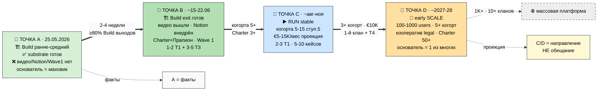
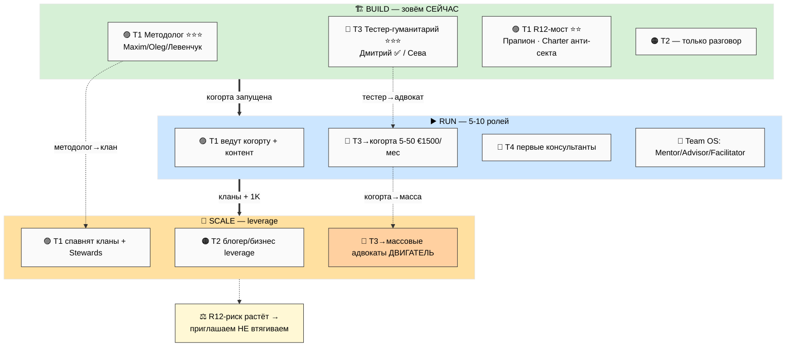
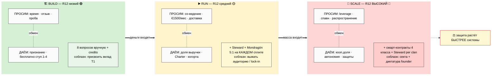
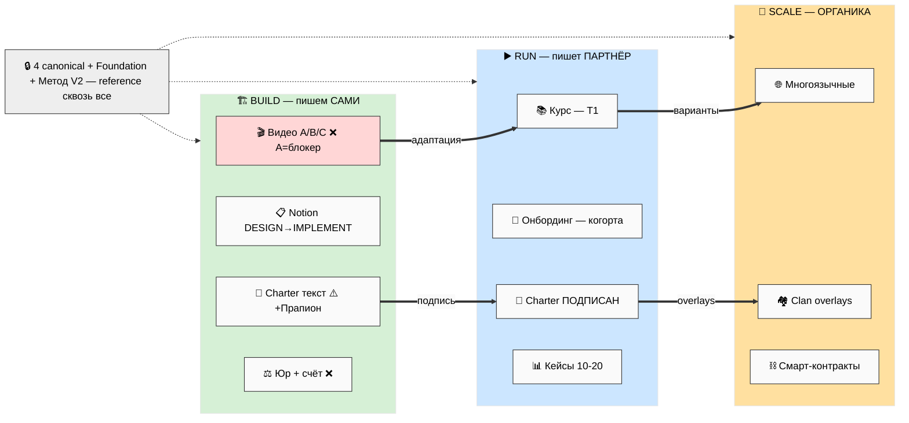
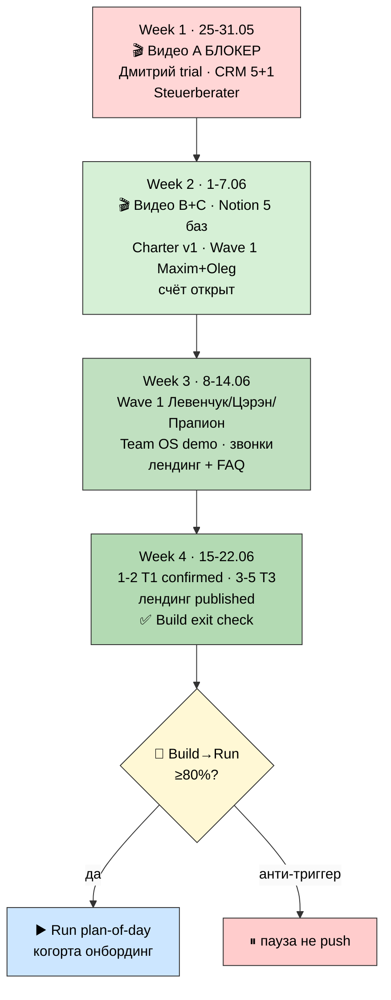

# 🧭 Три этапа платформы — Build / Run / Scale (на человеческом)

> **Что это.** Один документ, который разрезает всё, что мы накопили, через новый угол:
> **платформа Jetix живёт в трёх режимах — Строим / Работаем / Растём.** Здесь — чем они
> отличаются, кого зовём на каждом, что просим и что даём, какие документы где живут, где мы
> сейчас и что делать ближайшие 4 недели. Простым языком, с пятью схемами.
>
> **Это НЕ новый ресёрч.** Это карта поверх уже принятого (execution-plan, план обучения,
> Notion-шаблоны, точки А/B). Финальные решения — за тобой (7-10 штук в §10).

---

## 📍 §0 Если есть 90 секунд (TL;DR)

- **Главное.** «Платформа» — это не одна вещь, а **три разных системы.** Они отличаются не
  размером, а тем, **кто крутит маховик:** в Build — основатель руками; в Run — основатель +
  партнёры + петля обратной связи; в Scale — система крутится **сама** и не останавливается,
  если кто-то (даже основатель) уходит.
- **Где мы.** В **Build, в средней части.** Substrate готов, наружу ещё не вышел. Видео A не
  записано — а оно блокер всего.
- **Кого зовём сейчас.** Методологов (проверить метод) + тестеров-гуманитариев (Дмитрий ✅,
  Сева). НЕ зовём массовых адвокатов, платящие когорты, блогеров — рано, дорогие контакты
  сгорят на недоделанной системе.
- **Защита.** R12-риск («не доим / не запираем») **растёт с этапом:** Build низко → Run
  средне → Scale высоко. Закон: защита должна расти **быстрее** системы, иначе на Scale
  получится секта или корпорация с диктатором.
- **Ближайшие 4 недели.** Видео A → видео B/C + Notion 5 баз → Wave 1 (сначала 2 человека,
  не 7) → проверка «прошли ли Build на 80%».

---

## 🎯 §1 Главная мысль в одной строке

**Перестань думать о «платформе» как об одной вещи. Это три режима — Строим / Работаем /
Растём — и на каждом другие люди, другой обмен, другие документы и другой уровень защиты.
Сейчас мы в режиме «Строим», и весь фокус — выпустить наружу первый baseline и пройти выход
в «Работаем». Всё остальное — следствие.**

И отдельно: переключатель между режимами — **не «сколько людей», а «кто крутит маховик».**
Пока маховик держится на твоих руках — это Build, сколько бы документов ни было накоплено.

---

## 🏗️ §2 Три этапа на пальцах

### 🏗️ Build — строим руками

Система собирается руками, и **ты — главный (почти единственный) механизм.** Методология есть
на бумаге (Метод V2 зафиксирован), но **никто снаружи ещё не прогнал её на себе.** Разговоры
1-на-1, не группой. Денег нет или свои сбережения. Notion-шаблоны = дизайн, не рабочие копии.
*Перестал крутить — всё встало.*

**Ловушки Build:**
- «Накопить ещё substrate» — это **не прогресс.** Накопление — это вход в Build; выход — к
  исполнению. Ещё одна вики не приближает к Run.
- «Идеализирую видео/метод» — перфекционизм. Потолок: «достаточно хорошо → выпускаем».
- «Жду идеального партнёра» — 1 подтверждённый > 10 рассматриваемых.

### ▶️ Run — работает как цикл

Включается **петля обратной связи:** делаем → смотрим отклик → правим → снова. Мастерская идёт
**с участниками**, не только с тобой. Когорта 5-50 человек. Доход течёт (ступень 5 ≈ €1500/мес).
Метод проверяют несколько человек **одновременно.** 1-2 партнёра со-создают курс. *Ты уже не
единственный движок.*

**Ловушки Run:**
- «Только сам веду мастерские» — бутылочное горло. Переход к partner-led обязателен.
- «Закрытый клуб избранных» — нарушение «не запираем». Уйти можно всегда.

### 📡 Scale — растит сама себя

Несколько кланов параллельно, **не один центр.** Аудитория растёт через блогеров/предпринимателей,
не через твои рассылки. Доход распределяется по кооперативным шаблонам, потолок неравенства 5:1.
**Ты — один из многих хранителей, не власть.** *Маховик крутится сам; твой уход его не
останавливает.*

**Ловушки Scale (самые опасные):**
- «Основатель удерживает контроль» — кооператив превращается в корпорацию с диктатором.
- «Скрытые шорткаты ради роста» — риск секты.
- «Все кланы одинаковые» — нет разнообразия ниш.

> **Схема PL-1 ниже** показывает все три этапа с входами/выходами и ловушками.

```mermaid
%%{init: {'theme':'base', 'themeVariables': {'primaryTextColor':'#000000','textColor':'#000000','lineColor':'#333333','primaryBorderColor':'#333333','primaryColor':'#fafafa','noteTextColor':'#000000','noteBkgColor':'#fff8d5'}}}%%
graph LR
    subgraph BUILD[🏗️ BUILD — строим руками]
        B_in[ВХОД ✅<br/>Foundation LOCKED<br/>4 canonical · Метод V2]
        B_work[основатель solo<br/>видео A/B/C · 5 шаблонов<br/>1-на-1 пробы]
        B_out[ВЫХОД<br/>видео готовы · Notion внедрён<br/>1-2 T1 + 3-5 T3<br/>Charter draft · юр + счёт]
        B_in --> B_work --> B_out
    end
    subgraph RUN[▶️ RUN — работает как цикл]
        R_in[ВХОД<br/>+ когорта 5+<br/>+ Charter 3+ подписей<br/>+ первый доход]
        R_work[петля обратной связи<br/>когорта 5-50 · €1.5-15K/мес<br/>T1/T2 со-создают · partner-led]
        R_out[ВЫХОД<br/>1K+ users · 3+ когорт<br/>€10K/мес+ · 100+ кейсов<br/>1-й клан + T4]
        R_in --> R_work --> R_out
    end
    subgraph SCALE[📡 SCALE — растит сама себя]
        S_in[ВХОД<br/>+ кооператив legal<br/>+ Charter 50+ · кланы]
        S_work[N кланов parallel<br/>блогер/бизнес leverage<br/>Mondragón 5:1<br/>основатель = 1 из многих]
        S_out[→ массовая платформа<br/>100K+ users · само-управление<br/>рекурсивный спавн]
        S_in --> S_work --> S_out
    end
    B_out ==>|≥80% выходов| R_in
    R_out ==>|1K + 3 когорты + €10K| S_in
    B_work -.анти: накопление substrate.-> TRAP1[🚫]
    R_work -.анти: founder bottleneck.-> TRAP2[🚫]
    S_work -.анти: founder держит контроль.-> TRAP3[🚫]
    style BUILD fill:#d6f0d6,color:#000
    style RUN fill:#cce6ff,color:#000
    style SCALE fill:#ffe0a0,color:#000
    style TRAP1 fill:#ffcccc,color:#000
    style TRAP2 fill:#ffcccc,color:#000
    style TRAP3 fill:#ffcccc,color:#000
```

---

## 📍 §3 Где мы сейчас и куда идём (Точка А / B / C / D)

- **Точка А (сейчас, 25.05) — Build, средняя часть.** Есть: 4 LOCKED документа, Foundation,
  180 контактов, 17 агентов, шаблоны на уровне дизайна, voice pipeline. Нет: видео (A —
  блокер), внедрённых Notion-шаблонов, текста Charter, отрепетированного звонка, юр.оформления,
  отправленного Wave 1. *(это факты)*
- **Точка B (~15-22.06) — готовим выход из Build.** Видео A/B/C вышли, Notion 5 баз внедрены,
  Charter-текст написан и проверен R12-экспертом, Wave 1 отправлен, 1-2 партнёра T1 + 3-5
  тестеров T3, юр + счёт.
- **Точка C (~авг-ноя 2026) — Run работает.** Когорта 5-15 платит, доход €5-15K/мес, 2-3
  партнёра со-создают курсы, 5-10 кейсов. *(проекция — направление, не обещание)*
- **Точка D (~2027-2028) — ранний Scale.** 100-1000 пользователей, 5+ когорт, 2-5 кланов,
  кооператив легализован, ты = один из хранителей. *(проекция)*

---

## 🤝 §4 Кого зовём на каждом этапе

Партнёры — это не толпа. Это **четыре функции** (методология / ресурсы / аудитория /
консультанты), и на каждом этапе нужны разные.

| Тип партнёра | 🏗️ Build | ▶️ Run | 📡 Scale |
|---|---|---|---|
| **🟣 T1 Методология** | приоритет: проверить метод, со-создать курс (1-2) | ведут когорту, создают контент | спавнят собственные кланы |
| **🟠 T2 Ресурсы** | только разговор (аудиторию не доим, капитал runway) | канальные партнёрства | блогер/бизнес leverage аудитории |
| **🔵 T3 Аудитория** | тестеры: Дмитрий ✅ / Сева (3-5) | когорта 5-50 платит €1500/мес | массовые адвокаты — двигатель роста |
| **🔴 T4 Консультанты** | НЕ активен (рано) | появляется из T1+T3 (0-2) | multi-cohort доставка |

**Кого зовём в Build СЕЙЧАС (прямой ответ):** методолога-партнёра (Maxim/Oleg/Левенчук) +
тестера-гуманитария (Дмитрий) + второго тестера (Сева) + R12-моста для проверки Charter на
анти-секту (Прапион). По специальности приоритет — **методолог + инженер + гуманитарий-тестер.**
YouTuber и предприниматель ценны аудиторией и масштабом — это Run/Scale, не Build.

*(IP-1: все имена — примеры ролей-типов, не назначенные исполнители. Финальный список — за тобой.)*

---

## ⚖️ §5 Что просим / что даём + 8 вопросов R12

Партнёрство — это обмен, и он **разный на каждом этапе.**

| | 🏗️ Build | ▶️ Run | 📡 Scale |
|---|---|---|---|
| **Просим** | время + отзыв + проба | участие + €1500/мес + доставка | leverage + спавн кланов + распространение |
| **Даём** | признание + бесплатно ступ.1-4 + ранний голос | доля выручки + Charter + когорта | кооп.доля + автономия клана + защиты |
| **Защита** | 8 вопросов вручную + явные credits | + Steward + Mondragón 5:1 на каждом сплите | + смарт-контракты + Steward per clan |
| **R12-риск** | 🟢 низкий-средний | 🟡 средний | 🔴 высокий ⚠️ |

**8 вопросов перед любым касанием партнёра** (из execution-plan §4 — на каждом этапе):
цена ≤ польза? · конкретно? · соразмерно отношениям? · по ступени? · канал уместен? ·
не доим / не запираем? · нет манипуляции? · стоп-сигнал готов? — **хоть один не прошёл →
письмо не отправляется.**

---

## 📚 §6 Какие документы на каком этапе

Документ живёт по-разному: что-то **мы пишем сами сейчас** (Build), что-то **пишет партнёр**
(Run), что-то **появляется органически** (Scale).

| Документ | 🏗️ Build (мы) | ▶️ Run (партнёр) | 📡 Scale (органика) |
|---|---|---|---|
| Видео A/B/C | пишем сами ❌ | партнёры адаптируют | community-варианты |
| Charter | пишем текст + Прапион ⚠️ | подписан 3+→50+ | clan overlays |
| Notion templates | внедряем (DESIGN→IMPLEMENT) | юзер кастомизирует | clan-niche |
| Курс | скелет | T1 создаёт end-to-end | community-варианты |
| FAQ / кейсы | — / нет | растут с разговорами | многоязычные / 1000+ |
| Юр + финансы | начинаем ❌ | + treasurer + аудит | Steward per clan |
| 4 LOCKED + Foundation | 🔒 reference сквозь все этапы | 🔒 | 🔒 |

**Срочно для выхода из Build (P1):** Видео A/B/C + Notion внедрение + Charter-текст +
discovery-звонок отрепетирован + Steuerberater + бизнес-счёт + лендинг.
**Можно отложить до Run (P2):** курс end-to-end, FAQ, онбординг когорты, кейсы.

---

## ⚠️ §7 R12-опасности по этапам (за чем внимательно следим)

- **🏗️ Build (низко):** почти нечего выжимать (денег нет). Единственная зона — **соблазн
  присвоить методологический вклад T1.** Лечение: явные credits, кредиты в форке метода.
- **▶️ Run (средне):** деньги потекли = больше соблазнов. Главное — **выжать аудиторию
  партнёра** и **lock-in** («после подписи ты заперт»). Защита: Steward ловит и останавливает
  ≤5 сек; Mondragón 5:1 на каждом денежном шаблоне; fork-and-leave на каждой выплате.
- **📡 Scale (высоко ⚠️):** массовая динамика = **риск секты** + соблазн нарушить потолок +
  попытки запереть юридически. Здесь защита **механическая** (смарт-контракты, 4 класса
  нарушений), а не на доброй воле; Steward аудит per clan; анти-секта массово (нет клятв
  верности, нет спасителя-фигуры, выход звучит первым).

**Сквозной закон:** защита должна расти **быстрее** системы. Если система растёт быстрее
защиты — на Scale получится либо секта, либо обычная корпорация с диктатором.

---

## 📅 §8 Build: конкретные действия на 4 недели (25.05 — 22.06)

**Принцип над всем: всё держится на видео A. Пока его нет — остальное буксует.**

- **Неделя 1 (25-31.05):** 🎬 Видео A (блокер) · Дмитрий — звонок + старт trial · CRM-разметка
  5+1 архетипов первых 10 контактов · Steuerberater email + ресёрч счёта. *(параллельно)*
- **Неделя 2 (1-7.06):** 🎬 Видео B + старт C · Notion Personal OS 5 баз — реализация ·
  Charter-текст v1 · Дмитрий feedback #1 → правка · **Wave 1: Maxim + Oleg (2 человека, не 7)** ·
  бизнес-счёт открыт.
- **Неделя 3 (8-14.06):** Wave 1 вторая отправка (Левенчук/Цэрэн/Прапион — после реакции
  первых) · Team OS demo (1 партнёр) · discovery-звонки · лендинг + FAQ 10 вопросов из
  реальных разговоров.
- **Неделя 4 (15-22.06):** 1-2 партнёра T1 confirmed · 3-5 тестеров T3 активны · лендинг
  опубликован · **проверка Build exit (≥80%?)** → если да, триггер перехода в Run.

**Триггеры перехода Build → Run:** ≥1 T1 confirmed · ≥3 T3 активны · Charter проверен
R12-экспертом · Notion внедрён для multi-user · звонок отрепетирован ≥5 раз · юр начато.
**Анти-триггеры (НЕ переходим):** выгорание · methodology drift (4 LOCKED тронуты) · R12
violation · Wave 1 без видео.

---

## 🚧 §9 Что НЕ делаем сейчас (границы намеренно)

- ❌ Не зовём массовых адвокатов / платящие когорты / блогеров — это Run/Scale.
- ❌ Не пишем курс end-to-end / онбординг когорты / кейсы — это Run (партнёр + первая когорта).
- ❌ Не трогаем clan overlays / смарт-контракты / multi-tenant — это Scale.
- ❌ Не рассылаем Wave 1 без видео — сжигает контакты.
- ❌ Не застреваем в перфекционизме видео C — потолок 14 дней.
- ❌ Не зовём T4 (консультантов) сейчас — слой доставки рано.
- ❌ Не путаем типы партнёров в первом разговоре — методологу не суём долю первым делом.
- ❌ Не переоткрываем и не трогаем замороженные документы (4 LOCKED + Foundation).

---

## ✅ §10 Решения, которые за тобой (R1 — варианты + факты, не «рекомендую»)

1. **Финальные 7-10 целей Wave 1** — кого пишем первыми из Build-акторов (T1 методологи +
   T3 тестеры)? *Вариант по умолчанию:* Maxim + Oleg первыми, потом Левенчук/Цэрэн/Прапион.
2. **Видео C — упоминать смарт-контракты (R12 overlay) или рано?** *Факт:* это Scale-механика,
   аудитория Build её не увидит ещё ~2 года. Вариант: упомянуть одной фразой как «направление».
3. **Юр. путь — Einzelunternehmen / GmbH / UG?** *Факт:* нужна консультация Steuerberater;
   решение влияет на Build exit. Вариант по умолчанию: спросить Steuerberater, решить по совету.
4. **Notion Team plan upgrade — когда?** Build (сейчас, для Team OS demo) или Run (когда нужен
   multi-tenant)? *Вариант:* апгрейд в Week 2-3 под Team OS demo.
5. **Edu-agent execution prompt — когда создать?** Build (Week 3, если путь выбран) или Run?
6. **Charter для входа в Run — какой формат подписи (legal)?** Простой текст-согласие vs
   юридический документ vs смарт-контракт (Scale)? *Вариант:* текст-согласие в Run, legal в Scale.
7. **Build → Run checkpoint — какие выходы critical MUST pass?** *Вариант:* 1 T1 confirmed +
   3 T3 активны + Charter проверен — остальное «желательно».
8. **Сева — когда онбордить?** После правки шаблона по Дмитрию (Week 2) или параллельно?
9. **Кого добавить/убрать из Build-акторов** (Ilshat / Ivan / другие)?
10. **Темп Build** — push 4 недели или растянуть, если есть признаки выгорания (анти-триггер §8)?

---

## 🔗 §11 Cross-refs (для тех, кто хочет глубже — footnotes, не повторяем content)

| Документ | Зачем |
|---|---|
| `EXECUTION-PLAN-FIXATION-2026-05-24.md` | **Baseline** — 4 типа партнёров + 2 направления + sequencing |
| `CONSOLIDATED-HUMAN-LANGUAGE-PLAN-2026-05-24.md` | План обучения + §8 этапы Jetix 2026-2028 |
| `POINT-A-CURRENT-STATE-2026-05-23.md` / `POINT-B-NEAR-TARGET-2026-05-23.md` | Точка А / B детально |
| `OUTREACH-CONTENT-OUTCOMES-CTAS-2026-05-24.md` | 7 Bloom + 13 CTA + 6 архетипов + анти-CTA |
| `PERSONAL-OS-NOTION-TEMPLATE-PLAN-2026-05-24.md` / `TEAM-OS-...` | Notion templates (Build/Run substrate) + 10 ролей |
| `PARTNER-OFFERING-HUMAN-LANG-2026-05-22.md` | Деньги, тиры L1-L7, 75/25, Mondragón 5:1 |
| Method V2 / Strategic Plan / Economic V10 / AI Market PLAN | 🔒 LOCKED — только ссылки |
| `reports/platform-lifecycle-stages-plan-2026-05-25/` | 8 фазовых отчётов (детали этого плана) |

---

## 🎯 §12 К чему это ведёт

После прочтения у тебя в голове **один общий словарь:**
1. «Платформа» = три режима (Строим / Работаем / Растём), а не одна вещь.
2. Переключатель = «кто крутит маховик», не «сколько людей».
3. Мы — в Build, средняя часть; фокус — выпустить baseline и пройти выход.
4. R12-защита растёт быстрее системы — сквозной закон.

**Как это меняет общение с партнёрами.** Теперь, прежде чем кому-то написать, ты задаёшь
один вопрос: **«на каком этапе этот человек нужен?»** Методолог — Build, сейчас. Блогер —
Scale, не трогаем. Тестер — Build, уже идёт (Дмитрий). Это убирает кашу: каждое касание
получает свой этап, свой обмен, свою защиту. Карта готова — идёшь по ней сам, когда решишь,
и аккуратно: каждое касание через 8 вопросов «не доим / не запираем / не манипулируем».

---

*Document closure 2026-05-25. Platform Lifecycle Stages synthesis в стиле PARTNER-OFFERING-
HUMAN-LANG + EXECUTION-PLAN-FIXATION. Собрано из существующего substrate, без нового ресёрча
(F2-F3 derivative). R1 surface only — Ruslan picks 7-10 решений §10. R12 paired-frame STRICT
(8 вопросов per касание; защита растёт быстрее системы). IP-1 STRICT (имена = примеры).
NO LOCK modifications. NO auto-launch (видео не записываются, Wave 1 не отправляется, Notion
API не трогается). Pool result.*
