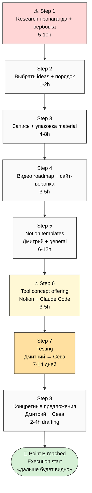
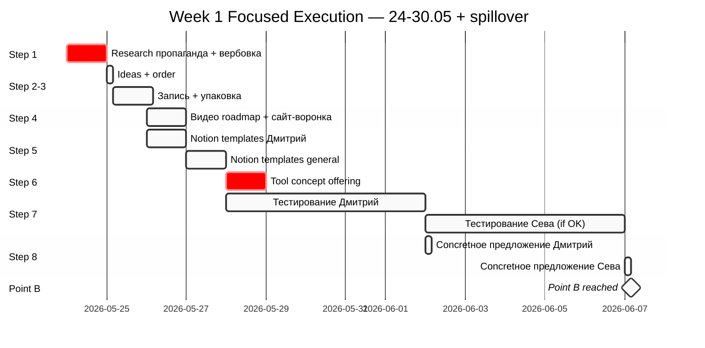

# 🅱️ Point B FOCUSED — Week 1 (24-30.05.2026)

> **Scope narrowing:** Per Ruslan voice 23.05 late-evening — берём **только 1 неделю**. 1-месяц + 2-месяца sections в Point B compact = **«похуй сейчас, потом проверим»**. Фокус на конкретный sequence до execution start.
>
> **Главное:** Sequence к Point B = collection of working artefacts (упаковка + видео + сайт + Notion templates + tool concept) → testing с Дмитрием → testing с Севой → конкретное предложение Дмитрий + Сева.
>
> **Dependency mandatory:** ⚠️ ПЕРЕД записью видео + ПЕРЕД разработкой плана коммуникации = **плотненький research по пропаганде + вербовке**.

---

## §0 TL;DR (≤200w)

Неделя = build artefacts → test с 2 первыми partners → deliver concrete offers.

Sequence (8 шагов):

1. ⚠️ **Research пропаганда + вербовка** (PERED everything — это вход в week)
2. Выбрать **основные идеи** для обучающего материала + **порядок** rasskaza
3. **Запись + упаковка** обучающего материала для потенциальных партнёров
4. Описать **какие видео** нужны + **сайт-воронка** концепция
5. **Шаблоны Notion для Дмитрия** + general Notion templates
6. **Tool concept** = Notion template + Claude Code subscription = «улучшенный инструмент управления вниманием / финансами / etc.» → распространение через partners
7. **Тестирование** с Дмитрием (first) → если OK → Сева
8. **Конкретные предложения** для Дмитрия + Севы (after testing complete)

**Дальше планов нет** — после Step 8 будет видно по результатам.

---

## §1 8 шагов sequence (chronological)

### ⚠️ Step 1 — Research пропаганда + вербовка [P1 prerequisite]

**Critical mandatory PRE-step:**

- Изучить как работает пропаганда (mass communication techniques / framing / narrative arc / emotion-vs-reason / repetition / social proof)
- Изучить как работает вербовка (recruitment dynamics / individual conversion / network effects / scarcity / belonging / status hierarchy)
- **Как мы можем использовать уже сейчас** — applied для Jetix outreach + cohort building

**Sources to consider:**
- Cialdini «Influence» (6 principles)
- Henrich «WEIRDest People in the World» (cultural transmission)
- Ostrom «Governing the Commons» (community formation)
- Raymond «The Cathedral and the Bazaar» (open-source recruitment dynamics)
- Srinivasan «The Network State» (cohort coordination)
- Religious recruitment patterns (case studies)
- Political movement case studies
- Crypto/startup founding team formation patterns
- Modern marketing / growth hacking literature

**Output:** `decisions/strategic/PROPAGANDA-RECRUITMENT-RESEARCH-2026-05-24.md` (deep research; consider launching server CC prompt for this — substantiates ВСЁ последующее)

**Time:** ~5-10h ressearch effort (либо server CC autonomous + own review)

**Why mandatory PERED:** без этого знания запись видео + упаковка материала будут intuition-based, не SoTA-based.

---

### Step 2 — Выбрать основные идеи + порядок rasskaza [P1]

**Что:**

- Из всего substrate (4 LOCKED canonical + 13 Tier A wikis + Method V2 + Partner Offering + batch-12 + 3 NEW wikis) — **выбрать N основных идей** для обучающего материала
- Определить **порядок** изложения (как entry point → как deepening → как pitch landing)

**Кандидаты основных идей (на review):**

- **Core thesis** — «всё = информация + методы; интеллект = переработчик; качество жизни = качество методов × selection» (Method V2)
- **AGI minimal formula** (O-133 — substrate-saturation argument)
- **Foundational values** «жить чтобы жить + не умереть + развиваться» (O-138)
- **Meta-method 8-component composition** (O-121 Tier A)
- **External-system cybernetic principle** (O-128 Tier A)
- **Welcome-frame R12-compatible** invitation (O-144)
- **Development → Promotion transition** (O-160 Tier A — twoя explicit fixation 23.05)
- **Cohort target ontology** «голодный + слюна-течёт» (O-161/O-162)
- **Triple-role partner** (worker + investor + promoter)
- **Workshop = «мастерская инженеров-менеджеров»** (Левенчук-tradition compatible frame)
- **Notion-MVP-bypass pattern** (O-158)

**Output:** `decisions/strategic/CORE-IDEAS-SEQUENCE-2026-05-24.md` — listing + order rationale

**Time:** 1-2h Ruslan personal R1 work (это твой strategic choice — какие идеи + порядок)

---

### Step 3 — Запись + упаковка обучающего материала [P1]

**Что:**

После Step 2 (ideas + order locked) → записать обучающий материал в нескольких форматах:

- **Текстовая база** (1 deep doc на каждую core idea + general overview)
- **Visual aids** (mermaid diagrams + simple infographics — можно использовать existing 200+ mermaid из substrate)
- **Compact one-liner** per idea (для quick reference / TikTok-style cuts)
- **Cross-references** между ideas (interconnection map)

**Output:**
- `decisions/strategic/TEACHING-MATERIAL-CORE-IDEAS-2026-05-24.md`
- `decisions/strategic/TEACHING-MATERIAL-VISUAL-AIDS-2026-05-24.md`

**Time:** 4-8h (либо server CC autonomous compile из existing substrate + Ruslan polish)

---

### Step 4 — Видео описание + сайт воронка [P1]

**Что:**

#### 4.1 Видео roadmap

- **V1 anchor video** (12-15 min) — main pitch для Wave 1 (Method V2 + values-declaration + Partner Offering + Welcome-frame)
- **V2 deep video** (18-25 min) — long version для L2-L3 audience
- **V3-Vn short cuts** (3-5 min each) — TikTok / Reels / YouTube Shorts формат
- **Per-video** topics + script outline + recording setup

Script anchor = Step 2 ideas + Step 3 teaching material.

**Output:** `decisions/strategic/VIDEO-ROADMAP-2026-05-24.md`

#### 4.2 Сайт воронка концепция

- **Базовый сайт** — landing для anchor video + основная информация + signup
- **Воронка:** visitor → preview video → email-list / Telegram signup → access к full teaching materials → personal contact → partner conversation
- **Tech stack** options (GitHub Pages static / Webflow / Notion-as-site / etc.)
- **Что критично:** простота / R12-compatible (voluntary opt-in / fork-and-leave) / Russian + English versions

**Output:** `decisions/strategic/WEBSITE-FUNNEL-CONCEPT-2026-05-24.md`

**Time:** 3-5h для оба

---

### Step 5 — Шаблоны Notion (Дмитрий-specific + general) [P1]

**Что:**

#### 5.1 Шаблон Notion для Дмитрия

- Custom-built для его use case (гуманитарщина / contacts management / outreach pipeline / content creation tracking)
- Готовый «plug-and-play» Notion workspace template
- Documented (instructions внутри Notion + видео-walkthrough)

#### 5.2 General Notion templates (универсальные)

- **Personal Life OS** (attention / finances / health / habits)
- **Business Operations** (sales / CRM / projects / metrics)
- **Knowledge Management** (notes / sources / synthesis)
- **Methodology Practice** (method-of-methods application + 8-component meta-method use)
- **Cohort Coordination** (для future partners когда они onboard)

**Output:** Notion templates published (Notion has public template feature) + `decisions/strategic/NOTION-TEMPLATES-CATALOG-2026-05-24.md` с links

**Time:** 6-12h (substantial templating work)

---

### Step 6 — ⭐ Tool Concept: Notion + Claude Code subscription = жизненный инструмент [P1]

**Что (это innovative offering):**

**Pitch:**

> «Я даю тебе:
> - **Custom Notion workspace** (templates per твоя жизнь / бизнес)
> - **Claude Code subscription access** (через мою подписку либо я помогаю настроить твою)
> - **Setup + training** — как использовать вместе
>
> Результат для тебя:
> - **Улучшенный инструмент** управления **вниманием** + **финансами** + **проектами** + **отношениями** + любая другая life-domain
> - **AI-amplified daily workflow** — substrate-density × selection-quality × meta-method
> - **Mastery practice** — реальное применение Jetix methodology в твоей жизни
>
> **Взамен:**
> - Ты с этим улучшенным инструментом + улучшенной жизнью **работаешь над моим проектом** (Jetix) — конкретные роли согласовываем individually
> - Ты **распространяешь систему** — потому что она работает, ты её живёшь, ты её рекомендуешь искренне (не propaganda — natural advocacy)
> - **R12 paired-frame:** voluntary opt-in / fork-and-leave / no extraction beyond agreed share / 30-day opt-out на любом моменте»

**This is the offering для future partners / cohort members** — после Дмитрий + Сева testing pattern works.

**Output:** `decisions/strategic/JETIX-LIFE-TOOL-OFFERING-2026-05-25.md` — pitch + mechanics + onboarding workflow + R12 compliance doc

**Time:** 3-5h drafting

---

### Step 7 — Testing с Дмитрием → Сева [P1]

**Что:**

#### 7.1 Дмитрий first

- Дать Дмитрию Notion template (Step 5.1) + access к teaching material (Step 3) + видео preview (Step 4.1 V1)
- Дмитрий **тестирует** = использует в реальной работе 5-7 дней
- Feedback session — что работает / что нет / что улучшить
- Iterate template + materials per his feedback

#### 7.2 Сева second (если Дмитрий OK)

- Same pattern — template + materials + access
- 5-7 дней use
- Feedback session
- Iterate

**Time:** 7-14 дней wall-clock — это spreads beyond Week 1; **первый touch с Дмитрием = within Week 1 (Wed-Thu 27-28.05)**

**Output:** `reports/dmitriy-sevay-testing-2026-05-30/00-feedback-log.md` (ongoing)

---

### Step 8 — Конкретные предложения для Дмитрия + Севы [P1]

**Что (after testing → iteration → solid offering):**

#### 8.1 Предложение для Дмитрия

- **Что Дмитрий получает:** Notion + Claude Code tool + teaching materials + custom support
- **Что Дмитрий даёт:** доступ к аудитории (его humanitarian-focused community) + introductions + co-creation на content / pitch refinement
- **Конкретные numbers:** revenue share / equity / non-monetary value exchange — TBD per discussion
- **Timeline:** что-то начнём делать в Y1 — measurable cohort growth contribution
- **R12 paired-frame:** explicit voluntary opt-in / fork-and-leave / mutual benefit articulation

#### 8.2 Предложение для Севы

- **Что Сева получает:** улучшенный tool + earnings opportunity + scaling pattern
- **Что Сева даёт:** доступ к аудитории (crypto + tech community) + **немного денег / platform access** + co-creation
- **Конкретные numbers:** revenue / equity / token allocation — TBD
- **Платформа Севы:** integration с его existing platform = leverage
- **Бабки:** какие он может на этом поднять — surface concrete potential (his personal financial upside)
- **R12 paired-frame:** same

**Output:**
- `decisions/strategic/DMITRIY-PARTNER-PROPOSAL-2026-05-30.md`
- `decisions/strategic/SEVA-PARTNER-PROPOSAL-2026-05-30.md`

**Time:** 2-4h drafting per partner после testing complete

---

## §2 Что дальше = «будет видно»

После Step 8 — **планов нет**. Будет известно по результатам:

- Если Дмитрий + Сева ack → начинаем cohort scaling per their pattern
- Если один acks один nope → iterate offering
- Если оба nope → re-strategy
- Если variations → adapt per individual

**Принцип:** Plan further только после Step 8 results.

---

## §3 Critical mandatory dependency

```
Step 1 (Research propaganda + recruitment)
  ↓ MUST complete FIRST
Step 2 (Choose ideas + order)
  ↓
Step 3 (Запись + упаковка)
  ↓
Step 4 (Видео + сайт-воронка)
  ↓
Step 5 (Notion templates)
  ↓
Step 6 (Tool concept offering)
  ↓
Step 7 (Testing Дмитрий → Сева)
  ↓
Step 8 (Конкретные предложения)
  ↓
🎯 Point B reached — execution start
```

**Steps 1-6 = artefact build (Ruslan-led; Cloud Cowork supports).**
**Step 7 = real-world testing (Дмитрий + Сева).**
**Step 8 = formal partnership offers.**

---

## §4 Mermaid sequence flow



---

## §5 Mermaid timeline (24-30.05 + spillover Step 7)



---

## §6 Что было в Point B compact и теперь deferred

Following sections в `decisions/strategic/POINT-B-NEAR-TARGET-2026-05-23.md` = **DEFERRED until после Step 8:**

- 1-месяц horizon (24.05-24.06) — preserved append-only, не active focus
- 2-месяца horizon (24.05-24.07) — preserved append-only, не active focus
- Q3 trajectory + bridge capital + L14 30.06 platform ready — preserved, revisit после Step 8
- Mass distribution Июль target — preserved, revisit после Step 8

**Preserved per append-only.** Не deleted. Просто не active focus сейчас.

---

## §7 Что нужно от Cloud Cowork (для следующих сессий)

| Step | Cloud Cowork action |
|---|---|
| Step 1 | Создать server CC prompt **«Research пропаганда + вербовка»** (deep ~5-10h) — substantiates everything после |
| Step 2 | Surface candidate ideas list (ready) → Ruslan picks + locks order |
| Step 3 | Compile teaching material substrate из existing wikis + Method V2 + 4 LOCKED |
| Step 4 | Draft video script outlines + website funnel concept (R12 paired-frame mandatory) |
| Step 5 | Draft Notion template structure (Cloud Cowork может создать markdown templates → Ruslan moves to Notion) |
| Step 6 | Draft Tool Concept pitch (R12 8-item check mandatory) |
| Step 7 | Track feedback log + iterate templates per Дмитрий/Сева input |
| Step 8 | Draft per-partner proposals (R12 paired-frame + offer-vs-ask discipline) |

---

## §8 R12 paired-frame discipline checkpoint

Все steps + outputs **MUST** pass R12 8-item check ДО Step 7 testing с Дмитрий/Сева:

1. **Offer explicit** — что они получают (Notion tool + Claude access + materials)
2. **Ask explicit** — что они дают (audience access + work / money / platform)
3. **Voluntary opt-in** — никакого pressure / urgency manipulation
4. **Fork-and-leave** preserved — exit anytime с preserved value
5. **Cooperative share framing** — mutual benefit, not extraction
6. **Mondragón 5:1 cap** mentioned where applicable (для future cohort scaling)
7. **No manipulation** — no fake scarcity / social proof games
8. **Specific contact + timeline** — clear next-step articulation

---

## §9 Cross-refs

- Point A: `decisions/strategic/POINT-A-CURRENT-STATE-2026-05-23.md`
- Point B compact (predecessor): `decisions/strategic/POINT-B-NEAR-TARGET-2026-05-23.md`
- Plan-of-Day 23.05: `daily-logs/_PLAN-OF-DAY-2026-05-23.md`
- O-160 Tier A wiki (development→promotion transition): `wiki/concepts/development-promotion-mode-transition.md`
- O-158 Tier A wiki (Notion-MVP-bypass pattern): `wiki/concepts/notion-mvp-bypass-pattern.md`
- O-161/O-162 Tier A wiki (cohort target ontology): `wiki/concepts/cohort-target-profile-ontology.md`
- Method V2 main: `decisions/strategic/METHOD-LIFE-DEVELOPMENT-V2-2026-05-21.md`
- Partner Offering: `PARTNER-OFFERING-HUMAN-LANG-2026-05-22.md`
- Navigation Guide: `decisions/strategic/JETIX-NAVIGATION-GUIDE-2026-05-22-DRAFT.md`

---

## §10 Constitutional posture

- **R1 surface only:** этот plan = substrate compile + sequencing per Ruslan voice; **Ruslan R1 prose pass на финал план + executions** required
- **R6 provenance:** voice anchor source preserved (Ruslan voice 23.05 late-evening)
- **R11 Default-Deny:** ничего auto-executed; каждый Step = Ruslan does manually OR Cloud Cowork drafts after explicit ack
- **R12 paired-frame:** §8 discipline mandatory ДО Step 7
- **Append-only:** Point B compact preserved; этот = focused override на 1-week horizon
- **AP-6:** 1m+2m horizons preserved в Point B compact (not deleted)
- **IP-1 strict:** Ruslan = sole strategist для choice of ideas (Step 2) + final proposal terms (Step 8)

---

*Doc closure 2026-05-23 late-evening. Per Ruslan voice ack «зафиксируй порядок более-менее адекватный». Per `feedback_constitutional.md` R1 — brigadier sequencing only; Ruslan choices preserved. Per `feedback_breadth_not_selection.md` — Step 2 candidate ideas listed all; Ruslan picks order.*
