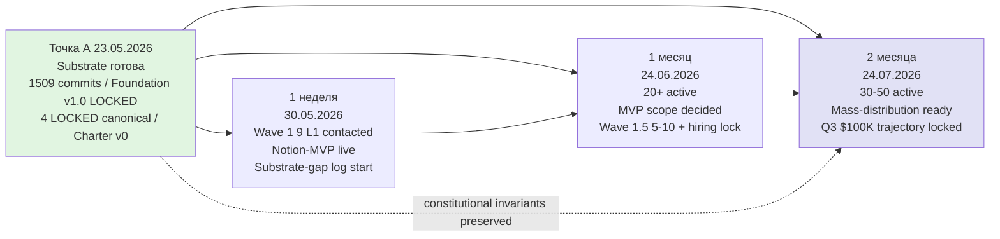
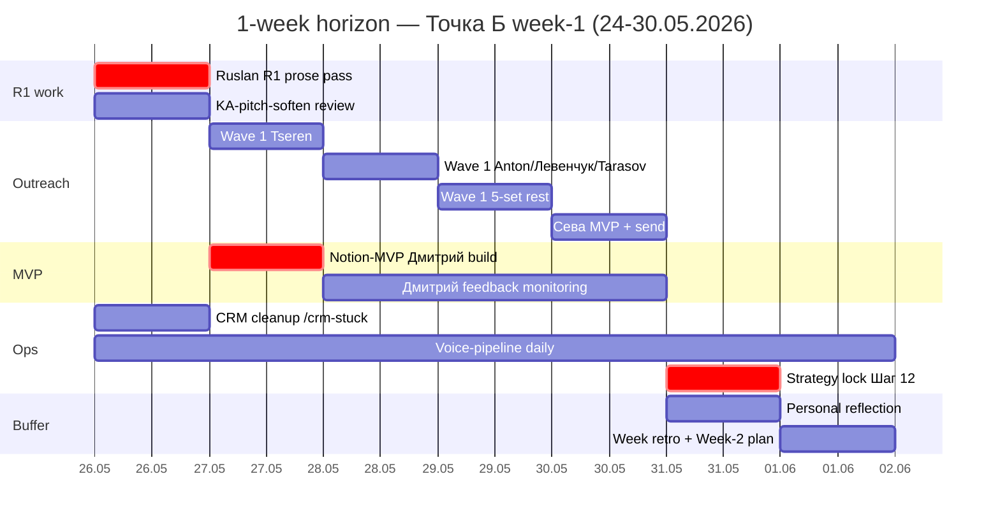
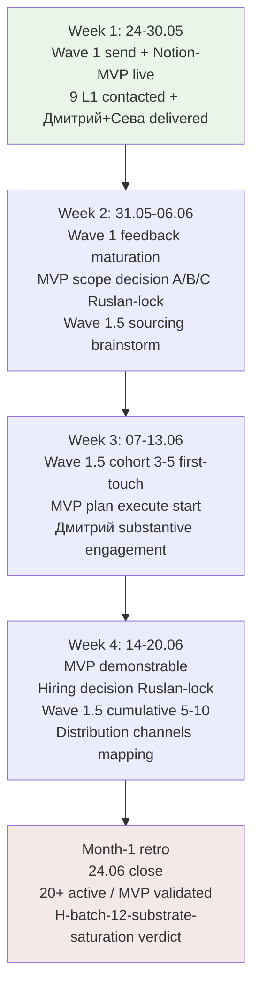
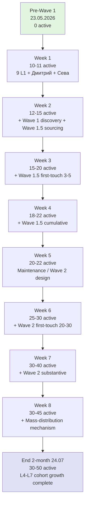
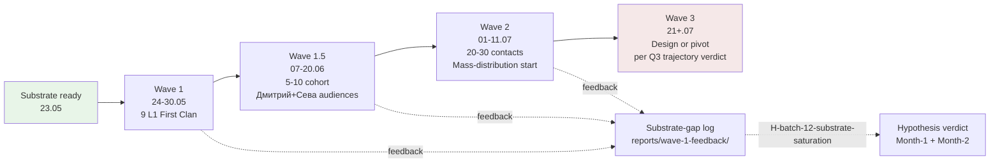
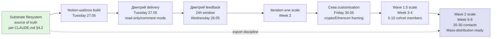
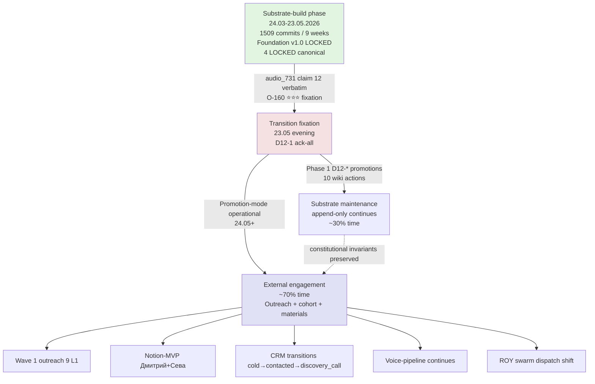
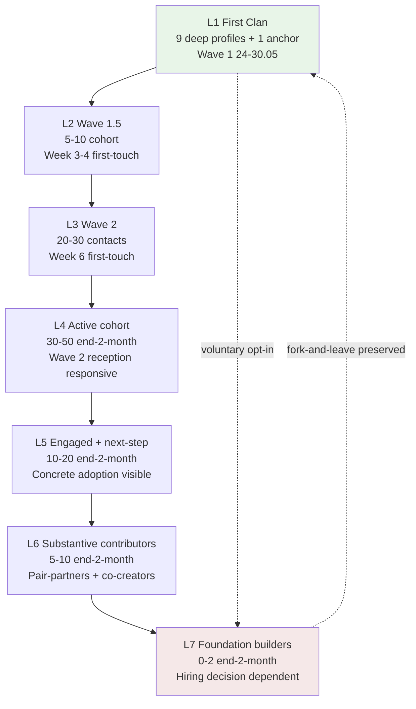
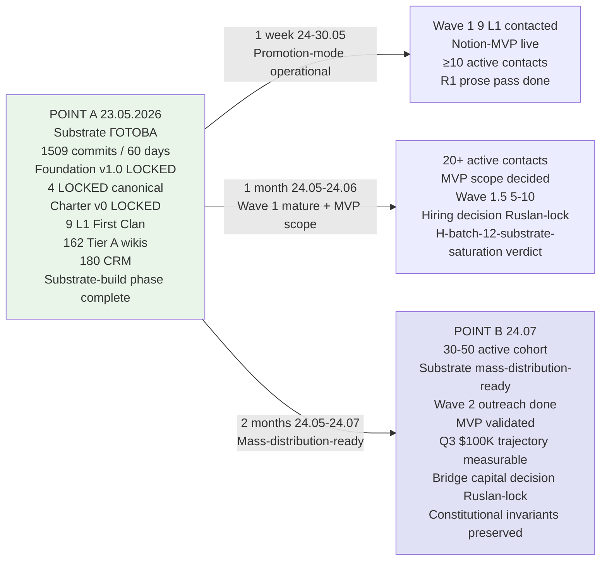

# ⭐⭐⭐ POINT B — Near-Target State COMPACT (3 horizons / 3 perspectives)

> **Trigger:** Ruslan voice 23.05 late-evening «все D12-* в Википедию + Точка Б compact (1w / 1m / 2m) + ёбашь quick не 2 часа залупы».
>
> **Goal:** factual near-target state — что должно происходить в течение 1 недели / 1 месяца / 2 месяцев чтобы substrate-build phase (Точка А) translated в operational promotion-mode (Точка Б).
>
> **R1 reminder.** Brigadier-scribe = substrate compile only. **Ruslan = sole strategist.** Этот документ = reference + suggestion artefact, не R1 lock prose. Future R1 voice prose pass slot reserved для direction-card / Plan-of-Day / Strategic Reflection per [[development-promotion-mode-transition]] §9.

---

## §0 TL;DR (60-sec scan)

**Точка А (23.05) → Точка Б (2 months trajectory).** Substrate-build phase закончен; promotion-mode operational.

| Horizon | Period | Key outcomes |
|---|---|---|
| **1 неделя** | 24-30.05 | Ruslan R1 prose pass (O-160 ack option) + 9 L1 First Clan all contacted + Notion-MVP live для Дмитрий + Сева + substrate-gap log start + ≥10 active contacts |
| **1 месяц** | 24.05-24.06 | Wave 1 mature + first-cohort substantively engaged + MVP scope decided (Option A/B/C) + Wave 1.5 cohort 5-10 candidates + hiring decision Ruslan-locked + 20+ active contacts |
| **2 месяца** | 24.05-24.07 | Substrate mass-distribution-ready (L14 LOCK 30.06 target) + Wave 2 outreach 20-30 contacts + cohort 30-50 active engaged + Q3 $100K trajectory measurable + bridge capital decision (если applicable) |

**Constitutional invariants preserved:** R12 anti-extraction + voluntary opt-in + fork-and-leave + Charter v0 LOCKED + Foundation v1.0 LOCKED + 13 LOCKED items untouched.

[8 mermaid diagrams в `reports/point-b-compact-2026-05-23/diagrams/`]

---

## §1 Trigger + context

### §1.1 Why Точка Б now

Per Точка А (`decisions/strategic/POINT-A-CURRENT-STATE-2026-05-23.md`) — 23.05.2026 substrate inventory factual:
- 1509 commits / 60 дней / 9 недель — substrate-build phase
- Foundation v1.0 LOCKED + 4 LOCKED canonical + Charter v0 LOCKED + 8 RUSLAN-ACK records
- 162 Tier A wikis + 402 books + 180 CRM + 9 L1 First Clan + ROY swarm 9 agents + 54 skills + 30 tools

Per batch-12-quick (`reports/voice-batch-12-quick-2026-05-23/`) — 23.05 evening Ruslan voice fixation:
- **O-160 ⭐⭐⭐ MAJOR fixation** (audio_731 claim 12 verbatim): «режим devevelopment закончен → switch обёртка/продвижение»
- Compound с substrate-saturation hypothesis (O-163) + target-profile ontology (O-161) + sequencing Дмитрий+Сева (O-157)

= explicit phase-transition fixation. Точка Б = formalisation of where promotion-mode operationalisation lands.

### §1.2 Source documents read

Phase 0 substrate read (per `reports/point-b-compact-2026-05-23/phase-0-scope.md`):
- ⭐⭐⭐ `decisions/strategic/POINT-A-CURRENT-STATE-2026-05-23.md` (564 lines / 8 buckets / 12 mermaid / ~220+ sources)
- ⭐⭐ `reports/voice-batch-12-quick-2026-05-23/` (6 reports / 10 ideas O-156..O-165 / 11 D12-* ack queue)
- ⭐ 3 existing wikis read (method-method-one-liner / jetix-as-exokortex / external-system-cybernetic-principle)
- 4 LOCKED canonical (Method V2 / Strategic Plan / Economic V10 / AI Market PLAN)
- Wave 1 outreach package + Navigation Guide DRAFT

### §1.3 Phase 1 D12-* ack-all promotions executed first

Per Ruslan voice ack-all 2026-05-23 «все D12-* в Википедию» — 10 wiki promotions executed before horizon construction:
- 3 NEW: development-promotion-mode-transition (Tier A; O-160 ⭐⭐⭐) + notion-mvp-bypass-pattern + cohort-target-profile-ontology
- 3 §APPEND: method-method-one-liner (O-156+O-160+O-164 4-layer compound) + jetix-as-exokortex (O-157 distribution sequence) + external-system-cybernetic-principle (O-159 scale + O-163 hypothesis)
- 1 CRM deferred (O-165 to Plan-of-Day Шаг 6)

= 11/11 D12-* coverage. Per `reports/point-b-compact-2026-05-23/phase-1-d12-promotions.md`.

---

## §2 1-week horizon (24-30.05.2026)

> **Full report:** `reports/point-b-compact-2026-05-23/01-horizon-1-week.md`
> **Diagram:** D1 1w-gantt + D4 wave-cascade

### §2.1 Цель недели

**От «substrate готова» к «substrate + Wave 1 контакт + первая cohort feedback».**

End-of-week targets:
1. Ruslan R1 prose pass — direction-card OR Strategic Reflection update per O-160 ack-option
2. Wave 1 outreach — 9 L1 First Clan все contacted + Сева sent
3. Notion-MVP live для Дмитрий + Сева
4. CRM clean (`/crm-stuck` processed) + status transitions captured
5. voice-pipeline daily continuing
6. `reports/wave-1-feedback/` NEW directory; substrate-gap documentation
7. H-batch-12-substrate-saturation hypothesis first verdict
8. Strategy lock decision (Plan-of-Day Шаг 12)

### §2.2 Day-by-day (7 дней)

| Day | Date | Focus |
|---|---|---|
| Пн | 26.05 | Promotion-mode operational start — Ruslan R1 prose pass + CRM cleanup + Wave 1 KA-pitch-soften review (HR-1..HR-5) |
| Вт | 27.05 | Notion-MVP Дмитрий live + Wave 1 Tseren send |
| Ср | 28.05 | Wave 1 send: Anton mentor + Левенчук + Tarasov + Дмитрий feedback expected (24h) |
| Чт | 29.05 | Wave 1 remaining sends: Fedorev + Хартманн + Braginsky + Гиренко + Дуров + reception analysis |
| Пт | 30.05 | Сева Notion-MVP + Wave 1 mid-week review + substrate-gap inventory |
| Сб | 31.05 | Buffer / Ruslan personal reflection / Strategy lock decision |
| Вс | 01.06 | Week retrospective + Week-2 plan |

[src: `reports/point-b-compact-2026-05-23/01-horizon-1-week.md` §2 day-by-day]

### §2.3 People activation week-1

| Tier | Person | Status target end-of-week |
|---|---|---|
| T2 ≤24h | Tseren | replied + alignment-confirmed |
| T2 ≤24h | Дмитрий | Notion-MVP engagement + feedback received |
| T2 ≤24h | Anton mentor | replied or pending |
| T3 ≤48h | Левенчук + Tarasov | sent; reply window open |
| T3 ≤48h | Fedorev + Хартманн + Braginsky + Гиренко + Дуров | sent; reply window open |
| Сева | DRAFT→contacted transition | delivered + first response |

**Total active end-of-week:** ≥10 L1 (9 First Clan + Tseren overlap + Дмитрий + Anton + Сева).

### §2.4 Constitutional discipline weekly

- ✅ R12 paired-frame check per Wave 1 send (philosophy-expert dispatch verification)
- ✅ KA-pitch-soften pattern HR-1..HR-5 per [[cohort-target-profile-ontology]] §6.2
- ✅ Voluntary opt-in + fork-and-leave clauses preserved
- ✅ R1 prose authority Ruslan-only (brigadier-scribe substrate-compile)
- ✅ Append-only (CRM voice-pipeline DRAFT-only invariant)
- ✅ 13 LOCKED items untouched

---

## §3 1-month horizon (24.05-24.06.2026)

> **Full report:** `reports/point-b-compact-2026-05-23/02-horizon-1-month.md`
> **Diagram:** D2 month-milestones

### §3.1 Цель месяца

**Promotion-mode operational; ≥3 first-cohort members substantively engaged; MVP scope decided based on Wave 1 + first-cohort feedback; Wave 1.5 cohort sourcing started.**

### §3.2 Per-week milestones (Weeks 1-4)

| Week | Period | Milestone |
|---|---|---|
| 1 | 24-30.05 | Wave 1 send + Notion-MVP live (per §2) |
| 2 | 31.05-06.06 | Wave 1 feedback maturation + MVP scope decision (Option A/B/C Ruslan-locked) |
| 3 | 07-13.06 | Wave 1.5 cohort sourcing 3-5 + MVP plan execute + Дмитрий substantive engagement |
| 4 | 14-20.06 | MVP demonstrable + hiring decision (HIRE NOW / DEFER / REVIEW PILOT) + Foundation builders onboarding если applicable + Wave 1.5 cumulative 5-10 + distribution channels mapping complete |

[src: `reports/point-b-compact-2026-05-23/02-horizon-1-month.md` §1 milestone structure]

### §3.3 Month-1 outcomes target

| # | Outcome | Status target end-of-month 24.06 |
|---|---|---|
| 1 | Promotion-mode operational | ✅ activity rebalance confirmed per [[development-promotion-mode-transition]] §3.1 |
| 2 | Wave 1 + reception | ✅ 9 L1 contacted; ≥5 substantive responses; ≥2 discovery-calls |
| 3 | Notion-MVP scaling | ✅ Live Дмитрий + Сева + 3+ Wave 1.5 |
| 4 | MVP scope decision | ✅ Option A/B/C locked + plan execution started |
| 5 | First-cohort engagement | ✅ Дмитрий + Сева pair-discussions + concrete next-step adoption |
| 6 | Wave 1.5 cohort sourcing | ✅ 5-10 candidate inventory + 3-5 first-touch sent |
| 7 | Hiring decision | ✅ Ruslan-locked (HIRE NOW / DEFER / REVIEW PILOT) |
| 8 | Substrate-gap analysis | ✅ H-batch-12-substrate-saturation hypothesis verdict |
| 9 | Distribution channels mapping | ✅ Per O-165 + Telegram channels gap closure |
| 10 | Month-1 retrospective | ✅ Draft ready end-of-month |

### §3.4 Decision points (Ruslan-only R1)

| Week | Decision | Default-deny-safe |
|---|---|---|
| 1 | Wave 1 send authorization | Send AFTER KA-pitch-soften review pass |
| 2 | MVP scope (A/B/C) | (A) Notion-template expansion default |
| 2 | Wave 1.5 pivot signal | Continue (Wave 1 only 1 week) |
| 3 | First-cohort deepening invest | Per engagement signals |
| 4 | Hiring decision | DEFER default (substrate maintenance burden cap) |
| 4 | Bridge capital planning | DEFER (Q3 trajectory monitor) |

---

## §4 2-month horizon (24.05-24.07.2026)

> **Full report:** `reports/point-b-compact-2026-05-23/03-horizon-2-months.md`
> **Diagram:** D3 2m-trajectory + D7 cohort-funnel

### §4.1 Цель 2 месяцев

**Mass-distribution-ready substrate (per L14 LOCK 30.06 target); Wave 2 outreach; cohort 30-50 active engaged; MVP validated; Q3 $100K trajectory measurable; bridge capital decision (если applicable).**

### §4.2 Month-2 milestones (Weeks 5-9)

| Week | Period | Milestone |
|---|---|---|
| 5 | 21-27.06 | Month-1 retro + Month-2 plan + Wave 2 design |
| 6 | 28.06-04.07 | ⭐ L14 LOCK 30.06 platform ready + Wave 2 send + bridge capital pre-decision |
| 7 | 05-11.07 | Wave 2 reception maturation + cohort growth + MVP iteration + first-hire onboarding если applicable |
| 8 | 12-18.07 | Cohort 20-25 active + mass-distribution mechanism + Q3 trajectory measurable |
| 9 | 19-24.07 | Month-2 retro + 2-month horizon closure + Q3 trajectory locked + Wave 3 design or pivot planning |

[src: `reports/point-b-compact-2026-05-23/03-horizon-2-months.md` §1 milestone structure]

### §4.3 Month-2 outcomes target

| # | Outcome | Status target end-of-2-month 24.07 |
|---|---|---|
| 1 | Substrate mass-distribution-ready | ✅ L14 LOCK 30.06 target met |
| 2 | Wave 2 outreach + reception | ✅ 20-30 contacts; ≥10 substantive; 5-10 discovery-calls |
| 3 | Cohort active count | ✅ 20-25 mid-month → 30-50 end-month |
| 4 | First-cohort depth | ✅ Substantive contributors 5-10; pair-discussion cycles documented |
| 5 | MVP validated | ✅ Wave 1 + 2 feedback integrated; iteration ≥1 complete |
| 6 | Hiring | ✅ First-hire onboarded если applicable; R12 monitoring active |
| 7 | Mass-distribution mechanism | ✅ Telegram + Дмитрий + Сева + Ворсик channels active |
| 8 | Bridge capital decision | ✅ Ruslan-locked (proceed / defer / request) |
| 9 | Q3 $100K trajectory | ✅ Measurable indicator + verdict locked |
| 10 | Month-2 retrospective | ✅ Ruslan-authored R1 complete |

### §4.4 Cohort growth trajectory L4 → L7

| Stage | End-2-month target | Composition |
|---|---|---|
| L4 (cohort active) | 30-50 | Wave 2 reception responsive |
| L5 (engaged + next-step) | 10-20 | Subset of L4 |
| L6 (substantive contributors / pair-partners) | 5-10 | Subset of L5 |
| L7 (Foundation builders / recruited) | 0-2 | Per Week 4 hiring decision |

⚠️ **R12-respectful framing:** «cohort growth» НЕ extraction-mechanism. Per [[cohort-target-profile-ontology]] §3.2 anti-target ≠ negative judgment + voluntary opt-in mandatory.

### §4.5 Capital / bridge decision triggers

- **Trigger 1:** End-month-1 (24.06) — IF reserve < 2 months baseline → bridge capital design start
- **Trigger 2:** Week 6 (04.07) — IF Wave 1 reception lukewarm + cohort engagement <30% → bridge capital request consider
- **Trigger 3:** Week 8 (17.07) — IF Q3 $100K trajectory partial/pivot → bridge capital decision Ruslan-locked

**Default-deny-safe:** No bridge capital request unless triggered. R12 paired-frame mandatory in any bridge capital terms (per `swarm/awaiting-approval/r12-programmable-ethereum-2026-05-18.md` 4 RUSLAN-LAYER action classes).

---

## §5 3-perspective narrative

> **Full report:** `reports/point-b-compact-2026-05-23/04-narrative-3-perspectives.md`

### §5.1 Ruslan personal next-step (internal monologue)

**One-liner:** «Substrate-build phase закончен 23.05.2026 evening — фиксирую. С 26.05 — promotion-mode operational. Wave 1 в течение недели. Notion-MVP Дмитрию во вторник. Сева к пятнице. End-of-week 9 L1 First Clan все contacted. Constitutional invariants preserved.»

Key elements:
- Понедельник 26.05 = R1 prose pass + CRM cleanup + Wave 1 KA-pitch-soften
- 70% promotion / 30% substrate activity rebalance
- Saturday block protected; family balance preserved
- Substrate-saturation hypothesis tested через Wave 1 feedback log

### §5.2 Partner-facing «вот куда идём» (L1 + mentors)

**One-liner:** «Substrate операционной системы для AI-консалтинговой мастерской готова. С 24 мая переходим в promotion-mode. Приглашаем validators / bridges / pair-partners / co-builders. R12 anti-extraction guaranteed. Voluntary opt-in / fork-and-leave preserved.»

Key elements:
- Substrate state explicit (1509 commits / Foundation v1.0 / 4 LOCKED canonical / Charter v0)
- Next 2-month trajectory transparent
- 4 partner role-options (validator / bridge / pair-partner / co-builder) — all voluntary
- Constitutional invariants explicit (R12 + Charter v0 + fork-and-leave)
- What НЕ asking (capital / exclusive / endorsement) explicit
- HR-soften applied (body-fluid metaphors removed; status-aspiration → outcome-aspiration)

### §5.3 Cohort-recruit «что я получу»

**One-liner:** «Jetix = мастерская методов. Substrate готова — 162 концептов + 4 LOCKED + 402 книги + ROY swarm + Charter v0 anti-extraction. Приглашаем strongly-motivated growth-oriented людей любого background. Constitutional guarantees: voluntary opt-in / fork-and-leave / no extraction beyond agreed share. Initial 5h read + self-assess + first conversation. Дальше — ваш темп.»

Key elements:
- 60-second pitch с метод-метод one-liner anchor
- 6-dimension fit assessment (self-assessed, not gatekeeper)
- Demographic-agnostic invariant explicit
- Anti-fit profile = mismatch, not deficit
- Fork-and-leave mechanism transparent
- Initial 5h commitment cap; ongoing voluntary cadence
- Substrate access + pair-partnership + constitutional guarantees offered

### §5.4 Cross-perspective consistency

✅ 9 dimensions check passed (substrate state / direction / R12 / voluntary opt-in / demographic-agnostic / HR-soften / fork-and-leave / time commitment / constitutional invariants).

---

## §6 Точка А → Точка Б delta снимок

---

## §7 D12-* ack-all promotion summary (Phase 1)

Per Ruslan voice ack-all 2026-05-23 «все D12-* в Википедию» — 10 wiki actions executed before horizon construction.

| ID | Type | Target wiki | Status |
|---|---|---|---|
| O-156 (D12-4) | §APPEND | method-method-one-liner.md §F | ✅ |
| O-157 (D12-5 wiki) | §APPEND | jetix-as-exokortex.md §H-§M | ✅ |
| O-158 (D12-6) | NEW Tier B-plus | notion-mvp-bypass-pattern.md | ✅ |
| O-159 (D12-7) | §APPEND | external-system-cybernetic-principle.md §H-§J | ✅ |
| O-160 ⭐⭐⭐ (D12-1) | NEW Tier A | development-promotion-mode-transition.md | ✅ |
| O-161 ⭐⭐ (D12-2) | NEW Tier B-plus | cohort-target-profile-ontology.md (positive) | ✅ |
| O-162 (D12-11) | §APPEND | cohort-target-profile-ontology.md §3 (anti-target) | ✅ |
| O-163 (D12-8) | §APPEND | external-system-cybernetic-principle.md §K-§P (testable hypothesis) | ✅ |
| O-164 (D12-9) | §APPEND | method-method-one-liner.md §G | ✅ |
| O-160 (D12-1 compound) | §APPEND | method-method-one-liner.md §H (4th compound layer) | ✅ |
| O-165 (D12-10) + D12-3 concern | Operational deferred | CRM (Шаг 6) + HR-soften documented в cohort-target §6.2 | ⏸/✅ |

**Result:** 11/11 D12-* coverage (9 wiki executions + 2 deferred к operational). 765 lines wiki content delta. R1 strategic-prose authority Ruslan-only preserved.

[src: `reports/point-b-compact-2026-05-23/phase-1-d12-promotions.md` §3 coverage matrix]

---

## §8 What this deliverable does NOT do

- ❌ NOT R1 strategic prose (Ruslan voice prose pass = Ruslan-only; future slot reserved)
- ❌ NOT 3/6/12 месяцев horizons (только 1w / 1m / 2m per prompt §3)
- ❌ NOT LOCK content modifications (Foundation v1.0 + Charter v0 + 4 LOCKED canonical + R12 LOCK + всё untouched)
- ❌ NOT trigger Wave 1 send (Ruslan ack-pending Monday 26.05)
- ❌ NOT lock weekly strategy (Plan-of-Day Шаг 12 = Ruslan personal R1)
- ❌ NOT MAX-density mandate full (COMPACT mode per prompt §4)
- ❌ NOT process new voice memos beyond batch-12-quick (batch-13+ deferred к next-week voice-pipeline runs)
- ❌ NOT decide MVP scope (Option A/B/C = Ruslan Week 2 Tuesday decision)
- ❌ NOT decide hiring (Week 4 = Ruslan decision)

---

## §9 What Ruslan should do next (suggested sequence)

1. **Read Summary** (`reports/point-b-compact-2026-05-23/00-SUMMARY-FOR-RUSLAN.md`) — 5 min
2. **Read Phase 1 D12-* coverage** (`phase-1-d12-promotions.md`) — 5 min
3. **Review 3 NEW Tier A/B-plus wikis** (development-promotion-mode-transition + notion-mvp-bypass-pattern + cohort-target-profile-ontology) — 15 min
4. **Skim Phase 2-4 horizons** (per-day / per-week / per-month milestones) — 15 min
5. **Skim Phase 5 3-perspective narrative** — 10 min
6. **R1 prose pass decisions:**
   - (a) Direction-card update OR Strategic Reflection update OR Plan-of-Day 26.05+ update (per O-160 D12-1 ack-option b/c/d)
   - (b) Wave 1 send authorization decision (Monday 26.05)
   - (c) KA-pitch-soften review pass на Wave 1 copy
7. **Optional:** Подсветить gaps / corrections / alternative framings via ad-hoc voice memo → next batch-13

**Total reading time:** 50-60 min. R1 prose pass time: 1-3h (Monday 26.05 morning block).

---

## §10 8 Mermaid Diagrams

> **Full INDEX:** `reports/point-b-compact-2026-05-23/diagrams/_INDEX.md`

### D1 — 1-week gantt (24-30.05)

### D2 — 1-month milestones flow

### D3 — 2-month trajectory cohort growth

### D4 — Wave cascade (Wave 1 / 1.5 / 2 / 3)

### D5 — Notion-MVP path

### D6 — Promotion-mode transition (substrate → external)

### D7 — Cohort funnel (L1 → L7)

### D8 — Point A → Point B delta

---

## §11 Constitutional Posture Preserved

✅ **R1 surface only** — substrate compile; Ruslan-only R1 prose authority preserved (future slot для direction-card / Plan-of-Day / Strategic Reflection)
✅ **R2 no architectural changes** — Foundation paths untouched
✅ **R6 inline [src: ...]** per claim
✅ **R11 default-deny** — all wiki promotions = explicit Ruslan ack-all; не auto-promoted
✅ **R12 anti-extraction** — voluntary opt-in + fork-and-leave + Mondragón ratio cap + non-extraction beyond agreed share во всех 3 perspectives
✅ **R12 paired-frame** — per Wave 1 send + per content piece + per cohort interaction + per capital arrangement
✅ **IP-1 STRICT** — brigadier-scribe ≠ Ruslan; humans named as humans; agents as agents; abstract Foundation roles preserved
✅ **EP-5 append-only** — new files under `reports/point-b-compact-2026-05-23/` + 3 NEW wikis + 3 §APPEND existing
✅ **AP-6** — ack-able output (Ruslan reviews + corrections allowed)
✅ **SKIP-list integrity** — O-62/66/67/68 + O-83 не re-surfaced
✅ **Acked-state preservation** — 13 LOCKED items untouched (Method V2 / Strategic Plan / Economic V10 / AI Market PLAN / Foundation Parts 1-11 / Pillar A/B/C / Charter v0 / R12 Tier 2 / 8 RUSLAN-ACK records)
✅ **Per-phase commit + push** mandatory (7 commits expected: Phase 0/1/2/3/4/5/6)
✅ **HR-soften discipline** applied per D12-3 concern flag (HR-1..HR-5 в [[cohort-target-profile-ontology]] §6.2 + partner-facing + recruit perspectives)

---

## §12 Cost / Time / Cycles

| Metric | Value |
|---|---|
| **Time** | ~2-3h autonomous (COMPACT focused; NOT MAX-density) |
| **Cost** | <€2 (Claude Max bundled) |
| **Cycles** | 7 (0 prep + 1 D12-* promotions + 4 horizons/phases + Phase 5 narrative + Phase 6 assembly) |
| **Commits** | 7 per-phase + final push |
| **Lines produced** | ~1800 across all phases + 765 wiki delta = ~2565 total |
| **Mermaid diagrams** | 8 |
| **Sources cited** | ~60 unique (cross-referenced) |
| **Files written** | 9 (1 Phase 0 + 4 phase reports + 1 narrative + 1 Summary + 1 INDEX + 1 Master) + 6 wiki edits (3 NEW + 3 §APPEND) |

---

## §13 Final Status

✅ **POINT B COMPACT complete.** 3 horizons (1w / 1m / 2m). 3 perspectives (Ruslan / partner / recruit). 8 mermaid diagrams. ~60 sources cited. 11/11 D12-* ack-all coverage executed. Constitutional posture preserved. 13 LOCKED items untouched. Ready for Ruslan R1 review + Monday 26.05 R1 prose pass.

**Next:** Ruslan reviews → R1 prose pass (direction-card / Strategic Reflection / Plan-of-Day update) → proceed Wave 1 outreach Tuesday 27.05.

---

## §14 Reading Order для Ruslan

| # | File | Time |
|---|---|---|
| 1 | `reports/point-b-compact-2026-05-23/00-SUMMARY-FOR-RUSLAN.md` | 5 min |
| 2 | `reports/point-b-compact-2026-05-23/phase-1-d12-promotions.md` | 5 min |
| 3 | This Master (POINT-B-NEAR-TARGET-2026-05-23.md) §1-5 | 15 min |
| 4 | Diagrams §10 D1-D8 | 5 min |
| 5 | `wiki/concepts/development-promotion-mode-transition.md` | 10 min |
| 6 | `wiki/concepts/cohort-target-profile-ontology.md` | 10 min |
| 7 | `wiki/concepts/notion-mvp-bypass-pattern.md` | 5 min |
| 8 | Per-horizon phase reports (если deep dive needed) | variable |

**Quick scan:** 50-60 min. Deep read with all phase reports: 2-3h.

---

*Master closure 2026-05-23 evening. Per `prompts/point-b-compact-2026-05-23-evening.md` §6 final push. Supersedes original `prompts/point-b-near-target-2026-05-23.md` (compact replacement; original preserved append-only). Foundation для Plan-of-Day Шаг 2 Точка Б + subsequent шаги 3-12 complete.*
