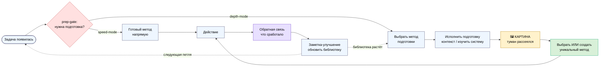
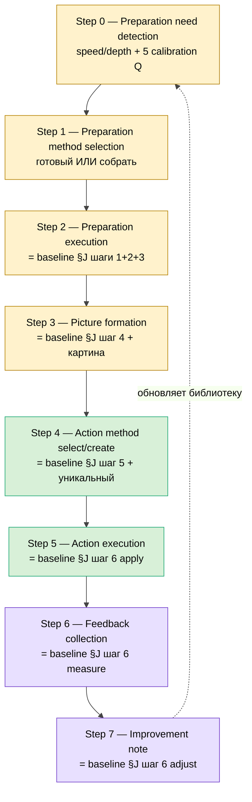
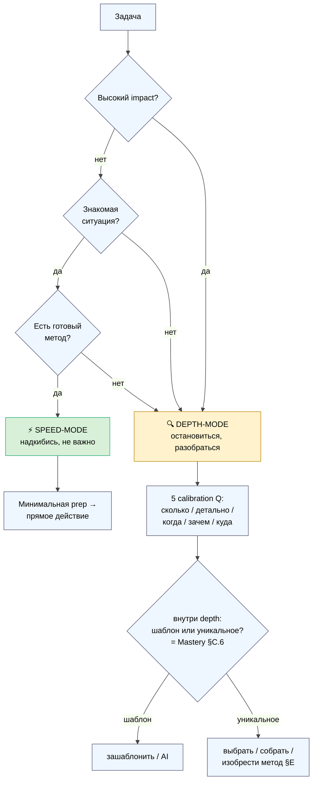
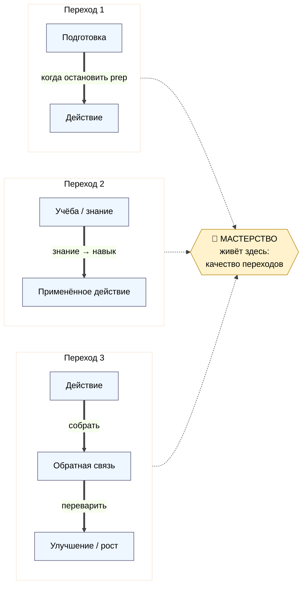

# 🎯 Preparation Stage Concept SUPPLEMENT

> **Что это.** Дополнение к концепции метода / мастерства / мета-метода: **этап подготовки** —
> отдельная стадия перед действием, неотъемлемая часть результата, точка, где мастерство видно и
> накапливается. Существующие документы (Method V2 §J / Mastery Concept / workshop-concept /
> metaplan-v2) не выделяли подготовку явно — этот supplement делает это + предлагает 7 augmentation
> patches.
>
> **R1 surface only:** формулировки = опции, финал за Русланом. **R2 STRICT:** Method V2 §J LOCKED
> сохранён, расширение = supplement-reference, не правка. **R11 append-only:** новый файл, existing
> docs не модифицируются. **R12 paired-frame STRICT:** подготовка трактуется как честная практика, не
> манипулятивная техника. **Полная глубина** — 7 phase reports в `reports/preparation-stage-concept-
> supplement-2026-05-26/`.

---

## §0 TL;DR (90 секунд) + контекст

**Одна мысль.** Перед любой работой есть **подготовка** — и это **уже работа**, а не «пока не начал».
Твой результат начинается там, где ты начинаешь к нему готовиться. Мета-метод начинается не с вопроса
«каким способом делать», а с вопроса **«нужна ли подготовка — и сколько?»**. И главный трюк: когда
прыгаешь в дело сразу — берёшь готовый метод из репертуара; когда сначала готовишься — появляется
**картина**, и из неё собираешь **уникальный метод** под конкретную ситуацию, который работает лучше
готового. На этой грани (подготовка→действие, учёба→действие, действие→обратная связь) мастерство
видно и накапливается.

**Что добавляет supplement:**
1. **Этап подготовки явно** — отдельная стадия с калибровкой (сколько/насколько/когда/зачем/куда).
2. **Extended meta-method 8 шагов** — выносит подготовку из имплицитного (внутри Method V2 §J шагов 1-4)
   в явный (Steps 0-3), сохраняя §J LOCKED.
3. **7 augmentation patches** — Method V2 §J / Mastery (×3) / Метод direction / Vision / Workshop /
   Network / Образование.
4. **5 vivid worked examples** + AI-стратификация подготовки (O-182).

**Контекст.** Voice Руслана 26.05 Note 3 — критическое дополнение к Mastery Concept (26.05 morning) и
DR-38 мета-методу. Прямое продолжение дуги O-176..O-185 (образовательная парадигма) и Mastery §C (выбор
метода). Pool result — NO auto-launch; Ruslan читает → ack patches.

---

## §1 Verbatim voice 26.05 Note 3 (F2 anchor — preserve)

> «там где это шестишаговая процедура метод метода да ещё вот это все как-то описал связанное с этапом подготовки то есть по сути вот как раз понимание что перед работой тебе еще нужно подготовиться да и что в целом но подготовка это уже работа это нет ли неотъемлемая часть результата и соответственно твоя работа твой результат он начинается там где ты начинаешь к нему как бы подготавливаться
>
> и как раз что вот метод выбора метода это как раз вот понимать вот это что перед любой задачей есть подготовка и соответственно понимать насколько много тебе ее надо насколько она детальна и так далее
>
> потом вот понимать тебе там эту задачу нужно сделать быстро да ну именно просто чтобы ну надкибись и это не важно или все-таки тебе здесь надо остановиться там разобраться потому что от понимания этого дела далее зависит вся работа или конкретно от этого документа зависит ну как бы важные аспекты какие-то и так далее
>
> и соответственно вот как раз нужно по методу выпора методов блять получается вот этим методом значит что сперва понимать что у нас идет сперва подготовка потом действия а потом ну и соответственно на основе этого выбирать уже метод блять подготовки и потом блять метод действия выбирать только уже после того как у нас метод подготовки прошел блять
>
> то есть вот такой как бы трюк что мы когда выбираем метод подготовки вернее мы когда сразу хотим что-то делать да мы этот ну выбираем из существующих методов а если мы вот видим что для начала нужна подготовка да и мы выбираем метод подготовки то потом после этапа подготовки у нас как бы появляется какое-то видение картина и мы можем уже какой-то более уникальный собственный метод сделать который скорее всего будет более эффективным подходить конкретно к этой ситуации и так далее
>
> и в этом как раз и суть вот подготовки и нужно понимать что вот есть подготовка и нужно понимать сколько именно этой подготовки нужно когда блять зачем куда и так далее
>
> и вот как раз вот где-то здесь на этой грани вот и мастерство как бы видно и накапливается и вот это вот переход из подготовки к действию из вот учебы тоже к действию блять и потом обратно из действий обратно возвращения в обратную связь улучшения и так далее вот как-то на этом уровне где-то мастерство вот ну и в целом вот навык и способность делать что-либо находится»

[src: Ruslan voice 26.05 evening Note 3 — Preparation Stage]

---

## §2 10 key concepts extracted (P-01..P-10)

| ID | Concept | Implication |
|---|---|---|
| **P-01** | Preparation = first stage of work (не pre-work) | Результат начинается там, где начинается подготовка |
| **P-02** | Метод-метода = понимание что перед задачей есть подготовка | Первичная проверка: «нужна подготовка или сразу действие?» |
| **P-03** | Preparation calibration — сколько / насколько / когда / зачем / куда | Качество подготовки = match с важностью задачи |
| **P-04** | Speed-vs-depth judgment — «надкибись» vs «остановиться разобраться» | Mastery-навык: триаж задач по требуемой подготовке |
| **P-05** | Sequence: prep → action | Метод подготовки выбирается до метода действия |
| **P-06** | Trick: уникальный метод из картины (сразу=репертуар; prep=изобретение) | Preparation = creative ground для уникальных методов |
| **P-07** | Calibration questions | Операционный чеклист этапа подготовки |
| **P-08** | Mastery visible at transitions | Мастерство = качество переходов, не «делания» |
| **P-09** | Loop: action → feedback → improvement → next prep | Непрерывное улучшение встроено в мета-метод |
| **P-10** | Skill/ability lives at the transition layer | Мастерство измеримо = качество петель prep→action→feedback |

---

## §3 Preparation Stage Concept (compressed — полный spec в Phase 1)

### Что это
Подготовка — **первая стадия работы, а не преамбула**. Промежуток, где ты ещё не «делаешь дело», но
уже работаешь над ним: собираешь контекст, изучаешь систему, формулируешь подход. Ощущается как
**рассеивание тумана**: в конце появляется «картина» — сигнал к переходу в действие.

**Контраст:** подготовка-как-обязанность (cargo-cult — ритуал без картины) vs подготовка-как-творческий-
фундамент (mastery — калиброванная, даёт картину и уникальный метод).

### Неотъемлемая часть результата
Результат на ~80% определяется на этапе, который большинство не считает работой. Метафора: результат =
здание, подготовка = фундамент+проект; кривой проект → кривое здание, сколько ни старайся на стройке.
Примеры: хирург (5 ракурсов до скальпеля) · шеф (mise en place) · инженер (требования до кода) ·
писатель (ресёрч до абзаца) · sales (discovery prep) · консалтинг (аудит до рекомендаций).

### Метод-метода: prep-gate
Первый ход — **«сразу делать (готовый метод) или сначала подготовка (построить контекст)?»**
- **Speed-mode** (низкий impact + знакомо + есть метод) → минимальная prep, прямое действие.
- **Depth-mode** (высокий impact / уникально / каскадно) → подготовка обязательна.

5 calibration questions: **сколько** (10мин-неделя) / **насколько детально** (набросок-протокол) /
**когда** / **зачем** (узнать/построить/прояснить) / **куда** (направление/границы).

> ⚠️ **Интеграция с Mastery §C.6** (предшественник): prep-gate сидит **выше** template/unique-выбора.
> Сначала «думать или не думать» (prep-gate); если depth-mode → внутри под-выбор «шаблон или уникальное».
> Два уровня одного решения, не дубль (R6 честность).

### The Trick — уникальный метод из картины (P-06, ядро)
Сразу делать → метод из **репертуара** (заперт в том, что знаешь). Сначала подготовка → **картина** →
можешь **создать уникальный** метод под ситуацию (эффективнее, потому что подогнан). Большинство
значимых задач уникальны (Mastery §C.6: «каждый клиент уникален»), репертуара не хватает → подготовка =
creative ground. Это механизм того «изобретает метод» из определения мастерства (Mastery §A).

### Мастерство на 3 переходах (P-08, P-10)
1. **prep → action** (когда остановить подготовку, начать) — анти: analysis paralysis;
2. **study → action** (знание → навык) — анти: коллекционер знаний;
3. **action → feedback → improvement** (замыкание петли) — анти: повтор ошибок.
Мастерство = качество+скорость+точность **переходов**, не самих шагов (tacit-слой Полани).

---

## §4 Extended Meta-Method (compressed — полный разворот в Phase 2)

**Baseline (Method V2 §J, LOCKED-verbatim):** 1) identify систем · 2) собрать info · 3) обработать ·
4) поставить цель · 5) выбрать метод · 6) apply+measure+adjust. *Подготовка уже здесь, но размазана в
шагах 1-4 и не названа.*

**Extended (8 шагов 0-7, R1 supplement-предложение):**

| # | Шаг | Связь с §J |
|---|---|---|
| 0 | Preparation need detection (speed/depth + 5 Q) | *было имплицитно* |
| 1 | Preparation method selection | *было имплицитно* |
| 2 | Preparation execution | = §J 1+2+3 |
| 3 | Picture formation | = §J 4 + картина |
| 4 | Action method select/**create** | = §J 5 + опция уникального |
| 5 | Action execution | = §J 6 (apply) |
| 6 | Feedback collection | = §J 6 (measure) |
| 7 | Improvement note → next loop | = §J 6 (adjust) |

**Почему важно:** мастерство «видно и накапливается» на переходах — если их не выделить явно, нельзя
осознанно тренировать. Extended не «больше шагов ради шагов», а делание видимыми мест, где живёт навык.

---

## §5 Augmentation patches summary (полные insert-тексты в Phase 3)

7 патчей, 12 insert-точек. Все — companion proposals (R1, R11 append-only). Ни один файл не модифицируется.

| # | Патч | TARGET | Суть |
|---|---|---|---|
| **P-A** | Method V2 §J (LOCKED) | перед 6-step | Step 0 prep-gate (supplement-reference) |
| **P-B.1** | Mastery §C.7 | после §C.6 | prep-gate **выше** template/unique |
| **P-B.2** | Mastery §H п.8 | активности | preparation calibration = core mastery-активность |
| **P-B.3** | Mastery §F | AI-страт. | AI = preparation-amplifier; человек = метод на переходах |
| **P-C** | Метод direction (metaplan-v2 #1) | narrative | plain-Russian абзац для partner-facing |
| **P-D** | Vision (workshop §4) | How mechanics | подготовка как культурная ценность среды |
| **P-E** | Workshop (§1) | активности+роли | prep sessions + качество prep = маркер мастер/ученик |
| **P-F** | Network (§3) | активности+роли | prep expeditions + preparation-mentor роль (**R12 STRICT**) |
| **P-G** | Образование (metaplan-v2 #7 + plan) | принципы+7 ступеней | 8-й принцип + Bloom-map (Evaluate/Create = §E трюк) |

---

## §6 Worked examples (compressed — vivid версии в Phase 4)

| # | Сценарий | Режим | Уникальный метод из картины | R12 |
|---|---|---|---|---|
| 1 | Звонок Maxim (партнёр T1) | depth | discovery-flow под Maxim (старт с его дня, не с Jetix) | ✓ STRICT — понять, чтобы помочь, не продавить |
| 2 | Видео A (блокер Wave 1) | depth | «крючок вперёд» + стратегия дублей (открывашка 4 дубля) | — |
| 3 | Notion-trial Дмитрий | depth | минимальный 5-баз шаблон + онбординг (урезал против своих интересов) | ✓ STRICT — польза клиенту |
| 4 | Daily Log | **speed** | (нет — готовый метод; мастерство = НЕ готовиться) | — |
| 5 | Sprint-пивот | depth max | ребаланс 70/30 + чекпойнт (готовый бинарный фреймворк увёл бы в ложный выбор) | партнёр-обязательства |

**Вывод:** во всех depth-сценариях ключевое решение родилось **на этапе подготовки**, не в действии.
В speed — мастерство = НЕ готовиться. §E трюк срабатывал каждый раз, когда готовый метод «почти подходил».

---

## §7 AI integration (compressed — полный mapping в Phase 5, per O-182)

**Тезис:** AI = preparation-amplifier; человек = action-strategist + transitions-master.

| Шаг | Кто ведёт |
|---|---|
| 0 detect / 3 интерпретация картины | **человек** (judgment) |
| 1 выбор метода prep | человек + AI suggestion |
| 2 prep execution (ресёрч/синтез/формат) | **AI HEAVY** ⚡ (самый «зачитеримый» слой, O-181) |
| 4 создание уникального метода | **человек** ⭐ mastery-момент |
| 6 feedback / 7 improvement | человек (смысл) + AI (данные) |

Этап подготовки расщепляется по O-182 чище всего: рутина prep → AI освобождает время+ясность → человек
собирает уникальный метод (шаг 4) и идёт на фронтир (O-183). Анти-паттерн: делегировать AI шаг 4 (получишь
усреднённый метод, потеряешь подгонку) или шаг 0 (AI всегда скажет depth → over-prep).

---

## §8 Mermaid PREP-1..PREP-4 (inline)

### PREP-1 — Полный цикл: Подготовка → Действие → Обратная связь

### PREP-2 — Extended meta-method (8 шагов, этап подготовки явно)

### PREP-3 — Speed-mode vs Depth-mode (decision tree)

### PREP-4 — Мастерство на 3 переходах

*(Полные версии с анти-паттернами + INDEX — `reports/.../07-mermaid-prep.md` + `diagrams/_INDEX.md`.)*

---

## §9 R1 decisions queue (что ждёт тебя)

| ID | Решение | Default / рекомендация |
|---|---|---|
| **D-P1** | Принять **этап подготовки** как явную часть мета-метода? | Pool → ack (рекоменд: да, прямое следствие voice) |
| **D-P2** | Extended 8-шаговая procedure — интегрировать как supplement-reference к Method V2 §J (НЕ правка LOCKED)? | Supplement-reference (R2 STRICT preserved) |
| **D-P3** | Патчи Mastery (P-B.1 §C.7 / P-B.2 §H / P-B.3 §F) — применить в Mastery spec? | Pool first; P-B.1 рекоменд (фиксирует иерархию над §C.6) |
| **D-P4** | Патч P-C (Метод direction plain-Russian абзац) — в публичный narrative #1? | Pool; полезен для partner-facing двери |
| **D-P5** | Патчи Vision/Workshop/Network (P-D/P-E/P-F) — preparation-mentor роль + prep expeditions добавить в Сеть? | Pool; P-F несёт R12 surface (проверить framing) |
| **D-P6** | Патч P-G — preparation как teachable модуль в Образование + 8-й принцип в consolidated plan? | Pool; Bloom Evaluate/Create = §E совпадение |
| **D-P7** | C17 «восстановление» (recovery, DR-38 §19 gap) — связать с prep-калибровкой (подготовка тоже знает, когда отступить)? | Open question; surface для будущего |

---

## §10 Cross-refs

| Документ | Связь |
|---|---|
| `METHOD-LIFE-DEVELOPMENT-V2-2026-05-21.md` §J | Baseline 6-step (LOCKED) → extended 8-step (P-A) |
| `META-METHOD-8-COMPONENT-DEEP-2026-05-22.md` | C9 изучение + C1 проработка = ядро подготовки; C13 speed = speed-mode |
| `03-mastery-concept-spec.md` (Mastery) | §A определение (изобретает метод) · §C выбор · §C.6 шаблон/уникальное · §F AI · §H активности (P-B) |
| `04-mastery-deepening.md` | §C.6 «первый под-выбор» — интеграция (prep-gate выше) |
| `JETIX-PUBLIC-DOCS-METAPLAN-V2-2026-05-25.md` | #1 Метод (P-C) + #7 Образование (P-G) |
| `JETIX-WORKSHOP-MASTERY-NETWORK-CONCEPT-2026-05-26.md` | §1 Workshop (P-E) · §3 Network (P-F) · §4 Vision (P-D) |
| `CONSOLIDATED-HUMAN-LANGUAGE-PLAN-2026-05-24.md` | 7 принципов + 7 ступеней Bloom (P-G) |
| `RUSLAN-NOTES-EDUCATION-PARADIGM-2026-05-24.md` | O-182 стратификация (§7 AI) · O-181 anti-cheating · O-185 question-first |

---

## §11 К чему ведёт

1. Ruslan читает BRIEF (5 мин) → main supplement (20-30 мин) → augmentation patches (если deep apply).
2. Ruslan picks D-P1..D-P7 (7 решений).
3. После ack → интеграция в: Method V2 §J (extension via supplement reference) · Mastery Concept (патчи)
   · Метод direction (metaplan-v2 → v3) · Vision/Workshop/Network specs · Курс skeleton + Образование
   (preparation как teachable skill).
4. **Pool result — NO auto-launch.** Append-only; existing docs untouched.

**Главное, что разблокирует:** этап подготовки даёт мета-методу недостающую первую стадию и объясняет,
**где именно** мастерство видно и тренируемо (на переходах). Это превращает абстрактное «мастер выбирает
метод» в операционную последовательность: prep-gate → калибровка → картина → уникальный метод → действие
→ петля. И встраивает AI чисто (O-182): рутина prep — машине, картина и уникальный метод — человеку.

---

*Supplement closure 2026-05-26. Этап подготовки как неотъемлемая часть мастерства/метода/результата:
verbatim voice (F2) + 10 концептов + concept spec + extended 8-step procedure + 7 augmentation patches
+ 5 worked examples + AI-стратификация + 4 mermaid. R1 surface only · R2 STRICT (Method V2 §J LOCKED
preserved) · R11 append-only (existing docs untouched) · R12 paired-frame STRICT (подготовка = честная
практика) · IP-1 STRICT (RUSLAN-LAYER examples). Pool result — Ruslan-ack pending.*
