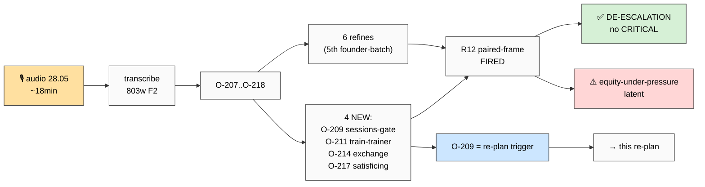
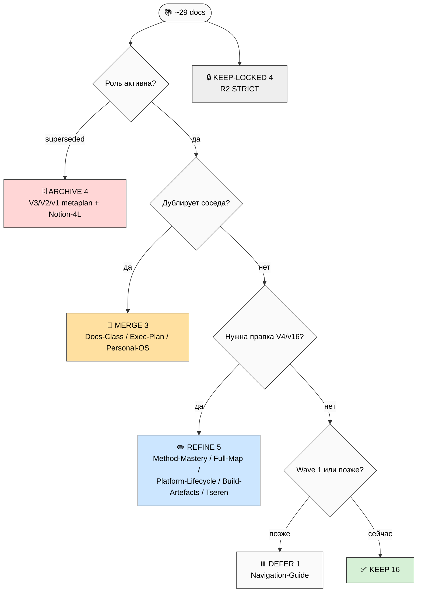
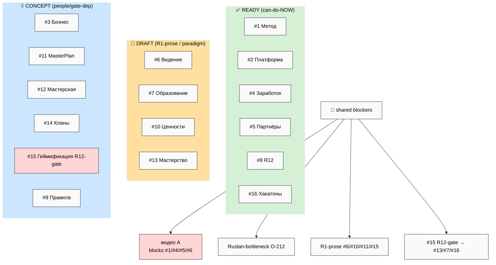
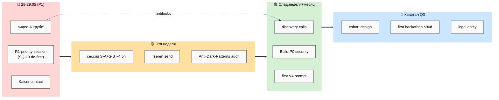
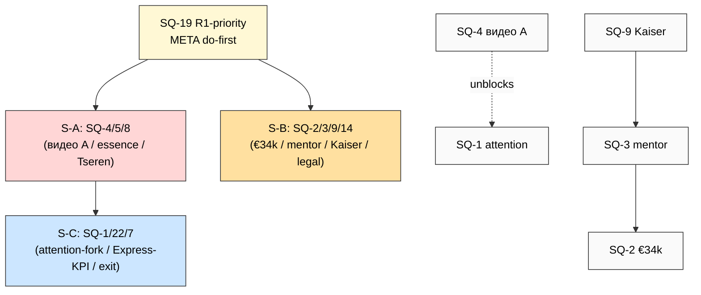
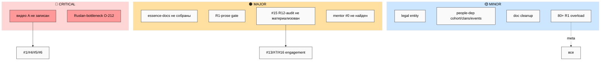
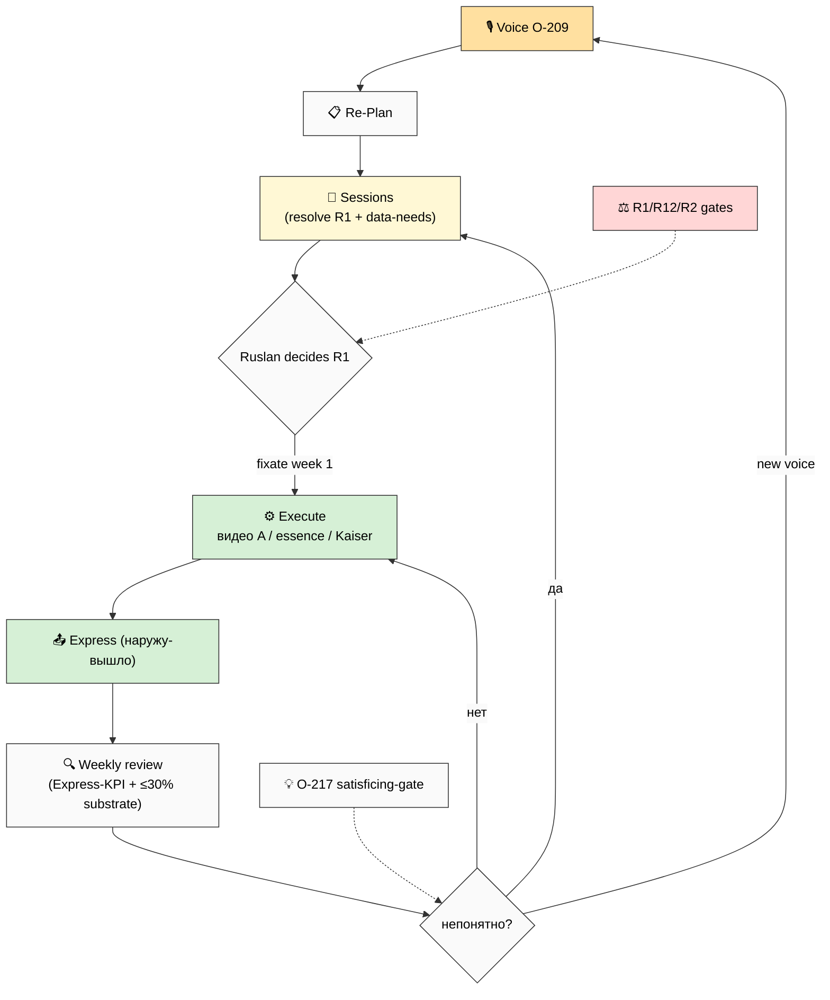
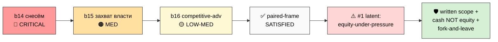

# 📋 Strategic Re-Plan 2026-05-28

> **Что это.** Главный документ, собранный из голосовой заметки 28.05 01:41 + ВСЕГО substrate Sprint
> 25-27.05. Делает: (1) интегрирует voice-16 (O-207..O-218); (2) фиксирует «где мы сейчас»; (3) re-audit'ит
> ~29 документов (KEEP/REFINE/MERGE/DEFER/ARCHIVE); (4) разбирает 16 направлений V4 (что есть/нужно/можем
> сейчас/блокирует); (5) формирует очередь 22 стратегических сессий с **data-needs** (ядро инструкции Ruslan'а);
> (6) даёт roadmap + blockers map + R12 surfaces + consolidated R1 queue. Закрывает «хвост» voice-batch-15
> (Situation Report). **Pool result — NO auto-launch.**
>
> **R1 surface.** Все strategic-prose statements (Core/триада/per-direction claims/decisions) ФЛАГНУТЫ
> Ruslan-authoring. **R2 STRICT:** Foundation + 4 LOCKED не тронуты. **R12 paired-frame SATISFIED.** **IP-1:**
> имена (Kaiser/Левенчук/Tseren) = role-type примеры. **voice DRAFT-only.** **Append-only.**

---

## §0 TL;DR (90 секунд) + что ты просишь

**Один факт.** Substrate построен и плотен (~120+ docs, V4 16 directions, LIVE Notion, 2 research DONE, 17 ROY).
Наружу почти ничего не вышло. voice-16 = **остывание batch-15 энергии в структуру**: «эта неделя — фиксировать
документы + основные вопросы; провести несколько стратегических сессий (главный stopper); со следующей —
плотно execute». Это 5-й батч подряд про design→execution transition.

**Что ты просишь (paraphrase voice-16):** обработать заметку + новый документ с таблицами/mermaid/человеческим
языком + вытянуть план + ещё раз по всем выбранным документам пройтись (всё ли подойдёт) + что нужно по каждому
направлению + что можем сейчас + стратегические сессии (основные вопросы + какие данные нужны для решения) +
подробный отчёт с несколькими mermaid.

**Что этот re-plan отвечает:**
- **Re-audit:** из ~29 docs — KEEP 16 / REFINE 5 / MERGE 3 / DEFER 1 / ARCHIVE 4 / KEEP-LOCKED 4. Substrate
  здоров; чистка = предсказуемые супер-седации (3 metaplans V1/V2/V3 + Notion-4L) + нормализация direction-count
  к 16 + re-fixate elapsed dates. **Никаких «всё переделать».**
- **16 directions:** 8 directions actionable СЕЙЧАС (solo+AI, без новых людей): #4 Заработок / #5 Партнёры /
  #8 R12 / #16 Хакатоны (Wave-1) + #1 Метод / #2 Платформа + #15 (= построить R12-тормоза) + #17 Security
  (Build-P0). Остальные блокированы на R1-prose (Ruslan) / people (Wave 3) / R12-gate.
- **Strategic sessions:** 22 вопроса (SQ-1..SQ-22), каждый с data-needs. 6 cluster-сессий (~13.5h total;
  P1-bundle ~4.5h = «эта неделя»).
- **Главные блокеры:** видео A (sole no-dependency — блокирует #1/#4/#5/#6) + Ruslan-bottleneck (O-212).

**25+ R1-решений ждут тебя в §10.** Это re-plan структуры + sessions queue, не сбор документов.

---

## §1 Voice batch 16 интеграция (O-207..O-218 ядро)

Полная обработка — `02/03/04-voice-batch-16-*.md` + `VOICE-BATCH-16-INSIGHTS-2026-05-28.md`.

**Регистр (важно):** voice-16 = **планирующий, структурирующий** (не паника batch-15). «Не спешить, не бежать,
дисциплинированно собрать в кучу». Энергия batch-15 («1000% фокус», €34k, «захват власти») конвертирована в
дисциплину. Это **здоровый сдвиг** — снижает burnout-flag.

**4 NEW items:**
- **O-209 ⭐ strategic-sessions-gate** — «перед операционкой/командой ещё раз стратегически собраться» = главный
  stopper. *Это буквально trigger всего re-plan.* → Phase 6 материализует.
- **O-211 train-the-trainer** — «поставить людей, которые обучают тех, кто работает» (R12 LATENT; premature per Founder-Role).
- **O-214 mentor exchange-model** — give (азарт + возможности + инструменты + обучение) ↔ get (опыт + видение + финансы + время). R12-relevant.
- **O-217 satisficing planning-gate** — «дальше не планирую пока непонятно; когда понятно — работаем» (anti-over-plan; здоровая мета-дисциплина).

**2 strong re-frames:**
- **O-208 ⭐ docs-as-essence-transfer** — документы = передать «всю суть Jetix» одному партнёру, не «описать метод».
- **O-218 capital→time-freeing** — €34k re-targeted на «выкуп времени», не «команду брать» (softens O-199; R12-чище).

**6 convergent refines** (founder-transition arc, 5-й батч): O-207 (calendar 2 недели) · O-212 (bottleneck, подтверждён 2-й батч) · O-213 (Kaiser-first + mentor-ask) · O-215 (leverage-через-людей) · O-210 (attention-fork) · O-216 (competitive-advantage, de-escalated).

*(RP-2 — voice-batch-16 flow.)*

---

## §2 Где мы сейчас (post-Sprint 25-27.05)

### §2.1 Quantitative state
- **Foundation v1.0** LOCKED untouched (11 Parts + Pillar A/C + 8 RUSLAN-ACK).
- **V4 MetaPlan canonical:** 16 directions. 5 центров связей (R12/Кланы/Хакатоны/Геймификация/Мастерская), 3 хаба, 2 движка.
- **~120+ strategic docs** · **LIVE Notion** (35 pages / 36 DB / 235 fields / 44 relations) · **~64 wiki concepts** · **CRM 180+** · **17 ROY agents** · **voice batches 1-16** processed.
- **2 research DONE:** Founder-Role (15 R1) + Info-Security (11 R1).
- **4 LOCKED canonical** untouched (Method V2 / Strategic Plan / Economic V10 / AI-Market PLAN).

### §2.2 Qualitative shift (главное)
Один структурный факт повторён **5 батчей подряд** (O-160→O-174→O-186→O-201→voice-16): **development mode
закончен, переходим в promotion/execution.** Substrate готов; единственный gap — **выход наружу** (видео,
лендинг, презентация, отправка письма, разговоры). Situation-Report формулирует точно: «все дыры в одном месте
— наружу». voice-16 добавляет: (a) календарную рамку (эта/следующая неделя); (b) механизм разблокировки
(стратегические сессии); (c) named bottleneck = сам Ruslan (O-212).

**FPF-рамка (per §3 substrate-read):** этот re-plan = план-как-объект (4D-экстент: predecessor handoff 27.05 →
new 28.05) для Jetix-as-Workshop-Mastery-Network. Сравниваем план-документ × план-документ. Acceptance predicate
= Ruslan-instruction (re-audit + breakdown + can-do-now + sessions + data-needs).

---

## §3 Doc re-audit verdicts (~29 docs + 4 LOCKED)

Полные verdict-абзацы + drift-анализ — `05-docs-reaudit.md`.

*(RP-3 — verdict tree.)*

**Verdict tally:** KEEP 16 · REFINE 5 · MERGE 3 · DEFER 1 · ARCHIVE 4 · KEEP-LOCKED 4.

**Главные drift'ы (resolve):** (1) direction-count 6→11→14→**16** — нормализация ко V4; (2) stage-model
Navigation-5-stage ⚔️ Build/Run/Scale — Build/Run/Scale wins; (3) три priority-листа (Full-Map 94 / Docs-Class
19 / Outreach 18) — reconcile к V4 master-matrix; (4) elapsed dates — re-fixate к voice-16 рамке.

**ARCHIVE (рекоменд `git mv`, append-only):** V3-metaplan / V2-metaplan / v1-metaplan / Notion-4LAYERS — все
явно superseded; уникальной потери нет. **8 consolidation pool-items** (C-1..C-8) — `05-docs-reaudit.md` §4.

---

## §4 Per-direction breakdown (16 directions)

Полная 4-cols таблица + 16 dense абзацев + cluster synthesis — `06-per-direction-breakdown.md`.

*(RP-4 — 16 directions current state + blockers.)*

**Master 4-cols (компрессия — full в Phase 5):**

| # | Direction | ЕСТЬ | НУЖНО | СЕЙЧАС | БЛОКИРУЕТ |
|---|---|---|---|---|---|
| 1 | Метод | Method V2 🔒 + public DRAFT | видео A, course | видео A «грубо» + finalize public | перфекционизм |
| 2 | Платформа | Notion built + ROY 17 | UX + trial | walkthrough + Дмитрий trial | token/UX status |
| 3 | Бизнес | Economic V10 🔒 + Charter spec | legal entity, Steuerberater | Steuerberater outreach + Charter draft | legal=€, entity-timing |
| 4 | Заработок | 7 models + #4 doc ✅ | first customer | discovery calls | gated видео A + Ruslan-time |
| 5 | Партнёры | 4 types + queue + CRM 180+ | mentor #0 | Kaiser + advisor + Tseren | exchange R12-scope |
| 6 | Видение | Vision 12/12 + Core(R1) | Core prose, видео C | видео A + skeleton | Core = R1 Ruslan |
| 7 | Образование | 7 ступеней + 6 types | curriculum, видео B | видео B + outline | cohort=Wave 3 |
| 8 | R12 | LOCKED + 4 classes + audit spec | public page, audit materialized | Anti-Dark-Patterns audit + doctrine→Charter | якорь = R1 |
| 9 | Правила | 61 правило + clan-floor | Свод public | draft Свод + Klan-template | value-author R1 |
| 10 | Ценности | триада + beliefs | финал триады, public | триада reflection (R1) | R1 Ruslan |
| 11 | Master Plan | Tesla 4 parts + Strategic 🔒 | public Part1-2 | Part1-2 skeleton | sessions-dep + R1 |
| 12 | Мастерская | 8 zones + «качалка» | public, space | Workshop public desc | space=Run |
| 13 | Мастерство | def + темы-vs-уровни | public, skill-tree | public desc | skill-tree #15-gated |
| 14 | Сеть+Кланы | 7-фаз lifecycle + mesh | Klan Charter, first clan | Klan Charter template | clans=Run |
| 15 | Геймификация | thesis + Anti-Dark-Patterns spec | audit MATERIALIZED, meaning | **build audit (тормоза)** | game-mechanics gated |
| 16 | Хакатоны | substrate + orchestration cycle | playbook, first event | playbook + event design | people=Q3 |

### §4.1 Per-direction плотный разбор (16 — maturity / resources / deps / R12 / «done next week»)

**#1 🧪 Метод — READY (substrate) / DRAFT (public).** Самое зрелое по substrate: Method V2 (65K, LOCKED) —
онтология + метод-метод level-3 + Extended 8-step + prep-stage. Методологический родитель всего. Нужно: видео A
(~10-15 мин «грубо») + R1 prose pass на public-описание; AI несёт ~80% подготовки. Deps: course design зависит
от pedagogy (#7); skill-tree gated за #15. R12: мягкий (только leverage-claim = claim-ladder). **Done next week:**
видео A записано «грубо» + Method-Mastery-public финализирован и положен в essence-set. Разблокирует #4/#5/#6.

**#2 🚀 Платформа — READY (Notion built) / WIP (UX+trial).** Notion 3-LAYERS-V2 реально построен (35 pages /
36 DB / 235 fields / 44 relations LIVE) + AI-Tools mega (20 tools) + ROY 17. «Станки мастерской». Нужно: UX-
walkthrough + 1 trial (Дмитрий, ~0 cost) + views в UI + token revoke. Deps: Build-Report хвосты (token revoke 🔐
+ UX walkthrough — статус неизвестен). R12: fork — «качалка/склад», member забирает данные+долю. **Done next
week:** token отозван; Ruslan прошёл walkthrough; Дмитрий получил trial → первый live user-feedback loop
(критичен для Build→Run gate).

**#3 💼 Бизнес — CONCEPT (legal) / READY (economic model).** Economic V10 (LOCKED) даёт полную экономику, но
юридического тела нет (нет entity, нет Steuerberater, Charter = spec не текст). Нужно: Steuerberater (vendor,
Берлин, дёшево — Founder-Role #0) + юрист (€) + Charter v1 текст (AI + R12 paired, Charter = ВЫСШАЯ R12-поверх-
ность). Deps: кооп-vs-GmbH-vs-Genossenschaft = R1; entity-timing (pre-revenue?). R12: govern (5:1 + fork-and-leave
в Charter с v1). **Done next week:** списался с 1-2 Steuerberater (vendor, не найм); Charter v1 draft собран AI,
готов к review. Регистрация entity = отдельный R1 (вероятно после first revenue).

**#4 💰 Заработок — READY (best-positioned, GAP ✅).** 7 revenue-моделей (consulting/quick-money СЕЙЧАС → cohort
€1500 Q3 → hackathon ≥$30K → IP/talent) + Economic V10 + готовый doc #4. Revenue-sequencing: consulting/quick-
money = сейчас (активный P1). Нужно: время Ruslan на outreach; AI готовит proposals. Deps: outreach gated на видео
A + essence-docs; bottleneck = selling-time (O-212, founder-only). R12: STRICT (10-25% take, no extraction).
**Done next week:** #4 finalized (✅); 1-2 discovery-звонка (Дмитрий-tester + quick-money lead); первый разговор о
платном engagement. Первый cashflow → снимает €34k tension + разблокирует hiring.

**#5 👥 Партнёры — READY (substrate) / WIP (mentor-sourcing, GAP ✅).** 4 типа T1-T4 + 8 R12-вопросов + Founder-
Role queue (0→10) + Wave-1 имена + CRM 180+ + Call-Plan-Kaiser. voice-16 фокус: mentor «под крылышко» (#0 Advisor,
~0 cost). Нужно: Kaiser-разговор + 1 advisor; exchange-model R12-reframe (cash-not-equity, fork-and-leave). Deps:
mentor зависит от Kaiser; outreach gated essence-docs. R12: STRICT — exchange = #1 latent risk (equity-under-
pressure). IP-1: Kaiser/Левенчук = role-type примеры. **Done next week:** Kaiser contacted (R12-clean dual ask); 1
advisor намечен; exchange переписан симметрично; Tseren letter sent.

**#6 📜 Видение — DRAFT (R1-prose gate).** Vision/FUNDAMENTAL (12/12) + Workshop concept + Core statement (R1) +
видео C spec + триада + Founder-as-Exhibit. Нужно: Core-statement Ruslan-prose + видео C + Vision public doc +
authenticity-tension resolve (gamified growth ≠ hype). Можем: видео A (= entry to vision) + Vision skeleton (AI, R1
pending). Deps: Core statement = R1 Ruslan; видео C depends A/B. R12: мягкий. **Done next week:** видео A; Vision
skeleton собран AI; authenticity-tension зафиксирован (R1 reflection). Core statement prose = только ты.

**#7 🎓 Образование — DRAFT (curriculum) / READY (paradigm).** 7 ступеней Bloom + 6 типов + 5-element прошивка +
7 program-вариантов (Consolidated-HL) + Outreach-CTAS. Парадигма зрелая, материалы нет. Нужно: видео B + cohort
curriculum + pedagogy. Deps: cohort = Wave 3 (нужны ученики); train-the-trainer (O-211) premature. R12: uplift
(positive; cohort-pricing STRICT). **Done next week:** видео B draft (после A); cohort outline (AI); pedagogy-
решения. Полный cohort = позже (нужен первый тестер).

**#8 ⚖️ R12/Обещание — READY (densest hub) / DRAFT (public).** R12 LOCKED + 12 rules + 4 action-classes + Prog-
Ethereum + 8 R12-вопросов + Anti-Dark-Patterns spec. Нужно: R12 public page + Anti-Dark-Patterns materialized (gate
для #15) + Charter R12 текст. Можем: draft R12 page (AI, paired); материализовать Anti-Dark-Patterns checklist;
doctrine O-193 → Charter (free). Deps: ФРАЗА-якорь = R1; on-chain = Phase 2+. **Done next week:** Anti-Dark-Patterns
audit материализован (R12-gate); R12 public page draft; doctrine O-193 в Charter.

**#9 📋 Правила — DRAFT.** 10 углов / ~61 правило + clan-governance floor + anti-dark-pattern + event-conduct +
inter-clan rules. Нужно: Свод public (~25-30) + internal (~30) + Klan Charter template. Можем: draft Свод (AI из
61); Klan Charter skeleton (R12-heavy). Deps: clan-governance = Wave 3; rules need Ruslan value-authoring (R1). R12:
углы 3/4. **Done next week:** Свод draft собран AI (формат «Утверждение→Зачем→Enforcement→Нарушение→Источник»);
Klan-template skeleton. Финал value-authoring = ты.

**#10 💎 Ценности — READY (триада) / DRAFT (public).** Триада O-138 + 6 op-values + 7 beliefs + 7 anti-beliefs +
NEW (уважение, anti-dark-pattern). Триада — signature Ruslan, зрелая. Нужно: триада финал (R1) + Ценности public +
meaning-statement #15 (R1). Можем: триада reflection (R1) + skeleton (AI). Deps: триада + meaning = чисто Ruslan-
prose. R12: A1-3/7. **Done next week:** триада reflection зафиксирована; skeleton собран AI; meaning-statement #15
draft (R1). R1-heavy — рой только skeleton.

**#11 📜 Master Plan — CONCEPT (public) / READY (Strategic Plan substrate).** Tesla-style 4 parts (1-2 PUBLIC /
3-4 GATED: $1T + NS) + Strategic Plan (LOCKED) + hackathon Gantt + clan-spawn timeline. Нужно: Master Plan public
text (Part 1-2). Можем: Part1-2 skeleton (AI, R1 prose); **этот re-plan = near-term substrate**. Deps: зависит от
strategic sessions (O-209) — нельзя зафиксировать до резолва верхних вопросов; $1T/NS gated (Balaji trigger). R12:
won't. **Done next week:** Part1-2 skeleton; финальная дуга = после sessions.

**#12 🏛️ Мастерская — CONCEPT (metaphor crystallized).** 8 зон + роли + «качалка/склад» + online→offline (Берлин→
cities) + concept main. Метафора = THE Foundation frame, но public/физика нет. Нужно: Workshop public doc + space
(Run). Можем: Workshop public desc (AI); online-first (виртуально сейчас); зоны outline. Deps: offline = post-
Foundation; activation = через #16. R12: fork. **Done next week:** Workshop public desc draft (3 грани + 8 зон +
«качалка/склад»); online-first зафиксирован. Физика = отложено (Run, capital+люди).

**#13 🎯 Мастерство — READY (definition) / CONCEPT (engagement-wrapper, CENTRAL).** Definition refined + темы-vs-
уровни (anti-ranking) + Templates×Unique + 3 axes + Mastery-at-transitions + curiosity-loop + Prep supplement.
Определение зрелое; engagement-обёртка (skill-tree/achievement) concept. Нужно: Mastery public doc + skill-tree
(#15 R12 CRITICAL) + achievement (meaningful, portfolio>diploma). Можем: public desc (AI); skill-tree = gated за
#15. Deps: engagement = #15 (R12 CRITICAL). R12: uplift + CRITICAL связь #15. **Done next week:** Mastery public
desc draft; skill-tree = concept-only (gated). Здесь #13 (содержание) и #15 (форма) встречаются — нельзя materialize
engagement без R12-gate.

**#14 🌍 Сеть+Кланы — CONCEPT (lifecycle designed, no clans, topology hub).** Кланы 7-фаз lifecycle + mesh +
Mondragón-spawning + inter-clan governance + Klan Charter spec + online→offline + NS substrate (Balaji deferred).
Lifecycle спроектирован, кланов нет. Нужно: Klan Charter template TEXT + first clan pilot + Network public doc +
on-chain (Ph2+). Можем: Klan Charter template (AI, R12-heavy); concept-only. Deps: first clan = после cohort (Run);
on-chain Ph2+; Balaji/NS gated ($100K + 20 workshops). R12: PRIMARY (topology — mesh не star, нельзя «доить»).
**Done next week:** Klan Charter template draft (2-level: floor триада+R12+уважение / inner-freedom). Реальный клан =
concept (нужна когорта). Wave 3→4.

**#15 🎮 Геймификация — CONCEPT (R12 PRIMARY, gate FIRST).** Core thesis + sub-areas (Life Pulse / skill-tree /
quests / Schelling / virtual-econ / meaning) + Anti-Dark-Patterns spec + operational test. Должно остаться concept
до R12-gate. Нужно: Anti-Dark-Patterns audit MATERIALIZED (= THE gate) + meaning-statement (R1). Можем: материали-
зовать audit checklist (AI + paired); **НИ ОДНОГО game-mechanic до audit**. Deps: ВСЕ game-mechanics gated (§14 п.25);
virtual-econ deferred (max R12). R12: HIGHEST — инструмент мотивации = инструмент манипуляции; R12 = дизайн с первой
строки. **Done next week:** Anti-Dark-Patterns checklist материализован (❌ addictive/variable-reward/FOMO/streaks/
pay-to-win ✅ intrinsic/meaningful/opt-out/flow/метрика=рост); meaning-statement draft (R1). Его «done» = построить
тормоза, не машину.

**#16 🏆 Хакатоны — READY (substrate) / DRAFT (playbook), revenue-engine.** JETIX-AS-HACKATHON substrate + multi-
rhythm (day/month/year) + orchestration cycle (Initiate→Match→Solve→Reward QF+5:1→Recurse) + clan-wars + expeditions
+ revenue thesis (events = продукт) + falsifiable targets (≤90d, ≥$30K, retention ≥60%). Нужно: Event playbook +
first event design (Q3) + sponsorship deck. Можем: playbook draft (AI); first day-rhythm event design (small, ≤90d);
sponsor prep. Deps: first event needs participants (cohort/community) + sponsor. R12: STRICT (5:1 payouts + sponsor-
transparency + fork-and-leave). **Done next week:** Event playbook draft (orchestration + multi-rhythm + QF/5:1 +
clan-wars); first event спроектирован. Реальный event = Q3 (нужны люди). Движок материализуется когда есть кого
«приводить в движение».

**candidate #17 🔐 Security/Privacy — RESEARCH DONE / status OPEN.** INFO-SECURITY research DONE (6 adversary-типов,
self-hosted alts, doctrine-vs-infra, claim-ladder) + batch-14 O-192/194 + α picked, но V4 supplement не добавлен.
Нужно: Build-P0 sprint (~€20-30/мес, runbook 15 шагов). Можем: Build-P0 (gitleaks + Restic 3-2-1 backup +
Vaultwarden + whisper.cpp local) — закрывает A1 self-inflicted (#1 риск); doctrine O-193 → Charter (free); status R1
(α direction / β sub-pillar / γ concept). Deps: status = R1; infra (own servers) = Scale. R12: «самая безопасная» =
траектория (claim-ladder); O-197 «снесём» = HARD REJECT. **Done next week:** Build-P0 sprint started; doctrine в
Charter; status решён.

**Cross-direction patterns:** видео A = single-point-of-failure для 4 directions · essence-doc-set (O-208) =
shared enabler (собрать, не писать) · Ruslan-bottleneck (O-212) structural across all outward · R1-prose gate на
ценностных (#6/#10/#11/#8 якорь/#15 meaning) — sessions-generated · #15 R12-gate блокирует engagement-слой
(#13/#7/#16) · people-dep на Wave 3-4 (#7/#14/#16) · strategic sessions (O-209) = meta-unblock.

**Cluster synthesis:** 3 хаба (#1 Метод педагогический / #8 R12 densest / #12 Мастерская local) · 2 движка (#16
Хакатоны revenue / #15 Геймификация engagement — «done» = тормоза) · Wave-1 ready (#4/#5/#8/#16 = max can-do-now)
· R1-prose cluster (#6/#10/#11 = Ruslan-author, sessions-generated) · people-gated (#7/#14/#16 materialize) ·
Foundation-grane (#12 место / #13 прокачка / #14 распределение — все CONCEPT-зрелые) · infra (#2 built + #17
research-done).

---

## §5 What we can do NOW (solo + 17 ROY AI + ~€34k + ~18ч/день)

*(RP-5 — timeline · RP-8 — resource allocation flow в `diagrams/`.)*

**8 directions actionable СЕЙЧАС** (solo+AI, без новых людей): #4 / #5 / #8 / #16 (Wave-1) + #1 / #2 + #15
(= материализовать R12-audit) + #17 (Build-P0 sprint). **Конкретные moves этой недели** (см. §8 roadmap + §6
sessions). **Ресурс-фрейм:** maker-block (видео/prose) защищён утром; ≥1 contact-block/день; AI несёт ~80%
подготовки (drafts: playbook/Charter/Anti-Dark-Patterns/public skeletons); €34k = cash-scoped (Steuerberater/
Build-P0), НЕ premature staff; recovery guard (burnout-flag).

---

## §6 Strategic Sessions queue (22 вопроса + data-needs)

Полная структура (per-Q data-needs + dependencies + время + формат) — `07-strategic-sessions-queue.md`.

**Per `feedback_breadth_not_selection`:** каждый Q = гипотеза-к-резолву с **data-needs** (что узнать + где взять
+ сколько времени). NO recommendations.

**Top P1 (блокирует дни):** SQ-19 (R1-priority, do-first meta) · SQ-4 (видео A) · SQ-5 (essence-set) · SQ-2
(€34k) · SQ-3 (mentor) · SQ-9 (Kaiser) · SQ-8 (Tseren).

**Полный список 22 вопросов (data-needs = что узнать, чтобы решить):**

| Q | Вопрос | Data needs (ядро) | Время | Prio |
|---|---|---|---|---|
| SQ-1 | Attention-fork (YT/help/platform/teach) — первым? | time-to-output × 4 опции; какая тестирует core-гипотезы | 60 | P1 |
| SQ-2 | €34k — на что? | burn-rate + runway + quotes (Steuerberater/lawyer/advisor) + R12-cash-not-equity | 60 | P1 |
| SQ-3 | Mentor #0 — профиль/поиск/обмен? | какие founder-функции разгружаешь; CRM advisor-scan; R12-clean exchange terms | 60 | P1 |
| SQ-4 | Видео A — когда + scope? | финал скрипта; «good-enough» bar (1 take, no editing) | 30 | P1 |
| SQ-5 | Essence-doc-set — состав/порядок? | existing docs list; audience→sequence; что НЕ показывать | 30 | P1 |
| SQ-6 | #17 Security — α/β/γ? | overlap с #2/#8; claim-ladder уровень сейчас | 30 | P2 |
| SQ-7 | Day-job exit — когда trigger? | runway calc; % недели на day-job (ActivityWatch) | 30 | P2 |
| SQ-8 | Tseren letter — send/refine/hold? | Tseren ещё в контексте?; fix cost+attachment | 15 | P1 |
| SQ-9 | Kaiser — что просить + scope? | состоялся ли звонок 25.05; ask+offer (R12-clean) | 30 | P1 |
| SQ-10 | First V4 filling prompt — какой? | P0-artefact leverage × R12-risk × почти-готов | 30 | P2 |
| SQ-11 | Геймификация R12 session — назначить? | какие mechanics Wave 1-2; materialize audit | 30 | P2 |
| SQ-12 | Doc cleanup — ARCHIVE/MERGE acked? | confirm уникумы не теряются; merge-mapping | 30 | P2 |
| SQ-13 | Strategic Reflection — author/defer? | сигнал стабилен (5 батчей=да); что фиксировать | 60 | P2 |
| SQ-14 | Legal entity — тип + когда? | DE-форма R12-совместимая; Steuerberater advice; cost-of-waiting | 60 | P2 |
| SQ-15 | First cohort — когда/размер/pricing/набор? | substrate-готовность; pricing-validate; откуда ученики | 60 | P2 |
| SQ-16 | First hackathon — Q3? scope? sponsor? | community-size; sponsor-model; event-economics benchmark | 60 | P2 |
| SQ-17 | Core/триада/meaning — финал? | резонирует ли V4 formulation (R1 Ruslan-prose) | 90 | P2 |
| SQ-18 | Open/closed-source boundary? | что safe-public vs sensitive vs gated | 30 | P3 |
| SQ-19 | R1 overload — что закрыть по обратимости? | tag всех R1 reversible/irreversible + P1/P2/P3 | 60 | P1 |
| SQ-20 | AI-Market Stage-2 — launch/defer? | блокирует ли near-term; 8 clarifying-Q | 15 | P3 |
| SQ-21 | Build-P0 security — запускать? | runbook review; whisper.cpp trade-off | 15 | P2 |
| SQ-22 | Express-метрика — какой KPI? | countable Express-events; weekly-floor | 30 | P2 |

**6 cluster-сессий:** S-A «Неделя fixate» (SQ-4/5/8/19, ~2h) · S-B «Капитал+люди» (SQ-2/3/9/14, ~2.5h) · S-C
«Внимание» (SQ-1/22/7, ~2h) · S-D «Структура наполнения» (SQ-6/10/11/12/21, ~2h) · S-E «R1-prose» (SQ-13/17,
~2.5h) · S-F «Run-horizon» (SQ-15/16/18/20, ~2.5h). **Total ~13.5h; P1-bundle ~4.5h = «эта неделя».**

*(RP-6 — sessions graph.)*

---

## §7 Blockers map

*(RP-7 — blockers map.)*

**Critical:** видео A (записать «грубо» первым — перфекционизм = убийца) + Ruslan-bottleneck (решение: AI Prep
80% + точечный mentor/advisor + видео A разблокирует темп). **Major:** essence-docs (собрать существующие) ·
R1-prose (sessions-generated) · #15 audit (materialize) · mentor (Kaiser-gateway). **Minor:** legal/people/
cleanup/R1-overload (Wave 2-4 + housekeeping).

---

## §8 Roadmap synthesis (28-29 / неделя / месяц / квартал)

> R1 surface — это surface последовательности, не приказ. Даты/порядок = Ruslan fixates (SQ-1/SQ-19).

**28-29.05 (P1):** видео A «грубо» (sole no-dep) · R1-priority session SQ-19 (do-first) · Kaiser contact ·
€34k decision frame (SQ-2) · собрать essence-doc-set (O-208).

**Эта неделя (fixate, per voice-16 O-207):** cluster-сессии S-A + S-B (~4.5h) · Tseren letter send · Anti-Dark-
Patterns audit materialize (#15 R12-gate) · doctrine O-193 → Charter (free) · Steuerberater outreach (vendor).

**Следующая неделя + месяц (execute):** 1-2 discovery calls · Build-P0 security sprint (~€20-30/мес) · first V4
filling prompt (SQ-10) · видео B + Vision skeleton · doc cleanup (archive/merge C-1..C-3) · mentor/advisor engage.

**Квартал (Q3):** first cohort design (#7) · first hackathon ≤90d (#16) · legal entity (#3) · Build→Run gate
(≥1 T1 + ≥3 testers + Charter R12-reviewed).

*(RP-10 — execution recommit loop.)*

---

## §9 R12 surfaces v16 (paired-frame SATISFIED)

Полный анализ (recruitment-dynamics SENDER + influence-ethics RECEIVER оба fired) — `04-voice-batch-16-dedup-r12.md` §4.

**Cross-batch = DE-ESCALATION:** b14 O-197 «снесём» (CRITICAL) → b15 «захват власти» (MED) → b16 competitive-adv
(LOW-MED). voice-16 = аналитическое планирование, не мобилизация. **No new POOL-LOCK. No CRITICAL.**

**5 surfaces (все safe-private, REFRAME-before-external):** O-214 mentor exchange (LOW-MED) · O-218 capital→time
(MED) · O-216 security claim (MED) · O-216 competitive (LOW/MED) · O-211 train-trainer (LOW).

**#1 latent risk = «equity-instead-of-salary-under-pressure»** (O-214 + O-218 структурно создают setup).
**Mitigation:** письменный advisory scope + cash retainer (НЕ equity) + fork-and-leave обе стороны, ДО капитала.

**Carryover locks (preserved):** O-197 (b14) · «захват власти» (b15).

*(RP-9 — R12 heat v16.)*

---

## §10 R1 decisions queue (consolidated — Sprint carryover + new v16)

> R1 surface: рой surface'ит, ты решаешь. Ничего не auto-promoted (ты sole strategist). Это **не для немедленного
> ack** — это очередь к стратегическим сессиям (§6). Полная очередь с data-needs — `07-strategic-sessions-queue.md`.

**NEW v16 (из этого re-plan):**
1. Calendar (эта неделя fixate / следующая execute) — зафиксировать даты? [O-207]
2. €34k re-target на «выкуп времени» (cash-scoped, не staff/equity)? [O-218 + R12-16-4]
3. Mentor #0 профиль + exchange R12-clean reframe? [O-213/O-214]
4. Attention-fork (YouTube/help/platform/teach) — что первым? [O-210]
5. Doc cleanup: ARCHIVE 4 + MERGE 3 acked (`git mv`)? [Phase 4]
6. Strategic Reflection (5 батчей design→execution) — author prose? [convergence]

**Carryover (consolidated по источникам — surface):**
- **V4 §14 (25 R1):** Foundation/16-dir final · Core statement · триада · ФРАЗА-якорь · #15 meaning + R12 gate · #16 first event Q3 · QF+5:1 · Кланы lifecycle · Klan Charter · first prompt · видео timing.
- **Founder-Role (15 R1):** ≤20% substrate-build · first-team queue · hiring-after-cashflow · AI-augmentation · revenue-sequencing.
- **Info-Security (11 R1):** #17 direction-status (α/β/γ) · Build-P0 sprint · doctrine→Charter · claim-ladder · whisper.cpp local.
- **batch-15 (P1):** видео A · €34k · Tseren send · doctrine O-193.
- **Strategic Plan / Economic V10 / AI-Market:** open/closed-source boundary · token-form final · AI-Market Stage-2.

**Все мапятся на 22 SQ (§6).** Рекоменд (surface, не директива): начать с SQ-19 (R1-priority по обратимости) —
это разгружает 80+ overload методом «reversible решаем быстро, irreversible на сессию».

---

## §11 Mermaid index (inline references)

10 диаграмм RP-1..RP-10 (`diagrams/_INDEX.md`). Inline в этом doc: RP-2 (§1) · RP-3 (§3) · RP-4 (§4) · RP-5 (§5)
· RP-6 (§6) · RP-7 (§7) · RP-9 (§9) · RP-10 (§8). Не-inline (в `.mmd` + Phase 7): RP-1 (substrate full) · RP-8
(resource allocation full). Все ≥10 nodes, mandated style.

---

## §12 Cross-refs

| Документ | Зачем |
|---|---|
| `reports/strategic-replan-2026-05-28/00-SUMMARY-FOR-RUSLAN.md` | ≤2000w human summary |
| `reports/strategic-replan-2026-05-28/01-08-*.md` | 8 phase reports (drill-down) |
| `VOICE-BATCH-16-INSIGHTS-2026-05-28.md` | voice insights doc |
| `JETIX-METAPLAN-V4-FINAL-2026-05-26.md` | 16 directions canonical (THE structure) |
| `JETIX-WORKSHOP-MASTERY-NETWORK-CONCEPT-2026-05-26.md` | Foundation metaphor |
| `FOUNDER-ROLE-RESEARCH` + `INFO-SECURITY-OWN-INFRA-RESEARCH` | founder operating model + security substrate |
| 4 LOCKED (Method V2 / Strategic Plan / Economic V10 / AI-Market) | substrate ONLY (R2 STRICT) |
| `_HANDOFF_to_next_cowork_session_2026-05-27.md` | predecessor context |
| `swarm/wiki/operations/mermaid-style-guide-2026-05-07.md` | mermaid style |
| `principles/tier-2-system/foundation-generic/` | R1-R12 constitutional |

---

*Strategic Re-Plan closure 2026-05-28. voice-batch-16 (O-207..O-218, 4 NEW + 6 refines + 2 re-frames, 5-й
founder-batch, R12 de-escalation) + Sprint 25-27.05 re-audit (KEEP 16/REFINE 5/MERGE 3/DEFER 1/ARCHIVE 4/
LOCKED 4) + 16-direction breakdown (8 can-do-NOW) + 22 strategic sessions queue (data-needs core) + 10 mermaid
RP-1..RP-10 + blockers map + R12 surfaces + consolidated R1 queue. Absorbs voice-batch-15 Situation Report tail.
R1 surface (strategic prose flagged Ruslan-authoring). R2 STRICT (Foundation + 4 LOCKED untouched). R6 per-claim.
R11 (specs, no sample content). R12 paired-frame SATISFIED. IP-1 STRICT. Append-only. voice DRAFT-only. Pool
result — NO auto-launch consequent prompts. Ruslan reads → strategic sessions → decides → execute.*
