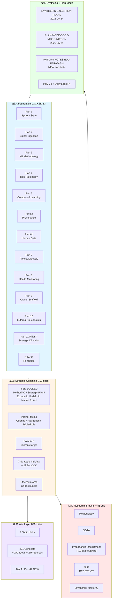
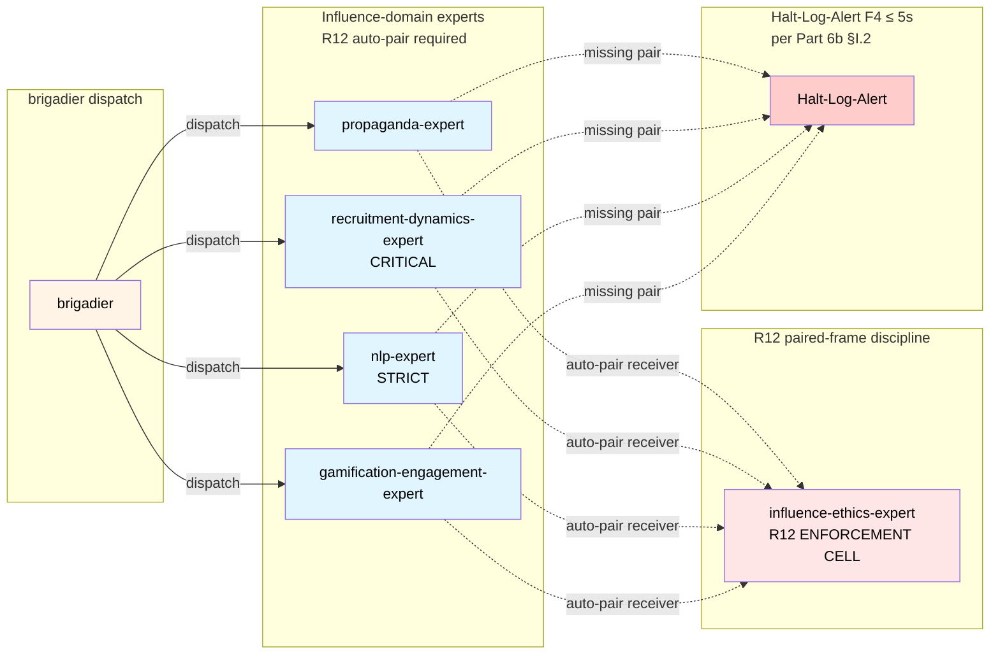

# 📋 Task A — Existing Docs Inventory (Main Consolidated)

> **Trigger:** Ruslan voice 24.05 «collect ВСЁ что есть для описания системы +
> отдельно tools/templates которые даём людям».
>
> **Mode:** INVENTORY — substrate compile only. NO new docs. NO interpretation.

---

## §1 Контекст и цель

Перед **Plan B (Docs)** execution + **PoD-24.05 Шаг 4 Core Ideas selection**
требовалась полная карта substrate'а — что уже написано в системе vs что нужно
написать. Без неё gap-analysis = guessing.

**Двойная задача:**
1. **Task A.1** — **системное описание Jetix** (что есть для описания системы)
2. **Task A.2** — **tools / templates** (что мы даём / можем дать людям как
   инструмент)

**Plus** — cross-reference matrix per-doc × 6 dimensions (audience / funnel /
public-private / R12 / cross-refs / who-uses) — ready-to-use map для Plan B
execution.

---

## §2 Substrate totals

| Метрика | Count |
|---|---|
| `*.md` files (project total) | **4,697** |
| `decisions/strategic/` root markdown | 44 (+ 29 D-LOCK + 7 templates + 4 strategic-insights + 2 variants + 3 _research + 13 ethereum-arch) |
| `decisions/` root markdown | 35 |
| Foundation 11 Parts + Pillar A + C architecture.md | **13 LOCKED** |
| Principles (Pillar C Tier 1 + Tier 2) | 27 files |
| Shared schemas | 9 (F8 constitutional) |
| Strategic canonical (sub-totals incl) | **~102** |
| Wiki concepts (root + 5 nested dirs) | **201** |
| Wiki ideas | 272 |
| Wiki sources | 276 |
| Wiki topic hubs | 7 |
| Research mains (May 2026) | **5** (Methodology / SOTA / Propaganda-Recruitment / NLP / Levenchuk Master Qual) |
| Research sub-deliverables (May 2026) | ~85 files |
| Synthesis + plan-mode + PoD + daily logs + handoffs | ~25 |
| Skills (`.claude/skills/`) | **54** (12 wiki / 4 day / 6 KM / 10 CRM / 11 hypothesis / 4 mermaid / 3 misc / 8 lint sub) |
| Tools/scripts (`tools/`) | **30+** Python + shell |
| ROY active agents | **17** (5 ROY + 3 mini-swarm + 8 book-driven + brigadier) |
| ROY archived | 14 |
| Templates (wiki + swarm + strategic + CRM + project bundles) | **60+** |
| Config YAMLs + hooks | 9 + 11 |

**System-description docs total:** ~250 strategic + ~750 wiki entity files.
**Tools/templates total:** **130+**.

---

## §3 5 Phases — executive trace

### §3.1 Phase 0 — Pre-flight + full repo scan

Full repo scan (4,697 *.md, ключевые dirs counted). Foundation 11 Parts +
Pillar A + C confirmed-present (13 architecture.md, 137-69 KB each). NEW critical
substrate verified: RUSLAN-NOTES-EDUCATION-PARADIGM 2026-05-24 + 5 research mains
+ SYNTHESIS-EXECUTION-PLANS + PLAN-MODE-DOCS-VIDEO-NOTION + PoD-24. R1 surface
count-only. **Report:** `reports/task-a-.../phase-0-scan.md`.

### §3.2 Phase 1 — Task A.1 System Description Docs

7 категорий §2.A-§2.G:
- **§2.A Foundation layer:** 11 Parts F5 LOCKED (137-77 KB each) + Pillar A + Pillar C + 7 RUSLAN-ACK (8 with NEW book-driven ack 2026-05-24) + 14 AWAITING-APPROVAL + 27 principles + 9 schemas + domain READMEs
- **§2.B Strategic canonical:** 4 Big LOCKED (Method V2 / Strategic Plan Near-Future / Economic Model V10 Hybrid / AI Market PLAN) + sub-deliverables (~50 files) + Partner-facing (Partner Offering / Navigation Guide / Triple-Role / Recursive Partnership / Wave-1 Outreach / Dmitriy Call Plan) + Point-A/B + 7 Strategic Insights + 4 strategic-insights subfolder + 29 D-LOCK + Jetix-Ethereum 12-doc bundle + Jetix-as-X conceptual hubs (6) + DR-38/40 + monetization v0/Wave2
- **§2.C Wiki layer:** entry-points + 7 topic hubs + 107 root concepts + 5 nested (44+17+15+12+6) + 272 ideas + 276 sources + 13 Tier A existing + 49 NEW Tier A/B-Plus (verified in `wiki/concepts/`)
- **§2.D Research outputs:** 5 May 2026 mains + sub-deliverables (~85 files) + Levenchuk Systems-Thinking Synthesis + Education Research Books + Research Books to Download + DR-26/33/34/38/40
- **§2.E Synthesis + plan-mode + PoD:** SYNTHESIS-EXECUTION-PLANS 2026-05-24 + PLAN-MODE-DOCS-VIDEO-NOTION 2026-05-24 + RUSLAN-NOTES-EDUCATION-PARADIGM 2026-05-24 + PoD-24 + daily logs 17..22 + 2 cowork handoffs + Reflection Inbox (P4)
- **§2.F Concepts / ideas pool / KB legacy:** wiki entities counts
- **§2.G Root-level supplementary:** CLAUDE.md / CANONICAL-WALKTHROUGH / HOME / README / MIGRATION + 5 symlinks

Per-doc: title / path / size / P-level (P1-P4) / R12 status (clean/review/skip).

**Report:** `reports/task-a-.../01-system-description-docs.md`.

### §3.3 Phase 2 — Task A.2 Tools/Templates

7 категорий §3.A-§3.J:
- **§3.A Skills (54):** wiki pipeline 12 / day planning 4 / KM MVP 6 / CRM 10 / hypothesis 11 / mermaid 4 / misc 3 + 8 lint sub
- **§3.B Scripts (30+):** voice pipeline / Mistral OCR (edu corpus) / Toggl + AW / Notion alpha / wiki infra / Tseren / jetix-autoresearch / acquire / cron / lib / tests
- **§3.C ROY agents:** 17 active + 14 archived (DEPRECATED-2026-05-17 per Ruslan ack)
- **§3.D Wiki templates:** 9 + 9 mirror + 4 project bundles + 7 strategic + 2 CRM + PoD template
- **§3.E Notion templates:** mostly planned (Plan C); structures live in Notion DBs
- **§3.F Charter / outreach:** baseline (First Clan Charter / Partner Offering / Navigation Guide DRAFT / Wave-1) + planned (Plan B per-tier L4/L5/L6/L7 + 8-item R12 checklist + Welcome-frame)
- **§3.G Voice/video/writing:** external (Wispr / Toggl / AW / Groq) + planned recording (Plan A) + mermaid 4 skills + Style Guide
- **§3.H Infrastructure:** 9 config YAMLs + swarm/lib hooks + .claude/hooks + .claude/rules/global.md
- **§3.I CRM scripts:** 7 Python + schemas
- **§3.J Voice pipeline reference:** canonical doc / quick log template / time-tracking categories / Claude Code OS mastery

Per-tool: name / path / status (active / planned / deprecated / template-stub) / who-uses.

**Report:** `reports/task-a-.../02-tools-templates-inventory.md`.

### §3.4 Phase 3 — Cross-reference matrix

6 dimensions × per-doc:
- **Audience archetypes (8):** A-LEV (Левенчук/MIM-inner) / A-MIM (curriculum) / A-KARP (engineer) / A-DMITRIY (humanitarian Tier 2) / A-COHORT (Clan) / A-EXTERNAL (public) / A-ROY (swarm) / A-RUSLAN (personal P4)
- **Funnel stage (S0-S7):** Pre-aware → Co-builder
- **P-level (4):** P1 public-ready / P2 landing-ready / P3 NDA-tier / P4 never-share
- **R12 status (3):** clean / review / R12-skip outward
- **Cross-refs density:** high/medium/low
- **Who-uses:** RUSLAN / ROY / partners / cohort / external

P-level audit summary: ~5 P1 / ~15 P2 / ~200+ P3 / ~5 P4.
R12 audit summary: ~150 clean / ~80 review / ~5 R12-skip outward.

**Audience-cluster + funnel-cluster + gap analysis** включены.

**Report:** `reports/task-a-.../03-cross-reference-matrix.md`.

### §3.5 Phase 4 — This document + Summary + mermaid + push

---

## §4 Gap analysis (для Plan B/C execution)

| Missing artifact | Currently | Plan |
|---|---|---|
| Per-tier Charter (L4/L5/L6/L7) | only First Clan Charter (50 KB baseline) | Plan B Phase 1 |
| R12 paired-frame 8-item checklist template | only concept doc | Plan B Phase 2 |
| Welcome-frame R12-compatible message template | absent | Plan B Phase 3 |
| Notion template DBs (Charter / Cohort / 1-1) | structures only | Plan C |
| Video script (Plan A) | substrate refs exist | Plan A |
| P1-public docs beyond README + PARTNER-OFFERING | gap | Plan B extend |

---

## §5 4 Mermaid diagrams

### §5.1 System description doc landscape

### §5.2 Tools/Templates landscape

```mermaid
graph LR
    subgraph SA[" §3.A Skills 54"]
        SA1[Wiki pipeline 12]
        SA2[Day planning 4]
        SA3[KM MVP 6]
        SA4[CRM 10]
        SA5[Hypothesis 11]
        SA6[Mermaid 4]
        SA7[Lint sub-skills 8]
    end

    subgraph SB[" §3.B Scripts 30+"]
        SB1[Voice pipeline<br/>transcribe/extract/filter]
        SB2[Mistral OCR<br/>edu corpus 14 books]
        SB3[Toggl + ActivityWatch]
        SB4[Notion alpha]
        SB5[Wiki infra<br/>lint/community/SG-eval]
        SB6[jetix-autoresearch<br/>orchestrator]
    end

    subgraph SC[" §3.C ROY 17 active + 14 archived"]
        SC1[brigadier]
        SC2[5 original experts<br/>eng/inv/mgmt/phil/sys]
        SC3[3 mini-swarm<br/>project/quick-money/levenchuk]
        SC4[8 book-driven NEW<br/>propaganda/recruitment/nlp/sota/<br/>methodology/ML-AI/influence-ethics/<br/>gamification]
    end

    subgraph SD[" §3.D Templates 60+"]
        SD1[Wiki entity 9+9]
        SD2[Project bundles 4]
        SD3[Strategic 7]
        SD4[CRM 2]
        SD5[Charter planned Plan B]
        SD6[Notion planned Plan C]
    end

    SC1 -->|dispatches| SC2
    SC1 -->|dispatches| SC4
    SC4 -.->|R12 auto-pair| SC4
    SA --> SC1
    SB --> SD
    SD --> SC

    style SA fill:#e1f5ff,color:#000
    style SB fill:#fff4e6,color:#000
    style SC fill:#ffe6e6,color:#000
    style SD fill:#e6ffe6,color:#000
```

### §5.3 Audience × Doc cluster routing

```mermaid
graph TB
    A_LEV[A-LEV<br/>Левенчук/MIM-inner]
    A_MIM[A-MIM<br/>Aisystant students]
    A_KARP[A-KARP<br/>Karpathy-tier]
    A_DMITRIY[A-DMITRIY<br/>humanitarian Tier 2]
    A_COHORT[A-COHORT<br/>Clan member]
    A_EXTERNAL[A-EXTERNAL<br/>general]
    A_ROY[A-ROY<br/>swarm internal]
    A_RUSLAN[A-RUSLAN<br/>personal P4]

    D_METHOD[Method V2 main<br/>P2]
    D_LEV[Levenchuk Master Q<br/>P3]
    D_RESEARCH[Methodology + SOTA<br/>research P3]
    D_FOUND[Foundation Part 3+5<br/>P3]
    D_HACK[Jetix as Hackathon<br/>P2]
    D_PARTNER[PARTNER-OFFERING<br/>P1]
    D_VISION[VISION FUNDAMENTAL<br/>P3]
    D_DMITRIY_PLAN[DMITRIY-CALL-PLAN<br/>P3]
    D_CHARTER[First Clan Charter<br/>P2]
    D_TOKEN[Tokenomics Variants<br/>P3]
    D_README[README<br/>P1]
    D_AI_MARKET[AI Market PLAN<br/>P2]
    D_CLAUDE[CLAUDE.md +<br/>routing-table P3]
    D_POD[PoD + Daily Log P4]

    A_LEV --> D_METHOD
    A_LEV --> D_LEV
    A_LEV --> D_RESEARCH
    A_MIM --> D_METHOD
    A_MIM --> D_RESEARCH
    A_KARP --> D_FOUND
    A_KARP --> D_HACK
    A_DMITRIY --> D_PARTNER
    A_DMITRIY --> D_DMITRIY_PLAN
    A_DMITRIY --> D_VISION
    A_DMITRIY --> D_AI_MARKET
    A_COHORT --> D_CHARTER
    A_COHORT --> D_VISION
    A_COHORT --> D_TOKEN
    A_EXTERNAL --> D_README
    A_EXTERNAL --> D_PARTNER
    A_EXTERNAL --> D_AI_MARKET
    A_ROY --> D_CLAUDE
    A_ROY --> D_FOUND
    A_RUSLAN --> D_POD

    style A_LEV fill:#e1f5ff,color:#000
    style A_MIM fill:#e1f5ff,color:#000
    style A_KARP fill:#fff4e6,color:#000
    style A_DMITRIY fill:#f0e6ff,color:#000
    style A_COHORT fill:#ffe6e6,color:#000
    style A_EXTERNAL fill:#e6ffe6,color:#000
    style A_ROY fill:#ffe6cc,color:#000
    style A_RUSLAN fill:#ffe6f5,color:#000
```

### §5.4 R12 paired-frame discipline

---

## §6 Acceptance verification

- ✅ 5 phases per-phase commit + push (Phases 0, 1, 2, 3, 4)
- ✅ ALL repo strategic docs inventoried (~250 strategic incl Foundation 13 + 102 strategic canonical + 5 research + sub-deliverables)
- ✅ ALL tools/templates inventoried (130+ incl 54 skills / 30+ scripts / 17 agents / 60+ templates)
- ✅ Cross-reference matrix complete (6 dimensions per-doc)
- ✅ 4 mermaid diagrams (§5.1-§5.4: doc landscape / tools landscape / audience routing / R12 paired-frame)
- ✅ R1 surface only (NO content interpretation)
- ✅ INVENTORY mode — NO new docs creation
- ✅ Constitutional posture preserved (R1/R2/R6/R11/R12/append-only)
- ✅ NO LOCK modifications

---

## §7 К чему ведёт (downstream unlock)

- **Plan B Docs execution unlocked** — gap analysis precise (Charter per-tier / R12 8-item checklist / Welcome-frame missing → Plan B Phase 1-3)
- **PoD-24 Шаг 4 Core ideas selection unlocked** — full doc landscape visible per audience archetype
- **Plan C Notion templates** has reference set для adaptation
- **Plan A Video script** has substrate inventory для reference
- **Task B education research** has substrate ground (RUSLAN-NOTES-EDU-PARADIGM verified in §2.E)

---

## §8 NOT done (explicit per prompt §8)

- ❌ NOT created new docs (INVENTORY only)
- ❌ NOT modified existing content
- ❌ NOT interpreted content
- ❌ NOT promoted anything
- ❌ NOT triggered downstream
- ❌ NOT R1 strategic prose

---

## §9 Phase reports (per-phase outputs)

- **Phase 0** — `reports/task-a-existing-docs-inventory-2026-05-24/phase-0-scan.md` (326 lines)
- **Phase 1** — `reports/task-a-existing-docs-inventory-2026-05-24/01-system-description-docs.md` (~560 lines)
- **Phase 2** — `reports/task-a-existing-docs-inventory-2026-05-24/02-tools-templates-inventory.md` (~495 lines)
- **Phase 3** — `reports/task-a-existing-docs-inventory-2026-05-24/03-cross-reference-matrix.md` (~390 lines)
- **Phase 4** — this document (`decisions/strategic/TASK-A-EXISTING-DOCS-INVENTORY-2026-05-24.md`) + Summary ≤500w

---

*Task A closure 2026-05-24. INVENTORY mode complete. Per Ruslan voice ack
«всё в кучу собрать». R1 surface only. NO LOCK modifications.*
