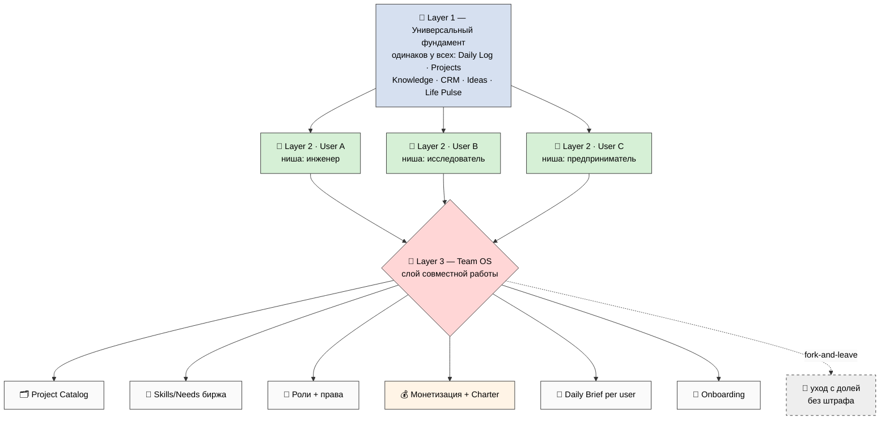
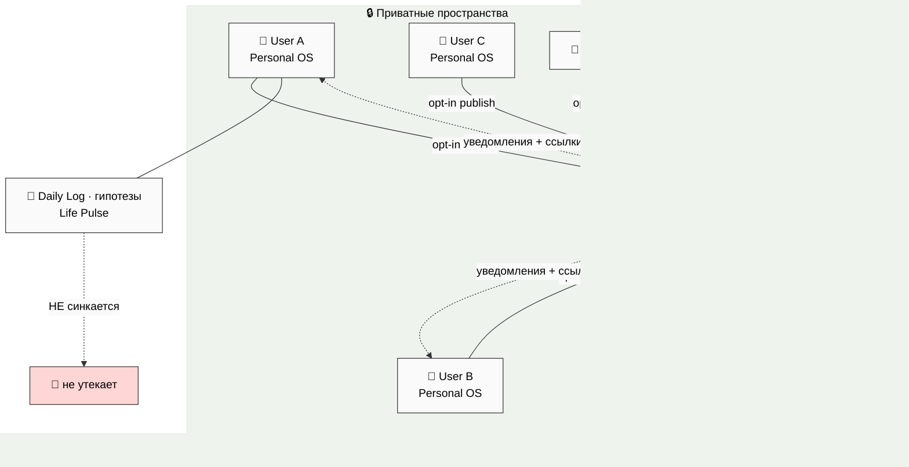
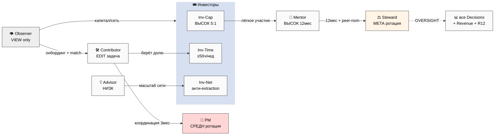
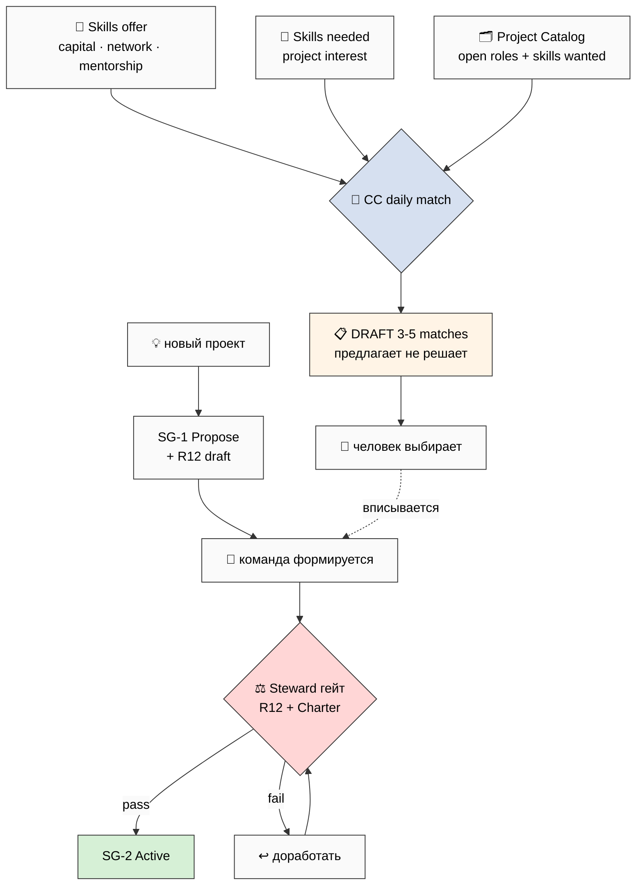
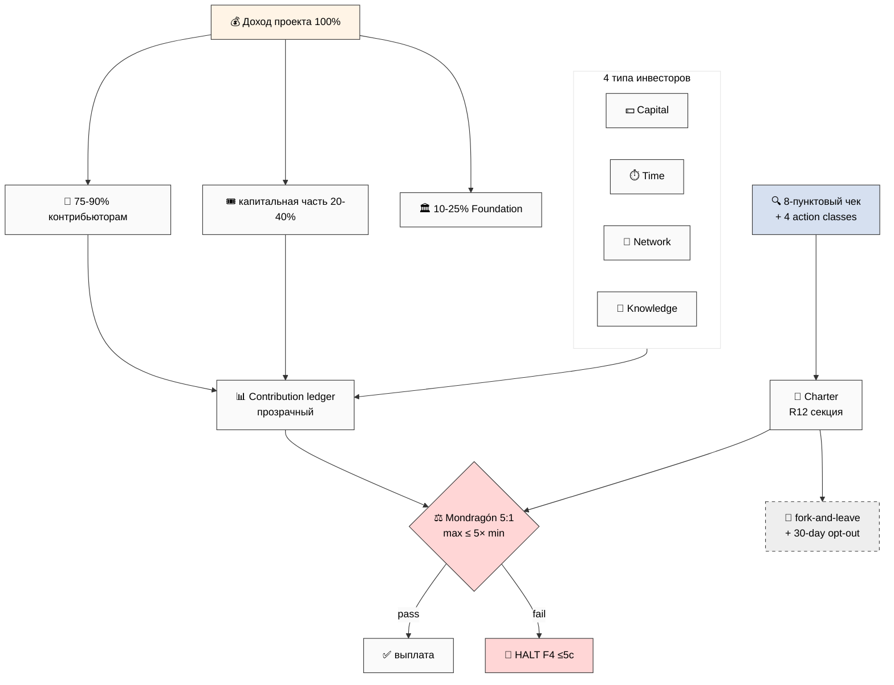
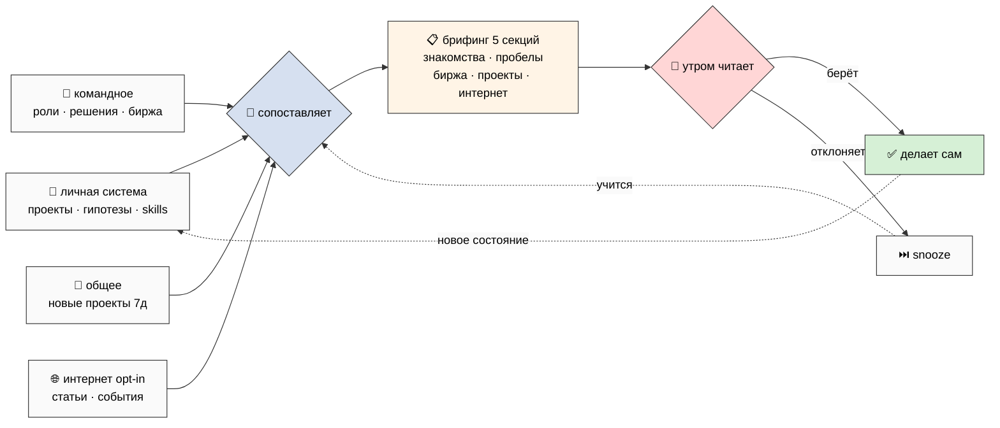
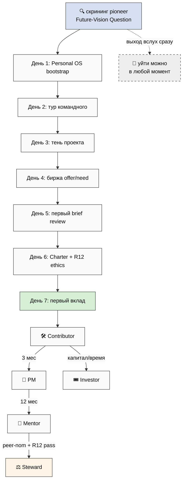

# 🤝 Team OS — слой совместной работы (на человеческом языке)

> **Что это.** Дизайн-план Notion-шаблона для **совместной работы команд** — поверх личной
> системы Personal OS. Когда несколько человек со своими личными системами объединяются:
> Team OS соединяет их рабочие пространства, добавляет роли, общие проекты, биржу навыков,
> честную монетизацию и ежедневный обход Claude Code за каждого. Без жаргона. С семью
> понятными схемами.
>
> **Это НЕ реализация и НЕ «делаем вот так».** Это **дизайн-план**: ничего в Notion не
> создаётся, API не зовётся. В конце — **9 решений**, которые выбираешь ты (§12).

---

## §0 Если есть 90 секунд (TL;DR)

- **Что строим:** слой совместной работы (Layer 3) поверх личных систем. Личное остаётся
  личным; команда получает общее пространство.
- **Как соединяем:** у каждого своё приватное Notion-пространство, есть одно общее. Наверх
  уходит только то, что человек сам опубликовал. Личные данные не утекают.
- **Роли:** 10 готовых ролей (Управляющий, 3 типа инвесторов, Исполнитель, Советник,
  Фасилитатор, Наставник, Наблюдатель, Хранитель-честности). У каждой — права, доля, учёт
  вклада и уровень R12-риска.
- **Биржа:** каталог проектов + «что могу дать / что надо» + ежедневный подбор пар.
- **Деньги:** 75-90% человеку, 10-25% Foundation. Потолок неравенства 5:1. Уйти можно в
  любой момент с долей, без штрафа. 30 дней на выход при изменении правил. **8-пунктовый
  этический чек на каждый денежный шаблон.**
- **Daily Brief:** раз в день Claude Code за каждого приносит черновик — знакомства,
  пробелы навыков, находки на бирже, проекты, интернет. Всегда **черновик**, человек решает.
- **Вход:** первая неделя по дням, гайд по роли, этика как гарантия, без культовых механик.
- **Дальше:** реализация Week 5-8 (после личного шаблона), первая когорта 5-10 человек,
  раздача партнёрам (fork-friendly).

---

## §1 🎯 Главная мысль в одной строке

**Personal OS делает сильным одного человека. Team OS делает так, чтобы несколько сильных
людей могли работать вместе — честно делить деньги, не запирая друг друга и не «доя» друг
друга, и при этом находить друг друга через общую биржу проектов и навыков.**

Ключевая идея: Team OS — это не «корпорация с начальником». Это **кооператив**, где большая
часть дохода идёт человеку напрямую (75-90%), нет крайнего неравенства (потолок 5:1), и
любой может уйти со своей долей в любой момент. Технически — это слой поверх личных систем
в Notion, с ролями, каталогом, биржей и ежедневным помощником Claude Code.

И отдельно важно: **система устроена так, чтобы её нельзя было превратить в эксплуатацию или
секту.** Это не «доверие на словах» — это встроенные механизмы: прозрачный учёт вклада,
потолок неравенства, право выхода, отдельная роль «хранителя честности» (Steward), и
8-пунктовый этический чек на каждый денежный шаблон.

---

## §2 🏗️ Что такое Team OS (три слоя)

Всё держится на трёх слоях:

| Слой | Что это | Чьё |
|---|---|---|
| **Layer 1 — Универсальный фундамент** | Базовые кирпичи Personal OS, одинаковые у всех (Daily Log, Projects, Knowledge, CRM, Ideas, Life Pulse) | общий |
| **Layer 2 — Ниша под себя** | Тот же фундамент, настроенный под человека (инженер / исследователь / предприниматель / методолог / гуманитарий) | личное |
| **Layer 3 — Team OS** | Слой совместной работы поверх личных систем | командное |

**На пальцах:** Layer 1+2 — это «твоя квартира» (личная система). Layer 3 — «двор и правила
соседства», когда вы с соседями строите общую детскую площадку (совместный проект). Квартира
остаётся твоей. Двор общий, и там есть договорённости.



**Что остаётся из личной системы (наследуем ~80%):** личные базы, дисциплина голосового
ввода «только черновик», интеграция с Claude Code, принцип «файлы = правда, Notion =
витрина», fork-friendly структура. Team OS — добавка сверху, не новая система.

**Что нового (8 вещей):** общее пространство, роли + права, каталог проектов, биржа навыков,
Charter + Stage Gates, шаблоны монетизации, ежедневный брифинг, ритуал онбординга.

**Важно (это AP-6):** Team OS **не обязателен**. Если деньги и решения — только твои,
оставайся в личной системе один. Team OS включается, когда появляется **общий котёл** —
деньги, время нескольких людей, общий результат. Тогда нужны роли, учёт вклада и договор.

**Worked example — как 3 человека собирают команду (на пальцах).** У Ани, Бориса и Веры —
свои Personal OS. Аня видит запрос клиента на консультацию, который ей одной не вытянуть. Она
заходит в общее пространство → создаёт проект в каталоге (SG-1) → отмечает «нужны: навык X,
навык Y». Ежедневный брифинг Бориса утром показывает: «твой навык X подходит проекту Ани».
Борис вписывается Исполнителем. Вера готова дать €2K на старт — становится Инвестором
капитала. Они вместе подписывают короткий Charter (доли, потолок 5:1, право выхода) →
Хранитель проверяет R12 → SG-2 active. Каждый при этом продолжает жить в **своей** личной
системе; в общее ушли только проект, роли и учёт вклада. Заработали — поделили прозрачно.
Кто-то захотел уйти — ушёл с долей.

*Детально: `reports/team-os-notion-template-plan-2026-05-24/01-team-os-overview.md`*

---

## §3 🔗 Как соединены личные системы в общую (multi-tenant)

Самый технический вопрос: у каждого своё **приватное** пространство, есть одно **общее**.
Как соединить, чтобы личное не утекало, а общее было видно всем по их правам.



**Главное правило:** наверх (личное → общее) — **только по решению человека** (opt-in). Вниз
(общее → личное) — уведомления и ссылки, не копирование чужих данных.

**Используем родные возможности Notion** (не пишем лишнего кода): Team plan / Teamspace
(общее пространство), guest access (внешние советники), linked databases (запись видна, но
живёт у владельца), права на страницу/базу по роли, synced blocks (Charter), комментарии,
@упоминания, виды с фильтрами.

**Права доступа** — полная матрица «10 баз × 10 ролей». Значения: **EDIT** (менять) ·
**COMMENT** (комментировать) · **VIEW** (читать) · **VOTE** (голос) · **OVERSIGHT** (надзор)
· **NONE** · «(own)» = только своё:

| База \ Роль | PM | Inv-Cap | Inv-Time | Inv-Net | Contrib | Advisor | Facilit | Mentor | Observ | Steward |
|---|---|---|---|---|---|---|---|---|---|---|
| Project Catalog | EDIT(own) | V+C | V+C | VIEW | VIEW | VIEW | VIEW | VIEW | VIEW | EDIT |
| Skills/Needs | EDIT(own) | EDIT(own) | EDIT(own) | EDIT(own) | EDIT(own) | EDIT(own) | EDIT(own) | EDIT(own) | VIEW | VIEW |
| Project Workspaces | EDIT(own) | VIEW | EDIT(asgn) | VIEW | EDIT(asgn) | COMMENT | EDIT(sess) | COMMENT | VIEW | VIEW |
| Charter | VIEW | VIEW | VIEW | VIEW | VIEW | VIEW | VIEW | VIEW | VIEW | EDIT |
| Revenue Accounting | EDIT(own) | VIEW(own) | VIEW(own) | VIEW(own) | VIEW(own) | NONE | NONE | NONE | NONE | OVERSIGHT |
| Contribution Ledger | EDIT(own) | VIEW(own) | EDIT(own) | VIEW(own) | EDIT(own) | VIEW(own) | EDIT(own) | VIEW(own) | NONE | OVERSIGHT |
| Decisions Queue | EDIT(own) | VOTE | VOTE | VOTE | COMMENT | COMMENT | COMMENT | COMMENT | NONE | OVERSIGHT |
| R12 Audit Log | VIEW(own) | VIEW(own) | VIEW(own) | VIEW(own) | VIEW(own) | VIEW(own) | VIEW(own) | VIEW(own) | NONE | EDIT |
| Daily Brief | own | own | own | own | own | own | own | own | own | own |
| Onboarding/Guides | VIEW | VIEW | VIEW | VIEW | VIEW | VIEW | VIEW | VIEW | VIEW | EDIT |

Три правила чтения матрицы:
1. **Управляющий силён только в СВОЁМ проекте.** В чужих — рядовой участник. Это
   hub-and-spoke из фундамента: PM = единый диспетчер **на проект**, не на всю команду.
2. **Деньги видны только свои.** Каждый видит свою долю и свой вклад; полная картина всех
   проектов — только Хранитель (надзор). Внутри проекта ledger прозрачен для участников.
3. **Хранитель (Steward) — единственная сквозная роль,** но он не голосует в проектах и не
   берёт проектную долю (чтобы не было конфликта интересов).

**Внешние люди — 3 уровня:** Guest (read-only витрина, отзывается в 1 клик) / Observer
(роль-член, пред-онбординг) / Steward audit (надзор за R12, без личных данных). Любая
внешняя запись требует зафиксированного согласия — нет согласия → стоп.

**4 helper-скрипта** (спека, не код): `team_os_sync.py` (двусторонний синк по frontmatter) /
`team_os_invite.py` (онбординг + права) / `team_os_marketplace_match.py` (подбор пар) /
`team_os_daily_brief.py` (брифинг). Все config-driven, идемпотентные, ключи в `private/`.

**Конфликт версий:** для личных данных главнее личный файл; для общих — общее пространство;
спорное → `pending-review`, Хранитель смотрит. **Табу — молчаливая авто-перезапись.**

**Изоляция данных (красная линия):** личный Daily Log / гипотезы / Life Pulse **никогда** не
синкаются в команду без явного действия. Брифинг одного **не раскрывает** приватные данные
другого.

*Детально: `reports/.../02-multi-tenant-architecture.md` (полная матрица прав + синк + изоляция)*

---

## §4 👥 Десять ролей и их права

Когда люди работают над общим проектом, у каждого роль. Роль отвечает на 4 вопроса: что
человек **делает**, что **видит и меняет**, как считается его **вклад**, какую **долю**
получает. Плюс — у каждой роли свой уровень **R12-риска** и встроенная защита.



| # | Роль | В двух словах | Дефолтная доля | R12-риск |
|---|---|---|---|---|
| 1 | **Управляющий (PM)** | координатор одного проекта | 10-20% / проект | СРЕДНИЙ (ротация) |
| 2 | **Инвестор капитала (Inv-Cap)** | вкладывает деньги | 20-40% капитальной части | **ВЫСОКИЙ** (5:1 cap) |
| 3 | **Инвестор времени (Inv-Time)** | вкладывает часы/навыки | трудовая часть | НИЗ-СРЕДН (≤50ч/нед) |
| 4 | **Инвестор сети (Inv-Net)** | вкладывает сеть/аудиторию | 3-10% за интро | СРЕДНИЙ (анти-extraction) |
| 5 | **Исполнитель (Contributor)** | делает задачи | почасовка или доля | НИЗКИЙ |
| 6 | **Советник (Advisor)** | лёгкий совет (1-2ч/мес) | 0.5-2% или ретейнер | НИЗКИЙ |
| 7 | **Фасилитатор (Facilitator)** | ведёт сессии/когорту | за сессию + бонус | СРЕДНИЙ (анти-культ) |
| 8 | **Наставник (Mentor)** | долгосрочное сопровождение | ретейнер | **ВЫСОКИЙ** (12мес cap) |
| 9 | **Наблюдатель (Observer)** | смотрит, ещё не участвует | — | НИЗКИЙ |
| 10 | **Хранитель (Steward)** | следит за честностью (R12) | плоский ретейнер | МЕТА (ротация) |

**Каждая роль — подробнее (что делает / вклад / доля / защита):**

- **1. Управляющий (PM)** — координатор одного проекта (один проект = один PM). Производит:
  скорость + продвижение по Stage Gates + всплытие блокеров. Вклад: часы координации. Доля:
  10-20%. Защита: **ротация PM** + клаузула «нет PM-на-всю-жизнь».
- **2. Инвестор капитала (Inv-Cap)** — даёт деньги. Права: VIEW+COMMENT + VOTE. Вклад: сумма
  × срок. Доля: 20-40% капитальной части. Защита: **Mondragón 5:1 cap обязателен** +
  fork-and-leave + 30-дневное окно. Авто-подключение этического эксперта.
- **3. Инвестор времени (Inv-Time)** — часы + навык. Права: EDIT(задача) + VOTE. Вклад: часы
  × ставка (self-declared + peer-validated). Защита: **потолок ≤50 ч/нед** (анти-выгорание).
- **4. Инвестор сети (Inv-Net)** — сеть / аудитория / интро. Вклад: интро (число+цели) или
  плоская доля. Доля: 3-10% за весомое интро. Защита: анти-audience-extraction клаузула.
- **5. Исполнитель (Contributor)** — делает задачи (без капитальной доли). Вклад: задачи ×
  сложность × качество. Доля: почасовка или доля проекта. Самый частый вход в команду.
- **6. Советник (Advisor)** — лёгкий совет (1-2 ч/мес). Доля: 0.5-2% или ретейнер. Граница:
  советует, а не управляет (анти scope-creep).
- **7. Фасилитатор (Facilitator)** — ведёт сессии/когорту. Вклад: сессии × фидбек. Доля: за
  сессию + бонус. Защита: **анти-культ** + Schelling-чек Charter.
- **8. Наставник (Mentor)** — долгосрочное сопровождение (3-12 мес/менти, depth-not-width по
  Тайсону). Права: VIEW+COMMENT Personal OS менти **с согласия**. Защита: **нет
  эксклюзивности / нет lock-in / fork-and-leave / потолок 12 мес**.
- **9. Наблюдатель (Observer)** — только просмотр витрины, без денег и решений. Безопасная
  прихожая перед входом. Переход → Contributor / Investor.
- **10. Хранитель (Steward)** — «омбудсмен» команды: ловит «доение» и запирание, останавливает
  (≤5 сек). Права: EDIT Charter + OVERSIGHT всего + EDIT R12 Audit. Доля: **плоский ретейнер,
  НЕ проектная** (анти конфликт интересов). Сам **ротируется** + peer-Steward проверка.

**Три вещи, которые держат это здоровым:**

- **Роль ≠ человек (IP-1).** Власть привязана к функции, а не к личности. Один человек может
  быть Управляющим в одном проекте и Исполнителем в другом (multi-hat). Сильный PM в одном
  проекте — рядовой в чужом.
- **Высокий риск → больше защиты.** Inv-Cap и Mentor — высокий R12-риск (контроль через
  деньги / власть наставника). Поэтому: потолок 5:1, fork-and-leave, потолок срока 12 мес,
  авто-подключение этического эксперта.
- **Власть ротируется.** Управляющий, Фасилитатор, Хранитель — все ротируются. «Нет роли на
  всю жизнь» — анти-культовая защита.

**Переходы** перекликаются с 8-уровневой лестницей квалификации Левенчука (Ученик →
Работник → … → Реформатор → Революционер): рост по агентности, масштабу и методологической
дисциплине, измеряется не экзаменом, а наблюдением на реальных проектах.

*Детально: `reports/.../03-roles-permissions-taxonomy.md` (10 полных карточек ≥7 атрибутов)*

---

## §5 🛒 Биржа: где люди и проекты находят друг друга

Две вещи: **каталог проектов** (что делается, куда вписаться) и **биржа навыков** («что
могу дать / что надо» + подбор пар).



**Язык имеет значение.** Биржа — **НЕ «доска вакансий»**. Не «вакансия / наняться», а
«открытая роль / вписаться». Не «продай навыки», а «что можешь дать команде». Рамка
«дать / нужно» держит равенство сторон — это R12 на уровне языка.

- **Project Catalog DB** — 14 полей (тип, стадия, открытые роли, нужные навыки, условия
  монетизации, статус R12-аудита, время, длительность) + 6 видов.
- **Skills/Needs DB** — по строке на человека (что готов дать: навыки/время/капитал/сеть/
  наставничество; что ищет). Со свежестью записи и приватностью суммы капитала.
- **Подбор пар** — раз в день Claude Code сопоставляет offer × wanted и приносит **черновик**
  (предлагает, не решает).
- **Путь нового проекта** — SG-1 propose → формирование команды → **Steward-гейт** (R12 +
  Charter) → SG-2 active → SG-3/4.
- **Schelling-слой** — мягкая подсветка точек схождения («3 человека тоже хотят навык X —
  можно собрать группу»), без насильной группировки.

**Project Catalog DB (схема):** Title / Type (consulting/research/product/bets/cohort/
community) / Stage (SG-1…SG-4) / Status (open/forming/active/paused/closed/archived) /
Project Manager (relation) / Active team (relation multi) / Open roles needed (multi-select) /
Skills wanted (multi-select) / Monetization terms (rich text) / **R12 audit status**
(passed/pending/failed) / Time commitment / Duration / CTA join / Description. Виды: все
открытые / по типу / по навыкам / по стадии (kanban) / новые 7д / мои проекты.

**Skills Offer/Need DB (схема, по строке на человека):** User / Skills can offer / Time
availability (ч/нед) / Capital availability (диапазон, можно скрыть) / Network value /
Mentorship offered / Skills needed / Project interest / Monetization preference / Active until
(свежесть). Подбор: offer × Projects-wanted, needed × Users-offer, capital × Inv-Cap-открыто,
network × Inv-Net, mentorship-offered × mentorship-needed → DRAFT в брифинге.

**Путь нового проекта:** SG-1 propose (запись + open roles + черновик R12-аудита) → PM
определяется → команда формируется (matching уведомляет) → **Steward-гейт** (R12 + Charter) →
SG-2 active (работа + revenue accounting) → SG-3 deliver (milestone + ре-аудит) → SG-4
promote/close (итог + ретро). **4 ловушки:** витринные навыки / рамка «доска вакансий» /
пере-матчинг / преждевременный пропуск R12-аудита.

*Детально: `reports/.../04-marketplace-design.md`*

---

## §6 💰 Деньги и управление (честно, с защитой)

Самая ответственная часть. Когда люди вместе зарабатывают, заранее договариваются: как делим
доход, как считаем вклад, что подписываем, как принимаем решения. И главное — как защитить
от «обдирания» и запирания.



**Главный принцип:** 75-90% человеку, 10-25% Foundation. Потолок неравенства 5:1. Уйти
можно в любой момент с долей, без штрафа. 30 дней на выход при изменении правил.

*(Точная каноническая модель V10: каждый отдаёт 25% → институциональный пул, оставляет 75%;
в замкнутом цикле = 75% workers / 16.67% управленцы / 8.33% Ruslan cumulative. «75-90%» —
human-language обёртка, точный % зависит от тира и Charter.)*

**4 шаблона revenue share:** стандартный проект / проект с капитальным инвестором /
когортная программа (≈€1500/мес) / вклад знанием-IP.

**4 типа инвесторов** (это операционная декомпозиция единой роли «инвестор» из V10):
- **Capital** (деньги) — Mondragón cap + exit terms
- **Time** (часы) — потолок ≤50ч/нед (анти-выгорание)
- **Network** (сеть) — анти-audience-extraction
- **Knowledge** (фреймворк/IP) — лицензия open-ish + анти-fork-prevention

**Учёт вклада** — прозрачный ledger по проекту, без скрытых сплитов. Каждый видит свою
строку + общий ledger проекта.

**Charter (договор команды)** — 6 секций: ценности / управление / монетизация / **R12-
комплаенс (центральная)** / разрешение споров / Ethereum-overlay (опционально Phase 2+).

**Stage Gates lighter:** SG-1 propose → SG-2 active (Steward-гейт) → SG-3 deliver → SG-4
promote/close.

### ⚖️ 8-пунктовый R12-чек на КАЖДЫЙ денежный шаблон

Это сердце. Любой шаблон монетизации проходит чек **перед** применением:

1. Стоимость для получателя ≤ выгода
2. Предложение конкретно, не размыто
3. Запрос пропорционален глубине отношений
4. Уместно по стадии (не пушим деньги «новичку»)
5. Уместно по каналу
6. R12 paired-frame PASS (нет извлечения / lock-in / нарушения 5:1 / fork-prevention)
7. Анти-CTA (нет манипуляции / МЛМ / культа / нарушения порядка ступеней)
8. Halt-Log-Alert готов (≤5 сек, если нарушение)

**Чек применён к 4 revenue-шаблонам** (T1 стандарт / T2 капитал / T3 когорта-€1500 / T4
знание-IP):

| Пункт | T1 Стандарт | T2 Капитал | T3 Когорта | T4 Знание/IP |
|---|---|---|---|---|
| 1 Cost ≤ benefit | 75-90% человеку | 60-80% труду | ценность > €1500 | ретейнер за фреймворк |
| 4 По стадии | только SG-2+ | только SG-2+ | только step-5+ | при реальном вкладе |
| 6 R12 pass | 5:1 + fork-leave | 5:1 капитал+труд | 5:1 между тирами | анти-fork-prevention |
| 7 Анти-CTA | нет МЛМ | нет lock-in | нет культа | нет IP-захвата |
| 8 Halt готов | Steward F4 | Steward F4 | Steward F4 | Steward F4 |

**4 типа инвесторов** (операционная декомпозиция единой роли «инвестор» из V10):

| Тип | Вкладывает | Учёт | Защита |
|---|---|---|---|
| Capital | деньги | сумма + транш-график; equity/revenue/convertible | Mondragón cap + exit terms |
| Time | часы + навык | часы × ставка (peer-validated) | потолок ≤50 ч/нед |
| Network | сеть/аудитория | интро или плоская доля | анти-audience-extraction |
| Knowledge/IP | фреймворк/IP | ретейнер + tier участия | лицензия open-ish + анти-fork-prevention |

**Charter (договор команды) — 6 обязательных секций:** (1) Ценности; (2) Управление —
принятие решений + разрешение споров + Stage Gates; (3) Монетизация — revenue split +
**Mondragón 5:1 явно** + метод учёта + exit terms; (4) **R12-комплаенс (центральная)** — нет
извлечения + fork-and-leave + 30-дневное окно + Mondragón STRICT + HALT при wage-ratio + запрет
non-consensual distribution + запрет fork-prevention; (5) Разрешение споров — Steward →
peer-Steward → внешний медиатор; (6) Ethereum overlay (опционально Phase 2+).

**4 «детектора жадности и принуждения»** (RUSLAN-LAYER action classes):
- `extraction_beyond_share` — забрать сверх договорённого → HALT
- `wage_ratio_violation` — сделать одного в >5× богаче → HALT (проверка перед распределением)
- `non_consensual_distribution` — опубликовать чужое без согласия → HALT
- `fork_prevention_attempt` — язык «теперь не уйдёшь» → HALT

**Worked example — как делится €10 000 (на пальцах).** Проект «консультация для клиента»
заработал €10 000. В команде: PM (координировал), 2 Исполнителя (делали работу), 1 Инвестор
капитала (дал €2K на старт). Charter сказал: 85% контрибьюторам / 10% Foundation / 5%
капиталу.
- **Foundation:** €1 000 (на платформу + поддержку).
- **Капитал:** €500 (Инвестору капитала — 5%).
- **Контрибьюторам:** €8 500, делятся по учёту вклада: PM 20% → €1 700; Исполнитель A
  (больше часов) 45% → €3 825; Исполнитель B 35% → €2 975.
- **Проверка Mondragón 5:1:** самая большая выплата €3 825, самая маленькая €1 700. Ratio
  = 2.25 ≤ 5 → **PASS**. Если бы PM выбил себе €7 000, а Исполнитель B получил €500, ratio =
  14 → **HALT**, Хранитель останавливает до пересмотра.
- **Выход:** если Исполнитель A решит уйти после этого проекта — забирает свои €3 825 и
  накопленную долю, без штрафа. Никто не может сказать «ты теперь обязан остаться».

Это и есть R12 в действии: прозрачно, с потолком неравенства, с правом выхода.

**Programmable Ethereum overlay (Phase 2+, опционально, per-Clan opt-in):** сейчас всё на
тексте + надзоре Хранителя; в будущем можно усилить смарт-контрактом (Mondragón cap on-chain,
QF-распределение, RageQuit exit-token). Phase 1 текстовая версия работает и сохраняется.

*Детально: `reports/.../05-monetization-governance.md` (8-пунктовый чек применён к 4 шаблонам в матрице)*

---

## §7 🤖 Daily Brief — что Claude Code делает за каждого раз в день

Раз в день CC делает обход за каждого: читает личное + командное + (опционально) интернет, и
приносит персональную подборку. **Всегда черновик** — CC ничего не делает за человека.



**Брифинг (5 секций, ~300-500 слов):** 3-5 знакомств / 2-3 пробела в навыках / 3-5 находок
на бирже / 1-3 новых проекта / 1-3 находки из интернета + чек-лист действий. Пример формата:

```
📅 Ежедневный брифинг — [ИМЯ] — ГГГГ-ММ-ДД
🤝 3-5 знакомств: @участник (навыки X / под твою потребность Y)
🎯 2-3 пробела: на основе Проекта Z пригодился бы навык A
🔄 3-5 биржа: твоё предложение X подходит Проекту Y (роль Inv-Time)
🚀 1-3 проекта: [NAME] (Тип, Стадия) — открыта роль под твои навыки
📖 1-3 интернет: статья/книга/событие под гипотезу/пробел/профиль
✅ Действия (ЧЕРНОВИК — выбери): [ ] написать @User  [ ] обновить навык  [ ] прочитать
```

CC читает 4 источника: личная система (топ-5 проектов/гипотез, skills, цели, пульс) +
командное (роли, решения, биржа) + общее (новые проекты 7д) + интернет (opt-in: RSS/arxiv/
поиск под темы гипотез).

**DRAFT-only — железно:** CC **не пишет** сообщения, **не записывает** в проекты, **не
меняет** навыки, **не отправляет** ничего наружу. Он предлагает, показывает, напоминает.
Человек читает утром → выбирает → делает сам. Это перенос дисциплины голосового ввода.

**Частота:** 1×/день (утро) + недельный дайджест (опц.) + opt-out. **Приватность:** нет
cross-user утечки — брифинг одного не раскрывает приватные данные другого.

*Детально: `reports/.../06-daily-cc-pass.md`*

---

## §8 🚀 Onboarding — как новый человек входит

Понятный вход, без вербовки и культа. **Главная рамка: когорта, а не секта.** Выход
называется вслух **сразу**, до того как что-то подписано.



- **Первая неделя** (~8-12ч): от наблюдения (День 3 — тень без обязательств) к маленькой
  задаче (День 7). Анти-burnout вход.
- **8 гайдов по ролям** — каждый с секцией «твои права и твой выход».
- **R12 ethics doc** (~1500 слов) — обязательное чтение. Тон: **«вот как мы защищаем тебя»**,
  не «правила, которые ты обязан».
- **Ритуал онбординга** (опц.) — групповая сессия раз в 2 недели + buddy-пара
  (проводник, не надзиратель). Анти-культовый по дизайну.
- **Скрининг:** профиль «paradigm pioneer» (гибкие, любопытные, толерантные к
  неопределённости) + Future-Vision Question на discovery-звонке.

**Первая неделя (~8-12ч):** День 1 bootstrap личной системы (2ч) → День 2 тур командного
(1.5ч) → День 3 тень проекта без обязательств (1-2ч) → День 4 биржа offer/need (1ч) → День 5
первый brief review (30мин) → День 6 Charter + R12-этика (1-2ч) → День 7 первый маленький
вклад. От наблюдения к маленькой задаче — анти-burnout.

**R12 ethics doc (9 секций, ~1500 слов, тон «как мы защищаем тебя»):** (1) что Team OS делает;
(2) чего НЕ делаем (не доим / не запираем / не нарушаем 5:1 / не распределяем чужое); (3) что
значит fork-and-leave; (4) Mondragón 5:1 простыми словами; (5) что такое Charter; (6) роль
Хранителя + как поднять тревогу; (7) разрешение споров; (8) красные флаги (манипуляция /
культ / извлечение); (9) **твои права** — уйти / усомниться / возразить / форкнуть.

**Ритуалы перехода (вехи, не экзамены):** Observer→Contributor (неделя тени + первая задача) /
Contributor→PM (3 мес + Steward review) / Contributor→Investor (формальное обязательство +
поправка Charter) / Mentor→Steward (12 мес + peer-номинация + R12-аудит). Перекликается с МИМ
Левенчука: рост измеряется наблюдением на реальных проектах, не тестом.

*Детально: `reports/.../07-onboarding-instructions.md`*

---

## §9 📅 Implementation roadmap (Week 5-8)

Team OS внедряется **после** личного шаблона (Personal OS Week 1-4):

| Неделя | Что появляется |
|---|---|
| **Week 5** | Общее командное пространство + матрица прав + Project Catalog + Skills/Needs DBs + первые 3 проекта из существующего списка |
| **Week 6** | Механизм подбора (`team_os_marketplace_match.py`) + Charter draft подписан (Ruslan = первый член) + R12 ethics doc финализирован |
| **Week 7** | Автоматизация брифинга (`team_os_daily_brief.py`) + первые приглашения (первая когорта) + первая сессия онбординга |
| **Week 8** | Итерация по фидбеку первой когорты + fork-friendly раздача Wave 1 партнёрам + активация Stage 6 формирования партнёрства |

**Это направление, не обещание.** Главная задача — собрать первую когорту (5-10) и запустить.

---

## §10 ⚠️ Что мы НЕ делаем (границы)

Честно и прямо:

**В архитектуре:**
- ❌ Личные данные не утекают в команду без явного действия
- ❌ Нет молчаливой авто-перезаписи (спорное → спросить, не угадывать)
- ❌ Нет cross-user утечки в брифинге

**В деньгах (R12):**
- ❌ Скрытые сплиты / выплаты мимо ledger
- ❌ Wage ratio выше 5:1
- ❌ Язык «после подписи ты заперт» (fork-prevention)
- ❌ Обязательная эксклюзивность (анти-fork-and-leave)
- ❌ Извлечение из сети сверх согласованного

**В формировании когорты (анти-секта):**
- ❌ Клятвы верности на входе
- ❌ Эскалация преданности («докажи, что свой»)
- ❌ Спаситель-фигура / поклонение основателю
- ❌ «Мы против них» / элитарный клуб
- ❌ Не упомянут выход (опция уйти звучит первой)

**В брифинге:**
- ❌ Авто-действия (CC только черновик)
- ❌ Пере-матчинг (лимит 3-5 на секцию)

На внутреннем языке это «R12 anti-extraction». На человеческом: **предлагаем путь, но не
запираем дверь и не доим людей.**

---

## §11 🎨 Семь схем — каталог

Все 7 схем встроены выше по разделам (TM-1 §2 / TM-2 §3 / TM-3 §4 / TM-4 §5 / TM-5 §6 /
TM-6 §7 / TM-7 §8). Отдельный каталог + тела — в файлах:

- `reports/team-os-notion-template-plan-2026-05-24/08-mermaid-schemes.md`
- `reports/team-os-notion-template-plan-2026-05-24/diagrams/_INDEX.md`

| # | Схема | О чём |
|---|---|---|
| TM-1 | Три слоя | Layer 1 + Layer 2 + Layer 3 + fork-and-leave |
| TM-2 | Multi-tenant | N Personal OS ↔ Shared + изоляция данных |
| TM-3 | 10 ролей | права + переходы + R12-риск |
| TM-4 | Биржа | catalog + matching + proposal + Steward-гейт |
| TM-5 | Монетизация | revenue + Mondragón 5:1 HALT + Charter + 8-пунктовый R12 |
| TM-6 | Брифинг | цикл read → DRAFT → review (петля на человеке) |
| TM-7 | Онбординг | скрининг → 7 дней → переходы ролей + выход |

---

## §12 ✅ Девять решений — выбираешь ты (R1 surface)

Это **пул вариантов, не приказ**. Финальный выбор за тобой:

1. **Число ролей** — 7 baseline / 10 полный / другое?
2. **Mondragón ratio** — 5:1 STRICT или гибко (3:1 / 7:1)?
3. **Интенсивность брифинга** — полный ежедневный / облегчённый 3×/нед?
4. **Видимость каталога проектов** — публичный / по приглашению / гибрид?
5. **Charter** — жёсткое требование подписи ИЛИ опционально сначала?
6. **Programmable Ethereum overlay** — упомянуть как Phase 2+ ИЛИ пропустить в baseline?
7. **Ритуал онбординга** — обязательная общая сессия ИЛИ async опционально?
8. **Типы инвесторов** — 4 baseline (capital/time/network/knowledge) ИЛИ добавить гибридные?
9. **Первая когорта** — 5 / 10 / больше?

---

## §13 🔗 Cross-refs — глубокие документы

> Здесь — куда смотреть за деталями. Сам этот документ их не повторяет, чтобы остаться
> читаемым.

| Документ | Зачем |
|---|---|
| `reports/team-os-notion-template-plan-2026-05-24/phase-0-substrate.md` | Substrate inventory + FPF lens scope |
| `reports/.../01-team-os-overview.md` | Layer 3 overview — что survives / что новое |
| `reports/.../02-multi-tenant-architecture.md` | Полная матрица прав + синк + изоляция |
| `reports/.../03-roles-permissions-taxonomy.md` | 10 ролей × ≥7 атрибутов + переходы |
| `reports/.../04-marketplace-design.md` | Catalog + Skills/Needs + matching + proposal |
| `reports/.../05-monetization-governance.md` | 4 шаблона + 8-пунктовый R12-чек + Charter |
| `reports/.../06-daily-cc-pass.md` | Брифинг: что читает / производит / DRAFT-only |
| `reports/.../07-onboarding-instructions.md` | Первая неделя + 8 гайдов + R12 ethics doc |
| `reports/.../08-mermaid-schemes.md` + `diagrams/_INDEX.md` | 7 схем + каталог |
| `prompts/personal-os-notion-template-plan-2026-05-24.md` | Layer 1+2 baseline (личная система) |
| `ECONOMIC-MODEL-TOKENOMICS-2026-05-22.md` (LOCKED) | Точная модель 75/25 + Mondragón 5:1 + triple-role |
| `swarm/awaiting-approval/r12-anti-extraction-2026-05-12.md` | R12 текст + fork-and-leave |
| `swarm/awaiting-approval/r12-programmable-ethereum-2026-05-18.md` | Option D Hybrid (Phase 2+) |
| `EXECUTION-PLAN-FIXATION-2026-05-24.md` | T1-T4 партнёрские типы + 8-Q ethics gate |
| `PARTNER-OFFERING-HUMAN-LANG-2026-05-22.md` + `CONSOLIDATED-HUMAN-LANGUAGE-PLAN-2026-05-24.md` | Style anchors |
| Foundation Part 4 / 10 / 11 + principles (LOCKED) | Роли / external touchpoints / стратегия / R12 |

---

## §14 🌱 К чему это ведёт

После прочтения ты:
1. Понимаешь всю картину Team OS (~60-90 мин с детальными файлами).
2. Можешь **диктовать правки** до запуска.
3. Выбираешь **9 решений** §12.
4. → Только после этого — реализация.

Дальше по шагам:
- **Реализация:** Week 5-8 (после личного шаблона Week 1-4).
- **Первая когорта:** 5-10 человек (per POINT-B траектория).
- **Fork-friendly раздача:** Wave 1 партнёрам (каждый форкает под свою группу).
- **Charter signing + R12 paired-frame** активированы.
- **L7 Workshop trial €1500/мес** готов (шаблон 3 монетизации).
- → Возвращаемся к execution-plan Phase 5 (видео + Wave 1 send).

**Это сборка и дизайн, не решение.** Решение — за тобой.

---

*Document closure 2026-05-24 evening. Design-plan synthesis (Layer 3 collaboration на
Personal OS Layer 1+2). 9 фаз (0-8). R1 surface only — Руслан выбирает 9 решений §12. R2
STRICT — no Foundation mods. R6 cross-refs §13. R11 — no Notion API / pool result. R12
paired-frame STRICT — 8-пунктовый чек на каждый денежный шаблон + Mondragón 5:1 + fork-and-
leave + 30-day везде + 4 action classes. IP-1 STRICT — роли абстрактны Layer 3. AP-6 —
single Personal OS остаётся валидным путём. Filesystem = source of truth (Global Rule 4).
Per Ruslan voice ack «шаблон для совместных проектов / команды + общие проекты / templates
монетизации / Claude Code daily pass / catalog / инструкции / добавим к existing templates /
соберётся в кучу». Style: PARTNER-OFFERING-HUMAN-LANG + CONSOLIDATED-HL.*
