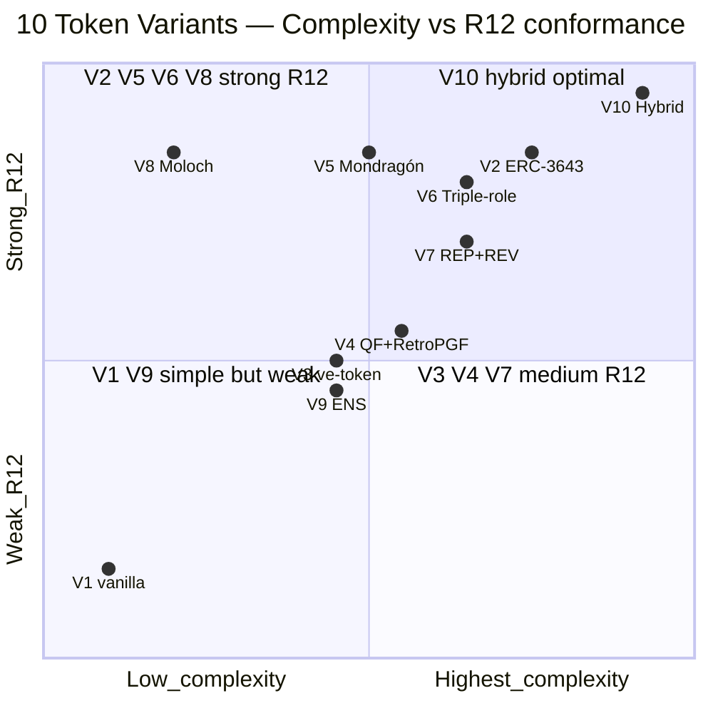
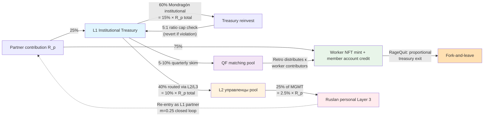

# TOKENOMICS-VARIANTS — 10 Token Design Variants Deep-Analyzed

> **Sub-deliverable Phase 3.** 10 token design variants для Jetix Phase 1 economic model. Each variant analyzed по 10 dimensions: token standard / governance / distribution / vesting / R12 conformance / Mondragón ratio fit / closed-loop dynamics / triple-role compatibility / pros / cons. Comparative matrix + brigadier provisional ranking + V10 hybrid recommendation. **R1 final selection = Ruslan**; brigadier surfaces options only.

> **Constitutional reminder.** This document is **F3 brigadier analytical synthesis** + **F4 derivative substrate citations** [src: EIP / Buterin / Mondragón / Gitcoin / RaidGuild]. NOT R1 strategic lock. Recommendation V10 hybrid = brigadier provisional thread; final selection pending Ruslan R1.

---

## §0 TL;DR (≤350w)

10 variants spanning simple (V1 vanilla ERC-20 DAO) → maximum hybrid (V10 Mondragón ratio + triple-role NFT + RageQuit + QF matching). Each scored по 10-dimension comparison matrix.

**Provisional brigadier ranking для Jetix Phase 1 substrate:**

1. **V10 Hybrid** ⭐⭐ — Strongest R12 conformance / triple-role native / Mondragón-spirit + cooperative DAO lessons + Buterin QF. Highest complexity (warranted для primary direction).
2. **V5 Mondragón-style** — Direct Mondragón translation; 60/40 + 5:1 ratio enforced; off-chain Charter discipline simpler than V10.
3. **V6 Triple-role NFT bundle** — ERC-1155 bundle с worker + investor + promoter NFT — triple-role explicit без full Mondragón framework.
4. V2 ERC-3643 Compliance + Soulbound — Regulatory-friendly Phase 2+; KYC overhead Phase 1.
5. V8 Cooperative DAO + RageQuit (Moloch) — R12-exemplar; battle-tested; simple structure не captures triple-role.

Variants V1 (vanilla 1T1V) / V3 (ve-token) / V4 (QF + RetroPGF solo) / V7 (reputation + revenue hybrid) / V9 (ENS domain) — preserved as components / fallbacks / Phase 2+ migration paths.

**Key dimension matrix:**

| Dim | V1 | V2 | V3 | V4 | V5 | V6 | V7 | V8 | V9 | **V10** |
|---|---|---|---|---|---|---|---|---|---|---|
| R12 native | ❌ | ✅✅ | △ | △ | ✅✅ | ✅✅ | ✅ | ✅✅ | △ | **✅✅✅** |
| Triple-role | ❌ | ✅ | ❌ | ❌ | ❌ | ✅✅ | △ | ❌ | ❌ | **✅✅** |
| Mondragón fit | △ | ✅ | ✅ | ✅ | ✅✅ | ✅✅ | △ | ✅ | ❌ | **✅✅✅** |
| Complexity | 🟢 low | 🟠 high | 🟡 med | 🟡 med | 🟡 med | 🟠 high | 🟠 high | 🟢 low | 🟡 med | 🔴 highest |
| Battle-tested | ✅✅ | △ | ✅ | ✅ | △ off-chain | △ | △ | ✅✅ | ✅ | △ new combo |

**R1 decisions pending Ruslan:** Primary variant selection / token launch timing / audit budget / governance threshold / RageQuit terms / Promoter NFT referral %.

---

## §1 Methodology — 10-dimension analysis framework

Каждый variant assessed по 10 dimensions:

| # | Dimension | Question |
|---|---|---|
| D1 | Token standard | Which ERC(s)? Compliance? Bundle? |
| D2 | Governance model | Vote weight? Whale-resistance? Delegate? |
| D3 | Distribution mechanic | Fair launch / Founder / Treasury / QF / RetroPGF? |
| D4 | Vesting / cliff | Linear / performance / contribution? |
| D5 | R12 conformance check | extraction_beyond_share / ratio_cap / consent / fork-prevention? |
| D6 | Mondragón ratio fit (5:1) | On-chain enforce or off-chain Charter? Edge cases? |
| D7 | Closed-loop dynamics | Self-sustaining? External capital dependency? |
| D8 | Triple-role compatibility | Worker + Investor + Promoter unified? |
| D9 | Pros (3-5) | What works |
| D10 | Cons (3-5) | What breaks / risks |

[src: Methodology derived from FPF EP-5 F-grade explicit + R12 paired-frame + Mondragón comparable matrix]

---

## §2 V1 — Vanilla ERC-20 + DAO Governance (baseline)

### Profile
- **D1 Token standard:** ERC-20 only (single token).
- **D2 Governance:** 1-token-1-vote (Compound style); delegate optional; on-chain vote tally.
- **D3 Distribution:** Fair launch (Yearn/SUSHI pattern) OR community airdrop OR Treasury pre-mint к DAO multisig (60-70% community / 20% treasury / 10-20% founders).
- **D4 Vesting:** Standard 4y linear с 1y cliff for any allocated founder share.

### R12 / Mondragón
- **D5 R12 conformance:** ❌ NOT native. Vanilla ERC-20 transferable + 1T1V whale-friendly; no extraction-cap; no ratio enforcement; no fork-and-leave built-in. **Requires off-chain Charter discipline для R12 compliance.**
- **D6 Mondragón ratio fit (5:1):** Off-chain Charter only; programmatic enforcement absent. Charter discipline track record uncertain at >100 partners scale.
- **D7 Closed-loop:** Possible but no native mechanism; relies on DAO treasury vote discipline.
- **D8 Triple-role:** ❌ No native distinction worker/investor/promoter — single fungible token = single role-blind structure.

### Pros / Cons
- **D9 Pros:** Simplest deployment ($10-30K audit budget); largest tooling ecosystem (OpenZeppelin / Aragon / Snapshot); battle-tested 500K+ contracts; universal wallet UX.
- **D10 Cons:**
  - No R12 enforcement built-in → off-chain Charter only
  - Governance whale risk Phase 1 (small holder count)
  - No worker/investor/promoter role distinction
  - Speculation surface (transferable + DEX-listable)
  - Mondragón ratio cap can't enforce programmatically

**Brigadier position:** V1 = lowest cost / fastest launch / weakest R12. Suitable если Ruslan R1 prioritizes speed + simplicity over R12 native enforcement + accepts off-chain Charter discipline. Fallback if V10 too complex Phase 1.

[src: EIP-20 + Compound Governor docs + Yearn fair launch retrospective]

---

## §3 V2 — ERC-3643 Compliance + Soulbound Membership

### Profile
- **D1 Token standard:** ERC-3643 (compliant security token) + ERC-721 soulbound (ERC-5114 extension) для membership.
- **D2 Governance:** Reputation-gated + delegated; permissioned voting (KYC required).
- **D3 Distribution:** No public sale (regulatory-friendly); allocation via Identity Registry post-KYC; vesting per Compliance contract rules.
- **D4 Vesting:** Performance-based unlocks per Compliance contract (e.g., Workshop completion / Hypothesis contribution).

### R12 / Mondragón
- **D5 R12 conformance:** ✅✅ Native. Compliance contract enforces 5:1 ratio cap + max holder thresholds + per-jurisdiction caps + fork-and-leave via burn-and-redeem mechanic. Programmable enforcement.
- **D6 Mondragón ratio fit:** ✅ Native — 5:1 ratio cap encoded в Compliance contract; revert tx if violation.
- **D7 Closed-loop:** Strong — soulbound = no external speculation leak; compliance + identity = stable governance pool.
- **D8 Triple-role:** ✅ Possible via soulbound NFT role flags (worker / investor / promoter attributes on single SBT).

### Pros / Cons
- **D9 Pros:**
  - Regulatory-friendly Phase 2+ (BaFin / SEC / MiCA compliant)
  - Built-in R12 enforcement via Compliance contract
  - Triple-role native via SBT role attributes
  - Anti-speculation by design (soulbound + permissioned)
  - Long-term sustainable (Tokeny Solutions consulting available)
- **D10 Cons:**
  - High complexity (audit cost $50-100K)
  - KYC overhead ($5-15 per partner via Onfido/Sumsub/Persona)
  - Permissioned (less «crypto-native» feel)
  - Legal opinion needed per jurisdiction
  - Newer standard (less battle-tested vs ERC-20)

**Brigadier position:** V2 = Phase 2+ migration target; Phase 1 = vanilla simpler. Suitable if Jetix has legal counsel + €50-100K audit budget + targets regulated EU partners.

[src: EIP-3643 / Tokeny T-REX whitepaper + MiCA EU framework 2024 + Buterin SBT paper 2022]

---

## §4 V3 — ve-Token (Time-locked Governance Curve veCRV pattern)

### Profile
- **D1 Token standard:** ERC-20 governance + ve-locking contract (veJETIX wrap).
- **D2 Governance:** Vote weight = locked_amount × (lock_duration / max_duration); longer lock = more weight + revenue share % boost.
- **D3 Distribution:** Fair launch ERC-20 → optional ve-lock for boost; rewards distributed pro-rata к ve-balance.
- **D4 Vesting:** Lock duration = vesting (1 week - 4 years); time-decay weight.

### R12 / Mondragón
- **D5 R12 conformance:** △ Partial. Long-lock = long-commitment = aligns с anti-extraction spirit; но no explicit ratio cap; speculation possible на ERC-20 base.
- **D6 Mondragón ratio fit:** △ Off-chain Charter; ve-boost can serve как Mondragón 5:1 proxy если carefully designed (longest-locker gets 5× shortest = ratio embedded в lock duration).
- **D7 Closed-loop:** ✅ Strong long-term incentive alignment; 4-year lock = capital lockup discourages short-term extraction.
- **D8 Triple-role:** ❌ Single token = single role; ve-boost = single dimension.

### Pros / Cons
- **D9 Pros:**
  - Long-term alignment native (4y lock)
  - Battle-tested Curve veCRV 5+ years
  - Revenue share boost incentivizes commitment
  - Anti-flip incentive built-in
- **D10 Cons:**
  - Capital lockup deters new Phase 1 partners (small cohort)
  - Vote-bribery secondary market (Convex/Votium analog risk)
  - No triple-role support
  - Complexity (ve-math intuition non-trivial)
  - Mondragón ratio cap requires careful ve-curve design

**Brigadier position:** V3 = Phase 2+ when cohort > 100 + capital lockup tolerance present. Phase 1: too restrictive.

[src: Curve Finance whitepaper + veCRV launch retrospective 2020 + Convex bribery analysis 2022]

---

## §5 V4 — Quadratic Funding + Retroactive PGF

### Profile
- **D1 Token standard:** ERC-20 governance + Soulbound identity (Gitcoin Passport equivalent для Sybil-resistance).
- **D2 Governance:** Quadratic Voting (vote_cost = votes²); identity-bound по soulbound; matching pool distributes RetroPGF rounds.
- **D3 Distribution:** Treasury pre-mint к Gitcoin-style matching pool; quarterly RetroPGF rounds vote on retrospective public-good contributions.
- **D4 Vesting:** Contribution-weighted retrospective (RetroPGF round outcomes determine token allocation).

### R12 / Mondragón
- **D5 R12 conformance:** △ Partial. Public-good alignment strong; ratio cap not native; depends on RetroPGF voter discipline. Contribution-based rewards anti-extraction-spirit.
- **D6 Mondragón ratio fit:** Off-chain Charter + RetroPGF voter discipline. Ratio cap = round-by-round emergent (если top award ≤ 5× median award per round).
- **D7 Closed-loop:** ⚠️ Depends на matching pool sustainability; Gitcoin uses external funders (Coinbase/Polychain); Jetix could fund matching from L1 institutional take.
- **D8 Triple-role:** ❌ Worker-focused (QF rewards contribution); no investor/promoter distinct.

### Pros / Cons
- **D9 Pros:**
  - Buterin-foundational (Liberal Radicalism 2018)
  - Aligns с public good / cooperative thesis
  - Anti-whale (quadratic diminishing)
  - Contribution-rewarding native
  - Optimism RetroPGF $200M+ proven distribution
- **D10 Cons:**
  - Matching pool sustainability concern
  - Sybil-resistance critical (identity layer required)
  - No triple-role support
  - Voter coordination cost
  - Subjective contribution measurement

**Brigadier position:** V4 components (QF matching + RetroPGF rounds) excellent для V10 hybrid integration. Standalone V4 misses investor + promoter role.

[src: Buterin/Hitzig/Weyl 2018 + Optimism RetroPGF rounds 1-5 reports + Gitcoin QF rounds 14-20]

---

## §6 V5 — Mondragón-style 60/40 + Wage Ratio Cap On-chain

### Profile
- **D1 Token standard:** ERC-20 + ERC-721 soulbound (member NFT); single fungible + identity.
- **D2 Governance:** 1-member-1-vote (Mondragón-style); soulbound enforces 1-vote-per-identity; reputation overlay optional.
- **D3 Distribution:** 60% institutional treasury / 40% individual member accounts (held in smart contract per-member); routing automatic.
- **D4 Vesting:** Individual member account = vested over membership tenure; redeemable at exit (RageQuit) с small holdback.

### R12 / Mondragón
- **D5 R12 conformance:** ✅✅ Native. 60/40 split = hardcoded smart contract; 5:1 ratio cap = on-chain check; fork-and-leave = RageQuit withdraws member account.
- **D6 Mondragón ratio fit:** ✅✅ Direct translation. 5:1 ratio cap programmatic.
- **D7 Closed-loop:** ✅✅ Strong. 60% institutional reinvested per Mondragón pattern; 40% direct member = closed loop при retention.
- **D8 Triple-role:** ❌ Worker-owner only (Mondragón 2-role); promoter dimension not native.

### Pros / Cons
- **D9 Pros:**
  - Direct Mondragón 68-year proven pattern
  - R12 native enforcement (60/40 + 5:1)
  - Simple structure conceptually
  - Track record proxy (Mondragón outcomes citable)
- **D10 Cons:**
  - Rigid 60/40 (no flexibility per partner)
  - No promoter role (misses Jetix triple-role thesis)
  - Complex for early stage (60/40 routing requires governance vote infra)
  - Mondragón cross-coop social fund 10% not native (Phase 2+)

**Brigadier position:** V5 = direct Mondragón translation; cleanest cooperative thesis; misses promoter role. **Fallback option 1 if V10 hybrid too complex.**

[src: Whyte&Whyte «Making Mondragon» 1991 + MCC Annual Reports 2023 + Hansmann 2000]

---

## §7 V6 — Triple-role NFT Bundle (ERC-1155)

### Profile
- **D1 Token standard:** ERC-1155 bundle с 3 token-ids per partner: worker share NFT (revenue claim) / investor NFT (treasury claim) / promoter NFT (network growth bonus soulbound).
- **D2 Governance:** Combined voting (investor NFT weight + worker NFT weight + promoter NFT bonus); soulbound promoter = identity-bound.
- **D3 Distribution:** Triple mint at partner onboarding: worker NFT for contribution capacity / investor NFT for treasury claim / promoter NFT soulbound for network growth.
- **D4 Vesting:** Worker NFT contribution-weighted; investor NFT linear 4y/1y; promoter NFT per-referral-mint.

### R12 / Mondragón
- **D5 R12 conformance:** ✅✅ Per-role caps + Mondragón ratio between roles; non-transferable promoter prevents speculation in network growth tier.
- **D6 Mondragón ratio fit:** ✅✅ Possible — per-role payout caps можно encode; ratio between top-earning worker vs bottom-earning worker capped 5:1.
- **D7 Closed-loop:** ✅ Triple-role unified = positive feedback loop (worker builds platform → promoter spreads → investor captures upside).
- **D8 Triple-role:** ✅✅ Native — entire variant designed для triple-role.

### Pros / Cons
- **D9 Pros:**
  - Triple-role native (matches Ruslan voice 21.05 explicit)
  - ERC-1155 single-contract = gas-efficient batch ops
  - Flexible per-role rules
  - Soulbound promoter = anti-spam referrals
  - Composable per Buterin SBT thesis
- **D10 Cons:**
  - Complex UX (3 token-ids per partner)
  - Wallet support varies for ERC-1155
  - Many tokens to track / display
  - Less marketplace tooling vs ERC-721
  - Token-id schema design careful

**Brigadier position:** V6 = strong triple-role variant; pairs naturally с V10. **Fallback option 2 if V10 hybrid too complex.**

[src: EIP-1155 + Buterin SBT 2022 + OpenZeppelin ERC1155 reference]

---

## §8 V7 — Reputation + Revenue Share Hybrid (2-token)

### Profile
- **D1 Token standard:** Two ERC-20 tokens: REP (soulbound; contribution-earned) + REV (transferable; treasury-funded).
- **D2 Governance:** REP-weighted voting (non-transferable identity-bound); REV not voting-weighted.
- **D3 Distribution:** REP earned via contribution (SourceCred / Coordinape scoring); REV minted from treasury allocation gated by REP threshold.
- **D4 Vesting:** REP non-vesting (earned-not-vested); REV linear unlock per REP threshold gate.

### R12 / Mondragón
- **D5 R12 conformance:** ✅ Contribution-based = anti-speculation; REP soulbound prevents extraction via secondary market; REV transferable allows liquidity.
- **D6 Mondragón ratio fit:** Reputation-determined; REP max threshold can encode 5:1 cap; off-chain Charter for REV.
- **D7 Closed-loop:** REP-gated REV creates contribution → REV cycle; Mondragón-spirit.
- **D8 Triple-role:** △ Worker (REP-earning) + Investor (REV holding) — но promoter not distinct.

### Pros / Cons
- **D9 Pros:**
  - Aligns work с reward (REP-gated)
  - Anti-speculation native (REP soulbound)
  - 2-token clarity vs single fungible
  - SourceCred/Coordinape battle-tested contribution scoring
- **D10 Cons:**
  - Complex reputation calc (centralization risk in scorer)
  - 2-token UX overhead
  - REV speculation possible (transferable)
  - Promoter role not distinct
  - Subjective scoring vulnerability

**Brigadier position:** V7 = strong worker-investor variant; missing promoter; reputation system requires governance discipline.

[src: SourceCred docs + RaidGuild Handbook + Coordinape pattern]

---

## §9 V8 — Cooperative DAO + RageQuit (Moloch DAO v2 / RaidGuild pattern)

### Profile
- **D1 Token standard:** ERC-20 governance + Moloch DAO smart contract (Moloch v2 / DAOhaus).
- **D2 Governance:** 1-token-1-vote; proposals + voting period + grace period; rage-quit any time before grace.
- **D3 Distribution:** Member-pledged contribution (loot / shares) + treasury-funded grants.
- **D4 Vesting:** Loot = non-voting share (vests as continued membership); shares = voting (immediate); proportional treasury claim.

### R12 / Mondragón
- **D5 R12 conformance:** ✅✅ RageQuit native = fork-and-leave с proportional treasury withdrawal — R12-exemplar pattern. Acked в Game Theory research §11 как M-C mechanism.
- **D6 Mondragón ratio fit:** Off-chain Charter; RageQuit constraint = capital exits proportional (anti-concentration tendency).
- **D7 Closed-loop:** ✅ Self-sustaining via member contributions; RaidGuild battle-tested 5+ years.
- **D8 Triple-role:** ❌ Single role (member); no worker/investor/promoter distinction.

### Pros / Cons
- **D9 Pros:**
  - R12-exemplar (RageQuit fork-and-leave native; cited Q2 ack 2026-05-12)
  - Battle-tested RaidGuild + Moloch DAOs
  - Simple structure
  - Member-pledge governance discipline
  - Strong dispute-resolution (RageQuit avoids deadlock)
- **D10 Cons:**
  - Simple structure misses triple-role
  - Mondragón ratio cap not native
  - Promoter dimension absent
  - Proportional RageQuit can drain treasury if mass-exit

**Brigadier position:** V8 = R12-exemplar minimum-viable variant. **RageQuit pattern must integrate в V10 hybrid for R12 conformance.**

[src: RaidGuild Handbook + Moloch DAO v2 docs + DAOhaus / DXdao governance frameworks]

---

## §10 V9 — ENS-style Domain Ownership + Utility

### Profile
- **D1 Token standard:** ERC-721 domain NFT (jetix.eth subdomains: ruslan.jetix.eth / partner-x.jetix.eth) + ERC-20 utility (services payment).
- **D2 Governance:** Domain ownership = membership; vote per domain NFT (1 domain = 1 vote); reputation overlay possible.
- **D3 Distribution:** Annual subdomain registration; rent / renewal fee = ongoing commitment; utility token earned via services / contribution.
- **D4 Vesting:** Domain renewal = ongoing vesting (must renew to retain membership); utility token immediate.

### R12 / Mondragón
- **D5 R12 conformance:** △ Renewal opt-out = soft fork-leave (lose domain if don't renew); but no ratio cap; no closed-loop native.
- **D6 Mondragón ratio fit:** Off-chain; renewal fee small fraction of revenue.
- **D7 Closed-loop:** △ Renewal fees fund Jetix institutional; но primary revenue mechanism not direct.
- **D8 Triple-role:** ❌ Domain ownership only; no role distinction.

### Pros / Cons
- **D9 Pros:**
  - Clear ownership semantics (your subdomain = your membership)
  - Brand-aligned (jetix.eth = identity)
  - Renewal = ongoing commitment signal
  - ENS battle-tested
- **D10 Cons:**
  - Not directly governance vote primary mechanism
  - 2-token complexity (domain + utility)
  - Annual renewal admin overhead
  - Doesn't capture revenue flow recursion
  - No triple-role native

**Brigadier position:** V9 = identity layer accessory; useful for V10 partner-naming convention; standalone misses economic mechanics.

[src: ENS DAO docs + ENS labs token launch retrospective 2021]

---

## §11 V10 — ⭐ Hybrid (Mondragón ratio + Triple-role NFT + RageQuit + QF matching)

### Profile (recommended primary direction)

- **D1 Token standard:** ERC-1155 triple-role NFT bundle (worker / investor / promoter token-ids per partner) + ERC-20 utility token (services payment + liquid revenue share) + soulbound governance SBT (1-identity = 1-vote).
- **D2 Governance:** Hybrid — SBT 1-identity-1-vote baseline + QF quadratic voting for matching pool allocation + delegated for technical decisions; reputation-gated proposal thresholds.
- **D3 Distribution:** Triple-mint at partner onboarding (worker + investor + promoter NFT) + Mondragón 60/40 routing (60% institutional treasury / 40% member accounts) + 5-10% quarterly QF matching pool funded by L1 institutional skim.
- **D4 Vesting:** Worker NFT contribution-weighted; investor NFT linear 4y/1y; promoter NFT per-referral-mint; member account vested over tenure (RageQuit-redeemable).

### R12 / Mondragón
- **D5 R12 conformance:** ✅✅✅ Triple-enforced:
  - **Mondragón 5:1 ratio cap** on-chain check (revert if violation)
  - **RageQuit** fork-and-leave с proportional treasury (R12-exemplar)
  - **QF matching pool** = contribution-aligned (anti-extraction)
  - **Soulbound promoter NFT** = anti-spam referral (no extraction beyond agreed share via Sybil)
- **D6 Mondragón ratio fit:** ✅✅✅ Programmatically enforced 5:1.
- **D7 Closed-loop:** ✅✅✅ Strongest. 75% worker pool + 25% institutional treasury (Layer 1) + Ruslan Layer 3 recursion + QF matching reinvested = full closed loop.
- **D8 Triple-role:** ✅✅✅ Native (entire variant designed for it).

### Pros / Cons
- **D9 Pros:**
  - Strongest R12 conformance (triple-enforced)
  - Triple-role native (matches Ruslan voice 21.05)
  - Mondragón-spirit + cooperative DAO lessons + Buterin QF
  - Closed-loop self-sustaining
  - Composable Phase 2+ (can layer ERC-3643 compliance later)
  - Network State adjacent (H7 People-NS thesis-compatible)
- **D10 Cons:**
  - Most complex deployment ($75-150K audit budget)
  - UX learning curve (3 token-ids per partner + SBT + utility)
  - Careful smart contract design (multiple interacting modules)
  - Newer combo (no battle-tested precedent for full stack)
  - Integration debt (5 modules to maintain)

**Brigadier position:** V10 = strongest R12 conformance + triple-role native + closed-loop. **Provisional primary direction для Jetix Phase 1.** Audit budget warrants strategic significance per Ruslan voice «pizданешь схемки + 5-10 variants».

[src: Combines Mondragón + Buterin QF + RaidGuild Moloch + EIP-1155 + EIP-5114 SBT]

---

## §12 Side-by-side comparison matrix (full detail)

| Dimension | V1 | V2 | V3 | V4 | V5 | V6 | V7 | V8 | V9 | **V10** ⭐ |
|---|---|---|---|---|---|---|---|---|---|---|
| **D1 Token standard** | ERC-20 | ERC-3643+SBT | ERC-20+ve | ERC-20+SBT | ERC-20+NFT | ERC-1155 | 2×ERC-20 | ERC-20+Moloch | ERC-721+ERC-20 | ERC-1155+SBT+ERC-20 |
| **D2 Governance** | 1T1V | Delegated+rep | ve-weighted | QV | 1-member-1-vote | Combined | REP-weighted | 1T1V Moloch | Domain-1-vote | Hybrid (SBT+QF+delegate) |
| **D3 Distribution** | Fair launch | KYC-gated | Lock-rewarded | QF matching | 60/40 split | Triple-mint | Contribution+gate | Member-pledge | Subdomain rent | Triple-mint+60/40+QF |
| **D4 Vesting** | 4y/1y | Performance | Lock-as-vest | RetroPGF | Tenure | Per-role | REP-gated | Loot+shares | Renewal | Combined |
| **D5 R12 native** | ❌ | ✅✅ | △ | △ | ✅✅ | ✅✅ | ✅ | ✅✅ | △ | ✅✅✅ |
| **D6 Mondragón 5:1** | Off-chain | On-chain | ve-curve proxy | Round-emergent | ✅ on-chain | Per-role caps | REP threshold | Off-chain | Off-chain | ✅ on-chain |
| **D7 Closed-loop** | △ Treasury | ✅ permissioned | ✅ lock | △ pool-dep | ✅✅ 60/40 | ✅ triple | ✅ REP-gate | ✅ RageQuit | △ renewal | ✅✅✅ all |
| **D8 Triple-role** | ❌ | ✅ via SBT | ❌ | ❌ | ❌ | ✅✅ | △ 2/3 | ❌ | ❌ | ✅✅✅ |
| **D9 Pros count** | 4 | 5 | 4 | 5 | 4 | 5 | 4 | 5 | 4 | 6 |
| **D10 Cons count** | 5 | 5 | 5 | 5 | 4 | 5 | 5 | 4 | 5 | 5 |
| **Complexity** | 🟢 low | 🟠 high | 🟡 med | 🟡 med | 🟡 med | 🟠 high | 🟠 high | 🟢 low | 🟡 med | 🔴 highest |
| **Battle-tested** | ✅✅ 500K+ | △ Tokeny | ✅ Curve 5y | ✅ Gitcoin | △ off-chain | △ EIP-1155 mature | △ RaidGuild | ✅✅ RaidGuild 5y | ✅ ENS 4y | △ new combo |
| **Audit budget est.** | $10-30K | $50-100K | $20-50K | $30-60K | $30-60K | $40-80K | $40-80K | $20-40K | $30-60K | $75-150K |
| **Phase 1 ready** | ✅✅ | △ | △ | △ | ✅ | ✅ | △ | ✅✅ | △ | △ if audit budget |
| **Phase 2+ ready** | △ | ✅✅✅ | ✅ | ✅✅ | ✅✅ | ✅✅ | ✅ | ✅ | ✅ | ✅✅✅ |

---

## §13 Mermaid D4 — Variant comparison quadrant (Complexity × R12 conformance)

---

## §14 Mermaid D5 — V10 token flow (graph LR)

---

## §15 Brigadier provisional recommendation (R1 lock pending)

### Recommended Phase 1 path

**Primary:** V10 Hybrid — strongest R12 / triple-role native / closed-loop / Mondragón + Buterin synthesis.

**Fallback 1 (if V10 audit budget too high):** V5 Mondragón-style — direct 60/40 + 5:1 ratio cap; misses promoter role но cleanest cooperative thesis.

**Fallback 2 (если V10 complexity overwhelming):** V6 Triple-role NFT — triple-role native без full Mondragón framework.

**Avoid for Phase 1:** V1 (no R12) / V3 (capital lockup deters new partners) / V9 (doesn't capture revenue flow).

**Phase 2+ migration paths:**
- V10 → add ERC-3643 compliance wrapper когда regulated EU partner count > 50
- V10 → ve-locking layer для long-term commitment alignment
- V10 → ENS subdomain identity layer (jetix.eth) for branding

### R1 decisions pending Ruslan

| # | Decision | Brigadier surface | Ruslan R1 lock pending |
|---|---|---|---|
| 1 | Primary variant Phase 1 | V10 / V5 / V6 / other | ⏳ |
| 2 | Token launch timing | Q3 / Q4 2026 / 2027 | ⏳ |
| 3 | Smart contract audit budget | $50-150K range | ⏳ |
| 4 | Initial DAO governance threshold | proposal threshold / quorum | ⏳ |
| 5 | RageQuit terms | full proportional / partial / lock period | ⏳ |
| 6 | Promoter NFT referral % terms | 5-15% revenue from referred partners | ⏳ |
| 7 | L2 substrate choice | Optimism / Base / Arbitrum | ⏳ |
| 8 | Upgradability pattern | Transparent Proxy / UUPS / Diamond | ⏳ |
| 9 | L1 institutional take rate | 25% (voice) / 20-25% (DR-26 range) | ⏳ |
| 10 | L2 управленцы comp model | в карман / reinvest / mix governance vote | ⏳ |

---

## §16 Cross-refs

- Main: `decisions/strategic/ECONOMIC-MODEL-TOKENOMICS-2026-05-21.md` (Phase 14)
- Recursive partnership sub-doc: `decisions/strategic/RECURSIVE-PARTNERSHIP-MECHANICS-2026-05-21.md`
- Triple-role sub-doc: `decisions/strategic/TRIPLE-ROLE-PARTNER-2026-05-21.md`
- Recommendation memo: `reports/economic-model-tokenomics-2026-05-21/_RECOMMENDATION-MEMO.md` (Phase 12)
- R12 conformance audit: `reports/economic-model-tokenomics-2026-05-21/10-r12-conformance.md` (Phase 10)
- Risk surface: `reports/economic-model-tokenomics-2026-05-21/11-risk-surface.md` (Phase 11)

---

*Sub-deliverable Phase 3 closure 2026-05-21. Brigadier-scribe Cloud Cowork. 10 variants × 10 dimensions. R1 selection pending Ruslan.*
