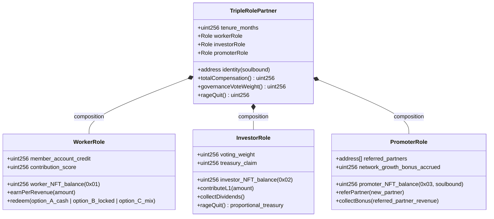
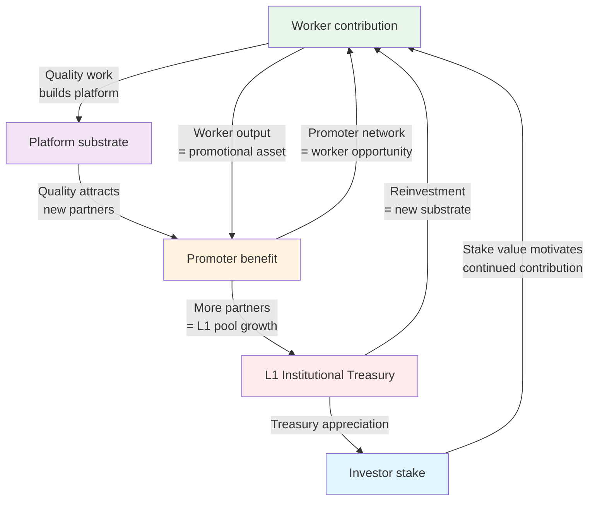
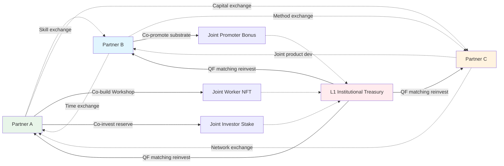

# TRIPLE-ROLE-PARTNER — Worker + Investor + Promoter Unified

> **Sub-deliverable Phase 6 ⭐⭐.** Полная разработка концепции triple-role partner из Ruslan voice 21.05 night: каждый partner Jetix одновременно worker (даёт 25% revenue + ресурсы) + investor (получает share / tokens / metrics back) + promoter (продвигает платформу). 3 роли в одном лице с synergy внутри партнёра и cooperative interactions между партнёрами. Beyond-Mondragón innovation (Mondragón 2-role worker-owner; Jetix adds promoter dimension). 4 mermaid diagrams D10-D13.

---

## §0 TL;DR (≤300w)

Ruslan voice 21.05 night articulates **3 unified roles per partner** vs traditional 2-role worker-owner (Mondragón) или 1-role employee/investor (traditional firm):

**Role 1 — Worker:** контрибут к platform via Workshop delivery / Hypothesis testing / method propagation / operations. **Reward:** 75% revenue share + worker tokens.

**Role 2 — Investor / Owner:** 25% revenue → Jetix institutional → equity-like stake (ERC-1155 investor NFT) + voting rights + treasury claim. **Reward:** Treasury share + dividends + token appreciation.

**Role 3 — Promoter:** cascade growth — bring new partners (referrals) / promote platform / educational content / community building. **Reward:** Network growth bonus (% revenue from referred partners) + soulbound promoter NFT.

**3 roles unified в одном лице → self-reinforcing positive feedback:**
- Worker contribution → builds platform → attracts more partners (Promoter benefit)
- Investor stake → motivates Worker quality
- Promoter network → expands Worker opportunity

**Inter-partner cooperation matrix:** partners exchange across roles — cross-pollination of expertise / skills / time / capital / network. Anti-zero-sum.

**Comparison к traditional employment:** salary (worker only) vs Jetix 75% + treasury + promoter bonus + governance vote + RageQuit fork-and-leave. **Higher risk** (skin-in-the-game) **+ higher reward** + **stronger alignment**.

**R12 paired-frame:** triple-role per-role caps + Mondragón ratio between roles + soulbound promoter (anti-spam referrals) + RageQuit fork-and-leave preserved across all 3 roles. R12-compliant by design.

**Beyond Mondragón:** Mondragón 2-role (worker + owner); Jetix 3-role adds **promoter dimension** — explicit recognition of network growth contribution as economic role. Innovation gap filling that Mondragón missed (Eroski/Fagor concentration tendency partially addressed via promoter cascading new coop founding).

---

## §1 Concept origin (Ruslan voice 21.05 night verbatim)

[src: `daily-logs/_DAILY-LOG-2026-05-21.md` §APPEND-2026-05-21-night-economic-model-tokenomics-dictation lines 365-376]

### §1.1 Voice anchor

> «каждый новый партнер ... будет и работником и продвигателем платформы одновременно ... 25% своего дохода + ресурсов системе → получать от него все киноветрии ресурсы → брать систему какую-то часть или ресурсы ... инвестор и стартапер и работник в одном лице»

### §1.2 Voice unpacking

3 explicit roles:
1. **«работник»** — Worker (contribut к platform)
2. **«инвестор / стартапер»** — Investor / Owner (ownership / stake)
3. **«продвигатель платформы»** — Promoter (cascade growth)

3 roles **«в одном лице»** = unified в одного партнёра.

**Inter-partner relations** (voice line «Партнёры между собой: Сотрудничают / Обмениваются ресурсами / Взаимно усиливают»):
- Cooperation, not competition
- Resource exchange across roles
- Mutual amplification

---

## §2 Role 1 — Worker (контрибут)

### §2.1 Worker contribution categories

Per Strategic Plan Phase 8 + Hypothesis arch operational + Workshop tier substrate:

| Category | Examples | Tier applicability |
|---|---|---|
| Workshop deliverables | Teaching L4-L7 cohorts; curriculum design; live sessions | L1, L3, L5 |
| Hypothesis testing | Running Hypothesis tests against substrate (per arch); generating findings | All L1+L3 partners |
| Method propagation | Educational content (blog / video / podcast); mentoring; consulting clients | L1, L3, L4 |
| Operational tasks | Cohort coordination; tool maintenance; agent operation | L2 управленцы + L3+ partners |
| New product seed | Prototyping new substrate features; Workshop curriculum innovation; partnership pipeline | L1, L3 |

### §2.2 Worker reward mechanic

```
Worker_share_i = 0.75 × R_p,i  (direct retention)
+ Worker_NFT_i  (V10: contribution-weighted token mint per Phase 5 §B)
+ Member_account_credit_i  (V10: Mondragón 60/40 → 40% individual account)
```

Plus accumulated benefits:
- Reputation score (V7/V10 reputation-gated governance)
- Workshop teaching fee retention (cohort fees retained per teaching event)
- Hypothesis arch attribution (findings credited к partner contributor)

### §2.3 Worker quality assurance (anti-extraction edge)

Per R12 LOCK: ensures worker contribution is real (not Sybil / not extraction-only):
- Workshop completion attestations on-chain (V10)
- Hypothesis test contributions verified by peer review
- Method propagation tracked via reputation-weighted feedback (SourceCred-style)
- Quarterly governance audit verifies worker activity tier classification

---

## §3 Role 2 — Investor / Owner (ownership)

### §3.1 Investor stake mechanic

```
Investor_stake_i = L1_contribution_i / L1_total
                = (0.25 × R_p,i) / Σ_j (0.25 × R_p,j)
                = R_p,i / R (proportional to revenue contribution)
```

This stake encoded as:
- ERC-1155 investor NFT (V10) с proportional balance
- Governance voting rights (1 token = 1 vote, OR quadratic weighting per V10 hybrid)
- Treasury claim в case of RageQuit (proportional pro-rata claim of L1 institutional treasury)
- Dividend rights (if L2 reinvestment generates returns, distributed quarterly pro-rata)

### §3.2 Investor reward mechanic

| Mechanism | Source | Beneficiary calculation |
|---|---|---|
| Governance voice | L1 token weight | Proportional к L1 contribution |
| Treasury appreciation | L1 institutional pool growth | Proportional ownership share |
| Dividends (if any) | L2 reinvestment ROI | Pro-rata distribution |
| RageQuit claim | L1 treasury at exit | Proportional balance × treasury-share |
| L3 cascading (Ruslan only at L0) | L2 pool × 25% | Recursive partner-level investing back |

### §3.3 Anti-extraction safeguards (R12 paired-frame)

Per R12 LOCK + extraction_beyond_share action class:
- Investor stake explicit в Charter
- 30-day opt-out preserved
- RageQuit ensures fork-and-leave при dissatisfaction
- Mondragón 5:1 ratio cap applies — top investor compensation ≤ 5× minimum worker

---

## §4 Role 3 — Promoter (cascade growth)

### §4.1 Promoter activities

| Activity | Description | Reward mechanism |
|---|---|---|
| Direct referral | Bring qualified new partner to onboarding | Promoter NFT mint + % revenue from referred partner first 12 months |
| Sponsorship | Vouch для new partner application; provide initial mentorship | Reduced referral % но ongoing reputation accrual |
| External promotion | Content (blog / video / podcast / Twitter) about Jetix | Reputation accrual + soulbound promoter NFT mint |
| Educational content | Workshop attendance content; case studies; method translation | Worker share + promoter NFT dual-credit |
| Community building | Discord / Telegram / Slack moderation; partner events | Soulbound promoter NFT + reputation |
| Partnership pipeline | Bring strategic partner orgs (companies / academic / DAO) | Higher referral % (e.g., 15% vs 10% individual) |

### §4.2 Promoter reward calculation

```
Promoter_bonus_i = Σ_{j referred by i} 0.05-0.15 × R_p,j (first 12 months of referred partner's tenure)
                 + Promoter_NFT_i (soulbound, non-transferable)
                 + Reputation accrual (governance-weight gates)
```

**% configurable per Charter:**
- 5% — minimum baseline (anti-spam)
- 10% — default per V10 Phase 1 hypothesis
- 15% — high-trust partnership pipeline (strategic orgs)
- Cap: 20% (Mondragón ratio cap proxy — top promoter ≤ 5× minimum worker compensation)

**Duration:** first 12 months of referred partner's tenure (per V10 default); beyond = no further promoter bonus accrual (referred partner = own equal partner; cascading attribution decays).

### §4.3 Soulbound promoter NFT (anti-spam)

Per Buterin 2022 SBT thesis + Phase 2 §C.6:

```solidity
// Pseudo-code
contract PromoterNFT is ERC721Soulbound {
    function mint(address promoter, uint256 tokenId) external onlyGovernance {
        require(_isValidReferral(promoter, tokenId), "Invalid referral");
        _mint(promoter, tokenId);
    }

    function _transfer(...) internal override {
        revert("Promoter NFT is soulbound");
    }
}
```

**Anti-spam protection:**
- Soulbound = cannot sell promoter NFT (no market exists)
- Referral quality scored (referred partner retention ≥ 6 months = full promoter reward; <6 months = reduced)
- Governance audit quarterly: spam referrals (Sybil / low-quality) flagged + promoter NFT revocable by 90% supermajority

### §4.4 Promoter R12 audit

Per R12 LOCK extraction_beyond_share + non_consensual_distribution:
- Referred partner must explicit consent to be referred (no auto-attribution)
- Promoter % explicit в Charter
- Referred partner can fork-and-leave; promoter % stops accruing
- Soulbound prevents Sybil multi-referrer extraction

**Verdict:** R12-compliant when promoter NFT soulbound + Charter explicit + 6-month tenure validation.

---

## §5 Triple-role NFT bundle implementation (ERC-1155)

### §5.1 Bundle structure (V10 hybrid)

Per EIP-1155 multi-token contract:

| Token ID | Type | Description | Transferable | Earned by |
|---|---|---|---|---|
| 0x01 | Worker share | Revenue claim per period | Yes с restrictions (1-year holdback) | Contribution / tenure |
| 0x02 | Investor stake | Treasury claim + voting | Yes (с lock at onboarding 12 mo) | 25% × R_p,i contribution |
| 0x03 | Promoter | Network growth bonus claim | NO (Soulbound per ERC-5114) | Referrals + promotion |

### §5.2 Triple-mint at onboarding

When new partner onboarded:
```
mintBatch(partner, [0x01, 0x02, 0x03], [initial_amounts])
```

Initial amounts depend on:
- Tier classification (L1 First Clan / L3 cohort / L4-L5 active)
- Mondragón 60/40 member account routing
- Charter-stated baseline allocation

### §5.3 Per-role payout cap

```
max_worker_payout / min_worker_payout ≤ 5:1
max_investor_payout / min_investor_payout ≤ 5:1
max_promoter_payout / min_promoter_payout ≤ 5:1
```

**Separate caps per role** = each role bound independently. Prevents cross-role ratio breach (e.g., top promoter not bounded к worker minimum).

**Brigadier note (AP-6 dissent):** Separate per-role caps might allow aggregate top partner compensation exceeding Mondragón 5:1 if topped on all 3 roles simultaneously. Alternative: aggregate cap (sum of worker + investor + promoter ≤ 5× minimum aggregate). R1 decision pending.

---

## §6 Role interactions внутри одного партнёра (intra-partner synergy)

### §6.1 Synergy matrix

| From → To | Effect |
|---|---|
| Worker → Promoter | Quality work attracts referrals (reputational); successful Workshop = promotional asset |
| Worker → Investor | Worker share % growing = treasury share growing (compounding effect) |
| Promoter → Worker | Promoter brings new partners → new partners contribute → expanded worker pool for collaboration |
| Promoter → Investor | More partners → larger L1 institutional treasury → investor stake appreciates |
| Investor → Worker | Treasury reinvestment → new substrate features → better worker tooling |
| Investor → Promoter | Treasury appreciation → larger promoter bonus pool when referred-partner revenue scales |

### §6.2 Positive feedback loop (closed-loop characteristic)

Per Phase 7 closed-loop dynamics + Strategic Plan Phase 8 self-sustaining:

```
Worker contribution → Platform quality
        ↓
Platform quality → Attracts new partners (Promoter benefit)
        ↓
New partners → L1 institutional pool grows
        ↓
L1 institutional → New substrate features (Investor reinvestment)
        ↓
New substrate → Worker effectiveness
        ↓ (cycle)
```

**Multiplier:** when all 3 roles active per partner, partner extracts compound value (worker + investor + promoter triple-stream) AND contributes compound value (3 dimensions of platform growth).

### §6.3 Failure modes (intra-partner)

| Failure mode | Description | Mitigation |
|---|---|---|
| Worker apathy при low Workshop activity | Partner stops contributing; receives only treasury appreciation passively | Reputation-gated thresholds; minimum activity для full participation; 6-month inactivity = role suspension |
| Investor speculation focus | Partner treats investor NFT as financial asset не cooperative | Soulbound governance overlay (1-identity-1-vote); RageQuit terms encourage continuity |
| Promoter spam (low-quality referrals) | Partner refers many low-quality partners для quick promoter bonus | Soulbound promoter NFT + referred partner 6-month tenure validation + governance audit |
| Role conflict (worker vs investor incentive) | Worker wants higher worker share; investor wants treasury reinvestment | Charter explicit balance + governance vote per partner allocation choices |

---

## §7 Inter-partner cooperation matrix

### §7.1 Cross-pollination of expertise

Per voice «Сотрудничают / Обмениваются ресурсами / Взаимно усиливают»:

| Exchange type | Example | Mechanism |
|---|---|---|
| Skill exchange | Partner A teaches Workshop в DDD; Partner B teaches systems-thinking; cross-instruct | Workshop tier programming |
| Time exchange | Partner A covers cohort coordination; Partner B builds new Hypothesis arch tool | Coordinape-style allocation grants |
| Capital exchange | Partner A purchases worker NFT from departing Partner B at fair price | Secondary market (limited) |
| Network exchange | Partner A introduces Partner B to her referral network → joint promoter | Referral attribution split |
| Method exchange | Partner A's Hypothesis test methodology adopted by Partner B | Method propagation as worker contribution credit |

### §7.2 Cooperative interactions (anti-zero-sum)

Mondragón inter-coop social fund 10% pattern translation:

| Pattern | Mondragón original | Jetix V10 translation |
|---|---|---|
| Inter-coop social fund | 10% of coop surplus → Federation social fund | 10% of L1 institutional pool → QF matching pool quarterly |
| Cross-coop staff sharing | Workers transferred between coops в crisis | Cross-tier partner assistance (L1 mentors L3 etc.) |
| Joint product development | Multiple coops invest в new product | Multiple partners co-build new substrate feature; joint worker NFT |
| Education sharing | Mondragón University training shared | Workshop tier delivery cooperatively delivered |

### §7.3 Anti-competitive guardrails

Within Jetix triple-role, partners NOT competing для finite worker pool — pool scales с aggregate revenue. Game-theoretic positive-sum:
- Each partner's contribution grows R → grows L1 → grows treasury → grows everyone's investor stake value
- Each partner's promotion grows partner count → grows R aggregate
- Cooperative emergent property per Game Theory M-C mechanism §11

---

## §8 Comparison к traditional employment + Mondragón

### §8.1 Comparison table

| Aspect | Traditional employee | Mondragón worker-owner | Jetix triple-role partner |
|---|---|---|---|
| **Income** | Salary | Salary + 40% surplus to member account | 75% revenue share + treasury + promoter bonus |
| **Ownership** | None | Member account (capital share) | Investor NFT + member account |
| **Promotion path** | Ladder (vertical only) | Limited internal | Promoter NFT — direct revenue from network growth |
| **Voice** | Limited; HR | Member vote 1-member-1-vote | Governance vote + QF + delegate optional |
| **Exit** | Quit (lose all besides salary) | Retire (member account returned с delays) | RageQuit с proportional treasury claim immediate |
| **Risk** | Low (salary protected) | Medium (variable surplus) | Higher (skin-in-the-game) |
| **Alignment** | Weak (salary tied к role не outcome) | Medium (surplus shared) | Strong (3 streams aligned с partner success) |
| **Skin-in-the-game** | None | Member account at risk | Investor stake + worker share + promoter rep at risk |

### §8.2 Beyond-Mondragón innovation gap

Mondragón = 2-role (worker + owner). Jetix = 3-role (adds promoter dimension).

**Why promoter explicit dimension matters:**
- Mondragón concentration tendency (Eroski / Fagor dominance) partially due к internal capacity expansion not external network expansion
- Promoter explicit role rewards external network growth → anti-concentration
- New coop founding в Mondragón happens via Caja Laboral seed funding; in Jetix, promoter-bonused referrals direct
- Network State thesis-compatible (H7 People-NS LOCK 2026-05-12): explicit recognition of network growth as economic role aligns с Buterin/Srinivasan NS-substrate logic

[src: Whyte&Whyte ch.7 Mondragón concentration critique + H7 People-NS LOCK + Buterin/Srinivasan NS-substrate]

### §8.3 Why 3 roles vs more (e.g., 4-role with Curator)

Brigadier considered 4-role expansion (adding Curator role — quality auditor / governance voter delegate). **Decision:** keep 3-role for simplicity; Curator function = subset of Worker role (governance audit = worker contribution); avoids combinatorial complexity. R1 ack pending if Ruslan prefers explicit Curator role.

---

## §9 Failure modes + mitigation map

### §9.1 Failure mode inventory

| Mode | Severity | Probability | Mitigation |
|---|---|---|---|
| Role conflict (worker vs investor incentive) | Medium | Medium | Charter explicit balance + governance vote |
| Promoter spam (low-quality referrals) | Medium | Medium-High | Soulbound + 6-month tenure validation + governance audit |
| Investor speculation | Medium | Low (soulbound prevents) | Soulbound governance overlay; RageQuit lock period |
| Worker apathy + passive investor | Medium | Medium | Activity thresholds; reputation-gated benefits |
| Ratio cap breach (5:1) | High | Low if cap programmatic | On-chain check V10 + 90% supermajority override governance |
| Aggregate top partner exceeds 5:1 (per-role caps insufficient) | High | Low | Aggregate cap design (sum ≤ 5× min) per Charter |
| Cohort small (<6) ratio edge | High | High Phase 1 | Cohort threshold gate; ratio relaxed для startup phase per Charter |
| Sybil promoter (multi-identity) | High | Medium without identity layer | Gitcoin Passport / Worldcoin / BrightID integration V10 Phase 2+ |
| Governance capture (1T1V whale) | High | Low в V10 hybrid SBT 1-id-1-vote | Soulbound SBT identity layer; QF quadratic ondefault |
| RageQuit cascade (multiple simultaneous exits drain treasury) | Critical | Low if cohort >20 + onboarding pipeline healthy | Withdrawal lock period (30-90 day notice); proportional cap |
| Cross-role attribution misalignment | Medium | Medium | Quarterly governance audit; transparent attribution ledger on-chain |

### §9.2 Mitigation strategies summary

**Programmatic enforcement (V10 on-chain):**
- Ratio cap 5:1 per role + aggregate (R1 decision)
- Soulbound promoter NFT (anti-spam)
- RageQuit с withdrawal lock period (anti-cascade)
- Activity thresholds (anti-apathy)

**Governance discipline:**
- Quarterly transparent attribution audit
- 90% supermajority для cap override
- Charter-explicit role definitions + opt-out per partner

**Identity layer (Phase 2+):**
- Worldcoin / BrightID / Gitcoin Passport integration
- KYC for ERC-3643 wrap optional

**Cooperative culture:**
- Mondragón 60/40 member account routing
- Mondragón 10% inter-coop social fund → QF matching pool
- Anti-zero-sum game-theoretic framing

---

## §10 Mermaid D10 — Triple-role unified (classDiagram)



---

## §11 Mermaid D11 — Intra-partner role feedback loops (graph TD)



---

## §12 Mermaid D12 — Inter-partner cooperation matrix (graph LR)



---

## §13 Mermaid D13 — Failure modes mitigation map (quadrantChart)

```mermaid
quadrantChart
    title Failure modes — Probability vs Severity (V10 hybrid)
    x-axis Low_severity --> High_severity
    y-axis Low_probability --> High_probability
    quadrant-1 High prob + high sev — critical
    quadrant-2 Low sev + high prob — monitor
    quadrant-3 Low prob + low sev — accept
    quadrant-4 High sev + low prob — design out
    Cohort small ratio edge: [0.85, 0.85]
    Promoter spam: [0.55, 0.65]
    Role conflict: [0.50, 0.50]
    Investor speculation: [0.45, 0.20]
    Worker apathy: [0.40, 0.50]
    Sybil promoter: [0.70, 0.45]
    Governance whale: [0.80, 0.20]
    RageQuit cascade: [0.90, 0.20]
    Cross-role attribution misalign: [0.50, 0.50]
    Aggregate ratio breach: [0.85, 0.25]
    5:1 ratio breach programmatic: [0.65, 0.15]
```

---

## §14 R12 conformance verdict — triple-role

Per R12 LOCK 4 action classes:

| R12 dimension | Triple-role conformance |
|---|---|
| extraction_beyond_share | ✅ Each role has explicit Charter share + per-role caps + 30-day opt-out |
| wage_ratio_violation | ✅ Per-role 5:1 cap + aggregate cap (R1 decision) + Mondragón programmatic |
| non_consensual_distribution | ✅ Referred partners explicit consent for promoter attribution; investor voluntary contribution |
| fork_prevention_attempt | ✅ RageQuit available к all 3 roles independently OR aggregate |

**Triple-role concept fully R12-compliant** when V10 hybrid mechanisms deployed (soulbound promoter + ratio caps + RageQuit + Charter explicit).

---

## §15 R1 decisions pending Ruslan

| # | Decision | Brigadier provisional | Ruslan R1 |
|---|---|---|---|
| 1 | Triple-role canonical (vs 4-role with Curator)? | 3-role canonical | ⏳ |
| 2 | Per-role 5:1 cap OR aggregate cap? | Aggregate (sum ≤ 5× min) | ⏳ |
| 3 | Promoter referral % (5/10/15)? | 10% default V10 | ⏳ |
| 4 | Promoter bonus duration (6/12/24/36 months)? | 12 months default | ⏳ |
| 5 | Worker activity threshold для full role? | Minimum 4h/month contribution | ⏳ |
| 6 | Investor stake voting weight (1T1V / quadratic / hybrid)? | Hybrid SBT 1-id-1-vote + QF for matching pool | ⏳ |
| 7 | Soulbound promoter revocability? | 90% supermajority governance | ⏳ |
| 8 | Cohort threshold gate (Phase 1 cap relaxation cutoff)? | Cohort ≥6 для full 5:1 cap; <6 = relaxed | ⏳ |
| 9 | Cross-role attribution audit cadence? | Quarterly | ⏳ |
| 10 | Identity layer Phase 2+ (Worldcoin / BrightID / Gitcoin Passport)? | Worldcoin lean; Gitcoin Passport fallback | ⏳ |

---

## §16 Cross-refs

- TOKENOMICS-VARIANTS sub-doc: V6 Triple-role NFT + V10 hybrid integration
- RECURSIVE-PARTNERSHIP sub-doc: L1/L2/L3 mechanic integration с roles
- Phase 5 worker ownership: worker role distribution mechanism
- Phase 7 closed-loop dynamics: positive feedback math
- Phase 11 risk surface: failure modes per role
- Phase 12 recommendation memo: V10 hybrid carries triple-role native
- Strategic Plan Phase 8: 8-tier pyramid context
- H7 People-NS LOCK: Network State substrate compatibility

---

*Sub-deliverable Phase 6 ⭐⭐ closure 2026-05-21. Brigadier-scribe Cloud Cowork. Triple-role unified concept fully developed; Mondragón innovation gap addressed (promoter dimension); R12 conformance verified; R1 selection pending Ruslan.*
