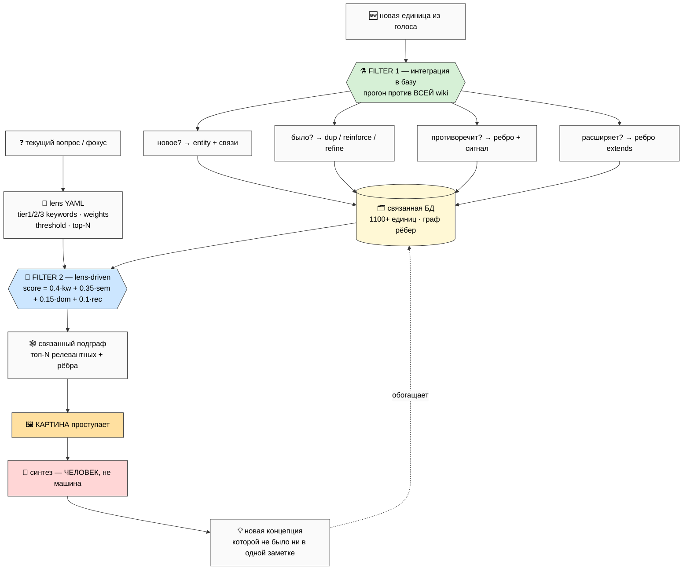
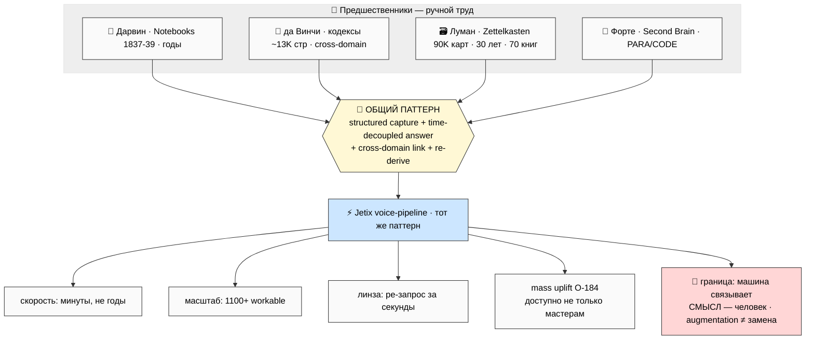
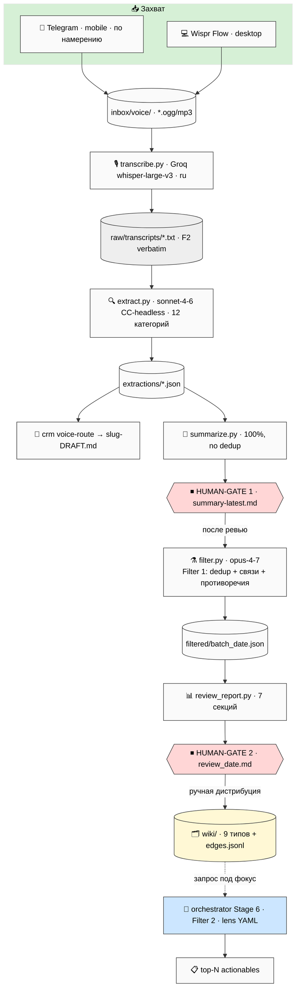

# 🎙️ Voice Pipeline — публичное описание (deep version)

> **Что это.** Не маркетинг и не pitch. Substance-описание практики, которой автор пользуется год+ —
> и которую первым же на себе и применяет (Founder-as-Exhibit). Документ для трёх аудиторий: Церена
> (явный запрос «1-2 страницы — на текст отвечу»), любого методолога, который заглянет в репозиторий,
> и community для воспроизведения.
>
> **Как читать.** 5 минут — §0 TL;DR. 20-30 минут — весь main. Глубже — 7 phase-report'ов в
> `reports/voice-pipeline-public-v2-2026-05-26/`. Для письма — `00-SUMMARY-FOR-TSEREN.md` (≤700 слов).
> Самое важное — **§C двойная фильтрация**.
>
> **Честная рамка (R6).** Паттерн не наш — Дарвин / да Винчи / Луман / Форте / Карпатый. Наш вклад
> честно небольшой: синтез голос-вход + LLM-связывание + lens-доставание + R12-этика на открытом
> substrate'е. Не «революция» — extension проверенного. Это substrate, не peer-reviewed метод.

---

## §0 TL;DR (5 минут)

**Одна фраза.** Голова производит мысли быстрее, чем рука их пишет, а жизнь подбрасывает инсайты там,
где писать нечем. Voice-pipeline закрывает оба разрыва (скорость + место), ловит ~100% интересных
мыслей голосом, и — главное — **превращает их в связанную базу данных**, из которой можно доставать
ровно то, что нужно сейчас, через двойную фильтрацию. Это инструмент исследователя-изобретателя
(в духе книжек Дарвина), ускоренный машиной.

**5 ключевых тезисов:**
1. **Цепочка ценности** (§A) — не «удобно диктовать», а замкнутая цепочка от эфемерной мысли до
   растущего связанного актива; охват captureа → ~100%.
2. **Захват по намерению** (§B) — единый Telegram-inbox, разделённый на 3 части (рефлексия / видение /
   проектные чаты) + поток внешних материалов; одна точка входа, не 10 приложений.
3. **Двойная фильтрация** (§C, ядро) — Filter 1 интегрирует новое в базу (связи/противоречия), Filter 2
   (lens-driven) достаёт релевантное под текущий вопрос. Вместе = синтез, не поиск.
4. **Инструмент изобретателя** (§D) — фиксируются вопросы/наблюдения/гипотезы/опровержения; тот же
   паттерн, что у Дарвина/да Винчи/Лумана/Форте; ново только ускорение (минуты вместо лет; масса
   вместо десятка мастеров). Машина связывает, смысл рождается у человека.
5. **Честный контекст** (§E) — репо новый (40 дней), работа старая (год+, 1100+ заметок); acceleration
   ≠ initiation; substrate ≠ peer-reviewed; открытый репо = приглашение проверить.

### §0.1 ⚠️ Что V2 исправляет в первом черновике

V2 заменяет первый Cloud Cowork DRAFT, который содержал фактические ошибки про собственный код.
Для методолога, который пойдёт читать `tools/`, это критично — описание должно совпадать с кодом:

| Первый DRAFT | Реальность (этот V2) |
|---|---|
| «через Claude API» | **CC headless** (`claude -p`, Max-подписка, без API-ключа); API = legacy fallback |
| «Whisper Medium» | `whisper-large-v3` всегда |
| «4 stage pipeline» | **2 фазы с 2 человеческими СТОП-точками** |
| «5 типов items» | **12 категорий** извлечения |
| filter = Sonnet | filter = `opus-4-7`; extract/summarize = `sonnet-4-6` |
| lens вскользь | lens-driven Filter 2 = **реализован** (orchestrator Stage 6 + YAML) |

---

## §A Цепочка ценности — что pipeline реально даёт

Ценность не в «удобно наговорить». Ценность в **замкнутой цепочке** от мысли до связанной единицы.
Каждое звено закрывает свою конкретную потерю.

**§A.1 Разрыв скорости.** Думаешь/говоришь 150-200 слов/мин, печатаешь 30-50 — разрыв в 4-6 раз. На
нём происходит одно из трёх: не успеваешь (половина мысли испаряется), редактируешь на ходу (поток
глохнет), или вообще не начинаешь («потом» = никогда). Голос убирает разрыв: говоришь со скоростью
мышления, формулировать красиво не нужно — это работа следующей стадии.

**§A.2 Разрыв места.** Лучшие мысли приходят не за столом — на прогулке, в поездке, в очереди, перед
сном (diffuse mode: мозг соединяет несоединённое, когда ты не давишь). И ровно там нет инструмента
записи. Телефон всегда с собой → эти «потерянные» моменты возвращаются продуктивными.

**§A.3 ~100% capture rate.** Соединение скорости и места: типичный день без pipeline — из 10-15
небанальных мыслей доходит до записи 2-3, остальные растворяются (и ты даже не знаешь, что потерял).
С pipeline — 12-15 единиц в инбоксе, утром читаешь карту вчерашнего мышления, связанную с накопленным.

**§A.4 Асинхронность.** Capture и processing разнесены. В момент мысли — только поймать и не спугнуть
поток; «куда положить / как связано» — работа конвейера отдельным шагом (через час/день). Не ломается
фокус; batch-эффективность; холодная голова на осмыслении.

**§A.5 F2 verbatim anchor.** Любой synthesis — потеря. Дословный транскрипт (F2) хранится всегда,
synthesis (F3) делается поверх. Чувствуешь «здесь было что-то ещё» — вернулся к verbatim, переизвлёк.
Страховка от «причесал так, что потерял суть».

**§A.6 Compound substrate.** За год+ накапливается личный корпус (у Руслана 1100+ единиц) → фазовый
переход: substrate становится переиспользуемым. Вопрос марта получает ответ в мае (накопился контекст).
Compound 1%/день → 37×/год — но **только если единицы связаны** (Filter 1). Несвязанная куча тонет.

---

## §B Базовый механизм — Telegram как единый inbox по намерению


*(VP-2 — Telegram inbox split.)*

**Зачем Telegram.** Всегда под рукой (нулевой барьер — на нём умирают 90% систем заметок); голос —
first-class (один тап); универсальный контейнер (голос + видео + ссылки + контакты в одну трубу).
За столом — Wispr Flow (push-to-talk, голос → текст в окно). Вместе захват покрыт во всех контекстах.

**Разделение по намерению — 3 части + единый inbox.** Тип мысли лучше фиксировать в момент captureа,
а не вычислять потом:
- **🪞 Часть 1 — Рефлексия** (разговор с собой: самочувствие / что улучшить / daily review) →
  категории `Личные наблюдения` / `Принципы` → review-сводки.
- **🔭 Часть 2 — Видение / мудрости** (long-arc, философия, не привязано к проекту) → `Видение` /
  `Инсайты` / `Идеи` → wiki-интеграция. (Отсюда родилась метафора «мега-мастерская», §D.)
- **📁 Часть 3 — Проектные чаты** (per-project, routing решён в момент captureа) → `Задачи` /
  `Решения` / `Гипотезы` → project KB.
- **📥 Единый inbox** для всего внешнего (видео / статьи / контакты / файлы) — **не разбросано** по
  10 приложениям.

**Честная граница (R6).** *Концепция* «единый inbox по намерению» — это операционная дисциплина
captureа, и она работает. *Реализация* per-part обработки достигается не через «pipeline знает, из
какого чата файл», а через **12 категорий extraction + lens** — намерение части воспроизводится через
ожидаемый набор категорий. Полностью автоматический Telegram-бот-мост (chat → folder) — upgrade-кандидат
(~2 часа setup), а не уже работающая магия. Сейчас выгрузка из Telegram в `inbox/voice/` — отдельный шаг.

---

## §C Двойная фильтрация — это база данных, а не папка заметок

> Самая важная секция. Voice-pipeline — не «удобный способ наговаривать заметки», а **способ
> выращивать связанную базу данных мыслей** и доставать из неё нужное под контекст.


*(VP-3 — двойная фильтрация.)*

**Это БД, не папка.** Разница не в формате (и то и другое — markdown), а в том, что можно делать:
единица несёт frontmatter (тип / F-G-R / источники / связи); связи типизированы; поиск — по тегам →
по связям → по линзе; рост компаундный (связи), а не линейный (файлы).

**Karpathy-style wiki.** 9 типов сущностей (`concepts/` `entities/` `sources/` `topics/` `ideas/`
`experiments/` `claims/` `summaries/` `foundations/`) + типизированный граф `wiki/graph/edges.jsonl`
(9 типов рёбер: поддерживает / противоречит / расширяет / …). Каждая единица несёт F-G-R triple
(Formality F2-F8 / Group / Reliability) + провенанс. Голос приходит F2 (verbatim) → synthesis
поднимает до F3 (claim/concept), `[src:...]` сохраняется.

**Filter 1 — интеграция (ось «как связано со ВСЕМ, что было»).** Каждая новая единица прогоняется
против всей wiki (1100+). Определяет: новое (→ entity + связи) / было (→ dup / reinforce / refine) /
противоречит (→ ребро + сигнал на ревью — ты сам себе возразил, ценнейший обычно теряемый сигнал) /
расширяет. Технически: `extract.py` (тегирование) + `filter.py` (opus-4-7, второй проход над массивом:
dedup, связи, противоречия, meta-analysis). Дисциплина в коде: *«Сохраняй ВСЕ уникальные мысли. Сливай
только если буквально одно и то же. Сомнения — сохраняй обе»*. Выход — **обогащённая** единица.

**Filter 2 — линза (ось «что релевантно МОЕМУ текущему вопросу»).** Реальный конфиг
(`config/voice-pipeline-lens-<date>-<focus>.yaml`), исполняется `voice-pipeline-orchestrator.py`
(Stage 6). Структура: `tier_1/2/3_keywords` + `scoring_weights` (kw 0.40 / sem 0.35 / domain 0.15 /
recency 0.10) + `threshold` (0.60) + `top_n` (20) + `canonical_anchors`. Задаёшь призму («вопросы
недели» / «гипотеза, которую тестирую» / «открытые вопросы без ответа») → база приносит топ-N
релевантного из месяцев накопления. **Принцип reusability: pipeline стабилен, меняется только линза;
каждую линзу хранят навсегда** (исторический снимок приоритетов — «что я думал про X в мае?»).

**Зачем именно двойная.** Только Filter 1 — связанный, но непросматриваемый архив. Только Filter 2 —
поиск без синтеза (список, не подграф). Обе вместе — линза приносит **связанный подграф**, из которого
проступает картина.

**Worked example (инструмент изобретателя).** День 1, прогулка, голос: *«как Mondragón 5:1 cap уживается
с QF-распределением?»* → транскрипция (F2) → extraction (`Открытые вопросы`) → Filter 1 связывает с
`economic-v10` / `r12` / `mondragon` / `quadratic-funding` → лежит как `wiki/ideas/mondragon-qf-conflict-
question.md`. День 30, дизайн экономики, линза `economic-v10-open-questions` → Filter 2 приносит тот
вопрос + 5 связанных + 3 частичных ответа → **картина**: «cap = жёсткий пол; QF = мягкое распределение;
нужна формула на краю» → рождается `concepts/mondragon-qf-reconciliation-formula.md`, которой не было ни
в одной заметке. **Машина поймала, связала, принесла — изобрёл человек.** Augmentation, не замена.

---

## §D Инструмент исследователя — паттерн стар, ускорение ново


*(VP-4 — исторический параллелизм.)*

**Что фиксируется — не идеи, а 4 типа.** Вопросы (записанный вопрос = обязательство найти ответ) +
наблюдения + гипотезы + опровержения (самый теряемый тип — обычно молча меняешь мнение, след исчезает).
Покрыто 12 категориями extraction + противоречиями из `filter.py`. Именно эта структура делает систему
инструментом исследователя, а не диктофоном.

**Исторический прецедент.**
- **Дарвин** — Transmutation Notebooks (1837-39): наблюдения/вопросы/гипотезы вперемешку; набросок
  дерева «I think»; естественный отбор выкристаллизовался из накопленного годами substrate'а после
  Мальтуса. Time-decoupled answering за век до компьютеров.
- **да Винчи** — кодексы (~13K страниц): анатомия ↔ инженерия ↔ искусство ↔ гидравлика на одной
  странице; изобретения из cross-domain соединений.
- **Луман** — Zettelkasten (~90K карточек, 30 лет): атомарные заметки + ветвящиеся связи; «партнёр по
  коммуникации»; ~70 книг с картотеки. Ближайший аналог Jetix wiki.
- **Форте** — Building a Second Brain: PARA + CODE (Capture/Organize/Distill/Express) — кодификация
  паттерна для цифры. Voice-pipeline = CODE с голосом на входе и LLM в Organize/Distill.
- **Карпатый** — LLM-wiki: сам формат базы (атомарные страницы + явные связи + машиночитаемый
  frontmatter под совместную работу человека и LLM).

**Общий паттерн** (5 человек, 180 лет, один паттерн): structured capture / time-decoupled answering /
cross-domain linking / re-derivation. Проверенный двигатель науки и изобретательства. Jetix его
**унаследовал**, не изобрёл.

**Что добавляет Claude Code.** Снимает узкое место всех предшественников — ручной труд связывания:
скорость (минуты вместо лет), масштаб (1100+ workable), гибкость запроса (новая линза → ре-фильтрация
за секунды). И главное — **mass upliftment (O-184)**: паттерн «книжек наблюдений» был доступен только
мастерам с редким сочетанием дисциплины/памяти/выносливости (Дарвин, Луман — выбросы). CC снимает это
требование (дисциплину держит телефон, память — база, связывание — машина) → инструмент изобретателя
доступен **массе**. Но **граница чёткая: машина связывает, смысл рождается у человека** (формулу
Mondragón×QF вывел человек). Augmentation, не замена; делегировать машине «создать уникальную концепцию»
= получить усреднённое.

**Worked example — рождение «мега-мастерской».** Мета-пример: голосовые дампы 24-26 мая (десятки единиц
про образование/мастерство/tacit) → Filter 1 связал в подграф «как становятся мастерами в AI-эпоху» →
линза «foundational metaphor для Jetix» собрала зоны/прогрессию/сеть → **картина**: всё это — описание
**мастерской** → концепция, которой не было ни в одной заметке. Voice-pipeline — производственная линия
концепций, не архив прошлого.

---

## §E Personal context — год+ работы, а не 43-дневный проект

Прямой, не защищающийся ответ на критику «1930 коммитов за 43 дня + LLM-конвейер». Тезис:
**acceleration ≠ initiation.**

**Что было до репозитория.** Руслан работает над описанием мастерской + методами работы с информацией
**больше года**. Накоплено **1100+ заметок** (наблюдения о бизнесе, описание корпорации, идеи,
гипотезы) — уже работающая личная вики, по которой он работал ~год, **ровно тем инструментом**, что
описан здесь (раньше в более ручном виде). Founder-as-Exhibit: первый и главный пользователь — автор,
стаж — год+, не 40 дней.

**Что такое репозиторий.** Миграция приватного substrate'а (Notion / vault) на открытый сервер +
синтез через CC. Извне: «1930 коммитов за 43 дня — вспышка из ниоткуда». Изнутри: год накопления,
выгружаемый и связываемый в открытую за 40 дней. Метрика «коммитов в день» меряет скорость переноса,
не скорость идей.

**Где LLM, где нет.** Источник идей (год+) — **не LLM**. Capture — мысль человека, машина
транскрибирует. Связывание / синтез / оформление — **LLM heavy**. Стратегия / что войдёт в канон —
**не LLM** (R1: машина не стратег, только surface'ит). Критика про «LLM-конвейер» точна как наблюдение
темпа, ошибочна как вывод о происхождении идей.

**Что Церен прав — без спора.** Зрелость для партнёрств — нет; substrate ≠ peer-reviewed; Tier A =
в основном synthesis известного (Левенчук / Mondragón / Ericsson / Dweck); свой вклад честно
небольшой (synthesis + AI-augmentation + Workshop frame + Mastery-at-transitions + Templates×Unique +
Preparation Stage explicit). Один автор — сила (когерентность) и слабость (нет peer-review).

**Правда — третье, между крайностями.** Не «вспышка вчера» (содержание — год+) и не «зрелый метод»
(peer-review не пройден). А **год+ work-in-progress одного практика, ускоренный LLM, открыто выложенный
для проверки.** Открытость — методологическая необходимость: путь от «substrate одного автора» к
«проверенный метод» лежит только через чужие глаза. Этот документ = первый ход: не «купите», а «вот как
устроено, проверьте, скажите, где не так».

---

## §F Технический стек (точно)

**Компоненты.** Wispr Flow (desktop-захват) · Telegram (mobile-захват + inbox) · Groq Whisper
`whisper-large-v3` (транскрипция, ~$0.001/мин) · **Claude Code CC-headless** (extract/filter/summarize
через Max-подписку, **без API-ключа**; `JETIX_LLM_BACKEND=api` = legacy fallback) · Python 3.10+ ·
Markdown+YAML · Git (append-only).

> **⭐ Главный факт (чаще всего понимают неверно).** Конвейер по умолчанию **НЕ ходит в Anthropic API** —
> вызывает `claude -p` subprocess через Max-подписку (`tools/lib/cc_helper.py`). Max покрывает вызовы
> фиксированной ценой подписки → **нет переменной стоимости за токены Claude**. Код даже убирает
> `ANTHROPIC_API_KEY` из дочернего окружения. Единственная переменная стоимость в дефолте — Groq Whisper.

**Файлы (`tools/`).** `sync_context.py` (step 0: контекст без сети) · `transcribe.py` (Groq
whisper-large-v3) · `extract.py` (sonnet-4-6, 12 категорий) · `crm voice-route` (step 2b: →`-DRAFT.md`,
DRAFT-only) · `summarize.py` (sonnet-4-6, 100% без dedup) · `filter.py` (opus-4-7, dedup+meta, батчи 50,
partial-save) · `review_report.py` (7 секций) · `voice-pipeline-orchestrator.py` (lens-driven Stage 6) ·
`lib/cc_helper.py` (backend) · `distribute.py.bak` (**архивирован** — авто-дистрибуция отключена).

**Последовательность (2 human-gate).**
```
bash tools/run_pipeline.sh   # step 0-3: sync → transcribe → extract → crm-route → summarize → ⏹ ревью
bash tools/run_filter.sh     # filter (opus, Filter 1) → review_report → ⏹ ревью → ручная дистрибуция
```
Два СТОП — не «забыли заавтоматизировать», а constitutional (R11 + Pillar C Tier 2).

**Стоимость.** Дефолт (CC-headless): Claude покрыт подпиской, переменная стоимость — почти только Groq
(~$1-2/день) → **~$30-60/мес**. API-путь (`JETIX_LLM_BACKEND=api`): +токены Claude → €2-5/день,
cap €10/день hard. (Цифры «€2-5/день» из первого черновика — это API-путь, не дефолт.)

**Воспроизведение (~1 день).** Python 3.10+ / Claude Code (Max) ИЛИ `ANTHROPIC_API_KEY` / Groq key /
Whisper-dictation / Git. `pip install groq pyyaml mutagen` → ключи через env var (никогда в файлах) →
`cp sample.ogg inbox/voice/ && python3 tools/transcribe.py` → `bash tools/run_pipeline.sh`. Адаптация:
Telegram-бот ~2ч; линза = копия template под свой фокус; wiki-схема = форк 9 типов + правка 12 категорий.

**Позиционирование против SOTA (для тех, кто знает инструменты).** Это не конкурент Obsidian / Roam /
Notion AI / Mem / Reflect / Otter — а специфичная сборка под один сценарий. Отличия принципиальны:
**голос как primary вход** (не клавиатура/встречи); **open substrate** (git+markdown+grep, не closed
SaaS — можно форкнуть и унести, R12); **двойная фильтрация** (Filter 1 интеграция ⊕ Filter 2 lens —
у большинства tools одно из двух); **два обязательных human-gate** (сознательный анти-паттерн против
«AI авто-связывает всё» — Mem/Reflect делают именно это, здесь это пробовали через `distribute.py` и
**откатили**); **F2/F3 лестница** (verbatim сохраняется, не тонет после суммаризации). Где SOTA лучше:
UX, mobile, real-time, коллаборация. Здесь оптимизирован один сценарий — исследователь-изобретатель,
голос, глубина, открытость — а не массовый продукт. (Полная таблица — Phase 6 §F.5c.)

---

## §G Архитектура одной схемой (VP-1)


*(VP-1 — полная архитектура: захват → транскрипция (F2) → extraction (12 кат.) → human-gate 1 →
filter (Filter 1) → human-gate 2 → ручная дистрибуция в wiki; линза = Filter 2 боковым запросом.)*

---

## §H Ограничения и честные провалы

**By design.** Два human-gate обязательны (авто-дистрибуция отключена — constitutional). Voice DRAFT-only
(R12: не overwrite prod-записи). LLM теряет нюанс/иронию (mitigation: F2 verbatim хранится, переизвлечь).
Голос = 30-50% шума (фильтруется на extraction, не идеально). Batch lag — часы/дни (не для real-time).

**Что пробовали и отказались.** Авто-дистрибуция (`distribute.py`) — через неделю автономной работы
40-60% items «звучит правильно, но не точно»; **архивировали в `.bak`**; ручной review non-negotiable
(главный урок проекта). IWE chat как доп-слой — качество ниже прямого Claude, отказались. BM25 + русская
морфология для автосаджеста папок — match rate плато ~60%, workflow +30%, human-in-loop не закрыл.
Whisper для русского с акцентом — `whisper-large-v3` как baseline (первый черновик ошибочно писал
«Medium»).

**Главное ограничение.** Это **substrate, не peer-reviewed методология**. Личный voice-to-canon одного
автора. Переход в peer-reviewed — отдельный процесс (discovery calls + partner iterations), не часть
pipeline.

---

## §I Cross-refs

| Документ | Зачем |
|---|---|
| `swarm/wiki/operations/voice-pipeline-canonical-2026-05-10.md` | canonical design (7 stages + lens механика) |
| `tools/*.py` + `lib/cc_helper.py` | сам код (single source of truth) |
| `config/voice-pipeline-lens-template.yaml` | шаблон линзы (Filter 2) |
| `decisions/strategic/JETIX-WORKSHOP-MASTERY-NETWORK-CONCEPT-2026-05-26.md` | рамка: pipeline = станок Мастерской #13 |
| `decisions/strategic/PREPARATION-STAGE-CONCEPT-SUPPLEMENT-2026-05-26.md` | Extended Method §J: pipeline = Step 2 prep-execution AI-heavy |
| `decisions/strategic/LETTER-TO-TSEREN-RESPONSE-2026-05-26.md` | контекст запроса |
| 7 phase-report'ов `reports/voice-pipeline-public-v2-2026-05-26/` | drill-down фаз 0-6 |
| `reports/.../00-SUMMARY-FOR-TSEREN.md` | ≤700 слов для письма |
| `reports/.../diagrams/_INDEX.md` | 4 схемы VP-1..VP-4 |

---

## §J Если хотите попробовать (quick start)

**Минимум (~1 день):** Python 3.10+ · Claude Code (Max-подписка — дефолт, без API-ключа) ИЛИ
`ANTHROPIC_API_KEY` · Groq API key (free tier хватает) · Wispr Flow / любой Whisper-dictation · Git-репо.

```bash
git clone <repo>/jetix-os && cd jetix-os
pip install groq pyyaml mutagen        # + anthropic если API-путь
export GROQ_API_KEY=...                 # только env var, НИКОГДА в файлах
cp sample.ogg inbox/voice/ && python3 tools/transcribe.py
bash tools/run_pipeline.sh             # → ~/summary-latest.md (ревью)
bash tools/run_filter.sh               # → reports/review_<date>.md (ревью)
```

**Адаптация:** линза = копия `voice-pipeline-lens-template.yaml` под свой фокус · wiki-схема = форк
9 типов + правка 12 категорий в `extract.py` · Telegram-бот мост ~2ч. Лицензионных препятствий нет —
пользуйтесь. Скажете, где не работает, — это и есть peer-review, которого substrate'у не хватает.

---

*Document closure 2026-05-26. Voice Pipeline Public V2 deep version. F2-F3 derivative (existing system
documentation + Ruslan voice 26.05 + реальный код tools/). 4 mermaid VP-1..VP-4 inline. 7 phase-report'ов
+ SUMMARY ≤700w. Honest inheritance (Дарвин/да Винчи/Луман/Форте/Карпатый) — НЕ «революция». Personal
context: год+ работы, 1100+ заметок до Jetix-репо (acceleration ≠ initiation). Технический стек сверен
с кодом (CC-headless backend / whisper-large-v3 / 2 human-gate / двойная фильтрация). R1 surface
(финальная prose + публикация = Ruslan). R2 STRICT (Foundation untouched). R6 honest inheritance.
R11 (NO auto-actions; релиз = ack). R12 paired-frame (substance-only, fork-friendly). IP-1 (Ruslan =
sole author final). Append-only (V2 = новый файл; первый DRAFT superseded, не удалён). Supersedes first
Cloud Cowork DRAFT. Pool result — NO auto-launch consequent.*
