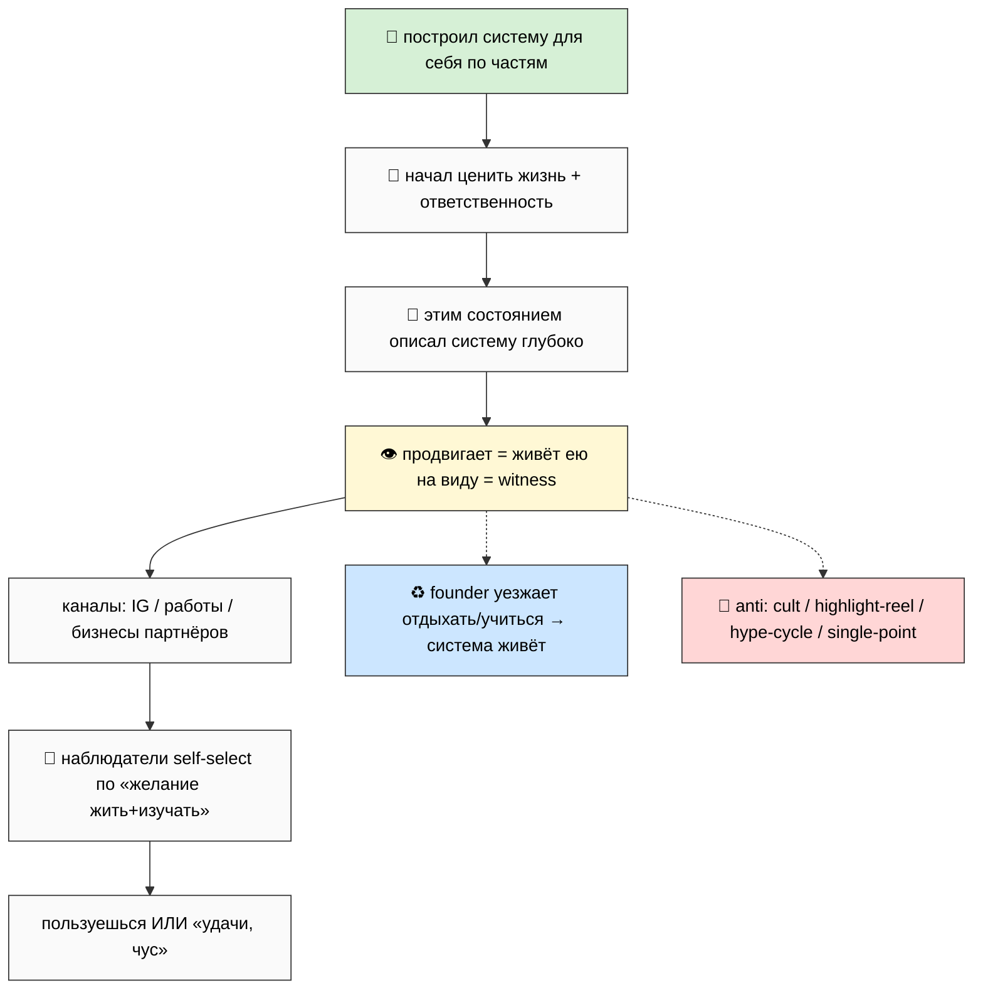
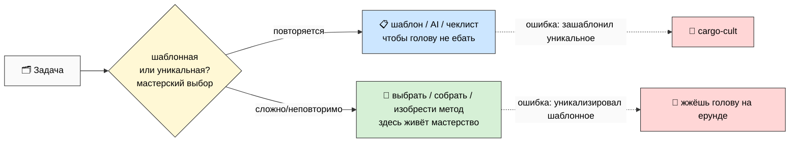
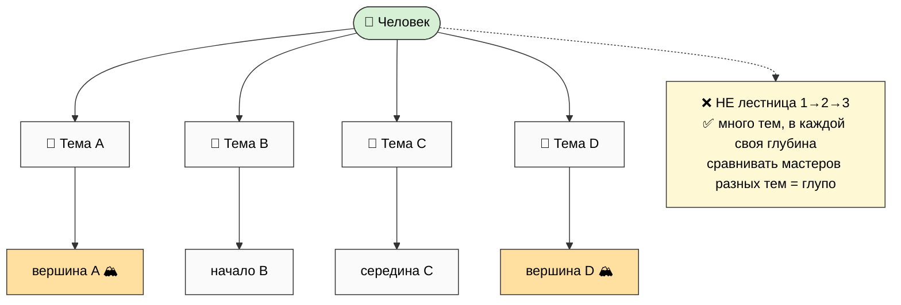

# 📎 Workshop Concept SUPPLEMENT — voice notes 26.05

> **Что это.** Дополнение (companion) к workshop-concept main + 11 phase reports (CLOSED, Phase 10
> + density pass `107e8bb`). Ruslan дал NEW voice dump 26.05 evening — **дополняем**, НЕ
> переписываем. Existing файлы НЕ тронуты (append-only). Внутри: 2 verbatim voice notes (F2 anchor),
> 16 новых идей, 3 новых нарратива (Founder-as-Exhibit / Anti-marketing / Mastery deepening) +
> augmentation-патчи к Vision/Workshop/Mastery.
>
> **Как читать.** Brief — `reports/.../00-BRIEF-REPORT-FOR-RUSLAN.md` (5 мин). Этот main — 15-25 мин.
> Патчи — Phase 4/5/6 reports.
>
> **R12 STRICT.** Anti-marketing + founder-as-exhibit должны быть **authentic**, не
> propaganda-disguised-as-anti-propaganda. Главный честный вопрос — §4 authenticity-tension. **R1:**
> патчи surface; интеграцию выбирает Ruslan. **Pool result — NO auto-launch.**

---

## §0 TL;DR + контекст

Voice 26.05 evening (2 notes) дал три вещи:

1. **«Я есть пример» (Founder-as-Exhibit, S-01/07).** Ruslan = первый пользователь системы, которую
   сам построил по частям. Продвигает не маркетингом, а **демонстрацией на себе**: «вот система, сам
   описал, сам делаю, сам использую — результаты видите; хотите пользуйтесь, нет — удачи, чус».
2. **Anti-marketing stance (S-02/03).** Никакой рекламы / hooks / манипуляции. Witness через
   Instagram / работы / бизнесы партнёров. Self-selection аудитории. Свободный выход.
3. **Mastery deepening (S-08..S-16).** Шаблоны × уникальные задачи; накопление по 3 осям (знания/
   навыки/люди); **темы vs уровни** (нелинейность, сравнивать мастеров глупо); определение
   refinement (выбрать+создать+решить); curiosity-driven вечная тренировка; «больше вариантов на жизнь».

**Главный честный момент (§4):** в Note 1 есть **противоречие** — «продвигаю самыми лучшими
методами, очень громко, масштабно» (hype) рядом с «никакой рекламы, чус» (anti-marketing). Без
разрешения этого tension'а anti-marketing = маскировка. Рекомендация роя: рост = *следствие*
качества + witness, **не** инженерия через hooks. Это R1-решение Ruslan'а.

**16 идей (§2), 3 нарратива (§3-5), augmentation-патчи (§6), 7 R1-решений (§8).** Existing
workshop-concept НЕ изменён.

---

## §1 Verbatim voice notes 26.05 (F2 anchor — дословно)

### Note 1 — «Я есть пример» (founder-as-exhibit)

> «Я получаю за для начала эту систему вот как бы сам пытался для себя создать по частям создавал
> потом вот создал на проработал ее глубоко качественно вот начал ценить да и свою жизнь и
> ответственно подходить к работе и так далее и соответственно потом что этим ответственным
> подходом взял создал получается описал эту систему еще глубоко проработал очень глубоко и сейчас
> вот продвигая вот эту же систему именно подход мастерства подход получается ответственного
> потребления информации обдумывание вот ну что ты потребляешь зачем как когда и так далее ну и
> целом прокачки своих навыков и работы с инструментами и со своим интеллектом
>
> вот то есть я это продвигаю и потом я это продвигаю самыми эффективными и лучшими методами
> которые только есть в этом ёбаном мире соответственно за счет этого оно должно продвинуться и
> очень быстро очень сука громко очень блядь эффективно
>
> Еще раз ну то есть самыми лучшими методами. То есть это будет настолько блядь быстро настолько
> сука масштабно насколько это вообще можно представить. Все которые были до этих методы блядь
> масштабно что-то сделать будут блядь собраны в один перемножатся нахуй вот настолько
>
> вот соответственно да ну как бы чтобы было понятно чем мы тут занимаемся ну и вот и далее вся
> вот эта система мастерства она как бы далее пропагандируется да вот продвигается
>
> И не знаю гениальность я не знаю не столько что там блядь пиздец что-то нихуя себе невъебенное
> создал а сколько просто вот мастерство дисциплина ответственность вот это вот желание жить
> изучать и так далее. И вот как раз ну вот это все мы сюда и закладываем и его далее продвигаем
>
> И как раз я стараюсь это все ебейше продвигать прокачивать ну и быть вот этим примером который
> что вот смотрите ну систему сам вот описал сам делаю соответственно сам использую. Вот пожалуйста
> результаты ну как бы сами видите. Ну хотите пользуйтесь хотите нет. Вот и все. Ну и там уже как
> бы думайте самостоятельно
>
> Все пожалуйста никакая нахуй больше ни реклама не надо блядь. Не какие-то там еще эти раздумия
> какой-то там хуки делать еще что-то. Все идите нахуй. Ну типа наблюдайте там за моими фоточками
> в Инстаграме за моими работами за бизнесами партнеров. Все как бы удачи чус. Я там поехал
> отдыхать учиться и так дальше. Ну типа круто круто.»

[src: Ruslan voice 26.05 evening Note 1]

### Note 2 — «Mastery deepening»

> «К этому всему мастерству добавить то что вот это вот умение подобрать нужный метод собрать метод
> новый какой-то изобрести и так далее это как раз вот мастерство и так сказать уровень развитости
> интеллекта в какой-то степени получается чем лучше это делаешь тем как бы больше у тебя этих
> вариантов на жизнь и просто вот лучше живешь и так далее
>
> и штука в том что с одной стороны нужно как можно больше этих шаблонов накапливать и то есть все
> что делается шаблонно ну дальше уже продолжать как-то делать шаблонно ну чтобы голову не идет как
> бы чтоб не было ну и все
>
> но с другой стороны как раз вот всякие то сложные ситуации а сложных ситуаций ну блять в жизни
> миллиард до не то что миллиарда для и в основе все сложен все задачи в жизни сложные и уникальные
> ну там типа даже потереть жопу да ну типа тоже до дохуя вариантов есть этот но я говорю там каждый
> работа с каждым клиентам уникально блять с каждым человеком уникально на куда каждому свой метод
> подход не со всеми по одному шаблону а вот вот этом наверно это подойдет этому это блять этому это
> вот пожалуйста и такие учителя могут работать лучше пиздата и ученики могут лучше запросы свои
> кита формулировать и в целом но это как бы такой стиль обучения вроде как адекватный блять ну и
> целом но нихуя себе прикольно выглядит да это раз
>
> и второе что тогда вот это накапливание мастерства как раз это и вот этот навык прокачки
> мастерства в чем состоит как раз в том что решаются все более сложные задачи как раз человек стоит
> этим профессионалам экспертом вот накапливает и базу знаний и навыков и людей вот с одной стороны
> и с другой стороны как раз мастерство в том что ты решаешь ну каждый раз новые задачи и тебе
> интересно от этого раз и ты как бы от этого прокачиваешься и учишься для того чтобы эти новые
> задачи решать и в целом как бы ну что повышать сложность задач пожалуйста welcome
>
> ну типа нахуй этом перепрыгивать с уровня на уровень не снова я даже с уровня на уровень это
> больше как с темы на тему да то есть развитость она что может быть вверх-вниз на простое
> направление а вот уже тема очень много из топиков разных и так далее ну и соответственно если там
> один человек в одном топике хороший а другой в другом но это не ну и как-то сравнивать до глупо
> по идее
>
> вот соответственно это тоже добавить ну и вот вот это описание мастерства до что это как раз
> умение выбирать методы создавать новые как раз решать уникальные задачи ну и какие то вот сюда
> решать уникальные задачи если человек может и чем больше уникальных задач решить может и чем они
> тяжелее тем как бы он прокачивание мастер и красава и вот пожалуйста блять бесконечные развития
> сука улучшения и все вот это вот ну короче круто это тоже добавить»

[src: Ruslan voice 26.05 evening Note 2]

---

## §2 16 новых идей (S-01..S-16)

### Note 1 — Founder-as-Exhibit / anti-marketing

| ID | Idea | Implication |
|---|---|---|
| **S-01** | Founder-as-Exhibit — Ruslan = первый пользователь системы, которую сам построил; продвигает демонстрацией результатов на себе | Vision narrative «вот я; вот использую; результаты; хотите — пользуйтесь» |
| **S-02** | Anti-marketing stance — никакой рекламы/hooks/propaganda; witness через IG/работы/бизнесы партнёров | R12 anti-extraction через стиль коммуникации |
| **S-03** | «Чус» philosophy — разрешение уйти без обид; founder уезжает «отдыхать/учиться» = anti-cult | R12 fork-and-leave на уровне коммуникации |
| **S-04** | Best methods × multiplied — «все лучшие методы собраны в один + перемножены» | Method §J композиция scaled; ⚠️ tension с S-02 |
| **S-05** | «Не гениальность, а мастерство+дисциплина+ответственность» — anti-genius-myth | Welcome-frame O-144; mass upliftment O-184 |
| **S-06** | «Желание жить + изучать» = триггер входа | Self-selection аудитории (не convince) |
| **S-07** | Build → broadcast self-actualization loop | Founder journey = product proof |
| **S-T** | ⚠️ **Authenticity tension** (surface роем) — «громко/масштабно» (A) vs «никакой рекламы» (B) в одном Note | Главный R12-вопрос §4; держать B доминантой |

### Note 2 — Mastery deepening

| ID | Idea | Implication |
|---|---|---|
| **S-08** | Templates vs Unique dualism — (a) зашаблонить шаблонное (b) embrace уникальное | Mastery §C.6 |
| **S-09** | «Каждый клиент/человек уникален» — relationships = unique-task class | CRM/partner: per-person, не один скрипт |
| **S-10** | Mastery = решение всё более сложных задач + interest-driven loop | Curiosity-driven вечная тренировка |
| **S-11** | 3 оси накопления — знания × навыки × люди(network) | Network встроен в Мастерство |
| **S-12** | Темы vs Уровни — развитость нелинейна (с темы на тему) | Anti-hierarchical; multiple peaks |
| **S-13** | «Сравнивать глупо» — мастера разных тем несравнимы | Anti-ranking culture |
| **S-14** | Mastery = выбирать методы + создавать новые + решать уникальные задачи | Определение refinement |
| **S-15** | «Больше уникальных задач + тяжелее → прокаченнее» | Measurable proxy; anti-credentialism |
| **S-16** | «Бесконечное развитие + улучшение» | Infinity-frame; lifelong residence |

**Итого: 16 идей (7+9) + 1 surface'нутый tension (S-T).** Все Tier B pool default.

---

## §3 Founder-as-Exhibit (сжато из Phase 1)

> Полностью: `reports/.../02-founder-as-exhibit-narrative.md`.

**Что это:** founder = первый житель мастерской, который её построил для себя и **остаётся в ней
жить на виду**. Не пророк снаружи — мастер среди мастеров. Продукт и доказательство — один объект:
founder в работе.

*(WK-S-1 — founder-as-exhibit loop.)*

**Почему работает:** demonstrated не claimed · reproducible не магия (S-05 «не гениальность,
дисциплина») · self-selecting (S-06). **Anti-patterns:** cult of personality · hidden private vs
public · hype cycles · exhibit-as-hook · single-point-of-proof. **Sustainability:** founder уезжает,
система продолжается (O-184 network-of-exhibits).

---

## §4 Anti-marketing stance (сжато из Phase 2) + ⚠️ authenticity-tension

> Полностью: `reports/.../03-anti-marketing-stance.md`.

**Что НЕ делаем:** реклама · hooks · манипуляции · FOMO/scarcity/urgency · воронки с давлением ·
claims без proof. **Что вместо:** witness (IG/работы/партнёры) · self-selection · free goodbyes
(«удачи/чус») · «думай сам». **8 R12-вопросов на канал** (главный — №7 «нет манипуляции?»).

### ⚠️ Authenticity-tension (главный R12-вопрос — нельзя сгладить)

В Note 1 — прямое противоречие: **(A)** «продвигаю самыми лучшими методами, очень громко, масштабно,
перемножатся нахуй» (hype) vs **(B)** «никакая реклама не надо, хуки, удачи чус» (anti-marketing).

**Разрешение (R12-authentic):** (A)+(B) совместимы **только если** «лучшие методы продвижения» =
**качество продукта + witness**, а рост — *следствие* качества, **не** *инженерия через hooks*.
**Тест:** убери push — система всё ещё распространяется через пользователей? Да → authentic; нет →
это был маркетинг. **Слово «пропагандируется»** (Ruslan) переформулируется честно: не propaganda
(односторонняя манипуляция), а **witness** («вот факты, думай сам»).

**Где anti-marketing ломается (self-critique):** anti-marketing as positioning («честный founder»
как бренд) · curated authenticity (выборочная «изнанка») · witness как медленный hook · «громко»
побеждает «чус». **Вывод:** authentic только при постоянной проверке на performative — это
**дисциплина**, не достигнутое состояние.

---

## §5 Mastery deepening (сжато из Phase 3)

> Полностью: `reports/.../04-mastery-deepening.md`.

**§A Шаблоны × уникальное (S-08/09):** (a) зашаблонить шаблонное (голову освободить) + (b) embrace
уникальное (все значимые задачи уникальны; каждый клиент/человек — свой подход, не один скрипт).
Сам выбор «шаблон/уникальное» = мастерский навык.

*(WK-S-2 — шаблоны × уникальное.)*

**§B 3 оси накопления (S-11):** знания × навыки × люди(network) — **перемножаются**, не суммируются.
Network встроен в Мастерство как третья ось.

**§C Темы vs уровни (S-12/13):** развитость — не одна лестница, а множество тем со своими вершинами.
Сравнивать мастеров разных тем глупо → anti-ranking culture. Multiple valid peaks.

*(WK-S-3 — темы vs уровни.)*

**§D Определение refinement (S-14):** мастерство = умение **выбрать** + **создать/изобрести** +
**решать уникальные задачи**. **Measurable proxy (S-15):** количество × тяжесть уникальных задач
(portfolio > diploma, anti-credentialism).

**§E Curiosity-driven (S-10/16):** новая задача → интересно → прокачиваешься → следующая сложнее →
∞. Двигатель = интерес (intrinsic), не долг. Infinity-frame: нет финишной черты; «больше вариантов
на жизнь» (триада O-138) — цель, не титул/деньги.

---

## §6 Augmentation patches summary (refs Phase 4/5/6)

Все патчи = **companion proposals**, existing файлы НЕ модифицированы (R11 append-only).

| Документ | Патчи | Где (target §) | Report |
|---|---|---|---|
| **Vision** | V-1 founder-exhibit→§3 · V-2 не-гениальность→§4 · **V-3 best-methods×multiplied→§5 (ВЫСОКАЯ R12)** · V-4 anti-marketing→§8 · V-5 witness+founder≠гуру→§7 | §3/4/5/7/8 | Phase 4 (`05-...`) |
| **Workshop** | W-1 Founder-as-Resident-Master→§D · W-2 не-реклама/не-гуру→§F · W-3 «чус»→§E | §D/E/F | Phase 5 (`06-...`) |
| **Mastery** | M-1 определение→§A · M-2 шаблоны×уник→§C.6 · M-3 3 оси→§D · **M-4 нелинейность→NEW §M** (§J занят) · M-5 anti-credential→§I · M-6 curiosity→§D/E | §A/C/D/E/I + new §M | Phase 6 (`07-...`) |

**Интеграция (R1):** низкий риск — V-1/2/5, W-1/2/3, M-1..M-6 (дополняют existing). **Требует
решения Ruslan'а:** V-3 (как сформулировать tension «громко» vs «чус») и зависимый V-4.

---

## §7 Mermaid WK-S-1..WK-S-3

3 схемы (все inline выше): WK-S-1 founder-as-exhibit loop (§3) · WK-S-2 шаблоны×уникальное (§5) ·
WK-S-3 темы vs уровни (§5). Все light-bg, ≥10 узлов где осмысленно. Каталог — `diagrams/_INDEX.md`.

---

## §8 R1 decisions queue (7 решений)

> R1 surface: рой surface'ит, ты решаешь. Ничего не auto-integrated.

1. **Founder-as-Exhibit как Vision-нарратив** — фиксируем «я есть пример» как часть Vision (патчи
   V-1/V-5)? (рекоменд: да, низкий риск).
2. **⚠️ Authenticity-tension (§4)** — как разрешаешь «продвигаю громко/масштабно» (A) vs «никакой
   рекламы» (B)? (рекоменд: B доминанта, рост = следствие качества; патч V-3 формулировка — твоя).
3. **Anti-marketing как сквозной принцип** — фиксируем на все 14 направлений + все 4 части Master
   Plan (патч V-4)? (зависит от #2).
4. **«Не гениальность» audience filter** — «желание жить+изучать» как единственный фильтр входа
   (патч V-2)? (следить: «желание» ≠ моральный тест).
5. **Founder-as-Resident-Master роль** (патч W-1) — добавляем в Workshop §D? Формулировка, чтобы не
   читалось как «верховный мастер»?
6. **Темы vs уровни** — принимаем нелинейную модель (NEW Mastery §M, патч M-4)? Anti-ranking culture
   в Сети — ок?
7. **Определение мастерства refinement** (патч M-1) — расширяем one-liner до «выбрать+создать+решить»?
   (это близко к твоей формулировке → твоё решение, prose_authored_by).

---

## §9 К чему ведёт

После того как прочитаешь + acked:
1. **3 новых нарратива** доступны для интеграции: Founder-as-Exhibit + Anti-marketing + Mastery
   deepening.
2. **14 augmentation-патчей** готовы (Vision 5 / Workshop 3 / Mastery 6) — companion, ждут ack.
3. **Authenticity-tension разрешён** (твоё R1) — после этого anti-marketing = R12-authentic, не маскировка.
4. **Следующая итерация** (запускаешь ты — pool): интеграция патчей в workshop-concept (или сразу в
   metaplan-v3, 14 directions + new narratives embedded).

**Это supplement-фиксация voice 26.05. Existing workshop-concept НЕ изменён. После ack — интеграция
патчей.**

---

*Document closure 2026-05-26. Workshop Concept SUPPLEMENT — voice notes 26.05 (I-am-the-example +
anti-marketing + mastery deepening templates×unique + темы vs levels + curiosity). 2 verbatim notes
(F2 anchor). 16 идей + 1 surface'нутый authenticity-tension. 3 нарратива (Founder-as-Exhibit /
Anti-marketing / Mastery deepening) + 14 augmentation-патчей (companion, НЕ rewrite). 3 mermaid
WK-S-1..WK-S-3. 7 phase-reports. F2 verbatim + F3 augmentation. R2 STRICT (Foundation untouched).
R11 (NO auto-modify existing files — companion). R12 paired-frame STRICT (anti-marketing + founder-
as-exhibit authentic, не propaganda-disguised; tension surface'ен §4). IP-1 (Ruslan = пример,
паттерн абстрактен). Append-only (existing workshop-concept untouched). Pool result — NO auto-launch.*
