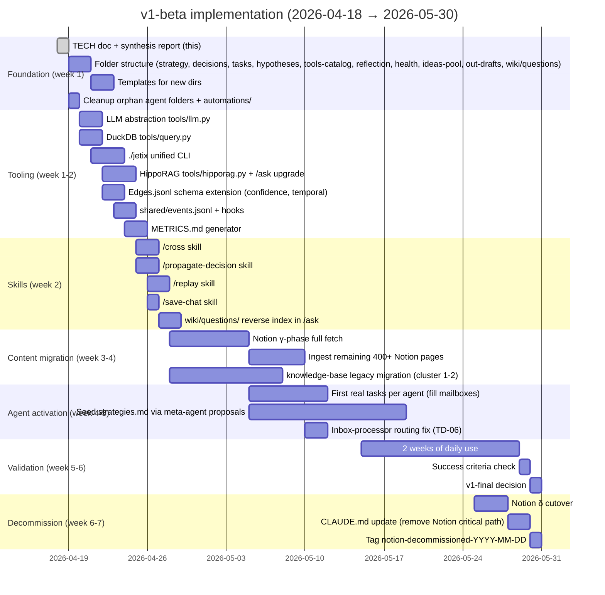

# ARCHITECTURE-TARGET.md — Jetix OS target architecture (v1-beta → v1-final → v2)

> **Что это.** Контраст **as-is** (ARCHITECTURE-CURRENT.md 2026-04-16) → **to-be**
> (v1-beta целевое состояние 2026-04-18+) → **v1-final** (~2026-06) → **v2** (~2026-Q4+).
>
> **Для чего.** Один документ — Ruslan видит "где я сейчас vs куда двигаюсь
> vs когда что закрываю". Каждая change — явная (delta). Каждое deprecated —
> с rationale.

---

## §T.0 Executive summary (for Ruslan)

Сейчас (2026-04-16 inventory): wiki/ работает на 557 страницах, 12 агентов
определены но 6 mailboxes пустые, `strategies.md` не накоплен, Notion MCP —
SPOF. **v1-beta (эта версия)** — **НЕ переделывает** архитектуру, а:
1. **Фиксирует рабочую модель** (что work'ет — keep; что debt — plan remediation).
2. **Добавляет leverage** из optimizer: LLM abstraction, DuckDB queries, `./jetix`
   CLI, HippoRAG PPR, temporal edges, decision propagation, METRICS.md,
   `wiki/questions/` reverse index.
3. **Явно фиксирует границы** (semi-manual, no cron, single-user).
4. **Closes critical debt** (baseline.md removal, `/lint` validation).

**Цель v1-beta:** работающая система для Ruslan (1 оператор) до конца мая.

**v1-final** (~начало июня): после 2+ недель daily use → консолидация.
Selective automation (weekly `/lint`, weekly `/build-graph`). Tests. Full ADR log.

**v2** (~Q4): multi-tenant для Jetix Club partners; patents; client-facing layer.

---

## §T.1 Three snapshots in one table

| Aspect | CURRENT (2026-04-16) | v1-beta TARGET (2026-04-18..05-30) | v1-final (~2026-06) | v2 (~2026-Q4+) |
|--------|----------------------|-------------------------------------|----------------------|-----------------|
| **Knowledge Store** | wiki/ 557 pages, 572 edges, 4 communities; knowledge-base/ legacy 0% migrated | wiki/ + `/ingest` from Notion γ; grows to 800-1200 pages; temporal edges + confidence added; `wiki/questions/` reverse index | wiki/ 1500-2000 pages; legacy kb migrated; 8-12 communities; HippoRAG fully operational | wiki/ 3000+ pages; hierarchical community summaries (L1-L2-L3); hybrid embedding+graph if needed |
| **Agents active** | 12 defined; 6 mailboxes empty; strategies.md all empty | 12 defined; 10+ mailboxes с productive traffic; 5+ strategies.md filled through meta-agent proposals | 12-15 defined; metrics per-agent tracked; A/B tests ≥10 runs | 12-20 defined; multi-user aware (per-user agents); formal orchestration maturity |
| **Notion coupling** | SPOF (Daily Log, Projects, Life OS, Research Hub, Банк идей, ICP) | Фаза γ in progress (2026-04-25..05-16); wiki becomes primary | Фаза δ complete (~2026-05-30); Notion read-only | Notion archive only (if kept at all) |
| **Skills** | `/ingest`, `/ask`, `/lint`, `/consolidate`, `/build-graph`, `/plan-day`, `/close-day`, `/focus`, legacy `/compile`, `/search-kb`, `/sweep-notion-bank` | Same + `/cross`, `/propagate-decision`, `/replay`, `/save-chat`, `./jetix` CLI wrapper | Add: `/review week`, `/review month`, `/review quarter`, `/ab-test-strategy`; legacy removed | Add: active mode skills (with approval flow) |
| **Automation** | None reliable (morning/evening pipelines exist, no cron) | None (ADR-004 semi-manual) | Selective cron for maintenance: nightly `/lint`, weekly `/build-graph`, weekly metrics delta | Active mode: event-driven где safe + approval |
| **Dashboard** | React+Express legacy (Phase 1, opportunistic) | Same (not critical path, not extended) | Either supported or deprecated (decision based on use) | Extended if used OR removed if not |
| **`baseline.md`** | Exists, identical to system.md | Kept during transition (until strategies.md accumulates enough context) | **Deleted** (ADR-023 finalized) | Gone |
| **Tests** | 0 | 0 (Tier 0/1 manual + `/lint` schema validation) | Golden fixtures for `/ingest`, `/ask`; basic CI | Full CI/CD pipeline + A/B framework |
| **Deployment** | Single VPS + laptop | Same; + documented bootstrap | + off-site rsync backup | Multi-region if scale requires |
| **Team size** | 1 (Ruslan) | 1 + 5-10 Club partners giving feedback (no system access) | 1 + 3-5 specialists + partners (full club) | Team + community + partners |
| **ADRs formalized** | Implicit in various docs | 18 inline в TECH §12 | Split into `docs/adr/NNNN-*.md` files + add 6 more (permissions, locks, etc.) | 40+ ADRs spanning 2 years |
| **Permission model** | Prompt-level + tool allowlist only | Same + `/lint` secret checks + `sources:` enforcement | Formal `shared/schemas/permissions.schema.json` | Full per-user isolation |
| **LLM abstraction** | None (direct Anthropic) | `tools/llm.py` architected + anthropic/ impl | Multi-provider tested (openai fallback proven) | Vendor-agnostic production |
| **Metrics** | `shared/state/metrics/*.json` structure exists, not populated | `METRICS.md` + weekly delta reports active | In-system metrics dashboard (Streamlit или similar optional) | Multi-user metrics, per-user privacy |
| **Observability** | git log + `wiki/log.md` | + `shared/events.jsonl` unified + `system-health.json` auto-populate via `/lint` | + tracing instrumentation (basic) | Full observability stack |

---

## §T.2 What changes CURRENT → v1-beta TARGET — delta list

### T.2.1 Adds (new in v1-beta)

| # | Addition | Rationale | Source |
|---|----------|-----------|--------|
| A-01 | **LLM abstraction layer** (`tools/llm.py` ~100 LOC) | Kay principle; addresses critic SPOF #3 | Optimizer §14.1 |
| A-02 | **`./jetix` unified CLI** (`tools/jetix.py` ~150 LOC) | Cognitive load reduction; semi-manual preserved | Optimizer §13.1 |
| A-03 | **`tools/query.py` DuckDB reader** | SQL over frontmatter — text-as-database 6th mode | Optimizer §2.2 |
| A-04 | **HippoRAG PPR** on wiki graph (`tools/hipporag.py` ~50 LOC) | `/ask` quality ×3-5 | Optimizer §5.1 |
| A-05 | **Temporal edges + confidence** в edges.jsonl schema | Time-travel queries; drift tracking | Optimizer §5.3-5.4 |
| A-06 | **`wiki/questions/` reverse index** | "Personal StackOverflow" compounding | Optimizer §20.1 |
| A-07 | **`shared/events.jsonl` unified event stream** | Cross-component queries; replay ready | Optimizer §7.1 |
| A-08 | **`/cross` skill** (natyagivanie-as-primitive) | First-class analytics pattern; gradient boosting | Optimizer §1.2 + §4.5 HUMAN |
| A-09 | **`/propagate-decision` skill** | Decision → agent strategies.md auto — ×10 leverage | Optimizer §1.1 |
| A-10 | **`/replay` skill** | Decision drift detection | Optimizer §7.4 |
| A-11 | **`/save-chat` skill** | Promote conversation → wiki/conversations/ | Optimizer §20.12 |
| A-12 | **METRICS.md + weekly delta reports** | In-system observability (addresses critic §14) | Optimizer §12.1 |
| A-13 | **`design/SYSTEM-DESIGN-TECH.md` §11 Invariants** | Declarative constitution — meta-leverage | Optimizer §6 |
| A-14 | **`design/AGENT-PROTOCOLS.md` with 14 agent cards** | Light agent cards (10 lines each) | Optimizer §9 + Engineer A §A |
| A-15 | **`design/DATA-FLOWS.md`** 8 canonical flows | Single source of truth for flows | Engineer B §6 synthesis |
| A-16 | **`mental-models.md`** separate file | Metaphor collection (machine, GitHub-style, etc.) | Optimizer §11 |
| A-17 | **New папки создаются:** `strategy/`, `decisions/`, `tasks/`, `hypotheses/`, `tools-catalog/`, `reflection/`, `health/`, `docs/adr/` (future), `ideas-pool/`, `out-drafts/`, `wiki/questions/` | HUMAN §4.1 prescribed papered structure | HUMAN §4.1 |
| A-18 | **Timeboxing mandatory** в `projects/{slug}/overview.md` frontmatter | Addresses zombie-projects risk | Optimizer §20.5 |
| A-19 | **Decision frontmatter schema** formalized (`context`, `alternatives`, `evidence`, `replay-check`, `relevant-agents`) | Forced decision rigor | Optimizer §18.3 |

### T.2.2 Changes (modified from CURRENT)

| # | What | CURRENT state | v1-beta state |
|---|------|---------------|---------------|
| C-01 | `.claude/skills/ingest.md` | Was `ingest.md` vs `.new` conflict | Merged; `.new` not in tree; canonical ingest.md is v2 |
| C-02 | Notion coupling | External truth, 8 agents depend on MCP | Migration γ → δ path; `raw/notion-*` dumps for fallback |
| C-03 | Mailbox traffic | 6 empty, 6 test-only | Populated через explicit initial tasks first 2 weeks |
| C-04 | `strategies.md` | Empty seeds | Grow через meta-agent weekly + decision propagation |
| C-05 | Escalation | `escalation.jsonl` упомянут, нет файла | v1-beta: direct `human.jsonl` (simplified) |
| C-06 | Inbox-processor routing | Sends to manager (violation of hub-and-spoke) | Documented as-is; v1-final fix к knowledge-synth |
| C-07 | Crazy-agent tools | Frontmatter missing `mcp__notion` (inventory #7) | Align: remove mcp__notion from roster (not needed); update CLAUDE.md |
| C-08 | Dashboard | Opportunistic Phase 1 Express+React | Kept as-is, not extended; primary UI = Antigravity+Obsidian+CLI |
| C-09 | `wiki/graph/edges.jsonl` schema | `{from, to, type, created}` | + `origin`, `confidence`, `valid_from`, `valid_until` |
| C-10 | `/ask` retrieval | Keyword matches → LLM | + HippoRAG PPR pre-ranking |
| C-11 | `/ingest` event emission | Updates `wiki/log.md` | + emit to `shared/events.jsonl` |

### T.2.3 Deprecated / removed (post v1-beta)

| # | Item | Reason | When removed |
|---|------|--------|--------------|
| D-01 | `baseline.md` per agent (TD-01) | Duplicates system.md; no usage | After 1 week stable v1-beta (ADR-023) |
| D-02 | `agents/content-team/`, `research-team/`, `sales-team/`, `_shared/` (TD-03) | Orphan folders, no refs | v1-beta week 1 cleanup |
| D-03 | `automations/` пустая папка (TD-08) | Not used | v1-beta week 1 |
| D-04 | Legacy `/compile`, `/search-kb` skills | Superseded by `/ingest` + `/ask` | v1-final (after disabled period) |
| D-05 | `distribute.py.bak` | Already .bak archived | Keep as archived; никогда не re-enable без approval |
| D-06 | Notion as critical path | Decommissioned через γ/δ | Фаза δ cutover |
| D-07 | `baseline.md` references in agent system prompts | Update to system.md canonical | Transition week |

### T.2.4 Stays (unchanged from CURRENT)

| # | What | Why preserved |
|---|------|---------------|
| S-01 | `wiki/` 9 entity types + 6 niches | Core architecture; выдерживает scale; Karpathy model works |
| S-02 | 9 edge types | Working ontology (HUMAN §7.2.4 considered restructure — chose keep) |
| S-03 | JSONL mailboxes + `shared/schemas/message.schema.json` | Append-only messaging correct invariant |
| S-04 | Per-agent 5-layer memory | Karpathy/Letta pattern, наполняется не перестраивается |
| S-05 | MCP bridges (notion до δ, miro) | API работает |
| S-06 | Voice pipeline (`tools/` Python) | Production-ready, 4 scripts, low coupling |
| S-07 | `daily-log/` base structure | Extended с `drafts/`, not redesigned |
| S-08 | `raw/` immutable archive | Write-once principle preserved |
| S-09 | Git + GitHub | Foundation — don't touch |
| S-10 | Skills `/ingest`, `/ask`, `/lint`, `/consolidate`, `/build-graph` | Work as-is; extended, not redesigned |
| S-11 | 12-agent roster | ADR-004 — stays (maybe refined in v1-final) |
| S-12 | Model-tier routing (Opus / Sonnet / Haiku per agent) | ADR-012; cost-optimal |
| S-13 | 6 niches closed set | Close-world assumption holds для one operator |
| S-14 | docs-as-code everything | ADR-001 foundation |
| S-15 | `.env` hygiene + prompt-level permissions | ADR-005 |
| S-16 | CLAUDE.md as quick config | Complements TECH (which is full architecture) |
| S-17 | Russian content + English code convention | Cultural, keep |

---

## §T.3 Migration path — CURRENT → v1-beta

### T.3.1 Sequencing (Gantt)



### T.3.2 Critical path to v1-beta production

Minimum viable v1-beta — все следующие ✓:

1. **Foundation created** — new папки scaffolded; templates ready.
2. **One pilot project** fully migrated к новой структуре.
3. **`./jetix` CLI functional** — morning, close-day, ask, lint, metrics minimum.
4. **LLM abstraction** — anthropic/ backend implemented; architecture verified
   для future provider swap.
5. **HippoRAG PPR** — `/ask` uses PPR ranking; verified improves answer quality
   on sample 10 questions.
6. **Events stream** — `shared/events.jsonl` populated; 7+ event types emitted
   by flows.
7. **METRICS.md** — generator works; at least 6 canonical counters populated.
8. **5 days streak** — morning + evening rituals completed 5 consecutive days
   без SAFE-SAVE триггеров.
9. **10 decisions recorded** — `decisions/` non-empty, each с frontmatter
   schema.
10. **5 hypotheses active** — `hypotheses/active.md` populated.
11. **Writeback working** — at least 3 `/ask` results saved к `comparisons/`;
    edges grow.
12. **strategies.md bootstrap** — at least 3 agents have first strategies entries
    (seeded through decision propagation OR meta-agent proposals).

После всех 12 ✓ — v1-beta в production.

### T.3.3 Rollback strategy

Если v1-beta изменения ломают что-то критичное:

1. **Git revert** specific commit (blast radius small через atomic commits).
2. **Branch strategy:** v1-beta changes в feature branches (например,
   `claude/v1-beta-infra`) → PR → merge. Allows rollback без disturbing main.
3. **Kay mode fallback:** `./jetix --no-ai` — Ruslan работает вручную while
   issue debugged.

---

## §T.4 CURRENT → v1-beta — agent layer specifics

### T.4.1 Mailbox activation plan

**Current:** 6/12 mailboxes empty (gap #1).

**v1-beta plan:** in first 2 weeks, Ruslan triggers each agent ≥1x on real task:

| Agent | First task (concrete) |
|-------|----------------------|
| manager | Weekly coordination review (W18) |
| strategist | Quarterly strategic review — plan mode |
| personal-assistant | Draft 3 emails (EN/RU/DE) |
| system-admin | Check git hooks + VPS health + suggest `./jetix` polish |
| sales-lead | Review current ICP hypothesis, propose next refinement |
| sales-researcher | Find 10 ICP candidates в B2B SaaS founder segment |
| sales-outreach | Draft 5 first-touch LinkedIn messages (based on researcher output) |
| knowledge-synth | Synthesize 5 recent wiki additions into 1 summary |
| inbox-processor | Triage last 2 weeks of voice-memo transcripts |
| crazy-agent | Brainstorm 5 "what if" ideas for $50K goal acceleration |
| meta-agent | Week 2 — first audit report draft |
| life-coach | Review recent daily-log energy trends, propose 1 habit |

**Expected outcome:** all 12 mailboxes с productive traffic (not test msgs)
by end of week 2.

### T.4.2 Strategies.md seeding

**Current:** all 12 empty.

**v1-beta plan — bootstrap via three mechanisms:**

1. **Decision propagation (automatic):** each new decision with `relevant-agents`
   → `/propagate-decision` appends to listed agents' strategies.md. Expected:
   5-10 entries/week as Ruslan makes decisions.

2. **Meta-agent proposals (weekly):** meta-agent runs `/review meta` weekly;
   produces `reports/audits/YYYY-MM-DD-meta-audit.md` с proposed strategies.md
   additions. Ruslan approves → applied.

3. **Self-write (agent-driven, conservative):** agent at session end, if
   discovers high-confidence pattern, appends к own strategies.md. Guarded
   by invariant: only if confidence > 0.85 AND pattern seen ≥3 times.

**Success criteria v1-beta:** 5+ agents have strategies.md с >3 entries each
by end of week 4.

### T.4.3 Roster updates

**From CURRENT roster (CLAUDE.md):** 12 core agents, 2 utility.

**v1-beta:** same roster. No additions. Focus — operationalize existing.

**v1-final possibilities (not in v1-beta):**
- `legal-advisor` agent — if Ruslan starts paid consulting with contracts.
- `reflection-agent` — if optimizer §15.1 reflection pipeline materializes.
- `partner-liaison` — if Jetix Club partners join beta.

### T.4.4 Permission model upgrade path

**v1-beta:**
- Prompt-level rules (in agent system.md).
- Tool allowlist (in agent frontmatter).
- Forbidden paths documented (§10.1 TECH).

**v1-final:**
- Formal `shared/schemas/permissions.schema.json` defining ACL matrix.
- `/lint` validates agent actions against declared permissions.
- ADR-019 formalizes.

**v2:**
- Per-user permission isolation для Jetix Club.
- Role-based access control formal.

---

## §T.5 CURRENT → v1-beta — data layer specifics

### T.5.1 Edge schema evolution

**CURRENT:**
```json
{"from":"wiki/path.md","to":"wiki/path.md","type":"supports","created":"2026-04-16"}
```

**v1-beta:**
```json
{
  "from": "wiki/path.md",
  "to": "wiki/path.md",
  "type": "supports",
  "created": "2026-04-16",
  "origin": "/ingest",
  "confidence": 0.85,
  "valid_from": "2026-04-16",
  "valid_until": null
}
```

**Migration:** backfill script adds default values (`origin: "legacy"`,
`confidence: 0.7`, `valid_from: created`) to existing 572 edges.
Forward-compatible — old readers ignore new fields.

### T.5.2 New entity types? No.

**Stays 9 types:** concepts, entities, sources, topics, ideas, experiments,
claims, summaries, foundations.

**New "sub-collection":** `wiki/questions/` — это не new entity type, а
collection of `question` type pages (type: question в frontmatter, но не new
folder structure entity). Stays compatible.

### T.5.3 New folders (created v1-beta week 1)

```
strategy/
├── life/
│   ├── _templates/
│   │   ├── yearly-template.md
│   │   ├── monthly-report-template.md
│   │   ├── monthly-plan-template.md
│   │   ├── weekly-report-template.md
│   │   └── weekly-plan-template.md
│   ├── 2026-yearly.md
│   └── (monthly, weekly created as ritualы running)
└── projects/
    └── (symlinks or copies to projects/{x}/strategy.md)

decisions/
├── _template.md
├── life-decisions-log.md  (append-only)
└── YYYY-MM-decisions.md  (monthly digests)

tasks/
├── master.md
└── _template.md

hypotheses/
├── active.md
├── backlog.md
├── validated-archive.md
└── _template.md

tools-catalog/
├── _template.md
└── (tool cards added as tools adopted)

reflection/
├── log.md
├── insights/
│   └── YYYY-Wnn-{topic}.md  (weekly reflection outputs)
└── _template.md

health/
├── habits-tracker.md
├── log.md
├── _template.md
└── wiki/  (mini-wiki for health-specific knowledge)

ideas-pool/
├── inbox.md
└── _archive/

out-drafts/
└── YYYY-MM-DD-{target}.md  (per draft outreach)

wiki/questions/
└── YYYY-MM-DD-{slug}.md  (reverse index entries)

wiki/conversations/
└── YYYY-MM-DD-{slug}.md  (saved-chat outputs)

docs/
└── adr/  (future — v1-final split из TECH §12)
```

### T.5.4 Metrics data layer

**New file:** `METRICS.md` — regenerated by `/lint` or `./jetix metrics`.

Canonical counters (§10.8.3 TECH):
- `total-strategies-rules`
- `natyagivaniya-per-week`
- `decisions-logged-per-week`
- `unclear-backlog`
- `wiki-edges-total`
- `wiki-edges-per-week`
- `orphans-count`
- `stale-claims`
- `drafts-promoted`
- `decisions-replayed-valid`

**Delta reports:** weekly diff → `reports/metrics-delta-{YYYY-Wnn}.md`.

---

## §T.6 CURRENT → v1-beta — integration layer specifics

### T.6.1 LLM abstraction (`tools/llm.py`)

**Current:** direct Anthropic calls via Claude Code CLI.

**v1-beta target:**

```python
# tools/llm.py (~100 LOC)

import os
import anthropic
# Stubs for future:
# import openai
# from local_llama import LlamaClient

class AnthropicClient:
    def __init__(self):
        self.client = anthropic.Anthropic()
    def call(self, model_name, prompt, tools=None, **kwargs):
        return self.client.messages.create(
            model=model_name, messages=[...],
            tools=tools, **kwargs)

class OpenAIClient:
    def call(self, model_name, prompt, tools=None, **kwargs):
        raise NotImplementedError("TODO v1-final")

class LocalLlamaClient:
    def call(self, model_name, prompt, tools=None, **kwargs):
        raise NotImplementedError("TODO v2")

PROVIDERS = {
    "anthropic": AnthropicClient(),
    "openai": OpenAIClient(),
    "local": LocalLlamaClient(),
}

def llm(prompt, model=None, tools=None, **kwargs):
    model = model or os.environ.get("JETIX_LLM", "anthropic/claude-opus-4-7")
    provider, model_name = model.split("/", 1)
    return PROVIDERS[provider].call(model_name, prompt, tools=tools, **kwargs)
```

**Claude Code integration:** Claude Code CLI uses Anthropic directly (controlled
by Anthropic); `tools/llm.py` used by `/ingest`, `/ask`, etc. when they need
programmatic LLM calls outside Claude Code conversation context.

### T.6.2 DuckDB reader (`tools/query.py`)

```python
# tools/query.py (~50 LOC)

import duckdb
import os

def query(sql_query, path="wiki/**/*.md"):
    """
    SQL queries over markdown frontmatter.

    Examples:
    SELECT slug, updated FROM 'wiki/**/*.md'
    WHERE status='active' AND updated < current_date - 7

    SELECT COUNT(*) FROM 'decisions/*.md' WHERE type='decision'
    """
    con = duckdb.connect(':memory:')
    con.execute(f"""
        CREATE TABLE pages AS
        SELECT * FROM read_markdown_frontmatter('{path}')
    """)
    result = con.execute(sql_query).fetchall()
    con.close()
    return result
```

**Use cases:**
- "All active projects not updated last 7 days" — weekly review.
- "Decisions count per month 2026" — trend analysis.
- "Orphan pages (no edges + old)" — cleanup.

### T.6.3 `./jetix` unified CLI

See TECH §16. Implementation ~150 LOC argparse wrapper. Each subcommand:
- LLM-backed skills → call Claude Code CLI with specific slash-command.
- Non-LLM utils → call Python modules directly.
- Self-documenting `--help`.

### T.6.4 Voice pipeline — unchanged

`tools/transcribe.py`, `extract.py`, `filter.py`, `review_report.py` — stay
as-is. Battle-tested (5× speedup observed inventory finding #3). `distribute.py.bak`
remains archived.

### T.6.5 MCP bridges

**Notion MCP:** decommissioning (§F.8). In v1-beta — usage declining as γ
progresses. By δ — no critical path depends.

**Miro MCP:** kept. Used opportunistically для diagrams. Not critical.

---

## §T.7 v1-beta → v1-final transition (~2026-06)

### T.7.1 Success criteria для v1-final trigger (HUMAN §7.5)

Переход v1-beta → v1-final требует ALL:
- [ ] Документ (HUMAN + TECH) реально используется — 2+ weeks daily
- [ ] 5+ частей HUMAN получили правки от usage
- [ ] Tech documents синтезированы (this suite) — ✅ **done 2026-04-18**
- [ ] First batch tasks executed по new methodology
- [ ] Min 3 items из HUMAN §7.1 closed
- [ ] Ruslan: "ok, v1-final"

### T.7.2 v1-final changes (when triggered)

| Change | Rationale |
|--------|-----------|
| Selective cron: nightly `/lint`, weekly `/build-graph`, weekly metrics delta | Maintenance automation — proven safe over 2 weeks v1-beta |
| Formal ADR log в `docs/adr/0001-*.md` (from TECH §12) | Split inline ADRs into per-file; add new (permissions, locks) |
| Permission matrix formal (`shared/schemas/permissions.schema.json`) | ADR-019 |
| Golden test fixtures для `/ingest`, `/ask` | Regression protection |
| Hub-and-spoke enforced (inbox-processor fix TD-06) | Escalation formalized |
| `escalation.jsonl` channel created (was upмянут, отсутствовал) | Formal escalation path |
| Notion δ complete, `mcp__notion-*` removed from all agents | Decommission done |
| `baseline.md` deleted (ADR-023) | Cleanup |
| Meta-agent real audit cycle (weekly, Ruslan approves) | System Prompt Learning cycle closes |
| Backup rsync off-site | DR improvement |
| Deputy mode partial (policy-default approvals for low-risk) | Addresses R-09 (Ruslan SPOF) partially |

### T.7.3 v1-final deferred to v2

- Multi-tenant architecture.
- Client-facing API/portal.
- Team collaboration multi-user git workflow.
- Product extraction (Jetix Corporation repo).
- Full CI/CD pipeline.
- Automated cost tier routing.
- Patent applications.

---

## §T.8 v1-final → v2 transition (~2026-Q4+)

### T.8.1 What changes

| Change | Rationale |
|--------|-----------|
| **Multi-tenant capability** | Jetix Club partners get isolated access — HUMAN §1.6 "5-10 partners" |
| **Client-facing layer** | v2 — client portal (consulting deliverables view) |
| **Team collaboration** | Multi-user git workflow; merge discipline |
| **Product extraction** | Jetix Corporation layer — potentially separate repo |
| **Formal testing** | CI/CD pipeline; regression suite |
| **Cost optimization** | Automated model-tier routing based on task classification |
| **Observability** | Full stack (tracing, metrics dashboard, alerts) |
| **Hybrid RAG** | Graph + optional embedding layer если scale requires |
| **Public handbook** | Jetix methodology open-sourced |
| **Patent filings** | Novel architecture components (central-LLM-with-roles, markdown-OS) |

### T.8.2 v2 architecture concerns (addressed then, not now)

- **Per-user wiki isolation** — how?
- **Shared layer vs private layer** для partners.
- **git submodule vs separate repos per user**.
- **Identity + auth** для multi-user.
- **Cost per user** monitoring.

---

## §T.9 Risks specific to migration

| Risk | Phase | Mitigation |
|------|-------|------------|
| Notion MCP permanently breaks mid-migration (γ) | γ | `raw/notion-*` dumps made early (α done); manual export fallback via desktop app |
| Sweep-worker produces low-quality ingest | γ | Sample review by Ruslan after each batch of 50; `reports/sweep-batch-*.md` logs |
| Community rebuild after big γ ingest слишком долго | γ | Incremental `/build-graph` between batches (not one big rebuild at end) |
| δ cutover loses data | δ | 1-week parallel operation; `/verify-migration` count + content checks |
| Strategies.md stays empty — meta-agent cycle broken | v1-beta | Compensatory: decision propagation fills even без meta-agent. Ruslan manual seed allowed. |
| Team onboarding chaos когда partners join v1-final | v1-final | Documentation (этот suite); buddy system first week |
| v1-beta tools regressions (llm.py, jetix CLI, PPR) | v1-beta | Each change в feature branch; test manually before merge to main |
| HippoRAG PPR slower than expected | v1-beta | Fallback: keyword-only (degraded quality noted); PPR cache refresh cadence adjustable |
| git repo size grows (voice-memos binaries) | v1-beta+ | Git LFS for voice files (v1-beta week 5 if size > 1 GB) |
| SDH vs code drift | ongoing | Weekly sync ritual: Ruslan reviews HUMAN vs actual state; этот document tracks drift |

---

## §T.10 Success criteria для v1-beta → v1-final

Concrete, measurable:

### T.10.1 Documentation (already largely done)

- [x] `SYSTEM-DESIGN-HUMAN.md` v1-beta released (2026-04-18)
- [x] `SYSTEM-DESIGN-TECH.md` synthesized (this suite, 2026-04-18)
- [x] `AGENT-PROTOCOLS.md` synthesized
- [x] `DATA-FLOWS.md` synthesized
- [x] `ARCHITECTURE-TARGET.md` synthesized (this file)
- [ ] Weekly review ritual — 5+ runs

### T.10.2 Infrastructure (v1-beta week 1-2)

- [ ] New папки scaffolded (strategy, decisions, tasks, hypotheses, tools-catalog, reflection, health, ideas-pool, out-drafts, wiki/questions, wiki/conversations)
- [ ] Templates filled for each
- [ ] Orphan folders removed (content-team, research-team, sales-team, _shared, automations/)
- [ ] `tools/llm.py` anthropic/ implemented, abstraction architected
- [ ] `tools/query.py` DuckDB reader works
- [ ] `tools/jetix.py` CLI works — morning, close-day, ask, lint, metrics minimum
- [ ] Edges schema extended (confidence + temporal) — backfill complete
- [ ] `shared/events.jsonl` created + hooks в ingest/ask/close-day
- [ ] `METRICS.md` generator functional — 6+ counters populate

### T.10.3 Content (v1-beta week 3-5)

- [ ] Notion γ-phase: remaining 400+ ideas ingested
- [ ] Notion γ: Projects DB + Journal of Chats + full DB dumps
- [ ] knowledge-base legacy — at least 2/4 clusters migrated
- [ ] voice-memos — batch transcribed backlog
- [ ] wiki pages count > 800

### T.10.4 Agent activation (v1-beta week 4-5)

- [ ] 10/12 mailboxes с productive traffic
- [ ] 5+ `strategies.md` files с >3 entries
- [ ] meta-agent weekly audit run 2+ times
- [ ] First decision propagation executed end-to-end

### T.10.5 Ritual adoption (ongoing)

- [ ] Morning + evening rituals 10+ consecutive days без SAFE-SAVE triggers
- [ ] Weekly reviews 2+ complete cycles
- [ ] Monthly review 1+ complete

### T.10.6 Critical debt closed

- [ ] TD-03: orphan folders cleaned
- [ ] TD-04: escalation model clarified (direct → human в v1-beta)
- [ ] TD-06: inbox-processor routing — documented (fix в v1-final)
- [ ] TD-07: crazy-agent tools aligned
- [ ] TD-08: automations/ removed
- [ ] TD-13: Notion fallback via `raw/notion-*` operational

### T.10.7 Business milestone

- [ ] 30.06.2026 — **$50K goal evaluation checkpoint**
  - If reached: Jetix OS contributed how? (retrospective)
  - If not reached: what blocked? (root-cause; система help enough?)
  - Either way: v1-final decision based on 2+ weeks evidence.

---

## §T.11 One-screen summary

```
ARCHITECTURE TIMELINE: Jetix OS

2026-04-16 (CURRENT)
  wiki 557 pages · 6/12 mailboxes empty · Notion SPOF · no LLM abstraction
  strategies.md 0/12 filled · METRICS nil · baseline.md duplicate

2026-04-18 (v1-beta target SYNTHESIZED — this suite)
  + tools/llm.py + ./jetix CLI + DuckDB query
  + HippoRAG PPR + temporal edges + confidence
  + shared/events.jsonl + METRICS.md + /cross + /propagate-decision
  + wiki/questions/ reverse index + /save-chat + /replay
  + 20 new folders (strategy, decisions, ...) + 34 invariants (§11 TECH)

2026-05-30 (v1-beta production end)
  wiki 800-1200 pages · Notion δ complete · 10/12 mailboxes active
  strategies.md 5/12 seeded · rituals 5+ streaks · decisions 10+
  tooling production-tested · 12 SAFE-SAVE events learned from

2026-06-?? (v1-final)
  formal ADR log · permissions schema · selective automation
  golden fixtures · hub-and-spoke enforced · deputy mode partial
  baseline.md gone · meta-agent real cycle

2026-Q4+ (v2)
  multi-tenant · client portal · team collaboration · patents
  public handbook · hybrid RAG · CI/CD pipeline

HORIZON 2031 (HUMAN §1.6)
  Jetix positioning market: "operating system for human"
  patents filed · 100+ paying users · community

HORIZON 2126-2176 (HUMAN §1.6)
  standard working with information · interface brain

FOCUS NOW: $50K до 30.06.2026 → v1-beta is enabler, not end itself.
```

---

## §T.12 Closing observation

**v1-beta — это not переработка architectures.** Это **crystallization of
what works** + **добавление leverage** + **explicit boundaries**.

Foundation (markdown + git + Karpathy wiki + 12 roles + 5-layer memory) —
sound, battle-tested (inventory confirmed). Optimizer showed: **система уже
×10-ready на уровне foundation; используется на ×1-2**. Этот пакет документов —
способ **замкнуть compounding loops** (decision → strategy, `/ask` → writeback,
natyagivanie → cross-suggested edges, metrics → delta → adjustment).

10 weeks to $50K. v1-beta — инструмент достижения, не самоцель. Если $50K
закроется через "классические" методы (outbound, referrals) — Jetix OS still
has value as multiplier для operational cleanliness. Если $50K закроется
**благодаря** compounding loops — Jetix OS proven. Если не закроется —
retrospective will show что именно не помогло, что улучшать в v1-final.

Этот документ — **живая карта** этого пути. Обновляется когда milestones
закрываются (§T.3 Gantt), когда criteria ✓ (§T.10), когда новые decisions
сделаны (ADR append в TECH §12).

---

*End of ARCHITECTURE-TARGET.md v1-beta. ~830 lines. Synthesized from both
engineer reviews (Engineer A §C arc42 + Engineer B §C.1-C.6 migration-focused)
+ optimizer leverage additions + critic countermeasures + HUMAN criteria.
Living document — update as milestones reached.*
