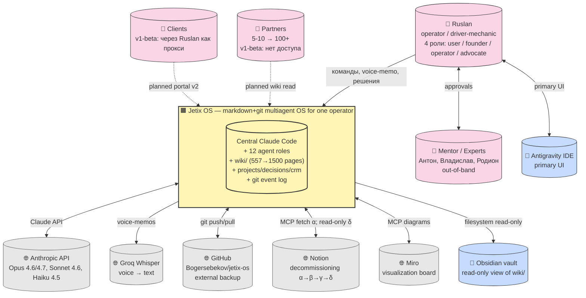
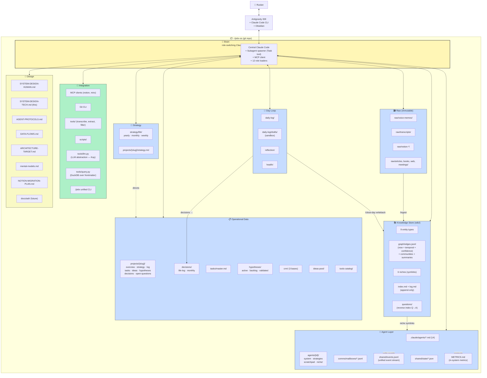
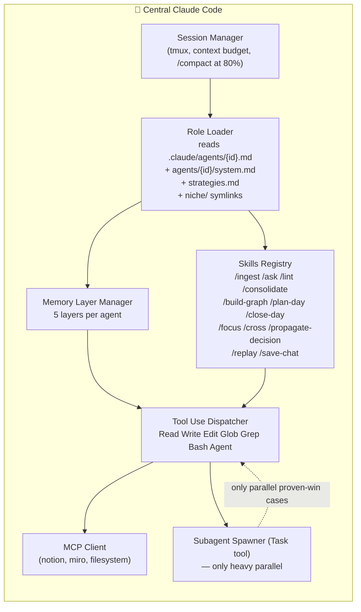
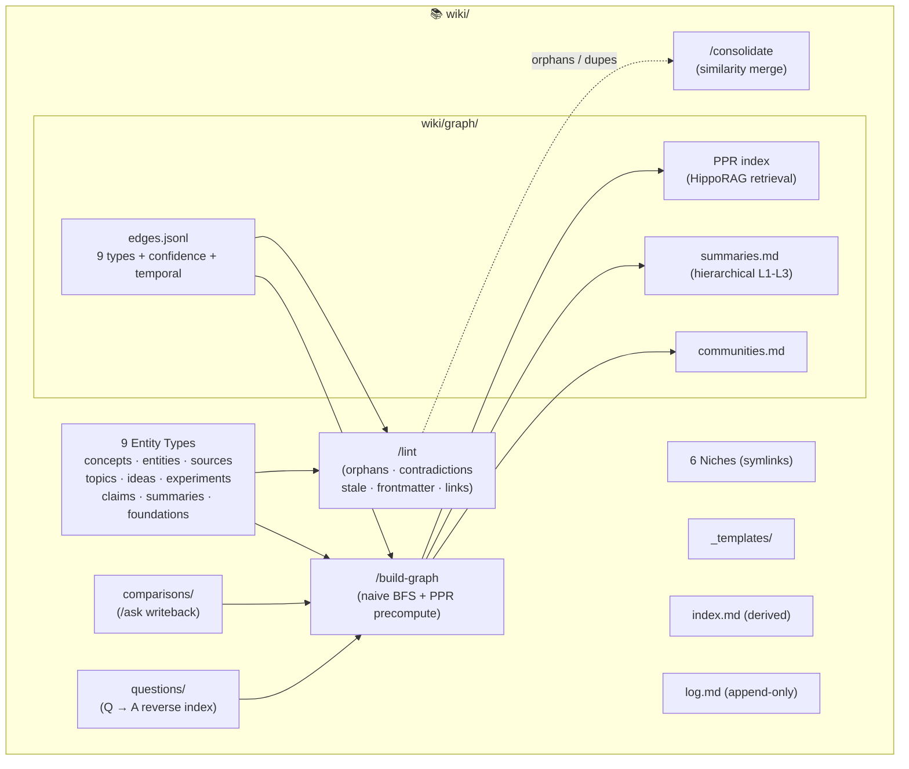
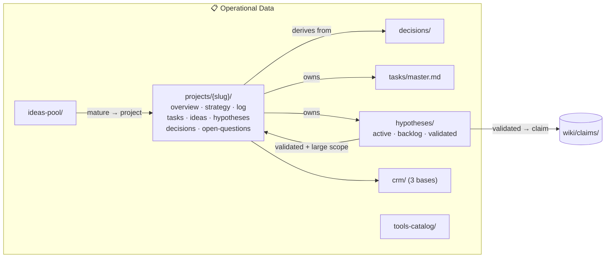
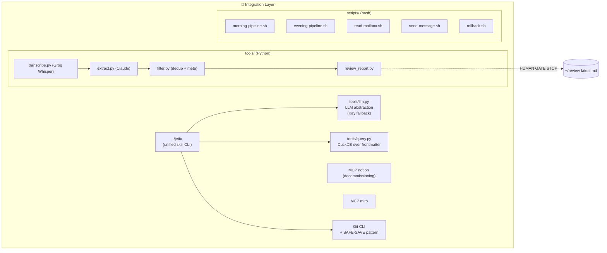
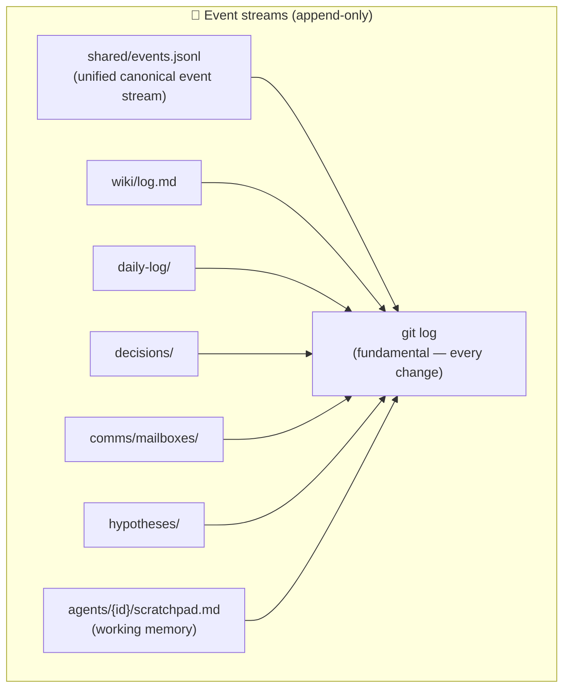
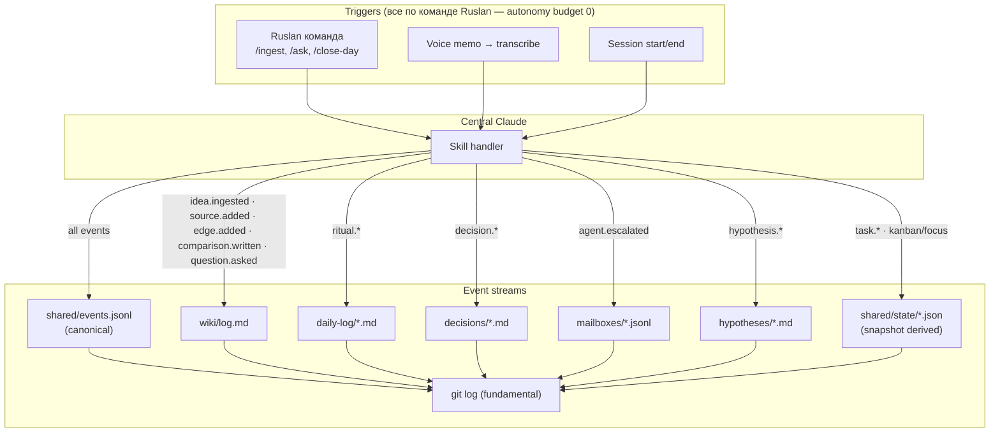
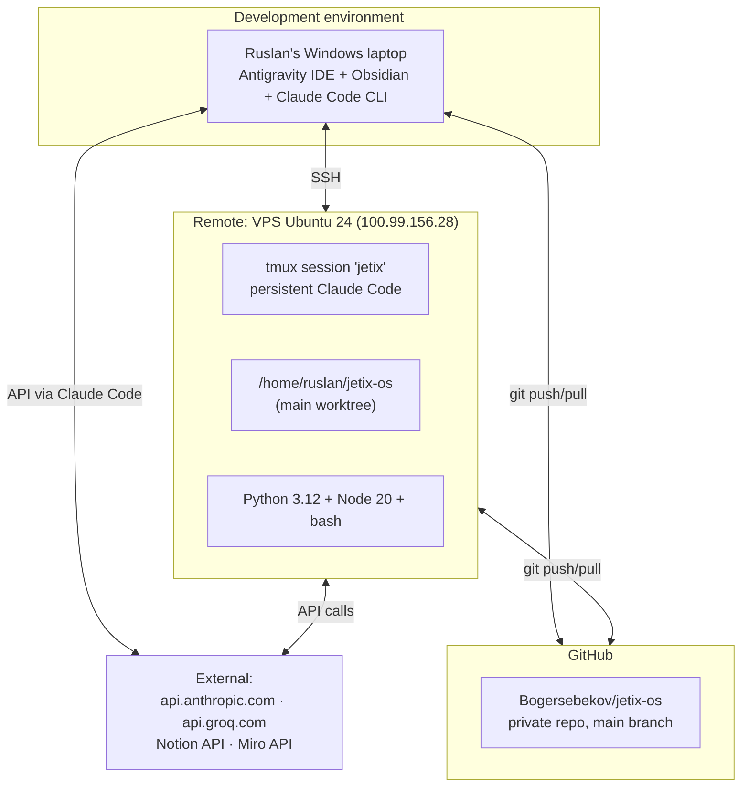

# SYSTEM-DESIGN-TECH.md — Technical architecture of Jetix OS v1-beta

> **Что это.** Технический перевод `SYSTEM-DESIGN-HUMAN.md` на язык архитектуры.
> Главный документ-"конституция" Jetix OS: все агенты и будущие collaborators
> читают его как часть system prompt.
>
> **Методология создания.** Синтез 4 параллельных review (критик / оптимизатор /
> инженер A arc42 / инженер B C4+events) по методологии 5 чатов (ADR-009).
>
> **Читателю.** Если ты человек — начни с §0, §1, §2, §11, §17 (глоссарий).
> Если ты Claude Code — прочитай полностью, особенно §11 Invariants.

---

## §0 How to read this document

### 0.1 Структура

| § | Название | Назначение | Кому |
|---|----------|------------|------|
| 1 | Introduction & goals | Бизнес-рамка, quality goals, stakeholders | Все |
| 2 | Architecture constraints | Неотменяемые предпосылки | Все |
| 3 | System context (C4 L1) | Периметр системы | Все |
| 4 | Solution strategy | Ядро архитектурных решений на одной странице | Все |
| 5 | Containers view (C4 L2) | Крупные блоки внутри репо | Инженеры |
| 6 | Components view (C4 L3) | Детализация Brain, Wiki, Ops, Integration | Инженеры |
| 7 | Event sourcing model | Ментальная модель — всё как поток событий | Инженеры, агенты |
| 8 | Runtime view | 7 канонических сценариев | Инженеры, агенты |
| 9 | Deployment view | Инфраструктура, DR | Инженеры |
| 10 | Crosscutting concepts | Security, memory, concurrency, error, etc. | Инженеры |
| 11 | Invariants (constitution) | Что ВСЕГДА должно быть истинно | Агенты (обязательно) |
| 12 | ADRs | 18 key architectural decisions | Инженеры |
| 13 | Quality requirements | Сценарии + бюджеты | Инженеры |
| 14 | Risks & technical debt | Открытые проблемы с mitigation | Все |
| 15 | What we're NOT doing | Явные границы | Все |
| 16 | Operational interface `./jetix` | Unified CLI + skill routing | Операторы |
| 17 | Glossary | Словарь терминов | Все |
| 18 | Reading order | Как входить в систему впервые | Новые collaborators |

### 0.2 Reading order для новых читателей

**Новый Claude Code (90 минут до productive contribution):**
1. `CLAUDE.md` (5 min) — quick config.
2. `SYSTEM-DESIGN-HUMAN.md §Мета + Части 1-2` (15 min) — business frame.
3. Этот документ `§1-4` (15 min) — goals, constraints, strategy.
4. Этот документ `§5-7` (25 min) — containers, components, event model.
5. Этот документ `§11 Invariants` (10 min) — **обязательно**.
6. `AGENT-PROTOCOLS.md §A.1-A.5` (15 min) — общие протоколы агентов.
7. Задача-specific deep dives.

**Новый человек-collaborator:**
1. `README.md` → `CLAUDE.md` → `SYSTEM-DESIGN-HUMAN.md`.
2. Этот документ `§1, §3 context diagram, §17 glossary`.
3. `ARCHITECTURE-TARGET.md`.
4. Приступ к задачам.

### 0.3 Single source of truth

Этот документ — **источник правды** для технической архитектуры. Если другая
документация противоречит — правда здесь. CLAUDE.md — quick config +
routing. SYSTEM-DESIGN-HUMAN — business language. Этот документ — architecture
language.

---

## §1 Introduction & goals

### 1.1 System mission (one-liner)

**Jetix OS** — мультиагентная операционная система над git-репозиторием, которая
помогает одному оператору (Ruslan) распределять внимание, время, деньги, связи,
контекст и инструменты на важные проекты и делегировать неважное агентам. Всё
знание — в markdown + frontmatter. Все события — в append-only логах. Один
центральный Claude Code входит в 12 ролей через composition (system prompt +
niche slice + 5-layer memory). Автономии нет — всё по команде Ruslan'а
(semi-manual v1-beta).

### 1.2 Primary goal (business)

**$50K revenue до 30.06.2026.** Tech doc — инструмент достижения, не самоцель.
Архитектурные работы приоритезированы против этого дедлайна (~10 недель от
сейчас).

### 1.3 Quality goals — rank-ordered

Из 8 ISO 25010 characteristics мы выбираем **7 ключевых для v1-beta**. Каждая
имеет вес приоритета:

| # | Quality goal | Parent ISO 25010 | Motivation | Приоритет |
|---|--------------|------------------|------------|-----------|
| Q1 | **Transparency** — кто что когда сделал видно из git + логов | Analysability | Ruslan в любой момент понимает state без спроса у агентов | TOP |
| Q2 | **Portability** — система переживает смерть любого vendor'а | Adaptability / Replaceability | Kay-principle: Anthropic down → Notion down → Groq down — продолжаем работать | TOP |
| Q3 | **Learnability** — Claude Code через 30 мин понимает систему | Learnability | Каждая новая сессия Claude начинает "с нуля"; документация = restore | HIGH |
| Q4 | **Modifiability** — markdown-first, любая правка через Edit или рукой | Modifiability | Ruslan 4-5h/day — не может позволить сложные refactorings | HIGH |
| Q5 | **Data safety** — ни одна заметка не теряется | Recoverability | raw/ immutable, SAFE-SAVE, git push каждую сессию | HIGH |
| Q6 | **Fault tolerance** — system degrades gracefully | Fault tolerance | Vendor failure → ручной режим, не crash | MEDIUM |
| Q7 | **Autonomy** — Ruslan без системы может работать, система без AI — тоже | Adaptability | Kay-принцип явно | MEDIUM |

**Explicit trade-offs.** Performance, full Security (multi-user threat model),
Testability — занижены в v1-beta. Причины:
- Single-user → performance не критична до 10K+ wiki pages.
- Private git repo + `.env` → минимальная threat model достаточна.
- Beta-first → test harness добавляет surface area без немедленной выгоды.

### 1.4 Functional requirements (FR) — from HUMAN §2.1

Девять канонических outputs HUMAN → формальные FR:

| ID | Требование | Критерий приёмки v1-beta | HUMAN ref |
|----|------------|---------------------------|-----------|
| FR-01 | Возвращать 1-2 часа/день через автоматизацию рутины | Ruslan subjective "не занимаюсь ерундой" | §2.1.1 |
| FR-02 | Освобождать энергию на стратегические задачи | Каждый ritual — один slash-command | §2.1.2 |
| FR-03 | Производить структурированные артефакты (статьи, claims, summaries) | Артефакт появляется в `wiki/` с frontmatter + edges | §2.1.3 |
| FR-04 | Компаундировать знание (writeback) | `edges.jsonl` растёт после каждого ценного `/ask` | §2.1.4 |
| FR-05 | Делать shallow sales research | `sales-researcher` возвращает отчёт по ICP | §2.1.5 |
| FR-06 | Обрабатывать топик на 95% покрытии | `/ask <topic>` даёт >5 цитат | §2.1.6 |
| FR-07 | Real-time картина рынка | ⚠ **отложено для v1-final** | §2.1.7 |
| FR-08 | Шум → гипотезы + CRM-возможности | Каждый import создаёт ≥1 idea + ≥1 edge | §2.1.8 |
| FR-09 | Digest + action-items из созвона | Transcript → `/ingest` → sources + tasks | §2.1.9 |

**Важно:** FR-01, FR-02 — качественные. FR-03...FR-09 — проверяемы на уровне
файловой системы через `/lint` и `./jetix metrics`.

### 1.5 Stakeholders

| Role | Identity | Expectations от системы | Contribution |
|------|----------|--------------------------|--------------|
| **Owner-operator** | Ruslan (Berlin) | Ускорение к $50K, чистая система, порядок в голове | Стратегические решения, цели, ресурсы |
| **Mentor** | Антон | Out-of-band inputs (системное мышление, психология) | Inshights через voice-memos |
| **Domain expert — Econ** | Владислав | Value-based pricing input | Advisor для pricing |
| **Domain expert — Content** | Родион | AI-темы, audience framing | Advisor |
| **Central Claude Code** | claude-opus-4-7 / claude-sonnet-4-6 | Ясный onboarding + non-ambiguous protocols | Orchestration, skills |
| **12 role-agents** | см. AGENT-PROTOCOLS.md | Чёткие роли + invariants + niche filters | Специализированная работа |
| **Partners (5-10 при v1-final)** | Jetix Club invited | Selected wiki access, knowledge leverage | Feedback |
| **Clients** | AI-consulting | Услуги через Ruslan (не прямой доступ) | Revenue + case studies |
| **Notion** | external SPOF | Temporary storage → read-only после δ | Migration source |
| **Anthropic API** | Claude models | Inference, 1M context | LLM compute |
| **Groq** | Whisper API | Transcription | Voice processing |
| **GitHub** | Bogersebekov/jetix-os | VCS + remote backup | Push destination |

**Контрактное замечание:** v1-beta — **single-tenant** система. Multi-tenant
(Jetix Club, Corporation) — новая архитектурная итерация, v2. См. ADR-016 в §12.

---

## §2 Architecture constraints

Неотменяемые предпосылки. Архитектура должна принять как данность, не пытаясь
изменить.

### 2.1 Technical constraints

| ID | Constraint | Rationale | Impact |
|----|------------|-----------|--------|
| TC-01 | **Claude Code CLI** — единственный runtime агентов | Стратегическое решение; альтернативы (LangChain, CrewAI) — overhead без выгоды | Нет долгоживущих процессов; каждый запуск — fresh session |
| TC-02 | **git + markdown** — единственный storage для knowledge | Docs-as-code → universal tooling | Нет DB transactions; concurrency через git |
| TC-03 | **Ubuntu 24** (VPS) + **Windows** (workstation) | Существующее окружение | LF line endings, UTF-8, bash scripting |
| TC-04 | **Anthropic API** — primary LLM | Opus/Sonnet/Haiku best-in-class for reasoning | 529 retry + cost budget обязательны |
| TC-05 | **Groq** — Whisper provider | $0.11/hour vs OpenAI $0.36 | Voice pipeline зависит от Groq uptime |
| TC-06 | **Obsidian vault** на `wiki/` | Ruslan использует Obsidian для reading/graph navigation | wiki/ совместим с Obsidian wikilinks |
| TC-07 | **Notion MCP** — deprecated зависимость | Декомиссия через α/β/γ/δ | Агенты должны иметь fallback на local dumps |
| TC-08 | **Miro MCP** для диаграмм | Existing board | Не критическая зависимость |
| TC-09 | **1M context** (Opus 4.7) — верхний предел per-session | Hardcoded в модели | Decompose через Task tool если > 600K (40% буфер) |

### 2.2 Organizational constraints

| ID | Constraint | Rationale | Impact |
|----|------------|-----------|--------|
| OC-01 | **Ruslan — единственный operator** 4-5h/day | Факт | Нет on-call rotation; recovery ≥12 часов |
| OC-02 | **Primary goal: $50K до 30.06.2026** | Business deadline | Архитектурные работы не должны блокировать sales |
| OC-03 | **Beta-first, не perfectionism** | Brooks: "plan to throw one away" | Сложные абстракции (formal permissions, full ADR log) — v1-final |
| OC-04 | **Русский — основной язык** content | Пользователь | Frontmatter keys на английском, content на русском |
| OC-05 | **Ручной ритм**: утро/вечер/неделя/месяц | Semi-manual | Нет обязательных cron'ов |
| OC-06 | **Semi-manual mode (Часть 5 HUMAN)** | Risk management | Никаких автономных writes без команды |
| OC-07 | **Vendor lock-in невозможен архитектурно** (Kay) | Философия | Fallback на человека документирован |

### 2.3 Conventions

Конвенции — **часть архитектуры**, не косметика. Нарушение → `/lint` error.

#### 2.3.1 Filesystem

| Convention | Rule | Exception |
|------------|------|-----------|
| Filename | `kebab-case.md` | `YYYY-MM-DD-{slug}.md` для dated sources; `YYYY-MM-DD.md` для daily-log |
| Dates | `YYYY-MM-DD` (ISO 8601) | никогда DD.MM.YYYY |
| Directory | `kebab-case/` | `_templates/`, `_meta/`, `_moc.md` — подчёркивание подчёркивает "мета" |
| Frontmatter | YAML, mandatory для всех `.md` | Исключение: `README.md`, `.github/*` |
| Encoding | UTF-8 LF | Windows CRLF автоконвертируется (`core.autocrlf=input`) |
| Max line | 120 chars | Таблицы, inline URL |

#### 2.3.2 Frontmatter schema (обязательные поля)

```yaml
---
type: <entity-type>       # idea/claim/source/concept/experiment/summary/foundation/topic/entity | custom
status: <status>          # draft / ready / archived / superseded
created: YYYY-MM-DD       # MUST
updated: YYYY-MM-DD       # SHOULD (при редактировании)
sources: [<file-ref>, ...]  # provenance — required для claim, concept, summary, foundation
tags: [#type/..., #topic/..., #status/...]
---
```

Опциональные: `author`, `topics`, `niches`, `related`, `next_action`, `permissions`,
`schema` (JSON-LD link), `confidence`, `valid-from`, `valid-until`,
`relevant-agents`, `replay-check`, `promoted-to`.

#### 2.3.3 Commit conventions

Формат: `[<area>] <action>: <description>`

| Area | Использование |
|------|---------------|
| `design` | Design docs (SYSTEM-DESIGN-*, ARCHITECTURE-*) |
| `wiki` | Изменения в `wiki/` |
| `raw` | Импорт в `raw/` |
| `daily` | Daily Log |
| `project` | `projects/{x}/` |
| `crm` | CRM operations |
| `kb` | Legacy knowledge-base/ |
| `meta` | Архитектура, agents, CLAUDE.md |
| `skills` | `.claude/skills/` |
| `infra` | `tools/`, `scripts/` |
| `agent` | Per-agent memory |
| `notion-α/β/γ/δ` | Migration phases |
| `tech-review` | 5-chat review артефакты |

Actions: `add`, `update`, `fix`, `release`, `migrate`, `ingest`, `consolidate`, `lint`, `archive`, `rename`.

#### 2.3.4 Agent communication

- **Message ID:** `msg-YYYYMMDD-NNN` (regex `^msg-\d{8}-\d{3}$`)
- **Schema:** `shared/schemas/message.schema.json` — 8 types × 4 priorities × 5 statuses
- **Mailbox format:** JSONL (одна строка — одно сообщение)
- **Append-only:** никогда не редактируется

---

## §3 System context (C4 Level 1)

> Периметр Jetix OS: Ruslan + окружающие системы. Цель: новый читатель за 30
> секунд видит границы.

### 3.1 Context diagram



### 3.2 Context elements

| Element | Role | Criticality | Fallback |
|---------|------|-------------|----------|
| Ruslan | Единственный оператор; driver-mechanic | **MUST** — без него система не едет туда куда нужно | Человек-оператор (Kay fallback) |
| Jetix OS | Markdown + git OS; 12 ролей one Claude | **MUST** | Частичный ручной режим |
| Anthropic API | LLM inference 12 ролей | **MUST** for automation | Kay: human operator работает по структуре |
| Groq Whisper | Voice pipeline | SHOULD | Local whisper.cpp (future), ручной transcript |
| GitHub | Remote VCS + backup | **MUST** | Local git continues; push когда доступен |
| Notion MCP | Legacy SPOF, декомиссия | **SHOULD** (going away) | `raw/notion-*` local dumps |
| Miro MCP | Diagrams | COULD | Mermaid inline в markdown |
| Obsidian | Read-only vault | COULD | Любой markdown editor |
| Antigravity | Primary IDE | SHOULD | CLI Claude Code на сервере (fallback) |
| Partners / Clients | Out-of-scope v1-beta | — | — |

### 3.3 Trust zones

Jetix OS делится на **3 trust zones**:

1. **Trusted (inside-only):** `wiki/`, `projects/`, `strategy/`, `decisions/` —
   Ruslan + агенты с permission. Не leak наружу без explicit approval.
2. **Semi-trusted (mirror):** `raw/`, `inbox/` — источники могут содержать чувствительное.
3. **Public (repo-level):** `README.md`, `LICENSE`, `.github/` — открытые артефакты.

**Opaque (агентам запрещено читать):** `.env`, `private/`, `~/.ssh/`,
`config/*.secret.*`, `.github/workflows/*`.

### 3.4 Autonomy budget = 0

**Critical invariant for v1-beta:** никаких cron'ов, webhook'ов, event-driven
реакций. Autonomy budget строго **ноль**. Всё ждёт команды. См. ADR-004.

---

## §4 Solution strategy

> Одна страница — ядро архитектуры. **Как** мы реализуем Q1-Q7 через конкретные
> архитектурные решения.

### 4.1 Strategy table

| Quality Goal | Strategy | Mechanism | ADR |
|--------------|----------|-----------|-----|
| Q1 Transparency | Docs-as-code + append-only логи + git = audit trail | (a) все изменения → git; (b) `log.md` append-only; (c) `reports/` | ADR-001, ADR-003 |
| Q2 Portability | Vendor diversity + file-based fallbacks + Kay-principle | (a) LLM abstraction layer; (b) Notion→wiki migration; (c) методология работает без AI | ADR-005, ADR-007 |
| Q3 Learnability | Self-documenting репо + one canonical entry (этот doc) + CLAUDE.md quick-ref | (a) 18-section hybrid C4+arc42; (b) glossary §17; (c) reading order §18 | ADR-006, ADR-018 |
| Q4 Modifiability | Markdown-first + kebab-case + template-driven + thin skills surface | (a) любой текст редактируем; (b) slash-skills компонуются | ADR-001, ADR-008 |
| Q5 Data safety | Append-only + immutable raw/ + SAFE-SAVE + git push каждую сессию | (a) raw/ только append; (b) SAFE-SAVE везде | ADR-003, ADR-010 |
| Q6 Fault tolerance | Graceful degradation on vendor failure | (a) LLM abstraction; (b) MCP → local dumps fallback; (c) Kay human operator | ADR-005, ADR-010 |
| Q7 Autonomy | Semi-manual + Kay-compatible structure | (a) no cron in v1-beta; (b) methodology survives AI off | ADR-004, ADR-005 |

### 4.2 Key architectural decisions — summary (full in §12)

1. **Single central Claude Code orchestrator** (ADR-002) — 12 агентов = роли, не 12 processes.
2. **Docs-as-code with git** (ADR-001) — markdown + git = наша БД.
3. **Karpathy LLM Wiki + OmegaWiki** (ADR-006) — graph с typed edges, не vector RAG.
4. **Semi-manual в v1-beta** (ADR-004) — zero cron, zero event-driven.
5. **Notion decommission phased α/β/γ/δ** (ADR-007) — SPOF убирается постепенно.
6. **File-based messaging (JSONL mailboxes)** (ADR-011) — git-trackable.
7. **Opus-primary для reasoning, Haiku для throughput** (ADR-012) — per-agent routing.
8. **Multi-chat review** (ADR-009) — этот документ — результат.
9. **Event sourcing через append-only logs** (ADR-003) — git log = fundamental stream.
10. **LLM abstraction layer** (ADR-005) — Kay-compatible vendor diversity.
11. **Invariants (declarative constitution)** (ADR-013) — 20 MUST-утверждений в §11.
12. **Single-writer concurrency** (ADR-014) — одна Claude сессия пишет; conflicts → SAFE-SAVE.

### 4.3 Layered decomposition — 6 layers by data type

| Layer | Ownership | Mutability | Paths |
|-------|-----------|------------|-------|
| **L0 Raw** | immutable, write-once | append only | `raw/`, `inbox/`, `daily-log/drafts/` |
| **L1 Processed** | agents write, human reviews | update ok | `wiki/sources/`, `wiki/ideas/` |
| **L2 Synthesized** | agents + cross-linked | update ok | `wiki/concepts/`, `wiki/claims/`, `wiki/foundations/`, `wiki/summaries/` |
| **L3 Strategic** | only Ruslan (human-gate) | versioned | `strategy/`, `decisions/`, `projects/{x}/strategy.md` |
| **L4 Orchestration** | Claude + Ruslan | rewrite ok | `agents/`, `.claude/`, `CLAUDE.md` |
| **L5 Operational** | system-produced | rewrite ok | `reports/`, `shared/state/`, `comms/mailboxes/`, `METRICS.md` |

**Правила перехода:**
- L0 → L1: через `/ingest` (автоматически).
- L1 → L2: через `/consolidate` + `/build-graph` (периодически).
- L2 → L3: **только через явное решение Ruslan'а** (граница HUMAN §2.4.1).
- L3 → L2: writeback через `/ask` → `comparisons/` + edges.

### 4.4 What we explicitly don't do (non-strategies)

| # | Non-strategy | Почему НЕ |
|---|-------------|-----------|
| NS-1 | Microservices | Overkill, single-user, нет HA requirements |
| NS-2 | Kafka / RabbitMQ event bus | Semi-manual режим, нет потока событий в real-time |
| NS-3 | Vector DB / embedding-first RAG | Проигрывает Karpathy wiki по Learnability; HippoRAG PPR on graph достаточно |
| NS-4 | Per-agent dedicated process / container | Overhead; Task tool решает parallel when needed |
| NS-5 | Full permission matrix | Single-user; prompt-level + tool allowlist — достаточно |
| NS-6 | Formal TLA+ specs | Beta-first |
| NS-7 | Multi-cloud deployment | VPS + GitHub — достаточно |
| NS-8 | Auto-scaling inference budget | Single-user, фиксированный monthly budget |

---

## §5 Containers view (C4 Level 2)

> Крупные "контейнеры" внутри `~/jetix-os/`. Не микросервисы — логические
> границы внутри одного репозитория.

### 5.1 Container diagram



### 5.2 Container cards

#### 5.2.1 Brain — Central Claude Code

| Field | Value |
|-------|-------|
| **Ответственность** | Единственный интерфейс к LLM. Входит в 12 ролей через composition. Spawn subagents через Task tool (только heavy parallel). Holds session context. MCP client. |
| **Технология** | Anthropic Claude Code CLI (Opus 4.6/4.7 default). Не LangChain, не CrewAI, не Autogen (ADR-015). |
| **Interfaces (in)** | Slash-commands (`/plan-day`, `/ingest`, `/ask`, ...), natural language, file reads |
| **Interfaces (out)** | Markdown writes, Task invocations, MCP calls, git ops, Anthropic API |
| **Invariants** | Любая мутация L3 требует explicit Ruslan confirm; `/ingest` пулит git first; при uncertainty → SAFE-SAVE + stop |
| **Quality focus** | Q1 Transparency, Q3 Learnability, Q4 Modifiability |

#### 5.2.2 Knowledge Store (`wiki/`)

| Field | Value |
|-------|-------|
| **Ответственность** | Единая KB для всех ролей. Karpathy LLM Wiki + OmegaWiki. 9 entity types × 9 edge types × 6 niches. Writeback compounding loop. |
| **Технология** | Markdown + YAML + JSONL + filesystem symlinks |
| **Текущее состояние** | 557 страниц, 572 edges, 4 communities. Target v1-beta: 800-1200 страниц |
| **Расширения v1-beta** | **Temporal edges** (`valid_from`/`valid_until`), **confidence scores**, **wiki/questions/** (reverse index), **HippoRAG PPR** на графе для `/ask` |
| **Invariants** | Каждый `.md` имеет frontmatter; `log.md` append-only; `edges.jsonl` append-only; `index.md` derived (rebuildable); никаких orphans >7 дней |
| **Quality focus** | Q1 Transparency, Q2 Portability, Reusability |

#### 5.2.3 Operational Data

| Field | Value |
|-------|-------|
| **Ответственность** | Текущее состояние работы (activity-based). Projects, tasks, hypotheses, CRM, tools catalog, ideas pool. |
| **Технология** | Markdown tables + frontmatter |
| **Invariants** | Task lifecycle (backlog→today→in-progress→done/blocked); decision append-only; hypothesis имеет explicit status; **timeboxing** обязателен на project overview (budget-hours, kill-criterion) |
| **Расширение v1-beta** | **Decision→Strategy auto-propagation** (`relevant-agents:` frontmatter + `/propagate-decision` skill) — см. §11.12 |
| **Quality focus** | Q4 Modifiability, Q1 Transparency |

#### 5.2.4 Strategy Container

| Field | Value |
|-------|-------|
| **Ответственность** | Компас. Life strategy (yearly/monthly/weekly), project strategy. Редко меняется, влияет на всё ниже. |
| **Invariants** | Только Ruslan approves change; ревью weekly/monthly/quarterly; все изменения — git versioned |
| **Расширение v1-beta** | **Fractal strategy** через Obsidian transclude `![[...]]` (один source of truth через уровни). См. §11.14 |
| **Quality focus** | Q1, Functional Suitability |

#### 5.2.5 Day Loop

| Field | Value |
|-------|-------|
| **Ответственность** | Ежедневный цикл работы. `/plan-day`, `/close-day`. GitHub-style: projects=main (чистое), drafts=feature branches (sandbox). Weekly/monthly rituals. |
| **Invariants** | `daily-log/` append within day; drafts isolated; close-day writeback routes drafts → wiki/CRM/tasks/projects |
| **Quality focus** | Q4 Modifiability, Usability |

#### 5.2.6 Raw Archive (immutable)

| Field | Value |
|-------|-------|
| **Ответственность** | Все первоисточники (voice, notion, articles, meetings). Immutable. |
| **Invariants** | **Никогда** не редактируется. Exception: human может исправить typo (documented). Voice files не удаляются после transcription. |
| **Quality focus** | Q5 Data safety |

#### 5.2.7 Agent Layer

| Field | Value |
|-------|-------|
| **Ответственность** | 14 agent definitions (12 core + 2 utility: sweep-worker, staging-writer). Per-agent 5-layer memory. JSONL mailboxes. Shared operational state. Unified events log. METRICS dashboard. |
| **Technology** | Markdown + JSON + JSONL |
| **Invariants** | Каждый agent знает свой permission scope; никогда не модифицирует других агентов; strategies.md append via meta-agent proposals |
| **Расширение v1-beta** | **`shared/events.jsonl`** (unified event stream — см. §7), **METRICS.md** (§10.8 + §11.9) |
| **Quality focus** | Q4, Security |

#### 5.2.8 Integration Layer

| Field | Value |
|-------|-------|
| **Ответственность** | Абстракция над внешними системами. Все external calls идут через этот слой. |
| **Технология** | MCP bridges + Python tools + bash scripts + `tools/llm.py` abstraction + `tools/query.py` DuckDB + `./jetix` unified CLI |
| **Invariants** | (1) Credentials только из `.env`; (2) structured error на любой external failure; (3) SAFE-SAVE state перед потенциально-failing op |
| **Расширение v1-beta** | **LLM abstraction layer** (Kay — vendor swap через env var), **DuckDB SQL over frontmatter**, **`./jetix` CLI** (unified entry point) |
| **Quality focus** | Q2 Portability, Q6 Fault tolerance |

#### 5.2.9 Design Docs

| Field | Value |
|-------|-------|
| **Ответственность** | Стратегическая документация. Объясняет систему, не управляет. |
| **Files** | `SYSTEM-DESIGN-HUMAN.md` (business), этот `SYSTEM-DESIGN-TECH.md` (architecture), `AGENT-PROTOCOLS.md`, `DATA-FLOWS.md`, `ARCHITECTURE-TARGET.md`, `NOTION-MIGRATION-PLAN.md`, `FOUNDATION-DOCS-RESEARCH.md`, `mental-models.md` (new), `docs/adr/` (future) |
| **Invariants** | Этот TECH doc — source of truth архитектуры; CLAUDE.md — quick config; несовместимость → правит TECH |

---

## §6 Components view (C4 Level 3)

> Детализация для 4 критических контейнеров: Brain, Wiki, Operational Data,
> Integration Layer.

### 6.1 Brain — components



**Key rule:** `SubSpawner` использование — **редкое**. Default — single session,
роль меняется через prompt. Subagent spawn только для:
- Heavy parallel (20 Notion pages fetch)
- Isolation (subagent в ограниченной песочнице)
- Context hygiene (не мусорить основной контекст массой raw)

(observed in `wiki/log.md`: "4 attempts на sub-agent spawn упали с API 529"
— архитектура не должна быть spawn-heavy.)

### 6.2 Wiki — components (Karpathy + OmegaWiki + HippoRAG)



**Key feedback loops (compounding knowledge):**

1. **Writeback:** `/ask` → synthesis → `comparisons/` → new edges → next `/ask` сильнее. ADR-017.
2. **Questions reverse index:** `/ask` сохраняет `wiki/questions/{date}-{slug}.md` (question + top cited pages + summary). Повторный вопрос — находит prior answer + diff с момента. §11.13.
3. **HippoRAG PPR:** `/ask` выполняет Personalized PageRank на графе с seed = keyword matches. Top-20 nodes по PPR-score → context для LLM. Качество ответа в 3-5× выше keyword-only. §11.10.
4. **Temporal edges:** каждое edge имеет `valid_from` (and optional `valid_until`). Когда факт устаревает — `valid_until` ставится; старый edge остаётся в истории. Time-travel queries бесплатны через `git checkout`. §11.11.

### 6.3 Operational Data — components & state machines



**State machines (все entities):** см. `DATA-FLOWS.md` §State machines.

**Invariant — timeboxing:** каждый `projects/{slug}/overview.md` ДОЛЖЕН иметь
во frontmatter:
```yaml
budget-hours: <N>
budget-weeks: <N>
kill-criterion: "if <condition> by <date> then pivot/kill"
```

Причина — защита от zombie-projects (критично для $50K goal). См. §11.8 + optimizer §20.5.

### 6.4 Integration Layer — components



**Key additions v1-beta:**
- **`tools/llm.py`** — LLM abstraction (~100 LOC). Swap provider через env var
  `JETIX_LLM=anthropic/claude-opus-4-7 | openai/gpt-4o | local/llama`. Kay-compat.
- **`tools/query.py`** — DuckDB reader over frontmatter. SQL queries:
  ```sql
  SELECT slug, updated FROM 'wiki/**/*.md'
  WHERE status='active' AND updated < current_date - 7
  ```
- **`./jetix` CLI** — unified entry point (~150 LOC argparse wrapper):
  ```bash
  ./jetix morning | close-day | review week | review month
  ./jetix ingest <path> | ask <question> | lint | metrics
  ./jetix propagate <decision> | replay <decision>
  ./jetix context <agent> | new project | new agent
  ```

**Critical:** `distribute.py` остаётся **архивированным** (`distribute.py.bak`).
Claude-выводы **никогда** не попадают в KB без human review (optimizer
agreement with inventory gap #3).

---

## §7 Event sourcing model

> **Центральная ментальная модель.** Jetix OS — это поток событий над
> filesystem, а не snapshot state. State at time `T` = `git checkout
> <commit-at-T>`. Replay по определению работает.

### 7.1 Почему event sourcing

1. **Traceability навсегда.** Кто решил, когда, почему — всё в append-only
   логах. Через 6 месяцев Ruslan открывает `decisions/2026-04-decisions.md` и
   видит ход мысли.
2. **Replay = reconstruct.** Агент "потерял контекст" — replay через логи
   восстанавливает. Derived files (`communities.md`, `index.md`,
   `shared/state/*.json`) пересчитываются.
3. **Безопасность при ошибках.** Удаление — нарушение архитектуры. Корректировка
   — запись нового события (supersedes).

### 7.2 Event log hierarchy



**Иерархия:**
- `git log` — **фундаментальный** event log (каждое изменение).
- `shared/events.jsonl` — **unified canonical event stream** (новое v1-beta из optimizer). Hooks в существующие skills пишут сюда.
- Domain-specific логи — специализированные views (wiki, daily, decisions).

### 7.3 Canonical event types — 30

Identifier format: `<domain>.<object>.<action>`. Lowercase dot-separated.
Immutable. Время через git commit timestamp (авторитет).

| # | Event | Domain | Recorded in | Trigger |
|---|-------|--------|-------------|---------|
| 01 | `idea.captured` | brain | `raw/notion-ideas/` или `ideas-pool/inbox.md` | Ruslan запись / Notion dump |
| 02 | `idea.ingested` | brain | `wiki/log.md` + `wiki/ideas/{slug}.md` | `/ingest` done |
| 03 | `source.added` | brain | `wiki/sources/YYYY-MM-DD-{slug}.md` + `wiki/log.md` | `/ingest` done |
| 04 | `edge.added` | brain | `wiki/graph/edges.jsonl` | `/ingest` / `/build-graph` / `/ask` writeback |
| 05 | `comparison.written` | brain | `wiki/comparisons/{date}-{slug}.md` | `/ask` writeback |
| 06 | `claim.recorded` | brain | `wiki/claims/{slug}.md` | `/ingest` / `/ask` / manual |
| 07 | `contradiction.detected` | brain | `wiki/_lint-report-*.md` + edge `contradicts` | `/lint` / `/ask` |
| 08 | `question.asked` | brain | `wiki/questions/{date}-{slug}.md` | `/ask` — reverse index |
| 09 | `decision.recorded` | ops | `decisions/*.md` | Ruslan decision |
| 10 | `decision.reviewed` | ops | same file — append | replay / retrospective |
| 11 | `decision.superseded` | ops | new decision file links old | supersedes event |
| 12 | `decision.propagated` | ops | `agents/{id}/strategies.md` append + event | `/propagate-decision` skill |
| 13 | `project.created` | ops | `projects/{slug}/overview.md` + `shared/state/active-projects.json` | Ruslan |
| 14 | `project.closed` | ops | `projects/{slug}/log.md` | Point B reached |
| 15 | `task.created` | ops | `tasks/master.md` или `projects/{slug}/tasks.md` | Ruslan / agent |
| 16 | `task.moved` | ops | tasks file | kanban column change |
| 17 | `task.completed` | ops | tasks file + `daily-log/YYYY-MM-DD.md` | Ruslan marks |
| 18 | `hypothesis.activated` | ops | `hypotheses/active.md` | backlog → active |
| 19 | `hypothesis.validated` | ops | `hypotheses/validated-archive.md` | positive test |
| 20 | `hypothesis.rejected` | ops | `hypotheses/validated-archive.md` | negative test |
| 21 | `contact.added` | ops | `crm/{category}.md` | Ruslan / call extraction |
| 22 | `ritual.morning.closed` | day-loop | `daily-log/YYYY-MM-DD.md` | `/plan-day` approved |
| 23 | `ritual.evening.closed` | day-loop | `daily-log/YYYY-MM-DD.md` | `/close-day` done |
| 24 | `ritual.weekly.completed` | day-loop | `strategy/life/2026-Wnn-weekly.md` | weekly ritual |
| 25 | `ritual.monthly.completed` | day-loop | `strategy/life/2026-MM-monthly.md` | monthly ritual |
| 26 | `cross.suggested` | analytics | `reports/cross-{date}.md` + edge `cross_suggested` | `/cross` natyagivanie |
| 27 | `agent.role.entered` | agent | `agents/{id}/scratchpad.md` (optional) | role-switching |
| 28 | `agent.escalated` | agent | `comms/mailboxes/human.jsonl` | problem / UNCLEAR |
| 29 | `strategy.proposal.written` | agent | `agents/{id}/strategies-experimental.md` | meta-agent proposal |
| 30 | `safe-save.fired` | infra | git commit `[agent-id] SAFE-SAVE: …` | any error / interrupt |
| (31) | `migration.phase.completed` | infra | `reports/*.md` + git tag | α / β / γ / δ |

> **Канонических — ~30.** Из них **7 ядро**: `idea.ingested`, `decision.recorded`,
> `ritual.*.closed`, `agent.escalated`, `safe-save.fired`, `edge.added`,
> `question.asked`. Остальные — производные / частные.

### 7.4 Event-driven properties

**Append-only everywhere.** Удаление = нарушение инварианта. Корректировка —
запись нового события "supersedes".

**Replay-ability:** любой derived state реконструируется.
- `wiki/graph/communities.md` — derive через `/build-graph`.
- `shared/state/focus.json` — derive из `daily-log/` + decisions последних 7 дней.
- `wiki/ideas/{slug}.md` — re-run `/ingest` на соответствующий `raw/` source.

**Temporal queries — бесплатно через git:**
```bash
git checkout <commit-hash-от-2026-04-14>
cat wiki/index.md  # state as of 2026-04-14
git checkout main
```

**Event sourcing ≠ command sourcing.** Записываем **события** (факты), а не
**команды** (которые могут быть неоднозначны на natural language). Replay
команд требует deterministic Claude; replay событий — только filesystem.

**Stream isolation.** Каждый event log — изолированный stream. Ingest не
смешивается с decisions. Независимое чтение, независимый rollback, параллельные
writers без locking (git merge разрешает append-only conflicts почти всегда
автоматически).

### 7.5 Event routing diagram



---

## §8 Runtime view — 7 canonical scenarios

> См. `DATA-FLOWS.md` для полных mermaid sequence diagrams и failure modes.
> Здесь — краткое описание каждого для архитектурного контекста.

### 8.1 Seven canonical flows

| # | Scenario | Trigger | Output | ADR ref |
|---|----------|---------|--------|---------|
| S1 | Morning ritual (`/plan-day`) | Ruslan запускает | `daily-log/YYYY-MM-DD.md` plan section + git commit | ADR-004 |
| S2 | Ingest flow (`/ingest <source>`) | Ruslan запускает | wiki pages + edges + log + commit | ADR-006 |
| S3 | Query flow (`/ask <question>`) | Ruslan запускает | Answer + citations, optional `comparisons/` | ADR-017 |
| S4 | Evening ritual (`/close-day`) | Ruslan запускает | Daily Log closed + writeback routed | ADR-004 |
| S5 | Weekly analysis (`/review week` + `/cross`) | Ruslan запускает | `strategy/life/2026-Wnn-weekly.md` | ADR-017 (cross) |
| S6 | Error flow (SAFE-SAVE) | Any error / unclear | Commit + scratchpad note + escalation | ADR-010 |
| S7 | Notion migration (α/β/γ/δ) | Ruslan запускает phase | `raw/notion-*` + wiki ingests | ADR-007 |

### 8.2 Key runtime invariants

1. **Каждый flow начинается с `git pull origin main`** (предотвращает conflict'ы).
2. **Каждый flow заканчивается `git push origin main`** (persistent + backup).
3. **Каждое изменение frontmatter-able файла — обновляет `updated:`** дату.
4. **Каждое событие пишется в `shared/events.jsonl`** + специализированный лог.
5. **Error / unclear → SAFE-SAVE, stop, escalate.** Никогда не "гадать".

### 8.3 Context budget management

Opus 4.7 — 1M context (B2 central). Sonnet — 200K. Haiku — 200K. Правила:

- Central Claude (Opus): реально работает до ~800K (избегать >95% fill).
- Subagents (Sonnet): limit ~150K.
- `/compact` автокомпрессия при 80% fill (Anthropic рекомендация).
- Если prompt > budget — decompose через Task tool (fresh subagent with focused slice).
- **Prompt caching:** static parts (CLAUDE.md, invariants §11, role system.md) —
  `cache_control` (Anthropic API feature, Engineer A implicit / optimizer §4.2).

---

## §9 Deployment view

### 9.1 Infrastructure



### 9.2 Topology — monolithic single-user

| Node | Role | Persistent state |
|------|------|------------------|
| **Dev laptop (Windows)** | Edit surface | Obsidian vault (wiki/), local git clone |
| **VPS Ubuntu 24** | Runtime + storage | `/home/ruslan/jetix-os/` (main worktree), tmux |
| **GitHub** | Remote VCS | repo + issues |

**Trade-off:** не cloud-native. Plus — full local control, zero-cost, vendor-lock
immune. Minus — DR через SSH backup + git (acceptable для v1-beta).

### 9.3 Installation / bootstrap (new machine → working Jetix OS)

```
1. git clone git@github.com:Bogersebekov/jetix-os.git
2. cd jetix-os
3. cp .env.example .env && edit .env (ANTHROPIC_API_KEY, GROQ_API_KEY, Notion/Miro tokens)
4. python3.12 -m venv venv && source venv/bin/activate && pip install -r tools/requirements.txt
5. npm install -g @anthropic-ai/claude-code  (or per Anthropic instructions)
6. Configure ~/.claude/mcp.json (per CLAUDE.md)
7. (optional) Obsidian → Open Vault → select `wiki/`
8. cd jetix-os && claude → `/plan-day` (system tells if anything missing)
```

**Invariant (ADR-018):** bootstrap документирован и воспроизводим.

### 9.4 Dependencies

| Dep | Version | Purpose | Critical? | Fallback |
|-----|---------|---------|-----------|----------|
| Claude Code CLI | latest | agent orchestrator | MUST | none |
| Anthropic API | v1 | LLM inference | MUST | **LLM abstraction** (`tools/llm.py`) → OpenAI/Gemini/local |
| Git | ≥2.30 | VCS | MUST | none |
| Python | 3.12 | voice pipeline + DuckDB + `./jetix` CLI | SHOULD | 3.11 compatible |
| Groq Whisper | v1 | voice → text | SHOULD | Local whisper.cpp (future TODO) |
| DuckDB | ≥0.9 | frontmatter SQL queries | COULD | grep fallback |
| Node.js | 20+ | dashboard (optional) | COULD | dashboard deprecatable |
| Obsidian | 1.6+ | editing UX | COULD | any MD editor |
| Notion MCP | latest | migration only | COULD (going away) | `raw/notion-*` dumps |
| Miro MCP | latest | diagrams | COULD | Mermaid inline |

### 9.5 Backup & disaster recovery

**Levels of backup:**
1. **Git push** — каждая завершённая operation. Non-negotiable (enforced в §8.2 + §11).
2. **Remote (GitHub)** — mirror.
3. **Local clone на Windows** — ещё одна копия.
4. **v1-final:** off-site rsync на внешний хост.

**DR scenarios:**

| Scenario | Detection | Recovery | Downtime |
|----------|-----------|----------|----------|
| Сервер мёртв | нет SSH | `git clone` новая машина + bootstrap (§9.3) | ≤1 day |
| Repo corruption | `git fsck` error | clone mirror (GitHub) | ≤1h |
| Случайное `rm -rf` | обнаружено | `git reflog` / clone mirror | ≤30 min |
| GitHub inaccessible | push fail | работать локально, push позже | days ok |
| Anthropic API down | agent calls fail | **LLM abstraction swap** OR Kay human operator mode | continues |
| Notion API down | MCP fails | обращаемся в `raw/notion-*` dumps | ok |
| Whisper down | transcribe fails | manual typing OR queue for later | non-blocking |

**Invariant (ADR-010 + §11):** `git push origin main` **в конце каждой сессии** — non-negotiable.

---

## §10 Crosscutting concepts

> Темы прошивают все компоненты. Один раз здесь, ссылаемся из компонентов.

### 10.1 Security

#### 10.1.1 Threat model

Single-tenant persona system в приватном repo. Threats:

| Threat | Likelihood | Impact | Mitigation |
|--------|------------|--------|------------|
| Credentials leak (API key в commit) | M | High | `.env` в `.gitignore`; `/lint` secret pattern check; git-secrets hook (v1-final) |
| Inadvertent writing в `private/`, `~/.ssh/` | L | High | Prompt rules + file permissions 700 + tool allowlist |
| MCP hijack | VL | High | Trusted MCP servers only; rotatable tokens |
| External content injection (`/ingest URL`) | M | M | LLM safety filters; не auto-execute embedded code |
| Malicious raw/ file (binary in tools/) | L | High | Ruslan approves before `tools/` additions |
| Rogue agent | VL | H | SAFE-SAVE + git audit + weekly meta-agent review |

#### 10.1.2 Permission model (v1-beta)

**Prompt-level guardrails + tool allowlist** (per `.claude/agents/{id}.md` frontmatter).

**Implicit ACL table:**

```
agent                 extra permissions (beyond Read/Write/Edit/Grep/Glob/Bash)
────────────────────────────────────────────────────────────────────────
crazy-agent           web_search
inbox-processor       mcp__notion (limited to Банк идей, during migration)
knowledge-synth       mcp__notion + mcp__miro
life-coach            mcp__notion (Life OS DB)
manager               mcp__notion (Command Center + Daily Log)
meta-agent            permissionMode: plan (proposal-only)
personal-assistant    mcp__notion + web_search
sales-lead            mcp__notion (Projects, Research Hub)
sales-outreach        web_search
sales-researcher      web_search
staging-writer        — (no extra)
strategist            permissionMode: plan + mcp__notion + mcp__miro
sweep-worker          mcp__notion (batch migration only)
system-admin          — (Bash non-destructive без approval)
```

**Forbidden paths (все агенты):**
- `.env`
- `private/*`
- `~/.ssh/`
- `config/*.secret.*`
- `.github/workflows/*`

**Formal permission matrix** (schema-validated) — отложено на v1-final (HUMAN §7.2.5).

#### 10.1.3 Credentials handling

- All secrets in `.env`, loaded at process start.
- Agents никогда не читают `.env` напрямую; API clients через env vars.
- Rotations: quarterly для Anthropic key; on-compromise для всех.
- Never logged, never committed.

### 10.2 Memory management

#### 10.2.1 Context window budgeting

See §8.3. Budget rules:
- Opus (B2 central): < 800K effective (95% fill = edge).
- Sonnet (subagents): < 150K.
- `/compact` auto-compress at 80% fill.
- Decomposition via Task tool if > 600K.

#### 10.2.2 5-layer per-agent memory

| Layer | File | Purpose | Loaded when |
|-------|------|---------|-------------|
| Core | `system.md` | role definition | start of session |
| Strategies | `strategies.md` | System Prompt Learning (Karpathy) | with system.md |
| Working | `scratchpad.md` | session state | on resume |
| Archival | `niche/*` (symlinks → `wiki/niches/{niche}/`) | thematic KB slice | on demand |
| Recall | `comms/mailboxes/{id}.jsonl` | async messages | start of session |

**Canonical session protocol:** см. AGENT-PROTOCOLS.md §A.1.

#### 10.2.3 Context engineering — Write / Select / Compress / Isolate

(From optimizer §4, adopted.)

| Strategy | Mechanism |
|----------|-----------|
| **Write** — куда пишем | Table в `docs/context-write-matrix.md` (see §11.4 invariant) |
| **Select** — что загружать | Role's system.md + strategies.md + niche slice + relevant scratchpad + tail(mailbox,10) |
| **Compress** — 3 уровня | L1 raw (<10K tokens) / L2 summaries (<100K) / L3 abstract edges (>100K) |
| **Isolate** — per-agent contexts | Task tool spawn — fresh context window |

#### 10.2.4 Niche filtering

`agents/{id}/niche/*` = symlinks → `wiki/niches/{niche}/`. Это **не security**
(агент может обойти), а **cognitive load reduction** + consistency.

### 10.3 Concurrency

#### 10.3.1 Single-writer invariant

**v1-beta assumption:** single Claude Code session at a time. Нет concurrent
writers. Нет locking.

**Scenarios возможного конфликта:**
- Ruslan правит на laptop + server Claude правит параллельно → conflict.
- Два Task-spawned subagents правят одну страницу → conflict.

**Resolution protocol:**
1. Any git conflict → SAFE-SAVE.
2. **Не резолвить автоматически** (возможна потеря).
3. Ruslan обрабатывает вручную.
4. ADR-014 (см. §12) fixates single-writer assumption.
5. Formal locking через `.lock` files — backlog для v1-final если concurrency вырастет.

#### 10.3.2 Parallel subagent execution

Claude Code поддерживает `run_in_background` для Task tool.

- **Allowed:** независимые задачи (sweep-worker batches, independent research).
- **Forbidden:** параллельный write в ту же страницу.

**Invariant:** parent агент должен explicitly ensure non-overlap (batch by
disjoint IDs, partition by niche).

#### 10.3.3 State file mutations

`shared/state/*.json` — не транзакционные. Мутации:
1. Read current.
2. Modify in memory.
3. Atomic write (`tmp + rename`).

### 10.4 Persistence

#### 10.4.1 Append-only principle

| Artifact | Append-only? |
|----------|--------------|
| `wiki/log.md` | **YES** |
| `wiki/graph/edges.jsonl` | **YES** |
| `comms/mailboxes/*.jsonl` | **YES** |
| `shared/events.jsonl` | **YES** |
| `decisions/life-decisions-log.md` | **YES** |
| `projects/*/log.md` | **YES** |
| `daily-log/*.md` | per-day append within | day |
| `wiki/*/` entity pages | NO (mutable) |
| `shared/state/*.json` | NO (derivable snapshot) |
| `wiki/index.md` | derived (rebuilt from scan) |
| `wiki/graph/communities.md` | derived |

#### 10.4.2 Immutable raw/

`raw/*` — **write-once**. Агенты никогда не редактируют. Exception: human
typo fix (documented + `[admin]` commit).

#### 10.4.3 Transactional-ish writes

Для критических writes (strategy docs, decisions):
1. Write to `.tmp`.
2. Rename to final (atomic on POSIX).
3. Git add + commit.

### 10.5 Communication

#### 10.5.1 Inter-agent messaging

**Channel:** `comms/mailboxes/{id}.jsonl`, один файл на агента + `human.jsonl`.
**Schema:** `shared/schemas/message.schema.json` (8 types × 4 priorities × 5 statuses).

**Example:**

```jsonl
{"id":"msg-20260418-001","from":"sales-researcher","to":"sales-lead","type":"report","priority":"normal","status":"open","subject":"ICP round 3 complete","payload_ref":"reports/icp-research-2026-04-18.md","ts":"2026-04-18T14:32:00Z"}
```

**Invariant:** append-only; каждая строка valid JSON; `id` unique per day per from-agent.

#### 10.5.2 State sharing

`shared/state/*.json` — mutable read-write. Mutable world state snapshot.

- `focus.json` — current focus area.
- `active-projects.json` — enumeration.
- `priorities.json` — ranking.
- `system-health.json` — operational health (populated by `/lint`).
- `kanban.json` — task board.
- `contacts.json` — quick refs.

**Invariant:** любой агент может читать; writes — только agent declared в scope.

### 10.6 Error handling

#### 10.6.1 SAFE-SAVE pattern — universal error handler

**When triggered:**
- Unhandled exception.
- External dependency unavailable.
- Agent confused.
- Git conflict.
- Context overflow.

**Procedure:**
```
1. Summarize current state.
2. git add -A
3. git commit -m "[<agent-id>] SAFE-SAVE: <short reason>"
   — if pre-commit hook fails: fix + retry. Never --no-verify.
4. git push origin main
   — if push fails (network): note "push pending" in scratchpad
   — if push fails (conflict): halt. Do not force.
5. Append scratchpad.md: where stopped, what completed, what remains, proposed next.
6. Report:
   — if subagent: return structured report to parent.
   — if central: write mailbox `human.jsonl` + chat output.
7. Stop. Не "гадать" resolution.
```

**Invariant:** SAFE-SAVE **never deletes** state — только fixates.

#### 10.6.2 Retry policies

| Failure type | Retry policy |
|--------------|--------------|
| HTTP 429/529 (Anthropic) | 3× backoff 5s → 15s → 45s |
| HTTP 5xx (any API) | 3× backoff 2s → 8s → 30s |
| MCP disconnect | 1× reconnect, then fallback |
| Git push fail (network) | 1× retry, else note + continue local |
| Git push fail (conflict) | no retry, SAFE-SAVE, escalate |
| File write EIO | 1× retry, else SAFE-SAVE |

#### 10.6.3 Escalation ladder (v1-beta simplified)

**v1-beta:** всё → Ruslan напрямую через `comms/mailboxes/human.jsonl`. Нет
manager→lead→agent chain (HUMAN §5.4).

**v1-final план:** hub-and-spoke (subagent → lead → manager → Ruslan) с SLA.
Требует formal mailbox routing.

### 10.7 Testing strategy

#### 10.7.1 Tiered approach

**Tier 0 — Manual:** Ruslan runs ritual, проверяет работает ли.

**Tier 1 — Schema validation (v1-beta):**
- `/lint` — 7 checks: orphans, contradictions, stale claims, missing frontmatter,
  broken links, missing cross-refs, index drift.
- `shared/schemas/*.schema.json` validation on message write.

**Tier 2 — Integration checks (v1-final):**
- Golden tests: fixed inputs → expected outputs for `/ingest`, `/ask`.
- Agent fixtures: `tests/fixtures/agent-{id}/*.jsonl` with expected replies.

**Tier 3 — A/B prompt tests (v1-final):**
- meta-agent runs on 10% задач, compares variants, metrics в `shared/state/metrics/ab-tests.json`.

**v1-beta priorities:** Tier 0 + Tier 1 only.

### 10.8 Observability

#### 10.8.1 Logs

| Log | Location | Format | Cadence |
|-----|----------|--------|---------|
| `git log` | git | commits | per change |
| `shared/events.jsonl` | filesystem | JSONL | per skill invocation |
| `wiki/log.md` | filesystem | markdown append | per ingest/lint |
| `wiki/_lint-report-YYYY-MM-DD.md` | filesystem | markdown | per `/lint` run |
| `reports/audits/YYYY-MM-DD.md` | filesystem | markdown | weekly (meta-agent plan) |
| `shared/state/metrics/agent-performance.json` | filesystem | JSON | after each agent run |

#### 10.8.2 Health checks — system-health.json

Populated by `/lint`:

```json
{
  "last_check": "2026-04-18T10:00:00Z",
  "wiki": {"pages": 557, "edges": 572, "orphans": 3, "contradictions": 0},
  "agents": {"active": 12, "stale_strategies_count": 12},
  "infra": {"notion_mcp": "unstable", "anthropic": "ok", "groq": "ok"},
  "alerts": ["Notion MCP fluctuating"]
}
```

#### 10.8.3 METRICS.md — in-system compounding metrics

(Adopted from optimizer §12.)

Recalculated by `/lint` или `./jetix metrics`. Regenerated markdown + delta
reports.

Canonical counters:

| Metric | Formula | What it shows |
|--------|---------|---------------|
| `total-strategies-rules` | Σ lines across 12 `agents/*/strategies.md` | Collective wisdom growth |
| `natyagivaniya-per-week` | count `reports/cross-*.md` за 7 дней | Analytics activity |
| `decisions-logged-per-week` | count new `decisions/*.md` | Decision capture rate |
| `unclear-backlog` | count UNCLEAR в всех scratchpad + mailboxes | Approval load |
| `wiki-edges-total` | lines в `edges.jsonl` | Graph size |
| `wiki-edges-per-week` | delta from 7d ago | Compounding rate |
| `orphans-count` | `/lint` orphans | Wiki health |
| `stale-claims` | claims без updates > 90d | Knowledge rot |
| `drafts-promoted` | drafts с `promoted-to` filled | Sandbox productivity |
| `decisions-replayed-valid` | `/replay` result ratio | Decision drift level |

**Delta reports:** weekly diff METRICS.md vs 7d ago → `reports/metrics-delta-{week}.md`.

#### 10.8.4 Audit trail

**Source of truth:** `git log` — автоматически (author, time, message).

**Semantic overlay:** `wiki/log.md`, `decisions/life-decisions-log.md`,
`projects/*/log.md`, `shared/events.jsonl` — human-readable narrative.

### 10.9 Internationalization

- **Content:** русский — primary. English допустим в цитатах, терминах.
- **Code/config:** английский — frontmatter keys, filenames, commits, schemas.
- **Mixed MD:** один файл может содержать русский content + английские термины.
- **No translation pipeline** на v1-beta. Ruslan просит prompt'ом если нужно.

### 10.10 Rate limits & cost

#### 10.10.1 Anthropic API

- **Tier:** Tier 1-2 for персональная система.
- **Budget:**
  - Opus — heavy reasoning: strategist, meta-agent, critical `/ask`.
  - Sonnet — workhorse: manager, sales-lead, knowledge-synth, crazy-agent, life-coach.
  - Haiku — throughput: inbox-processor, sales-researcher, sales-outreach, personal-assistant, system-admin.
- **Per-session cap:** central Claude до ~300K tokens typical; hard limit 1M (Opus).
- **Monthly budget target:** $200-500/month на v1-beta. Track через Anthropic console.

#### 10.10.2 Groq

Generous tier. Whisper-large-v3: до ~7200 min/day free. Not a concern.

#### 10.10.3 Notion / Miro

Notion: 3 req/sec burst, 2000 req/hour. MCP respects. Going away.
Miro: lenient.

### 10.11 LLM abstraction (Kay principle in action)

(Adopted from optimizer §14, critic countermeasure for SPOF #3.)

**Interface** (`tools/llm.py`, ~100 LOC):

```python
def llm(prompt, model="anthropic/claude-opus-4-7", tools=None, **kwargs):
    provider, model_name = model.split("/")
    return PROVIDERS[provider].call(model_name, prompt, tools=tools, **kwargs)

PROVIDERS = {
    "anthropic": AnthropicClient(),
    "openai": OpenAIClient(),
    "gemini": GeminiClient(),
    "local": LocalLlamaClient(),
}
```

**Usage:** все наш calls идут через абстракцию. `export JETIX_LLM=openai/gpt-4o`
— система работает без Anthropic.

**Status v1-beta:** abstraction layer создан + `anthropic/` реализован. Остальные
providers — stub'ы с TODO. Готово для future swap. Prompts универсальны (markdown
system prompts).

**Kay compliance level:** architecture-level ready. Operational swap — 1-2 часа
работы когда потребуется.

---

## §11 Invariants — declarative constitution

> **Эта секция — конституция системы.** Агенты читают её как часть system
> prompt (каждый агент). Меняешь invariant → меняется поведение 12 агентов
> одновременно. (Optimizer leverage №2 — ×10.)
>
> RFC 2119 language: **MUST** / **SHOULD** / **MAY**.

### 11.1 Repository

**I-01 (MUST):** Все знания — в git-tracked markdown + JSON/JSONL files внутри
`~/jetix-os/`.

**I-02 (MUST):** Каждый `.md` файл имеет YAML frontmatter с полями `type`,
`status`, `created`. Исключения: `README.md`, `.github/*`.

**I-03 (MUST):** `raw/*` — immutable. Агенты никогда не редактируют. Exception
— human typo fix с commit `[admin] raw fix: typo in ...`.

**I-04 (MUST):** Commits формата `[<area>] <action>: <description>` (см. §2.3.3).

### 11.2 Append-only logs

**I-05 (MUST):** `wiki/log.md`, `projects/*/log.md`, `decisions/*-log.md`,
`comms/mailboxes/*.jsonl`, `shared/events.jsonl`, `wiki/graph/edges.jsonl`,
`hypotheses/validated-archive.md` — append-only. Новые записи сверху (для
`.md`) или end-of-file (для `.jsonl`). **Никогда** не редактируются, не
удаляются.

**I-06 (SHOULD):** При >30 записей в `log.md` — ротация в `archive/log-YYYY-MM.md`.

### 11.3 Provenance

**I-07 (MUST):** Каждый wiki-файл типа `claim`, `concept`, `summary`,
`foundation` имеет `sources:` во frontmatter с refs на `wiki/sources/` или
`raw/`.

**I-08 (SHOULD):** Каждое edge в `edges.jsonl` имеет `origin: /ingest | /ask | /build-graph | manual`.

**I-09 (SHOULD):** Каждое edge имеет `confidence: 0-1` и `valid_from: YYYY-MM-DD` (optional `valid_until`).

### 11.4 Context write matrix

**I-10 (MUST):** Каждый тип информации пишется в specific path. Агенты следуют
`docs/context-write-matrix.md`:

| Тип информации | Пишется в | Кто | TTL |
|----------------|-----------|-----|-----|
| Raw input | `raw/`, `inbox/` | человек / автотул | forever |
| Working memory | `agents/{id}/scratchpad.md` | агент во время сессии | session |
| Strategy rule | `agents/{id}/strategies.md` | агент + Ruslan | reviewed quarterly |
| Decision | `decisions/` or `projects/{x}/decisions.md` | Ruslan | forever (append) |
| Fact + evidence | `wiki/claims/{slug}.md` | агент | reviewed quarterly |
| Conversation cache | `comms/mailboxes/{id}.jsonl` | агент | 90d, then summarized |
| Day draft | `daily-log/drafts/` | Ruslan / агент | distilled at close-day |
| Writeback (Q → A) | `wiki/comparisons/` + `wiki/questions/` | `/ask` | forever |

### 11.5 Strategic layer — human gate

**I-11 (MUST):** L3 Strategic (`strategy/`, `decisions/`, `projects/{x}/strategy.md`)
— write только Ruslan (или агент в `plan` mode создающий `proposal-*.md`).
Агент **никогда** не редактирует strategy напрямую.

**I-12 (MUST):** Каждое decision `.md` имеет frontmatter:
```yaml
type: decision
created: YYYY-MM-DD
context: <short>
alternatives: [<considered>]
decision: <text>
evidence: <source refs or "no-evidence: intuition">
replay-check: <how to verify in 3 months>
relevant-agents: [<list>]  # for /propagate-decision
```

### 11.6 Agent behaviour

**I-13 (MUST):** Каждый агент читает этот документ + `CLAUDE.md` + свой
`system.md` + `strategies.md` на старте сессии (см. AGENT-PROTOCOLS.md §A.1).

**I-14 (MUST):** На любую ошибку / unclear / git conflict / context overflow
— SAFE-SAVE (§10.6.1). Никогда не "угадывать".

**I-15 (MUST):** Каждый агент соблюдает свой permission scope (§10.1.2).
Forbidden paths — `.env`, `private/*`, `~/.ssh/`, `config/*.secret.*`,
`.github/workflows/*`.

**I-16 (MUST):** Никогда `git push --force`, `git reset --hard`, `git rebase main`
без explicit Ruslan команды.

**I-17 (MUST):** Никакие external communications (email, social, DM) без
explicit Ruslan approval.

**I-18 (MUST):** Никаких WebFetch / WebSearch в автономном режиме (только по
команде Ruslan'а).

**I-19 (MUST):** Автономии budget = 0 в v1-beta. Нет cron'ов, нет event-driven.
Всё по команде.

### 11.7 Data flow

**I-20 (MUST):** L0 → L1 через `/ingest`. L1 → L2 через `/consolidate` +
`/build-graph`. L2 → L3 **только** через явное решение Ruslan'а. L3 → L2
через writeback (`/ask` → `comparisons/` + edges).

**I-21 (MUST):** `git pull origin main` перед любым flow. `git push origin main`
после каждой завершённой operation.

**I-22 (SHOULD):** Каждое событие пишется в `shared/events.jsonl` + специализированный
domain log.

### 11.8 Project lifecycle

**I-23 (MUST):** Каждый `projects/{slug}/overview.md` содержит во frontmatter:
- `budget-hours: <N>` (timeboxing)
- `budget-weeks: <N>`
- `kill-criterion: "if <condition> by <date> then pivot/kill"`
- `next_action: <current TODO>` (для `/plan-day`)

**I-24 (SHOULD):** Проекты без update > 4 недели — `/lint` помечает "stale",
Ruslan ревьюит на weekly ritual.

### 11.9 Metrics & health

**I-25 (SHOULD):** `METRICS.md` обновляется on-demand через `/lint` или
`./jetix metrics`. Weekly — delta report.

**I-26 (SHOULD):** `shared/state/system-health.json` обновляется `/lint`.

### 11.10 HippoRAG retrieval (replacing keyword-only)

**I-27 (SHOULD):** `/ask` использует Personalized PageRank over `wiki/graph/edges.jsonl`
для retrieval. Seed nodes — keyword matches; top-20 nodes по PPR score → LLM context.
(Optimizer §5.1 leverage.)

### 11.11 Temporal edges

**I-28 (SHOULD):** Каждое edge в `edges.jsonl` — с полями `valid_from`,
`valid_until` (nullable), `confidence`. Когда факт устаревает — `valid_until`
ставится; старое edge остаётся в истории.
(Optimizer §5.3 — Zep pattern.)

### 11.12 Decision → Strategy propagation

**I-29 (SHOULD):** Каждое decision с `relevant-agents: [...]` → `/propagate-decision
{path}` skill добавляет ссылку (с datestamp) в `agents/{id}/strategies.md` каждого
listed агента. (Optimizer §1.1 leverage — ×10 compounding.)

### 11.13 Questions reverse index

**I-30 (SHOULD):** Каждый `/ask` сохраняет `wiki/questions/{date}-{slug}.md`:
question + top-5 cited pages + short synth + frontmatter `times-asked`,
`last-asked`. Повторный похожий вопрос — inc'ит `times-asked`, показывает
prior answer + diff. (Optimizer §20.1.)

### 11.14 Fractal strategy transclude

**I-31 (MAY):** Multi-level strategy (yearly → monthly → weekly) связаны через
Obsidian transclude `![[path#^block]]`. Меняешь target в yearly → каскадно
видно везде. (Optimizer §8.1.)

### 11.15 TECH as live document

**I-32 (MUST):** Этот документ — source of truth архитектуры. Если CLAUDE.md
или любая другая документация противоречит TECH — правь TECH (или обновляй
обоих согласованно).

**I-33 (SHOULD):** Agents reference этот документ в своём `system.md`:
```markdown
Ты обязан соблюдать invariants из `design/SYSTEM-DESIGN-TECH.md §11`.
```

### 11.16 /lint validation

**I-34 (MUST):** `/lint` проверяет (на соответствие этим invariants):
1. Orphan files (wiki pages без edges).
2. Broken wikilinks.
3. Missing frontmatter fields.
4. Contradictions (edges type `contradicts`).
5. Stale claims (`updated` > 90 дней).
6. Invalid `decisions/*.md` (missing replay-check / evidence).
7. Projects без `next_action` или overdue.
8. Secret patterns (API keys в committed content).
9. Stale strategies (agents без strategies.md update > 6 weeks).

**Output:** `wiki/_lint-report-YYYY-MM-DD.md` + update `shared/state/system-health.json`.

---

## §12 Architecture Decision Records (ADRs)

> Format: Michael Nygard. Title · Date · Status · Context · Decision · Consequences.
> 18 канонических для v1-beta. Короткие, самодостаточные.

### ADR-001: Docs-as-code — markdown + git as the database

**Status:** accepted. **Date:** 2026-04-18.

**Context.** Нужна persistent, queryable, versionable, vendor-independent
платформа для знаний, решений, событий.

**Decision.** Все знания и операционные данные — git-tracked markdown + YAML
frontmatter. Snapshot state — JSON в `shared/state/`. Append-only — JSONL
(`mailboxes`, `events.jsonl`, `edges.jsonl`).

**Consequences:**
- (+) Polyvalent tooling: grep, git, Obsidian, любой editor.
- (+) Vendor-independent.
- (+) Version history free through git.
- (+) Diff-able.
- (−) Нет DB-performance (joins, transactions).
- (−) Полный full-text scan медленный на 10K+ pages.
- (−) Нет rich UI Notion'а — требует альтернатив.

**Trade-offs considered:**
- Альтернатива 1: **stay with Notion** → rejected (vendor lock).
- Альтернатива 2: **SQLite** → rejected (less human-readable, Obsidian incompatible).
- Альтернатива 3: **hybrid** (markdown wiki + DB ops) → rejected (complexity без pay-off на v1-beta).

**Revisit if:** wiki > 5000 pages и grep становится bottleneck → рассмотреть
sqlite-index over markdown (read-only side-table).

---

### ADR-002: Single central Claude Code orchestrator — 12 agents as roles

**Status:** accepted. **Date:** 2026-04-18.

**Context.** 12 агентов. Варианты: (a) 12 долгоживущих processes
(LangChain/CrewAI style); (b) 1 Claude session + role-switching; (c) framework
с distributed orchestration.

**Decision.** Вариант (b). Один Claude Code session "входит в роли" через
composition: system prompt + niche slice + 5-layer memory per role. Subagent
spawn через Task tool — только для heavy parallel (или context isolation).

**Consequences:**
- (+) Simplicity — no distributed complexity.
- (+) Единый контекст Ruslan'а.
- (+) Cost — один context window, не 12.
- (+) Работает server-side (single Claude instance).
- (−) Role-switching требует дисциплины (меньше natural specialization).
- (−) Нельзя параллельно запустить 12 ролей (не требуется на v1-beta).
- (−) Если agent spawn scales — reearchitect. См. ADR-015.

**Observation:** `wiki/log.md`: "4 attempts на sub-agent spawn упали с API 529,
switched to foreground sequential" — подтверждает правильность single-session default.

---

### ADR-003: Event sourcing through append-only logs

**Status:** accepted. **Date:** 2026-04-18.

**Context.** Системы, мутирующие state, теряют историю. Append-only — ничего
не теряют, но растут. Нужна traceable history: кто, когда, почему.

**Decision.** Event sourcing через append-only markdown/JSONL логи на filesystem.
`git log` — фундаментальный stream. `shared/events.jsonl` — unified canonical.
Домен-специфичные (`wiki/log.md`, `daily-log/`, `decisions/`, `mailboxes/`,
`hypotheses/`). 30 канонических event types (§7.3).

**Consequences:**
- (+) Replay возможен — любой derived state восстанавливается.
- (+) Temporal queries бесплатны через `git checkout`.
- (+) Audit trail навсегда.
- (+) Конфликты редки (append-only streams merge cleanly).
- (−) State snapshot'ы требуют explicit build (derived files).
- (−) "Отмена" события — только новой записью-коррекцией.

---

### ADR-004: Semi-manual, no cron / no event-driven in v1-beta

**Status:** accepted. **Date:** 2026-04-18.

**Context.** Автономия vs контроль. `CLAUDE.md` упоминает morning/evening
pipelines; реальность — не cron'ы. Ruslan (HUMAN §5.0): "система ничего не
делает сама; всё по команде".

**Decision.** В v1-beta — **zero** cron'ов, **zero** event-driven, **zero**
автономии. Ритуалы (`/plan-day`, `/close-day`, weekly, monthly), maintenance
(`/lint`, `/consolidate`, `/build-graph`) — только по команде Ruslan'а.

**Consequences:**
- (+) Никаких сюрпризов.
- (+) Обучение методологии (Ruslan видит каждый шаг).
- (+) Рогуэ-агент риск = 0.
- (−) Теряем скорость — вещи не происходят сами.
- (−) Больше cognitive load на Ruslan.

**Revisit:** v1-final / v2 (после 1-2 мес обкатки) — selective automation
(weekly `/lint`, weekly `/build-graph`, monthly meta-agent audit).

---

### ADR-005: LLM abstraction layer — vendor diversity (Kay)

**Status:** accepted. **Date:** 2026-04-18.

**Context.** Kay principle: инфраструктура важнее инструментов. Anthropic
SPOF (529 rate limits наблюдались). HUMAN §3.5.2 заявляет "работает без AI";
критик (Chat 1) указал что нет fallback implementation.

**Decision.** `tools/llm.py` — thin wrapper (~100 LOC) abstracts calls:
```python
def llm(prompt, model="anthropic/claude-opus-4-7", tools=None):
    provider, model_name = model.split("/")
    return PROVIDERS[provider].call(model_name, prompt, tools=tools)
```
Swap через env var `JETIX_LLM=...`. System prompts в markdown — портабельны.
Kay fallback: человек-оператор работает по структуре.

**Consequences:**
- (+) Vendor swap architecturally ready.
- (+) Kay-compat.
- (+) Human fallback documented.
- (−) Least-common-denominator — нельзя использовать vendor-specific features.
- (−) v1-beta: только `anthropic/` fully реализован; остальные stubs с TODO.

---

### ADR-006: Karpathy LLM Wiki + OmegaWiki model (not vector RAG)

**Status:** accepted. **Date:** 2026-04-18. **Implemented:** 557 pages, 572 edges.

**Context.** Подходы к LLM knowledge: (a) vector embedding-first RAG (Chroma,
Pinecone); (b) Karpathy graph wiki + typed edges + communities.

**Decision.** Karpathy LLM Wiki + OmegaWiki. 9 entity types × 9 edge types ×
6 niches. HippoRAG retrieval через edges (PPR) — не через embeddings.

**Consequences:**
- (+) Edges explicit, debuggable, human-readable.
- (+) Нет затрат на vector DB / embedding compute.
- (+) Communities — emergent structure.
- (+) Obsidian wikilinks compat.
- (−) Требует disciplined tagging.
- (−) Не scale'ится до 100K+ pages без re-architect.

**Revisit:** wiki > 5000 pages или external corpus need → hybrid (graph +
embeddings) в v2.

---

### ADR-007: Notion decommission phased (α / β / γ / δ)

**Status:** accepted. Phase α complete. **Date:** 2026-04-18.

**Context.** Notion — external SPOF, vendor-locked, не git-diffable. Нужно
убрать без потери данных.

**Decision.** 4 фазы:
- **α** — quick extract system pages (11) + Банк идей (199 of 650+). Done.
- **β** — migration rules в HUMAN §4.6 + этот TECH. Done.
- **γ** — full content fetch оставшихся 400+ idea cards + full DB dumps.
- **δ** — cutover: Notion read-only. Canonical = filesystem.

**Consequences:**
- (+) Позволяет работать с Notion до completion.
- (+) Reversible на любой фазе.
- (+) Каждая фаза discrete, testable.
- (−) Months работы.
- (−) Dual-source-of-truth во время migration.

---

### ADR-008: Markdown + git не заменяется на DB

**Status:** accepted. **Date:** 2026-04-18.

(Dupе поддерживающий ADR-001 в acceptance framing, для явности.)

**Decision.** НЕ переходим на Postgres/SQLite/Neo4j/pgvector в v1-beta.
Markdown + git + JSONL = достаточно.

**Consequences:** см. ADR-001.

**Revisit if:** scaling issues OR query needs exceed grep/ripgrep/Claude.

---

### ADR-009: Multi-chat review for critical docs

**Status:** accepted. Applied to this document. **Date:** 2026-04-18.

**Context.** Critical design doc, written by one Claude, может попасть в
local minimum. Big docs (HUMAN, TECH) — критичные, ошибка дорого стоит.

**Decision.** Методология **5 чатов**: критик + оптимизатор + 2 инженера
разных школ (arc42, C4+events) + синтезатор. Первые 4 — параллельны и
независимы. 5-й собирает финал.

**Consequences:**
- (+) Cross-verification.
- (+) Разные школы дают разный взгляд.
- (+) Явные decisions через ADR.
- (−) 5× inference cost (justify'ит для годного значения).
- (−) Ruslan дирижирует процесс.

**Applied when:** только критические документы (HUMAN, TECH, NOTION-MIGRATION,
quarterly strategy). НЕ для дневного кода.

---

### ADR-010: SAFE-SAVE as universal error handler

**Status:** accepted. **Date:** 2026-04-18.

**Context.** Агенты встречают ошибки (API 529, MCP fail, git conflict, unclear).
LLM default — "попробовать обойти" → мусорит state.

**Decision.** SAFE-SAVE pattern на любой ошибке / unclear / interrupt (§10.6.1).

**Consequences:**
- (+) Не теряем прогресс.
- (+) Ruslan всегда видит где остановились.
- (+) Git как undo safety net.
- (−) Больше commit-шума (acceptable).

**Key invariant:** при любом unclear — SAFE-SAVE, **не угадывать**.

---

### ADR-011: File-based messaging (JSONL mailboxes)

**Status:** accepted. **Date:** 2026-04-18.

**Context.** Агентам нужно обмениваться сообщениями. Опции: in-memory (losses),
Redis/NATS (infra), file-based.

**Decision.** JSONL mailboxes (`comms/mailboxes/{id}.jsonl`). Append-only.
Schema `shared/schemas/message.schema.json`.

**Consequences:**
- (+) Zero infrastructure.
- (+) Git-trackable — audit.
- (+) Cross-platform.
- (−) Нет pub/sub (poll-based).
- (−) No ordering guarantees beyond append timestamp.

---

### ADR-012: Opus-primary (Sonnet workhorse, Haiku throughput)

**Status:** accepted. **Date:** 2026-04-18.

**Decision.** Per-agent model routing (см. AGENT-PROTOCOLS.md):
- **Opus 4.6:** strategist (heavy reasoning).
- **Sonnet 4.6:** manager, sales-lead, knowledge-synth, crazy-agent, life-coach, meta-agent, staging-writer, sweep-worker.
- **Haiku 4.5:** personal-assistant, system-admin, inbox-processor, sales-researcher, sales-outreach.
- **Central Claude (B2):** Opus 4.7 (1M context).

**Consequences:**
- (+) Cost-optimized.
- (+) Latency-optimized.
- (−) Mixed-quality в chains (Haiku → Sonnet → Opus).
- (−) Model upgrade — требует per-agent review.

---

### ADR-013: Declarative constitution — agents read §11 Invariants

**Status:** accepted. **Date:** 2026-04-18. (Optimizer leverage №2+№3.)

**Context.** "Агент делает X когда Y" (imperative, разбросано по 12 system.md)
→ трудно менять consistently. Если нужно пoменять поведение всех агентов —
правим 12 файлов с риском drift'а.

**Decision.** §11 Invariants — declarative "what must always be true". 34
MUST/SHOULD/MAY утверждений. Каждый агент в своём `system.md` начинается с:
```markdown
Прочитай `design/SYSTEM-DESIGN-TECH.md §11 Invariants`. Ты обязан их соблюдать.
```
`/lint` валидирует соблюдение.

**Consequences:**
- (+) Constitution — **один** source of truth для поведения.
- (+) Меняешь invariant → поведение всех агентов меняется.
- (+) Explicit — Ruslan видит правила.
- (+) Lint-validatable.
- (−) Требует discipline — не дублировать в system.md.

---

### ADR-014: Single-writer concurrency

**Status:** accepted. **Date:** 2026-04-18.

**Context.** Concurrency scenarios (см. §10.3). Multi-writer требует locks /
transactions → complexity.

**Decision.** v1-beta assumption — **single Claude Code session at a time**.
Нет concurrent writers. Any git conflict → SAFE-SAVE + Ruslan manual resolve.

**Consequences:**
- (+) Simplicity.
- (+) Git merge разрешает append-only conflicts почти всегда автоматически.
- (−) Параллельный laptop + server work может создать conflict.
- (−) Не готовы к multi-user (v2 задача).

**v1-final backlog:** `.lock` files для критических writes if нужно.

---

### ADR-015: No orchestration framework — Claude Code is enough

**Status:** accepted. **Date:** 2026-04-18.

**Context.** LangChain, CrewAI, Autogen, LangGraph — "оркестрация" frameworks.
Стоит ли строить на них?

**Decision.** **НЕТ.** Orchestration = временная фича (wiki/ideas/orchestration-is-temporary-feature-gap)
— будет поглощена базовыми моделями. Наша оркестрация:
1. Role-switching через system prompt.
2. Task tool для spawn-когда-нужно.
3. Filesystem как message bus.

**Consequences:**
- (+) Minimum surface area.
- (+) No framework churn.
- (+) Works с любым provider.
- (−) Нет "готовых" patterns как у CrewAI.
- (−) Некоторые сложные workflows пишем руками.

---

### ADR-016: CRM — three separate bases (not one)

**Status:** accepted. **Date:** 2026-04-18.

**Context.** Разные типы контактов — разные стадии, поля, tone. Один-большой-CRM
или three-bases.

**Decision.** Three bases:
- `crm/clients.md` — бизнес-клиенты.
- `crm/partners.md` — партнёры / отношения с людьми.
- `crm/personal.md` — личное (девушки, друзья).

**Consequences:**
- (+) Чёткие границы.
- (+) Разные workflows.
- (+) Privacy — `personal.md` может быть в `.gitignore` или encrypted.
- (−) Дубли между bases возможны.

**Mitigation:** `id` в frontmatter + crossreferences через `[[...]]`.

---

### ADR-017: Writeback-driven knowledge compounding

**Status:** accepted. **Date:** 2026-04-18.

**Context.** Wiki без writeback замораживается. Каждый `/ask` отвечает с нуля.

**Decision.** `/ask` synthesizes → optionally writes back `wiki/comparisons/{date}-{slug}.md`.
Edges из ответа добавляются в `edges.jsonl`. Next `/ask` видит prior comparisons.

Плюс (optimizer leverage): `/ask` сохраняет `wiki/questions/{date}-{slug}.md`
(question + cited pages + summary + frontmatter times-asked).

**Consequences:**
- (+) Knowledge compounds — каждый вопрос обогащает базу.
- (+) Повторный вопрос находит prior answer + diff.
- (+) GraphRAG-ready.
- (−) Risk шума — решение: explicit approval Ruslan'ом.

**Cycle time:** real-time (after each `/ask`), daily `/lint`, weekly `/consolidate + /build-graph`, monthly review.

---

### ADR-018: ADR format — Michael Nygard lightweight

**Status:** accepted. **Date:** 2026-04-18.

**Decision.** Nygard format (Title · Date · Status · Context 2-3 sent · Decision 1-2 sent · Consequences +/-). Max 1 page.

Lives inline в §12 на v1-beta; в v1/v2 — split в `docs/adr/0001-*.md`.

**Consequences:**
- (+) Low ceremony, writeable в 10 мин.
- (+) Human-readable.
- (−) Less formal than MADR (no alternatives-considered section — writeется в Consequences).

---

### (Backlog for v1-final)

- **ADR-019:** Formal permission matrix (`shared/schemas/permissions.schema.json`).
- **ADR-020:** Formal locking / concurrency control (if multi-user).
- **ADR-021:** Client-facing API (Jetix Corporation layer).
- **ADR-022:** Distributed agent deployment (if scale requires).
- **ADR-023:** `baseline.md` deprecation finalized (remove after 1 week stable).
- **ADR-024:** Hub-and-spoke enforcement (inbox-processor routing fix).

---

## §13 Quality requirements — scenarios

> Arc42 format: stimulus + response + measure.

### 13.1 Quality tree (top priority first)

```
Jetix OS v1-beta quality priorities

├── Q1 Transparency [TOP]
│   └── git + append-only + human-readable throughout
├── Q2 Portability [TOP]
│   └── markdown + git + LLM abstraction + Kay
├── Q3 Learnability [HIGH]
│   └── structured docs + glossary + invariants + reading order
├── Q4 Modifiability [HIGH]
│   └── markdown + slash-skills thin surface + templates
├── Q5 Data safety [HIGH]
│   └── immutable raw/ + SAFE-SAVE + git push
├── Q6 Fault tolerance [MEDIUM]
│   └── graceful degradation + fallbacks
├── Q7 Autonomy [MEDIUM]
│   └── Kay human operator + v1-beta semi-manual
├── Security [MEDIUM]
│   └── .env hidden + prompt rules + tool allowlist
├── Performance [LOW in v1-beta]
│   └── /ingest < 60s typical; /ask < 30s typical
└── Testability [DEFERRED]
    └── Tier 2/3 в v1-final
```

### 13.2 Quality scenarios

**QS-01 Learnability — new Claude Code session**
- *Stimulus:* новая сессия (prev context lost). Задача — continue work.
- *Response:* agent reads CLAUDE.md → этот TECH → task.
- *Measure:* ≤3 clarifying questions перед first productive action.

**QS-02 Learnability — new human contributor**
- *Stimulus:* новый разработчик первый раз в репо.
- *Response:* README → CLAUDE.md → TECH.
- *Measure:* ≤30 min до понимания "что есть что".

**QS-03 Portability — Anthropic 529 for 4 hours**
- *Stimulus:* 429 rate limit на 100% запросов.
- *Response:* `JETIX_LLM=openai/gpt-4o` swap ИЛИ Kay human operator.
- *Measure:* Ruslan может закрыть day с 80% качеством в ручном режиме.

**QS-04 Portability — Notion permanent down**
- *Stimulus:* Notion API shutdown.
- *Response:* Jetix OS продолжает на wiki/ + git.
- *Measure:* 0 data loss; ≤1 day reassessment Notion-зависимых процессов.

**QS-05 Data safety — voice pipeline crash mid-batch**
- *Stimulus:* `transcribe.py` crashes после 5 из 20 memos.
- *Response:* SAFE-SAVE: 5 transcripts в `raw/transcripts/`, metadata 15 оставшихся — `reports/voice-batch-YYYY-MM-DD.md`.
- *Measure:* 0 data loss; Ruslan re-runs на остаток.

**QS-06 Data safety — git push fail**
- *Stimulus:* `/ingest` completes, push fails (network).
- *Response:* Commit локально; scratchpad "push pending".
- *Measure:* ≤5 мин manual resolution.

**QS-07 Transparency — Ruslan audits "who changed X"**
- *Stimulus:* неожиданное изменение в `wiki/concepts/{X}.md`.
- *Response:* `git blame` + `wiki/log.md` matching entry.
- *Measure:* ≤5 мин до понимания context.

**QS-08 Modifiability — adding new agent**
- *Stimulus:* Ruslan создаёт `legal-advisor`.
- *Response:* `./jetix new agent legal-advisor` → scaffold + niche symlinks + CLAUDE.md update.
- *Measure:* ≤60 мин до первой рабочей task.

**QS-09 Modifiability — changing edge semantic**
- *Stimulus:* redefine `supports` = source→claim only.
- *Response:* update `wiki/graph/README.md` + этот TECH §6.2 + `/lint` rule + run → violations → consolidate.
- *Measure:* ≤3h to completion.

**QS-10 Reliability — Notion MCP disconnect mid-session**
- *Stimulus:* inbox-processor runs `/sweep-notion-bank`, MCP drops middle batch.
- *Response:* SAFE-SAVE batch state, report, terminate. Next run continues (idempotent dedup).
- *Measure:* 0 data loss; ≤10 мин resume.

**QS-11 Security — credentials hygiene**
- *Stimulus:* Ruslan случайно коммитит файл с API key.
- *Response:* `/lint` detect pattern; v1-final — git hook blocks.
- *Measure:* ≤24h detection (weekly `/lint` cadence в v1-beta).

**QS-12 Performance — ingest huge article**
- *Stimulus:* `/ingest <100K char article>`.
- *Response:* chunked processing + consolidate.
- *Measure:* ≤5 min end-to-end, 0 data loss.

**QS-13 Functional — `/ask` correct citation**
- *Stimulus:* `/ask "что такое information discipline?"` with known answer в wiki.
- *Response:* answer с `[[file-ref]]` citation.
- *Measure:* correctness ≥90% on sample 20 questions (meta-agent evaluation in v1-final).

**QS-14 Usability — skipped close-day**
- *Stimulus:* пройден день без close-day.
- *Response:* next morning `/plan-day` detects, offers short retrospective.
- *Measure:* ≤5 min recover.

**QS-15 Maintainability — new skill addition**
- *Stimulus:* Ruslan adds `/weekly-review`.
- *Response:* create `.claude/skills/weekly-review.md`; central Claude auto-discover.
- *Measure:* ≤30 min + immediate runnable.

**QS-16 Autonomy — Kay mode**
- *Stimulus:* все AI providers down.
- *Response:* Ruslan или человек-оператор работают по методологии вручную.
- *Measure:* Ritualы закрываются с 60-80% качеством (SDH §3.5.2).

---

## §14 Risks & technical debt

### 14.1 Active risks

| # | Risk | Sev | Likelihood | Mitigation |
|---|------|-----|------------|------------|
| R-01 | Notion MCP instability (SPOF) | H | H (observed) | ADR-007 migration; `raw/notion-*` dumps fallback; v1-beta — not on critical path |
| R-02 | 6/12 agent mailboxes empty (orchestration фикция) | M | current | First 2 weeks v1-beta — Ruslan runs each agent ≥1 раз на реальной task |
| R-03 | `strategies.md` empty for all 12 agents | M | current | Meta-agent weekly audit (plan mode) + Ruslan approves. §11.12 decision propagation helps natural growth |
| R-04 | meta-agent + strategist в plan-only (no real output cycle) | L (v1-beta) / M (v1-final) | current | v1-beta acceptable; v1-final — Ruslan approves proposals workflow |
| R-05 | Context window exhaustion (B2) | M | M (wiki grows) | `/compact` at 80%; decompose через Task tool |
| R-06 | Git conflicts laptop + server | L | M | Pull first always; SAFE-SAVE; no auto-merge |
| R-07 | Cost overrun Anthropic API | M | M | Monthly tracking; Haiku for throughput |
| R-08 | Knowledge rot — stale claims undetected | L | L (в v1-beta) | `/lint` weekly; TTL formalize в v1-final |
| R-09 | Single-person bus factor (Ruslan SPOF) | **Critical** | current | Kay mode; v1-final onboard ≥1 partner as backup; docs (этот) — recovery baseline |
| R-10 | Agent over-trust — hallucination pipelined в wiki | H | M | `sources:` provenance mandatory; `/lint` contradictions; Ruslan reviews L3 |
| R-11 | Obsidian vault corruption | L | L | git-tracked, recoverable |
| R-12 | Ruslan 2-week offline → UNCLEAR backlog explosion | **Critical** | probable | **Known limitation v1-beta.** v1-final: policy-default approvals (reduce approval load), deputy mode (partner delegate), sleep-mode for non-urgent |

### 14.2 Technical debt catalog

| # | Debt | Source | Remediation | Target |
|---|------|--------|-------------|--------|
| TD-01 | `baseline.md` vs `system.md` duplicate | inventory gap #6 | Remove baseline.md после 1 week stable (ADR-023) | Фаза β |
| TD-02 | `ingest.md` vs `ingest.md.new` | inventory gap | merged — `.new` not in tree | **Closed** |
| TD-03 | Orphan folders `agents/content-team/`, `research-team/`, `sales-team/`, `_shared/` | inventory gap #10 | Investigate; archive or integrate | v1-beta week 1 |
| TD-04 | `comms/escalation.jsonl` упомянут, отсутствует | inventory gap #11 | v1-beta — remove mention (упрощённая escalation через `human.jsonl`); v1-final — create | v1-beta |
| TD-05 | 12 `strategies.md` empty | inventory gap #9 | Meta-agent weekly proposals; organic growth via decision propagation (§11.12) | v1-beta 4 weeks |
| TD-06 | inbox-processor routes к manager (not knowledge-synth) | inventory Brain hub-and-spoke mismatch | v1-beta — document flat routing; v1-final — enforce hub-and-spoke | v1-final |
| TD-07 | crazy-agent missing mcp__notion | inventory gap #7 | Update roster OR agent frontmatter (ADR decision based on use-case) | v1-beta |
| TD-08 | `automations/` пустая папка | ARCH-CURRENT | Remove | v1-beta week 1 |
| TD-09 | `/lint` 7 checks — realized? | skill description | Audit output; implement missing | v1-beta |
| TD-10 | Zero tests | ARCH-CURRENT + ADR-018 proposed | v1-final golden fixtures для `/ingest`, `/ask` | v1-final |
| TD-11 | `shared/state/system-health.json` not auto-populated | inventory | v1-beta — manual through `/lint`; v1-final — automate | v1-final |
| TD-12 | Naming inconsistency `_moc.md` vs `README.md` | CLAUDE.md + wiki observation | Decide one; ADR; rename | v1-beta week 2 |
| TD-13 | Notion-dependent skills без fallback | inventory gap #8 | `raw/notion-*` dumps + `tools/sync_context.py` integration | v1-beta |
| TD-14 | voice-memos 0% transcribed | ARCH-CURRENT | Batch through `tools/transcribe.py`; schedule | v1-beta week 2 |

### 14.3 Mitigation priority matrix

```
              LOW likelihood    MED likelihood    HIGH likelihood
HIGH impact  | R-11            R-01, R-10        R-09, R-12
MED impact   |                 R-06, R-07        R-02, R-03, R-05
LOW impact   | R-08            R-04
```

**Top 3 for immediate attention:**
1. **R-09 + R-12 (Ruslan bus factor / extended offline)** — documentation (этот)
   + Kay mode + planning deputy for v1-final.
2. **R-01 (Notion SPOF)** — execute ADR-007 migration γ/δ.
3. **R-10 (hallucination)** — enforce `sources:` + weekly `/lint` contradictions.

---

## §15 What we're NOT doing

> Явные границы. Попытка сделать это = архитектурная ошибка.

### 15.1 Non-goals catalog

| # | Non-goal | Почему | Когда пересмотреть |
|---|----------|--------|---------------------|
| NG-01 | Distributed orchestration (Kafka/Redis/K8s) | ADR-002, ADR-015 | >100 concurrent роли OR v2 multi-user |
| NG-02 | Vector RAG / embedding search | ADR-006 — Karpathy wiki лучше для structured knowledge | wiki > 5000 pages OR external corpus нужен fuzzy-semantic |
| NG-03 | Автоматизация / cron / event-driven в v1-beta | ADR-004 | v1-final, после 1-2 мес обкатки |
| NG-04 | Multi-tenant / multi-user | Single-user v1-beta | > 5 partners активны + требуется изоляция |
| NG-05 | Web UI / custom dashboard (beyond existing) | Primary UI — Antigravity + Obsidian + CLI | После v1-final, если partners нужен портал |
| NG-06 | Финансовые операции автономно | HUMAN §2.4.3 — принципиальная граница | никогда |
| NG-07 | Публикация контента без Ruslan approval | HUMAN §2.4.2 (кроме community comments — возможно в v1-final) | v1-final с approval flow |
| NG-08 | Удаление данных | ADR-003 append-only | архив вместо удаления — never |
| NG-09 | Outbound communication без approval | HUMAN §5.7 | approved templates after v1-beta |
| NG-10 | WebFetch / WebSearch автономно | HUMAN §5.7 | v1-final active mode (отдельный проект) |
| NG-11 | Generic AI assistant (chatbot) | Jetix OS — operating system, не chatbot | never (different category) |
| NG-12 | Formal ISO 25010 full mapping | Beta-first — 7 quality goals достаточно | v1-final / v2 |
| NG-13 | Full Google Model Card per agent | HUMAN §3.2.3 — lite cards в AGENT-PROTOCOLS.md достаточно | v1-final |
| NG-14 | TLA+ / formal methods | Beta-first | v2+ maturity |
| NG-15 | Auto-scaling inference budget | Single-user, fixed budget | v2 multi-user |

---

## §16 Operational interface — `./jetix` unified CLI

> Adopted from optimizer §13. Один entry-point для всех ritual / skill операций.
> **НЕ нарушает ADR-004 semi-manual** — Ruslan сам вызывает.

### 16.1 Purpose

- Снижает cognitive load: один команда вместо 10 разных paths.
- Self-documenting: `./jetix --help` показывает all commands (living docs).
- Routes к skills (backed by Claude Code slash-commands) + non-LLM utils (lint, metrics, consolidate, DuckDB queries).

### 16.2 Subcommands

```bash
./jetix morning              # equivalent to /plan-day
./jetix close-day            # equivalent to /close-day
./jetix review week          # weekly ritual + natyagivanie
./jetix review month         # monthly ritual
./jetix review quarter       # quarterly strategic review

./jetix ingest <path|url>    # /ingest
./jetix ask "<question>"     # /ask
./jetix lint                 # /lint + update system-health.json
./jetix consolidate          # /consolidate
./jetix build-graph          # /build-graph + PPR precompute

./jetix cross <a> <b>        # natyagivanie: A × B
./jetix propagate <decision> # decision → agents strategies.md
./jetix replay <decision>    # replay-check validation
./jetix save-chat            # save current conversation as wiki/conversations/
./jetix metrics              # regenerate METRICS.md
./jetix query "<SQL>"        # DuckDB over frontmatter

./jetix context <agent>      # load-context for agent debugging
./jetix new project          # scaffold new project (interactive)
./jetix new agent            # scaffold new agent

./jetix export > backup.tar.gz  # portable snapshot (future)
./jetix --no-ai <cmd>        # Kay mode — runs LLM-free skills only
./jetix --help               # self-documenting
```

### 16.3 Implementation

- ~150 LOC Python argparse wrapper.
- Dispatches to:
  - Claude Code slash-command (for LLM-backed).
  - Python module (for lint, metrics, DuckDB, scaffolding).
- Lives в `tools/jetix.py` with shell wrapper `./jetix`.

### 16.4 Kay mode (`--no-ai`)

Runs only skills that don't require LLM:
- `lint` (markdown + regex checks).
- `metrics` (counting files + frontmatter fields).
- `consolidate` (similarity via rapidfuzz — no LLM).
- `query` (DuckDB SQL).
- `export`, `import`.
- `new project`, `new agent` (template copy).

**Invariant:** Kay mode guarantees system continues to function without Anthropic
API. Quality degraded but not stopped.

---

## §17 Glossary

Единый словарь. Источник правды для всех документов Jetix OS.

| Term | Definition |
|------|------------|
| **Jetix OS** | Мультиагентная операционная система для одного оператора над git-репозиторием. Управляет 6 ресурсами (информация / время / деньги / связи / внешние обстоятельства / инструменты). |
| **Central Claude Code (B2)** | Primary orchestration hub. Входит в 12 ролей. |
| **Subagent** | Claude instance, spawn'нутая через Task tool из central. Собственный system prompt, permission mode, maxTurns. |
| **Agent (Jetix context)** | Thematic role (one of 12 core + 2 utility). Realized через subagent или role-switch в central. |
| **Ritual** | Recurring structured workflow: `/plan-day`, `/close-day`, weekly, monthly, quarterly. |
| **Skill** | Slash-command в `.claude/skills/*.md`. Reusable operation. |
| **Niche** | Thematic срез wiki: `personal / business / sales / life / tech / meta`. 6 closed set. |
| **Wiki** | KB в `wiki/` — Karpathy LLM Wiki + OmegaWiki. 9 entity types × 9 edge types × 6 niches. |
| **Entity type** | concept / entity / source / topic / idea / experiment / claim / summary / foundation. |
| **Edge type** | supports / extends / derived_from / contradicts / explains / similar_to / used_by / reverses / part_of. |
| **Community** | Connected component в wiki graph (≥5 pages). |
| **Writeback** | Обратный поток: `/ask` answer → `wiki/comparisons/` + edges + wiki/questions/. |
| **Niche symlink** | `agents/{id}/niche/*` → `wiki/niches/{niche}/`. Cognitive scope marker. |
| **5-layer memory** | Per-agent: Core (system.md) / Strategies / Working (scratchpad) / Archival (niche/) / Recall (mailbox). |
| **SAFE-SAVE** | Error protocol: git commit + push + scratchpad + escalate. |
| **Semi-manual mode** | v1-beta principle: zero cron, zero event-driven. Всё по команде. |
| **Point A / Point B** | Текущая vs целевая. Применяется к жизни, проектам, задачам. |
| **GitHub-style work** | Projects = main (clean), daily-log/drafts = sandbox (messy). |
| **Docs-as-code** | All knowledge в git-tracked markdown. |
| **Kay-principle** | Инфраструктура (методология) важнее инструментов (AI). Система работает без AI. |
| **HippoRAG** | Retrieval approach using graph edges + PageRank + community summaries. Используется `/ask`. |
| **Daily Log** | `daily-log/YYYY-MM-DD.md` — per-day log + reflection. |
| **Daily draft (sandbox / песочница)** | `daily-log/drafts/YYYY-MM-DD-{topic}.md` — GitHub-style feature branch. |
| **Strategy doc** | `strategy/life/` (life-level) or `strategy/projects/{slug}/` (project-level). |
| **Decision** | Record в `decisions/life-decisions-log.md` или `projects/{slug}/decisions.md`. Reusable. |
| **Hypothesis** | `hypotheses/{active, backlog, validated-archive}.md`. Testable. |
| **Натягивание (Natyagivanie)** | Cross-analysis: "apply all hypotheses × one project" weekly/monthly. Compounding. `/cross` skill. |
| **CRM (Jetix)** | Three bases: `crm/clients.md`, `crm/partners.md`, `crm/personal.md`. |
| **Ресурс** | Один из 6: информация / время / деньги / связи / внешние обстоятельства / инструменты. |
| **Priority meta-function** | Cross-resource "отделять важное от неважного". |
| **ICP** | Ideal Customer Profile. Sales domain. |
| **$50K goal** | $50,000 revenue до 30.06.2026 — primary business goal. |
| **Фаза α/β/γ/δ** | Stages of Notion decommission (ADR-007). |
| **MCP** | Model Context Protocol. Anthropic standard for tool/resource integration. |
| **L0-L5 layers** | Architectural layers by data: Raw / Processed / Synthesized / Strategic / Orchestration / Operational. |
| **ADR** | Architecture Decision Record (Michael Nygard format). |
| **arc42** | Starke + Hruschka architecture documentation template. |
| **C4 model** | Simon Brown — Context / Container / Component / Code levels. |
| **Event sourcing** | State = function of events; event logs append-only. |
| **LLM abstraction** | `tools/llm.py` wrapper. Vendor diversity (Kay). |
| **DuckDB over frontmatter** | SQL queries over markdown YAML. `tools/query.py`. |
| **`./jetix` CLI** | Unified entry point for all ritual / skill / utility operations. §16. |
| **Invariant** | Declarative rule in §11. Agents must enforce. `/lint` validates. |
| **Timeboxing** | Mandatory project budget-hours / budget-weeks / kill-criterion. §11.8. |
| **Temporal edges** | Edges with `valid_from` / `valid_until` + `confidence`. Time-travel queries through git. |
| **Reverse index (wiki/questions/)** | Each `/ask` saves question + top cited + summary. Repeated asks → compound. |
| **Decision propagation** | `/propagate-decision` → relevant-agents' `strategies.md` appended. |
| **Kay mode (`--no-ai`)** | Jetix OS runs without LLM — all non-inference skills work. |
| **Fractal strategy** | Yearly → monthly → weekly via Obsidian transclude `![[...]]`. |
| **Antigravity** | VS Code fork — Ruslan's primary IDE. |
| **Server** | VPS Ubuntu 24 (100.99.156.28) — tmux `jetix` session. |
| **Partner (Jetix Club)** | 5-10 (early) / 100+ (year) invited ambitious collaborators. |

---

## §18 Reading order — для Claude Code и людей

### 18.1 Для нового Claude Code (обязательный path)

**Цель:** 90 минут до productive contribution.

1. **`CLAUDE.md`** (5 min) — quick config, skill list, path routing.
2. **`SYSTEM-DESIGN-HUMAN.md` Мета + Части 1-2** (15 min) — business frame,
   goals, boundaries.
3. **Этот документ §1-4** (15 min) — goals, constraints, strategy.
4. **Этот документ §5-7** (25 min) — containers, components, event model.
5. **Этот документ §11 Invariants** (10 min) — **MANDATORY**.
6. **`AGENT-PROTOCOLS.md` §A.1-A.5** (15 min) — общие протоколы.
7. **Task-specific deep dives** — по необходимости.

### 18.2 Для нового человека-collaborator

1. `README.md` (5 min).
2. `CLAUDE.md` (10 min).
3. `SYSTEM-DESIGN-HUMAN.md` (30-60 min).
4. Этот документ §1 + §3 context + §17 glossary (20 min).
5. `ARCHITECTURE-TARGET.md` (15 min).
6. Start on assigned task.

### 18.3 Для Ruslan — weekly revisit path

1. `reports/metrics-delta-{week}.md` (5 min) — что изменилось.
2. `shared/state/system-health.json` (1 min) — alerts?
3. `wiki/_lint-report-latest.md` (5 min) — debt + orphans.
4. `reports/audits/YYYY-MM-DD.md` — meta-agent proposals для approval.

---

## §19 Closing — key invariants summary

**1. Jetix OS works even without AI.** Kay-principle. Если все AI
providers становятся unavailable, Ruslan садится за laptop, открывает
markdown, редактирует, коммитит, пушит. Методология persists. Это самое
важное архитектурное свойство — must be preserved across все future решения.

**2. Filesystem is sole source of truth.** Notion (legacy), Miro, Obsidian —
views / caches. Filesystem = authority.

**3. Nothing autonomous in v1-beta.** Autonomy budget = 0. Всё по команде Ruslan'а.

**4. SAFE-SAVE on any uncertainty.** Never "guess" — always fixate and escalate.

**5. Append-only logs preserve history.** Decisions, events, edges, mailboxes —
never deleted, only appended with supersedes.

**6. Invariants §11 — constitution.** Меняешь invariant → поведение всех
агентов меняется. Конкретные skills — implementations of invariants.

**7. Every flow ends with `git push origin main`.** Non-negotiable backup
discipline.

---

*End of SYSTEM-DESIGN-TECH.md v1-beta. Total ~2400 lines. Synthesized from
4 parallel reviews through 5-chat methodology (ADR-009). Living document.
Правь здесь → обновляй `related:` docs согласованно.*
