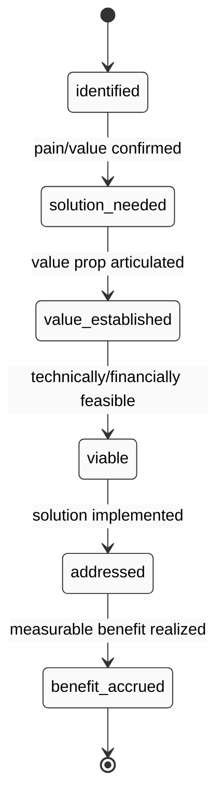

# Opportunity — state graph

```mermaid
%%{init: {'theme':'base', 'themeVariables': {'primaryTextColor':'#000000','lineColor':'#333333','primaryBorderColor':'#333333','primaryColor':'#fafafa'}}}%%
stateDiagram-v2
    [*] --> identified
    identified --> solution_needed: pain/value confirmed
    solution_needed --> value_established: value prop articulated
    value_established --> viable: technically/financially feasible
    viable --> addressed: solution implemented
    addressed --> benefit_accrued: measurable benefit realized
    benefit_accrued --> [*]
```

Cross-ref: `hypotheses/alphas/opportunity.md`
