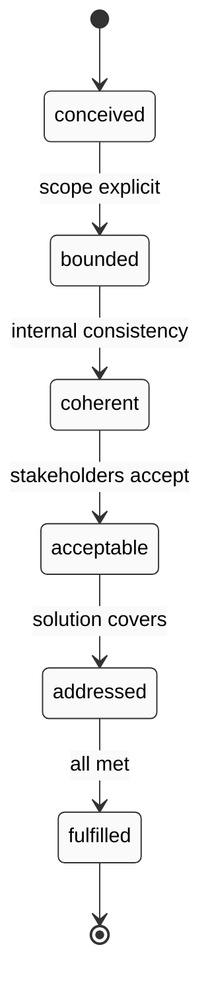

# Requirements — state graph

```mermaid
%%{init: {'theme':'base', 'themeVariables': {'primaryTextColor':'#000000','lineColor':'#333333','primaryBorderColor':'#333333','primaryColor':'#fafafa'}}}%%
stateDiagram-v2
    [*] --> conceived
    conceived --> bounded: scope explicit
    bounded --> coherent: internal consistency
    coherent --> acceptable: stakeholders accept
    acceptable --> addressed: solution covers
    addressed --> fulfilled: all met
    fulfilled --> [*]
```

Cross-ref: `hypotheses/alphas/requirements.md`
