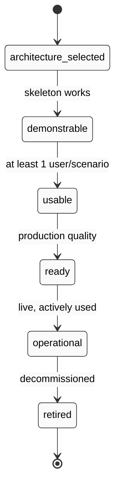

# Software-System — state graph (Jetix-adapted: any artefact)

```mermaid
%%{init: {'theme':'base', 'themeVariables': {'primaryTextColor':'#000000','lineColor':'#333333','primaryBorderColor':'#333333','primaryColor':'#fafafa'}}}%%
stateDiagram-v2
    [*] --> architecture_selected
    architecture_selected --> demonstrable: skeleton works
    demonstrable --> usable: at least 1 user/scenario
    usable --> ready: production quality
    ready --> operational: live, actively used
    operational --> retired: decommissioned
    retired --> [*]
```

Cross-ref: `hypotheses/alphas/software-system.md`
